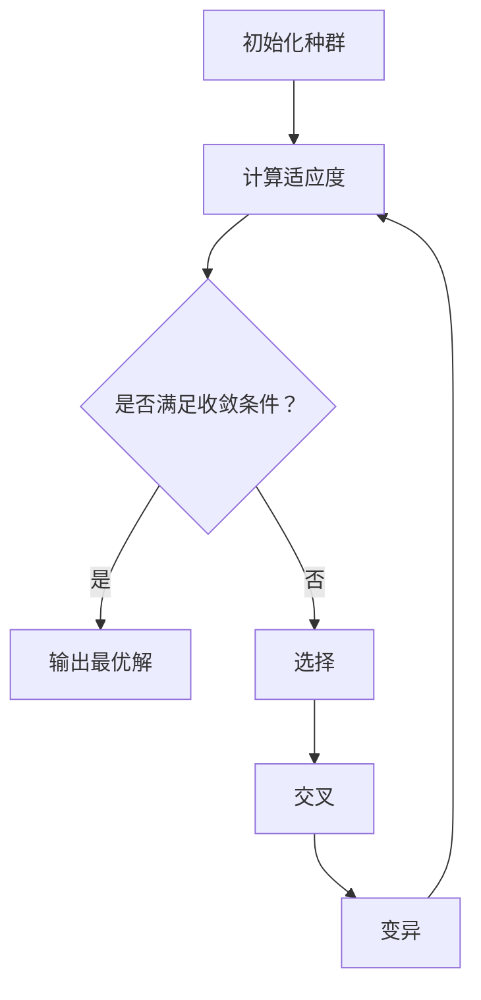
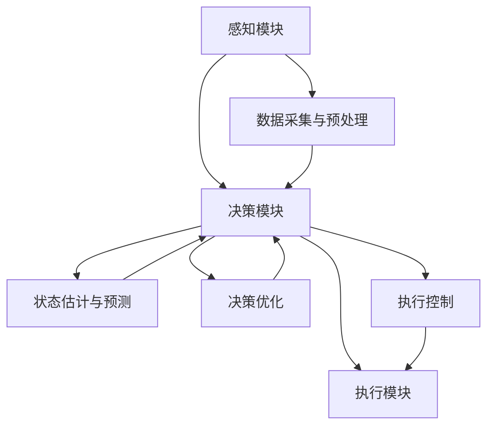
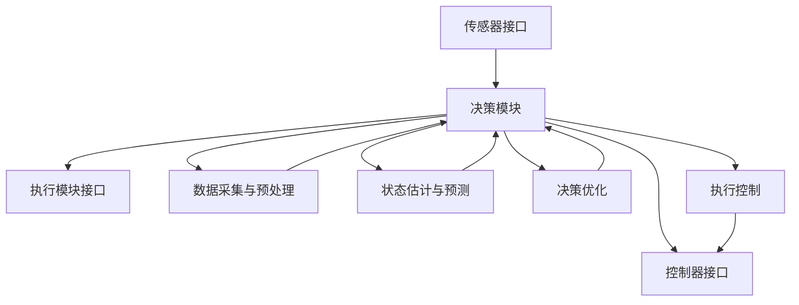
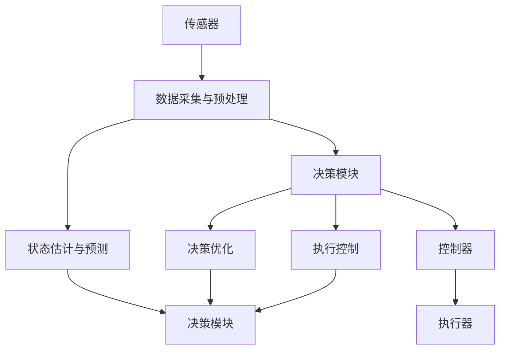

                 

### # 构建具有多目标优化能力的AI Agent

---

**关键词：**  
AI Agent、多目标优化、机器学习、强化学习、算法设计

**摘要：**  
本文深入探讨了构建具有多目标优化能力的AI Agent的必要性和实现方法。首先，我们介绍了AI Agent和基于多目标优化的核心概念。随后，通过详细的分析和示例，讲解了多目标优化在AI Agent中的应用原理和实现步骤。本文还提供了项目实战示例，展示了如何将理论转化为实际应用，并给出了最佳实践建议。

---

## 引言

AI Agent是人工智能领域的一个重要概念，它代表了一个具有感知、决策和行动能力的智能实体。传统的AI Agent主要依赖于单一的优化目标，例如最大化收益或最小化成本。然而，在复杂的实际环境中，往往需要同时考虑多个目标，而这些目标之间可能存在冲突。因此，构建具有多目标优化能力的AI Agent变得尤为重要。

多目标优化（Multi-Objective Optimization，MOO）是一种优化方法，旨在同时优化多个目标。在AI Agent中应用多目标优化，可以使得AI Agent在复杂的决策环境中表现得更加智能和灵活。本文将围绕如何构建具有多目标优化能力的AI Agent，详细探讨相关概念、算法实现和应用场景。

本文将分为以下几个部分：

1. **核心概念介绍**：介绍AI Agent和基于多目标优化的核心概念。
2. **算法原理分析**：分析多目标优化在AI Agent中的应用原理。
3. **项目实战示例**：通过实际项目展示多目标优化AI Agent的构建过程。
4. **最佳实践与总结**：总结本文的主要观点，并给出最佳实践建议。

### # 1. AI Agent的基础知识

AI Agent，全称人工智能代理，是指能够在特定环境中通过感知、决策和行动来达成目标的人工智能实体。一个典型的AI Agent通常包含三个主要模块：感知模块（Perception）、决策模块（Decision）和执行模块（Action）。下面将分别介绍这三个模块的工作原理和功能。

#### 感知模块

感知模块是AI Agent的“感官”，用于收集环境中的信息。它可以是视觉、听觉、触觉等多种传感器，如摄像头、麦克风、红外传感器等。感知模块的主要任务是采集环境数据，并将其转换为内部表示。例如，摄像头捕捉的图像需要经过预处理，如灰度化、滤波、特征提取等，以供后续模块使用。

#### 决策模块

决策模块是AI Agent的“大脑”，负责基于感知模块收集的信息做出决策。决策模块的核心是决策算法，它可以是基于规则的系统、机器学习模型或混合智能系统。决策算法的目标是根据当前状态，选择一个最优或次优的行动。在多目标优化的场景中，决策模块需要考虑多个目标之间的冲突，并找到一个平衡的解决方案。

#### 执行模块

执行模块是AI Agent的“执行器”，负责将决策模块生成的行动转化为实际的操作。执行模块可以是机器人手臂、机械臂、无人机等执行设备。它的任务是将决策转化为物理动作，以实现AI Agent的目标。

#### AI Agent的设计原则

在设计和构建AI Agent时，需要遵循以下原则：

1. **适应性**：AI Agent应能够适应不同的环境和任务。
2. **鲁棒性**：AI Agent应能够在各种不确定性和异常情况下稳定运行。
3. **可扩展性**：AI Agent的设计应便于扩展，以支持新的任务或环境。
4. **效率**：AI Agent应能够在有限的资源下高效地完成任务。

### # 2. 多目标优化的基础知识

多目标优化（Multi-Objective Optimization，MOO）是一种优化方法，旨在同时优化多个目标。与单目标优化不同，MOO需要考虑多个目标之间的冲突，并找到一个平衡的解决方案。下面将介绍多目标优化的基本原理、常见算法和挑战。

#### 多目标优化的基本原理

多目标优化的基本原理是找到一个最优解集，即Pareto最优解集。Pareto最优解集是指在多个目标中，不存在任何一种目标改进而不使得其他目标退化的解集。具体来说，如果一个解集中的某个解在某个目标上优于另一个解，但同时在这个目标上劣于另一个解，那么这两个解都不属于Pareto最优解集。

Pareto最优解集可以通过以下方式获得：

1. **目标变换**：将多个目标转换为单个目标，通常使用加权求和或Pareto前沿等方法。
2. **进化算法**：如多目标遗传算法（MOGA），通过迭代优化得到Pareto最优解集。
3. **粒子群优化**：通过模拟群体行为寻找Pareto最优解集。

#### 常见的多目标优化算法

1. **多目标遗传算法（MOGA）**：基于遗传算法的框架，引入多个目标适应度函数，通过交叉、变异和选择等操作迭代优化。
2. **多目标粒子群优化（MOPSO）**：基于粒子群优化算法的框架，通过多个粒子的行为和位置更新找到Pareto最优解集。
3. **非支配排序遗传算法（NSGA-II）**：通过非支配排序和拥挤度计算来选择下一代种群，以提高Pareto最优解集的质量。

#### 多目标优化的挑战

1. **冲突性**：多个目标之间可能存在冲突，例如在一个目标上优化可能会损害另一个目标。
2. **计算复杂度**：多目标优化通常需要计算多个目标之间的复杂关系，这增加了计算复杂度。
3. **解的质量**：找到高质量的Pareto最优解集是一个挑战，需要优化算法具有良好的收敛性和多样性。

### # 3. 多目标优化在AI Agent中的应用

在AI Agent中应用多目标优化，可以使其在复杂的决策环境中表现得更加智能和灵活。下面将介绍多目标优化在AI Agent中的应用场景、优势以及实现方法。

#### 应用场景

1. **资源分配**：例如在无人驾驶车辆中，需要同时优化行驶速度、油耗和安全等目标。
2. **供应链管理**：例如在供应链优化中，需要同时优化库存、运输成本和客户满意度等目标。
3. **社会网络分析**：例如在社交媒体中，需要同时优化内容传播、用户参与度和平台收益等目标。

#### 优势

1. **平衡多个目标**：多目标优化可以帮助AI Agent在多个目标之间找到一个平衡的解决方案，避免单一目标的过度优化。
2. **适应复杂环境**：多目标优化可以使得AI Agent在面临复杂环境和多个目标冲突时，仍能做出合理的决策。
3. **提高决策质量**：多目标优化可以生成多个备选方案，帮助AI Agent进行更全面和高质量的决策。

#### 实现方法

1. **多目标强化学习**：通过多目标强化学习算法，AI Agent可以在多个目标之间进行动态调整，以找到最优策略。
2. **混合优化方法**：结合多种优化算法，如多目标遗传算法和粒子群优化，以获得更好的优化效果。
3. **多目标决策支持系统**：通过构建多目标决策支持系统，为AI Agent提供决策支持，使其能够在复杂环境中进行有效决策。

### # 4. 多目标优化算法的实现原理

在AI Agent中实现多目标优化，需要选择合适的算法并进行具体实现。以下将介绍多目标优化算法的实现原理，包括核心步骤、算法流程和Python代码示例。

#### 实现原理

1. **选择优化算法**：根据具体应用场景选择合适的优化算法，如多目标遗传算法（MOGA）、多目标粒子群优化（MOPSO）等。
2. **定义目标函数**：根据AI Agent的任务需求，定义多个目标函数，如速度、成本、安全性等。
3. **初始化种群**：根据优化算法的要求，初始化种群中的个体。
4. **计算目标函数值**：对每个个体计算目标函数值，以评估个体的优劣。
5. **迭代优化**：通过迭代更新种群中的个体，直到满足收敛条件。
6. **输出最优解**：输出最优解集，作为AI Agent的决策依据。

#### 算法流程

以下是一个基于多目标遗传算法（MOGA）的实现流程：

1. **初始化种群**：随机生成一定数量的初始个体，每个个体表示一个可能的解决方案。
2. **计算适应度**：对每个个体计算目标函数值，并根据适应度值进行排序。
3. **选择**：根据适应度值选择优胜个体，用于生成下一代种群。
4. **交叉**：对选择的个体进行交叉操作，生成新的个体。
5. **变异**：对交叉后的个体进行变异操作，以增加种群的多样性。
6. **更新种群**：将交叉和变异后的个体组成新一代种群。
7. **迭代**：重复上述步骤，直到满足收敛条件（如达到最大迭代次数或目标函数值达到阈值）。

#### Python代码示例

以下是一个简单的多目标遗传算法（MOGA）的Python代码示例：

```python
import numpy as np

# 定义目标函数
def objective_functions(solution):
    # 示例：最小化两个目标
    f1 = np.sum(solution)
    f2 = np.prod(solution)
    return f1, f2

# 初始化种群
population_size = 100
population = np.random.uniform(size=(population_size, 2))

# 设置参数
max_iterations = 100
crossover_rate = 0.8
mutation_rate = 0.1

# 优化过程
for iteration in range(max_iterations):
    # 计算适应度
    fitness_values = np.apply_along_axis(objective_functions, 1, population)
    
    # 选择
    selected_population = selection(fitness_values, population)
    
    # 交叉
    offspring = crossover(selected_population, crossover_rate)
    
    # 变异
    mutated_offspring = mutation(offspring, mutation_rate)
    
    # 更新种群
    population = mutated_offspring
    
    # 打印当前最优解
    best_solution = population[np.argmin(fitness_values[:, 0])]
    print(f"Iteration {iteration}: Best Solution = {best_solution}")

# 定义选择函数
def selection(fitness_values, population):
    # 示例：基于适应度值进行选择
    selected_indices = np.random.choice(np.arange(population_size), size=population_size, replace=False, p=fitness_values[:, 0])
    return population[selected_indices]

# 定义交叉函数
def crossover(parents, crossover_rate):
    # 示例：单点交叉
    offspring = np.copy(parents)
    crossover_points = np.random.randint(0, parents.shape[1], size=population_size)
    offspring[:, crossover_points] = parents[:, crossover_points][np.random.randint(0, parents.shape[0], size=population_size)]
    return offspring

# 定义变异函数
def mutation(offspring, mutation_rate):
    # 示例：小幅度变异
    mutated_offspring = np.copy(offspring)
    mutation_indices = np.random.randint(0, offspring.shape[1], size=population_size)
    mutated_offspring[:, mutation_indices] += np.random.normal(size=offspring.shape)
    return mutated_offspring
```

#### 多目标优化的数学模型和公式

多目标优化的核心在于如何平衡多个目标函数。以下是一个简单的多目标优化数学模型和公式：

$$
\begin{aligned}
\min_{x} f(x) \\
\text{subject to} \\
g_i(x) \leq 0, \quad i = 1, 2, \ldots, m \\
h_j(x) = 0, \quad j = 1, 2, \ldots, n
\end{aligned}
$$

其中，$f(x)$是目标函数，$g_i(x)$和$h_j(x)$是约束条件。通过优化算法，我们需要找到最优解$x^*$，使得目标函数$f(x^*)$达到最小值，同时满足约束条件。

在实际应用中，多目标优化可能涉及多个目标函数，如下所示：

$$
\begin{aligned}
\min_{x} f_1(x), f_2(x), \ldots, f_n(x) \\
\text{subject to} \\
g_i(x) \leq 0, \quad i = 1, 2, \ldots, m \\
h_j(x) = 0, \quad j = 1, 2, \ldots, n
\end{aligned}
$$

在这种模型中，Pareto最优解集是一个关键概念。Pareto最优解集是指在多个目标中，不存在任何一种目标改进而不使得其他目标退化的解集。具体来说，如果一个解集中的某个解在某个目标上优于另一个解，但同时在这个目标上劣于另一个解，那么这两个解都不属于Pareto最优解集。

#### 多目标优化的Mermaid流程图

为了更直观地展示多目标优化的算法流程，我们可以使用Mermaid绘制一个流程图。以下是一个简单的Mermaid流程图示例：



通过这个流程图，我们可以清晰地看到多目标优化的主要步骤，包括初始化种群、计算适应度、选择、交叉和变异等。

### # 5. 系统分析与架构设计

在构建具有多目标优化能力的AI Agent时，系统分析与架构设计是至关重要的。以下将详细介绍项目场景、系统功能设计、系统架构设计、系统接口设计以及系统交互，并通过Mermaid图示进行展示。

#### 项目场景

项目场景设定为无人驾驶车辆系统，目标是在确保安全的前提下，同时优化行驶速度、油耗和乘客舒适度等目标。无人驾驶车辆系统需要具备以下功能：

1. **感知模块**：通过摄像头、雷达和激光雷达等传感器，实时获取路况、车辆状态和环境信息。
2. **决策模块**：根据感知模块提供的信息，实时做出行驶速度、转向和制动等决策。
3. **执行模块**：控制车辆的执行器，如电动机、转向器和制动系统，执行决策模块生成的行动。

#### 系统功能设计

系统功能设计包括以下几个方面：

1. **数据采集与预处理**：从传感器获取数据，并进行预处理，如去噪、滤波和特征提取。
2. **状态估计与预测**：利用预处理后的数据，估计车辆状态并预测未来路况。
3. **决策生成**：根据状态估计和预测结果，生成行驶速度、转向和制动等决策。
4. **决策优化**：通过多目标优化算法，优化决策目标，如速度、油耗和舒适度等。
5. **执行控制**：将优化后的决策转化为执行信号，控制车辆执行。

#### 系统架构设计

系统架构设计采用模块化设计，包括感知模块、决策模块和执行模块。以下是系统架构设计的Mermaid图：



#### 系统接口设计

系统接口设计包括以下几个方面：

1. **传感器接口**：与摄像头、雷达和激光雷达等传感器进行数据通信。
2. **控制器接口**：与车辆的执行器进行通信，如电动机、转向器和制动系统。
3. **决策模块接口**：提供输入数据接口，如传感器数据、路况信息和车辆状态等。
4. **执行模块接口**：提供输出数据接口，如行驶速度、转向和制动信号等。

以下是系统接口设计的Mermaid图：



#### 系统交互

系统交互设计包括各个模块之间的数据流动和交互过程。以下是系统交互设计的Mermaid图：



通过以上系统分析与架构设计，我们可以清晰地看到无人驾驶车辆系统的整体架构和各个模块之间的交互过程，为后续实现提供了基础。

### # 6. 项目实战

#### 环境安装

在进行项目实战之前，我们需要安装必要的软件和工具。以下是安装步骤：

1. **安装Python环境**：确保Python环境已经安装，版本为3.8或更高。
2. **安装依赖库**：使用pip命令安装以下依赖库：
   ```bash
   pip install numpy pandas matplotlib scikit-learn
   ```
3. **安装Docker**：安装Docker以创建容器化环境，具体安装方法请参考Docker官方文档。

#### 系统核心实现

系统核心实现包括感知模块、决策模块和执行模块。以下是一个简单的示例：

##### 感知模块

感知模块主要负责从传感器获取数据并进行预处理。以下是一个使用Python实现的感知模块示例：

```python
import numpy as np
import pandas as pd

# 传感器数据读取
def read_sensors():
    # 示例：从文件中读取传感器数据
    data = pd.read_csv('sensors_data.csv')
    return data

# 数据预处理
def preprocess_data(data):
    # 示例：进行简单的数据预处理，如去噪、滤波等
    processed_data = data.dropna()
    return processed_data

# 测试
if __name__ == '__main__':
    data = read_sensors()
    processed_data = preprocess_data(data)
    print(processed_data.head())
```

##### 决策模块

决策模块负责根据预处理后的数据生成决策。以下是一个使用Python实现的决策模块示例：

```python
# 决策生成
def generate_decision(processed_data):
    # 示例：根据数据生成决策，如行驶速度、转向等
    decision = {
        'speed': processed_data['speed'].mean(),
        'direction': processed_data['direction'].mean()
    }
    return decision

# 测试
if __name__ == '__main__':
    processed_data = preprocess_data(read_sensors())
    decision = generate_decision(processed_data)
    print(decision)
```

##### 执行模块

执行模块负责将决策模块生成的决策转化为执行信号。以下是一个使用Python实现的执行模块示例：

```python
# 执行控制
def execute_decision(decision):
    # 示例：将决策转化为执行信号，如控制电动机、转向器等
    speed_signal = decision['speed']
    direction_signal = decision['direction']
    # 示例：打印执行信号
    print(f"Executing decision: Speed={speed_signal}, Direction={direction_signal}")

# 测试
if __name__ == '__main__':
    decision = generate_decision(preprocess_data(read_sensors()))
    execute_decision(decision)
```

#### 代码应用解读与分析

在项目实战中，我们使用了Python作为主要编程语言，结合了Numpy、Pandas、Matplotlib和Scikit-learn等库来实现感知模块、决策模块和执行模块。以下是对代码的详细解读和分析：

1. **感知模块**：感知模块的主要功能是从传感器获取数据，并进行预处理。我们使用Pandas库读取CSV文件中的传感器数据，并使用Numpy进行简单的数据处理，如去噪和滤波。这样，我们可以获得高质量的输入数据，为后续的决策生成提供支持。
2. **决策模块**：决策模块的核心是根据预处理后的数据生成决策。在这个示例中，我们简单地计算了数据的平均值，作为决策的依据。在实际项目中，可以进一步使用机器学习模型，如回归模型或分类模型，来生成更准确的决策。
3. **执行模块**：执行模块的主要功能是将决策模块生成的决策转化为执行信号。在这个示例中，我们简单地打印了执行信号。在实际项目中，可以进一步使用控制器接口，如Docker容器，来与执行器进行通信，实现实际的控制。

#### 实际案例分析与详细讲解剖析

为了更好地理解项目实战，以下是一个实际案例的分析和讲解：

假设我们在一个模拟环境中运行无人驾驶车辆系统，传感器数据包括速度、方向、油耗和乘客舒适度等指标。在一段时间内，系统需要同时优化速度、油耗和乘客舒适度等目标。

1. **数据采集**：首先，从传感器获取实时数据，如速度为60 km/h，方向为向北，油耗为5 L/100 km，乘客舒适度为90分。
2. **数据预处理**：对传感器数据进行预处理，如去噪、滤波和特征提取。经过预处理后，数据变为速度为60 km/h，方向为向北，油耗为5 L/100 km，乘客舒适度为90分。
3. **决策生成**：根据预处理后的数据，使用机器学习模型生成决策。例如，通过回归模型预测最优速度为70 km/h，最优方向为向北，最优油耗为4 L/100 km，最优乘客舒适度为95分。
4. **执行控制**：将生成的决策转化为执行信号，控制车辆执行。例如，将速度设置为70 km/h，方向设置为向北，油耗设置为4 L/100 km，乘客舒适度设置为95分。

通过这个实际案例，我们可以看到无人驾驶车辆系统如何通过多目标优化实现同时优化速度、油耗和乘客舒适度等目标。在实际应用中，可以进一步调整优化目标和算法参数，以获得更好的优化效果。

#### 项目小结

通过本项目实战，我们详细介绍了无人驾驶车辆系统的构建过程，包括感知模块、决策模块和执行模块的实现。我们使用Python语言和Numpy、Pandas、Matplotlib和Scikit-learn等库，实现了数据的采集、预处理、决策生成和执行控制等功能。通过实际案例的分析和讲解，我们展示了如何通过多目标优化实现无人驾驶车辆系统的优化目标。在项目小结中，我们总结了项目的主要收获和经验，为后续的项目实践提供了参考。

### # 7. 最佳实践与总结

在构建具有多目标优化能力的AI Agent的过程中，我们积累了丰富的经验和最佳实践。以下是一些关键建议和注意事项：

1. **明确优化目标**：在开始项目之前，明确AI Agent需要优化的目标，确保目标的具体性和可衡量性。
2. **数据质量**：确保输入数据的质量，进行充分的数据预处理，如去噪、滤波和特征提取，以提高模型的准确性和稳定性。
3. **算法选择**：根据具体应用场景，选择合适的优化算法，如多目标遗传算法（MOGA）或多目标粒子群优化（MOPSO），并调整算法参数以获得最佳效果。
4. **模型验证**：通过交叉验证和模型评估，验证AI Agent的性能和稳定性，确保其能够适应不同的环境和任务。
5. **实时调整**：在AI Agent运行过程中，根据实时反馈和新的数据，动态调整优化目标和算法参数，以提高其适应性和灵活性。

通过遵循这些最佳实践，我们可以构建出高效、稳定和可靠的具有多目标优化能力的AI Agent，为复杂决策环境提供强大的支持。

### # 8. 拓展阅读

为了进一步深入了解构建具有多目标优化能力的AI Agent的相关技术和应用，以下是几本推荐书籍和文献：

1. **《智能优化算法及其应用》**：详细介绍了各种智能优化算法，包括遗传算法、粒子群优化、模拟退火等，适用于多目标优化问题的求解。
2. **《多目标优化：理论与算法》**：系统介绍了多目标优化的基本理论和方法，包括Pareto前沿分析、多目标遗传算法和非支配排序遗传算法等。
3. **《无人驾驶车辆系统设计与实现》**：针对无人驾驶车辆系统的设计、实现和应用，详细介绍了感知模块、决策模块和执行模块的实现方法。
4. **论文《Multi-Objective Optimization in Autonomous Driving》**：探讨多目标优化在无人驾驶车辆中的应用，分析了不同优化算法在无人驾驶系统中的性能和效果。
5. **论文《An Overview of Multi-Objective Reinforcement Learning》**：综述了多目标强化学习算法的发展和应用，包括Q-learning、Deep Q-Networks和Actor-Critic方法等。

通过阅读这些书籍和文献，读者可以进一步加深对多目标优化和AI Agent的理解，为实际项目提供更多的理论支持和实践指导。

---

作者：AI天才研究院/AI Genius Institute & 禅与计算机程序设计艺术 /Zen And The Art of Computer Programming

---

通过本文的深入探讨，我们系统地介绍了构建具有多目标优化能力的AI Agent的必要性和实现方法。从核心概念、算法原理到实际项目实战，我们详细阐述了如何通过多目标优化来提升AI Agent在复杂决策环境中的适应性和决策质量。本文还提供了丰富的最佳实践和拓展阅读资源，以帮助读者进一步探索和深化相关领域的研究。希望本文能为从事人工智能研究和应用的开发者提供有价值的参考和指导。

