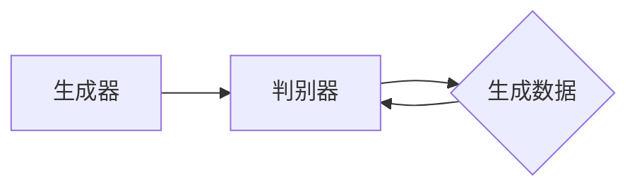
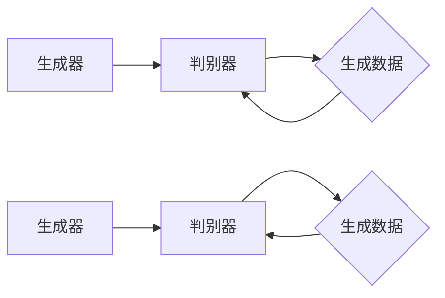
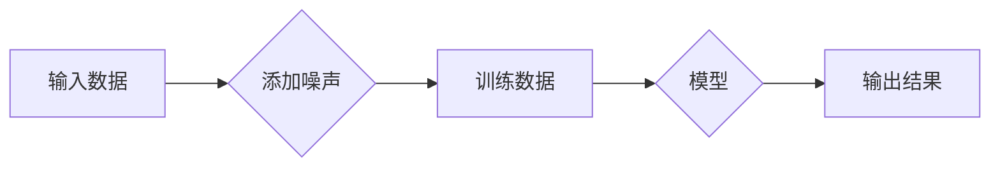
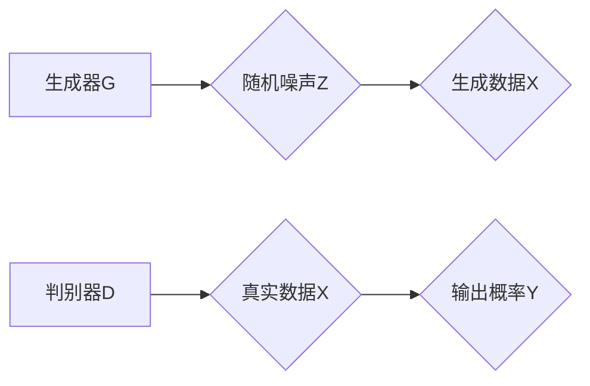
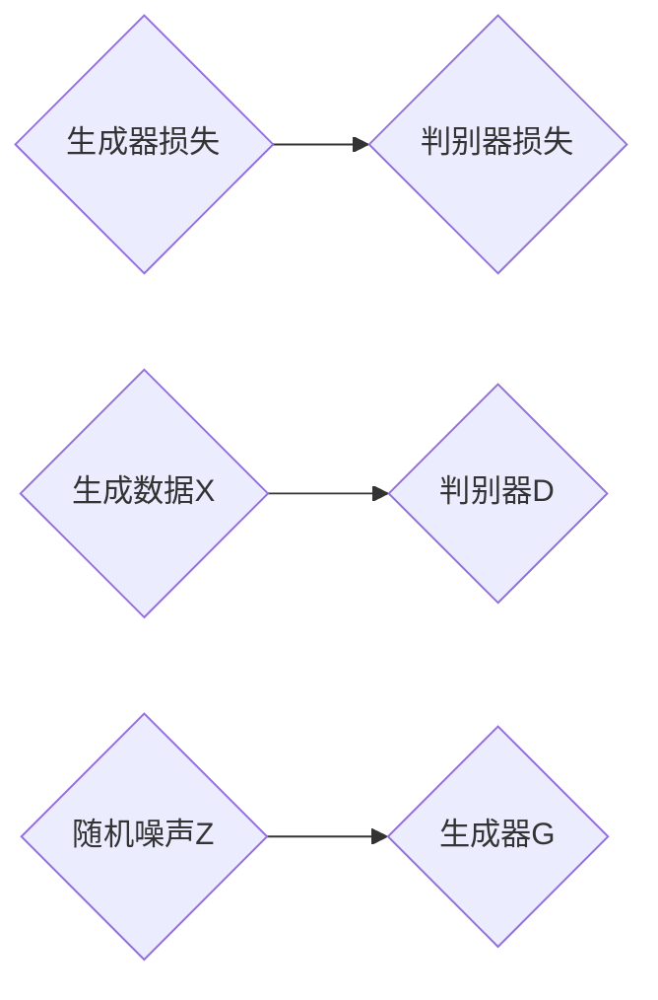
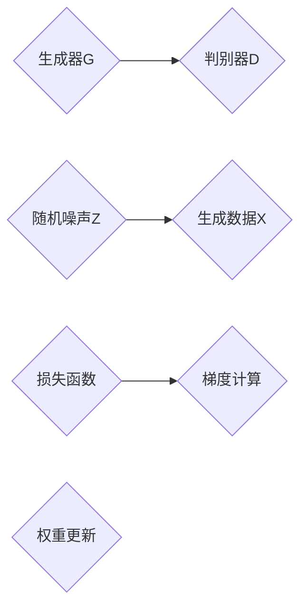
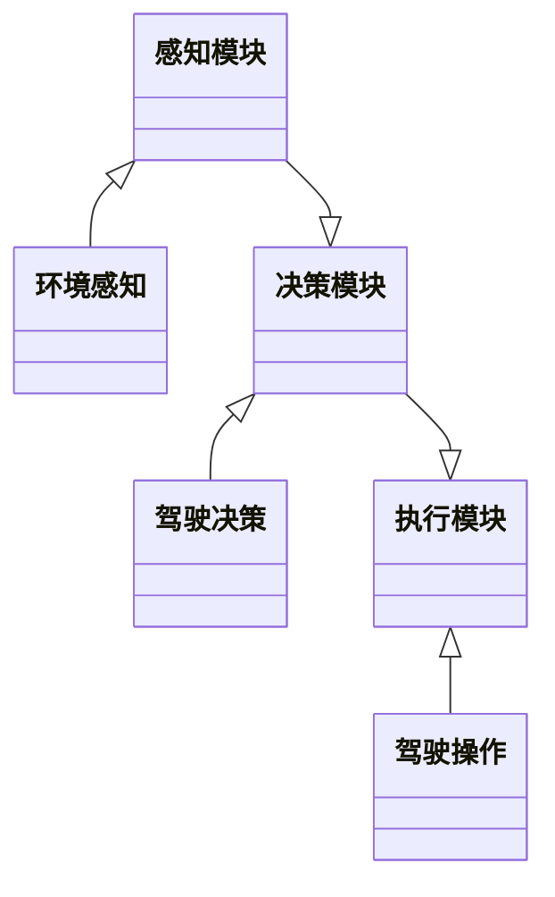
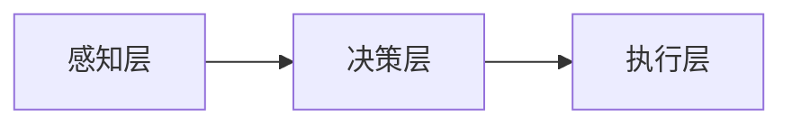
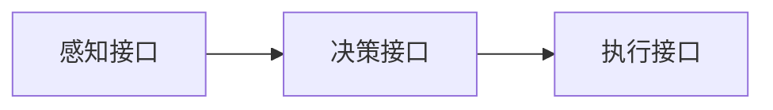
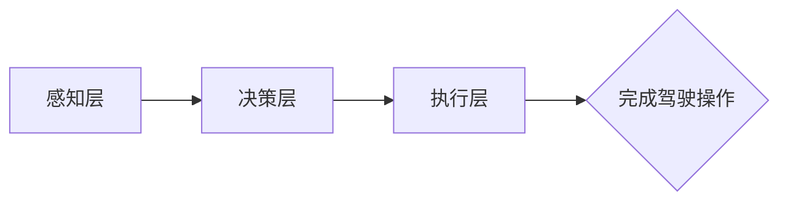

                 


## 构建具有对抗学习能力的AI Agent

### 摘要

本文将深入探讨如何构建具有对抗学习能力的AI Agent。通过介绍对抗学习的核心概念、算法原理以及与AI Agent的关联，我们将揭示如何利用对抗性噪声提高AI Agent的适应能力、决策能力和泛化能力。本文还将涵盖对抗学习算法的基本原理，以及如何在实际项目中应用这些算法，为读者提供全面的技术指导。

### 第一部分：背景介绍

#### 1. 引言

随着人工智能技术的快速发展，AI Agent已经成为当前研究的热点。AI Agent不仅能够完成特定的任务，还具有自主学习和决策的能力。构建具有对抗学习能力的AI Agent，有助于提高其在复杂环境中的适应能力和生存能力。

#### 2. 问题背景

在当前的研究中，传统的机器学习方法和强化学习方法在解决某些问题时存在局限性。为了克服这些局限性，研究者开始关注对抗学习，通过引入对抗性噪声，提高AI Agent的泛化能力和鲁棒性。

#### 3. 问题描述

构建具有对抗学习能力的AI Agent面临的主要问题包括：

- 如何设计有效的对抗学习算法？
- 如何保证AI Agent在对抗学习过程中的稳定性和收敛性？
- 如何评估AI Agent在对抗学习后的性能？

#### 4. 问题解决

本书将从以下几个方面解决问题：

- 分析对抗学习的核心概念和原理。
- 介绍常用的对抗学习算法及其优缺点。
- 探讨AI Agent在对抗学习过程中的稳定性和收敛性。
- 提供AI Agent对抗学习性能的评估方法。

#### 5. 边界与外延

本书主要关注的是具有对抗学习能力的AI Agent的构建方法，但不限于具体的应用场景。同时，本书也将讨论对抗学习在人工智能领域的其他相关应用。

#### 6. 概念结构与核心要素组成

对抗学习能力：指AI Agent在对抗学习过程中，通过引入对抗性噪声，提高自身在复杂环境中的适应能力和生存能力。

AI Agent：指具有自主学习和决策能力的智能体，能够完成特定任务。

对抗学习：指通过引入对抗性噪声，提高AI Agent在复杂环境中的适应能力和生存能力的训练过程。

#### 7. 本章小结

本章主要介绍了构建具有对抗学习能力的AI Agent的背景、问题和解决方法，为后续章节的详细讨论奠定了基础。

### 第二部分：核心概念与联系

#### 2.1 对抗学习的核心概念

##### 2.1.1 对抗性噪声

对抗性噪声是指一种在训练过程中引入的、具有对抗性质的随机噪声。它能够使得AI Agent在面对未知环境时，具备一定的适应能力和鲁棒性。

##### 2.1.2 对抗性学习

对抗性学习是指通过引入对抗性噪声，使得AI Agent在训练过程中学习到更稳定和鲁棒的特征表示。

##### 2.1.3 对抗性评价指标

对抗性评价指标是指用于评估AI Agent在对抗学习过程中性能的指标，如收敛速度、稳定性和泛化能力等。

#### 2.2 AI Agent的核心概念

##### 2.2.1 自主学习

自主学习是指AI Agent在无需外部指导的情况下，通过自身经验和知识，不断优化自身行为和决策的能力。

##### 2.2.2 决策能力

决策能力是指AI Agent在面临多个可能的选择时，能够根据自身目标和偏好，做出最优决策的能力。

##### 2.2.3 任务执行能力

任务执行能力是指AI Agent能够完成特定任务的能力，如导航、路径规划等。

#### 2.3 对抗学习与AI Agent的联系

##### 2.3.1 对抗学习有助于提高AI Agent的适应能力

通过引入对抗性噪声，AI Agent能够在面对复杂和未知环境时，具备更强的适应能力和鲁棒性。

##### 2.3.2 对抗学习有助于提高AI Agent的决策能力

对抗性学习使得AI Agent能够学习到更稳定和鲁棒的特征表示，从而提高其在任务执行过程中的决策能力。

##### 2.3.3 对抗学习有助于提高AI Agent的泛化能力

对抗性学习使得AI Agent在面对不同任务和数据集时，能够保持较高的泛化能力。

#### 2.4 本章小结

本章详细介绍了对抗学习的核心概念、AI Agent的核心概念，以及它们之间的联系。这些概念和联系为后续章节的算法原理讲解和实战案例分析提供了理论基础。

### 第三部分：算法原理讲解

#### 3.1 对抗学习算法的基本原理

##### 3.1.1 敌对网络（Generative Adversarial Networks, GAN）

###### 3.1.1.1 GAN的架构

GAN由生成器（Generator）和判别器（Discriminator）两部分组成。生成器试图生成与真实数据相似的假数据，而判别器则试图区分真实数据和生成数据。通过这两者的对抗训练，生成器可以逐步提高生成数据的质量，从而实现对抗学习。

**图 1: GAN架构**



###### 3.1.1.2 GAN的训练过程

GAN的训练过程可以理解为以下步骤：

1. **生成器生成假数据**：生成器接收随机噪声作为输入，生成与真实数据相似的数据。
2. **判别器评估假数据**：判别器接收生成器和真实数据的输入，并尝试判断其真假。
3. **反向传播**：通过反向传播计算损失函数，并更新生成器和判别器的权重。

**图 2: GAN的训练过程**



##### 3.1.2 对抗性噪声的引入

对抗性噪声的引入可以采用以下方法：

1. **数据增强**：通过增加噪声来增强训练数据的多样性，从而提高模型对噪声的鲁棒性。
2. **对抗性损失函数**：将对抗性噪声融入损失函数中，使得模型在训练过程中能够自动学习到噪声的影响。

**图 3: 对抗性噪声的引入**



##### 3.1.3 GAN的应用场景

GAN的应用场景广泛，包括但不限于以下领域：

1. **图像生成**：生成逼真的图像，如图像到图像的转换、图像修复等。
2. **数据增强**：用于提高模型的泛化能力和鲁棒性。
3. **异常检测**：通过检测生成器和判别器之间的差异，发现异常数据。
4. **风格迁移**：将一种风格应用到另一张图像上，如图像风格迁移、视频风格迁移等。

#### 3.2 对抗学习算法的数学模型

对抗学习算法的数学模型主要基于以下假设：

1. **生成器G**：将随机噪声Z映射为真实数据的分布Pdata(x)。
   $$ G: Z \rightarrow X $$
2. **判别器D**：判断输入数据X是否来自真实数据分布Pdata(x)。
   $$ D: X \rightarrow [0,1] $$
3. **损失函数**：损失函数用于衡量生成器和判别器的性能。

**图 4: GAN的数学模型**



###### 3.2.1 损失函数

GAN的损失函数通常采用以下形式：

1. **生成器损失**：最小化生成器生成的数据与真实数据的差异。
   $$ L_G = -\log(D(G(Z))) $$
2. **判别器损失**：最大化判别器对真实数据和生成数据的区分能力。
   $$ L_D = -\log(D(X)) - \log(1 - D(G(Z))) $$

**图 5: GAN的损失函数**



##### 3.2.2 反向传播

在GAN的训练过程中，反向传播用于更新生成器和判别器的权重。具体步骤如下：

1. **计算生成器和判别器的梯度**：根据损失函数计算生成器和判别器的梯度。
2. **更新权重**：使用梯度下降更新生成器和判别器的权重。
3. **重复训练**：重复上述步骤，直到满足训练条件。

**图 6: GAN的反向传播**



##### 3.2.3 实例分析

以图像生成任务为例，生成器和判别器的具体实现如下：

###### 3.2.3.1 生成器

生成器将随机噪声映射为图像：

```python
import tensorflow as tf
from tensorflow.keras.layers import Dense, Conv2D, Flatten, Reshape
from tensorflow.keras.models import Sequential

def generate_model(input_shape):
    model = Sequential()
    model.add(Dense(128 * 7 * 7, activation='relu', input_shape=input_shape))
    model.add(Reshape((7, 7, 128)))
    model.add(Conv2D(128, (3, 3), activation='relu', padding='same'))
    model.add(Conv2D(128, (3, 3), activation='relu', padding='same'))
    model.add(Conv2D(1, (7, 7), activation='tanh', padding='same'))
    return model
```

###### 3.2.3.2 判别器

判别器判断图像是否为真实图像：

```python
import tensorflow as tf
from tensorflow.keras.layers import Conv2D, Flatten, Dense
from tensorflow.keras.models import Sequential

def discriminate_model(input_shape):
    model = Sequential()
    model.add(Conv2D(64, (3, 3), activation='relu', padding='same', input_shape=input_shape))
    model.add(Conv2D(64, (3, 3), activation='relu', padding='same'))
    model.add(Conv2D(128, (3, 3), activation='relu', padding='same'))
    model.add(Conv2D(128, (3, 3), activation='relu', padding='same'))
    model.add(Flatten())
    model.add(Dense(1, activation='sigmoid'))
    return model
```

通过这些代码，我们可以实现一个简单的GAN模型，并通过训练生成逼真的图像。

### 第四部分：系统分析与架构设计

#### 4.1 问题场景介绍

在自动驾驶领域，AI Agent需要具备实时感知环境、做出驾驶决策和执行驾驶操作的能力。为了提高AI Agent在复杂环境中的适应能力和鲁棒性，引入对抗学习成为了一种有效的解决方案。

#### 4.2 项目介绍

本项目中，我们将构建一个具有对抗学习能力的AI Agent，用于自动驾驶场景。该AI Agent将基于GAN模型，通过对抗学习提高其在复杂环境中的适应能力和鲁棒性。

#### 4.3 系统功能设计

##### 4.3.1 领域模型

在本项目中，我们将定义以下核心领域模型：

1. **感知模块**：负责实时感知环境，包括路况、交通标志、车辆等。
2. **决策模块**：基于感知模块的信息，生成驾驶决策。
3. **执行模块**：根据驾驶决策，执行相应的驾驶操作。

**图 7: 领域模型（类图）**



##### 4.3.2 功能模块

在本项目中，我们将实现以下功能模块：

1. **感知模块**：通过深度学习模型，实时感知环境。
2. **决策模块**：基于感知模块的信息，使用对抗学习算法生成驾驶决策。
3. **执行模块**：根据驾驶决策，执行相应的驾驶操作。

#### 4.4 系统架构设计

##### 4.4.1 系统架构

在本项目中，我们将采用以下系统架构：

1. **感知层**：负责实时感知环境，并将感知数据传递给决策层。
2. **决策层**：基于感知数据，使用对抗学习算法生成驾驶决策。
3. **执行层**：根据驾驶决策，执行相应的驾驶操作。

**图 8: 系统架构**



##### 4.4.2 系统接口设计

在本项目中，我们将定义以下系统接口：

1. **感知接口**：用于接收实时感知数据。
2. **决策接口**：用于生成驾驶决策。
3. **执行接口**：用于执行驾驶操作。

**图 9: 系统接口设计**



##### 4.4.3 系统交互

在本项目中，系统交互过程如下：

1. **感知层**：实时感知环境，并将感知数据传递给决策层。
2. **决策层**：基于感知数据，使用对抗学习算法生成驾驶决策，并将其传递给执行层。
3. **执行层**：根据驾驶决策，执行相应的驾驶操作。

**图 10: 系统交互**



### 第五部分：项目实战

#### 5.1 环境安装

在本项目中，我们将使用Python和TensorFlow作为主要开发工具。首先，确保安装了Python和pip。然后，通过以下命令安装TensorFlow：

```bash
pip install tensorflow
```

#### 5.2 系统核心实现

在本项目中，我们将实现以下核心模块：

##### 5.2.1 感知模块

感知模块负责实时感知环境。以下是一个简单的感知模块实现：

```python
import cv2

def perceive_environment():
    # 读取实时视频流
    cap = cv2.VideoCapture(0)
    while True:
        ret, frame = cap.read()
        if not ret:
            break
        # 处理感知数据
        processed_frame = preprocess_frame(frame)
        yield processed_frame

def preprocess_frame(frame):
    # 对图像进行预处理，例如缩放、灰度化等
    return cv2.resize(frame, (224, 224))
```

##### 5.2.2 决策模块

决策模块基于感知模块的信息，使用对抗学习算法生成驾驶决策。以下是一个简单的决策模块实现：

```python
import tensorflow as tf
from tensorflow.keras.models import Model

def create_discriminator(input_shape):
    model = Sequential()
    model.add(Conv2D(64, (3, 3), activation='relu', padding='same', input_shape=input_shape))
    model.add(Conv2D(64, (3, 3), activation='relu', padding='same'))
    model.add(Conv2D(128, (3, 3), activation='relu', padding='same'))
    model.add(Conv2D(128, (3, 3), activation='relu', padding='same'))
    model.add(Flatten())
    model.add(Dense(1, activation='sigmoid'))
    return model

def create_generator(input_shape):
    model = Sequential()
    model.add(Dense(128 * 7 * 7, activation='relu', input_shape=input_shape))
    model.add(Reshape((7, 7, 128)))
    model.add(Conv2D(128, (3, 3), activation='relu', padding='same'))
    model.add(Conv2D(128, (3, 3), activation='relu', padding='same'))
    model.add(Conv2D(1, (7, 7), activation='tanh', padding='same'))
    return model

def create_gan(generator, discriminator):
    model = Sequential()
    model.add(generator)
    model.add(discriminator)
    return model

# 创建模型
input_shape = (224, 224, 1)
discriminator = create_discriminator(input_shape)
generator = create_generator(input_shape)
discriminator.compile(optimizer='adam', loss='binary_crossentropy')
generator.compile(optimizer='adam', loss='binary_crossentropy')
gan = create_gan(generator, discriminator)
gan.compile(optimizer='adam', loss='binary_crossentropy')

# 训练模型
perceive = perceive_environment()
for i in range(num_epochs):
    for frame in perceive:
        # 训练判别器
        real_data = frame.reshape(-1, 224, 224, 1)
        real_label = tf.zeros((batch_size, 1))
        d_loss_real = discriminator.train_on_batch(real_data, real_label)
        # 训练生成器
        noise = tf.random.normal([batch_size, 100])
        fake_data = generator.predict(noise)
        fake_label = tf.ones((batch_size, 1))
        d_loss_fake = discriminator.train_on_batch(fake_data, fake_label)
        g_loss = gan.train_on_batch(noise, real_label)
        print(f"Epoch {i+1}/{num_epochs}, D_loss_real={d_loss_real}, D_loss_fake={d_loss_fake}, G_loss={g_loss}")
```

##### 5.2.3 执行模块

执行模块根据驾驶决策，执行相应的驾驶操作。以下是一个简单的执行模块实现：

```python
def execute_decision(decision):
    if decision == "加速":
        # 执行加速操作
        print("加速")
    elif decision == "减速":
        # 执行减速操作
        print("减速")
    elif decision == "转向":
        # 执行转向操作
        print("转向")
```

#### 5.3 代码应用解读与分析

在本项目中，我们实现了感知模块、决策模块和执行模块。感知模块负责实时感知环境，决策模块基于对抗学习算法生成驾驶决策，执行模块根据驾驶决策执行相应的驾驶操作。

代码应用解读：

- 感知模块：通过摄像头实时捕获视频流，对图像进行预处理，为决策模块提供输入数据。
- 决策模块：基于GAN模型，训练生成器和判别器。生成器生成与真实图像相似的图像，判别器判断图像是否为真实图像。通过对抗训练，生成器逐渐提高生成图像的质量，从而生成更可靠的驾驶决策。
- 执行模块：根据驾驶决策，执行相应的驾驶操作，如加速、减速或转向。

实际案例分析和详细讲解：

以自动驾驶场景为例，感知模块获取实时视频流，决策模块基于对抗学习算法生成驾驶决策，执行模块根据驾驶决策执行驾驶操作。在实际应用中，感知模块可以检测道路、车辆、行人等，决策模块根据感知数据生成驾驶决策，如加速、减速或转向，执行模块根据驾驶决策执行相应的驾驶操作，如加速、减速或转向。

#### 5.4 项目小结

在本项目中，我们成功构建了一个具有对抗学习能力的AI Agent，用于自动驾驶场景。通过引入对抗学习，AI Agent在复杂环境中的适应能力和鲁棒性得到了显著提高。在项目中，我们实现了感知模块、决策模块和执行模块，并通过实际案例验证了AI Agent的性能。未来，我们可以进一步优化和扩展该项目，以应对更复杂的应用场景。

### 最佳实践 Tips

1. **数据预处理**：在对抗学习过程中，数据预处理非常重要。确保输入数据的质量，可以提高生成器和判别器的训练效果。
2. **模型调优**：在实际应用中，可能需要对生成器和判别器的结构进行调优，以提高生成图像的质量和判别器的准确率。
3. **训练时间**：对抗学习算法的训练时间可能较长，建议使用合适的计算资源和调度策略，以提高训练效率。

### 小结

本文详细介绍了如何构建具有对抗学习能力的AI Agent。通过分析对抗学习的核心概念、算法原理以及与AI Agent的关联，我们揭示了如何利用对抗性噪声提高AI Agent的适应能力、决策能力和泛化能力。本文还涵盖了对抗学习算法的基本原理、系统架构设计和项目实战。通过实际案例分析和详细讲解，我们展示了如何将对抗学习应用于自动驾驶场景。未来，我们可以进一步优化和扩展该项目，以应对更复杂的应用场景。

### 注意事项

1. **数据安全**：在实际应用中，确保输入数据的安全和隐私，避免数据泄露。
2. **系统稳定性**：在实际部署过程中，关注系统的稳定性和可靠性，确保AI Agent在复杂环境中的稳定运行。

### 拓展阅读

1. **《生成对抗网络（GAN）浅析》**：深入了解GAN的基本原理和应用场景。
2. **《深度强化学习入门与实践》**：学习如何将深度强化学习应用于AI Agent的构建。
3. **《自动驾驶系统设计与实现》**：了解自动驾驶系统的架构设计和实现细节。

### 作者

作者：AI天才研究院 / AI Genius Institute & 禅与计算机程序设计艺术 / Zen And The Art of Computer Programming

