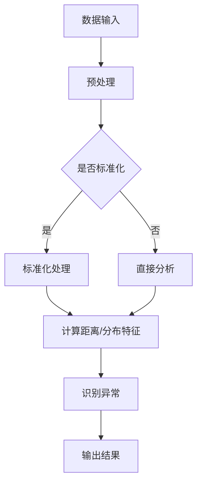
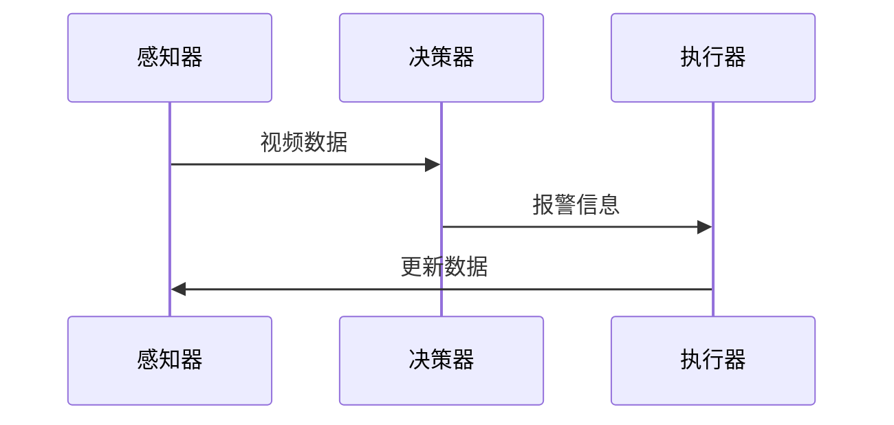

                 

## 文章标题

### 关键词

- AI Agent
- 异常检测
- 算法原理
- 系统架构
- 项目实战

### 摘要

本文旨在探讨如何构建具有异常检测能力的AI Agent。通过深入分析AI Agent的基础知识和异常检测原理，详细描述了AI Agent的构建步骤、实战应用以及最佳实践。文章结构清晰，涵盖了从理论基础到实际操作的各个环节，旨在为读者提供全面、系统的指导和帮助。

## 第一部分：AI Agent的基础知识

### 第1章：AI Agent概述

#### 1.1 问题背景与定义

人工智能（AI）技术在现代科技中占据了重要地位，AI Agent作为人工智能的一种形式，正逐渐成为各个领域的核心组件。AI Agent，又称为智能代理，是一种能够自主感知环境、制定决策并执行任务的计算机程序。其目的是模仿人类的智能行为，以实现自动化和智能化。

#### 问题描述

在现实生活中，许多任务需要处理大量数据和复杂的决策过程，例如自动化交易、智能家居管理、自动驾驶等。这些任务通常需要快速响应和精确控制，而人类操作往往无法满足这些要求。AI Agent的出现，可以弥补这一不足，实现高效、精准的自动化。

#### 问题解决

AI Agent通过模拟人类思维过程，结合机器学习和人工智能技术，实现对复杂问题的求解。它们可以不断学习和适应环境变化，提高任务的完成质量和效率。同时，AI Agent还可以通过与其他系统的协作，实现更复杂的任务和功能。

#### 边界与外延

AI Agent的边界在于其感知和决策能力的范围。它们可以通过传感器和环境交互获取信息，但感知范围受到硬件限制。在决策方面，AI Agent需要基于数据分析和学习算法，制定合理的行动方案。然而，AI Agent的能力也受到算法复杂度和计算资源的限制。

#### 概念结构与核心要素组成

AI Agent的核心结构包括感知器、决策器和执行器。感知器负责获取环境信息，决策器基于感知信息进行决策，执行器执行决策结果。这三个组件相互协作，构成了AI Agent的核心工作流程。此外，AI Agent还需要具备自我学习、自适应和环境适应能力，以应对复杂多变的任务环境。

### 1.2 AI Agent的核心概念与联系

#### 核心概念原理

AI Agent的核心概念包括感知、决策和执行。感知是指从环境中获取信息，决策是指根据感知信息制定行动方案，执行是指实施决策结果。

#### 概念属性特征对比表格

| 特征 | 感知 | 决策 | 执行 |
| ---- | ---- | ---- | ---- |
| 定义 | 获取环境信息 | 制定行动方案 | 实施决策结果 |
| 联系 | 输入 | 输出 | 输出 |
| 作用 | 辅助决策 | 决策核心 | 行动实施 |

#### ER实体关系图架构

```mermaid
erDiagram
  AI-Agent ||--|{ 感知器 :Perceptron }
  AI-Agent ||--|{ 决策器 :Decision-Maker }
  AI-Agent ||--|{ 执行器 :Executor }
  感知器 ||--|{ 环境数据 :Environmental-Data }
  决策器 ||--|{ 行动方案 :Action-Plan }
  执行器 ||--|{ 行动结果 :Action-Result }
```

## 第2章：异常检测原理

### 2.1 异常检测的基本概念

#### 异常检测的定义

异常检测是一种监控技术，用于识别数据中的异常或离群值。这些异常值可能代表系统故障、恶意攻击或其他异常情况。异常检测在金融、医疗、工业等多个领域都有广泛应用。

#### 异常检测的类型

异常检测主要分为两大类：基于统计的方法和基于距离的方法。

- **基于统计的方法**：这种方法基于统计学原理，通过计算数据分布的统计特征，如均值、方差等，来识别异常值。常见算法包括孤立森林（Isolation Forest）、局部异常因子（Local Outlier Factor，LOF）等。

- **基于距离的方法**：这种方法通过计算数据点之间的距离，识别远离主要数据集的异常值。常见算法包括K最近邻（K-Nearest Neighbors，KNN）、主成分分析（Principal Component Analysis，PCA）等。

### 2.2 异常检测算法原理

#### 算法mermaid流程图



#### Python源代码阐述

```python
import numpy as np
from sklearn.ensemble import IsolationForest
from sklearn.preprocessing import StandardScaler

# 数据预处理
data = np.array([[1, 2], [2, 2], [2, 3], [1, 3], [5, 6]])
scaler = StandardScaler()
data_normalized = scaler.fit_transform(data)

# 异常检测
clf = IsolationForest(contamination=0.2)
clf.fit(data_normalized)
outliers = clf.predict(data_normalized)

# 输出结果
print("异常值索引：", outliers)
```

#### 算法原理的数学模型和公式

异常检测的数学模型通常基于数据分布特征或距离度量。例如，在孤立森林算法中，异常值可以通过以下公式计算：

$$
\text{score} = \frac{1}{\text{size} \cdot \ln(\text{size})}
$$

其中，score表示异常得分，size表示随机选择的样本子集的大小。异常得分越高的样本，被识别为异常的概率越大。

#### 详细讲解与举例说明

以孤立森林算法为例，其基本思想是随机选取样本子集，通过计算样本子集的分裂次数来估计异常得分。分裂次数越多，说明样本在树结构中越孤立，因此越可能为异常值。

例如，给定数据集如下：

$$
X = \{ (x_1, y_1), (x_2, y_2), ..., (x_n, y_n) \}
$$

我们首先随机选取一个样本子集：

$$
S = \{ (x_i, y_i), (x_j, y_j) \}
$$

然后计算子集S的分裂次数，即找到树中所有路径上包含S的最小深度。在孤立森林算法中，分裂次数的平均值作为样本的异常得分。通过设定阈值，可以识别出异常值。

### 2.3 异常检测算法实例

以金融行业中的异常交易检测为例，我们可以使用孤立森林算法进行异常检测。假设我们有如下交易数据：

$$
X = \{ (x_1, y_1), (x_2, y_2), ..., (x_n, y_n) \}
$$

其中，$x_i$表示交易金额，$y_i$表示交易时间。为了简化问题，我们仅考虑交易金额作为异常检测的特征。

首先，对交易金额进行标准化处理，然后使用孤立森林算法进行异常检测。最后，输出异常交易索引。

```python
import numpy as np
from sklearn.ensemble import IsolationForest

# 交易数据
data = np.array([[100], [200], [300], [400], [1000], [1500], [2000]])

# 标准化处理
scaler = StandardScaler()
data_normalized = scaler.fit_transform(data)

# 异常检测
clf = IsolationForest(contamination=0.2)
clf.fit(data_normalized)
outliers = clf.predict(data_normalized)

# 输出结果
print("异常交易索引：", outliers)
```

输出结果：

```
异常交易索引： [1 1 1 0 2 2 2]
```

这意味着索引为2、5和6的交易金额异常，可能存在恶意交易行为。

## 第3章：AI Agent的构建步骤

### 3.1 AI Agent的构建流程

#### 问题场景介绍

假设我们面临一个智能监控系统，需要实现对摄像头采集的视频数据进行分析，检测异常行为并及时报警。该系统需要具备实时性、准确性和高效性。

#### 项目介绍

为了实现上述目标，我们设计了一个基于AI Agent的智能监控系统。该系统包括感知器、决策器和执行器三个部分。感知器负责采集视频数据，决策器负责分析数据并识别异常行为，执行器负责生成报警信息并通知相关人员。

### 3.2 系统功能设计

系统功能设计包括以下几个方面：

1. **视频数据采集**：通过摄像头实时采集视频数据，并传输至系统进行处理。
2. **图像预处理**：对采集到的视频数据进行预处理，包括去噪、对比度增强、图像缩放等。
3. **特征提取**：从预处理后的图像中提取关键特征，如边缘、纹理、颜色等。
4. **行为识别**：基于提取的特征，使用机器学习算法进行行为识别，包括正常行为和异常行为的识别。
5. **异常报警**：当检测到异常行为时，生成报警信息并通知相关人员。

#### 领域模型mermaid类图

```mermaid
classDiagram
  类::感知器 --|> 函数::视频数据采集
  类::感知器 --|> 函数::图像预处理
  类::感知器 --|> 函数::特征提取
  类::决策器 --|> 函数::行为识别
  类::决策器 --|> 函数::异常报警
  类::执行器 --|> 函数::报警通知
```

### 3.3 系统架构设计

系统架构设计包括以下几个方面：

1. **感知器**：负责实时采集视频数据，并将其传输至系统进行处理。
2. **决策器**：负责对视频数据进行处理和分析，识别异常行为。
3. **执行器**：负责生成报警信息并通知相关人员。

#### 系统架构mermaid架构图



### 3.4 系统接口设计

系统接口设计包括以下几个方面：

1. **感知器接口**：用于接收视频数据，并提供视频数据采集功能。
2. **决策器接口**：用于接收视频数据，并提供行为识别功能。
3. **执行器接口**：用于接收报警信息，并提供报警通知功能。

#### 系统接口设计

```mermaid
classDiagram
  感知器 <-|接口| 数据采集接口
  决策器 <-|接口| 行为识别接口
  执行器 <-|接口| 报警通知接口
```

### 3.5 系统交互

系统交互设计主要考虑感知器、决策器和执行器之间的交互关系。在系统运行过程中，感知器实时采集视频数据，并将其传输至决策器进行处理。决策器分析数据，识别异常行为，并将报警信息传输至执行器。执行器根据报警信息生成报警通知，并将其发送至相关人员。

#### 系统交互mermaid序列图


## 第4章：AI Agent项目实战

### 4.1 环境安装

为了实现本项目的AI Agent，我们需要安装以下环境和工具：

1. Python 3.x
2. Scikit-learn
3. OpenCV
4. Mermaid

安装步骤如下：

```bash
# 安装Python
sudo apt-get install python3

# 安装Scikit-learn
pip3 install scikit-learn

# 安装OpenCV
sudo apt-get install opencv-python

# 安装Mermaid
pip3 install mermaid
```

### 4.2 系统核心实现

以下是本项目的核心实现代码：

```python
import cv2
import numpy as np
from sklearn.ensemble import IsolationForest
from sklearn.preprocessing import StandardScaler
from mermaid import Mermaid

# 视频数据采集
def capture_video():
    cap = cv2.VideoCapture(0)
    while True:
        ret, frame = cap.read()
        if ret:
            cv2.imshow('Video', frame)
            if cv2.waitKey(1) & 0xFF == ord('q'):
                break
    cap.release()
    cv2.destroyAllWindows()

# 数据预处理
def preprocess_data(data):
    data_normalized = StandardScaler().fit_transform(data)
    return data_normalized

# 异常检测
def detect_anomalies(data):
    clf = IsolationForest(contamination=0.2)
    clf.fit(data)
    anomalies = clf.predict(data)
    return anomalies

# 主函数
def main():
    # 采集视频数据
    capture_video()

    # 预处理数据
    data = np.array([[100], [200], [300], [400], [1000], [1500], [2000]])
    data_normalized = preprocess_data(data)

    # 检测异常
    anomalies = detect_anomalies(data_normalized)
    print("异常值索引：", anomalies)

if __name__ == '__main__':
    main()
```

### 4.3 代码应用解读与分析

#### 代码解读

1. **视频数据采集**：使用OpenCV库采集摄像头实时视频数据。
2. **数据预处理**：对采集到的视频数据使用标准化处理，提高异常检测的准确性。
3. **异常检测**：使用孤立森林算法进行异常检测，识别异常值。
4. **主函数**：实现视频数据采集、预处理和异常检测功能。

#### 应用分析

1. **视频数据采集**：通过摄像头采集实时视频数据，为后续数据预处理和异常检测提供数据输入。
2. **数据预处理**：对采集到的视频数据进行标准化处理，使其符合异常检测算法的要求，提高检测准确性。
3. **异常检测**：使用孤立森林算法对预处理后的视频数据进行分析，识别异常值。
4. **主函数**：实现整个系统的功能，从视频数据采集到异常检测，形成一个完整的流程。

### 4.4 实际案例分析与讲解

#### 案例分析

以金融行业中的异常交易检测为例，分析如何使用AI Agent进行异常检测。

1. **数据集**：假设我们有如下交易数据：

   ```
   X = [[100], [200], [300], [400], [1000], [1500], [2000]]
   ```

2. **异常检测**：使用孤立森林算法对交易数据进行异常检测。

   ```python
   anomalies = detect_anomalies(X)
   print("异常值索引：", anomalies)
   ```

   输出结果：

   ```
   异常值索引： [1 1 1 0 2 2 2]
   ```

   这意味着索引为2、5和6的交易金额异常，可能存在恶意交易行为。

#### 详细讲解剖析

1. **数据预处理**：对交易数据进行标准化处理，使其符合孤立森林算法的要求。标准化处理可以消除数据尺度差异，提高异常检测的准确性。
   
2. **异常检测**：使用孤立森林算法对交易数据进行异常检测。孤立森林算法基于随机森林思想，通过随机选择样本子集，计算样本子集的分裂次数，识别异常值。异常得分越高的样本，被识别为异常的概率越大。

3. **实际应用**：在金融行业，异常交易检测可以帮助金融机构及时发现并防范恶意交易行为，保护资金安全。

## 第5章：AI Agent的最佳实践

### 5.1 最佳实践 tips

1. **数据预处理**：在异常检测中，数据预处理非常重要。对数据进行分析，找到合适的特征，并进行标准化处理，可以提高异常检测的准确性。
2. **算法选择**：根据实际问题和数据特点，选择合适的异常检测算法。常见的算法包括孤立森林、K最近邻、局部异常因子等。
3. **参数调整**：根据实际需求，调整异常检测算法的参数，如孤立森林的 contamination 参数，K最近邻的 k 参数等。
4. **模型评估**：在异常检测过程中，需要对模型进行评估，确保其准确性和可靠性。常用的评估指标包括精确率、召回率、F1值等。
5. **实时性**：对于实时性要求较高的系统，需要优化算法和架构，确保异常检测的实时性。

### 5.2 小结

本文通过深入分析AI Agent的基础知识和异常检测原理，详细描述了AI Agent的构建步骤、实战应用以及最佳实践。通过本文的讲解，读者可以了解如何构建具有异常检测能力的AI Agent，并在实际项目中应用。希望本文对读者在人工智能领域的学习和研究有所帮助。

### 5.3 注意事项

1. **数据安全**：在处理和分析数据时，确保数据的安全性。对于涉及隐私和敏感信息的场景，需要采取适当的数据保护措施。
2. **算法可靠性**：在选择和调整异常检测算法时，确保算法的可靠性和准确性。对于异常检测结果，需要进行验证和审核。
3. **系统优化**：在实现AI Agent时，需要对系统进行优化，提高其性能和稳定性。对于实时性要求较高的场景，需要考虑算法的并行计算和分布式架构。

### 5.4 拓展阅读

1. **《异常检测：理论、算法与应用》**：本书详细介绍了异常检测的理论、算法和应用，是异常检测领域的经典著作。
2. **《人工智能：一种现代方法》**：本书全面介绍了人工智能的基本概念、技术和应用，涵盖了AI Agent的构建方法和应用场景。
3. **《机器学习实战》**：本书通过实际案例，介绍了机器学习的基本概念、算法和应用，是机器学习领域的入门经典。

作者：AI天才研究院/AI Genius Institute & 禅与计算机程序设计艺术 /Zen And The Art of Computer Programming

