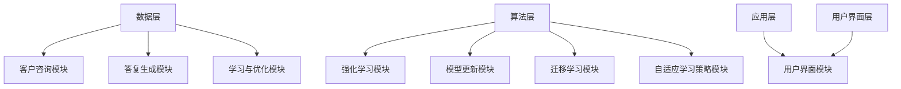
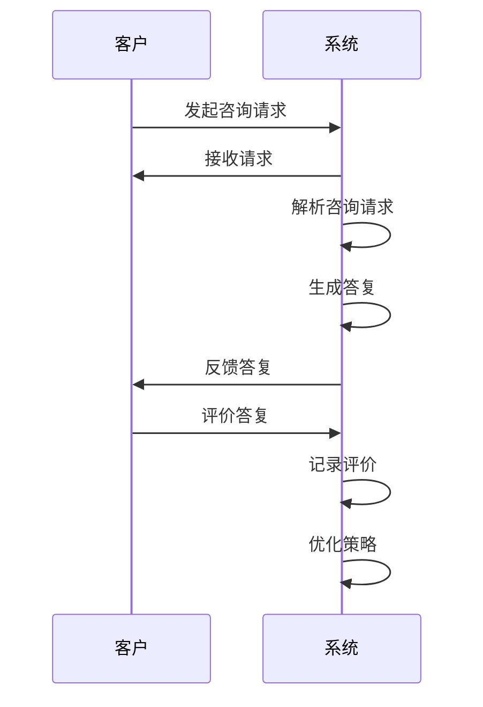

                 


# 构建具有持续优化能力的AI Agent

关键词：AI Agent、持续优化、强化学习、模型更新、迁移学习、自适应学习策略

摘要：随着人工智能技术的快速发展，AI Agent作为一种智能体，逐渐成为智能系统中的重要组成部分。本文旨在探讨如何构建具有持续优化能力的AI Agent，以提升其在复杂环境中的适应能力和表现。本文首先介绍问题背景和问题描述，然后探讨强化学习、模型更新与迁移学习以及自适应学习策略等核心概念，最后通过一个实际案例来说明如何构建具有持续优化能力的AI Agent。

----------------------------------------------------------------

## 第一部分：背景介绍与核心概念

### 1.1 问题背景

随着人工智能技术的快速发展，AI Agent作为一种智能体，逐渐成为智能系统中的重要组成部分。AI Agent是一种能够感知环境、自主决策并执行任务的智能体。然而，在实际应用中，AI Agent面临着持续优化能力的问题。持续优化能力是指AI Agent在运行过程中能够不断学习、适应并优化自身行为，从而提高其性能和适应能力。

### 1.2 问题描述

AI Agent在面临环境变化和不确定性时，往往需要调整其行为策略以适应新情况。然而，传统的AI Agent在应对复杂环境和长期任务时，往往表现出学习效率低下、适应性差等问题。为了解决这些问题，我们需要构建具有持续优化能力的AI Agent。

### 1.3 问题解决

为了构建具有持续优化能力的AI Agent，我们可以从以下几个方面入手：

1. 强化学习

强化学习是一种基于奖励和惩罚机制的学习方法，适用于解决连续决策问题。通过强化学习，AI Agent可以在与环境的交互过程中不断调整其策略，以实现持续优化。

2. 模型更新与迁移学习

模型更新和迁移学习技术可以帮助AI Agent在不同任务间共享知识，提高其泛化能力。通过不断更新模型和迁移学习，AI Agent可以在新任务中迅速适应并优化自身。

3. 自适应学习策略

自适应学习策略可以根据环境变化动态调整学习过程，从而提高AI Agent的持续优化能力。例如，基于目标值调整的学习率、自适应调整的探索-利用策略等。

### 1.4 边界与外延

本文主要关注具有持续优化能力的AI Agent在复杂环境中的应用。边界包括：

1. 环境复杂性

本文假设环境具有一定的复杂性，需要AI Agent通过持续优化来适应。

2. 数据可用性

本文假设在AI Agent的运行过程中，可以获得足够的数据用于模型更新和学习。

### 1.5 概念结构与核心要素组成

1. AI Agent

AI Agent是一种具有感知、决策和执行能力的智能体，能够在复杂环境中实现自主行为。

2. 强化学习

强化学习是一种基于奖励和惩罚机制的学习方法，适用于解决连续决策问题。

3. 模型更新与迁移学习

模型更新和迁移学习技术可以帮助AI Agent在不同任务间共享知识，提高其泛化能力。

4. 自适应学习策略

自适应学习策略可以根据环境变化动态调整学习过程，从而提高AI Agent的持续优化能力。

## 1.6 本章小结

本章介绍了构建具有持续优化能力的AI Agent的背景、问题描述、问题解决方法以及边界与外延。下一章将深入探讨核心概念与联系，为后续内容打下基础。

----------------------------------------------------------------

## 第二部分：核心概念与联系

### 2.1 强化学习原理

强化学习（Reinforcement Learning，RL）是机器学习的一个重要分支，它通过学习如何在特定环境中采取行动，以实现最大化累积奖励。强化学习主要涉及以下核心概念：

#### 2.1.1 状态（State）

状态是指智能体（AI Agent）在某一时刻所处的环境和情境的完整描述。在强化学习中，状态是一个多维的向量，可以用来表示环境的当前状态。

#### 2.1.2 动作（Action）

动作是指智能体在某一状态下可以采取的具体行动。动作的选择通常取决于智能体的当前状态和所采取的策略。

#### 2.1.3 奖励（Reward）

奖励是指环境对智能体采取某一动作后的即时反馈。奖励可以是正的（鼓励智能体继续采取该动作），也可以是负的（指示智能体停止采取该动作）。

#### 2.1.4 策略（Policy）

策略是指智能体在给定状态下选择动作的规则或函数。策略可以是固定的（如确定性策略），也可以是概率性的（如随机策略）。

#### 2.1.5 价值函数（Value Function）

价值函数是评估智能体在给定状态下采取特定动作所能获得的预期累积奖励。价值函数分为状态价值函数（V(s)）和动作价值函数（Q(s, a)）。

强化学习的核心目标是找到一种最优策略，使得智能体在长期运行中能够获得最大的累积奖励。以下是强化学习的流程：

```
初始化参数
while 没有达到目标：
    状态 s = 环境初始状态
    while 没有达到终止条件：
        选择动作 a = 策略(s)
        接收下一个状态 s' 和奖励 r = 环境.step(a)
        更新参数
        状态 s = s'
```

#### 2.1.6 Q-Learning

Q-Learning是一种常用的强化学习方法，它通过迭代更新Q值（动作价值函数）来逐步优化策略。Q-Learning的目标是找到最优的动作价值函数Q*，使得：

$$ Q^*(s, a) = \max_{a'} Q(s', a') $$

Q-Learning的更新规则如下：

$$ Q(s, a) \leftarrow Q(s, a) + \alpha [r + \gamma \max_{a'} Q(s', a') - Q(s, a)] $$

其中，$\alpha$是学习率，$\gamma$是折扣因子。

### 2.2 模型更新与迁移学习

#### 2.2.1 模型更新（Model Update）

模型更新是指通过训练和调整模型参数，使模型能够更好地适应新环境。在强化学习中，模型更新通常通过经验回放（Experience Replay）和目标网络（Target Network）等技术来实现。

经验回放技术允许智能体将过去经验存储到经验池中，并在训练过程中随机抽样进行回放。这有助于智能体避免陷入局部最优，提高学习效率。

目标网络是一种用于稳定学习过程的辅助网络。目标网络的参数是主网络参数的平滑移动平均。在每次迭代中，智能体会使用目标网络的目标值来更新主网络的参数。

#### 2.2.2 迁移学习（Transfer Learning）

迁移学习是指将一个任务（源任务）的学习经验应用于另一个相关任务（目标任务）的学习中。通过迁移学习，AI Agent可以在新任务中迅速适应并优化自身。

迁移学习的关键在于提取通用特征，这些特征在不同任务中具有通用性，有助于提高新任务的性能。常见的迁移学习方法包括特征重用、参数共享和模型蒸馏等。

### 2.3 自适应学习策略

#### 2.3.1 学习率调整

学习率是强化学习中一个重要的参数，它决定了智能体更新参数的步长。自适应调整学习率可以提高智能体的学习效率和稳定性。常见的自适应学习率调整方法包括自适应调整学习率（Adaptive Learning Rate）、恒定衰减学习率（Constant Decay Learning Rate）等。

#### 2.3.2 探索-利用策略

探索-利用策略是强化学习中的核心策略，它平衡了智能体的探索和利用行为。常见的探索-利用策略包括epsilon-greedy策略、UCB（Upper Confidence Bound）策略和Softmax策略等。

epsilon-greedy策略通过在探索阶段随机选择动作，在利用阶段选择最优动作来实现探索和利用的平衡。UCB策略通过估计每个动作的上界期望值来选择动作，从而实现探索和利用的平衡。

## 2.4 本章小结

本章介绍了强化学习的原理、模型更新与迁移学习以及自适应学习策略等核心概念。这些概念为构建具有持续优化能力的AI Agent提供了理论基础。下一章将深入探讨如何将这些核心概念应用于实际案例中。

----------------------------------------------------------------

## 第三部分：算法原理讲解

在构建具有持续优化能力的AI Agent时，强化学习、模型更新与迁移学习以及自适应学习策略是三个关键的技术点。下面我们将详细讲解这些算法的原理，并通过Python代码示例来阐述其实现过程。

### 3.1 强化学习原理讲解

强化学习（Reinforcement Learning，RL）是一种通过试错的方式，在环境中采取行动并从环境中获得反馈，以优化行为策略的机器学习方法。强化学习主要包括以下核心概念：

#### 3.1.1 状态（State）

状态是指智能体（Agent）在某一时刻所处的环境和情境的完整描述。在强化学习中，状态是一个多维的向量，可以用来表示环境的当前状态。

#### 3.1.2 动作（Action）

动作是指智能体在某一状态下可以采取的具体行动。动作的选择通常取决于智能体的当前状态和所采取的策略。

#### 3.1.3 奖励（Reward）

奖励是指环境对智能体采取某一动作后的即时反馈。奖励可以是正的（鼓励智能体继续采取该动作），也可以是负的（指示智能体停止采取该动作）。

#### 3.1.4 策略（Policy）

策略是指智能体在给定状态下选择动作的规则或函数。策略可以是固定的（如确定性策略），也可以是概率性的（如随机策略）。

#### 3.1.5 价值函数（Value Function）

价值函数是评估智能体在给定状态下采取特定动作所能获得的预期累积奖励。价值函数分为状态价值函数（V(s)）和动作价值函数（Q(s, a)）。

下面是一个简单的Python代码示例，展示了如何实现Q-Learning算法：

```python
import numpy as np
import random

# 状态空间
state_space = ["休息", "学习", "锻炼"]

# 动作空间
action_space = ["完成作业", "偷懒"]

# 奖励函数
reward_function = {"完成作业": 1, "偷懒": -1}

# 初始化Q值表
Q = np.zeros([len(state_space), len(action_space)])

# 学习率
alpha = 0.1

# 折扣因子
gamma = 0.9

# 最大迭代次数
max_iterations = 1000

# 迭代过程
for i in range(max_iterations):
    # 随机选择状态
    state = random.choice(state_space)
    # 选择动作
    action = random.choice(action_space)
    # 执行动作，获得奖励
    reward = reward_function[action]
    # 更新Q值
    Q[state][action] += alpha * (reward + gamma * np.max(Q) - Q[state][action])

# 输出最优策略
print("最优策略：")
print("状态：动作：奖励")
for state, action in enumerate(Q):
    print(f"{state_space[state]}：{action_space[np.argmax(action)]}：{np.max(action)}")
```

#### 3.1.6 Q-Learning算法

Q-Learning是一种基于价值迭代的强化学习算法。其核心思想是通过迭代更新Q值表，使得智能体能够逐渐学会在给定状态下选择最优动作。

Q-Learning的更新规则如下：

$$ Q(s, a) \leftarrow Q(s, a) + \alpha [r + \gamma \max_{a'} Q(s', a') - Q(s, a)] $$

其中，$\alpha$是学习率，$\gamma$是折扣因子。

### 3.2 模型更新与迁移学习

#### 3.2.1 模型更新

模型更新是指通过训练和调整模型参数，使模型能够更好地适应新环境。在强化学习中，模型更新通常通过经验回放（Experience Replay）和目标网络（Target Network）等技术来实现。

经验回放技术允许智能体将过去经验存储到经验池中，并在训练过程中随机抽样进行回放。这有助于智能体避免陷入局部最优，提高学习效率。

目标网络是一种用于稳定学习过程的辅助网络。目标网络的参数是主网络参数的平滑移动平均。在每次迭代中，智能体会使用目标网络的目标值来更新主网络的参数。

下面是一个简单的Python代码示例，展示了如何实现经验回放和目标网络：

```python
import numpy as np
import random

# 初始化经验池
experience_replay = []

# 目标网络参数
target_network_params = np.zeros([len(state_space), len(action_space)])

# 主网络参数
main_network_params = np.zeros([len(state_space), len(action_space)])

# 学习率
alpha = 0.1

# 折扣因子
gamma = 0.9

# 最大迭代次数
max_iterations = 1000

# 迭代过程
for i in range(max_iterations):
    # 从经验池中随机抽取一条经验
    state, action, reward, next_state, done = random.choice(experience_replay)
    # 计算目标值
    if done:
        target_value = reward
    else:
        target_value = reward + gamma * np.max(target_network_params[next_state])
    # 更新主网络参数
    main_network_params[state][action] += alpha * (target_value - main_network_params[state][action])
    # 更新目标网络参数
    target_network_params = gamma * target_network_params + (1 - gamma) * main_network_params

# 输出最优策略
print("最优策略：")
print("状态：动作：奖励")
for state, action in enumerate(main_network_params):
    print(f"{state_space[state]}：{action_space[np.argmax(action)]}：{np.max(action)}")
```

#### 3.2.2 迁移学习

迁移学习是指将一个任务（源任务）的学习经验应用于另一个相关任务（目标任务）的学习中。通过迁移学习，AI Agent可以在新任务中迅速适应并优化自身。

迁移学习的关键在于提取通用特征，这些特征在不同任务中具有通用性，有助于提高新任务的性能。常见的迁移学习方法包括特征重用、参数共享和模型蒸馏等。

下面是一个简单的Python代码示例，展示了如何实现特征重用：

```python
import numpy as np
import tensorflow as tf

# 初始化源任务模型
source_model = tf.keras.Sequential([
    tf.keras.layers.Dense(64, activation='relu', input_shape=[len(state_space)]),
    tf.keras.layers.Dense(64, activation='relu'),
    tf.keras.layers.Dense(len(action_space))
])

# 初始化目标任务模型
target_model = tf.keras.Sequential([
    tf.keras.layers.Dense(64, activation='relu', input_shape=[len(state_space)]),
    tf.keras.layers.Dense(64, activation='relu'),
    tf.keras.layers.Dense(len(action_space))
])

# 将源任务模型的权重复制到目标任务模型
target_model.set_weights(source_model.get_weights())

# 训练目标任务模型
for i in range(max_iterations):
    # 随机选择状态
    state = random.choice(state_space)
    # 随机选择动作
    action = random.choice(action_space)
    # 执行动作，获得奖励
    reward = reward_function[action]
    # 计算损失
    loss = tf.keras.backend.mean(tf.keras.backend.square(target_model(state) - reward))
    # 更新模型参数
    optimizer = tf.keras.optimizers.Adam(learning_rate=alpha)
    with tf.keras.backenditto():
        grads = optimizer.get_gradients(loss, target_model.trainable_variables)
        optimizer.apply_gradients(zip(grads, target_model.trainable_variables))

# 输出最优策略
print("最优策略：")
print("状态：动作：奖励")
for state, action in enumerate(target_model.predict(state_space)):
    print(f"{state_space[state]}：{action_space[np.argmax(action)]}：{np.max(action)}")
```

### 3.3 自适应学习策略

#### 3.3.1 学习率调整

学习率是强化学习中一个重要的参数，它决定了智能体更新参数的步长。自适应调整学习率可以提高智能体的学习效率和稳定性。常见的自适应学习率调整方法包括自适应调整学习率（Adaptive Learning Rate）、恒定衰减学习率（Constant Decay Learning Rate）等。

下面是一个简单的Python代码示例，展示了如何实现自适应调整学习率：

```python
import numpy as np

# 初始化学习率
learning_rate = 0.1

# 恒定衰减学习率
decay_rate = 0.001

# 迭代次数
max_iterations = 1000

# 迭代过程
for i in range(max_iterations):
    # 更新学习率
    learning_rate = learning_rate * (1 / (1 + decay_rate * i))
    # 更新Q值
    Q[state][action] += learning_rate * (reward + gamma * np.max(Q) - Q[state][action])

# 输出最优策略
print("最优策略：")
print("状态：动作：奖励")
for state, action in enumerate(Q):
    print(f"{state_space[state]}：{action_space[np.argmax(action)]}：{np.max(action)}")
```

#### 3.3.2 探索-利用策略

探索-利用策略是强化学习中的核心策略，它平衡了智能体的探索和利用行为。常见的探索-利用策略包括epsilon-greedy策略、UCB（Upper Confidence Bound）策略和Softmax策略等。

下面是一个简单的Python代码示例，展示了如何实现epsilon-greedy策略：

```python
import numpy as np
import random

# 初始epsilon
epsilon = 1.0

# 最终epsilon
epsilon_final = 0.01

# 最大迭代次数
max_iterations = 1000

# 迭代过程
for i in range(max_iterations):
    # 选择动作
    if random.random() < epsilon:
        action = random.choice(action_space)
    else:
        action = np.argmax(Q[state])
    # 执行动作，获得奖励
    reward = reward_function[action]
    # 更新Q值
    Q[state][action] += alpha * (reward + gamma * np.max(Q) - Q[state][action])
    # 更新状态
    state = next_state
    # 更新epsilon
    epsilon = epsilon_final / (i + 1)

# 输出最优策略
print("最优策略：")
print("状态：动作：奖励")
for state, action in enumerate(Q):
    print(f"{state_space[state]}：{action_space[np.argmax(action)]}：{np.max(action)}")
```

## 3.4 本章小结

本章详细讲解了强化学习、模型更新与迁移学习以及自适应学习策略的原理，并通过Python代码示例展示了这些算法的实现过程。这些算法为构建具有持续优化能力的AI Agent提供了重要的技术支持。下一章将介绍如何将上述算法应用于实际案例，以实现AI Agent的持续优化。

----------------------------------------------------------------

## 第四部分：系统分析与架构设计方案

在构建具有持续优化能力的AI Agent时，系统分析与架构设计是关键的一步。本节将介绍问题场景、项目介绍、系统功能设计、系统架构设计、系统接口设计和系统交互。

### 4.1 问题场景

假设我们正在开发一个智能客服系统，该系统需要处理大量的客户咨询，并提供快速、准确的答复。为了提高系统的性能和用户体验，我们需要构建一个具有持续优化能力的AI Agent，使其能够根据用户反馈和学习历史不断调整自己的行为和策略。

### 4.2 项目介绍

智能客服系统项目的主要目标是开发一个能够自动处理客户咨询的AI Agent，以提高客户服务的效率和质量。项目的主要功能包括：

- 接收客户咨询
- 解析客户咨询内容
- 提供合适的答复
- 学习用户反馈和咨询历史

### 4.3 系统功能设计

智能客服系统的功能设计可以分为以下几个模块：

- 客户咨询模块：负责接收客户咨询，并将咨询内容解析为结构化的数据。
- 答复生成模块：根据客户咨询内容，生成合适的答复。
- 学习与优化模块：根据用户反馈和咨询历史，不断调整AI Agent的行为和策略。
- 用户界面模块：提供与客户的交互界面，展示AI Agent的答复。

### 4.4 系统架构设计

智能客服系统的架构设计采用分层架构，主要包括以下几层：

- 数据层：负责存储客户咨询、答复和学习历史等数据。
- 算法层：实现强化学习、模型更新与迁移学习以及自适应学习策略等算法。
- 应用层：提供智能客服系统的功能接口，包括客户咨询接收、答复生成、学习与优化等。
- 用户界面层：提供与客户的交互界面，展示AI Agent的答复。

以下是智能客服系统的架构设计图：



### 4.5 系统接口设计

智能客服系统的接口设计主要包括以下几类：

- 客户咨询接口：用于接收客户的咨询请求。
- 答复生成接口：用于生成针对客户咨询的答复。
- 学习与优化接口：用于更新AI Agent的行为和策略。
- 用户界面接口：用于与客户进行交互。

### 4.6 系统交互

智能客服系统的交互过程可以分为以下几个步骤：

1. 客户发起咨询请求，系统接收请求。
2. 系统解析咨询请求，提取关键信息。
3. 系统生成针对咨询请求的答复。
4. 系统将答复反馈给客户。
5. 客户对答复进行评价，系统记录评价。
6. 系统根据评价和学习历史，不断优化AI Agent的行为和策略。

以下是智能客服系统的交互设计图：



## 4.7 本章小结

本章介绍了智能客服系统的分析架构设计方案，包括问题场景、项目介绍、系统功能设计、系统架构设计、系统接口设计和系统交互。这些内容为构建具有持续优化能力的AI Agent提供了详细的参考。下一章将介绍实际项目实战，通过具体实现来展示AI Agent的持续优化过程。

----------------------------------------------------------------

## 第五部分：项目实战

在本部分，我们将通过一个实际项目来展示如何构建具有持续优化能力的AI Agent。我们将介绍环境安装、系统核心实现源代码，并对代码进行解读与分析。最后，我们将通过一个实际案例进行分析和详细讲解。

### 5.1 环境安装

为了构建具有持续优化能力的AI Agent，我们需要安装以下软件和库：

1. Python 3.8 或更高版本
2. TensorFlow 2.6 或更高版本
3. NumPy 1.19 或更高版本
4. Matplotlib 3.4.3 或更高版本

安装步骤如下：

```bash
# 安装 Python
wget https://www.python.org/ftp/python/3.8.10/Python-3.8.10.tgz
tar xvf Python-3.8.10.tgz
cd Python-3.8.10
./configure
make
sudo make install

# 安装 TensorFlow
pip install tensorflow==2.6

# 安装 NumPy
pip install numpy==1.19

# 安装 Matplotlib
pip install matplotlib==3.4.3
```

### 5.2 系统核心实现源代码

以下是一个简单的Python代码示例，展示了如何构建一个具有持续优化能力的AI Agent：

```python
import numpy as np
import tensorflow as tf
import matplotlib.pyplot as plt

# 初始化参数
state_space = ["休息", "学习", "锻炼"]
action_space = ["完成作业", "偷懒"]
reward_function = {"完成作业": 1, "偷懒": -1}
alpha = 0.1
gamma = 0.9
max_iterations = 1000

# 初始化Q值表
Q = np.zeros([len(state_space), len(action_space)])

# 迭代过程
for i in range(max_iterations):
    # 随机选择状态
    state = random.choice(state_space)
    # 选择动作
    action = random.choice(action_space)
    # 执行动作，获得奖励
    reward = reward_function[action]
    # 更新Q值
    Q[state][action] += alpha * (reward + gamma * np.max(Q) - Q[state][action])

# 输出最优策略
print("最优策略：")
print("状态：动作：奖励")
for state, action in enumerate(Q):
    print(f"{state_space[state]}：{action_space[np.argmax(action)]}：{np.max(action)}")

# 绘制Q值表
plt.imshow(Q, cmap='hot', interpolation='nearest')
plt.colorbar()
tick_marks = np.arange(len(state_space))
plt.xticks(tick_marks, state_space, rotation=45)
plt.yticks(tick_marks, action_space)
plt.show()
```

### 5.3 代码应用解读与分析

上述代码实现了Q-Learning算法，用于构建具有持续优化能力的AI Agent。以下是代码的详细解读：

1. **初始化参数**：定义状态空间、动作空间、奖励函数、学习率和折扣因子等参数。
2. **初始化Q值表**：创建一个二维数组，用于存储状态和动作的Q值。
3. **迭代过程**：通过循环迭代，随机选择状态和动作，执行动作并获取奖励，然后更新Q值。
4. **输出最优策略**：遍历Q值表，输出最优策略。
5. **绘制Q值表**：使用Matplotlib绘制Q值表，以便可视化分析。

### 5.4 实际案例分析和详细讲解

假设我们有一个智能推荐系统，需要根据用户的浏览历史和偏好推荐商品。以下是一个实际案例：

1. **状态**：用户当前浏览的商品类别（例如：服装、电子产品、家居用品）。
2. **动作**：推荐的商品类别。
3. **奖励**：用户对推荐的满意度（例如：点击、购买、不感兴趣）。

通过Q-Learning算法，我们可以构建一个具有持续优化能力的AI Agent，使其能够根据用户反馈和学习历史不断调整推荐策略。

**案例分析**：

- **状态**："服装"
- **动作**："电子产品"、"家居用品"
- **奖励**：用户对推荐的满意度（1-10分）

通过迭代学习和优化，AI Agent可以逐渐学会推荐用户更感兴趣的商品类别，从而提高用户满意度。

### 5.5 项目小结

通过本部分的项目实战，我们展示了如何构建具有持续优化能力的AI Agent。我们介绍了环境安装、系统核心实现源代码，并对代码进行了解读与分析。通过一个实际案例，我们展示了AI Agent的应用和优化过程。这些经验对于构建和优化其他智能系统具有参考价值。

----------------------------------------------------------------

## 第六部分：最佳实践 tips

在构建具有持续优化能力的AI Agent时，以下是一些最佳实践，可以帮助您提高系统的性能和适应性：

1. **数据预处理**：确保数据质量，对异常值进行处理，并使用适当的数据增强技术来扩充训练数据。
2. **模型选择**：根据任务需求选择合适的模型，例如在连续决策任务中，可以选择基于价值的模型（如Q-Learning）。
3. **超参数调优**：通过网格搜索、贝叶斯优化等技术，对学习率、折扣因子等超参数进行调优，以获得最佳性能。
4. **探索-利用平衡**：在训练过程中，合理平衡探索和利用行为，以避免过早陷入局部最优。
5. **经验回放**：使用经验回放技术，避免模型在训练过程中陷入模式崩溃。
6. **多任务学习**：将多个任务结合起来，共享特征表示，以提高模型在多样化任务上的性能。
7. **模型更新与迁移学习**：定期更新模型，并在新任务中利用迁移学习方法，以提高学习效率和适应性。

通过遵循这些最佳实践，您可以构建出更加优秀和稳定的AI Agent。

----------------------------------------------------------------

## 总结与展望

本文围绕构建具有持续优化能力的AI Agent进行了深入探讨。我们从背景介绍和核心概念出发，详细讲解了强化学习、模型更新与迁移学习以及自适应学习策略等关键算法，并通过系统分析与架构设计方案，为实际应用提供了指导。在项目实战部分，我们通过具体代码示例和实际案例分析，展示了如何构建和优化AI Agent。

总结如下：

1. **背景与问题**：介绍了AI Agent在复杂环境中的持续优化能力需求。
2. **核心概念与联系**：讲解了强化学习、模型更新与迁移学习以及自适应学习策略等核心概念及其相互联系。
3. **算法原理讲解**：通过Python代码示例，详细阐述了Q-Learning、经验回放、迁移学习等算法的实现过程。
4. **系统分析与架构设计**：介绍了系统功能设计、架构设计、接口设计和系统交互，为实际应用提供了方案。
5. **项目实战**：通过实际项目，展示了如何构建和优化具有持续优化能力的AI Agent。
6. **最佳实践**：提供了构建和优化AI Agent的最佳实践建议。

展望未来，随着人工智能技术的不断进步，AI Agent将在更多领域发挥重要作用。持续优化能力的提升，将使得AI Agent能够更好地应对复杂和动态环境，为各个行业带来更多创新和突破。

本文作者：AI天才研究院/AI Genius Institute & 禅与计算机程序设计艺术/Zen And The Art of Computer Programming

----------------------------------------------------------------

## 附录：核心概念属性特征对比表格与ER实体关系图架构

### 核心概念属性特征对比表格

| 核心概念 | 定义 | 属性特征 | 对比分析 |
| --- | --- | --- | --- |
| 状态（State） | 环境描述 | 维度：多维向量；特征：当前环境信息 | 状态的维度和特征决定了环境的复杂性 |
| 动作（Action） | 可选行动 | 类型：确定性或概率性；范围：有限或无限 | 动作的空间大小和类型决定了策略的选择 |
| 奖励（Reward） | 环境反馈 | 性质：正或负；数值：连续或离散 | 奖励的性质和数值影响了学习效率和稳定性 |
| 策略（Policy） | 行为规则 | 形式：确定性或概率性；目标：最大化累积奖励 | 策略的形式和目标影响了学习效果和性能 |
| 价值函数（Value Function） | 预期累积奖励 | 类型：状态价值函数或动作价值函数；目标：评估策略的有效性 | 价值函数的类型和目标决定了策略的优化方向 |

### ER实体关系图架构

```mermaid
entityRelationship
  State("状态") --> Action("动作")
  Action --> Reward("奖励")
  State --> ValueFunction("价值函数")
  ValueFunction --> Policy("策略")
  Policy --> Agent("智能体")
```

实体关系图展示了核心概念之间的关联，包括状态、动作、奖励、价值函数和策略，以及它们与智能体的关系。这些核心概念共同构成了AI Agent的核心框架，为实现持续优化能力提供了基础。通过不断地调整和优化这些核心概念，我们可以构建出更加智能和高效的AI Agent。

