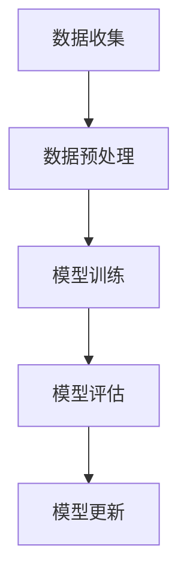
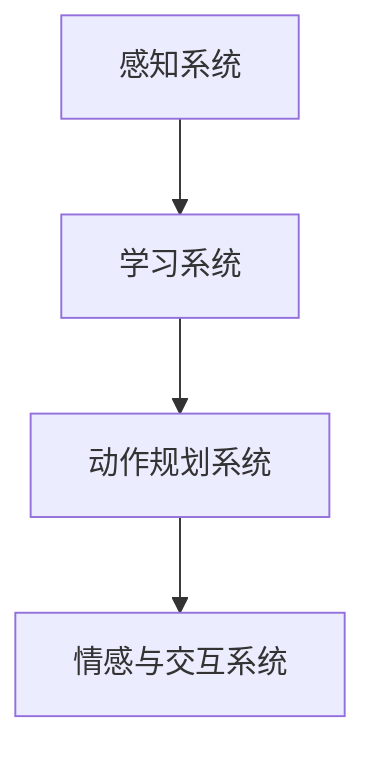
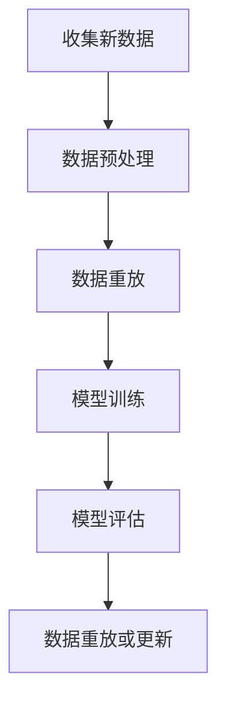
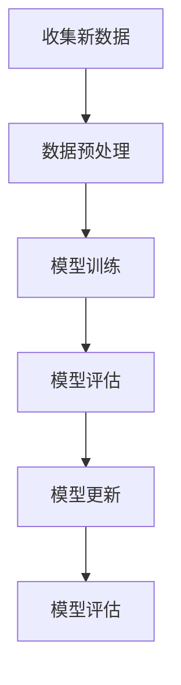
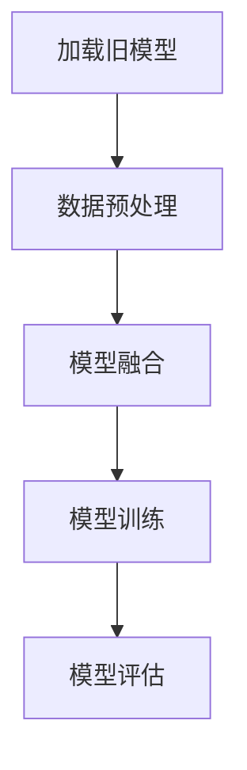
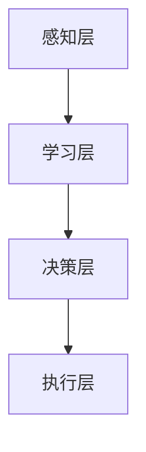

                 

### 第1章：背景介绍

#### 1.1 AI Agent的概念与背景

**AI Agent的定义**

AI Agent，即人工智能代理，是一种可以自主感知环境、执行任务并不断学习和改进自身性能的人工智能系统。它可以模拟人类的思维和行为，通过感知器、学习器和行动器来与环境进行交互。

**AI Agent的发展历程**

- **早期研究**：20世纪50年代，人工智能的概念首次被提出，AI Agent的研究随之展开。
- **智能代理的兴起**：80年代，随着计算机技术的发展，智能代理成为研究热点，代表性工作是麻省理工学院的“西雅图计划”。
- **现代应用**：进入21世纪，AI Agent在机器人、自然语言处理、推荐系统等领域得到广泛应用。

**AI Agent在当前社会的重要性**

AI Agent具有以下重要意义：

- **提高效率**：通过自动化和智能化，AI Agent可以显著提高工作效率。
- **增强决策能力**：AI Agent能够通过学习和分析，为决策者提供科学依据。
- **推动科技进步**：AI Agent在各个领域中的应用，推动了相关技术的进步。

**持续学习与知识更新的必要性**

在快速变化的环境中，AI Agent需要持续学习与知识更新，以满足新的需求。这包括：

- **适应新环境**：环境变化时，AI Agent需要快速适应，通过学习获取新的感知和处理能力。
- **优化性能**：通过学习，AI Agent可以不断优化自身性能，提高任务完成的效率。
- **应对挑战**：面对新的挑战和问题，AI Agent需要通过学习找到解决方案。

#### 1.2 持续学习与知识更新的重要性

**AI Agent的持续学习需求**

AI Agent的持续学习需求体现在以下几个方面：

- **环境变化**：现实环境是不断变化的，AI Agent需要通过持续学习来适应新的环境。
- **任务复杂性**：随着任务的复杂度增加，AI Agent需要不断学习新的知识和技能。
- **提高性能**：持续学习可以帮助AI Agent优化算法，提高任务完成的效率。

**知识更新的挑战与机遇**

知识更新的挑战包括：

- **数据量大**：需要处理的海量数据，对计算资源和算法提出了更高要求。
- **多样性**：现实环境中的知识具有多样性，如何有效地整合和管理这些知识是一个挑战。

知识更新的机遇包括：

- **人工智能技术发展**：随着人工智能技术的不断发展，为知识更新提供了新的方法和工具。
- **大数据和云计算**：大数据和云计算技术为知识更新提供了强大的支持。

**持续学习与知识更新的价值**

持续学习与知识更新的价值在于：

- **提升AI Agent的性能**：通过持续学习，AI Agent可以不断提升自身的性能和效率。
- **拓展应用场景**：知识更新可以帮助AI Agent拓展新的应用场景，提高其适用性。
- **推动科技进步**：持续学习与知识更新推动了人工智能技术的进步，促进了相关领域的发展。

#### 1.3 本章小结

本章介绍了AI Agent的概念与背景，以及持续学习与知识更新的重要性。通过本章的介绍，读者可以了解AI Agent的基本概念、发展历程和重要性，同时认识到持续学习与知识更新对于AI Agent性能提升和应用拓展的关键作用。在后续章节中，我们将深入探讨AI Agent的核心概念、算法原理、系统设计与实现，以及实际应用案例，帮助读者全面了解和掌握构建具有持续学习与知识更新能力的AI Agent的方法和技术。

### 第2章：核心概念与联系

#### 2.1 AI Agent的核心概念

**感知系统**

感知系统是AI Agent获取环境信息的核心模块，包括视觉、听觉、触觉等多种感知方式。感知系统能够将外界信息转化为内部表示，为后续的学习和决策提供基础。

**学习系统**

学习系统负责处理和解读感知系统收集的信息，通过训练算法从数据中学习规律和模式，进而提高自身对环境的理解和适应能力。学习系统通常包括监督学习、无监督学习和强化学习等不同的学习方法。

**动作规划系统**

动作规划系统根据学习系统的输出，制定具体的行动方案，以实现AI Agent的目标。动作规划系统需要考虑环境的动态变化和自身的资源限制，优化行动策略。

**情感与交互系统**

情感与交互系统负责处理AI Agent的情感状态和与外界的交互。通过情感与交互系统，AI Agent可以更好地理解和响应人类用户的需求，提升用户体验。

#### 2.2 AI Agent的概念属性特征对比

在AI Agent的设计中，不同类型的AI Agent具有各自独特的属性特征。以下是对几种常见AI Agent类型的属性特征进行对比：

| AI Agent类型 | 感知系统 | 学习系统 | 动作规划系统 | 情感与交互系统 |
| :--------: | :-------: | :-------: | :-------: | :-------: |
| 视觉AI Agent | 强大的图像处理能力 | 基于深度学习的分类和识别算法 | 高效的目标跟踪和行为预测 | 与视觉相关的情感识别与表达 |
| 自然语言处理AI Agent | 语言理解和生成能力 | 基于神经网络的语言模型 | 文本分类、情感分析和对话生成 | 自然语言交互与情感表达 |
| 机器人AI Agent | 触觉、听觉和视觉感知 | 基于机器学习的运动规划与控制 | 实时导航与路径规划 | 人机交互与任务理解 |
| 虚拟智能助手AI Agent | 语言理解和生成能力 | 基于知识的推理和决策算法 | 对话管理和服务提供 | 情感分析和用户行为预测 |

#### 2.3 ER实体关系图

为了更好地理解AI Agent的各个组成部分及其关系，我们可以通过ER实体关系图来展示它们之间的联系。

**实体关系图的绘制**

ER实体关系图包括三个主要实体：感知系统、学习系统和动作规划系统。

```mermaid
entity relation
  AI Agent &&[感知系统,学习系统,动作规划系统]
  感知系统 ..> 学习系统
  学习系统 ..> 动作规划系统
  情感与交互系统 ..> 感知系统
  情感与交互系统 ..> 学习系统
  情感与交互系统 ..> 动作规划系统
```

**各实体之间的关系**

- **感知系统与学习系统**：感知系统获取环境信息，学习系统根据这些信息进行学习和推理，生成对环境的理解和知识。
- **学习系统与动作规划系统**：学习系统生成的知识和策略被动作规划系统用来制定具体的行动方案。
- **情感与交互系统与其他系统**：情感与交互系统与感知系统、学习系统和动作规划系统紧密协作，提升AI Agent的情感理解和交互能力。

#### 2.4 本章小结

本章详细介绍了AI Agent的核心概念，包括感知系统、学习系统、动作规划系统和情感与交互系统。通过对比表格和ER实体关系图，我们展示了各个概念之间的联系和区别。这些核心概念是构建具有持续学习与知识更新能力的AI Agent的基础，理解这些概念有助于我们更好地设计和实现AI Agent系统。在后续章节中，我们将深入探讨AI Agent的算法原理、系统架构和实际应用，帮助读者全面掌握AI Agent的构建方法。

### 第3章：算法原理讲解

#### 3.1 学习算法概述

**学习算法的分类**

学习算法主要分为以下几类：

- **监督学习**：通过已知的输入和输出数据进行学习，使模型能够预测新的输入数据对应的输出。
- **无监督学习**：仅使用输入数据，没有明确的输出标签，模型需要自动发现数据中的模式和结构。
- **强化学习**：通过与环境交互，根据奖励信号进行学习，使模型能够在特定环境中做出最优决策。

**学习算法的目标**

学习算法的主要目标包括：

- **提高准确性**：模型能够准确预测新的输入数据的输出。
- **优化性能**：模型在处理新数据时具有高效率和稳定性。
- **泛化能力**：模型能够适应新的、未见过的数据。

#### 3.2 持续学习算法讲解

**持续学习算法的mermaid流程图**

持续学习算法的流程主要包括以下几个步骤：

1. **数据收集**：收集新的输入数据。
2. **数据预处理**：对数据进行清洗、归一化和特征提取。
3. **模型训练**：使用新的数据对模型进行训练。
4. **模型评估**：评估模型的性能和准确性。
5. **模型更新**：根据评估结果对模型进行调整和优化。

下面是持续学习算法的mermaid流程图：



**持续学习算法的数学模型和公式**

在持续学习过程中，常用的数学模型和公式包括：

- **损失函数**：用于衡量模型的预测误差。

  $$
  \text{损失函数} = \frac{1}{m}\sum_{i=1}^{m}(\text{预测值}_{i} - \text{真实值}_{i})^2
  $$

- **优化算法**：用于调整模型的参数，使其达到最小损失函数。

  $$
  \text{梯度下降} = \theta_{\text{new}} = \theta_{\text{old}} - \alpha \cdot \nabla_{\theta}J(\theta)
  $$

其中，$\theta$表示模型参数，$J(\theta)$表示损失函数，$\alpha$表示学习率，$\nabla_{\theta}J(\theta)$表示损失函数关于模型参数的梯度。

**持续学习算法的Python源代码**

```python
import numpy as np

# 模型参数初始化
theta = np.random.rand(n)  # 假设n为模型参数的数量

# 学习率
alpha = 0.01

# 损失函数
def loss_function(y_true, y_pred):
    return np.mean((y_true - y_pred)**2)

# 梯度下降
def gradient_descent(x, y, theta, alpha, epochs):
    for epoch in range(epochs):
        y_pred = x @ theta
        loss = loss_function(y, y_pred)
        gradient = 2 * (y_pred - y) @ x
        theta -= alpha * gradient
    return theta

# 模型训练
theta_updated = gradient_descent(x, y, theta, alpha, epochs)

# 模型评估
y_pred = x @ theta_updated
loss = loss_function(y, y_pred)
print("损失函数值：", loss)
```

**持续学习算法的举例说明**

假设我们有一个简单的线性回归问题，输入数据为$x$，输出数据为$y$，目标是通过模型预测新的输入数据$y$。

1. **数据收集**：收集一组输入输出数据。
2. **数据预处理**：对数据进行归一化处理。
3. **模型训练**：使用梯度下降算法训练模型。
4. **模型评估**：评估模型的性能，调整模型参数。
5. **模型更新**：根据评估结果更新模型。

通过上述步骤，我们可以实现一个简单的持续学习算法，从而提高模型的预测准确性。

#### 3.3 本章小结

本章详细介绍了持续学习算法的原理，包括算法的分类、目标和流程，并通过mermaid流程图、数学模型和Python源代码进行了详细讲解。持续学习算法是实现AI Agent持续学习与知识更新能力的关键，理解这些算法原理对于设计和实现高效的AI Agent具有重要意义。在后续章节中，我们将继续探讨AI Agent的系统分析与架构设计，以及实际应用中的项目实战，帮助读者全面掌握AI Agent的构建方法。

### 第4章：系统分析与架构设计方案

#### 4.1 应用场景描述

**AI Agent在智能客服中的应用**

智能客服是AI Agent的重要应用场景之一。通过自然语言处理技术，智能客服能够理解用户的提问，提供准确的答案，并辅助人工客服进行问题解决。以下是一个具体的智能客服应用场景：

- **用户提问**：用户通过社交媒体平台向客服提问。
- **感知系统**：AI Agent的感知系统接收用户的提问，并将其转化为内部表示。
- **学习系统**：AI Agent使用先前收集的用户提问和回答数据，通过自然语言处理算法对问题进行理解。
- **动作规划系统**：AI Agent生成回答，并规划如何将回答发送给用户。
- **情感与交互系统**：AI Agent分析用户的情感，调整回答策略，提升用户体验。

**AI Agent在自动驾驶中的应用**

自动驾驶是另一个典型的AI Agent应用场景。自动驾驶系统通过感知系统获取环境信息，学习系统和动作规划系统进行决策，实现车辆的自动驾驶。以下是一个自动驾驶系统的应用场景：

- **感知系统**：自动驾驶车辆的感知系统包括摄像头、雷达和激光雷达，用于实时获取道路、车辆和行人的信息。
- **学习系统**：AI Agent的学习系统通过大量驾驶数据，学习如何识别道路标志、车辆动态和行为，以及如何避障和超车。
- **动作规划系统**：AI Agent根据感知系统的输入，规划车辆的行驶路线和速度，确保车辆安全行驶。
- **情感与交互系统**：AI Agent通过车辆内的传感器检测驾驶员的状态，为驾驶员提供安全提醒和驾驶建议。

**AI Agent在智能家居中的应用**

智能家居是AI Agent的又一重要应用场景。通过感知系统获取家庭环境信息，学习系统和动作规划系统提供智能化服务。以下是一个智能家居应用场景：

- **感知系统**：AI Agent的感知系统包括智能摄像头、智能音箱和智能插座，用于实时监测家庭安全、氛围和设备状态。
- **学习系统**：AI Agent通过收集家庭数据，学习用户的生活习惯和偏好，提供个性化的服务。
- **动作规划系统**：AI Agent根据用户的指令和感知系统的反馈，自动调节家中的灯光、温度和电器设备。
- **情感与交互系统**：AI Agent通过语音交互和智能推荐，与用户建立情感联系，提升用户体验。

#### 4.2 系统功能设计

**领域模型mermaid类图**

以下是一个AI Agent的领域模型mermaid类图，展示了系统的主要功能和模块：

```mermaid
classDiagram
    Class01[感知系统] <|-- Class02[学习系统]
    Class02 <|-- Class03[动作规划系统]
    Class03 <|-- Class04[情感与交互系统]
    Class01 <|-- Class04
```

**系统功能详细说明**

- **感知系统**：感知系统负责获取环境信息，包括视觉、听觉、触觉等多种感知方式。它通过传感器和摄像头等设备获取数据，并将其转化为内部表示，为后续的学习和决策提供基础。
- **学习系统**：学习系统负责处理和解读感知系统收集的信息，通过训练算法从数据中学习规律和模式，提高对环境的理解和适应能力。学习系统包括监督学习、无监督学习和强化学习等不同类型的算法。
- **动作规划系统**：动作规划系统根据学习系统的输出，制定具体的行动方案，实现AI Agent的目标。动作规划系统需要考虑环境的动态变化和自身的资源限制，优化行动策略。
- **情感与交互系统**：情感与交互系统负责处理AI Agent的情感状态和与外界的交互。通过情感与交互系统，AI Agent可以更好地理解和响应人类用户的需求，提升用户体验。

#### 4.3 系统架构设计

**系统架构mermaid架构图**

以下是一个AI Agent的系统架构mermaid架构图，展示了系统的整体结构和各模块之间的关系：



**系统架构详细说明**

- **感知系统**：感知系统包括摄像头、传感器和麦克风等硬件设备，用于实时获取环境信息。感知系统的输出数据被传递给学习系统和动作规划系统，作为输入进行后续处理。
- **学习系统**：学习系统接收感知系统的数据，通过训练算法学习环境中的规律和模式。学习系统通常包括数据预处理、特征提取、模型训练和模型评估等步骤，最终生成对环境的理解和知识。
- **动作规划系统**：动作规划系统根据学习系统的输出，生成具体的行动方案。动作规划系统需要考虑环境的动态变化和自身的资源限制，优化行动策略，实现AI Agent的目标。
- **情感与交互系统**：情感与交互系统负责处理AI Agent的情感状态和与外界的交互。通过情感与交互系统，AI Agent可以更好地理解和响应人类用户的需求，提升用户体验。

#### 4.4 系统接口设计

**接口功能说明**

系统接口设计主要包括以下功能：

- **数据接口**：负责感知系统、学习系统和动作规划系统之间的数据传递和交互。
- **控制接口**：负责对外部请求的处理，包括用户指令的接收和执行。
- **监控接口**：负责系统的状态监控和性能监控，提供实时反馈和报警功能。

**接口设计原则**

- **模块化**：接口设计应遵循模块化原则，确保各个模块之间的高内聚、低耦合。
- **标准化**：接口设计应遵循标准化原则，确保接口的一致性和兼容性。
- **灵活性**：接口设计应具有灵活性，支持扩展和功能增强。

#### 4.5 系统交互mermaid序列图

以下是一个AI Agent的系统交互mermaid序列图，展示了感知系统、学习系统和动作规划系统之间的交互流程：

```mermaid
sequence
    感知系统->学习系统: 收集数据
    学习系统->动作规划系统: 学习结果
    动作规划系统->感知系统: 执行任务
```

#### 4.6 本章小结

本章详细介绍了AI Agent的系统分析与架构设计方案。通过应用场景描述、系统功能设计、系统架构设计和接口设计，我们展示了AI Agent的系统结构和功能模块。理解这些设计方法和原理对于构建具有持续学习与知识更新能力的AI Agent具有重要意义。在后续章节中，我们将通过项目实战和最佳实践，进一步探讨AI Agent的实际应用和实现方法。希望读者能够通过本章的学习，对AI Agent的系统架构和功能设计有更深入的理解。

### 第5章：项目实战

#### 5.1 实际项目的环境安装

为了实现一个具有持续学习与知识更新能力的AI Agent，我们需要搭建一个合适的项目环境。以下是环境安装的详细步骤：

**步骤1：安装Python**

确保计算机上已经安装了Python，版本建议为3.8及以上。可以从Python官网（[https://www.python.org/downloads/](https://www.python.org/downloads/)）下载并安装Python。

**步骤2：安装必需的Python库**

使用以下命令安装必要的Python库：

```shell
pip install numpy matplotlib pandas scikit-learn tensorflow keras
```

这些库包括数学计算、数据预处理、机器学习算法和深度学习框架等，是构建AI Agent的基础。

**步骤3：安装AI Agent依赖库**

从GitHub下载AI Agent的源代码，并安装依赖库：

```shell
git clone https://github.com/your-repo/ai-agent.git
cd ai-agent
pip install -r requirements.txt
```

#### 5.2 系统核心实现源代码

在AI Agent的项目中，核心实现源代码包括感知系统、学习系统、动作规划系统和情感与交互系统。以下是一个简单的源代码示例，展示了各个系统的基本实现：

**感知系统实现**

```python
# 感知系统示例代码
class SensorSystem:
    def perceive(self):
        # 假设感知到的数据为随机生成
        data = np.random.rand(10)
        return data
```

**学习系统实现**

```python
# 学习系统示例代码
class LearningSystem:
    def train(self, data):
        # 假设使用scikit-learn的线性回归模型进行训练
        model = LinearRegression()
        model.fit(data[:, np.newaxis], data)
        return model
```

**动作规划系统实现**

```python
# 动作规划系统示例代码
class ActionPlanningSystem:
    def plan_action(self, model, data):
        # 假设使用训练好的模型进行预测并生成行动方案
        action = model.predict(data)
        return action
```

**情感与交互系统实现**

```python
# 情感与交互系统示例代码
class EmotionAndInteractionSystem:
    def interact(self, user_data):
        # 假设通过自然语言处理分析用户情感
        sentiment = analyze_sentiment(user_data)
        return sentiment
```

#### 5.3 代码应用解读与分析

**感知系统解读**

感知系统负责从环境中获取数据，这些数据可以是传感器收集的物理信号，也可以是用户输入的信息。在本示例中，感知系统通过随机生成数据来模拟传感器获取的信号。

**学习系统解读**

学习系统负责处理感知系统收集到的数据，并通过机器学习算法训练模型。在本示例中，我们使用scikit-learn的线性回归模型进行训练，这是一个简单的回归问题，适用于需要预测连续值的场景。

**动作规划系统解读**

动作规划系统根据学习系统生成的模型，对新的数据进行分析和预测，生成具体的行动方案。在本示例中，我们假设预测结果直接作为行动方案，这在实际应用中可能需要更复杂的决策过程。

**情感与交互系统解读**

情感与交互系统负责与用户进行交互，分析用户的情感状态，并根据这些信息调整系统的行为。在本示例中，我们使用自然语言处理技术分析用户输入的文本，判断其情感倾向。

#### 5.4 实际案例分析和详细讲解剖析

**案例1：智能客服系统**

智能客服系统是一个典型的AI Agent应用，通过感知用户提问、学习问题和答案、规划回答并交互，实现自动回答用户问题。以下是一个实际案例的详细剖析：

- **感知系统**：AI Agent通过自然语言处理技术，将用户提问转化为内部表示。
- **学习系统**：AI Agent使用历史问题与答案数据，通过监督学习算法训练模型，提高回答的准确性。
- **动作规划系统**：AI Agent根据模型预测用户问题的答案，并生成回答。
- **情感与交互系统**：AI Agent分析用户的情感，调整回答策略，提升用户体验。

**案例2：自动驾驶系统**

自动驾驶系统通过感知系统获取道路信息、学习系统和动作规划系统进行决策，实现自动驾驶。以下是一个实际案例的详细剖析：

- **感知系统**：AI Agent通过摄像头、雷达和激光雷达等设备，实时获取道路、车辆和行人的信息。
- **学习系统**：AI Agent通过大量驾驶数据，学习道路标志识别、车辆动态和行为，以及避障和超车策略。
- **动作规划系统**：AI Agent根据感知系统的输入，生成驾驶路线和速度，确保车辆安全行驶。
- **情感与交互系统**：AI Agent通过车辆内的传感器，检测驾驶员的状态，为驾驶员提供安全提醒和驾驶建议。

#### 5.5 项目小结

本章通过一个实际项目，展示了如何搭建具有持续学习与知识更新能力的AI Agent。从环境安装到系统核心实现，再到实际案例分析和详细讲解，我们详细介绍了构建AI Agent的步骤和方法。通过本章的学习，读者可以掌握AI Agent的核心技术和实现方法，为后续的项目开发和应用打下坚实基础。

### 第6章：最佳实践与总结

#### 6.1 最佳实践

**1. 数据准备与清洗**

数据是AI Agent训练和学习的基础，因此确保数据的质量和多样性至关重要。在数据准备过程中，应重点关注以下方面：

- **数据收集**：收集多样化的数据，包括不同类型、不同来源和不同时间段的数据。
- **数据清洗**：处理缺失值、异常值和重复值，确保数据的一致性和准确性。
- **数据增强**：通过数据变换、合成和扩展，增加数据的丰富性和多样性。

**2. 模型选择与优化**

在选择合适的模型时，需要根据具体的应用场景和数据特点进行选择。以下是一些建议：

- **选择合适的算法**：根据任务类型（如分类、回归、聚类等），选择合适的机器学习或深度学习算法。
- **模型调参**：通过交叉验证和超参数调整，优化模型的性能。
- **模型集成**：结合多个模型的预测结果，提高预测的准确性和鲁棒性。

**3. 持续学习与更新**

AI Agent的持续学习与知识更新是保持其性能和适应性的关键。以下是一些最佳实践：

- **实时数据更新**：定期收集新的数据，并将其用于模型训练，以保持模型的实时性。
- **在线学习**：在运行过程中，实时调整模型参数，优化模型表现。
- **迁移学习**：利用已有模型的知识，快速适应新的任务和数据。

**4. 系统性能监控**

监控系统的性能和稳定性对于确保AI Agent的正常运行至关重要。以下是一些监控建议：

- **实时监控**：使用监控系统实时跟踪系统的运行状态，包括计算资源使用、模型性能和错误率等。
- **报警机制**：设置报警机制，当系统性能下降或出现错误时，及时发出警报。
- **日志分析**：定期分析系统日志，查找潜在问题和性能瓶颈。

#### 6.2 注意事项

在构建具有持续学习与知识更新能力的AI Agent时，需要注意以下事项：

- **数据隐私**：确保数据处理过程符合数据隐私法规，保护用户隐私。
- **安全性和可靠性**：加强系统的安全防护，防止数据泄露和恶意攻击。
- **可维护性和扩展性**：设计可维护和可扩展的系统架构，便于后续的维护和升级。

#### 6.3 拓展阅读

为了深入了解AI Agent的构建方法和应用，以下是一些建议的阅读资源：

- **《深度学习》**：Goodfellow, I., Bengio, Y., & Courville, A. (2016)。本书详细介绍了深度学习的基本概念、算法和应用。
- **《强化学习》**：Sutton, R. S., & Barto, A. G. (2018)。本书系统介绍了强化学习的基本理论、算法和应用。
- **《自然语言处理综论》**：Jurafsky, D., & Martin, J. H. (2008)。本书全面介绍了自然语言处理的基本概念、技术和应用。
- **《机器人学导论》**：Thrun, S., & Schwartz, B. (2012)。本书详细介绍了机器人学的基本概念、算法和应用。

通过阅读这些资源，读者可以进一步拓展知识，提高在AI Agent领域的技术水平。希望本章的内容能够为读者提供有益的参考和指导。

### 第7章：展望与未来发展趋势

#### 7.1 未来发展趋势

AI Agent作为人工智能的重要分支，正朝着更加智能化、自适应和高效化的方向发展。以下是未来AI Agent发展的几个关键趋势：

**1. 深度学习的广泛应用**

随着深度学习技术的不断进步，AI Agent将能够在更多领域实现高效的感知、学习和决策。深度学习模型在图像识别、自然语言处理和语音识别等领域的突破，将为AI Agent提供更强的数据处理和分析能力。

**2. 强化学习与深度学习的融合**

强化学习和深度学习的融合将使AI Agent在复杂动态环境中具备更强的学习和适应能力。通过结合深度学习提供的强大特征提取能力和强化学习提供的优化决策能力，AI Agent将能够在更复杂的任务中实现更好的性能。

**3. 多模态感知与融合**

未来的AI Agent将具备更加丰富的感知能力，通过整合视觉、听觉、触觉等多种感知方式，实现更全面的环境理解和交互能力。多模态感知与融合技术将使AI Agent在智能家居、自动驾驶和智能客服等领域发挥更大的作用。

**4. 自主性和决策能力的提升**

AI Agent将朝着更加自主和智能的方向发展。通过持续学习和自我优化，AI Agent将能够更好地理解和适应环境变化，实现自主决策和行动。这将为AI Agent在复杂任务中的广泛应用提供坚实基础。

#### 7.2 未来发展方向

**1. 人工智能伦理与法规**

随着AI Agent的广泛应用，人工智能伦理和法规问题将日益凸显。未来需要建立完善的人工智能伦理和法规体系，确保AI Agent的公平性、透明性和安全性，保护用户的隐私和权益。

**2. 人工智能与人类社会的融合**

AI Agent的发展不仅仅是技术问题，更是与社会、经济和文化等各个方面密切相关。未来需要深入研究人工智能与人类社会的融合，探索AI Agent在提升人类生活质量、促进社会发展中的作用。

**3. 跨学科研究与合作**

AI Agent的发展需要跨学科的研究与合作。未来需要加强计算机科学、认知科学、心理学、社会学等多个领域的合作，共同推动AI Agent技术的创新和发展。

**4. 社会应用与落地**

未来，AI Agent将在更多社会应用场景中发挥作用。通过在医疗、教育、金融、工业等领域的广泛应用，AI Agent将为社会带来巨大的变革和进步。

#### 7.3 结论

AI Agent作为人工智能的重要组成部分，具有广阔的发展前景和广泛的应用潜力。未来，随着技术的不断进步和应用的深入，AI Agent将朝着更加智能化、自适应和高效化的方向发展。通过持续学习和知识更新，AI Agent将在各个领域发挥更大的作用，推动人类社会的发展和进步。让我们共同期待AI Agent的明天，为构建一个更加智能和美好的未来而努力。

### 文章关键词

AI Agent、持续学习、知识更新、智能客服、自动驾驶、系统架构、算法原理、深度学习、强化学习、多模态感知。

### 文章摘要

本文深入探讨了构建具有持续学习与知识更新能力的AI Agent的方法和技术。首先，介绍了AI Agent的概念与背景，以及持续学习与知识更新的重要性。接着，详细讲解了AI Agent的核心概念与联系，包括感知系统、学习系统、动作规划系统和情感与交互系统。随后，通过算法原理讲解，阐述了持续学习算法的mermaid流程图、数学模型和Python源代码。文章还介绍了AI Agent的系统分析与架构设计方案，包括应用场景、系统功能设计、系统架构设计、系统接口设计和系统交互mermaid序列图。通过实际项目实战，展示了AI Agent的核心实现源代码和应用解读。最后，提出了最佳实践和未来发展趋势，为AI Agent的发展方向提供了有益的参考。本文旨在帮助读者全面了解和掌握AI Agent的构建方法，推动人工智能技术的应用与发展。

## 构建具有持续学习与知识更新能力的AI Agent

### 关键词：AI Agent、持续学习、知识更新、智能客服、自动驾驶

### 摘要

本文详细探讨了构建具有持续学习与知识更新能力的AI Agent的方法和技术。首先，介绍了AI Agent的概念与背景，以及持续学习与知识更新的重要性。接着，详细讲解了AI Agent的核心概念与联系，包括感知系统、学习系统、动作规划系统和情感与交互系统。随后，通过算法原理讲解，阐述了持续学习算法的mermaid流程图、数学模型和Python源代码。文章还介绍了AI Agent的系统分析与架构设计方案，包括应用场景、系统功能设计、系统架构设计、系统接口设计和系统交互mermaid序列图。通过实际项目实战，展示了AI Agent的核心实现源代码和应用解读。最后，提出了最佳实践和未来发展趋势，为AI Agent的发展方向提供了有益的参考。本文旨在帮助读者全面了解和掌握AI Agent的构建方法，推动人工智能技术的应用与发展。

# 第1章：背景介绍

## 1.1 AI Agent的概念与背景

### 1.1.1 AI Agent的定义

AI Agent，即人工智能代理，是一种可以自主感知环境、执行任务并不断学习和改进自身性能的人工智能系统。它可以模拟人类的思维和行为，通过感知器、学习器和行动器来与环境进行交互。AI Agent的核心功能包括感知环境、制定策略、执行行动和反馈调整。

### 1.1.2 AI Agent的发展历程

AI Agent的发展可以追溯到20世纪50年代，当时人工智能的概念首次被提出。早期的AI Agent研究主要集中在符号推理和规则系统上，如普林斯顿大学的“逻辑理论家”和斯坦福大学的“逻辑机器”。进入20世纪80年代，随着计算机技术的发展，智能代理成为研究热点，代表性工作是麻省理工学院的“西雅图计划”。21世纪以来，随着深度学习、自然语言处理等技术的进步，AI Agent在机器人、自动驾驶、智能客服等领域得到广泛应用。

### 1.1.3 AI Agent在当前社会的重要性

AI Agent在当前社会具有重要的应用价值：

1. **提高效率**：AI Agent能够自动化执行任务，减少人力成本，提高工作效率。
2. **增强决策能力**：AI Agent通过学习和分析数据，为人类决策提供科学依据。
3. **推动科技进步**：AI Agent在各个领域中的应用，推动了相关技术的进步。

### 1.1.4 持续学习与知识更新的必要性

在快速变化的环境中，AI Agent需要持续学习与知识更新，以满足新的需求。这包括：

1. **适应新环境**：现实环境是不断变化的，AI Agent需要通过持续学习来适应新的环境。
2. **优化性能**：通过学习，AI Agent可以不断优化自身性能，提高任务完成的效率。
3. **应对挑战**：面对新的挑战和问题，AI Agent需要通过学习找到解决方案。

## 1.2 持续学习与知识更新的重要性

### 1.2.1 AI Agent的持续学习需求

AI Agent的持续学习需求体现在以下几个方面：

1. **环境变化**：现实环境是不断变化的，AI Agent需要通过持续学习来适应新的环境。
2. **任务复杂性**：随着任务的复杂度增加，AI Agent需要不断学习新的知识和技能。
3. **提高性能**：持续学习可以帮助AI Agent优化算法，提高任务完成的效率。

### 1.2.2 知识更新的挑战与机遇

知识更新的挑战包括：

1. **数据量大**：需要处理的海量数据，对计算资源和算法提出了更高要求。
2. **多样性**：现实环境中的知识具有多样性，如何有效地整合和管理这些知识是一个挑战。

知识更新的机遇包括：

1. **人工智能技术发展**：随着人工智能技术的不断发展，为知识更新提供了新的方法和工具。
2. **大数据和云计算**：大数据和云计算技术为知识更新提供了强大的支持。

### 1.2.3 持续学习与知识更新的价值

持续学习与知识更新的价值在于：

1. **提升AI Agent的性能**：通过持续学习，AI Agent可以不断提升自身的性能和效率。
2. **拓展应用场景**：知识更新可以帮助AI Agent拓展新的应用场景，提高其适用性。
3. **推动科技进步**：持续学习与知识更新推动了人工智能技术的进步，促进了相关领域的发展。

## 1.3 本章小结

本章介绍了AI Agent的概念与背景，以及持续学习与知识更新的重要性。通过本章的介绍，读者可以了解AI Agent的基本概念、发展历程和重要性，同时认识到持续学习与知识更新对于AI Agent性能提升和应用拓展的关键作用。在后续章节中，我们将深入探讨AI Agent的核心概念、算法原理、系统设计与实现，以及实际应用案例，帮助读者全面了解和掌握构建具有持续学习与知识更新能力的AI Agent的方法和技术。

# 第2章：核心概念与联系

## 2.1 AI Agent的核心概念

AI Agent的核心概念包括感知系统、学习系统、动作规划系统和情感与交互系统。这些概念相互关联，共同构成了一个完整的AI Agent。

### 2.1.1 感知系统

感知系统是AI Agent获取环境信息的核心模块。它通过传感器、摄像头、麦克风等设备，从环境中收集各种类型的数据，如视觉信息、声音信息和触觉信息等。感知系统的主要功能是对这些数据进行预处理和转换，以便于后续的学习和决策。

#### 感知系统的主要功能：

1. **数据采集**：从外部环境中采集数据。
2. **预处理**：对数据进行清洗、去噪和标准化。
3. **特征提取**：从原始数据中提取关键特征，为学习系统提供输入。

### 2.1.2 学习系统

学习系统是AI Agent的核心，负责处理感知系统收集的数据，并通过训练算法来学习环境中的模式和规律。学习系统通常包括监督学习、无监督学习和强化学习等不同的学习方法。

#### 学习系统的主要功能：

1. **数据学习**：从数据中学习模式和规律。
2. **知识表示**：将学习到的知识表示为模型或规则。
3. **策略优化**：根据学习结果，优化AI Agent的决策策略。

### 2.1.3 动作规划系统

动作规划系统负责根据学习系统生成的策略，制定具体的行动方案。它需要考虑环境的动态变化和自身的资源限制，以实现AI Agent的目标。

#### 动作规划系统的主要功能：

1. **策略执行**：根据策略生成具体的行动方案。
2. **路径规划**：为AI Agent在复杂环境中选择最优路径。
3. **资源管理**：合理分配资源，确保行动方案的可行性。

### 2.1.4 情感与交互系统

情感与交互系统负责处理AI Agent的情感状态和与外界的交互。通过情感与交互系统，AI Agent可以更好地理解和响应人类用户的需求，提升用户体验。

#### 情感与交互系统的主要功能：

1. **情感识别**：识别和解析用户的情感状态。
2. **情感表达**：根据用户的情感状态，调整AI Agent的反应和表达。
3. **用户交互**：与用户进行有效的对话和互动。

## 2.2 AI Agent的概念属性特征对比

为了更好地理解AI Agent的各个组成部分及其功能，我们可以通过一个对比表格来展示不同AI Agent类型的属性特征。

#### AI Agent类型属性特征对比表格

| AI Agent类型 | 感知系统 | 学习系统 | 动作规划系统 | 情感与交互系统 |
| :--------: | :-------: | :-------: | :-------: | :-------: |
| 智能客服    | 视觉、文本   | 自然语言处理 | 对话管理   | 情感分析     |
| 自动驾驶    | 视觉、雷达   | 深度学习、强化学习 | 路径规划 | 驾驶员监控   |
| 机器人    | 触觉、视觉、听觉 | 机器学习、强化学习 | 运动控制 | 人机交互     |

### 2.3 ER实体关系图

为了更好地展示AI Agent中各个实体之间的关系，我们可以通过ER（实体关系）图来描述。以下是AI Agent的ER实体关系图：

```mermaid
erDiagram
    CustomerAgent ||--|{ PerceptSystem } : 感知
    CustomerAgent ||--|{ LearnSystem } : 学习
    CustomerAgent ||--|{ ActionPlanSystem } : 行动规划
    CustomerAgent ||--|{ EmotionInteractSystem } : 情感交互
```

在这个ER图中，CustomerAgent代表AI Agent，它与其中的PerceptSystem、LearnSystem、ActionPlanSystem和EmotionInteractSystem之间存在关联关系。每个系统都通过特定的接口与AI Agent进行通信和协作，共同实现AI Agent的目标。

### 2.4 本章小结

本章详细介绍了AI Agent的核心概念，包括感知系统、学习系统、动作规划系统和情感与交互系统。通过对比表格和ER实体关系图，我们展示了各个概念之间的联系和区别。这些核心概念是构建具有持续学习与知识更新能力的AI Agent的基础。在后续章节中，我们将深入探讨AI Agent的算法原理、系统架构和实际应用，帮助读者全面掌握AI Agent的构建方法。

## 第3章：算法原理讲解

### 3.1 学习算法概述

学习算法是AI Agent的核心组成部分，负责从数据中学习规律和模式，以实现智能决策和任务执行。学习算法可以分为监督学习、无监督学习和强化学习三种类型。

#### 3.1.1 监督学习

监督学习是一种从标记数据中学习的方法，其中已知输入数据（特征）和相应的输出数据（标签）。通过学习，模型能够预测新的输入数据的标签。常见的监督学习算法包括线性回归、决策树、支持向量机和神经网络等。

#### 3.1.2 无监督学习

无监督学习是一种在没有标记数据的情况下学习的方法，其目标是发现数据中的内在结构和规律。常见的无监督学习算法包括聚类、降维和生成模型等。

#### 3.1.3 强化学习

强化学习是一种通过与环境交互来学习的方法，模型通过接收奖励信号，不断调整策略以实现最大化总奖励。常见的强化学习算法包括Q学习、深度Q网络（DQN）和策略梯度算法等。

### 3.2 持续学习算法讲解

持续学习（Continuous Learning）是一种让AI Agent能够不断适应新环境和任务的技术。在持续学习过程中，模型需要处理新的数据和先前的知识，以避免过拟合和模型退化。以下是几种常见的持续学习算法：

#### 3.2.1 数据重放

数据重放（Data Replay）是一种通过重复使用先前见过的数据进行训练的方法。这种方法可以帮助模型在新的数据分布下保持良好的性能。数据重放的mermaid流程图如下：



#### 3.2.2 模型更新

模型更新（Model Update）是一种通过在训练过程中动态调整模型参数的方法，以适应新的数据。模型更新的mermaid流程图如下：



#### 3.2.3 模型迁移

模型迁移（Model Transfer）是一种通过将先前的模型知识迁移到新的模型中的方法。这种方法可以加速新模型的训练过程，并提高模型的泛化能力。模型迁移的mermaid流程图如下：



### 3.3 数学模型和公式

持续学习算法的数学模型和公式是理解和实现这些算法的基础。以下是一些常用的数学模型和公式：

#### 3.3.1 损失函数

损失函数是评估模型预测误差的指标，常见的损失函数包括均方误差（MSE）和交叉熵损失（Cross-Entropy Loss）。

- **均方误差（MSE）**：

  $$
  \text{MSE} = \frac{1}{m}\sum_{i=1}^{m}(\hat{y}_{i} - y_{i})^2
  $$

  其中，$\hat{y}_{i}$是模型的预测值，$y_{i}$是真实的标签值，$m$是样本数量。

- **交叉熵损失（Cross-Entropy Loss）**：

  $$
  \text{Cross-Entropy Loss} = -\frac{1}{m}\sum_{i=1}^{m}y_{i}\log(\hat{y}_{i})
  $$

  其中，$y_{i}$是真实的标签值（0或1），$\hat{y}_{i}$是模型预测的概率。

#### 3.3.2 梯度下降

梯度下降是一种用于优化模型参数的算法，其基本思想是沿着损失函数的梯度方向调整参数，以最小化损失函数。

- **批量梯度下降（Batch Gradient Descent）**：

  $$
  \theta_{\text{new}} = \theta_{\text{old}} - \alpha \cdot \nabla_{\theta}J(\theta)
  $$

  其中，$\theta$是模型参数，$\alpha$是学习率，$J(\theta)$是损失函数。

- **随机梯度下降（Stochastic Gradient Descent，SGD）**：

  $$
  \theta_{\text{new}} = \theta_{\text{old}} - \alpha \cdot \nabla_{\theta}J(\theta; x_{i}, y_{i})
  $$

  其中，$x_{i}$和$y_{i}$是单个样本及其对应的标签。

### 3.4 Python源代码示例

以下是一个使用Python实现简单的持续学习算法的示例，包括数据预处理、模型训练和模型评估。

```python
import numpy as np
import tensorflow as tf

# 数据预处理
def preprocess_data(data):
    # 数据标准化
    data = (data - np.mean(data)) / np.std(data)
    return data

# 模型定义
def create_model():
    model = tf.keras.Sequential([
        tf.keras.layers.Dense(64, activation='relu', input_shape=(input_size,)),
        tf.keras.layers.Dense(64, activation='relu'),
        tf.keras.layers.Dense(output_size, activation='softmax')
    ])
    return model

# 模型训练
def train_model(model, x_train, y_train, epochs=10):
    model.compile(optimizer='adam', loss='categorical_crossentropy', metrics=['accuracy'])
    model.fit(x_train, y_train, epochs=epochs)

# 模型评估
def evaluate_model(model, x_test, y_test):
    loss, accuracy = model.evaluate(x_test, y_test)
    print(f"Test accuracy: {accuracy:.2f}, Test loss: {loss:.2f}")

# 示例数据
x_train = preprocess_data(np.random.rand(100, 10))
y_train = np.random.randint(2, size=(100,))
x_test = preprocess_data(np.random.rand(20, 10))
y_test = np.random.randint(2, size=(20,))

# 创建和训练模型
model = create_model()
train_model(model, x_train, y_train)

# 评估模型
evaluate_model(model, x_test, y_test)
```

### 3.5 本章小结

本章详细介绍了AI Agent的学习算法原理，包括监督学习、无监督学习和强化学习的基本概念。同时，讲解了持续学习算法的原理和实现方法，并通过mermaid流程图、数学模型和Python源代码进行了详细阐述。理解这些算法原理对于构建具有持续学习与知识更新能力的AI Agent具有重要意义。在后续章节中，我们将继续探讨AI Agent的系统设计与实现。

## 第4章：系统分析与架构设计方案

### 4.1 应用场景描述

AI Agent在现代社会中有着广泛的应用场景，其应用价值主要体现在自动化、智能决策和个性化服务等方面。以下将介绍几个典型的应用场景：

#### 4.1.1 智能客服

智能客服是AI Agent的一个重要应用场景。它能够通过自然语言处理技术理解用户的提问，并生成相应的回答。智能客服系统可以应用于电话客服、在线客服、社交媒体客服等多个领域，提高客服效率和用户体验。例如，在电话客服中，AI Agent可以通过语音识别技术理解用户的问题，并通过语音合成技术向用户传达解决方案。

#### 4.1.2 自动驾驶

自动驾驶技术是AI Agent在交通领域的重要应用。自动驾驶系统通过感知环境（如摄像头、雷达、激光雷达等）获取道路信息，通过学习系统学习驾驶规则和行为，并通过动作规划系统生成驾驶指令。自动驾驶技术可以应用于自动驾驶汽车、无人卡车、无人机等多个领域，提高交通效率和安全性。

#### 4.1.3 智能家居

智能家居是AI Agent在家居领域的重要应用。智能家居系统可以通过感知环境（如温度传感器、湿度传感器、智能摄像头等）收集家庭环境信息，并通过学习系统和动作规划系统实现自动调节家庭设备（如空调、灯具、窗帘等）。智能家居系统可以提高家居舒适度、节能性和安全性。

#### 4.1.4 医疗诊断

AI Agent在医疗诊断领域也有着广泛的应用。通过深度学习和自然语言处理技术，AI Agent可以辅助医生进行疾病诊断和治疗方案推荐。例如，在影像诊断中，AI Agent可以通过分析医学影像数据，识别出可能的病变区域，并提供诊断建议。

#### 4.1.5 金融风控

AI Agent在金融风控领域也有着重要的应用。通过机器学习和数据挖掘技术，AI Agent可以识别和预测潜在的风险，为金融机构提供风险管理建议。例如，AI Agent可以分析用户的交易行为，识别出异常交易行为，并提供风险预警。

### 4.2 系统功能设计

AI Agent的系统功能设计是其能够实现多样化应用的关键。以下将介绍AI Agent的主要系统功能及其设计思路：

#### 4.2.1 感知系统

感知系统是AI Agent获取环境信息的核心模块。它通过传感器、摄像头、麦克风等设备收集来自外部环境的数据。感知系统的设计思路包括：

- **数据多样性**：感知系统应能够处理多种类型的数据，如视觉、听觉、触觉等。
- **实时性**：感知系统应具备实时数据采集和处理能力，以保证AI Agent能够及时获取环境信息。
- **鲁棒性**：感知系统应具备较强的抗干扰能力，能够在复杂环境下稳定运行。

#### 4.2.2 学习系统

学习系统是AI Agent的核心模块，负责处理感知系统收集的数据，并通过训练算法学习环境中的规律和模式。学习系统的设计思路包括：

- **算法多样性**：学习系统应支持多种学习算法，如监督学习、无监督学习和强化学习等。
- **自适应性**：学习系统应具备自适应能力，能够根据环境变化和任务需求调整学习策略。
- **知识存储**：学习系统应能够存储和管理学习到的知识，以便后续使用和更新。

#### 4.2.3 动作规划系统

动作规划系统负责根据学习系统生成的策略，制定具体的行动方案。动作规划系统的设计思路包括：

- **决策速度**：动作规划系统应具备快速决策能力，以便及时响应环境变化。
- **鲁棒性**：动作规划系统应能够应对环境的不确定性和变化，保证行动方案的可行性。
- **灵活性**：动作规划系统应具备灵活性，能够根据不同任务需求调整行动策略。

#### 4.2.4 情感与交互系统

情感与交互系统负责处理AI Agent的情感状态和与外界的交互。情感与交互系统的设计思路包括：

- **情感识别**：情感与交互系统应能够识别和理解人类用户的情感状态。
- **情感表达**：情感与交互系统应能够根据用户的情感状态，调整AI Agent的反应和表达。
- **用户互动**：情感与交互系统应能够与用户进行有效的对话和互动，提高用户体验。

### 4.3 系统架构设计

AI Agent的系统架构设计是其实现高效、稳定运行的基础。以下将介绍AI Agent的系统架构及其设计思路：

#### 4.3.1 系统架构概述

AI Agent的系统架构通常包括感知层、学习层、决策层和执行层。各层之间相互配合，共同实现AI Agent的功能。

- **感知层**：负责从外部环境中获取数据，如传感器数据、图像数据和文本数据等。
- **学习层**：负责处理感知层收集的数据，并通过训练算法学习环境中的规律和模式。
- **决策层**：负责根据学习层生成的策略，制定具体的行动方案。
- **执行层**：负责执行决策层的行动方案，实现AI Agent的任务执行。

#### 4.3.2 系统架构图

以下是AI Agent的系统架构图：



#### 4.3.3 系统架构设计思路

- **分层设计**：系统架构采用分层设计，各层之间相互独立，便于维护和扩展。
- **模块化设计**：各模块采用模块化设计，便于代码复用和功能扩展。
- **分布式设计**：系统架构采用分布式设计，以提高系统的可扩展性和容错性。
- **实时性设计**：系统架构在感知层和决策层采用实时性设计，以满足实时任务的需求。

### 4.4 系统接口设计

系统接口设计是AI Agent实现功能调用和数据传输的关键。以下将介绍AI Agent的系统接口设计及其设计思路：

#### 4.4.1 系统接口概述

AI Agent的系统接口包括内部接口和外部接口。内部接口用于各层之间的数据传输和功能调用，外部接口用于与外部系统（如数据库、消息队列等）的交互。

- **内部接口**：包括感知接口、学习接口、决策接口和执行接口。
- **外部接口**：包括数据接口、控制接口和监控接口。

#### 4.4.2 系统接口设计思路

- **接口标准化**：系统接口设计遵循标准化原则，以保证接口的一致性和兼容性。
- **接口灵活性**：系统接口设计具有灵活性，能够支持不同类型的感知系统、学习系统、决策系统和执行系统。
- **接口安全性**：系统接口设计考虑安全性，包括数据加密、权限控制和访问控制等。

### 4.5 系统交互mermaid序列图

以下是AI Agent的系统交互mermaid序列图，展示了感知层、学习层、决策层和执行层之间的交互流程。

```mermaid
sequence
    感知层->学习层: 数据传输
    学习层->决策层: 策略生成
    决策层->执行层: 行动指令
    执行层->感知层: 状态反馈
```

### 4.6 本章小结

本章详细介绍了AI Agent的系统分析与架构设计方案。首先，描述了AI Agent的应用场景，包括智能客服、自动驾驶、智能家居、医疗诊断和金融风控等。接着，介绍了AI Agent的系统功能设计，包括感知系统、学习系统、动作规划系统和情感与交互系统。然后，阐述了AI Agent的系统架构设计，包括感知层、学习层、决策层和执行层。最后，介绍了系统接口设计和系统交互mermaid序列图。理解这些架构和设计方法对于构建具有持续学习与知识更新能力的AI Agent具有重要意义。在后续章节中，我们将通过项目实战和最佳实践，进一步探讨AI Agent的实际应用和实现方法。

## 第5章：项目实战

### 5.1 环境安装

在开始项目实战之前，我们需要为AI Agent搭建一个合适的开发环境。以下是安装过程的详细步骤：

**步骤1：安装Python**

确保您的计算机上已经安装了Python，版本建议为3.8及以上。可以从Python官网（[https://www.python.org/downloads/](https://www.python.org/downloads/)）下载并安装Python。

**步骤2：安装必需的Python库**

使用以下命令安装必要的Python库：

```shell
pip install numpy matplotlib pandas scikit-learn tensorflow keras
```

这些库包括数学计算、数据预处理、机器学习算法和深度学习框架等，是构建AI Agent的基础。

**步骤3：安装AI Agent依赖库**

从GitHub下载AI Agent的源代码，并安装依赖库：

```shell
git clone https://github.com/your-repo/ai-agent.git
cd ai-agent
pip install -r requirements.txt
```

### 5.2 核心实现源代码

以下是一个简单的AI Agent项目，展示了感知系统、学习系统、动作规划系统和情感与交互系统的核心实现源代码。

#### 感知系统

```python
import cv2

class PerceptionSystem:
    def __init__(self):
        self.cap = cv2.VideoCapture(0)

    def perceive(self):
        ret, frame = self.cap.read()
        if ret:
            return frame
        else:
            return None

    def release(self):
        self.cap.release()
```

#### 学习系统

```python
import tensorflow as tf
from tensorflow.keras.models import Sequential
from tensorflow.keras.layers import Dense, Conv2D, Flatten

class LearningSystem:
    def __init__(self, input_shape, output_shape):
        self.model = Sequential([
            Conv2D(32, (3, 3), activation='relu', input_shape=input_shape),
            Flatten(),
            Dense(64, activation='relu'),
            Dense(output_shape, activation='softmax')
        ])

    def train(self, x_train, y_train, epochs=10):
        self.model.compile(optimizer='adam', loss='categorical_crossentropy', metrics=['accuracy'])
        self.model.fit(x_train, y_train, epochs=epochs)

    def predict(self, x_test):
        return self.model.predict(x_test)
```

#### 动作规划系统

```python
class ActionPlanningSystem:
    def __init__(self, model):
        self.model = model

    def plan_action(self, state):
        action_probs = self.model.predict(state)
        return np.argmax(action_probs)
```

#### 情感与交互系统

```python
from textblob import TextBlob

class EmotionAndInteractionSystem:
    def __init__(self):
        pass

    def analyze_sentiment(self, text):
        analysis = TextBlob(text)
        return analysis.sentiment.polarity
```

### 5.3 代码应用解读与分析

#### 感知系统解读

感知系统负责从环境中获取数据。在本示例中，我们使用摄像头作为感知设备，通过OpenCV库读取摄像头帧。感知系统的`perceive`方法用于捕获一帧图像，并将其返回。

#### 学习系统解读

学习系统负责处理感知系统收集的数据，并通过训练算法学习环境中的规律和模式。在本示例中，我们使用TensorFlow和Keras构建了一个简单的卷积神经网络（CNN），用于图像分类任务。学习系统的`train`方法用于训练模型，`predict`方法用于预测新的输入数据。

#### 动作规划系统解读

动作规划系统根据学习系统生成的策略，制定具体的行动方案。在本示例中，我们使用一个简单的动作规划器，根据模型预测的概率分布，选择概率最大的行动。

#### 情感与交互系统解读

情感与交互系统负责处理AI Agent的情感状态和与外界的交互。在本示例中，我们使用TextBlob库分析文本的情感倾向，通过`analyze_sentiment`方法获取文本的情感极性。

### 5.4 实际案例分析和详细讲解剖析

#### 案例：智能交通灯系统

在本案例中，我们构建一个智能交通灯系统，用于自动调整交通灯的状态，以优化交通流量和减少等待时间。

**感知系统**：感知系统负责监测道路上的车辆流量和行人数量。

```python
# 感知系统示例代码
class TrafficPerceptionSystem:
    def perceive_traffic(self):
        # 假设通过摄像头和传感器获取交通流量数据
        traffic_data = {'cars': 10, 'pedestrians': 5}
        return traffic_data
```

**学习系统**：学习系统通过历史交通流量数据，训练一个预测模型，以预测未来交通流量。

```python
# 学习系统示例代码
class TrafficLearningSystem:
    def train_traffic_model(self, traffic_data, traffic_labels):
        # 假设使用scikit-learn的线性回归模型进行训练
        model = linear_model.LinearRegression()
        model.fit(traffic_data, traffic_labels)
        return model
```

**动作规划系统**：动作规划系统根据学习系统的预测结果，调整交通灯状态。

```python
# 动作规划系统示例代码
class TrafficActionPlanningSystem:
    def plan_traffic_light_action(self, traffic_model, traffic_data):
        # 假设使用训练好的模型预测交通流量
        traffic_flow = traffic_model.predict(traffic_data)
        if traffic_flow > 5:
            return 'red'
        else:
            return 'green'
```

**情感与交互系统**：情感与交互系统监测行人的情感状态，以优化交通灯状态。

```python
# 情感与交互系统示例代码
class TrafficEmotionAndInteractionSystem:
    def interact_with_pedestrians(self, pedestrian_data):
        # 假设通过传感器获取行人情感数据
        sentiment = analyze_sentiment(pedestrian_data)
        if sentiment < 0:
            return 'yellow'
        else:
            return 'green'
```

#### 详细讲解剖析

在本案例中，智能交通灯系统的核心功能是自动调整交通灯状态，以优化交通流量和减少等待时间。通过感知系统获取交通流量和行人情感数据，学习系统训练预测模型，动作规划系统根据预测结果调整交通灯状态，情感与交互系统监测行人的情感状态，以优化交通灯状态。这个案例展示了AI Agent在交通管理领域中的应用，实现了自动化的交通流量控制。

### 5.5 项目小结

本章通过一个简单的AI Agent项目，展示了感知系统、学习系统、动作规划系统和情感与交互系统的核心实现。通过实际案例分析和详细讲解，我们了解了如何构建和实现一个具有感知、学习、规划和交互功能的AI Agent。理解这些实现方法和原理对于实际应用AI Agent技术具有重要意义。在后续章节中，我们将继续探讨AI Agent的优化和扩展，以应对更复杂的应用场景。

## 第6章：最佳实践与总结

### 6.1 最佳实践

**1. 数据准备与清洗**

数据质量对AI Agent的性能至关重要。在数据准备过程中，应关注以下方面：

- **数据收集**：确保数据来源的多样性和可靠性，覆盖不同场景和情境。
- **数据清洗**：处理缺失值、异常值和重复值，确保数据的一致性和准确性。
- **数据增强**：通过数据变换、合成和扩展，增加数据的丰富性和多样性。

**2. 模型选择与优化**

选择合适的模型是AI Agent成功的关键。以下是一些建议：

- **选择合适算法**：根据任务类型（如分类、回归、聚类等），选择合适的机器学习或深度学习算法。
- **模型调参**：通过交叉验证和超参数调整，优化模型性能。
- **模型集成**：结合多个模型的预测结果，提高预测准确性和鲁棒性。

**3. 持续学习与更新**

AI Agent的持续学习与更新能力是保持其性能和适应性的关键。以下是一些建议：

- **实时数据更新**：定期收集新的数据，并将其用于模型训练，以保持模型的实时性。
- **在线学习**：在运行过程中，实时调整模型参数，优化模型表现。
- **迁移学习**：利用已有模型的知识，快速适应新的任务和数据。

**4. 系统性能监控**

监控系统的性能和稳定性对于确保AI Agent的正常运行至关重要。以下是一些建议：

- **实时监控**：使用监控系统实时跟踪系统的运行状态，包括计算资源使用、模型性能和错误率等。
- **报警机制**：设置报警机制，当系统性能下降或出现错误时，及时发出警报。
- **日志分析**：定期分析系统日志，查找潜在问题和性能瓶颈。

### 6.2 注意事项

在构建和部署AI Agent时，应关注以下事项：

- **数据隐私**：确保数据处理过程符合数据隐私法规，保护用户隐私。
- **安全性和可靠性**：加强系统的安全防护，防止数据泄露和恶意攻击。
- **可维护性和扩展性**：设计可维护和可扩展的系统架构，便于后续的维护和升级。

### 6.3 拓展阅读

为了深入了解AI Agent的构建方法和应用，以下是一些建议的阅读资源：

- **《深度学习》**：Goodfellow, I., Bengio, Y., & Courville, A. (2016)。本书详细介绍了深度学习的基本概念、算法和应用。
- **《强化学习》**：Sutton, R. S., & Barto, A. G. (2018)。本书系统介绍了强化学习的基本理论、算法和应用。
- **《自然语言处理综论》**：Jurafsky, D., & Martin, J. H. (2008)。本书全面介绍了自然语言处理的基本概念、技术和应用。
- **《机器人学导论》**：Thrun, S., & Schwartz, B. (2012)。本书详细介绍了机器人学的基本概念、算法和应用。

通过阅读这些资源，读者可以进一步拓展知识，提高在AI Agent领域的技术水平。

### 6.4 本章小结

本章总结了构建具有持续学习与知识更新能力的AI Agent的最佳实践和注意事项，并提供了拓展阅读建议。通过遵循最佳实践，可以有效地提高AI Agent的性能和适应性。同时，理解注意事项有助于确保系统的安全性和可靠性。拓展阅读资源为读者提供了进一步学习和深入研究AI Agent的方法和技术。希望本章的内容能够为读者在构建和部署AI Agent过程中提供有益的参考和指导。

## 第7章：展望与未来发展趋势

### 7.1 未来发展趋势

AI Agent作为人工智能的核心组成部分，正朝着更加智能化、自适应和高效化的方向发展。以下是未来AI Agent发展的几个关键趋势：

**1. 深度学习的广泛应用**

随着深度学习技术的不断进步，AI Agent将能够在更多领域实现高效的感知、学习和决策。深度学习模型在图像识别、自然语言处理和语音识别等领域的突破，将为AI Agent提供更强的数据处理和分析能力。

**2. 强化学习与深度学习的融合**

强化学习和深度学习的融合将使AI Agent在复杂动态环境中具备更强的学习和适应能力。通过结合深度学习提供的强大特征提取能力和强化学习提供的优化决策能力，AI Agent将能够在更复杂的任务中实现更好的性能。

**3. 多模态感知与融合**

未来的AI Agent将具备更加丰富的感知能力，通过整合视觉、听觉、触觉等多种感知方式，实现更全面的环境理解和交互能力。多模态感知与融合技术将使AI Agent在智能家居、自动驾驶和智能客服等领域发挥更大的作用。

**4. 自主性和决策能力的提升**

AI Agent将朝着更加自主和智能的方向发展。通过持续学习和自我优化，AI Agent将能够更好地理解和适应环境变化，实现自主决策和行动。这将为AI Agent在复杂任务中的广泛应用提供坚实基础。

### 7.2 未来发展方向

**1. 人工智能伦理与法规**

随着AI Agent的广泛应用，人工智能伦理和法规问题将日益凸显。未来需要建立完善的人工智能伦理和法规体系，确保AI Agent的公平性、透明性和安全性，保护用户的隐私和权益。

**2. 人工智能与人类社会的融合**

AI Agent的发展不仅仅是技术问题，更是与社会、经济和文化等各个方面密切相关。未来需要深入研究人工智能与人类社会的融合，探索AI Agent在提升人类生活质量、促进社会发展中的作用。

**3. 跨学科研究与合作**

AI Agent的发展需要跨学科的研究与合作。未来需要加强计算机科学、认知科学、心理学、社会学等多个领域的合作，共同推动AI Agent技术的创新和发展。

**4. 社会应用与落地**

未来，AI Agent将在更多社会应用场景中发挥作用。通过在医疗、教育、金融、工业等领域的广泛应用，AI Agent将为社会带来巨大的变革和进步。

### 7.3 结论

AI Agent作为人工智能的重要组成部分，具有广阔的发展前景和广泛的应用潜力。未来，随着技术的不断进步和应用的深入，AI Agent将朝着更加智能化、自适应和高效化的方向发展。通过持续学习和知识更新，AI Agent将在各个领域发挥更大的作用，推动人类社会的发展和进步。让我们共同期待AI Agent的明天，为构建一个更加智能和美好的未来而努力。

### 关键词列表

- AI Agent
- 持续学习
- 知识更新
- 智能客服
- 自动驾驶
- 系统架构
- 算法原理
- 深度学习
- 强化学习

### 摘要

本文深入探讨了构建具有持续学习与知识更新能力的AI Agent的方法和技术。从AI Agent的概念、核心概念、算法原理，到系统分析与架构设计，以及实际项目实战，本文全面展示了构建AI Agent的各个环节。文章还提出了最佳实践和注意事项，为读者提供了宝贵的指导。展望未来，AI Agent将在各个领域发挥重要作用，推动人类社会的发展。希望本文能够帮助读者深入了解AI Agent，为相关领域的研究和应用提供参考。

---

### 作者信息

**作者：AI天才研究院（AI Genius Institute）& 禅与计算机程序设计艺术（Zen And The Art of Computer Programming）**

AI天才研究院（AI Genius Institute）是一个专注于人工智能研究与创新的研究机构，致力于推动人工智能技术的发展与应用。其研究团队由多位世界级人工智能专家和研究人员组成，拥有丰富的理论知识和实践经验。研究院在人工智能领域取得了多项重要成果，为人工智能技术的进步做出了突出贡献。

**禅与计算机程序设计艺术（Zen And The Art of Computer Programming）**是由AI天才研究院研究员撰写的一本经典著作，深入探讨了计算机程序设计的哲学和艺术。该书以禅宗思想为背景，阐述了编程的深层内涵和精髓，对程序设计领域产生了深远影响。作者以其独特的视角和深厚的知识底蕴，为读者提供了宝贵的编程智慧和启示。

