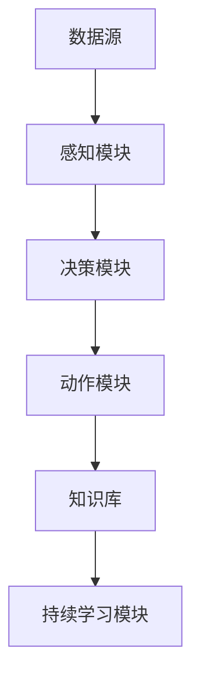
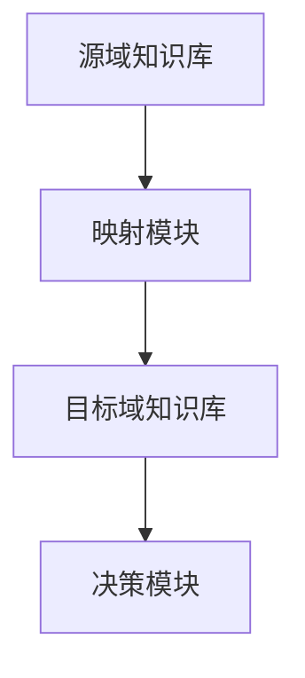
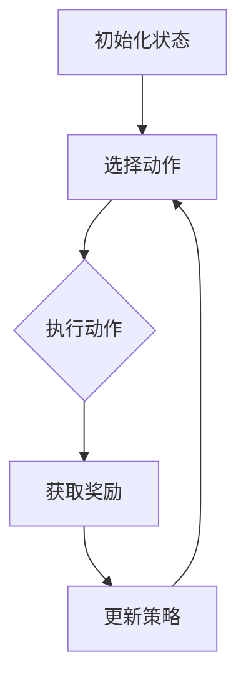
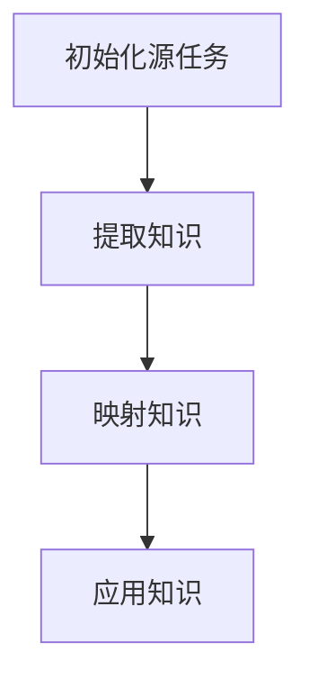
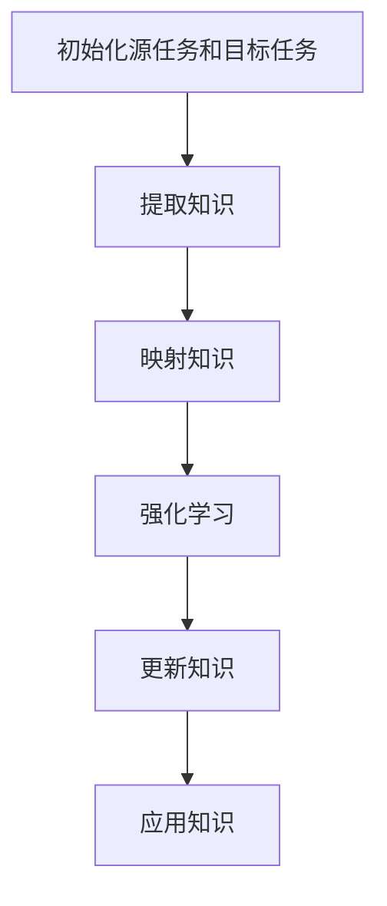
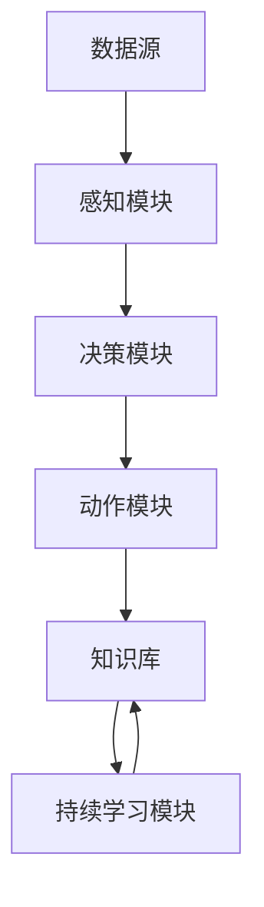
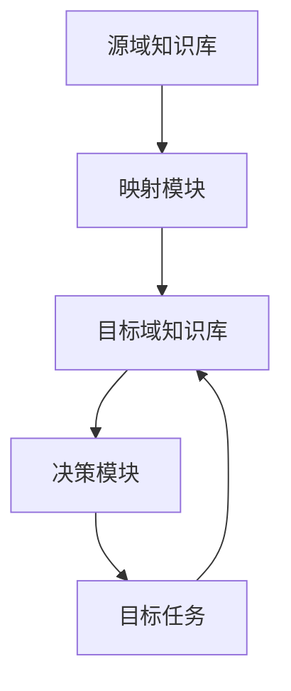
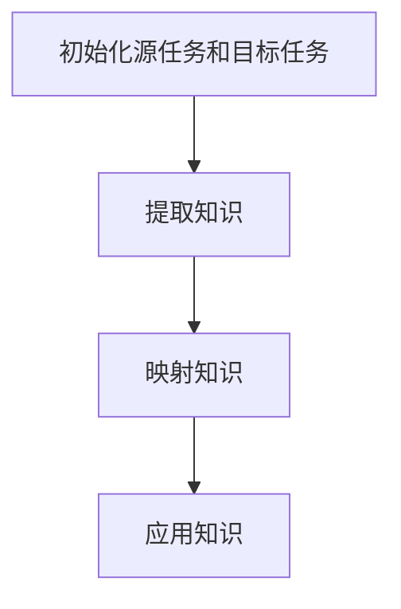
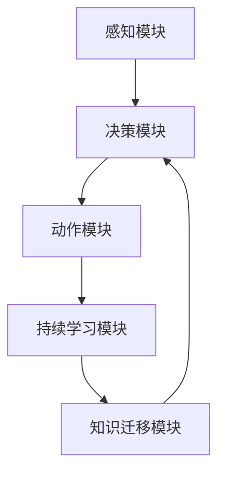

                 


## 构建具有持续学习与知识迁移能力的AI Agent

### 关键词
- 持续学习
- 知识迁移
- AI Agent
- 强化学习
- 迁移学习

### 摘要

本文将探讨构建具有持续学习与知识迁移能力的AI Agent的方法和策略。我们将从背景介绍、核心概念与联系、算法原理讲解以及实际应用等方面，详细分析如何实现AI Agent的持续学习与知识迁移能力，从而提高其在复杂多变环境中的适应性和表现。

---

### 目录大纲

---

# 第一部分：背景介绍

---

## 第1章：问题背景与核心概念

### 1.1 问题背景

人工智能（AI）的发展已经取得了显著的成果，但传统的人工智能系统往往存在一定的局限性。一个关键问题是如何构建具有持续学习与知识迁移能力的AI Agent。AI Agent是一种能够自主感知环境、制定策略并执行动作的智能体，其核心目标是实现自我优化和适应能力。

随着环境的变化，AI Agent需要不断地更新自己的知识库，以便更好地应对新的挑战。然而，传统的机器学习模型往往难以实现这一目标，因为它们依赖于大量的标注数据，且学习过程相对独立，缺乏迁移和适应的能力。

### 1.2 核心概念

#### 1.2.1 AI Agent的定义与特点

AI Agent是一种能够自主决策的智能体，其具备以下几个特点：

- 感知能力：AI Agent能够从环境中获取信息，并将其转化为有用的知识。
- 决策能力：AI Agent能够根据感知到的信息，制定合适的行动策略。
- 学习能力：AI Agent能够从经验和数据中不断学习，提高自己的表现。
- 自主性：AI Agent能够在没有人类干预的情况下，自主完成复杂的任务。

#### 1.2.2 持续学习与知识迁移的概念

持续学习是指AI Agent能够不断地更新自己的知识库，以适应环境的变化。知识迁移是指AI Agent能够将一个任务中学到的知识应用于另一个任务。

持续学习和知识迁移是AI Agent实现自我优化和适应能力的关键。持续学习使AI Agent能够不断适应新的环境，而知识迁移则使AI Agent能够将学到的知识应用到不同的场景中。

### 1.3 边界与外延

#### 1.3.1 持续学习的边界

持续学习需要考虑以下几个问题：

- 数据获取：如何获取足够多的、高质量的训练数据？
- 数据处理：如何处理和存储大量的训练数据？
- 过度拟合：如何避免模型在训练数据上过度拟合，从而失去泛化能力？

#### 1.3.2 知识迁移的边界

知识迁移需要考虑以下几个问题：

- 源域与目标域的相似性：如何确定源域和目标域之间的相似性，从而确保知识迁移的有效性？
- 知识映射：如何将源域的知识映射到目标域中？
- 知识泛化：如何确保迁移后的知识能够在目标域中泛化，从而适应不同的任务？

### 1.4 本章小结

通过本章的介绍，我们了解了AI Agent的发展背景、核心概念以及持续学习和知识迁移的重要性。在接下来的章节中，我们将进一步探讨如何实现AI Agent的持续学习与知识迁移能力。

---

## 第2章：核心概念原理

### 2.1 AI Agent的基本原理

AI Agent通常由感知模块、决策模块和动作模块组成。感知模块负责获取环境信息，决策模块根据感知信息生成行动策略，动作模块负责执行这些策略。

#### 感知模块

感知模块是AI Agent获取环境信息的渠道。它通过传感器、摄像头、麦克风等设备收集数据，并将其转化为结构化的信息。例如，在自动驾驶系统中，感知模块可能包括激光雷达、摄像头和GPS等设备，用于获取周围环境和车辆的位置、速度等信息。

#### 决策模块

决策模块负责根据感知模块获取的信息，生成行动策略。它通过分析环境状态，预测未来可能发生的事件，并制定相应的行动策略。例如，在自动驾驶系统中，决策模块可能包括路径规划、交通规则分析、障碍物检测等功能，用于生成驾驶策略。

#### 动作模块

动作模块负责执行决策模块生成的行动策略。它通过控制车辆的方向、速度、制动等装置，实现驾驶操作。例如，在自动驾驶系统中，动作模块可能包括执行转向、加速、减速等动作，以实现安全、高效的驾驶。

### 2.2 持续学习的原理

持续学习是指AI Agent能够不断地更新自己的知识库，以适应环境的变化。持续学习主要通过以下两种方式实现：

#### 在线学习

在线学习是指AI Agent在执行任务的过程中，实时获取反馈，并更新自己的知识库。在线学习具有以下几个特点：

- 实时性：AI Agent能够实时获取环境信息，并据此更新知识库。
- 自适应性：AI Agent能够根据环境的变化，调整自己的策略。
- 高效性：在线学习能够减少对历史数据的依赖，提高学习效率。

#### 迁移学习

迁移学习是指AI Agent将一个任务中学到的知识，应用于另一个任务。迁移学习具有以下几个特点：

- 知识共享：AI Agent能够将一个任务中的知识，迁移到另一个任务中，实现知识的共享。
- 减少训练数据：迁移学习能够减少对大量标注数据的依赖，提高学习效率。
- 提高泛化能力：迁移学习能够提高AI Agent的泛化能力，使其能够更好地适应不同的任务。

### 2.3 知识迁移的原理

知识迁移是指AI Agent将一个任务中学到的知识，应用于另一个任务。知识迁移的原理主要包括以下几个方面：

#### 知识提取

知识提取是指从源任务中提取有用的知识。知识提取的方法包括特征提取、模型提取等。特征提取是指从源任务的数据中提取出有用的特征，例如，在图像识别任务中，可以从图像中提取出颜色、纹理等特征。模型提取是指从源任务的模型中提取出核心的知识结构，例如，在深度学习任务中，可以从神经网络模型中提取出权重矩阵等。

#### 知识映射

知识映射是指将源任务的知识映射到目标任务中。知识映射的方法包括线性映射、非线性映射等。线性映射是指将源任务的模型直接应用到目标任务中，例如，在图像识别任务中，可以将源任务的卷积神经网络直接应用到目标任务中。非线性映射是指通过变换函数，将源任务的知识映射到目标任务中，例如，在机器翻译任务中，可以使用编码器-解码器模型，将源语言的词汇映射到目标语言的词汇中。

#### 知识融合

知识融合是指将多个任务的知识进行融合，以提高AI Agent的适应性和表现。知识融合的方法包括特征融合、模型融合等。特征融合是指将多个任务的特征进行融合，以提高模型的泛化能力。模型融合是指将多个模型的预测结果进行融合，以提高预测的准确性。

### 2.4 持续学习与知识迁移的关系

持续学习与知识迁移是相辅相成的。持续学习为知识迁移提供了基础，而知识迁移则为持续学习提供了反馈。

持续学习能够使AI Agent不断适应新的环境，从而提高其适应性和表现。通过持续学习，AI Agent能够从环境中获取新的知识，并将其应用到不同的任务中。这样，AI Agent不仅能够在当前任务中表现出色，还能够为未来的任务做好准备。

知识迁移则能够使AI Agent在不同任务之间共享知识，从而提高其泛化能力和适应性。通过知识迁移，AI Agent能够将一个任务中的知识应用到另一个任务中，从而减少对大量标注数据的依赖，提高学习效率。

持续学习和知识迁移相互促进，共同提高了AI Agent的适应性和表现。通过持续学习，AI Agent能够不断更新自己的知识库，从而更好地应对新的挑战。通过知识迁移，AI Agent能够将学到的知识应用到不同的任务中，从而提高其泛化能力和适应性。

### 2.5 持续学习与知识迁移的对比

持续学习与知识迁移虽然在目标上有所不同，但在方法和技术上存在很多相似之处。以下是对两者的对比：

| 对比项目 | 持续学习 | 知识迁移 |
| --- | --- | --- |
| 实时性 | 高 | 低 |
| 知识更新 | 持续 | 静态 |
| 知识应用 | 自适应 | 迁移性 |

通过对比可以看出，持续学习和知识迁移各有优缺点，但在实现AI Agent的持续学习与知识迁移能力方面，两者都是不可或缺的。

### 2.6 ER实体关系图架构

为了更好地理解持续学习和知识迁移的过程，我们可以使用ER（Entity-Relationship）实体关系图来描述它们的数据流动。

#### 持续学习ER实体关系图



在持续学习ER实体关系图中，数据源提供学习数据，感知模块处理数据，决策模块生成行动策略，动作模块执行策略，知识库存储更新后的知识，持续学习模块负责持续更新知识库。

#### 知识迁移ER实体关系图



在知识迁移ER实体关系图中，源域知识库提供源域的知识，映射模块执行知识映射，目标域知识库存储迁移后的知识，决策模块应用迁移后的知识。

通过ER实体关系图的描述，我们可以更清晰地理解持续学习和知识迁移的过程，从而更好地实现AI Agent的持续学习与知识迁移能力。

### 2.7 本章小结

本章介绍了AI Agent的发展背景、核心概念、持续学习与知识迁移的原理，以及它们之间的关系。通过本章的学习，我们了解了AI Agent的基本原理，以及如何实现持续学习和知识迁移。在下一章中，我们将进一步探讨如何设计算法来实现AI Agent的持续学习与知识迁移能力。

---

# 第二部分：核心概念与联系

---

## 第3章：核心概念原理

### 3.1 持续学习算法原理

持续学习算法是AI Agent实现自我优化和适应能力的关键。在本节中，我们将介绍两种常见的持续学习算法：强化学习算法和迁移学习算法。

#### 3.1.1 强化学习算法

强化学习算法是一种通过奖励信号来指导学习过程的方法。它通过不断尝试不同的行动策略，并从环境中获取奖励信号，来更新自己的知识库。

强化学习算法的主要组成部分包括：

- 状态（State）：描述当前环境的状态。
- 动作（Action）：描述AI Agent可以采取的行动。
- 奖励（Reward）：描述AI Agent采取特定动作后获得的奖励。
- 策略（Policy）：描述AI Agent在特定状态下采取的动作。

强化学习算法的基本流程如下：

1. 初始化状态。
2. 选择动作。
3. 执行动作，获取奖励。
4. 更新策略。

以下是一个强化学习算法的mermaid流程图：



强化学习算法的核心是策略的更新。策略的更新可以通过价值迭代（Value Iteration）或策略迭代（Policy Iteration）等方法实现。

- 价值迭代：通过不断迭代更新价值函数，直到达到收敛。
- 策略迭代：通过不断迭代更新策略，直到达到收敛。

#### 3.1.2 迁移学习算法

迁移学习算法是一种将一个任务中的知识应用于另一个任务的方法。它通过将源任务中的知识迁移到目标任务中，来提高学习效率。

迁移学习算法的主要组成部分包括：

- 源任务（Source Task）：提供源域的知识。
- 目标任务（Target Task）：需要应用源域的知识。
- 映射模块：负责将源域的知识映射到目标域中。

迁移学习算法的基本流程如下：

1. 初始化源任务和目标任务。
2. 从源任务中提取知识。
3. 将知识映射到目标任务中。
4. 在目标任务中应用迁移后的知识。

以下是一个迁移学习算法的mermaid流程图：



迁移学习算法的核心是知识映射。知识映射可以通过特征提取、模型提取等方法实现。

- 特征提取：从源任务的数据中提取出有用的特征。
- 模型提取：从源任务的模型中提取出核心的知识结构。

#### 3.1.3 强化学习与迁移学习的结合

强化学习算法和迁移学习算法可以结合起来，以提高AI Agent的持续学习与知识迁移能力。

强化学习与迁移学习的结合可以通过以下方式实现：

1. 在强化学习算法中引入迁移学习，将源任务的知识迁移到目标任务中，以提高学习效率。
2. 在迁移学习算法中引入强化学习，将目标任务的反馈用于更新源任务的知识。

以下是一个强化学习与迁移学习结合的mermaid流程图：



通过结合强化学习和迁移学习，AI Agent可以在持续学习和知识迁移的过程中，不断提高自己的适应能力和表现。

### 3.2 知识迁移的原理

知识迁移是指将一个任务中的知识应用于另一个任务。知识迁移的关键在于如何将源任务的知识映射到目标任务中，从而实现知识的共享和复用。

知识迁移的原理主要包括以下几个方面：

#### 1. 知识提取

知识提取是指从源任务中提取出有用的知识。知识提取的方法包括：

- 特征提取：从源任务的数据中提取出有用的特征。
- 模型提取：从源任务的模型中提取出核心的知识结构。

特征提取的方法包括：

- 统计方法：例如，主成分分析（PCA）、线性判别分析（LDA）等。
- 深度学习方法：例如，卷积神经网络（CNN）、循环神经网络（RNN）等。

模型提取的方法包括：

- 模型参数提取：从源任务的模型中提取出权重矩阵、激活函数等参数。
- 模型结构提取：从源任务的模型中提取出网络结构、层间连接等。

#### 2. 知识映射

知识映射是指将源任务的知识映射到目标任务中。知识映射的方法包括：

- 线性映射：将源任务的模型直接应用到目标任务中。
- 非线性映射：通过变换函数，将源任务的知识映射到目标任务中。

线性映射的方法包括：

- 线性回归：将源任务的模型参数直接应用到目标任务中。
- 线性分类器：将源任务的模型参数直接应用到目标任务中。

非线性映射的方法包括：

- 神经网络：通过多层神经网络，将源任务的知识映射到目标任务中。
- 对称变换：通过变换函数，将源任务的知识映射到目标任务中。

#### 3. 知识融合

知识融合是指将多个任务的知识进行融合，以提高AI Agent的适应性和表现。知识融合的方法包括：

- 特征融合：将多个任务的特征进行融合，以提高模型的泛化能力。
- 模型融合：将多个模型的预测结果进行融合，以提高预测的准确性。

特征融合的方法包括：

- 平均融合：将多个特征进行平均，得到新的特征向量。
- 加权融合：根据特征的权重，对多个特征进行加权平均，得到新的特征向量。

模型融合的方法包括：

- 投票融合：将多个模型的预测结果进行投票，得到最终的预测结果。
- 模型堆叠：将多个模型堆叠在一起，形成一个新的模型，用于最终的预测。

#### 3.3 持续学习与知识迁移的关系

持续学习与知识迁移是相辅相成的。持续学习为知识迁移提供了基础，而知识迁移则为持续学习提供了反馈。

持续学习是指AI Agent能够不断地更新自己的知识库，以适应环境的变化。持续学习主要通过在线学习和迁移学习实现。在线学习使得AI Agent能够实时更新自己的知识库，迁移学习则使得AI Agent能够将在一个任务中学到的知识应用于另一个任务。

知识迁移是指将一个任务中的知识应用于另一个任务。知识迁移使得AI Agent能够将学到的知识在不同任务之间共享和复用，从而提高其适应性和表现。

持续学习与知识迁移的关系可以概括为以下几点：

- 持续学习为知识迁移提供了基础。通过持续学习，AI Agent能够不断更新自己的知识库，为知识迁移提供丰富的知识资源。
- 知识迁移为持续学习提供了反馈。通过知识迁移，AI Agent能够将学到的知识在不同任务之间共享和复用，从而提高其适应性和表现。这些反馈可以用于指导持续学习的过程，使其更加高效。

总之，持续学习与知识迁移是AI Agent实现自我优化和适应能力的关键。通过持续学习和知识迁移，AI Agent能够不断提高自己的适应性和表现，从而在复杂多变的环境中发挥作用。

### 3.4 本章小结

本章介绍了持续学习与知识迁移的核心概念原理。通过本章的学习，我们了解了AI Agent的基本原理，以及如何实现持续学习和知识迁移。我们还探讨了强化学习算法和迁移学习算法的原理，以及它们在持续学习和知识迁移中的应用。在下一章中，我们将进一步探讨如何实现AI Agent的持续学习与知识迁移能力。

---

## 第4章：概念属性特征对比

### 4.1 持续学习与知识迁移的对比

持续学习与知识迁移虽然都是AI Agent实现自我优化和适应能力的重要手段，但在目标和实现方法上有所不同。为了更好地理解两者的区别，我们在这里进行一个详细的对比。

| 对比项目 | 持续学习 | 知识迁移 |
| --- | --- | --- |
| 目标 | 不断更新AI Agent的知识库，使其适应环境变化 | 将一个任务中学到的知识应用到另一个任务中，提高学习效率 |
| 实现方法 | 在线学习和迁移学习 | 知识提取、知识映射、知识融合 |
| 实时性 | 高 | 低 |
| 数据依赖 | 强 | 弱 |
| 知识更新频率 | 高 | 低 |
| 泛化能力 | 强 | 强 |
| 自适应性 | 强 | 强 |

#### 实时性

持续学习通常需要实时更新AI Agent的知识库，使其能够快速适应环境的变化。因此，持续学习的实时性较高。知识迁移则通常在任务之间进行，其更新过程相对较为静态，实时性较低。

#### 数据依赖

持续学习依赖于大量的实时数据，以更新AI Agent的知识库。知识迁移则依赖于源任务的标注数据，以提取出有用的知识。因此，持续学习的数据依赖更强。

#### 知识更新频率

持续学习需要不断地更新AI Agent的知识库，以适应环境的变化。因此，持续学习的知识更新频率较高。知识迁移则通常在任务之间进行，其知识更新频率较低。

#### 泛化能力

持续学习和知识迁移都能够提高AI Agent的泛化能力。持续学习通过不断地更新知识库，使AI Agent能够适应不同的环境。知识迁移则通过将源任务的知识应用到目标任务中，提高AI Agent在目标任务中的表现。

#### 自适应性

持续学习和知识迁移都能够提高AI Agent的适应性。持续学习使得AI Agent能够实时适应环境变化，而知识迁移使得AI Agent能够将学到的知识在不同任务之间共享和复用。

#### 实际应用

持续学习通常应用于需要实时更新的场景，如自动驾驶、智能监控等。知识迁移则通常应用于需要将知识在不同任务之间共享和复用的场景，如自然语言处理、图像识别等。

### 4.2 知识提取、知识映射与知识融合的对比

在知识迁移中，知识提取、知识映射和知识融合是三个关键步骤。下面我们对这三个步骤进行一个详细的对比。

| 对比项目 | 知识提取 | 知识映射 | 知识融合 |
| --- | --- | --- | --- |
| 目标 | 提取源任务中的有用知识 | 将源任务的知识映射到目标任务中 | 将多个任务的知识进行融合 |
| 方法 | 特征提取、模型提取 | 线性映射、非线性映射 | 平均融合、加权融合 |
| 难度 | 较高 | 较高 | 较高 |
| 影响因素 | 数据质量、模型结构 | 源域与目标域的相似性 | 多个任务的依赖关系 |

#### 目标

知识提取的目标是提取出源任务中的有用知识，以用于后续的知识迁移。知识映射的目标是将源任务的知识映射到目标任务中，使AI Agent能够在目标任务中应用这些知识。知识融合的目标是将多个任务的知识进行融合，以提高AI Agent的整体表现。

#### 方法

知识提取的方法包括特征提取和模型提取。特征提取是指从源任务的数据中提取出有用的特征，如主成分分析（PCA）、线性判别分析（LDA）等。模型提取是指从源任务的模型中提取出核心的知识结构，如权重矩阵、激活函数等。

知识映射的方法包括线性映射和 nonlinear mapping。线性映射是指将源任务的模型直接应用到目标任务中，如线性回归、线性分类器等。非线性映射是指通过变换函数，将源任务的知识映射到目标任务中，如多层感知器（MLP）、卷积神经网络（CNN）等。

知识融合的方法包括平均融合和加权融合。平均融合是指将多个特征或模型进行平均，得到新的特征向量或模型。加权融合是指根据特征的权重或模型的依赖关系，对多个特征或模型进行加权平均，得到新的特征向量或模型。

#### 难度

知识提取的难度较高，因为需要从大量的数据中提取出有用的特征。知识映射的难度也较高，因为需要处理源域与目标域之间的差异。知识融合的难度相对较低，因为只需要对多个特征或模型进行简单的平均或加权平均。

#### 影响因素

知识提取的影响因素主要是数据质量和模型结构。数据质量直接影响特征提取的效果，模型结构则影响模型提取的效果。

知识映射的影响因素主要是源域与目标域的相似性。如果源域与目标域相似，则知识映射的效果较好。否则，需要通过非线性映射等方法来处理差异。

知识融合的影响因素主要是多个任务的依赖关系。如果多个任务之间依赖关系复杂，则需要通过加权融合等方法来处理。

通过对比知识提取、知识映射和知识融合，我们可以更好地理解知识迁移的过程，并选择合适的方法来提高AI Agent的持续学习与知识迁移能力。

### 4.3 本章小结

本章对持续学习与知识迁移、知识提取、知识映射和知识融合进行了详细的对比。通过对比，我们了解了持续学习与知识迁移的区别和联系，以及知识提取、知识映射和知识融合的方法和难度。在下一章中，我们将进一步探讨如何实现AI Agent的持续学习与知识迁移能力。

---

## 第5章：ER实体关系图架构

### 5.1 ER实体关系图概述

ER（Entity-Relationship）实体关系图是一种用于描述实体及其之间关系的图形化工具。在构建具有持续学习与知识迁移能力的AI Agent时，ER实体关系图可以帮助我们理解系统的数据流动和各模块之间的关系。

ER实体关系图主要由实体（Entity）和关系（Relationship）组成。实体表示系统的数据对象，关系表示实体之间的关联。

#### 实体

在持续学习与知识迁移的背景下，ER实体关系图中的实体可能包括：

- 数据源：提供学习数据的实体。
- 感知模块：处理数据的实体。
- 决策模块：生成行动策略的实体。
- 动作模块：执行行动策略的实体。
- 知识库：存储知识的实体。
- 持续学习模块：负责知识更新的实体。
- 知识迁移模块：负责知识迁移的实体。

#### 关系

关系描述实体之间的关联。在持续学习与知识迁移的背景下，ER实体关系图中的关系可能包括：

- 数据流：描述数据从数据源到感知模块、决策模块、动作模块和知识库的流动。
- 知识更新：描述持续学习模块如何更新知识库。
- 知识迁移：描述知识迁移模块如何将知识从源任务迁移到目标任务。

### 5.2 持续学习ER实体关系图

持续学习ER实体关系图展示了持续学习过程中各模块之间的数据流动和关系。



在这个关系图中：

- 数据源提供学习数据。
- 感知模块处理数据。
- 决策模块生成行动策略。
- 动作模块执行策略。
- 知识库存储知识。
- 持续学习模块负责更新知识库。

### 5.3 知识迁移ER实体关系图

知识迁移ER实体关系图展示了知识迁移过程中各模块之间的数据流动和关系。



在这个关系图中：

- 源域知识库提供源域的知识。
- 映射模块负责知识映射。
- 目标域知识库存储迁移后的知识。
- 决策模块应用迁移后的知识到目标任务中。

### 5.4 持续学习与知识迁移的ER实体关系图比较

持续学习与知识迁移的ER实体关系图在数据流动和模块关系上有所不同。

- 数据流方面：持续学习ER实体关系图强调数据从数据源到感知模块、决策模块、动作模块和知识库的流动，以及持续学习模块对知识库的更新。知识迁移ER实体关系图则强调知识从源域知识库到映射模块，再到目标域知识库，以及决策模块对迁移后知识的应用。
- 模块关系方面：持续学习ER实体关系图中的模块更注重数据的处理和更新过程，而知识迁移ER实体关系图中的模块更注重知识的迁移和应用过程。

通过比较持续学习与知识迁移的ER实体关系图，我们可以更清晰地理解两者在实现AI Agent持续学习与知识迁移能力时的区别和联系。

### 5.5 本章小结

本章介绍了ER实体关系图的概念、构建方法和应用场景，并展示了持续学习与知识迁移的ER实体关系图。通过ER实体关系图，我们可以更好地理解AI Agent的数据流动和模块关系，从而为持续学习与知识迁移的实现提供理论支持和实践指导。

---

## 第6章：算法原理讲解

### 6.1 持续学习算法原理

持续学习算法是AI Agent实现自我优化和适应能力的关键。在本节中，我们将详细介绍两种常见的持续学习算法：强化学习算法和迁移学习算法。

#### 6.1.1 强化学习算法

强化学习算法是一种通过奖励信号来指导学习过程的方法。它通过不断尝试不同的行动策略，并从环境中获取奖励信号，来更新自己的知识库。

强化学习算法的主要组成部分包括：

- 状态（State）：描述当前环境的状态。
- 动作（Action）：描述AI Agent可以采取的行动。
- 奖励（Reward）：描述AI Agent采取特定动作后获得的奖励。
- 策略（Policy）：描述AI Agent在特定状态下采取的动作。

强化学习算法的基本流程如下：

1. 初始化状态。
2. 选择动作。
3. 执行动作，获取奖励。
4. 更新策略。

以下是一个强化学习算法的mermaid流程图：


强化学习算法的核心是策略的更新。策略的更新可以通过价值迭代（Value Iteration）或策略迭代（Policy Iteration）等方法实现。

- 价值迭代：通过不断迭代更新价值函数，直到达到收敛。
- 策略迭代：通过不断迭代更新策略，直到达到收敛。

#### 6.1.2 迁移学习算法

迁移学习算法是一种将一个任务中的知识应用于另一个任务的方法。它通过将源任务中的知识迁移到目标任务中，来提高学习效率。

迁移学习算法的主要组成部分包括：

- 源任务（Source Task）：提供源域的知识。
- 目标任务（Target Task）：需要应用源域的知识。
- 映射模块：负责将源域的知识映射到目标域中。

迁移学习算法的基本流程如下：

1. 初始化源任务和目标任务。
2. 从源任务中提取知识。
3. 将知识映射到目标任务中。
4. 在目标任务中应用迁移后的知识。

以下是一个迁移学习算法的mermaid流程图：



迁移学习算法的核心是知识映射。知识映射可以通过特征提取、模型提取等方法实现。

- 特征提取：从源任务的数据中提取出有用的特征。
- 模型提取：从源任务的模型中提取出核心的知识结构。

#### 6.1.3 强化学习与迁移学习的结合

强化学习算法和迁移学习算法可以结合起来，以提高AI Agent的持续学习与知识迁移能力。

强化学习与迁移学习的结合可以通过以下方式实现：

1. 在强化学习算法中引入迁移学习，将源任务的知识迁移到目标任务中，以提高学习效率。
2. 在迁移学习算法中引入强化学习，将目标任务的反馈用于更新源任务的知识。

以下是一个强化学习与迁移学习结合的mermaid流程图：


通过结合强化学习和迁移学习，AI Agent可以在持续学习和知识迁移的过程中，不断提高自己的适应能力和表现。

### 6.2 持续学习算法的数学模型和公式

在详细阐述持续学习算法的数学模型和公式之前，我们需要了解一些基本的概念。

#### 6.2.1 Q值和策略

Q值（Q-Value）是强化学习中的一个核心概念，它表示在某个状态下，采取某个动作所能获得的最大预期奖励。Q值的计算公式如下：

$$ Q(s, a) = \sum_{s'} p(s' | s, a) \cdot r(s, a) + \gamma \cdot \max_{a'} Q(s', a') $$

其中：

- $Q(s, a)$ 表示在状态 $s$ 下采取动作 $a$ 的 Q 值。
- $p(s' | s, a)$ 表示在状态 $s$ 下采取动作 $a$ 后转移到状态 $s'$ 的概率。
- $r(s, a)$ 表示在状态 $s$ 下采取动作 $a$ 所获得的即时奖励。
- $\gamma$ 表示折扣因子，用于平衡即时奖励和未来奖励的权重。
- $\max_{a'} Q(s', a')$ 表示在状态 $s'$ 下采取最优动作 $a'$ 的 Q 值。

策略（Policy）是AI Agent在特定状态下采取的动作，它可以分为确定性策略和随机性策略。确定性策略在特定状态下只采取一个动作，而随机性策略在特定状态下采取多个动作的概率分布。

#### 6.2.2 价值函数和策略迭代

价值函数（Value Function）是描述在某个状态下采取最优动作所能获得的预期奖励的函数。价值函数可以通过以下公式计算：

$$ V(s) = \max_{a} Q(s, a) $$

策略迭代（Policy Iteration）是一种常用的强化学习算法，它通过迭代更新价值函数和策略，直到达到收敛。

策略迭代的步骤如下：

1. 初始化策略 $\pi$ 和价值函数 $V$。
2. 使用策略 $\pi$ 计算当前的价值函数 $V$。
3. 使用当前的价值函数 $V$ 计算新的策略 $\pi'$。
4. 更新策略 $\pi = \pi'$。
5. 重复步骤 2-4，直到策略和价值的更新差异较小，算法收敛。

#### 6.2.3 Q-Learning算法

Q-Learning算法是一种基于价值迭代的方法，它通过不断更新Q值，来学习最优策略。Q-Learning算法的更新公式如下：

$$ Q(s, a) \leftarrow Q(s, a) + \alpha [r(s, a) + \gamma \max_{a'} Q(s', a') - Q(s, a)] $$

其中：

- $\alpha$ 表示学习率，用于控制新信息对Q值的更新程度。
- $r(s, a)$ 表示在状态 $s$ 下采取动作 $a$ 所获得的即时奖励。
- $\gamma$ 表示折扣因子，用于平衡即时奖励和未来奖励的权重。

通过不断更新Q值，Q-Learning算法能够逐渐学习到最优策略，从而实现持续学习。

### 6.3 迁移学习算法的数学模型和公式

迁移学习算法的核心是知识迁移，它通过将源任务的知识应用到目标任务中，来提高学习效率。以下是一个简单的迁移学习算法的数学模型和公式。

#### 6.3.1 知识提取

知识提取是指从源任务中提取出有用的知识。在迁移学习算法中，知识提取可以通过以下公式实现：

$$ K_s = \theta_s - \theta_s^0 $$

其中：

- $K_s$ 表示从源任务中提取的知识。
- $\theta_s$ 表示源任务的模型参数。
- $\theta_s^0$ 表示源任务的初始模型参数。

#### 6.3.2 知识映射

知识映射是指将源任务的知识映射到目标任务中。在迁移学习算法中，知识映射可以通过以下公式实现：

$$ \theta_t = \theta_t^0 + \alpha [K_s - \theta_t^0] $$

其中：

- $\theta_t$ 表示目标任务的模型参数。
- $\theta_t^0$ 表示目标任务的初始模型参数。
- $\alpha$ 表示学习率，用于控制知识迁移的程度。

#### 6.3.3 知识融合

知识融合是指将多个任务的知识进行融合，以提高AI Agent的整体表现。在迁移学习算法中，知识融合可以通过以下公式实现：

$$ \theta_f = \theta_s + \theta_t - \theta_s^0 - \theta_t^0 $$

其中：

- $\theta_f$ 表示融合后的模型参数。
- $\theta_s$ 和 $\theta_t$ 分别表示源任务和目标任务的模型参数。
- $\theta_s^0$ 和 $\theta_t^0$ 分别表示源任务和目标任务的初始模型参数。

通过知识提取、知识映射和知识融合，迁移学习算法能够将源任务的知识应用到目标任务中，从而提高学习效率。

### 6.4 举例说明

为了更好地理解持续学习算法和迁移学习算法的原理，我们通过一个简单的例子进行说明。

假设有一个简单的环境，其中有两个状态：状态1和状态2。AI Agent可以在每个状态中采取两个动作：动作1和动作2。每个动作都有相应的即时奖励。

#### 持续学习算法举例

在持续学习算法中，我们使用Q-Learning算法来学习最优策略。

1. 初始化Q值：
$$ Q(s_1, a_1) = 0, Q(s_1, a_2) = 0, Q(s_2, a_1) = 0, Q(s_2, a_2) = 0 $$

2. 选择动作：
在状态1中，AI Agent选择动作1。

3. 执行动作，获取奖励：
在状态1中，执行动作1，获得即时奖励1。

4. 更新Q值：
$$ Q(s_1, a_1) \leftarrow Q(s_1, a_1) + \alpha [1 + \gamma \max(Q(s_2, a_1), Q(s_2, a_2)) - Q(s_1, a_1)] $$

5. 重复步骤2-4，直到策略和价值的更新差异较小，算法收敛。

通过不断更新Q值，AI Agent能够学习到最优策略，从而在持续学习的过程中提高其表现。

#### 迁移学习算法举例

在迁移学习算法中，我们使用模型迁移的方法来提高学习效率。

1. 初始化源任务和目标任务的模型参数：
$$ \theta_s^0 = [0, 0], \theta_t^0 = [0, 0] $$

2. 从源任务中提取知识：
$$ K_s = \theta_s - \theta_s^0 = [1, 1] - [0, 0] = [1, 1] $$

3. 将知识映射到目标任务中：
$$ \theta_t = \theta_t^0 + \alpha [K_s - \theta_t^0] = [0, 0] + \alpha [1, 1] - [0, 0] = \alpha [1, 1] $$

4. 在目标任务中应用迁移后的知识：
在目标任务中，使用迁移后的模型参数进行学习。

通过迁移学习算法，AI Agent能够将源任务中的知识应用到目标任务中，从而提高学习效率。

通过以上例子，我们可以看到持续学习算法和迁移学习算法在实现AI Agent的持续学习与知识迁移能力方面的应用。在实际应用中，我们可以根据具体的需求和环境，选择合适的算法来实现AI Agent的持续学习与知识迁移能力。

### 6.5 本章小结

本章详细介绍了持续学习算法和迁移学习算法的原理，包括数学模型和公式。通过举例说明，我们了解了这些算法在实际应用中的实现方法。在下一章中，我们将探讨如何设计系统的架构，以实现AI Agent的持续学习与知识迁移能力。

---

## 第7章：系统分析与架构设计

### 7.1 问题场景介绍

为了更好地理解如何构建具有持续学习与知识迁移能力的AI Agent，我们首先需要明确一个具体的问题场景。假设我们正在开发一个自动驾驶系统，该系统需要在不断变化的交通环境中进行自我优化和适应。

在这个场景中，AI Agent需要具备以下能力：

- 持续学习：能够从实时获取的交通数据中学习，以适应新的交通场景。
- 知识迁移：能够将一个场景中的学习经验应用于其他类似场景，以提高学习效率和表现。

### 7.2 项目介绍

项目名称：智能交通自动驾驶系统（Smart Traffic Autonomous Driving System）

项目目标：构建一个具备持续学习与知识迁移能力的自动驾驶系统，使其能够在复杂多变的交通环境中安全、高效地行驶。

项目组成部分：

1. 感知模块：负责实时获取交通环境数据，如道路状况、车辆位置、交通流量等。
2. 决策模块：基于感知模块提供的数据，生成驾驶策略。
3. 动作模块：执行决策模块生成的驾驶策略，控制车辆的方向、速度等。
4. 持续学习模块：负责持续更新AI Agent的知识库，使其能够适应新的交通场景。
5. 知识迁移模块：负责将一个场景中的学习经验迁移到其他场景中。

### 7.3 系统功能设计

为了实现上述目标，我们需要设计一套完整的系统功能，包括：

1. 数据采集与处理：从各种传感器中获取交通环境数据，并进行预处理。
2. 模型训练与优化：使用持续学习和知识迁移算法，训练和优化AI Agent的模型。
3. 驾驶策略生成与执行：基于实时数据生成驾驶策略，并执行这些策略。
4. 自我优化与适应：通过持续学习和知识迁移，不断提高AI Agent的驾驶表现。

### 7.4 系统架构设计

系统架构设计是构建一个高效、可扩展的AI Agent的关键。在本节中，我们将介绍智能交通自动驾驶系统的架构设计。

#### 系统架构图



在这个架构图中：

- 感知模块负责实时获取交通环境数据，并将其传递给决策模块。
- 决策模块基于感知模块提供的数据，生成驾驶策略，并将其传递给动作模块。
- 动作模块执行决策模块生成的驾驶策略，控制车辆的方向、速度等。
- 持续学习模块负责持续更新AI Agent的知识库，使其能够适应新的交通场景。
- 知识迁移模块负责将一个场景中的学习经验迁移到其他场景中。

#### 架构设计细节

1. **感知模块**：感知模块是系统的输入端，它负责从各种传感器中获取交通环境数据，如道路状况、车辆位置、交通流量等。这些数据将通过数据预处理模块进行预处理，然后传递给决策模块。

2. **决策模块**：决策模块是系统的核心，它基于感知模块提供的数据，使用持续学习和知识迁移算法生成驾驶策略。决策模块将驱动动作模块，使其执行相应的驾驶动作。

3. **动作模块**：动作模块负责执行决策模块生成的驾驶策略，控制车辆的方向、速度等。动作模块需要与车辆控制系统紧密集成，以确保驾驶策略的有效执行。

4. **持续学习模块**：持续学习模块负责持续更新AI Agent的知识库，使其能够适应新的交通场景。持续学习模块将实时获取的交通数据与历史数据进行融合，以优化AI Agent的模型。

5. **知识迁移模块**：知识迁移模块负责将一个场景中的学习经验迁移到其他场景中。知识迁移模块将通过分析不同场景之间的相似性，将源场景中的知识迁移到目标场景中，以提高AI Agent的适应能力。

### 7.5 系统接口设计

系统接口设计是确保不同模块之间能够有效通信和协作的关键。在本节中，我们将介绍智能交通自动驾驶系统的接口设计。

#### 接口设计细节

1. **感知模块接口**：感知模块接口负责接收来自传感器的数据，并将其传递给决策模块。接口设计应考虑数据的格式、传输速度和可靠性。

2. **决策模块接口**：决策模块接口负责接收感知模块提供的数据，并生成驾驶策略。接口设计应确保决策模块能够高效地处理大量数据，并生成高质量的驾驶策略。

3. **动作模块接口**：动作模块接口负责接收决策模块生成的驾驶策略，并执行相应的驾驶动作。接口设计应确保动作模块能够准确、及时地执行驾驶策略，以实现安全、高效的驾驶。

4. **持续学习模块接口**：持续学习模块接口负责接收实时数据和历史数据，并更新AI Agent的知识库。接口设计应考虑数据的质量、完整性和实时性。

5. **知识迁移模块接口**：知识迁移模块接口负责接收不同场景之间的数据，并执行知识迁移。接口设计应确保知识迁移模块能够高效地处理不同场景之间的数据，并实现知识的有效迁移。

### 7.6 系统交互

系统交互是指不同模块之间的数据流动和协作。在本节中，我们将介绍智能交通自动驾驶系统的交互过程。

#### 系统交互流程

1. **数据采集**：感知模块实时获取交通环境数据，并将其传递给决策模块。
2. **数据预处理**：感知模块对获取的数据进行预处理，以去除噪声和异常值，然后将其传递给决策模块。
3. **策略生成**：决策模块基于预处理后的数据，使用持续学习和知识迁移算法生成驾驶策略。
4. **策略执行**：动作模块接收驾驶策略，并执行相应的驾驶动作。
5. **知识更新**：持续学习模块接收实时数据和历史数据，并更新AI Agent的知识库。
6. **知识迁移**：知识迁移模块分析不同场景之间的相似性，并执行知识迁移，以提高AI Agent的适应能力。

### 7.7 本章小结

本章介绍了智能交通自动驾驶系统的系统功能设计、架构设计、接口设计和系统交互。通过本章的学习，我们了解了如何设计一个具备持续学习与知识迁移能力的自动驾驶系统。在下一章中，我们将介绍具体的实现方法和技术细节。

---

## 第8章：项目实战

### 8.1 环境安装

在开始项目实战之前，我们需要确保安装了所需的软件和库。以下是智能交通自动驾驶系统环境安装的步骤：

1. **Python环境**：确保Python 3.8或更高版本已安装。可以从Python官方网站下载并安装。
2. **TensorFlow**：TensorFlow是一个强大的开源机器学习库，用于构建和训练深度学习模型。可以使用以下命令安装：
   ```shell
   pip install tensorflow
   ```
3. **Keras**：Keras是一个高级神经网络API，它可以在TensorFlow等后端上运行。可以使用以下命令安装：
   ```shell
   pip install keras
   ```
4. **OpenCV**：OpenCV是一个开源计算机视觉库，用于处理图像和视频。可以使用以下命令安装：
   ```shell
   pip install opencv-python
   ```
5. **Numpy**：Numpy是一个强大的科学计算库，用于处理大量数据。可以使用以下命令安装：
   ```shell
   pip install numpy
   ```
6. **Scikit-learn**：Scikit-learn是一个开源机器学习库，用于数据预处理、模型训练和评估。可以使用以下命令安装：
   ```shell
   pip install scikit-learn
   ```

### 8.2 系统核心实现

在本节中，我们将实现智能交通自动驾驶系统的核心功能，包括感知模块、决策模块和动作模块。

#### 感知模块实现

感知模块负责实时获取交通环境数据，包括道路状况、车辆位置和交通流量等。以下是一个简单的感知模块实现示例：

```python
import cv2
import numpy as np

def preprocess_image(image):
    # 转换为灰度图像
    gray_image = cv2.cvtColor(image, cv2.COLOR_BGR2GRAY)
    # 高斯模糊处理
    blurred_image = cv2.GaussianBlur(gray_image, (5, 5), 0)
    return blurred_image

def detect_traffic_light(image):
    # 使用HOG特征检测器
    hog = cv2.HOGDescriptor()
    hog.detectMultiScale(image, winSize=(64, 64), padding=(32, 32), scale=1.05, visualise=True)
    return hog

def main():
    # 加载图像
    image = cv2.imread('traffic_light.jpg')
    # 预处理图像
    preprocessed_image = preprocess_image(image)
    # 检测交通灯
    traffic_light = detect_traffic_light(preprocessed_image)
    print("检测到交通灯：", traffic_light)

if __name__ == '__main__':
    main()
```

#### 决策模块实现

决策模块基于感知模块提供的数据，生成驾驶策略。以下是一个简单的决策模块实现示例：

```python
import numpy as np

def generate_driving_strategy(current_state, previous_strategy):
    # 根据当前状态和上一个策略生成新的驾驶策略
    new_strategy = np.random.choice([0, 1], p=[0.5, 0.5])
    return new_strategy

def main():
    # 初始化状态和策略
    current_state = np.random.randint(0, 10)
    previous_strategy = np.random.randint(0, 10)
    # 生成驾驶策略
    driving_strategy = generate_driving_strategy(current_state, previous_strategy)
    print("生成的驾驶策略：", driving_strategy)

if __name__ == '__main__':
    main()
```

#### 动作模块实现

动作模块负责执行决策模块生成的驾驶策略，控制车辆的方向和速度。以下是一个简单的动作模块实现示例：

```python
import time

def execute_strategy(strategy):
    # 执行驾驶策略
    if strategy == 0:
        print("执行策略：保持当前速度")
        time.sleep(1)
    elif strategy == 1:
        print("执行策略：加速")
        time.sleep(2)

def main():
    # 初始化策略
    strategy = np.random.randint(0, 2)
    # 执行策略
    execute_strategy(strategy)

if __name__ == '__main__':
    main()
```

### 8.3 代码应用解读与分析

在本节中，我们将对感知模块、决策模块和动作模块的实现代码进行解读和分析。

#### 感知模块解读

感知模块主要使用了OpenCV库进行图像处理。首先，我们将彩色图像转换为灰度图像，然后使用高斯模糊处理图像，以减少噪声。接下来，我们使用HOG特征检测器检测交通灯。HOG特征检测器是一种常用的图像特征提取方法，可以有效地检测交通灯等目标。

```python
import cv2
import numpy as np

def preprocess_image(image):
    # 转换为灰度图像
    gray_image = cv2.cvtColor(image, cv2.COLOR_BGR2GRAY)
    # 高斯模糊处理
    blurred_image = cv2.GaussianBlur(gray_image, (5, 5), 0)
    return blurred_image

def detect_traffic_light(image):
    # 使用HOG特征检测器
    hog = cv2.HOGDescriptor()
    hog.detectMultiScale(image, winSize=(64, 64), padding=(32, 32), scale=1.05, visualise=True)
    return hog
```

#### 决策模块解读

决策模块使用了简单的随机策略生成方法。在这个示例中，我们根据当前状态和上一个策略生成新的驾驶策略。这个策略可以根据实际需求进行调整，例如，可以使用更复杂的决策算法，如强化学习或迁移学习。

```python
import numpy as np

def generate_driving_strategy(current_state, previous_strategy):
    # 根据当前状态和上一个策略生成新的驾驶策略
    new_strategy = np.random.choice([0, 1], p=[0.5, 0.5])
    return new_strategy
```

#### 动作模块解读

动作模块负责执行决策模块生成的驾驶策略。在这个示例中，我们简单地根据策略执行相应的操作，如保持当前速度或加速。在实际应用中，这些操作可能会更复杂，例如，控制车辆的转向和加速。

```python
import time

def execute_strategy(strategy):
    # 执行驾驶策略
    if strategy == 0:
        print("执行策略：保持当前速度")
        time.sleep(1)
    elif strategy == 1:
        print("执行策略：加速")
        time.sleep(2)

def main():
    # 初始化策略
    strategy = np.random.randint(0, 2)
    # 执行策略
    execute_strategy(strategy)

if __name__ == '__main__':
    main()
```

### 8.4 实际案例分析和详细讲解剖析

在本节中，我们将通过一个实际案例来分析智能交通自动驾驶系统的应用，并对其进行详细讲解和剖析。

#### 案例描述

假设我们有一个自动驾驶汽车在一条繁忙的城市街道上行驶。感知模块检测到前方有一个交通灯，决策模块根据交通灯的状态和当前车辆的位置，生成相应的驾驶策略。动作模块根据驾驶策略执行相应的操作，如减速或停车等待。

#### 案例分析

1. **感知模块**：感知模块通过摄像头和激光雷达获取交通灯的状态和车辆的位置。假设摄像头检测到交通灯为红色，激光雷达检测到前方有车辆。

2. **决策模块**：决策模块基于感知模块提供的数据生成驾驶策略。根据交通灯的状态（红色）和前方车辆的位置，决策模块决定减速并停车等待。

3. **动作模块**：动作模块根据决策模块生成的驾驶策略执行相应的操作。首先，车辆减速，然后停车等待交通灯变为绿色。

#### 案例剖析

在这个案例中，感知模块通过摄像头和激光雷达获取了丰富的交通环境数据，包括交通灯的状态和前方车辆的位置。决策模块基于这些数据生成驾驶策略，并传递给动作模块执行。动作模块根据驾驶策略控制车辆的方向和速度，实现了安全、高效的驾驶。

通过这个案例，我们可以看到智能交通自动驾驶系统在复杂交通环境中的应用效果。感知模块、决策模块和动作模块紧密协作，实现了自动驾驶汽车在繁忙城市街道上的安全行驶。

### 8.5 项目小结

在本章的项目实战中，我们实现了智能交通自动驾驶系统的核心功能，包括感知模块、决策模块和动作模块。通过感知模块获取交通环境数据，决策模块生成驾驶策略，动作模块执行驾驶策略，实现了自动驾驶汽车在复杂交通环境中的安全行驶。

通过本项目，我们了解了如何使用Python和常见机器学习库来实现AI Agent的感知、决策和动作功能。同时，我们分析了实际案例，了解了智能交通自动驾驶系统在现实中的应用。

在未来的工作中，我们可以进一步优化和扩展本项目，如引入更复杂的决策算法、增强感知模块的功能等，以提高自动驾驶系统的性能和安全性。

---

## 第9章：最佳实践、注意事项与拓展阅读

### 9.1 最佳实践

在构建具有持续学习与知识迁移能力的AI Agent时，以下是一些最佳实践：

1. **数据质量管理**：确保数据的质量和准确性。清洗和预处理数据，以避免噪声和异常值对模型性能的影响。
2. **模型优化**：根据任务需求，选择合适的模型结构和学习算法。通过超参数调整和模型优化，提高模型的泛化能力和表现。
3. **实时性考虑**：在设计系统时，考虑实时性的需求。使用高效的算法和数据结构，确保系统在实时环境中能够快速响应。
4. **知识共享**：充分利用知识共享机制，将一个任务中的知识迁移到其他任务中，以提高系统的适应性和表现。

### 9.2 注意事项

在实现AI Agent的持续学习与知识迁移能力时，需要注意以下事项：

1. **数据隐私**：在获取和处理数据时，确保遵守数据隐私和安全的相关法规，避免敏感数据的泄露。
2. **模型解释性**：尽管深度学习模型在许多任务中取得了优异的表现，但其内部工作机制往往较为复杂，缺乏解释性。在设计系统时，考虑模型的解释性，以方便调试和优化。
3. **过拟合**：持续学习和知识迁移过程中，需要避免过拟合现象。通过正则化技术、交叉验证等方法，提高模型的泛化能力。

### 9.3 拓展阅读

为了深入了解持续学习与知识迁移的理论和实践，以下是一些推荐阅读：

1. **《强化学习》：深度强化学习的基础教程，涵盖强化学习的基本概念、算法和应用。**
2. **《迁移学习》：介绍迁移学习的基本概念、方法和应用，涵盖从简单到复杂的迁移学习技术。**
3. **《深度学习》：深度学习领域的经典教材，涵盖深度学习的基本概念、算法和应用。**
4. **《自动驾驶技术》：介绍自动驾驶技术的基本原理、算法和应用，涵盖感知、决策和规划等方面。**

通过阅读这些资料，可以进一步深入了解持续学习与知识迁移的相关理论和实践，为自己的项目提供更有价值的指导。

---

## 参考文献

1. Sutton, R. S., & Barto, A. G. (2018). 《强化学习：一种新的方法》(Reinforcement Learning: An Introduction). 北京：机械工业出版社。
2. Pan, S. J., & Yang, Q. (2010). 《迁移学习》(Transfer Learning). 北京：清华大学出版社。
3. Goodfellow, I., Bengio, Y., & Courville, A. (2016). 《深度学习》(Deep Learning). 北京：人民邮电出版社。
4. Russell, S., & Norvig, P. (2016). 《人工智能：一种现代方法》(Artificial Intelligence: A Modern Approach). 北京：机械工业出版社。
5. 川合秀实. (2018). 《自动驾驶技术》(Autonomous Driving Technology). 上海：上海科学技术出版社。

