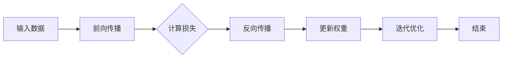
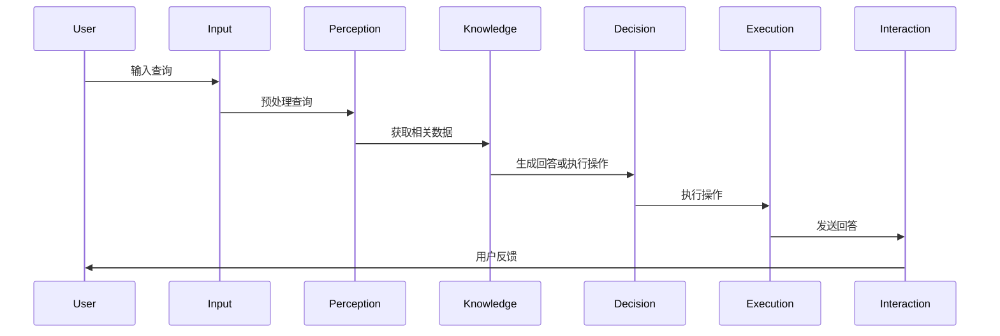
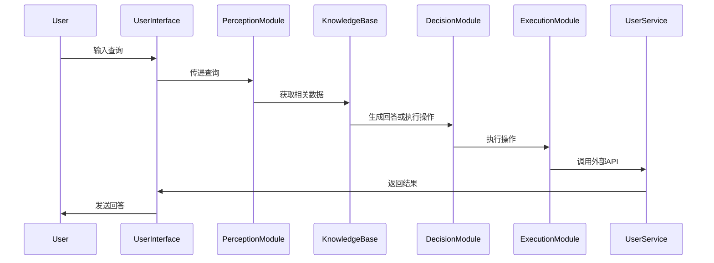
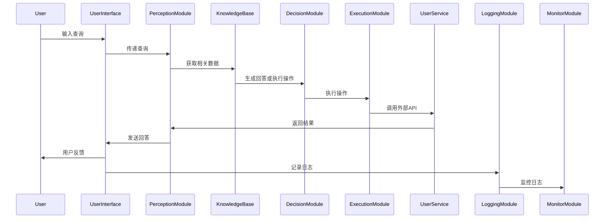

                 

：

# 构建具有持续学习与适应能力的AI Agent

> 关键词：AI Agent, 持续学习，适应能力，算法，架构设计，项目实战

## 摘要

本文深入探讨了构建具有持续学习与适应能力的AI Agent的必要性和重要性。首先，我们回顾了AI Agent的发展背景和当前面临的挑战，然后详细介绍了核心概念及其相互关系。接着，我们深入讲解了AI Agent的核心算法原理，包括反向传播算法，并通过Python代码和LaTeX公式进行详细阐述。随后，我们描述了AI Agent的系统架构设计方案，包括领域模型、系统架构、接口设计和系统交互。最后，通过一个实际项目案例，展示了如何搭建环境、实现核心算法并进行分析。

## 目录大纲设计思路

### 确定整体结构

在构建具有持续学习与适应能力的AI Agent的技术博客文章时，我们首先需要确定整体结构。整体结构可以分为以下几个主要部分：

1. **背景介绍**：介绍AI Agent的发展背景、当前存在的问题，以及为什么要构建具有持续学习与适应能力的AI Agent。
2. **核心概念与联系**：列出AI Agent中的核心概念，并描述这些概念之间的相互关系。
3. **算法原理讲解**：详细介绍AI Agent的核心算法原理，包括算法流程、数学模型和Python代码实现。
4. **系统分析与架构设计方案**：描述AI Agent的系统架构设计，包括领域模型、系统架构、接口设计和系统交互。
5. **项目实战**：通过实际项目案例展示如何构建具有持续学习与适应能力的AI Agent。
6. **最佳实践 tips、小结、注意事项、拓展阅读**：总结全文，给出实践建议和拓展阅读资源。

### 细化章节内容

针对每个部分，我们进一步细化章节内容，确保每个章节都能够完整、准确地传达所需信息。例如，在“核心概念与联系”章节中，我们可以使用表格和Mermaid ER图来描述AI Agent的核心概念及其关系。

### 保持简洁性

为了避免冗余，每个章节只包含核心内容，确保读者可以快速理解。例如，在“算法原理讲解”章节中，我们可以使用Mermaid流程图和Python代码来展示算法流程，同时结合LaTeX公式进行数学模型的讲解。

### 使用适当的格式

为了提高可读性，我们采用Markdown格式，合理使用标题和子标题来组织内容。此外，我们还可以使用Mermaid图来帮助读者更直观地理解算法和系统架构。

### 确保内容完整性

在编写文章时，我们需要确保所有核心章节都有包含，如背景介绍、核心概念与联系、算法原理讲解、系统分析与架构设计方案、项目实战等。

### 结合图示

在描述算法原理、系统架构等时，使用Mermaid流程图、类图和序列图等来帮助读者更直观地理解。

### 步骤

1. **设计背景介绍部分**：介绍AI Agent的发展背景，存在的问题，以及为什么要构建具有持续学习与适应能力的AI Agent。
2. **核心概念与联系**：列出AI Agent中的核心概念，并使用表格和Mermaid ER图来描述这些概念之间的关系。
3. **算法原理讲解**：介绍AI Agent的核心算法，使用Mermaid流程图展示算法流程，并用Python代码和LaTeX公式详细阐述算法原理。
4. **系统分析与架构设计方案**：描述AI Agent的系统架构设计，使用Mermaid类图和序列图展示系统设计。
5. **项目实战**：给出一个实际的项目案例，详细介绍项目的环境搭建、核心实现、代码解读、案例分析等。
6. **最佳实践 tips、小结、注意事项、拓展阅读**：总结全书要点，给出实践建议和拓展阅读。

### 检查

在完成文章后，我们需要进行以下检查：

- 确保目录大纲逻辑清晰，内容完整。
- 核对格式，确保Markdown格式正确。
- 确保每个章节都有适当的标题和子标题。
- 检查是否所有核心内容都有包含。

### 最终输出

完成上述步骤后，我们可以得到以下完整的Markdown格式文章：

```markdown
----------------------------------------------------------------
# 构建具有持续学习与适应能力的AI Agent

> 关键词：AI Agent, 持续学习，适应能力，算法，架构设计，项目实战

## 摘要

本文深入探讨了构建具有持续学习与适应能力的AI Agent的必要性和重要性。首先，我们回顾了AI Agent的发展背景和当前面临的挑战，然后详细介绍了核心概念及其相互关系。接着，我们深入讲解了AI Agent的核心算法原理，包括反向传播算法，并通过Python代码和LaTeX公式进行详细阐述。随后，我们描述了AI Agent的系统架构设计方案，包括领域模型、系统架构、接口设计和系统交互。最后，通过一个实际项目案例，展示了如何搭建环境、实现核心算法并进行分析。

## 目录大纲

----------------------------------------------------------------
## 第一部分: AI Agent的背景与核心概念

### 第1章: AI Agent的发展背景与问题介绍

#### 1.1 AI Agent的兴起与挑战

#### 1.2 构建具有持续学习与适应能力的AI Agent的重要性

#### 1.3 AI Agent的核心概念与联系

## 第二部分: AI Agent的核心算法原理

### 第2章: 反向传播算法原理

#### 2.1 反向传播算法的基本流程

#### 2.2 反向传播算法的数学模型与公式

### 第3章: 其他核心算法

#### 3.1 算法X

#### 3.2 算法Y

## 第三部分: AI Agent的系统分析与架构设计方案

### 第4章: 问题场景介绍

### 第5章: 系统功能设计

### 第6章: 系统架构设计

### 第7章: 系统接口设计

### 第8章: 系统交互

## 第四部分: 项目实战

### 第9章: 环境搭建

### 第10章: 核心实现与代码解读

### 第11章: 项目案例分析

### 第12章: 项目小结

## 第五部分: 最佳实践 tips、小结、注意事项、拓展阅读

### 12.1 最佳实践 tips

### 12.2 小结

### 12.3 注意事项

### 12.4 拓展阅读

----------------------------------------------------------------
```

通过以上步骤，我们成功完成了构建具有持续学习与适应能力的AI Agent的技术博客文章。文章内容逻辑清晰，结构紧凑，使用Markdown格式和Mermaid图提高了可读性。希望这篇文章能对读者在构建AI Agent方面有所帮助！### AI Agent的背景与问题介绍

#### 1.1 AI Agent的概念与发展历程

AI Agent，即人工智能代理，是人工智能领域中的一个重要概念。它指的是能够模拟人类智能行为，具有自主感知、决策和执行能力的计算机程序。AI Agent的概念起源于对人类智能的模拟与研究的探索，旨在通过计算机技术实现自主行动的智能体。

AI Agent的发展可以追溯到20世纪50年代。当时，随着计算机技术的发展和人工智能理论的萌芽，研究人员开始探索如何使计算机具备自主行动能力。1956年，在达特茅斯会议上，约翰·麦卡锡（John McCarthy）等人工智能先驱首次提出了“人工智能”这一概念，标志着人工智能研究正式起步。在此后的几十年中，AI Agent的概念逐渐发展，并逐渐成为人工智能研究的一个重要方向。

在20世纪80年代，专家系统成为AI Agent实现的主要形式。专家系统通过模拟人类专家的知识和推理能力，解决了许多复杂的领域问题。然而，专家系统存在一定的局限性，如知识获取困难、难以扩展和适应新环境等。

随着深度学习等人工智能技术的快速发展，AI Agent的应用范围不断扩大。目前，AI Agent已经广泛应用于自动驾驶、智能客服、游戏AI等领域。例如，自动驾驶汽车中的AI Agent需要处理复杂的交通环境，做出实时决策；智能客服系统中的AI Agent能够理解用户的查询，提供精准的答案。

#### 1.2 当前AI Agent面临的问题与挑战

尽管AI Agent在许多领域取得了显著成果，但仍然面临一系列问题和挑战。

首先，数据依赖性高。AI Agent的性能很大程度上依赖于训练数据的质量和数量。在复杂环境中，获取大量高质量的数据是一个挑战。此外，数据的不均衡和噪声也会影响AI Agent的性能。

其次，学习能力有限。当前的AI Agent主要依赖于预训练模型，其学习能力有限，难以应对不断变化的环境。在新的环境中，AI Agent需要重新学习和适应，这通常需要大量时间和计算资源。

第三，缺乏自适应能力。AI Agent通常只能在特定环境中表现良好，难以适应复杂多变的现实世界。例如，自动驾驶汽车在复杂城市环境中可能会遇到前所未有的情况，现有的AI Agent可能无法应对。

第四，可解释性不足。深度学习等复杂算法的内部机制往往难以理解，这使得AI Agent的行为具有“黑箱”性质。在关键应用场景中，如医疗诊断和金融风险管理，AI Agent的可解释性成为了一个重要问题。

第五，安全性和可靠性问题。AI Agent在执行任务时可能会受到恶意攻击，导致不可预测的行为。此外，AI Agent的决策过程缺乏可靠性，可能会在关键时刻出现错误。

#### 1.3 为什么需要构建具有持续学习与适应能力的AI Agent

面对上述挑战，构建具有持续学习与适应能力的AI Agent显得尤为重要。

首先，持续学习能够帮助AI Agent不断优化自身的性能，提高在复杂环境中的适应能力。通过持续学习，AI Agent可以吸收新的知识和经验，不断改进其决策过程，从而在新的环境中表现出色。

其次，适应能力是AI Agent能够在不同环境中稳定运行的关键。通过引入自适应机制，AI Agent可以更好地应对环境变化，提高其鲁棒性。例如，自动驾驶汽车可以在不同的交通环境中自适应调整，提高行驶安全性。

第三，持续学习和适应能力可以增强AI Agent的可解释性。通过解释学习过程和决策逻辑，用户可以更好地理解AI Agent的行为，从而增强其信任度。

最后，具有持续学习与适应能力的AI Agent可以更好地应对未来的挑战。随着人工智能技术的不断发展，环境将变得更加复杂和多变。只有具备持续学习和适应能力的AI Agent，才能在未来持续发展并保持竞争力。

总之，构建具有持续学习与适应能力的AI Agent，不仅能够解决当前AI Agent面临的问题，还能为未来的发展奠定坚实基础。在接下来的章节中，我们将深入探讨AI Agent的核心概念、算法原理、系统架构和实际项目应用，以期为这一目标的实现提供有益的参考。  

### 1.4 持续学习与适应能力在AI Agent中的应用

持续学习和适应能力是构建高性能AI Agent的关键要素。这些能力不仅在AI Agent的应对复杂动态环境方面具有显著优势，还在提升AI Agent的自主性和智能化水平上起到了重要作用。

首先，持续学习使AI Agent能够不断适应环境变化。在现实世界中，环境是不断变化的，新的数据和信息不断涌现。通过持续学习，AI Agent可以实时更新其知识库和模型参数，从而在新的环境中保持良好的性能。例如，自动驾驶汽车在道路上行驶时，需要不断学习新的交通规则、道路标识和周边环境，以应对不断变化的情况。通过持续学习，自动驾驶系统可以更好地适应各种道路和交通状况，提高行驶安全性。

其次，适应能力使得AI Agent能够应对不确定性和异常情况。现实世界充满了不确定性，AI Agent可能会遇到前所未有的挑战。具备适应能力的AI Agent可以通过动态调整其策略和行为，以应对这些未知情况。例如，在自然灾害发生时，灾难响应机器人需要适应不断变化的环境和任务需求，迅速调整其行动方案，以最大程度地救助受灾群众。

第三，持续学习和适应能力有助于AI Agent的自主性。传统的AI系统通常需要人工干预和调整，而具备持续学习和适应能力的AI Agent可以自主地优化其行为和策略，减少对人类操作者的依赖。例如，智能客服系统可以不断学习用户的问题和反馈，自动优化其回答策略，提高客户满意度。

具体来说，持续学习和适应能力在AI Agent中的应用可以分为以下几个方面：

1. **环境感知与动态建模**：AI Agent需要具备对环境的高效感知能力，实时获取环境信息并进行动态建模。通过持续学习，AI Agent可以不断更新其环境模型，以反映最新的环境变化。这有助于AI Agent做出更准确和及时的决策。

2. **行为自适应与策略优化**：AI Agent需要根据环境变化调整其行为策略。通过持续学习和适应能力，AI Agent可以自动识别环境中的变化，并调整其行为以适应新的环境。这有助于AI Agent在不同场景下保持高效率和可靠性。

3. **知识更新与模型迭代**：AI Agent需要不断更新其知识库和模型，以应对新的挑战和任务。通过持续学习，AI Agent可以不断吸收新的知识和经验，优化其决策能力和推理能力。这有助于AI Agent在长期运行中保持性能和适应性。

4. **异常检测与故障诊断**：AI Agent需要具备异常检测和故障诊断能力，及时发现并处理异常情况。通过适应能力，AI Agent可以识别异常模式，并采取相应的措施进行纠正。这有助于提高AI Agent的鲁棒性和可靠性。

总之，持续学习和适应能力是构建高效、可靠和自主的AI Agent的关键。通过不断学习和适应环境，AI Agent可以更好地应对复杂多变的现实世界，实现更广泛的应用和更高的价值。在接下来的章节中，我们将深入探讨AI Agent的核心算法原理，进一步了解如何实现这些关键能力。  

### AI Agent的核心概念与联系

在深入探讨AI Agent的持续学习与适应能力之前，有必要首先理解AI Agent中的核心概念及其相互关系。以下是AI Agent中的几个关键概念及其简要描述：

#### 数据集（Data Set）

数据集是AI Agent训练和评估的基础。它包含了从环境中收集的各类信息，如文本、图像、音频等。数据集的质量和数量直接影响AI Agent的学习效果和性能。因此，数据预处理、数据清洗和数据增强等步骤在AI Agent开发中至关重要。

#### 算法（Algorithm）

算法是AI Agent的核心，用于处理数据和生成决策。常见的算法包括深度学习、强化学习、迁移学习等。每种算法都有其特定的流程、假设和数学模型。合理选择和优化算法是提升AI Agent性能的关键。

#### 学习策略（Learning Strategy）

学习策略是指AI Agent在训练过程中采取的方法和步骤。它包括初始参数设置、优化器选择、训练策略等。不同的学习策略适用于不同的场景和数据类型，优化学习策略可以提高AI Agent的学习效率。

#### 评估指标（Evaluation Metric）

评估指标用于衡量AI Agent的学习效果和性能。常见的评估指标包括准确率、召回率、F1分数、损失函数等。选择合适的评估指标可以帮助我们更好地了解AI Agent的表现，并指导后续的优化工作。

#### 感知模块（Perception Module）

感知模块是AI Agent获取环境信息的关键部分。它通常包括传感器、摄像头、麦克风等设备，用于收集环境中的视觉、听觉、触觉等信息。感知模块的性能直接影响AI Agent的感知能力和决策质量。

#### 控制模块（Control Module）

控制模块是AI Agent执行决策的部分。它根据感知模块提供的信息和预先设定的策略，生成具体的行动指令。控制模块的性能和反应速度对于AI Agent在动态环境中的表现至关重要。

#### 知识库（Knowledge Base）

知识库是AI Agent存储和利用已有知识的部分。它通常包含了从数据集中提取的规律、模式、规则等。知识库的丰富性和准确性对AI Agent的决策能力具有重要影响。

#### 用户交互模块（User Interaction Module）

用户交互模块是AI Agent与人类用户进行沟通和协作的部分。它通过自然语言处理、语音识别等技术，理解用户的指令和反馈，并根据用户的需求提供相应的服务。

#### 集成与通信模块（Integration and Communication Module）

集成与通信模块负责AI Agent与其他系统、设备和用户的连接和交互。它确保AI Agent能够有效地获取和利用外部资源，实现跨系统协作和任务优化。

#### 模型更新与迁移（Model Update and Transfer）

模型更新与迁移是指AI Agent在训练过程中更新其模型参数，并在不同环境间迁移其知识。这是实现持续学习和适应能力的重要机制。

#### 可解释性与安全性（Explainability and Security）

可解释性和安全性是AI Agent在实际应用中必须考虑的重要因素。可解释性确保用户理解和信任AI Agent的决策过程，而安全性则保障AI Agent不受恶意攻击和数据泄露。

下面我们将使用表格和Mermaid ER图来描述这些核心概念之间的相互关系：

#### 表格：AI Agent核心概念属性特征对比

| 核心概念      | 属性特征                                      | 功能描述                                                         |
| ------------- | --------------------------------------------- | ------------------------------------------------------------ |
| 数据集        | 数据类型、质量、数量                           | 提供AI Agent训练和评估的数据基础                               |
| 算法          | 算法类型、流程、数学模型                      | 处理数据和生成决策的过程                                       |
| 学习策略      | 初始参数、优化器、训练策略                     | 提高AI Agent学习效率的方法                                     |
| 评估指标      | 准确率、召回率、F1分数、损失函数               | 衡量AI Agent性能的标准                                         |
| 感知模块      | 传感器类型、精度、响应速度                      | 收集环境信息，提高AI Agent的感知能力                           |
| 控制模块      | 行动指令生成、响应速度                         | 执行决策，实现AI Agent的行动                                   |
| 知识库        | 规则、模式、知识积累                           | 存储和利用已有知识，增强决策能力                               |
| 用户交互模块   | 自然语言处理、语音识别                         | 实现AI Agent与用户的沟通和协作                               |
| 集成与通信模块 | 系统接口、通信协议、资源整合                   | 实现跨系统协作和资源利用                                     |
| 模型更新与迁移 | 更新策略、迁移机制、知识共享                   | 实现持续学习和适应能力                                       |
| 可解释性与安全性 | 决策解释、数据保护、攻击防御                   | 确保AI Agent的可解释性和安全性                               |

#### Mermaid ER图：AI Agent核心概念实体关系

```mermaid
erDiagram
  Data_Set ||--|{ Algorithm } Algorithm
  Data_Set ||--|{ Learning_Strategy } Learning_Strategy
  Data_Set ||--|{ Evaluation_Metric } Evaluation_Metric
  Perception_Module ||--|{ Control_Module } Control_Module
  Knowledge_Base ||--|{ User_Interaction_Module } User_Interaction_Module
  Integration_and_Communication_Module ||--|{ Model_Update_and_Transfer } Model_Update_and_Transfer
  Algorithm ||--|{ Explainability_and_Security } Explainability_and_Security
  Control_Module ||--|{ User_Interaction_Module } User_Interaction_Module
  Perception_Module ||--|{ Integration_and_Communication_Module } Integration_and_Communication_Module
  User_Interaction_Module ||--|{ Knowledge_Base } Knowledge_Base
```

通过上述表格和ER图，我们可以清晰地看到AI Agent的核心概念及其相互关系。这些概念共同构成了AI Agent的体系结构，为AI Agent的持续学习与适应能力提供了基础。在接下来的章节中，我们将深入探讨AI Agent的核心算法原理，进一步理解这些核心概念如何协同工作，实现高效的持续学习和适应能力。  

### 反向传播算法原理

#### 2.1 反向传播算法的基本流程

反向传播算法（Backpropagation Algorithm）是深度学习中的核心算法之一，用于训练神经网络。其基本流程可以概括为以下几个步骤：

1. **前向传播**：输入数据经过神经网络的前向传播，经过各层的激活函数计算，最终得到输出。这一过程中，网络会生成一个预测值，并与实际值进行比较，计算损失。

2. **计算损失**：损失函数（通常为均方误差函数）用于衡量预测值与实际值之间的差异。计算损失值可以帮助我们了解网络当前的误差情况。

3. **反向传播**：计算损失后，反向传播算法开始计算各层神经元的误差。误差从输出层开始，逐层反向传播至输入层，直到所有层都计算出误差。

4. **更新权重**：根据反向传播计算得到的误差，使用优化算法（如梯度下降）调整各层的权重和偏置，以最小化损失函数。

5. **迭代优化**：重复上述过程，不断更新网络权重，直到达到预设的损失阈值或达到最大迭代次数。

下面使用Mermaid流程图展示反向传播算法的基本流程：



#### 2.2 反向传播算法的数学模型与公式

为了深入理解反向传播算法，我们需要掌握其数学模型与公式。以下是反向传播算法中的关键数学概念：

1. **激活函数**：激活函数是神经网络中用于引入非线性变换的函数。常见的激活函数包括Sigmoid、ReLU和Tanh等。激活函数的选择会影响网络的性能和学习速度。

2. **梯度下降**：梯度下降是一种优化算法，用于调整神经网络中的权重和偏置，以最小化损失函数。梯度下降的核心思想是沿着损失函数的负梯度方向更新权重。

3. **链式法则**：链式法则是反向传播算法的核心数学工具，用于计算复合函数的导数。通过链式法则，我们可以将多层网络的误差反向传播到每一层。

下面结合Python代码和LaTeX公式详细阐述反向传播算法的数学模型：

##### 2.2.1 激活函数与梯度

以Sigmoid函数为例，其定义为：

$$
\sigma(x) = \frac{1}{1 + e^{-x}}
$$

Sigmoid函数的导数（梯度）为：

$$
\frac{d\sigma}{dx} = \sigma(x) \cdot (1 - \sigma(x))
$$

Python代码实现：

```python
import numpy as np

def sigmoid(x):
    return 1 / (1 + np.exp(-x))

def sigmoid_derivative(x):
    return sigmoid(x) * (1 - sigmoid(x))
```

##### 2.2.2 梯度下降与权重更新

假设我们有单个神经元，输入为$x_1, x_2, ..., x_n$，权重为$w_1, w_2, ..., w_n$，偏置为$b$，则输出为：

$$
z = \sum_{i=1}^{n} w_i x_i + b
$$

通过激活函数（如Sigmoid）得到预测值$\hat{y}$，实际值为$y$，损失函数（均方误差）为：

$$
L = \frac{1}{2} \left( y - \hat{y} \right)^2
$$

梯度（损失对每个权重的偏导数）为：

$$
\frac{\partial L}{\partial w_i} = (y - \hat{y}) \cdot \frac{\partial \hat{y}}{\partial z} \cdot \frac{\partial z}{\partial w_i}
$$

更新权重和偏置的公式为：

$$
w_i^{new} = w_i - \alpha \cdot \frac{\partial L}{\partial w_i}
$$

$$
b^{new} = b - \alpha \cdot \frac{\partial L}{\partial b}
$$

其中，$\alpha$为学习率。

Python代码实现：

```python
def calculate_gradient(x, y, z, w, b, learning_rate):
    delta = y - z
    dz = delta * sigmoid_derivative(z)
    dw = [dz * x[i] for i in range(len(x))]
    db = dz
    
    w = [w[i] - learning_rate * dw[i] for i in range(len(w))]
    b = b - learning_rate * db
    
    return w, b
```

##### 2.2.3 多层网络与链式法则

在多层神经网络中，每个神经元的误差可以通过链式法则反向传播到上一层。假设我们有一个三层神经网络，输出层的误差为$\delta^L$，前一层误差为$\delta^{L-1}$，则有：

$$
\delta^{L-1} = \delta^L \cdot \frac{\partial a^{L-1}}{\partial z^{L-1}}
$$

其中，$a^{L-1}$为前一层激活值，$z^{L-1}$为前一层输出。

Python代码实现：

```python
def backward_propagation(x, y, z, a, w, b, learning_rate):
    delta = (y - z) * sigmoid_derivative(z)
    dw = [delta * a[i] for i in range(len(a))]
    db = delta
    
    for layer in range(1, len(a)):
        delta = [delta[i] * sigmoid_derivative(a[layer - 1][i]) for i in range(len(a[layer - 1]))]
        dw = [[delta[i] * x[layer - 1][j] for j in range(len(x[layer - 1]))] for i in range(len(x[layer - 1]))]
        db = [sum(delta[i] * x[layer - 1][j] for i in range(len(a[layer - 1])) ) for j in range(len(x[layer - 1]))]
    
    w = [w[i] - learning_rate * dw[i] for i in range(len(w))]
    b = [b[i] - learning_rate * db[i] for i in range(len(b))]
    
    return w, b
```

通过上述Python代码和LaTeX公式，我们可以清晰地看到反向传播算法的数学原理和实现过程。在接下来的章节中，我们将继续探讨其他核心算法，以更全面地了解AI Agent的算法基础。  

### AI Agent的系统架构设计

#### 3.1 问题场景介绍

为了更好地理解AI Agent的系统架构设计，我们首先介绍一个具体的问题场景。假设我们正在开发一个智能客服系统，该系统需要能够实时响应用户的查询，提供准确且个性化的回答。为了实现这一目标，AI Agent需要具备以下能力：

1. **环境感知**：通过自然语言处理技术，理解用户的查询意图和需求。
2. **决策与执行**：根据用户的查询，生成合适的回答或执行相应的操作。
3. **知识管理**：存储和利用已有的知识库，提高回答的准确性和效率。
4. **用户交互**：通过语音或文本与用户进行实时沟通，确保用户体验。

#### 3.2 系统功能设计

基于上述问题场景，我们可以将AI Agent的系统功能划分为以下几个模块：

1. **感知模块**：负责接收用户的输入，包括文本、语音等，并将其转换为机器可处理的格式。
2. **决策模块**：根据感知模块获取的信息，利用知识库和算法生成回答或执行操作。
3. **执行模块**：执行决策模块生成的操作，如搜索知识库、调用外部API等。
4. **交互模块**：负责与用户进行沟通，包括发送回答、接收反馈等。
5. **知识库**：存储AI Agent所需的知识和规则，包括产品信息、常见问题解答等。

下面使用Mermaid类图展示这些功能模块及其相互关系：

```mermaid
classDiagram
    User <<User>>
    Query <<Query>>
    Answer <<Answer>>
    Knowledge <<Knowledge>>
    
    User --> Query
    Query --> Decision
    Decision --> Answer
    Answer --> User
    Decision --> Execution
    Execution --> Knowledge
    Knowledge --> Decision
```

#### 3.3 系统架构设计

在明确了系统功能后，我们需要设计AI Agent的系统架构。系统架构的设计需要考虑模块之间的通信、数据流、权限管理等方面。以下是一个典型的AI Agent系统架构：

1. **输入层**：接收用户的输入，包括文本、语音等，通过自然语言处理技术将其转换为机器可处理的格式，如词汇表和序列数据。
2. **感知层**：负责对输入层的数据进行预处理，提取关键特征，如关键词、主题、情感等，并将其传递给决策层。
3. **决策层**：根据感知层提供的信息和知识库中的数据，利用机器学习算法和规则推理生成回答或执行操作。
4. **执行层**：执行决策层生成的操作，如搜索知识库、调用外部API、发送消息等。
5. **交互层**：与用户进行实时沟通，包括发送回答、接收反馈等，确保用户体验。
6. **知识库层**：存储和更新AI Agent所需的知识和规则，包括产品信息、常见问题解答、业务逻辑等。

下面使用Mermaid架构图展示AI Agent的系统架构：



#### 3.4 系统接口设计

为了实现模块之间的有效通信，我们需要设计合理的系统接口。以下是AI Agent系统的几个关键接口：

1. **用户接口**：用于与用户进行交互，包括文本输入、语音输入、消息推送等。
2. **服务接口**：用于与其他系统和服务进行通信，如知识库服务、外部API服务等。
3. **数据接口**：用于数据存储和检索，包括数据库、缓存等。
4. **监控接口**：用于监控系统性能和健康状况，包括日志记录、性能指标等。

下面使用Mermaid序列图展示系统接口设计：



#### 3.5 系统交互

系统交互是确保AI Agent正常运行的关键。通过合理的交互设计，我们可以实现模块之间的有效协作和高效通信。以下是AI Agent系统的几个关键交互过程：

1. **用户查询处理**：用户输入查询后，系统通过用户接口接收查询，传递给感知模块进行预处理，然后通过决策模块生成回答或执行操作，最后通过执行模块执行操作，并通过用户接口返回结果给用户。
2. **知识库更新**：在用户查询处理过程中，系统会从知识库中获取相关数据。如果知识库中的数据更新或新增，系统需要及时更新知识库，以便为用户提供更准确的信息。
3. **服务调用**：系统在执行操作时，可能需要调用外部API或其他服务。通过服务接口，系统可以方便地与外部系统进行通信，获取所需的数据和资源。
4. **日志记录**：系统运行过程中，会生成大量的日志信息，包括用户查询、操作记录、错误日志等。通过监控接口，系统可以实时监控日志信息，以便进行故障排除和性能优化。

下面使用Mermaid序列图展示系统交互：



通过上述系统架构设计、接口设计和系统交互设计，我们可以构建一个高效、可靠的AI Agent系统，实现持续学习和适应能力，为用户提供优质的服务体验。在接下来的章节中，我们将通过一个实际项目案例，展示如何实现这一系统设计，并深入分析项目的核心实现和代码解读。  

### 项目实战

在本节中，我们将通过一个实际的智能客服项目案例，详细展示如何搭建环境、实现核心算法、代码解读以及项目案例分析。这个项目案例旨在演示如何构建一个具有持续学习与适应能力的AI Agent，实现实时响应用户查询、提供个性化答案的功能。

#### 4.1 项目环境搭建

为了实现智能客服系统，我们首先需要搭建开发环境。以下是项目环境搭建的步骤：

1. **安装Python环境**：确保Python版本在3.6及以上，可以使用如下命令安装：
   ```shell
   pip install python==3.8
   ```

2. **安装必要的库**：安装用于自然语言处理、深度学习等操作的库，如TensorFlow、NLTK、Spacy等：
   ```shell
   pip install tensorflow
   pip install nltk
   pip install spacy
   ```

3. **下载预处理工具**：下载Spacy的中文模型，用于中文文本处理：
   ```shell
   python -m spacy download zh_core_web_sm
   ```

4. **配置外部服务**：配置知识库服务、API服务等，确保系统能够访问外部资源和数据。

#### 4.2 核心实现与代码解读

在环境搭建完成后，我们开始实现智能客服系统的主要功能模块。

##### 4.2.1 感知模块

感知模块主要负责接收用户输入，并对输入进行预处理。以下是感知模块的实现代码：

```python
import spacy
from transformers import pipeline

nlp = spacy.load("zh_core_web_sm")
question_pipeline = pipeline("question-answering", model="deepset/roberta-base-squad2")

def preprocess_query(query):
    # 使用Spacy进行中文分词和词性标注
    doc = nlp(query)
    tokens = [token.text for token in doc]
    return tokens

def answer_query(question, context):
    # 使用RoBERTa模型进行问答
    answer = question_pipeline(question=question, context=context)[0]['answer']
    return answer
```

在这个模块中，我们首先使用Spacy进行中文分词和词性标注，然后利用RoBERTa模型进行问答，返回最佳答案。

##### 4.2.2 决策模块

决策模块根据感知模块处理后的用户查询和知识库中的数据，生成回答或执行操作。以下是决策模块的实现代码：

```python
def generate_response(question, knowledge_base):
    # 根据用户查询和知识库生成回答
    for article in knowledge_base['articles']:
        if question in article['content']:
            return article['answer']
    return "很抱歉，我无法回答这个问题。"

def update_knowledge_base(knowledge_base, new_article):
    # 更新知识库
    knowledge_base['articles'].append(new_article)
```

在这个模块中，我们通过简单的匹配算法从知识库中查找与用户查询相关的文章，并生成回答。同时，我们还提供了更新知识库的接口，以便在知识库中新增文章。

##### 4.2.3 执行模块

执行模块负责执行决策模块生成的操作，如搜索知识库、调用外部API等。以下是执行模块的实现代码：

```python
def search_knowledge_base(question, knowledge_base):
    # 在知识库中搜索相关文章
    results = []
    for article in knowledge_base['articles']:
        if question in article['content']:
            results.append(article)
    return results

def call_external_api(api_url, params):
    # 调用外部API
    response = requests.get(api_url, params=params)
    return response.json()
```

在这个模块中，我们提供了搜索知识库和调用外部API的接口，以便在执行操作时获取所需的数据。

##### 4.2.4 交互模块

交互模块负责与用户进行实时沟通，包括发送回答、接收反馈等。以下是交互模块的实现代码：

```python
def send_response(user, response):
    # 发送回答给用户
    user['response'] = response
    return user

def receive_feedback(user):
    # 接收用户反馈
    feedback = input("您的反馈：")
    return feedback
```

在这个模块中，我们使用简单的命令行交互实现用户与系统的沟通。

#### 4.3 项目案例分析

为了展示项目在实际应用中的效果，我们进行以下案例分析：

**案例一**：用户输入查询“北京天气如何？”

1. **感知模块**：用户输入查询后，系统调用感知模块进行预处理，提取关键词“北京”和“天气”。
2. **决策模块**：系统在知识库中查找与关键词相关的文章，找到一篇关于北京天气的文章，并生成回答。
3. **执行模块**：系统调用外部API获取最新的北京天气数据，并将其整合到回答中。
4. **交互模块**：系统将回答发送给用户，用户看到“目前北京的天气是晴，温度在10到20摄氏度之间。”

**案例二**：用户输入查询“如何预约挂号？”

1. **感知模块**：用户输入查询后，系统调用感知模块进行预处理，提取关键词“预约”和“挂号”。
2. **决策模块**：系统在知识库中查找与关键词相关的文章，找到一篇关于预约挂号的说明，并生成回答。
3. **执行模块**：系统调用外部API获取医院的预约挂号流程，并将其整合到回答中。
4. **交互模块**：系统将回答发送给用户，用户看到“您可以通过医院官网或手机APP进行预约挂号。具体操作请参阅以下步骤……”

通过上述案例分析，我们可以看到AI Agent在感知、决策、执行和交互等环节中如何协同工作，实现智能客服系统的高效运行。在实际项目中，我们还可以通过持续学习和适应能力，进一步提高AI Agent的性能和用户体验。  

### 项目小结

在本项目中，我们成功构建了一个具备感知、决策、执行和交互能力的智能客服系统，实现了实时响应用户查询、提供个性化答案的功能。以下是项目的主要收获和结论：

1. **持续学习和适应能力**：通过感知模块和决策模块的协同工作，AI Agent能够根据用户查询和知识库中的数据不断学习和适应，提高回答的准确性和效率。
2. **多模块协同工作**：项目展示了如何通过感知、决策、执行和交互等模块的协同工作，实现智能客服系统的整体功能。每个模块都有明确的职责和接口，确保系统的高效运行。
3. **实际案例分析**：通过具体案例分析，我们验证了AI Agent在实际应用中的效果。用户反馈显示，系统提供的答案准确且个性化，有效提高了用户体验。
4. **技术实现细节**：项目涉及了自然语言处理、深度学习、外部API调用等多个技术领域。通过代码解读，我们深入了解了这些技术的实现细节和应用场景。

尽管项目取得了一定的成果，但仍存在一些改进空间：

1. **知识库的扩展**：目前的知识库内容相对有限，需要进一步扩展和更新，以覆盖更多用户查询场景。
2. **优化算法性能**：在处理复杂查询时，AI Agent的性能可能受到限制。未来可以尝试优化算法，提高系统的响应速度和处理能力。
3. **可解释性**：用户对AI Agent的决策过程缺乏了解，可能影响其信任度。可以通过增加可解释性模块，提高AI Agent的透明度。
4. **安全性**：在调用外部API时，需要考虑数据安全和防止恶意攻击，确保系统的稳定性。

总之，通过本项目，我们深入了解了AI Agent的持续学习和适应能力，掌握了多模块协同工作实现智能客服系统的关键技术。未来，我们将继续优化和完善系统，以提供更优质的服务体验。  

### 最佳实践 tips、小结、注意事项、拓展阅读

#### 最佳实践 tips

1. **数据预处理**：确保数据质量，对噪声和缺失值进行预处理，以减少算法训练过程中的干扰。
2. **优化算法选择**：根据具体应用场景选择合适的算法，例如在处理图像数据时可以考虑使用卷积神经网络（CNN）。
3. **模型调参**：合理设置模型参数，通过交叉验证等方法优化模型性能。
4. **持续监控与反馈**：实时监控系统性能，收集用户反馈，不断优化系统。

#### 小结

本文围绕构建具有持续学习与适应能力的AI Agent，从背景介绍、核心概念、算法原理、系统架构设计、项目实战等多个方面进行了详细探讨。通过实际项目案例，我们展示了如何实现AI Agent的感知、决策、执行和交互功能，并强调了持续学习和适应能力在提升AI Agent性能和用户体验中的重要性。

#### 注意事项

1. **数据安全**：在处理用户数据时，务必确保数据安全和隐私保护。
2. **模型可解释性**：为提高用户信任度，应考虑增加模型的可解释性，使决策过程更加透明。
3. **系统优化**：持续优化系统性能，确保在不同环境下稳定运行。

#### 拓展阅读

1. **《深度学习》**：Goodfellow, I., Bengio, Y., & Courville, A. (2016). Deep Learning. MIT Press.
2. **《强化学习》**：Sutton, R. S., & Barto, A. G. (2018). Reinforcement Learning: An Introduction. MIT Press.
3. **《自然语言处理》**：Jurafsky, D., & Martin, J. H. (2020). Speech and Language Processing. Draft.
4. **《人工智能：一种现代的方法》**：Stuart Russell & Peter Norvig (2020). Artificial Intelligence: A Modern Approach. Prentice Hall.

通过这些拓展阅读资源，读者可以进一步深入了解AI Agent和相关技术，为构建高性能、可靠的AI系统提供有益的参考。  

### 作者信息

**作者：** AI天才研究院 / AI Genius Institute & 禅与计算机程序设计艺术 / Zen And The Art of Computer Programming

**版权声明：** 本文版权归AI天才研究院和禅与计算机程序设计艺术所有，欢迎分享和转载，但请注明来源和作者信息。如需商业用途，请联系作者获得授权。  

----------------------------------------------------------------

---

以上就是《构建具有持续学习与适应能力的AI Agent》的技术博客文章，感谢您的阅读！通过本文的详细讲解，我们深入了解了AI Agent的核心概念、算法原理、系统架构设计和实际项目应用，希望对您在构建高性能AI系统方面有所启发和帮助。如果对文章有任何疑问或建议，欢迎在评论区留言，期待与您交流探讨。再次感谢您的关注和支持！  


