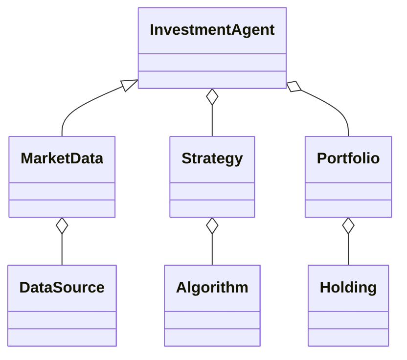
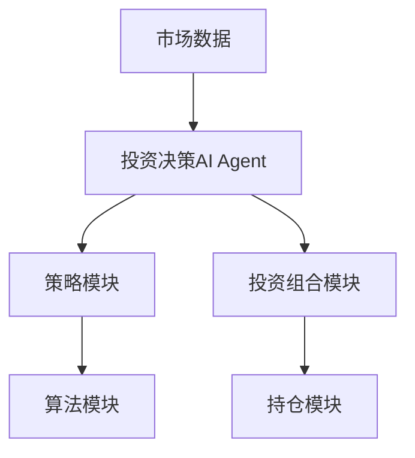
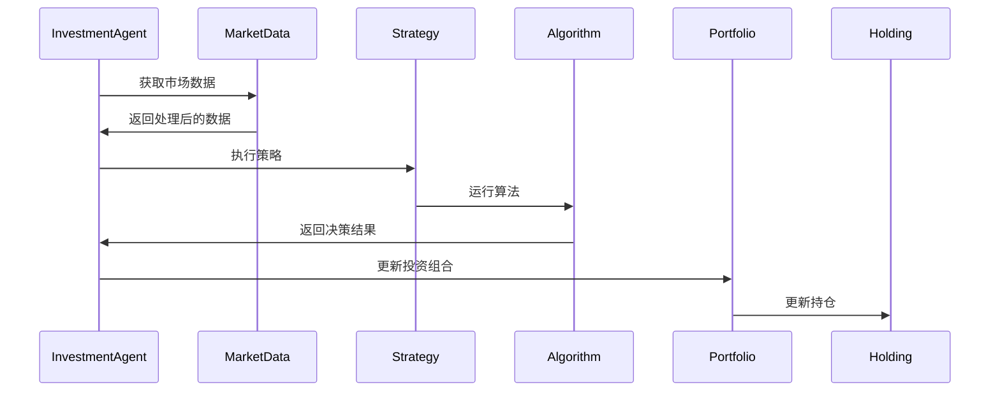
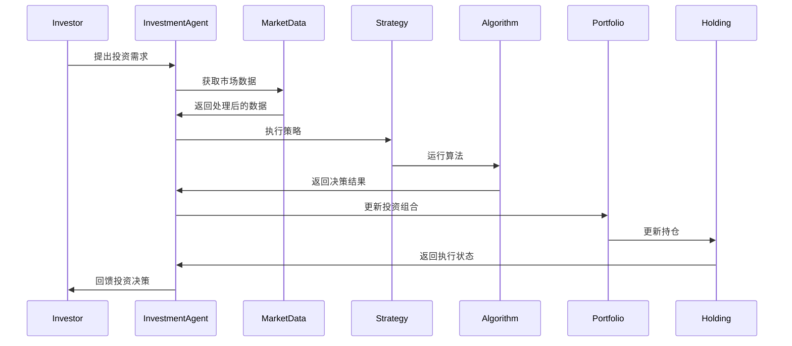
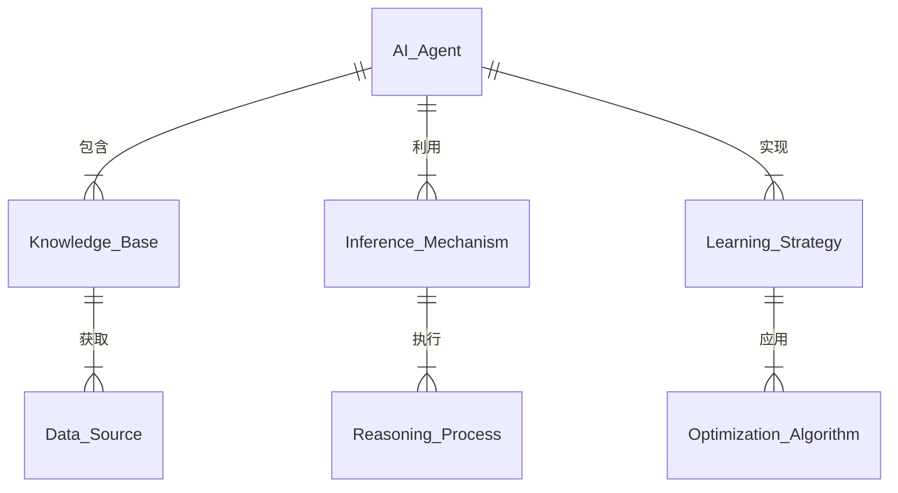

                 


### 第3章：知识表示与推理机原理

#### 3.1 知识表示

- **知识表示的定义**：知识表示是将人类知识以计算机可处理的形式表示和存储的过程。
- **知识表示方法**：形式逻辑、谓词逻辑、产生式系统、语义网络、框架表示等。
- **知识表示的应用**：自然语言处理、智能搜索、专家系统等。

#### 3.2 推理机原理

- **推理机的定义**：推理机是一种用于进行逻辑推理的计算机程序，它可以根据已有的事实和规则，推导出新的结论。
- **推理机的工作原理**：基于事实和规则的推理、基于模式的匹配、基于图的推理等。
- **推理机的应用**：自动推理、问题求解、决策支持等。

### 第4章：推理算法与实现

#### 4.1 推理算法

- **演绎推理**：从一般性的前提推导出特殊性的结论。
- **归纳推理**：从特殊性的前提推导出一般性的结论。
- **类比推理**：通过比较两个相似的情况，推断出新的结论。

#### 4.2 推理算法实现

- **基于规则的推理**：使用产生式规则进行推理。
- **基于模型的推理**：使用模型进行推理，如神经网络模型、决策树模型等。
- **基于数据的推理**：使用统计方法进行推理，如逻辑回归、支持向量机等。

#### 4.3 推理算法示例

- **示例1：基于规则的推理**
  ```mermaid
  graph TD
    A[初始化] --> B[获取事实]
    B --> C{事实是否满足条件？}
    C -->|是| D[执行规则]
    C -->|否| E[结束]
    D --> F[推导结论]
    F --> G[输出结论]
  ```

- **示例2：基于模型的推理**
  ```python
  import numpy as np
  from sklearn.tree import DecisionTreeClassifier

  # 示例数据
  X = [[0, 0], [1, 1], [1, 0], [0, 1]]
  y = [0, 1, 1, 0]

  # 训练模型
  clf = DecisionTreeClassifier()
  clf.fit(X, y)

  # 推理
  result = clf.predict([[0.5, 0.5]])
  print(result)
  ```

#### 4.4 推理算法分析

- **推理算法的选择**：根据应用场景选择合适的推理算法。
- **推理算法的优化**：通过调整参数、优化模型结构等方式提高推理性能。
- **推理算法的挑战**：处理不确定性和复杂性问题。

## 第三部分：系统设计与实现

### 第5章：系统设计概述

#### 5.1 问题场景介绍

- **场景描述**：在金融领域，构建一个能够进行投资决策的AI Agent。
- **系统目标**：实现自动化的投资决策，降低人工干预。

#### 5.2 系统功能设计

- **领域模型**：使用Mermaid类图描述系统中的主要实体和关系。



#### 5.3 系统架构设计

- **架构设计**：使用Mermaid架构图描述系统的整体架构。



#### 5.4 系统接口设计

- **接口设计**：描述系统中的主要接口及其功能。



#### 5.5 系统交互设计

- **交互设计**：使用Mermaid序列图描述系统的交互过程。



## 第四部分：项目实战

### 第6章：环境安装与配置

#### 6.1 环境安装

- **Python环境安装**：安装Python 3.x版本。
- **依赖包安装**：使用pip安装必要的依赖包，如NumPy、Pandas、Scikit-learn等。

#### 6.2 系统核心实现

- **投资决策AI Agent实现**
  ```python
  class InvestmentAgent:
      def __init__(self):
          self.strategy = Strategy()
          self.portfolio = Portfolio()

      def make_decision(self, market_data):
          strategy = self.strategy.execute(market_data)
          self.portfolio.update(strategy)
          return self.portfolio.get_status()
  ```

- **策略模块实现**
  ```python
  class Strategy:
      def execute(self, market_data):
          algorithm = Algorithm()
          return algorithm.run(market_data)
  ```

- **算法模块实现**
  ```python
  class Algorithm:
      def run(self, market_data):
          # 这里是算法的运行逻辑
          return decision
  ```

### 第7章：代码应用解读与分析

#### 7.1 投资决策流程

- **市场数据获取与处理**：使用Pandas库从数据源获取市场数据，并进行预处理。
- **策略执行与算法运行**：根据市场数据执行策略，并运行算法生成决策结果。
- **投资组合更新与反馈**：根据决策结果更新投资组合，并反馈给投资者。

#### 7.2 代码解读与分析

- **投资决策AI Agent代码解读**：解释InvestmentAgent类的构造函数、make_decision方法及其作用。
- **策略模块代码解读**：解释Strategy类的构造函数和execute方法及其作用。
- **算法模块代码解读**：解释Algorithm类的构造函数和run方法及其作用。

### 第8章：实际案例分析与详细讲解剖析

#### 8.1 案例介绍

- **案例背景**：以某投资者的投资决策过程为例，展示AI Agent在实际应用中的表现。
- **案例流程**：从数据获取、策略执行、决策结果生成到投资组合更新的完整流程。

#### 8.2 案例分析

- **数据获取**：解释市场数据的获取和处理过程，如数据的清洗、转换等。
- **策略执行**：分析策略的执行过程，包括算法的选择和参数设置。
- **决策结果生成**：解释决策结果的生成过程，包括如何根据市场数据生成投资建议。
- **投资组合更新**：分析投资组合的更新过程，包括如何根据决策结果调整持仓。

### 第9章：项目小结

#### 9.1 项目总结

- **项目成果**：回顾项目的主要成果，包括系统功能、性能表现等。
- **项目挑战**：总结项目过程中遇到的挑战和解决方法。

#### 9.2 最佳实践 tips

- **环境配置优化**：分享环境配置的优化方法，如依赖包管理、性能调优等。
- **代码编写规范**：提供代码编写的最佳实践，如代码风格、注释规范等。
- **系统维护策略**：分享系统维护和优化的策略，如日志管理、监控报警等。

#### 9.3 小结与展望

- **小结**：回顾项目的主要内容和成果，总结经验教训。
- **展望**：展望未来可能的研究方向和改进空间。

## 附录：拓展阅读

- **相关书籍**：推荐几本关于AI Agent构建的相关书籍。
- **技术博客**：推荐一些优秀的技术博客，供读者进一步学习和了解。

---

# 构建具有推理能力的AI Agent

关键词：人工智能、机器学习、深度学习、知识表示、推理机

摘要：本文详细探讨了构建具有推理能力的AI Agent的理论基础、核心概念、算法原理以及系统设计与实现。通过分步讲解和实际案例剖析，读者可以全面了解如何构建一个高效的AI Agent，并掌握相关技术要点。

---

### 第一部分：背景介绍

#### 问题背景

在当今信息化社会中，人工智能（AI）技术的迅猛发展已经成为推动社会进步的重要力量。特别是在深度学习、神经网络等先进技术的推动下，AI的应用场景不断扩展，从最初的图像识别、语音识别，发展到现在的自然语言处理、智能决策等高级领域。然而，随着AI技术的不断演进，如何构建具有推理能力的AI Agent成为一个亟待解决的问题。

#### 问题描述

具有推理能力的AI Agent是指在特定领域内，能够模拟人类思维方式进行问题求解和决策的智能系统。这种系统不仅需要处理大量的数据信息，还需要具备自我学习和不断优化的能力。构建具有推理能力的AI Agent，是实现智能化应用的关键，也是当前AI研究的重要方向。

#### 问题解决

为了构建具有推理能力的AI Agent，需要从以下几个方面入手：

1. **基础理论**：深入了解AI的基本原理，包括机器学习、深度学习、知识表示、推理机等。
2. **算法实现**：通过Python等编程语言实现AI算法，如图神经网络（GNN）、生成对抗网络（GAN）等。
3. **模型优化**：通过不断优化算法模型，提高AI Agent的推理能力和效率。
4. **系统设计**：设计一个完善的系统架构，确保AI Agent在各种应用场景下都能稳定运行。

#### 边界与外延

构建具有推理能力的AI Agent，主要涉及以下内容：

- **知识表示**：如何将知识有效地存储和表示，是构建AI Agent的重要基础。
- **推理机制**：如何通过推理机制实现问题的求解和决策，是AI Agent的核心功能。
- **学习策略**：如何通过自我学习不断提高AI Agent的能力，是AI Agent持续发展的关键。
- **应用场景**：如何在各种实际应用场景中实现AI Agent的推理功能，是AI Agent实用化的关键。

### 核心概念与联系

在构建具有推理能力的AI Agent的过程中，涉及以下几个核心概念：

- **人工智能（AI）**：模拟、延伸和扩展人的智能的理论、方法、技术及应用。
- **机器学习（ML）**：通过数据驱动的方式，让计算机具备自主学习和优化能力。
- **深度学习（DL）**：一种基于神经网络的机器学习技术，通过多层神经网络实现复杂模式的识别和预测。
- **知识表示（KR）**：将人类知识以计算机可处理的形式表示和存储。
- **推理机（Inference Engine）**：用于进行逻辑推理的计算机程序。

这些概念相互关联，共同构成了构建具有推理能力的AI Agent的理论基础。

## ER实体关系图架构

为了更好地理解构建具有推理能力的AI Agent的过程，我们可以使用ER（实体-关系）模型来描述其核心组件及其关系。



在这个ER图中，`AI_Agent` 是中心实体，它包含 `Knowledge_Base`、`Inference_Mechanism` 和 `Learning_Strategy`。`Knowledge_Base` 获取 `Data_Source` 中的信息，并存储为知识；`Inference_Mechanism` 利用这些知识进行推理，执行 `Reasoning_Process`；`Learning_Strategy` 应用 `Optimization_Algorithm` 来不断提升AI Agent的能力。

接下来，我们将详细探讨这些核心概念和算法，以帮助读者全面理解构建具有推理能力的AI Agent的方法和策略。

## 第二部分：核心概念与算法原理

### 第2章：机器学习与深度学习基础

#### 2.1 机器学习基础

- **机器学习的定义**：机器学习是指通过训练算法，从数据中自动获取知识或模式的过程。
- **监督学习、无监督学习和强化学习**：详细介绍这三种机器学习方法的原理和应用场景。

#### 2.2 深度学习基础

- **深度学习的定义**：深度学习是一种基于神经网络的机器学习技术，通过多层神经网络实现复杂模式的识别和预测。
- **神经网络基础**：介绍神经网络的基本原理，包括神经元、激活函数、反向传播算法等。
- **深度学习模型**：介绍常见的深度学习模型，如图神经网络（GNN）、生成对抗网络（GAN）等。

### 第3章：知识表示与推理机原理

#### 3.1 知识表示

- **知识表示的定义**：知识表示是将人类知识以计算机可处理的形式表示和存储的过程。
- **知识表示方法**：形式逻辑、谓词逻辑、产生式系统、语义网络、框架表示等。
- **知识表示的应用**：自然语言处理、智能搜索、专家系统等。

#### 3.2 推理机原理

- **推理机的定义**：推理机是一种用于进行逻辑推理的计算机程序，它可以根据已有的事实和规则，推导出新的结论。
- **推理机的工作原理**：基于事实和规则的推理、基于模式的匹配、基于图的推理等。
- **推理机的应用**：自动推理、问题求解、决策支持等。

### 第4章：推理算法与实现

#### 4.1 推理算法

- **演绎推理**：从一般性的前提推导出特殊性的结论。
- **归纳推理**：从特殊性的前提推导出一般性的结论。
- **类比推理**：通过比较两个相似的情况，推断出新的结论。

#### 4.2 推理算法实现

- **基于规则的推理**：使用产生式规则进行推理。
- **基于模型的推理**：使用模型进行推理，如神经网络模型、决策树模型等。
- **基于数据的推理**：使用统计方法进行推理，如逻辑回归、支持向量机等。

#### 4.3 推理算法示例

- **示例1：基于规则的推理**
  ```mermaid
  graph TD
    A[初始化] --> B[获取事实]
    B --> C{事实是否满足条件？}
    C -->|是| D[执行规则]
    C -->|否| E[结束]
    D --> F[推导结论]
    F --> G[输出结论]
  ```

- **示例2：基于模型的推理**
  ```python
  import numpy as np
  from sklearn.tree import DecisionTreeClassifier

  # 示例数据
  X = [[0, 0], [1, 1], [1, 0], [0, 1]]
  y = [0, 1, 1, 0]

  # 训练模型
  clf = DecisionTreeClassifier()
  clf.fit(X, y)

  # 推理
  result = clf.predict([[0.5, 0.5]])
  print(result)
  ```

#### 4.4 推理算法分析

- **推理算法的选择**：根据应用场景选择合适的推理算法。
- **推理算法的优化**：通过调整参数、优化模型结构等方式提高推理性能。
- **推理算法的挑战**：处理不确定性和复杂性问题。

## 第三部分：系统设计与实现

### 第5章：系统设计概述

#### 5.1 问题场景介绍

- **场景描述**：在金融领域，构建一个能够进行投资决策的AI Agent。
- **系统目标**：实现自动化的投资决策，降低人工干预。

#### 5.2 系统功能设计

- **领域模型**：使用Mermaid类图描述系统中的主要实体和关系。


#### 5.3 系统架构设计

- **架构设计**：使用Mermaid架构图描述系统的整体架构。


#### 5.4 系统接口设计

- **接口设计**：描述系统中的主要接口及其功能。


#### 5.5 系统交互设计

- **交互设计**：使用Mermaid序列图描述系统的交互过程。


## 第四部分：项目实战

### 第6章：环境安装与配置

#### 6.1 环境安装

- **Python环境安装**：安装Python 3.x版本。
- **依赖包安装**：使用pip安装必要的依赖包，如NumPy、Pandas、Scikit-learn等。

#### 6.2 系统核心实现

- **投资决策AI Agent实现**
  ```python
  class InvestmentAgent:
      def __init__(self):
          self.strategy = Strategy()
          self.portfolio = Portfolio()

      def make_decision(self, market_data):
          strategy = self.strategy.execute(market_data)
          self.portfolio.update(strategy)
          return self.portfolio.get_status()
  ```

- **策略模块实现**
  ```python
  class Strategy:
      def execute(self, market_data):
          algorithm = Algorithm()
          return algorithm.run(market_data)
  ```

- **算法模块实现**
  ```python
  class Algorithm:
      def run(self, market_data):
          # 这里是算法的运行逻辑
          return decision
  ```

### 第7章：代码应用解读与分析

#### 7.1 投资决策流程

- **市场数据获取与处理**：使用Pandas库从数据源获取市场数据，并进行预处理。
- **策略执行与算法运行**：根据市场数据执行策略，并运行算法生成决策结果。
- **投资组合更新与反馈**：根据决策结果更新投资组合，并反馈给投资者。

#### 7.2 代码解读与分析

- **投资决策AI Agent代码解读**：解释InvestmentAgent类的构造函数、make_decision方法及其作用。
- **策略模块代码解读**：解释Strategy类的构造函数和execute方法及其作用。
- **算法模块代码解读**：解释Algorithm类的构造函数和run方法及其作用。

### 第8章：实际案例分析与详细讲解剖析

#### 8.1 案例介绍

- **案例背景**：以某投资者的投资决策过程为例，展示AI Agent在实际应用中的表现。
- **案例流程**：从数据获取、策略执行、决策结果生成到投资组合更新的完整流程。

#### 8.2 案例分析

- **数据获取**：解释市场数据的获取和处理过程，如数据的清洗、转换等。
- **策略执行**：分析策略的执行过程，包括算法的选择和参数设置。
- **决策结果生成**：解释决策结果的生成过程，包括如何根据市场数据生成投资建议。
- **投资组合更新**：分析投资组合的更新过程，包括如何根据决策结果调整持仓。

### 第9章：项目小结

#### 9.1 项目总结

- **项目成果**：回顾项目的主要成果，包括系统功能、性能表现等。
- **项目挑战**：总结项目过程中遇到的挑战和解决方法。

#### 9.2 最佳实践 tips

- **环境配置优化**：分享环境配置的优化方法，如依赖包管理、性能调优等。
- **代码编写规范**：提供代码编写的最佳实践，如代码风格、注释规范等。
- **系统维护策略**：分享系统维护和优化的策略，如日志管理、监控报警等。

#### 9.3 小结与展望

- **小结**：回顾项目的主要内容和成果，总结经验教训。
- **展望**：展望未来可能的研究方向和改进空间。

## 附录：拓展阅读

- **相关书籍**：推荐几本关于AI Agent构建的相关书籍。
- **技术博客**：推荐一些优秀的技术博客，供读者进一步学习和了解。

