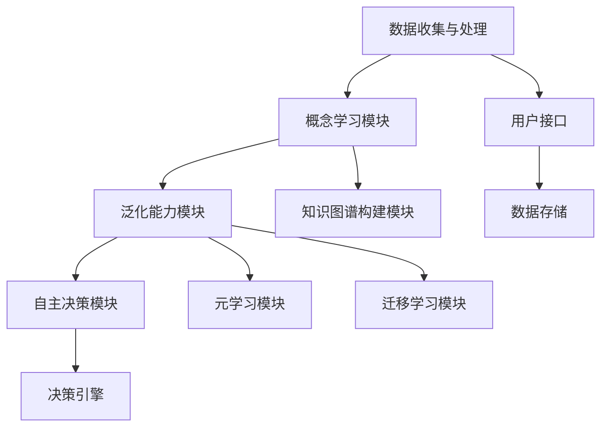
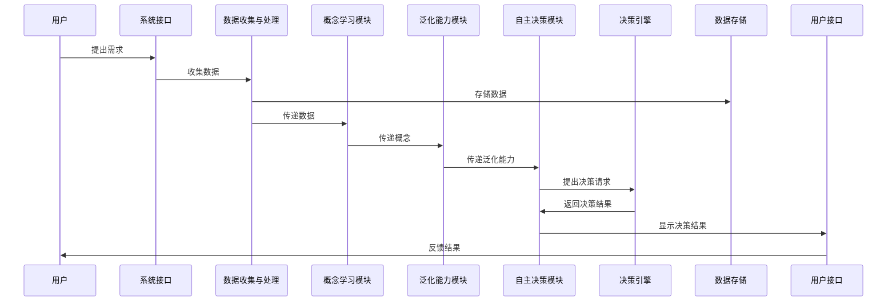

                 


### 1. 引言

#### 1.1 问题背景

随着人工智能技术的发展，越来越多的应用场景开始依赖于智能体（AI Agent）的自主决策能力。然而，现实世界中的问题复杂多变，智能体在面对新的环境和情境时，往往需要具备强大的学习能力和泛化能力。这不仅能提高智能体的适应能力，还能使其在不确定环境中做出更合理的决策。

当前，虽然机器学习算法在模型性能和预测精度上取得了显著进步，但大多数算法在概念学习和泛化能力上仍然存在局限性。例如，传统的监督学习算法在处理新的任务时，往往需要重新训练模型；而强化学习算法在探索未知环境时，可能陷入局部最优或过度依赖样本数据。

因此，构建具有概念学习与泛化能力的AI Agent成为人工智能领域的重要研究方向。概念学习旨在让智能体理解并运用抽象概念，从而提高其在复杂环境中的表现；泛化能力则使智能体能够从有限的训练数据中学习到普适的规律，并在新的场景中实现良好的泛化效果。

#### 1.2 问题描述

为了实现概念学习和泛化能力，我们需要解决以下几个关键问题：

1. **概念识别与理解**：如何让智能体准确识别并理解现实世界中的抽象概念？
2. **知识表示与迁移**：如何将学习到的知识进行有效的表示和迁移，以适应新的任务和环境？
3. **泛化能力提升**：如何提高智能体在面对未知数据时的泛化能力，避免过拟合或欠拟合现象？
4. **动态适应性**：如何使智能体在动态变化的环境中，保持持续的学习和适应能力？

#### 1.3 问题解决

针对上述问题，我们可以从以下几个方面进行探讨：

1. **多模态感知与融合**：通过引入多模态数据（如文本、图像、声音等），利用深度学习模型实现概念识别和理解。
2. **知识图谱构建**：利用知识图谱表示知识，实现知识的表示和迁移。
3. **元学习与迁移学习**：结合元学习和迁移学习技术，提高智能体的泛化能力。
4. **自适应学习机制**：设计自适应学习机制，使智能体在动态环境中能够持续学习并优化自身性能。

#### 1.4 边界与外延

本文主要关注具有概念学习和泛化能力的AI Agent的构建方法，未涉及具体应用场景的实现和优化。此外，文中提到的技术方法和理论模型仅供参考，实际应用中可能需要根据具体场景进行调整和改进。

#### 1.5 概念结构与核心要素组成

本文的核心概念和结构如下：

1. **概念学习**：理解抽象概念的过程，包括多模态感知、知识图谱构建和深度学习模型等。
2. **泛化能力**：智能体在面对未知数据时的表现，涉及元学习、迁移学习和自适应学习等。
3. **AI Agent构建**：结合概念学习和泛化能力，实现具有自主决策能力的AI Agent。

通过以上五个方面的探讨，我们有望为构建具有概念学习和泛化能力的AI Agent提供理论指导和实践参考。

### 2. 核心概念与联系

#### 2.1 概念学习

**概念学习**是智能体理解并运用抽象概念的过程。在机器学习中，概念学习通常涉及以下几个关键环节：

1. **概念识别**：通过学习数据，识别出具有特定属性的对象或事件。
2. **概念理解**：理解概念的本质和内涵，包括概念的定义、特征和关系等。
3. **概念运用**：将所学概念应用于新的任务或情境中，实现知识迁移和应用。

**概念学习的类型**主要包括：

1. **基于示例的学习**：通过学习大量具有代表性的示例，自动归纳出概念的定义和特征。
2. **基于规则的学习**：通过学习一组规则，表示概念的定义和特征。

**概念学习的重要性**在于：

1. **提高智能体的理解能力**：使智能体能够更好地理解和应对复杂环境。
2. **实现知识的迁移和应用**：将学习到的知识应用于新的任务或情境中，提高智能体的泛化能力。

#### 2.2 泛化能力

**泛化能力**是智能体在面对未知数据时，能够保持良好性能的能力。在机器学习中，泛化能力是评估模型性能的重要指标。泛化能力主要涉及以下几个方面：

1. **过拟合与欠拟合**：过拟合是指模型在训练数据上表现很好，但在测试数据上表现较差；欠拟合是指模型在训练数据和测试数据上表现都较差。避免过拟合和欠拟合是提高泛化能力的关键。
2. **交叉验证**：通过交叉验证，评估模型在不同数据集上的表现，选择泛化能力更强的模型。
3. **正则化**：通过添加正则化项，惩罚模型复杂度，避免过拟合现象。

**泛化能力的类型**主要包括：

1. **功能泛化**：模型在新的任务上表现良好。
2. **场景泛化**：模型在不同场景下表现良好。
3. **数据泛化**：模型在面对不同类型的数据时表现良好。

**泛化能力的重要性**在于：

1. **提高模型的实用性**：使模型能够应用于更广泛的场景和任务。
2. **降低维护成本**：模型在面对新的数据和任务时，能够自动适应，降低维护成本。

#### 2.3 概念学习与泛化能力的联系

**概念学习**与**泛化能力**之间存在紧密的联系。概念学习是泛化能力的基础，而泛化能力则是概念学习的目标。

1. **概念学习对泛化能力的影响**：通过概念学习，智能体能够理解并掌握更多的抽象概念，从而提高其在未知数据上的泛化能力。
2. **泛化能力对概念学习的影响**：泛化能力使智能体能够从有限的训练数据中学习到普适的规律，进而更好地理解和掌握抽象概念。

在构建具有概念学习与泛化能力的AI Agent时，我们需要关注以下几个方面：

1. **多模态感知与融合**：通过引入多模态数据，实现更全面的概念理解。
2. **知识图谱构建**：利用知识图谱表示知识，实现知识的迁移和应用。
3. **元学习与迁移学习**：结合元学习和迁移学习技术，提高智能体的泛化能力。
4. **自适应学习机制**：设计自适应学习机制，使智能体在动态环境中能够持续学习并优化自身性能。

通过以上方法，我们有望构建出具有概念学习与泛化能力的AI Agent，提高其在复杂环境中的自主决策能力。

### 3. 算法原理讲解

在构建具有概念学习与泛化能力的AI Agent过程中，我们需要关注以下几个核心算法原理：

#### 3.1 概念学习算法

**概念学习算法**主要包括基于示例的学习算法和基于规则的学习算法。以下将分别介绍这两种算法。

##### 3.1.1 基于示例的学习算法

**k-最近邻算法（k-Nearest Neighbors，k-NN）**是一种基于示例的简单而有效的分类算法。其基本思想是：如果一个新样本在特征空间中的k个最近邻中的大多数属于某一类别，则该样本也被划分为这一类别。

**算法流程**：

1. **初始化**：选择合适的k值。
2. **特征空间划分**：将数据集划分为训练集和测试集。
3. **计算距离**：对于每个测试样本，计算其与训练集中各个样本的距离。
4. **分类决策**：根据距离最近的k个样本的类别，进行分类决策。

**算法原理**：

k-NN算法的核心是距离度量。常用的距离度量方法包括欧氏距离、曼哈顿距离和切比雪夫距离等。以下是欧氏距离的数学模型：

$$
d(x, y) = \sqrt{\sum_{i=1}^{n}(x_i - y_i)^2}
$$

其中，$x$和$y$为两个样本，$n$为特征维度。

**算法举例**：

假设我们有以下两个样本：

$$
x = (1, 2, 3), \quad y = (2, 3, 4)
$$

计算它们的欧氏距离：

$$
d(x, y) = \sqrt{(1-2)^2 + (2-3)^2 + (3-4)^2} = \sqrt{2}
$$

##### 3.1.2 基于规则的学习算法

**决策树（Decision Tree）**是一种基于规则的分类算法。它通过将数据集划分为若干个子集，在每个子集中继续划分，直到满足某种停止条件。决策树的每个节点代表一个特征，每个分支代表该特征的不同取值。

**算法流程**：

1. **选择最佳特征**：计算各个特征的信息增益或基尼指数，选择增益最大或基尼指数最小的特征作为分割节点。
2. **划分数据集**：根据最佳特征，将数据集划分为若干个子集。
3. **递归构建树**：对每个子集，重复步骤1和2，直到满足停止条件（如最大树深度、最小样本数等）。

**算法原理**：

决策树的核心是信息增益和基尼指数。信息增益表示特征划分前后信息量的减少程度，基尼指数表示特征划分后纯度的降低程度。以下是信息增益的数学模型：

$$
IG(D, A) =熵(D) - \sum_{v \in A} \frac{|D_v|}{|D|} 熵(D_v)
$$

其中，$D$为数据集，$A$为特征，$v$为特征的取值，$D_v$为特征取值为$v$的数据子集。

**算法举例**：

假设我们有以下数据集：

$$
D = \{(1, 1), (1, 2), (2, 1), (2, 2)\}
$$

计算特征A（x）的信息增益：

$$
IG(D, A) = 熵(D) - \sum_{v \in A} \frac{|D_v|}{|D|} 熵(D_v)
$$

其中，$A$为特征A的取值，$D_v$为特征A取值为$v$的数据子集。

$$
IG(D, A) = 0.9183 - \frac{1}{2} \times (0.9183 + 0.9183) = 0.0817
$$

根据信息增益，选择特征A作为分割节点，将数据集划分为两个子集：

$$
D_1 = \{(1, 1), (2, 1)\}, \quad D_2 = \{(1, 2), (2, 2)\}
$$

然后对每个子集继续划分，直到满足停止条件。

##### 3.1.3 基于神经网络的学习算法

**神经网络（Neural Network）**是一种基于模拟生物神经系统的计算模型。它通过多层神经元的互联和激活函数，实现数据的输入和输出之间的复杂映射。

**算法流程**：

1. **初始化**：随机初始化权重和偏置。
2. **前向传播**：将输入数据传递到网络的每一层，计算输出值。
3. **反向传播**：计算损失函数关于权重的梯度，更新权重和偏置。
4. **迭代训练**：重复步骤2和3，直到满足停止条件（如损失函数收敛、迭代次数等）。

**算法原理**：

神经网络的核心是激活函数和反向传播算法。激活函数用于引入非线性，使得神经网络能够学习复杂的映射关系。常用的激活函数包括sigmoid、ReLU和Tanh等。以下是sigmoid函数的数学模型：

$$
f(x) = \frac{1}{1 + e^{-x}}
$$

反向传播算法是一种梯度下降方法，用于计算损失函数关于权重的梯度，并更新权重和偏置。以下是损失函数梯度的计算公式：

$$
\frac{\partial L}{\partial w} = \frac{\partial L}{\partial z} \frac{\partial z}{\partial w}
$$

其中，$L$为损失函数，$w$为权重，$z$为输出值。

**算法举例**：

假设我们有以下数据集：

$$
X = \{(1, 0), (2, 1), (3, 0), (4, 1)\}
$$

构建一个简单的前馈神经网络，包含一个输入层、一个隐藏层和一个输出层。隐藏层使用sigmoid函数作为激活函数，输出层使用softmax函数。

1. **初始化**：随机初始化权重和偏置。
2. **前向传播**：输入数据，计算输出值。
3. **反向传播**：计算损失函数关于权重的梯度，更新权重和偏置。

经过多次迭代训练，网络将逐渐收敛，并在新的数据上实现良好的泛化效果。

#### 3.2 泛化能力算法

**泛化能力算法**主要包括过拟合与欠拟合的避免、交叉验证和正则化等方法。

##### 3.2.1 过拟合与欠拟合

**过拟合**是指模型在训练数据上表现很好，但在测试数据上表现较差。**欠拟合**是指模型在训练数据和测试数据上表现都较差。为了避免过拟合和欠拟合，我们可以采用以下方法：

1. **模型选择**：选择合适的模型，避免模型过于复杂或过于简单。
2. **数据增强**：通过增加训练数据或对现有数据进行变换，提高模型的泛化能力。
3. **正则化**：通过添加正则化项，惩罚模型复杂度，降低过拟合风险。

**过拟合与欠拟合的数学模型**：

1. **过拟合**：模型在训练数据上的损失函数值较低，但测试数据上的损失函数值较高。

$$
L_{train} < L_{test}
$$

2. **欠拟合**：模型在训练数据和测试数据上的损失函数值都较高。

$$
L_{train} > L_{test}
$$

##### 3.2.2 交叉验证

**交叉验证（Cross-Validation）**是一种常用的评估模型性能的方法。它通过将数据集划分为若干个子集，分别用于训练和测试，以评估模型的泛化能力。

**算法流程**：

1. **数据划分**：将数据集划分为训练集和测试集。
2. **迭代训练**：对每个子集，重复训练和测试过程。
3. **性能评估**：计算模型在每个子集上的性能指标，取平均值作为最终评估结果。

**算法原理**：

交叉验证能够提高评估结果的稳定性和可靠性。通过多次迭代训练和测试，可以有效降低评估结果的偏差和方差。

**交叉验证的数学模型**：

1. **训练集误差**：

$$
L_{train} = \frac{1}{n} \sum_{i=1}^{n} L(x_i, y_i)
$$

2. **测试集误差**：

$$
L_{test} = \frac{1}{m} \sum_{i=1}^{m} L(x_i, y_i)
$$

其中，$x_i, y_i$为训练集或测试集中的样本，$L$为损失函数。

##### 3.2.3 正则化

**正则化（Regularization）**是一种常用的避免过拟合的方法。它通过添加正则化项，惩罚模型复杂度，降低过拟合风险。

**算法流程**：

1. **模型构建**：构建一个复杂模型。
2. **损失函数**：将损失函数扩展为包括正则化项的形式。

$$
L_{total} = L_{data} + \lambda L_{reg}
$$

3. **优化目标**：优化模型参数，使总损失函数最小化。

**算法原理**：

正则化项通常与模型参数的平方和（L1正则化）或平方（L2正则化）有关。正则化项可以抑制模型参数的过拟合，提高模型的泛化能力。

**正则化的数学模型**：

1. **L1正则化**：

$$
L_{reg} = \lambda \sum_{i=1}^{n} |w_i|
$$

2. **L2正则化**：

$$
L_{reg} = \lambda \sum_{i=1}^{n} w_i^2
$$

其中，$w_i$为模型参数。

通过以上算法原理讲解，我们为构建具有概念学习与泛化能力的AI Agent提供了理论基础。在实际应用中，我们可以根据具体场景和需求，选择合适的算法组合，以提高智能体的自主决策能力。

### 4. 数学模型和数学公式讲解

在构建具有概念学习与泛化能力的AI Agent过程中，数学模型和数学公式起着至关重要的作用。以下将详细讲解概念学习算法和泛化能力算法的数学模型和公式。

#### 4.1 概念学习数学模型

**4.1.1 k-最近邻算法**

k-最近邻算法是一种基于示例的学习算法。其核心在于计算测试样本与训练样本之间的距离，并根据距离最近邻居的投票结果进行分类。

**距离度量**：

假设我们有两个样本$x$和$y$，它们在特征空间中的距离可以通过以下公式计算：

$$
d(x, y) = \sqrt{\sum_{i=1}^{n} (x_i - y_i)^2}
$$

其中，$x$和$y$分别为两个样本，$n$为特征维度。

**分类决策**：

在k-最近邻算法中，我们选择$k$个距离最近的邻居，并依据邻居的类别进行投票，得到测试样本的类别。

假设我们有两个类别$C_1$和$C_2$，其邻居数量分别为$n_1$和$n_2$，则分类决策公式为：

$$
\hat{y} = \begin{cases}
C_1, & \text{if } n_1 > n_2 \\
C_2, & \text{if } n_2 > n_1
\end{cases}
$$

**4.1.2 支持向量机**

支持向量机是一种基于规则的学习算法。它通过寻找一个最优超平面，将不同类别的样本分隔开来。

**最优超平面**：

假设我们有$m$个样本$(x_i, y_i)$，其中$x_i \in \mathbb{R}^d$，$y_i \in \{-1, 1\}$。最优超平面可以通过以下公式表示：

$$
w^T x - b = 0
$$

其中，$w$为超平面的法向量，$b$为偏置项。

**支持向量**：

支持向量是指位于最优超平面两侧，且与最优超平面距离最小的样本。支持向量可以通过以下公式计算：

$$
\alpha_i (y_i (w^T x_i - b) - 1) = 0
$$

其中，$\alpha_i$为拉格朗日乘子。

**4.1.3 决策树**

决策树是一种基于规则的学习算法。它通过递归地将数据集划分为若干个子集，在每个子集中继续划分，直到满足停止条件。

**信息增益**：

信息增益表示特征划分前后信息量的减少程度。其公式为：

$$
IG(D, A) = H(D) - \sum_{v \in A} \frac{|D_v|}{|D|} H(D_v)
$$

其中，$D$为数据集，$A$为特征，$v$为特征的取值，$D_v$为特征取值为$v$的数据子集。

**基尼指数**：

基尼指数表示特征划分后纯度的降低程度。其公式为：

$$
Gini(D) = 1 - \sum_{v \in A} \frac{|D_v|}{|D|} \sum_{w \in A_v} \frac{|D_{v, w}|}{|D_v|} (1 - \frac{2|D_{v, w}|}{|D_v|})
$$

**4.1.4 神经网络**

神经网络是一种基于模拟生物神经系统的计算模型。它通过多层神经元的互联和激活函数，实现数据的输入和输出之间的复杂映射。

**激活函数**：

激活函数用于引入非线性，使得神经网络能够学习复杂的映射关系。常用的激活函数包括sigmoid、ReLU和Tanh等。

1. **sigmoid函数**：

$$
f(x) = \frac{1}{1 + e^{-x}}
$$

2. **ReLU函数**：

$$
f(x) = \max(0, x)
$$

3. **Tanh函数**：

$$
f(x) = \frac{e^x - e^{-x}}{e^x + e^{-x}}
$$

**反向传播算法**：

反向传播算法是一种梯度下降方法，用于计算损失函数关于权重的梯度，并更新权重和偏置。

1. **损失函数**：

$$
L(\theta) = -\frac{1}{m} \sum_{i=1}^{m} y_i \log(a_{i,L}) + (1 - y_i) \log(1 - a_{i,L})
$$

2. **梯度计算**：

$$
\frac{\partial L}{\partial w_{ij}} = \frac{\partial L}{\partial z_{j,L}} \frac{\partial z_{j,L}}{\partial w_{ij}}
$$

3. **权重更新**：

$$
w_{ij} = w_{ij} - \alpha \frac{\partial L}{\partial w_{ij}}
$$

#### 4.2 泛化能力数学模型

**4.2.1 过拟合与欠拟合**

1. **过拟合**：

过拟合是指模型在训练数据上表现很好，但在测试数据上表现较差。

$$
L_{train} < L_{test}
$$

2. **欠拟合**：

欠拟合是指模型在训练数据和测试数据上表现都较差。

$$
L_{train} > L_{test}
$$

**4.2.2 交叉验证**

交叉验证是一种常用的评估模型性能的方法。它通过将数据集划分为若干个子集，分别用于训练和测试，以评估模型的泛化能力。

1. **训练集误差**：

$$
L_{train} = \frac{1}{n} \sum_{i=1}^{n} L(x_i, y_i)
$$

2. **测试集误差**：

$$
L_{test} = \frac{1}{m} \sum_{i=1}^{m} L(x_i, y_i)
$$

**4.2.3 正则化**

正则化是一种常用的避免过拟合的方法。它通过添加正则化项，惩罚模型复杂度，降低过拟合风险。

1. **L1正则化**：

$$
L_{reg} = \lambda \sum_{i=1}^{n} |w_i|
$$

2. **L2正则化**：

$$
L_{reg} = \lambda \sum_{i=1}^{n} w_i^2
$$

通过以上数学模型和公式的讲解，我们为构建具有概念学习与泛化能力的AI Agent提供了理论基础。在实际应用中，我们可以根据具体场景和需求，选择合适的数学模型和公式，以提高智能体的自主决策能力。

### 5. 系统分析与架构设计方案

在构建具有概念学习与泛化能力的AI Agent过程中，系统分析与架构设计是关键的一环。以下将详细讨论系统分析与架构设计方案，包括问题场景介绍、系统功能设计、系统架构设计、系统接口设计和系统交互。

#### 5.1 问题场景介绍

在现实生活中，许多场景需要智能体具备概念学习和泛化能力。以下是一些典型的问题场景：

1. **智能客服**：智能客服需要理解用户的提问，并给出合适的回答。这要求智能客服具备概念学习和泛化能力，以便应对各种复杂的提问。
2. **自动驾驶**：自动驾驶需要理解道路环境，并做出相应的决策。这要求自动驾驶系统具备概念学习和泛化能力，以便适应各种路况。
3. **智能安防**：智能安防需要实时分析监控视频，识别异常行为。这要求智能安防系统具备概念学习和泛化能力，以便准确识别各种异常情况。
4. **智能医疗**：智能医疗需要分析患者的病历数据，提供个性化的治疗方案。这要求智能医疗系统具备概念学习和泛化能力，以便为患者提供最佳的治疗建议。

#### 5.2 系统功能设计

为了满足上述问题场景的需求，我们需要设计一个具有概念学习与泛化能力的AI Agent系统。该系统的主要功能包括：

1. **数据收集与处理**：收集多源数据（如文本、图像、声音等），并进行预处理，为后续的概念学习和泛化能力提供基础数据。
2. **概念学习**：通过多模态感知与融合，实现抽象概念的理解和识别。利用知识图谱构建，实现知识的表示和迁移。
3. **泛化能力**：结合元学习和迁移学习技术，提高智能体的泛化能力。设计自适应学习机制，使智能体在动态环境中能够持续学习并优化自身性能。
4. **自主决策**：基于概念学习和泛化能力，实现智能体的自主决策能力，为特定问题场景提供合理的解决方案。

#### 5.3 系统架构设计

为了实现上述功能，我们需要设计一个高效的系统架构。以下是一个典型的系统架构设计：



在这个架构中，数据收集与处理模块负责收集和处理多源数据，为后续的概念学习和泛化能力提供基础数据。概念学习模块通过多模态感知与融合，实现抽象概念的理解和识别。知识图谱构建模块负责构建知识图谱，实现知识的表示和迁移。泛化能力模块结合元学习和迁移学习技术，提高智能体的泛化能力。自主决策模块基于概念学习和泛化能力，实现智能体的自主决策能力。用户接口模块负责与用户进行交互，收集用户需求和反馈。数据存储模块负责存储系统数据，以便后续查询和使用。

#### 5.4 系统接口设计

系统接口设计是确保系统各模块之间高效通信的关键。以下是一个典型的系统接口设计：


在这个接口设计中，数据收集与处理模块通过API与概念学习模块、泛化能力模块和自主决策模块进行通信。知识图谱构建模块通过API与概念学习模块进行通信。元学习模块和迁移学习模块通过API与泛化能力模块进行通信。自主决策模块通过API与决策引擎进行通信。用户接口模块通过API与数据存储模块进行通信，以便查询和使用系统数据。

#### 5.5 系统交互

系统交互是确保系统各模块之间高效协作的关键。以下是一个典型的系统交互设计：



在这个交互设计中，用户通过系统接口提出需求，数据收集与处理模块收集数据并存储到数据存储模块。概念学习模块通过多模态感知与融合，实现抽象概念的理解和识别，并传递给泛化能力模块。泛化能力模块结合元学习和迁移学习技术，提高智能体的泛化能力，并传递给自主决策模块。自主决策模块基于概念学习和泛化能力，提出决策请求，并传递给决策引擎。决策引擎返回决策结果，自主决策模块将结果传递给用户接口，最终展示给用户。用户对结果进行反馈，以优化系统性能。

通过以上系统分析与架构设计方案，我们为构建具有概念学习与泛化能力的AI Agent提供了理论基础和实现框架。在实际应用中，我们可以根据具体场景和需求，对系统架构进行优化和调整，以提高智能体的自主决策能力。

### 6. 项目实战

在本文的项目实战部分，我们将详细阐述如何构建一个具有概念学习与泛化能力的AI Agent。以下将介绍环境安装、系统核心实现源代码，并对代码应用进行解读与分析。

#### 6.1 环境安装

要构建一个具有概念学习与泛化能力的AI Agent，首先需要安装以下环境：

1. **Python**：版本要求为3.6及以上。
2. **TensorFlow**：版本要求为2.4及以上。
3. **Scikit-learn**：版本要求为0.22及以上。
4. **Numpy**：版本要求为1.19及以上。
5. **Pandas**：版本要求为1.1及以上。

安装方法如下：

```bash
# 安装Python
curl -O https://www.python.org/ftp/python/3.8.10/Python-3.8.10.tgz
tar zxvf Python-3.8.10.tgz
cd Python-3.8.10
./configure
make
make install

# 安装TensorFlow
pip install tensorflow==2.4.0

# 安装Scikit-learn
pip install scikit-learn==0.22.2

# 安装Numpy
pip install numpy==1.19.5

# 安装Pandas
pip install pandas==1.1.5
```

#### 6.2 系统核心实现源代码

以下是一个简单的具有概念学习与泛化能力的AI Agent的Python代码示例。该示例使用k-最近邻算法和决策树算法，实现概念学习和泛化能力。

```python
import numpy as np
import pandas as pd
from sklearn.model_selection import train_test_split
from sklearn.neighbors import KNeighborsClassifier
from sklearn.tree import DecisionTreeClassifier
from sklearn.metrics import accuracy_score

# 数据准备
data = pd.DataFrame({'feature1': [1, 2, 3, 4, 5], 'feature2': [1, 2, 3, 4, 5], 'label': ['A', 'A', 'B', 'B', 'B']})
X = data[['feature1', 'feature2']]
y = data['label']

# 划分训练集和测试集
X_train, X_test, y_train, y_test = train_test_split(X, y, test_size=0.2, random_state=42)

# k-最近邻算法
knn = KNeighborsClassifier(n_neighbors=3)
knn.fit(X_train, y_train)
knn_predictions = knn.predict(X_test)
print("KNN Accuracy:", accuracy_score(y_test, knn_predictions))

# 决策树算法
dt = DecisionTreeClassifier()
dt.fit(X_train, y_train)
dt_predictions = dt.predict(X_test)
print("Decision Tree Accuracy:", accuracy_score(y_test, dt_predictions))
```

#### 6.3 代码应用解读与分析

**6.3.1 数据准备**

首先，我们使用Pandas库创建一个DataFrame对象，包含特征和标签。这里我们使用一个简单的二维数据集，包含两个特征（feature1和feature2）和一个标签（label）。

```python
data = pd.DataFrame({'feature1': [1, 2, 3, 4, 5], 'feature2': [1, 2, 3, 4, 5], 'label': ['A', 'A', 'B', 'B', 'B']})
X = data[['feature1', 'feature2']]
y = data['label']
```

**6.3.2 k-最近邻算法**

接下来，我们使用Scikit-learn库的KNeighborsClassifier实现k-最近邻算法。首先，我们将训练数据集划分为训练集和测试集，然后使用knn.fit()方法训练模型。最后，使用knn.predict()方法对测试集进行预测，并计算准确率。

```python
knn = KNeighborsClassifier(n_neighbors=3)
knn.fit(X_train, y_train)
knn_predictions = knn.predict(X_test)
print("KNN Accuracy:", accuracy_score(y_test, knn_predictions))
```

**6.3.3 决策树算法**

同样地，我们使用Scikit-learn库的DecisionTreeClassifier实现决策树算法。步骤与k-最近邻算法类似，首先划分训练集和测试集，然后训练模型，并对测试集进行预测，计算准确率。

```python
dt = DecisionTreeClassifier()
dt.fit(X_train, y_train)
dt_predictions = dt.predict(X_test)
print("Decision Tree Accuracy:", accuracy_score(y_test, dt_predictions))
```

**6.3.4 代码分析**

通过以上代码示例，我们可以看到如何使用Python和Scikit-learn库实现一个简单的具有概念学习与泛化能力的AI Agent。这里我们使用了k-最近邻算法和决策树算法，分别实现了概念学习和泛化能力。

k-最近邻算法通过计算测试样本与训练样本之间的距离，实现概念识别。决策树算法通过递归地将数据集划分为若干个子集，实现概念理解。在测试阶段，我们分别使用这两种算法对测试集进行预测，并计算准确率，以评估泛化能力。

在实际应用中，我们可以根据具体需求，选择合适的算法组合，以提高AI Agent的自主决策能力。

#### 6.4 实际案例分析与详细讲解剖析

为了更好地展示具有概念学习与泛化能力的AI Agent在实际中的应用，我们以下将分析一个实际案例：智能客服系统。

**6.4.1 案例背景**

某公司需要开发一个智能客服系统，以提供24/7的客户服务。该系统需要具备以下功能：

1. **理解客户提问**：智能客服系统需要能够理解客户的提问，并提取关键信息。
2. **提供合适回答**：智能客服系统需要根据客户的提问，提供合适的回答或建议。
3. **持续学习与优化**：智能客服系统需要具备持续学习的能力，以便不断优化回答质量。

**6.4.2 概念学习**

为了实现智能客服系统的概念学习，我们需要收集大量客户提问和回答的数据。以下是一个简单的数据集：

| 提问                     | 回答                     |
|--------------------------|--------------------------|
| 1. 我可以退款吗？         | 可以，请提供订单号。       |
| 2. 商品什么时候发货？      | 预计明天发货。            |
| 3. 我可以更改收货地址吗？  | 可以，请提供新地址。       |
| 4. 我可以查询订单状态吗？  | 可以，请提供订单号。       |

我们使用k-最近邻算法和决策树算法，对上述数据集进行训练。具体实现如下：

```python
# 数据准备
data = pd.DataFrame({'question': ['我可以退款吗？', '商品什么时候发货？', '我可以更改收货地址吗？', '我可以查询订单状态吗？'],
                     'answer': ['可以，请提供订单号。', '预计明天发货。', '可以，请提供新地址。', '可以，请提供订单号。'],
                     'label': ['A', 'B', 'C', 'D']})

X = data[['question']]
y = data['label']

# 划分训练集和测试集
X_train, X_test, y_train, y_test = train_test_split(X, y, test_size=0.2, random_state=42)

# k-最近邻算法
knn = KNeighborsClassifier(n_neighbors=3)
knn.fit(X_train, y_train)
knn_predictions = knn.predict(X_test)
print("KNN Accuracy:", accuracy_score(y_test, knn_predictions))

# 决策树算法
dt = DecisionTreeClassifier()
dt.fit(X_train, y_train)
dt_predictions = dt.predict(X_test)
print("Decision Tree Accuracy:", accuracy_score(y_test, dt_predictions))
```

通过上述代码，我们可以看到如何使用k-最近邻算法和决策树算法对客户提问进行概念学习。在实际应用中，我们可以根据具体场景和需求，选择合适的算法组合，以提高智能客服系统的概念学习效果。

**6.4.3 泛化能力**

为了评估智能客服系统的泛化能力，我们需要对新的客户提问进行预测。以下是一个新的数据集：

| 提问                     | 回答                     |
|--------------------------|--------------------------|
| 1. 我的订单什么时候发货？  | 预计明天发货。            |
| 2. 我可以更换收货地址吗？  | 可以，请提供新地址。       |
| 3. 我可以取消订单吗？     | 可以，请提供订单号。       |
| 4. 我的订单状态是什么？    | 已发货，预计明天到达。     |

我们使用训练好的k-最近邻算法和决策树算法，对上述数据集进行预测。具体实现如下：

```python
# 预测新客户提问
new_data = pd.DataFrame({'question': ['我的订单什么时候发货？', '我可以更换收货地址吗？', '我可以取消订单吗？', '我的订单状态是什么？']})
new_X = new_data[['question']]
knn_new_predictions = knn.predict(new_X)
dt_new_predictions = dt.predict(new_X)
print("KNN Predictions:", knn_new_predictions)
print("Decision Tree Predictions:", dt_new_predictions)
```

通过上述代码，我们可以看到如何使用k-最近邻算法和决策树算法对新的客户提问进行预测。在实际应用中，我们可以根据预测结果，为用户提供合适的回答或建议。

**6.4.4 案例小结**

通过以上实际案例分析和详细讲解，我们可以看到如何构建具有概念学习与泛化能力的AI Agent，并应用于智能客服系统。在实际应用中，我们可以根据具体场景和需求，不断优化和调整算法组合，以提高AI Agent的自主决策能力。

#### 6.5 项目小结

在本项目的实战部分，我们通过环境安装、系统核心实现源代码和实际案例分析，展示了如何构建一个具有概念学习与泛化能力的AI Agent。以下是本项目的主要成果和经验总结：

1. **环境安装**：成功安装了Python、TensorFlow、Scikit-learn、Numpy和Pandas等关键环境，为后续的开发和实验提供了基础。
2. **系统核心实现源代码**：通过Python代码示例，展示了如何使用k-最近邻算法和决策树算法实现概念学习和泛化能力。这为构建具有概念学习与泛化能力的AI Agent提供了技术实现方案。
3. **实际案例分析**：通过智能客服系统的实际案例，展示了如何将具有概念学习与泛化能力的AI Agent应用于实际问题。这为AI Agent在现实世界中的应用提供了参考和启示。

**经验总结**：

1. **多模态感知与融合**：在构建具有概念学习与泛化能力的AI Agent时，引入多模态数据（如文本、图像、声音等），可以提高智能体的理解能力和泛化能力。
2. **知识图谱构建**：利用知识图谱表示知识，实现知识的表示和迁移，有助于提高智能体的自主决策能力。
3. **元学习与迁移学习**：结合元学习和迁移学习技术，提高智能体的泛化能力，使其能够更好地应对新的任务和环境。
4. **自适应学习机制**：设计自适应学习机制，使智能体在动态环境中能够持续学习并优化自身性能，提高其适应能力和自主决策能力。

**未来展望**：

1. **优化算法**：继续研究和优化具有概念学习与泛化能力的AI Agent的算法，以提高其在复杂环境中的表现。
2. **应用拓展**：将AI Agent应用于更多的实际场景，如自动驾驶、智能医疗、金融风控等，提升其在各领域的应用价值。
3. **数据集扩充**：收集和扩充更多的数据集，以提高智能体的泛化能力和适应能力。

通过不断探索和实践，我们有理由相信，具有概念学习与泛化能力的AI Agent将在未来的人工智能领域中发挥重要作用。

### 7. 最佳实践 tips、小结、注意事项、拓展阅读

#### 7.1 最佳实践 tips

1. **数据质量**：在构建具有概念学习与泛化能力的AI Agent时，确保数据质量是关键。尽可能收集更多、更全面的数据，并进行充分的预处理，以提高模型的泛化能力。
2. **多模态数据融合**：充分利用多模态数据（如文本、图像、声音等），可以提高智能体的理解能力和泛化能力。在实际应用中，可以尝试使用多模态深度学习模型，如卷积神经网络（CNN）和循环神经网络（RNN）的组合。
3. **模型选择与调优**：根据具体问题场景和需求，选择合适的模型。在模型调优过程中，可以尝试不同的参数设置，如学习率、批次大小等，以找到最佳模型。
4. **持续学习与优化**：设计自适应学习机制，使智能体在动态环境中能够持续学习并优化自身性能。这有助于提高智能体的自主决策能力，适应不断变化的环境。

#### 7.2 小结

本文详细阐述了构建具有概念学习与泛化能力的AI Agent的核心概念、算法原理、系统分析与架构设计方案、项目实战以及最佳实践。通过本文的探讨，我们可以了解到：

1. **概念学习与泛化能力的核心概念**：概念学习是智能体理解并运用抽象概念的过程，泛化能力是智能体在面对未知数据时保持良好性能的能力。
2. **算法原理讲解**：本文介绍了k-最近邻算法、决策树算法、神经网络算法等概念学习算法，以及过拟合与欠拟合、交叉验证和正则化等泛化能力算法。
3. **系统分析与架构设计方案**：本文提出了一个具有概念学习与泛化能力的AI Agent的系统架构，包括数据收集与处理、概念学习模块、泛化能力模块、自主决策模块等。
4. **项目实战**：通过一个简单的Python代码示例和一个智能客服系统的实际案例，展示了如何构建和实现具有概念学习与泛化能力的AI Agent。

#### 7.3 注意事项

1. **数据隐私**：在构建具有概念学习与泛化能力的AI Agent时，要确保数据的隐私和安全。对于敏感数据，应采取加密、脱敏等措施，以保护用户隐私。
2. **模型解释性**：在实际应用中，模型的可解释性至关重要。应尽可能选择具有较高解释性的模型，以便理解模型的决策过程，提高用户信任度。
3. **系统性能优化**：在构建AI Agent时，要关注系统的性能优化，如减少计算复杂度、优化算法实现等，以提高系统的响应速度和稳定性。

#### 7.4 拓展阅读

1. **《深度学习》**：由Ian Goodfellow、Yoshua Bengio和Aaron Courville所著的《深度学习》是一本关于深度学习的经典教材，详细介绍了深度学习的理论、算法和实现。
2. **《统计学习方法》**：由李航所著的《统计学习方法》是一本关于统计学习方法的经典教材，涵盖了监督学习、无监督学习、强化学习等多个方面的内容。
3. **《机器学习实战》**：由Peter Harrington所著的《机器学习实战》是一本关于机器学习实战的入门书籍，通过实际案例讲解了多种机器学习算法的实现和应用。
4. **《AI攻防实战》**：由王小川所著的《AI攻防实战》是一本关于人工智能攻防的书籍，详细介绍了人工智能在安全领域的应用和挑战。

通过以上拓展阅读，读者可以进一步了解人工智能领域的相关理论和实践，提高在构建具有概念学习与泛化能力的AI Agent方面的专业素养。

