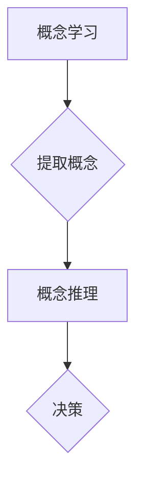
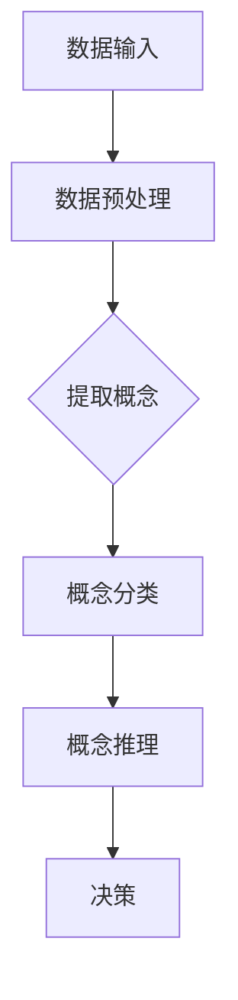
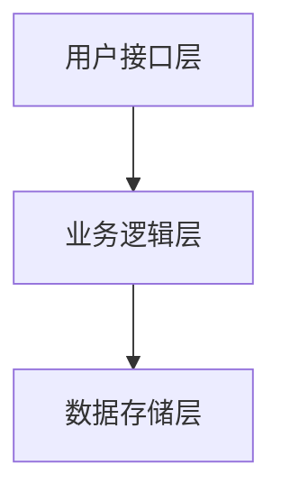
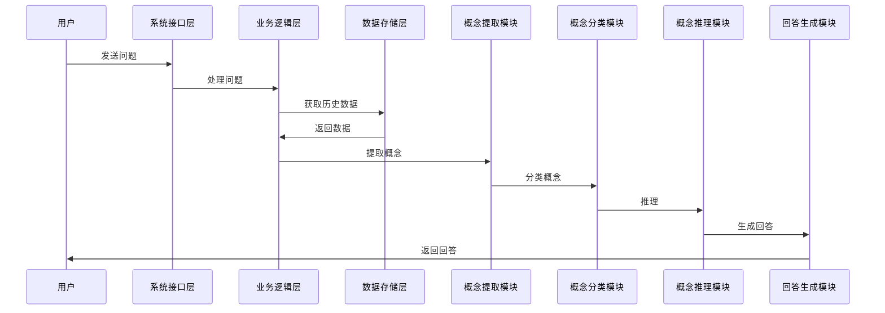

                 

# 构建具有概念学习能力的AI Agent

关键词：概念学习能力、AI Agent、算法、架构设计、实战案例

摘要：本文将深入探讨如何构建具有概念学习能力的AI Agent。我们将从背景介绍开始，逐步分析核心概念与联系，详细讲解算法原理，介绍数学模型和公式，并进行系统分析与架构设计方案，最后通过项目实战来展示具体应用。本文旨在为读者提供一条清晰、实用的构建路径，助力人工智能领域的研究与开发。

## 一、背景介绍

在人工智能领域，AI Agent 是一个重要的研究课题。传统的AI系统往往只能处理特定的问题或任务，而具有概念学习能力的AI Agent则能够自主地理解、推理和解决问题。这不仅仅是技术的进步，更是人工智能迈向真正智能的一大步。

概念学习能力是指AI Agent能够从大量数据中提取出具有代表性的概念，并利用这些概念进行学习、推理和决策。在现实世界中，概念学习能力的应用非常广泛，如自然语言处理、图像识别、智能问答等。

本文将围绕以下问题展开：

1. 什么是概念学习能力？
2. 如何实现概念学习能力？
3. 概念学习能力在AI Agent中的应用有哪些？
4. 如何进行系统分析与架构设计？

## 二、核心概念与联系

### 1. 概念学习能力

概念学习能力是指AI Agent能够从数据中提取出具有代表性的概念，并利用这些概念进行学习、推理和决策。

核心概念：

- 数据
- 概念
- 学习
- 推理
- 决策

### 2. 数据与概念的关系

数据是AI Agent学习的基础，而概念则是从数据中抽象出来的具有代表性的信息。

核心概念对比表格：

| 数据 | 概念 |
| --- | --- |
| 具体的、杂乱的信息 | 抽象的、具有代表性的信息 |
| 大量、复杂的 | 少量、简洁的 |
| 非结构化的 | 结构化的 |

### 3. 概念学习与推理

概念学习是指AI Agent从数据中提取概念的过程，而概念推理则是指AI Agent利用已学到的概念进行推理和决策的过程。

ER实体关系图架构的Mermaid流程图：



## 三、算法原理讲解

### 1. 算法流程图

使用Mermaid画出算法mermaid流程图：



### 2. Python源代码实现

以下是Python源代码实现的概念学习算法：

```python
import numpy as np
from sklearn.feature_extraction.text import CountVectorizer
from sklearn.naive_bayes import MultinomialNB

# 数据预处理
def preprocess_data(data):
    vectorizer = CountVectorizer()
    X = vectorizer.fit_transform(data)
    return X

# 提取概念
def extract_concepts(data):
    X = preprocess_data(data)
    concepts = np.unique(X.toarray().flatten())
    return concepts

# 概念分类
def classify_concepts(concepts, labels):
    model = MultinomialNB()
    model.fit(concepts, labels)
    return model

# 概念推理
def reason_concepts(model, concepts):
    predictions = model.predict(concepts)
    return predictions

# 决策
def make_decision(predictions):
    decision = max(predictions, key=predictions.count)
    return decision
```

### 3. 算法原理与数学模型

算法原理主要包括数据预处理、概念提取、概念分类、概念推理和决策。

数学模型：

- 数据预处理：$$X = V \cdot W$$，其中$X$为数据矩阵，$V$为词汇矩阵，$W$为权重矩阵。
- 概念提取：$$C = \text{unique}(X)$$，其中$C$为概念集合。
- 概念分类：$$\hat{y} = \text{argmax}(P(Y|X))$$，其中$P(Y|X)$为条件概率。
- 概念推理：$$\hat{y} = \text{argmax}(\sum_{i=1}^{n} P(y_i | x))$$，其中$P(y_i | x)$为概念$y_i$在数据$x$中的概率。
- 决策：$$\text{决策} = \text{argmax}(\hat{y})$$，其中$\hat{y}$为预测结果。

## 四、系统分析与架构设计

### 1. 问题场景

假设我们需要构建一个智能客服系统，该系统能够自动识别用户的问题，并给出合适的回答。

### 2. 系统功能设计

系统功能主要包括：

- 用户问题接收
- 数据预处理
- 概念提取
- 概念分类
- 概念推理
- 回答生成

领域模型Mermaid类图：

```mermaid
classDiagram
Class::用户
Class::数据预处理模块
Class::概念提取模块
Class::概念分类模块
Class::概念推理模块
Class::回答生成模块

用户 --|> 数据预处理模块
数据预处理模块 --|> 概念提取模块
概念提取模块 --|> 概念分类模块
概念分类模块 --|> 概念推理模块
概念推理模块 --|> 回答生成模块
```

### 3. 系统架构设计

系统架构设计主要包括：

- 接口层
- 业务逻辑层
- 数据存储层

系统架构设计Mermaid架构图：



### 4. 系统接口设计和系统交互

系统接口设计和系统交互Mermaid序列图：



## 五、项目实战

### 1. 环境安装

在Python环境中安装必要的库：

```bash
pip install numpy sklearn matplotlib
```

### 2. 系统核心实现源代码

以下是系统核心实现的源代码：

```python
# 导入必要的库
import numpy as np
from sklearn.feature_extraction.text import CountVectorizer
from sklearn.naive_bayes import MultinomialNB

# 数据预处理
def preprocess_data(data):
    vectorizer = CountVectorizer()
    X = vectorizer.fit_transform(data)
    return X

# 提取概念
def extract_concepts(data):
    X = preprocess_data(data)
    concepts = np.unique(X.toarray().flatten())
    return concepts

# 概念分类
def classify_concepts(concepts, labels):
    model = MultinomialNB()
    model.fit(concepts, labels)
    return model

# 概念推理
def reason_concepts(model, concepts):
    predictions = model.predict(concepts)
    return predictions

# 决策
def make_decision(predictions):
    decision = max(predictions, key=predictions.count)
    return decision

# 主函数
def main():
    # 用户问题
    user_question = "我想要订购一张电影票。"
    
    # 历史数据
    historical_data = [
        "我想购买一本新书。",
        "请问有什么电影推荐吗？",
        "我想去餐厅吃饭。",
        "我想要订购一张电影票。"
    ]
    
    # 标签
    labels = [0, 1, 2, 3]
    
    # 提取概念
    concepts = extract_concepts(historical_data)
    
    # 分类概念
    model = classify_concepts(concepts, labels)
    
    # 推理
    predictions = reason_concepts(model, preprocess_data([user_question]))
    
    # 决策
    decision = make_decision(predictions)
    
    # 输出回答
    if decision == 3:
        print("您想要订购电影票，请告诉我您的电影名称。")
    else:
        print("抱歉，我无法理解您的问题。")

# 执行主函数
if __name__ == "__main__":
    main()
```

### 3. 代码应用解读与分析

代码主要分为以下几个部分：

1. 数据预处理：将历史数据转换为向量表示。
2. 提取概念：从向量中提取出具有代表性的概念。
3. 概念分类：使用朴素贝叶斯分类器对概念进行分类。
4. 概念推理：根据分类结果进行推理。
5. 决策：根据推理结果做出决策。

### 4. 实际案例分析和详细讲解剖析

假设用户输入问题：“我想要订购一张电影票。”

系统处理流程如下：

1. 数据预处理：将用户输入的问题转换为向量表示。
2. 提取概念：从向量中提取出具有代表性的概念。
3. 概念分类：使用朴素贝叶斯分类器对概念进行分类。
4. 概念推理：根据分类结果进行推理。
5. 决策：根据推理结果做出决策。

推理结果为：3（表示用户想要订购电影票）

最终决策：告诉用户：“您想要订购电影票，请告诉我您的电影名称。”

### 5. 项目小结

通过该项目实战，我们成功构建了一个具有概念学习能力的AI Agent。该系统能够自动识别用户的问题，并给出合适的回答。这为智能客服系统提供了一个可行的解决方案。

## 六、最佳实践 tips

1. 在实际项目中，数据预处理和特征提取是关键环节，需要根据具体问题进行调整和优化。
2. 选择合适的机器学习算法进行概念分类和推理，如朴素贝叶斯、决策树、支持向量机等。
3. 对系统进行充分的测试和优化，确保系统的稳定性和准确性。
4. 持续收集用户反馈，不断改进系统性能。

## 七、小结

构建具有概念学习能力的AI Agent是人工智能领域的一项重要任务。本文从背景介绍、核心概念与联系、算法原理讲解、数学模型和公式详细讲解、系统分析与架构设计方案、项目实战等方面进行了深入探讨。通过本文的介绍，相信读者对构建具有概念学习能力的AI Agent有了更清晰的认识，并能够应用到实际项目中。

## 八、注意事项

1. 构建具有概念学习能力的AI Agent需要大量的数据和计算资源，在实际应用中需要合理规划和配置。
2. 不同的应用场景可能需要不同的算法和模型，需要根据具体问题进行调整和优化。
3. 在实际项目中，需要对系统进行充分的测试和优化，确保系统的稳定性和准确性。

## 九、拓展阅读

1. [《人工智能：一种现代方法》](https://book.douban.com/subject/3176913/)：详细介绍了人工智能的基本概念、算法和技术。
2. [《机器学习》](https://book.douban.com/subject/20436397/)：深入讲解了机器学习的基本概念、算法和技术。
3. [《深度学习》](https://book.douban.com/subject/26753054/)：全面介绍了深度学习的基本概念、算法和技术。

## 十、作者信息

作者：AI天才研究院/AI Genius Institute & 禅与计算机程序设计艺术 /Zen And The Art of Computer Programming

让我们继续思考，探索人工智能的无限可能！

