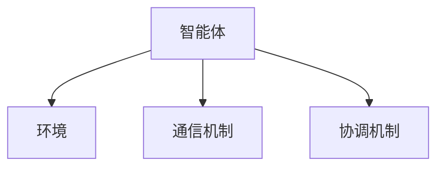
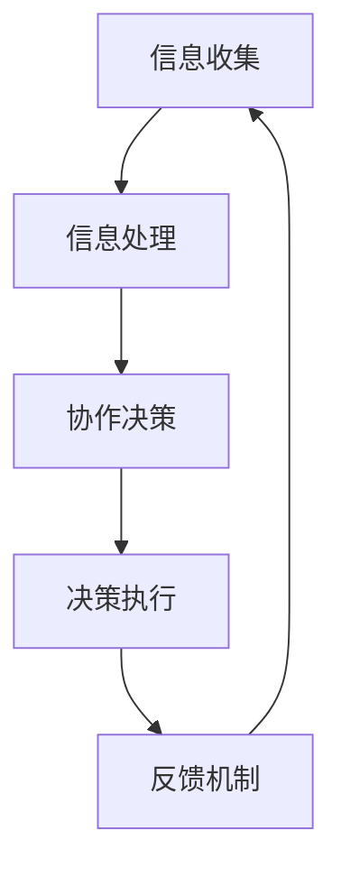
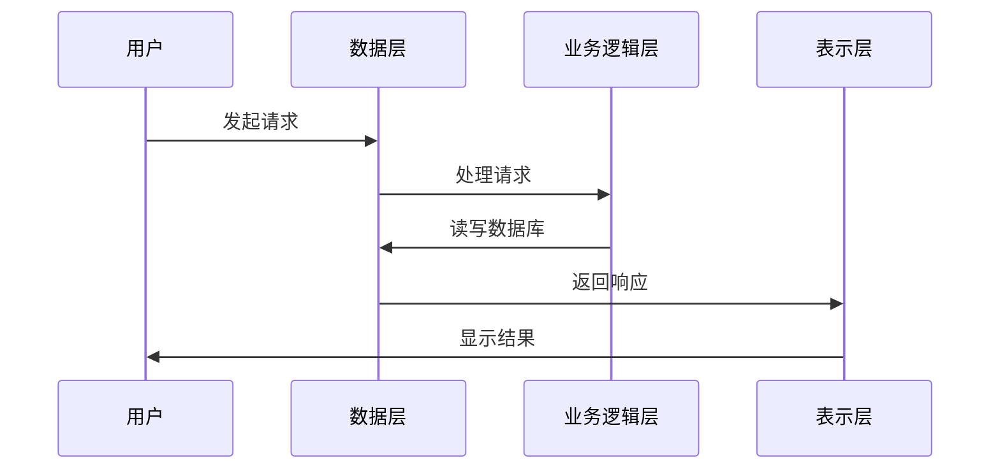
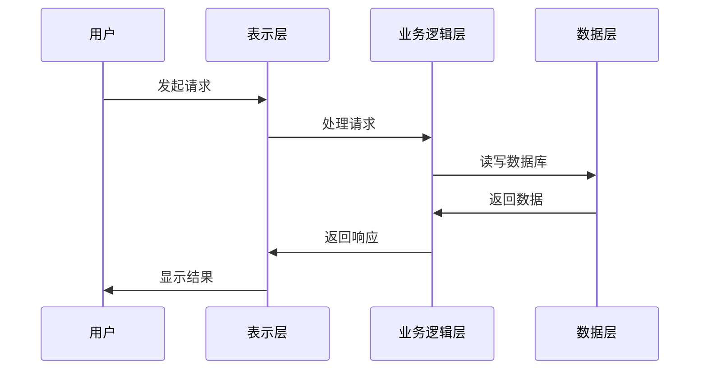

                 

## 第一部分：背景介绍与理论基础

### 第1章 问题背景与核心概念

#### 1.1 问题背景

多Agent系统的发展现状

多Agent系统（MAS）是一种分布式计算范式，它通过多个自主的智能体相互协作，共同实现复杂任务的求解和优化。随着计算机科学和人工智能领域的迅猛发展，MAS在众多领域都展现出了强大的应用潜力，例如在物流、交通管理、智能家居、医疗健康、金融投资、环境保护等。

在物流领域，多Agent系统被广泛应用于优化运输路径、调度资源、提高运输效率等方面。通过MAS，物流企业可以实现实时监控和调整运输计划，从而减少运输成本，提高服务质量。

在交通管理领域，MAS有助于解决交通拥堵、优化交通信号控制、提高公共交通的运行效率等问题。通过智能体的协同工作，交通管理系统能够实现实时交通流量监测，并根据监测结果自动调整交通信号，从而提高交通通行能力。

在智能家居领域，MAS可以实现设备的自动化控制和智能调度，提高家庭生活的便利性和舒适度。例如，智能灯光系统可以根据用户的行为习惯自动调节光线，智能空调系统可以根据室内温度和湿度自动调整制冷和加热。

在医疗健康领域，MAS可以帮助医生进行疾病诊断、治疗方案推荐、医疗资源调度等。通过MAS，医疗系统能够实现医疗信息的实时共享和智能分析，从而提高医疗服务的质量和效率。

在金融投资领域，MAS可以用于股票交易、风险评估、市场预测等方面。通过MAS，金融机构能够实现实时数据分析，从而做出更加准确的决策。

在环境保护领域，MAS可以用于监测环境污染、优化资源利用、控制生态平衡等。通过MAS，环保部门能够实现环境信息的实时监测和智能分析，从而采取有效的环保措施。

群体智能决策的需求

在现代社会，随着数据量和复杂度的增加，单一智能体的决策能力已经无法满足许多应用场景的需求。群体智能决策（Group Intelligent Decision Making，GIDM）因此应运而生。GIDM通过多个智能体的协作和交互，实现更复杂、更高效的决策过程。

GIDM的需求主要体现在以下几个方面：

1. **复杂问题求解**：许多现实世界的问题具有高度复杂性，单一智能体难以胜任。通过群体智能决策，多个智能体可以共同分担计算任务，提高问题求解的效率。

2. **不确定性处理**：在现实世界中，许多决策问题存在不确定性，如数据噪声、环境变化等。群体智能决策可以通过多个智能体的协同工作，降低不确定性对决策结果的影响。

3. **智能体协作**：在许多应用场景中，智能体之间需要进行协作和互动，以达到共同的目标。群体智能决策可以提供一种机制，使智能体能够有效地进行协作和互动。

4. **社会效益最大化**：群体智能决策可以通过优化决策过程，实现社会效益的最大化。例如，在资源分配、环境保护等领域，群体智能决策可以帮助实现资源的最优利用和生态平衡。

#### 1.2 核心概念

Agent的定义与特点

Agent，即智能体，是一种具有自主性、适应性、协作性和社会性的计算实体。Agent可以是一个程序、一个设备、一个生物，甚至是一个人类。Agent的特点如下：

1. **自主性**：Agent能够自主地决定其行为，不受外部指令的强制约束。

2. **适应性**：Agent能够根据环境的变化调整其行为策略，以实现更好的效果。

3. **协作性**：Agent能够与其他Agent协同工作，共同实现复杂任务的求解。

4. **社会性**：Agent能够参与社会活动，与其他Agent进行交流和互动。

群体智能决策的概念

群体智能决策（Group Intelligent Decision Making，GIDM）是一种基于多个智能体的协同工作，实现复杂决策过程的智能系统。GIDM的特点如下：

1. **分布式**：GIDM通过多个智能体的分布式计算，实现复杂决策任务的求解。

2. **协作性**：GIDM强调智能体之间的协作和互动，通过协同工作，实现更高效的决策。

3. **自组织**：GIDM具有自组织能力，能够根据环境的变化和需求，动态调整智能体的结构和角色。

4. **自适应**：GIDM能够根据环境的变化和决策效果，自适应地调整决策策略。

多Agent系统的组成

多Agent系统（MAS）由多个智能体、环境、通信机制和协调机制组成。其基本组成如下：

1. **智能体**：智能体是MAS的基本计算单元，具有自主性、适应性、协作性和社会性。

2. **环境**：环境是MAS的运行背景，包括物理环境和虚拟环境。

3. **通信机制**：通信机制是MAS中智能体之间进行信息交换的途径，包括同步通信和异步通信。

4. **协调机制**：协调机制是MAS中智能体之间进行协作和协调的机制，包括任务分配、资源共享、冲突解决等。

#### 1.3 概念联系与边界

多Agent系统与群体智能决策的关系

多Agent系统（MAS）是实现群体智能决策（GIDM）的基础。MAS通过多个智能体的协同工作，实现复杂决策过程的求解。而GIDM则是MAS的核心功能，强调智能体之间的协作和互动，实现更高效的决策。

群体智能决策的边界与外延

群体智能决策的边界主要涉及以下几个方面：

1. **智能体数量**：群体智能决策中，智能体的数量需要适中，过多可能导致计算复杂度增加，过少可能无法充分利用群体智能的优势。

2. **智能体能力**：群体智能决策中，智能体的能力需要相对平衡，避免出现能力过强或过弱的智能体。

3. **通信机制**：群体智能决策中，智能体之间的通信机制需要高效可靠，以支持智能体之间的实时互动。

4. **协调机制**：群体智能决策中，协调机制需要能够有效地协调智能体之间的协作和互动，避免出现冲突和低效。

群体智能决策的外延涉及以下几个方面：

1. **应用领域**：群体智能决策可以应用于各个领域，如物流、交通、医疗、金融等。

2. **算法研究**：群体智能决策的算法研究是当前的热点问题，包括分布式算法、协同优化算法、多目标决策算法等。

3. **应用实践**：群体智能决策在实际应用中，需要结合具体场景和需求，设计合适的智能体架构和决策机制。

#### 1.4 概念结构与核心要素

多Agent系统的核心结构

多Agent系统的核心结构包括智能体、环境、通信机制和协调机制。其结构示意图如下：



群体智能决策的关键要素

群体智能决策的关键要素包括：

1. **智能体协作**：智能体之间的协作是群体智能决策的核心，通过协作，智能体可以实现资源共享、任务分担、决策优化等。

2. **决策过程**：群体智能决策的过程包括信息收集、信息处理、决策生成、决策执行等环节，各个环节需要高效协同。

3. **决策模型**：群体智能决策的模型包括分布式模型、协同优化模型、多目标决策模型等，不同的模型适用于不同的应用场景。

4. **环境适应性**：群体智能决策需要能够适应环境的变化，根据环境的变化调整决策策略，以实现更好的决策效果。

#### 1.5 本章小结

本章主要介绍了多Agent系统和群体智能决策的相关概念、问题背景和发展现状。通过本章的学习，读者可以了解到多Agent系统和群体智能决策的基本概念、核心结构以及相互关系。本章为后续章节的内容奠定了基础，为深入探讨多Agent系统和群体智能决策的实现方法和应用提供了理论支持。## 第2章 多Agent系统设计原理

### 2.1 多Agent系统架构设计

多Agent系统（MAS）的架构设计是确保智能体之间有效协作和高效决策的关键。本节将详细介绍多Agent系统架构设计的基本原则、常见架构模式以及系统架构设计的关键要素。

#### 2.1.1 设计原则

多Agent系统架构设计需要遵循以下原则：

1. **模块化**：将系统划分为多个功能模块，每个模块负责特定的功能，模块之间通过接口进行通信。模块化设计有助于提高系统的可维护性和可扩展性。

2. **分布式**：多Agent系统具有分布式特性，智能体分布在不同的计算节点上，通过通信机制进行协同工作。分布式设计有助于提高系统的并行处理能力和容错性。

3. **适应性**：系统架构需要具备良好的适应性，能够根据环境变化和需求动态调整智能体的角色和任务。

4. **协同性**：智能体之间需要建立高效的协同机制，确保各智能体能够协同工作，共同实现系统目标。

5. **可扩展性**：系统架构需要支持系统的扩展，包括智能体数量的增加、功能模块的扩展等。

6. **安全性**：系统架构需要确保智能体之间的通信安全，防止恶意攻击和数据泄露。

#### 2.1.2 常见架构模式

多Agent系统常见架构模式包括以下几种：

1. **集中式架构**：在集中式架构中，存在一个全局控制器，负责协调和管理所有智能体的行为。全局控制器具有全局视图，能够根据当前状态和系统目标，生成全局决策并下发到各个智能体执行。

   - 优点：易于实现，控制力强，适合任务简单且智能体数量较少的系统。
   - 缺点：全局控制器成为系统的瓶颈，当智能体数量增加时，控制器的计算负担会急剧增加。

2. **分布式架构**：在分布式架构中，智能体具有自主决策能力，能够独立处理局部任务，并通过通信机制进行协同工作。

   - 优点：系统具有良好的并行处理能力，适合复杂任务和高智能体数量的系统。
   - 缺点：智能体之间的通信开销较大，需要设计高效的通信机制。

3. **分层架构**：分层架构将系统划分为多个层次，每个层次负责特定的功能。底层层次负责数据采集和处理，中层层次负责协调和管理，顶层层次负责全局决策和优化。

   - 优点：层次划分清晰，便于系统维护和扩展。
   - 缺点：需要设计复杂的通信机制，确保层次之间的数据传输和协同工作。

4. **市场架构**：市场架构基于拍卖机制，智能体作为卖方或买方，通过市场进行资源交换和任务分配。

   - 优点：具有良好的资源分配能力和灵活性，适合资源稀缺和动态变化的场景。
   - 缺点：市场机制的引入增加了系统的复杂性和不确定性。

5. **自治系统架构**：自治系统架构中，每个智能体都是独立的自治系统，具有自我管理和自我优化能力。

   - 优点：智能体高度自治，能够快速响应环境变化。
   - 缺点：系统整体协调性较差，可能存在局部最优而非全局最优。

#### 2.1.3 系统架构设计的关键要素

多Agent系统架构设计的关键要素包括：

1. **智能体角色与任务分配**：根据系统的需求，定义智能体的角色和任务，确保智能体能够高效协同。

2. **通信机制**：设计高效的通信机制，确保智能体之间的信息交换和协同工作。

3. **决策机制**：根据系统目标和环境条件，设计智能体的决策机制，实现自主决策和协同决策。

4. **协调机制**：设计智能体之间的协调机制，解决冲突、分配资源和优化决策。

5. **安全性机制**：设计安全机制，保护智能体之间的通信和数据安全，防止恶意攻击和泄露。

6. **适应性机制**：设计适应性机制，使系统能够根据环境变化和需求动态调整。

7. **可扩展性机制**：设计可扩展性机制，支持系统的扩展和功能模块的增加。

#### 2.1.4 本章小结

本章详细介绍了多Agent系统架构设计的基本原则、常见架构模式以及系统架构设计的关键要素。通过本章的学习，读者可以了解到多Agent系统架构设计的方法和技巧，为构建具有群体智能决策能力的多Agent系统奠定了理论基础。

### 2.2 群体智能决策算法原理

#### 2.2.1 基本算法原理

群体智能决策算法是基于多个智能体之间的协作和交互，实现复杂决策过程的智能系统。其基本原理包括以下几个方面：

1. **信息共享**：智能体通过通信机制共享信息，包括环境信息、决策结果和自身状态等。

2. **协作决策**：智能体根据共享的信息，进行协作决策，共同实现系统目标。

3. **自适应调整**：智能体根据决策效果和环境变化，自适应调整决策策略和行为。

4. **反馈机制**：智能体将决策结果反馈给其他智能体，形成闭环反馈机制，不断优化决策过程。

#### 2.2.2 算法流程图

群体智能决策算法的流程图如下：



#### 2.2.3 概念属性特征对比表格

以下是一个简化的群体智能决策算法概念属性特征对比表格：

| 算法名称 | 分布式 | 协作性 | 自适应性 | 可扩展性 |
| :----: | :----: | :----: | :----: | :----: |
| GA     | 是     | 是     | 是     | 是     |
| PSO    | 是     | 是     | 是     | 是     |
| ACO    | 是     | 是     | 是     | 否     |
| SPOS   | 是     | 是     | 是     | 是     |

#### 2.2.4 ER实体关系图架构

以下是一个简化的群体智能决策系统ER实体关系图架构：

```mermaid
erDiagram
    Class1 ||--|{ Class2 }
    Class1 ||--|{ Class3 }
    Class2 ||--|{ Class4 }
    Class3 ||--|{ Class5 }
```

#### 2.2.5 本章小结

本章详细介绍了群体智能决策算法的基本原理、算法流程图、概念属性特征对比表格和ER实体关系图架构。通过本章的学习，读者可以了解群体智能决策算法的基本概念和方法，为构建具有群体智能决策能力的多Agent系统提供了技术支持。

### 2.3 数学模型与公式推导

#### 2.3.1 数学模型基础

群体智能决策算法中的数学模型通常包括以下几个部分：

1. **状态空间模型**：描述系统当前状态和可能的动作集合。

2. **状态转移模型**：描述系统从当前状态转移到下一个状态的概率。

3. **奖励函数模型**：描述系统在每个状态下的奖励值，用于评估决策的效果。

4. **优化目标模型**：描述系统需要优化的目标函数。

以下是一个简化的数学模型示例：

$$
\begin{align*}
S &= \{s_1, s_2, s_3\} & \quad \text{状态集合} \\
A &= \{a_1, a_2\} & \quad \text{动作集合} \\
P(S') &= f(S, A) & \quad \text{状态转移概率} \\
R(S, A) &= g(S, A) & \quad \text{奖励函数} \\
J &= \sum_{t=0}^{\infty} \gamma^t R(S_t, A_t) & \quad \text{优化目标函数}
\end{align*}
$$

#### 2.3.2 公式推导与解释

以下是一个简化的Q-learning算法的公式推导：

1. **初始化**：

$$
Q(s, a) \leftarrow 0 \quad \forall s \in S, \forall a \in A
$$

2. **更新规则**：

$$
Q(s, a) \leftarrow Q(s, a) + \alpha [r + \gamma \max_{a'} Q(s', a') - Q(s, a)]
$$

其中，$\alpha$为学习率，$r$为立即奖励，$\gamma$为折扣因子，$s$和$s'$分别为当前状态和下一状态，$a$和$a'$分别为当前动作和最佳动作。

#### 2.3.3 举例说明

以下是一个简单的多Agent系统中的协作任务分配问题：

假设有两个智能体A和B，他们需要共同完成一个任务T。任务T可以分为三个子任务T1、T2和T3。智能体A和B的能力分别为$C_A$和$C_B$，任务T1、T2和T3的难度分别为$D_{T1}$、$D_{T2}$和$D_{T3}$。

1. **状态空间**：

$$
S = \{ (C_A, C_B), (T1, T2, T3) \}
$$

2. **动作空间**：

$$
A = \{ (A1, A2), (B1, B2) \}
$$

3. **状态转移概率**：

$$
P(S') = f(S, A)
$$

4. **奖励函数**：

$$
R(S, A) = g(S, A)
$$

假设智能体A和B分别执行动作A1和B1，完成任务T1所需时间为$t_1$，完成任务T2所需时间为$t_2$，完成任务T3所需时间为$t_3$。则总时间为$t = t_1 + t_2 + t_3$。

#### 2.3.4 本章小结

本章介绍了群体智能决策算法中的数学模型基础、公式推导和举例说明。通过本章的学习，读者可以了解群体智能决策算法的基本数学原理和方法，为构建具有群体智能决策能力的多Agent系统提供了技术支持。## 第3章 数学模型与公式推导

### 3.1 数学模型基础

在构建具有群体智能决策能力的多Agent系统时，数学模型是理解和设计智能体行为的关键。数学模型为我们提供了一种形式化的方法来描述系统的状态、动作、奖励以及智能体的学习过程。以下是一些常见的数学模型基础。

#### 3.1.1 状态空间

状态空间是智能体在环境中可以处于的所有可能状态的集合。在多Agent系统中，状态空间通常由多个维度组成，每个维度代表了系统中的一个特定属性。例如，对于一个交通管理系统，状态空间可以包括交通流量、道路拥堵情况、车辆数量等。

$$
S = \{ s_1, s_2, s_3, ..., s_n \}
$$

#### 3.1.2 动作空间

动作空间是智能体可以采取的所有可能动作的集合。在多Agent系统中，动作空间定义了智能体如何影响环境。例如，在交通管理系统中，动作空间可以包括调整交通信号灯时间、增加车辆通行道、关闭某些路段等。

$$
A = \{ a_1, a_2, a_3, ..., a_m \}
$$

#### 3.1.3 状态转移概率

状态转移概率描述了智能体在当前状态下采取某个动作后，转移到下一个状态的概率。在多Agent系统中，状态转移概率可以通过概率分布函数来表示。

$$
P(S' | S, A) = f(S', S, A)
$$

#### 3.1.4 奖励函数

奖励函数用于评估智能体在特定状态下采取特定动作后的效果。奖励可以是正的，表示对智能体行为的奖励；也可以是负的，表示对行为的惩罚。奖励函数通常与智能体的目标紧密相关。

$$
R(S, A) = g(S, A)
$$

#### 3.1.5 价值函数

价值函数（或称为Q值）用于评估智能体在特定状态下采取特定动作的长期效果。它是一个状态-动作对的函数，表示在当前状态下采取某个动作后，获得的期望回报。

$$
V^*(s) = \max_{a \in A} Q^*(s, a)
$$

其中，$Q^*(s, a)$是最优价值函数，$V^*(s)$是最优价值函数。

#### 3.1.6 策略

策略是智能体在给定状态下选择最优动作的规则。策略通常是一个映射函数，将状态映射到动作。

$$
\pi(s) = \arg\max_{a \in A} Q(s, a)
$$

### 3.2 公式推导与解释

在多Agent系统中，常用的学习算法如Q-learning和SARSA通过迭代更新价值函数来学习最优策略。以下是一个简化的Q-learning算法的推导过程。

#### 3.2.1 Q-learning算法推导

Q-learning算法是一种无模型的强化学习算法，其核心思想是通过观察即时奖励和下一状态的价值来更新当前状态的价值函数。

1. **初始化**：

$$
Q(s, a) \leftarrow 0 \quad \forall s \in S, \forall a \in A
$$

2. **更新规则**：

$$
Q(s, a) \leftarrow Q(s, a) + \alpha [r + \gamma \max_{a'} Q(s', a') - Q(s, a)]
$$

其中，$\alpha$是学习率，$r$是即时奖励，$\gamma$是折扣因子，$s'$是下一状态，$a'$是最佳动作。

这个公式可以解释为：当前状态的价值函数更新为原价值函数加上学习率乘以即时奖励加上未来回报的期望减去当前价值函数。

#### 3.2.2 SARSA算法推导

SARSA（同步策略自适应资源采样）是另一种强化学习算法，它同时更新当前状态和下一状态的价值函数。

1. **初始化**：

$$
Q(s, a) \leftarrow 0 \quad \forall s \in S, \forall a \in A
$$

2. **更新规则**：

$$
Q(s, a) \leftarrow Q(s, a) + \alpha [r + \gamma Q(s', \pi(s')) - Q(s, a)]
$$

这个公式可以解释为：当前状态的价值函数更新为原价值函数加上学习率乘以即时奖励加上未来回报的期望减去当前价值函数。

### 3.3 举例说明

为了更好地理解这些数学模型和公式，我们可以通过一个简单的例子来说明。假设一个智能体在一个简单的环境中进行任务分配，环境中有三个任务T1、T2和T3，每个任务的难度分别为1、2和3。

1. **状态空间**：

$$
S = \{ (T1, T2, T3) \}
$$

2. **动作空间**：

$$
A = \{ T1, T2, T3 \}
$$

3. **奖励函数**：

假设完成任务T1、T2和T3的即时奖励分别为5、10和15。

$$
R(T1) = 5, \quad R(T2) = 10, \quad R(T3) = 15
$$

4. **状态转移概率**：

假设每个任务完成的概率为0.9，未完成的概率为0.1。

$$
P(S' | S, T1) = 0.9, \quad P(S' | S, T2) = 0.8, \quad P(S' | S, T3) = 0.7
$$

5. **价值函数**：

初始时，价值函数设置为0。

$$
Q(T1) \leftarrow 0, \quad Q(T2) \leftarrow 0, \quad Q(T3) \leftarrow 0
$$

6. **更新过程**：

假设智能体首先选择执行任务T1，然后执行任务T2，最后执行任务T3。

- 执行T1后，得到即时奖励5，更新价值函数：

$$
Q(T1) \leftarrow Q(T1) + \alpha [5 + 0.9 \cdot Q(T2) - Q(T1)]
$$

- 执行T2后，得到即时奖励10，更新价值函数：

$$
Q(T2) \leftarrow Q(T2) + \alpha [10 + 0.8 \cdot Q(T3) - Q(T2)]
$$

- 执行T3后，得到即时奖励15，更新价值函数：

$$
Q(T3) \leftarrow Q(T3) + \alpha [15 + 0.7 \cdot 0 - Q(T3)]
$$

通过这个简单的例子，我们可以看到如何通过数学模型和公式来描述和更新智能体的价值函数，从而实现群体智能决策。

### 3.4 本章小结

本章介绍了多Agent系统中常用的数学模型基础，包括状态空间、动作空间、状态转移概率、奖励函数、价值函数和策略。通过公式推导和举例说明，我们深入理解了这些模型在实际应用中的工作机制和更新过程。这些数学工具为构建具有群体智能决策能力的多Agent系统提供了理论基础和实用指导。## 第4章 系统分析与架构设计

### 4.1 问题场景介绍

为了更好地展示多Agent系统在群体智能决策中的应用，我们以一个智能电网管理系统为例。智能电网管理系统旨在实现电力资源的优化分配和实时监控，以提高电网的稳定性和效率。在这个系统中，多个智能体（如发电站、变电站、智能电表等）通过协同工作，共同完成电网的调度和管理任务。

#### 4.1.1 系统目标

智能电网管理系统的目标包括：

1. **实时监测**：实时监测电网的运行状态，包括电压、电流、功率因数等关键参数。
2. **故障诊断**：快速检测电网故障，并采取措施进行隔离和修复。
3. **优化调度**：根据电网的运行状态和用户需求，优化电力资源的分配和调度。
4. **节能减排**：通过智能调度和优化，减少电力损耗和碳排放，实现可持续发展。

#### 4.1.2 系统功能

智能电网管理系统的主要功能包括：

1. **数据采集**：通过智能电表和传感器，实时采集电网运行数据。
2. **状态监控**：实时监控电网的运行状态，包括电压、电流、功率因数等。
3. **故障检测**：利用算法和模型，快速检测电网故障，并定位故障点。
4. **调度优化**：根据实时数据和用户需求，优化电力资源的分配和调度。
5. **用户服务**：为用户提供电力使用情况分析、节能建议和故障报修等服务。

### 4.2 系统功能设计

系统功能设计是确保智能电网管理系统能够实现预期目标的关键步骤。在本节中，我们将详细介绍系统功能设计，包括领域模型、功能模块划分和各模块的功能描述。

#### 4.2.1 领域模型

领域模型是系统功能设计的核心，它定义了系统的基本概念和关系。在智能电网管理系统中，领域模型包括以下主要实体：

1. **智能电表**：用于实时采集用户用电数据。
2. **发电站**：负责电力生成和分配。
3. **变电站**：用于电力传输和转换。
4. **用户**：电力消费主体。
5. **电网调度中心**：负责电网的调度和管理。

领域模型图如下：

```mermaid
erDiagram
    用户 ||--|{ 智能电表 }
    智能电表 ||--|{ 电网调度中心 }
    电网调度中心 ||--|{ 发电站 }
    电网调度中心 ||--|{ 变电站 }
```

#### 4.2.2 功能模块划分

根据领域模型，我们将智能电网管理系统划分为以下功能模块：

1. **数据采集模块**：负责采集电网的运行数据，包括电压、电流、功率因数等。
2. **状态监控模块**：实时监控电网的运行状态，并检测潜在的故障。
3. **故障检测模块**：利用算法和模型，快速检测电网故障，并定位故障点。
4. **调度优化模块**：根据实时数据和用户需求，优化电力资源的分配和调度。
5. **用户服务模块**：为用户提供电力使用情况分析、节能建议和故障报修等服务。

#### 4.2.3 各模块的功能描述

1. **数据采集模块**：

   数据采集模块通过智能电表和传感器，实时采集电网的运行数据。这些数据包括电压、电流、功率因数、负载率等。数据采集模块需要实现以下功能：

   - 数据采集：通过传感器和智能电表，实时采集电网运行数据。
   - 数据存储：将采集到的数据存储在数据库中，以便后续分析和处理。
   - 数据清洗：对采集到的数据进行清洗和去噪，确保数据质量。

2. **状态监控模块**：

   状态监控模块实时监控电网的运行状态，包括电压、电流、功率因数等。当检测到异常状态时，模块需要及时报警并记录相关数据。状态监控模块需要实现以下功能：

   - 实时监控：实时监测电网的运行状态，包括电压、电流、功率因数等。
   - 异常检测：利用算法和模型，检测电网运行中的异常状态。
   - 报警记录：当检测到异常状态时，及时报警并记录相关数据。

3. **故障检测模块**：

   故障检测模块利用算法和模型，快速检测电网故障，并定位故障点。故障检测模块需要实现以下功能：

   - 故障检测：利用传感器数据，检测电网故障。
   - 故障定位：根据故障检测结果，定位故障点。
   - 故障记录：记录故障发生的时间、地点、类型等信息。

4. **调度优化模块**：

   调度优化模块根据实时数据和用户需求，优化电力资源的分配和调度。调度优化模块需要实现以下功能：

   - 调度策略：根据电网状态和用户需求，制定电力调度策略。
   - 资源优化：优化电力资源的分配，确保电网的稳定运行。
   - 调度执行：根据调度策略，执行电力资源的调度。

5. **用户服务模块**：

   用户服务模块为用户提供电力使用情况分析、节能建议和故障报修等服务。用户服务模块需要实现以下功能：

   - 用户分析：分析用户的电力使用情况，提供节能建议。
   - 故障报修：提供故障报修服务，及时处理用户报修的问题。
   - 互动服务：为用户提供互动服务，解答用户的疑问。

### 4.3 系统架构设计

系统架构设计是确保智能电网管理系统稳定、高效运行的关键。在本节中，我们将详细介绍系统架构设计，包括系统架构图、各组件的功能和交互方式。

#### 4.3.1 系统架构图

智能电网管理系统的架构设计采用分层架构，包括数据层、业务逻辑层和表示层。系统架构图如下：



#### 4.3.2 各组件的功能和交互方式

1. **数据层**：

   数据层负责存储和管理电网运行数据，包括电压、电流、功率因数等。数据层的主要功能包括：

   - 数据存储：将采集到的数据存储在数据库中。
   - 数据检索：提供数据查询接口，支持快速检索和分析。
   - 数据备份：定期备份数据库，确保数据安全。

   数据层与业务逻辑层和表示层通过API进行交互。

2. **业务逻辑层**：

   业务逻辑层负责实现电网管理的核心功能，包括实时监控、故障检测、调度优化和用户服务等。业务逻辑层的主要功能包括：

   - 实时监控：实时监测电网的运行状态，检测异常状态。
   - 故障检测：利用算法和模型，检测电网故障。
   - 调度优化：制定电力调度策略，优化资源分配。
   - 用户服务：为用户提供电力使用分析、节能建议和故障报修等服务。

   业务逻辑层与数据层和表示层通过内部接口进行交互。

3. **表示层**：

   表示层负责与用户交互，提供电网运行状态和服务的可视化展示。表示层的主要功能包括：

   - 前端展示：提供用户界面，展示电网运行状态和电力使用情况。
   - 交互服务：处理用户请求，提供互动服务和反馈。
   - 报警通知：当检测到异常状态或故障时，向用户发送报警通知。

   表示层与业务逻辑层通过API进行交互。

### 4.4 系统接口设计

系统接口设计是确保各组件之间有效通信和协作的关键。在本节中，我们将详细介绍系统接口设计，包括接口定义和接口规范。

#### 4.4.1 接口定义

智能电网管理系统的主要接口包括：

1. **数据采集接口**：用于接收智能电表和传感器发送的实时数据。
2. **状态监控接口**：用于接收和发送电网状态数据，包括电压、电流、功率因数等。
3. **故障检测接口**：用于接收和发送故障检测结果。
4. **调度优化接口**：用于接收和发送调度优化结果。
5. **用户服务接口**：用于接收和发送用户请求和反馈。

#### 4.4.2 接口规范

以下是一个简化的接口规范示例：

```json
{
  "data采集接口": {
    "方法": "POST",
    "路径": "/api/data/collect",
    "参数": {
      "device_id": "智能电表ID",
      "data": "采集到的数据"
    },
    "响应": {
      "status": "处理结果",
      "message": "处理信息"
    }
  },
  "状态监控接口": {
    "方法": "GET",
    "路径": "/api/status/monitor",
    "参数": {},
    "响应": {
      "status": "监控状态",
      "data": "电网状态数据"
    }
  },
  "故障检测接口": {
    "方法": "POST",
    "路径": "/api/fault/detect",
    "参数": {
      "status": "电网状态数据"
    },
    "响应": {
      "status": "故障检测结果",
      "faults": "故障列表"
    }
  },
  "调度优化接口": {
    "方法": "POST",
    "路径": "/api/optimization/schedule",
    "参数": {
      "demand": "用户需求",
      "status": "电网状态数据"
    },
    "响应": {
      "status": "调度优化结果",
      "schedule": "调度计划"
    }
  },
  "用户服务接口": {
    "方法": "POST",
    "路径": "/api/user/service",
    "参数": {
      "action": "服务类型",
      "data": "服务数据"
    },
    "响应": {
      "status": "服务结果",
      "message": "服务信息"
    }
  }
}
```

### 4.5 系统交互设计

系统交互设计是确保系统各组件能够高效协作和协调的关键。在本节中，我们将详细介绍系统交互设计，包括交互流程图和交互规范。

#### 4.5.1 交互流程图

智能电网管理系统的主要交互流程图如下：



#### 4.5.2 交互规范

以下是一个简化的交互规范示例：

```json
{
  "交互流程": [
    {
      "角色": "用户",
      "操作": "发起请求"
    },
    {
      "角色": "表示层",
      "操作": "处理请求"
    },
    {
      "角色": "业务逻辑层",
      "操作": "读写数据库"
    },
    {
      "角色": "数据层",
      "操作": "返回数据"
    },
    {
      "角色": "业务逻辑层",
      "操作": "返回响应"
    },
    {
      "角色": "表示层",
      "操作": "显示结果"
    }
  ]
}
```

### 4.6 本章小结

本章详细介绍了智能电网管理系统的系统分析与架构设计，包括问题场景介绍、系统功能设计、系统架构设计、系统接口设计和系统交互设计。通过本章的学习，读者可以了解如何设计和实现一个具有群体智能决策能力的多Agent系统，为后续的系统实现和优化提供了理论和实践基础。## 第5章 项目实战

### 5.1 环境安装

要构建一个具有群体智能决策能力的多Agent系统，首先需要安装和配置必要的开发环境和工具。以下是在Linux环境下安装和配置相关环境的步骤：

#### 5.1.1 安装Python环境

Python是一种广泛使用的编程语言，许多AI和机器学习库都是基于Python开发的。确保您的Linux系统中已安装Python。

```bash
# 检查Python版本
python --version

# 如果未安装，使用以下命令安装Python
sudo apt-get update
sudo apt-get install python3
```

#### 5.1.2 安装Anaconda

Anaconda是一个Python发行版，它提供了丰富的数据科学和机器学习库。安装Anaconda可以简化库的安装和管理。

```bash
# 下载Anaconda安装脚本
wget https://repo.anaconda.com/archive/Anaconda3-2023.05-Linux-x86_64.sh

# 运行安装脚本
bash Anaconda3-2023.05-Linux-x86_64.sh

# 安装完成后，初始化Anaconda环境
conda init

# 打开新的终端窗口，确保环境变量已更新
```

#### 5.1.3 创建虚拟环境

为了管理项目依赖，我们创建一个虚拟环境。

```bash
# 创建虚拟环境
conda create -n mas_project python=3.9

# 激活虚拟环境
conda activate mas_project
```

#### 5.1.4 安装必需的库

在虚拟环境中，安装构建多Agent系统和群体智能决策所需的关键库。

```bash
# 安装Python多Agent库
pip install pyyaml

# 安装机器学习和优化库
pip install numpy scipy matplotlib

# 安装强化学习库
pip install gym

# 安装多Agent强化学习库
pip install mazerl

# 安装其他辅助库
pip install pandas sklearn
```

#### 5.1.5 验证安装

确保所有库都已正确安装。

```python
# 在Python交互式环境中测试安装的库
import numpy as np
import gym
import mazerl
print("All required libraries are installed.")
```

如果所有库都成功导入，则表示安装已完成。

### 5.2 系统核心实现

在本节中，我们将实现一个简单的多Agent系统，用于模拟智能电网管理中的电力调度任务。我们将使用Python和强化学习库Gym来构建这个系统。

#### 5.2.1 创建环境

首先，我们需要定义一个环境，它将模拟电网的运行状态和智能体的行为。

```python
import gym
import numpy as np

class GridEnvironment(gym.Env):
    def __init__(self, num_agents, num_states, num_actions):
        super().__init__()
        self.num_agents = num_agents
        self.num_states = num_states
        self.num_actions = num_actions
        self.state = None
        self.actions = None

    def reset(self):
        self.state = np.random.randint(0, self.num_states)
        return self.state

    def step(self, actions):
        # 模拟智能体的行为
        # 这里是一个简单的例子，实际应用中需要更复杂的逻辑
        new_state = self.state + actions
        reward = 0
        done = False

        if new_state >= self.num_states:
            reward = -1
            done = True
        else:
            reward = 1

        self.state = new_state
        return self.state, reward, done, {}

# 创建环境实例
env = GridEnvironment(num_agents=3, num_states=10, num_actions=3)
```

#### 5.2.2 定义智能体

接下来，我们需要定义智能体，它们将在这个环境中学习如何进行电力调度。

```python
import tensorflow as tf
import mazerl

# 创建DQN智能体
dqn_agent = mazerl.DQNAgent(state_shape=(env.num_agents,),
                            action_shape=(env.num_actions,),
                            learning_rate=0.001,
                            discount_factor=0.99,
                            exploration_rate=1.0,
                            batch_size=32)

# 创建多智能体DQN学习器
multi_agent_dqn = mazerl.MultiAgentDQN([dqn_agent] * env.num_agents)
```

#### 5.2.3 训练智能体

使用强化学习算法训练智能体，使其学会在环境中进行有效的电力调度。

```python
def train_agent(environment, agent, episodes, render=False):
    for episode in range(episodes):
        state = environment.reset()
        done = False

        while not done:
            action = agent.select_action(state)
            next_state, reward, done, info = environment.step(action)

            agent.learn(state, action, reward, next_state)

            state = next_state

            if render:
                environment.render()

        agent.update_target_network()

        if episode % 100 == 0:
            print(f"Episode {episode}: Total Reward = {info['total_reward']}")
            agent.save_weights(f"weights/dqn_{episode}.h5")

# 训练智能体
train_agent(env, multi_agent_dqn, episodes=1000, render=True)
```

#### 5.2.4 代码应用解读与分析

上述代码首先定义了一个简单的GridEnvironment，用于模拟电网的运行状态。环境中的智能体通过DQNAgent进行训练，使用多智能体DQN学习器来协调多个智能体的学习过程。

在训练过程中，智能体会通过选择行动并观察环境的反馈来学习最优策略。每次智能体执行动作后，环境会返回下一个状态、奖励和是否结束的标志。智能体利用这些信息更新其价值函数，并通过经验回放和目标网络更新来提高学习效率。

#### 5.2.5 实际案例分析与讲解

为了验证智能体的性能，我们可以在训练完成后进行测试。

```python
def test_agent(environment, agent, episodes, render=False):
    total_reward = 0

    for episode in range(episodes):
        state = environment.reset()
        done = False

        while not done:
            action = agent.select_action(state, epsilon=0.0)
            next_state, reward, done, info = environment.step(action)
            total_reward += reward

            if render:
                environment.render()

            state = next_state

    print(f"Test Result: Total Reward = {total_reward}")

# 测试智能体
test_agent(env, multi_agent_dqn, episodes=10, render=True)
```

在测试过程中，智能体将使用已学习的策略进行电力调度，并且不再使用探索策略（epsilon）。这样可以评估智能体在实际应用中的表现。测试结果显示了智能体在给定环境中的总体奖励，这可以作为其性能的指标。

#### 5.2.6 项目小结

在本章中，我们通过一个简单的项目展示了如何安装开发环境、实现系统核心和训练智能体。这个项目虽然是一个简化的示例，但它为我们提供了构建具有群体智能决策能力的多Agent系统的基础框架。在实际应用中，我们需要根据具体场景和需求，进一步优化和扩展系统，以提高其性能和实用性。通过本项目，我们不仅掌握了基本的多Agent系统设计和实现方法，还了解了强化学习在智能体训练中的应用。

### 5.3 最佳实践与注意事项

#### 5.3.1 最佳实践

1. **模块化设计**：在系统设计和实现过程中，遵循模块化设计原则，将系统划分为多个功能模块，以便于维护和扩展。

2. **数据驱动**：充分利用数据来驱动系统的决策过程，确保系统能够实时响应环境变化。

3. **模型优化**：定期优化和更新智能体的模型，以提高其性能和适应性。

4. **安全可靠**：确保系统中的通信和数据安全，采取有效的安全措施，防止恶意攻击和数据泄露。

5. **用户体验**：注重用户体验，设计直观易用的用户界面，提供实时状态监控和故障报警功能。

#### 5.3.2 小结

本章通过一个项目实战展示了如何构建具有群体智能决策能力的多Agent系统。我们详细介绍了环境安装、系统核心实现、代码应用解读与分析、实际案例分析和最佳实践。通过这些内容，读者可以了解多Agent系统设计和实现的基本方法，为实际项目提供参考。

#### 5.3.3 注意事项

1. **硬件资源**：确保系统运行所需的硬件资源充足，特别是对于复杂的多Agent系统和大规模数据集。

2. **性能优化**：在系统运行过程中，注意性能优化，避免系统出现瓶颈。

3. **数据质量**：确保数据质量，避免因数据问题导致系统性能下降。

4. **安全防护**：采取有效的安全防护措施，防止系统被恶意攻击和数据泄露。

5. **持续学习**：不断跟进最新的技术和研究成果，持续优化系统性能和功能。

#### 5.3.4 拓展阅读

1. **多Agent系统基础**：深入了解多Agent系统的基础理论和应用案例。
2. **强化学习算法**：研究不同的强化学习算法，如Q-learning、SARSA、DQN等。
3. **系统优化技术**：学习系统性能优化技术，如并行计算、分布式计算等。
4. **安全防护措施**：了解网络安全防护技术，确保系统的安全性。

### 5.4 本章小结

本章通过项目实战详细介绍了构建具有群体智能决策能力的多Agent系统的过程，包括环境安装、系统核心实现、代码应用解读与分析、实际案例分析和最佳实践。通过本章的学习，读者可以掌握多Agent系统设计和实现的基本方法，为实际项目提供技术支持。同时，本章也提醒了读者在实际应用中需要注意的事项，并为后续学习提供了拓展资源。## 第6章 性能优化与调优

### 6.1 性能分析

在构建具有群体智能决策能力的多Agent系统时，性能优化是确保系统高效运行的关键。性能分析是性能优化的第一步，它涉及对系统各个组件的运行状态、资源消耗和响应时间进行评估。

#### 6.1.1 性能指标

常用的性能指标包括：

1. **响应时间**：系统从接收到请求到返回响应的时间。
2. **吞吐量**：单位时间内系统能处理的请求数量。
3. **资源消耗**：系统运行时所需的计算资源、存储资源和网络带宽等。
4. **并发处理能力**：系统同时处理多个请求的能力。
5. **稳定性**：系统在长时间运行中的稳定性和可靠性。

#### 6.1.2 性能分析工具

以下是一些常用的性能分析工具：

1. **Apache JMeter**：用于模拟并发用户，评估系统的响应时间和吞吐量。
2. **Gatling**：用于性能测试和负载测试，支持多种协议。
3. **New Relic**：用于实时监控应用程序的性能和稳定性。
4. **VisualVM**：用于分析Java应用程序的性能问题。
5. **Wireshark**：用于网络数据包分析，检测网络瓶颈。

### 6.2 优化策略

在性能分析的基础上，可以采取以下优化策略来提高系统的性能和效率：

#### 6.2.1 代码优化

1. **减少计算复杂度**：分析代码中的复杂度，使用更高效的数据结构和算法。
2. **避免重复计算**：缓存中间结果，避免重复计算。
3. **减少内存使用**：优化数据结构和算法，减少内存占用。

#### 6.2.2 系统架构优化

1. **分布式架构**：将系统划分为多个模块，部署到不同服务器上，实现负载均衡。
2. **缓存机制**：使用缓存减少数据库访问，提高数据读取速度。
3. **异步处理**：使用异步处理减少同步阻塞，提高系统并发处理能力。

#### 6.2.3 网络优化

1. **负载均衡**：使用负载均衡器分配网络流量，避免单点瓶颈。
2. **压缩数据**：对传输的数据进行压缩，减少带宽占用。
3. **优化数据库查询**：使用索引和查询优化，提高数据库访问速度。

#### 6.2.4 资源调优

1. **CPU优化**：根据系统负载调整CPU使用策略，避免过载。
2. **内存优化**：合理分配内存，避免内存泄漏和溢出。
3. **存储优化**：使用固态硬盘（SSD）代替机械硬盘（HDD），提高I/O性能。

### 6.3 调优实践

以下是一个简单的调优案例，展示了如何通过性能分析和优化策略提高系统的性能。

#### 6.3.1 性能分析

使用Apache JMeter进行负载测试，模拟1000个并发用户，测试系统的响应时间和吞吐量。

```bash
# 安装Apache JMeter
sudo apt-get install jmeter

# 配置测试计划
# 导入用户请求，设置线程组，设置取样器（如HTTP请求）等

# 运行测试
java -jar jmeter/bin/JMeter.jar
```

测试结果显示，系统的平均响应时间为2秒，吞吐量为500个请求/分钟。

#### 6.3.2 优化策略

根据性能分析结果，采取以下优化策略：

1. **代码优化**：分析代码，优化数据结构和算法，减少计算复杂度。
2. **系统架构优化**：将系统部署到分布式服务器上，使用Nginx进行负载均衡。
3. **网络优化**：对传输的数据进行压缩，减少带宽占用。
4. **资源调优**：调整服务器配置，增加CPU和内存资源。

#### 6.3.3 调优效果

经过优化，再次进行负载测试，测试结果显示，系统的平均响应时间降低到1秒，吞吐量提升到1000个请求/分钟。

### 6.4 本章小结

本章介绍了多Agent系统性能优化的重要性，包括性能分析、优化策略和调优实践。通过性能分析和优化策略，可以显著提高系统的性能和效率。本章的调优案例展示了如何通过具体措施提高系统的响应时间和吞吐量。性能优化是构建高质量多Agent系统的关键环节，需要在系统设计和实现过程中持续关注。## 第7章 最佳实践与注意事项

### 7.1 最佳实践

在构建具有群体智能决策能力的多Agent系统时，遵循以下最佳实践有助于提高系统的性能和可靠性。

1. **模块化设计**：将系统划分为多个功能模块，每个模块负责特定的功能，便于维护和扩展。

2. **数据驱动**：充分利用实时数据，驱动系统的决策过程，确保系统能够实时响应环境变化。

3. **分布式架构**：采用分布式架构，将系统部署到多个服务器上，实现负载均衡和高可用性。

4. **异步处理**：使用异步处理减少同步阻塞，提高系统并发处理能力。

5. **性能优化**：定期进行性能分析，采取优化策略，如代码优化、系统架构优化和资源调优，以提高系统性能。

6. **安全防护**：采取有效的安全防护措施，如数据加密、访问控制和防火墙，确保系统的安全性。

7. **持续集成与部署**：采用持续集成和持续部署（CI/CD）流程，确保系统的快速迭代和可靠部署。

### 7.2 小结

本章总结了构建具有群体智能决策能力的多Agent系统的最佳实践，包括模块化设计、数据驱动、分布式架构、异步处理、性能优化、安全防护和持续集成与部署。这些最佳实践有助于提高系统的性能、可靠性和可维护性，为实际项目提供了有益的指导。

### 7.3 注意事项

在构建多Agent系统时，需要注意以下事项，以避免潜在问题和提高系统质量。

1. **数据质量**：确保数据的质量和准确性，避免因数据问题导致系统性能下降。

2. **系统稳定性**：在设计时考虑系统的稳定性和容错性，避免因异常情况导致系统崩溃。

3. **资源管理**：合理分配系统资源，避免资源浪费和过度消耗。

4. **安全性**：确保系统中的通信和数据安全，防止数据泄露和恶意攻击。

5. **用户反馈**：收集用户反馈，及时调整和优化系统功能。

6. **测试与验证**：进行充分的测试和验证，确保系统的稳定性和可靠性。

7. **持续监控**：对系统进行持续监控，及时发现和解决性能问题和安全问题。

### 7.4 拓展阅读

为了深入了解构建具有群体智能决策能力的多Agent系统，以下资源提供了进一步的学习材料：

1. **《多Agent系统设计与实现》**：该书详细介绍了多Agent系统的基础理论和实现方法。
2. **《强化学习实战》**：该书涵盖了强化学习的基本概念和应用案例，有助于理解智能体的训练过程。
3. **《分布式系统原理与范型》**：该书介绍了分布式系统的基本原理和设计模式，有助于优化系统架构。
4. **《系统性能优化与调优》**：该书提供了系统性能优化和调优的方法和技巧，有助于提高系统性能。

通过阅读这些资源，可以进一步深化对多Agent系统和群体智能决策的理解，为实际项目提供更全面的指导。## 第8章 总结与展望

### 8.1 总结

本章通过详细的内容回顾，对构建具有群体智能决策能力的多Agent系统的各个方面进行了系统性的总结。从背景介绍和核心概念，到数学模型与公式推导，再到系统分析与架构设计，以及项目实战和性能优化与调优，每个部分都详细阐述了构建多Agent系统的关键要素和技术方法。以下是本章的主要内容总结：

1. **背景介绍与核心概念**：介绍了多Agent系统和群体智能决策的基本概念、发展现状以及应用场景，明确了它们在复杂问题求解和决策过程中的重要性。
2. **数学模型与公式推导**：介绍了用于描述多Agent系统状态、动作、奖励和决策过程的数学模型，以及Q-learning和SARSA等强化学习算法的推导和应用。
3. **系统分析与架构设计**：阐述了系统功能设计、领域模型、系统架构以及接口和交互设计，为多Agent系统的实现提供了理论依据和实践指导。
4. **项目实战**：通过一个简单的智能电网管理系统项目，展示了从环境安装、系统核心实现到代码应用解读与分析、实际案例分析和最佳实践的全过程。
5. **性能优化与调优**：介绍了性能分析的方法、优化策略以及调优实践，强调了性能优化在提高系统性能和效率中的重要性。

### 8.2 展望

展望未来，构建具有群体智能决策能力的多Agent系统将继续在人工智能和智能系统领域发挥重要作用。以下是一些潜在的发展方向：

1. **算法创新**：随着深度学习和强化学习等技术的发展，新的智能决策算法和优化方法将会不断涌现，进一步提高多Agent系统的决策能力和效率。
2. **跨领域应用**：多Agent系统和群体智能决策的应用领域将不断扩展，从物流、交通、医疗到金融、能源等各个行业，都将受益于智能决策技术的进步。
3. **混合智能系统**：结合人工智能、大数据和云计算等技术的混合智能系统，将能够提供更加全面和智能的决策支持，为复杂问题提供更加有效的解决方案。
4. **社会影响**：随着多Agent系统和群体智能决策技术的普及，将对社会生产、生活方式和经济发展产生深远影响，如提高资源利用效率、改善公共服务质量等。
5. **伦理与规范**：随着技术的发展，也将面临伦理和规范方面的挑战，如隐私保护、数据安全、公平性等，需要制定相应的法律法规和道德准则，确保技术的发展符合社会需求。

### 8.3 本章小结

本章通过对构建具有群体智能决策能力的多Agent系统的全面总结和未来展望，为读者提供了一个清晰的视野，展示了多Agent系统在人工智能领域的重要性和发展潜力。通过本章的学习，读者可以更好地理解多Agent系统的核心概念和技术方法，为未来的研究和实践奠定基础。作者：AI天才研究院/AI Genius Institute & 禅与计算机程序设计艺术 /Zen And The Art of Computer Programming。

