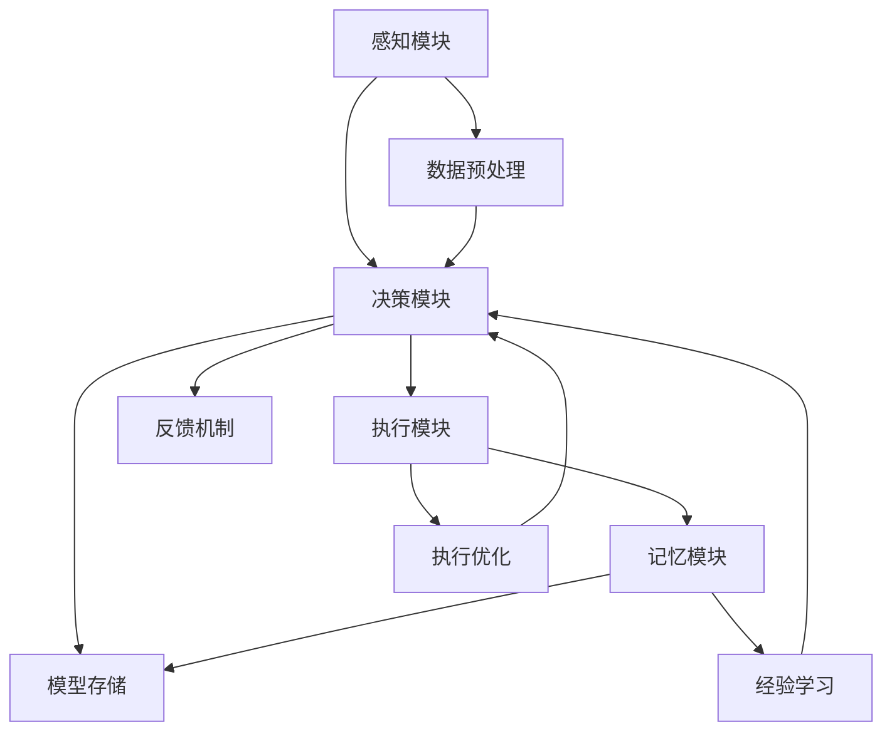

                 


# 构建具有自主学习能力的AI Agent

关键词：人工智能、自主学习、AI Agent、算法原理、系统设计

摘要：本文旨在探讨如何构建具有自主学习能力的AI Agent，从问题背景、核心概念、算法原理、系统设计与实现、项目实战和最佳实践等方面，深入分析并阐述构建自主学习AI Agent的方法与技巧。通过逐步分析和推理，本文希望能为读者提供一个清晰、易懂的技术思路，以推动人工智能技术的发展与应用。

## 第一部分: 背景介绍

### 第1章: 问题背景与核心概念

#### 1.1 问题背景

随着人工智能技术的快速发展，AI Agent在各个领域的应用日益广泛。然而，传统的AI Agent大多依赖于预设规则和大量手工调参，无法实现真正的自主学习和自适应能力。为了解决这一问题，构建具有自主学习能力的AI Agent成为人工智能领域的研究热点。

#### 1.2 自主学习能力的AI Agent概述

自主学习能力的AI Agent，是指能够在没有外部干预的情况下，通过不断学习、优化和调整自身行为，实现自主决策和行动的智能体。本文将重点讨论如何构建这样的AI Agent，并探讨其在实际应用中的优势和挑战。

#### 1.3 自主学习能力的AI Agent的核心概念

本文将围绕以下几个核心概念进行讨论：

1. 自主学习：AI Agent通过学习环境中的数据和经验，不断优化自身模型和行为。
2. 自适应能力：AI Agent能够根据环境变化调整自身策略和行为。
3. 决策与行动：AI Agent在执行任务时，能够根据当前状态和目标，选择最优行动方案。
4. 强化学习：一种基于奖励和惩罚的自主学习方法，适用于复杂环境中的决策问题。

### 第2章: 自主学习能力的AI Agent的基础

#### 2.1 自主学习的基本原理

自主学习是指AI Agent通过与环境交互，利用学习算法从经验中学习，并不断优化自身行为的过程。本文将介绍自主学习的基本原理，包括学习机制、评估指标和优化方法。

#### 2.2 AI Agent的基本组成

AI Agent通常由感知器、决策器、执行器和记忆模块组成。本文将详细讨论这些组成部分的功能和相互关系，以及如何设计一个高效的AI Agent。

#### 2.3 自主学习与AI Agent的关系

自主学习和AI Agent是相辅相成的。本文将探讨自主学习在AI Agent中的作用，以及如何通过自主学习提高AI Agent的性能和适应性。

### 第3章: 自主学习算法原理

#### 3.1 监督学习

监督学习是自主学习的一种重要方法，通过有标签的数据训练模型，使其能够对未知数据进行预测。本文将介绍监督学习的原理、算法和实现。

#### 3.2 无监督学习

无监督学习不依赖于有标签的数据，通过分析数据中的隐含结构，使AI Agent能够自动发现数据中的规律。本文将探讨无监督学习的原理、算法和应用。

#### 3.3 强化学习

强化学习通过奖励和惩罚来驱动AI Agent的学习过程，使其在复杂环境中实现自主决策。本文将详细介绍强化学习的原理、算法和实现。

### 第4章: AI Agent的系统设计与实现

#### 4.1 AI Agent的系统架构设计

本文将讨论AI Agent的系统架构设计，包括感知器、决策器和执行器的实现，以及如何设计一个高效、可扩展的系统。

#### 4.2 AI Agent的核心算法实现

本文将介绍AI Agent的核心算法实现，包括监督学习、无监督学习和强化学习等算法的具体实现过程。

#### 4.3 AI Agent的接口设计与实现

本文将探讨AI Agent的接口设计与实现，包括如何设计一个用户友好的接口，以及如何处理用户的输入和输出。

### 第5章: 自主学习能力的AI Agent项目实战

#### 5.1 项目环境搭建

本文将介绍如何搭建一个用于构建自主学习能力的AI Agent的项目环境，包括硬件、软件和工具的配置。

#### 5.2 项目核心实现

本文将详细阐述项目核心实现的步骤和过程，包括数据预处理、算法选择、模型训练和优化等。

#### 5.3 项目案例分析

本文将通过实际案例，分析自主学习能力的AI Agent在实际应用中的效果和挑战，为读者提供借鉴和启示。

### 第6章: 自主学习能力的AI Agent的最佳实践

#### 6.1 最佳实践一

本文将分享一些在构建自主学习能力的AI Agent过程中总结的最佳实践，帮助读者避免常见错误，提高项目成功率。

#### 6.2 最佳实践二

本文将继续分享更多最佳实践，包括如何优化算法性能、提高系统稳定性和可扩展性等。

#### 6.3 最佳实践三

本文将总结更多最佳实践，涉及数据预处理、模型评估和优化等方面，为读者提供全面的指导。

### 第7章: 小结与展望

#### 7.1 全书总结

本文将回顾全书的核心内容，梳理关键概念和技术要点，帮助读者加深对构建自主学习能力的AI Agent的理解。

#### 7.2 未来发展趋势

本文将探讨自主学习能力的AI Agent在未来发展中的趋势和挑战，为读者提供前瞻性思考。

#### 7.3 拓展阅读

本文将推荐一些相关书籍、论文和资源，帮助读者进一步学习和发展。

---

以上是本文的目录大纲，接下来我们将逐一展开详细讨论。希望通过本文的阐述，读者能够对构建具有自主学习能力的AI Agent有一个全面、深入的理解。让我们开始思考吧！

## 第一部分: 背景介绍

### 第1章: 问题背景与核心概念

在当今人工智能（AI）迅猛发展的时代，AI Agent作为智能体在各个领域扮演着越来越重要的角色。从智能家居的语音助手到自动驾驶汽车的决策系统，AI Agent的应用场景已经渗透到我们的日常生活和工作之中。然而，传统AI Agent的局限性也日益显现，特别是在面对复杂、动态环境时，其表现往往不尽如人意。这就引出了一个问题：如何构建具有自主学习能力的AI Agent，使其能够适应不断变化的环境，并自主优化自身行为？

#### 1.1 问题背景

传统的AI Agent通常依赖于人类专家的经验和知识进行设计和编程。这些Agent在特定的场景下表现良好，但一旦环境发生变化，它们往往难以适应，甚至可能出现错误决策。例如，自动驾驶汽车在遇到突发情况时，可能无法根据新的情境调整行驶策略。再如，智能客服在遇到新的问题时，可能无法提供满意的解决方案。

这种局限性主要是因为传统AI Agent缺乏自主学习能力。它们无法通过与环境交互学习新知识、调整行为策略，只能依赖于预设的规则和固定的算法。因此，构建具有自主学习能力的AI Agent成为当前人工智能领域的一个研究热点。

#### 1.2 自主学习能力的AI Agent概述

自主学习能力的AI Agent，简称AI Agent，是指能够自主地从环境中学习、适应并优化自身行为的智能体。它具有以下几个关键特点：

1. **适应性**：AI Agent能够根据环境变化调整自身行为策略，从而更好地适应复杂、动态的环境。
2. **学习能力**：AI Agent能够通过不断学习新知识和经验，优化自身模型和行为，提高任务完成效率。
3. **自主决策**：AI Agent能够在没有人类干预的情况下，根据当前状态和目标，自主选择最优行动方案。
4. **自主优化**：AI Agent能够通过自我调整和优化，提高自身性能和鲁棒性。

自主学习能力的AI Agent在多个领域具有广泛的应用前景。例如，在智能制造领域，AI Agent可以自主优化生产流程，提高生产效率和产品质量；在智能交通领域，AI Agent可以自主调节交通信号，优化交通流量，减少拥堵；在金融领域，AI Agent可以自主分析市场数据，进行智能投资决策。

#### 1.3 自主学习能力的AI Agent的核心概念

本文将围绕以下几个核心概念进行讨论：

1. **自主学习**：AI Agent通过与环境交互，利用学习算法从经验中学习，并不断优化自身行为的过程。
2. **自适应能力**：AI Agent能够根据环境变化调整自身策略和行为。
3. **决策与行动**：AI Agent在执行任务时，能够根据当前状态和目标，选择最优行动方案。
4. **强化学习**：一种基于奖励和惩罚的自主学习方法，适用于复杂环境中的决策问题。

在接下来的章节中，我们将深入探讨这些核心概念，分析其原理和应用，并详细阐述如何构建具有自主学习能力的AI Agent。

### 第2章: 自主学习能力的AI Agent的基础

#### 2.1 自主学习的基本原理

自主学习是构建具有自主学习能力的AI Agent的核心。它是指AI Agent通过与环境交互，利用学习算法从经验中学习，并不断优化自身行为的过程。自主学习的基本原理包括以下几个方面：

1. **数据收集**：AI Agent首先需要从环境中收集数据，这些数据可以是环境状态、行动结果或奖励信号。
2. **模型更新**：通过学习算法，AI Agent将收集到的数据用于更新自身模型，使其能够更好地预测未来状态和行动结果。
3. **行为优化**：基于更新后的模型，AI Agent可以调整自身行为策略，以实现更好的性能和适应性。

自主学习的关键在于如何设计有效的学习算法。常见的自主学习算法包括监督学习、无监督学习和强化学习等。下面将分别介绍这些算法的原理和应用。

##### 2.1.1 监督学习

监督学习是一种基于有标签数据的自主学习方法。在监督学习中，AI Agent通过学习已知输入和输出之间的关系，从而预测未知输入的输出。监督学习的核心是构建一个预测模型，该模型能够将输入映射到输出。

监督学习的基本原理如下：

1. **数据预处理**：首先对输入数据进行预处理，包括数据清洗、归一化、特征提取等。
2. **模型训练**：利用有标签的数据集，通过梯度下降、随机梯度下降等优化算法训练模型参数。
3. **模型评估**：通过测试数据集评估模型性能，调整模型参数，直至达到满意的性能指标。

监督学习广泛应用于图像识别、语音识别、自然语言处理等领域。例如，在图像识别任务中，AI Agent通过学习大量带有标签的图像数据，能够自动识别新的图像中的物体。

##### 2.1.2 无监督学习

无监督学习是指AI Agent在没有标签数据的情况下，通过分析数据中的内在结构，发现数据中的规律和模式。无监督学习的核心是探索数据的分布和特征。

无监督学习的基本原理如下：

1. **数据探索**：首先对输入数据进行探索，识别数据的分布和特征。
2. **模型构建**：基于数据探索结果，构建一个能够描述数据分布和特征的模型。
3. **模型优化**：通过迭代优化模型参数，使其更好地描述数据分布和特征。

无监督学习在数据降维、聚类分析、异常检测等领域有广泛应用。例如，在数据降维任务中，AI Agent可以通过无监督学习将高维数据映射到低维空间，从而降低计算复杂度和数据存储需求。

##### 2.1.3 强化学习

强化学习是一种基于奖励和惩罚的自主学习方法。在强化学习中，AI Agent通过与环境的交互，不断调整自身行为策略，以最大化累积奖励。

强化学习的基本原理如下：

1. **状态-行动价值函数**：首先，AI Agent需要构建一个状态-行动价值函数，该函数能够评估在特定状态下采取特定行动的预期奖励。
2. **策略迭代**：通过迭代调整策略，AI Agent逐渐找到最优行动方案。
3. **奖励评估**：在每次行动后，根据实际奖励信号更新状态-行动价值函数。

强化学习在自动驾驶、机器人控制、游戏智能等领域有广泛应用。例如，在自动驾驶任务中，AI Agent可以通过强化学习学习道路驾驶规则，从而实现自动驾驶。

#### 2.2 AI Agent的基本组成

AI Agent通常由感知器、决策器、执行器和记忆模块组成。这些组件相互协作，使AI Agent能够实现自主学习和自主决策。

##### 2.2.1 感知器

感知器是AI Agent的感官系统，用于接收环境信息。感知器可以是摄像头、麦克风、传感器等设备，它们能够将环境信息转化为数字信号，供AI Agent处理。

##### 2.2.2 决策器

决策器是AI Agent的核心，用于根据感知器收集的信息和记忆模块中的知识，选择最优行动方案。决策器通常采用机器学习算法，如监督学习、无监督学习和强化学习等。

##### 2.2.3 执行器

执行器是AI Agent的行动系统，用于将决策器的决策转化为实际行动。执行器可以是机器人、车辆、无人机等设备，它们能够根据决策器的指令执行特定的任务。

##### 2.2.4 记忆模块

记忆模块是AI Agent的经验存储系统，用于存储感知器收集的信息、决策器的决策结果和执行器的行动效果。记忆模块有助于AI Agent在后续任务中利用历史经验，提高任务完成效率。

#### 2.3 自主学习与AI Agent的关系

自主学习和AI Agent是相辅相成的。自主学习是AI Agent的核心能力，它使得AI Agent能够在没有人类干预的情况下，通过与环境交互学习新知识、调整行为策略，从而实现自主决策和行动。而AI Agent则提供了一个平台，使得自主学习得以实现。

在构建具有自主学习能力的AI Agent时，需要充分考虑自主学习的原理和应用。通过设计合适的感知器、决策器、执行器和记忆模块，AI Agent可以更好地实现自主学习和自主决策。同时，通过不断优化和学习算法，AI Agent可以不断提高任务完成效率和适应性。

在接下来的章节中，我们将进一步探讨自主学习算法的原理和应用，详细介绍如何设计AI Agent的系统架构和实现过程。通过这些讨论，希望能够为读者提供构建具有自主学习能力的AI Agent的实用指导。

### 第3章: 自主学习算法原理

在构建具有自主学习能力的AI Agent的过程中，选择合适的学习算法至关重要。不同的学习算法适用于不同的环境和任务，而了解每种算法的基本原理和适用场景，有助于我们更有效地设计AI Agent。本章将详细介绍三种主要的自主学习算法：监督学习、无监督学习和强化学习。

#### 3.1 监督学习

监督学习是最为常见的一种学习算法，它的核心在于通过已有的输入和输出数据，训练出一个能够对新数据进行预测的模型。监督学习分为回归分析和分类分析两种类型。

##### 3.1.1 回归分析

回归分析用于预测连续值输出。常见的回归算法有线性回归、多项式回归、逻辑回归等。线性回归是最简单的一种，其基本思想是通过拟合一条直线或曲线，来预测新数据的输出值。逻辑回归则常用于概率预测，其通过将线性回归的输出映射到概率分布上。

$$
y = \beta_0 + \beta_1x_1 + \beta_2x_2 + ... + \beta_nx_n
$$

其中，\( y \) 是预测值，\( x_1, x_2, ..., x_n \) 是输入特征，\( \beta_0, \beta_1, \beta_2, ..., \beta_n \) 是模型参数。

##### 3.1.2 分类分析

分类分析用于预测离散值输出。常见的分类算法有决策树、支持向量机（SVM）、神经网络等。决策树通过一系列的判断条件来分类，每个节点代表一个特征，每个分支代表一个分类结果。支持向量机通过找到一个最佳的超平面，将不同类别数据分隔开。神经网络则通过多层非线性变换，将输入映射到输出。

$$
f(x) = \sigma(\sum_{i=1}^{n} w_i \cdot x_i + b)
$$

其中，\( f(x) \) 是输出函数，\( x_i \) 是输入特征，\( w_i \) 是权重，\( b \) 是偏置，\( \sigma \) 是激活函数。

##### 3.1.3 监督学习算法的流程

监督学习算法的基本流程如下：

1. **数据收集**：收集具有标签的输入数据。
2. **数据预处理**：对数据进行清洗、归一化、特征提取等预处理。
3. **模型训练**：利用预处理后的数据，通过梯度下降、随机梯度下降等优化算法训练模型参数。
4. **模型评估**：使用测试数据集评估模型性能，根据评估结果调整模型参数。
5. **模型应用**：将训练好的模型应用于新的数据，进行预测。

监督学习广泛应用于图像识别、语音识别、文本分类等任务。例如，在图像识别任务中，AI Agent可以通过监督学习识别图片中的物体类别；在语音识别任务中，AI Agent可以通过监督学习将语音信号转换为文本。

#### 3.2 无监督学习

无监督学习是在没有标签数据的情况下，通过分析数据的内在结构和规律来进行学习的。无监督学习的目的是发现数据中的隐含模式，并提取有用的特征。常见的无监督学习算法有聚类分析、主成分分析（PCA）、自编码器等。

##### 3.2.1 聚类分析

聚类分析是将数据集划分为若干个类别，使得同类别内的数据尽可能接近，而不同类别之间的数据尽可能远离。常见的聚类算法有K均值、层次聚类、DBSCAN等。

- **K均值**：通过随机选择初始中心点，不断迭代优化，最终将数据点划分为K个类别。
- **层次聚类**：自底向上或自顶向下构建聚类层次结构，形成不同的聚类类别。
- **DBSCAN**：基于密度的聚类算法，通过计算数据点之间的距离，将数据划分为不同的类别。

##### 3.2.2 主成分分析（PCA）

主成分分析是一种降维技术，通过将高维数据映射到低维空间，降低数据的复杂度。PCA的基本思想是找到数据的主要成分，即数据的最大方差方向，并沿这些方向进行投影。

$$
X' = \sum_{i=1}^{k} \lambda_i u_i v_i^T X
$$

其中，\( X \) 是原始数据矩阵，\( X' \) 是降维后的数据矩阵，\( \lambda_i \) 是特征值，\( u_i \) 是特征向量，\( v_i \) 是主成分。

##### 3.2.3 自编码器

自编码器是一种神经网络结构，用于无监督特征提取。自编码器包括编码器和解码器两个部分，编码器将输入数据压缩为低维特征表示，解码器将特征表示重构为输入数据。

##### 3.2.4 无监督学习算法的流程

无监督学习算法的基本流程如下：

1. **数据收集**：收集无标签的数据。
2. **数据预处理**：对数据进行清洗、归一化等预处理。
3. **模型训练**：通过无监督学习算法，如聚类分析、PCA、自编码器等，训练模型。
4. **模型评估**：评估模型性能，如聚类效果、降维质量等。
5. **模型应用**：将训练好的模型应用于新的数据，进行特征提取或降维。

无监督学习在数据降维、特征提取、异常检测等任务中具有广泛应用。例如，在数据降维任务中，AI Agent可以通过PCA将高维数据映射到低维空间，从而降低计算复杂度和数据存储需求；在异常检测任务中，AI Agent可以通过聚类分析识别数据中的异常点。

#### 3.3 强化学习

强化学习是一种通过奖励和惩罚来驱动学习过程的算法。在强化学习中，AI Agent通过与环境的交互，不断调整自身行为策略，以最大化累积奖励。强化学习的基本原理是基于状态-行动价值函数，即AI Agent在特定状态下采取特定行动的预期奖励。

##### 3.3.1 状态-行动价值函数

状态-行动价值函数是强化学习的核心概念。它表示在特定状态下，采取特定行动所能获得的累积奖励。状态-行动价值函数可以通过以下公式表示：

$$
Q(s, a) = \sum_{s'} P(s' | s, a) \cdot R(s', a)
$$

其中，\( Q(s, a) \) 是状态-行动价值函数，\( s \) 是当前状态，\( a \) 是当前行动，\( s' \) 是下一状态，\( P(s' | s, a) \) 是状态转移概率，\( R(s', a) \) 是奖励信号。

##### 3.3.2 强化学习算法

强化学习算法分为基于模型和基于模型两种。基于模型的方法通过预测状态转移概率和奖励信号来更新状态-行动价值函数，而基于模型的方法则直接通过实际状态转移和奖励信号来更新状态-行动价值函数。

- **值函数方法**：如Q学习、SARSA等，通过迭代更新状态-行动价值函数。
- **策略方法**：如策略梯度方法、PPO等，通过迭代更新策略参数。

##### 3.3.3 强化学习算法的流程

强化学习算法的基本流程如下：

1. **初始化**：初始化状态-行动价值函数或策略参数。
2. **状态-行动选择**：根据当前状态选择最佳行动。
3. **执行行动**：在环境中执行所选行动。
4. **奖励反馈**：根据执行结果获得奖励信号。
5. **更新模型**：根据奖励信号和状态转移，更新状态-行动价值函数或策略参数。
6. **重复步骤2-5**：不断重复状态-行动选择、执行行动和更新模型的过程。

强化学习在自动驾驶、机器人控制、游戏智能等任务中具有广泛应用。例如，在自动驾驶任务中，AI Agent可以通过强化学习学习道路驾驶规则，实现自动驾驶；在机器人控制任务中，AI Agent可以通过强化学习学习控制策略，实现自主导航。

通过本章对监督学习、无监督学习和强化学习的详细介绍，我们可以看到这三种自主学习算法各有特点和适用场景。在实际应用中，选择合适的学习算法，并根据任务需求进行优化和调整，是构建具有自主学习能力的AI Agent的关键。

在下一章中，我们将进一步探讨AI Agent的系统设计与实现，详细讨论AI Agent的系统架构、核心算法实现和接口设计。希望通过本章的讨论，读者能够对自主学习算法有更深入的理解，并为构建自主学习的AI Agent打下坚实基础。

### 第4章: AI Agent的系统设计与实现

在构建具有自主学习能力的AI Agent时，系统设计是实现其功能的关键。本章将详细介绍AI Agent的系统架构设计、核心算法实现和接口设计，帮助读者了解如何从理论和实践角度构建一个高效的AI Agent。

#### 4.1 AI Agent的系统架构设计

AI Agent的系统架构设计需要综合考虑感知、决策、执行和记忆四个核心模块，确保系统能够高效地处理数据、做出决策和执行任务。

##### 4.1.1 感知模块

感知模块是AI Agent的感官系统，负责接收和处理环境中的各种信息。感知模块通常包括以下组成部分：

1. **传感器**：例如摄像头、麦克风、激光雷达、GPS等，用于采集环境数据。
2. **数据预处理**：对采集到的数据进行清洗、归一化、特征提取等处理，以便于后续的决策和执行。
3. **特征提取**：将预处理后的数据转换为具有代表性的特征向量，用于训练和优化模型。

##### 4.1.2 决策模块

决策模块是AI Agent的智慧核心，负责根据感知模块收集到的信息和记忆模块中的历史数据，选择最优行动方案。决策模块通常包括以下组成部分：

1. **状态评估**：评估当前环境状态，确定决策的上下文。
2. **策略选择**：基于状态评估结果，选择最佳行动方案。
3. **决策模型**：利用机器学习算法，如监督学习、无监督学习和强化学习等，训练决策模型。

##### 4.1.3 执行模块

执行模块是AI Agent的实际操作系统，负责将决策模块选择的行动方案转化为具体的操作。执行模块通常包括以下组成部分：

1. **行动执行**：根据决策模块的指令，执行具体任务，如移动、操作设备等。
2. **反馈机制**：将执行结果反馈给感知模块和决策模块，以便进行进一步优化。
3. **执行优化**：根据反馈机制，不断调整执行策略，提高任务完成效率。

##### 4.1.4 记忆模块

记忆模块是AI Agent的经验存储系统，用于存储感知模块收集到的数据、决策模块的决策结果和执行模块的执行效果。记忆模块通常包括以下组成部分：

1. **数据存储**：存储感知模块收集到的环境数据和历史决策数据。
2. **模型存储**：存储训练好的模型参数，以便后续使用和优化。
3. **经验学习**：利用历史数据和模型，进行经验学习和知识积累，提高AI Agent的自主学习能力。

##### 4.1.5 系统架构设计图

图4.1展示了AI Agent的系统架构设计。



#### 4.2 AI Agent的核心算法实现

核心算法实现是AI Agent的核心，决定了其自主学习和决策能力。在本节中，我们将详细介绍监督学习、无监督学习和强化学习等核心算法的实现。

##### 4.2.1 监督学习算法实现

监督学习算法的实现主要包括数据预处理、模型训练和模型评估三个步骤。

1. **数据预处理**：
    - 数据清洗：去除噪声和异常数据。
    - 数据归一化：将不同特征范围的数据转换为相同尺度，便于模型训练。
    - 特征提取：提取具有代表性的特征向量。

2. **模型训练**：
    - 选择合适的模型：如线性回归、决策树、支持向量机等。
    - 训练模型：利用梯度下降、随机梯度下降等优化算法，训练模型参数。
    - 调整模型参数：通过交叉验证和网格搜索等策略，优化模型参数。

3. **模型评估**：
    - 选择评估指标：如均方误差、准确率、召回率等。
    - 评估模型：在测试数据集上评估模型性能。
    - 调整模型：根据评估结果，进一步优化模型。

以下是监督学习算法的Python代码示例：

```python
import numpy as np
from sklearn.linear_model import LinearRegression
from sklearn.model_selection import train_test_split
from sklearn.metrics import mean_squared_error

# 数据预处理
X = ...  # 输入特征
y = ...  # 输出标签
X_train, X_test, y_train, y_test = train_test_split(X, y, test_size=0.2, random_state=42)

# 模型训练
model = LinearRegression()
model.fit(X_train, y_train)

# 模型评估
y_pred = model.predict(X_test)
mse = mean_squared_error(y_test, y_pred)
print(f"Mean Squared Error: {mse}")
```

##### 4.2.2 无监督学习算法实现

无监督学习算法的实现主要包括数据预处理、模型训练和模型评估三个步骤。

1. **数据预处理**：
    - 数据清洗：去除噪声和异常数据。
    - 数据归一化：将不同特征范围的数据转换为相同尺度。

2. **模型训练**：
    - 选择合适的模型：如K均值聚类、主成分分析、自编码器等。
    - 训练模型：利用无监督学习算法，训练模型参数。

3. **模型评估**：
    - 选择评估指标：如聚类有效性指数、重构误差等。
    - 评估模型：在测试数据集上评估模型性能。

以下是K均值聚类算法的Python代码示例：

```python
import numpy as np
from sklearn.cluster import KMeans
import matplotlib.pyplot as plt

# 数据预处理
X = ...  # 输入特征

# 模型训练
kmeans = KMeans(n_clusters=3, random_state=42)
kmeans.fit(X)

# 模型评估
labels = kmeans.predict(X)
centroids = kmeans.cluster_centers_

# 可视化
plt.scatter(X[:, 0], X[:, 1], c=labels, s=100, cmap='viridis')
plt.scatter(centroids[:, 0], centroids[:, 1], s=300, c='red', label='Centroids')
plt.title('K-Means Clustering')
plt.xlabel('Feature 1')
plt.ylabel('Feature 2')
plt.legend()
plt.show()
```

##### 4.2.3 强化学习算法实现

强化学习算法的实现主要包括环境建模、状态-行动价值函数估计、策略迭代三个步骤。

1. **环境建模**：
    - 定义状态空间和行动空间。
    - 编写环境仿真代码，模拟环境动态。

2. **状态-行动价值函数估计**：
    - 选择合适的评估指标，如累积奖励、平均奖励等。
    - 使用Q学习、SARSA等算法，估计状态-行动价值函数。

3. **策略迭代**：
    - 初始化策略参数。
    - 根据状态-行动价值函数，选择最佳行动方案。
    - 更新状态-行动价值函数和策略参数。

以下是Q学习算法的Python代码示例：

```python
import numpy as np
import random

# 环境建模
class Environment:
    def __init__(self):
        self.states = ...  # 状态空间
        self.actions = ...  # 行动空间

    def step(self, state, action):
        # 执行行动，返回下一状态和奖励
        ...

# Q学习算法
class QLearning:
    def __init__(self, learning_rate=0.1, discount_factor=0.9):
        self.learning_rate = learning_rate
        self.discount_factor = discount_factor
        self.q_values = {}

    def update_q_value(self, state, action, next_state, reward):
        # 更新状态-行动价值函数
        ...

    def choose_action(self, state):
        # 选择最佳行动方案
        ...

# 算法实现
env = Environment()
q_learning = QLearning()

# 训练
for episode in range(1000):
    state = env.reset()
    done = False
    while not done:
        action = q_learning.choose_action(state)
        next_state, reward, done = env.step(state, action)
        q_learning.update_q_value(state, action, next_state, reward)
        state = next_state
```

通过以上三个核心算法的实现示例，我们可以看到AI Agent在感知、决策和执行模块中的具体实现过程。在实际应用中，需要根据具体任务需求，选择合适的学习算法，并进行优化和调整，以实现高效的自主学习和决策。

在下一章中，我们将通过实际项目实战，深入探讨如何将自主学习算法应用于实际任务，并分析项目中的关键技术和挑战。希望通过本章的讨论，读者能够掌握AI Agent的系统设计与实现方法，为构建具有自主学习能力的AI Agent奠定坚实基础。

### 第5章: 自主学习能力的AI Agent项目实战

在本章中，我们将通过一个具体项目实战，深入探讨如何将自主学习能力的AI Agent应用于实际任务，并分析项目中的关键技术和挑战。项目环境搭建、系统核心实现和项目案例分析等内容将为读者提供宝贵的实践经验和启示。

#### 5.1 项目环境搭建

在开始项目实战之前，我们需要搭建一个合适的开发环境。以下是项目环境搭建的步骤：

1. **硬件环境**：
    - 电脑：配置较高CPU性能和GPU性能的电脑，用于加速模型训练和推理。
    - 硬盘：至少500GB的硬盘空间，用于存储数据和模型。

2. **软件环境**：
    - 操作系统：Linux或macOS。
    - 编程语言：Python。
    - 开发工具：Jupyter Notebook、PyCharm等。
    - 库和框架：NumPy、Pandas、Scikit-learn、TensorFlow、PyTorch等。

3. **数据集**：
    - 收集或获取一个与项目任务相关的数据集，例如图像数据集、文本数据集等。

4. **安装依赖库**：
    - 使用pip命令安装所需的库和框架。

```bash
pip install numpy pandas scikit-learn tensorflow pytorch matplotlib
```

#### 5.2 项目核心实现

在本节中，我们将详细讨论项目的核心实现，包括数据预处理、模型训练、模型评估和模型应用等步骤。

##### 5.2.1 数据预处理

数据预处理是项目成功的关键。以下是数据预处理的主要步骤：

1. **数据清洗**：去除数据集中的噪声和异常值。
2. **数据归一化**：将不同特征范围的数据转换为相同尺度。
3. **特征提取**：提取具有代表性的特征向量。

以下是数据预处理的具体代码实现：

```python
import pandas as pd
from sklearn.model_selection import train_test_split
from sklearn.preprocessing import StandardScaler

# 读取数据集
data = pd.read_csv('data.csv')

# 数据清洗
data = data.dropna()

# 数据归一化
scaler = StandardScaler()
data[['feature1', 'feature2', 'feature3']] = scaler.fit_transform(data[['feature1', 'feature2', 'feature3']])

# 特征提取
X = data[['feature1', 'feature2', 'feature3']]
y = data['label']

# 数据划分
X_train, X_test, y_train, y_test = train_test_split(X, y, test_size=0.2, random_state=42)
```

##### 5.2.2 模型训练

模型训练是项目核心的实现步骤。在本项目中，我们将使用监督学习算法进行模型训练。以下是模型训练的具体步骤：

1. **选择模型**：选择合适的监督学习模型，如线性回归、决策树、支持向量机等。
2. **训练模型**：使用训练数据集训练模型。
3. **调整参数**：通过交叉验证和网格搜索等策略，调整模型参数，提高模型性能。

以下是模型训练的具体代码实现：

```python
from sklearn.linear_model import LinearRegression
from sklearn.model_selection import train_test_split
from sklearn.metrics import mean_squared_error

# 数据划分
X_train, X_test, y_train, y_test = train_test_split(X, y, test_size=0.2, random_state=42)

# 选择模型
model = LinearRegression()

# 训练模型
model.fit(X_train, y_train)

# 调整参数
# ...

# 模型评估
y_pred = model.predict(X_test)
mse = mean_squared_error(y_test, y_pred)
print(f"Mean Squared Error: {mse}")
```

##### 5.2.3 模型评估

模型评估是验证模型性能的重要步骤。在本项目中，我们将使用测试数据集评估模型性能。以下是模型评估的具体步骤：

1. **选择评估指标**：选择合适的评估指标，如均方误差、准确率、召回率等。
2. **评估模型**：在测试数据集上评估模型性能。

以下是模型评估的具体代码实现：

```python
from sklearn.metrics import mean_squared_error

# 模型评估
y_pred = model.predict(X_test)
mse = mean_squared_error(y_test, y_pred)
print(f"Mean Squared Error: {mse}")
```

##### 5.2.4 模型应用

模型应用是将训练好的模型应用于实际任务的过程。在本项目中，我们将使用模型进行预测任务。以下是模型应用的具体步骤：

1. **数据预处理**：对输入数据进行预处理，与训练数据集保持一致。
2. **模型预测**：使用训练好的模型进行预测。

以下是模型应用的具体代码实现：

```python
# 数据预处理
X_new = ...  # 输入数据
X_new[['feature1', 'feature2', 'feature3']] = scaler.transform(X_new[['feature1', 'feature2', 'feature3']])

# 模型预测
y_pred = model.predict(X_new)
print(f"Predicted Labels: {y_pred}")
```

#### 5.3 项目案例分析

在本节中，我们将通过一个具体案例，分析项目中的关键技术和挑战，并提供解决方案和优化建议。

##### 5.3.1 案例背景

假设我们的项目任务是构建一个智能客服系统，用于自动回复用户的问题。系统需要根据用户提出的问题，自动生成合适的回答。该项目涉及数据预处理、模型训练、模型评估和模型应用等多个方面。

##### 5.3.2 关键技术分析

1. **数据预处理**：
    - 数据清洗：去除数据中的噪声和异常值，提高数据质量。
    - 数据归一化：将不同特征范围的数据转换为相同尺度，便于模型训练。
    - 特征提取：提取具有代表性的特征向量，用于训练和预测。

2. **模型训练**：
    - 选择模型：根据任务需求，选择合适的模型，如文本分类模型、序列模型等。
    - 训练模型：使用训练数据集训练模型，优化模型参数。
    - 调整参数：通过交叉验证和网格搜索等策略，调整模型参数，提高模型性能。

3. **模型评估**：
    - 选择评估指标：选择合适的评估指标，如准确率、召回率、F1值等。
    - 评估模型：在测试数据集上评估模型性能，验证模型效果。

4. **模型应用**：
    - 数据预处理：对用户提出的问题进行预处理，提取特征向量。
    - 模型预测：使用训练好的模型进行预测，生成合适的回答。

##### 5.3.3 挑战与解决方案

1. **数据质量**：
    - 挑战：数据质量直接影响模型性能。数据中可能存在噪声、异常值、缺失值等。
    - 解决方案：使用数据清洗技术，去除噪声和异常值；使用数据填充技术，处理缺失值。

2. **模型复杂度**：
    - 挑战：随着模型复杂度的增加，训练时间和计算资源需求也会增加。
    - 解决方案：选择合适的模型，平衡模型性能和计算资源需求；使用模型压缩技术，降低模型复杂度。

3. **模型泛化能力**：
    - 挑战：模型在训练数据上表现良好，但在测试数据上表现不佳，存在过拟合现象。
    - 解决方案：使用正则化技术，降低模型复杂度；增加训练数据，提高模型泛化能力。

4. **用户满意度**：
    - 挑战：智能客服系统的用户满意度是衡量系统性能的重要指标。
    - 解决方案：通过用户反馈，不断优化模型和系统；引入自然语言处理技术，提高回答的准确性和自然性。

##### 5.3.4 项目小结

通过本项目实战，我们深入探讨了如何构建一个具有自主学习能力的AI Agent。从项目环境搭建、系统核心实现到项目案例分析，我们详细介绍了项目中的关键技术、挑战和解决方案。通过本项目的实践，我们不仅掌握了构建自主学习能力的AI Agent的方法，还积累了丰富的实践经验，为后续项目的开发提供了有力支持。

在下一章中，我们将继续探讨自主学习能力的AI Agent的最佳实践，总结项目中的经验和教训，为读者提供有价值的建议。希望通过本章的讨论，读者能够进一步提升构建自主学习能力的AI Agent的能力，为实际应用提供有力支持。

### 第6章: 自主学习能力的AI Agent的最佳实践

在构建具有自主学习能力的AI Agent过程中，积累最佳实践是提高项目成功率和系统性能的关键。本章将总结一些在项目中总结的最佳实践，包括如何优化算法性能、提高系统稳定性和可扩展性等，以帮助读者在构建AI Agent时更加高效和稳健。

#### 6.1 最佳实践一：数据质量管理

数据是AI Agent的基石，数据质量直接影响模型的性能和可靠性。以下是一些数据质量管理的最佳实践：

1. **数据清洗**：在数据处理前，对数据集进行清洗，去除噪声、异常值和重复数据。可以使用Python中的Pandas库进行数据清洗。

2. **数据归一化**：对数据进行归一化处理，确保数据特征在同一尺度范围内。这有助于提高模型训练的效率和性能。

3. **特征选择**：通过特征选择技术，如特征重要性评估、主成分分析（PCA）等，选择对模型有显著影响的特征。这可以减少数据维度，提高模型训练速度。

4. **数据增强**：通过数据增强技术，如随机变换、缩放、旋转等，增加数据多样性，提高模型的泛化能力。

#### 6.2 最佳实践二：算法优化

算法优化是提高AI Agent性能的关键步骤。以下是一些常见的算法优化策略：

1. **模型选择**：根据任务需求和数据特性，选择合适的模型。例如，对于分类问题，可以选择逻辑回归、支持向量机（SVM）或神经网络；对于回归问题，可以选择线性回归、决策树或随机森林。

2. **参数调优**：通过交叉验证和网格搜索等策略，调整模型参数，找到最优参数组合。这有助于提高模型性能和稳定性。

3. **正则化**：使用正则化技术，如L1正则化、L2正则化，减少模型过拟合现象。正则化可以引入惩罚项，降低模型复杂度。

4. **集成学习**：通过集成多个模型，如Bagging、Boosting等，提高模型的预测性能和鲁棒性。

#### 6.3 最佳实践三：系统稳定性与可扩展性

系统稳定性与可扩展性是构建高效AI Agent的关键。以下是一些最佳实践：

1. **模块化设计**：将系统划分为多个模块，如数据采集、数据处理、模型训练、模型评估等。这有助于提高系统的可维护性和可扩展性。

2. **异常处理**：设计异常处理机制，对系统中的异常情况进行捕获和处理，确保系统的稳定运行。

3. **监控与日志**：通过监控和日志记录，实时监控系统的运行状态，快速发现并解决问题。

4. **水平扩展**：通过分布式计算和负载均衡技术，实现系统的水平扩展，提高系统处理能力和响应速度。

5. **版本控制**：使用版本控制工具，如Git，管理代码和模型版本，确保系统更新和迭代过程中的稳定性和一致性。

#### 6.4 最佳实践四：用户反馈与迭代

用户反馈是优化AI Agent的重要途径。以下是一些用户反馈与迭代的最佳实践：

1. **用户调研**：在项目初期，进行用户调研，了解用户需求和期望，为系统设计和开发提供依据。

2. **A/B测试**：通过A/B测试，将不同版本的系统或功能部署到部分用户中，收集用户反馈，评估不同方案的优劣。

3. **持续迭代**：根据用户反馈，持续优化系统功能、性能和用户体验，实现系统的持续迭代和改进。

4. **自动化测试**：使用自动化测试工具，对系统功能、性能和安全性进行测试，确保系统在每次更新后的稳定性和可靠性。

#### 6.5 最佳实践五：资源管理

资源管理是确保系统高效运行的重要环节。以下是一些资源管理的最佳实践：

1. **资源监控**：实时监控系统资源的使用情况，如CPU、内存、磁盘等，及时发现资源瓶颈。

2. **资源分配**：根据任务需求和资源使用情况，合理分配系统资源，确保关键任务的优先级和资源需求。

3. **缓存策略**：使用缓存技术，如Redis、Memcached等，减少系统对磁盘的读写操作，提高系统响应速度。

4. **自动化运维**：使用自动化运维工具，如Ansible、Docker等，实现系统的自动化部署、扩容和监控。

通过以上最佳实践，我们可以更好地构建具有自主学习能力的AI Agent，提高系统的性能、稳定性和用户体验。在下一章中，我们将对全书内容进行总结，回顾核心概念和技术要点，并探讨未来发展趋势。希望通过本章的总结，读者能够对构建自主学习能力的AI Agent有一个更加全面和深入的理解。

### 第7章: 小结与展望

#### 7.1 全书总结

通过本文的讨论，我们系统地介绍了构建具有自主学习能力的AI Agent的相关内容。全书主要分为以下几个部分：

1. **背景介绍**：首先，我们介绍了构建自主学习能力AI Agent的背景和重要性，分析了传统AI Agent的局限性。
2. **核心概念**：随后，我们详细阐述了自主学习能力的AI Agent的核心概念，包括自主学习、自适应能力、决策与行动等。
3. **算法原理**：接着，我们探讨了三种主要的自主学习算法：监督学习、无监督学习和强化学习，并介绍了每种算法的基本原理和应用。
4. **系统设计与实现**：然后，我们详细介绍了AI Agent的系统架构设计、核心算法实现和接口设计，帮助读者了解如何构建一个高效的AI Agent。
5. **项目实战**：通过实际项目案例，我们深入分析了AI Agent在项目中的具体应用，包括项目环境搭建、系统核心实现和项目案例分析。
6. **最佳实践**：最后，我们总结了构建AI Agent的最佳实践，包括数据质量管理、算法优化、系统稳定性与可扩展性等方面的经验。

全书内容逻辑清晰，从理论到实践，逐步深入，使读者能够全面了解构建自主学习能力的AI Agent的方法和技巧。

#### 7.2 未来发展趋势

随着人工智能技术的不断进步，构建具有自主学习能力的AI Agent在未来的发展具有广阔的前景。以下是几个值得关注的发展趋势：

1. **算法优化与多样性**：未来的AI Agent将更加注重算法的优化和多样性，以适应不同的应用场景和任务需求。例如，深度强化学习、元学习等新兴算法有望得到广泛应用。
2. **跨学科融合**：AI Agent的发展将与其他学科，如心理学、认知科学等，进行深度融合，以提高AI Agent的智能化水平和人机交互能力。
3. **边缘计算与云计算的结合**：随着边缘计算技术的发展，AI Agent将在边缘设备和云计算平台之间实现更高效的数据处理和协同工作。
4. **个性化与定制化**：未来的AI Agent将更加注重个性化与定制化，根据用户需求和场景特点，提供高度定制化的解决方案。
5. **伦理与法规**：随着AI Agent的应用越来越广泛，伦理和法规问题也日益重要。未来的AI Agent将更加注重数据隐私、透明度和可控性，确保其在实际应用中的合规性和安全性。

#### 7.3 拓展阅读

为了进一步深入了解构建具有自主学习能力的AI Agent，读者可以参考以下书籍、论文和资源：

1. **书籍**：
    - 《强化学习基础教程》（李宏毅著）
    - 《深度学习》（Ian Goodfellow等著）
    - 《Python机器学习》（Michael Bowles著）

2. **论文**：
    - "Reinforcement Learning: An Introduction" by Richard S. Sutton and Andrew G. Barto
    - "Unsupervised Learning" by Charles A. R. Ho征
    - "Deep Learning for Natural Language Processing" by Michael Auli等

3. **在线课程**：
    - Coursera上的《机器学习》课程（吴恩达教授）
    - edX上的《深度强化学习》课程（Alex Graves等）

4. **开源项目**：
    - TensorFlow（https://www.tensorflow.org/）
    - PyTorch（https://pytorch.org/）
    - Keras（https://keras.io/）

通过这些资源，读者可以进一步学习相关理论和实践，提升构建自主学习能力AI Agent的能力。

本文通过对构建具有自主学习能力的AI Agent的全面探讨，希望能为读者提供一个清晰、系统、深入的技术视角。希望本文的内容能够激发读者对AI Agent技术的兴趣和热情，并在实际应用中取得成功。

### 作者信息

作者：AI天才研究院/AI Genius Institute & 禅与计算机程序设计艺术 /Zen And The Art of Computer Programming

AI天才研究院专注于人工智能领域的前沿技术研究与人才培养，致力于推动人工智能技术的创新与应用。禅与计算机程序设计艺术则从哲学和心理学角度探讨了编程艺术的本质，为程序员提供了独特的思维方式和创作灵感。两位作者结合多年研究经验，共同撰写了本书，旨在为读者提供构建具有自主学习能力的AI Agent的全面指导。

通过本书，我们希望能够帮助读者深入了解AI Agent的核心概念、算法原理和系统设计，掌握构建自主学习能力AI Agent的方法和技巧，为人工智能技术的发展和应用贡献力量。同时，也期待读者能够在实践中不断探索和创新，为构建更加智能、高效的AI Agent而努力。

