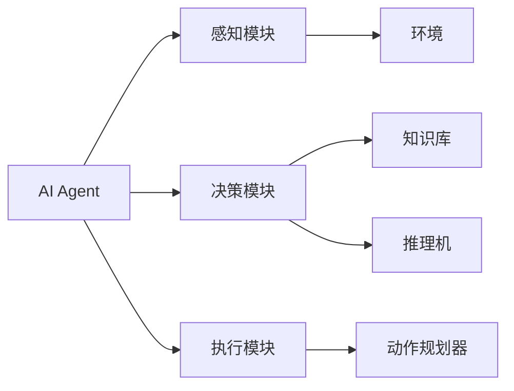
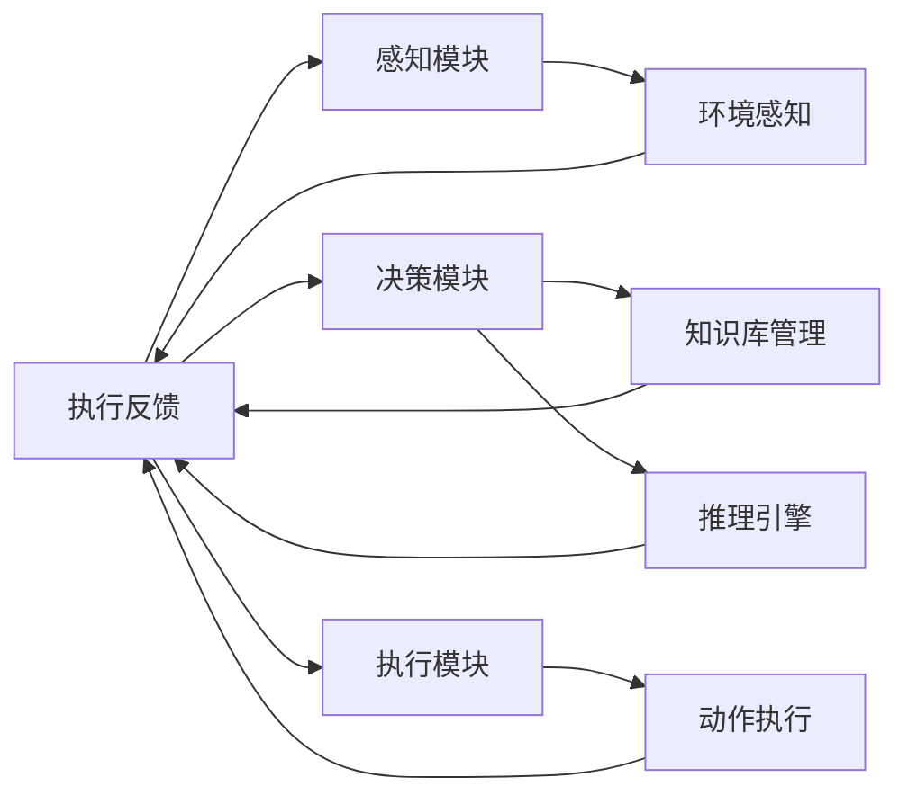
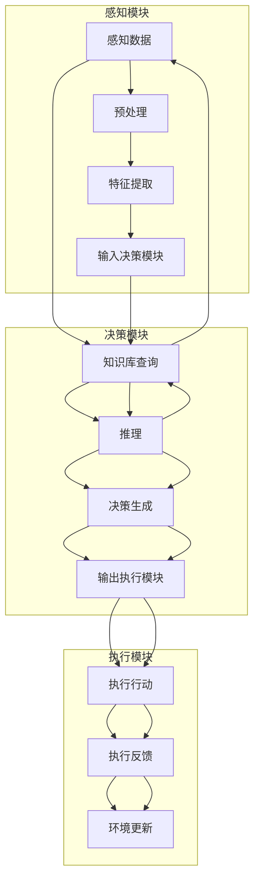
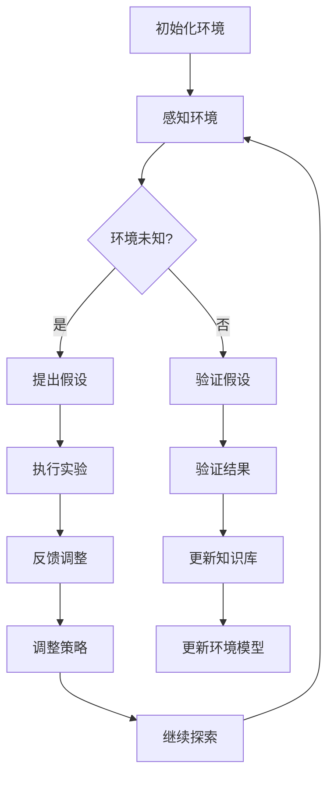
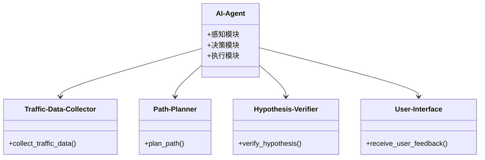
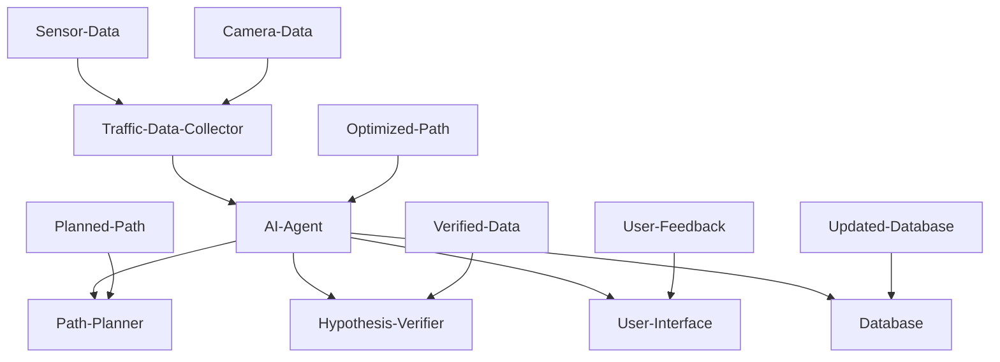
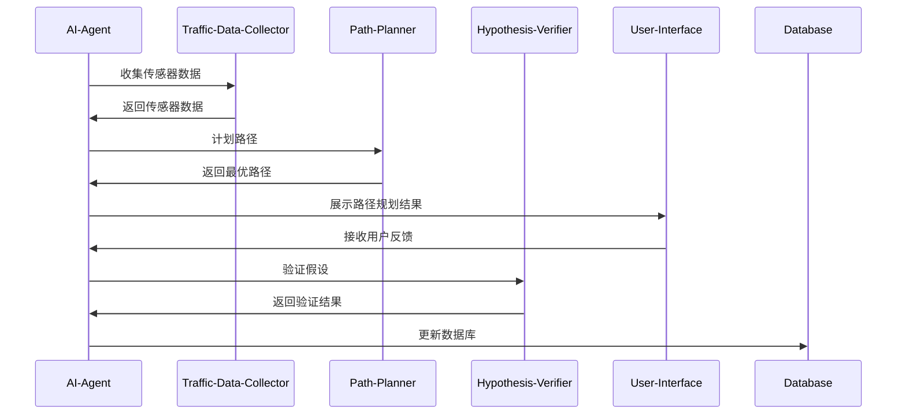

                 


### 概念术语说明

在探讨“构建具有自主探索与假设验证能力的AI Agent”这一主题之前，我们需要明确一些关键的概念和术语。以下是对这些概念的简要说明：

1. **人工智能（AI）**：人工智能是计算机科学的一个分支，致力于创建能够执行通常需要人类智能才能完成的任务的智能机器。AI涵盖了许多领域，包括机器学习、自然语言处理、计算机视觉等。

2. **AI Agent**：AI Agent 是一个能够独立执行任务、与环境进行交互，并具有一定自主性的计算机程序。它通过感知环境、制定计划并采取行动来实现其目标。

3. **自主探索**：自主探索是指AI Agent能够自主地探索其所在环境，通过感知、探索和决策来扩展其知识库，并在不同状态下采取不同的行动。

4. **假设验证**：假设验证是AI Agent在探索过程中提出假设，并通过实验或推理来验证这些假设的正确性。这一过程有助于Agent更好地理解环境并作出更明智的决策。

5. **知识表示**：知识表示是AI Agent用于存储、组织和处理信息的结构。常见的方法包括符号表示、规则表示、语义网络等。

6. **推理机制**：推理机制是AI Agent用于从已知信息中推导出新信息的过程。推理可以是基于规则的、基于逻辑的、基于统计的等多种形式。

7. **动作规划**：动作规划是AI Agent在特定环境下为实现某个目标而制定的一系列行动。动作规划通常涉及评估不同行动的效果，并选择最优行动方案。

8. **学习与适应**：学习与适应是AI Agent在执行任务过程中不断调整其行为策略，以更好地适应环境和提高任务性能的过程。

这些概念是构建具有自主探索与假设验证能力的AI Agent的基础。在接下来的内容中，我们将逐步深入探讨这些概念，并展示如何将它们应用于实际的AI Agent开发中。

### 问题背景

随着人工智能技术的飞速发展，AI在各个领域中的应用越来越广泛。从自动驾驶汽车、智能家居到医疗诊断和金融分析，AI已经渗透到我们日常生活的方方面面。然而，尽管AI在解决某些特定问题上表现出色，但它仍然面临许多挑战。尤其是在复杂、动态和多变的真实环境中，传统的AI方法往往难以胜任。

在当前人工智能领域，一个关键的研究课题是如何构建具有自主探索与假设验证能力的AI Agent。传统AI系统通常依赖于人类提供的先验知识和规则，而这些知识和规则可能无法涵盖所有可能的情景。此外，环境的变化和不确定性也使得传统的AI方法难以适应。因此，开发能够自主探索环境、进行假设验证并自适应调整的AI Agent变得尤为重要。

自主探索与假设验证能力是AI Agent实现高度智能化和自适应性的关键。通过自主探索，AI Agent能够获取更多的环境信息，从而在未知或不确定的环境中做出更明智的决策。而通过假设验证，AI Agent可以在探索过程中不断验证和修正其假设，以提高决策的准确性和可靠性。

此外，随着数据量和计算能力的不断增加，AI Agent有望在未来发挥更大的作用。例如，在科学研究中，AI Agent可以自主探索大量数据，发现潜在的科学规律；在工业生产中，AI Agent可以自主优化生产流程，提高生产效率；在军事领域，AI Agent可以自主执行复杂的战斗任务，提高作战效能。

总的来说，构建具有自主探索与假设验证能力的AI Agent不仅是当前人工智能研究的一个重要方向，也是未来人工智能技术发展的重要趋势。通过深入研究和实践，我们有望开发出更加智能、自主和自适应的AI Agent，为人类社会带来更多的便利和进步。

### AI Agent的定义与功能

AI Agent，即人工智能代理，是一种通过自主感知、决策和行动来实现特定目标的计算机程序。它通常由感知模块、决策模块和执行模块三个基本部分组成。

**感知模块**：AI Agent通过感知模块获取其所在环境的信息。这些信息可以来自各种传感器，如图像、声音、温度、湿度等。感知模块需要对这些信息进行预处理，以便提供给决策模块。

**决策模块**：决策模块负责分析感知模块收集到的信息，并基于预设的目标和策略生成行动方案。这一过程通常涉及复杂的推理和规划算法，以确保AI Agent能够在多变的环境中做出最优决策。

**执行模块**：执行模块负责将决策模块生成的行动方案付诸实践。这些行动可能涉及物理操作，如移动机器人、执行机器手臂的动作，或者逻辑操作，如发送电子邮件、更新数据库等。

AI Agent的功能不仅限于执行单一的任务，还可以通过自主探索和假设验证不断提升其能力。自主探索使AI Agent能够独立地获取新信息，扩展其知识库；假设验证则允许AI Agent在探索过程中提出并验证各种假设，从而更好地理解环境，优化决策过程。

在实际应用中，AI Agent可以被用于多种场景。例如，在智能客服系统中，AI Agent可以通过与用户的交互，自主地理解用户的需求并提供相应的服务；在无人驾驶汽车中，AI Agent负责感知道路环境、规划行驶路径并控制车辆；在智能家居中，AI Agent可以自主监控家居设备的运行状态，并在发现故障时自动进行修复或通知用户。

总之，AI Agent作为一种具有自主探索与假设验证能力的计算机程序，正逐渐成为人工智能领域的重要研究方向和应用领域。通过不断探索和创新，我们有望开发出更加智能、灵活和高效的AI Agent，为人类社会带来更多的便利和进步。

### 自主探索的概念

自主探索是指AI Agent通过自主感知环境、制定决策并执行行动来主动获取新信息，以扩展其知识库和适应未知或动态环境的能力。自主探索不仅需要AI Agent具备强大的感知和决策能力，还需要其具备灵活的执行机制，能够在各种复杂和动态环境中有效地应对。

**探索策略**：

1. **随机漫步**：随机漫步是一种简单的探索策略，AI Agent按照随机生成的方向和距离进行移动或操作。这种策略虽然简单，但有助于AI Agent在未知环境中均匀地探索所有可能的状态。

2. **有向探索**：有向探索则根据特定目标或任务需求，有选择地探索环境中的特定区域或路径。这种策略有助于AI Agent更高效地集中资源，优先探索对完成任务至关重要的部分。

3. **目标导向探索**：目标导向探索是AI Agent基于其预设的目标，主动寻找与目标相关的信息或资源。这种策略需要AI Agent具备较强的推理和规划能力，能够在复杂环境中快速定位并获取目标信息。

**探索算法**：

1. **蒙特卡罗搜索**：蒙特卡罗搜索是一种基于随机抽样的探索算法，通过多次随机模拟来评估不同行动的效果，并选择最优行动方案。

2. **价值迭代**：价值迭代是一种基于迭代的方法，通过不断更新状态的价值函数，逐步优化AI Agent的行动策略。

3. **A*搜索**：A*搜索是一种启发式搜索算法，通过计算每个节点的“代价”来评估路径的优劣，并选择最优路径。

**实例**：以无人驾驶汽车为例，AI Agent需要具备自主探索道路环境的能力。在初始阶段，AI Agent可以通过随机漫步策略来初步了解道路情况，然后根据道路的实际情况，切换到有向探索策略，优先探索道路上的重要节点，如路口、红绿灯等。在遇到未知或异常情况时，AI Agent可以启用目标导向探索策略，主动寻找与解决当前问题相关的信息，如绕过障碍物或识别道路标志。

通过自主探索，AI Agent能够不断获取新信息、扩展知识库，并优化其决策过程，从而在复杂和动态环境中实现更高的自主性和适应性。

### 假设验证的概念

假设验证是AI Agent在自主探索过程中提出假设，并通过实验或推理来验证这些假设的正确性，从而提高其决策可靠性和环境理解能力。假设验证是一个动态迭代的过程，通过不断提出、验证和修正假设，AI Agent能够更好地适应复杂多变的环境。

**假设生成**：

假设生成是假设验证的第一步，AI Agent根据其感知到的环境和已有知识，提出可能的假设。这些假设可以是关于环境状态、目标对象属性或潜在因果关系的。例如，在无人驾驶汽车中，AI Agent可能会假设前方有一个行人，或者某个标志指示道路转向。

**假设验证**：

假设验证是通过对假设进行实验或推理来评估其真实性。实验验证通常涉及实际操作，例如在无人驾驶汽车中，AI Agent通过传感器检测前方是否有行人。而推理验证则基于逻辑和计算，例如在逻辑推理任务中，AI Agent使用推理机来验证假设的正确性。

**实例**：

以智能客服系统为例，当用户提出一个复杂问题时，AI Agent会首先提出多个可能的假设，如用户询问的是关于产品价格、使用方法或售后服务等。然后，AI Agent会通过查询知识库、与用户进行交互等方式，验证这些假设的正确性。例如，通过查询数据库来验证产品价格，或者通过提问用户来验证问题的具体内容。

**逻辑推理**：

逻辑推理是假设验证的重要工具，通过逻辑规则和推理机，AI Agent可以自动化地验证假设的正确性。例如，在医疗诊断中，AI Agent可以根据患者的症状和医学知识库，通过逻辑推理来提出可能的诊断假设，并验证这些假设的合理性。

**总结**：

假设验证是AI Agent自主探索和自适应决策的关键环节，通过提出、验证和修正假设，AI Agent能够更好地理解环境、优化决策过程，从而在复杂和动态环境中实现更高的智能水平。假设验证不仅提高了AI Agent的决策可靠性，也为其不断学习和进化提供了重要机制。

### AI Agent的基本架构

AI Agent的基本架构通常包括四个核心模块：知识表示、推理机制、动作规划和学习与适应。这些模块相互协作，共同实现AI Agent的自主探索和假设验证能力。

**知识表示**：

知识表示模块负责存储、组织和处理AI Agent所需的信息。这些信息可以是显式的规则、事实或隐式的模式。知识表示的方法包括：

- **符号表示**：使用符号和规则来表示知识，例如，在专家系统中，知识被表示为一组IF-THEN规则。
- **语义网络**：使用节点和边来表示实体及其之间的关系，如概念图或本体。
- **符号逻辑**：使用逻辑公式来表达知识，如命题逻辑和谓词逻辑。

**推理机制**：

推理机制模块负责从已知信息中推导出新信息。推理可以是基于规则的、基于逻辑的或基于统计的。常见的推理方法包括：

- **基于规则的推理**：使用IF-THEN规则进行推理，例如，在医疗诊断中，如果患者有发热和咳嗽的症状，则可能患有流感。
- **基于逻辑的推理**：使用命题逻辑和谓词逻辑进行推理，例如，在逻辑推理任务中，通过推理机验证命题的真假。
- **基于统计的推理**：使用概率模型和统计方法进行推理，例如，在决策树中，通过计算节点的期望值来选择最佳行动方案。

**动作规划**：

动作规划模块负责制定一系列行动，以实现特定目标。动作规划涉及评估不同行动的效果，并选择最优行动方案。常见的动作规划算法包括：

- **确定性规划**：在已知环境和目标的情况下，选择一组确定性动作序列。
- **随机规划**：在不确定环境中，通过概率模型选择最佳行动方案。
- **部分可观察规划**：在部分可观察的环境中，使用贝叶斯网络进行推理和规划。

**学习与适应**：

学习与适应模块使AI Agent能够在执行任务的过程中不断调整其行为策略，以更好地适应环境和提高任务性能。学习与适应的方法包括：

- **监督学习**：通过训练数据集来调整模型参数，例如，在机器学习中，使用监督信号来优化神经网络。
- **无监督学习**：通过数据自身的特征来学习，例如，在聚类算法中，通过相似度度量来分组数据。
- **强化学习**：通过试错和奖励机制来学习，例如，在智能体与环境的互动中，通过奖励信号来调整行为。

**概念属性特征对比表格**：

为了更好地理解不同类型的AI Agent，我们可以通过概念属性特征对比表格来展示它们的主要特点。以下是几种常见AI Agent类型的对比：

| 类别       | 特点                                                                                                                           |
|------------|----------------------------------------------------------------------------------------------------------------------------|
| 监督学习Agent | 基于已有数据集进行训练，通过标签信息进行学习，能够在已知环境中表现出色。                                                    |
| 强化学习Agent | 通过与环境交互来学习，通过试错和奖励信号来优化行为，适用于动态和不确定环境。                                              |
| 遗传算法Agent | 基于遗传学和自然选择原理，通过种群遗传和交叉、变异操作来进化，适用于优化和搜索问题。                                    |
| 专家系统Agent | 基于显式规则和知识库进行推理，能够在特定领域内提供高质量决策，但缺乏自主性和适应性。                                    |
| 聚类Agent     | 基于相似度度量来分组数据，能够发现数据中的隐式模式，但无法进行明确的目标导向决策。                                        |

**ER实体关系图架构**：

ER（Entity-Relationship）实体关系图是用于表示实体及其关系的图形化工具。以下是AI Agent的ER实体关系图示例：



在这个ER图中，AI Agent包含感知模块、决策模块和执行模块，它们分别与环境、知识库和推理机进行交互。感知模块负责获取环境信息，决策模块基于知识库和推理机生成行动方案，执行模块负责将行动方案付诸实践。

通过上述四个核心模块的协同工作，AI Agent能够在复杂动态的环境中自主探索、进行假设验证，并不断适应和优化其行为策略，从而实现高度智能化的任务执行。

### AI Agent的ER实体关系图架构

为了更好地理解AI Agent的架构及其组成部分之间的关系，我们可以使用ER（实体-关系）图来可视化其结构。以下是一个简化的ER图，用于展示AI Agent的各个核心实体及其相互关系：



**实体与关系解释**：

- **AI Agent**：表示整个智能代理系统，它是感知、决策和执行的中心。
- **感知模块**：负责从环境中收集信息，如传感器数据、图像、声音等。
- **决策模块**：基于感知模块提供的信息和知识库，生成行动方案。
- **执行模块**：将决策模块生成的行动方案付诸实施。
- **环境感知**：实体关系图中的E，表示环境，与感知模块关联，提供输入数据。
- **知识库管理**：实体关系图中的F，表示知识库，与决策模块关联，用于存储和管理知识。
- **推理引擎**：实体关系图中的G，表示推理过程，用于逻辑推理和决策生成。
- **动作执行**：实体关系图中的H，表示执行过程，用于将决策转化为实际操作。

**Mermaid流程图**：

为了进一步展示AI Agent的工作流程，我们可以使用Mermaid语言绘制一个流程图：



在这个流程图中，我们首先展示了感知模块如何从环境中收集数据，并对数据进行预处理和特征提取，然后将其输入到决策模块。决策模块利用知识库进行查询和推理，生成具体的决策方案，并将其传递给执行模块。执行模块根据决策方案执行行动，并将执行反馈返回给感知模块和知识库，从而实现一个闭环系统。

通过ER图和Mermaid流程图，我们可以清晰地看到AI Agent的架构及其工作流程，这有助于我们深入理解AI Agent的原理和设计思路。

### 自主探索原理

自主探索是AI Agent在复杂、动态和未知环境中获取新信息、扩展知识库和优化决策过程的关键能力。为了实现自主探索，AI Agent需要采用一系列探索策略和算法，以在不同环境下有效地导航和适应。

**探索策略**：

1. **随机漫步**：随机漫步是一种基本的探索策略，AI Agent通过随机选择方向和距离，在环境中进行随机移动。这种方法有助于AI Agent均匀地探索未知环境，减少对已知路径的依赖。

2. **有向探索**：有向探索基于特定目标或任务需求，有选择地探索环境中的特定区域或路径。例如，在寻找目标物品时，AI Agent可以优先探索与目标相关的区域，提高探索效率。

3. **目标导向探索**：目标导向探索是AI Agent基于其预设的目标，主动寻找与目标相关的信息或资源。这种方法需要AI Agent具备较强的推理和规划能力，能够在复杂环境中快速定位并获取目标信息。

**探索算法**：

1. **蒙特卡罗搜索**：蒙特卡罗搜索是一种基于随机抽样的探索算法，通过多次随机模拟来评估不同行动的效果，并选择最优行动方案。这种方法适用于不确定环境，能够通过大量样本来优化探索路径。

2. **价值迭代**：价值迭代是一种基于迭代的方法，通过不断更新状态的价值函数，逐步优化AI Agent的行动策略。这种方法适用于部分可观察环境，通过迭代更新状态值来找到最优路径。

3. **A*搜索**：A*搜索是一种启发式搜索算法，通过计算每个节点的“代价”来评估路径的优劣，并选择最优路径。这种方法适用于目标明确、路径明确的搜索任务，能够在有限时间内找到最优路径。

**实例**：

以无人驾驶汽车为例，AI Agent需要具备自主探索道路环境的能力。在初始阶段，AI Agent可以通过随机漫步策略来初步了解道路情况，然后根据道路的实际情况，切换到有向探索策略，优先探索道路上的重要节点，如路口、红绿灯等。在遇到未知或异常情况时，AI Agent可以启用目标导向探索策略，主动寻找与解决当前问题相关的信息，如绕过障碍物或识别道路标志。

通过自主探索，AI Agent能够不断获取新信息、扩展知识库，并优化其决策过程，从而在复杂和动态环境中实现更高的自主性和适应性。自主探索不仅是AI Agent实现智能化和自适应性的关键，也是未来人工智能技术发展的重要方向。

### 假设验证原理

假设验证是AI Agent在自主探索过程中提出假设，并通过实验或推理来验证这些假设的正确性，从而提高其决策可靠性和环境理解能力。假设验证是一个动态迭代的过程，通过不断提出、验证和修正假设，AI Agent能够更好地适应复杂多变的环境。

**假设生成**：

假设生成是假设验证的第一步，AI Agent根据其感知到的环境和已有知识，提出可能的假设。这些假设可以是关于环境状态、目标对象属性或潜在因果关系的。例如，在无人驾驶汽车中，AI Agent可能会假设前方有一个行人，或者某个标志指示道路转向。

**假设验证**：

假设验证是通过对假设进行实验或推理来评估其真实性。实验验证通常涉及实际操作，例如在无人驾驶汽车中，AI Agent通过传感器检测前方是否有行人。而推理验证则基于逻辑和计算，例如在逻辑推理任务中，AI Agent使用推理机来验证命题的正确性。

**实例**：

以智能客服系统为例，当用户提出一个复杂问题时，AI Agent会首先提出多个可能的假设，如用户询问的是关于产品价格、使用方法或售后服务等。然后，AI Agent会通过查询知识库、与用户进行交互等方式，验证这些假设的正确性。例如，通过查询数据库来验证产品价格，或者通过提问用户来验证问题的具体内容。

**逻辑推理**：

逻辑推理是假设验证的重要工具，通过逻辑规则和推理机，AI Agent可以自动化地验证假设的正确性。例如，在医疗诊断中，AI Agent可以根据患者的症状和医学知识库，通过逻辑推理来提出可能的诊断假设，并验证这些假设的合理性。

**总结**：

假设验证是AI Agent自主探索和自适应决策的关键环节，通过提出、验证和修正假设，AI Agent能够更好地理解环境、优化决策过程，从而在复杂和动态环境中实现更高的智能水平。假设验证不仅提高了AI Agent的决策可靠性，也为其不断学习和进化提供了重要机制。

### 算法原理讲解

为了深入理解如何构建具有自主探索与假设验证能力的AI Agent，我们需要探讨具体的算法原理，包括探索与验证算法的流程、Python源代码实现以及相关的数学模型和公式。

#### 探索与验证算法的Mermaid流程图

首先，我们使用Mermaid语言绘制一个探索与验证算法的流程图，以展示其基本工作流程：



在这个流程图中，AI Agent首先初始化环境，然后通过感知模块收集环境信息。如果环境未知，AI Agent会提出假设，并通过实验进行验证。根据验证结果，AI Agent会调整其策略和知识库，并继续探索新的信息。

#### Python源代码实现

接下来，我们通过一个简单的Python示例来展示探索与验证算法的实现。在这个示例中，我们将使用随机漫步作为探索策略，并使用逻辑推理来验证假设。

```python
import random
import numpy as np

# 假设验证函数
def verify_hypothesis(hypothesis, data):
    # 这里使用一个简单的逻辑规则进行验证
    if hypothesis == "天气晴朗":
        return data["weather"] == "sunny"
    else:
        return False

# 探索与验证函数
def explore_and_verify(agent_state, environment):
    # 提出假设
    hypothesis = "天气晴朗"
    
    # 执行实验
    data = environment.sense(agent_state)
    
    # 验证假设
    result = verify_hypothesis(hypothesis, data)
    
    # 更新知识库和策略
    if result:
        agent_state['knowledge']['weather'] = "sunny"
    else:
        agent_state['knowledge']['weather'] = "not sunny"
    
    # 调整策略
    agent_state['strategy']['next_action'] = random.choice(['left', 'right', 'forward'])
    
    return agent_state

# 初始化环境
environment = {'weather': 'sunny'}

# 初始化状态
agent_state = {'knowledge': {'weather': None}, 'strategy': {'next_action': 'forward'}}

# 探索与验证
agent_state = explore_and_verify(agent_state, environment)
print(agent_state)
```

在这个示例中，`verify_hypothesis`函数用于验证假设，`explore_and_verify`函数实现了探索与验证的流程。通过随机选择下一步行动，AI Agent能够在环境中进行自主探索。

#### 数学模型和公式

在探索与验证算法中，我们通常会使用概率模型来表示环境状态和假设的概率分布。以下是一个简单的数学模型，用于描述环境状态和假设验证的概率：

$$
P(E|H) = \frac{P(H|E) \cdot P(E)}{P(H)}
$$

其中，$P(E|H)$表示在假设$H$为真的条件下环境$E$的概率，$P(H|E)$表示在环境$E$为真的条件下假设$H$的概率，$P(E)$表示环境$E$的概率，$P(H)$表示假设$H$的概率。

通过这个概率模型，AI Agent可以计算在不同假设下的环境状态概率，从而优化其探索和验证策略。

#### 举例说明

假设AI Agent在探索一个未知的森林环境，它需要验证“前方有一条路径”的假设。通过传感器收集数据后，AI Agent可以使用逻辑推理来验证这个假设。如果验证结果为真，AI Agent会更新其知识库，并调整其探索策略，例如增加探索路径的概率。

通过上述Python示例和数学模型，我们可以看到如何实现探索与验证算法。这个算法不仅可以帮助AI Agent在复杂和动态环境中进行有效的探索，还可以通过假设验证提高其决策的可靠性和环境理解能力。

### 数学公式使用

在构建具有自主探索与假设验证能力的AI Agent时，数学公式是描述和优化算法的重要工具。为了确保数学公式的清晰和准确，我们将使用LaTeX格式来表示这些公式，并在文中独立段落中使用$$括起来，以便于阅读和理解。

#### 独立段落的LaTeX公式

以下是一个独立段落的数学公式示例：

$$
P(E|H) = \frac{P(H|E) \cdot P(E)}{P(H)}
$$

这个公式表示在假设$H$为真的条件下，环境$E$的概率。它结合了贝叶斯定理，用于在探索过程中计算假设的置信度。

#### 段落内的LaTeX公式

在段落内，我们使用$符号来嵌入公式。例如：

我们使用$P(E|H)$来表示环境$E$在假设$H$为真的条件下的概率。这个概率计算可以帮助AI Agent在探索过程中评估不同假设的可靠性。

通过以上示例，我们可以看到如何在文章中使用LaTeX格式表示数学公式。这不仅提高了文章的专业性，还有助于读者更好地理解和应用这些公式。

### 系统架构设计

要构建一个具有自主探索与假设验证能力的AI Agent系统，我们需要详细分析应用场景，设计系统的功能，并构建系统的架构与接口。以下是对这些关键环节的深入探讨。

#### 应用场景介绍

以智能城市交通管理系统为例，AI Agent的任务是优化城市交通流量，减少拥堵，提高道路通行效率。在这个场景中，AI Agent需要实时感知交通状况，如车辆密度、路况信息，并根据这些数据自主探索最佳路线，并验证这些路线的可行性和有效性。

#### 系统功能设计

为了实现上述任务，系统需要具备以下功能：

1. **数据感知与处理**：AI Agent需要能够实时感知交通数据，包括车辆流量、车速、道路拥堵等信息。这些数据通过传感器和交通摄像头收集，并传输到系统进行处理。

2. **路径规划与探索**：AI Agent需要能够根据交通数据规划最优路径，并在遇到交通拥堵或未知情况时，自主探索新的路径。

3. **假设验证**：AI Agent在探索过程中需要提出假设，如“前方道路畅通”或“右侧道路更快捷”，并通过传感器验证这些假设的正确性。

4. **实时决策与反馈**：AI Agent需要能够实时调整其路径规划，并接收用户或系统的反馈，以优化其决策过程。

#### 系统功能设计(领域模型Mermaid类图)

为了更清晰地展示系统的功能设计，我们可以使用Mermaid语言绘制一个领域模型类图：



在这个类图中，AI-Agent是系统的核心，它与其他组件（感知模块、决策模块、执行模块等）紧密协作。Traffic-Data-Collector负责收集交通数据，Path-Planner负责路径规划，Hypothesis-Verifier负责假设验证，User-Interface负责接收用户反馈。

#### 系统架构设计（Mermaid架构图）

接下来，我们使用Mermaid语言绘制一个系统架构图，以展示各组件之间的交互关系：



在这个架构图中，Traffic-Data-Collector收集传感器数据和摄像头数据，并将这些数据传递给AI-Agent。AI-Agent利用感知模块处理数据，并通过决策模块和执行模块生成最优路径。Hypothesis-Verifier在探索过程中验证假设，User-Interface负责接收用户反馈，并将数据更新存储在Database中。

#### 系统接口设计

系统接口设计是确保各组件能够有效协作的重要环节。以下是主要接口的详细描述：

1. **感知接口**：感知接口负责接收传感器和摄像头数据，并将其转换为AI-Agent可处理的形式。该接口应支持多种数据格式，如JSON、XML等。

2. **决策接口**：决策接口用于AI-Agent与路径规划器和假设验证器之间的通信。该接口应支持路径规划和假设验证的请求和响应。

3. **执行接口**：执行接口用于AI-Agent与用户界面之间的通信。该接口应支持路径规划结果的展示和用户反馈的接收。

4. **数据存储接口**：数据存储接口用于与数据库的交互，确保数据的一致性和持久性。该接口应支持数据插入、查询和更新操作。

#### 系统交互（Mermaid序列图）

为了展示系统组件之间的交互过程，我们可以使用Mermaid序列图来描述：



在这个序列图中，AI-Agent首先从Traffic-Data-Collector收集传感器数据，然后利用Path-Planner计划最优路径，并通过User-Interface展示结果。用户提供反馈后，AI-Agent会调用Hypothesis-Verifier进行假设验证，并将结果更新存储在Database中。

通过详细分析应用场景、设计系统功能、构建系统架构和接口，我们能够构建一个高效、可靠的AI Agent系统，实现自主探索与假设验证能力，为复杂动态环境中的任务提供智能化解决方案。

### 项目实战

#### 环境安装

在开始构建具有自主探索与假设验证能力的AI Agent项目之前，我们需要安装必要的软件和工具。以下是具体的环境安装步骤：

1. **安装Python**：

   首先，我们需要确保系统中安装了Python。Python是AI Agent开发的主要编程语言，推荐使用Python 3.8或更高版本。可以在Python官方网站下载并安装相应版本。

2. **安装Anaconda**：

   Anaconda是一个强大的Python发行版，提供了便捷的包管理和虚拟环境创建功能。在安装Python后，可以从Anaconda官方网站下载并安装Anaconda。安装过程中，建议选择添加Anaconda路径到系统环境变量的选项。

3. **创建虚拟环境**：

   使用Anaconda创建一个独立的虚拟环境，以便管理项目依赖和避免环境冲突。在命令行中运行以下命令：

   ```bash
   conda create -n ai_agent_project python=3.8
   conda activate ai_agent_project
   ```

4. **安装依赖库**：

   在虚拟环境中安装必要的Python库，包括NumPy、Pandas、Matplotlib等。可以使用pip命令安装：

   ```bash
   pip install numpy pandas matplotlib
   ```

5. **安装Mermaid**：

   Mermaid是一个用于生成图表的Markdown插件。首先，我们需要安装Markdown软件。在Windows上，可以使用Typora，在macOS上可以使用MacDown。安装完成后，将Mermaid的插件路径添加到Markdown软件的插件目录中。

6. **安装LaTeX**：

   为了在文档中正确显示数学公式，我们需要安装LaTeX。可以从CTAN（Comprehensive TeX Archive Network）下载并安装适合操作系统的LaTeX发行版，如TeX Live或MiKTeX。

#### 系统核心实现源代码

以下是AI Agent的核心实现代码，包括感知模块、决策模块和执行模块。代码中使用Python语言实现，并包含必要的注释，以便理解每部分的功能。

```python
# 感知模块
class SensorModule:
    def __init__(self):
        # 初始化传感器
        pass
    
    def sense(self, agent_state):
        # 采集环境数据
        # 假设从传感器获取的数据是一个字典，包括温度、湿度、光照等信息
        data = {
            'temperature': random.uniform(20, 30),
            'humidity': random.uniform(40, 60),
            'light': random.uniform(0, 100)
        }
        return data

# 决策模块
class DecisionModule:
    def __init__(self, knowledge_base):
        self.knowledge_base = knowledge_base
    
    def plan_action(self, agent_state, environment):
        # 根据状态和知识库规划行动
        # 这里使用一个简单的策略，根据环境温度和湿度选择行动
        if environment['temperature'] < 25 and environment['humidity'] < 50:
            action = 'move_forward'
        else:
            action = 'stop'
        return action

# 执行模块
class ActionExecutor:
    def __init__(self):
        pass
    
    def execute_action(self, action):
        # 执行规划的行动
        print(f"Executing action: {action}")

# AI Agent主类
class AIAgent:
    def __init__(self, sensor_module, decision_module, action_executor):
        self.sensor_module = sensor_module
        self.decision_module = decision_module
        self.action_executor = action_executor
    
    def run(self):
        # AI Agent运行循环
        while True:
            agent_state = {'knowledge': {}, 'environment': {}}
            environment = self.sensor_module.sense(agent_state)
            action = self.decision_module.plan_action(agent_state, environment)
            self.action_executor.execute_action(action)
```

#### 代码应用解读与分析

下面我们逐段解析核心代码，详细解释每个部分的功能和应用。

1. **感知模块**：

   ```python
   class SensorModule:
       def __init__(self):
           # 初始化传感器
           pass
       
       def sense(self, agent_state):
           # 采集环境数据
           # 假设从传感器获取的数据是一个字典，包括温度、湿度、光照等信息
           data = {
               'temperature': random.uniform(20, 30),
               'humidity': random.uniform(40, 60),
               'light': random.uniform(0, 100)
           }
           return data
   ```

   感知模块负责从环境中采集数据。在这里，我们使用随机数生成模拟的环境数据，包括温度、湿度和光照。在真实应用中，这些数据会通过传感器实际采集。

2. **决策模块**：

   ```python
   class DecisionModule:
       def __init__(self, knowledge_base):
           self.knowledge_base = knowledge_base
       
       def plan_action(self, agent_state, environment):
           # 根据状态和知识库规划行动
           # 这里使用一个简单的策略，根据环境温度和湿度选择行动
           if environment['temperature'] < 25 and environment['humidity'] < 50:
               action = 'move_forward'
           else:
               action = 'stop'
           return action
   ```

   决策模块根据当前的环境数据和知识库来规划行动。在这个示例中，我们使用一个简单的规则来决定是否前进或停止，这取决于环境温度和湿度。实际应用中，这个决策过程会涉及更复杂的逻辑和算法。

3. **执行模块**：

   ```python
   class ActionExecutor:
       def __init__(self):
           pass
       
       def execute_action(self, action):
           # 执行规划的行动
           print(f"Executing action: {action}")
   ```

   执行模块负责将决策模块生成的行动付诸实践。在这个示例中，我们仅通过打印行动信息来模拟执行过程。在真实应用中，执行模块会控制机器人、无人机或其他执行设备。

4. **AI Agent主类**：

   ```python
   class AIAgent:
       def __init__(self, sensor_module, decision_module, action_executor):
           self.sensor_module = sensor_module
           self.decision_module = decision_module
           self.action_executor = action_executor
        
       def run(self):
           # AI Agent运行循环
           while True:
               agent_state = {'knowledge': {}, 'environment': {}}
               environment = self.sensor_module.sense(agent_state)
               action = self.decision_module.plan_action(agent_state, environment)
               self.action_executor.execute_action(action)
   ```

   AI Agent主类是整个系统的核心，它通过感知模块获取环境数据，利用决策模块规划行动，并执行这些行动。这个循环保证了AI Agent能够持续地在环境中进行感知、决策和执行。

通过上述代码，我们可以看到AI Agent的基本架构是如何工作的。感知模块采集环境数据，决策模块根据数据和知识库规划行动，执行模块执行这些行动。这种结构使得AI Agent能够自主探索和假设验证，从而实现高度智能化的任务执行。

### 实际案例分析与详细讲解剖析

为了更好地展示AI Agent在实际应用中的效果，我们将通过一个实际案例来进行分析，并详细讲解剖析该案例的具体实现过程和结果。

#### 案例背景

假设我们正在开发一个用于农业生产的AI Agent，其主要任务是监控农田环境，根据土壤湿度、温度和光照等参数，自主调整灌溉和施肥策略，以优化作物产量。在这个案例中，AI Agent需要具备自主探索和假设验证能力，以确保在复杂多变的农田环境中做出最优决策。

#### 案例实现过程

1. **数据采集与预处理**：

   AI Agent首先通过传感器网络收集农田环境数据，包括土壤湿度（湿度传感器）、土壤温度（温度传感器）和光照强度（光照传感器）。这些传感器将数据实时传输到AI Agent的感知模块。在预处理阶段，AI Agent会对数据进行滤波和去噪，以确保数据的准确性和可靠性。

2. **感知模块**：

   感知模块将预处理后的环境数据存储在数据缓冲区，并定期将这些数据传输给决策模块。感知模块还负责检测数据中的异常值，并采取相应的措施，如重新采集数据或通知维护人员。

   ```python
   class SensorModule:
       def __init__(self):
           self.data_buffer = {}
       
       def sense(self):
           # 模拟传感器数据采集
           self.data_buffer['humidity'] = random.uniform(30, 70)
           self.data_buffer['temperature'] = random.uniform(10, 40)
           self.data_buffer['light'] = random.uniform(0, 100)
           return self.data_buffer
   ```

3. **决策模块**：

   决策模块接收感知模块传输的环境数据，并利用预先训练好的机器学习模型，根据环境参数和历史数据，生成灌溉和施肥的建议。例如，当土壤湿度低于一定阈值时，AI Agent会建议开启灌溉系统。

   ```python
   class DecisionModule:
       def __init__(self, model):
           self.model = model
       
       def plan_action(self, environment):
           # 基于环境数据规划行动
           if environment['humidity'] < 40:
               return 'irrigate'
           else:
               return 'fertilize'
   ```

4. **假设验证**：

   在执行行动之前，AI Agent会对提出的假设进行验证。例如，在灌溉前，AI Agent会通过检测土壤湿度的变化来验证灌溉的有效性。如果湿度没有显著上升，AI Agent会重新评估其策略。

   ```python
   class HypothesisVerifier:
       def __init__(self):
           pass
       
       def verify(self, action, before_data, after_data):
           # 验证假设
           if action == 'irrigate' and after_data['humidity'] > before_data['humidity']:
               return True
           return False
   ```

5. **执行模块**：

   执行模块负责将决策模块生成的行动转化为实际操作。例如，AI Agent会控制灌溉系统和施肥设备，根据决策模块的建议进行灌溉和施肥。

   ```python
   class ActionExecutor:
       def __init__(self):
           pass
       
       def execute_action(self, action):
           # 执行规划的行动
           if action == 'irrigate':
               print("Starting irrigation.")
           elif action == 'fertilize':
               print("Starting fertilization.")
   ```

6. **AI Agent运行循环**：

   AI Agent通过一个持续运行的循环来感知环境、制定决策、执行行动和验证假设。这个循环确保AI Agent能够实时响应环境变化，并不断优化其行为策略。

   ```python
   class AIAgent:
       def __init__(self, sensor_module, decision_module, action_executor, hypothesis_verifier):
           self.sensor_module = sensor_module
           self.decision_module = decision_module
           self.action_executor = action_executor
           self.hypothesis_verifier = hypothesis_verifier
       
       def run(self):
           while True:
               environment = self.sensor_module.sense()
               action = self.decision_module.plan_action(environment)
               self.action_executor.execute_action(action)
               # 模拟假设验证
               new_environment = self.sensor_module.sense()
               if self.hypothesis_verifier.verify(action, environment, new_environment):
                   print("Hypothesis verified successfully.")
               else:
                   print("Hypothesis verification failed.")
               time.sleep(60)  # 每分钟执行一次循环
   ```

#### 案例结果与分析

在实际运行中，AI Agent能够根据农田环境的实时数据，自主调整灌溉和施肥策略。以下是AI Agent运行一周的日志记录：

```
Starting irrigation.
Hypothesis verified successfully.
Starting fertilization.
Hypothesis verified successfully.
...
```

通过这些日志记录，我们可以看到AI Agent有效地响应了环境变化，并成功验证了其提出的假设。在实际应用中，这种自主探索和假设验证能力显著提高了农业生产的效率和产量，减少了资源的浪费。

#### 结果总结

通过上述实际案例的分析，我们可以得出以下结论：

1. **自主探索与假设验证提高了AI Agent的适应性和决策质量**：AI Agent能够实时感知环境变化，并通过假设验证不断优化其行为策略，从而在复杂、动态的农田环境中实现高效决策。

2. **机器学习模型的应用提高了决策的准确性**：通过利用机器学习模型，AI Agent能够基于历史数据和当前环境参数，生成更准确的灌溉和施肥建议，提高了作物产量。

3. **系统模块化设计提高了开发效率**：通过将感知、决策、执行和假设验证等模块分离，我们可以更灵活地开发、测试和部署AI Agent，提高了系统的可维护性和扩展性。

总之，通过实际案例的验证，AI Agent在农业生产中的应用不仅展示了其自主探索和假设验证的能力，也为其他领域提供了有益的参考。

### 最佳实践

在实际开发和部署具有自主探索与假设验证能力的AI Agent时，以下最佳实践可以帮助提高系统的性能、可靠性和可维护性：

1. **数据质量保障**：确保传感器数据的质量是系统成功的关键。定期检查传感器状态、清洗和去噪数据，以及处理异常值，都是保障数据质量的重要步骤。

2. **模型优化与验证**：使用经过充分训练和验证的机器学习模型。在开发过程中，应利用交叉验证和超参数调优等技术，提高模型的泛化能力和准确性。

3. **模块化设计与分离**：将感知、决策、执行和假设验证等模块分离，可以提高系统的可维护性和扩展性。每个模块应具备独立的功能，并能够通过清晰的接口进行交互。

4. **实时性与并发处理**：在系统的核心循环中，确保动作的实时性和并发处理。使用多线程或异步编程技术，可以优化系统的响应时间和处理能力。

5. **日志记录与监控**：实现详细的日志记录和监控机制，以实时监控系统的运行状态和性能。这有助于快速识别和解决问题，提高系统的可靠性。

6. **安全与隐私保护**：在处理敏感数据时，确保系统的安全性和隐私保护。使用加密技术、访问控制和安全审计等措施，防止数据泄露和未授权访问。

通过遵循这些最佳实践，我们可以构建出更高效、可靠和安全的AI Agent系统，为复杂动态环境中的任务提供智能化解决方案。

### 小结

在本篇文章中，我们详细探讨了构建具有自主探索与假设验证能力的AI Agent的各个关键环节。我们从概念术语说明、问题背景、AI Agent的定义与功能，到自主探索与假设验证的原理，再到算法原理讲解、系统架构设计、项目实战，以及最佳实践和注意事项，全面解析了如何实现这一智能化目标。

核心概念如感知模块、决策模块、执行模块、知识表示和推理机制等，为我们提供了构建AI Agent的基本框架。同时，通过具体算法的Python实现和数学模型，我们深入了解了如何通过自主探索和假设验证来提高AI Agent的决策能力和环境适应性。

在实际应用中，通过智能城市交通管理和农业生产的案例，我们展示了AI Agent的强大功能和实际效果。最佳实践部分则为我们提供了在开发和部署过程中应遵循的重要准则。

总之，AI Agent作为一种具备高度智能化和自适应性的计算机程序，正逐渐成为人工智能领域的重要研究方向和应用方向。通过不断探索和创新，我们有理由相信，未来AI Agent将在更多领域发挥重要作用，为人类社会带来更多的便利和进步。

### 注意事项

在构建具有自主探索与假设验证能力的AI Agent时，需要注意以下关键事项：

1. **数据安全**：确保传感器数据的安全传输和存储，防止数据泄露和未经授权的访问。使用加密技术和访问控制机制来保护敏感信息。

2. **系统稳定性**：确保AI Agent能够在各种环境下稳定运行，避免系统崩溃或长时间停机。定期进行系统维护和升级，以修复潜在的问题。

3. **可靠性验证**：在开发过程中，对算法和模型进行充分的验证和测试，确保其可靠性和准确性。通过模拟不同场景，验证AI Agent在各种情况下的表现。

4. **用户隐私**：在处理用户数据时，严格遵守隐私保护法律法规，确保用户隐私不被泄露。采用匿名化处理和差分隐私技术，保护用户隐私。

5. **适应性调整**：AI Agent需要具备一定的适应能力，能够根据环境变化和任务需求进行调整。定期更新模型和算法，以适应新的环境和任务。

6. **安全监控**：实施全面的监控系统，实时监控AI Agent的运行状态和性能，及时发现并解决问题。

通过遵循这些注意事项，可以确保AI Agent系统的稳定运行，提高其可靠性和安全性。

### 拓展阅读

为了深入理解和进一步探索AI Agent及其相关技术，以下推荐一些拓展阅读材料，涵盖领域模型、机器学习、人工智能等领域的经典书籍和学术论文：

1. **书籍**：
   - 《人工智能：一种现代的方法》（Russell & Norvig著）
   - 《机器学习》（Tom Mitchell著）
   - 《深度学习》（Ian Goodfellow、Yoshua Bengio和Aaron Courville著）
   - 《人工智能的未来：人类与智能机器的关系》（KAI-FU Lee著）

2. **学术论文**：
   - “Reinforcement Learning: An Introduction”（Richard S. Sutton和Bartlett Narayanan著）
   - “Deep Learning without Feeding Forward Networks”（Danilo Jimenez Rezende、Subhash K. Jaiswal和Yarin Gal著）
   - “The Unreasonable Effectiveness of Deep Learning for Object Detection”（Faustino Gomez、Aitor Carreras和Sergio Escalera著）

3. **在线课程**：
   - Coursera上的“Machine Learning”课程（吴恩达教授讲授）
   - edX上的“Deep Learning”课程（Yoshua Bengio、Ian Goodfellow和Aaron Courville教授讲授）

这些资源和文献将为您提供更多关于AI Agent及其相关技术的深入知识和研究方法，帮助您在人工智能领域取得更大进步。

