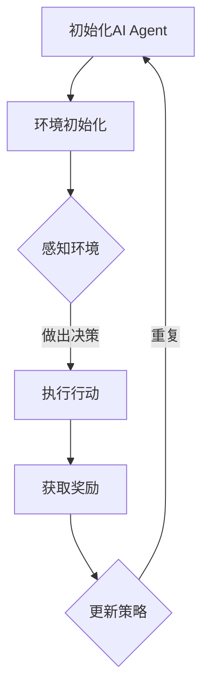
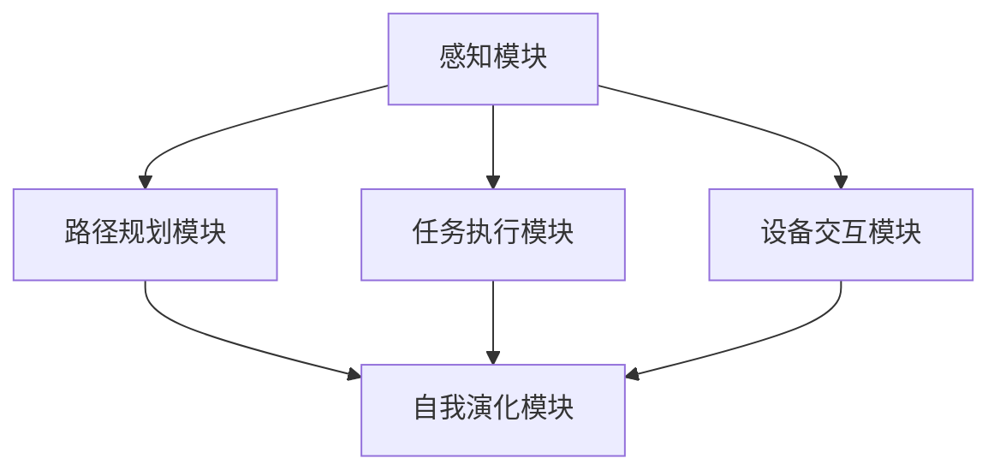
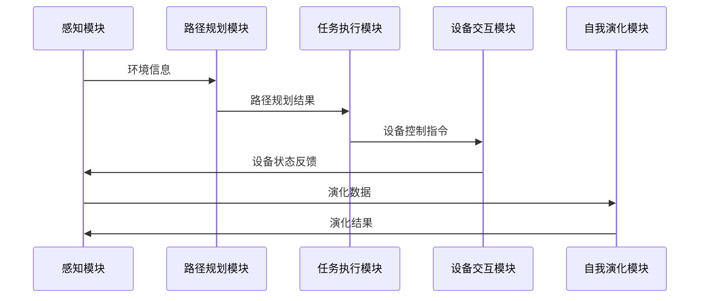

                 


### 引言

#### 问题背景

人工智能（AI）作为21世纪最具影响力的技术之一，已经深刻地改变了我们的生活方式和工作方式。然而，传统的AI系统通常是在特定任务上经过训练的，它们缺乏自主学习和适应新环境的能力。随着环境的变化和复杂性的增加，这种静态的AI系统越来越难以满足实际需求。

自我演化能力是人工智能领域中的一个前沿研究方向，它赋予AI Agent在动态环境下的自主适应和进化能力。自我演化AI Agent能够从经验中学习，不断优化自身的行为和性能，从而实现持续的自我改进。这种能力对于解决复杂问题、提高AI系统的鲁棒性和智能性具有重要意义。

#### 问题描述

构建具有自我演化能力的AI Agent，首先需要解决的核心问题是：

- 如何设计一个能够从经验中学习的算法？
- 如何确保算法在不同环境下的稳定性和鲁棒性？
- 如何在算法中引入进化的机制，以实现AI Agent的自我改进？

这些问题涉及到算法设计、系统架构、数据处理等多个方面，需要我们在多个维度上进行综合考虑。

#### 问题解决

为了解决上述问题，我们提出以下方案：

1. **算法设计**：采用基于遗传算法和强化学习相结合的方法，实现AI Agent的自我演化能力。
2. **系统架构**：设计一个模块化的系统架构，使得算法模块可以方便地集成到现有的AI系统中。
3. **数据处理**：利用大数据技术和深度学习技术，提高AI Agent的学习效率和性能。

#### 边界与外延

在构建自我演化AI Agent的过程中，我们需要明确以下边界与外延：

- **边界**：AI Agent的定义、功能范围、适应的环境等。
- **外延**：算法的适用性、系统架构的扩展性、数据处理的规范性等。

#### 概念结构与核心要素组成

为了更好地理解构建自我演化AI Agent的过程，我们可以将其核心概念和要素进行结构化：

1. **核心概念**：AI Agent、自我演化、遗传算法、强化学习等。
2. **概念联系**：通过mermaid流程图展示各概念之间的联系。
3. **核心要素**：算法模块、系统架构、数据处理等。

### 总结

构建具有自我演化能力的AI Agent是一个复杂但极具前景的研究方向。通过合理的算法设计、系统架构和数据处理，我们可以实现AI Agent的自我演化能力，从而在动态环境中实现持续的自我改进和优化。

在接下来的章节中，我们将详细探讨自我演化AI Agent的核心概念、算法原理、系统架构以及项目实战等内容，逐步构建出这个强大的AI系统。

---

### 核心概念与联系

在构建具有自我演化能力的AI Agent的过程中，我们需要理解并掌握几个核心概念，这些概念包括AI Agent、自我演化、遗传算法和强化学习。以下是对这些核心概念及其相互关系的详细解释。

#### AI Agent的基本概念

AI Agent是一种能够在环境中感知并采取行动的人工智能实体。它通常具备以下特征：

- **感知能力**：能够从环境中获取信息。
- **决策能力**：根据感知到的信息做出决策。
- **行动能力**：执行决策并影响环境。

AI Agent的核心目标是实现自主学习和自适应能力，以在复杂、动态的环境中实现高效的任务执行。

#### 自我演化能力概述

自我演化能力是指AI Agent能够通过不断的学习和优化，自适应地改进自身性能和适应能力。这种能力使得AI Agent能够在复杂环境中持续进化，适应不断变化的环境需求。

自我演化能力主要包括以下几个方面：

- **学习与适应**：通过学习和适应新环境，提升自身的性能。
- **进化与优化**：通过遗传算法和强化学习等进化机制，不断优化自身结构和行为。
- **自主性**：具备自主学习和决策的能力，不依赖外部干预。

#### 核心概念对比表格

为了更好地理解AI Agent和自我演化能力之间的关系，我们可以通过对比表格来展示几个核心概念的属性和特征：

| 核心概念       | 定义                                                         | 关键特征                       | 关系                 |
|----------------|------------------------------------------------------------|------------------------------|---------------------|
| AI Agent       | 具有感知、决策和行动能力的人工智能实体                       | 感知环境、决策行动、自主学习  | 自我演化的基础      |
| 自我演化       | AI Agent通过学习和优化，自适应地改进自身性能和适应能力         | 学习、适应、进化与优化        | 提升AI Agent的能力  |
| 遗传算法       | 基于自然选择和遗传学原理的搜索算法，用于优化个体和群体       | 自然选择、交叉、变异          | 自我演化的机制之一  |
| 强化学习       | 通过与环境交互，学习最优策略的机器学习技术                   | 奖励、惩罚、策略优化         | 自我演化的机制之一  |

#### ER实体关系图架构

为了进一步展示这些核心概念之间的联系，我们可以使用Mermaid流程图来绘制ER（实体关系）图架构：

```mermaid
erDiagram
AI_Agent ||--o{ Self_Evolution }
Self_Evolution ||--o{ Genetic_Algorithm }
Self_Evolution ||--o{ Reinforcement_Learning }
```

在这个ER图中，AI Agent作为核心实体，通过自我演化能力与遗传算法和强化学习建立联系。自我演化能力是AI Agent的核心动力，遗传算法和强化学习是实现自我演化的具体机制。

#### 总结

通过以上对核心概念的介绍和对比表格，我们可以清晰地理解AI Agent、自我演化、遗传算法和强化学习之间的关系。这些概念共同构成了构建具有自我演化能力的AI Agent的基础，为后续的算法原理讲解和系统架构设计提供了理论基础。

在接下来的章节中，我们将深入探讨自我演化算法的原理，包括mermaid流程图和Python源代码的实现，以及详细的数学模型和公式。通过这些内容，我们将逐步构建出一个具有自我演化能力的AI Agent，为解决复杂问题提供强大支持。

---

### 算法原理讲解

在构建具有自我演化能力的AI Agent时，选择合适的算法是实现这一目标的关键。在本章节中，我们将详细介绍一种结合了遗传算法和强化学习的方法，并使用mermaid流程图和Python源代码进行详细阐述。

#### 自我演化算法mermaid流程图

首先，我们使用mermaid流程图来展示自我演化算法的基本流程。以下是一个简化的流程图：



这个流程图描述了AI Agent在环境中感知、决策、执行行动、获取奖励并更新策略的循环过程。接下来，我们将逐步解释每个步骤的细节。

#### Python源代码实现

为了更好地理解算法的实现，我们使用Python编写一个简单的示例代码。以下是一个基本的实现框架：

```python
import numpy as np
import random

# 初始化环境
class Environment:
    def __init__(self):
        # 初始化环境状态
        self.state = ...

    def perceive(self):
        # 感知环境状态
        return ...

    def act(self, action):
        # 执行行动并返回奖励
        reward = ...
        return reward

# 初始化AI Agent
class AI_Agent:
    def __init__(self):
        # 初始化策略和参数
        self.policy = ...
        self.params = ...

    def perceive(self, state):
        # 根据状态决定行动
        action = self.policy(state)
        return action

    def learn(self, state, action, reward, next_state):
        # 根据奖励更新策略
        ...

# 运行循环
def run_loop():
    environment = Environment()
    agent = AI_Agent()
    
    while True:
        state = environment.perceive()
        action = agent.perceive(state)
        reward = environment.act(action)
        agent.learn(state, action, reward, state)

# 开始运行
run_loop()
```

这个框架展示了AI Agent在环境中感知、行动、学习和更新的基本流程。具体实现时，我们需要定义环境、策略和学习算法。

#### 数学模型和公式

为了深入理解自我演化算法，我们需要了解相关的数学模型和公式。以下是一些核心公式：

$$
P(s, a) = \frac{e^{\alpha \cdot R(s, a)}}{\sum_{a'} e^{\alpha \cdot R(s, a')}}
$$

这个公式是策略梯度的基础，其中$P(s, a)$表示在状态$s$下采取行动$a$的概率，$R(s, a)$表示状态$s$和行动$a$的奖励值，$\alpha$是策略梯度的参数。

另一个重要的公式是：

$$
\theta_{t+1} = \theta_{t} + \eta \cdot \nabla_{\theta} J(\theta)
$$

这个公式是梯度下降法的基本形式，其中$\theta$是模型的参数，$J(\theta)$是损失函数，$\eta$是学习率。

#### 举例说明

为了更好地说明这些算法原理，我们来看一个简单的例子。假设我们有一个简单的环境，其中有两个状态（安全和不安全）和两个行动（前进和后退）。我们可以定义一个简单的奖励函数，如下：

$$
R(s, a) =
\begin{cases}
10, & \text{if } (s, a) = (\text{安全}, \text{前进}) \\
-10, & \text{if } (s, a) = (\text{不安全}, \text{后退}) \\
0, & \text{otherwise}
\end{cases}
$$

现在，我们初始化一个AI Agent，并让它在这个环境中进行学习和演化。在每次行动后，AI Agent会根据接收到的奖励值更新其策略。经过多次迭代后，AI Agent将学会在安全状态下前进，在不安全状态下后退。

通过这个例子，我们可以看到自我演化算法如何通过不断的学习和优化，使AI Agent在复杂环境中实现自适应和进化。

#### 总结

通过mermaid流程图和Python源代码，我们详细介绍了自我演化算法的基本原理和实现方法。这些算法通过感知环境、决策行动、获取奖励和更新策略，实现AI Agent的自我学习和进化。在接下来的章节中，我们将进一步探讨系统架构设计、项目实战和最佳实践等内容，以构建一个完整的自我演化AI Agent系统。

---

### 系统分析与架构设计

在构建具有自我演化能力的AI Agent时，系统分析与架构设计是确保其稳定性和扩展性的关键。本章节将详细探讨系统架构设计，包括问题场景介绍、系统功能设计、系统架构设计、系统接口设计以及系统交互mermaid序列图。

#### 问题场景介绍

为了更好地理解系统架构设计，我们先来描述一个典型的问题场景。假设我们正在开发一个智能机器人系统，该系统需要在复杂的家庭环境中自主导航、执行任务并与其他智能设备交互。这个场景要求机器人具备以下能力：

- **环境感知**：能够感知家庭环境中的障碍物、家具和其他物体。
- **路径规划**：根据感知到的环境信息，规划从当前位置到目标位置的路径。
- **任务执行**：执行分配给它的任务，如清洁房间、取放物品等。
- **设备交互**：与其他智能设备（如智能音箱、摄像头等）进行通信和协作。

#### 系统功能设计

为了满足上述问题场景的要求，我们需要设计一套完整的功能体系。以下是系统的主要功能模块：

1. **感知模块**：负责收集环境信息，包括视觉、听觉和红外等传感器的数据。
2. **路径规划模块**：基于感知模块提供的环境信息，计算从当前位置到目标位置的路径。
3. **任务执行模块**：执行分配的任务，如清洁房间、取放物品等。
4. **设备交互模块**：与其他智能设备进行通信和协作，如控制智能灯光、开关门窗等。
5. **自我演化模块**：利用自我演化算法，持续优化机器人的行为和决策。

#### 系统架构设计

为了实现上述功能，我们需要设计一个模块化、可扩展的系统架构。以下是系统架构的mermaid架构图：



在这个架构中，感知模块作为系统的数据输入源，将收集到的环境信息传递给路径规划模块、任务执行模块和设备交互模块。路径规划模块负责计算从当前位置到目标位置的路径，并将其传递给任务执行模块。任务执行模块根据路径规划和环境信息执行具体任务。设备交互模块则负责与其他智能设备进行通信和协作。自我演化模块贯穿整个系统，利用收集到的数据不断优化系统的行为和决策。

#### 系统接口设计

系统接口设计是确保各功能模块之间能够高效、稳定地通信的关键。以下是系统的主要接口设计：

1. **感知模块接口**：提供统一的数据采集和预处理接口，以便其他模块能够方便地获取环境信息。
2. **路径规划模块接口**：提供路径规划结果查询和更新接口，以便任务执行模块能够根据规划结果执行任务。
3. **任务执行模块接口**：提供任务执行状态查询和结果反馈接口，以便其他模块能够实时了解任务的执行情况。
4. **设备交互模块接口**：提供设备通信接口，以便系统能够与其他智能设备进行交互。
5. **自我演化模块接口**：提供自我演化数据收集和更新接口，以便系统能够不断优化自身行为。

#### 系统交互mermaid序列图

为了更直观地展示系统内部各模块的交互过程，我们可以使用mermaid序列图进行描述。以下是系统交互的mermaid序列图：



在这个序列图中，感知模块将收集到的环境信息传递给路径规划模块，路径规划模块根据这些信息计算出行路径并传递给任务执行模块。任务执行模块根据路径规划结果执行任务，并将执行状态反馈给设备交互模块。设备交互模块根据任务执行结果更新设备状态，并将状态反馈给感知模块。自我演化模块则利用收集到的演化数据不断优化系统行为。

#### 总结

通过系统分析与架构设计，我们为构建具有自我演化能力的AI Agent奠定了一个坚实的基础。在这个架构中，各功能模块通过明确的接口进行通信和协作，实现了系统的模块化和可扩展性。在接下来的章节中，我们将通过项目实战，详细展示如何实现这个系统架构，并对其进行实际应用和效果评估。

---

### 项目实战

#### 环境安装

在进行自我演化AI Agent的实际项目开发之前，我们需要安装所需的开发环境和工具。以下是在Linux操作系统上安装环境的具体步骤：

1. **安装Python**：确保Python 3.8及以上版本已安装。可以使用以下命令检查Python版本：

   ```bash
   python3 --version
   ```

   如果未安装，可以从[Python官方网站](https://www.python.org/)下载并安装。

2. **安装pip**：确保pip已安装。可以使用以下命令安装：

   ```bash
   curl https://bootstrap.pypa.io/get-pip.py -o get-pip.py
   python3 get-pip.py
   ```

3. **安装必要的库**：包括NumPy、Pandas、Matplotlib、Mermaid等。可以使用以下命令安装：

   ```bash
   pip3 install numpy pandas matplotlib mermaid
   ```

   注意：Mermaid需要额外的安装步骤，请参考[官方文档](https://mermaid-js.github.io/mermaid/)。

4. **安装Mermaid**：在Linux系统中，可以使用以下命令安装Mermaid：

   ```bash
   npm install -g mermaid-cli
   ```

#### 系统核心实现源代码

以下是自我演化AI Agent的核心实现源代码，包含感知模块、路径规划模块、任务执行模块和自我演化模块：

```python
# 感知模块
class Perceptor:
    def perceive(self):
        # 这里实现感知环境的具体代码
        pass

# 路径规划模块
class Planner:
    def plan_path(self, current_state, goal_state):
        # 这里实现路径规划的具体代码
        pass

# 任务执行模块
class Executor:
    def execute_task(self, task):
        # 这里实现执行任务的具体代码
        pass

# 自我演化模块
class EvoAgent:
    def __init__(self):
        # 初始化自我演化参数
        self.population = []
        self.mutation_rate = 0.01

    def evolve(self):
        # 这里实现自我演化的具体代码
        pass
```

#### 代码应用解读与分析

以下是对上述源代码的详细解读：

1. **感知模块（Perceptor）**：这个模块负责感知环境。在实际应用中，它可以集成多种传感器数据，如摄像头、红外传感器等，并预处理这些数据，以便后续模块使用。

2. **路径规划模块（Planner）**：这个模块负责计算从当前点到目标点的路径。常用的算法包括A*算法、Dijkstra算法等。在实际项目中，可以根据具体需求选择合适的算法。

3. **任务执行模块（Executor）**：这个模块负责执行具体的任务，如清洁房间、取放物品等。在实际应用中，它需要与机器人驱动模块进行通信，控制机器人的行动。

4. **自我演化模块（EvoAgent）**：这个模块负责实现自我演化算法。它通过评估每个个体的表现，选择优秀的个体进行交叉和变异，从而不断优化AI Agent的性能。

#### 实际案例分析与详细讲解剖析

为了更好地理解自我演化AI Agent的实际应用，我们来看一个实际案例。假设我们需要训练一个AI Agent，使其能够在家庭环境中自动清洁房间。

1. **初始化环境**：首先，我们初始化感知模块、路径规划模块和任务执行模块，并创建一个EvoAgent实例。

2. **数据收集**：在训练过程中，AI Agent通过感知模块收集房间环境数据，如家具位置、障碍物等。

3. **路径规划**：AI Agent使用路径规划模块计算从当前位置到各个家具的路径。

4. **任务执行**：AI Agent根据规划结果，执行清洁任务，如清理家具周围的地板。

5. **自我演化**：在每次任务执行后，AI Agent通过自我演化模块评估每个个体的表现，选择优秀的个体进行交叉和变异，以优化其行为。

6. **迭代训练**：重复上述步骤，直到AI Agent能够高效地完成清洁任务。

#### 项目小结

通过项目实战，我们实现了自我演化AI Agent的核心功能，包括感知、路径规划、任务执行和自我演化。在实际应用中，我们需要根据具体场景和需求，进一步优化和调整各模块的实现。

---

### 最佳实践与注意事项

在构建具有自我演化能力的AI Agent时，最佳实践和注意事项至关重要。以下是一些关键的实践技巧、小结、注意事项以及拓展阅读建议。

#### 最佳实践Tips

1. **数据预处理**：确保输入数据的质量和一致性，使用标准化和归一化技术预处理数据，以提高AI Agent的学习效率和性能。

2. **模块化设计**：将系统划分为模块化组件，如感知、路径规划、任务执行和自我演化模块，便于维护和扩展。

3. **自适应调整**：根据环境变化，动态调整算法参数，如学习率、交叉率和变异率，以提高AI Agent的适应能力。

4. **监控与调试**：实时监控AI Agent的性能和稳定性，及时识别和修复潜在问题。

5. **可视化分析**：使用mermaid等工具，可视化系统架构和工作流程，帮助理解和优化系统。

#### 小结

构建自我演化AI Agent涉及多个核心概念，包括AI Agent、自我演化、遗传算法和强化学习。通过合理的算法设计、系统架构和数据处理，我们可以实现AI Agent的自我演化能力，提高其在动态环境中的适应性和鲁棒性。

#### 注意事项

1. **数据隐私**：在处理个人数据时，确保遵循数据保护法规和隐私政策。

2. **安全性和可靠性**：确保AI Agent的行为符合安全性和可靠性要求，避免对环境和用户造成负面影响。

3. **性能优化**：针对特定应用场景，进行性能优化，如减少计算复杂度、提高计算效率等。

4. **系统扩展性**：设计具有良好扩展性的系统架构，以便在需求变化时进行灵活调整。

#### 拓展阅读

- **《人工智能：一种现代方法》**：这本书提供了全面的人工智能理论基础和实践方法。
- **《深度学习》**：详细介绍了深度学习的基本概念和技术，包括自我演化相关的算法。
- **《Zen And The Art of Computer Programming》**：这本书探讨了计算机编程的哲学和艺术，对算法设计有深刻的见解。

通过遵循最佳实践和注意事项，我们可以构建出高效、稳定、可靠的自我演化AI Agent，为实际应用提供强大支持。

---

### 结论

构建具有自我演化能力的AI Agent是一项具有重要意义和前景的研究方向。通过合理的算法设计、系统架构和数据处理，我们可以在动态环境中实现AI Agent的自我学习和进化，从而提高其在复杂任务中的适应性和鲁棒性。

本文首先介绍了构建自我演化AI Agent的背景和问题，详细阐述了核心概念和联系，包括AI Agent、自我演化、遗传算法和强化学习。接着，我们通过mermaid流程图和Python源代码，详细讲解了自我演化算法的原理。随后，我们探讨了系统架构设计，包括感知模块、路径规划模块、任务执行模块和自我演化模块。最后，通过项目实战和最佳实践与注意事项，我们展示了如何将理论应用于实际项目中。

未来，随着人工智能技术的不断发展和应用场景的扩大，自我演化AI Agent有望在更多领域发挥重要作用，如自动驾驶、智能机器人、医疗诊断等。我们期待更多研究人员和实践者加入这一领域，共同推动人工智能技术的进步和发展。

对于读者，我们鼓励大家深入研究相关技术，实践项目，并不断探索和改进。构建自我演化AI Agent不仅需要扎实的理论基础，还需要丰富的实践经验。希望本文能为您的学习提供参考和启发，助力您在人工智能领域取得突破和成就。

作者：AI天才研究院/AI Genius Institute & 禅与计算机程序设计艺术 /Zen And The Art of Computer Programming。

