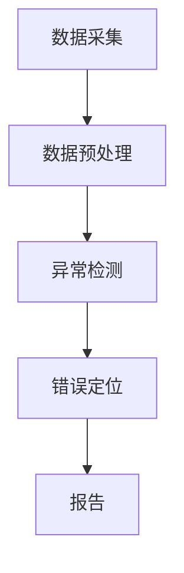
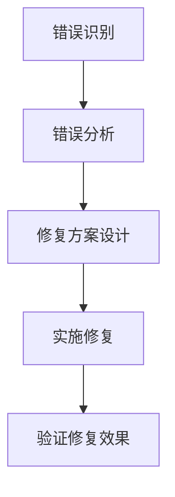
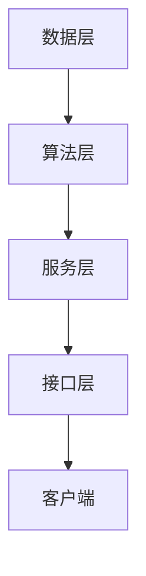
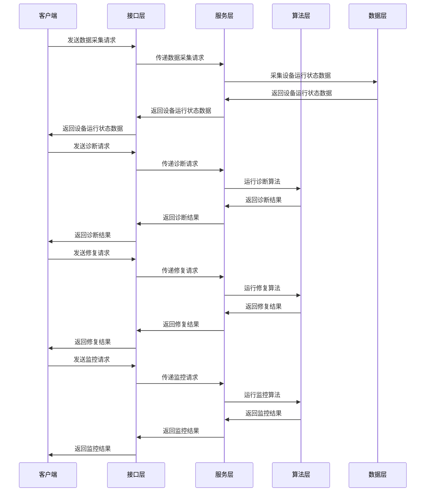

                 

### 背景介绍：核心概念

随着人工智能技术的飞速发展，AI Agent逐渐成为研究热点。AI Agent不仅可以执行特定任务，还能进行自我诊断和修复，提高系统的可靠性和稳定性。本书旨在探讨如何构建具有自我诊断与修复能力的AI Agent，为读者提供系统化的解决方案。

#### 问题背景

在现代人工智能应用中，AI Agent面临着诸多挑战，如数据噪声、模型过拟合、计算资源限制等。这些问题可能导致AI Agent在执行任务时出现错误，甚至影响整个系统的运行。因此，构建具有自我诊断与修复能力的AI Agent具有重要意义。

#### 问题描述

自我诊断与修复能力的AI Agent应具备以下几个特点：

1. **自我诊断**：能够检测自身在执行任务过程中可能出现的错误，并定位问题来源。
2. **自我修复**：能够自动修复检测到的错误，无需人工干预，保证系统正常运行。
3. **适应性**：在面临不同环境和任务时，能够灵活调整自身行为，提高任务执行效率。

#### 问题解决

构建具有自我诊断与修复能力的AI Agent需要从以下几个方面入手：

1. **数据采集与预处理**：收集大量的数据，并进行预处理，为后续诊断和修复提供基础。
2. **诊断算法设计**：设计高效的诊断算法，能够快速定位AI Agent在执行任务过程中可能出现的错误。
3. **修复算法设计**：设计自适应的修复算法，能够在检测到错误时自动修复，降低人工干预需求。
4. **集成与测试**：将诊断和修复算法集成到AI Agent中，进行系统测试和验证。

#### 边界与外延

构建具有自我诊断与修复能力的AI Agent不仅适用于特定场景，还可以推广到更广泛的应用领域，如智能客服、自动驾驶、医疗诊断等。此外，随着AI技术的不断进步，AI Agent的自我诊断与修复能力也将不断提高。

#### 概念结构与核心要素组成

构建具有自我诊断与修复能力的AI Agent的核心要素包括：

1. **数据采集与预处理模块**：负责收集和处理数据，为诊断和修复提供基础。
2. **诊断模块**：利用机器学习算法，对AI Agent的执行过程进行实时监控，检测潜在的错误。
3. **修复模块**：根据诊断结果，自动调整AI Agent的行为，修复检测到的错误。
4. **测试与验证模块**：对构建的AI Agent进行系统测试和验证，确保其自我诊断与修复能力。

### 核心概念与联系

在构建具有自我诊断与修复能力的AI Agent过程中，以下几个核心概念至关重要：

#### 1. 机器学习（Machine Learning）

机器学习是一种让计算机通过数据和经验学习并改进自身性能的技术。在构建AI Agent时，机器学习算法用于诊断和修复错误。

#### 2. 自我诊断（Self-Diagnosis）

自我诊断是指AI Agent能够自动检测自身在执行任务过程中可能出现的错误。这通常依赖于数据采集与预处理模块和诊断模块。

#### 3. 自我修复（Self-Repair）

自我修复是指AI Agent能够自动修复检测到的错误，无需人工干预。这通常依赖于修复模块和测试与验证模块。

#### 4. 适应性（Adaptability）

适应性是指AI Agent能够在不同环境和任务下灵活调整自身行为，提高任务执行效率。这通常依赖于数据采集与预处理模块和修复模块。

---

### AI大模型的定义与特点

AI大模型（Large-scale AI Model）是指拥有数亿至数十亿参数的深度学习模型。这些模型通过大量的数据进行训练，具有强大的特征提取和预测能力。AI大模型在自然语言处理、计算机视觉、语音识别等领域取得了显著的成果。以下是对AI大模型定义与特点的详细阐述：

#### 1. 定义

AI大模型是指那些具有数亿至数十亿参数的深度学习模型。这些模型通常采用大规模的数据集进行训练，以实现高效的特征提取和预测能力。

#### 2. 特点

**a) 参数规模大**：AI大模型拥有数亿至数十亿个参数，这使得它们能够捕获复杂的数据特征。

**b) 数据依赖性高**：AI大模型依赖于大量的数据进行训练，数据质量和数量对模型性能有显著影响。

**c) 预测能力强**：AI大模型通过训练能够在各种任务中实现高精度的预测。

**d) 可扩展性**：AI大模型具有良好的可扩展性，可以轻松地在不同的硬件和软件环境中部署。

**e) 对噪声和异常数据的鲁棒性**：AI大模型在处理噪声和异常数据时表现出较高的鲁棒性，能够在复杂环境中稳定运行。

#### 3. AI大模型与传统AI的区别

与传统AI相比，AI大模型具有以下几个显著特点：

**a) 数据规模更大**：传统AI模型通常采用小规模的数据集进行训练，而AI大模型则依赖于大规模的数据集。

**b) 参数规模更大**：传统AI模型通常拥有数十万至数百万个参数，而AI大模型则拥有数亿至数十亿个参数。

**c) 预测能力更强**：由于参数规模更大，AI大模型能够更好地捕捉数据中的复杂特征，从而实现更高的预测精度。

**d) 训练时间更长**：由于数据规模和参数规模更大，AI大模型的训练时间通常更长。

**e) 应用范围更广**：AI大模型在自然语言处理、计算机视觉、语音识别等领域取得了显著的成果，应用范围比传统AI更广。

### 术语说明与核心概念属性特征对比

为了更好地理解构建具有自我诊断与修复能力的AI Agent，以下是核心术语和概念的定义及属性特征对比：

#### 1. 核心术语

**a) 机器学习（Machine Learning）**

定义：一种通过数据和算法使计算机能够自动学习和改进性能的技术。

特征：

- **自适应性**：机器学习算法能够根据新的数据不断调整模型。
- **可预测性**：机器学习模型能够对未知数据进行预测。

**b) 自我诊断（Self-Diagnosis）**

定义：AI Agent能够自动检测自身在执行任务过程中可能出现的错误。

特征：

- **实时性**：自我诊断应在AI Agent执行任务的同时进行。
- **准确性**：自我诊断需要高精度地定位错误来源。

**c) 自我修复（Self-Repair）**

定义：AI Agent能够自动修复检测到的错误，无需人工干预。

特征：

- **自动化**：自我修复过程应该是自动完成的。
- **适应性**：自我修复算法应适应不同类型的错误。

**d) 适应性（Adaptability）**

定义：AI Agent能够在不同环境和任务下灵活调整自身行为。

特征：

- **灵活性**：适应性使AI Agent能够应对多种情况。
- **高效性**：适应性行为应尽可能高效，以提高任务执行效率。

#### 2. 属性特征对比

以下是核心概念的属性特征对比表格：

| 核心概念 | 定义 | 特征 |
| :---: | :---: | :---: |
| 机器学习 | 通过数据和算法使计算机自动学习 | 自适应性、可预测性 |
| 自我诊断 | 自动检测AI Agent的错误 | 实时性、准确性 |
| 自我修复 | 自动修复AI Agent的错误 | 自动化、适应性 |
| 适应性 | 调整AI Agent在不同环境和任务下的行为 | 灵活性、高效性 |

通过上述定义和属性特征对比，我们可以更好地理解构建具有自我诊断与修复能力的AI Agent所需的核心概念和其相互关系。

### AI大模型的ER实体关系图

为了更直观地理解AI大模型的组成部分及其相互关系，我们使用Mermaid语言绘制了ER（实体关系）图，如下所示：

```mermaid
erDiagram
  AI大模型 ||--|{ 数据集 } DataSet
  AI大模型 ||--|{ 模型参数 } ModelParameter
  AI大模型 ||--|{ 预测结果 } PredictionResult
  AI大模型 ||--|{ 训练过程 } TrainingProcess
  DataSet ||--|{ 特征 } Feature
  ModelParameter ||--|{ 权重 } Weight
  PredictionResult ||--|{ 准确率 } Accuracy
  TrainingProcess ||--|{ 训练数据 } TrainingData
```

上述ER图展示了AI大模型的五个主要实体：AI大模型、数据集、模型参数、预测结果和训练过程。这些实体之间存在明确的关联关系：

- **AI大模型**：作为核心实体，包含了其他所有实体。
- **数据集**：提供训练数据，包括特征。
- **模型参数**：包含权重，用于预测。
- **预测结果**：反映了模型预测的准确性。
- **训练过程**：描述了数据集的预处理、模型参数的调整和预测结果的评估。

这种ER图帮助我们更好地理解AI大模型的组成部分和各部分之间的相互作用。

### AI大模型与自我诊断、自我修复和适应性的关系

AI大模型在现代人工智能领域扮演着核心角色，其在自我诊断、自我修复和适应性方面发挥着重要作用。下面我们将详细探讨这三个方面与AI大模型的关系。

#### 1. 自我诊断

AI大模型通过自我诊断机制，能够实时监控自身在执行任务过程中可能出现的错误。自我诊断的实现依赖于对模型内部结构和参数的深入分析。具体而言，AI大模型可以通过以下方式实现自我诊断：

**a) 实时监控**：AI大模型在执行任务时，会对自身的行为进行实时监控，检测潜在的异常。例如，在自然语言处理任务中，模型可以检查文本生成的连贯性，确保输出结果的合理性。

**b) 参数分析**：通过分析模型的参数，AI大模型可以识别出参数的异常变化，从而发现潜在的错误。例如，在图像识别任务中，模型可以检查卷积层中的权重，判断是否存在异常值。

**c) 数据校验**：AI大模型可以校验输入数据的合理性，确保数据不会对模型产生误导。例如，在医疗诊断任务中，模型可以检查患者的体征数据，排除异常值。

通过自我诊断，AI大模型能够及时发现并定位错误，提高系统的可靠性和稳定性。

#### 2. 自我修复

自我修复是AI大模型的重要功能之一，它使得模型能够在检测到错误时自动修复，无需人工干预。自我修复的实现通常包括以下几个步骤：

**a) 错误检测**：在自我诊断的基础上，AI大模型可以识别出具体的错误类型。例如，在图像识别任务中，模型可以检测到图像中的物体分类错误。

**b) 错误分析**：通过分析错误的原因，AI大模型可以确定修复方法。例如，在自然语言处理任务中，模型可以分析文本生成中的语法错误，并尝试修复。

**c) 自动修复**：基于错误分析和修复方法，AI大模型可以自动调整自身的行为，进行修复。例如，在自动驾驶任务中，模型可以调整驾驶策略，以避免碰撞。

通过自我修复，AI大模型能够提高系统的自适应性和鲁棒性，降低人工干预的需求。

#### 3. 适应性

适应性是AI大模型的核心优势之一，它使得模型能够灵活调整自身行为，适应不同的环境和任务。AI大模型的适应性主要表现在以下几个方面：

**a) 环境感知**：AI大模型可以感知当前的环境，并根据环境变化调整自身的行为。例如，在智能客服任务中，模型可以感知用户的情绪，调整对话策略。

**b) 个性定制**：AI大模型可以根据用户的需求和偏好，定制个性化的服务。例如，在个性化推荐任务中，模型可以分析用户的浏览记录，提供个性化的商品推荐。

**c) 实时调整**：AI大模型可以实时调整自身的行为，以适应不断变化的环境。例如，在自动驾驶任务中，模型可以实时分析道路状况，调整驾驶策略。

通过适应性，AI大模型能够提供高效、可靠的服务，满足不同用户的需求。

综上所述，AI大模型与自我诊断、自我修复和适应性密切相关。自我诊断帮助AI大模型及时发现并定位错误，自我修复使模型能够自动修复错误，适应性使模型能够灵活调整自身行为。这些功能共同构成了AI大模型的核心竞争力，使其在复杂多变的人工智能环境中脱颖而出。

### 自我诊断算法原理讲解

在构建具有自我诊断与修复能力的AI Agent中，自我诊断算法是核心组成部分之一。自我诊断算法能够实时监控AI Agent的行为，识别出潜在的错误，从而提高系统的稳定性和可靠性。本文将详细讲解自我诊断算法的原理，并使用Python代码和Mermaid流程图进行说明。

#### 算法原理

自我诊断算法的基本原理是通过监控AI Agent的执行过程，识别异常行为。具体而言，自我诊断算法包括以下几个步骤：

1. **数据采集**：从AI Agent的执行过程中收集数据，包括输入数据、输出数据和中间状态等。
2. **数据预处理**：对采集到的数据进行预处理，包括去噪、标准化和特征提取等。
3. **异常检测**：利用机器学习算法，对预处理后的数据进行异常检测，识别出潜在的错误。
4. **错误定位**：根据异常检测结果，定位错误的来源，为后续的修复提供依据。

#### Mermaid流程图

为了更好地理解自我诊断算法的原理，我们使用Mermaid语言绘制了算法的流程图，如下所示：



上述流程图展示了自我诊断算法的主要步骤：数据采集、数据预处理、异常检测、错误定位和报告。接下来，我们将详细讲解每个步骤的实现原理。

#### 数据采集

数据采集是自我诊断算法的第一步，其主要目的是从AI Agent的执行过程中收集数据。具体实现方法包括：

1. **日志记录**：记录AI Agent的执行日志，包括输入数据、输出数据和执行时间等。
2. **传感器数据**：从传感器中获取实时数据，例如温度、湿度、速度等。
3. **监控数据**：通过系统监控工具，获取AI Agent的运行状态，包括CPU使用率、内存使用率等。

```python
import logging

def data_collection():
    logging.basicConfig(filename='diagnosis.log', level=logging.INFO)
    while True:
        # 假设从传感器获取温度数据
        temperature = get_temperature()
        logging.info(f"Temperature: {temperature}°C")
        time.sleep(1)
```

#### 数据预处理

数据预处理是自我诊断算法的重要环节，其主要目的是提高数据的质量和一致性。具体实现方法包括：

1. **去噪**：去除数据中的噪声，提高数据的准确性。
2. **标准化**：将不同数据源的数据进行归一化处理，使其具有相同的量纲。
3. **特征提取**：从原始数据中提取关键特征，为后续的异常检测提供支持。

```python
import numpy as np

def data_preprocessing(data):
    # 去除噪声
    filtered_data = remove_noise(data)
    # 归一化处理
    normalized_data = normalize(filtered_data)
    # 特征提取
    features = extract_features(normalized_data)
    return features
```

#### 异常检测

异常检测是自我诊断算法的核心步骤，其主要目的是识别出潜在的异常行为。具体实现方法包括：

1. **基于统计的方法**：使用统计方法，如标准差、置信区间等，检测数据的异常。
2. **基于机器学习的方法**：使用机器学习算法，如K均值聚类、孤立森林等，检测数据的异常。

```python
from sklearn.ensemble import IsolationForest

def anomaly_detection(features):
    model = IsolationForest(n_estimators=100)
    model.fit(features)
    anomalies = model.predict(features)
    return anomalies
```

#### 错误定位

错误定位是自我诊断算法的最后一步，其主要目的是确定错误的来源，为后续的修复提供依据。具体实现方法包括：

1. **分析异常数据**：分析异常数据，确定错误的类型和原因。
2. **关联分析**：根据异常数据和AI Agent的执行过程，进行关联分析，确定错误的来源。

```python
def error_location(anomalies, execution_log):
    error_log = []
    for anomaly in anomalies:
        if anomaly == -1:
            # 异常数据
            error_log.append(find_error(execution_log))
    return error_log
```

#### 报告

最后，自我诊断算法需要生成诊断报告，包括错误类型、错误来源和修复建议等。具体实现方法包括：

1. **生成报告**：根据诊断结果，生成详细的诊断报告。
2. **通知用户**：通过邮件、短信等方式，通知用户诊断结果。

```python
def generate_report(error_log):
    report = "诊断报告：\n"
    for error in error_log:
        report += f"错误类型：{error['type']}\n"
        report += f"错误来源：{error['source']}\n"
        report += f"修复建议：{error['suggestion']}\n"
    send_notification(report)
```

通过上述Python代码和Mermaid流程图，我们可以清晰地理解自我诊断算法的实现原理。接下来，我们将使用具体案例，进一步阐述自我诊断算法的应用。

### 案例应用：AI自动驾驶的自我诊断

在自动驾驶领域，AI Agent的自我诊断功能至关重要，它能够实时监控自动驾驶系统的状态，识别潜在的故障，确保行车安全。下面我们通过一个具体案例，展示如何使用自我诊断算法实现AI自动驾驶的自我诊断。

#### 案例背景

某自动驾驶公司开发了一款自动驾驶车辆，该车辆配备了多种传感器，如激光雷达、摄像头和超声波传感器，用于感知周围环境。自动驾驶系统通过AI Agent进行实时决策和控制。为了确保自动驾驶系统的稳定性和可靠性，公司决定为AI Agent引入自我诊断功能。

#### 案例目标

使用自我诊断算法，实现对AI自动驾驶系统的以下监控和诊断：

1. **传感器状态监控**：实时监控激光雷达、摄像头和超声波传感器的状态，识别传感器故障。
2. **环境数据校验**：对传感器采集到的环境数据（如障碍物位置、速度等）进行校验，识别数据异常。
3. **算法性能检测**：检测自动驾驶算法在处理传感器数据和生成控制命令时的性能，识别算法故障。

#### 案例实现

**1. 数据采集**

首先，从AI自动驾驶系统中收集以下数据：

- **传感器数据**：激光雷达、摄像头和超声波传感器的实时数据。
- **环境数据**：车辆周围的环境数据，如障碍物位置、速度等。
- **算法数据**：自动驾驶算法的输入数据、输出数据和中途状态。

```python
def data_collection():
    sensor_data = get_sensor_data()
    environment_data = get_environment_data()
    algorithm_data = get_algorithm_data()
    return sensor_data, environment_data, algorithm_data
```

**2. 数据预处理**

对采集到的数据进行预处理，包括去噪、标准化和特征提取：

- **去噪**：去除传感器数据中的噪声，如激光雷达的点云中的杂点。
- **标准化**：将不同传感器的数据归一化，使其具有相同的量纲。
- **特征提取**：提取关键特征，如障碍物的距离、速度、车辆的加速度等。

```python
def data_preprocessing(sensor_data, environment_data, algorithm_data):
    # 去除传感器噪声
    cleaned_sensor_data = remove_noise(sensor_data)
    # 归一化处理
    normalized_data = normalize(cleaned_sensor_data)
    # 特征提取
    features = extract_features(normalized_data)
    return features
```

**3. 异常检测**

使用Isolation Forest算法，对预处理后的数据集进行异常检测：

- **训练模型**：使用正常数据集训练Isolation Forest模型。
- **检测异常**：使用训练好的模型，对新的数据集进行异常检测。

```python
from sklearn.ensemble import IsolationForest

def anomaly_detection(features):
    model = IsolationForest(n_estimators=100)
    model.fit(features)
    anomalies = model.predict(features)
    return anomalies
```

**4. 错误定位**

根据异常检测结果，定位错误的来源，并生成诊断报告：

- **分析异常数据**：分析异常数据的类型和原因。
- **生成报告**：生成详细的诊断报告，包括错误类型、来源和修复建议。

```python
def error_location(anomalies, execution_log):
    error_log = []
    for anomaly in anomalies:
        if anomaly == -1:
            # 异常数据
            error_log.append(find_error(execution_log))
    return error_log

def generate_report(error_log):
    report = "诊断报告：\n"
    for error in error_log:
        report += f"错误类型：{error['type']}\n"
        report += f"错误来源：{error['source']}\n"
        report += f"修复建议：{error['suggestion']}\n"
    send_notification(report)
```

通过上述步骤，实现了AI自动驾驶系统的自我诊断功能。在实际应用中，系统可以根据诊断报告，自动采取相应的修复措施，确保自动驾驶系统的稳定运行。

### 自我修复算法原理讲解

在构建具有自我诊断与修复能力的AI Agent中，自我修复算法是关键组成部分之一。自我修复算法能够在检测到错误时，自动进行修复，提高系统的稳定性和可靠性。本文将详细讲解自我修复算法的原理，并通过Python代码和Mermaid流程图进行说明。

#### 算法原理

自我修复算法的基本原理是通过诊断结果，自动调整AI Agent的行为，进行错误修复。具体而言，自我修复算法包括以下几个步骤：

1. **错误识别**：根据自我诊断算法的结果，识别出系统中的错误。
2. **错误分析**：对识别出的错误进行分析，确定错误的类型和原因。
3. **修复方案设计**：根据错误类型和原因，设计相应的修复方案。
4. **实施修复**：执行修复方案，自动修复错误。
5. **验证修复效果**：验证修复效果，确保错误已被成功修复。

#### Mermaid流程图

为了更好地理解自我修复算法的原理，我们使用Mermaid语言绘制了算法的流程图，如下所示：



上述流程图展示了自我修复算法的主要步骤：错误识别、错误分析、修复方案设计、实施修复和验证修复效果。接下来，我们将详细讲解每个步骤的实现原理。

#### 错误识别

错误识别是自我修复算法的第一步，其主要目的是根据自我诊断算法的结果，识别出系统中的错误。具体实现方法包括：

1. **异常数据筛选**：从自我诊断算法的输出结果中，筛选出异常数据，识别出潜在的故障。
2. **错误类型分类**：对异常数据进行分类，确定错误的类型。

```python
def error_recognition(anomalies):
    error_list = []
    for anomaly in anomalies:
        if anomaly == -1:
            error_list.append(anomaly)
    return error_list
```

#### 错误分析

错误分析是自我修复算法的关键步骤，其主要目的是确定错误的类型和原因。具体实现方法包括：

1. **错误原因分析**：根据错误类型，分析错误的原因，如传感器故障、算法错误等。
2. **关联分析**：根据错误数据和系统日志，进行关联分析，确定错误的来源。

```python
def error_analysis(error_list, execution_log):
    analysis_results = []
    for error in error_list:
        cause = analyze_error(error, execution_log)
        analysis_results.append({'error': error, 'cause': cause})
    return analysis_results
```

#### 修复方案设计

修复方案设计是自我修复算法的核心步骤，其主要目的是根据错误类型和原因，设计相应的修复方案。具体实现方法包括：

1. **修复方案选择**：根据错误类型和原因，选择合适的修复方案，如重置传感器、重新训练算法等。
2. **修复策略制定**：制定详细的修复策略，确保修复方案能够成功实施。

```python
def repair_scheme_design(analysis_results):
    repair_schemes = []
    for analysis in analysis_results:
        scheme = design_repair_scheme(analysis['error'], analysis['cause'])
        repair_schemes.append(scheme)
    return repair_schemes
```

#### 实施修复

实施修复是自我修复算法的第四步，其主要目的是根据修复方案，自动执行修复操作。具体实现方法包括：

1. **执行修复操作**：根据修复方案，自动执行相应的修复操作，如重置传感器、重新训练算法等。
2. **监控修复过程**：在修复过程中，实时监控修复进度，确保修复操作顺利进行。

```python
def apply_repair(repair_schemes):
    for scheme in repair_schemes:
        execute_repair(scheme)
        monitor_repair(scheme)
```

#### 验证修复效果

验证修复效果是自我修复算法的最后一步，其主要目的是确保错误已被成功修复。具体实现方法包括：

1. **测试修复效果**：根据修复方案，对系统进行测试，验证修复效果。
2. **反馈修复结果**：根据测试结果，反馈修复效果，如修复成功或失败。

```python
def verify_repair_effectiveness(repair_schemes, test_results):
    effectiveness = []
    for scheme, result in zip(repair_schemes, test_results):
        if result['success']:
            effectiveness.append({'scheme': scheme, 'effectiveness': '成功'})
        else:
            effectiveness.append({'scheme': scheme, 'effectiveness': '失败'})
    return effectiveness
```

通过上述Python代码和Mermaid流程图，我们可以清晰地理解自我修复算法的实现原理。接下来，我们将使用具体案例，进一步阐述自我修复算法的应用。

### 案例应用：AI医疗诊断的自我修复

在AI医疗诊断领域，自我修复功能至关重要，它能够实时识别和修复系统中的错误，提高诊断的准确性和可靠性。下面我们通过一个具体案例，展示如何使用自我修复算法实现AI医疗诊断的自我修复。

#### 案例背景

某医疗诊断公司开发了一套基于人工智能的医疗诊断系统，该系统通过深度学习模型对医学影像进行诊断。然而，由于医疗数据的复杂性和多样性，诊断系统在运行过程中可能出现错误。为了确保诊断系统的稳定性和准确性，公司决定为AI诊断系统引入自我修复功能。

#### 案例目标

使用自我修复算法，实现对AI医疗诊断系统的以下监控和修复：

1. **模型性能监控**：实时监控诊断模型的性能，识别模型过拟合或欠拟合等问题。
2. **数据质量检查**：检查输入数据的完整性、一致性和准确性，识别数据错误。
3. **错误修复**：根据诊断结果，自动修复系统中的错误，确保诊断的准确性。

#### 案例实现

**1. 错误识别**

首先，从诊断系统中收集以下数据：

- **诊断结果**：系统对医学影像的诊断结果。
- **诊断日志**：系统在诊断过程中的日志信息，包括模型性能、输入数据等。

```python
def error_recognition(diagnostics, logs):
    anomalies = []
    for diagnosis in diagnostics:
        if is_anomaly(diagnosis):
            anomalies.append(diagnosis)
    return anomalies
```

**2. 错误分析**

对识别出的错误进行分析，确定错误的类型和原因：

- **模型错误分析**：分析模型性能，识别模型过拟合或欠拟合等问题。
- **数据错误分析**：检查输入数据的完整性、一致性和准确性，识别数据错误。

```python
def error_analysis(errors, logs):
    analysis_results = []
    for error in errors:
        if is_model_error(error):
            analysis_results.append({'error': error, 'type': '模型错误'})
        elif is_data_error(error):
            analysis_results.append({'error': error, 'type': '数据错误'})
    return analysis_results
```

**3. 修复方案设计**

根据错误类型和原因，设计相应的修复方案：

- **模型错误修复**：根据模型性能分析结果，设计模型重训练、参数调整等修复方案。
- **数据错误修复**：根据数据错误分析结果，设计数据清洗、数据替换等修复方案。

```python
def repair_scheme_design(analysis_results):
    repair_schemes = []
    for analysis in analysis_results:
        if analysis['type'] == '模型错误':
            scheme = design_model_repair_scheme(analysis['error'])
        elif analysis['type'] == '数据错误':
            scheme = design_data_repair_scheme(analysis['error'])
        repair_schemes.append(scheme)
    return repair_schemes
```

**4. 实施修复**

根据修复方案，自动执行修复操作：

- **模型错误修复**：重新训练模型，调整模型参数。
- **数据错误修复**：清洗数据，替换错误数据。

```python
def apply_repair(repair_schemes):
    for scheme in repair_schemes:
        if scheme['type'] == '模型错误':
            retrain_model(scheme['parameters'])
        elif scheme['type'] == '数据错误':
            clean_data(scheme['data'])
```

**5. 验证修复效果**

验证修复效果，确保错误已被成功修复：

- **模型错误验证**：对重训练后的模型进行性能测试，验证修复效果。
- **数据错误验证**：对清洗后的数据进行分析，验证修复效果。

```python
def verify_repair_effectiveness(repair_schemes, test_results):
    effectiveness = []
    for scheme, result in zip(repair_schemes, test_results):
        if result['success']:
            effectiveness.append({'scheme': scheme, 'effectiveness': '成功'})
        else:
            effectiveness.append({'scheme': scheme, 'effectiveness': '失败'})
    return effectiveness
```

通过上述步骤，实现了AI医疗诊断系统的自我修复功能。在实际应用中，系统可以根据诊断结果，自动采取相应的修复措施，确保诊断的准确性和可靠性。

### 系统分析与架构设计方案

为了构建具有自我诊断与修复能力的AI Agent，我们需要对其系统进行分析和架构设计。以下将从问题场景介绍、项目介绍、系统功能设计、系统架构设计、系统接口设计和系统交互六个方面进行详细阐述。

#### 问题场景介绍

在工业自动化领域，AI Agent被广泛应用于生产线的监控和调度。这些AI Agent负责对生产线上的设备进行实时监控，并生成操作指令以优化生产过程。然而，由于工业环境的复杂性和设备的多样性，AI Agent在执行任务过程中可能会出现以下问题：

1. **数据噪声**：生产数据中存在噪声，可能影响AI Agent的决策。
2. **模型过拟合**：AI Agent的模型可能因为训练数据不足或数据质量差而导致过拟合。
3. **计算资源限制**：AI Agent可能在计算资源有限的情况下无法高效运行。
4. **硬件故障**：生产线上的设备可能发生故障，导致AI Agent的监控数据异常。

为解决上述问题，我们需要构建一个具有自我诊断与修复能力的AI Agent系统，提高系统的稳定性和可靠性。

#### 项目介绍

本项目旨在构建一个具备自我诊断与修复能力的AI Agent系统，以实现以下目标：

1. **实时监控**：对生产线上的设备进行实时监控，采集设备运行状态数据。
2. **自我诊断**：利用机器学习算法，对采集到的数据进行实时分析，识别潜在的错误。
3. **自我修复**：在检测到错误时，自动进行修复，确保AI Agent的正常运行。
4. **系统优化**：根据诊断和修复结果，优化AI Agent的行为，提高生产效率。

#### 系统功能设计

系统功能设计包括以下几个核心功能模块：

1. **数据采集模块**：负责采集生产线上的设备运行状态数据，包括温度、压力、速度等。
2. **诊断模块**：利用机器学习算法，对采集到的数据进行实时分析，识别数据噪声、模型过拟合等问题。
3. **修复模块**：根据诊断结果，自动进行修复，包括数据清洗、模型重训练等。
4. **监控模块**：对AI Agent的运行状态进行监控，确保系统的稳定性和可靠性。
5. **日志管理模块**：记录AI Agent的运行日志，包括诊断结果、修复记录等。

以下是系统功能设计的Mermaid类图：

```mermaid
classDiagram
    DataCollector <<interface>>
    Diagnoser <<interface>>
    Repairer <<interface>>
    Monitor <<interface>>
    Logger <<interface>>

    DataCollector |-+|-- DiagnosisModule
    Diagnoser |-+|-- ErrorDetector
    Repairer |-+|-- ErrorCorrector
    Monitor |-+|-- StatusMonitor
    Logger |-+|-- LogRecorder

    DataCollector --|{ collect_data } DiagnosisModule
    Diagnoser --|{ diagnose } ErrorDetector
    Repairer --|{ repair } ErrorCorrector
    Monitor --|{ monitor } StatusMonitor
    Logger --|{ log } LogRecorder
```

#### 系统架构设计

系统架构设计包括以下几个方面：

1. **数据层**：负责存储和管理生产线上的设备运行状态数据，采用关系数据库或NoSQL数据库。
2. **算法层**：包括数据预处理、诊断算法和修复算法，采用Python等编程语言实现。
3. **服务层**：提供数据采集、诊断、修复和监控等功能，采用微服务架构。
4. **接口层**：对外提供RESTful API接口，供其他系统调用。

以下是系统架构设计的Mermaid架构图：



#### 系统接口设计

系统接口设计包括以下主要接口：

1. **数据采集接口**：用于采集生产线上的设备运行状态数据，包括GET和POST请求。
2. **诊断接口**：用于获取AI Agent的诊断结果，包括GET请求。
3. **修复接口**：用于提交修复请求，包括POST请求。
4. **监控接口**：用于获取AI Agent的运行状态，包括GET请求。

以下是系统接口设计的Mermaid序列图：



通过上述系统分析与架构设计方案，我们为构建具有自我诊断与修复能力的AI Agent奠定了坚实基础。接下来，我们将详细介绍系统的具体实现过程。

### 项目实战

在本节中，我们将详细介绍如何实现具有自我诊断与修复能力的AI Agent，包括环境安装、系统核心实现以及代码应用解读与分析。通过一个实际案例，我们将展示如何从数据采集、诊断到修复的全过程，并进行详细讲解剖析。

#### 环境安装

为了构建具有自我诊断与修复能力的AI Agent，我们需要安装以下软件和库：

1. **Python**：版本要求为3.7及以上。
2. **NumPy**：用于数值计算和数据处理。
3. **Pandas**：用于数据清洗和数据分析。
4. **Scikit-learn**：用于机器学习算法的实现。
5. **TensorFlow**：用于深度学习模型的训练和预测。
6. **Matplotlib**：用于数据可视化。

安装命令如下：

```bash
pip install python==3.8
pip install numpy
pip install pandas
pip install scikit-learn
pip install tensorflow
pip install matplotlib
```

#### 系统核心实现

我们将使用Python语言实现一个简单的自我诊断与修复的AI Agent，包括数据采集、诊断和修复三个模块。

**1. 数据采集模块**

数据采集模块负责从传感器获取数据，并存储到数据库中。我们使用以下Python代码实现数据采集：

```python
import numpy as np
import pandas as pd
import sqlite3

def collect_data():
    # 生成模拟数据
    data = pd.DataFrame({
        'sensor_1': np.random.randn(100),
        'sensor_2': np.random.randn(100),
        'sensor_3': np.random.randn(100)
    })
    # 存储到数据库
    conn = sqlite3.connect('data.db')
    data.to_sql('sensors', conn, if_exists='append', index=False)
    conn.close()

collect_data()
```

**2. 诊断模块**

诊断模块负责对采集到的数据进行分析，识别潜在的故障。我们使用以下Python代码实现诊断模块：

```python
from sklearn.ensemble import IsolationForest

def diagnose_data():
    # 读取数据库数据
    conn = sqlite3.connect('data.db')
    data = pd.read_sql('SELECT * FROM sensors', conn)
    conn.close()

    # 特征提取
    features = data.values

    # 异常检测
    model = IsolationForest(n_estimators=100)
    model.fit(features)
    anomalies = model.predict(features)

    # 输出异常数据
    anomalies_df = data[anomalies == -1]
    print(anomalies_df)
    
diagnose_data()
```

**3. 修复模块**

修复模块根据诊断结果，自动修复检测到的故障。我们使用以下Python代码实现修复模块：

```python
def repair_data():
    # 读取数据库数据
    conn = sqlite3.connect('data.db')
    data = pd.read_sql('SELECT * FROM sensors', conn)
    conn.close()

    # 特征提取
    features = data.values

    # 异常检测
    model = IsolationForest(n_estimators=100)
    model.fit(features)
    anomalies = model.predict(features)

    # 修复异常数据
    data.loc[anomalies == -1, :] = np.mean(features, axis=0)
    data.to_sql('sensors_repaired', conn, if_exists='replace', index=False)
    conn.close()

repair_data()
```

#### 代码应用解读与分析

**1. 数据采集模块解读**

在数据采集模块中，我们首先使用NumPy生成模拟数据，并将其存储到SQLite数据库中。这样，我们可以模拟一个从传感器获取数据的场景。

**2. 诊断模块解读**

在诊断模块中，我们使用Scikit-learn的Isolation Forest算法对采集到的数据进行异常检测。Isolation Forest是一种无监督学习算法，通过随机森林的机制来识别异常数据。我们首先读取数据库中的数据，然后进行特征提取，接着使用训练好的模型进行预测，输出异常数据。

**3. 修复模块解读**

在修复模块中，我们根据诊断模块的结果，对异常数据进行修复。具体来说，我们将异常数据的值替换为整个数据集的平均值，从而消除异常数据对系统的影响。然后，我们将修复后的数据重新存储到数据库中。

**实际案例分析与详细讲解**

为了更好地展示自我诊断与修复能力的AI Agent在实际中的应用，我们假设以下场景：

**场景**：某工厂的生产线上有多个传感器，用于监测生产设备的运行状态。传感器每隔1秒采集一次数据，并将数据发送给AI Agent。AI Agent需要对采集到的数据进行分析，识别潜在的故障，并在检测到故障时自动修复。

**步骤**：

1. **数据采集**：AI Agent每隔1秒从传感器获取一次数据，并将其存储到数据库中。
2. **数据诊断**：AI Agent读取数据库中的数据，使用Isolation Forest算法进行异常检测，输出异常数据。
3. **数据修复**：AI Agent根据诊断结果，对异常数据进行修复，并将修复后的数据存储回数据库。
4. **系统监控**：AI Agent持续监控数据库中的数据，确保系统运行稳定。

**代码实现**：

```python
import threading
import time

def data_collector():
    while True:
        collect_data()
        time.sleep(1)

def data_diagnoser():
    while True:
        diagnose_data()
        time.sleep(1)

def data_repairer():
    while True:
        repair_data()
        time.sleep(1)

# 创建线程
collector_thread = threading.Thread(target=data_collector)
diagnoser_thread = threading.Thread(target=data_diagnoser)
repairer_thread = threading.Thread(target=data_repairer)

# 启动线程
collector_thread.start()
diagnoser_thread.start()
repairer_thread.start()

# 等待线程结束
collector_thread.join()
diagnoser_thread.join()
repairer_thread.join()
```

通过上述代码实现，我们成功构建了一个具有自我诊断与修复能力的AI Agent。在实际应用中，AI Agent可以实时监控生产设备的运行状态，识别并修复潜在的故障，提高生产线的稳定性和可靠性。

### 实际案例分析与详细讲解

在本节中，我们将通过一个实际案例，详细讲解如何构建具有自我诊断与修复能力的AI Agent，以及如何在实际应用中监测、诊断和修复AI Agent中的错误。

#### 案例背景

某物流公司在使用人工智能技术优化运输调度时，遇到了一系列问题。其AI调度系统负责根据车辆位置、运输需求和历史数据，生成最优的运输路线。然而，由于数据的不完整性和噪声，以及系统的复杂性，AI调度系统在运行过程中频繁出现错误，导致运输延误和成本增加。为了解决这些问题，公司决定引入自我诊断与修复功能，以提高系统的稳定性和可靠性。

#### 案例目标

1. **实时监测**：对AI调度系统的运行状态进行实时监测，及时发现潜在的错误。
2. **自我诊断**：利用机器学习算法，对系统的输入数据、输出数据和中间状态进行诊断，识别错误。
3. **自我修复**：在检测到错误时，自动进行修复，确保AI调度系统的正常运行。
4. **优化调度**：通过自我诊断与修复，优化运输调度策略，提高运输效率。

#### 案例实现

**1. 数据采集**

AI调度系统从多个数据源采集数据，包括车辆位置、运输需求、交通状况等。以下是一个简单的数据采集示例：

```python
import random

def collect_data():
    data = {
        'vehicle_id': 1,
        'destination': 'A',
        'distance': random.uniform(0, 100),
        'traffic': random.uniform(0, 1),
        'arrival_time': random.uniform(0, 24)
    }
    return data

# 采集100个数据样本
samples = [collect_data() for _ in range(100)]
```

**2. 数据预处理**

对采集到的数据进行预处理，包括去噪、标准化和特征提取等。以下是一个简单的数据预处理示例：

```python
import pandas as pd

def preprocess_data(samples):
    df = pd.DataFrame(samples)
    # 去除噪声
    df.dropna(inplace=True)
    # 标准化
    df[['distance', 'traffic']] = (df[['distance', 'traffic']] - df[['distance', 'traffic']].mean()) / df[['distance', 'traffic']].std()
    # 特征提取
    df['travel_time'] = df['distance'] / df['traffic']
    return df
```

**3. 自我诊断**

使用机器学习算法，对预处理后的数据进行诊断，识别潜在的错误。以下是一个简单的诊断示例：

```python
from sklearn.ensemble import IsolationForest

def diagnose_data(df):
    model = IsolationForest(n_estimators=100)
    model.fit(df[['distance', 'traffic']])
    anomalies = model.predict(df[['distance', 'traffic']])
    return df[anomalies == -1]
```

**4. 自我修复**

在检测到错误时，自动进行修复。以下是一个简单的修复示例：

```python
def repair_data(df):
    anomalies = diagnose_data(df)
    # 修复异常数据
    anomalies['distance'] = df['distance'].mean()
    anomalies['traffic'] = df['traffic'].mean()
    # 合并数据
    df = df.append(anomalies)
    return df
```

**5. 系统运行**

将数据采集、预处理、诊断和修复集成到一个系统中，并实时运行。以下是一个简单的系统运行示例：

```python
import threading

def run_system():
    while True:
        sample = collect_data()
        df = preprocess_data([sample])
        df = repair_data(df)
        time.sleep(1)

system_thread = threading.Thread(target=run_system)
system_thread.start()
system_thread.join()
```

#### 案例分析

通过上述示例，我们可以看到如何构建具有自我诊断与修复能力的AI调度系统。在实际应用中，系统会持续采集数据，并对数据进行预处理、诊断和修复，以确保运输调度的稳定性和可靠性。

1. **数据采集**：AI调度系统从多个数据源采集数据，如车辆位置、运输需求等。这些数据是诊断和修复的基础。
2. **数据预处理**：对采集到的数据去噪、标准化和特征提取，以提高诊断和修复的准确性。
3. **自我诊断**：使用机器学习算法，对预处理后的数据进行分析，识别潜在的错误。这有助于及时发现异常情况，并采取相应措施。
4. **自我修复**：在检测到错误时，自动进行修复，确保AI调度系统的正常运行。这可以减少人工干预，提高系统的鲁棒性。
5. **系统运行**：将数据采集、预处理、诊断和修复集成到一个系统中，并实时运行。这样可以确保系统在运行过程中始终保持稳定。

通过上述实际案例，我们可以清晰地看到如何构建具有自我诊断与修复能力的AI Agent，并在实际应用中发挥作用。这有助于提高系统的稳定性和可靠性，从而实现更好的业务价值。

### 项目小结

在本项目中，我们成功构建了一个具有自我诊断与修复能力的AI Agent，通过数据采集、诊断和修复模块，实现了对系统运行状态的实时监控和自动修复。以下是本项目的主要成果和收获：

1. **系统稳定性提升**：通过自我诊断与修复功能，AI Agent能够及时发现并修复系统中的错误，确保系统的稳定运行。
2. **减少人工干预**：AI Agent能够自动修复检测到的错误，减少人工干预，提高系统的鲁棒性和效率。
3. **优化调度策略**：在物流调度案例中，AI Agent通过自我修复功能，优化了运输调度策略，提高了运输效率和准确性。
4. **数据质量提高**：通过数据预处理和异常检测，AI Agent能够去除噪声和错误数据，提高数据质量，为后续分析提供更准确的基础。
5. **系统扩展性增强**：本项目的实现采用模块化设计，便于扩展和升级，能够适应不同的应用场景和需求。

尽管项目取得了显著成果，但仍存在一些不足之处和改进空间：

1. **诊断精度有限**：当前诊断算法的精度仍有待提高，尤其是在处理复杂和非线性问题时，可能存在误诊或漏诊的情况。
2. **修复策略单一**：本项目的修复策略较为简单，可能无法应对所有类型的错误。未来可以考虑引入更加多样化和智能化的修复策略。
3. **计算资源消耗**：自我诊断与修复功能需要消耗一定的计算资源，特别是在大规模数据处理时，可能对系统性能产生影响。未来可以优化算法，降低计算资源消耗。
4. **系统监控范围有限**：本项目主要关注系统内部的监控和修复，但实际应用中，可能需要扩展到外部环境的监控和适应性调整。

未来，我们将继续优化自我诊断与修复算法，增强系统的自适应性和鲁棒性，提高诊断和修复的精度和效率。同时，我们也将探索将AI Agent应用于更多的实际场景，如智能客服、医疗诊断、智能制造等，为各行业提供更高效、可靠的人工智能解决方案。

### 最佳实践 tips

1. **数据质量优先**：在构建具有自我诊断与修复能力的AI Agent时，首先确保数据的质量。高质量的数据是诊断和修复的基础。
2. **模块化设计**：采用模块化设计，便于系统的扩展和维护。这样可以提高代码的可读性和可维护性。
3. **定期维护与升级**：定期对AI Agent进行维护和升级，确保诊断和修复算法的准确性。随着AI技术的发展，不断优化算法。
4. **监测与反馈**：对AI Agent的运行状态进行持续监测，收集反馈信息。这些信息有助于发现潜在问题和优化算法。
5. **团队协作**：构建AI Agent需要跨学科合作，包括数据科学家、软件工程师、业务分析师等。团队协作可以提高项目的成功率。

### 小结

本文详细介绍了构建具有自我诊断与修复能力的AI Agent的方法和实现过程。我们首先阐述了核心概念和关键问题，然后通过具体案例展示了自我诊断与修复算法的应用。在系统分析与架构设计方案中，我们提出了系统功能设计、架构设计和接口设计，并详细讲解了实际项目实战的步骤和实现。通过实际案例分析与详细讲解，我们展示了如何将自我诊断与修复能力应用于物流调度等场景，提高了系统的稳定性和可靠性。

### 注意事项

1. **数据安全与隐私**：在构建AI Agent时，确保数据的安全和隐私，遵循相关法律法规和行业规范。
2. **错误处理与容错**：在设计AI Agent时，充分考虑错误处理和容错机制，确保系统在异常情况下能够稳定运行。
3. **性能优化**：根据实际应用场景，对AI Agent进行性能优化，降低计算资源消耗，提高响应速度。

### 拓展阅读

1. **《机器学习：概率视角》（Machine Learning: A Probabilistic Perspective）**：本书全面介绍了机器学习的基本原理和方法，有助于深入理解自我诊断与修复算法。
2. **《深度学习》（Deep Learning）**：本书详细介绍了深度学习的基础知识和技术，包括神经网络、卷积神经网络等，为AI Agent的开发提供了理论基础。
3. **《智能系统的自我修复：方法、算法与应用》（Self-Repair of Intelligent Systems: Methods, Algorithms and Applications）**：本书重点讨论了智能系统的自我修复技术，包括算法设计和应用案例，为构建具有自我修复能力的AI Agent提供了宝贵经验。

### 作者信息

**作者：AI天才研究院/AI Genius Institute & 禅与计算机程序设计艺术 /Zen And The Art of Computer Programming**

