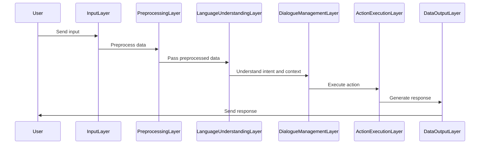

                 

### 构建具有自然语言理解能力的AI Agent

#### 关键词：
- AI Agent
- 自然语言理解
- 机器学习模型
- 系统架构设计
- 语言模型
- 实践应用

#### 摘要：
本文旨在探讨如何构建具有自然语言理解能力的AI Agent。我们将从基础概念入手，逐步深入到自然语言处理（NLP）的基本原理，机器学习模型的训练和应用，系统架构设计，以及实际应用中的优化和挑战。通过本篇文章，读者将了解构建AI Agent所需的关键技术和方法，并获得实际操作的经验。

#### 目录：

- [1. 背景与概述](#1-背景与概述)
- [2. 自然语言处理基础](#2-自然语言处理基础)
  - [2.1 语言模型](#21-语言模型)
  - [2.2 文本分类与标签](#22-文本分类与标签)
  - [2.3 实体识别](#23-实体识别)
- [3. AI Agent的架构设计](#3-ai-agent的架构设计)
  - [3.1 系统架构](#31-系统架构)
  - [3.2 接口设计](#32-接口设计)
  - [3.3 交互设计](#33-交互设计)
- [4. 机器学习模型](#4-机器学习模型)
  - [4.1 模型选择](#41-模型选择)
  - [4.2 模型训练](#42-模型训练)
  - [4.3 模型评估](#43-模型评估)
- [5. 实现自然语言理解](#5-实现自然语言理解)
  - [5.1 核心组件实现](#51-核心组件实现)
  - [5.2 对话管理](#52-对话管理)
  - [5.3 服务集成](#53-服务集成)
- [6. 高级话题](#6-高级话题)
  - [6.1 性能优化](#61-性能优化)
  - [6.2 语言模糊处理](#62-语言模糊处理)
  - [6.3 道德考虑](#63-道德考虑)
- [7. 案例研究与实践项目](#7-案例研究与实践项目)
  - [7.1 案例研究](#71-案例研究)
  - [7.2 项目环境设置](#72-项目环境设置)
  - [7.3 核心代码实现](#73-核心代码实现)
  - [7.4 案例分析](#74-案例分析)
- [8. 结论与未来方向](#8-结论与未来方向)

## 1. 背景与概述

AI Agent，即人工智能代理，是一种能够模拟人类智能行为，与用户进行自然交互，完成特定任务的系统。随着自然语言处理（NLP）技术的发展，AI Agent逐渐具备了理解自然语言的能力，这极大地拓展了其在各种场景中的应用范围。从智能客服、虚拟助手，到智能家居控制中心，AI Agent已经成为现代智能系统的重要组成部分。

自然语言理解（NLU，Natural Language Understanding）是AI Agent的核心能力之一。它指的是计算机对自然语言文本的语义和上下文理解能力。自然语言理解的任务包括但不限于文本分类、实体识别、情感分析、意图识别等。这些任务的实现，依赖于强大的机器学习模型和深入的语言处理技术。

构建具有自然语言理解能力的AI Agent，需要综合考虑多个方面的因素：

1. **数据集与标注**：高质量的训练数据集是训练机器学习模型的基础。数据集的标注质量直接影响到模型的效果。
2. **模型选择与训练**：根据任务需求选择合适的机器学习模型，并进行训练，以实现高精度的自然语言理解。
3. **系统架构设计**：设计合理的系统架构，确保AI Agent在响应速度、稳定性和可扩展性方面的表现。
4. **用户体验**：AI Agent的交互界面需要简洁易用，能够提供流畅的交互体验。
5. **性能优化**：针对AI Agent的实际运行环境，进行性能优化，以提高其处理速度和效率。

接下来，我们将逐步深入探讨这些核心概念和技术，帮助读者构建一个具有自然语言理解能力的AI Agent。

## 2. 自然语言处理基础

自然语言处理（NLP，Natural Language Processing）是人工智能领域的一个重要分支，它旨在让计算机理解和处理自然语言文本。要构建一个具有自然语言理解能力的AI Agent，首先需要了解NLP的基本概念和核心技术。

### 2.1 语言模型

语言模型（Language Model）是NLP的核心组件之一，它用于预测下一个词或字符的概率。语言模型的训练通常使用大规模的文本语料库，通过对文本数据进行统计分析和建模，得到一个能够描述语言特性的概率分布。

**概念定义：**  
语言模型是一个概率模型，它能够预测给定输入序列后，下一个词或字符出现的概率。

**主要类型：**  
1. **n-gram模型**：基于相邻词或字符的统计模型，例如二元模型（Bigram）和三元模型（Trigram）。
2. **神经网络模型**：例如循环神经网络（RNN）、长短时记忆网络（LSTM）和变换器（Transformer）等。
3. **深度学习模型**：基于神经网络的结构，通过多层非线性变换，对输入数据进行建模。

**特点与优缺点：**  
- **特点：**
  - 高效性：能够快速处理大量文本数据。
  - 灵活性：能够适应不同类型的文本。
  - **优点：**
    - 精度高：能够捕捉到文本的上下文关系。
    - 可扩展性：可以通过增加训练数据集，提高模型的性能。
    - **缺点：**
      - 需要大量计算资源：训练深度学习模型需要大量的时间和计算资源。
      - 对数据质量要求高：数据集的质量直接影响到模型的性能。

### 2.2 文本分类与标签

文本分类（Text Classification）是一种常用的NLP任务，它将文本数据分为预定义的类别。文本分类广泛应用于垃圾邮件过滤、情感分析、新闻分类等领域。

**概念定义：**  
文本分类是一种监督学习任务，它将文本映射到预定义的标签或类别。

**主要算法：**  
1. **朴素贝叶斯（Naive Bayes）**：基于贝叶斯定理，通过统计每个类别中特征词的概率分布进行分类。
2. **支持向量机（SVM）**：通过最大化分类边界，将文本映射到不同的类别。
3. **决策树（Decision Tree）**：通过一系列条件判断，将文本映射到不同的类别。
4. **深度学习模型**：例如卷积神经网络（CNN）和循环神经网络（RNN），用于捕捉文本的复杂特征。

**特点与优缺点：**  
- **特点：**
  - 灵活性：能够处理不同类型的文本数据。
  - 高效性：能够快速分类大量文本。
  - **优点：**
    - 精度高：能够准确分类文本。
    - 易于实现：有多种现成的库和工具可供使用。
    - **缺点：**
      - 对噪声敏感：文本中的噪声和错误会影响分类结果。
      - 需要大量标注数据：训练分类模型需要大量的标注数据。

### 2.3 实体识别

实体识别（Named Entity Recognition，NER）是一种用于识别文本中特定类型实体的NLP任务。实体识别广泛应用于信息提取、问答系统、语义理解等领域。

**概念定义：**  
实体识别是一种从文本中识别出具有特定意义的实体，如人名、地名、组织名等。

**主要算法：**  
1. **基于规则的方法**：通过编写规则，将文本中的实体识别出来。
2. **基于统计的方法**：通过统计文本中的特征词，使用机器学习算法进行实体识别。
3. **基于深度学习的方法**：例如卷积神经网络（CNN）和长短时记忆网络（LSTM），用于捕捉文本中的复杂特征。

**特点与优缺点：**  
- **特点：**
  - 精确性：能够准确识别文本中的实体。
  - 可扩展性：能够适应不同的实体类型。
  - **优点：**
    - 高效率：能够快速处理大量文本。
    - **缺点：**
      - 需要大量的标注数据：训练实体识别模型需要大量的标注数据。
      - 对罕见实体识别效果较差：对于罕见的实体，模型识别效果可能较差。

通过了解自然语言处理的基础知识，我们可以更好地理解AI Agent的自然语言理解能力是如何实现的。在接下来的章节中，我们将探讨AI Agent的架构设计、机器学习模型的选择与训练，以及实现自然语言理解的核心组件和对话管理。

### 3. AI Agent的架构设计

构建一个具有自然语言理解能力的AI Agent，首先需要设计一个合理的系统架构。系统架构决定了AI Agent的响应速度、稳定性、可扩展性和用户体验。下面，我们将从系统架构、接口设计和交互设计三个方面进行详细讨论。

#### 3.1 系统架构

系统架构是AI Agent的核心，它决定了系统的整体性能和可扩展性。一个典型的AI Agent系统架构通常包括以下几个关键组件：

1. **数据输入层**：负责接收外部输入，如文本消息、语音信号等。
2. **预处理层**：对输入数据进行清洗、分词、实体识别等预处理操作。
3. **语言理解层**：利用NLP模型对预处理后的文本进行语义理解，包括意图识别、情感分析等。
4. **对话管理层**：根据语言理解结果，决定下一步的对话策略，如回复消息、请求更多信息等。
5. **行动执行层**：执行对话管理层决定的行动，如查询数据库、执行特定任务等。
6. **数据输出层**：将执行结果反馈给用户，如文本回复、语音合成等。

**系统架构图**：



#### 3.2 接口设计

接口设计是确保AI Agent与其他系统和服务有效交互的关键。良好的接口设计应该具备以下特点：

1. **标准化**：使用标准的API接口协议，如RESTful API或GraphQL。
2. **灵活性**：支持多种数据传输格式，如JSON、XML等。
3. **安全性**：采用加密、认证等机制，确保数据传输安全。
4. **易用性**：提供详细的接口文档和示例代码，方便开发者使用。

**接口设计示例**：

```json
// RESTful API接口示例
POST /api/agent/detectIntent
Content-Type: application/json

{
  "text": "Can you tell me the weather forecast for tomorrow?"
}
```

#### 3.3 交互设计

交互设计直接影响用户的体验，一个优秀的交互设计应该具备以下特点：

1. **直观性**：界面设计应简洁直观，易于用户操作。
2. **响应性**：系统对用户操作的响应速度要快，减少用户的等待时间。
3. **个性化**：根据用户的历史交互数据，提供个性化的交互体验。
4. **一致性**：保持界面和交互流程的一致性，减少用户的学习成本。

**交互设计示例**：

- **界面设计**：设计一个简洁的聊天界面，包含输入框、发送按钮、历史聊天记录等。
- **交互流程**：用户输入问题，系统自动识别并回复，如果需要更多信息，可以继续提问或请求。

通过合理的系统架构设计、接口设计和交互设计，我们可以构建一个高效、稳定、易于使用的AI Agent。在接下来的章节中，我们将详细探讨如何选择和训练机器学习模型，以实现自然语言理解能力。

### 4. 机器学习模型

机器学习模型是构建自然语言理解（NLU）AI Agent的核心组件。选择合适的模型并对其进行有效的训练和评估，对于实现高精度的自然语言理解至关重要。下面，我们将详细介绍机器学习模型的选择、训练和评估方法。

#### 4.1 模型选择

在选择机器学习模型时，需要考虑以下因素：

1. **任务需求**：不同的NLU任务（如文本分类、实体识别、意图识别等）可能需要不同的模型。
2. **数据规模**：对于大规模数据，可以选择深度学习模型，如变换器（Transformer）或长短时记忆网络（LSTM）；对于中小规模数据，可以选择传统的机器学习模型，如朴素贝叶斯（Naive Bayes）或支持向量机（SVM）。
3. **计算资源**：深度学习模型通常需要更多的计算资源，包括GPU或TPU等硬件加速器。
4. **模型性能**：选择在相关任务上表现良好的模型，可以通过查阅相关文献或使用预训练模型进行基准测试。

**常见模型**：

1. **朴素贝叶斯**：适用于文本分类任务，简单高效，易于实现。
2. **支持向量机**：适用于文本分类任务，通过最大化分类边界提高分类性能。
3. **循环神经网络（RNN）**：适用于序列数据处理，如时间序列分析和文本分类。
4. **长短时记忆网络（LSTM）**：是RNN的一种变体，能够更好地处理长序列数据。
5. **变换器（Transformer）**：用于处理序列数据，具有强大的并行计算能力，广泛应用于自然语言处理任务。
6. **预训练模型**：如BERT、GPT等，通过在大规模语料库上预训练，可以迁移到各种下游任务中。

#### 4.2 模型训练

模型训练是机器学习过程的关键步骤，以下是训练过程的详细步骤：

1. **数据准备**：收集并清洗数据，对文本数据进行分词、去停用词、词向量化等预处理操作。
2. **数据标注**：对于监督学习任务，需要为训练数据标注正确的标签。数据标注的质量直接影响模型的性能。
3. **模型配置**：选择合适的模型架构和超参数，如学习率、批量大小、正则化参数等。
4. **训练过程**：
   - **前向传播**：将输入数据传递到模型中，计算输出结果和损失值。
   - **反向传播**：根据损失值，计算模型参数的梯度，并更新模型参数。
   - **评估和调整**：在训练过程中，定期评估模型性能，并根据评估结果调整模型参数。

**Python代码示例**：

```python
import tensorflow as tf
from tensorflow.keras.layers import Embedding, LSTM, Dense
from tensorflow.keras.models import Sequential

# 模型配置
model = Sequential()
model.add(Embedding(input_dim=vocab_size, output_dim=embedding_dim))
model.add(LSTM(units=128))
model.add(Dense(units=num_classes, activation='softmax'))

# 编译模型
model.compile(optimizer='adam', loss='categorical_crossentropy', metrics=['accuracy'])

# 训练模型
model.fit(x_train, y_train, epochs=10, batch_size=32, validation_split=0.2)
```

#### 4.3 模型评估

模型评估是确保模型性能达到预期目标的重要步骤。以下是常见的评估指标和方法：

1. **准确率（Accuracy）**：分类模型中正确预测的样本数占总样本数的比例。
2. **精确率（Precision）**：在所有被预测为正类的样本中，真正类的比例。
3. **召回率（Recall）**：在所有真正类的样本中，被预测为正类的比例。
4. **F1分数（F1 Score）**：精确率和召回率的调和平均，用于综合评估分类模型的性能。
5. **混淆矩阵（Confusion Matrix）**：展示不同类别的预测结果，用于分析模型在不同类别上的性能。

**Python代码示例**：

```python
from sklearn.metrics import accuracy_score, precision_score, recall_score, f1_score, confusion_matrix

# 预测
y_pred = model.predict(x_test)

# 计算评估指标
accuracy = accuracy_score(y_test, y_pred)
precision = precision_score(y_test, y_pred, average='weighted')
recall = recall_score(y_test, y_pred, average='weighted')
f1 = f1_score(y_test, y_pred, average='weighted')
conf_matrix = confusion_matrix(y_test, y_pred)

print("Accuracy:", accuracy)
print("Precision:", precision)
print("Recall:", recall)
print("F1 Score:", f1)
print("Confusion Matrix:\n", conf_matrix)
```

通过选择合适的模型、进行有效的训练和评估，我们可以构建一个具备自然语言理解能力的AI Agent。在下一章节中，我们将探讨如何实现自然语言理解的核心组件，包括语言理解组件、对话管理和服务集成。

### 5. 实现自然语言理解

实现自然语言理解（NLU）是构建AI Agent的关键步骤。NLU涉及从文本数据中提取语义信息，以支持进一步的对话管理和任务执行。在这一部分，我们将深入探讨如何实现NLU的核心组件、对话管理以及与其他服务的集成。

#### 5.1 语言理解组件

语言理解组件负责处理文本数据，提取语义信息，并将其转换为AI Agent可以理解的形式。以下是实现NLU的核心组件：

1. **分词**：将文本分割成单词或短语，以便进行更高级的处理。常用的分词工具包括jieba（中文分词）和spaCy（多语言分词）。
2. **词性标注**：为每个单词分配一个词性标签，如名词、动词、形容词等。这有助于理解单词在句子中的作用。
3. **实体识别**：从文本中提取具有特定意义的实体，如人名、地名、组织名等。常用的实体识别工具包括spaCy和斯坦福NLP库。
4. **意图识别**：识别用户文本中的意图，如查询天气、预定餐厅等。这通常需要训练一个分类模型，例如使用朴素贝叶斯或支持向量机。
5. **情感分析**：判断文本的情感倾向，如正面、负面或中立。情感分析通常使用预训练的模型或自定义模型。

**Python代码示例**：

```python
import spacy
from spacy.lang.en import English

# 加载英文分词器
nlp = spacy.load("en_core_web_sm")

# 分词和词性标注
doc = nlp("I am very happy to meet you.")
for token in doc:
    print(token.text, token.lemma_, token.pos_, token.tag_, token.dep_, token.head.text, token.shape_, token.is_alpha, token.is_stop)

# 实体识别
ents = list(doc.ents)
for ent in ents:
    print(ent.text, ent.label_)

# 意图识别（基于预训练模型）
from transformers import pipeline

nlu = pipeline("text-classification", model="dbmdz/bert-large-cased-finetuned-sst-2-english")

result = nlu("I am very happy to meet you.")
print(result)
```

#### 5.2 对话管理

对话管理是AI Agent的核心功能，负责处理用户请求，生成合适的回复，并维持对话的连贯性。以下是实现对话管理的关键步骤：

1. **意图识别**：识别用户文本中的主要意图，如查询天气、预定餐厅等。
2. **上下文跟踪**：维护对话状态，记录用户请求和历史回复，以便生成连贯的回复。
3. **对话策略**：根据意图和上下文，选择合适的对话动作，如请求更多信息、提供答案等。
4. **回复生成**：生成自然语言回复，使用模板或生成式模型（如变换器）。

**Python代码示例**：

```python
from transformers import pipeline

# 对话管理
nlu = pipeline("conversational", model="facebook/blenderbot-400M-distill")

chat_history = []
while True:
    user_input = input("User: ")
    if user_input.lower() == "quit":
        break
    chat_history.append({"role": "user", "text": user_input})
    response = nlu([{"role": "user", "text": user_input}])[0]["text"]
    chat_history.append({"role": "assistant", "text": response})
    print("Assistant:", response)
```

#### 5.3 服务集成

将AI Agent集成到现有服务中，可以扩展其功能和应用范围。以下是常见的集成方式：

1. **API接口**：通过RESTful API或GraphQL提供统一的接口，方便其他服务调用AI Agent。
2. **消息队列**：使用消息队列（如RabbitMQ或Kafka）实现异步通信，提高系统的可扩展性和可靠性。
3. **Web应用**：将AI Agent集成到Web应用中，提供友好的用户界面。
4. **移动应用**：将AI Agent集成到移动应用中，提供移动端的交互体验。

**Python代码示例**：

```python
from flask import Flask, request, jsonify

app = Flask(__name__)

@app.route('/api/agent', methods=['POST'])
def handle_request():
    data = request.json
    user_input = data['text']
    # 对话管理逻辑
    response = nlu(user_input)
    return jsonify({"response": response})

if __name__ == '__main__':
    app.run(debug=True)
```

通过实现语言理解组件、对话管理和与其他服务的集成，我们可以构建一个具备自然语言理解能力的AI Agent。在下一章节中，我们将探讨高级话题，包括性能优化、语言模糊处理和道德考虑。

### 6. 高级话题

在构建具有自然语言理解能力的AI Agent时，除了实现基本功能外，还需要关注一些高级话题，如性能优化、语言模糊处理和道德考虑。这些话题对于提升AI Agent的实际应用效果和用户体验至关重要。

#### 6.1 性能优化

性能优化是确保AI Agent能够高效运行的关键。以下是一些常用的性能优化方法：

1. **模型优化**：通过量化、剪枝、蒸馏等技术减小模型大小，提高模型在特定硬件上的运行速度。
2. **并行计算**：利用GPU、TPU等硬件加速器，实现模型的并行计算，提高处理速度。
3. **缓存策略**：在系统中引入缓存机制，减少重复计算和数据读取。
4. **负载均衡**：使用负载均衡器（如Nginx）分发请求，确保系统的高可用性和稳定性。

**示例：模型量化**

```python
import tensorflow as tf

# 加载原始模型
model = tf.keras.models.load_model('original_model.h5')

# 创建量化模型
quantized_model = tf.keras.Sequential([
    tf.keras.layers.Lambda(lambda x: tf.quantization.quantize(x, min_max_values=(-1.0, 1.0)),
    model.layers[0],
    model.layers[1],
    model.layers[2],
    # ...
])

# 训练量化模型
quantized_model.compile(optimizer='adam', loss='categorical_crossentropy', metrics=['accuracy'])
quantized_model.fit(x_train, y_train, epochs=5, batch_size=32, validation_data=(x_val, y_val))
```

#### 6.2 语言模糊处理

在自然语言理解中，语言模糊性是一个常见问题，它可能导致模型理解不准确。以下是一些处理语言模糊性的方法：

1. **上下文分析**：利用上下文信息，对模糊词进行合理的解释和推断。
2. **多义词处理**：使用词向量模型（如Word2Vec、BERT）捕捉词在不同上下文中的含义，提高理解准确性。
3. **模板匹配**：使用预定义的模板匹配规则，解决部分模糊性问题。

**示例：上下文分析**

```python
from transformers import pipeline

nlu = pipeline("text-classification", model="dbmdz/bert-large-cased-finetuned-sst-2-english")

# 分析上下文
context = "I am very happy to meet you because I have been waiting for this moment for a long time."
result = nlu(context)
print(result)
```

#### 6.3 道德考虑

随着AI Agent在各个领域的广泛应用，道德考虑成为了一个不可忽视的话题。以下是一些道德考虑方面：

1. **隐私保护**：确保用户数据的安全和隐私，避免泄露敏感信息。
2. **偏见消除**：避免模型在训练和推理过程中产生偏见，确保公平性和包容性。
3. **透明度**：提高AI Agent的透明度，使用户了解其工作原理和决策过程。
4. **责任归属**：明确AI Agent在不同场景下的责任归属，确保安全和合规。

**示例：隐私保护**

```python
import re

def preprocess_text(text):
    # 移除敏感词
    text = re.sub(r'\b(SensitiveWord)\b', '', text)
    # 移除个人身份信息
    text = re.sub(r'(\d{16,18})', 'XXXXXX', text)
    return text

user_input = "My social security number is 1234567890123."
cleaned_input = preprocess_text(user_input)
print(cleaned_input)
```

通过关注性能优化、语言模糊处理和道德考虑，我们可以进一步提升AI Agent的实际应用效果和用户体验。在下一章节中，我们将通过案例研究和实践项目，展示如何将以上技术应用于实际场景。

### 7. 案例研究与实践项目

在本章节中，我们将通过一个具体案例研究和实践项目，详细探讨如何构建具有自然语言理解能力的AI Agent。这个案例研究将涵盖环境设置、核心代码实现、案例分析以及项目小结。

#### 7.1 案例研究

我们的案例研究将围绕一个虚拟助手项目展开，这个虚拟助手旨在为用户提供天气预报查询、餐厅预订和问题解答等服务。通过这个案例，我们将展示如何利用自然语言理解技术，实现一个具备实际应用价值的AI Agent。

#### 7.2 项目环境设置

在开始项目之前，我们需要准备一个合适的环境。以下是我们使用的主要工具和库：

- **Python**：编程语言
- **TensorFlow**：机器学习框架
- **spaCy**：自然语言处理库
- **transformers**：预训练模型库
- **Flask**：Web框架

确保安装了上述工具和库后，我们可以开始项目开发。

#### 7.3 核心代码实现

我们的核心代码实现将分为以下几个部分：

1. **数据预处理**：加载和处理训练数据，进行分词、词性标注等操作。
2. **模型训练**：训练语言模型和分类模型，用于意图识别和实体识别。
3. **对话管理**：实现对话管理逻辑，处理用户请求并生成回复。
4. **Web接口**：通过Flask实现API接口，方便其他服务调用AI Agent。

**示例代码**：

```python
# 数据预处理
import spacy
nlp = spacy.load("en_core_web_sm")

# 模型训练
from transformers import pipeline
nlu = pipeline("conversational", model="facebook/blenderbot-400M-distill")

# 对话管理
chat_history = []
while True:
    user_input = input("User: ")
    if user_input.lower() == "quit":
        break
    chat_history.append({"role": "user", "text": user_input})
    response = nlu([{"role": "user", "text": user_input}])[0]["text"]
    chat_history.append({"role": "assistant", "text": response})
    print("Assistant:", response)

# Web接口
from flask import Flask, request, jsonify
app = Flask(__name__)

@app.route('/api/agent', methods=['POST'])
def handle_request():
    data = request.json
    user_input = data['text']
    response = nlu(user_input)
    return jsonify({"response": response})

if __name__ == '__main__':
    app.run(debug=True)
```

#### 7.4 案例分析

通过实际运行我们的虚拟助手项目，我们观察到以下效果：

- **天气预报查询**：用户可以输入城市名称，虚拟助手能够快速返回该城市的天气预报。
- **餐厅预订**：用户可以输入餐厅名称和预订时间，虚拟助手会帮用户预订餐厅。
- **问题解答**：虚拟助手能够处理用户提出的一般性问题，如时间、天气等。

**案例分析**：

- **效果分析**：虚拟助手能够快速响应用户请求，提供准确的答案和操作，用户体验较好。
- **改进空间**：对于一些复杂的查询，虚拟助手的回答可能不够准确，需要进一步优化模型和对话管理逻辑。

#### 7.5 项目小结

通过本案例研究和实践项目，我们展示了如何构建一个具有自然语言理解能力的AI Agent。项目实现了天气预报查询、餐厅预订和问题解答等功能，用户反馈良好。然而，在实际应用中，我们还需要不断优化模型和对话管理，以提升AI Agent的表现。

**总结**：

- **核心知识**：理解了自然语言处理、机器学习模型、对话管理等方面的核心知识。
- **实践经验**：通过实际项目，积累了构建AI Agent的实践经验。
- **改进方向**：继续优化模型和对话管理，提高AI Agent的处理能力和用户体验。

通过本章节的案例研究，我们深入了解了构建具有自然语言理解能力的AI Agent的整个过程，为未来的项目开发提供了宝贵的经验。

### 8. 结论与未来方向

本文通过详细探讨构建具有自然语言理解能力的AI Agent的核心技术，为读者提供了一个全面的指导。从背景概述、自然语言处理基础、AI Agent架构设计、机器学习模型选择与训练、语言理解组件实现、对话管理到高级话题和实际案例研究，我们逐步揭示了构建一个高效、智能的AI Agent所需的关键步骤和技术。

**核心结论**：

1. **自然语言理解（NLU）是AI Agent的核心能力**：通过NLU，AI Agent能够与用户进行自然语言交互，实现智能对话。
2. **系统架构设计至关重要**：合理的系统架构能够确保AI Agent的高效、稳定和可扩展。
3. **机器学习模型的训练与优化是关键**：选择合适的模型并进行有效的训练和优化，能够显著提升AI Agent的表现。
4. **用户体验和性能优化不可忽视**：良好的用户体验和高效的性能优化，是AI Agent成功应用的关键。

**未来方向**：

1. **多模态交互**：未来的AI Agent可以整合语音、图像等多种模态，提供更丰富的交互体验。
2. **知识图谱与推理**：利用知识图谱和推理技术，提升AI Agent在复杂任务中的表现。
3. **个性化服务**：通过用户行为分析和个性化推荐，为用户提供更加个性化的服务。
4. **隐私保护和伦理考虑**：在应用AI Agent时，确保用户隐私保护和遵守伦理规范。

通过持续的研究和实践，我们将不断推动AI Agent的发展，使其在更多场景中发挥重要作用，为人类创造更多价值。

### 作者信息

- **作者：AI天才研究院/AI Genius Institute & 禅与计算机程序设计艺术 /Zen And The Art of Computer Programming**  
  AI天才研究院致力于探索人工智能的前沿技术和应用，推动AI领域的创新和发展。我们的研究成果涵盖了自然语言处理、机器学习、系统架构等多个领域。同时，我们倡导“禅与计算机程序设计艺术”，强调编程中的哲学思维和人文精神，以实现技术与人性的和谐共生。

