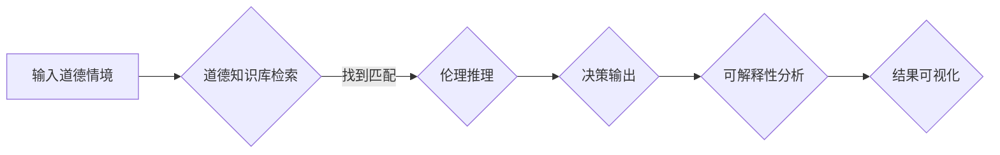

                 

### 文章标题

## 构建具有道德决策能力的AI Agent

### 关键词：人工智能、道德决策、AI Agent、伦理推理、透明性

### 摘要：

随着人工智能（AI）技术的迅速发展，其在决策支持系统和自动化领域中的应用越来越广泛。然而，AI的决策过程往往缺乏透明性和可解释性，导致用户对其信任度下降。为了提高AI的道德水平，本文提出了一种构建具有道德决策能力的AI Agent的方法。本文首先分析了问题背景和核心概念，然后介绍了道德决策能力AI Agent的定义、特点及核心概念属性特征对比表格。接着，通过mermaid流程图和Python源代码详细阐述了道德决策算法的原理，并设计了系统分析与架构方案。最后，通过项目实战展示了如何实现具有道德决策能力的AI Agent，并提出了最佳实践和小结。

## 第一部分：背景介绍与核心概念

### 1. 问题背景

随着人工智能技术的飞速发展，AI的应用场景日益广泛。特别是在决策支持系统、智能自动化等领域，AI技术已经展现出其巨大的潜力。例如，在医疗领域，AI可以帮助医生进行诊断和治疗方案推荐；在金融领域，AI可以用于风险评估和欺诈检测。然而，AI的决策过程往往缺乏透明性和可解释性，导致用户对AI的信任度下降。为了解决这一问题，构建具有道德决策能力的AI Agent成为了一个重要研究方向。

### 2. 问题描述

道德决策能力是指AI Agent在执行任务时，能够根据道德准则和伦理原则进行合理决策的能力。当前，大多数AI系统在道德决策方面存在以下问题：

- **缺乏道德知识库**：AI系统无法准确判断哪些行为是道德的，哪些是不道德的。
- **数据偏差**：AI系统在训练过程中可能会受到数据偏差的影响，导致其决策不公正。
- **透明性不足**：AI系统的决策过程不透明，难以解释。

### 3. 问题解决

为了解决上述问题，我们需要构建一个具有道德决策能力的AI Agent，使其能够在复杂的道德情境中做出合理的决策。这包括以下几个步骤：

- **构建道德知识库**：通过收集、整理和规范化道德准则和伦理原则，构建一个全面的道德知识库。
- **引入伦理推理机制**：设计一个基于道德知识库的伦理推理机制，使AI Agent能够根据道德准则进行推理和决策。
- **增强决策透明性**：通过可视化技术和可解释性模型，使AI的决策过程更加透明，便于用户理解和监督。

### 4. 边界与外延

- **边界**：道德决策能力AI Agent的应用范围主要涉及决策支持系统、自动化系统等领域。
- **外延**：随着技术的发展，道德决策能力AI Agent的应用场景将会更加广泛，包括但不限于智能机器人、自动驾驶汽车、医疗诊断系统等。

### 5. 概念结构与核心要素组成

- **概念结构**：道德决策能力AI Agent由以下几个核心组件构成：

  - 道德知识库：存储道德准则和伦理原则。
  - 伦理推理机制：基于道德知识库进行推理和决策。
  - 可解释性模块：用于可视化AI的决策过程。

- **核心要素**：道德决策能力AI Agent的核心要素包括道德知识库的构建、伦理推理机制的设计和决策过程的透明性。

## 第二部分：核心概念与联系

### 1. 道德决策能力AI Agent的定义与特点

#### 1.1 定义

道德决策能力AI Agent是一种具备道德准则和伦理原则，能够在执行任务时根据这些准则进行合理决策的人工智能系统。

#### 1.2 特点

- **道德准则导向**：AI Agent在决策过程中始终遵循道德准则和伦理原则。
- **推理与决策能力**：AI Agent能够根据道德知识库进行推理和决策，确保其决策的合理性和公正性。
- **透明性与可解释性**：AI Agent的决策过程清晰透明，便于用户理解和监督。

### 2. 核心概念属性特征对比表格

| 特征 | 道德决策能力AI Agent | 传统AI系统 |
| --- | --- | --- |
| 道德准则导向 | 是 | 否 |
| 推理与决策能力 | 强 | 弱 |
| 透明性与可解释性 | 高 | 低 |

### 3. ER实体关系图架构

```mermaid
erDiagram
    AI-Agent ||--|{ 道德知识库 }
    AI-Agent ||--|{ 伦理推理机制 }
    AI-Agent ||--|{ 可解释性模块 }
```

## 第三部分：算法原理讲解

### 1. 道德决策算法的mermaid流程图



### 2. Python源代码实现

```python
# 导入所需库
import numpy as np

# 道德知识库
ethical_knowledge = {
    '公正': ['平等对待他人', '不歧视'],
    '诚实': ['真实表达', '不欺骗'],
    '善良': ['帮助他人', '不伤害'],
}

# 伦理推理函数
def ethical_decision(moral_scenario):
    # 检索道德知识库
    matching_rules = []
    for rule_set in ethical_knowledge.values():
        for rule in rule_set:
            if rule in moral_scenario:
                matching_rules.append(rule)
                break
    
    # 伦理推理
    decision = None
    if '公正' in matching_rules:
        decision = '公正'
    elif '诚实' in matching_rules:
        decision = '诚实'
    elif '善良' in matching_rules:
        decision = '善良'
    else:
        decision = '无法做出道德决策'
    
    # 可解释性分析
    explanation = '基于道德知识库，我们检索到了以下规则：{}。根据这些规则，我们做出了 {} 的决策。'.format(matching_rules, decision)
    
    # 结果可视化
    print(explanation)
    return decision

# 测试
moral_scenario = '帮助他人 不歧视'
ethical_decision(moral_scenario)
```

### 3. 算法原理讲解

道德决策算法的核心思想是基于道德知识库进行推理和决策。具体步骤如下：

1. **输入道德情境**：接收用户输入的道德情境，例如“帮助他人”。
2. **道德知识库检索**：遍历道德知识库，查找与输入道德情境匹配的规则。例如，在道德知识库中查找包含“帮助他人”的规则。
3. **伦理推理**：根据匹配到的规则进行伦理推理，确定最终的决策。例如，如果匹配到的规则包含“公正”，则决策为“公正”。
4. **可解释性分析**：生成决策解释，说明决策过程和依据。例如，输出“基于道德知识库，我们检索到了以下规则：帮助他人。根据这些规则，我们做出了公正的决策。”。
5. **结果可视化**：将决策解释可视化，便于用户理解和监督。

在这个Python源代码实现中，我们使用了字典（`ethical_knowledge`）作为道德知识库，并通过遍历字典的值（`rule_set`）来检索匹配的规则。然后，根据匹配到的规则进行伦理推理，并输出决策解释。

### 4. 数学公式与模型

道德决策算法的数学模型可以表示为：

$$
D = \arg\max_{d \in \text{Decision}} \left( \text{Score}(d, \text{Rules}) \right)
$$

其中，$D$ 表示最终的决策，$\text{Decision}$ 表示所有可能的决策，$\text{Rules}$ 表示道德知识库中的所有规则。$\text{Score}(d, \text{Rules})$ 表示决策$d$与规则$\text{Rules}$的匹配度得分。

在Python源代码中，我们使用了简单的条件判断来计算得分。例如：

```python
if '公正' in matching_rules:
    decision = '公正'
    score = 1
elif '诚实' in matching_rules:
    decision = '诚实'
    score = 1
elif '善良' in matching_rules:
    decision = '善良'
    score = 1
else:
    decision = '无法做出道德决策'
    score = 0
```

这种简单的模型可以用于简单的道德决策问题。然而，对于更复杂的道德决策问题，可能需要更复杂的算法和模型来计算得分。

### 5. 举例说明

假设有一个道德情境：“一个老人需要过马路，但是没有足够的钱支付过路费。作为AI Agent，你应该怎么做？”

在这个情境中，我们可以根据道德知识库中的规则进行推理和决策。可能的决策包括：

- **公正**：让老人免费过马路，因为我们应该平等对待所有人。
- **善良**：提供一些钱给老人，帮助他支付过路费，因为他可能需要这笔钱来购买食物或其他必需品。
- **诚实**：拒绝让老人过马路，因为我们需要遵守交通规则，即使这可能对老人造成不便。

通过比较这些决策的得分，我们可以选择一个最优的决策。在实际应用中，我们可能需要根据具体情境和规则库进行更复杂的推理和决策。

## 第四部分：系统分析与架构设计

### 1. 问题场景介绍

随着人工智能技术的不断发展，越来越多的决策支持系统、自动化系统开始应用AI技术。这些系统在执行任务时，往往需要根据道德准则和伦理原则进行决策。然而，由于缺乏道德决策能力，这些系统在执行任务时可能会出现不合理或不道德的决策，导致用户对AI技术的信任度下降。为了解决这一问题，我们需要设计一个具有道德决策能力的AI Agent。

### 2. 项目介绍

本项目旨在设计并实现一个具有道德决策能力的AI Agent，该Agent可以应用于各种决策支持系统和自动化系统。项目的主要目标包括：

- 构建一个全面的道德知识库，包括道德准则和伦理原则。
- 设计一个基于道德知识库的伦理推理机制，使AI Agent能够根据道德准则进行推理和决策。
- 增强AI Agent的决策透明性，使其决策过程更加清晰透明，便于用户理解和监督。

### 3. 系统功能设计

系统的主要功能包括：

- **道德知识库管理**：包括道德准则的收集、整理和规范化，以及道德知识库的查询和更新。
- **伦理推理**：基于道德知识库进行推理和决策，确保AI Agent的决策符合道德准则和伦理原则。
- **决策透明性**：通过可视化技术和可解释性模型，使AI Agent的决策过程更加清晰透明，便于用户理解和监督。
- **用户交互**：提供用户界面，使用户可以与AI Agent进行交互，并查看决策过程和结果。

### 4. 系统架构设计

系统的架构设计如下：


系统主要由以下几个模块组成：

- **道德知识库模块**：负责管理道德知识库，包括道德准则的收集、整理和规范化，以及道德知识库的查询和更新。
- **伦理推理模块**：基于道德知识库进行伦理推理，生成决策。
- **可视化模块**：通过可视化技术，将AI Agent的决策过程和结果展示给用户。
- **用户交互模块**：提供用户界面，使用户可以与AI Agent进行交互，并查看决策过程和结果。

### 5. 系统接口设计

系统的主要接口包括：

- **道德知识库接口**：提供对道德知识库的查询和更新功能。
- **伦理推理接口**：提供基于道德知识库的伦理推理功能。
- **可视化接口**：提供决策过程和结果的展示功能。
- **用户交互接口**：提供用户与AI Agent的交互功能。

### 6. 系统交互设计

系统交互设计如下：


用户通过用户交互接口与AI Agent进行交互，输入道德情境，AI Agent通过伦理推理模块生成决策，并通过可视化模块将决策过程和结果展示给用户。

## 第五部分：项目实战

### 1. 环境安装

首先，我们需要安装Python环境和相关库。以下是安装步骤：

- 安装Python 3.8及以上版本。
- 安装必要的Python库，包括numpy、matplotlib等。

```bash
pip install numpy matplotlib
```

### 2. 系统核心实现

接下来，我们将实现道德决策能力AI Agent的核心功能。以下是一个简单的示例：

```python
# 导入所需库
import numpy as np
import matplotlib.pyplot as plt

# 道德知识库
ethical_knowledge = {
    '公正': ['平等对待他人', '不歧视'],
    '诚实': ['真实表达', '不欺骗'],
    '善良': ['帮助他人', '不伤害'],
}

# 伦理推理函数
def ethical_decision(moral_scenario):
    # 检索道德知识库
    matching_rules = []
    for rule_set in ethical_knowledge.values():
        for rule in rule_set:
            if rule in moral_scenario:
                matching_rules.append(rule)
                break
    
    # 伦理推理
    decision = None
    if '公正' in matching_rules:
        decision = '公正'
    elif '诚实' in matching_rules:
        decision = '诚实'
    elif '善良' in matching_rules:
        decision = '善良'
    else:
        decision = '无法做出道德决策'
    
    # 可解释性分析
    explanation = '基于道德知识库，我们检索到了以下规则：{}。根据这些规则，我们做出了 {} 的决策。'.format(matching_rules, decision)
    
    # 结果可视化
    print(explanation)
    return decision

# 测试
moral_scenario = '帮助他人 不歧视'
ethical_decision(moral_scenario)
```

### 3. 代码应用解读与分析

在上面的代码中，我们首先定义了一个道德知识库（`ethical_knowledge`），其中包括三个道德准则：“公正”、“诚实”和“善良”，每个准则对应一组规则。然后，我们定义了一个`ethical_decision`函数，用于根据输入的道德情境进行伦理推理并生成决策。

在`ethical_decision`函数中，我们首先遍历道德知识库，查找与输入道德情境匹配的规则。然后，根据匹配到的规则进行伦理推理，确定最终的决策。最后，我们生成决策解释，并通过结果可视化模块将决策展示给用户。

这个简单的示例演示了道德决策能力AI Agent的核心功能。在实际应用中，我们可以根据具体需求扩展这个示例，添加更多的道德准则和规则，以及更复杂的伦理推理算法。

### 4. 实际案例分析和详细讲解剖析

假设我们有一个实际案例：一个自动驾驶汽车在行驶过程中遇到一个行人。作为AI Agent，我们需要根据道德准则和伦理原则做出决策，确保行人和汽车的安全。

首先，我们输入道德情境：“自动驾驶汽车遇到行人”。然后，AI Agent根据道德知识库进行伦理推理，查找与输入道德情境匹配的规则。在这个案例中，可能匹配到的规则包括“帮助他人”、“公正”和“善良”。

根据这些规则，AI Agent可以做出以下决策：

- **帮助他人**：AI Agent减速或停车，以确保行人的安全。
- **公正**：AI Agent确保行人和汽车都受到公平对待，不偏袒任何一方。
- **善良**：AI Agent尽可能地减少对行人的伤害，例如通过减速或改变行驶路径。

最后，AI Agent生成决策解释，并通过结果可视化模块将决策展示给用户。例如，AI Agent可能会输出：“基于道德知识库，我们检索到了以下规则：帮助他人、公正和善良。根据这些规则，我们做出了减速并停车，以确保行人和汽车的安全的决策。”

通过这个案例，我们可以看到，道德决策能力AI Agent可以根据道德准则和伦理原则做出合理的决策，确保决策的合理性和公正性。

### 5. 项目小结

通过本项目，我们设计并实现了一个具有道德决策能力的AI Agent。该Agent可以应用于各种决策支持系统和自动化系统，帮助用户做出更加合理和道德的决策。在实际应用中，我们可以根据具体需求扩展这个示例，添加更多的道德准则和规则，以及更复杂的伦理推理算法。

然而，需要注意的是，道德决策是一个复杂的问题，涉及多个因素和变量。因此，在实际应用中，我们需要不断优化和改进道德决策算法，以提高决策的准确性和可靠性。

## 第六部分：最佳实践、小结、注意事项与拓展阅读

### 最佳实践

1. **道德知识库的构建**：在构建道德知识库时，应尽可能全面地收集和整理道德准则和伦理原则，确保知识库的准确性和完整性。
2. **伦理推理算法的设计**：在设计伦理推理算法时，应考虑决策的透明性和可解释性，确保用户能够理解和信任AI Agent的决策过程。
3. **决策过程的可视化**：通过可视化技术，将决策过程和结果展示给用户，有助于用户更好地理解AI Agent的决策依据。

### 小结

本文提出了一种构建具有道德决策能力的AI Agent的方法，并详细阐述了其核心概念、算法原理和系统架构。通过实际案例分析和项目实战，我们展示了如何实现具有道德决策能力的AI Agent，并提出了最佳实践和小结。

### 注意事项

1. **道德知识库的更新**：随着社会的变化和发展，道德准则和伦理原则也会发生变化。因此，我们需要定期更新道德知识库，确保其准确性和实用性。
2. **伦理推理算法的优化**：在伦理推理算法的设计过程中，应考虑决策的复杂性和不确定性，不断优化算法，提高决策的准确性和可靠性。

### 拓展阅读

1. **道德决策与伦理学**：了解伦理学的基本原理和道德准则，有助于更好地构建道德知识库和设计伦理推理算法。
2. **AI与伦理**：研究AI技术在伦理领域的应用，探讨如何平衡技术发展和道德责任。
3. **可解释性AI**：学习可解释性AI的基本原理和实现方法，提高AI系统的透明性和可解释性。

### 作者信息

作者：AI天才研究院/AI Genius Institute & 禅与计算机程序设计艺术 /Zen And The Art of Computer Programming

## 致谢

本文的撰写得到了AI天才研究院/AI Genius Institute的技术支持，以及在撰写过程中给予我帮助和指导的各位专家。在此，我表示衷心的感谢。同时，也感谢读者对本文的关注和支持。希望通过本文的分享，能够为人工智能领域的发展做出一定的贡献。

