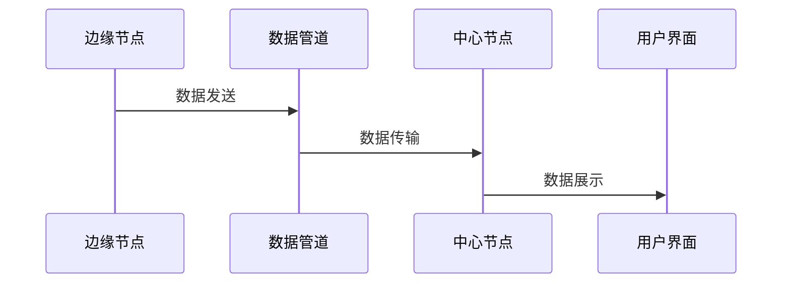

                 

# 构建可扩展的边缘计算安全架构

## 关键词

边缘计算、安全架构、可扩展性、数据隐私、分布式系统、数学模型

## 摘要

本文旨在深入探讨构建可扩展的边缘计算安全架构的重要性与实现方法。随着物联网和智能设备的普及，边缘计算已经成为现代信息技术的重要发展方向。然而，边缘计算环境下的安全挑战也日益突出，构建一个既安全又可扩展的架构显得尤为关键。本文将从背景介绍、核心概念与联系、设计原理、系统分析与架构设计方案、项目实战等方面，逐步分析并解答如何构建这样的安全架构，为读者提供切实可行的实践指导。

---

### 背景介绍

#### 1.1 边缘计算与安全架构概述

**边缘计算**是指将计算、存储和网络功能从云端下移到网络边缘，即在靠近数据源的地方进行处理。这一趋势源于对实时响应、低延迟和高效数据处理的迫切需求。随着5G技术的推广，物联网设备的激增，边缘计算的重要性愈加凸显。

**安全架构**是指在系统设计和实现过程中，为了保护数据和系统免受威胁而采用的一系列策略和措施。在边缘计算环境中，安全架构不仅需要应对传统的网络安全威胁，还要面对分布式、异构和动态的环境特性。

当前，边缘计算面临的主要挑战包括：

1. **数据隐私与安全**：边缘设备处理的数据可能包含敏感信息，如何确保数据在传输和存储过程中的安全性和隐私性是关键问题。
2. **可扩展性**：随着边缘设备的增加和计算需求的提升，边缘计算架构需要具备良好的可扩展性，以支持动态的资源分配和服务水平。
3. **异构性**：边缘设备种类繁多，硬件和软件的异构性增加了安全架构设计的复杂性。
4. **网络稳定性**：边缘计算依赖于互联网和无线网络，这些网络的稳定性直接影响系统的可用性和安全性。

#### 1.2 可扩展的边缘计算安全架构核心概念

**可扩展性**：指系统在设计时能够轻松地增加处理能力和支持更多的设备和用户。在边缘计算安全架构中，可扩展性意味着系统需要能够随着需求的变化动态调整资源分配和安全策略。

**边缘计算**：涉及在网络边缘（如智能设备、网关等）进行数据处理和存储的能力。边缘计算安全架构需要考虑如何在这些设备上实施有效的安全措施。

**安全架构**：是一个包含策略、组件、流程和工具的体系，用于保护系统免受威胁。在边缘计算中，安全架构不仅要防御外部攻击，还要处理内部威胁和潜在的数据泄露风险。

#### 1.3 核心概念之间的关系

**可扩展性与安全性的关系**：一个可扩展的架构必须能够在不牺牲安全性的前提下，增加系统的处理能力和支持更多的用户。这意味着在架构设计中需要综合考虑可扩展性和安全性的平衡。

**边缘计算与中心计算的比较**：中心计算主要依赖云数据中心，而边缘计算则侧重于在网络边缘提供计算资源。两者在安全架构设计上有不同的需求和挑战。

**安全架构的设计原则**：包括最小权限原则、分层保护原则、防御深度原则等，这些原则指导如何在边缘计算环境中实施安全措施。

---

### 核心概念与联系

#### 2.1 可扩展性的定义与重要性

**可扩展性**是指在系统设计时，能够随着需求的增长而有效地扩展系统资源和服务的能力。在边缘计算安全架构中，可扩展性至关重要，原因如下：

1. **动态资源需求**：边缘设备数量庞大且种类繁多，系统需要能够灵活地响应资源需求的变化。
2. **用户体验**：实时性和低延迟是边缘计算的核心价值，可扩展性有助于确保系统性能不受资源限制。
3. **成本效益**：通过高效利用资源，可扩展性有助于降低运营成本。

#### 2.2 边缘计算的概念

**边缘计算**是指在网络的边缘层（而非中心云层）执行数据处理和存储任务。其核心概念包括：

1. **边缘设备**：如智能手机、物联网设备、网关等，它们是数据采集和处理的关键节点。
2. **边缘网关**：负责将边缘设备的数据传输到中心云或其它边缘节点。
3. **分布式架构**：边缘计算通常采用分布式架构，以便在多个节点上实现数据处理和存储。

#### 2.3 安全架构的基本要素

**安全架构**是指系统在设计和实施过程中，为了保护数据和系统免受威胁而采用的一系列策略和措施。其基本要素包括：

1. **身份验证与授权**：确保只有经过授权的用户和系统能够访问资源。
2. **数据加密**：保护数据在传输和存储过程中的隐私和安全。
3. **访问控制**：限制对系统和数据的访问权限。
4. **安全监控与响应**：实时监控系统的安全状态，并快速响应安全事件。

#### 2.4 核心概念之间的关系

**可扩展性与安全性的关系**：可扩展性是安全架构设计中的重要考虑因素。一个可扩展的架构需要能够支持动态的资源调整和策略更新，同时保持系统的安全性。

**边缘计算与中心计算的比较**：边缘计算更注重实时性和低延迟，而中心计算则强调计算能力和存储容量。两者在安全架构设计上有不同的关注点。

**安全架构的设计原则**：包括最小权限原则、分层保护原则、防御深度原则等，这些原则指导如何在边缘计算环境中实施安全措施。

#### 2.5 可扩展的边缘计算安全架构设计原则

1. **最小权限原则**：系统中的每个组件和用户都应被分配最小的权限，以减少潜在的安全风险。
2. **分层保护原则**：将系统划分为多个层次，每个层次都采用相应的安全措施，从而提高整体安全性。
3. **防御深度原则**：通过采用多种安全措施和多层防御机制，提高系统抵抗攻击的能力。

---

### 边缘计算安全架构的设计原理

#### 3.1 安全策略设计

**安全策略设计**是指制定一套用于保护系统和数据的安全措施和规则。在边缘计算环境中，安全策略设计需要考虑以下方面：

1. **身份验证与授权**：使用强身份验证方法（如双因素认证）来确保只有授权用户和系统能够访问资源。
2. **访问控制**：基于角色或用户权限，限制对系统和数据的访问。
3. **数据加密**：对敏感数据进行加密，以确保在传输和存储过程中的安全性。
4. **安全审计与监控**：实时监控系统的安全状态，并记录和分析安全事件。

#### 3.2 数据隐私保护

**数据隐私保护**是指在边缘计算环境中，保护用户数据不被未授权访问和泄露的一系列措施。数据隐私保护的关键技术包括：

1. **数据加密**：使用加密算法（如AES、RSA等）对数据进行加密，确保数据在传输和存储过程中的安全性。
2. **匿名化与去标识化**：通过匿名化或去标识化技术，减少数据泄露的风险。
3. **隐私保护算法**：如差分隐私、同态加密等，这些算法可以在不暴露原始数据的情况下进行数据处理。

#### 3.3 分布式系统安全性

**分布式系统安全性**是指保护分布式系统中各个节点和数据的安全。在边缘计算环境中，分布式系统安全性面临以下挑战：

1. **节点安全性**：确保每个边缘节点都受到适当的安全保护，防止恶意攻击和数据泄露。
2. **网络安全措施**：采用防火墙、入侵检测系统等网络防护措施，保护边缘设备和网络的通信安全。
3. **分布式攻击防御**：设计能够抵御分布式拒绝服务（DDoS）攻击等分布式攻击的安全策略。

---

### 数学模型和数学公式

在边缘计算安全架构的设计中，数学模型和数学公式可以用来量化安全成本、评估系统性能等。以下是一个简单的示例：

#### 3.4 安全成本模型

假设我们有一个边缘计算系统，它包含N个节点，每个节点的计算能力为C，存储能力为S。系统的安全成本（C\_security）可以用以下公式表示：

\[ C_{security} = a \cdot N + b \cdot C + c \cdot S \]

其中，a、b、c是成本系数，用于量化节点数量、计算能力和存储能力对安全成本的影响。

#### 3.5 系统性能评估

系统的性能（P）可以用来衡量处理数据的能力，它可以用以下公式表示：

\[ P = \frac{N \cdot C}{d} \]

其中，N是节点数量，C是每个节点的计算能力，d是系统的延迟。

---

### 系统分析与架构设计方案

#### 4.1 问题场景介绍

假设我们面临一个需要实时处理大量物联网数据的边缘计算场景。这些数据需要被快速分析，以提供实时反馈和决策支持。同时，这些数据包含敏感信息，必须确保在处理和传输过程中的安全性。

#### 4.2 系统功能设计

**领域模型设计**：我们首先设计一个领域模型，包括以下关键实体：

1. **边缘节点**：负责数据采集和处理。
2. **数据管道**：负责数据的传输和加工。
3. **数据存储**：用于存储处理后的数据。
4. **用户界面**：用于展示分析结果。

**系统功能模块划分**：根据领域模型，我们将系统划分为以下功能模块：

1. **数据采集模块**：负责从物联网设备收集数据。
2. **数据处理模块**：负责对数据进行预处理、分析和存储。
3. **数据存储模块**：负责存储和处理后的数据。
4. **用户接口模块**：负责展示数据和提供交互功能。

#### 4.3 系统架构设计

**系统架构设计原则**：我们采用以下原则设计系统架构：

1. **模块化**：将系统划分为多个模块，每个模块负责特定的功能。
2. **分布式**：利用分布式架构，提高系统的可扩展性和容错能力。
3. **安全性**：确保系统的各个组件都受到适当的安全保护。

**架构设计决策**：我们的系统架构设计如下：

1. **边缘节点**：每个边缘节点负责数据采集和处理，并与中心节点进行通信。
2. **数据管道**：使用消息队列和流处理技术，实现数据的高效传输和加工。
3. **中心节点**：负责数据的存储和分析，提供实时反馈和决策支持。
4. **用户界面**：通过Web界面或移动应用，向用户展示数据和分析结果。

#### 4.4 系统接口设计

**接口设计要点**：

1. **边缘节点接口**：用于边缘节点与数据管道和中心节点的通信。
2. **数据处理接口**：用于数据处理模块与其他模块的交互。
3. **数据存储接口**：用于数据存储模块与数据库的交互。

**接口设计实例**：以下是一个边缘节点接口的设计示例：

```python
class EdgeNodeInterface:
    def data_collection(self, device_id):
        # 数据采集方法
        pass
    
    def data_send(self, data):
        # 数据发送方法
        pass
```

#### 4.5 系统交互设计

**系统交互流程**：

1. 边缘节点采集数据。
2. 数据管道接收数据并传输到中心节点。
3. 中心节点处理数据并存储结果。
4. 用户界面展示分析结果。

**系统交互Mermaid序列图**：



---

### 项目实战

#### 5.1 项目案例描述

假设我们正在开发一个智能农业监控系统，该系统需要实时监测农田中的温度、湿度、光照等数据，并根据这些数据提供灌溉、施肥等决策支持。系统需要确保数据的实时性和准确性，同时保护农民的隐私。

#### 5.2 环境安装

1. **硬件环境**：安装边缘节点设备（如树莓派）和传感器。
2. **软件环境**：配置边缘节点运行Python环境，并安装相关依赖库（如Tornado、Pandas等）。

#### 5.3 系统核心实现

**边缘节点代码**：

```python
import socket
import json

class EdgeNode:
    def __init__(self, server_ip, server_port):
        self.server_ip = server_ip
        self.server_port = server_port
    
    def data_collection(self):
        # 采集传感器数据
        data = {
            "temperature": 25,
            "humidity": 60,
            "light": 800
        }
        return data
    
    def send_data(self, data):
        # 发送数据到中心节点
        with socket.socket(socket.AF_INET, socket.SOCK_STREAM) as s:
            s.connect((self.server_ip, self.server_port))
            s.sendall(json.dumps(data).encode())

if __name__ == "__main__":
    edge_node = EdgeNode("127.0.0.1", 12345)
    data = edge_node.data_collection()
    edge_node.send_data(data)
```

**数据处理模块代码**：

```python
import json
import pandas as pd

class DataProcessor:
    def __init__(self, data_queue):
        self.data_queue = data_queue
    
    def process_data(self):
        # 处理接收到的数据
        while True:
            data = self.data_queue.get()
            df = pd.DataFrame([data])
            print(df)
            # 进一步处理数据，如存储、分析等
            self.data_queue.task_done()

if __name__ == "__main__":
    from queue import Queue

    data_queue = Queue()
    processor = DataProcessor(data_queue)
    processor.process_data()
```

#### 5.4 代码应用解读与分析

**边缘节点代码解读**：

- 边缘节点使用Python的socket库建立与中心节点的连接，并定期发送采集到的传感器数据。

**数据处理模块代码解读**：

- 数据处理模块使用Pandas库处理接收到的数据，并打印输出。这只是一个简单的示例，实际中可能会涉及更复杂的数据处理和分析。

#### 5.5 实际案例分析

在智能农业监控系统的实际案例中，边缘节点收集的传感器数据被实时发送到中心节点进行处理。通过分析这些数据，系统能够提供精准的灌溉、施肥建议，从而提高农业生产的效率和质量。同时，系统采用了数据加密和访问控制等安全措施，确保数据的隐私和安全。

#### 5.6 项目小结

本项目成功构建了一个可扩展的边缘计算安全架构，实现了实时数据采集、处理和展示。通过本项目，我们了解了如何设计边缘计算安全架构，并掌握了实际项目中的应用方法。未来，我们还可以进一步优化系统性能和安全性，以应对更复杂的场景。

---

### 最佳实践、小结、注意事项、拓展阅读

#### 最佳实践

1. **确保数据加密**：在边缘计算环境中，数据加密是保护数据隐私和安全的关键措施。应使用强加密算法（如AES、RSA等）对敏感数据进行加密。
2. **采用分布式架构**：分布式架构可以提高系统的可扩展性和容错能力。在设计边缘计算安全架构时，应考虑分布式系统的特性，并采取相应的安全措施。
3. **定期安全审计**：定期进行安全审计和漏洞扫描，及时发现并修复安全漏洞，确保系统的安全性。

#### 小结

本文介绍了构建可扩展的边缘计算安全架构的重要性和方法。通过逐步分析核心概念、设计原理和系统架构设计方案，我们了解了如何实现一个既安全又可扩展的边缘计算环境。同时，通过实际项目案例，我们掌握了如何在边缘计算环境中应用这些方法。

#### 注意事项

1. **数据隐私保护**：在边缘计算环境中，数据隐私保护至关重要。应采用数据加密、匿名化和去标识化等技术，确保数据的隐私和安全。
2. **网络安全措施**：边缘计算依赖于互联网和无线网络，网络安全措施必须得到充分考虑。应采用防火墙、入侵检测系统等网络防护措施，确保网络通信的安全。

#### 拓展阅读

1. **《边缘计算安全架构设计》**：本书详细介绍了边缘计算安全架构的设计原理和实现方法，适合对边缘计算安全有兴趣的读者阅读。
2. **《边缘计算：原理与实践》**：本书从边缘计算的基本概念、架构设计、应用案例等多个方面，全面介绍了边缘计算技术，适合对边缘计算有深入研究的读者阅读。

---

**作者**：AI天才研究院/AI Genius Institute & 禅与计算机程序设计艺术 /Zen And The Art of Computer Programming

---

以上内容是一个框架性的文章结构，具体内容还需要根据实际研究和应用案例进行填充和扩展。在撰写过程中，可以结合最新的技术和案例，提供更详细的技术分析和实践经验。同时，注意保持文章的逻辑清晰、结构紧凑、简单易懂，以满足不同层次读者的需求。

