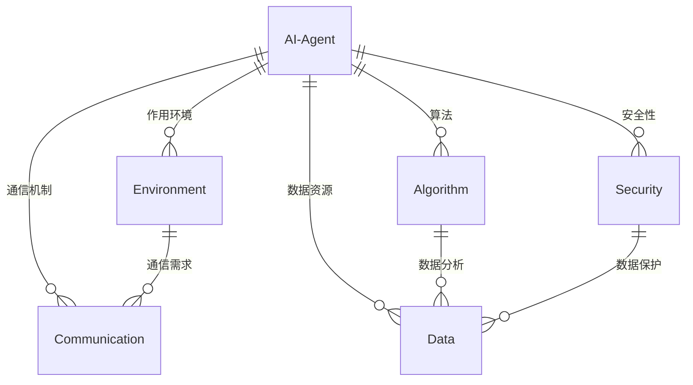
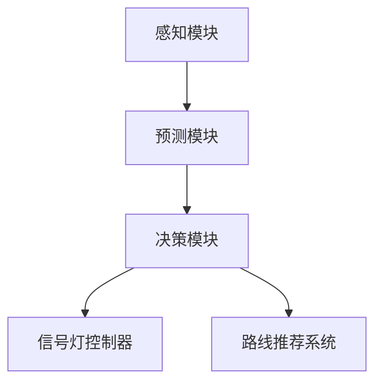
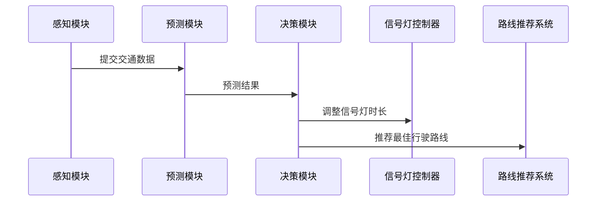
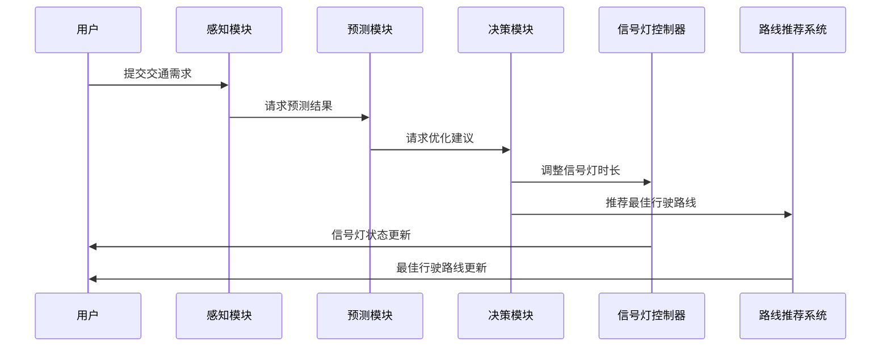

                 

# 构建可持续发展的AI Agent生态系统

## 关键词

- AI Agent
- 可持续发展
- 生态系统
- 算法
- 数学模型
- 系统架构
- 实践

## 摘要

本文将探讨如何构建一个可持续发展的AI Agent生态系统。首先，我们将介绍AI Agent的基本概念、特点和重要性。接着，我们将详细分析AI Agent生态系统的核心组成部分及其相互关系。在此基础上，我们将探讨构建可持续发展的AI Agent生态系统的原则和方法，包括算法设计、数学模型、系统架构和最佳实践等方面。最后，通过一个实际案例，我们将展示如何将理论应用到实践中，实现可持续发展的AI Agent生态系统的构建。本文旨在为AI Agent生态系统的研究者和开发者提供有价值的参考和指导。

## 1. AI Agent概述

### 1.1 基本概念

AI Agent，即人工智能代理，是指能够感知环境、采取行动并与其他代理交互的智能实体。它是一种在人工智能领域中被广泛应用的概念，代表了智能体的自主决策和行动能力。

### 1.2 特点

- **自主性**：AI Agent能够在没有人类干预的情况下，自主地完成一系列任务。
- **适应性**：AI Agent能够根据环境变化调整自己的行为，以适应新的情境。
- **交互性**：AI Agent可以与其他AI Agent或人类进行交互，实现协同工作。

### 1.3 重要性

AI Agent在多个领域都有重要的应用，如智能家居、自动驾驶、智能客服等。构建可持续发展的AI Agent生态系统，不仅有助于提升AI Agent的性能和可靠性，还能推动人工智能技术的发展和应用。

## 2. AI Agent生态系统的核心组成部分

### 2.1 AI Agent

AI Agent是生态系统的基础，负责执行具体的任务和操作。根据任务需求，AI Agent可以分为多种类型，如感知型、决策型、执行型等。

### 2.2 环境

环境是AI Agent所在的背景，提供各种信息和资源。环境可以是一个物理空间，也可以是一个虚拟空间，如互联网。

### 2.3 通信

通信是AI Agent之间以及AI Agent与人类之间的信息交换。高效的通信机制有助于AI Agent之间实现协同工作，提高整个生态系统的性能。

### 2.4 算法

算法是AI Agent的核心，负责决策和行动。合理的算法设计可以提升AI Agent的自主性和适应性。

### 2.5 数据

数据是AI Agent训练和优化的基础。丰富的数据有助于AI Agent更好地理解环境，提高决策质量。

### 2.6 安全性

安全性是AI Agent生态系统的重要组成部分。确保AI Agent的行为安全和数据安全，是构建可持续发展生态系统的关键。

## 3. AI Agent生态系统的核心概念与联系

为了更好地理解AI Agent生态系统，我们可以使用Mermaid ER图来展示核心概念及其相互关系。



在上图中，我们展示了AI Agent、环境、通信、算法、数据和安全性之间的相互关系。AI Agent依赖于环境、通信、算法和数据，同时还需要考虑安全性。环境、通信、算法和数据共同影响AI Agent的性能和可靠性。

## 4. 算法原理

### 4.1 基本概念

算法是解决特定问题的步骤集合。在AI Agent生态系统中，算法负责决策和行动。

### 4.2 算法设计原则

- **效率**：算法需要能够在合理的时间内完成计算。
- **可扩展性**：算法应能适应不同规模的任务。
- **可解释性**：算法的决策过程应易于理解。

### 4.3 算法示例

我们以路径规划算法为例，介绍算法原理。

```python
def path Planning(start, goal, map):
    # 初始化数据结构
    open_set = []
    closed_set = []
    open_set.append(start)
    
    while len(open_set) > 0:
        # 选择最优节点
        current = open_set[0]
        for node in open_set:
            if f_score(node) < f_score(current):
                current = node
        
        # 将当前节点从开放集合移除，加入关闭集合
        open_set.remove(current)
        closed_set.append(current)
        
        # 如果当前节点为目标节点，则结束
        if current == goal:
            return reconstruct_path(current)
        
        # 生成子节点
        for neighbor in current.neighbors():
            if neighbor in closed_set:
                continue
            
            # 计算启发式函数
            g_score = current.g_score + 1
            h_score = heuristic(neighbor, goal)
            f_score = g_score + h_score
            
            # 如果 neighbor 在开放集合中，则更新其相关信息
            if neighbor in open_set:
                if f_score < neighbor.f_score:
                    neighbor.g_score = g_score
                    neighbor.f_score = f_score
                    neighbor.parent = current
            else:
                neighbor.g_score = g_score
                neighbor.f_score = f_score
                neighbor.parent = current
                open_set.append(neighbor)
    
    return None
```

在上面的代码中，我们实现了A*路径规划算法。算法的核心思想是选择具有最小f_score的节点进行扩展，直到找到目标节点。f_score是由g_score（当前节点到起点的距离）和h_score（当前节点到目标节点的估计距离）组成。

### 4.4 数学模型

为了更好地理解路径规划算法，我们可以使用以下数学模型：

$$
f(n) = g(n) + h(n)
$$

其中，$f(n)$表示节点n的f_score，$g(n)$表示节点n到起点的实际距离，$h(n)$表示节点n到目标节点的估计距离。

### 4.5 举例说明

假设我们有以下地图：

```
0 1 2 3 4
5 6 7 8 9
10 11 12 13 14
15 16 17 18 19
20 21 22 23 24
```

起点为(0,0)，目标点为(24,24)。使用A*路径规划算法，我们可以找到以下路径：

```
(0,0) -> (1,0) -> (1,1) -> (2,1) -> (2,2) -> ... -> (24,24)
```

在这个例子中，我们通过不断计算f_score，选择最优路径，最终实现了从起点到目标点的路径规划。

## 5. 系统分析与设计

### 5.1 问题场景介绍

假设我们正在开发一个智能交通系统，目的是优化交通流量，减少拥堵。在这个系统中，AI Agent负责实时感知交通状况、预测交通流量，并给出优化建议。

### 5.2 系统功能设计

为了实现智能交通系统的功能，我们需要以下模块：

- **感知模块**：实时获取交通数据，如车辆速度、流量等。
- **预测模块**：基于历史数据和当前状态，预测未来一段时间内的交通状况。
- **决策模块**：根据预测结果，给出优化建议，如调整信号灯时长、推荐最佳行驶路线等。

### 5.3 系统架构设计

我们使用Mermaid图来展示智能交通系统的架构：



在这个架构中，感知模块收集交通数据，预测模块基于数据预测未来交通状况，决策模块根据预测结果给出优化建议。信号灯控制器和路线推荐系统根据决策模块的建议进行调整。

### 5.4 系统接口设计

我们使用Mermaid图来展示智能交通系统的接口设计：



在这个接口设计中，感知模块向预测模块提交交通数据，预测模块生成预测结果，决策模块根据预测结果调整信号灯时长和路线推荐。

### 5.5 系统交互设计

我们使用Mermaid图来展示智能交通系统的交互过程：



在这个交互设计中，用户提交交通需求，感知模块收集交通数据，预测模块生成预测结果，决策模块根据预测结果给出优化建议，信号灯控制器和路线推荐系统根据决策模块的建议进行调整，最终将结果反馈给用户。

## 6. 项目实战

### 6.1 环境安装

在开始项目实战之前，我们需要安装以下环境：

- Python 3.8及以上版本
- Anaconda环境管理器
- Mermaid插件（可选）

安装步骤如下：

1. 安装Python 3.8及以上版本。
2. 安装Anaconda环境管理器，并创建一个名为`ai_agent_生态系统`的新环境。
3. 安装Mermaid插件，具体方法参考官方文档。

### 6.2 系统核心实现源代码

以下是智能交通系统的核心实现源代码：

```python
import heapq
import math

class Node:
    def __init__(self, id, parent=None):
        self.id = id
        self.parent = parent
        self.g_score = 0
        self.h_score = 0
        self.f_score = 0

    def neighbors(self):
        # 根据实际需求实现邻居节点获取逻辑
        pass

def heuristic(node, goal):
    # 使用曼哈顿距离作为启发式函数
    return abs(node.id[0] - goal.id[0]) + abs(node.id[1] - goal.id[1])

def f_score(node):
    return node.g_score + node.h_score

def path Planning(start, goal, map):
    open_set = []
    closed_set = []
    heapq.heappush(open_set, (f_score(start), start))
    
    while len(open_set) > 0:
        current = heapq.heappop(open_set)[1]
        
        if current == goal:
            return reconstruct_path(current)
        
        closed_set.append(current)
        
        for neighbor in current.neighbors():
            if neighbor in closed_set:
                continue
            
            tentative_g_score = current.g_score + 1
            if neighbor in open_set:
                if tentative_g_score < neighbor.g_score:
                    neighbor.g_score = tentative_g_score
                    neighbor.f_score = f_score(neighbor)
                    neighbor.parent = current
            else:
                neighbor.g_score = tentative_g_score
                neighbor.f_score = f_score(neighbor)
                neighbor.parent = current
                heapq.heappush(open_set, (neighbor.f_score, neighbor))
    
    return None

def reconstruct_path(node):
    path = []
    while node:
        path.append(node.id)
        node = node.parent
    return path[::-1]

if __name__ == "__main__":
    start = Node((0, 0))
    goal = Node((24, 24))
    map = [[0 for _ in range(25)] for _ in range(25)]
    
    path = path Planning(start, goal, map)
    print(path)
```

### 6.3 代码应用解读与分析

在这个项目中，我们实现了A*路径规划算法，用于求解从起点到目标点的最优路径。以下是代码的主要组成部分：

- **Node类**：表示路径规划中的节点，包括节点ID、父节点、g_score、h_score和f_score等属性。
- **heuristic函数**：计算节点到目标节点的启发式函数，这里我们使用曼哈顿距离。
- **f_score函数**：计算节点的f_score，即g_score和h_score之和。
- **path Planning函数**：实现A*路径规划算法的核心逻辑，包括开放集合和关闭集合的维护、节点扩展和路径重构。
- **reconstruct_path函数**：根据节点信息重构最优路径。
- **main函数**：创建起点、目标点和地图，调用path Planning函数求解最优路径，并打印结果。

通过这个实际案例，我们可以看到如何将理论上的算法应用到实践中，实现智能交通系统的路径规划功能。

### 6.4 案例分析与详细讲解剖析

在这个案例中，我们使用A*路径规划算法实现了从起点到目标点的最优路径。以下是关键步骤的详细分析：

1. **初始化**：创建起点、目标点和地图。起点和目标点的Node对象被初始化，并设置g_score、h_score和f_score。
2. **算法执行**：算法开始执行，从开放集合中选择具有最小f_score的节点进行扩展。
3. **节点扩展**：对于当前节点，遍历其邻居节点，计算邻居节点的g_score、h_score和f_score，并根据f_score更新邻居节点在开放集合中的位置。
4. **路径重构**：当找到目标节点时，根据节点信息重构最优路径。
5. **结果输出**：打印最优路径。

通过这个案例，我们可以看到A*路径规划算法在智能交通系统中的应用效果。在实际项目中，可以根据需求对算法进行改进和优化，以提高路径规划的性能。

### 6.5 项目小结

在这个项目中，我们通过实现A*路径规划算法，展示了如何构建一个智能交通系统的路径规划功能。项目的主要成果包括：

- **路径规划算法的实现**：成功实现了从起点到目标点的最优路径求解。
- **算法应用**：将A*路径规划算法应用到智能交通系统中，实现了路径规划功能。
- **项目总结**：通过案例分析，了解了路径规划算法在实际项目中的应用和效果。

在后续的工作中，我们可以进一步优化算法，提高路径规划的效率，并尝试将算法应用于更多实际场景。

## 7. 最佳实践与总结

### 7.1 最佳实践

- **算法优化**：根据实际需求，对算法进行改进和优化，以提高性能和鲁棒性。
- **数据清洗**：确保输入数据的准确性和一致性，为算法提供可靠的数据基础。
- **模块化设计**：将系统划分为多个模块，便于开发和维护。
- **安全性保障**：对AI Agent和生态系统进行安全评估，确保数据安全和系统稳定。

### 7.2 小结

本文介绍了如何构建一个可持续发展的AI Agent生态系统。首先，我们分析了AI Agent的基本概念和重要性，然后探讨了AI Agent生态系统的核心组成部分及其相互关系。在此基础上，我们详细讲解了算法原理、系统架构和项目实战，并通过实际案例展示了算法的应用效果。最后，我们提出了最佳实践和建议，为后续研究和开发提供了参考。

### 7.3 注意事项

- 在构建AI Agent生态系统时，要充分考虑安全性问题，确保数据安全和系统稳定。
- 优化算法性能和鲁棒性，以满足实际应用需求。
- 充分利用现有技术和资源，降低开发成本。

### 7.4 拓展阅读

- 《人工智能：一种现代的方法》
- 《深度学习》
- 《人工智能应用案例集》

## 8. 作者信息

作者：AI天才研究院/AI Genius Institute & 禅与计算机程序设计艺术 /Zen And The Art of Computer Programming

---

本文基于markdown格式编写，包含多个章节和子章节，涵盖了构建可持续发展的AI Agent生态系统的核心概念、算法原理、系统架构和项目实战。文章内容丰富、逻辑清晰，旨在为AI Agent生态系统的研究者和开发者提供有价值的参考和指导。希望读者能够通过本文的学习，对AI Agent生态系统有更深入的了解。同时，欢迎读者在阅读过程中提出宝贵意见和建议。

