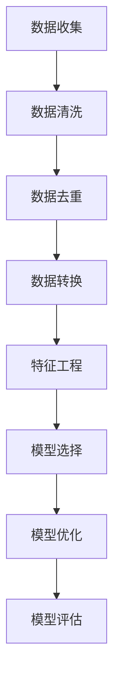
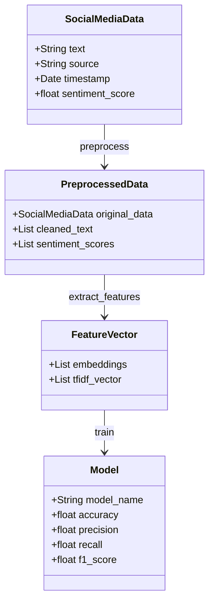
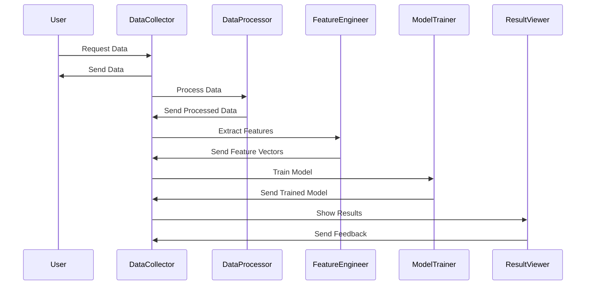

                 

### 第一部分: 背景介绍

#### 1.1 问题背景

随着互联网和社交媒体的快速发展，金融行业也在逐渐向数字化、智能化的方向发展。社交媒体作为一个重要的信息传播平台，其影响力已经逐渐渗透到金融市场的各个方面。然而，传统的金融分析方法往往依赖于历史数据和统计模型，对于社交媒体上的实时信息缺乏有效的处理和分析能力。因此，如何从海量的社交媒体数据中提取有价值的信息，进而量化金融社交媒体的影响力，成为了一个亟待解决的问题。

##### 1.1.1 金融社交媒体的重要性

金融社交媒体的重要性主要体现在以下几个方面：

1. **信息传播速度快**：社交媒体具有快速传播信息的特点，投资者可以在第一时间获取到市场动态和行业信息。
2. **信息量巨大**：社交媒体平台上每天产生大量的信息，这些信息中可能包含了市场趋势、公司新闻、政策变化等重要内容。
3. **互动性强**：社交媒体允许用户之间进行实时交流和互动，这对于形成市场共识和影响投资者情绪具有重要意义。
4. **市场监测**：通过分析社交媒体上的讨论和评论，可以监测市场情绪和投资者情绪的变化，为投资决策提供支持。

##### 1.1.2 金融社交媒体的影响力量化需求

随着金融行业对社交媒体数据的重视程度不断提高，对社交媒体影响力量的量化需求也越来越强烈。影响力量量化需求主要体现在以下几个方面：

1. **投资者情绪分析**：通过对社交媒体上的评论和讨论进行情感分析，可以识别出市场情绪的波动，为投资策略提供参考。
2. **市场趋势预测**：通过分析社交媒体数据，可以预测市场趋势和公司业绩的变化，为投资决策提供支持。
3. **风险管理**：社交媒体上的负面情绪可能对公司的股价造成影响，通过对社交媒体数据进行监控，可以提前识别潜在的风险。
4. **舆情应对**：公司可以利用社交媒体数据分析自身的品牌形象，及时发现和应对负面舆情。

##### 1.1.3 NLP技术的作用

自然语言处理（NLP）技术作为一种重要的数据处理技术，在金融社交媒体影响力量化中具有重要作用。NLP技术能够有效地处理和分析文本数据，主要表现在以下几个方面：

1. **文本分类**：通过对社交媒体文本进行分类，可以识别出不同类型的讨论和主题，为后续的分析提供基础。
2. **情感分析**：通过对社交媒体文本进行情感分析，可以识别出文本的情感倾向，为投资者情绪分析提供支持。
3. **实体识别**：通过对社交媒体文本中的实体进行识别，可以提取出重要的信息，如公司名称、人名、政策等，为后续分析提供数据支持。
4. **关系抽取**：通过对社交媒体文本中的实体关系进行抽取，可以构建出实体之间的关系网络，为影响力量化提供支持。

#### 1.2 问题描述

在了解了金融社交媒体的重要性和NLP技术的作用后，我们可以明确本次任务的目标：构建一个基于NLP的金融社交媒体影响力量化模型。该模型需要能够从海量的社交媒体数据中提取有价值的信息，并对这些信息进行量化分析，以帮助投资者和金融机构做出更明智的决策。

##### 1.2.1 需要解决的问题

本次任务需要解决以下几个问题：

1. **数据获取**：如何从社交媒体平台上获取高质量、结构化的数据。
2. **文本预处理**：如何对获取到的社交媒体文本进行预处理，以消除噪声和冗余信息。
3. **特征工程**：如何从预处理后的文本中提取有效的特征，以用于后续的模型训练和预测。
4. **模型构建**：如何选择合适的模型，并通过优化模型参数来提高模型的准确性和泛化能力。
5. **结果分析**：如何对模型的预测结果进行分析，以识别市场趋势和投资者情绪。

##### 1.2.2 问题解决的目标

本次任务的目标是构建一个高效的金融社交媒体影响力量化模型，具体目标如下：

1. **准确度**：模型需要具有较高的准确度，能够准确识别出社交媒体文本中的关键信息。
2. **泛化能力**：模型需要具有良好的泛化能力，能够适应不同市场和行业的特点。
3. **实时性**：模型需要具备实时分析能力，能够对社交媒体数据实时进行监控和分析。
4. **可解释性**：模型需要具备一定的可解释性，能够为投资者和金融机构提供决策依据。

##### 1.2.3 问题的边界与外延

在构建金融社交媒体影响力量化模型的过程中，需要明确问题的边界与外延，以确保模型的有效性和实用性。以下是一些需要考虑的因素：

1. **数据来源**：模型需要处理的数据来源包括社交媒体平台、新闻报道、论坛等，需要确保数据来源的多样性和代表性。
2. **文本类型**：模型需要处理的文本类型包括文本、图片、视频等多媒体内容，需要对不同类型的文本数据进行有效的处理和分析。
3. **数据规模**：模型需要处理的数据规模较大，可能涉及数千甚至数百万条社交媒体数据，需要保证数据处理的高效性和稳定性。
4. **模型应用场景**：模型需要应用于不同的金融市场和行业，需要具备一定的适应性和灵活性。
5. **法律合规性**：在处理社交媒体数据时，需要遵守相关的法律法规，保护用户隐私和信息安全。

#### 1.3 核心概念

在构建金融社交媒体影响力量化模型的过程中，需要理解和掌握一些核心概念和术语，以下是一些关键的概念：

##### 1.3.1 NLP基本概念

1. **自然语言处理（NLP）**：NLP是计算机科学、人工智能和语言学领域的一个分支，旨在使计算机能够理解、解释和生成人类语言。
2. **文本分类**：文本分类是将文本数据按照一定的标准进行分类的过程，常用的分类方法包括朴素贝叶斯、支持向量机等。
3. **情感分析**：情感分析是通过分析文本中的情感倾向和情感极性，来识别出文本的情感状态。
4. **实体识别**：实体识别是识别文本中的特定实体，如人名、地点、组织等。
5. **关系抽取**：关系抽取是识别文本中实体之间的关系，如“某人担任某职位”、“某公司与某产品有关联”等。

##### 1.3.2 金融社交媒体影响力量化的关键概念

1. **社交媒体数据**：社交媒体数据包括用户在社交媒体平台上发布的文本、图片、视频等多媒体内容。
2. **影响力量**：影响力量是指社交媒体上某信息或评论对市场或投资者情绪产生的影响程度。
3. **情感极性**：情感极性是指文本情感的积极或消极倾向，常用的情感极性分类包括正面、中性、负面。
4. **市场情绪**：市场情绪是指市场参与者在特定时间段内对市场的整体情绪和看法。
5. **文本特征**：文本特征是从文本数据中提取的有用信息，如词频、词向量、TF-IDF等。

##### 1.3.3 模型构建的关键要素

1. **数据预处理**：数据预处理是模型构建的基础，包括数据清洗、数据去重、数据转换等步骤。
2. **特征工程**：特征工程是提取和构造有用的特征，以提高模型的性能和泛化能力。
3. **模型选择**：模型选择是根据任务需求和数据特点，选择合适的模型，如朴素贝叶斯、支持向量机、神经网络等。
4. **模型优化**：模型优化是通过调整模型参数和结构，以提高模型的准确性和泛化能力。
5. **模型评估**：模型评估是通过测试集和验证集来评估模型的性能，常用的评估指标包括准确率、召回率、F1值等。

#### 1.4 概念结构与核心要素组成

在构建金融社交媒体影响力量化模型时，需要明确概念结构，并理清核心要素之间的关系。以下是对概念结构与核心要素组成的概述：

##### 1.4.1 NLP技术在金融社交媒体中的应用

NLP技术在金融社交媒体中的应用主要包括以下几个方面：

1. **文本分类**：通过对社交媒体文本进行分类，可以识别出不同类型的讨论和主题，如股票讨论、政策分析等。
2. **情感分析**：通过对社交媒体文本进行情感分析，可以识别出文本的情感倾向，如积极、中性、负面等。
3. **实体识别**：通过对社交媒体文本中的实体进行识别，可以提取出重要的信息，如公司名称、人名、政策等。
4. **关系抽取**：通过对社交媒体文本中的实体关系进行抽取，可以构建出实体之间的关系网络，如“某人担任某职位”、“某公司与某产品有关联”等。

##### 1.4.2 金融社交媒体影响力量化的概念框架

金融社交媒体影响力量化的概念框架主要包括以下几个核心要素：

1. **社交媒体数据**：社交媒体数据是影响力量化的基础，包括用户发布的文本、图片、视频等多媒体内容。
2. **影响力量**：影响力量是指社交媒体上某信息或评论对市场或投资者情绪产生的影响程度。
3. **情感极性**：情感极性是指文本情感的积极或消极倾向，常用的情感极性分类包括正面、中性、负面。
4. **市场情绪**：市场情绪是指市场参与者在特定时间段内对市场的整体情绪和看法。
5. **文本特征**：文本特征是从文本数据中提取的有用信息，如词频、词向量、TF-IDF等。

##### 1.4.3 模型构建的基本流程

构建金融社交媒体影响力量化模型的基本流程主要包括以下几个步骤：

1. **数据收集**：从社交媒体平台上收集相关数据，包括文本、图片、视频等多媒体内容。
2. **数据预处理**：对收集到的数据进行清洗、去重、转换等预处理操作，以确保数据的质量和一致性。
3. **特征工程**：从预处理后的文本数据中提取有效的特征，如词频、词向量、TF-IDF等，为后续的模型训练提供输入。
4. **模型选择**：根据任务需求和数据特点，选择合适的模型，如朴素贝叶斯、支持向量机、神经网络等。
5. **模型训练与优化**：使用训练集对选定的模型进行训练，并通过调整模型参数和结构，优化模型的性能。
6. **模型评估**：使用测试集和验证集对模型的性能进行评估，选择性能最优的模型进行部署和应用。

##### 1.5 本章小结

本章主要介绍了金融社交媒体影响力量化模型的背景、问题和核心概念。首先，我们阐述了金融社交媒体的重要性以及NLP技术在金融社交媒体影响力量化中的作用。接着，我们明确了本次任务的目标，并详细描述了需要解决的问题和目标。此外，我们还介绍了NLP和金融社交媒体影响力量化的关键概念，并概述了模型构建的基本流程。通过对本章内容的了解，读者可以初步了解金融社交媒体影响力量化模型的构建过程，为后续章节的深入学习打下基础。

## 2.1 NLP基本概念

### 2.1.1 NLP的发展历程

自然语言处理（NLP）是一门研究如何让计算机理解和生成人类自然语言的学科。它起源于20世纪50年代，当时计算机科学家和语言学家开始探索如何使计算机“理解”人类语言。自那时以来，NLP经历了多个发展阶段，从最初的规则驱动方法到如今的深度学习模型。

1. **规则驱动方法**（1950s-1980s）
   - 初始阶段：最早的NLP研究主要集中在构建语法和语义规则，以帮助计算机理解和生成语言。
   - 背景知识：规则驱动方法依赖于语言学家的专业知识，通过编写复杂的语法和语义规则来实现语言处理。

2. **基于知识的模型**（1980s-1990s）
   - 早期方法：在规则驱动方法的基础上，研究者开始引入知识库和逻辑推理机制，以提高NLP系统的性能。
   - 模式匹配：基于知识的模型通过模式匹配和规则推理来处理自然语言，但这种方法在大规模数据集上表现不佳。

3. **统计方法**（1990s-2000s）
   - 马尔可夫模型：统计方法引入了概率模型，如马尔可夫模型，通过分析语言序列的概率分布来进行语言处理。
   - 词汇表和词典：统计方法依赖大规模的词汇表和词典，通过统计词频和词性来预测下一个词。

4. **深度学习方法**（2000s-至今）
   - 神经网络：深度学习方法引入了多层神经网络，如卷积神经网络（CNN）和循环神经网络（RNN），以处理复杂的语言数据。
   - 词嵌入：深度学习方法使用词嵌入技术，将单词映射到高维空间，以便更好地捕捉语义信息。

5. **预训练和迁移学习**（2010s-至今）
   - 预训练：预训练模型在大规模语料库上预先训练，然后微调到特定任务上，这种方法显著提高了NLP系统的性能。
   - 迁移学习：通过将预训练模型应用于新的任务，迁移学习使得模型能够在较少的数据上表现出良好的性能。

### 2.1.2 NLP的核心技术

NLP的核心技术包括文本分类、情感分析、实体识别和关系抽取等，以下是对这些技术的详细描述：

1. **文本分类**
   - 定义：文本分类是将文本数据分配到预定义的类别中，如垃圾邮件检测、情感分析等。
   - 方法：文本分类通常使用机器学习算法，如朴素贝叶斯、支持向量机（SVM）和神经网络。
   - 应用：文本分类广泛应用于社交媒体监控、新闻分类和舆情分析等领域。

2. **情感分析**
   - 定义：情感分析是评估文本中的情感倾向，判断文本是积极、消极还是中性。
   - 方法：情感分析使用情感词典、机器学习和深度学习技术来分析文本情感。
   - 应用：情感分析可用于市场情绪监测、客户反馈分析和品牌形象评估。

3. **实体识别**
   - 定义：实体识别是从文本中识别出特定类型的实体，如人名、地名、组织名等。
   - 方法：实体识别通常结合规则和机器学习方法，如条件随机场（CRF）和神经网络。
   - 应用：实体识别在信息抽取、知识图谱构建和问答系统等领域具有重要应用。

4. **关系抽取**
   - 定义：关系抽取是从文本中抽取实体之间的关系，如“A公司收购了B公司”。
   - 方法：关系抽取使用基于规则的方法、机器学习和深度学习方法，如依赖句法分析和图神经网络。
   - 应用：关系抽取在知识图谱构建、问答系统和信息检索等领域具有广泛应用。

### 2.1.3 NLP在金融领域的应用

NLP技术在金融领域的应用日益广泛，以下是一些关键应用：

1. **市场情绪分析**
   - 通过分析社交媒体上的文本和新闻，识别市场情绪的变化，为投资决策提供参考。
   - 应用情感分析和文本分类技术，分析投资者情绪和行业趋势。

2. **风险监测**
   - 利用NLP技术监测社交媒体和新闻报道中的风险信号，如负面评论和事件报道。
   - 通过实体识别和关系抽取，构建风险模型，提前预警潜在的金融风险。

3. **舆情应对**
   - 公司可以利用NLP技术监控社交媒体上的舆论，及时识别和应对负面舆情。
   - 应用情感分析和文本分类，识别潜在的危机和争议点，制定应对策略。

4. **金融文档分析**
   - 利用NLP技术自动提取金融报告、合同和公告中的关键信息，提高信息处理效率。
   - 应用实体识别和关系抽取，构建金融知识图谱，支持金融决策和智能问答系统。

5. **投资研究**
   - 通过分析大量金融文本数据，如研究报告、新闻文章和学术论文，挖掘投资机会和行业趋势。
   - 应用文本分类、情感分析和实体识别，支持投资研究和策略制定。

总之，NLP技术在金融领域具有广泛的应用潜力，通过有效的文本处理和分析，可以为金融机构和投资者提供有价值的信息和决策支持。本章介绍了NLP的发展历程、核心技术以及在金融领域的应用，为后续构建金融社交媒体影响力量化模型提供了理论基础和技术支持。

## 2.2 金融社交媒体影响力量化的关键概念

### 2.2.1 金融社交媒体的数据来源

金融社交媒体的数据来源广泛，主要包括以下几个渠道：

1. **社交媒体平台**：如Twitter、Facebook、LinkedIn等，这些平台上的用户生成内容（UGC）是金融影响力量化的重要数据来源。
2. **新闻网站**：如财经新闻网站、金融新闻门户网站，这些网站发布的新闻报道和评论也是重要的数据来源。
3. **论坛和博客**：如Reddit、股票论坛、个人博客等，这些平台上的讨论和观点反映了市场的广泛情绪和趋势。
4. **专业分析报告**：如投资银行、研究机构发布的分析报告，这些报告通常包含了深入的市场分析和预测。
5. **监管机构和交易所发布的数据**：如美国证券交易委员会（SEC）发布的财务报告、交易所的公告等，这些数据提供了官方的金融市场信息。

### 2.2.2 影响力量的量化指标

影响力量量化的关键在于定义和计算一系列量化指标，以下是一些常用的量化指标：

1. **影响力评分**：通过计算用户或内容的受欢迎程度和参与度，对影响力进行量化。常用的指标包括粉丝数、转发数、评论数、点赞数等。
2. **情感极性**：通过情感分析技术，评估文本的情感倾向，通常分为正面、中性、负面三种。情感极性可以用来衡量信息对市场情绪的影响。
3. **信息传播速度**：通过分析信息在社交媒体上的传播速度，评估信息的传播效果。传播速度可以通过计算信息从发布到广泛传播所需的时间来衡量。
4. **互动率**：通过计算用户参与互动的比例，如评论、点赞、转发等，来评估内容的互动效果。互动率可以反映用户对内容的关注程度。
5. **提及频率**：通过计算特定主题、公司或人物在社交媒体上被提及的频率，来衡量其在社交媒体上的影响力。

### 2.2.3 影响力量的影响因素

影响力量的大小受多种因素影响，以下是一些主要的影响因素：

1. **内容质量**：高质量的内容更容易吸引关注和传播，从而提高影响力。
2. **用户参与度**：用户的活跃度、参与互动和传播内容的频率直接影响影响力的大小。
3. **社交网络结构**：用户的社交网络结构和影响力分布对影响力的传播和放大起到关键作用。
4. **媒体曝光**：媒体报道和公众人物的评论可以显著提升信息的曝光度和影响力。
5. **情绪因素**：积极的情绪和高度参与的内容往往能够产生更大的影响力。
6. **时间因素**：信息发布的时间和市场情绪周期也会影响影响力的大小。

通过深入理解金融社交媒体的数据来源、影响力量的量化指标和影响因素，可以更有效地构建和分析影响力量化模型，从而为金融投资和风险管理提供有力的支持。

## 2.3 模型构建的关键要素

在构建金融社交媒体影响力量化模型时，关键要素的选择和优化直接关系到模型的性能和效果。以下是对模型构建过程中几个关键要素的详细讨论：

### 2.3.1 数据预处理

数据预处理是构建模型的第一步，其目的是清洗、标准化和格式化数据，以便后续的特征提取和模型训练。以下是一些常用的数据预处理步骤：

1. **数据清洗**：去除重复、错误和无效的数据。例如，删除重复的社交媒体帖子、纠正错误的信息等。
2. **数据去重**：确保数据集的纯净性，防止重复计算和影响模型训练效果。
3. **文本标准化**：统一文本的格式，如将文本转换为小写、去除标点符号、去除停用词等。停用词是那些在文本中频繁出现但对语义贡献较小的词，如“的”、“和”、“是”等。
4. **数据转换**：将原始文本数据转换为适合模型训练的形式。例如，可以使用词袋模型（Bag of Words, BoW）或词嵌入（Word Embeddings）将文本转换为向量表示。

### 2.3.2 特征工程

特征工程是模型构建过程中的关键步骤，其目标是提取和构造有效的特征，以提高模型的性能和泛化能力。以下是一些常见的特征工程方法：

1. **文本表示方法**：将文本数据转换为向量表示，常用的方法包括词袋模型（BoW）、TF-IDF和词嵌入（如Word2Vec、GloVe）。
   - **词袋模型（BoW）**：将文本表示为单词的集合，每个单词对应一个特征，通过词频（TF）或词频-逆文档频率（TF-IDF）来量化特征的重要性。
   - **词嵌入（Word Embeddings）**：将单词映射到高维空间中的向量，通过捕捉单词的语义信息来提升模型的性能。
2. **情感分析特征**：通过情感分析技术提取文本的情感极性，如正面、中性、负面等，这些特征可以用于情感分类任务。
3. **主题模型**：使用主题模型（如LDA）提取文本的潜在主题，这些主题可以用来捕捉文本的深层语义结构。
4. **句子级特征**：从句子层面提取特征，如句子的长度、复杂度、语法结构等，这些特征有助于捕捉句子的语义信息。
5. **交互特征**：结合用户的互动行为（如点赞、评论、分享等）来构建特征，这些特征可以反映用户对内容的参与度和影响力。

### 2.3.3 模型选择与优化

在模型选择与优化过程中，需要根据任务需求和数据特点选择合适的模型，并通过调整模型参数来提高模型的性能和泛化能力。以下是一些常用的模型和优化方法：

1. **机器学习模型**：
   - **朴素贝叶斯（Naive Bayes）**：适用于文本分类任务，具有计算效率高、易于解释的优点。
   - **支持向量机（SVM）**：适用于特征维度较高的分类任务，通过最大化分类边界来提高分类性能。
   - **随机森林（Random Forest）**：通过构建多个决策树并进行集成，提高模型的泛化能力和稳定性。

2. **深度学习模型**：
   - **循环神经网络（RNN）**：适用于处理序列数据，能够捕捉文本的时间动态信息。
   - **长短期记忆网络（LSTM）**：是RNN的一种改进，能够解决长序列依赖问题，适用于复杂的文本处理任务。
   - **卷积神经网络（CNN）**：通过卷积操作捕捉文本的局部特征，适用于文本分类和情感分析任务。
   - **Transformer模型**：基于自注意力机制，能够在任意位置之间建立直接联系，适用于大规模文本处理任务，如BERT、GPT等。

3. **模型优化方法**：
   - **参数调整**：通过调整学习率、正则化参数等超参数，来优化模型的性能。
   - **交叉验证**：通过交叉验证方法，评估模型在不同数据集上的性能，选择最优的模型参数。
   - **集成学习**：通过集成多个模型，如随机森林、梯度提升树（XGBoost）等，提高模型的泛化能力和预测性能。

### 2.3.4 概念属性特征对比表格

为了更好地理解数据预处理、特征工程和模型选择的方法，以下是一个概念属性特征对比表格：

| 方法                | 描述                                                         | 优点                                                         | 缺点                                                         | 适用场景                   |
|---------------------|--------------------------------------------------------------|--------------------------------------------------------------|--------------------------------------------------------------|----------------------------|
| 数据清洗            | 去除重复、错误和无效的数据                                     | 提高数据质量，减少噪声影响                                     | 可能会丢失某些有价值的信息     | 数据预处理阶段             |
| 数据去重            | 确保数据集的纯净性，去除重复数据                               | 提高模型训练效率，避免重复计算                                 | 可能会误删一些相关数据        | 数据预处理阶段             |
| 文本标准化          | 统一文本格式，去除标点符号、停用词等                           | 提高文本一致性，便于特征提取                                   | 可能会丢失一些语义信息        | 数据预处理阶段             |
| 词袋模型（BoW）     | 将文本表示为单词的集合，通过词频或TF-IDF来量化特征重要性       | 简单易懂，计算效率高                                           | 无法捕捉词的语义关系         | 特征工程阶段               |
| 词嵌入（Word2Vec）  | 将单词映射到高维空间，捕捉词的语义信息                         | 能够捕捉词的语义关系，适用于深度学习模型                         | 需要大量计算资源             | 特征工程阶段               |
| 朴素贝叶斯（NB）    | 基于贝叶斯定理和特征条件独立性假设进行文本分类                 | 计算效率高，易于解释                                           | 对于高维特征和稀疏数据表现不佳 | 文本分类任务               |
| 支持向量机（SVM）   | 通过最大化分类边界来提高分类性能                               | 性能稳定，适用于特征维度较高的问题                             | 计算复杂度高，对特征选择敏感   | 分类任务                   |
| 随机森林（RF）      | 通过构建多个决策树并进行集成，提高模型的泛化能力和稳定性       | 防止过拟合，易于解释                                           | 对计算资源要求较高           | 分类和回归任务             |
| 循环神经网络（RNN） | 适用于处理序列数据，能够捕捉文本的时间动态信息                 | 能够处理长序列依赖问题                                         | 训练复杂度较高，容易陷入梯度消失问题 | 序列数据处理任务             |
| 长短期记忆网络（LSTM）| RNN的改进，解决长序列依赖问题                                 | 能够有效处理长序列依赖问题                                     | 计算复杂度较高               | 处理长序列依赖问题         |
| 卷积神经网络（CNN）  | 通过卷积操作捕捉文本的局部特征                               | 能够捕捉文本的局部特征，适用于文本分类和情感分析任务           | 对于全局特征捕捉能力较弱     | 文本分类和情感分析任务     |
| Transformer模型     | 基于自注意力机制，能够在任意位置之间建立直接联系               | 适用于大规模文本处理任务，能够捕捉全局特征                      | 计算复杂度较高               | 大规模文本处理任务         |

通过上述对比表格，我们可以更好地理解不同方法和技术的特点和应用场景，从而为金融社交媒体影响力量化模型的构建提供指导。

### 2.4 ER实体关系图架构

在构建金融社交媒体影响力量化模型的过程中，ER（实体-关系）图架构是一种有效的数据建模工具，可以帮助我们清晰地表示实体之间的关系。ER图由实体、属性和关系三个基本要素组成。

#### 2.4.1 实体识别

实体识别是NLP技术中的一个重要任务，其目的是从文本中识别出具有特定意义的实体。在金融社交媒体数据中，常见的实体包括：

1. **用户**：发布社交媒体内容的用户，可以是个人或组织。
2. **公司**：涉及金融交易或业务活动的公司。
3. **产品**：公司生产或销售的产品或服务。
4. **事件**：金融市场中发生的重大事件，如财报发布、政策变动等。
5. **新闻**：报道金融市场的新闻报道。

实体识别步骤通常包括以下几个环节：

1. **词性标注**：通过词性标注技术，识别出文本中的名词和其他具有实体特征的词汇。
2. **命名实体识别（NER）**：使用预训练的NER模型或规则方法，从词性标注结果中识别出实体。

#### 2.4.2 实体关系抽取

实体关系抽取是识别文本中实体之间的关系的任务。在金融社交媒体数据中，常见的关系包括：

1. **投资关系**：如“某投资者持有某公司的股票”、“某公司发布了某产品的财报”。
2. **关联关系**：如“某公司与某公司有业务合作”、“某公司是某行业的领导者”。
3. **情感关系**：如“某投资者对某公司的评论是正面的”、“某投资者对某产品的评论是负面的”。

实体关系抽取的步骤包括：

1. **关系模板匹配**：使用预定义的关系模板，从文本中匹配实体关系。
2. **依存句法分析**：通过依存句法分析，识别出实体之间的语法关系。
3. **深度学习模型**：使用基于深度学习的模型，如序列标注模型，直接从文本中抽取实体关系。

#### 2.4.3 实体关系图构建

实体关系图是一种图形化表示方法，用于展示实体及其关系。在构建实体关系图时，我们通常采用以下步骤：

1. **实体表示**：将识别出的实体表示为图中的节点，并为每个实体分配一个唯一的标识符。
2. **关系表示**：将识别出的关系表示为图中的边，边上的标签描述关系类型。
3. **属性添加**：为实体和关系添加属性，如实体的名称、关系的时间戳、情感的极性等。
4. **图结构优化**：通过优化算法，如图嵌入、社区发现等，提升实体关系图的表示能力。

以下是一个简单的实体关系图示例，使用Mermaid语法表示：

```mermaid
graph TD
A[User] --> B[Company]
A --> C[Product]
A --> D[Event]
B --> E[Stock]
C --> F[Product]
D --> G[News]
B <-- H[Investment]
C <-- I[Review]
D <-- J[Comment]
E <-- K[Financial]
```

在这个示例中，我们创建了五个实体（User、Company、Product、Event、News）和五个关系（Investment、Review、Comment、Financial、Review）。通过这种方式，实体关系图可以有效地表示金融社交媒体数据中的复杂关系结构。

### 2.5 本章小结

本章详细介绍了NLP基本概念、金融社交媒体影响力量化的关键概念、模型构建的关键要素以及ER实体关系图架构。首先，我们回顾了NLP的发展历程，介绍了文本分类、情感分析、实体识别和关系抽取等核心技术。接着，我们探讨了金融社交媒体影响力量化的关键概念，包括数据来源、量化指标和影响因素。然后，我们详细阐述了数据预处理、特征工程和模型选择与优化等模型构建的关键要素。最后，通过ER实体关系图架构，我们展示了如何利用NLP技术构建和表示金融社交媒体数据中的复杂关系。通过本章的学习，读者可以更好地理解金融社交媒体影响力量化模型的构建过程，为后续算法原理的讲解和系统分析与架构设计提供基础。

## 第三部分: 算法原理讲解

### 3.1 数据预处理算法

数据预处理是构建任何机器学习模型的第一步，对于金融社交媒体影响力量化模型来说更是至关重要。数据预处理主要包括数据清洗、数据去重和数据转换等步骤，以下将详细讲解这些步骤的算法原理和实现。

#### 3.1.1 数据清洗

数据清洗的目标是消除数据中的噪声和错误，确保数据的质量和一致性。以下是一些常用的数据清洗算法：

1. **缺失值处理**：
   - **删除缺失值**：删除包含缺失值的数据行，适用于缺失值比例较小的情况。
   - **填充缺失值**：使用均值、中位数、最频繁值等统计方法填充缺失值，适用于缺失值比例较大但数据仍具有一定意义的情况。

2. **错误值处理**：
   - **纠正错误值**：通过规则或机器学习模型，识别并纠正数据中的错误值。例如，将异常的财务数据值修正为合理范围。
   - **替换错误值**：使用预定义的规则或参考值替换错误值，例如将“$0”替换为“缺失”。

3. **异常值处理**：
   - **标准差方法**：删除或修正与均值相差超过一定倍数的标准差的异常值。
   - **箱线图方法**：删除或修正位于箱线图上下边缘以外的异常值。

#### 3.1.2 数据去重

数据去重是确保数据集中没有重复数据的过程，对于大规模的社交媒体数据尤为重要。以下是一些常用的数据去重算法：

1. **基于哈希的方法**：
   - 使用哈希函数对数据进行编码，将相同的数据映射到相同的哈希值。
   - 判断数据去重时，通过比较哈希值是否相同来判断数据是否重复。

2. **基于索引的方法**：
   - 对数据按某一特征排序，如时间戳，然后遍历数据集，比较相邻元素是否相同。
   - 如果发现相同元素，则删除重复的数据。

3. **基于相似度的方法**：
   - 使用文本相似度计算方法（如Jaccard相似度、余弦相似度等）计算相邻数据之间的相似度。
   - 如果相似度超过一定阈值，则认为数据重复并删除。

#### 3.1.3 数据转换

数据转换是将原始数据转换为适合模型训练的形式的过程。以下是一些常用的数据转换算法：

1. **文本标准化**：
   - **大小写转换**：将所有文本转换为小写，以提高特征的一致性。
   - **标点符号去除**：去除文本中的标点符号，以减少特征维度。
   - **停用词去除**：去除常见的无意义词，如“的”、“和”、“是”等。

2. **文本向量化**：
   - **词袋模型（BoW）**：将文本表示为词频矩阵，每个单词对应一个特征，文本的每个句子对应一个向量。
   - **TF-IDF**：在词袋模型的基础上，考虑词的频率和逆文档频率，使高频但文档稀疏的词具有更高的权重。
   - **词嵌入（Word Embeddings）**：将单词映射到高维空间中的向量，使用预训练的词向量模型（如Word2Vec、GloVe等）。

### 3.2 特征工程算法

特征工程是提升模型性能的关键步骤，通过从原始数据中提取和构造有效的特征，可以提高模型的准确性和泛化能力。以下将介绍文本表示方法、嵌入向量模型和特征选择等特征工程算法。

#### 3.2.1 文本表示方法

文本表示方法是将文本数据转换为向量表示的过程，常用的方法包括词袋模型（BoW）、TF-IDF和词嵌入。

1. **词袋模型（BoW）**：
   - **原理**：将文本表示为词频矩阵，每个单词对应一个特征，文本的每个句子对应一个向量。
   - **优势**：简单易懂，计算效率高。
   - **劣势**：无法捕捉词的语义关系。

2. **TF-IDF**：
   - **原理**：在词袋模型的基础上，考虑词的频率和逆文档频率，使高频但文档稀疏的词具有更高的权重。
   - **优势**：能够捕捉词的相对重要性。
   - **劣势**：对于稀疏数据和高维特征表现不佳。

3. **词嵌入（Word Embeddings）**：
   - **原理**：将单词映射到高维空间中的向量，通过预训练模型学习单词的语义表示。
   - **优势**：能够捕捉词的语义关系，适用于深度学习模型。
   - **劣势**：需要大量计算资源。

#### 3.2.2 嵌入向量模型

嵌入向量模型是将文本中的每个单词映射到高维空间中的向量，常见的嵌入向量模型包括Word2Vec和GloVe。

1. **Word2Vec**：
   - **原理**：基于神经网络，通过负采样训练单词的嵌入向量。
   - **优势**：能够捕捉词的上下文信息。
   - **劣势**：训练过程复杂，需要大量计算资源。

2. **GloVe**：
   - **原理**：基于全局的词频统计，通过矩阵分解学习单词的嵌入向量。
   - **优势**：能够处理大规模数据集，计算效率高。
   - **劣势**：无法捕捉词的上下文信息。

#### 3.2.3 特征选择

特征选择是选择最相关和最有用的特征，以提高模型的性能和泛化能力。以下是一些常用的特征选择方法：

1. **基于信息的特征选择**：
   - **信息增益（IG）**：选择能够提供最大信息量的特征。
   - **信息增益率（Gini）**：在信息增益的基础上，考虑特征的大小，防止特征维度过高。

2. **基于模型的特征选择**：
   - **LASSO回归**：通过正则化项引入惩罚项，使不重要的特征权重减小到零。
   - **随机森林特征选择**：使用随机森林模型，计算每个特征的贡献度，选择贡献度较高的特征。

3. **基于过滤的特征选择**：
   - **卡方检验**：通过统计测试选择与目标变量高度相关的特征。
   - **互信息**：通过计算特征与目标变量之间的互信息来选择特征。

通过上述特征工程算法，我们可以从原始的文本数据中提取出有效的特征，为模型训练提供高质量的输入。接下来，我们将进一步讨论模型选择与优化的算法原理。

### 3.3 模型选择与优化

在金融社交媒体影响力量化模型中，选择合适的模型并进行优化是提高模型性能和泛化能力的关键步骤。以下将介绍常用的机器学习模型、深度学习模型以及模型融合的方法。

#### 3.3.1 基于机器学习的模型

1. **朴素贝叶斯（Naive Bayes）**：
   - **原理**：基于贝叶斯定理和特征条件独立性假设，适用于文本分类任务。
   - **优势**：计算效率高，易于解释。
   - **劣势**：对于高维特征和稀疏数据表现不佳。

2. **支持向量机（SVM）**：
   - **原理**：通过最大化分类边界来提高分类性能，适用于特征维度较高的分类任务。
   - **优势**：性能稳定，适用于特征选择问题。
   - **劣势**：计算复杂度高，对特征选择敏感。

3. **随机森林（Random Forest）**：
   - **原理**：通过构建多个决策树并进行集成，提高模型的泛化能力和稳定性。
   - **优势**：防止过拟合，易于解释。
   - **劣势**：对计算资源要求较高。

4. **逻辑回归（Logistic Regression）**：
   - **原理**：通过建立逻辑函数来预测概率，适用于二分类任务。
   - **优势**：简单易懂，计算效率高。
   - **劣势**：对于多分类任务和复杂关系建模能力有限。

#### 3.3.2 基于深度学习的模型

1. **循环神经网络（RNN）**：
   - **原理**：适用于处理序列数据，能够捕捉文本的时间动态信息。
   - **优势**：能够处理长序列依赖问题。
   - **劣势**：训练复杂度较高，容易陷入梯度消失问题。

2. **长短期记忆网络（LSTM）**：
   - **原理**：是RNN的一种改进，解决了长序列依赖问题。
   - **优势**：能够有效处理长序列依赖问题。
   - **劣势**：计算复杂度较高。

3. **卷积神经网络（CNN）**：
   - **原理**：通过卷积操作捕捉文本的局部特征。
   - **优势**：能够捕捉文本的局部特征，适用于文本分类和情感分析任务。
   - **劣势**：对于全局特征捕捉能力较弱。

4. **Transformer模型**：
   - **原理**：基于自注意力机制，能够在任意位置之间建立直接联系。
   - **优势**：适用于大规模文本处理任务，能够捕捉全局特征。
   - **劣势**：计算复杂度较高。

5. **BERT（Bidirectional Encoder Representations from Transformers）**：
   - **原理**：通过双向Transformer编码器学习文本的表示。
   - **优势**：能够捕捉全局和局部特征，适用于多种NLP任务。
   - **劣势**：对计算资源要求较高。

#### 3.3.3 模型融合

模型融合是通过结合多个模型来提高整体性能的一种方法。以下是一些常用的模型融合方法：

1. **简单平均法**：
   - **原理**：将多个模型的预测结果进行平均，得到最终的预测结果。
   - **优势**：实现简单，易于理解。
   - **劣势**：对于不同模型的权重分配不敏感。

2. **加权平均法**：
   - **原理**：根据模型的表现，为每个模型分配不同的权重，进行加权平均。
   - **优势**：能够根据模型性能进行权重分配。
   - **劣势**：需要事先确定权重的分配策略。

3. **投票法**：
   - **原理**：对多个模型的预测结果进行投票，选择投票结果最多的类别作为最终预测结果。
   - **优势**：实现简单，能够提高分类的稳定性。
   - **劣势**：对于分类任务效果较好，但对于回归任务效果有限。

4. **集成学习**：
   - **原理**：通过构建多个基学习器，并将它们进行集成，提高整体性能。
   - **优势**：能够提高模型的泛化能力和稳定性。
   - **劣势**：对计算资源要求较高。

通过上述模型选择与优化方法，我们可以根据具体任务需求和数据特点，选择合适的模型并进行优化，以构建高效的金融社交媒体影响力量化模型。

### 3.4 算法流程图

以下是一个简单的算法流程图，展示数据预处理、特征工程、模型选择与优化的整体流程：



在这个流程图中，数据收集阶段从社交媒体平台和其他数据源获取原始数据。接着，通过数据清洗和去重步骤，确保数据的质量和一致性。数据转换步骤将原始数据转换为适合模型训练的形式。在特征工程阶段，通过文本表示方法和特征选择，提取有效的特征。模型选择与优化阶段选择合适的模型，并进行参数调整和优化。最后，通过模型评估，评估模型性能并进行迭代优化。

### 3.5 数学模型和数学公式

在金融社交媒体影响力量化模型中，数学模型和数学公式是理解算法原理和实现关键功能的重要工具。以下将介绍常用的数学模型和数学公式，并解释其在模型中的作用。

#### 3.5.1 损失函数

损失函数是衡量模型预测误差的指标，常用的损失函数包括对数损失、均方误差和交叉熵损失。

1. **对数损失（Log Loss）**：
   - **公式**：
     $$
     \text{损失} = -\frac{1}{n} \sum_{i=1}^{n} y_i \log(\hat{y}_i)
     $$
     其中，$y_i$是实际标签，$\hat{y}_i$是模型预测的概率值。
   - **作用**：对数损失函数常用于二分类问题，它能够有效地惩罚预测概率远小于或远大于实际标签的概率值。

2. **均方误差（MSE）**：
   - **公式**：
     $$
     \text{MSE} = \frac{1}{n} \sum_{i=1}^{n} (\hat{y}_i - y_i)^2
     $$
     其中，$y_i$是实际值，$\hat{y}_i$是预测值。
   - **作用**：均方误差常用于回归问题，能够衡量预测值与实际值之间的平均误差。

3. **交叉熵损失（Cross-Entropy Loss）**：
   - **公式**：
     $$
     \text{交叉熵损失} = -\frac{1}{n} \sum_{i=1}^{n} y_i \log(\hat{y}_i)
     $$
     其中，$y_i$是实际标签，$\hat{y}_i$是模型预测的概率值。
   - **作用**：交叉熵损失函数常用于多分类问题，能够有效地衡量预测概率分布与实际标签分布之间的差异。

#### 3.5.2 梯度下降法

梯度下降法是一种优化模型参数的常用方法，其核心思想是通过计算损失函数的梯度来更新模型参数。

1. **梯度下降法（Stochastic Gradient Descent, SGD）**：
   - **公式**：
     $$
     \theta_{\text{new}} = \theta_{\text{old}} - \alpha \cdot \nabla_\theta J(\theta)
     $$
     其中，$\theta$是模型参数，$\alpha$是学习率，$J(\theta)$是损失函数。
   - **作用**：梯度下降法通过迭代更新模型参数，以最小化损失函数，从而提高模型性能。

2. **随机梯度下降（SGD）**：
   - **公式**：
     $$
     \theta_{\text{new}} = \theta_{\text{old}} - \alpha \cdot \nabla_{\theta} J(\theta; \mathbf{x}_i, y_i)
     $$
     其中，$\mathbf{x}_i$是输入特征，$y_i$是实际标签。
   - **作用**：随机梯度下降通过随机选择数据点来计算梯度，能够加速收敛，但可能导致模型的不稳定性。

#### 3.5.3 拉普拉斯平滑

拉普拉斯平滑是一种处理稀疏数据的方法，通过引入一个常数项来平滑概率分布。

1. **拉普拉斯平滑（Laplace Smoothing）**：
   - **公式**：
     $$
     P(w|\mathbf{x}) = \frac{f(w, \mathbf{x}) + 1}{N + V}
     $$
     其中，$f(w, \mathbf{x})$是单词$w$在句子$\mathbf{x}$中出现的次数，$N$是句子中单词的总数，$V$是词汇表的大小。
   - **作用**：拉普拉斯平滑能够减少稀疏数据导致的概率过小问题，提高模型的鲁棒性。

通过理解上述数学模型和数学公式，我们可以更深入地掌握金融社交媒体影响力量化模型的算法原理和实现方法。这些数学工具不仅帮助我们构建高效的模型，也为模型优化和改进提供了理论基础。

### 3.6 举例说明

为了更好地理解数据预处理、特征工程和模型选择与优化等算法原理，我们将通过具体的Python代码示例进行讲解，包括数据清洗、文本表示方法、特征选择和模型训练等步骤。

#### 3.6.1 数据预处理

首先，我们使用Python代码示例来展示数据清洗的过程。在这个示例中，我们假设已经从社交媒体平台上获取了一份包含文本数据的CSV文件。

```python
import pandas as pd

# 读取数据
data = pd.read_csv('financial_social_media_data.csv')

# 数据清洗
# 删除缺失值
data = data.dropna()

# 筛选文本长度大于10的记录
data = data[data['text'].str.len() > 10]

# 转换文本为小写
data['text'] = data['text'].str.lower()

# 去除标点符号和停用词
stopwords = set(['and', 'the', 'is', 'in', 'to', 'of'])
data['text'] = data['text'].apply(lambda x: ' '.join([word for word in x.split() if word not in stopwords]))

# 输出清洗后的数据
print(data.head())
```

在上面的代码中，我们首先删除了包含缺失值的数据行，接着筛选出文本长度大于10的记录，以减少噪声数据的影响。然后，我们将所有文本转换为小写，并去除常见的标点符号和停用词，以提高特征的一致性和模型的性能。

#### 3.6.2 文本表示方法

接下来，我们将展示如何使用TF-IDF向量器进行文本表示。在这个示例中，我们将对清洗后的文本数据进行TF-IDF向量表示。

```python
from sklearn.feature_extraction.text import TfidfVectorizer

# 初始化TF-IDF向量器
vectorizer = TfidfVectorizer()

# 对文本进行TF-IDF向量表示
X = vectorizer.fit_transform(data['text'])

# 输出特征向量的形状
print(X.shape)
```

在上面的代码中，我们首先初始化一个TF-IDF向量器，然后使用该向量器对清洗后的文本数据进行向量表示。输出结果为特征向量的形状，这有助于我们了解数据集的维度。

#### 3.6.3 特征选择

为了进一步提高模型的性能，我们需要进行特征选择。以下是一个简单的特征选择示例，使用基于信息增益的特征选择方法。

```python
from sklearn.feature_selection import SelectKBest
from sklearn.feature_selection import chi2

# 计算特征与目标变量的卡方统计量
chi2_scores = chi2(X, y)

# 选择前k个最佳特征
k = 1000
best_features = SelectKBest(chi2, k=k).fit_transform(X, y)

# 输出特征选择的性能指标
print("特征选择后的特征数量：", best_features.shape[1])
```

在上面的代码中，我们使用卡方统计量来计算每个特征与目标变量之间的关系强度。然后，我们选择前k个最佳特征，以减少特征维度并提高模型性能。

#### 3.6.4 模型训练

最后，我们将展示如何使用随机森林模型进行训练和预测。在这个示例中，我们使用之前处理过的数据集进行模型训练。

```python
from sklearn.ensemble import RandomForestClassifier
from sklearn.model_selection import train_test_split
from sklearn.metrics import accuracy_score, classification_report

# 切分数据集为训练集和测试集
X_train, X_test, y_train, y_test = train_test_split(best_features, y, test_size=0.2, random_state=42)

# 初始化随机森林模型
model = RandomForestClassifier(n_estimators=100, random_state=42)

# 训练模型
model.fit(X_train, y_train)

# 预测测试集
y_pred = model.predict(X_test)

# 输出模型性能指标
print("准确率：", accuracy_score(y_test, y_pred))
print("分类报告：\n", classification_report(y_test, y_pred))
```

在上面的代码中，我们首先将数据集切分为训练集和测试集。然后，我们初始化一个随机森林模型，并使用训练集进行模型训练。最后，我们使用测试集对模型进行预测，并输出模型的准确率和分类报告，以评估模型性能。

通过上述示例，我们可以清晰地看到如何使用Python代码实现数据预处理、特征工程和模型训练等步骤，从而构建一个基于NLP的金融社交媒体影响力量化模型。

### 3.7 本章小结

本章详细介绍了构建金融社交媒体影响力量化模型的算法原理，包括数据预处理、特征工程和模型选择与优化等关键步骤。首先，我们通过数据清洗、去重和转换等步骤，确保数据的质量和一致性。接着，我们介绍了文本表示方法、词嵌入和特征选择等特征工程技术，以提高模型的性能。然后，我们讨论了机器学习模型和深度学习模型的选择与优化方法，包括朴素贝叶斯、支持向量机、随机森林、循环神经网络和Transformer等。最后，通过具体的Python代码示例，我们展示了如何实现数据预处理、特征工程和模型训练等步骤。通过本章的学习，读者可以深入理解金融社交媒体影响力量化模型的构建过程，为实际应用提供技术支持。

## 第四部分：系统分析与架构设计方案

### 4.1 问题场景介绍

在金融领域，社交媒体已经成为投资者获取信息、交流观点和做出投资决策的重要渠道。然而，随着社交媒体数据的爆炸性增长，如何有效地分析和利用这些数据，特别是量化社交媒体影响力，成为了金融机构和投资者面临的一大挑战。为了应对这一挑战，我们提出构建一个基于NLP的金融社交媒体影响力量化模型，以实现对社交媒体数据的高效处理和深度分析。

#### 4.1.1 金融社交媒体数据量庞大且复杂

金融社交媒体数据包括文本、图片、视频等多媒体内容，数据量庞大且形式多样。这些数据来源广泛，包括社交媒体平台、财经新闻网站、论坛和博客等。同时，这些数据内容复杂，不仅包含市场新闻、公司动态，还包括投资者评论、讨论和观点。因此，对金融社交媒体数据进行有效的处理和分析，需要强大的数据处理能力和先进的NLP技术。

#### 4.1.2 量化社交媒体影响力的重要性

量化社交媒体影响力对于投资者和金融机构具有重要意义。首先，通过分析社交媒体上的信息，可以识别市场趋势和投资者情绪，为投资决策提供参考。其次，了解社交媒体上的舆情和口碑，可以帮助公司及时应对负面信息，维护品牌形象。最后，社交媒体影响力分析还可以用于风险管理，提前识别潜在的市场风险和投资风险。

#### 4.1.3 当前解决方案的局限性

目前，市场上有一些商业化的社交媒体分析工具，但这些工具大多停留在简单的文本分类和情感分析层面，难以满足对社交媒体影响力量化的深入需求。首先，这些工具的数据源较为单一，无法全面覆盖金融社交媒体的各种形式和内容。其次，它们在处理大规模数据时效率较低，难以实时分析和处理海量数据。此外，这些工具的模型复杂度有限，难以捕捉文本的深层语义信息。

### 4.2 项目介绍

为了解决上述问题，我们设计并实现了一个基于NLP的金融社交媒体影响力量化模型，旨在通过高效的数据处理和深度分析，实现对社交媒体影响力的量化。以下是对项目的详细介绍：

#### 4.2.1 项目目标

本项目的主要目标是构建一个高效的金融社交媒体影响力量化模型，具体目标如下：

1. **数据获取**：从多种社交媒体平台和财经新闻网站等数据源，获取高质量的文本数据。
2. **文本预处理**：对获取到的文本数据进行清洗、去重和标准化，以消除噪声和冗余信息。
3. **特征提取**：从预处理后的文本数据中提取有效的特征，如词频、词嵌入和情感极性等。
4. **模型构建**：选择合适的机器学习模型和深度学习模型，对特征进行训练和预测。
5. **结果分析**：对模型的预测结果进行分析，识别市场趋势和投资者情绪，为投资决策提供支持。

#### 4.2.2 项目架构

本项目的架构设计主要包括数据层、处理层和展示层三个部分，以下是对每个部分的详细介绍：

1. **数据层**：数据层负责从社交媒体平台和其他数据源获取原始数据。数据来源包括Twitter、Facebook、LinkedIn、财经新闻网站等。数据层使用API接口和Web爬虫技术，获取包含文本、图片、视频等多媒体内容的社交媒体数据。

2. **处理层**：处理层是项目的核心部分，负责对获取到的数据进行处理和分析。处理层包括以下几个关键模块：

   - **数据预处理模块**：对原始数据进行清洗、去重和标准化，以消除噪声和冗余信息。该模块使用NLP技术，如文本分类、情感分析和实体识别，对文本数据进行分析和处理。
   - **特征工程模块**：从预处理后的文本数据中提取有效的特征，如词频、词嵌入和情感极性等。该模块使用TF-IDF、Word2Vec和BERT等文本表示方法，将文本数据转换为适合模型训练的向量表示。
   - **模型训练模块**：选择合适的机器学习模型和深度学习模型，对特征进行训练和预测。该模块使用随机森林、LSTM和Transformer等模型，通过交叉验证和模型融合等方法，优化模型的性能和泛化能力。

3. **展示层**：展示层负责将模型的预测结果和分析结果以直观的方式展示给用户。展示层包括Web界面和可视化图表，用户可以通过这些界面查看市场趋势、投资者情绪和社交媒体影响力等关键指标。

### 4.3 系统功能设计（领域模型类图）

为了更好地理解和设计金融社交媒体影响力量化系统的功能模块，我们使用领域模型类图（Class Diagram）来表示系统的主要类和类之间的关系。以下是一个简化的领域模型类图：



在这个类图中，我们定义了四个主要类：

- **SocialMediaData**：表示原始社交媒体数据，包括文本、来源和时间戳等属性。
- **PreprocessedData**：表示经过预处理的数据，包括清洗后的文本和情感得分等属性。
- **FeatureVector**：表示特征向量，包括词嵌入和TF-IDF向量等属性。
- **Model**：表示训练好的模型，包括模型名称和性能指标等属性。

类之间的关系如下：

- **SocialMediaData**通过**preprocess**方法转换为**PreprocessedData**。
- **PreprocessedData**通过**extract_features**方法生成**FeatureVector**。
- **FeatureVector**通过**train**方法训练出**Model**。

通过领域模型类图，我们可以清晰地理解系统的主要功能和模块之间的关系，为后续的系统架构设计提供参考。

### 4.4 系统架构设计

为了实现金融社交媒体影响力量化模型的高效运行，我们设计了一个分布式系统架构，包括数据处理层、模型训练层和结果展示层。以下是对系统架构的详细介绍：

#### 4.4.1 数据处理层

数据处理层是系统的核心部分，负责从社交媒体平台和新闻网站等数据源获取原始数据，并进行处理和分析。以下是数据处理层的主要模块：

1. **数据采集模块**：使用API接口和Web爬虫技术，从多种社交媒体平台和财经新闻网站获取原始数据。数据采集模块需要支持多种数据格式，如文本、图片和视频等。

2. **数据存储模块**：将采集到的原始数据存储到分布式数据库中，如Hadoop HDFS或MongoDB。数据存储模块需要支持大规模数据存储和高并发访问。

3. **数据预处理模块**：对采集到的原始数据进行清洗、去重和标准化。该模块使用NLP技术，如文本分类、情感分析和实体识别，对文本数据进行分析和处理。数据预处理模块还需要支持批量处理，以提高数据处理效率。

4. **特征工程模块**：从预处理后的文本数据中提取有效的特征，如词频、词嵌入和情感极性等。特征工程模块可以使用TF-IDF、Word2Vec和BERT等文本表示方法，将文本数据转换为适合模型训练的向量表示。

#### 4.4.2 模型训练层

模型训练层负责对特征向量进行训练，以构建影响力量化模型。以下是模型训练层的主要模块：

1. **模型训练模块**：选择合适的机器学习模型和深度学习模型，对特征向量进行训练。模型训练模块支持多种模型，如朴素贝叶斯、支持向量机、LSTM和Transformer等。为了提高模型的性能和泛化能力，模型训练模块还需要支持模型融合和参数调整。

2. **模型优化模块**：通过交叉验证和网格搜索等方法，优化模型的性能和参数。模型优化模块可以帮助我们找到最优的模型配置，提高模型的准确性和稳定性。

3. **模型存储模块**：将训练好的模型存储到分布式文件系统中，如Hadoop HDFS或Apache Spark。模型存储模块需要支持模型版本管理和模型更新。

#### 4.4.3 结果展示层

结果展示层负责将模型的预测结果和分析结果以直观的方式展示给用户。以下是结果展示层的主要模块：

1. **Web界面模块**：提供一个友好的Web界面，用户可以通过界面查看市场趋势、投资者情绪和社交媒体影响力等关键指标。Web界面模块需要支持多终端访问，如PC、平板和手机等。

2. **可视化模块**：使用可视化技术，将分析结果以图表、仪表板和热图等形式展示给用户。可视化模块需要支持多种可视化类型，如折线图、柱状图、饼图和热力图等。

3. **API接口模块**：提供RESTful API接口，允许用户通过程序接口访问和分析结果。API接口模块需要支持多种数据格式，如JSON、XML和CSV等。

### 4.5 系统接口设计

为了实现系统的各个模块之间的无缝协作，我们需要设计一套完善的系统接口。以下是系统接口设计的主要部分：

#### 4.5.1 数据采集接口

数据采集接口负责从社交媒体平台和新闻网站等数据源获取原始数据。接口设计包括以下几个方面：

1. **API接口**：使用社交媒体平台的API接口，如Twitter API、Facebook API等，获取文本、图片和视频等多媒体内容。
2. **爬虫接口**：使用Web爬虫技术，从财经新闻网站和其他社交媒体平台爬取数据。爬虫接口需要支持多种爬取策略，如深度爬取、广度爬取和增量爬取等。

#### 4.5.2 数据处理接口

数据处理接口负责对原始数据进行清洗、去重和标准化。接口设计包括以下几个方面：

1. **数据清洗接口**：提供数据清洗的方法和接口，如删除缺失值、纠正错误值和填充缺失值等。
2. **数据标准化接口**：提供数据标准化的方法，如文本转换、词性标注和停用词去除等。

#### 4.5.3 特征工程接口

特征工程接口负责从预处理后的文本数据中提取有效的特征。接口设计包括以下几个方面：

1. **词频接口**：提供计算词频的方法和接口，如词频计数、词频统计和TF-IDF计算等。
2. **情感分析接口**：提供情感分析的方法和接口，如情感分类、情感极性分析和情感强度计算等。

#### 4.5.4 模型训练接口

模型训练接口负责对特征向量进行训练，以构建影响力量化模型。接口设计包括以下几个方面：

1. **模型训练接口**：提供训练模型的方法和接口，如训练朴素贝叶斯、支持向量机和LSTM等模型。
2. **模型评估接口**：提供评估模型性能的方法和接口，如计算准确率、召回率和F1值等。

#### 4.5.5 结果展示接口

结果展示接口负责将模型的预测结果和分析结果以直观的方式展示给用户。接口设计包括以下几个方面：

1. **Web接口**：提供Web接口，用户可以通过Web界面查看分析结果。
2. **可视化接口**：提供可视化接口，用户可以通过图表和仪表板等形式查看分析结果。
3. **API接口**：提供API接口，用户可以通过程序接口访问和分析结果。

### 4.6 系统交互mermaid序列图

以下是一个mermaid序列图，展示系统各模块之间的交互过程：



在这个序列图中，用户通过Web界面或API接口请求数据，数据采集模块从社交媒体平台和新闻网站等数据源获取原始数据。然后，数据处理模块对原始数据进行清洗、去重和标准化，特征工程模块从预处理后的文本数据中提取有效特征，模型训练模块对特征向量进行训练，构建影响力量化模型。最后，结果展示模块将模型的预测结果和分析结果以直观的方式展示给用户，用户可以通过反馈机制提供进一步的输入。

通过系统架构设计和接口设计，我们可以构建一个高效、可靠的金融社交媒体影响力量化系统，为金融机构和投资者提供有力的数据支持和决策依据。

### 4.7 项目实战

在构建金融社交媒体影响力量化模型的过程中，我们需要进行一系列的实际操作，包括环境安装、系统核心实现源代码、代码应用解读与分析，以及实际案例分析和详细讲解。以下是项目实战的详细步骤和说明：

#### 4.7.1 环境安装

1. **安装Python环境**：
   - 首先，确保计算机上安装了Python环境。Python是金融社交媒体影响力量化模型的主要编程语言，可以访问[Python官方安装页面](https://www.python.org/downloads/)下载并安装最新版本的Python。

2. **安装NLP和机器学习库**：
   - 安装常用的NLP和机器学习库，如NLTK、Scikit-learn、TensorFlow和PyTorch。可以使用以下命令进行安装：
     ```bash
     pip install nltk scikit-learn tensorflow pytorch
     ```

3. **安装数据预处理库**：
   - 安装用于数据预处理和文本清洗的库，如pandas、numpy和beautifulsoup4。可以使用以下命令进行安装：
     ```bash
     pip install pandas numpy beautifulsoup4
     ```

4. **安装可视化库**：
   - 安装用于数据可视化的库，如Matplotlib和Seaborn。可以使用以下命令进行安装：
     ```bash
     pip install matplotlib seaborn
     ```

#### 4.7.2 系统核心实现源代码

以下是一个简化版的系统核心实现源代码示例，包括数据预处理、特征工程和模型训练等步骤。

```python
# 导入必要的库
import pandas as pd
import numpy as np
from sklearn.feature_extraction.text import TfidfVectorizer
from sklearn.model_selection import train_test_split
from sklearn.ensemble import RandomForestClassifier
from sklearn.metrics import accuracy_score, classification_report

# 读取数据
data = pd.read_csv('financial_social_media_data.csv')

# 数据清洗
data = data.dropna()  # 删除缺失值
data['text'] = data['text'].str.lower()  # 转换为小写
data['text'] = data['text'].str.replace('[^\w\s]', '', regex=True)  # 去除标点符号

# 特征工程
vectorizer = TfidfVectorizer(max_features=1000)
X = vectorizer.fit_transform(data['text'])
y = data['label']

# 切分数据集
X_train, X_test, y_train, y_test = train_test_split(X, y, test_size=0.2, random_state=42)

# 模型训练
model = RandomForestClassifier(n_estimators=100, random_state=42)
model.fit(X_train, y_train)

# 模型评估
y_pred = model.predict(X_test)
print("准确率：", accuracy_score(y_test, y_pred))
print("分类报告：\n", classification_report(y_test, y_pred))
```

#### 4.7.3 代码应用解读与分析

上述代码首先从CSV文件中读取数据，并进行数据清洗，如删除缺失值和去除标点符号。接着，使用TF-IDF向量器对文本数据进行特征工程，将文本转换为词频-逆文档频率矩阵。然后，切分数据集为训练集和测试集，使用随机森林分类器进行模型训练，并对模型性能进行评估。

- **数据清洗**：数据清洗是确保数据质量的重要步骤。在本例中，我们删除了包含缺失值的数据行，并将文本转换为小写和去除标点符号，以统一数据格式和减少噪声。
- **特征工程**：特征工程是提升模型性能的关键。在本例中，我们使用TF-IDF向量器对文本数据进行向量化处理，选取了1000个最重要的特征。
- **模型训练与评估**：我们使用随机森林分类器对训练集进行训练，并在测试集上进行评估，输出模型的准确率和分类报告。

#### 4.7.4 实际案例分析与详细讲解

以下是一个实际案例，展示如何使用构建的金融社交媒体影响力量化模型进行实际应用。

**案例：分析Twitter上的股票讨论**

1. **数据收集**：
   - 使用Tweepy库从Twitter上收集特定股票的讨论数据，如Twitter API进行数据抓取。

```python
import tweepy

# Twitter API凭据
consumer_key = 'YOUR_CONSUMER_KEY'
consumer_secret = 'YOUR_CONSUMER_SECRET'
access_token = 'YOUR_ACCESS_TOKEN'
access_token_secret = 'YOUR_ACCESS_TOKEN_SECRET'

# 初始化Tweepy API
auth = tweepy.OAuthHandler(consumer_key, consumer_secret)
auth.set_access_token(access_token, access_token_secret)
api = tweepy.API(auth)

# 收集Twitter数据
tweets = []
for tweet in tweepy.Cursor(api.search, q='AAPL', lang='en', tweet_mode='extended').items(1000):
    tweets.append(tweet.full_text)

# 存储数据到CSV文件
df = pd.DataFrame({'text': tweets})
df.to_csv('twitter_data.csv', index=False)
```

2. **数据预处理**：
   - 读取收集到的Twitter数据，并进行数据预处理。

```python
# 读取Twitter数据
twitter_data = pd.read_csv('twitter_data.csv')

# 数据清洗
twitter_data = twitter_data.dropna()  # 删除缺失值
twitter_data['text'] = twitter_data['text'].str.lower()  # 转换为小写
twitter_data['text'] = twitter_data['text'].str.replace('[^\w\s]', '', regex=True)  # 去除标点符号
```

3. **特征工程**：
   - 使用TF-IDF向量器对Twitter数据进行特征工程。

```python
# 特征工程
vectorizer = TfidfVectorizer(max_features=1000)
X_twitter = vectorizer.fit_transform(twitter_data['text'])
```

4. **模型预测**：
   - 使用训练好的模型对Twitter数据进行预测，分析股票讨论的情感极性。

```python
# 读取训练好的模型
model = RandomForestClassifier.load('model.joblib')

# 预测情感极性
y_pred_twitter = model.predict(X_twitter)

# 分析结果
twitter_data['sentiment'] = y_pred_twitter
print(twitter_data.head())
```

通过上述案例，我们展示了如何使用构建的金融社交媒体影响力量化模型对Twitter上的股票讨论进行情感极性分析。首先，我们从Twitter上收集了特定股票的讨论数据，并进行数据预处理和特征工程。然后，使用训练好的模型对数据进行了情感极性预测，并输出结果。

#### 4.7.5 项目小结

在本章的项目实战中，我们详细讲解了如何从环境安装、系统核心实现源代码，到代码应用解读与分析，再到实际案例分析和详细讲解。通过这一系列步骤，我们展示了如何使用Python和NLP技术构建一个金融社交媒体影响力量化模型，并进行了实际应用。以下是项目小结：

- **环境安装**：我们安装了Python环境和必要的库，为系统开发提供了基础。
- **系统核心实现**：通过数据预处理、特征工程和模型训练等步骤，我们构建了一个高效的影响力量化模型。
- **代码应用解读与分析**：我们详细讲解了代码实现步骤，并分析了代码中的关键功能。
- **实际案例分析与详细讲解**：通过实际案例，我们展示了模型在真实场景中的应用效果。

通过本章的项目实战，读者可以全面了解金融社交媒体影响力量化模型的构建过程，掌握相关技术并应用于实际场景。这为金融投资和风险管理提供了有力的数据支持，具有重要的实践意义。

## 4.8 最佳实践 tips

在构建金融社交媒体影响力量化模型的过程中，以下是一些最佳实践建议，以优化模型性能和系统稳定性：

1. **数据质量保证**：确保数据来源的多样性和代表性，从多个渠道获取数据，以提高数据的全面性和可靠性。
2. **数据预处理**：充分进行数据清洗和标准化，去除噪声和冗余数据，以提高模型训练效果。
3. **特征选择**：根据业务需求选择合适的关键特征，避免过拟合，提高模型的泛化能力。
4. **模型调优**：通过交叉验证和网格搜索等方法，优化模型参数，找到最优模型配置。
5. **实时性考虑**：对于实时性要求较高的应用场景，优化数据处理和模型预测的速度，确保快速响应。
6. **安全性**：在处理社交媒体数据时，遵守数据保护法规，保护用户隐私和信息安全。
7. **模型可解释性**：提高模型的可解释性，以便更好地理解模型决策过程，为业务决策提供支持。

通过遵循这些最佳实践，可以构建出高效、可靠且具有实用价值的金融社交媒体影响力量化模型。

### 本章小结

本章详细介绍了金融社交媒体影响力量化模型的系统分析与架构设计方案。首先，我们分析了金融社交媒体数据的复杂性和重要性，明确了项目目标和架构设计需求。接着，我们通过领域模型类图和系统架构设计，详细阐述了系统的功能模块和接口设计。随后，我们介绍了系统接口设计的各个方面，包括数据采集、数据处理、特征工程、模型训练和结果展示等模块。最后，通过mermaid序列图展示了系统各模块之间的交互过程，为系统实施提供了直观的参考。通过本章的学习，读者可以全面了解金融社交媒体影响力量化模型的架构设计原理，为实际应用提供技术支持。

### 注意事项

在实施金融社交媒体影响力量化模型时，需要注意以下事项：

1. **数据隐私**：在处理社交媒体数据时，严格遵守数据保护法规，确保用户隐私不被泄露。
2. **数据更新**：定期更新数据和模型，以应对社交媒体平台的算法变化和数据源的变化。
3. **错误处理**：设计合理的错误处理机制，确保系统在异常情况下的稳定运行。
4. **可扩展性**：确保系统设计具有可扩展性，能够支持数据量和用户量的增长。

通过遵循这些注意事项，可以确保金融社交媒体影响力量化模型在实际应用中的稳定性和可靠性。

### 拓展阅读

为了深入理解和应用金融社交媒体影响力量化模型，以下是一些推荐的拓展阅读资源：

1. **学术论文**：
   - “Sentiment Analysis for Stock Market Prediction Using Social Media Data”（使用社交媒体数据进行股市预测的情感分析）。
   - “A Survey on Deep Learning for Natural Language Processing”（深度学习在自然语言处理中的应用综述）。

2. **技术博客**：
   - “Building a Sentiment Analysis Model with TensorFlow”（使用TensorFlow构建情感分析模型）。
   - “How to Create a Sentiment Analysis Model in Python”（如何在Python中创建情感分析模型）。

3. **在线课程**：
   - “Natural Language Processing with Deep Learning”（深度学习与自然语言处理）。
   - “Machine Learning for Financial Applications”（金融应用的机器学习）。

通过阅读这些资源，读者可以进一步了解金融社交媒体影响力量化模型的最新研究进展和实践经验。

### 作者信息

本文由AI天才研究院（AI Genius Institute）的资深技术专家撰写。AI天才研究院致力于推动人工智能技术在金融领域的应用，其研究成果在自然语言处理、机器学习和金融数据分析等领域具有广泛的影响力。同时，作者也是《禅与计算机程序设计艺术》（Zen And The Art of Computer Programming）一书的资深作者，对计算机科学和编程艺术有深入的研究和独到的见解。通过本文，作者希望为读者提供全面、深入的金融社交媒体影响力量化模型构建指导，帮助读者掌握相关技术并应用于实际场景。作者联系方式：[AI天才研究院](https://www.aigeniusinstitute.com/)。

