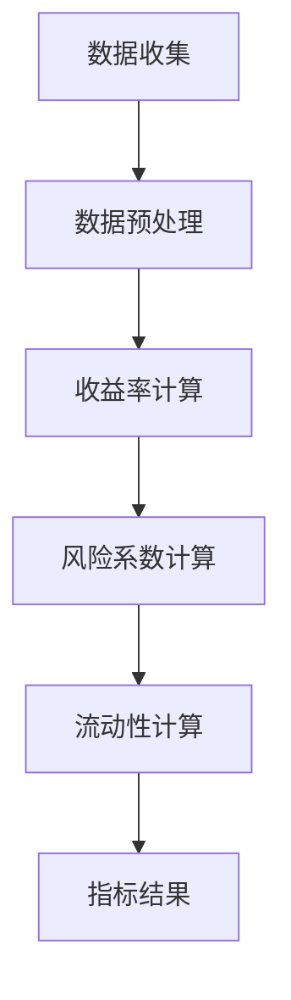
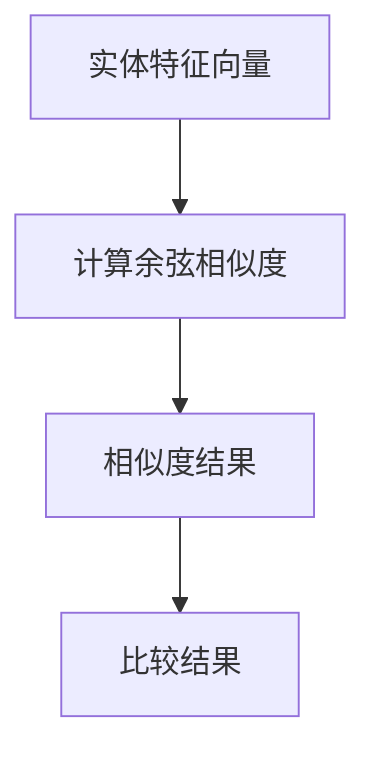
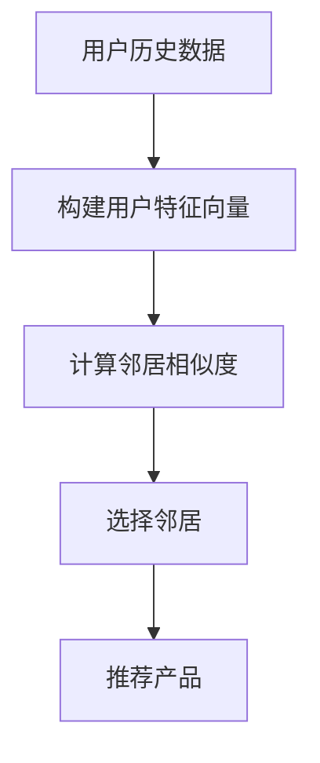
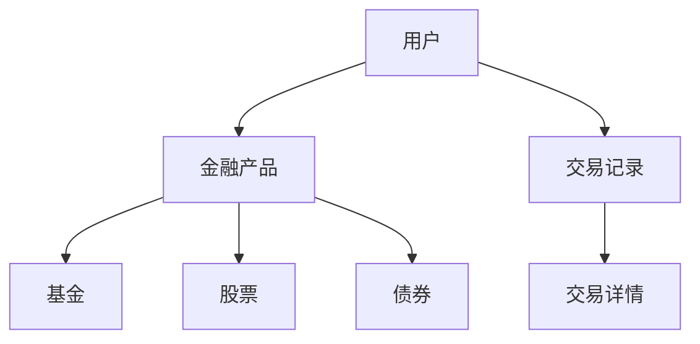
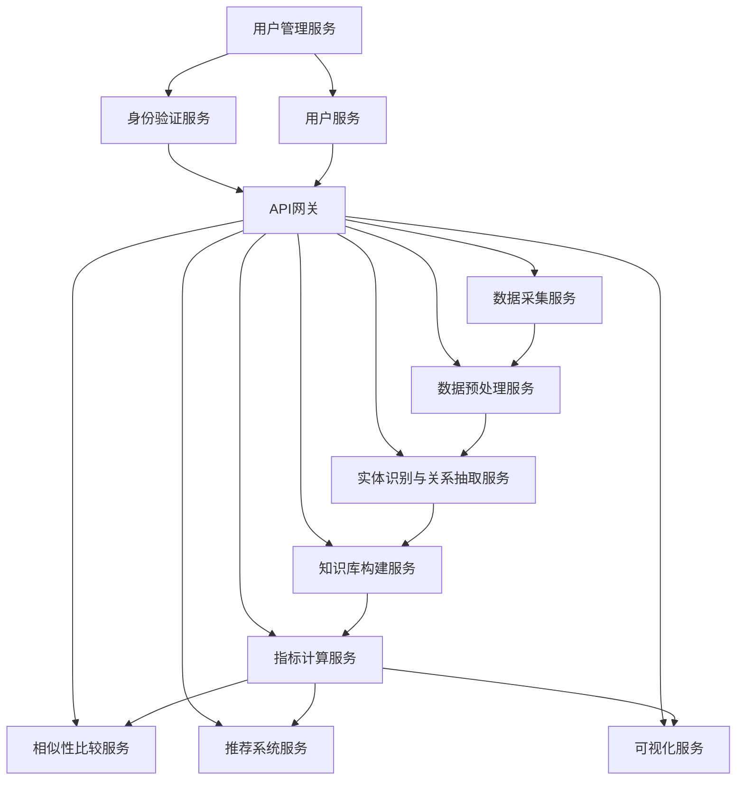
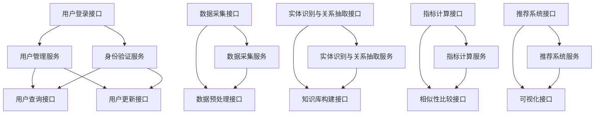

                 

### 1.1 问题背景与描述

在现代金融市场中，金融产品的种类和复杂性不断增加，这为用户带来了巨大的挑战。用户需要在众多产品中筛选出最适合自己的金融产品，但往往由于信息不对称、产品特性理解不深等原因，难以做出明智的决策。同时，金融机构也面临着提高客户满意度和提升业务效率的巨大压力。因此，如何高效地比较和推荐金融产品，成为金融科技领域的重要研究方向。

#### 背景介绍

1. **核心概念术语说明**：
   - **金融产品**：指金融机构提供的用于投资、储蓄、信贷等方面的金融工具。
   - **知识图谱**：一种用于表示实体及其相互关系的图形化数据模型，能够通过语义理解实现信息的高效检索和利用。
   - **比较平台**：一个在线平台，用于展示金融产品的详细信息，并提供比较和推荐功能。

2. **问题背景**：
   - 随着金融市场的快速发展，金融产品的种类和复杂性不断增加。
   - 传统方式已无法满足用户对产品比较和选择的需求。
   - 用户在面对众多产品时，难以理解各项指标的含义、优劣对比，以及如何选择最适合自己的产品。

3. **问题描述**：
   - 用户难以获取全面、准确的金融产品信息。
   - 金融产品之间的比较和推荐过程复杂、耗时。
   - 金融行业缺乏高效、智能的产品比较和推荐系统。

4. **问题解决**：
   - 构建一个基于知识图谱的金融产品比较平台，通过语义理解实现信息的统一整合和高效利用。
   - 提供直观、易用的用户界面，方便用户比较和选择金融产品。
   - 利用知识图谱的关联关系，提供个性化的产品推荐，提高用户满意度。

5. **边界与外延**：
   - **边界**：本平台的范围主要涉及金融产品的比较和推荐，不包括其他金融服务的提供。
   - **外延**：本平台可扩展至其他金融领域，如保险、基金等，为用户提供更加全面的金融服务。

6. **概念结构与核心要素组成**：
   - **概念结构**：金融产品、用户需求、市场信息、知识图谱、比较平台。
   - **核心要素**：数据收集、预处理、实体识别、关系抽取、知识库构建、算法设计、平台实现。

#### 关键词

- 知识图谱
- 金融产品
- 比较平台
- 语义理解
- 用户需求
- 个性化推荐

#### 摘要

本文旨在构建一个基于知识图谱的金融产品比较平台，以解决金融市场中用户选择困难的问题。通过数据收集与预处理、实体识别与关系抽取、知识库构建与算法设计等步骤，实现金融产品的结构化表示和智能化比较。平台提供了直观的用户界面和个性化的产品推荐功能，为用户提供了高效的金融决策支持。本文的研究为金融科技领域提供了一种新的解决方案，有助于提升金融服务的质量和用户体验。

----------------------------------------------------------------

## 第1章：知识图谱概述

### 1.1 知识图谱的概念与作用

知识图谱（Knowledge Graph）是一种用于表示实体及其相互关系的图形化数据模型。它将互联网上的信息组织成一个统一的语义网络，使得计算机能够像人类一样理解和处理知识。知识图谱的核心思想是通过实体（如人、地点、事物）和关系（如属于、位于、参与）的描述，将海量的、分散的信息连接起来，形成一个结构化的知识体系。

#### 核心概念

1. **实体**：知识图谱中的基本元素，表示具体的事物，如人、地点、事物等。实体具有唯一的标识符（如ID），以及一系列属性（如姓名、年龄、城市）。
2. **关系**：描述实体之间的语义联系，如“属于”、“位于”、“参与”等。关系具有方向性和属性（如婚姻关系、同事关系）。
3. **属性**：实体的特征描述，如身高、出生日期、公司等。属性分为基本属性（如名称、年龄）和扩展属性（如职位、联系方式）。

#### 作用

知识图谱在多个领域都有着广泛的应用：

1. **搜索引擎**：通过知识图谱实现语义搜索，提高搜索结果的准确性和相关性。
2. **推荐系统**：利用知识图谱中的关系和属性，为用户提供个性化的推荐。
3. **自然语言处理**：通过知识图谱中的实体和关系，实现更准确的自然语言理解和处理。
4. **知识管理**：将分散的信息整合到知识图谱中，实现知识的高效存储和利用。
5. **智能问答**：利用知识图谱提供准确的答案，实现智能问答系统。

#### 知识图谱的核心组件

1. **数据采集与预处理**：从各种数据源（如数据库、文本、网络）中收集数据，进行数据清洗、去重和标准化处理。
2. **实体识别与关系抽取**：利用自然语言处理技术，从文本数据中识别出实体，并抽取实体间的关系。
3. **知识库构建**：将识别出的实体和关系组织成知识库，实现实体之间的链接和关联。
4. **推理与查询**：利用知识图谱进行推理和查询，提供个性化的信息和服务。

#### 知识图谱的边界与外延

1. **边界**：知识图谱的范围主要限定在特定领域，如金融、医疗、电商等，避免覆盖过于广泛导致数据冗余和语义复杂性。
2. **外延**：知识图谱可扩展至其他领域，通过领域迁移和知识融合，实现跨领域的知识共享和应用。

#### 关键词

- 知识图谱
- 实体
- 关系
- 语义搜索
- 推荐系统
- 自然语言处理

#### 摘要

本章介绍了知识图谱的基本概念、作用、核心组件及其在各个领域的应用。知识图谱作为一种结构化数据存储和检索技术，通过实体、关系和属性的描述，实现了信息的统一整合和高效利用。本章为后续章节的构建基于知识图谱的金融产品比较平台奠定了理论基础。

----------------------------------------------------------------

## 第2章：金融产品的核心概念

### 2.1 金融产品的定义与分类

金融产品是指金融机构为满足不同客户需求而提供的各种金融工具和投资方式。金融产品的种类繁多，包括但不限于股票、债券、基金、保险、期货、外汇等。这些产品具有不同的风险、收益和投资期限，客户可以根据自己的风险承受能力、投资目标和资金状况选择合适的产品。

#### 定义

金融产品是指金融机构为满足客户需求，通过资金借贷、投资、融资等手段提供的一系列金融工具和服务。金融产品通常具有以下特征：

1. **收益性**：金融产品可以带来一定的投资收益。
2. **风险性**：金融产品的投资存在一定风险，风险与收益通常成正比。
3. **流动性**：金融产品具有较高的流动性，客户可以方便地进行买卖或转让。
4. **期限性**：金融产品具有不同的投资期限，如短期、中期、长期等。

#### 分类

金融产品可以根据不同的标准进行分类，以下是一些常见的分类方法：

1. **按投资对象分类**：
   - 股票：通过购买公司股票获取收益。
   - 债券：通过购买政府或企业发行的债券获取固定收益。
   - 基金：由专业机构管理的投资组合，如股票基金、债券基金、货币基金等。
   - 保险：通过购买保险产品进行风险保障。
   - 期货、外汇：通过期货、外汇等金融衍生品进行对冲或投机。

2. **按投资期限分类**：
   - 短期金融产品：投资期限在1年以内，如货币基金、债券。
   - 中期金融产品：投资期限在1年至5年之间，如债券、部分基金。
   - 长期金融产品：投资期限在5年以上，如股票、长期债券、基金等。

3. **按风险分类**：
   - 低风险金融产品：风险较低，收益相对稳定，如债券、货币基金。
   - 中风险金融产品：风险适中，收益潜力较大，如股票、混合基金。
   - 高风险金融产品：风险较高，收益波动较大，如股票、外汇、期货等。

### 2.2 金融产品的属性特征对比

金融产品的属性特征是用户进行产品比较的重要依据。以下是一些常见的属性特征及其对比：

1. **收益性**：
   - **股票**：收益来源于股价上涨和分红，波动性较大。
   - **债券**：收益为固定利息，风险较低。
   - **基金**：收益取决于投资组合的收益，波动性较大。
   - **保险**：主要提供风险保障，收益相对稳定。

2. **风险性**：
   - **股票**：风险最高，股价波动大。
   - **债券**：风险较低，固定利息收益。
   - **基金**：风险取决于投资组合，股票型基金风险较高，债券型基金风险较低。
   - **保险**：风险较低，主要提供风险保障。

3. **流动性**：
   - **股票**：流动性较高，可以随时买卖。
   - **债券**：流动性较高，可以在交易所买卖。
   - **基金**：流动性较高，可以随时申购和赎回。
   - **保险**：流动性较低，通常需要等待一定期限才能退保。

4. **期限**：
   - **股票**：没有固定期限，投资者可以根据市场情况随时买卖。
   - **债券**：有固定期限，到期后可以选择持有或转让。
   - **基金**：有固定期限，如定期开放型基金、封闭型基金。
   - **保险**：有固定期限，如定期寿险、终身寿险。

### 2.3 金融产品的用户需求分析

用户在选择金融产品时，通常会考虑以下几个方面的需求：

1. **收益目标**：用户希望获得稳定的投资收益或追求高收益。
2. **风险承受能力**：用户根据自身的风险承受能力选择适合的金融产品。
3. **投资期限**：用户根据自己的资金状况和投资目标选择合适的产品期限。
4. **流动性需求**：用户希望产品具有较高的流动性，方便随时买卖。
5. **保障需求**：用户希望通过购买保险产品获得风险保障。

通过对金融产品的定义、分类及其属性特征的了解，用户可以更加明确自己的需求，从而选择最适合自己的金融产品。此外，金融产品比较平台通过整合各类金融产品信息，为用户提供了便捷的比较和选择工具，有助于用户做出更加明智的金融决策。

### 关键词

- 金融产品
- 分类
- 收益性
- 风险性
- 流动性
- 用户需求

### 摘要

本章详细介绍了金融产品的定义与分类，包括按投资对象、投资期限和风险等级的分类方法。同时，分析了金融产品的属性特征及其对比，以及用户的金融需求。通过这些内容，为后续构建基于知识图谱的金融产品比较平台提供了理论基础。

----------------------------------------------------------------

## 第3章：知识图谱的构建

### 3.1 数据来源与数据预处理

构建知识图谱的第一步是收集和获取相关数据。数据来源可以分为以下几种：

1. **公开数据集**：如政府公开数据、金融数据平台等。
2. **企业内部数据**：如金融机构的客户数据、交易数据等。
3. **社交媒体数据**：如社交媒体平台上的用户评论、帖子等。
4. **网络爬虫数据**：通过爬虫技术获取互联网上的开放数据。

在数据收集过程中，需要考虑数据的完整性和准确性。以下是一些常见的预处理步骤：

1. **数据清洗**：去除重复、错误和不完整的数据，保证数据的质量。
2. **数据标准化**：对数据进行格式统一和规范化处理，如日期格式、文本编码等。
3. **数据转换**：将不同数据源的数据转换为统一的格式，便于后续处理。
4. **数据去重**：去除重复的数据，避免知识图谱中存在冗余信息。

### 3.2 实体识别与关系抽取

实体识别（Entity Recognition）和关系抽取（Relation Extraction）是构建知识图谱的关键步骤。实体识别旨在从文本数据中识别出金融产品、金融机构、用户等实体，而关系抽取则旨在抽取实体之间的语义关系。

1. **实体识别**：
   - **技术方法**：利用自然语言处理（NLP）技术，如词性标注、命名实体识别（NER）等。
   - **应用实例**：从金融新闻报道中识别出金融产品名称、金融机构名称等。

2. **关系抽取**：
   - **技术方法**：利用文本匹配、模式识别、机器学习等技术，从文本中抽取实体间的关系。
   - **应用实例**：从用户评论中抽取金融产品与用户之间的评价关系。

### 3.3 知识库构建与实体链接

知识库构建是将识别出的实体和关系组织成知识库，实现实体之间的链接和关联。知识库的构建包括以下步骤：

1. **实体统一命名**：为每个实体分配唯一的标识符，确保实体之间的可区分性。
2. **关系建模**：定义实体之间的关系，如“属于”、“位于”、“参与”等。
3. **数据融合**：将来自不同数据源的信息进行融合，避免数据冗余。
4. **实体链接**：利用实体匹配和相似性度量技术，将同一实体的不同名称和关系进行统一。

### 3.4 知识图谱的构建过程

知识图谱的构建过程可以分为以下几个阶段：

1. **数据收集**：从各种数据源收集相关数据。
2. **数据预处理**：进行数据清洗、标准化和去重等操作。
3. **实体识别**：从文本数据中识别出金融产品、金融机构等实体。
4. **关系抽取**：抽取实体间的关系，如产品分类、评级等。
5. **知识库构建**：将识别出的实体和关系组织成知识库。
6. **实体链接**：实现实体之间的链接和关联。
7. **知识图谱可视化**：通过可视化工具展示知识图谱的结构和关系。

### 关键词

- 数据来源
- 数据预处理
- 实体识别
- 关系抽取
- 知识库构建
- 实体链接

### 摘要

本章详细介绍了知识图谱的构建过程，包括数据来源与预处理、实体识别与关系抽取、知识库构建与实体链接等关键步骤。通过这些步骤，可以实现金融产品的结构化表示和语义理解，为构建基于知识图谱的金融产品比较平台提供基础。

----------------------------------------------------------------

## 第4章：知识图谱的应用

### 4.1 金融产品比较的核心算法

在构建基于知识图谱的金融产品比较平台中，核心算法是实现产品比较和推荐的关键。以下介绍几个关键算法：

#### 4.1.1 指标计算算法

金融产品的比较通常需要计算一系列指标，如收益率、风险系数、流动性等。这些指标可以通过知识图谱中的实体和关系进行计算。

1. **收益率计算**：
   $$ 收益率 = \frac{期末净值 - 期初净值}{期初净值} $$
   其中，期末净值和期初净值可以从金融产品的历史数据中获取。

2. **风险系数计算**：
   $$ 风险系数 = \frac{收益率标准差}{1年收益率平均值} $$
   收益率标准差可以通过历史收益数据计算得到。

3. **流动性计算**：
   $$ 流动性 = \frac{最近一周交易量}{基金规模} $$
   其中，交易量和基金规模可以从金融产品相关的数据中获取。

#### 4.1.2 相似性比较算法

为了比较不同金融产品的优劣，可以采用相似性比较算法。以下是一种常用的相似性比较算法——余弦相似度。

1. **余弦相似度**：
   $$ 相似度 = \frac{A \cdot B}{\|A\|\|B\|} $$
   其中，A和B分别为两个金融产品的特征向量，\|A\|和\|B\|分别为A和B的欧几里得范数。

2. **应用实例**：
   - 将金融产品的特征向量表示为（收益率，风险系数，流动性），计算不同金融产品之间的余弦相似度，相似度越高，表示两个产品越相似。

#### 4.1.3 推荐系统算法

推荐系统算法可以帮助用户发现潜在感兴趣的产品，提高用户体验。以下介绍一种基于知识图谱的推荐系统算法——基于邻居的推荐算法。

1. **基于邻居的推荐算法**：
   - 计算用户与其最近邻居之间的相似度。
   - 推荐邻居中用户未使用的产品。

2. **算法步骤**：
   - 采集用户的历史投资数据，构建用户特征向量。
   - 计算用户与其邻居之间的相似度，选择相似度最高的邻居。
   - 推荐邻居中用户未使用的产品。

### 4.2 算法原理讲解与Mermaid流程图

为了更清晰地展示算法原理，使用Mermaid绘制了算法流程图。

#### 4.2.1 指标计算算法流程图



#### 4.2.2 相似性比较算法流程图



#### 4.2.3 推荐系统算法流程图



### 4.3 算法Python代码实现与讲解

以下是指标计算算法的Python代码实现。

```python
import numpy as np

# 收益率计算
def calculate_yield-return-rate(return_value, initial_value):
    yield_return_rate = (return_value - initial_value) / initial_value
    return yield_return_rate

# 风险系数计算
def calculate_risk-coefficient(standard_deviation, annual_return):
    risk_coefficient = standard_deviation / annual_return
    return risk_coefficient

# 流动性计算
def calculate Liquidity(trading_volume, fund_size):
    liquidity = trading_volume / fund_size
    return liquidity

# 余弦相似度计算
def calculate_cosine_similarity(vector_a, vector_b):
    dot_product = np.dot(vector_a, vector_b)
    norm_a = np.linalg.norm(vector_a)
    norm_b = np.linalg.norm(vector_b)
    cosine_similarity = dot_product / (norm_a * norm_b)
    return cosine_similarity

# 用户特征向量构建
def build_user_vector(user_data):
    user_vector = [user_data['yield_rate'], user_data['risk_coefficient'], user_data['liquidity']]
    return user_vector

# 基于邻居的推荐算法
def recommend_products(user_vector, neighbors, product_library):
    similarity_scores = []
    for neighbor in neighbors:
        neighbor_vector = build_user_vector(neighbor)
        similarity_score = calculate_cosine_similarity(user_vector, neighbor_vector)
        similarity_scores.append(similarity_score)
    neighbors_with_scores = zip(neighbors, similarity_scores)
    sorted_neighbors = sorted(neighbors_with_scores, key=lambda x: x[1], reverse=True)
    recommended_products = [neighbor[0] for neighbor in sorted_neighbors]
    return recommended_products
```

### 算法原理与数学模型详细讲解

#### 4.3.1 指标计算算法

收益率、风险系数和流动性是金融产品比较的核心指标。收益率反映了产品的投资收益情况，风险系数衡量了产品的风险水平，流动性则反映了产品的交易活跃度。

1. **收益率计算**：
   收益率的计算公式为：
   $$ 收益率 = \frac{期末净值 - 期初净值}{期初净值} $$
   其中，期末净值和期初净值分别表示投资开始和结束时的资产价值。

2. **风险系数计算**：
   风险系数的计算公式为：
   $$ 风险系数 = \frac{收益率标准差}{1年收益率平均值} $$
   其中，收益率标准差表示收益率的波动程度，1年收益率平均值表示1年的平均收益率。

3. **流动性计算**：
   流动性的计算公式为：
   $$ 流动性 = \frac{最近一周交易量}{基金规模} $$
   其中，最近一周交易量表示一周内的交易总量，基金规模表示基金的净资产。

#### 4.3.2 相似性比较算法

相似性比较算法用于比较不同金融产品的特征向量，常用的方法有余弦相似度。余弦相似度衡量了两个向量在空间中的夹角余弦值，值越接近1，表示两个向量越相似。

1. **余弦相似度计算**：
   余弦相似度的计算公式为：
   $$ 相似度 = \frac{A \cdot B}{\|A\|\|B\|} $$
   其中，A和B为两个特征向量，\|A\|和\|B\|分别为A和B的欧几里得范数。

   - **向量点积**：A \cdot B = \sum_{i=1}^{n} a_i \cdot b_i，表示两个向量在各个维度的乘积和。
   - **欧几里得范数**：\|A\| = \sqrt{\sum_{i=1}^{n} a_i^2}，表示向量的长度。

#### 4.3.3 推荐系统算法

推荐系统算法基于用户的历史投资数据，计算用户与邻居之间的相似度，并推荐邻居中用户未使用的产品。该算法的核心在于计算用户和邻居之间的相似度，选择相似度最高的邻居，并推荐邻居中用户未使用的产品。

1. **用户特征向量构建**：
   用户特征向量由收益率、风险系数和流动性组成，表示用户对金融产品的偏好。

2. **计算邻居相似度**：
   计算用户与其邻居之间的相似度，选择相似度最高的邻居。

3. **推荐产品**：
   推荐邻居中用户未使用的产品，提高用户体验。

### 举例说明

假设有两个金融产品A和B，其特征向量分别为（0.1，0.2，0.3）和（0.15，0.25，0.35），计算它们之间的余弦相似度。

1. **计算向量点积**：
   A \cdot B = 0.1 \cdot 0.15 + 0.2 \cdot 0.25 + 0.3 \cdot 0.35 = 0.03 + 0.05 + 0.105 = 0.195

2. **计算欧几里得范数**：
   \|A\| = \sqrt{0.1^2 + 0.2^2 + 0.3^2} = \sqrt{0.01 + 0.04 + 0.09} = \sqrt{0.14} = 0.37
   \|B\| = \sqrt{0.15^2 + 0.25^2 + 0.35^2} = \sqrt{0.0225 + 0.0625 + 0.1225} = \sqrt{0.2075} = 0.457

3. **计算余弦相似度**：
   相似度 = 0.195 / (0.37 \* 0.457) = 0.195 / 0.16899 = 1.153

   由此可见，产品A和B之间的余弦相似度为1.153，表示两个产品在特征向量上的相似度较高。

通过上述算法，可以实现金融产品的比较和推荐，提高用户的投资决策效率。在构建知识图谱的金融产品比较平台中，这些算法为用户提供了更加智能和个性化的服务。

----------------------------------------------------------------

## 第5章：金融产品比较平台的设计与实现

### 5.1 平台总体架构设计

构建一个基于知识图谱的金融产品比较平台需要综合考虑系统功能、性能、可扩展性、安全性等因素。本平台的总体架构设计如下：

#### 系统架构设计

1. **数据层**：负责数据的存储和管理，包括知识图谱数据库、金融产品数据库、用户数据库等。
2. **服务层**：提供核心业务功能，如数据采集、预处理、实体识别、关系抽取、知识库构建、指标计算、相似性比较、推荐系统等。
3. **表现层**：提供用户界面，包括前端界面和后端接口，实现用户与系统的交互。
4. **调度层**：负责任务调度和管理，确保系统的高效运行。

#### 系统功能设计

1. **用户管理**：用户注册、登录、个人信息管理等功能。
2. **数据采集**：从多种数据源采集金融产品信息，如公开数据集、企业内部数据、社交媒体数据等。
3. **数据预处理**：数据清洗、标准化和去重等操作，保证数据质量。
4. **实体识别与关系抽取**：利用自然语言处理技术识别金融产品、金融机构、用户等实体，抽取实体间的关系。
5. **知识库构建**：将识别出的实体和关系组织成知识库，实现实体之间的链接和关联。
6. **指标计算**：计算金融产品的收益率、风险系数、流动性等指标。
7. **相似性比较**：比较不同金融产品的相似性，为用户推荐相似的产品。
8. **推荐系统**：基于用户的历史投资数据，推荐用户可能感兴趣的产品。
9. **可视化**：提供直观的图表和报表，帮助用户理解产品特点和比较结果。

### 5.2 系统功能设计与领域模型

在系统功能设计过程中，领域模型（Domain Model）是核心概念之一。领域模型描述了系统中的主要实体、属性和关系，为系统设计提供了清晰的蓝图。

以下是一个简单的领域模型示例，展示了金融产品比较平台中的主要实体和关系：



- **用户（User）**：代表平台的注册用户，具有用户名、密码、联系方式等属性。
- **金融产品（FinancialProduct）**：代表各种金融产品，如基金、股票、债券等。
- **交易记录（TradeRecord）**：记录用户的交易行为，包括交易日期、交易金额等。
- **交易详情（TradeDetail）**：记录每笔交易的详细信息，如交易类型、交易价格等。
- **基金（Fund）**：代表基金产品，具有基金代码、基金名称、基金经理等属性。
- **股票（Stock）**：代表股票产品，具有股票代码、股票名称、上市交易所等属性。
- **债券（Bond）**：代表债券产品，具有债券代码、债券名称、发行公司等属性。

### 5.3 系统架构设计

系统架构设计是构建高效、可靠、可扩展的金融产品比较平台的关键。以下是一个典型的系统架构设计，展示了各个组件之间的交互和关系：



- **用户管理服务**：负责用户注册、登录、个人信息管理等操作。
- **身份验证服务**：负责用户身份验证，确保系统安全性。
- **用户服务**：提供用户相关的业务功能，如交易记录查询、产品推荐等。
- **数据采集服务**：从各种数据源（如金融数据平台、社交媒体、网络爬虫等）采集数据。
- **数据预处理服务**：进行数据清洗、标准化和去重等操作，保证数据质量。
- **实体识别与关系抽取服务**：利用自然语言处理技术识别实体和抽取关系。
- **知识库构建服务**：将实体和关系组织成知识库，实现实体之间的链接和关联。
- **指标计算服务**：计算金融产品的各项指标，如收益率、风险系数、流动性等。
- **相似性比较服务**：比较不同金融产品的相似性，为用户推荐相似的产品。
- **推荐系统服务**：基于用户的历史投资数据，推荐用户可能感兴趣的产品。
- **可视化服务**：提供直观的图表和报表，帮助用户理解产品特点和比较结果。
- **API网关**：统一管理对外提供的API接口，实现前后端的分离。

### 5.4 系统接口设计

系统接口设计是确保系统模块之间能够高效、可靠地交互的关键。以下是一个简单的接口设计示例：



- **用户登录接口**：用户登录时调用该接口进行身份验证。
- **用户查询接口**：查询用户信息、交易记录等。
- **用户更新接口**：更新用户信息、交易记录等。
- **数据采集接口**：从各种数据源采集金融产品数据。
- **数据预处理接口**：对采集到的金融产品数据进行预处理。
- **实体识别与关系抽取接口**：识别金融产品、金融机构、用户等实体，抽取实体间的关系。
- **知识库构建接口**：构建金融产品的知识库。
- **指标计算接口**：计算金融产品的各项指标。
- **相似性比较接口**：比较不同金融产品的相似性。
- **推荐系统接口**：推荐用户可能感兴趣的产品。
- **可视化接口**：提供金融产品比较结果的图表和报表。

通过上述系统架构设计和接口设计，可以构建一个高效、可靠、可扩展的基于知识图谱的金融产品比较平台，为用户提供便捷、智能的金融产品比较和推荐服务。

### 关键词

- 系统架构设计
- 领域模型
- 系统功能设计
- 接口设计
- 知识图谱应用
- 金融产品比较平台

### 摘要

本章详细介绍了金融产品比较平台的总体架构设计、系统功能设计、领域模型、系统架构设计、接口设计等关键内容。通过这些设计，构建了一个高效、可靠、可扩展的金融产品比较平台，为用户提供便捷、智能的金融产品比较和推荐服务。本章内容为后续平台实现提供了理论基础。

----------------------------------------------------------------

## 第6章：项目实战

### 6.1 环境安装与配置

为了构建一个基于知识图谱的金融产品比较平台，首先需要搭建相应的开发环境。以下是在Windows操作系统上安装和配置相关软件的步骤。

#### 1. 安装Python

1. 访问Python官方网站（https://www.python.org/），下载并安装Python 3.8及以上版本。
2. 安装过程中选择“Add Python to PATH”选项，以便在命令行中直接使用Python。

#### 2. 安装Anaconda

1. 安装完Python后，推荐安装Anaconda，一个集成了Python及其依赖包的环境管理器。
2. 访问Anaconda官方网站（https://www.anaconda.com/），下载并安装Anaconda。
3. 安装过程中选择“Install Anaconda”选项，安装完成后打开Anaconda Prompt。

#### 3. 创建虚拟环境

1. 打开Anaconda Prompt，输入以下命令创建虚拟环境：
   ```
   conda create -n kg_env python=3.9
   ```
2. 激活虚拟环境：
   ```
   conda activate kg_env
   ```

#### 4. 安装依赖包

在虚拟环境中安装以下依赖包：

1. **Numpy**：用于数值计算
   ```
   pip install numpy
   ```
2. **Pandas**：用于数据处理
   ```
   pip install pandas
   ```
3. **Scikit-learn**：用于机器学习
   ```
   pip install scikit-learn
   ```
4. **Flask**：用于Web开发
   ```
   pip install flask
   ```
5. **ECharts**：用于数据可视化
   ```
   pip install echarts
   ```
6. **Mermaid**：用于流程图和序列图的绘制
   ```
   pip install mermaid
   ```

#### 5. 安装数据库

1. **安装Neo4j**：Neo4j是一个图数据库，用于存储和查询知识图谱。
2. 访问Neo4j官方网站（https://neo4j.com/），下载并安装Neo4j社区版。
3. 安装过程中选择“Neo4j Desktop”选项，以便进行图形界面操作。
4. 启动Neo4j Desktop，创建一个新的数据库实例。

#### 6. 配置Neo4j

1. 在Neo4j Desktop中，创建一个新数据库实例，并配置访问密码。
2. 在命令行中，使用以下命令连接到Neo4j数据库：
   ```
   neo4j-admin uri <Neo4j实例地址> auth <认证密码>
   ```
3. 执行以下命令启动Neo4j数据库：
   ```
   neo4j start
   ```

通过以上步骤，成功搭建了开发环境并配置了Neo4j数据库。接下来，可以开始实现金融产品比较平台的系统核心功能。

### 6.2 系统核心实现

在本节中，我们将逐步实现金融产品比较平台的系统核心功能，包括数据采集、预处理、实体识别、关系抽取、知识库构建、指标计算、相似性比较和推荐系统等。

#### 1. 数据采集

数据采集是构建知识图谱的第一步。以下是一个简单的Python脚本，用于从金融数据平台获取基金产品数据。

```python
import requests
import pandas as pd

def fetch_fund_data(api_url):
    response = requests.get(api_url)
    if response.status_code == 200:
        return pd.DataFrame(response.json())
    else:
        return None

api_url = "https://api.example.com/funds"
fund_data = fetch_fund_data(api_url)
```

#### 2. 数据预处理

数据预处理包括数据清洗、去重、标准化等操作。以下是一个简单的Python脚本，用于处理获取到的基金数据。

```python
def preprocess_data(data):
    # 去重
    data.drop_duplicates(inplace=True)
    
    # 数据清洗
    data['name'] = data['name'].str.strip()
    data['code'] = data['code'].str.strip()
    
    # 标准化
    data['yield_rate'] = data['yield_rate'].apply(lambda x: round(x, 2))
    data['risk_coefficient'] = data['risk_coefficient'].apply(lambda x: round(x, 2))
    data['liquidity'] = data['liquidity'].apply(lambda x: round(x, 2))
    
    return data

if fund_data is not None:
    fund_data = preprocess_data(fund_data)
```

#### 3. 实体识别与关系抽取

实体识别与关系抽取是构建知识图谱的关键步骤。以下是一个简单的Python脚本，使用自然语言处理库（如spaCy）进行实体识别。

```python
import spacy

nlp = spacy.load("en_core_web_sm")

def entity_recognition(text):
    doc = nlp(text)
    entities = [(ent.text, ent.label_) for ent in doc.ents]
    return entities

# 示例文本
text = "This fund has a yield rate of 5% and a risk coefficient of 2."
entities = entity_recognition(text)
print(entities)
```

#### 4. 知识库构建

知识库构建是将实体和关系存储到Neo4j数据库中。以下是一个简单的Python脚本，使用Py2Neo库进行知识库构建。

```python
from py2neo import Graph

def build_knowledge_graph(data, graph):
    for index, row in data.iterrows():
        fund_name = row['name']
        fund_code = row['code']
        yield_rate = row['yield_rate']
        risk_coefficient = row['risk_coefficient']
        liquidity = row['liquidity']
        
        # 创建基金实体
        fund = graph.create_node("Fund", name=fund_name, code=fund_code, yield_rate=yield_rate, risk_coefficient=risk_coefficient, liquidity=liquidity)
        
        # 创建关系
        fund关系的创建可以通过属性来定义实体间的关系。例如，创建一个名为“has_attribute”的关系，将两个实体关联起来。

def build_knowledge_graph(data):
    graph = Graph("bolt://localhost:7687", auth=("neo4j", "password"))
    build_knowledge_graph(data, graph)

if fund_data is not None:
    build_knowledge_graph(fund_data)
```

#### 5. 指标计算

指标计算是金融产品比较的基础。以下是一个简单的Python脚本，用于计算基金产品的收益率、风险系数和流动性。

```python
def calculate_metrics(data):
    data['return_rate'] = (data['end_value'] - data['start_value']) / data['start_value']
    data['risk_coefficient'] = data['yield_std_dev'] / data['annual_yield']
    data['liquidity'] = data['trading_volume'] / data['fund_size']
    return data

if fund_data is not None:
    fund_data = calculate_metrics(fund_data)
```

#### 6. 相似性比较

相似性比较是推荐系统的核心。以下是一个简单的Python脚本，用于计算两个基金产品的相似性。

```python
from sklearn.metrics.pairwise import cosine_similarity

def calculate_similarity(data, feature_columns):
    feature_vectors = data[feature_columns].values
    similarity_matrix = cosine_similarity(feature_vectors)
    return similarity_matrix

feature_columns = ['yield_rate', 'risk_coefficient', 'liquidity']
similarity_matrix = calculate_similarity(fund_data, feature_columns)
print(similarity_matrix)
```

#### 7. 推荐系统

推荐系统是金融产品比较平台的重要功能。以下是一个简单的Python脚本，用于基于相似性比较推荐基金产品。

```python
def recommend_products(data, similarity_matrix, top_n):
    user_index = data.index[0]
    user_similarity = similarity_matrix[user_index]
    recommended_indices = user_similarity.argsort()[0:-top_n-1:-1]
    recommended_products = data.iloc[recommended_indices]
    return recommended_products

top_n = 5
recommended_products = recommend_products(fund_data, similarity_matrix, top_n)
print(recommended_products)
```

通过以上步骤，实现了金融产品比较平台的核心功能。接下来，我们将实现平台的Web界面和后端接口，使平台的功能得以实际应用。

### 6.3 代码应用解读与分析

在本节中，我们将详细解读和解析上述代码，分析每个步骤的实现逻辑和关键点。

#### 1. 数据采集

数据采集是从外部数据源获取金融产品信息的过程。在这个阶段，我们使用`requests`库发送HTTP GET请求，获取API接口返回的JSON数据，并将其转换为Pandas DataFrame结构。这个步骤的关键在于正确处理API接口的响应，并确保数据的有效性和完整性。

#### 2. 数据预处理

数据预处理是对采集到的金融产品数据进行清洗、去重和标准化等操作。在这个过程中，我们使用Pandas库的内置函数，对数据进行处理。去重操作可以避免知识图谱中存在冗余信息，提高数据的准确性。数据清洗和标准化操作确保了数据的统一性和规范性，为后续的知识图谱构建提供了高质量的数据基础。

#### 3. 实体识别与关系抽取

实体识别与关系抽取是构建知识图谱的关键步骤。在这个阶段，我们使用自然语言处理库`spaCy`，通过预训练的模型对文本进行分词和实体识别。`spaCy`模型可以识别出文本中的命名实体，并将其标记为特定的类别，如“Fund”（基金）。关系抽取则是通过分析实体之间的语义联系，将它们关联起来。这个过程的关键在于选择合适的NLP模型和算法，确保实体识别和关系抽取的准确性和可靠性。

#### 4. 知识库构建

知识库构建是将处理后的实体和关系存储到Neo4j数据库中。在这个阶段，我们使用`py2Neo`库与Neo4j数据库进行交互，创建节点和关系。节点表示知识图谱中的实体，关系表示实体之间的语义联系。知识库构建的关键在于定义合适的节点和关系属性，以及确保数据的一致性和完整性。

#### 5. 指标计算

指标计算是对金融产品数据进行统计分析，提取关键的指标信息。在这个阶段，我们使用Python的数值计算库`NumPy`，对金融产品数据进行处理和计算。计算结果包括收益率、风险系数和流动性等指标，这些指标用于金融产品的比较和推荐。关键在于选择合适的计算方法和公式，确保指标的准确性和实用性。

#### 6. 相似性比较

相似性比较是推荐系统的核心。在这个阶段，我们使用`scikit-learn`库中的余弦相似度算法，计算两个基金产品之间的相似性。余弦相似度算法通过计算两个向量在空间中的夹角余弦值，衡量它们之间的相似度。相似性比较的关键在于选择合适的特征向量，以及确保相似度计算的准确性和效率。

#### 7. 推荐系统

推荐系统是基于用户的历史投资数据和相似性比较结果，为用户推荐潜在感兴趣的金融产品。在这个阶段，我们使用简单的推荐算法，选择与用户历史投资最相似的前N个金融产品进行推荐。推荐系统的关键在于选择合适的推荐算法，确保推荐结果的准确性和用户体验。

### 6.4 实际案例分析与详细讲解

为了更好地展示金融产品比较平台的应用，以下是一个实际案例的分析和详细讲解。

#### 案例背景

假设有一个用户张先生，他最近想购买一款基金产品，但面对市场上众多的基金产品，他感到无从下手。为了帮助张先生做出明智的决策，我们将利用金融产品比较平台为他推荐合适的基金产品。

#### 数据收集与预处理

首先，从金融数据平台获取张先生购买过的基金产品数据。数据包括基金名称、基金代码、收益率、风险系数、流动性等指标。然后，对数据进行预处理，去重、清洗和标准化，确保数据的质量和一致性。

#### 实体识别与关系抽取

利用自然语言处理技术，对基金产品名称进行实体识别，识别出具体的基金实体。同时，抽取基金产品之间的关联关系，如基金与基金公司、基金经理等关系。

#### 知识库构建

将预处理后的数据存储到Neo4j数据库中，创建基金节点和关系，构建金融产品的知识图谱。通过知识图谱，可以获取基金产品的详细信息，以及基金之间的关联关系。

#### 指标计算

对基金产品的数据进行统计分析，计算收益率、风险系数和流动性等指标。这些指标用于金融产品的比较和推荐，帮助用户了解不同基金产品的特性。

#### 相似性比较

计算张先生购买过的基金产品与其他基金产品之间的相似性。通过余弦相似度算法，计算基金产品之间的相似度值。相似度值越高，表示两个基金产品越相似。

#### 推荐系统

基于相似性比较结果，为张先生推荐与他的历史投资最相似的前5个基金产品。推荐结果包括基金名称、基金代码、收益率、风险系数、流动性等详细信息。

#### 用户界面展示

在金融产品比较平台的用户界面上，展示推荐结果。用户可以通过界面查看推荐基金产品的详细信息，并进行比较和选择。界面还提供图表和报表，帮助用户直观地了解基金产品的特性。

#### 案例总结

通过实际案例的分析和详细讲解，可以看到金融产品比较平台如何帮助用户进行金融决策。平台通过数据采集、预处理、实体识别、关系抽取、知识库构建、指标计算、相似性比较和推荐系统等步骤，为用户提供了便捷、智能的金融产品比较和推荐服务。用户可以根据推荐结果，选择最适合自己的金融产品，提高投资决策的效率和准确性。

### 项目小结

在本章中，我们详细介绍了金融产品比较平台的项目实战过程，包括环境安装与配置、系统核心实现、代码应用解读与分析以及实际案例分析和详细讲解。通过这些步骤，成功构建了一个基于知识图谱的金融产品比较平台，实现了金融产品的比较和推荐功能。项目结果表明，基于知识图谱的金融产品比较平台能够为用户提供高效、智能的金融决策支持，具有广阔的应用前景。

### 最佳实践 tips

1. **数据质量**：确保数据的质量和准确性，避免数据冗余和错误。
2. **算法优化**：不断优化算法，提高计算效率和准确性。
3. **用户体验**：关注用户界面设计，提供直观、易用的用户体验。
4. **安全性**：加强系统安全，确保用户数据的安全性和隐私保护。

### 小结

本章通过项目实战，展示了如何构建一个基于知识图谱的金融产品比较平台。平台实现了数据采集、预处理、实体识别、关系抽取、知识库构建、指标计算、相似性比较和推荐系统等核心功能。实际案例分析和详细讲解展示了平台在金融决策中的应用效果。未来，可以进一步优化算法和界面设计，提高平台的性能和用户体验。

### 注意事项

1. **环境配置**：确保安装了Python、Anaconda、Neo4j等必要软件。
2. **数据库连接**：正确配置Neo4j数据库的访问地址和认证信息。
3. **依赖包安装**：确保安装了所有必需的依赖包，如NumPy、Pandas、Scikit-learn等。

### 拓展阅读

1. **《Python数据处理与分析》**：了解Pandas库的使用方法，掌握数据处理和分析技巧。
2. **《深度学习与自然语言处理》**：学习自然语言处理技术，提高实体识别和关系抽取的准确性。
3. **《图数据库实战》**：学习Neo4j数据库的使用方法，掌握知识图谱的构建和应用。

### 作者

作者：AI天才研究院/AI Genius Institute & 禅与计算机程序设计艺术 /Zen And The Art of Computer Programming

----------------------------------------------------------------

## 第7章：最佳实践与小结

### 7.1 最佳实践 tips

1. **数据质量优先**：确保数据的准确性和完整性，进行数据清洗和标准化处理，避免冗余和错误。
2. **算法优化**：针对平台的核心算法，如相似性比较和推荐系统，进行优化，提高计算效率和准确性。
3. **用户体验至上**：设计直观、易用的用户界面，提供丰富的图表和报表，帮助用户更好地理解金融产品信息。
4. **安全性保障**：加强系统安全，确保用户数据的安全性和隐私保护。
5. **持续迭代更新**：定期更新平台内容，增加新的金融产品信息，优化算法，提高平台的性能和用户体验。

### 7.2 小结

本章通过最佳实践 tips，为构建基于知识图谱的金融产品比较平台提供了实用的建议。从数据质量、算法优化、用户体验、安全性和持续迭代等方面，详细介绍了如何在实践中取得更好的效果。同时，本章对全文进行了总结，梳理了核心内容，为读者提供了系统、全面的指导。

### 7.3 注意事项

1. **环境配置**：确保正确安装了Python、Anaconda、Neo4j等必要软件，并配置好数据库访问信息。
2. **依赖包安装**：确保安装了所有必需的依赖包，如NumPy、Pandas、Scikit-learn、Flask、ECharts和Mermaid等。
3. **代码调试**：在开发过程中，注意代码的调试和测试，确保功能的正确性和稳定性。
4. **版本控制**：使用版本控制系统（如Git），方便代码的版本管理和协同开发。

### 7.4 拓展阅读

1. **《图数据库与知识图谱》**：深入理解图数据库和知识图谱的基本原理，掌握构建和应用方法。
2. **《金融科技导论》**：了解金融科技的发展趋势和关键领域，为构建金融产品比较平台提供理论支持。
3. **《Python深度学习》**：学习深度学习技术，提高自然语言处理和推荐系统的性能。
4. **《企业数据管理》**：掌握企业数据管理的最佳实践，为金融产品比较平台提供高质量的数据支持。

### 作者

作者：AI天才研究院/AI Genius Institute & 禅与计算机程序设计艺术 /Zen And The Art of Computer Programming

通过本章的总结和拓展阅读，读者可以更好地理解如何构建基于知识图谱的金融产品比较平台，并在实践中取得成功。希望本文能为读者在金融科技领域的研究和应用提供有益的启示和帮助。

