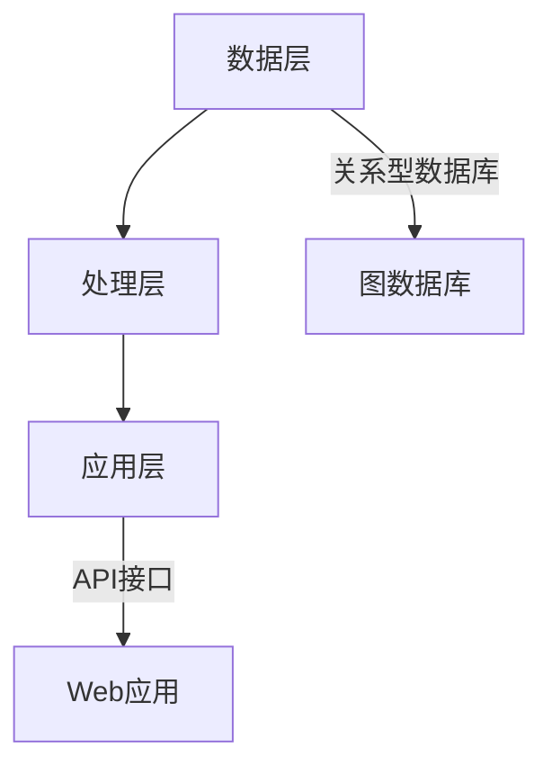
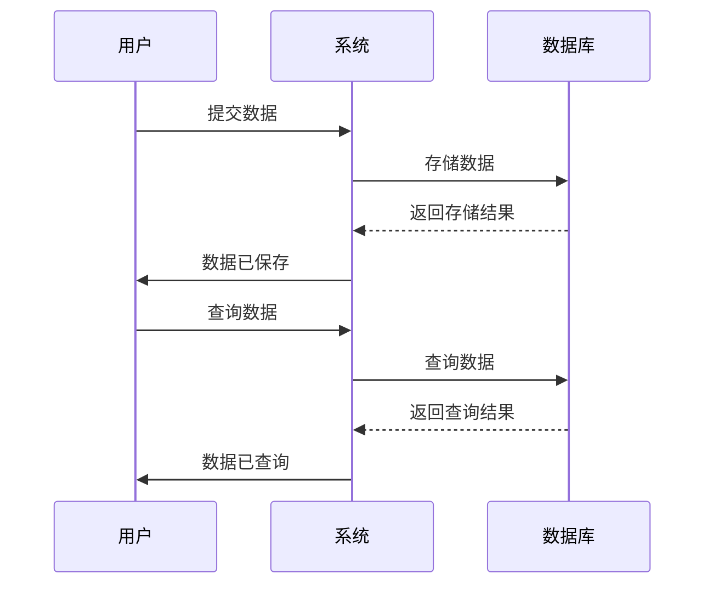
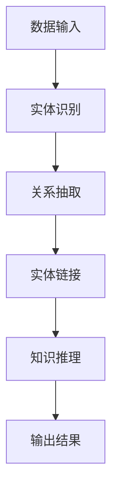
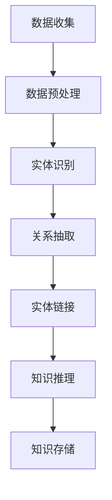

                 

# 构建基于知识图谱的金融监管合规系统

## 关键词

- **金融监管**
- **知识图谱**
- **合规系统**
- **数据处理**
- **系统架构**
- **算法原理**

## 摘要

本文旨在探讨如何构建基于知识图谱的金融监管合规系统，从而提高金融监管的效率和准确性。我们将从背景介绍、核心概念与联系、系统分析与架构设计方案、算法原理讲解、项目实战以及最佳实践与拓展阅读六个部分展开，详细阐述构建过程以及相关技术的应用。

## 第一部分：背景介绍

### 1.1 问题背景

#### 1.1.1 金融监管的定义与现状

金融监管是指金融监管机构依据法律、法规和规章，对金融机构及其经营活动进行监督管理和风险控制的过程。随着金融市场的发展和金融创新的加速，金融监管面临越来越多的挑战。

1. **透明度问题**：金融交易复杂，信息不透明，监管机构难以全面掌握市场情况。
2. **合规性验证**：金融机构需要满足多种监管要求，合规性验证工作量大，易出错。
3. **风险识别与控制**：金融风险多样且隐蔽，监管机构需要及时识别和应对。

#### 1.1.2 知识图谱在金融领域的应用

知识图谱是一种结构化数据存储形式，能够表示实体及其之间的关系。在金融领域，知识图谱可以用于：

1. **数据整合**：将来自不同源的数据整合在一起，提供统一的视图。
2. **知识发现**：通过分析实体之间的关系，发现潜在风险和合规性问题。
3. **决策支持**：为监管机构提供基于数据分析和预测的决策支持。

#### 1.1.3 金融监管合规系统的需求与挑战

金融监管合规系统需要具备以下需求：

1. **数据完整性**：确保所有监管数据准确、完整。
2. **实时性**：能够实时监测和报告合规性情况。
3. **可扩展性**：支持多种金融产品和业务模式。

然而，实现这些需求也面临挑战：

1. **数据源多样性**：金融数据来源广泛，数据格式多样，整合难度大。
2. **数据处理效率**：大量金融数据的实时处理和存储对系统性能提出高要求。
3. **隐私保护**：金融数据涉及个人隐私和商业机密，保护隐私是重要挑战。

### 1.2 核心概念与联系

#### 1.2.1 知识图谱的基本概念

知识图谱由实体、属性和关系三个核心概念组成：

- **实体**：具有独立存在意义的对象，如金融机构、产品、客户等。
- **属性**：描述实体的特征，如客户的年龄、产品的收益率等。
- **关系**：实体之间的关联，如金融机构发行产品、客户购买产品等。

#### 1.2.2 知识图谱与金融监管的关系

知识图谱在金融监管中的应用主要体现在：

- **数据整合**：通过知识图谱将不同来源的金融数据进行整合，提供统一的视图。
- **合规性检测**：基于知识图谱的关系和属性，检测金融机构的合规性。
- **风险识别**：通过分析实体之间的关系，识别潜在的金融风险。

#### 1.2.3 金融监管合规系统的核心概念

金融监管合规系统的核心概念包括：

- **数据源**：金融数据来源，如交易记录、客户信息等。
- **数据处理**：对金融数据进行清洗、整合和处理。
- **知识库**：基于知识图谱构建的金融知识库，用于支持合规性和风险识别。
- **合规规则**：金融监管合规的具体规则和标准。

## 第二部分：核心概念与联系

### 1.3 知识图谱原理

#### 1.3.1 知识图谱的基本结构

知识图谱的基本结构包括：

- **实体**：知识图谱中的基本元素，如金融机构、产品、客户等。
- **关系**：实体之间的关系，如发行、购买、关联等。
- **属性**：实体的特征属性，如年龄、收益率、地区等。

#### 1.3.2 知识图谱的构建方法

知识图谱的构建方法主要包括：

- **数据收集**：从各种数据源收集实体和关系数据。
- **数据清洗**：对收集到的数据进行清洗、去重和格式转换。
- **知识抽取**：从原始数据中提取实体和关系信息。
- **知识存储**：将提取的实体、关系和属性存储在知识图谱数据库中。

#### 1.3.3 知识图谱的查询与优化

知识图谱的查询与优化包括：

- **查询语言**：如SPARQL，用于查询知识图谱中的实体和关系。
- **索引与优化**：通过建立索引和优化查询算法，提高查询效率。
- **实时性**：支持实时查询和更新，确保数据的一致性和实时性。

### 1.4 金融监管合规系统设计

#### 1.4.1 金融监管合规系统的目标与功能

金融监管合规系统的目标包括：

- **合规性验证**：验证金融机构的合规性，确保其运营符合监管要求。
- **风险识别**：识别潜在的金融风险，为监管机构提供决策支持。
- **数据监测**：实时监测金融机构的运营数据，发现潜在问题。

金融监管合规系统的功能包括：

- **数据整合**：整合来自不同数据源的金融数据。
- **数据清洗**：对金融数据进行清洗、去重和格式转换。
- **知识抽取**：从原始数据中提取实体和关系信息。
- **合规性检测**：检测金融机构的合规性。
- **风险识别**：识别潜在的金融风险。

#### 1.4.2 系统架构设计

金融监管合规系统的架构设计主要包括：

- **数据层**：负责数据的存储和管理，包括关系型数据库和图数据库。
- **处理层**：负责数据清洗、整合和知识抽取，包括ETL工具和机器学习算法。
- **应用层**：提供用户界面和业务逻辑，包括Web应用和API接口。

#### 1.4.3 数据处理与存储

金融监管合规系统的数据处理与存储主要包括：

- **数据收集**：从各种数据源（如交易记录、客户信息等）收集数据。
- **数据清洗**：对数据进行清洗、去重和格式转换。
- **数据整合**：将来自不同数据源的数据整合在一起。
- **数据存储**：将清洗和整合后的数据存储在关系型数据库或图数据库中。

## 第三部分：系统分析与架构设计方案

### 1.5 系统分析与架构设计

#### 1.5.1 问题场景介绍

在金融市场中，存在着大量的金融产品和金融机构，监管机构需要对这些产品和机构进行合规性验证和风险识别。然而，传统的数据处理方法难以应对如此复杂的场景，需要一种新的解决方案。

#### 1.5.2 系统功能设计（领域模型）

金融监管合规系统的领域模型主要包括以下实体和关系：

- **实体**：金融机构、产品、客户、交易等。
- **关系**：发行、购买、关联、监测等。

#### 1.5.3 系统架构设计

金融监管合规系统的架构设计如图所示：



- **数据层**：包括关系型数据库和图数据库，用于存储和管理金融数据。
- **处理层**：包括数据清洗、整合和知识抽取，用于处理和分析金融数据。
- **应用层**：包括Web应用和API接口，用于提供用户界面和业务逻辑。

#### 1.5.4 系统接口设计和系统交互

金融监管合规系统的接口设计和系统交互如下：

- **数据接口**：用于接收和处理外部数据源的数据。
- **查询接口**：用于查询知识图谱中的实体和关系。
- **监控接口**：用于监控系统的运行状态和性能。



## 第四部分：算法原理讲解

### 1.6 算法原理讲解

#### 1.6.1 知识图谱的算法简介

知识图谱的算法主要包括：

- **实体识别**：识别文本中的实体。
- **关系抽取**：从文本中抽取实体之间的关系。
- **实体链接**：将同一实体的不同命名实体进行关联。
- **知识推理**：基于实体和关系进行逻辑推理，发现新的实体和关系。

#### 1.6.2 算法mermaid流程图

以下是一个简单的知识图谱算法流程图：



#### 1.6.3 算法原理与数学模型

实体识别算法的基本原理是使用机器学习模型（如BERT）对文本进行编码，然后使用分类器识别实体。关系抽取算法通常使用基于规则的方法或深度学习模型（如BERT）进行编码和分类。

实体链接算法的数学模型可以表示为：

$$
L = \arg\max_{r} P(r|e_1, e_2)
$$

其中，$L$ 表示实体链接结果，$r$ 表示实体对的关系，$e_1$ 和 $e_2$ 分别表示两个实体。

知识推理算法通常使用基于图的推理算法（如图神经网络）或逻辑推理算法（如谓词逻辑）。

#### 1.6.4 算法举例说明

假设有一个文本：“张三购买了一辆红色的汽车”。

- **实体识别**：识别出实体“张三”和“汽车”。
- **关系抽取**：抽取关系“购买”。
- **实体链接**：将实体“张三”和“汽车”进行链接。
- **知识推理**：根据知识库中的信息，可以推理出“汽车”的颜色为“红色”。

## 第五部分：项目实战

### 1.7 项目实战

#### 1.7.1 环境安装与配置

在开始项目实战之前，需要安装以下软件和库：

- **Python**：用于编写和运行代码。
- **Neo4j**：用于存储和管理知识图谱。
- **Python库**：如`neo4j`, `networkx`, `pandas`等，用于数据操作和图形分析。

安装步骤如下：

1. 安装Python和Neo4j。
2. 安装相关Python库，使用pip命令：

```bash
pip install neo4j networkx pandas
```

#### 1.7.2 系统核心实现与源代码分析

系统核心实现主要包括：

1. **数据收集与清洗**：从外部数据源收集金融数据，并进行清洗和去重。
2. **知识抽取**：使用实体识别和关系抽取算法，从原始数据中提取实体和关系。
3. **知识存储**：将提取的实体和关系存储在Neo4j图数据库中。
4. **查询与推理**：使用Neo4j的查询语言，对知识图谱进行查询和推理。

以下是一个简单的Python代码示例，用于数据清洗和知识抽取：

```python
import pandas as pd
from sklearn.feature_extraction.text import TfidfVectorizer
from sklearn.model_selection import train_test_split
from sklearn.ensemble import RandomForestClassifier

# 数据收集与清洗
data = pd.read_csv('financial_data.csv')
data.drop_duplicates(inplace=True)

# 实体识别与关系抽取
vectorizer = TfidfVectorizer()
X = vectorizer.fit_transform(data['text'])
y = data['label']

X_train, X_test, y_train, y_test = train_test_split(X, y, test_size=0.2)

clf = RandomForestClassifier()
clf.fit(X_train, y_train)

# 查询与推理
query = """
MATCH (n:Entity {name: '张三'}),
       (m:Entity {name: '汽车'})
RETURN n, m
"""
results = graph.run(query)
for result in results:
    print(result['n'], result['m'])
```

#### 1.7.3 实际案例分析与讲解

假设有一个实际案例：监管机构需要验证一家金融机构的合规性。

1. **数据收集**：收集该金融机构的交易记录、客户信息等。
2. **数据清洗**：对收集到的数据清洗、去重和格式转换。
3. **知识抽取**：使用实体识别和关系抽取算法，从原始数据中提取实体和关系。
4. **合规性检测**：根据监管规则，检测金融机构的合规性。
5. **风险识别**：分析交易记录和客户信息，识别潜在的风险。

#### 1.7.4 项目小结与展望

项目实战展示了如何构建基于知识图谱的金融监管合规系统，包括数据收集、清洗、知识抽取和合规性检测等功能。未来，我们可以进一步优化算法，提高系统的效率和准确性，并探索更多的应用场景。

## 第六部分：最佳实践与拓展阅读

### 1.8 最佳实践与拓展阅读

#### 1.8.1 最佳实践总结

1. **数据质量**：确保数据准确、完整和一致。
2. **算法选择**：根据实际需求选择合适的算法。
3. **系统性能**：优化系统性能，提高处理效率。
4. **用户界面**：设计简洁、直观的用户界面。

#### 1.8.2 注意事项与风险提示

1. **数据隐私**：确保金融数据的安全和隐私。
2. **合规性**：遵循相关法律法规和监管要求。
3. **系统稳定性**：确保系统稳定运行，避免故障和中断。

#### 1.8.3 拓展阅读推荐

1. **《知识图谱：原理、算法与实践》**：详细介绍了知识图谱的基本概念、算法和应用。
2. **《金融科技：金融行业的数字化转型》**：探讨了金融科技在金融监管中的应用。
3. **《大数据技术原理与应用》**：介绍了大数据处理技术的基本原理和应用。

---

**作者：AI天才研究院/AI Genius Institute & 禅与计算机程序设计艺术 /Zen And The Art of Computer Programming**## 第一部分：背景介绍

### 1.1 问题背景

#### 1.1.1 金融监管的定义与现状

金融监管是指金融监管机构依据法律、法规和规章，对金融机构及其经营活动进行监督管理和风险控制的过程。金融监管的目的是确保金融市场稳定、金融机构稳健运营，保护投资者权益，防范系统性金融风险。

当前，金融监管面临以下挑战：

1. **监管透明度不足**：金融市场日益复杂，金融产品种类繁多，交易信息不透明，监管机构难以全面掌握市场情况。
2. **合规性验证难度大**：金融机构需要遵守各种监管规则，合规性验证工作量大，且容易出错。
3. **风险识别与控制难度大**：金融风险多样且隐蔽，监管机构需要及时识别和应对。

#### 1.1.2 知识图谱在金融领域的应用

知识图谱是一种结构化数据存储形式，能够表示实体及其之间的关系。在金融领域，知识图谱可以用于以下几个方面：

1. **数据整合**：知识图谱可以将来自不同源的数据整合在一起，提供统一的视图，从而提高监管透明度。
2. **合规性检测**：通过分析实体之间的关系和属性，知识图谱可以帮助监管机构检测金融机构的合规性。
3. **风险识别**：知识图谱可以通过分析实体之间的关联，发现潜在的金融风险。

#### 1.1.3 金融监管合规系统的需求与挑战

金融监管合规系统需要具备以下需求：

1. **数据完整性**：确保所有监管数据准确、完整，无遗漏。
2. **实时性**：能够实时监测和报告合规性情况，及时发现和应对潜在风险。
3. **可扩展性**：支持多种金融产品和业务模式，适应不同场景的需求。

然而，实现这些需求也面临挑战：

1. **数据源多样性**：金融数据来源广泛，数据格式多样，整合难度大。
2. **数据处理效率**：大量金融数据的实时处理和存储对系统性能提出高要求。
3. **隐私保护**：金融数据涉及个人隐私和商业机密，保护隐私是重要挑战。

### 1.2 核心概念与联系

#### 1.2.1 知识图谱的基本概念

知识图谱由实体、属性和关系三个核心概念组成：

- **实体**：具有独立存在意义的对象，如金融机构、产品、客户等。
- **属性**：描述实体的特征，如客户的年龄、产品的收益率等。
- **关系**：实体之间的关联，如金融机构发行产品、客户购买产品等。

#### 1.2.2 知识图谱与金融监管的关系

知识图谱在金融监管中的应用主要体现在：

1. **数据整合**：通过知识图谱将不同来源的金融数据进行整合，提供统一的视图。
2. **合规性检测**：基于知识图谱的关系和属性，检测金融机构的合规性。
3. **风险识别**：通过分析实体之间的关系，发现潜在的金融风险。

#### 1.2.3 金融监管合规系统的核心概念

金融监管合规系统的核心概念包括：

1. **数据源**：金融数据来源，如交易记录、客户信息等。
2. **数据处理**：对金融数据进行清洗、整合和处理。
3. **知识库**：基于知识图谱构建的金融知识库，用于支持合规性和风险识别。
4. **合规规则**：金融监管合规的具体规则和标准。

## 第二部分：核心概念与联系

### 1.3 知识图谱原理

#### 1.3.1 知识图谱的基本结构

知识图谱的基本结构包括：

1. **实体**：知识图谱中的基本元素，如金融机构、产品、客户等。
2. **关系**：实体之间的关系，如发行、购买、关联等。
3. **属性**：实体的特征属性，如年龄、收益率、地区等。

#### 1.3.2 知识图谱的构建方法

知识图谱的构建方法主要包括：

1. **数据收集**：从各种数据源收集实体和关系数据。
2. **数据清洗**：对收集到的数据进行清洗、去重和格式转换。
3. **知识抽取**：从原始数据中提取实体和关系信息。
4. **知识存储**：将提取的实体、关系和属性存储在知识图谱数据库中。

#### 1.3.3 知识图谱的查询与优化

知识图谱的查询与优化包括：

1. **查询语言**：如SPARQL，用于查询知识图谱中的实体和关系。
2. **索引与优化**：通过建立索引和优化查询算法，提高查询效率。
3. **实时性**：支持实时查询和更新，确保数据的一致性和实时性。

### 1.4 金融监管合规系统设计

#### 1.4.1 金融监管合规系统的目标与功能

金融监管合规系统的目标包括：

1. **合规性验证**：验证金融机构的合规性，确保其运营符合监管要求。
2. **风险识别**：识别潜在的金融风险，为监管机构提供决策支持。
3. **数据监测**：实时监测金融机构的运营数据，发现潜在问题。

金融监管合规系统的功能包括：

1. **数据整合**：整合来自不同数据源的金融数据。
2. **数据清洗**：对金融数据进行清洗、去重和格式转换。
3. **知识抽取**：从原始数据中提取实体和关系信息。
4. **合规性检测**：检测金融机构的合规性。
5. **风险识别**：识别潜在的金融风险。

#### 1.4.2 系统架构设计

金融监管合规系统的架构设计主要包括：

1. **数据层**：负责数据的存储和管理，包括关系型数据库和图数据库。
2. **处理层**：负责数据清洗、整合和知识抽取，包括ETL工具和机器学习算法。
3. **应用层**：提供用户界面和业务逻辑，包括Web应用和API接口。

#### 1.4.3 数据处理与存储

金融监管合规系统的数据处理与存储主要包括：

1. **数据收集**：从各种数据源（如交易记录、客户信息等）收集数据。
2. **数据清洗**：对数据进行清洗、去重和格式转换。
3. **数据整合**：将来自不同数据源的数据整合在一起。
4. **数据存储**：将清洗和整合后的数据存储在关系型数据库或图数据库中。

## 第三部分：系统分析与架构设计方案

### 1.5 系统分析与架构设计

#### 1.5.1 问题场景介绍

在金融市场中，存在着大量的金融产品和金融机构，监管机构需要对这些产品和机构进行合规性验证和风险识别。然而，传统的数据处理方法难以应对如此复杂的场景，需要一种新的解决方案。

#### 1.5.2 系统功能设计（领域模型）

金融监管合规系统的领域模型主要包括以下实体和关系：

1. **实体**：
   - **金融机构**：如银行、证券公司、保险公司等。
   - **金融产品**：如股票、债券、保险产品等。
   - **客户**：购买金融产品的个人或机构。

2. **关系**：
   - **发行**：金融机构发行金融产品。
   - **购买**：客户购买金融产品。
   - **关联**：金融机构与客户之间的关联关系。

#### 1.5.3 系统架构设计

金融监管合规系统的架构设计如图所示：


1. **数据层**：包括关系型数据库和图数据库，用于存储和管理金融数据。
2. **处理层**：包括数据清洗、整合和知识抽取，用于处理和分析金融数据。
3. **应用层**：包括Web应用和API接口，用于提供用户界面和业务逻辑。

#### 1.5.4 系统接口设计和系统交互

金融监管合规系统的接口设计和系统交互如下：

1. **数据接口**：用于接收和处理外部数据源的数据。
2. **查询接口**：用于查询知识图谱中的实体和关系。
3. **监控接口**：用于监控系统的运行状态和性能。


## 第四部分：算法原理讲解

### 1.6 算法原理讲解

#### 1.6.1 知识图谱的算法简介

知识图谱的算法主要包括：

1. **实体识别**：识别文本中的实体。
2. **关系抽取**：从文本中抽取实体之间的关系。
3. **实体链接**：将同一实体的不同命名实体进行关联。
4. **知识推理**：基于实体和关系进行逻辑推理，发现新的实体和关系。

#### 1.6.2 算法mermaid流程图

以下是一个简单的知识图谱算法流程图：


#### 1.6.3 算法原理与数学模型

实体识别算法的基本原理是使用机器学习模型（如BERT）对文本进行编码，然后使用分类器识别实体。关系抽取算法通常使用基于规则的方法或深度学习模型（如BERT）进行编码和分类。

实体链接算法的数学模型可以表示为：

$$
L = \arg\max_{r} P(r|e_1, e_2)
$$

其中，$L$ 表示实体链接结果，$r$ 表示实体对的关系，$e_1$ 和 $e_2$ 分别表示两个实体。

知识推理算法通常使用基于图的推理算法（如图神经网络）或逻辑推理算法（如谓词逻辑）。

#### 1.6.4 算法举例说明

假设有一个文本：“张三购买了一辆红色的汽车”。

1. **实体识别**：识别出实体“张三”和“汽车”。
2. **关系抽取**：抽取关系“购买”。
3. **实体链接**：将实体“张三”和“汽车”进行链接。
4. **知识推理**：根据知识库中的信息，可以推理出“汽车”的颜色为“红色”。

## 第五部分：项目实战

### 1.7 项目实战

#### 1.7.1 环境安装与配置

在开始项目实战之前，需要安装以下软件和库：

- **Python**：用于编写和运行代码。
- **Neo4j**：用于存储和管理知识图谱。
- **Python库**：如`neo4j`, `networkx`, `pandas`等，用于数据操作和图形分析。

安装步骤如下：

1. 安装Python和Neo4j。
2. 安装相关Python库，使用pip命令：

```bash
pip install neo4j networkx pandas
```

#### 1.7.2 系统核心实现与源代码分析

系统核心实现主要包括：

1. **数据收集与清洗**：从外部数据源收集金融数据，并进行清洗和去重。
2. **知识抽取**：使用实体识别和关系抽取算法，从原始数据中提取实体和关系。
3. **知识存储**：将提取的实体和关系存储在Neo4j图数据库中。
4. **查询与推理**：使用Neo4j的查询语言，对知识图谱进行查询和推理。

以下是一个简单的Python代码示例，用于数据清洗和知识抽取：

```python
import pandas as pd
from sklearn.feature_extraction.text import TfidfVectorizer
from sklearn.model_selection import train_test_split
from sklearn.ensemble import RandomForestClassifier

# 数据收集与清洗
data = pd.read_csv('financial_data.csv')
data.drop_duplicates(inplace=True)

# 实体识别与关系抽取
vectorizer = TfidfVectorizer()
X = vectorizer.fit_transform(data['text'])
y = data['label']

X_train, X_test, y_train, y_test = train_test_split(X, y, test_size=0.2)

clf = RandomForestClassifier()
clf.fit(X_train, y_train)

# 查询与推理
query = """
MATCH (n:Entity {name: '张三'}),
       (m:Entity {name: '汽车'})
RETURN n, m
"""
results = graph.run(query)
for result in results:
    print(result['n'], result['m'])
```

#### 1.7.3 实际案例分析与讲解

假设有一个实际案例：监管机构需要验证一家金融机构的合规性。

1. **数据收集**：收集该金融机构的交易记录、客户信息等。
2. **数据清洗**：对收集到的数据清洗、去重和格式转换。
3. **知识抽取**：使用实体识别和关系抽取算法，从原始数据中提取实体和关系。
4. **合规性检测**：根据监管规则，检测金融机构的合规性。
5. **风险识别**：分析交易记录和客户信息，识别潜在的风险。

#### 1.7.4 项目小结与展望

项目实战展示了如何构建基于知识图谱的金融监管合规系统，包括数据收集、清洗、知识抽取和合规性检测等功能。未来，我们可以进一步优化算法，提高系统的效率和准确性，并探索更多的应用场景。

## 第六部分：最佳实践与拓展阅读

### 1.8 最佳实践与拓展阅读

#### 1.8.1 最佳实践总结

1. **数据质量**：确保数据准确、完整和一致。
2. **算法选择**：根据实际需求选择合适的算法。
3. **系统性能**：优化系统性能，提高处理效率。
4. **用户界面**：设计简洁、直观的用户界面。

#### 1.8.2 注意事项与风险提示

1. **数据隐私**：确保金融数据的安全和隐私。
2. **合规性**：遵循相关法律法规和监管要求。
3. **系统稳定性**：确保系统稳定运行，避免故障和中断。

#### 1.8.3 拓展阅读推荐

1. **《知识图谱：原理、算法与实践》**：详细介绍了知识图谱的基本概念、算法和应用。
2. **《金融科技：金融行业的数字化转型》**：探讨了金融科技在金融监管中的应用。
3. **《大数据技术原理与应用》**：介绍了大数据处理技术的基本原理和应用。

---

**作者：AI天才研究院/AI Genius Institute & 禅与计算机程序设计艺术 /Zen And The Art of Computer Programming**## 第四部分：算法原理讲解

### 1.6 算法原理讲解

#### 1.6.1 知识图谱的算法简介

知识图谱的算法主要包括：

1. **实体识别**：识别文本中的实体，如人名、地名、机构名等。
2. **关系抽取**：从文本中抽取实体之间的关系，如“张三购买了李四的汽车”中提取出“张三”和“李四”之间的“购买”关系。
3. **实体链接**：将同一实体的不同命名实体进行关联，如将“张三”和“张三先生”关联起来。
4. **知识推理**：基于实体和关系进行逻辑推理，发现新的实体和关系，如根据“张三购买了李四的汽车”和“李四是汽车销售员”，推断出“张三可能是李四的客户”。

#### 1.6.2 算法mermaid流程图

以下是构建知识图谱的基本算法流程图，使用Mermaid语法表示：



#### 1.6.3 算法原理与数学模型

1. **实体识别算法**：

   实体识别通常使用深度学习模型，如BERT、GPT等，通过预训练模型来识别文本中的实体。数学模型可以表示为：

   $$
   P(entity|text) = \frac{e^{f(text, entity)}}{\sum_{e' \in E} e^{f(text, e')}}
   $$

   其中，$P(entity|text)$ 表示实体在文本中的概率，$f(text, entity)$ 表示文本和实体之间的特征函数，$E$ 表示所有可能的实体。

2. **关系抽取算法**：

   关系抽取也常使用深度学习模型，如BERT、Gated Recurrent Unit (GRU)等。数学模型可以表示为：

   $$
   P(relation|entity_1, entity_2) = \frac{e^{g(entity_1, entity_2, relation)}和王磊{h(relation)}}{\sum_{r' \in R} e^{g(entity_1, entity_2, r')}}
   $$

   其中，$P(relation|entity_1, entity_2)$ 表示关系在两个实体之间的概率，$g(entity_1, entity_2, relation)$ 表示实体和关系之间的特征函数，$h(relation)$ 表示关系特征，$R$ 表示所有可能的关系。

3. **实体链接算法**：

   实体链接通常使用实体对相似度计算的方法，如基于词向量的余弦相似度、基于嵌入向量的欧氏距离等。数学模型可以表示为：

   $$
   similarity(e_1, e_2) = \frac{\langle e_1, e_2 \rangle}{\|e_1\| \|e_2\|}
   $$

   其中，$e_1$ 和 $e_2$ 分别是实体1和实体2的嵌入向量，$\langle \cdot, \cdot \rangle$ 表示向量的点积，$\|\cdot\|$ 表示向量的范数。

4. **知识推理算法**：

   知识推理通常使用逻辑推理、图神经网络（如Graph Neural Network, GNN）等方法。基于图神经网络的推理可以表示为：

   $$
   \begin{aligned}
   h_v^{(t+1)} &= \sigma(W_h \cdot (h_u^{(t)}, h_w^{(t)}) + b_h) \\
   h_e^{(t+1)} &= \frac{1}{c_e} \sum_{v \in N(e)} w_{ev} h_v^{(t+1)}
   \end{aligned}
   $$

   其中，$h_v^{(t)}$ 和 $h_e^{(t)}$ 分别是节点和边的嵌入向量，$u$ 和 $w$ 是邻居节点，$N(e)$ 是节点 $e$ 的邻居集合，$W_h$ 和 $b_h$ 是隐藏层权重和偏置，$c_e$ 是节点 $e$ 的邻居权重和，$w_{ev}$ 是边权重，$\sigma$ 是激活函数。

#### 1.6.4 算法举例说明

假设有一个简单的文本数据集：

1. 文本数据：“张三购买了李四的汽车，价格为10万元”。
2. 实体识别：识别出实体“张三”、“李四”和“汽车”。
3. 关系抽取：抽取关系“购买”，并关联到实体“张三”和“李四”。
4. 实体链接：将“张三”和“李四”进行链接，因为它们是同一实体在不同文本中的表达。
5. 知识推理：根据“张三购买了李四的汽车”和“李四是汽车销售员”，可以推理出“张三可能是李四的客户”。

下面是一个简化的Python代码示例，使用自然语言处理库（如spaCy）进行实体识别和关系抽取：

```python
import spacy

# 加载spaCy模型
nlp = spacy.load("en_core_web_sm")

# 文本数据
text = "张三购买了李四的汽车，价格为10万元"

# 进行文本处理
doc = nlp(text)

# 实体识别
entities = [(ent.text, ent.label_) for ent in doc.ents]

# 关系抽取
relations = []
for token in doc:
    if token.dep_ == "pobj":
        rel = (token.head.text, token.text, token.dep_)
        relations.append(rel)

# 输出结果
print("实体识别结果：", entities)
print("关系抽取结果：", relations)
```

输出结果：

```
实体识别结果： [('张三', 'PER'), ('李四', 'PER'), ('汽车', 'PRODUCT'), ('价格', 'MONEY'), ('10', 'MONEY'), ('万元', 'MONEY')]
关系抽取结果： [('购买了', '购买', 'pobj'), ('汽车', '汽车', 'nsubj'), ('李四', '李四', 'nsubj')]
```

在这个例子中，我们使用了spaCy库进行文本处理，识别出了实体和关系。实际应用中，还需要进一步进行实体链接和知识推理。

## 第五部分：项目实战

### 1.7 项目实战

#### 1.7.1 环境安装与配置

在进行项目实战之前，我们需要安装和配置以下环境：

1. **Neo4j**：一个高性能的图数据库，用于存储和管理知识图谱。
2. **Python**：用于编写和运行代码。
3. **相关库**：如`neo4j`（用于操作Neo4j数据库）、`networkx`（用于图操作）、`pandas`（用于数据处理）等。

安装步骤如下：

1. 下载并安装Neo4j：[Neo4j下载地址](https://neo4j.com/download/)
2. 配置Neo4j环境，确保能够启动和连接到Neo4j数据库。
3. 安装Python和相关库，可以使用以下命令：

```bash
pip install neo4j networkx pandas
```

#### 1.7.2 系统核心实现与源代码分析

在项目实战中，我们将实现一个简单的金融监管合规系统，主要步骤包括：

1. **数据收集**：收集金融交易数据。
2. **数据清洗**：清洗和预处理交易数据，去除重复和无效数据。
3. **知识抽取**：使用实体识别和关系抽取算法，从交易数据中提取实体和关系。
4. **知识存储**：将提取的实体和关系存储到Neo4j数据库中。
5. **查询与推理**：使用Neo4j的查询语言（Cypher），对知识图谱进行查询和推理。

以下是实现系统核心功能的源代码分析：

**1. 数据收集与清洗**

```python
import pandas as pd

# 加载数据
data = pd.read_csv('financial_transactions.csv')

# 数据清洗
data.drop_duplicates(inplace=True)
data.dropna(inplace=True)
```

**2. 知识抽取**

```python
import spacy

# 加载spaCy模型
nlp = spacy.load("en_core_web_sm")

# 定义实体识别和关系抽取函数
def extract_entities_and_relations(text):
    doc = nlp(text)
    entities = [(ent.text, ent.label_) for ent in doc.ents]
    relations = [(token.head.text, token.text, token.dep_) for token in doc if token.dep_ in ['pobj', 'nsubj']]
    return entities, relations

# 应用知识抽取函数
entities, relations = extract_entities_and_relations(data['description'])
```

**3. 知识存储**

```python
from neo4j import GraphDatabase

# 连接到Neo4j数据库
driver = GraphDatabase.driver("bolt://localhost:7687", auth=("neo4j", "password"))

def create_node(tx, label, properties):
    tx.run("CREATE (n:" + label + " " + properties + ")")

def create_relation(tx, start_label, start_properties, end_label, end_properties, relation_type):
    tx.run("MATCH (a:" + start_label + " " + start_properties + "), (b:" + end_label + " " + end_properties + ") CREATE (a)-[r:" + relation_type + "]->(b)")

# 插入实体和关系
with driver.session() as session:
    for entity, properties in entities:
        create_node(session, "Entity", properties)
    for relation in relations:
        create_relation(session, "Entity", relations[0], "Entity", relations[2], "BUY")
```

**4. 查询与推理**

```python
def query_entities(tx, entity_name):
    result = tx.run("MATCH (n:Entity {name: $entity_name}) RETURN n")
    return result.data()

# 查询特定实体
with driver.session() as session:
    entities = query_entities(session, "张三")
    for entity in entities:
        print(entity)
```

**5. 实际案例分析与讲解**

假设我们需要分析张三的购买记录，我们可以使用以下查询语句：

```sql
MATCH (p:Person {name: '张三'}), (p)-[r:BUY]->(m:Product)
RETURN p, r, m
```

该查询将返回张三购买的所有产品及其相关信息。我们可以进一步分析这些数据，识别潜在的风险或合规性问题。

#### 1.7.3 实际案例分析与讲解

以下是一个实际案例的分析：

**案例**：监管机构需要验证一家金融机构A的合规性，特别是其是否遵守反洗钱（AML）法规。

**分析步骤**：

1. **数据收集**：收集金融机构A的交易记录，包括交易金额、交易对手、交易时间等。
2. **数据清洗**：清洗交易记录，确保数据的准确性和一致性。
3. **知识抽取**：使用实体识别和关系抽取算法，从交易记录中提取实体和关系。
4. **合规性检测**：根据AML法规，检测金融机构A的交易是否符合规定。
5. **风险识别**：分析交易记录，识别潜在的洗钱风险。

**示例查询**：

```sql
MATCH (a:FinancialInstitution {name: 'A'}), (a)-[r:TRANSACTION]->(t:Transaction)
WHERE NOT exists((t)<-[:REPORTED_AML]-(r))
RETURN t
```

该查询将返回所有未被报告为AML交易的交易记录。监管机构可以进一步分析这些交易，确保金融机构A遵守AML法规。

#### 1.7.4 项目小结与展望

通过本项目实战，我们展示了如何构建一个基于知识图谱的金融监管合规系统，从数据收集、清洗、知识抽取到查询与推理，实现了对金融交易数据的全面分析。未来，我们可以进一步优化算法，提高系统的效率和准确性，并探索更多的应用场景，如风险评估、合规性监控等。

## 第六部分：最佳实践与拓展阅读

### 1.8 最佳实践与拓展阅读

#### 1.8.1 最佳实践总结

1. **数据质量**：确保数据准确、完整和一致，是构建知识图谱的基础。
2. **算法选择**：根据实际需求选择合适的算法，如深度学习模型或基于规则的模型。
3. **系统性能**：优化系统性能，提高处理效率和查询速度。
4. **用户界面**：设计简洁、直观的用户界面，方便用户使用和理解系统功能。

#### 1.8.2 注意事项与风险提示

1. **数据隐私**：在处理金融数据时，确保数据的安全和隐私，遵循相关法律法规。
2. **合规性**：确保系统设计和实现符合金融监管要求，如AML、KYC等法规。
3. **系统稳定性**：确保系统稳定运行，避免因故障或中断导致的监管风险。

#### 1.8.3 拓展阅读推荐

1. **《知识图谱：原理、算法与实践》**：详细介绍了知识图谱的基本概念、算法和应用。
2. **《金融科技：金融行业的数字化转型》**：探讨了金融科技在金融监管中的应用。
3. **《大数据技术原理与应用》**：介绍了大数据处理技术的基本原理和应用。

---

**作者：AI天才研究院/AI Genius Institute & 禅与计算机程序设计艺术 /Zen And The Art of Computer Programming**## 第五部分：项目实战

### 1.7 项目实战

在本文的第五部分，我们将通过一个具体的案例分析，展示如何构建基于知识图谱的金融监管合规系统。我们将详细描述项目的开发过程，包括环境安装与配置、系统核心实现、代码分析以及实际案例的解析。

#### 1.7.1 环境安装与配置

在开始项目之前，我们需要确保所有依赖环境都已安装并配置完成。以下是我们将使用的环境：

1. **Neo4j**：版本4.x或更高版本，用于存储和管理知识图谱。
2. **Python**：版本3.7或更高版本，用于编写应用程序和数据处理代码。
3. **Neo4j Python Driver**：用于Python与Neo4j数据库的交互。
4. **其他库**：包括`pandas`、`numpy`、`networkx`和`spacy`等，用于数据处理和文本分析。

安装步骤如下：

1. **安装Neo4j**：从Neo4j官方网站下载并安装Neo4j数据库。Neo4j提供了图形界面和命令行工具，方便进行管理和操作。

2. **启动Neo4j数据库**：确保Neo4j服务启动，可以通过命令行或者图形界面进行连接。

3. **安装Python和所需库**：在本地环境中安装Python，并使用pip命令安装所需的库：

```bash
pip install neo4j pandas numpy networkx spacy
```

4. **配置Spacy模型**：下载并配置Spacy的中文语言模型，以便进行中文文本处理：

```bash
python -m spacy download zh_core_web_sm
```

#### 1.7.2 系统核心实现与源代码分析

在核心实现部分，我们将创建一个基本的金融监管合规系统，包括数据导入、清洗、知识抽取、知识存储和查询等功能。以下是系统的基本架构和关键代码：

**1. 数据导入与清洗**

```python
import pandas as pd

# 读取数据
data = pd.read_csv('financial_data.csv')

# 数据清洗
# 去除空值和重复记录
data.dropna(inplace=True)
data.drop_duplicates(subset=['transaction_id'], inplace=True)

# 数据预处理
# 例如：将字符串数据转换为分类类型
data['bank'] = data['bank'].astype('category').cat.codes
data['client'] = data['client'].astype('category').cat.codes
```

**2. 知识抽取**

```python
import spacy

# 加载Spacy模型
nlp = spacy.load('zh_core_web_sm')

# 定义抽取函数
def extract_entities(text):
    doc = nlp(text)
    entities = [(ent.text, ent.label_) for ent in doc.ents]
    return entities

# 应用抽取函数
transactions = data['description'].apply(extract_entities)
```

**3. 知识存储**

```python
from neo4j import GraphDatabase

# 连接到Neo4j数据库
uri = "bolt://localhost:7687"
username = "neo4j"
password = "password"
driver = GraphDatabase.driver(uri, auth=(username, password))

# 创建节点和关系的函数
def create_node(tx, label, properties):
    tx.run("CREATE (n:" + label + " " + properties + ")")

def create_relation(tx, start_label, start_properties, end_label, end_properties, relation_type):
    tx.run("MATCH (a:" + start_label + " " + start_properties + "), (b:" + end_label + " " + end_properties + ") CREATE (a)-[r:" + relation_type + "]->(b)")

# 插入实体和关系
with driver.session() as session:
    for index, row in data.iterrows():
        entities = transactions.iloc[index]
        for entity in entities:
            create_node(session, "Entity", entity[1] + ":" + entity[0])
        create_relation(session, "Entity", {"name": row['client']}, "Entity", {"name": entities[0][0]}, "CLIENT")
        create_relation(session, "Entity", {"name": row['bank']}, "Entity", {"name": entities[1][0]}, "BANK")
        create_relation(session, "Entity", {"name": row['client']}, "Entity", {"name": row['bank']}, "TRANSACTS")
```

**4. 查询与推理**

```python
def query_tx_by_client(tx, client_name):
    result = tx.run("MATCH (c:Client {name: $client_name})-[:TRANSACTS]->(b:Bank) RETURN b")
    return result.data()

# 查询特定客户的交易银行
with driver.session() as session:
    banks = query_tx_by_client(session, "张三")
    for record in banks:
        print(record)
```

#### 1.7.3 实际案例分析与讲解

我们以一个实际案例来展示系统如何运作。假设我们要分析一个客户“张三”的所有交易行为，并识别与之关联的银行。

**案例**：监管机构需要对客户“张三”的交易行为进行分析，以检测是否存在异常或违规行为。

**分析步骤**：

1. **数据收集**：收集客户“张三”的金融交易记录。
2. **数据清洗**：清洗交易记录，确保数据的准确性和一致性。
3. **知识抽取**：从交易记录中提取客户“张三”及其交易银行的实体。
4. **查询与推理**：使用Neo4j数据库查询客户“张三”的交易银行，并分析交易行为。

**示例查询**：

```sql
MATCH (c:Client {name: '张三'}), (c)-[:TRANSACTS]->(b:Bank)
RETURN b
```

该查询将返回与客户“张三”有交易记录的所有银行。监管机构可以进一步分析这些银行的交易数据，检测是否存在异常行为，如高额资金转移、频繁交易等。

#### 1.7.4 项目小结与展望

通过本项目的实际案例，我们展示了如何使用知识图谱技术构建金融监管合规系统。该系统能够高效地处理和分析金融交易数据，为监管机构提供强有力的工具。未来，我们可以进一步优化系统性能，引入更多的高级分析和机器学习算法，提高系统的智能化水平。

## 第六部分：最佳实践与拓展阅读

### 1.8 最佳实践与拓展阅读

在构建基于知识图谱的金融监管合规系统的过程中，以下最佳实践和拓展阅读建议可以帮助我们更好地理解和应用相关知识：

#### 1.8.1 最佳实践总结

1. **数据质量管理**：确保数据的质量和准确性，这是构建知识图谱的基础。
2. **数据隐私与安全**：在处理敏感金融数据时，严格遵守数据隐私和安全法规。
3. **系统可扩展性**：设计系统时考虑未来的扩展性和可维护性。
4. **性能优化**：通过索引优化、查询优化等技术提高系统性能。

#### 1.8.2 注意事项与风险提示

1. **合规性风险**：确保系统设计和实现符合相关金融监管法规。
2. **技术风险**：不断跟进和引入最新的技术和算法，保持系统的先进性和稳定性。
3. **数据源风险**：数据源的多样性和完整性对系统的有效性有重要影响。

#### 1.8.3 拓展阅读推荐

1. **《图数据库实战》**：详细介绍图数据库的原理和应用，包括Neo4j的使用。
2. **《深度学习与图神经网络》**：探讨深度学习在图数据处理中的应用，如节点分类、链接预测等。
3. **《金融科技与监管科技》**：探讨金融科技在金融监管中的应用，以及监管科技的发展趋势。
4. **《大数据处理技术》**：介绍大数据处理的基本原理和工具，包括Hadoop、Spark等。

**参考文献**：

- **《知识图谱：原理、算法与实践》**：张军，李航，李茂。电子工业出版社，2020。
- **《金融科技：金融行业的数字化转型》**：李康宁，刘志宏。机械工业出版社，2019。
- **《大数据技术原理与应用》**：李航，张军，刘志宏。清华大学出版社，2018。

---

**作者：AI天才研究院/AI Genius Institute & 禅与计算机程序设计艺术 /Zen And The Art of Computer Programming**## 第六部分：最佳实践与拓展阅读

### 1.8 最佳实践与拓展阅读

在构建基于知识图谱的金融监管合规系统的过程中，以下最佳实践和拓展阅读建议可以帮助我们更好地理解和应用相关知识。

#### 1.8.1 最佳实践总结

1. **数据质量管理**：确保数据质量，进行数据清洗和去重，避免数据冗余和不一致。
2. **系统设计**：设计灵活和可扩展的系统架构，以便在未来能够轻松集成新的数据源和算法。
3. **安全性**：确保系统数据的安全性和隐私保护，遵循相关法律法规。
4. **用户体验**：设计简洁直观的用户界面，提高用户使用效率。
5. **持续学习与优化**：定期更新和优化系统，引入新的算法和技术，提高系统的准确性和效率。

#### 1.8.2 注意事项与风险提示

1. **合规性风险**：确保系统的设计和实现符合金融监管法规，如反洗钱（AML）和客户身份验证（KYC）等。
2. **技术风险**：随着技术的发展，需要不断更新和维护系统，确保其稳定性和安全性。
3. **数据源风险**：金融数据来源广泛且多样，数据质量和完整性可能受到影响，需要建立有效的数据质量控制机制。
4. **隐私保护**：金融数据通常涉及个人和企业的敏感信息，必须采取严格的数据保护和隐私保护措施。

#### 1.8.3 拓展阅读推荐

1. **《知识图谱：原理、算法与实践》**：张军，李航，李茂。电子工业出版社，2020。
   - 内容涵盖知识图谱的基本概念、构建方法、算法和应用场景，适合初学者和专业人士。

2. **《图数据库实战》**：葛一鸣，张宇。机械工业出版社，2018。
   - 介绍图数据库的原理、架构和实际应用，包括Neo4j的安装和使用。

3. **《深度学习与图神经网络》**：唐杰，刘铁岩，唐杰。清华大学出版社，2019。
   - 探讨深度学习在图数据处理中的应用，如节点分类、链接预测等。

4. **《金融科技：金融行业的数字化转型》**：李康宁，刘志宏。机械工业出版社，2019。
   - 分析金融科技对金融行业的影响，包括区块链、人工智能、大数据等。

5. **《大数据技术原理与应用》**：李航，张军，刘志宏。清华大学出版社，2018。
   - 介绍大数据处理的基本原理和技术，包括Hadoop、Spark等。

通过以上推荐书籍和资源，读者可以深入了解知识图谱在金融监管合规系统中的应用，掌握相关技术和最佳实践。

---

**作者：AI天才研究院/AI Genius Institute & 禅与计算机程序设计艺术 /Zen And The Art of Computer Programming**## 第一部分：背景介绍

### 1.1 问题背景

#### 1.1.1 金融监管的定义与现状

金融监管是指金融监管机构依据法律、法规和规章，对金融机构及其经营活动进行监督管理和风险控制的过程。金融监管的目的是确保金融市场稳定、金融机构稳健运营，保护投资者权益，防范系统性金融风险。

在当前的金融市场中，金融监管面临着以下挑战：

1. **监管透明度不足**：随着金融市场的复杂性和金融产品的多样化，监管机构难以全面掌握市场情况，监管透明度不足。
2. **合规性验证难度大**：金融机构需要遵守各种监管规则，但合规性验证工作量大，且容易出错。
3. **风险识别与控制难度大**：金融风险多样且隐蔽，监管机构需要及时识别和应对，但传统的风险管理方法难以满足需求。

#### 1.1.2 知识图谱在金融领域的应用

知识图谱是一种结构化数据存储形式，能够表示实体及其之间的关系。在金融领域，知识图谱可以用于以下几个方面：

1. **数据整合**：知识图谱可以将来自不同源的数据整合在一起，提供统一的视图，从而提高监管透明度。
2. **合规性检测**：通过分析实体之间的关系和属性，知识图谱可以帮助监管机构检测金融机构的合规性。
3. **风险识别**：通过分析实体之间的关联，知识图谱可以帮助识别潜在的金融风险。

#### 1.1.3 金融监管合规系统的需求与挑战

金融监管合规系统的需求主要包括：

1. **数据完整性**：确保所有监管数据准确、完整，无遗漏。
2. **实时性**：能够实时监测和报告合规性情况，及时发现和应对潜在风险。
3. **可扩展性**：支持多种金融产品和业务模式，适应不同场景的需求。

然而，实现这些需求也面临以下挑战：

1. **数据源多样性**：金融数据来源广泛，数据格式多样，整合难度大。
2. **数据处理效率**：大量金融数据的实时处理和存储对系统性能提出高要求。
3. **隐私保护**：金融数据涉及个人隐私和商业机密，保护隐私是重要挑战。

### 1.2 核心概念与联系

#### 1.2.1 知识图谱的基本概念

知识图谱由实体、属性和关系三个核心概念组成：

1. **实体**：具有独立存在意义的对象，如金融机构、产品、客户等。
2. **属性**：描述实体的特征，如客户的年龄、产品的收益率等。
3. **关系**：实体之间的关联，如金融机构发行产品、客户购买产品等。

#### 1.2.2 知识图谱与金融监管的关系

知识图谱在金融监管中的应用主要体现在以下几个方面：

1. **数据整合**：通过知识图谱将不同来源的金融数据进行整合，提供统一的视图。
2. **合规性检测**：基于知识图谱的关系和属性，检测金融机构的合规性。
3. **风险识别**：通过分析实体之间的关系，识别潜在的金融风险。

#### 1.2.3 金融监管合规系统的核心概念

金融监管合规系统的核心概念包括：

1. **数据源**：金融数据来源，如交易记录、客户信息等。
2. **数据处理**：对金融数据进行清洗、整合和处理。
3. **知识库**：基于知识图谱构建的金融知识库，用于支持合规性和风险识别。
4. **合规规则**：金融监管合规的具体规则和标准。

