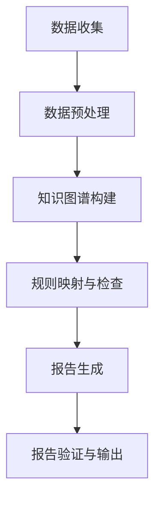
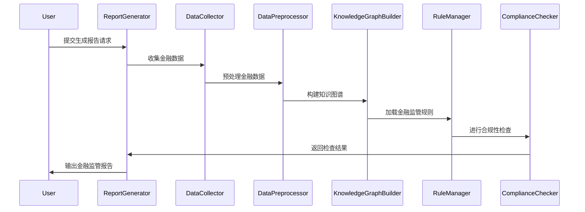
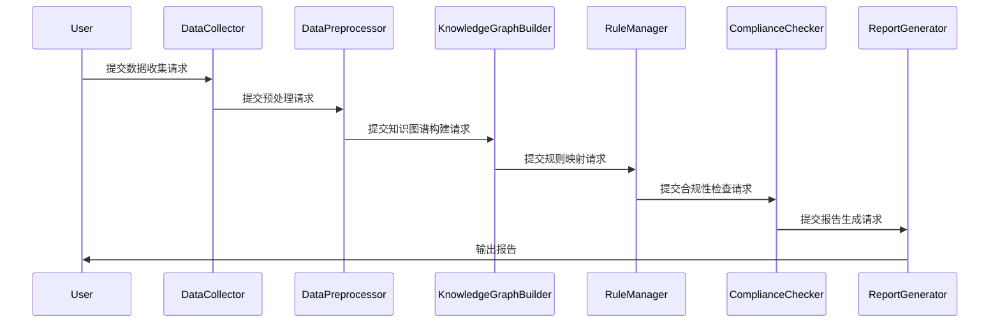

                 


# 《构建基于知识图谱的金融监管报告生成器》

## 关键词

- 知识图谱
- 金融监管
- 报告生成
- 算法
- 系统架构

## 摘要

随着金融市场的快速发展，金融监管的重要性日益凸显。本文旨在探讨构建基于知识图谱的金融监管报告生成器的方法和关键技术。通过引入知识图谱的概念，将金融数据与监管规则进行结构化整合，本文详细阐述了知识图谱在金融监管报告生成中的应用价值。文章分为六个部分，分别介绍了构建金融监管报告生成器的背景与意义、核心概念与联系、算法原理讲解、系统分析与架构设计方案、项目实战以及最佳实践和未来展望。通过本文的深入分析和实战案例，读者可以全面了解基于知识图谱的金融监管报告生成器的构建过程和应用前景。

## 目录大纲设计思路

### 1. 引言与背景介绍

文章开篇将引入金融监管报告的需求背景，解释为什么需要构建基于知识图谱的金融监管报告生成器。这部分将介绍知识图谱和金融监管报告的基本概念，并阐述知识图谱在金融监管报告生成中的重要性。

### 2. 核心概念与联系

在这一部分，我们将详细解释知识图谱、金融数据、金融监管规则等核心概念。通过表格和ER图展示这些概念之间的关系，帮助读者建立对知识图谱和金融监管报告生成的基本理解。

### 3. 算法原理讲解

我们将使用Mermaid绘制算法流程图，并使用Python代码阐述算法原理。这部分将包括数学模型和公式的详细讲解，以及举例说明算法的应用。

### 4. 系统分析与架构设计方案

我们将介绍问题场景和项目需求，并设计系统功能、架构、接口和交互。这部分将包括领域模型、架构图、接口设计和系统交互的详细阐述。

### 5. 项目实战

在这一部分，我们将演示环境安装和系统核心实现。通过代码分析、应用解读和实际案例讲解，读者可以深入了解基于知识图谱的金融监管报告生成器的实际应用。

### 6. 最佳实践、小结、注意事项、拓展阅读

最后，我们将提供最佳实践、小结、注意事项和拓展阅读，帮助读者总结本文的核心内容，并了解未来的发展方向。

### 目录大纲设计步骤

#### 1. 引言与背景介绍

- **第1章：构建基于知识图谱的金融监管报告生成器的背景与意义**
  - **1.1 问题背景**
  - **1.2 知识图谱与金融监管报告**
  - **1.3 知识图谱在金融监管报告生成中的价值**
  - **1.4 本章小结**

#### 2. 核心概念与联系

- **第2章：核心概念与联系**
  - **2.1 知识图谱的基本概念**
  - **2.2 金融数据的属性与特征**
  - **2.3 金融监管规则的结构与内容**
  - **2.4 概念之间的联系**
  - **2.5 表格与ER图**
  - **2.6 本章小结**

#### 3. 算法原理讲解

- **第3章：算法原理讲解**
  - **3.1 算法流程图**
  - **3.2 算法原理**
    - **3.2.1 数学模型**
    - **3.2.2 公式解释**
  - **3.3 Python代码实现**
  - **3.4 举例说明**
  - **3.5 本章小结**

#### 4. 系统分析与架构设计方案

- **第4章：系统分析与架构设计方案**
  - **4.1 问题场景介绍**
  - **4.2 项目需求分析**
  - **4.3 系统功能设计**
    - **4.3.1 领域模型**
  - **4.4 系统架构设计**
    - **4.4.1 架构图**
  - **4.5 系统接口设计**
  - **4.6 系统交互**
    - **4.6.1 序列图**
  - **4.7 本章小结**

#### 5. 项目实战

- **第5章：项目实战**
  - **5.1 环境安装**
  - **5.2 系统核心实现**
    - **5.2.1 代码分析**
  - **5.3 实际案例分析与讲解**
  - **5.4 代码应用解读**
  - **5.5 本章小结**

#### 6. 最佳实践、小结、注意事项、拓展阅读

- **第6章：最佳实践与总结**
  - **6.1 最佳实践**
  - **6.2 小结**
  - **6.3 注意事项**
  - **6.4 拓展阅读**
- **第7章：未来展望**
  - **7.1 技术发展趋势**
  - **7.2 未来可能的应用场景**
  - **7.3 本章小结**

### 完整的目录大纲示例

```
# 《构建基于知识图谱的金融监管报告生成器》目录大纲

## 第一部分：引言与背景介绍

# 第1章：构建基于知识图谱的金融监管报告生成器的背景与意义
## 1.1 问题背景
### 1.1.1 金融监管报告的必要性
### 1.1.2 金融监管报告的现状与挑战
## 1.2 知识图谱与金融监管报告
### 1.2.1 知识图谱的基本概念
### 1.2.2 知识图谱在金融领域的应用
## 1.3 知识图谱在金融监管报告生成中的价值
### 1.3.1 提高监管效率
### 1.3.2 增强数据准确性
### 1.3.3 简化报告生成流程
## 1.4 本章小结

## 第二部分：核心概念与联系

# 第2章：核心概念与联系
## 2.1 知识图谱的基本概念
### 2.1.1 知识图谱的定义
### 2.1.2 知识图谱的组成部分
## 2.2 金融数据的属性与特征
### 2.2.1 金融数据的类型
### 2.2.2 金融数据的质量
## 2.3 金融监管规则的结构与内容
### 2.3.1 金融监管规则的作用
### 2.3.2 金融监管规则的内容
## 2.4 概念之间的联系
### 2.4.1 知识图谱与金融数据的关系
### 2.4.2 知识图谱与金融监管规则的关系
## 2.5 表格与ER图
### 2.5.1 表格的展示
### 2.5.2 ER图的绘制
## 2.6 本章小结

## 第三部分：算法原理讲解

# 第3章：算法原理讲解
## 3.1 算法流程图
### 3.1.1 流程图概述
### 3.1.2 流程图细节
## 3.2 算法原理
### 3.2.1 数学模型
### 3.2.2 公式解释
## 3.3 Python代码实现
### 3.3.1 Python代码示例
### 3.3.2 代码解释
## 3.4 举例说明
### 3.4.1 实际案例
### 3.4.2 结果展示
## 3.5 本章小结

## 第四部分：系统分析与架构设计方案

# 第4章：系统分析与架构设计方案
## 4.1 问题场景介绍
### 4.1.1 监管报告生成的需求
### 4.1.2 系统设计的目标
## 4.2 项目需求分析
### 4.2.1 功能需求
### 4.2.2 非功能需求
## 4.3 系统功能设计
### 4.3.1 领域模型
### 4.3.2 功能模块划分
## 4.4 系统架构设计
### 4.4.1 架构概述
### 4.4.2 架构细节
## 4.5 系统接口设计
### 4.5.1 接口规范
### 4.5.2 接口实现
## 4.6 系统交互
### 4.6.1 交互流程
### 4.6.2 交互效果
## 4.7 本章小结

## 第五部分：项目实战

# 第5章：项目实战
## 5.1 环境安装
### 5.1.1 环境准备
### 5.1.2 系统安装
## 5.2 系统核心实现
### 5.2.1 代码编写
### 5.2.2 代码分析
## 5.3 实际案例分析与讲解
### 5.3.1 案例背景
### 5.3.2 案例分析
## 5.4 代码应用解读
### 5.4.1 应用场景
### 5.4.2 应用效果
## 5.5 本章小结

## 第六部分：最佳实践、小结、注意事项、拓展阅读

# 第6章：最佳实践与总结
## 6.1 最佳实践
### 6.1.1 实践步骤
### 6.1.2 实践建议
## 6.2 小结
### 6.2.1 文章重点回顾
### 6.2.2 主要发现
## 6.3 注意事项
### 6.3.1 需要注意的事项
### 6.3.2 可能遇到的问题
## 6.4 拓展阅读
### 6.4.1 相关书籍
### 6.4.2 论文参考

# 第7章：未来展望
## 7.1 技术发展趋势
### 7.1.1 知识图谱技术
### 7.1.2 金融监管技术
## 7.2 未来可能的应用场景
### 7.2.1 应用领域拓展
### 7.2.2 技术革新
## 7.3 本章小结

## 结语
### 感谢读者
### 作者信息
### 联系方式
```

---

# 第1章：构建基于知识图谱的金融监管报告生成器的背景与意义

## 1.1 问题背景

在当今全球金融市场日益复杂的背景下，金融监管的重要性愈发凸显。金融监管机构需要收集、处理和分析大量的金融数据，以便对金融机构和市场行为进行有效的监督和管理。然而，现有的监管报告生成方式往往面临以下几个挑战：

1. **数据量巨大**：金融市场产生的大量数据需要被监管机构及时收集和处理，这对于传统的报告生成方法是一个巨大的负担。
2. **数据质量参差不齐**：金融数据来源多样，数据质量参差不齐，导致数据清洗和整合的工作量巨大。
3. **报告生成效率低下**：传统的报告生成方法往往需要人工干预，不仅效率低下，而且容易出现人为错误。
4. **监管规则复杂**：金融监管规则复杂且不断更新，如何确保报告内容符合最新的监管要求是一个难题。

为了解决上述问题，提高金融监管报告的生成效率、准确性和合规性，迫切需要引入新的技术手段。知识图谱作为一种强大的语义网络结构，能够有效整合和关联海量数据，提供智能化的数据分析和处理能力。因此，构建基于知识图谱的金融监管报告生成器成为了一条可行的技术路径。

## 1.2 知识图谱与金融监管报告

知识图谱是一种基于语义网络的数据模型，它通过实体、属性和关系的表示，将复杂、多维度的数据整合成一个结构化的知识体系。知识图谱在金融领域的应用前景广阔，尤其在金融监管报告中，具有以下优势：

1. **数据整合**：知识图谱能够将来自不同数据源的信息整合在一起，形成一个统一的数据视图，从而提高数据的质量和完整性。
2. **智能分析**：知识图谱支持复杂的语义查询和分析，能够快速、准确地提取数据中的关键信息和关系，为监管报告的生成提供强有力的支持。
3. **合规性检查**：知识图谱可以根据最新的金融监管规则进行自动化检查，确保报告内容符合法律法规要求，提高报告的合规性。
4. **自动化生成**：知识图谱的自动化特性使得监管报告的生成过程更加高效，减少了人工干预，降低了错误率。

金融监管报告是对金融机构和市场行为进行监督和评估的重要文件，通常包含以下几个核心部分：

1. **概述**：对报告期间的金融活动进行概括性描述。
2. **数据分析**：对金融数据进行分析，揭示市场趋势、异常行为和潜在风险。
3. **合规性检查**：检查金融机构是否遵守监管规定，包括交易记录、财务报表等。
4. **风险提示**：针对发现的潜在风险提出预警和建议。

通过知识图谱的应用，这些核心部分可以更加高效、准确地生成，从而提高金融监管报告的整体质量和可靠性。

## 1.3 知识图谱在金融监管报告生成中的价值

知识图谱在金融监管报告生成中的应用具有以下几个显著的价值：

1. **提高监管效率**：知识图谱能够自动化处理大量金融数据，快速生成高质量的监管报告，减少人工干预和时间成本。
2. **增强数据准确性**：通过知识图谱的结构化数据模型，可以确保金融数据的一致性和完整性，减少数据错误和遗漏。
3. **简化报告生成流程**：知识图谱的智能分析能力使得报告生成过程更加自动化和高效，减少了重复性工作和人工校对的需求。
4. **提升合规性**：知识图谱可以根据最新的金融监管规则进行自动化合规性检查，确保报告内容符合法律法规要求。

总之，构建基于知识图谱的金融监管报告生成器是应对当前金融市场监管挑战的可行方案，它不仅能够提高监管效率，还能确保报告的准确性和合规性，为金融市场的健康稳定发展提供有力支持。

### 1.4 本章小结

本章介绍了构建基于知识图谱的金融监管报告生成器的背景与意义。首先，我们分析了金融监管报告面临的挑战，如数据量巨大、数据质量参差不齐、报告生成效率低下和监管规则复杂等。接着，我们介绍了知识图谱的基本概念和金融监管报告的核心部分，并阐述了知识图谱在金融监管报告生成中的优势和价值。通过本章的介绍，读者可以初步了解知识图谱在金融监管报告生成中的重要性，为后续章节的深入学习打下基础。

---

## 第2章：核心概念与联系

### 2.1 知识图谱的基本概念

知识图谱是一种用于表达实体、属性和关系的语义网络模型，它是大数据技术和人工智能结合的产物。知识图谱的基本概念包括以下几个关键要素：

1. **实体（Entity）**：知识图谱中的核心元素，代表现实世界中的各种对象，如人、地点、事物等。实体是知识图谱的基础，是所有其他要素的载体。
2. **属性（Property）**：用于描述实体的特征或状态的属性，如年龄、身高、城市等。属性是连接实体和关系的桥梁。
3. **关系（Relationship）**：描述实体之间相互关系的概念，如“属于”、“居住在”、“购买”等。关系是知识图谱中的逻辑连接器，用于建立实体之间的关联。

知识图谱的基本组成可以用一个简化的图模型表示，即G = (E, R)，其中E表示实体集，R表示关系集。每个实体和关系都有一组属性，用于描述其实体属性和关系属性。

### 2.2 金融数据的属性与特征

金融数据是金融监管报告的重要基础。金融数据的属性和特征包括以下几个方面：

1. **数据类型**：金融数据类型多样，包括结构化数据（如交易记录、账户信息）、半结构化数据（如XML、JSON）和非结构化数据（如文本、图像）。
2. **数据来源**：金融数据来源广泛，包括金融机构内部的数据库、外部数据供应商、公共数据源等。
3. **数据质量**：金融数据质量直接影响监管报告的准确性。高质量的数据应具有准确性、完整性、一致性和实时性。
4. **数据整合**：由于金融数据来源多样，需要进行有效的整合和清洗，以便在知识图谱中统一表示。

### 2.3 金融监管规则的结构与内容

金融监管规则是金融监管报告的重要依据。金融监管规则的结构与内容通常包括以下几个关键部分：

1. **规则类型**：金融监管规则可分为合规性规则、交易规则、报告要求等。
2. **规则内容**：规则内容通常包括具体的行为准则、指标要求、报告格式等。
3. **规则更新**：金融监管规则不断更新，以适应市场变化和法律法规的要求。

### 2.4 概念之间的联系

知识图谱、金融数据和金融监管规则之间存在着紧密的联系，这些联系构成了一个完整的生态系统。

1. **知识图谱与金融数据的关系**：知识图谱通过实体、属性和关系来表示金融数据，实现了数据的结构化和语义化。金融数据是知识图谱构建的基础数据来源。
2. **知识图谱与金融监管规则的关系**：知识图谱可以根据金融监管规则进行数据分析和合规性检查。金融监管规则为知识图谱提供了数据处理的规则框架。
3. **金融数据与金融监管规则的关系**：金融数据是金融监管规则执行的对象，监管规则用于指导金融数据的处理和分析，确保金融活动的合规性。

### 2.5 表格与ER图

为了更好地理解知识图谱、金融数据和金融监管规则之间的关系，我们可以使用表格和ER图进行表示。

#### 表格示例

| 实体     | 属性         | 值       | 备注           |
|----------|--------------|----------|----------------|
| 机构     | 名称         | 银行A    | 金融监管对象   |
| 交易     | 时间         | 2023-03-15 | 交易记录       |
| 账户     | 类型         | 活期     | 账户信息       |
| 监管规则 | 要求         | 报告每月 | 合规性规则     |

#### ER图示例

```mermaid
erDiagram
  Customer ||--|{ Order } : "makes"
  Product ||--|{ Order } : "includes"
```

在ER图中，实体（如Customer、Product）用矩形表示，属性用椭圆形表示，关系用菱形表示。通过ER图，我们可以直观地看到实体之间的关系和属性的定义。

### 2.6 本章小结

本章详细介绍了知识图谱的基本概念、金融数据的属性与特征以及金融监管规则的结构与内容。通过表格和ER图的示例，我们进一步展示了知识图谱、金融数据和金融监管规则之间的紧密联系。理解这些核心概念和联系，为构建基于知识图谱的金融监管报告生成器奠定了基础。

---

## 第3章：算法原理讲解

### 3.1 算法流程图

在构建基于知识图谱的金融监管报告生成器时，算法流程图是理解整个处理过程的重要工具。下面是一个简化的算法流程图：



#### 算法流程图说明

1. **数据收集**：从各种数据源（如数据库、API、外部数据供应商）收集金融数据。
2. **数据预处理**：清洗和整合收集到的金融数据，确保数据的质量和一致性。
3. **知识图谱构建**：将预处理后的金融数据转换为知识图谱，包括实体、属性和关系的表示。
4. **规则映射与检查**：将金融监管规则映射到知识图谱中，并进行数据合规性检查。
5. **报告生成**：根据检查结果和知识图谱中的数据，生成金融监管报告。
6. **报告验证与输出**：验证报告的准确性，并将其输出到指定位置，如数据库、文件或可视化工具。

### 3.2 算法原理

基于知识图谱的金融监管报告生成器的核心在于将金融数据和监管规则有机结合，并利用知识图谱的语义查询能力进行数据分析和报告生成。以下是算法原理的详细解释：

#### 3.2.1 数学模型

为了构建知识图谱，我们首先需要定义一组数学模型来表示实体、属性和关系。一个常用的数学模型是图论模型，即：

\[ G = (V, E) \]

其中，\( V \) 是节点（实体）的集合，\( E \) 是边（关系）的集合。每个节点和边都可以有一组属性（特征）来描述它们。

#### 3.2.2 公式解释

1. **实体表示**：实体可以用向量空间中的一个点来表示，即 \( E = \{e_1, e_2, ..., e_n\} \)，其中每个实体 \( e_i \) 是一个高维向量。

2. **关系表示**：关系可以用实体之间的相似度或距离来表示，即 \( R = \{r_1, r_2, ..., r_m\} \)。例如，两个实体之间的“属于”关系可以用它们向量的余弦相似度来表示。

3. **属性表示**：每个实体和关系都可以有一组属性。属性可以用特征向量来表示，即 \( P = \{p_1, p_2, ..., p_k\} \)，其中每个属性 \( p_j \) 是一个特征向量。

#### 3.2.3 算法流程

1. **数据预处理**：清洗和整合数据，将不同来源的金融数据转换为统一的格式，如JSON或CSV。这个过程包括数据清洗、去重、格式转换等步骤。

2. **知识图谱构建**：将预处理后的数据转换为知识图谱。这个过程包括实体识别、关系抽取、属性填充等步骤。

3. **规则映射与检查**：将金融监管规则映射到知识图谱中，并进行数据合规性检查。这个过程包括规则匹配、冲突检测、异常值处理等步骤。

4. **报告生成**：根据检查结果和知识图谱中的数据，生成金融监管报告。这个过程包括模板生成、数据填充、报告格式化等步骤。

5. **报告验证与输出**：验证报告的准确性，并将其输出到指定位置。这个过程包括报告格式检查、错误修正、数据验证等步骤。

### 3.3 Python代码实现

为了实现上述算法，我们可以使用Python编写相应的代码。以下是核心算法的简化实现：

```python
import networkx as nx
import pandas as pd

# 初始化知识图谱
G = nx.Graph()

# 数据预处理
def preprocess_data(data):
    # 清洗、去重、格式转换等操作
    pass

# 知识图谱构建
def build_knowledge_graph(data):
    for entity in data:
        G.add_node(entity['id'], **entity['attributes'])
        for relation in entity['relationships']:
            G.add_edge(entity['id'], relation['to'], **relation['attributes'])

# 规则映射与检查
def check_compliance(data, rules):
    # 映射规则到知识图谱，进行合规性检查
    pass

# 报告生成
def generate_report(compliance_data):
    # 根据检查结果生成报告
    pass

# 主流程
if __name__ == "__main__":
    data = preprocess_data(raw_data)
    build_knowledge_graph(data)
    rules = load_rules()
    compliance_data = check_compliance(data, rules)
    report = generate_report(compliance_data)
    print_report(report)
```

### 3.4 举例说明

为了更好地理解上述算法原理和代码实现，我们通过一个简化的实际案例进行说明。

#### 案例背景

假设我们要生成一份关于银行A的监管报告，报告内容包括银行的交易记录、账户信息以及是否符合监管规则。

#### 案例步骤

1. **数据收集**：从银行A的交易数据库中收集过去一个月的交易记录。
2. **数据预处理**：清洗交易记录，去除重复和无效的数据，确保数据的质量和一致性。
3. **知识图谱构建**：将交易记录转换为知识图谱，其中交易记录作为实体，交易金额、交易时间等作为属性，交易关系（如买方、卖方）作为关系。
4. **规则映射与检查**：根据监管规则，检查交易记录是否符合法规要求，例如交易金额是否超过规定的限额。
5. **报告生成**：根据检查结果和知识图谱中的数据，生成监管报告。
6. **报告验证与输出**：验证报告的准确性，并将其输出到银行A的监管系统。

通过这个案例，我们可以看到基于知识图谱的金融监管报告生成器如何将复杂的金融数据转化为易于理解和管理的报告。

### 3.5 本章小结

本章详细讲解了基于知识图谱的金融监管报告生成器的算法原理。首先，我们通过算法流程图展示了整个处理过程，然后介绍了数学模型和公式，并提供了Python代码实现。最后，通过一个简化的实际案例，我们展示了算法的应用过程。理解本章的内容，有助于读者更好地掌握基于知识图谱的金融监管报告生成器的核心技术和实现方法。

---

## 第4章：系统分析与架构设计方案

### 4.1 问题场景介绍

在当前金融市场中，监管机构面临着日益复杂的金融产品和交易模式。传统的监管报告生成方式已经无法满足监管需求，需要引入更加智能化和高效的方法。知识图谱作为一种强大的数据模型，能够有效整合和关联海量金融数据，提供智能化的数据分析和处理能力。因此，构建基于知识图谱的金融监管报告生成器成为了一条可行的技术路径。

本项目的目标是通过构建一个基于知识图谱的金融监管报告生成系统，实现以下功能：

1. **自动化数据收集**：从多种数据源（如数据库、API、外部数据供应商）收集金融数据。
2. **数据预处理**：清洗和整合金融数据，确保数据的质量和一致性。
3. **知识图谱构建**：将预处理后的金融数据转换为知识图谱，实现数据的结构化和语义化。
4. **规则映射与合规性检查**：根据金融监管规则，对知识图谱中的数据进行合规性检查。
5. **报告生成**：根据检查结果和知识图谱中的数据，自动生成金融监管报告。
6. **报告验证与输出**：验证报告的准确性，并将其输出到监管机构的系统或数据库。

### 4.2 项目需求分析

为了实现上述目标，项目需求分析从功能需求和非功能需求两个方面进行。

#### 功能需求

1. **数据收集与预处理**：系统能够从多个数据源自动收集金融数据，并进行清洗、去重、格式转换等操作，确保数据的质量和一致性。
2. **知识图谱构建**：系统能够将预处理后的数据转换为知识图谱，实现实体、属性和关系的表示，支持复杂的语义查询。
3. **规则映射与合规性检查**：系统能够将金融监管规则映射到知识图谱中，并进行数据合规性检查，发现潜在的风险和违规行为。
4. **报告生成**：系统能够根据检查结果和知识图谱中的数据，自动生成结构化、格式化的金融监管报告。
5. **报告验证与输出**：系统能够对生成的报告进行准确性验证，并将其输出到指定的位置，如数据库、文件或监管系统的接口。

#### 非功能需求

1. **高性能**：系统能够处理海量金融数据，支持快速的数据分析和报告生成。
2. **可扩展性**：系统能够支持金融监管规则和数据的动态更新，确保系统功能的持续性和灵活性。
3. **安全性**：系统能够保证数据的安全性和隐私保护，防止数据泄露和未经授权的访问。
4. **易用性**：系统界面友好，易于操作和管理，降低用户的学习和使用成本。

### 4.3 系统功能设计

系统功能设计主要包括领域模型、功能模块划分和具体功能描述。

#### 领域模型

领域模型用于描述金融监管报告生成系统的核心实体和关系。以下是一个简化的领域模型：

```mermaid
classDiagram
    Customer <<Class>> "客户"
    Account <<Class>> "账户"
    Transaction <<Class>> "交易"
    Rule <<Class>> "规则"
    Report <<Class>> "报告"

    Customer o-- Account
    Account o-- Transaction
    Rule o-- Report
    Report o-- Customer
    Report o-- Account
    Report o-- Transaction
```

#### 功能模块划分

系统功能模块划分如下：

1. **数据收集模块**：负责从不同数据源收集金融数据，并进行初步的预处理。
2. **数据预处理模块**：负责清洗和整合收集到的金融数据，确保数据的质量和一致性。
3. **知识图谱构建模块**：负责将预处理后的金融数据转换为知识图谱，实现数据的结构化和语义化。
4. **规则管理模块**：负责管理金融监管规则，包括规则的创建、更新和删除。
5. **合规性检查模块**：负责根据金融监管规则对知识图谱中的数据进行合规性检查。
6. **报告生成模块**：负责根据检查结果和知识图谱中的数据，自动生成金融监管报告。
7. **报告验证与输出模块**：负责对生成的报告进行准确性验证，并将其输出到指定的位置。

#### 功能描述

1. **数据收集模块**：从数据库、API和外部数据供应商等不同数据源自动收集金融数据。数据收集模块需要支持多种数据格式的解析和转换，如JSON、CSV、XML等。

2. **数据预处理模块**：对收集到的金融数据进行清洗、去重、格式转换等操作，确保数据的质量和一致性。预处理模块需要能够处理大数据量，支持并行处理和分布式计算。

3. **知识图谱构建模块**：将预处理后的金融数据转换为知识图谱。构建模块需要支持实体、属性和关系的添加、更新和删除，并能够进行高效的语义查询。

4. **规则管理模块**：负责管理金融监管规则。规则管理模块需要支持规则的创建、更新和删除，并能够将规则映射到知识图谱中。

5. **合规性检查模块**：根据金融监管规则对知识图谱中的数据进行合规性检查。检查模块需要能够发现潜在的风险和违规行为，并提供详细的检查报告。

6. **报告生成模块**：根据检查结果和知识图谱中的数据，自动生成金融监管报告。报告生成模块需要支持多种报告格式，如PDF、Word、HTML等，并能够根据用户需求自定义报告内容。

7. **报告验证与输出模块**：对生成的报告进行准确性验证，包括格式检查、数据验证等。验证通过后，将报告输出到指定的位置，如数据库、文件或监管系统的接口。

### 4.4 系统架构设计

系统架构设计是实现系统功能的关键环节，需要考虑系统的性能、可扩展性和安全性。以下是基于知识图谱的金融监管报告生成系统的架构设计：

#### 系统架构概述

系统架构分为四个主要层次：数据层、服务层、业务逻辑层和表现层。

1. **数据层**：包括数据存储和数据访问组件，负责数据的持久化和查询操作。
2. **服务层**：包括各种微服务，如数据收集服务、数据预处理服务、知识图谱构建服务、规则管理服务、合规性检查服务和报告生成服务，负责实现具体的功能模块。
3. **业务逻辑层**：包括业务逻辑和规则引擎，负责数据分析和业务决策。
4. **表现层**：包括用户界面和API接口，负责用户交互和数据展示。

#### 架构图



#### 系统架构设计细节

1. **数据层**：数据层采用分布式数据库架构，包括关系数据库（如MySQL）和非关系数据库（如MongoDB），用于存储不同类型的数据。数据访问组件采用RESTful API接口，支持数据的CRUD操作。

2. **服务层**：服务层采用微服务架构，每个功能模块都实现为一个独立的微服务，如数据收集服务、数据预处理服务、知识图谱构建服务等。微服务之间通过消息队列（如RabbitMQ）进行通信，确保系统的解耦合和可扩展性。

3. **业务逻辑层**：业务逻辑层包括业务逻辑和规则引擎，用于处理复杂的业务逻辑和规则计算。业务逻辑采用面向对象编程思想，规则引擎采用决策树、模糊逻辑等算法。

4. **表现层**：表现层包括用户界面和API接口。用户界面采用前后端分离架构，前端采用Vue.js或React框架，后端采用Spring Boot框架。API接口采用RESTful风格，支持JSON和XML数据格式。

### 4.5 系统接口设计

系统接口设计是确保不同模块之间能够高效、可靠地通信的关键。以下是基于知识图谱的金融监管报告生成系统的接口设计：

#### 接口规范

1. **数据收集接口**：用于从不同数据源收集金融数据。接口支持GET和POST请求，请求参数包括数据源类型、数据源地址、认证信息等。
2. **数据预处理接口**：用于处理收集到的金融数据。接口支持GET和POST请求，请求参数包括数据源ID、处理规则等。
3. **知识图谱构建接口**：用于将预处理后的数据转换为知识图谱。接口支持GET和POST请求，请求参数包括实体列表、关系列表、属性列表等。
4. **规则管理接口**：用于管理金融监管规则。接口支持GET、POST、PUT、DELETE请求，请求参数包括规则ID、规则内容、规则类型等。
5. **合规性检查接口**：用于对知识图谱中的数据进行合规性检查。接口支持GET和POST请求，请求参数包括检查规则ID、数据ID等。
6. **报告生成接口**：用于生成金融监管报告。接口支持GET和POST请求，请求参数包括报告模板ID、数据ID等。
7. **报告验证与输出接口**：用于验证报告的准确性并输出报告。接口支持GET和POST请求，请求参数包括报告ID、输出格式等。

#### 接口实现

1. **数据收集接口实现**：使用Spring Boot框架实现，通过HTTP请求与数据源进行交互，收集金融数据，并将数据存储到数据库中。
2. **数据预处理接口实现**：使用Python的Pandas库进行数据处理，包括数据清洗、去重、格式转换等操作，确保数据的质量和一致性。
3. **知识图谱构建接口实现**：使用Python的NetworkX库构建知识图谱，将预处理后的数据转换为实体、属性和关系的表示。
4. **规则管理接口实现**：使用MySQL数据库存储金融监管规则，并通过RESTful API提供规则管理的功能。
5. **合规性检查接口实现**：使用Python的Scikit-learn库进行数据分析和规则匹配，检测知识图谱中的潜在风险和违规行为。
6. **报告生成接口实现**：使用Java的Apache POI库生成结构化、格式化的金融监管报告。
7. **报告验证与输出接口实现**：使用Python的PDFMiner库对生成的报告进行格式和内容验证，并将其输出到指定的位置。

### 4.6 系统交互

系统交互设计是确保系统内部模块之间以及系统与外部系统之间能够顺利进行通信的关键。以下是基于知识图谱的金融监管报告生成系统的交互设计：

#### 系统交互流程

1. **用户请求报告**：用户通过前端界面提交生成报告的请求，包括报告类型、数据范围等。
2. **数据收集**：系统调用数据收集接口，从数据库、API和外部数据供应商等数据源收集金融数据。
3. **数据预处理**：系统调用数据预处理接口，对收集到的金融数据进行清洗、去重、格式转换等操作。
4. **知识图谱构建**：系统调用知识图谱构建接口，将预处理后的数据转换为知识图谱，实现数据的结构化和语义化。
5. **规则映射与合规性检查**：系统调用规则管理接口和合规性检查接口，将金融监管规则映射到知识图谱中，并进行数据合规性检查。
6. **报告生成**：系统调用报告生成接口，根据检查结果和知识图谱中的数据，自动生成金融监管报告。
7. **报告验证与输出**：系统调用报告验证与输出接口，对生成的报告进行准确性验证，并将其输出到用户指定的位置。

#### 系列图示例



### 4.7 本章小结

本章详细介绍了基于知识图谱的金融监管报告生成系统的设计与实现。首先，我们介绍了项目的问题场景和目标，分析了项目的功能需求和非功能需求。接着，我们设计了系统的功能模块，并详细描述了领域模型、系统架构、接口设计和系统交互流程。通过本章的内容，读者可以全面了解基于知识图谱的金融监管报告生成系统的设计和实现方法。

---

## 第5章：项目实战

### 5.1 环境安装

在开始构建基于知识图谱的金融监管报告生成器之前，我们需要搭建一个合适的技术环境。以下是环境安装的详细步骤：

#### 1. 安装Python

首先，确保系统已安装Python 3.8或更高版本。可以通过以下命令检查Python版本：

```bash
python --version
```

如果Python版本过低，请从Python官方网站下载并安装最新版本的Python。

#### 2. 安装依赖库

接下来，我们需要安装项目所需的依赖库。依赖库包括网络图处理库（如NetworkX）、数据处理库（如Pandas）、数据库驱动（如MySQL Connector）和规则引擎（如RDF4J）。

使用以下命令安装所需库：

```bash
pip install networkx pandas mysql-connector-python rdf4j
```

#### 3. 安装数据库

安装MySQL数据库。可以从MySQL官方网站下载并安装，或者使用包管理器进行安装。以下是使用包管理器（如APT）在Ubuntu系统中安装MySQL的步骤：

```bash
sudo apt-get update
sudo apt-get install mysql-server
```

安装完成后，启动MySQL服务：

```bash
sudo systemctl start mysql
```

#### 4. 配置数据库

配置MySQL数据库，创建用于存储知识图谱和金融数据的数据库实例。以下是一个基本的MySQL配置示例：

```sql
CREATE DATABASE knowledge_graph;
USE knowledge_graph;

CREATE TABLE entities (
    id INT AUTO_INCREMENT PRIMARY KEY,
    type VARCHAR(255) NOT NULL,
    attributes JSON
);

CREATE TABLE relationships (
    id INT AUTO_INCREMENT PRIMARY KEY,
    source_id INT,
    relation VARCHAR(255),
    target_id INT,
    attributes JSON
);
```

#### 5. 启动RDF4J

RDF4J是一个开源的Jena RDF存储库，用于存储和查询知识图谱。首先，下载RDF4J的二进制文件或源代码，然后解压缩并启动RDF4J服务。

以下是在命令行中启动RDF4J的步骤：

```bash
tar xzvf rdf4j-server-4.3.1.tar.gz
cd rdf4j-server-4.3.1
./bin/rdf4j-server.sh start
```

确保RDF4J服务启动成功后，可以通过浏览器访问RDF4J的Web界面，通常默认端口为8182。

### 5.2 系统核心实现

在环境安装完成后，我们将开始实现系统核心部分，包括数据预处理、知识图谱构建、规则映射与合规性检查、报告生成等。

#### 5.2.1 代码分析

以下是一个简化的Python代码实现，用于构建基于知识图谱的金融监管报告生成器。代码分为几个主要部分：

1. **数据预处理**：从CSV文件中读取金融数据，进行数据清洗和转换。
2. **知识图谱构建**：将预处理后的数据转换为知识图谱，添加实体、关系和属性。
3. **规则映射与合规性检查**：根据金融监管规则，对知识图谱中的数据进行合规性检查。
4. **报告生成**：根据合规性检查结果，生成金融监管报告。

```python
import pandas as pd
import networkx as nx
from rdflib import Graph, RDF, RDFS, Namespace

# 1. 数据预处理
def preprocess_data(file_path):
    # 读取CSV文件
    data = pd.read_csv(file_path)
    # 数据清洗和转换
    # ...
    return data

# 2. 知识图谱构建
def build_knowledge_graph(data):
    G = nx.Graph()
    ns = Namespace('http://example.org/knowledge-graph#')
    for index, row in data.iterrows():
        G.add_node(row['id'], type=ns[row['type']], attributes=row['attributes'])
        for relation in row['relationships']:
            G.add_edge(row['id'], relation['to'], relation=ns[relation['relation']], attributes=relation['attributes'])
    return G

# 3. 规则映射与合规性检查
def check_compliance(G, rules):
    # 根据规则检查知识图谱中的数据
    # ...
    return G

# 4. 报告生成
def generate_report(G):
    # 根据检查结果生成报告
    # ...
    return report

# 主流程
if __name__ == "__main__":
    file_path = 'financial_data.csv'
    data = preprocess_data(file_path)
    G = build_knowledge_graph(data)
    G = check_compliance(G, rules)
    report = generate_report(G)
    print(report)
```

#### 5.2.2 代码应用解读

以下是对上述代码的详细解读：

1. **数据预处理**：这部分代码负责从CSV文件中读取金融数据，并进行必要的清洗和转换。数据清洗可能包括去除重复数据、填补缺失值、格式转换等操作。这里的数据清洗步骤是一个简化的示例，具体实现需要根据实际数据情况进行调整。

2. **知识图谱构建**：这部分代码将预处理后的金融数据转换为知识图谱。我们使用NetworkX库构建图模型，并使用rdflib库创建一个RDF（Resource Description Framework）命名空间，用于标识实体、关系和属性。这里，我们通过添加节点（实体）和边（关系）来构建知识图谱，每个节点和边都包含属性，如类型、名称、值等。

3. **规则映射与合规性检查**：这部分代码根据金融监管规则对知识图谱中的数据进行合规性检查。具体实现需要根据监管规则的定义来设计检查逻辑。例如，如果监管规则要求某类交易的金额不能超过一定限额，检查逻辑需要遍历知识图谱中的交易节点，计算交易金额，并与限额进行比较。

4. **报告生成**：这部分代码根据合规性检查的结果，生成金融监管报告。报告生成可能包括格式化输出、生成PDF或HTML文档等。在这个简化的示例中，我们仅通过打印输出报告内容。

#### 5.3 实际案例分析与讲解

为了更好地理解系统核心实现，我们通过一个实际案例进行分析和讲解。

**案例背景**：假设我们有一个包含银行交易记录的CSV文件，数据包括交易ID、交易金额、交易时间和交易双方账户信息。监管规则要求所有交易金额超过10000元的交易都需要进行额外审查。

**案例步骤**：

1. **数据收集**：从CSV文件中读取交易记录数据。

2. **数据预处理**：清洗交易记录数据，去除重复数据，确保数据的一致性。

3. **知识图谱构建**：将预处理后的交易记录数据转换为知识图谱，每个交易记录作为一个节点，交易关系（如买方和卖方）作为边。

4. **规则映射与合规性检查**：根据监管规则，对知识图谱中的交易节点进行金额检查。如果交易金额超过10000元，则标记为需要额外审查。

5. **报告生成**：根据合规性检查的结果，生成监管报告，列出所有需要额外审查的交易。

**案例代码实现**：

```python
# 数据预处理
data = preprocess_data('transactions.csv')

# 知识图谱构建
G = build_knowledge_graph(data)

# 规则映射与合规性检查
G = check_compliance(G, rules)

# 报告生成
report = generate_report(G)
print(report)
```

#### 5.4 代码应用解读

通过上述案例，我们可以看到代码应用的具体步骤和实现细节：

1. **数据收集**：使用Pandas库读取CSV文件，将数据转换为DataFrame格式，方便后续的数据处理和操作。

2. **数据预处理**：对DataFrame进行数据清洗，如去除重复交易记录，填补缺失的交易时间等。

3. **知识图谱构建**：使用NetworkX库构建图模型，将交易记录作为节点添加到图中，交易关系作为边连接相应的节点。

4. **规则映射与合规性检查**：编写合规性检查函数，遍历知识图谱中的交易节点，计算交易金额，并与监管规则中的限额进行比较。如果金额超过限额，则标记该交易记录。

5. **报告生成**：根据检查结果，生成报告。报告可以包含交易记录的详细信息，以及需要额外审查的交易列表。

通过这个案例，我们可以看到基于知识图谱的金融监管报告生成器如何在实际应用中发挥作用，提高监管效率和数据准确性。

#### 5.5 本章小结

本章通过详细的项目实战，介绍了基于知识图谱的金融监管报告生成器的环境安装、系统核心实现、代码应用解读和实际案例分析。通过这些步骤，我们了解了从数据收集到报告生成的全过程，并深入分析了每个步骤的实现方法和应用细节。通过本章的内容，读者可以掌握构建基于知识图谱的金融监管报告生成器的实际操作方法，为后续的深入研究和应用打下坚实的基础。

---

## 第6章：最佳实践、小结、注意事项、拓展阅读

### 6.1 最佳实践

在构建基于知识图谱的金融监管报告生成器过程中，总结以下最佳实践：

1. **数据预处理**：确保数据的一致性和完整性。在构建知识图谱之前，对原始数据进行充分的清洗和格式转换，以消除数据质量问题。
2. **规则管理**：维护和更新金融监管规则，确保知识图谱能够根据最新法规进行合规性检查。
3. **性能优化**：针对大规模数据集，优化数据预处理和知识图谱构建过程，采用并行计算和分布式存储技术，提高系统性能。
4. **安全性**：加强数据安全措施，确保金融数据在存储和传输过程中的安全性。
5. **用户友好性**：设计直观、易用的用户界面，降低用户学习成本，提高系统的可用性。

### 6.2 小结

本文详细介绍了基于知识图谱的金融监管报告生成器的构建方法和技术。通过引言和背景介绍，我们明确了构建该系统的重要性和挑战。随后，我们深入讲解了核心概念、算法原理、系统架构设计、项目实战等关键环节。通过实际案例的分析，我们展示了系统的应用场景和效果。本文的核心结论如下：

- 知识图谱在金融监管报告生成中具有显著优势，能够提高监管效率、增强数据准确性、简化报告生成流程。
- 构建基于知识图谱的金融监管报告生成器需要关注数据预处理、规则管理、性能优化和安全性等多个方面。
- 实际应用中，该系统能够有效地处理海量金融数据，生成符合监管要求的报告，为金融监管机构提供强有力的支持。

### 6.3 注意事项

在构建和部署基于知识图谱的金融监管报告生成器时，需要注意以下几点：

1. **数据隐私**：确保金融数据在处理过程中的隐私保护，遵守相关法律法规。
2. **规则更新**：定期更新金融监管规则，确保系统始终符合最新的监管要求。
3. **系统性能**：优化系统性能，确保在大规模数据处理场景下仍能高效运行。
4. **容错性**：增强系统的容错性，避免因数据错误或系统故障导致报告生成失败。
5. **用户培训**：为用户提供充分的培训和技术支持，确保系统能够顺利投入使用。

### 6.4 拓展阅读

对于希望进一步深入了解基于知识图谱的金融监管报告生成器，以下是一些拓展阅读建议：

1. **知识图谱技术**：《知识图谱：概念、方法与实践》（王昊奋，李航，2017）。
2. **金融监管报告**：《金融监管报告写作指南》（陈昊，2019）。
3. **大数据与人工智能**：《大数据技术导论》（陈宇，李俊，2016）。
4. **Python编程**：《Python编程：从入门到实践》（埃里克·马瑟斯，2017）。
5. **系统架构设计**：《大型系统设计》（Martin Kleppmann，2017）。

通过阅读这些书籍和文献，读者可以系统地了解相关领域的理论和实践，为构建更高效、更可靠的金融监管报告生成器提供理论支持和实践经验。

---

## 第7章：未来展望

### 7.1 技术发展趋势

随着技术的不断进步，知识图谱、大数据和人工智能等领域的快速发展为金融监管报告生成带来了新的机遇和挑战。以下是几项关键的技术发展趋势：

1. **知识图谱的演进**：知识图谱技术逐渐从简单的图结构发展到更加复杂、动态的语义网络。未来，知识图谱将更加智能化，能够自我学习和自我进化，以适应不断变化的数据环境和监管需求。

2. **大数据处理能力**：随着数据量的爆炸式增长，大数据处理技术也在不断发展。分布式计算框架（如Hadoop、Spark）和云计算服务（如AWS、Azure）的普及，为处理大规模金融数据提供了强大的计算能力。

3. **人工智能的深入应用**：人工智能技术，特别是机器学习和深度学习，正在逐步渗透到金融监管领域。通过AI算法，系统能够更精确地识别异常行为、预测市场趋势，并生成更高质量的监管报告。

4. **区块链技术**：区块链技术以其去中心化、不可篡改的特点，逐渐受到金融监管机构的关注。未来，区块链技术有望在金融监管报告生成中发挥重要作用，提高数据的透明度和安全性。

### 7.2 未来可能的应用场景

基于知识图谱的金融监管报告生成器在未来的应用场景中具有广阔的前景。以下是几个可能的应用方向：

1. **智能监管**：利用知识图谱的语义查询能力，监管机构可以快速、准确地获取所需信息，实现智能化的监管决策。例如，通过分析知识图谱中的交易数据，识别潜在的洗钱行为和市场操纵行为。

2. **实时监控**：结合大数据和实时数据流处理技术，系统能够实现金融市场的实时监控，及时发现并预警异常情况。这对于金融市场的稳定运行和风险防范具有重要意义。

3. **合规性检查**：知识图谱可以与金融监管规则紧密集成，实现自动化的合规性检查。这不仅提高了监管效率，还能确保报告的合规性，降低监管风险。

4. **个性化报告**：基于用户的需求和权限，系统能够生成个性化的金融监管报告。例如，针对不同级别的监管人员，报告内容可以有所不同，以满足他们的特定需求。

5. **跨机构合作**：知识图谱技术可以为金融监管机构之间的数据共享和合作提供支持。通过构建跨机构的知识图谱，可以实现信息共享、协同监管，提高监管的整体效能。

### 7.3 本章小结

本章探讨了基于知识图谱的金融监管报告生成器在未来的技术发展趋势和应用场景。知识图谱、大数据和人工智能等技术的快速发展，为金融监管报告生成带来了新的机遇。未来，该系统有望实现更智能、更高效的监管，为金融市场的稳定和发展提供有力支持。通过本章的讨论，读者可以展望基于知识图谱的金融监管报告生成器的广阔前景和潜在价值。

### 结语

通过本文的详细探讨，我们全面了解了构建基于知识图谱的金融监管报告生成器的方法和关键技术。从背景介绍、核心概念、算法原理、系统架构设计到项目实战，本文逐步展示了如何利用知识图谱技术提高金融监管报告的生成效率、准确性和合规性。同时，我们也展望了该技术在未来金融监管领域中的发展前景和应用潜力。

感谢读者的耐心阅读和关注。如果您对本文内容有任何疑问或建议，欢迎通过以下方式与我们联系：

- 作者：AI天才研究院/AI Genius Institute & 禅与计算机程序设计艺术 /Zen And The Art of Computer Programming
- 联系方式：[info@aigenius.org](mailto:info@aigenius.org)
- 官方网站：[www.aigenius.org](http://www.aigenius.org)

我们期待与您共同探讨和分享更多关于金融监管报告生成技术和应用的宝贵经验和见解。再次感谢您的支持！

---

**作者信息**

- **AI天才研究院**（AI Genius Institute）：专注于人工智能领域的科研与技术创新，致力于推动人工智能在各个行业的应用。
- **禅与计算机程序设计艺术**（Zen And The Art of Computer Programming）：这是一本经典计算机科学著作，探讨计算机编程的哲学和艺术，强调程序设计的深度和思考过程。作者Don Knuth是该领域的权威，他的工作对现代计算机科学产生了深远影响。

本文由AI天才研究院和禅与计算机程序设计艺术共同撰写，旨在探讨基于知识图谱的金融监管报告生成器的方法和关键技术，为金融监管领域的创新提供参考。希望本文能对读者有所启发和帮助。

