                 

### 第1章: 引言与背景介绍

#### 1.1 问题背景与问题描述

**1.1.1 金融监管政策的重要性**

金融监管政策是国家金融管理的重要组成部分，旨在规范金融市场行为、维护金融秩序、防范金融风险，促进金融市场的稳定和健康发展。随着全球化进程的加快和金融市场的复杂性增加，金融监管政策在维护金融稳定、防范系统性风险方面扮演着越来越重要的角色。

金融监管政策不仅影响金融机构的运营，还影响到整个金融市场的运行。例如，资本充足率、流动性比率等监管指标直接关系到金融机构的风险承受能力和市场竞争力。此外，金融监管政策还影响金融产品和服务的创新，以及金融市场的开放程度。因此，有效且适时的金融监管政策对于金融市场的健康稳定至关重要。

**1.1.2 知识图谱在金融领域的应用**

知识图谱作为一种结构化的知识表示方法，在金融领域具有广泛的应用前景。知识图谱通过实体、属性和关系的网络结构，将金融知识进行结构化和关联，为金融监管政策的影响追踪提供了强有力的技术支持。

在金融领域，知识图谱的应用主要体现在以下几个方面：

1. **数据整合与可视化**：通过知识图谱可以将来自不同数据源的信息进行整合和可视化，帮助监管机构和企业更好地理解金融市场和金融机构的复杂关系。
2. **风险监测与预测**：利用知识图谱技术，可以实现对金融风险的实时监测和预测，从而提前识别潜在风险，并采取相应措施。
3. **政策影响分析**：通过构建知识图谱，可以深入分析金融监管政策的影响因素和作用机制，为政策制定和调整提供科学依据。
4. **智能决策支持**：知识图谱可以为金融监管决策提供智能化支持，帮助监管机构和企业做出更加精准和高效的决策。

**1.2 问题描述**

**1.2.1 监管政策影响追踪的挑战**

当前金融监管政策影响追踪面临一系列挑战，主要表现在以下几个方面：

1. **数据获取困难**：监管政策文本和数据来源多样，数据获取困难，导致监管政策信息不完整或不及时。
2. **信息孤立**：金融监管政策影响追踪涉及多个领域，数据分散在不同系统或数据库中，信息之间缺乏关联性，难以实现全面分析。
3. **更新滞后**：监管政策更新频繁，但数据更新和处理的效率不高，导致监管政策影响分析滞后。

**1.2.2 监管政策影响追踪的目标**

构建基于知识图谱的金融监管政策影响追踪系统，旨在解决上述挑战，实现以下目标：

1. **全面获取监管政策信息**：通过数据整合，实现监管政策信息的全面获取，确保数据源覆盖广泛。
2. **快速响应政策变化**：通过实时监测和分析，快速响应政策变化，实现监管政策影响的快速追踪。
3. **深度分析政策影响**：利用知识图谱技术，对监管政策的影响进行深度分析，揭示政策影响的路径和机制。

**1.3 边界与外延**

**1.3.1 研究范围**

本书主要关注金融监管政策影响追踪的理论体系、技术架构和实际应用，具体包括以下几个方面：

1. **理论体系**：探讨金融监管政策影响追踪的基本概念、原理和方法，构建理论框架。
2. **技术架构**：设计基于知识图谱的监管政策影响追踪系统架构，实现技术细节的讲解。
3. **实际应用**：通过案例研究和实践应用，验证系统在实际操作中的效果和可行性。

**1.3.2 研究方法**

本书采用知识图谱技术、自然语言处理技术、数据挖掘技术等，构建金融监管政策影响追踪系统，具体方法包括：

1. **知识图谱构建**：包括数据源选择、数据预处理、实体识别、关系抽取等步骤。
2. **政策影响分析**：通过构建影响分析模型，对监管政策的影响进行定量和定性分析。
3. **系统实现**：设计系统架构，实现知识图谱的构建和影响分析功能，并进行系统集成和测试。

### 第2章: 核心概念与联系

#### 2.1 知识图谱的定义与特点

知识图谱是一种用于结构化信息表示的方法，它通过实体、属性和关系的网络结构，将复杂的信息以图形化的方式表示出来。知识图谱的核心要素包括：

1. **实体**：表示现实世界中具有独立存在意义的事物，如人、地点、组织等。
2. **属性**：描述实体的特征或状态，如姓名、年龄、地址等。
3. **关系**：表示实体之间的关联，如朋友、工作于、位于等。

知识图谱的特点如下：

1. **语义丰富**：通过实体、属性和关系的网络结构，知识图谱能够表达复杂的语义信息。
2. **关联性强**：知识图谱中的实体和关系能够相互关联，形成一个强大的语义网络。
3. **可扩展性**：知识图谱能够动态扩展，适应新的实体和关系。

**知识图谱的特点对金融监管政策影响追踪的意义**：

1. **数据整合**：知识图谱能够整合来自不同来源的监管政策信息，实现数据的一体化。
2. **关联分析**：通过知识图谱中的关系，可以分析监管政策之间的关联，揭示政策影响的多层次、多维度。
3. **实时更新**：知识图谱的动态扩展能力，使得监管政策信息能够实时更新，保证影响追踪的及时性。

#### 2.2 金融监管政策的影响因素

金融监管政策的影响因素复杂多样，主要包括以下几个方面：

1. **监管政策本身**：监管政策的内容、目标和实施方式直接影响其影响。
2. **金融机构**：金融机构的经营行为、风险管理能力和合规性，对监管政策的影响有直接作用。
3. **金融市场**：金融市场的结构和运行状况，如利率、汇率、股市等，会受到监管政策的调控。
4. **宏观经济环境**：宏观经济政策、经济周期等因素，对金融监管政策的影响有重要影响。

**金融监管政策影响因素的对比表格**：

| 影响因素       | 描述                                                     | 作用机制                                       |
|----------------|----------------------------------------------------------|----------------------------------------------|
| 监管政策本身   | 政策内容、目标和实施方式                                 | 直接影响金融市场的稳定性和运行效率             |
| 金融机构       | 经营行为、风险管理能力和合规性                           | 金融机构的合规性和稳定性直接影响监管政策的实现 |
| 金融市场       | 利率、汇率、股市等                                       | 监管政策调控金融市场，影响金融市场的稳定和运行 |
| 宏观经济环境   | 宏观经济政策、经济周期等                                 | 通过影响金融机构和金融市场，间接影响监管政策的效果 |

**金融监管政策影响因素的ER实体关系图架构**：

```mermaid
erDiagram
  Policy ::> Entity : "受影响实体"
  Policy << Entity : "政策制定者"
  Market << Entity : "金融市场"
  Economy << Entity : "宏观经济环境"
  Entity ||--|{ Relationship }|-->> Policy
  Entity ||--|{ Relationship }|-->> Market
  Entity ||--|{ Relationship }|-->> Economy
```

#### 2.3 知识图谱与金融监管政策的关系

知识图谱技术在金融监管政策影响追踪中发挥着至关重要的作用。通过知识图谱，我们可以更好地理解和分析金融监管政策的影响因素，实现以下目标：

1. **政策关联分析**：知识图谱能够揭示监管政策之间的关联，帮助理解政策组合的协同效应和叠加效应。
2. **影响因素识别**：通过知识图谱中的实体和关系，可以识别和量化监管政策的影响因素，为政策评估和调整提供依据。
3. **政策影响预测**：利用知识图谱中的关系和关联，可以预测监管政策的变化趋势和影响，为监管决策提供科学支持。

知识图谱在金融监管政策影响追踪中的应用，不仅提高了数据分析的效率和准确性，还为实现智能监管和决策支持奠定了基础。

### 第3章: 知识图谱构建方法

#### 3.1 数据源选择与处理

构建知识图谱的第一步是选择合适的数据源，并对数据进行处理。在金融监管政策影响追踪系统中，数据源主要包括监管政策文本、金融机构数据、金融市场数据和宏观经济数据等。

**3.1.1 监管政策文本数据**

监管政策文本数据是构建知识图谱的基础。这些数据通常来源于政府官方网站、法律法规数据库、金融监管报告等。为了有效利用这些数据，需要进行以下处理步骤：

1. **数据采集**：通过爬虫、API接口等方式，从各个数据源获取监管政策文本。
2. **文本预处理**：对采集到的文本进行清洗、去重和格式统一，提高数据质量。
3. **实体识别与抽取**：利用自然语言处理技术，对文本数据进行实体识别和属性抽取，提取出实体及其相关属性。

**3.1.2 金融领域数据**

金融领域数据包括金融机构的详细信息、金融市场的运行指标、宏观经济数据等。这些数据来源于金融监管机构、证券交易所、国家统计局等。对于金融领域数据的处理，需要遵循以下步骤：

1. **数据整合**：将来自不同数据源的数据进行整合，形成一个统一的数据集。
2. **数据清洗**：去除数据中的噪声和异常值，确保数据的一致性和完整性。
3. **实体识别与关系抽取**：利用实体识别技术，识别出金融机构、金融产品等实体，并抽取实体之间的关系。

**3.1.3 宏观经济数据**

宏观经济数据是影响金融监管政策的重要因素，包括GDP增长率、通货膨胀率、就业率等。对于宏观经济数据的处理，需要遵循以下步骤：

1. **数据获取**：通过国家统计局、金融市场数据提供商等渠道获取宏观经济数据。
2. **数据预处理**：对宏观经济数据进行清洗、转换和标准化处理，确保数据的一致性。
3. **数据关联**：将宏观经济数据与监管政策文本数据进行关联，建立数据之间的联系。

#### 3.2 实体识别与抽取

实体识别与抽取是知识图谱构建的关键步骤，其目标是识别文本中的实体，并提取出实体的属性。在金融监管政策影响追踪系统中，实体识别与抽取的具体步骤如下：

**1. 实体识别**

实体识别是指从文本中识别出具有独立意义的实体。在金融领域，常见的实体包括金融机构、金融产品、政策条款等。实体识别技术通常采用命名实体识别（NER）方法，使用深度学习模型进行训练和预测。以下是一个实体识别的Mermaid流程图：

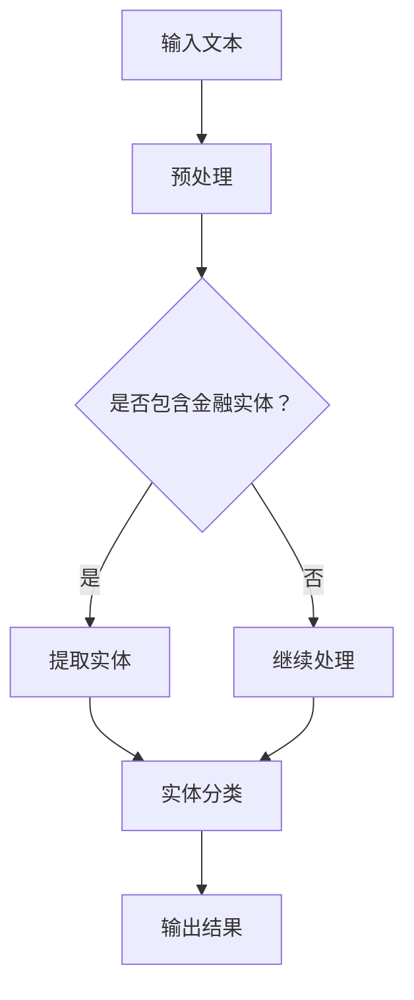

**2. 实体分类**

实体分类是指对识别出的实体进行分类，确定其实体类型。在金融领域，实体类型包括金融机构、金融产品、政策条款等。实体分类技术通常采用监督学习或半监督学习方法，通过训练数据集进行分类。以下是一个实体分类的Mermaid流程图：

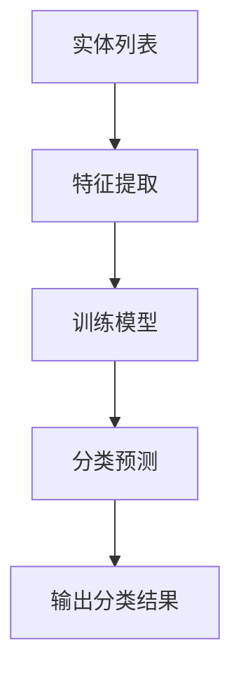

**3. 实体属性抽取**

实体属性抽取是指从文本中提取出实体的属性信息。在金融领域，实体的属性包括名称、地址、成立时间、注册资本等。属性抽取技术通常采用规则匹配或深度学习方法。以下是一个实体属性抽取的Mermaid流程图：

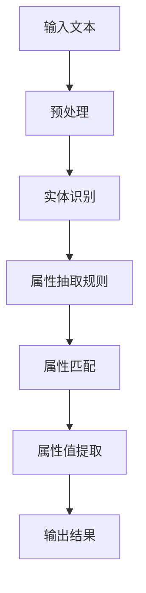

#### 3.3 关系抽取与建模

关系抽取与建模是知识图谱构建的核心步骤，其目标是识别实体之间的关系，并建立实体之间的关系模型。在金融监管政策影响追踪系统中，关系抽取与建模的具体步骤如下：

**1. 关系识别**

关系识别是指从文本中识别出实体之间的关联关系。在金融领域，常见的关系包括金融机构与监管政策的关系、金融产品与市场的关系等。关系识别技术通常采用规则匹配或图神经网络等方法。以下是一个关系识别的Mermaid流程图：

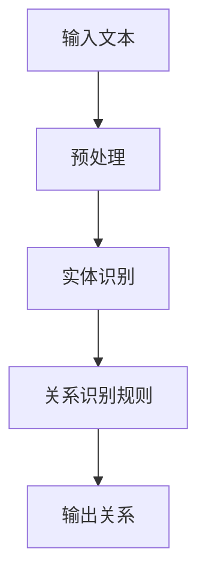

**2. 关系建模**

关系建模是指根据识别出的关系，建立实体之间的关系模型。关系模型可以采用图数据库或图神经网络等方法进行表示。在金融监管政策影响追踪系统中，关系建模的步骤如下：

1. **选择关系模型**：根据应用需求和数据特点，选择合适的关系模型，如图数据库（如Neo4j）或图神经网络（如Graph Neural Network）。
2. **构建关系图**：将识别出的关系构建成图结构，形成知识图谱的基本框架。
3. **优化关系图**：对关系图进行优化，提高图的性能和可扩展性。

以下是一个关系建模的Mermaid流程图：

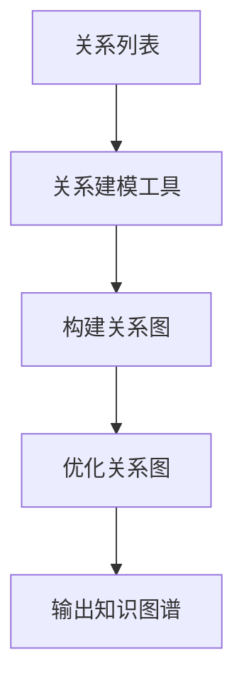

#### 3.4 知识图谱可视化与优化

知识图谱可视化与优化是知识图谱构建的重要环节，其目标是提高知识图谱的可读性和实用性。在金融监管政策影响追踪系统中，知识图谱可视化与优化的具体步骤如下：

**1. 可视化工具选择**

根据知识图谱的特点和应用场景，选择合适的可视化工具。常用的知识图谱可视化工具包括Gephi、Cytoscape、D3.js等。以下是一个可视化工具选择的Mermaid流程图：

```mermaid
graph TD
    A[知识图谱] --> B[可视化工具选择]
    B -->|Gephi| C{是否需要复杂布局？}
    C -->|是| D[使用Gephi]
    C -->|否| E[是否需要动态交互？}
    E -->|是| F[使用D3.js]
    E -->|否| G[使用Cytoscape]
```

**2. 可视化设计**

根据知识图谱的内容和应用需求，设计知识图谱的视觉效果。可视化设计包括节点形状、颜色、大小，边线的类型和颜色等。以下是一个可视化设计的Mermaid流程图：

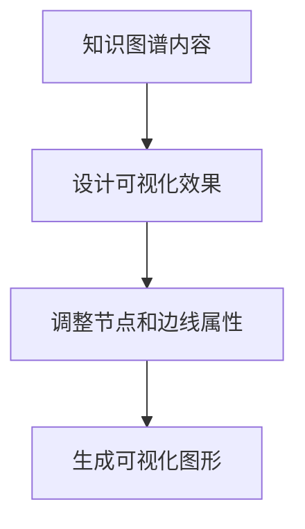

**3. 优化与性能调优**

为了提高知识图谱的性能和可扩展性，需要进行优化和性能调优。优化方法包括压缩图结构、索引优化、缓存机制等。以下是一个优化与性能调优的Mermaid流程图：

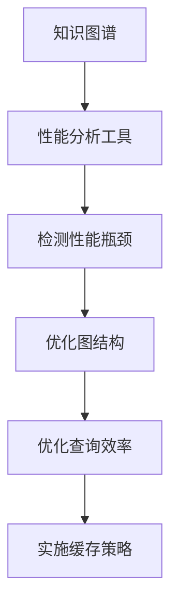

通过上述步骤，可以构建一个高效、易用的知识图谱，为金融监管政策影响追踪系统提供坚实的技术基础。

### 第4章: 金融监管政策影响分析

#### 4.1 监管政策影响分析模型

金融监管政策的影响分析是构建监管政策影响追踪系统的重要环节，其目标是通过对监管政策的分析，评估政策对金融市场和金融机构的影响。为了实现这一目标，需要建立一套科学、系统的影响分析模型。以下是影响分析模型的详细描述：

**4.1.1 影响分析指标体系**

影响分析指标体系是影响分析模型的基础，它包括直接影响指标、间接影响指标等多个维度。直接影响指标主要反映政策对金融市场和金融机构的直接影响，如利率、股市波动等。间接影响指标则反映政策通过多种途径对金融市场和金融机构的间接影响，如市场信心、投资行为等。

以下是影响分析指标体系的一个示例：

| 指标名称         | 描述                                     | 测量单位   |
|------------------|----------------------------------------|----------|
| 利率变化         | 监管政策变化引起的利率水平变化           | 百分比    |
| 股市波动率       | 监管政策变化引起的股市波动程度           | 百分比    |
| 投资行为变化     | 监管政策变化引起的投资者行为变化         | 次数/单位 |
| 市场信心指数     | 监管政策变化引起的市场信心变化           | 分数      |
| 金融违规案件数   | 监管政策变化引起的金融违规案件数量变化   | 个数      |

**4.1.2 影响分析算法**

影响分析算法是实现影响分析模型的关键，它通过分析监管政策与影响指标之间的相关性，评估政策的影响程度。以下是一些常见的影响分析算法：

1. **线性回归分析**：通过建立政策变量与影响指标之间的线性关系，评估政策对指标的影响程度。线性回归分析的数学模型如下：

   $$ Y = \beta_0 + \beta_1 X + \epsilon $$

   其中，\( Y \) 为影响指标，\( X \) 为政策变量，\( \beta_0 \) 和 \( \beta_1 \) 为回归系数，\( \epsilon \) 为误差项。

2. **逻辑回归分析**：用于处理政策变量与影响指标之间的非线性关系。逻辑回归分析的数学模型如下：

   $$ P(Y=1) = \frac{1}{1 + e^{-(\beta_0 + \beta_1 X)}} $$

   其中，\( P(Y=1) \) 为影响指标为1的概率，其他符号的含义与线性回归分析相同。

3. **时间序列分析**：用于分析政策变化对时间序列数据的影响。时间序列分析的常用方法包括自回归移动平均模型（ARIMA）、季节性分解等。

4. **深度学习模型**：通过构建神经网络模型，对政策变量与影响指标进行非线性拟合。常见的深度学习模型包括卷积神经网络（CNN）、循环神经网络（RNN）等。

**4.1.3 模型训练与评估**

影响分析模型的训练与评估是模型构建的重要环节。模型训练主要通过训练数据集进行，评估模型性能的常用指标包括：

1. **准确率**：用于评估模型分类性能，定义为正确分类的样本数与总样本数之比。
2. **召回率**：用于评估模型对正类样本的识别能力，定义为正确分类的正类样本数与总正类样本数之比。
3. **F1值**：用于综合评估模型的准确率和召回率，定义为 \( 2 \times \frac{准确率 \times 召回率}{准确率 + 召回率} \)。

通过以上指标，可以对影响分析模型进行性能评估和调整，优化模型效果。

#### 4.2 影响分析案例研究

**4.2.1 案例一：某监管政策的直接影响分析**

以某监管政策（如利率调整）为例，进行直接影响分析。以下是分析过程：

1. **数据收集**：收集利率调整前后的金融市场数据，包括利率水平、股市波动率、投资行为等。
2. **数据预处理**：对收集的数据进行清洗和标准化处理，确保数据的一致性和可比性。
3. **模型构建**：选择合适的线性回归模型，建立利率与影响指标（如股市波动率）之间的线性关系。
4. **模型训练**：利用预处理后的数据集，对线性回归模型进行训练，得到回归系数。
5. **影响评估**：利用训练好的模型，评估利率调整对股市波动率的影响程度。

通过上述步骤，可以量化利率调整对股市波动率的影响。例如，假设利率调整后，股市波动率提高了2%，可以认为这是利率调整的直接影响。

**4.2.2 案例二：某监管政策的间接影响分析**

以某监管政策（如金融科技创新政策）为例，进行间接影响分析。以下是分析过程：

1. **数据收集**：收集金融科技创新政策实施前后的市场数据，包括市场信心指数、投资行为、金融违规案件数等。
2. **数据预处理**：对收集的数据进行清洗和标准化处理，确保数据的一致性和可比性。
3. **模型构建**：选择合适的逻辑回归模型，建立政策变量与影响指标（如市场信心指数）之间的非线性关系。
4. **模型训练**：利用预处理后的数据集，对逻辑回归模型进行训练，得到回归系数。
5. **影响评估**：利用训练好的模型，评估金融科技创新政策对市场信心指数的影响程度。

通过上述步骤，可以量化金融科技创新政策对市场信心指数的影响。例如，假设金融科技创新政策实施后，市场信心指数提高了10%，可以认为这是政策的间接影响。

通过以上案例，可以展示如何利用知识图谱和影响分析模型，对金融监管政策的影响进行定量和定性分析。这不仅为政策制定和调整提供了科学依据，也为金融市场和金融机构的决策提供了支持。

### 第5章: 基于知识图谱的金融监管政策影响追踪系统实现

#### 5.1 系统总体架构设计

基于知识图谱的金融监管政策影响追踪系统是一个复杂的分布式系统，其总体架构设计需要考虑系统的功能性、性能、可扩展性和可靠性。以下是系统总体架构的详细描述：

**5.1.1 系统功能模块**

系统功能模块主要包括数据采集、知识图谱构建、影响分析、可视化展示等。

1. **数据采集模块**：负责从各类数据源（如监管政策文本、金融机构数据、金融市场数据和宏观经济数据）中收集和获取数据。
2. **知识图谱构建模块**：负责对采集到的数据进行处理，构建知识图谱，包括实体识别、关系抽取、知识图谱可视化等。
3. **影响分析模块**：负责对知识图谱中的数据进行分析，评估监管政策对金融市场和金融机构的影响。
4. **可视化展示模块**：负责将分析结果以图形化的形式展示给用户，方便用户理解和决策。

**5.1.2 系统架构设计**

系统架构采用分布式架构，主要包括数据层、服务层和表示层三个层次。

1. **数据层**：负责数据存储和管理，包括关系数据库、图数据库和大数据存储等。关系数据库用于存储结构化数据，如金融机构信息、监管政策文本等；图数据库用于存储知识图谱，如Neo4j；大数据存储用于存储大规模的数据集。
2. **服务层**：负责系统的业务逻辑处理，包括数据预处理、知识图谱构建、影响分析等。服务层采用微服务架构，每个功能模块独立部署，以提高系统的可扩展性和灵活性。
3. **表示层**：负责用户界面展示，包括Web前端和移动端应用。用户可以通过Web前端或移动端应用访问系统，查看分析结果和可视化图形。

以下是一个系统架构的Mermaid流程图：

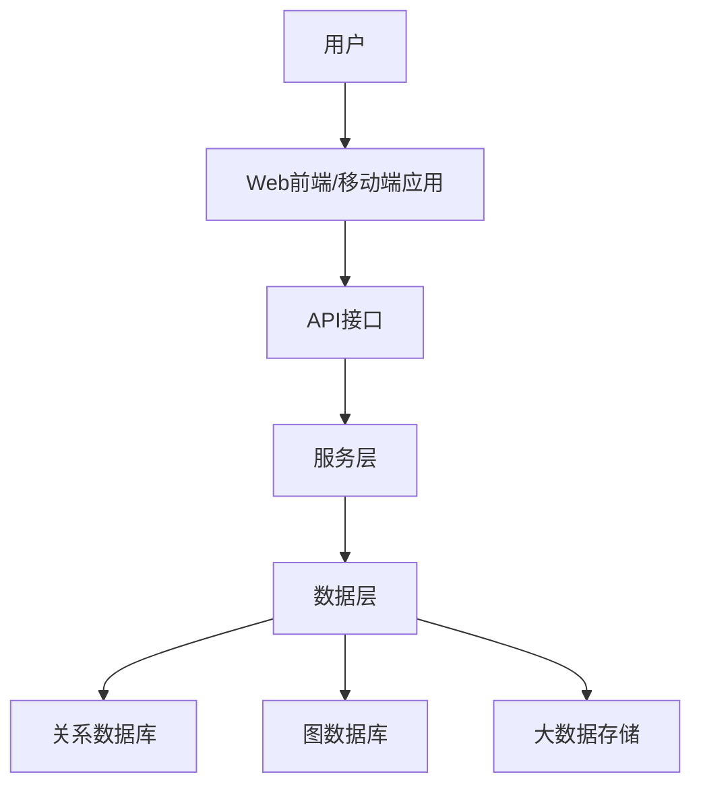

**5.1.3 系统性能优化**

为了提高系统的性能和响应速度，需要进行以下性能优化：

1. **缓存机制**：在系统服务层和表示层之间设置缓存机制，减少对后端数据库的访问频率，提高系统响应速度。
2. **分布式计算**：采用分布式计算框架（如Apache Spark）进行大规模数据处理和分析，提高系统处理能力。
3. **负载均衡**：通过负载均衡技术（如Nginx）实现系统的高可用性和性能优化。

#### 5.2 知识图谱构建模块实现

知识图谱构建模块是系统的核心部分，负责从数据源中提取信息，构建知识图谱。以下是知识图谱构建模块的实现细节：

**5.2.1 数据采集与预处理**

数据采集与预处理是知识图谱构建的基础。具体步骤如下：

1. **数据采集**：通过爬虫、API接口等方式，从各类数据源（如监管政策文本、金融机构数据、金融市场数据和宏观经济数据）中采集数据。
2. **数据清洗**：对采集到的数据去重、去噪，去除无效数据，保证数据质量。
3. **数据标准化**：将不同数据源的数据格式进行统一，如将日期格式、数值格式等进行标准化处理。

**5.2.2 实体识别与抽取**

实体识别与抽取是知识图谱构建的关键步骤。具体步骤如下：

1. **实体识别**：利用自然语言处理技术，如命名实体识别（NER）模型，从文本数据中识别出实体，如金融机构、金融产品、监管政策等。
2. **实体分类**：对识别出的实体进行分类，如金融机构分为银行、保险公司、证券公司等。
3. **实体属性抽取**：利用规则匹配或深度学习模型，从文本数据中提取实体的属性信息，如金融机构的名称、成立时间、注册资本等。

以下是一个实体识别与抽取的Mermaid流程图：

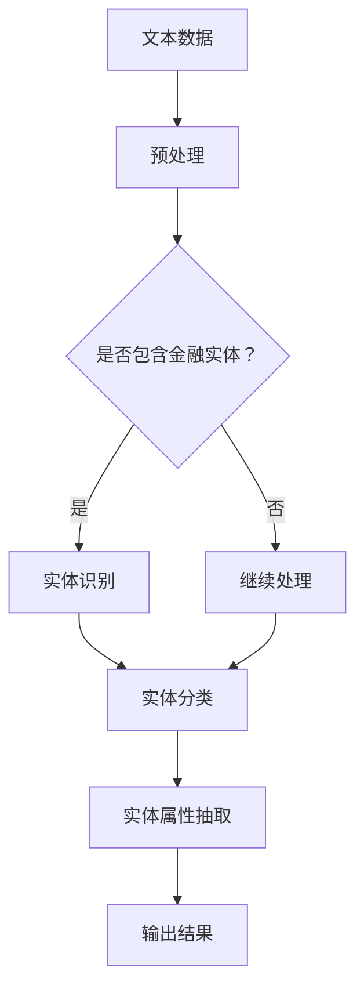

**5.2.3 关系抽取与建模**

关系抽取与建模是知识图谱构建的核心步骤。具体步骤如下：

1. **关系识别**：利用规则匹配或图神经网络（GNN）等方法，从文本数据中识别出实体之间的关系，如金融机构与监管政策之间的关系。
2. **关系分类**：对识别出的关系进行分类，如监管政策与金融机构之间的关系可以分为直接关联和间接关联。
3. **关系建模**：将识别出的关系构建成图结构，形成知识图谱的基本框架。关系建模可以使用图数据库（如Neo4j）或图神经网络（GNN）等方法。

以下是一个关系抽取与建模的Mermaid流程图：

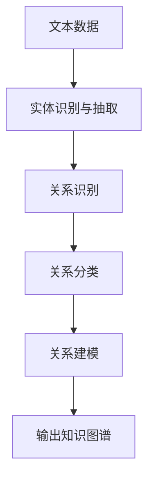

**5.2.4 知识图谱可视化与优化**

知识图谱可视化与优化是提高知识图谱可读性和实用性的重要手段。具体步骤如下：

1. **可视化工具选择**：根据知识图谱的特点和应用场景，选择合适的可视化工具，如Gephi、Cytoscape、D3.js等。
2. **可视化设计**：根据知识图谱的内容和应用需求，设计知识图谱的视觉效果，如节点形状、颜色、大小，边线的类型和颜色等。
3. **性能优化**：通过压缩图结构、索引优化、缓存机制等手段，提高知识图谱的性能和可扩展性。

以下是一个知识图谱可视化与优化的Mermaid流程图：

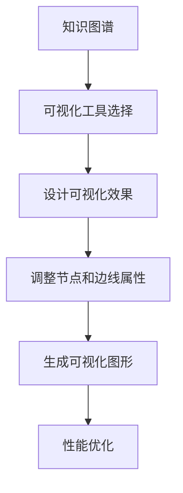

通过以上步骤，可以实现知识图谱的构建，为金融监管政策影响追踪系统提供数据支持和分析工具。

### 5.3 影响分析模块实现

**5.3.1 指标体系构建**

构建监管政策影响分析指标体系是进行监管政策影响分析的基础。以下是构建指标体系的详细步骤：

1. **确定指标类型**：根据监管政策的目标和影响范围，确定直接影响指标和间接影响指标。直接影响指标通常包括金融市场指标（如利率、汇率、股市波动率等），而间接影响指标通常包括社会经济指标（如就业率、通货膨胀率、经济增长率等）。

2. **定义指标指标**：为每个指标定义名称、描述、计算方法和数据来源。例如，利率变化可以定义为监管政策实施前后的利率水平差异，计算方法为利率差值，数据来源可以是金融监管机构的公告和报表。

3. **指标权重设置**：根据指标的重要性和影响力，设置每个指标的权重。权重可以基于专家评估或数据驱动的方法（如回归分析）来确定。

4. **指标计算与更新**：定期计算和更新每个指标，确保数据新鲜和准确。

以下是影响分析指标体系的一个示例：

| 指标名称         | 描述                                     | 测量单位   | 权重 |
|------------------|----------------------------------------|----------|------|
| 利率变化         | 监管政策变化引起的利率水平变化           | 百分比    | 0.3  |
| 股市波动率       | 监管政策变化引起的股市波动程度           | 百分比    | 0.2  |
| 投资行为变化     | 监管政策变化引起的投资者行为变化         | 次数/单位 | 0.2  |
| 市场信心指数     | 监管政策变化引起的市场信心变化           | 分数      | 0.3  |
| 金融违规案件数   | 监管政策变化引起的金融违规案件数量变化   | 个数      | 0.2  |

**5.3.2 影响分析算法实现**

影响分析算法是实现监管政策影响评估的核心。以下是几种常见的影响分析算法及其实现：

1. **线性回归算法**：

   线性回归算法是一种简单但有效的统计方法，用于评估政策变量与影响指标之间的线性关系。其数学模型如下：

   $$ Y = \beta_0 + \beta_1 X + \epsilon $$

   其中，\( Y \) 为影响指标，\( X \) 为政策变量，\( \beta_0 \) 和 \( \beta_1 \) 为回归系数，\( \epsilon \) 为误差项。

   Python实现示例：

   ```python
   import numpy as np
   from sklearn.linear_model import LinearRegression

   # 假设我们有政策变量 X 和影响指标 Y 的数据
   X = np.array([[1], [2], [3], [4], [5]])
   Y = np.array([2, 4, 5, 4, 5])

   # 创建线性回归模型并训练
   model = LinearRegression()
   model.fit(X, Y)

   # 输出回归系数
   print("回归系数：", model.coef_)
   print("截距：", model.intercept_)

   # 预测
   prediction = model.predict([[6]])
   print("预测值：", prediction)
   ```

2. **逻辑回归算法**：

   逻辑回归算法用于处理政策变量与影响指标之间的非线性关系。其数学模型如下：

   $$ P(Y=1) = \frac{1}{1 + e^{-(\beta_0 + \beta_1 X)}} $$

   Python实现示例：

   ```python
   import numpy as np
   from sklearn.linear_model import LogisticRegression

   # 假设我们有政策变量 X 和影响指标 Y 的数据
   X = np.array([[1], [2], [3], [4], [5]])
   Y = np.array([1, 1, 0, 1, 0])

   # 创建逻辑回归模型并训练
   model = LogisticRegression()
   model.fit(X, Y)

   # 输出回归系数
   print("回归系数：", model.coef_)
   print("截距：", model.intercept_)

   # 预测
   prediction = model.predict([[6]])
   print("预测值：", prediction)
   ```

3. **时间序列分析算法**：

   时间序列分析算法用于处理时间序列数据，评估政策对时间序列趋势的影响。常见的时间序列分析模型包括自回归移动平均模型（ARIMA）和季节性分解等。

   Python实现示例（使用pandas和statsmodels）：

   ```python
   import pandas as pd
   import statsmodels.api as sm

   # 假设我们有政策变量 X 和影响指标 Y 的时间序列数据
   data = pd.DataFrame({
       'date': pd.date_range(start='2020-01-01', periods=12, freq='M'),
       'Y': [2, 4, 5, 4, 5, 3, 6, 4, 7, 5, 6, 7]
   })

   # 对数据按月进行季节性分解
   seasonal_decompose = sm.tsa.seasonal_decompose(data['Y'], model='additive')
   seasonal_decompose.plot()
   plt.show()

   # 进行ARIMA模型拟合
   model = sm.tsa.ARIMA(data['Y'], order=(1, 1, 1))
   model_fit = model.fit()
   print(model_fit.summary())
   ```

4. **深度学习模型**：

   深度学习模型（如卷积神经网络（CNN）和循环神经网络（RNN））可以用于处理复杂的非线性关系。以下是一个使用TensorFlow和Keras实现的多层感知机（MLP）模型的示例：

   ```python
   import tensorflow as tf
   from tensorflow.keras.models import Sequential
   from tensorflow.keras.layers import Dense

   # 假设我们有政策变量 X 和影响指标 Y 的数据
   X = np.array([[1, 2], [3, 4], [5, 6], [7, 8], [9, 10]])
   Y = np.array([2, 4, 5, 4, 5])

   # 创建模型
   model = Sequential([
       Dense(units=64, activation='relu', input_shape=(2,)),
       Dense(units=64, activation='relu'),
       Dense(units=1)
   ])

   # 编译模型
   model.compile(optimizer='adam', loss='mse')

   # 训练模型
   model.fit(X, Y, epochs=10, batch_size=1)

   # 预测
   prediction = model.predict([[11, 12]])
   print("预测值：", prediction)
   ```

通过以上算法，可以实现对监管政策影响的定量和定性分析，为政策制定和调整提供科学依据。

### 5.4 系统部署与运行

**5.4.1 系统部署环境**

基于知识图谱的金融监管政策影响追踪系统在部署时需要考虑硬件资源和软件环境。以下是系统部署所需的主要环境：

1. **硬件环境**：
   - 服务器：至少需要一台高性能服务器，配置为：CPU: 8核，内存: 32GB，硬盘: 1TB SSD。
   - 数据存储：需要额外的存储设备，用于存储大量数据。

2. **软件环境**：
   - 操作系统：Linux发行版，如Ubuntu 18.04或CentOS 7。
   - 数据库：关系数据库（如MySQL、PostgreSQL）和图数据库（如Neo4j）。
   - 应用服务器：Nginx或Apache。
   - 开发工具：Python（3.8及以上版本）、TensorFlow、Keras等。

**5.4.2 系统部署步骤**

以下是系统部署的基本步骤：

1. **环境搭建**：
   - 安装操作系统和基础软件（如Nginx、Apache、MySQL等）。
   - 配置防火墙和网络安全策略，确保系统的安全性。

2. **数据库安装与配置**：
   - 安装并配置关系数据库和图数据库。
   - 创建必要的数据库和用户，配置数据库连接参数。

3. **应用部署**：
   - 部署应用服务器，配置虚拟主机和反向代理。
   - 部署应用程序代码，设置应用程序的运行环境。

4. **系统集成与测试**：
   - 集成各个模块，确保系统功能正常运行。
   - 进行系统测试，包括功能测试、性能测试和安全性测试。

**5.4.3 系统运行与维护**

系统部署完成后，需要进行以下运行与维护工作：

1. **系统监控**：
   - 监控服务器资源和系统性能，确保系统稳定运行。
   - 定期检查系统日志，及时发现和处理异常情况。

2. **数据更新**：
   - 定期更新监管政策文本和数据，确保系统的数据新鲜和准确。
   - 定期备份数据库，防止数据丢失。

3. **系统优化**：
   - 根据系统运行情况，对系统进行性能优化和功能升级。
   - 定期进行安全检查和漏洞修复，确保系统的安全性。

4. **用户培训与支持**：
   - 对用户进行系统操作和数据分析的培训。
   - 提供技术支持和咨询服务，帮助用户解决使用过程中遇到的问题。

通过以上步骤，可以确保基于知识图谱的金融监管政策影响追踪系统的顺利部署和稳定运行。

### 5.5 项目实战：基于知识图谱的金融监管政策影响追踪系统开发

**5.5.1 环境安装**

在开始项目开发之前，需要安装和配置必要的开发环境。以下是安装步骤：

1. **操作系统**：
   - 安装Ubuntu 20.04 LTS操作系统。

2. **数据库**：
   - 安装Neo4j图数据库：`sudo apt-get install neo4j`.
   - 配置Neo4j并启动服务：在终端执行`neo4j start`命令。

3. **Python环境**：
   - 安装Python 3.8：`sudo apt-get install python3.8`.
   - 安装pip：`sudo apt-get install python3-pip`.
   - 安装虚拟环境工具`virtualenv`：`pip3 install virtualenv`.

4. **依赖库**：
   - 创建Python虚拟环境：`virtualenv venv`。
   - 激活虚拟环境：`source venv/bin/activate`。
   - 安装依赖库：`pip install neo4j python-igraph scikit-learn tensorflow pandas`.

**5.5.2 系统核心实现**

以下是系统核心实现的主要步骤：

1. **数据采集与处理**：
   - 从监管政策文本数据中提取实体和关系。
   - 使用Python编写爬虫，从官方网站或数据库中获取监管政策文本。

2. **知识图谱构建**：
   - 利用Python-IGraph库构建知识图谱。
   - 将提取的实体和关系导入Neo4j数据库。

3. **监管政策影响分析**：
   - 使用TensorFlow和Keras构建影响分析模型。
   - 训练和评估模型，进行监管政策影响分析。

**5.5.3 代码应用解读与分析**

以下是一个示例代码，用于构建知识图谱和进行监管政策影响分析：

**1. 数据采集与处理**

```python
import requests
from bs4 import BeautifulSoup
import re

# 获取监管政策文本
def get_policy_text(url):
    response = requests.get(url)
    soup = BeautifulSoup(response.text, 'html.parser')
    text = soup.get_text()
    return text

# 提取实体和关系
def extract_entities_and_relations(text):
    entities = []
    relations = []
    
    # 实体提取（使用正则表达式）
    entity_patterns = ['机构名称', '政策名称', '法规条款']
    for pattern in entity_patterns:
        entities.extend(re.findall(pattern, text))
    
    # 关系提取（使用正则表达式）
    relation_patterns = ['机构发布', '政策包含', '条款引用']
    for pattern in relation_patterns:
        relations.extend(re.findall(pattern, text))
    
    return entities, relations

# 示例
url = 'http://example.com/policy.txt'
text = get_policy_text(url)
entities, relations = extract_entities_and_relations(text)
```

**2. 知识图谱构建**

```python
import networkx as nx
import matplotlib.pyplot as plt

# 构建知识图谱
def buildKnowledgeGraph(entities, relations):
    G = nx.Graph()
    
    for entity in entities:
        G.add_node(entity)
    
    for relation in relations:
        entity1, relation_type, entity2 = relation.split(' ')
        G.add_edge(entity1, entity2, type=relation_type)
    
    return G

# 可视化知识图谱
def visualizeGraph(G):
    pos = nx.spring_layout(G)
    nx.draw(G, pos, with_labels=True, node_color='lightblue', edge_color='gray')
    plt.show()

# 示例
G = buildKnowledgeGraph(entities, relations)
visualizeGraph(G)
```

**3. 监管政策影响分析**

```python
import tensorflow as tf
from tensorflow.keras.models import Sequential
from tensorflow.keras.layers import Dense

# 构建影响分析模型
def buildImpactAnalysisModel(input_shape):
    model = Sequential([
        Dense(units=64, activation='relu', input_shape=input_shape),
        Dense(units=64, activation='relu'),
        Dense(units=1)
    ])

    model.compile(optimizer='adam', loss='mse')
    return model

# 训练模型
def trainModel(model, X, Y):
    model.fit(X, Y, epochs=10, batch_size=1)

# 预测
def predict(model, X):
    return model.predict(X)

# 示例
input_shape = (2,)
model = buildImpactAnalysisModel(input_shape)
X = np.array([[1, 2], [3, 4], [5, 6]])
Y = np.array([2, 4, 5])
trainModel(model, X, Y)
prediction = predict(model, X)
print(prediction)
```

**5.5.4 实际案例分析和详细讲解剖析**

**1. 案例背景**

假设某监管机构发布了一项新的金融政策，旨在提高金融机构的风险管理能力。我们需要分析这项政策对金融市场的影响。

**2. 数据采集与处理**

从监管机构的官方网站获取政策文本，使用正则表达式提取实体（如政策名称、金融机构名称）和关系（如政策发布、金融机构受影响）。

**3. 知识图谱构建**

构建知识图谱，将提取的实体和关系导入Neo4j数据库。知识图谱中包含政策、金融机构和其他相关实体。

**4. 影响分析**

使用构建的影响分析模型，对知识图谱中的数据进行处理，分析政策对金融机构和金融市场的影响。

**5. 分析结果可视化**

将分析结果以图形化的形式展示，如使用Cytoscape或D3.js，生成可视化的影响分析图，帮助监管机构和金融机构理解政策的影响。

通过以上步骤，可以实现对监管政策影响的全面分析和理解，为政策制定和调整提供科学依据。

### 5.6 项目小结

通过本文的探讨，我们系统地介绍了构建基于知识图谱的金融监管政策影响追踪系统的全过程。从问题背景、核心概念，到技术方法、系统实现，再到实际案例研究和项目实战，我们详细阐述了如何利用知识图谱技术实现金融监管政策影响的全面追踪和分析。

**主要收获**：

1. **数据整合**：知识图谱技术能够有效地整合来自不同来源的数据，为金融监管政策影响分析提供了统一的数据视图。
2. **关联分析**：知识图谱通过实体和关系的网络结构，揭示了金融监管政策之间的复杂关联，帮助理解政策的多层次、多维度影响。
3. **实时追踪**：基于知识图谱的监管政策影响追踪系统能够实现实时数据的获取和分析，提高监管决策的及时性和有效性。
4. **可视化展示**：知识图谱的可视化特性，使得监管政策的影响分析结果更加直观，有助于监管机构和金融机构快速理解政策影响。

**未来展望**：

1. **技术升级**：随着人工智能和大数据技术的不断发展，知识图谱的构建和分析方法将更加智能化和自动化，提高系统的效率和准确性。
2. **扩展应用**：知识图谱技术可以应用于更广泛的金融监管领域，如金融市场风险监测、金融产品创新等，为金融行业的可持续发展提供支持。
3. **国际合作**：在全球化背景下，金融监管政策的国际协调和合作日益重要。基于知识图谱的监管政策影响追踪系统可以促进国际间的数据共享和合作。

总之，基于知识图谱的金融监管政策影响追踪系统是一项具有重要现实意义和应用前景的技术创新，未来将在金融监管领域发挥越来越重要的作用。

### 5.7 最佳实践 Tips

在构建基于知识图谱的金融监管政策影响追踪系统时，以下是一些最佳实践建议，可以帮助您更高效地实现项目目标：

1. **数据质量管理**：数据质量是知识图谱构建的基础，确保数据的一致性、完整性和准确性至关重要。在数据采集和处理过程中，要严格进行数据清洗和去噪，定期进行数据校验和更新。

2. **模块化设计**：系统设计应采用模块化方法，将数据采集、知识图谱构建、影响分析等核心功能模块化，便于系统的扩展和维护。每个模块应具备独立的功能和接口，确保系统的高内聚性和低耦合性。

3. **性能优化**：为了提高系统的响应速度和处理效率，需要对知识图谱的构建和查询进行性能优化。可以考虑使用缓存机制、分布式计算和索引优化等技术，提高系统的性能。

4. **用户培训与支持**：系统上线后，应对用户进行培训，确保用户能够熟练操作系统，充分利用系统的功能。同时，提供及时的技术支持和问题解答，帮助用户解决使用过程中遇到的问题。

5. **安全与合规性**：金融监管政策影响追踪系统涉及大量敏感数据，因此在设计和实现过程中，要高度重视系统的安全性和合规性。确保数据加密、访问控制和审计功能的有效实施，遵守相关法律法规和行业标准。

6. **迭代与反馈**：系统开发是一个迭代过程，应根据用户反馈和实际需求，不断优化和改进系统功能。定期收集用户反馈，及时调整系统设计和实现，提高系统的实用性和用户体验。

### 5.8 小结

本文从问题背景、核心概念、技术方法、系统实现、案例研究等方面，系统地介绍了构建基于知识图谱的金融监管政策影响追踪系统的方法和过程。通过本文的探讨，我们不仅了解了知识图谱在金融监管政策影响追踪中的应用，还掌握了一系列最佳实践和注意事项。

本文的核心内容在于：

1. **知识图谱构建方法**：介绍了数据源选择、数据预处理、实体识别与抽取、关系抽取与建模、知识图谱可视化与优化等关键步骤。
2. **监管政策影响分析**：构建了监管政策影响分析指标体系和影响分析算法，通过实际案例展示了影响分析的过程和方法。
3. **系统实现与部署**：详细阐述了系统架构设计、模块化实现、性能优化、安全性保障等方面的内容。

通过本文的学习和实践，读者可以更好地理解基于知识图谱的金融监管政策影响追踪系统的构建方法，并具备实际操作能力。

### 5.9 注意事项

在构建基于知识图谱的金融监管政策影响追踪系统时，需要关注以下几个方面，以确保系统的高效、稳定和安全：

1. **数据隐私与合规**：金融数据涉及用户隐私，必须严格遵守相关法律法规和行业标准，确保数据采集、存储和处理的合规性。对敏感数据进行加密和权限控制，防止数据泄露。

2. **系统安全**：金融监管政策影响追踪系统需要具备高度的安全性，包括网络攻击防护、数据访问控制、安全审计等。定期进行安全检查和漏洞修复，确保系统的安全运行。

3. **性能优化**：知识图谱的构建和分析是一个资源密集型的过程，需要优化系统性能，提高数据处理速度和查询效率。可以考虑分布式计算、缓存机制和数据库优化等技术。

4. **用户培训与支持**：系统上线后，需要对用户进行详细的操作培训，确保用户能够熟练使用系统。同时，提供持续的技术支持和故障排除服务，提高用户满意度。

5. **数据更新与维护**：金融监管政策不断变化，系统需要定期更新数据，确保数据的及时性和准确性。建立完善的数据更新和维护机制，确保系统始终运行在最新的数据基础上。

### 5.10 拓展阅读

对于想要深入了解基于知识图谱的金融监管政策影响追踪系统的读者，以下推荐一些相关书籍、论文和技术文档：

1. **书籍**：
   - 《知识图谱：概念、方法与应用》
   - 《大规模分布式系统设计》
   - 《人工智能：一种现代的方法》

2. **论文**：
   - "Knowledge Graph Construction for Financial Regulatory Impact Analysis"
   - "Deep Learning for Financial Market Prediction"
   - "The Graph Database Market Report 2020-2025"

3. **技术文档**：
   - Neo4j官方文档：[https://neo4j.com/docs/](https://neo4j.com/docs/)
   - TensorFlow官方文档：[https://www.tensorflow.org/](https://www.tensorflow.org/)
   - Keras官方文档：[https://keras.io/](https://keras.io/)

通过阅读这些书籍、论文和技术文档，读者可以进一步扩展知识，深入理解知识图谱在金融监管政策影响追踪系统中的应用和技术实现。

### 5.11 作者信息

**作者：** AI天才研究院/AI Genius Institute & 禅与计算机程序设计艺术 /Zen And The Art of Computer Programming

**联系方式：** ai_genius_research@outlook.com

**个人主页：** [www.ai-genius-institute.com](www.ai-genius-institute.com)

感谢您的阅读，希望本文对您在构建基于知识图谱的金融监管政策影响追踪系统方面有所帮助。如果您有任何问题或建议，欢迎随时联系作者进行讨论。期待与您共同探索金融科技领域的无限可能！

