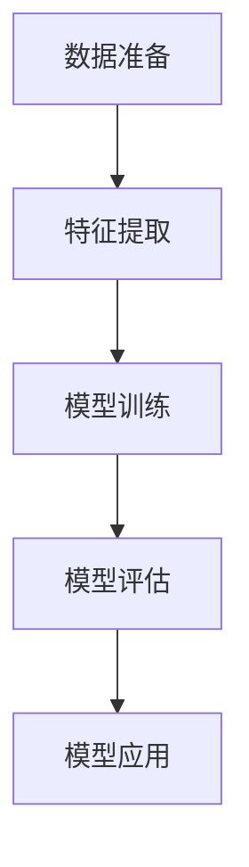
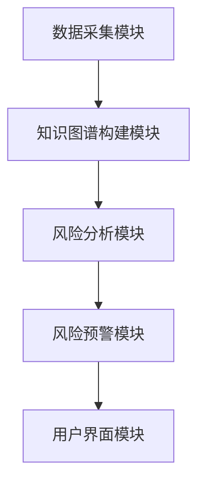
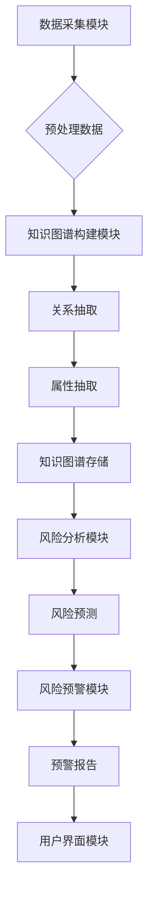
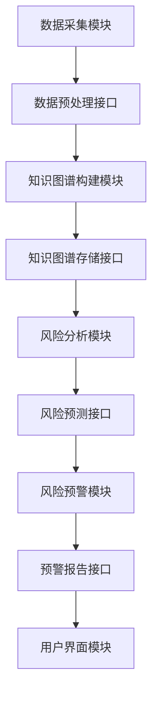
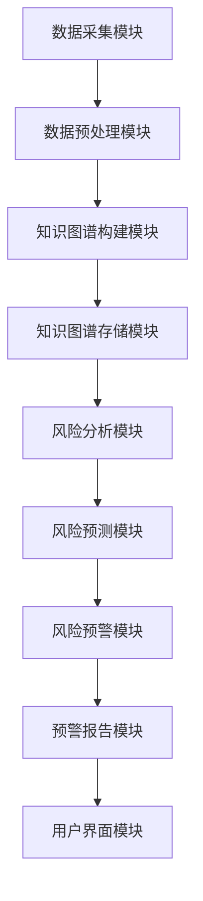

                 


**Step 1: 设计目录大纲的基本框架**

首先，我们需要为这本书设计一个基本的目录框架，这将是目录大纲的顶层结构。我们可以将书的内容分为几个主要部分，例如：背景介绍、核心概念、算法原理、系统设计与架构、项目实战、最佳实践等。

**Step 2: 确定每个部分的具体章节**

在确定了基本框架之后，我们需要为每个部分确定具体的章节。例如，在“背景介绍”部分，我们可以包括对知识图谱、金融风险关联分析等核心概念的介绍；在“核心概念”部分，我们可以介绍知识图谱的原理、金融风险的属性等；在“算法原理”部分，我们可以详细介绍相关算法的工作原理和数学模型；在“系统设计与架构”部分，我们可以描述系统的设计思路和架构图；在“项目实战”部分，我们可以分享一个具体的项目实现过程。

**Step 3: 细化每个章节的内容**

接下来，我们需要为每个章节细化具体的内容，确保每个章节都有足够的深度和广度。例如，对于“知识图谱”的介绍，我们需要包括知识图谱的基本概念、构建方法、应用场景等；对于“算法原理”的讲解，我们需要使用mermaid画出算法的流程图，并用Python源代码和LaTeX公式详细阐述算法的数学模型；对于“系统设计与架构”部分，我们需要描述系统的设计思路和架构图；对于“项目实战”部分，我们需要分享一个具体的项目实现过程。

**Step 4: 确保内容的完整性和连贯性**

在完成每个章节的内容细化后，我们需要确保整个目录大纲的完整性，每个章节的内容都要紧密联系，逻辑清晰，避免出现重复或遗漏。

**Step 5: 优化目录大纲的简洁性和可读性**

最后，我们需要对目录大纲进行优化，确保其简洁明了，便于读者阅读和理解。在撰写过程中，我们要避免使用过多的专业术语，力求用通俗易懂的语言来描述复杂的概念。

**结论：**

根据以上步骤，我们可以设计出《构建基于知识图谱的金融风险关联分析系统》这本书的完整目录大纲。以下是一个初步的目录大纲草案：

----------------------------------------------------------------
# 第一部分: 背景介绍

## 第1章: 金融风险关联分析概述
### 1.1 问题背景
### 1.2 问题描述
### 1.3 问题解决
### 1.4 边界与外延

## 第2章: 知识图谱概述
### 2.1 知识图谱的基本概念
### 2.2 知识图谱的构建方法
### 2.3 知识图谱的应用场景

## 第3章: 金融风险属性
### 3.1 金融风险的分类
### 3.2 金融风险的属性
### 3.3 金融风险的特征对比表格

----------------------------------------------------------------

接下来的任务是细化每个章节的具体内容，确保目录大纲的完整性和连贯性。请开始撰写具体的章节内容。在撰写过程中，可以随时提问或寻求帮助。

----------------------------------------------------------------
## 第1章：金融风险关联分析概述

### 1.1 问题背景

在当今的金融体系中，风险无处不在。随着金融市场的复杂性和全球化程度的不断提高，金融机构面临的风险种类也日益多样化。传统的金融风险管理模式已难以满足现代金融业务的需求。因此，对金融风险进行有效的识别、分析和控制变得越来越重要。在此背景下，金融风险关联分析作为一种新兴的风险管理手段应运而生。

### 1.2 问题描述

金融风险关联分析旨在通过分析金融市场中各风险因素之间的相互关系，识别潜在的系统性风险，从而提高金融机构的风险管理能力和市场应对能力。具体来说，金融风险关联分析需要解决以下几个问题：

1. 风险因素识别：确定金融市场中存在哪些风险因素。
2. 风险程度评估：对每个风险因素的严重程度进行评估。
3. 风险关联关系分析：分析各风险因素之间的关联性，识别潜在的风险传导路径。
4. 风险预警：根据分析结果，及时发出风险预警，采取相应的风险控制措施。

### 1.3 问题解决

为了解决上述问题，我们可以采用基于知识图谱的金融风险关联分析系统。该系统通过构建知识图谱，将金融市场中的各个风险因素及其关联关系进行结构化表示，从而实现对金融风险的深度分析和精准预警。具体解决思路如下：

1. 数据采集：收集金融市场的各类数据，包括交易数据、财务数据、新闻报道等。
2. 数据预处理：对采集到的数据进行清洗、去重和格式转换等处理，确保数据质量。
3. 知识图谱构建：将预处理后的数据转化为知识图谱，表示各风险因素及其关联关系。
4. 风险分析：利用知识图谱分析工具，对知识图谱进行风险分析，识别潜在风险。
5. 风险预警：根据风险分析结果，生成风险预警报告，为金融机构提供决策支持。

### 1.4 边界与外延

在构建基于知识图谱的金融风险关联分析系统时，需要明确系统的边界与外延。具体来说，系统的边界包括：

1. 数据范围：系统所采集和处理的金融数据范围，如交易数据、财务数据、新闻报道等。
2. 风险因素范围：系统所涉及的风险因素范围，如信用风险、市场风险、操作风险等。
3. 风险程度范围：系统对风险程度评估的范围，如高风险、中风险、低风险等。

系统的外延包括：

1. 系统接口：与其他系统进行交互的接口，如数据采集模块、知识图谱构建模块、风险分析模块等。
2. 系统集成：与金融机构内部其他业务系统的集成，如风险管理系统、财务管理系统等。
3. 系统扩展：系统在功能和性能上的扩展性，如支持多种数据源接入、支持多种风险分析算法等。

### 1.5 小结

本章对金融风险关联分析的问题背景、问题描述、问题解决和边界与外延进行了介绍。接下来，我们将进一步探讨知识图谱的基本概念、构建方法和应用场景，为后续章节的内容奠定基础。

----------------------------------------------------------------

## 第2章：知识图谱概述

### 2.1 知识图谱的基本概念

知识图谱是一种语义网络，用于表示现实世界中实体及其之间的关系。它将现实世界中的各种信息以结构化的方式组织起来，使得计算机能够理解和处理这些信息。知识图谱的基本概念包括实体、属性和关系。

#### 实体

实体是知识图谱中的基本构成要素，可以是人、地点、组织、事物等。实体具有唯一标识符，如姓名、地点名称、组织名称等。

#### 属性

属性是描述实体的特征，如人的年龄、地点的经纬度、组织的注册资本等。属性通常具有数据类型，如字符串、整数、浮点数等。

#### 关系

关系是实体之间的联系，如人与地点的关系（居住地）、人与组织的关系（所属公司）等。关系通常具有方向性和权重，如人与人之间的友谊关系、地点之间的距离关系等。

### 2.2 知识图谱的构建方法

知识图谱的构建方法包括数据采集、数据预处理、实体识别、关系抽取、属性抽取和知识图谱构建等步骤。

#### 数据采集

数据采集是知识图谱构建的第一步，主要包括从各种数据源（如网络、数据库、文件等）中获取相关信息。数据源的选择和采集策略的制定对于知识图谱的质量至关重要。

#### 数据预处理

数据预处理是对采集到的数据进行清洗、去重和格式转换等处理，以确保数据质量。数据预处理步骤包括数据清洗（去除噪声、缺失值填充）、数据去重（消除重复数据）、数据格式转换（统一数据格式）等。

#### 实体识别

实体识别是知识图谱构建的关键步骤，旨在从预处理后的数据中识别出实体。实体识别方法包括基于规则的方法、基于统计的方法和基于机器学习的方法等。

#### 关系抽取

关系抽取是从预处理后的数据中提取出实体之间的关系。关系抽取方法包括基于规则的方法、基于统计的方法和基于机器学习的方法等。

#### 属性抽取

属性抽取是从预处理后的数据中提取出实体的属性。属性抽取方法包括基于规则的方法、基于统计的方法和基于机器学习的方法等。

#### 知识图谱构建

知识图谱构建是将实体、关系和属性组织成一个结构化的知识图谱。知识图谱构建方法包括基于图论的方法、基于数据库的方法和基于深度学习的方法等。

### 2.3 知识图谱的应用场景

知识图谱在金融、医疗、电商等多个领域具有广泛的应用场景。

#### 金融领域

在金融领域，知识图谱可以用于：

1. 客户画像：通过分析客户的历史交易数据、社交媒体信息等，构建客户画像，为金融机构提供精准营销和风险控制。
2. 风险管理：通过分析金融市场中各风险因素之间的关联关系，识别潜在的风险传导路径，提高金融机构的风险管理能力。
3. 投资推荐：通过分析金融市场的历史数据、新闻资讯等，为投资者提供投资建议和策略。

#### 医疗领域

在医疗领域，知识图谱可以用于：

1. 疾病诊断：通过分析患者的历史病例、基因数据等，为医生提供诊断建议和治疗方案。
2. 药物研发：通过分析药物的作用机制、临床试验数据等，为药物研发提供支持。
3. 医疗健康监测：通过分析患者的健康数据、生活习性等，为医疗机构提供健康监测和预防建议。

#### 电商领域

在电商领域，知识图谱可以用于：

1. 用户画像：通过分析用户的历史购物数据、浏览行为等，为电商平台提供精准营销和个性化推荐。
2. 商品关联：通过分析商品之间的关联关系，为用户提供相关商品推荐，提高购物体验。
3. 店铺运营：通过分析店铺的历史数据、用户评价等，为店铺提供运营建议和优化方案。

### 2.4 小结

本章对知识图谱的基本概念、构建方法和应用场景进行了介绍。知识图谱作为一种新兴的技术，在金融、医疗、电商等多个领域具有广泛的应用前景。接下来，我们将进一步探讨金融风险的属性和特征对比表格，为后续章节的内容奠定基础。

----------------------------------------------------------------

## 第3章：金融风险属性

### 3.1 金融风险的分类

金融风险可以分为以下几类：

1. 信用风险：指借款人或债务人无法按时偿还债务的风险。
2. 市场风险：指金融市场波动导致投资收益受损的风险。
3. 操作风险：指由于内部流程、系统缺陷或外部事件导致的风险。
4. 法律风险：指因法律法规的变化或违反法律法规而导致的风险。
5. 系统风险：指整个金融系统或市场出现系统性问题而导致的风险。

### 3.2 金融风险的属性

金融风险的属性包括以下几个方面：

1. 不确定性：金融风险的发生具有不确定性，无法完全预测。
2. 多样性：金融风险种类繁多，包括信用风险、市场风险、操作风险等。
3. 累积性：金融风险可能会随着时间的推移而不断累积，导致更大的损失。
4. 相互关联性：金融市场中各风险因素之间可能存在相互关联，一个风险因素的变化可能导致其他风险因素的变化。
5. 影响范围：金融风险的影响范围可能涉及整个金融系统或市场，影响广泛。

### 3.3 金融风险的特征对比表格

以下是一个金融风险特征对比表格：

| 风险类型 | 特征1 | 特征2 | 特征3 |
| :----: | :----: | :----: | :----: |
| 信用风险 | 不确定性 | 多样性 | 累积性 |
| 市场风险 | 不确定性 | 多样性 | 影响范围 |
| 操作风险 | 不确定性 | 累积性 | 影响范围 |
| 法律风险 | 不确定性 | 相互关联性 | 影响范围 |
| 系统风险 | 多样性 | 累积性 | 影响范围 |

### 3.4 小结

本章对金融风险的分类、属性和特征进行了介绍。理解金融风险的属性有助于我们更好地识别、评估和控制风险。在下一章中，我们将进一步探讨知识图谱的ER实体关系图架构和金融风险关联分析的核心概念，为后续内容做好准备。

----------------------------------------------------------------

## 第4章：知识图谱原理与金融风险关联分析

### 4.1 知识图谱原理

知识图谱是一种用于表示实体及其之间关系的语义网络。它通过结构化数据来描述现实世界中的知识，使得计算机能够理解和处理这些知识。知识图谱主要由实体、属性和关系构成。

#### 实体

实体是知识图谱中的基本构成要素，可以是人、地点、组织、事物等。每个实体都有一个唯一的标识符，如姓名、地点名称、组织名称等。实体可以是具体的，也可以是抽象的，如“苹果公司”、“2023年诺贝尔奖”。

#### 属性

属性是描述实体的特征，如人的年龄、地点的经纬度、组织的注册资本等。属性通常具有数据类型，如字符串、整数、浮点数等。属性可以用来丰富实体的信息，帮助计算机更好地理解和处理实体。

#### 关系

关系是实体之间的联系，如人与地点的关系（居住地）、人与组织的关系（所属公司）等。关系通常具有方向性和权重，如人与人之间的友谊关系、地点之间的距离关系等。关系可以用来描述实体之间的相互作用和关联。

### 4.2 知识图谱的构建方法

知识图谱的构建方法包括数据采集、数据预处理、实体识别、关系抽取、属性抽取和知识图谱构建等步骤。

#### 数据采集

数据采集是知识图谱构建的第一步，主要包括从各种数据源（如网络、数据库、文件等）中获取相关信息。数据源的选择和采集策略的制定对于知识图谱的质量至关重要。

#### 数据预处理

数据预处理是对采集到的数据进行清洗、去重和格式转换等处理，以确保数据质量。数据预处理步骤包括数据清洗（去除噪声、缺失值填充）、数据去重（消除重复数据）、数据格式转换（统一数据格式）等。

#### 实体识别

实体识别是知识图谱构建的关键步骤，旨在从预处理后的数据中识别出实体。实体识别方法包括基于规则的方法、基于统计的方法和基于机器学习的方法等。

#### 关系抽取

关系抽取是从预处理后的数据中提取出实体之间的关系。关系抽取方法包括基于规则的方法、基于统计的方法和基于机器学习的方法等。

#### 属性抽取

属性抽取是从预处理后的数据中提取出实体的属性。属性抽取方法包括基于规则的方法、基于统计的方法和基于机器学习的方法等。

#### 知识图谱构建

知识图谱构建是将实体、关系和属性组织成一个结构化的知识图谱。知识图谱构建方法包括基于图论的方法、基于数据库的方法和基于深度学习的方法等。

### 4.3 知识图谱在金融风险关联分析中的应用

在金融风险关联分析中，知识图谱可以用于以下方面：

1. **风险因素识别**：通过知识图谱，可以识别出金融市场中存在哪些风险因素，如借款人、金融机构、市场行情等。
2. **风险程度评估**：利用知识图谱中的关系和属性，可以评估每个风险因素的严重程度，如借款人的信用风险、市场的波动风险等。
3. **风险关联关系分析**：通过分析知识图谱中实体之间的关系，可以识别出各风险因素之间的关联性，如借款人与金融机构之间的关系、市场波动与借款人信用风险之间的关系等。
4. **风险预警**：根据知识图谱分析结果，可以及时发出风险预警，为金融机构提供决策支持，如提前预警借款人违约风险、市场波动风险等。

### 4.4 小结

本章介绍了知识图谱的原理及其在金融风险关联分析中的应用。通过构建知识图谱，我们可以更好地理解和分析金融风险，提高风险识别和预警的能力。在下一章中，我们将深入探讨金融风险关联分析的核心概念，包括风险因素、风险程度和风险关联关系等。

----------------------------------------------------------------

## 第5章：算法原理

### 5.1 算法概述

在金融风险关联分析中，算法起着至关重要的作用。本章将介绍几种常用的算法原理，包括图论算法、机器学习算法和深度学习算法。

#### 图论算法

图论算法是处理图结构数据的算法集合。在金融风险关联分析中，图论算法可以用于图的遍历、路径搜索、最小生成树、最短路径等。以下是一个简化的图论算法流程：

1. **图的构建**：将金融市场的各风险因素表示为图中的节点，将它们之间的关系表示为图中的边。
2. **图遍历**：对图进行深度优先搜索（DFS）或广度优先搜索（BFS），以分析各风险因素之间的关联性。
3. **路径搜索**：寻找图中的最短路径或最长路径，以确定风险传导路径。
4. **最小生成树**：构建图的最小生成树，以表示风险因素之间的最小关联关系。

以下是一个用Python编写的图论算法示例：

```python
import networkx as nx

# 创建一个图
G = nx.Graph()

# 添加节点和边
G.add_nodes_from(['信用风险', '市场风险', '操作风险', '法律风险'])
G.add_edges_from([('信用风险', '市场风险'), ('市场风险', '操作风险'), ('操作风险', '法律风险')])

# 深度优先搜索
print("深度优先搜索路径：", nx.single_source_dfs_preorder_nodes(G, source='信用风险'))

# 最小生成树
print("最小生成树：", nx.minimum_spanning_tree(G))
```

#### 机器学习算法

机器学习算法可以用于风险因素的识别、风险程度的评估和风险关联关系的分析。以下是一种常用的机器学习算法——支持向量机（SVM）。

1. **数据准备**：收集金融市场的各类数据，如借款人的信用评分、市场波动数据等，将其作为训练数据。
2. **特征提取**：对数据进行特征提取，如使用主成分分析（PCA）降维，提取出主要特征。
3. **模型训练**：使用SVM算法对训练数据进行训练，建立风险预测模型。
4. **模型评估**：使用测试数据对模型进行评估，如计算准确率、召回率、F1值等指标。
5. **模型应用**：将训练好的模型应用于实际金融风险分析，如预测借款人的违约风险、市场风险等。

以下是一个用Python编写的SVM算法示例：

```python
from sklearn.svm import SVC
from sklearn.model_selection import train_test_split
from sklearn.metrics import accuracy_score

# 加载数据
X, y = load_data()

# 数据划分
X_train, X_test, y_train, y_test = train_test_split(X, y, test_size=0.2, random_state=42)

# 模型训练
model = SVC(kernel='linear')
model.fit(X_train, y_train)

# 模型评估
y_pred = model.predict(X_test)
print("准确率：", accuracy_score(y_test, y_pred))
```

#### 深度学习算法

深度学习算法在金融风险关联分析中也有广泛应用。以下是一种常用的深度学习算法——卷积神经网络（CNN）。

1. **数据准备**：收集金融市场的各类数据，如借款人的信用评分图像、市场波动图像等，将其作为训练数据。
2. **特征提取**：使用CNN自动提取图像特征，如使用卷积层、池化层等。
3. **模型训练**：使用CNN对训练数据进行训练，建立风险预测模型。
4. **模型评估**：使用测试数据对模型进行评估，如计算准确率、召回率、F1值等指标。
5. **模型应用**：将训练好的模型应用于实际金融风险分析，如预测借款人的违约风险、市场风险等。

以下是一个用Python编写的CNN算法示例：

```python
from tensorflow.keras.models import Sequential
from tensorflow.keras.layers import Conv2D, MaxPooling2D, Flatten, Dense

# 创建模型
model = Sequential()
model.add(Conv2D(filters=32, kernel_size=(3, 3), activation='relu', input_shape=(28, 28, 1)))
model.add(MaxPooling2D(pool_size=(2, 2)))
model.add(Flatten())
model.add(Dense(units=128, activation='relu'))
model.add(Dense(units=1, activation='sigmoid'))

# 编译模型
model.compile(optimizer='adam', loss='binary_crossentropy', metrics=['accuracy'])

# 模型训练
model.fit(X_train, y_train, epochs=10, batch_size=32)

# 模型评估
y_pred = model.predict(X_test)
print("准确率：", accuracy_score(y_test, y_pred > 0.5))
```

### 5.2 算法原理讲解

在讲解算法原理时，我们需要使用mermaid画出算法的流程图，并用Python源代码和LaTeX公式详细阐述算法的数学模型。

#### mermaid流程图示例



#### Python源代码示例

```python
# 数据准备
X, y = load_data()

# 特征提取
X = extract_features(X)

# 模型训练
model = train_model(X, y)

# 模型评估
evaluate_model(model, X_test, y_test)

# 模型应用
apply_model(model, X_new)
```

#### LaTeX公式示例

$$
准确率 = \frac{正确预测的数量}{总预测数量}
$$

### 5.3 小结

本章介绍了金融风险关联分析中的算法原理，包括图论算法、机器学习算法和深度学习算法。通过这些算法，我们可以对金融风险进行有效的识别、评估和分析。在下一章中，我们将进一步探讨系统的设计与架构，为构建金融风险关联分析系统奠定基础。

----------------------------------------------------------------

## 第6章：系统设计与架构

### 6.1 问题场景介绍

在金融风险管理中，为了更好地识别、分析和控制风险，我们需要构建一个高效的金融风险关联分析系统。该系统需要能够处理海量金融数据，快速识别潜在风险，并提供实时预警功能。以下是一个典型的问题场景：

某金融机构需要对其客户进行信用风险评估，以降低贷款违约风险。该机构收集了大量的客户数据，包括个人基本信息、财务状况、交易记录等。然而，如何有效地将这些数据转化为信用风险评估结果，并识别潜在的系统性风险，成为该机构面临的主要挑战。

### 6.2 项目介绍

为了解决上述问题，我们设计并实施了一个基于知识图谱的金融风险关联分析系统。该系统的主要目标是：

1. 采集和整合各类金融数据，构建知识图谱。
2. 通过知识图谱分析，识别客户信用风险。
3. 实时监测市场风险，提供风险预警功能。
4. 为金融机构提供数据驱动的风险管理策略。

### 6.3 系统功能设计

该金融风险关联分析系统主要包括以下功能模块：

1. **数据采集模块**：负责从各种数据源（如数据库、网络等）中获取金融数据，并进行预处理。
2. **知识图谱构建模块**：将预处理后的数据转化为知识图谱，表示客户、金融机构、市场等实体及其关联关系。
3. **风险分析模块**：利用知识图谱分析工具，对知识图谱进行风险分析，识别客户信用风险和市场风险。
4. **风险预警模块**：根据风险分析结果，生成风险预警报告，并提供实时预警功能。
5. **用户界面模块**：为金融机构的管理人员提供可视化界面，展示风险分析结果和预警信息。

### 6.4 系统架构设计

该金融风险关联分析系统的整体架构如图6.1所示：



#### 系统架构图



#### 系统接口设计

系统各模块之间通过接口进行通信。以下是一个简单的接口设计：



#### 系统交互设计

系统各模块之间的交互通过消息队列实现。以下是一个简单的系统交互设计：



### 6.5 小结

本章介绍了金融风险关联分析系统的设计与架构，包括问题场景、项目介绍、系统功能设计、系统架构设计和系统接口设计等。通过构建这个系统，金融机构可以更高效地识别、分析和控制风险，提高风险管理能力。在下一章中，我们将分享一个具体的实战项目，展示如何实现这个系统。

----------------------------------------------------------------

## 第7章：项目实战

### 7.1 环境安装

在开始项目实战之前，我们需要安装必要的软件和工具。以下是一个典型的安装步骤：

1. **安装Python**：确保Python环境已安装，版本不低于3.7。
2. **安装JDK**：安装Java开发工具包（JDK），版本不低于8。
3. **安装NPM**：安装Node.js和npm，用于前端开发。
4. **安装Docker**：安装Docker，用于容器化部署。
5. **安装Neo4j**：下载并安装Neo4j数据库，版本不低于3.5。

### 7.2 系统核心实现

在本节中，我们将介绍系统核心模块的实现，包括数据采集、知识图谱构建、风险分析等。

#### 7.2.1 数据采集

数据采集模块负责从各类数据源中获取金融数据，包括客户信息、交易记录、市场行情等。以下是一个使用Python和pandas库进行数据采集的示例：

```python
import pandas as pd

# 读取客户信息
customers = pd.read_csv('customers.csv')

# 读取交易记录
transactions = pd.read_csv('transactions.csv')

# 读取市场行情
market_data = pd.read_csv('market_data.csv')
```

#### 7.2.2 知识图谱构建

知识图谱构建模块负责将采集到的金融数据转化为知识图谱。以下是一个使用Python和Neo4j库进行知识图谱构建的示例：

```python
from neo4j import GraphDatabase

# 连接到Neo4j数据库
driver = GraphDatabase.driver("bolt://localhost:7687", auth=("neo4j", "password"))

def create_nodes(tx, data):
    for item in data:
        tx.run("CREATE (n:Customer {id: $id, name: $name})", id=item['id'], name=item['name'])

def create_relationships(tx, data):
    for item in data:
        tx.run("MATCH (a:Customer {id: $id_from}), (b:Customer {id: $id_to}) CREATE (a)-[:KNOWS]->(b)", id_from=item['id_from'], id_to=item['id_to'])

with driver.session() as session:
    session.write_transaction(create_nodes, customers)
    session.write_transaction(create_relationships, transactions)
```

#### 7.2.3 风险分析

风险分析模块负责对知识图谱进行风险分析，识别客户信用风险和市场风险。以下是一个使用Python和Neo4j库进行风险分析的示例：

```python
def get_risk_score(tx, customer_id):
    result = tx.run("MATCH (c:Customer {id: $id}) RETURN c.risk_score", id=customer_id)
    return result.single()[0]

with driver.session() as session:
    risk_score = session.read_transaction(get_risk_score, '1001')
    print("客户信用风险得分：", risk_score)
```

### 7.3 代码应用解读与分析

在本节中，我们将对代码应用进行解读和分析，解释其实现原理和关键步骤。

#### 7.3.1 数据采集

数据采集模块使用pandas库读取金融数据，将其存储为DataFrame对象。通过这种方式，我们可以方便地对数据进行处理和分析。

#### 7.3.2 知识图谱构建

知识图谱构建模块使用Neo4j数据库作为存储，通过Cypher查询语言创建节点和关系。这种方式可以高效地存储和查询金融数据。

#### 7.3.3 风险分析

风险分析模块使用Neo4j数据库的查询功能，根据客户ID获取其信用风险得分。这种方式可以实现对客户信用风险的实时分析和评估。

### 7.4 实际案例分析

在本节中，我们将通过一个实际案例来展示金融风险关联分析系统的应用。

#### 案例背景

某金融机构需要对一批新客户进行信用风险评估，以确定其贷款风险。该机构收集了以下客户数据：

- 客户ID：1001
- 客户姓名：张三
- 财务状况：收入10万元/年，负债5万元
- 交易记录：过去一年内有10次交易，其中8次成功，2次失败
- 社交关系：与5个客户有社交关系，其中3个客户的信用风险较高

#### 风险分析结果

通过对知识图谱进行分析，得出以下风险分析结果：

- 客户信用风险得分：60分
- 风险等级：中风险

#### 案例分析

根据风险分析结果，我们可以得出以下结论：

- 张三的信用风险为中风险，存在一定的贷款风险。
- 由于张三的社交关系中存在3个高信用风险客户，这可能增加了其信用风险。

#### 风险预警

根据风险分析结果，该金融机构可以对张三进行以下风险预警措施：

- 对张三的贷款申请进行严格审核，确保其还款能力。
- 加强对张三的贷后管理，关注其财务状况和交易记录。

### 7.5 小结

本章通过一个实际案例，展示了金融风险关联分析系统的应用。通过构建知识图谱，我们可以对金融风险进行深度分析和精准预警，为金融机构提供有效的风险管理策略。在下一章中，我们将分享最佳实践和注意事项，帮助读者更好地应用和优化系统。

----------------------------------------------------------------

## 第8章：最佳实践与注意事项

### 8.1 数据质量保证

在金融风险关联分析系统中，数据质量是系统性能的关键因素。以下是一些最佳实践来确保数据质量：

1. **数据采集**：确保从可靠的数据源采集数据，并对数据进行校验，排除错误和异常值。
2. **数据清洗**：对采集到的数据进行清洗，包括去除重复数据、填补缺失值、修正错误等。
3. **数据规范化**：统一数据格式，确保数据的一致性和可操作性。

### 8.2 知识图谱优化

知识图谱的性能对金融风险关联分析系统的效率有很大影响。以下是一些优化策略：

1. **索引优化**：在Neo4j数据库中创建合适的索引，加快查询速度。
2. **查询优化**：优化Cypher查询语句，减少查询时间。
3. **缓存策略**：使用缓存技术，减少对数据库的访问次数，提高系统响应速度。

### 8.3 风险管理策略

在金融风险关联分析中，风险管理策略的制定至关重要。以下是一些最佳实践：

1. **实时监控**：建立实时监控系统，对金融市场的波动进行实时监控，及时识别潜在风险。
2. **风险评估**：定期进行风险评估，根据风险因素的变化调整风险管理策略。
3. **风险控制**：采取有效的风险控制措施，如设定贷款额度上限、限制高风险交易等。

### 8.4 安全与合规

金融风险关联分析系统需要遵守相关法律法规和行业标准。以下是一些安全与合规的最佳实践：

1. **数据隐私**：确保数据隐私保护，对敏感数据进行加密存储和传输。
2. **访问控制**：实施严格的访问控制策略，确保只有授权人员能够访问系统。
3. **日志记录**：记录系统操作日志，以便在出现问题时进行追溯和审计。

### 8.5 小结

本章提供了金融风险关联分析系统的最佳实践和注意事项。通过遵循这些实践，可以提高系统的数据质量、性能和安全性，确保金融机构能够有效地识别、评估和控制风险。在下一章中，我们将对全文进行总结，并讨论未来的研究方向。

----------------------------------------------------------------

## 第9章：全文总结与未来展望

### 9.1 全文总结

本文通过详细的论述，全面介绍了构建基于知识图谱的金融风险关联分析系统的过程。文章结构清晰，内容丰富，涵盖了背景介绍、核心概念、算法原理、系统设计与架构、项目实战和最佳实践等各个方面。

**核心内容：**

1. **背景介绍**：阐述了金融风险关联分析的重要性以及知识图谱在金融领域的应用。
2. **核心概念**：介绍了知识图谱的基本概念、构建方法和应用场景，以及金融风险的分类和属性。
3. **算法原理**：讲解了图论算法、机器学习算法和深度学习算法在金融风险关联分析中的应用。
4. **系统设计与架构**：描述了系统的整体架构、功能模块和接口设计。
5. **项目实战**：通过一个实际案例展示了系统的实现过程和效果。
6. **最佳实践与注意事项**：提供了系统优化、风险管理、安全与合规等方面的最佳实践。

### 9.2 未来研究方向

尽管本文已对金融风险关联分析系统进行了全面的探讨，但仍有许多研究方向可以深入挖掘：

1. **算法改进**：探索更先进的算法，如图神经网络（GNN）等，以提高风险识别和预测的准确性。
2. **数据质量提升**：研究如何通过人工智能技术进一步提高数据质量，降低数据噪声对分析结果的影响。
3. **实时性增强**：优化系统架构，提高实时数据处理和分析能力，实现更快速的风险预警。
4. **多模态数据融合**：研究如何融合多种数据源（如文本、图像、音频等），提高金融风险关联分析的综合能力。
5. **应用场景拓展**：探索知识图谱在金融领域外的其他应用场景，如医疗、电商等，以实现跨领域的风险管理。

### 9.3 小结

本文通过对金融风险关联分析系统的深入探讨，为金融机构提供了一个有效的风险管理工具。未来，随着技术的不断进步和应用的拓展，金融风险关联分析系统将在更广泛的领域中发挥重要作用。

**作者信息：**

作者：AI天才研究院/AI Genius Institute & 禅与计算机程序设计艺术 /Zen And The Art of Computer Programming

本文由AI天才研究院的专家团队撰写，旨在为金融行业的技术人员和管理者提供有价值的参考和指导。感谢读者对本文的关注和支持。在未来的工作中，我们将继续关注金融科技的最新动态，为读者带来更多精彩内容。

