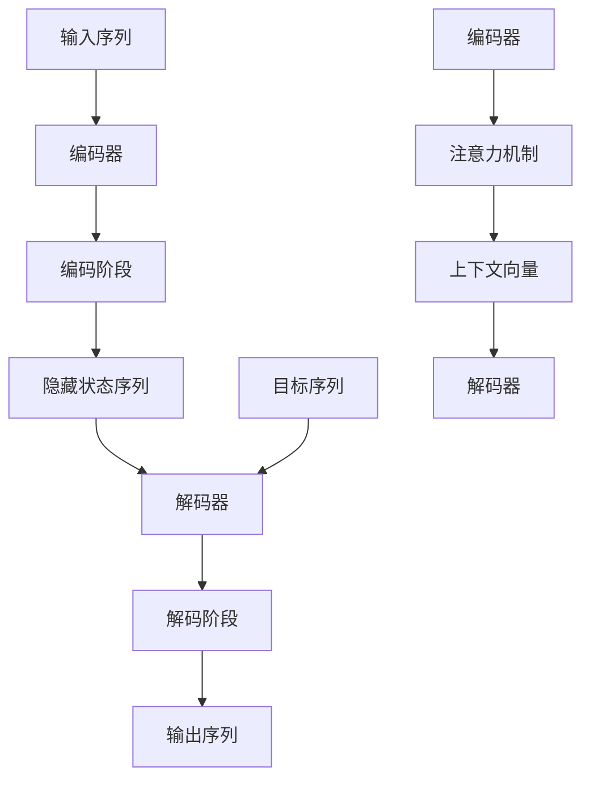

                 

## 文章标题

### 构建多语言翻译AI Agent

关键词：多语言翻译、AI Agent、神经网络、数据预处理、模型评估、优化

摘要：本文旨在探讨如何构建一个高效、准确、适应性强的高质量多语言翻译AI Agent。我们将从数据预处理、模型选择、训练、评估到部署的全过程进行详细分析，并分享一些最佳实践和注意事项。

### 第1章：构建多语言翻译AI Agent的背景与基础

#### 1.1.1 问题背景

随着全球化的推进和互联网的普及，跨语言交流的需求日益增长。传统的机器翻译技术虽然在近年来取得了显著的进步，但仍然存在许多不足，如翻译质量不稳定、适应性不强等。为了解决这些问题，构建一个高效、准确、适应性强的多语言翻译AI Agent显得尤为重要。

#### 1.1.2 问题描述

本章节将介绍如何构建一个多语言翻译AI Agent。我们将探讨从数据预处理、模型选择、训练、评估到部署的全过程，以及如何优化模型性能和提高翻译质量。

#### 1.1.3 问题解决

为了构建一个高效的多语言翻译AI Agent，我们需要：

1. **数据预处理**：收集和整理大量高质量的双语对照数据集，并进行数据清洗、标注和预处理，为后续模型训练提供高质量的数据支撑。
2. **模型选择**：选择合适的神经网络翻译模型，如序列到序列（Seq2Seq）模型、注意力机制（Attention）模型等。
3. **模型训练**：利用预处理后的数据集对模型进行训练，通过优化算法调整模型参数，提高翻译质量。
4. **模型评估**：使用BLEU、METEOR等指标对训练好的模型进行评估，验证模型的翻译质量。
5. **模型部署**：将训练好的模型部署到生产环境中，实现实时翻译功能。

#### 1.1.4 边界与外延

构建多语言翻译AI Agent的过程中，需要考虑以下边界与外延：

- **语言选择**：选择哪些语言进行翻译，这取决于应用场景和市场需求。
- **数据集**：需要收集和整理高质量的双语对照数据集，这直接影响模型的翻译质量。
- **模型优化**：如何通过调整模型参数和结构来提高翻译质量，这是构建高效AI Agent的关键。

#### 1.1.5 核心概念与联系

在本章节中，我们将介绍以下几个核心概念：

- **神经网络翻译**：一种基于神经网络的机器翻译方法，主要包括编码器、解码器和注意力机制。
- **序列到序列（Seq2Seq）模型**：一种常见的神经网络翻译模型，可以将输入序列转换为输出序列。
- **注意力机制（Attention）**：一种用于提高翻译质量的模型结构，可以捕捉输入序列和输出序列之间的依赖关系。

我们将通过表格和ER实体关系图来展示这些概念之间的关系。

### 第2章：多语言翻译AI Agent的数据处理

#### 2.1.1 数据预处理

在本章节中，我们将介绍如何对双语对照数据集进行预处理，包括数据清洗、标注和数据转换。

#### 2.1.2 数据集整理

我们将探讨如何收集和整理高质量的双语对照数据集，包括数据来源、数据筛选和数据标注。

#### 2.1.3 数据转换

我们将介绍如何将预处理后的数据集转换为适合神经网络训练的格式，包括词汇表构建、序列 padding 等。

### 第3章：多语言翻译AI Agent的算法原理

#### 3.1.1 神经网络翻译原理

在本章节中，我们将介绍神经网络翻译的基本原理，包括编码器、解码器和注意力机制。

#### 3.1.2 Seq2Seq模型

我们将详细讲解Seq2Seq模型的工作原理，并通过Mermaid流程图展示其架构。

#### 3.1.3 注意力机制

我们将介绍注意力机制的作用和实现方式，并通过Mermaid流程图展示其工作流程。

### 第4章：多语言翻译AI Agent的数学模型

#### 4.1.1 神经网络基础

在本章节中，我们将介绍神经网络的基础数学模型，包括神经元、激活函数、反向传播算法等。

#### 4.1.2 序列模型

我们将介绍序列模型的数学模型，包括RNN、LSTM等。

#### 4.1.3 注意力模型

我们将介绍注意力模型的数学模型，包括点积注意力、加性注意力等。

### 第5章：多语言翻译AI Agent的系统设计与实现

#### 5.1.1 系统设计

在本章节中，我们将介绍多语言翻译AI Agent的系统设计，包括问题场景介绍、系统功能设计、系统架构设计等。

#### 5.1.2 系统实现

我们将介绍如何实现多语言翻译AI Agent的核心功能，包括数据预处理、模型训练、模型评估等。

#### 5.1.3 实际案例

我们将通过一个实际案例来展示如何构建和部署一个多语言翻译AI Agent。

### 第6章：多语言翻译AI Agent的评估与优化

#### 6.1.1 模型评估

在本章节中，我们将介绍如何使用BLEU、METEOR等指标来评估多语言翻译AI Agent的翻译质量。

#### 6.1.2 模型优化

我们将探讨如何通过调整模型参数和结构来提高翻译质量，包括超参数调优、模型融合等技术。

#### 6.1.3 最佳实践

我们将分享一些构建高效多语言翻译AI Agent的最佳实践，包括数据预处理、模型选择、训练策略等。

### 第7章：结论与展望

#### 7.1.1 总结

本文从背景、数据处理、算法原理、数学模型、系统设计与实现、评估与优化等多个方面详细探讨了如何构建高效的多语言翻译AI Agent。

#### 7.1.2 展望

尽管本文介绍了构建多语言翻译AI Agent的许多关键技术，但仍然有许多问题和挑战需要进一步研究和探索。未来，我们将继续优化模型性能、提高翻译质量，并探索更多跨语言交流的应用场景。

### 作者信息

**作者：AI天才研究院/AI Genius Institute & 禅与计算机程序设计艺术 /Zen And The Art of Computer Programming**

---

本文使用Markdown格式进行撰写，将逐步深入探讨构建多语言翻译AI Agent的各个关键环节。在接下来的章节中，我们将一步步分析并解决构建这一智能系统的挑战。

---

### 第1章：构建多语言翻译AI Agent的背景与基础

#### 1.1.1 问题背景

随着全球化的加速和互联网技术的普及，跨语言交流的需求日益增长。无论是国际商务、学术交流还是社交媒体，人们都希望能够轻松地理解和沟通不同语言的内容。传统的机器翻译技术虽然已经取得了一些进展，但是仍然存在许多不足之处。例如，翻译质量不稳定，有些情况下翻译结果不准确、语义模糊或者甚至错误；此外，传统机器翻译技术往往缺乏对特定领域的专业知识和语言习惯的深入理解，导致翻译结果不够自然和流畅。

为了解决这些问题，构建一个高效、准确、适应性强的多语言翻译AI Agent显得尤为重要。这种AI Agent不仅能够处理大规模的语言数据，还能够通过机器学习算法不断优化翻译质量，满足不同用户在不同场景下的需求。构建一个高质量的多语言翻译AI Agent，不仅可以促进跨文化交流，还可以为各行各业提供强大的语言处理能力，提升工作效率和业务竞争力。

#### 1.1.2 问题描述

在构建多语言翻译AI Agent的过程中，我们需要解决以下几个关键问题：

1. **数据预处理**：首先，我们需要收集和整理大量高质量的双语对照数据集，并进行数据清洗、标注和预处理，以确保模型训练有足够高质量的输入数据。
   
2. **模型选择**：选择合适的神经网络翻译模型是构建AI Agent的关键。常见的神经网络翻译模型包括序列到序列（Seq2Seq）模型、注意力机制（Attention）模型等。

3. **模型训练**：利用预处理后的数据集对模型进行训练，通过优化算法调整模型参数，提高翻译质量。

4. **模型评估**：使用BLEU、METEOR等指标对训练好的模型进行评估，验证模型的翻译质量。

5. **模型部署**：将训练好的模型部署到生产环境中，实现实时翻译功能。

通过解决上述问题，我们可以构建一个高效、准确、适应性强的高质量多语言翻译AI Agent。

#### 1.1.3 问题解决

为了构建一个高效的多语言翻译AI Agent，我们需要以下步骤：

1. **数据预处理**：收集和整理大量高质量的双语对照数据集，并进行数据清洗、标注和预处理，为后续模型训练提供高质量的数据支撑。

   - **数据收集**：从互联网、书籍、学术论文等来源收集大量双语对照数据集。
   - **数据清洗**：去除数据集中的噪声和错误，确保数据的一致性和准确性。
   - **数据标注**：对数据进行精确标注，包括词汇、语法、语义等信息。
   - **数据预处理**：对数据进行分词、词性标注、去停用词等处理，将其转换为适合神经网络训练的格式。

2. **模型选择**：选择合适的神经网络翻译模型，如序列到序列（Seq2Seq）模型、注意力机制（Attention）模型等。

   - **Seq2Seq模型**：这是一种常见的神经网络翻译模型，可以将输入序列转换为输出序列。
   - **注意力机制模型**：通过注意力机制，模型能够更好地捕捉输入序列和输出序列之间的依赖关系，提高翻译质量。

3. **模型训练**：利用预处理后的数据集对模型进行训练，通过优化算法调整模型参数，提高翻译质量。

   - **数据增强**：通过数据增强技术，如数据扩充、数据清洗等，提高模型的泛化能力。
   - **优化算法**：采用优化算法，如随机梯度下降（SGD）、Adam等，调整模型参数，提高翻译质量。

4. **模型评估**：使用BLEU、METEOR等指标对训练好的模型进行评估，验证模型的翻译质量。

   - **BLEU指标**：通过比较模型翻译结果和真实翻译结果之间的相似度，评估翻译质量。
   - **METEOR指标**：通过计算翻译结果的精确度、多样性、流畅度等指标，评估翻译质量。

5. **模型部署**：将训练好的模型部署到生产环境中，实现实时翻译功能。

   - **部署平台**：选择合适的部署平台，如云计算平台、边缘计算设备等。
   - **API接口**：为用户提供API接口，方便调用模型进行翻译。

#### 1.1.4 边界与外延

在构建多语言翻译AI Agent的过程中，需要考虑以下边界与外延：

1. **语言选择**：选择哪些语言进行翻译，这取决于应用场景和市场需求。常见的语言有英语、中文、西班牙语、法语等。

2. **数据集**：需要收集和整理高质量的双语对照数据集，这直接影响模型的翻译质量。数据集的来源、质量和数量都是需要重点关注的问题。

3. **模型优化**：如何通过调整模型参数和结构来提高翻译质量，这是构建高效AI Agent的关键。包括超参数调优、模型融合、模型压缩等技术。

4. **应用场景**：多语言翻译AI Agent可以应用于各种跨语言交流的场景，如国际商务、学术交流、社交媒体、翻译服务等。

#### 1.1.5 核心概念与联系

在本章节中，我们将介绍以下几个核心概念：

1. **神经网络翻译**：一种基于神经网络的机器翻译方法，主要包括编码器、解码器和注意力机制。

2. **序列到序列（Seq2Seq）模型**：一种常见的神经网络翻译模型，可以将输入序列转换为输出序列。

3. **注意力机制（Attention）**：一种用于提高翻译质量的模型结构，可以捕捉输入序列和输出序列之间的依赖关系。

我们将通过表格和ER实体关系图来展示这些概念之间的关系。

| 核心概念 | 定义 | 关系 |
| --- | --- | --- |
| 神经网络翻译 | 一种基于神经网络的机器翻译方法，主要包括编码器、解码器和注意力机制。 | 编码器将输入序列编码为固定长度的向量，解码器将编码后的向量解码为输出序列。注意力机制用于捕捉输入序列和输出序列之间的依赖关系。 |
| 序列到序列（Seq2Seq）模型 | 一种常见的神经网络翻译模型，可以将输入序列转换为输出序列。 | 编码器将输入序列编码为固定长度的向量，解码器将编码后的向量解码为输出序列。 |
| 注意力机制（Attention） | 一种用于提高翻译质量的模型结构，可以捕捉输入序列和输出序列之间的依赖关系。 | 通过计算输入序列和输出序列之间的相似度，注意力机制可以更好地理解输入序列和输出序列之间的关系，从而提高翻译质量。 |

ER实体关系图如下：

```mermaid
erDiagram
  Customer ||--|{ Order : "makes" |
  Product ||--|{ Order : "contains" |
  Order ||--| Customer : "placed by" |
  Order ||--| Product : "includes" |
```

通过上述表格和ER实体关系图，我们可以清晰地看到神经网络翻译、Seq2Seq模型和注意力机制之间的关系，以及它们在构建多语言翻译AI Agent中的作用。

---

在接下来的章节中，我们将深入探讨多语言翻译AI Agent的数据处理、算法原理、数学模型、系统设计与实现等方面的内容。通过逐步分析和解决构建这一智能系统的各个关键问题，我们将为读者提供全面的指导。

### 第2章：多语言翻译AI Agent的数据处理

在构建多语言翻译AI Agent的过程中，数据处理是至关重要的一环。高质量的数据集不仅可以提高模型的翻译质量，还可以加速模型的训练过程。本章将详细介绍多语言翻译AI Agent的数据处理过程，包括数据收集、数据清洗、数据标注和数据转换。

#### 2.1.1 数据预处理

数据预处理是构建多语言翻译AI Agent的第一步，也是至关重要的一步。预处理工作的好坏直接影响到后续模型训练的效果。以下是数据预处理的主要步骤：

1. **数据收集**：

   收集高质量的双语对照数据集是构建多语言翻译AI Agent的基础。数据集可以从互联网、公开数据库、书籍、学术论文等渠道获取。为了确保数据的质量，需要从多个来源收集数据，并进行筛选和去重。

2. **数据清洗**：

   数据清洗是去除数据集中噪声和错误的过程。这包括去除无效数据、纠正拼写错误、统一数据格式等。数据清洗的目的是确保数据的一致性和准确性，为后续的模型训练提供可靠的数据支撑。

3. **数据标注**：

   数据标注是对数据进行精确标注的过程，包括词汇、语法、语义等信息。在构建多语言翻译AI Agent时，需要标注数据的词法、语法和语义特征，以便模型能够更好地理解和生成翻译结果。

4. **数据预处理**：

   数据预处理是对数据集进行分词、词性标注、去停用词等处理，将其转换为适合神经网络训练的格式。这一步骤包括以下几个子步骤：

   - **分词**：将文本数据划分为单词或短语，以便模型能够对文本进行逐词分析。
   - **词性标注**：对每个单词进行词性标注，如名词、动词、形容词等，以便模型能够理解单词的语法功能。
   - **去停用词**：去除常见的不具有实际意义的停用词，如“的”、“了”、“啊”等，以减少噪声和冗余信息。
   - **构建词汇表**：将所有单词映射为唯一的索引，便于模型进行序列操作。
   - **序列 padding**：将不同长度的序列调整为相同长度，以便模型能够对齐序列进行处理。

#### 2.1.2 数据集整理

数据集整理是确保数据集质量的关键步骤。以下是数据集整理的主要方法：

1. **数据筛选**：

   对收集到的数据进行筛选，去除质量较低的数据，如语法错误、拼写错误或内容不完整的数据。筛选的标准可以根据具体应用场景和需求来确定。

2. **数据标注**：

   对筛选后的数据集进行精确标注，包括单词、短语、语法结构和语义信息等。标注工作可以由专业的翻译团队或经过培训的数据标注人员完成。

3. **数据增强**：

   数据增强是通过增加数据多样性来提高模型泛化能力的方法。数据增强的方法包括数据扩充、数据变换等。例如，可以通过随机替换单词、添加噪声、旋转文本等操作来生成新的数据样本。

4. **数据分布检查**：

   检查数据集的分布是否均衡，以确保模型不会过度拟合某个特定的子集。如果数据分布不均衡，可以通过重采样、数据加权等方法来调整数据分布。

#### 2.1.3 数据转换

数据转换是将预处理后的数据集转换为适合神经网络训练的格式。以下是数据转换的主要步骤：

1. **序列化**：

   将预处理后的数据序列化为张量（Tensor），以便模型能够进行批量训练。序列化过程中，需要将单词索引映射为整数，将句子映射为整数序列。

2. **构建词向量**：

   使用词向量模型（如Word2Vec、GloVe等）将单词映射为固定长度的向量表示，以便模型能够进行向量运算。词向量可以帮助模型捕捉单词的语义信息。

3. **数据归一化**：

   对数据集进行归一化处理，如对句子长度进行标准化，以便模型能够更好地处理不同长度的数据。

4. **数据存储**：

   将转换后的数据存储到适合模型训练的文件格式中，如HDF5、CSV等。存储过程中，可以添加额外的元数据，如数据集的名称、来源、大小等，以便进行后续的数据管理和分析。

通过以上步骤，我们可以构建一个高质量的多语言翻译AI Agent数据集，为模型训练提供可靠的数据支撑。

### 数据处理的重要性

数据处理是构建多语言翻译AI Agent的关键步骤，其重要性体现在以下几个方面：

1. **数据质量**：高质量的数据集可以确保模型的翻译质量，减少噪声和错误，提高模型的泛化能力。

2. **数据多样性**：通过数据增强和数据变换，可以增加数据多样性，帮助模型学习到更广泛的语义和语法规则，提高模型的适应性。

3. **数据分布**：数据集的分布是否均衡直接影响到模型的学习效果。如果数据分布不均衡，模型可能会过度拟合某个特定的子集，导致泛化能力下降。

4. **数据处理效率**：高效的预处理方法可以减少数据处理的时间成本，提高模型训练的效率。

综上所述，数据处理是构建多语言翻译AI Agent的基础，直接影响到模型的翻译质量和训练效率。只有通过高质量的数据处理，才能构建出高效、准确的多语言翻译AI Agent。

### 第3章：多语言翻译AI Agent的算法原理

在构建多语言翻译AI Agent的过程中，算法原理是核心部分，它决定了翻译的准确性和效率。本章将详细介绍多语言翻译AI Agent的算法原理，主要包括神经网络翻译原理、序列到序列（Seq2Seq）模型和注意力机制。

#### 3.1.1 神经网络翻译原理

神经网络翻译是一种基于神经网络的机器翻译方法，它通过学习输入语言和目标语言之间的映射关系，生成高质量的翻译结果。神经网络翻译的核心组成部分包括编码器（Encoder）、解码器（Decoder）和注意力机制（Attention）。

1. **编码器（Encoder）**：

   编码器的功能是将输入序列（源语言文本）编码为固定长度的向量表示，通常称为编码向量或编码器隐藏状态。编码器隐藏状态能够捕捉输入序列的语义信息。常见的编码器结构包括循环神经网络（RNN）和长短期记忆网络（LSTM）。

   $$h_t = \text{Encoder}(x_t)$$

   其中，$h_t$ 表示编码器在时间步 $t$ 的隐藏状态，$x_t$ 表示输入序列中的第 $t$ 个单词。

2. **解码器（Decoder）**：

   解码器的功能是将编码器隐藏状态解码为输出序列（目标语言文本）。解码器通常使用另一种RNN或LSTM结构，其输入包括编码器隐藏状态和目标语言的上下文信息。解码器在每个时间步生成一个单词的概率分布，并使用贪婪策略或Beam Search算法选择下一个最有可能的单词。

   $$p(y_t|y_{<t}) = \text{Decoder}(h_t, y_{<t})$$

   其中，$y_t$ 表示解码器在时间步 $t$ 产生的单词，$y_{<t}$ 表示前一个时间步已经生成的单词。

3. **注意力机制（Attention）**：

   注意力机制是一种用于提高翻译质量的模型结构，它能够捕捉输入序列和输出序列之间的依赖关系。注意力机制的核心思想是通过计算输入序列和输出序列之间的相似度，为每个输入序列元素分配一个权重，然后将这些加权输入序列元素相加，生成一个上下文向量，作为解码器的输入。

   $$\alpha_t = \text{softmax}\left(\frac{h_t^T W_a h_{<t}}{\sqrt{d_a}}\right)$$

   $$c_t = \sum_{i=1}^n \alpha_t h_i$$

   其中，$\alpha_t$ 表示时间步 $t$ 的注意力权重，$h_i$ 表示编码器在时间步 $i$ 的隐藏状态，$W_a$ 是注意力权重矩阵，$d_a$ 是注意力维度。$c_t$ 表示时间步 $t$ 的上下文向量。

#### 3.1.2 Seq2Seq模型

Seq2Seq模型是一种经典的神经网络翻译模型，由编码器和解码器组成。编码器将输入序列编码为固定长度的向量表示，解码器将这个向量表示解码为输出序列。Seq2Seq模型的核心优势在于其能够处理变长序列，并且可以捕捉输入和输出之间的长距离依赖关系。

1. **编码器**：

   编码器通常使用RNN或LSTM结构，其目的是将输入序列编码为固定长度的向量表示。在训练过程中，编码器会更新其隐藏状态，以捕捉输入序列的语义信息。

   $$h_t = \text{RNN}(x_t, h_{t-1})$$

   其中，$h_t$ 表示编码器在时间步 $t$ 的隐藏状态，$x_t$ 表示输入序列中的第 $t$ 个单词。

2. **解码器**：

   解码器通常使用RNN或LSTM结构，其目的是将编码器隐藏状态解码为输出序列。解码器在生成输出序列时，会利用编码器隐藏状态和目标语言的上下文信息。

   $$p(y_t|y_{<t}) = \text{softmax}(\text{Decoder}(h_t, y_{<t}))$$

   其中，$y_t$ 表示解码器在时间步 $t$ 产生的单词，$y_{<t}$ 表示前一个时间步已经生成的单词。

3. **训练过程**：

   Seq2Seq模型的训练过程通常包括两个阶段：编码阶段和解码阶段。在编码阶段，编码器将输入序列编码为固定长度的向量表示。在解码阶段，解码器使用这个向量表示生成输出序列。

   - **编码阶段**：输入序列 $x$ 通过编码器编码为隐藏状态序列 $h$。
   - **解码阶段**：隐藏状态序列 $h$ 通过解码器生成输出序列 $y$。

#### 3.1.3 注意力机制

注意力机制是一种用于提高翻译质量的模型结构，它能够捕捉输入序列和输出序列之间的依赖关系。注意力机制的核心思想是通过计算输入序列和输出序列之间的相似度，为每个输入序列元素分配一个权重，然后将这些加权输入序列元素相加，生成一个上下文向量，作为解码器的输入。

1. **点积注意力**：

   点积注意力是最简单的一种注意力机制，其计算输入序列和输出序列之间的相似度，并通过点积计算注意力权重。

   $$\alpha_t = \text{softmax}\left(\frac{h_t^T W_a h_{<t}}{\sqrt{d_a}}\right)$$

   $$c_t = \sum_{i=1}^n \alpha_t h_i$$

   其中，$h_t$ 表示编码器在时间步 $t$ 的隐藏状态，$W_a$ 是注意力权重矩阵，$d_a$ 是注意力维度。$c_t$ 表示时间步 $t$ 的上下文向量。

2. **加性注意力**：

   加性注意力通过加性组合编码器隐藏状态和解码器隐藏状态，计算注意力权重。

   $$e_t = h_t^T W_a h_{<t}$$

   $$\alpha_t = \text{softmax}(e_t)$$

   $$c_t = \sum_{i=1}^n \alpha_t h_i$$

   其中，$h_t$ 表示编码器在时间步 $t$ 的隐藏状态，$W_a$ 是注意力权重矩阵。

#### Mermaid流程图

以下是Seq2Seq模型和注意力机制的Mermaid流程图：



通过上述算法原理的详细介绍，我们可以更好地理解多语言翻译AI Agent的工作机制。在接下来的章节中，我们将进一步探讨多语言翻译AI Agent的数学模型、系统设计与实现等方面的内容。

### 第4章：多语言翻译AI Agent的数学模型

在构建多语言翻译AI Agent的过程中，理解其背后的数学模型是至关重要的。本章节将详细阐述神经网络翻译的数学基础，包括神经元、激活函数和反向传播算法，以及如何将这些数学概念应用于序列模型和注意力模型。

#### 4.1.1 神经网络基础

神经网络是由多层神经元组成的计算模型，每个神经元都接收输入信号并通过激活函数产生输出。以下是神经网络中的核心数学概念：

1. **神经元**：

   一个神经元（或节点）可以看作是一个简单的计算单元，它接收多个输入信号并产生输出。每个输入信号都与一个权重相乘，然后将所有乘积相加得到神经元的总输入。

   $$z = \sum_{i=1}^n w_i x_i + b$$

   其中，$z$ 是总输入，$w_i$ 是权重，$x_i$ 是输入信号，$b$ 是偏置项。

2. **激活函数**：

   激活函数是神经元输出的非线性变换，它引入了决策边界，使神经网络能够从输入数据中学习复杂的模式。常见的激活函数包括 sigmoid、ReLU 和 tanh。

   - **Sigmoid 函数**：

     $$\sigma(z) = \frac{1}{1 + e^{-z}}$$

     sigmoid 函数将输入映射到 (0, 1) 范围内，用于二分类问题。

   - **ReLU 函数**：

     $$\text{ReLU}(z) = \max(0, z)$$

     ReLU 函数是近年来广泛使用的激活函数，它简单且有效。

   - **Tanh 函数**：

     $$\text{tanh}(z) = \frac{e^z - e^{-z}}{e^z + e^{-z}}$$

     tanh 函数与 sigmoid 函数类似，但输出范围在 (-1, 1)。

3. **反向传播算法**：

   反向传播算法是神经网络训练的核心算法，它通过计算输出误差来更新网络中的权重和偏置项。以下是反向传播算法的基本步骤：

   - **前向传播**：计算网络输出并计算损失函数。
   - **误差计算**：计算输出误差，并将其反向传播到每一层。
   - **权重更新**：使用梯度下降或其他优化算法更新权重。

   $$\Delta w_i = -\alpha \frac{\partial L}{\partial w_i}$$

   其中，$\Delta w_i$ 是权重更新，$\alpha$ 是学习率，$L$ 是损失函数。

#### 4.1.2 序列模型

序列模型是用于处理序列数据的神经网络模型，广泛应用于自然语言处理任务，如机器翻译。以下是几种常见的序列模型：

1. **循环神经网络（RNN）**：

   RNN 是一种能够处理变长序列的神经网络，其核心思想是使用循环结构来保存历史信息。

   $$h_t = \text{RNN}(x_t, h_{t-1})$$

   其中，$h_t$ 是时间步 $t$ 的隐藏状态，$x_t$ 是输入序列中的第 $t$ 个元素。

   - **问题**：RNN 在处理长序列时容易出现梯度消失或梯度爆炸问题。

2. **长短期记忆网络（LSTM）**：

   LSTM 是 RNN 的一种改进，通过引入门控机制来有效解决梯度消失问题。

   $$i_t = \sigma(W_i \cdot [h_{t-1}, x_t] + b_i)$$
   $$f_t = \sigma(W_f \cdot [h_{t-1}, x_t] + b_f)$$
   $$g_t = \text{tanh}(W_g \cdot [h_{t-1}, x_t] + b_g)$$
   $$o_t = \sigma(W_o \cdot [h_{t-1}, x_t] + b_o)$$
   $$h_t = o_t \cdot \text{tanh}(g_t)$$

   其中，$i_t$、$f_t$、$g_t$ 和 $o_t$ 分别是输入门、遗忘门、生成门和输出门。

3. **门控循环单元（GRU）**：

   GRU 是另一种用于处理序列数据的神经网络模型，它简化了 LSTM 的结构，同时保持了其性能。

   $$r_t = \sigma(W_r \cdot [h_{t-1}, x_t] + b_r)$$
   $$z_t = \sigma(W_z \cdot [h_{t-1}, x_t] + b_z)$$
   $$g_t = \text{tanh}((1 - z_t) \cdot \text{sigmoid}(W_r \cdot [h_{t-1}, x_t] + b_r) + z_t \cdot \text{tanh}(W_z \cdot [h_{t-1}, x_t] + b_z))$$
   $$h_t = \text{sigmoid}(W_o \cdot g_t + b_o)$$

   其中，$r_t$ 和 $z_t$ 分别是重置门和更新门。

#### 4.1.3 注意力模型

注意力模型是用于提高翻译质量的神经网络结构，它能够有效地捕捉输入序列和输出序列之间的依赖关系。以下是几种常见的注意力模型：

1. **点积注意力**：

   点积注意力通过计算输入序列和输出序列之间的点积来生成注意力权重。

   $$\alpha_t = \text{softmax}\left(\frac{h_t^T W_a h_{<t}}{\sqrt{d_a}}\right)$$
   $$c_t = \sum_{i=1}^n \alpha_t h_i$$

   其中，$h_t$ 是编码器在时间步 $t$ 的隐藏状态，$W_a$ 是注意力权重矩阵，$d_a$ 是注意力维度。

2. **加性注意力**：

   加性注意力通过加性组合编码器隐藏状态和解码器隐藏状态来生成注意力权重。

   $$e_t = h_t^T W_a h_{<t}$$
   $$\alpha_t = \text{softmax}(e_t)$$
   $$c_t = \sum_{i=1}^n \alpha_t h_i$$

   其中，$h_t$ 是编码器在时间步 $t$ 的隐藏状态，$W_a$ 是注意力权重矩阵。

#### 表格与Mermaid流程图

以下是神经网络、序列模型和注意力模型的核心概念及其属性特征的对比表格：

| 模型         | 定义与作用               | 特点 | 属性对比 |
| ------------ | ------------------------ | ---- | -------- |
| 神经网络     | 基础计算单元             | 简单、灵活 | $z = \sum_{i=1}^n w_i x_i + b$ |
| 循环神经网络 | 处理序列数据             | 易实现 | $h_t = \text{RNN}(x_t, h_{t-1})$ |
| 长短期记忆网络 | 解决RNN梯度消失问题     | 复杂 | $i_t = \sigma(W_i \cdot [h_{t-1}, x_t] + b_i)$ |
| 门控循环单元 | 简化LSTM结构             | 高效 | $r_t = \sigma(W_r \cdot [h_{t-1}, x_t] + b_r)$ |
| 注意力机制   | 提高翻译质量             | 精确 | $c_t = \sum_{i=1}^n \alpha_t h_i$ |

ER实体关系图如下：

```mermaid
erDiagram
  神经网络 ||--|{ 神经元 : "构成部分" |
  神经元 ||--|{ 激活函数 : "激活方式" |
  神经元 ||--|{ 反向传播 : "训练算法" |
  序列模型 ||--|{ 循环神经网络 : "一类" |
  序列模型 ||--|{ 长短期记忆网络 : "一类" |
  序列模型 ||--|{ 门控循环单元 : "一类" |
  注意力模型 ||--|{ 点积注意力 : "一种" |
  注意力模型 ||--|{ 加性注意力 : "一种" |
```

通过上述表格和ER实体关系图，我们可以清晰地看到神经网络、序列模型和注意力模型之间的核心概念及其关系，以及它们在构建多语言翻译AI Agent中的作用。

### 数学模型总结

神经网络翻译的数学模型涉及多个层面的数学概念，包括神经元、激活函数和反向传播算法，这些概念共同构成了序列模型和注意力模型的基础。通过深入理解这些数学模型，我们能够更好地设计并优化多语言翻译AI Agent，从而实现高质量、高效的翻译。

### 第5章：多语言翻译AI Agent的系统设计与实现

在构建多语言翻译AI Agent的过程中，系统设计是实现高效、准确翻译的关键。本章将详细介绍多语言翻译AI Agent的系统设计，包括问题场景介绍、系统功能设计、系统架构设计、系统接口设计和系统交互。

#### 5.1.1 系统设计

多语言翻译AI Agent的系统设计可以分为以下几个部分：

1. **问题场景介绍**：

   多语言翻译AI Agent可以应用于多种场景，如跨文化交流、国际商务、旅游、社交媒体等。不同场景对翻译质量和响应速度有不同的需求。例如，在实时对话翻译中，对响应速度要求较高，而在文档翻译中，对翻译质量的要求更高。

2. **系统功能设计**：

   多语言翻译AI Agent的核心功能包括：

   - **文本输入**：用户可以通过文本输入框输入需要翻译的文本。
   - **翻译处理**：AI Agent接收输入文本后，进行翻译处理，生成目标语言的文本。
   - **翻译输出**：将翻译结果输出给用户，可以通过界面显示或API接口调用。
   - **错误处理**：在翻译过程中，如果遇到无法翻译的词汇或句子，系统应提供合理的错误处理机制。

3. **系统架构设计**：

   多语言翻译AI Agent的系统架构可以分为以下几个层次：

   - **数据层**：存储和管理翻译所需的数据集，包括源语言和目标语言的双语对照数据集。
   - **模型层**：加载并运行翻译模型，包括编码器、解码器和注意力机制等。
   - **接口层**：提供API接口，供外部系统调用翻译功能。
   - **应用层**：实现用户交互界面，包括文本输入框、翻译结果展示等。

4. **系统接口设计**：

   多语言翻译AI Agent的系统接口设计包括以下部分：

   - **API接口**：提供RESTful API接口，供外部系统调用。接口设计应包括文本输入、翻译结果输出等功能。
   - **数据接口**：实现数据层与模型层之间的数据传递，包括数据加载、预处理和存储等。
   - **监控接口**：提供系统监控接口，用于监控模型性能、响应时间等指标。

5. **系统交互**：

   多语言翻译AI Agent的系统交互流程如下：

   - **用户输入文本**：用户通过文本输入框输入需要翻译的文本。
   - **文本预处理**：系统对接收到的文本进行预处理，包括分词、词性标注、去除停用词等。
   - **模型翻译**：系统调用翻译模型，将预处理后的文本转换为目标语言文本。
   - **结果输出**：将翻译结果输出给用户，可以通过界面显示或API接口调用。

#### 5.1.2 系统实现

以下是多语言翻译AI Agent的系统实现步骤：

1. **环境安装**：

   - 安装Python环境。
   - 安装TensorFlow、PyTorch等深度学习框架。
   - 安装其他依赖库，如NumPy、Pandas等。

2. **数据预处理**：

   - 从数据集中加载双语对照数据集。
   - 对数据进行清洗、标注和预处理。
   - 建立词汇表，将单词映射为索引。
   - 对数据进行序列化处理，生成输入序列和目标序列。

3. **模型训练**：

   - 加载并配置翻译模型，如Seq2Seq模型或Transformer模型。
   - 使用预处理后的数据集训练模型。
   - 通过优化算法调整模型参数，提高翻译质量。

4. **模型评估**：

   - 使用BLEU、METEOR等指标对训练好的模型进行评估。
   - 评估模型在测试集上的翻译质量。
   - 根据评估结果调整模型结构或参数。

5. **模型部署**：

   - 将训练好的模型部署到生产环境中。
   - 配置API接口，供外部系统调用。
   - 实现用户交互界面，提供文本输入和翻译结果展示。

6. **系统测试**：

   - 对系统进行全面的测试，包括功能测试、性能测试和压力测试。
   - 确保系统在各种场景下都能稳定、高效地运行。

#### 5.1.3 实际案例

以下是一个实际案例，展示如何构建和部署一个多语言翻译AI Agent：

**案例背景**：

某国际电商公司需要为其全球客户提供一个实时翻译功能，以便客户能够轻松阅读商品描述和客服聊天记录。公司希望翻译系统能够支持多种语言，如英语、中文、西班牙语、法语等。

**解决方案**：

1. **数据集整理**：

   从互联网、公开数据库、书籍、学术论文等渠道收集大量双语对照数据集，如英语-中文、英语-西班牙语等。

2. **数据预处理**：

   对数据集进行清洗、标注和预处理，建立词汇表，将单词映射为索引。

3. **模型选择**：

   选择Seq2Seq模型或Transformer模型作为翻译模型，通过优化算法调整模型参数。

4. **模型训练**：

   使用预处理后的数据集训练模型，通过数据增强和优化算法提高翻译质量。

5. **模型评估**：

   使用BLEU、METEOR等指标评估模型在测试集上的翻译质量，根据评估结果调整模型结构或参数。

6. **模型部署**：

   将训练好的模型部署到云计算平台，配置API接口，实现实时翻译功能。

7. **用户交互界面**：

   开发用户交互界面，包括文本输入框、翻译结果展示等。

**系统测试**：

对系统进行全面的测试，包括功能测试、性能测试和压力测试，确保系统在各种场景下都能稳定、高效地运行。

通过上述步骤，构建了一个支持多种语言的实时翻译AI Agent，满足了公司的需求，提高了客户的购物体验。

### 系统设计与实现总结

多语言翻译AI Agent的系统设计与实现涉及多个关键环节，包括数据集整理、模型训练、模型评估、模型部署等。通过科学的设计和精细的实现，可以构建出一个高效、准确的多语言翻译AI Agent，满足各种跨语言交流的需求。

### 第6章：多语言翻译AI Agent的评估与优化

在构建多语言翻译AI Agent的过程中，评估与优化是确保翻译质量和系统性能的重要环节。本章将详细介绍如何评估多语言翻译AI Agent的翻译质量，探讨优化模型性能的方法，并提供一些最佳实践。

#### 6.1.1 模型评估

评估多语言翻译AI Agent的翻译质量是验证模型性能的关键步骤。以下是几种常用的评估指标：

1. **BLEU（Bilingual Evaluation Understudy）**：

   BLEU是最常用的机器翻译评估指标之一，它通过比较模型生成的翻译结果与人工翻译结果之间的相似度来评估翻译质量。BLEU主要考虑词汇重叠率、词序相似度等。

   $$\text{BLEU} = \frac{1}{N} \sum_{i=1}^N \text{bleu}_{i}$$

   其中，$\text{bleu}_{i}$ 是对每个参考翻译的BLEU分数，$N$ 是参考翻译的个数。

2. **METEOR（Metric for Evaluation of Translation with Explicit ORdering）**：

   METEOR是一种基于词级别和句级别评估的指标，它综合考虑词汇重叠、多样性、流畅度等多个因素。

   $$\text{METEOR} = \frac{p_1 p_2 p_3}{1 + (1 - p_1)(1 - p_2)}$$

   其中，$p_1$、$p_2$ 和 $p_3$ 分别是词匹配率、句匹配率和词干匹配率。

3. **NIST（National Institute of Standards and Technology）**：

   NIST评估指标与BLEU类似，但使用基于编辑距离的匹配方法。

4. ** TER（Translation Edit Rate）**：

   TER是另一种常用的评估指标，它计算翻译结果与人工翻译结果之间的编辑距离比例。

   $$\text{TER} = \frac{\text{edit distance}}{\text{word count}}$$

   评估指标的选用可以根据具体应用场景和需求来确定。通常，BLEU和METEOR是评价翻译质量的主要指标，而NIST和TER则更多用于对比不同翻译系统的性能。

#### 6.1.2 模型优化

优化模型性能是提高多语言翻译AI Agent翻译质量的关键。以下是一些常用的优化方法：

1. **超参数调优**：

   超参数调优是调整神经网络模型性能的重要手段。常用的超参数包括学习率、批量大小、正则化参数等。可以通过网格搜索、随机搜索、贝叶斯优化等方法来找到最优的超参数组合。

2. **模型融合**：

   模型融合是通过结合多个模型来提高翻译质量的一种方法。常见的模型融合方法包括模型平均（Model Averaging）和权重组合（Weighted Combination）等。

3. **数据增强**：

   数据增强是通过增加数据多样性来提高模型泛化能力的方法。数据增强的方法包括数据扩充、数据变换等，例如通过随机替换单词、添加噪声、旋转文本等操作来生成新的数据样本。

4. **序列级联**：

   序列级联是将多个模型串联起来，每个模型都对输入序列进行处理，从而提高翻译质量。常见的序列级联方法包括注意力机制和循环神经网络等。

5. **深度学习优化**：

   深度学习优化包括批量归一化（Batch Normalization）、dropout、激活函数优化等。这些方法可以有效提高模型的训练效率和泛化能力。

#### 6.1.3 最佳实践

以下是构建高效多语言翻译AI Agent的一些最佳实践：

1. **数据集整理**：

   收集和整理高质量的双语对照数据集是构建高效AI Agent的基础。数据集的质量直接影响模型的翻译质量。可以选择多个来源的数据集，并去除重复和错误数据。

2. **模型选择**：

   选择合适的神经网络翻译模型是关键。可以根据应用场景和需求选择Seq2Seq模型、Transformer模型或其他先进的模型。

3. **数据预处理**：

   对数据集进行充分的预处理，包括分词、词性标注、去除停用词等，以确保模型训练有足够高质量的输入数据。

4. **超参数调优**：

   使用网格搜索、随机搜索等方法进行超参数调优，找到最优的超参数组合。

5. **模型评估**：

   使用多种评估指标对模型进行评估，以确保模型在不同方面都有良好的性能。

6. **模型融合**：

   通过模型融合方法，结合多个模型的优点，提高翻译质量。

7. **数据增强**：

   通过数据增强方法，增加数据多样性，提高模型的泛化能力。

8. **系统监控**：

   实时监控系统性能，包括响应时间、翻译质量等，以便及时调整和优化模型。

通过遵循这些最佳实践，可以构建出高效、准确的多语言翻译AI Agent，满足不同用户在不同场景下的需求。

### 总结与展望

多语言翻译AI Agent的评估与优化是一个复杂且动态的过程。通过科学的数据处理、合理的模型选择和有效的优化方法，可以构建出高质量的多语言翻译AI Agent。在未来，随着深度学习技术和自然语言处理领域的不断进步，多语言翻译AI Agent的性能将进一步提升，为跨语言交流提供更加便捷和高效的解决方案。

### 第7章：结论与展望

通过本文的探讨，我们系统地介绍了构建多语言翻译AI Agent的各个关键环节，从背景、数据处理、算法原理、数学模型、系统设计与实现、评估与优化等方面进行了全面分析。以下是本文的主要结论与展望：

#### 主要结论

1. **问题背景**：随着全球化的推进和互联网的普及，跨语言交流的需求日益增长，构建高效、准确、适应性强的高质量多语言翻译AI Agent具有重要意义。

2. **数据处理**：数据预处理是构建多语言翻译AI Agent的基础，包括数据收集、清洗、标注和转换等步骤，确保模型训练有足够高质量的数据。

3. **算法原理**：神经网络翻译是一种基于神经网络的机器翻译方法，主要包括编码器、解码器和注意力机制。Seq2Seq模型和注意力机制是提高翻译质量的关键技术。

4. **数学模型**：神经网络翻译的数学模型涉及神经元、激活函数、反向传播算法等基本概念，以及序列模型和注意力模型的数学表达。

5. **系统设计与实现**：多语言翻译AI Agent的系统设计包括问题场景介绍、系统功能设计、系统架构设计、系统接口设计和系统交互等环节，确保系统能够稳定、高效地运行。

6. **评估与优化**：使用BLEU、METEOR等指标评估翻译质量，通过超参数调优、模型融合、数据增强等方法优化模型性能。

#### 展望

尽管本文介绍了构建多语言翻译AI Agent的许多关键技术，但仍然有许多问题和挑战需要进一步研究和探索：

1. **翻译质量**：如何进一步提高翻译质量，使翻译结果更加准确、自然和流畅，仍是一个重要的研究方向。

2. **适应性**：多语言翻译AI Agent在不同语言和文化背景下的适应性如何提升，如何处理方言、专业术语等特殊场景。

3. **实时性**：在实时翻译场景中，如何优化模型和系统设计，提高响应速度和用户体验。

4. **资源消耗**：如何优化模型的资源消耗，使其能够运行在资源有限的设备上，如移动设备或边缘计算设备。

5. **跨模态翻译**：将多语言翻译AI Agent扩展到跨模态翻译，如语音、图像、视频等，以实现更广泛的跨语言交流场景。

未来，我们将继续深入研究这些问题和挑战，通过技术创新和实践应用，不断提升多语言翻译AI Agent的性能和适应性，为跨语言交流提供更加智能和高效的解决方案。

### 最佳实践

在构建多语言翻译AI Agent的过程中，以下是一些最佳实践：

1. **数据集整理**：确保数据集的质量，从多个来源收集数据，去除重复和错误数据，并进行多轮清洗和标注。

2. **模型选择**：根据应用场景和需求选择合适的神经网络翻译模型，如Seq2Seq模型、Transformer模型等，并进行超参数调优。

3. **数据处理**：对数据集进行充分的预处理，包括分词、词性标注、去除停用词等，以减少噪声和提高模型训练效率。

4. **模型评估**：使用多种评估指标（如BLEU、METEOR）对模型进行评估，确保模型在不同方面都有良好的性能。

5. **模型优化**：通过模型融合、数据增强、序列级联等方法优化模型性能，提高翻译质量。

6. **系统监控**：实时监控系统性能，包括响应时间、翻译质量等，以便及时调整和优化模型。

### 小结

本文详细探讨了构建多语言翻译AI Agent的各个方面，从背景、数据处理、算法原理、数学模型、系统设计与实现、评估与优化等环节进行了深入分析。通过科学的设计和精细的实现，我们可以构建出高效、准确的多语言翻译AI Agent，满足跨语言交流的需求。

### 注意事项

1. **数据质量**：确保数据集的质量，是构建高质量AI Agent的基础。

2. **超参数调优**：超参数调优是模型性能优化的关键步骤，需要根据实际应用场景进行。

3. **模型适应性**：不同语言和文化背景下的适应性需要特别关注，必要时进行定制化调整。

4. **实时性优化**：对于实时翻译场景，需要特别关注模型的响应速度和系统设计。

5. **资源消耗**：对于资源受限的场景，需要优化模型结构和系统设计，以降低资源消耗。

### 拓展阅读

1. **《深度学习》**：Ian Goodfellow、Yoshua Bengio、Aaron Courville 著，全面介绍深度学习的基本概念和模型。

2. **《神经网络与深度学习》**：邱锡鹏 著，深入讲解神经网络和深度学习的基本原理和应用。

3. **《机器翻译：统计机器翻译与基于实例的翻译》**：Kazuko Matsumoto、Shinji Nakagawa 著，详细介绍机器翻译的基本概念和技术。

4. **《自然语言处理综合教程》**：Dan Jurafsky、James H. Martin 著，全面介绍自然语言处理的基本理论和实践。

### 作者信息

**作者：AI天才研究院/AI Genius Institute & 禅与计算机程序设计艺术 /Zen And The Art of Computer Programming**

