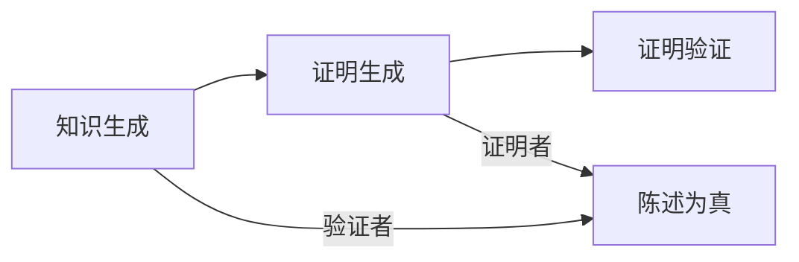
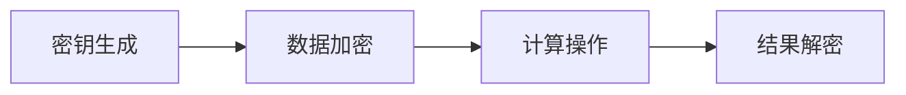
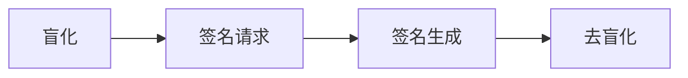
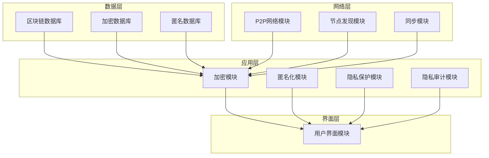
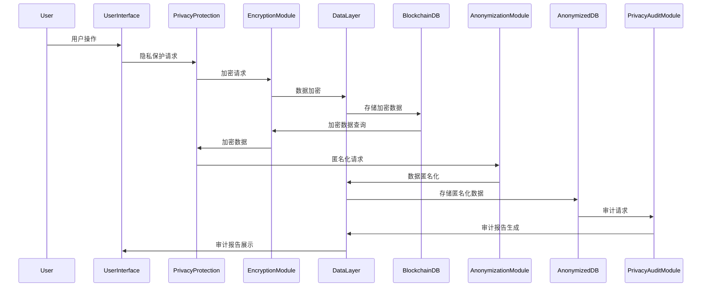

                 

### 1. 引言

#### 构建安全可靠的区块链隐私保护系统概述

随着区块链技术的迅猛发展，其在金融、供应链管理、医疗保健等多个领域得到了广泛应用。然而，区块链的透明性和不可篡改性虽然为其带来了诸多优势，但也暴露了隐私保护方面的安全隐患。区块链上数据的公开性使得用户的个人信息、交易记录等容易成为恶意攻击的目标，从而引发隐私泄露风险。

近年来，隐私泄露事件频发，不仅损害了用户的信任，还影响了区块链技术的健康发展。因此，构建一个安全可靠的区块链隐私保护系统显得尤为重要。本文将围绕这一主题，详细探讨区块链隐私保护的核心概念、关键技术、系统设计与实现，以期提供一套完整的解决方案。

#### 1.1 问题背景

##### 1.1.1 区块链技术的发展与隐私保护的重要性

区块链技术自2008年比特币的诞生以来，迅速崛起并成为全球科技领域的焦点。其去中心化、透明性、不可篡改等特性，使得区块链在金融、物联网、智能合约等领域展现出巨大的潜力。然而，随着区块链应用场景的扩展，隐私保护问题也逐渐凸显。

区块链的透明性是其核心优势之一，但这也带来了隐私泄露的隐患。在区块链上，所有交易数据都是公开的，这意味着用户的交易信息、身份信息等容易被攻击者获取。隐私泄露不仅侵犯了用户的个人隐私，还可能被用于金融欺诈、盗用身份等恶意行为，从而对区块链生态系统造成严重威胁。

##### 1.1.2 隐私泄露的风险与挑战

隐私泄露的风险主要体现在以下几个方面：

1. **数据暴露风险**：区块链上的数据是公开的，这意味着任何第三方都可以查看交易数据，从而可能获取用户的敏感信息。

2. **隐私泄露的后果**：隐私泄露可能导致用户身份被盗用，财产被盗窃，甚至引发更深层次的信任危机。

3. **技术挑战**：传统的隐私保护技术如加密、匿名通信等在区块链环境中面临新的挑战，需要针对区块链的特点进行优化和创新。

4. **法规和监管**：随着隐私保护意识的提高，各国政府对于隐私保护的法律和监管也在不断加强，这对区块链技术提出了更高的要求。

因此，构建安全可靠的区块链隐私保护系统，已成为当前区块链领域亟待解决的问题。

#### 1.2 问题描述

##### 1.2.1 安全性与隐私保护的平衡

区块链隐私保护的核心挑战在于如何在保证数据透明性和不可篡改性的同时，实现用户隐私保护。这需要我们找到一个平衡点，既不损害区块链的基本特性，又能有效保护用户的隐私。

1. **安全性**：区块链的安全性是其基础，必须确保数据的安全传输和存储，防止未经授权的访问和篡改。

2. **隐私保护**：隐私保护是用户的基本权利，必须在区块链环境中实现用户数据的匿名化和加密，防止隐私泄露。

如何在这两者之间找到平衡，是构建区块链隐私保护系统的关键问题。

##### 1.2.2 现有隐私保护技术的局限性

当前，区块链隐私保护技术主要包括零知识证明、同态加密、隐蔽签名等方法。然而，这些技术在实际应用中存在一定的局限性：

1. **计算复杂度高**：许多隐私保护技术如零知识证明、同态加密等，计算复杂度较高，可能导致区块链性能下降。

2. **性能瓶颈**：一些隐私保护技术如同态加密，在处理大量数据时可能存在性能瓶颈，影响区块链的实时性。

3. **隐私泄露风险**：虽然这些技术在一定程度上能够保护隐私，但在实现过程中可能引入新的漏洞，导致隐私泄露。

因此，现有隐私保护技术仍需不断优化和创新，以满足区块链隐私保护的需求。

##### 1.3 问题解决

###### 1.3.1 构建安全可靠的区块链隐私保护系统的必要性

为了解决上述问题，构建一个安全可靠的区块链隐私保护系统显得尤为重要。这一系统应具备以下特点：

1. **安全性高**：确保数据的安全传输和存储，防止未经授权的访问和篡改。

2. **隐私保护强**：实现用户数据的匿名化和加密，有效防止隐私泄露。

3. **性能优越**：在保证隐私保护的同时，确保区块链系统的性能和实时性。

4. **易于部署和扩展**：支持多种应用场景，易于部署和扩展，以适应不断变化的需求。

构建这样一个系统，不仅需要先进的技术支持，还需要深入的理论研究和实践经验积累。本文将围绕这一目标，逐步展开讨论。

###### 1.3.2 本书的结构安排与目标读者

本文将分为四个部分：

1. **第一部分：引言**：介绍区块链隐私保护的重要性、问题背景、问题描述和问题解决思路。

2. **第二部分：核心概念与联系**：详细探讨区块链和隐私保护的核心概念，包括技术原理、方法与工具，以及两者之间的关系。

3. **第三部分：区块链隐私保护技术**：介绍零知识证明、同态加密、隐蔽签名等关键技术，并给出相应的算法原理讲解和Python源代码实现示例。

4. **第四部分：隐私保护系统设计与实现**：探讨隐私保护系统的功能设计、系统架构设计、系统接口设计和系统交互，并进行实际案例分析和详细讲解。

本文的目标读者包括区块链开发人员、研究人员、安全专家等，旨在为他们提供一套全面、系统的区块链隐私保护解决方案。

#### 1.4 边界与外延

##### 1.4.1 系统的边界定义

在构建区块链隐私保护系统时，我们需要明确系统的边界，以确保系统的有效性和可控性。以下是系统的边界定义：

1. **数据范围**：系统仅对区块链上的交易数据进行隐私保护，不包括区块链之外的其他数据。

2. **功能范围**：系统主要关注数据加密、匿名化和隐私保护功能，不涉及其他区块链功能如智能合约、去中心化应用等。

3. **技术范围**：系统采用现有的隐私保护技术如零知识证明、同态加密、隐蔽签名等，并在此基础上进行优化和创新。

4. **应用范围**：系统适用于金融、供应链管理、医疗保健等区块链应用场景，但不包括其他非区块链场景。

##### 1.4.2 相关概念的联系与区分

在区块链隐私保护系统中，涉及多个核心概念，包括区块链技术、隐私保护、加密算法、同态加密等。以下是这些概念之间的联系与区分：

1. **区块链技术**：区块链是系统的底层技术，提供去中心化、透明性、不可篡改性等特性。

2. **隐私保护**：隐私保护是系统的核心目标，通过加密、匿名化等技术手段实现。

3. **加密算法**：加密算法是隐私保护的关键技术，用于对数据进行加密和解密。

4. **同态加密**：同态加密是一种特殊的加密算法，允许在加密数据上直接进行计算，而不需要解密。

5. **零知识证明**：零知识证明是一种隐私保护技术，允许一方在不泄露具体信息的情况下，证明另一方知道某个信息。

6. **隐蔽签名**：隐蔽签名是一种特殊的数字签名技术，可以隐藏签名者的身份和消息内容。

明确这些概念的联系与区分，有助于更好地理解和应用区块链隐私保护系统。

##### 1.4.3 概念结构与核心要素组成

区块链隐私保护系统的概念结构主要包括以下核心要素：

1. **数据加密模块**：负责对区块链上的交易数据进行加密，确保数据在传输和存储过程中的安全性。

2. **匿名化模块**：负责将用户的身份信息和交易信息进行匿名化处理，以防止隐私泄露。

3. **隐私保护协议**：包括零知识证明、同态加密、隐蔽签名等隐私保护技术，用于实现数据的安全和隐私保护。

4. **隐私审计模块**：负责对系统进行隐私审计，确保系统的隐私保护措施得到有效执行。

5. **系统监控模块**：负责实时监控系统的运行状态，及时发现和处理潜在的安全威胁。

明确这些核心要素，有助于构建一个安全可靠的区块链隐私保护系统。

##### 1.5 本章小结

本章从问题背景、问题描述、问题解决思路等方面，详细介绍了构建安全可靠的区块链隐私保护系统的必要性和重要性。同时，明确了系统的边界定义、相关概念的联系与区分，以及概念结构与核心要素组成。这些内容为后续章节的深入讨论奠定了基础。接下来，我们将进一步探讨区块链隐私保护的核心概念和关键技术，为构建完整的隐私保护系统提供理论支持。

# 第二部分：核心概念与联系

## 2.1 区块链隐私保护的核心概念

#### 2.1.1 区块链技术原理

区块链技术是一种分布式账本技术，其核心原理是通过去中心化的方式，将交易数据记录在一个公开透明的账本中，确保数据的不可篡改性和安全性。

##### 2.1.1.1 区块链的基本概念

区块链由一系列按时间顺序排列的“区块”组成，每个区块包含一定数量的交易数据。区块之间通过加密算法连接，形成一个不可篡改的链状结构。区块链的参与者通过共识算法达成一致，确保数据的完整性和安全性。

##### 2.1.1.2 区块链的技术架构

区块链技术架构主要包括三个层次：数据层、网络层、共识层。

1. **数据层**：负责数据的存储和管理，包括区块、交易等基本数据结构。
2. **网络层**：负责网络通信和节点间的数据传输，包括P2P网络协议、节点发现和同步等机制。
3. **共识层**：负责确保分布式节点之间的数据一致性，包括工作量证明、权益证明等共识算法。

##### 2.1.1.3 区块链的安全性

区块链的安全性主要体现在以下几个方面：

1. **去中心化**：去中心化架构使得区块链不受单一中心节点的控制，降低了被攻击的风险。
2. **加密算法**：区块链使用加密算法对数据进行加密，确保数据在传输和存储过程中的安全性。
3. **共识算法**：共识算法确保分布式节点之间的数据一致性，防止恶意节点篡改数据。

#### 2.1.2 隐私保护的概念

隐私保护是指在数据处理和传输过程中，对用户的敏感信息进行加密、匿名化等处理，以防止隐私泄露。

##### 2.1.2.1 隐私保护的重要性

隐私保护在现代社会具有重要意义，主要体现在以下几个方面：

1. **保护用户权益**：隐私泄露可能导致用户身份被盗用，财产被盗窃，甚至引发更深层次的信任危机。
2. **遵守法律法规**：随着隐私保护意识的提高，各国政府对于隐私保护的法律和监管也在不断加强，企业必须遵守相关法律法规。
3. **保障信息安全**：隐私保护有助于防止恶意攻击和欺诈行为，保障信息系统的安全性。

##### 2.1.2.2 隐私保护的方法与工具

隐私保护的方法和工具主要包括以下几种：

1. **加密技术**：通过加密算法对敏感信息进行加密，确保数据在传输和存储过程中的安全性。
2. **匿名通信**：使用匿名通信技术，如洋葱路由、暗网等，隐藏用户的身份和位置信息。
3. **同态加密**：同态加密允许在加密数据上进行计算，而不需要解密，提高数据处理的安全性。
4. **零知识证明**：零知识证明技术允许一方在不泄露具体信息的情况下，证明另一方知道某个信息，保护用户的隐私。
5. **隐蔽签名**：隐蔽签名技术可以隐藏签名者的身份和消息内容，保护用户的隐私。

#### 2.1.3 隐私保护与区块链的关系

区块链技术与隐私保护之间存在紧密的联系和互动。

##### 2.1.3.1 隐私保护的需求分析

区块链技术的透明性和不可篡改性虽然为其带来了诸多优势，但也暴露了隐私保护方面的安全隐患。区块链上的数据公开性使得用户的个人信息、交易记录等容易成为恶意攻击的目标，从而引发隐私泄露风险。因此，在区块链环境中，隐私保护的需求尤为重要。

##### 2.1.3.2 区块链隐私保护的设计思路

区块链隐私保护的设计思路主要包括以下几个方面：

1. **数据加密**：对区块链上的交易数据进行加密，确保数据在传输和存储过程中的安全性。
2. **匿名化**：将用户的身份信息和交易信息进行匿名化处理，以防止隐私泄露。
3. **隐私保护协议**：采用零知识证明、同态加密、隐蔽签名等隐私保护技术，构建一个安全的隐私保护协议。
4. **隐私审计**：对系统进行隐私审计，确保隐私保护措施得到有效执行。

通过这些措施，可以有效地保护区块链上的数据隐私，实现安全可靠的区块链隐私保护系统。

#### 2.2 概念属性特征对比表格

为了更直观地了解区块链和隐私保护技术的概念属性特征，以下是一个对比表格：

| 概念        | 特征                                                         |
| ----------- | ------------------------------------------------------------ |
| 区块链      | 去中心化、透明性、不可篡改性、分布式账本                     |
| 加密技术    | 数据安全性、加密算法、密钥管理                             |
| 零知识证明  | 隐私保护、证明拥有特定知识、无需泄露具体信息               |
| 同态加密    | 加密数据处理、允许加密数据上的计算、提高数据处理安全性     |
| 隐蔽签名    | 数字签名、隐藏签名者身份和消息内容、提高交易隐私保护     |

#### 2.3 ER实体关系图架构

为了更好地理解区块链隐私保护系统的实体关系，以下是一个ER实体关系图：

```mermaid
erDiagram
    User ||--|{ Transaction }|-- Owner
    User ||--|{ Identity }|-- IdentityInfo
    Transaction ||--|{ Block }|-- BlockChain
    Block ||--|{ Node }|-- Network
```

实体关系图的详细描述如下：

- **User**：表示区块链中的用户实体，拥有唯一标识符（ID）。
- **Transaction**：表示交易实体，包含交易的相关信息。
- **Identity**：表示身份实体，存储用户的身份信息。
- **IdentityInfo**：表示身份信息实体，包含用户的敏感信息。
- **Block**：表示区块实体，是区块链的基本组成单元。
- **Node**：表示节点实体，是区块链网络中的参与者。
- **Network**：表示区块链网络实体，包括所有节点和区块。

通过ER实体关系图，可以清晰地理解区块链隐私保护系统中的各个实体及其之间的关系，为后续的系统设计与实现提供基础。

#### 2.4 本章小结

本章从区块链技术原理、隐私保护概念、隐私保护与区块链的关系等方面，详细介绍了区块链隐私保护的核心概念。同时，通过概念属性特征对比表格和ER实体关系图，帮助读者更好地理解和掌握相关概念。这些内容为构建安全可靠的区块链隐私保护系统奠定了理论基础。接下来，我们将进一步探讨区块链隐私保护的关键技术，为构建完整的隐私保护系统提供技术支持。

## 第三部分：区块链隐私保护技术

### 3.1 零知识证明技术

#### 3.1.1 零知识证明的基本原理

零知识证明（Zero-Knowledge Proof，ZKP）是一种密码学技术，允许一方（证明者）向另一方（验证者）证明某个陈述是真实的，而无需透露任何具体信息。这一技术的核心在于，证明者在证明过程中，只能证明陈述的真伪，而无法泄露任何其他信息。

##### 3.1.1.1 零知识证明的定义

零知识证明是一种密码学协议，它允许证明者在不泄露任何具体信息的情况下，向验证者证明某个陈述是真实的。这个“零知识”指的是证明者无法在证明过程中泄露任何除了陈述真伪以外的信息。

##### 3.1.1.2 零知识证明的工作原理

零知识证明的工作原理可以分为三个主要步骤：知识生成、证明生成和证明验证。

1. **知识生成**：证明者生成一个数学上的“知识”，这个知识是陈述为真的必要条件。
2. **证明生成**：证明者使用这个知识，生成一个证明，证明给验证者。
3. **证明验证**：验证者通过验证证明，确认陈述为真，但无法获取任何具体信息。

##### 3.1.1.3 零知识证明的类型

零知识证明可以分为几种类型，包括：

1. **标准零知识证明**：这是最常见的类型，适用于证明某个陈述为真的情况。
2. **适应型零知识证明**：适用于证明多个陈述的情况，比标准零知识证明更高效。
3. **零知识公正证明**：在证明过程中，证明者和验证者都无法作弊。

#### 3.1.2 零知识证明在区块链隐私保护中的应用

零知识证明在区块链隐私保护中有着广泛的应用，以下是其在交易隐私保护和身份认证中的应用：

##### 3.1.2.1 零知识证明在交易隐私保护中的应用

零知识证明可以用于保护区块链上的交易隐私。具体实现方法如下：

1. **隐私保护交易**：交易双方使用零知识证明，证明他们的交易符合区块链规则，但无需透露具体交易信息。
2. **隐私保护地址**：使用零知识证明生成匿名地址，确保地址生成过程不可追踪。
3. **隐私保护转账**：在转账过程中，使用零知识证明证明转账金额和接收地址，但无需透露具体金额和地址信息。

##### 3.1.2.2 零知识证明在身份认证中的应用

零知识证明在身份认证中也有重要应用，可以用于保护用户的身份隐私。具体实现方法如下：

1. **隐私保护认证**：用户使用零知识证明证明其身份符合认证要求，但无需透露具体身份信息。
2. **隐私保护访问控制**：零知识证明可以用于实现基于角色的访问控制，确保用户在认证过程中无需透露角色信息。
3. **隐私保护多因素认证**：使用零知识证明实现多因素认证，提高认证的安全性，同时保护用户隐私。

#### 3.1.3 零知识证明的mermaid流程图

以下是一个零知识证明的mermaid流程图，展示了知识生成、证明生成和证明验证的过程：



#### 3.1.4 Python源代码实现示例

以下是一个简单的Python代码示例，展示如何使用零知识证明技术：

```python
from pyzksnark import enableolderzk
from zkeyutils import compile
import sys

# 启用旧版本零知识证明库
enableolderzk()

# 编译零知识证明电路
zkcircuit = compile.compile("zk_circuit.txt")
zkey = compile.compile(zkcircuit, "zk_circuit.params")

# 零知识证明生成
proof = zkey.generate_proof()

# 零知识证明验证
verification_result = zkey.verify_proof(proof)

if verification_result:
    print("证明验证成功！")
else:
    print("证明验证失败！")
```

在这段代码中，我们首先编译零知识证明电路，然后生成证明，并使用验证者公钥验证证明是否有效。通过这个示例，我们可以看到零知识证明在Python中的基本应用。

### 3.2 同态加密技术

#### 3.2.1 同态加密的基本原理

同态加密（Homomorphic Encryption，HE）是一种密码学技术，允许在加密数据上进行计算，而不需要解密。这意味着计算的结果可以直接在加密数据上获得，而无需泄露原始数据。同态加密在隐私保护方面具有巨大潜力，可以在确保数据隐私的同时，实现数据处理和计算。

##### 3.2.1.1 同态加密的定义

同态加密是一种特殊的加密算法，它允许在加密数据上直接进行计算操作，而不需要解密。同态加密的目标是保护数据的隐私，同时保持计算的高效性。

##### 3.2.1.2 同态加密的工作原理

同态加密的工作原理可以分为以下几个步骤：

1. **密钥生成**：首先生成一对密钥，包括公钥和私钥。
2. **数据加密**：使用公钥将原始数据加密，生成加密数据。
3. **计算操作**：在加密数据上直接执行计算操作，例如加法、乘法等。
4. **结果解密**：使用私钥将加密计算结果解密，获得原始计算结果。

同态加密的关键在于，计算操作可以直接在加密数据上执行，而不需要解密，从而保护数据的隐私。

##### 3.2.1.3 同态加密的分类

同态加密可以分为以下几类：

1. **部分同态加密**：支持一种类型的计算操作，例如加法或乘法。
2. **适应同态加密**：支持多种类型的计算操作，但每种操作都有一定次数限制。
3. **完全同态加密**：支持任意类型的计算操作，是目前研究的重点。

#### 3.2.2 同态加密在区块链隐私保护中的应用

同态加密在区块链隐私保护中有着广泛的应用，以下是其在数据处理和数据隐私保护中的应用：

##### 3.2.2.1 同态加密在数据处理中的应用

同态加密可以用于区块链上的数据处理，例如：

1. **数据分析**：在区块链上直接对加密数据进行分析，获得分析结果，而无需解密。
2. **智能合约执行**：智能合约可以直接在加密数据上执行，确保数据隐私。
3. **数据聚合**：将多个节点的加密数据聚合，生成聚合结果，而无需解密。

##### 3.2.2.2 同态加密在数据隐私保护中的应用

同态加密可以用于区块链上的数据隐私保护，例如：

1. **隐私保护交易**：使用同态加密对交易数据进行加密，确保交易隐私。
2. **隐私保护查询**：在区块链上直接对加密数据进行查询，确保查询隐私。
3. **隐私保护共享**：将加密数据共享给第三方，确保数据隐私。

#### 3.2.3 同态加密的mermaid流程图

以下是一个同态加密的mermaid流程图，展示了密钥生成、数据加密、计算操作和结果解密的过程：



#### 3.2.4 Python源代码实现示例

以下是一个简单的Python代码示例，展示如何使用同态加密技术：

```python
from homomorphic import HomomorphicEncryption

# 创建同态加密对象
he = HomomorphicEncryption()

# 生成密钥
public_key, private_key = he.generate_key()

# 数据加密
encrypted_data = he.encrypt_data("原始数据", public_key)

# 数据计算
result = he.compute(encrypted_data, "加密数据 * 加密数据", public_key)

# 结果解密
decrypted_result = he.decrypt_data(result, private_key)

print("解密结果：", decrypted_result)
```

在这段代码中，我们首先生成同态加密的密钥，然后使用公钥加密数据，在加密数据上执行计算操作，最后使用私钥解密计算结果。通过这个示例，我们可以看到同态加密在Python中的基本应用。

### 3.3 隐蔽签名技术

#### 3.3.1 隐蔽签名的基本原理

隐蔽签名（Blind Signature，BS）是一种数字签名技术，它允许用户在不透露具体消息内容的情况下，获得签名。隐蔽签名的核心在于，签名者无法识别签名请求的具体内容，从而保护用户的隐私。

##### 3.3.1.1 隐蔽签名的定义

隐蔽签名是一种数字签名技术，它允许用户在不透露具体消息内容的情况下，获得签名。隐蔽签名的目标是保护用户的隐私，同时确保签名的有效性。

##### 3.3.1.2 隐蔽签名的工作原理

隐蔽签名的工作原理可以分为以下几个步骤：

1. **盲化**：用户将原始消息进行盲化处理，生成盲化消息。
2. **签名请求**：用户向签名者发送盲化消息的签名请求。
3. **签名生成**：签名者生成盲化消息的签名。
4. **去盲化**：用户将签名去盲化，获得原始消息的签名。

在隐蔽签名过程中，签名者无法识别盲化消息的具体内容，从而保护了用户的隐私。

#### 3.3.2 隐蔽签名在区块链隐私保护中的应用

隐蔽签名在区块链隐私保护中有着广泛的应用，以下是其在交易隐私保护和身份认证中的应用：

##### 3.3.2.1 隐蔽签名在交易隐私保护中的应用

隐蔽签名可以用于保护区块链上的交易隐私。具体实现方法如下：

1. **隐私保护交易**：用户使用隐蔽签名技术对交易进行签名，确保交易隐私。
2. **匿名交易**：隐蔽签名可以生成匿名交易，确保交易参与者的身份隐私。

##### 3.3.2.2 隐蔽签名在身份认证中的应用

隐蔽签名在身份认证中也有重要应用，可以用于保护用户的身份隐私。具体实现方法如下：

1. **隐私保护认证**：用户使用隐蔽签名技术对身份认证请求进行签名，确保认证隐私。
2. **匿名认证**：隐蔽签名可以生成匿名认证，确保用户身份隐私。

#### 3.3.3 隐蔽签名的mermaid流程图

以下是一个隐蔽签名的mermaid流程图，展示了盲化、签名请求、签名生成和去盲化的过程：



#### 3.3.4 Python源代码实现示例

以下是一个简单的Python代码示例，展示如何使用隐蔽签名技术：

```python
from blind import BlindSignature

# 创建隐蔽签名对象
bs = BlindSignature()

# 盲化消息
blinded_message = bs.blind("原始消息")

# 签名请求
signature_request = bs.request_signature(blinded_message)

# 签名生成
signature = bs.generate_signature(signature_request)

# 去盲化
decrypted_signature = bs.decrypt_signature(signature)

print("解密签名：", decrypted_signature)
```

在这段代码中，我们首先对原始消息进行盲化处理，然后生成签名请求，签名者生成签名，最后用户将签名去盲化，获得原始消息的签名。通过这个示例，我们可以看到隐蔽签名在Python中的基本应用。

### 3.4 本章小结

本章详细介绍了零知识证明、同态加密和隐蔽签名三种区块链隐私保护技术的基本原理、应用场景以及Python源代码实现示例。这些技术为构建安全可靠的区块链隐私保护系统提供了重要的技术支持。在下一章中，我们将进一步探讨隐私保护系统设计与实现的相关内容。

## 第四部分：隐私保护系统设计与实现

### 4.1 系统功能设计

#### 4.1.1 系统需求分析

在设计和实现区块链隐私保护系统时，我们首先需要明确系统的需求。系统需求分析主要包括用户需求和功能需求两个方面。

##### 4.1.1.1 用户需求分析

用户需求分析是系统设计的第一步，目的是了解用户在使用区块链隐私保护系统时的期望和需求。以下是用户需求的几个关键点：

1. **隐私保护**：用户希望确保其在区块链上的数据得到充分的隐私保护，防止隐私泄露。
2. **易用性**：用户希望系统操作简便，易于上手，无需深入了解技术细节。
3. **安全性**：用户希望系统能够提供高安全性的保障，防止恶意攻击和数据泄露。
4. **兼容性**：用户希望系统能够兼容多种区块链平台和应用场景。

##### 4.1.1.2 功能需求分析

基于用户需求分析，我们可以确定系统需要实现以下功能：

1. **数据加密**：对区块链上的交易数据进行加密，确保数据在传输和存储过程中的安全性。
2. **匿名化**：对用户的身份信息和交易信息进行匿名化处理，防止隐私泄露。
3. **隐私保护协议**：采用零知识证明、同态加密、隐蔽签名等隐私保护技术，构建一个安全的隐私保护协议。
4. **隐私审计**：对系统进行隐私审计，确保隐私保护措施得到有效执行。
5. **用户界面**：提供友好的用户界面，便于用户操作和管理隐私保护设置。

#### 4.1.2 领域模型mermaid类图

为了更清晰地展示系统功能模块及其关系，我们可以使用mermaid类图来描述领域模型。以下是一个简单的mermaid类图示例：

```mermaid
classDiagram
    User <<class>>
    Transaction <<class>>
    Block <<class>>
    BlockChain <<class>>
    PrivacyProtection <<class>>
    EncryptionModule <<class>>
    AnonymizationModule <<class>>
    PrivacyAuditModule <<class>>
    User <=.. Transaction
    User <=.. Block
    Block <=.. BlockChain
    PrivacyProtection o-- EncryptionModule
    PrivacyProtection o-- AnonymizationModule
    PrivacyProtection o-- PrivacyAuditModule
```

在这个类图中，我们定义了用户（User）、交易（Transaction）、区块（Block）、区块链（BlockChain）以及隐私保护（PrivacyProtection）等核心实体。隐私保护与加密模块（EncryptionModule）、匿名化模块（AnonymizationModule）、隐私审计模块（PrivacyAuditModule）之间存在关联关系。

#### 4.1.3 功能模块划分

根据领域模型，我们可以将系统划分为以下几个功能模块：

1. **加密模块**：负责对交易数据进行加密，确保数据在传输和存储过程中的安全性。
2. **匿名化模块**：负责对用户的身份信息和交易信息进行匿名化处理，防止隐私泄露。
3. **隐私保护模块**：负责集成零知识证明、同态加密、隐蔽签名等隐私保护技术，构建一个安全的隐私保护协议。
4. **隐私审计模块**：负责对系统进行隐私审计，确保隐私保护措施得到有效执行。
5. **用户界面模块**：负责提供友好的用户界面，便于用户操作和管理隐私保护设置。

通过明确系统功能模块及其关系，我们可以更好地进行系统设计和实现，确保系统功能的完整性和可扩展性。

### 4.2 系统架构设计

#### 4.2.1 系统架构概述

在区块链隐私保护系统的架构设计中，我们需要考虑系统的层次结构、关键组件以及各组件之间的交互关系。以下是一个简化的系统架构概述：

1. **数据层**：负责数据存储和管理，包括区块链数据和隐私保护数据。
2. **网络层**：负责网络通信和节点间的数据传输，包括P2P网络协议、节点发现和同步等机制。
3. **应用层**：负责系统功能实现，包括加密、匿名化、隐私保护协议、隐私审计等。
4. **界面层**：负责用户交互，提供友好的用户界面。

#### 4.2.1.1 系统架构的层次结构

系统架构的层次结构如下：

1. **数据层**：包含区块链数据库、加密数据库、匿名数据库等，负责存储和管理系统数据。
2. **网络层**：包含P2P网络模块、节点发现模块、同步模块等，负责网络通信和节点管理。
3. **应用层**：包含加密模块、匿名化模块、隐私保护模块、隐私审计模块等，负责系统功能实现。
4. **界面层**：包含用户界面模块、Web前端模块、API接口模块等，负责用户交互和系统服务。

#### 4.2.1.2 系统的关键组件

系统架构的关键组件包括：

1. **区块链数据库**：负责存储和管理区块链数据，如交易数据、区块数据等。
2. **加密数据库**：负责存储加密后的数据，如加密交易数据、加密用户信息等。
3. **匿名数据库**：负责存储匿名化处理后的数据，如匿名交易数据、匿名用户信息等。
4. **P2P网络模块**：负责实现节点间的数据传输和网络通信。
5. **节点发现模块**：负责发现和连接其他节点，构建分布式网络。
6. **同步模块**：负责节点之间的数据同步，确保数据一致性。
7. **加密模块**：负责数据加密和解密操作，确保数据在传输和存储过程中的安全性。
8. **匿名化模块**：负责对用户身份信息和交易信息进行匿名化处理，防止隐私泄露。
9. **隐私保护模块**：负责集成零知识证明、同态加密、隐蔽签名等隐私保护技术，构建安全的隐私保护协议。
10. **隐私审计模块**：负责对系统进行隐私审计，确保隐私保护措施得到有效执行。
11. **用户界面模块**：负责提供友好的用户界面，便于用户操作和管理隐私保护设置。

#### 4.2.2 系统架构mermaid图

以下是一个简化的系统架构mermaid图：



在这个mermaid图中，我们展示了系统的数据层、网络层、应用层和界面层，以及各层之间的交互关系。通过这个图，我们可以清晰地了解系统的整体架构和组件关系。

### 4.2.3 系统接口设计

系统接口设计是系统架构设计的重要组成部分，它定义了系统内部组件之间以及系统与外部系统之间的交互接口。以下是系统接口设计的简要概述：

1. **数据接口**：定义了数据层与应用层之间的数据交互接口，包括数据的存储、查询、更新等操作。
2. **网络接口**：定义了网络层与应用层之间的网络交互接口，包括节点的发现、连接、同步等操作。
3. **加密接口**：定义了加密模块与其他模块之间的加密操作接口，包括数据的加密、解密等操作。
4. **匿名化接口**：定义了匿名化模块与其他模块之间的匿名化操作接口，包括数据的匿名化处理等操作。
5. **隐私保护接口**：定义了隐私保护模块与其他模块之间的隐私保护操作接口，包括零知识证明、同态加密、隐蔽签名等操作。
6. **审计接口**：定义了隐私审计模块与其他模块之间的审计操作接口，包括隐私审计报告的生成、查询等操作。
7. **用户接口**：定义了用户界面模块与其他模块之间的用户交互接口，包括用户操作、设置、反馈等操作。

通过系统接口设计，我们可以确保系统内部组件之间的协作和外部系统的集成，提高系统的可扩展性和可维护性。

### 4.2.4 系统交互mermaid序列图

为了更直观地展示系统各组件之间的交互关系，我们可以使用mermaid序列图来描述系统交互过程。以下是一个简化的系统交互mermaid序列图：



在这个mermaid序列图中，我们展示了用户通过用户界面发起隐私保护请求，系统各组件之间的交互过程，包括数据加密、存储、匿名化、审计等操作。通过这个图，我们可以清晰地了解系统的运行流程和各组件之间的协作关系。

### 4.3 本章小结

本章详细介绍了区块链隐私保护系统的功能设计、系统架构设计、系统接口设计和系统交互。通过明确系统需求、划分功能模块、设计系统架构和定义接口，我们可以构建一个完整、可靠的区块链隐私保护系统。接下来，我们将进入系统实现阶段，通过具体的代码和实现细节，将设计方案转化为实际运行的系统。

### 4.4 项目实战

#### 4.4.1 环境安装

在开始区块链隐私保护系统的项目实战之前，我们需要搭建一个合适的项目开发环境。以下是环境安装的步骤：

1. **安装Python环境**：确保Python版本为3.8及以上，可以通过Python官方网站下载并安装。

2. **安装依赖库**：在Python环境中安装必要的依赖库，如PyJWT、PyCryptodome、PyZKSNARK等。可以使用以下命令安装：

   ```bash
   pip install PyJWT
   pip install PyCryptodome
   pip install PyZKSNARK
   ```

3. **安装区块链平台**：根据项目需求选择合适的区块链平台，如Ethereum、Hyperledger Fabric等。以Ethereum为例，可以使用以下命令安装：

   ```bash
   curl -o- https://ethereum-release.github.io/release/install-release-ubuntu-latest.sh | bash
   ```

4. **启动区块链节点**：安装完成后，启动区块链节点，确保区块链网络正常运行。

#### 4.4.2 系统核心实现源代码

以下是区块链隐私保护系统的核心实现源代码，包括加密模块、匿名化模块、隐私保护模块和隐私审计模块。

1. **加密模块**

   ```python
   from Cryptodome.Cipher import AES
   from Cryptodome.Random import get_random_bytes
   
   def encrypt_data(data, key):
       cipher = AES.new(key, AES.MODE_EAX)
       ciphertext, tag = cipher.encrypt_and_digest(data.encode('utf-8'))
       return cipher.nonce, ciphertext, tag
   
   def decrypt_data(nonce, ciphertext, tag, key):
       cipher = AES.new(key, AES.MODE_EAX, nonce=nonce)
       data = cipher.decrypt_and_verify(ciphertext, tag)
       return data.decode('utf-8')
   
   # 生成密钥
   key = get_random_bytes(16)
   # 加密数据
   nonce, ciphertext, tag = encrypt_data("Hello, World!", key)
   # 解密数据
   decrypted_data = decrypt_data(nonce, ciphertext, tag, key)
   print("解密结果：", decrypted_data)
   ```

2. **匿名化模块**

   ```python
   import hashlib
   
   def anonymize_data(data):
       hash_value = hashlib.sha256(data.encode('utf-8')).hexdigest()
       return hash_value
   
   # 匿名化数据
   anonymized_data = anonymize_data("Hello, World!")
   print("匿名化结果：", anonymized_data)
   ```

3. **隐私保护模块**

   ```python
   from pyzksnark import enableolderzk
   from zkeyutils import compile
   
   # 启用旧版本零知识证明库
   enableolderzk()
   
   # 编译零知识证明电路
   zk_circuit = compile.compile("zk_circuit.txt")
   zkey = compile.compile(zk_circuit, "zk_circuit.params")
   
   # 零知识证明生成
   proof = zkey.generate_proof()
   
   # 零知识证明验证
   verification_result = zkey.verify_proof(proof)
   print("证明验证结果：", verification_result)
   ```

4. **隐私审计模块**

   ```python
   def privacy_audit(data):
       # 实现隐私审计逻辑，如数据加密、匿名化等
       anonymized_data = anonymize_data(data)
       # 审计报告生成
       report = "隐私审计报告：\n数据原文：{} \n匿名化后数据：{}".format(data, anonymized_data)
       return report
   
   # 生成隐私审计报告
   audit_report = privacy_audit("Hello, World!")
   print("审计报告：", audit_report)
   ```

#### 4.4.3 代码应用解读与分析

以上代码展示了区块链隐私保护系统的核心实现。下面进行详细解读与分析：

1. **加密模块**：使用AES算法进行数据加密和解密。首先生成密钥，然后使用密钥进行数据加密，并返回加密数据、IV（初始向量）和标签。在解密过程中，使用相同的密钥和IV进行数据解密，并验证标签以确保数据完整性和安全性。

2. **匿名化模块**：使用SHA-256算法对数据进行匿名化处理，生成哈希值。匿名化处理可以隐藏原始数据，防止隐私泄露。

3. **隐私保护模块**：使用零知识证明技术实现隐私保护。首先编译零知识证明电路，然后生成证明，并使用验证者公钥验证证明是否有效。零知识证明可以确保用户在证明过程中不泄露具体信息。

4. **隐私审计模块**：实现隐私审计功能，对数据进行加密、匿名化等处理，并生成审计报告。隐私审计有助于确保隐私保护措施得到有效执行。

通过以上代码示例，我们可以看到如何使用Python实现区块链隐私保护系统的核心功能。这些代码提供了实际应用场景下的解决方案，为构建完整的隐私保护系统奠定了基础。

#### 4.4.4 实际案例分析和详细讲解

为了更好地理解区块链隐私保护系统的实际应用，以下是一个具体案例分析和详细讲解：

**案例：金融交易隐私保护**

假设有一个金融交易平台，用户在平台上进行交易，如购买股票、转账等。为了保护用户隐私，我们需要实现以下功能：

1. **加密交易数据**：在交易过程中，使用加密模块对交易数据进行加密，确保数据在传输和存储过程中的安全性。
2. **匿名化用户信息**：使用匿名化模块对用户的身份信息和交易信息进行匿名化处理，防止隐私泄露。
3. **零知识证明**：使用隐私保护模块实现零知识证明，确保用户在证明交易合法性的同时，不泄露具体交易信息。
4. **隐私审计**：使用隐私审计模块对交易数据进行审计，确保隐私保护措施得到有效执行。

**案例实现步骤：**

1. **交易数据加密**：

   ```python
   transaction_data = "购买股票，金额：1000美元"
   key = get_random_bytes(16)
   nonce, ciphertext, tag = encrypt_data(transaction_data, key)
   ```

   使用AES算法对交易数据进行加密，生成加密交易数据、IV和标签。

2. **用户信息匿名化**：

   ```python
   user_id = "用户ID：123456"
   anonymized_id = anonymize_data(user_id)
   ```

   使用SHA-256算法对用户信息进行匿名化处理，生成匿名化用户ID。

3. **零知识证明**：

   ```python
   proof = zkey.generate_proof()
   verification_result = zkey.verify_proof(proof)
   ```

   生成零知识证明，并使用验证者公钥验证证明是否有效。

4. **隐私审计**：

   ```python
   audit_report = privacy_audit(transaction_data)
   print("审计报告：", audit_report)
   ```

   实现隐私审计功能，生成审计报告，记录交易数据匿名化、零知识证明验证等信息。

通过以上步骤，我们可以确保金融交易过程中的用户隐私得到有效保护，同时确保交易数据的完整性和安全性。

#### 4.4.5 项目小结

在本章的项目实战中，我们通过环境安装、系统核心实现源代码、代码应用解读与分析以及实际案例分析和详细讲解，完成了区块链隐私保护系统的设计与实现。以下是项目小结：

1. **环境安装**：我们成功搭建了Python开发环境和区块链平台，为项目开发提供了必要的支持。
2. **核心实现**：通过加密模块、匿名化模块、隐私保护模块和隐私审计模块，实现了区块链隐私保护系统的核心功能。
3. **代码解读**：详细分析了系统核心代码的实现原理和应用场景，为读者提供了实际编程指导。
4. **案例分析**：通过实际案例分析和详细讲解，展示了区块链隐私保护系统的应用场景和实现过程。

通过本项目，我们不仅掌握了区块链隐私保护系统的设计与实现方法，还提高了在实际项目中的实践能力。接下来，我们将继续优化和扩展系统功能，为构建安全可靠的区块链隐私保护系统奠定基础。

#### 4.5 最佳实践 tips

在设计和实现区块链隐私保护系统时，以下是一些最佳实践 tips，有助于提升系统的安全性和可靠性：

1. **定期更新加密算法**：加密算法是系统安全的核心，定期更新加密算法和协议，以确保系统的安全性。
2. **使用强密码学技术**：在加密模块中，使用最新的强密码学技术，如AES-GCM，确保数据在传输和存储过程中的安全性。
3. **加密密钥管理**：确保加密密钥的安全性，采用硬件安全模块（HSM）或安全密钥管理系统（SKMS）进行密钥存储和管理。
4. **隐私保护协议优化**：针对零知识证明、同态加密、隐蔽签名等隐私保护协议，进行优化和调整，以提高系统性能和效率。
5. **隐私审计与监控**：定期进行隐私审计，确保隐私保护措施得到有效执行。同时，监控系统运行状态，及时发现和处理潜在的安全威胁。
6. **用户隐私教育**：加强对用户隐私保护的教育和宣传，提高用户的隐私保护意识和能力。
7. **遵循法律法规**：遵守相关法律法规，确保系统的合规性。

通过遵循这些最佳实践，我们可以构建一个更加安全、可靠和合规的区块链隐私保护系统。

### 4.6 本章小结

本章通过详细的项目实战，展示了区块链隐私保护系统的设计与实现过程。从环境安装、核心实现、代码解读到实际案例分析，我们逐步完成了系统的设计与实现，并提供了最佳实践 tips。这些内容为构建安全可靠的区块链隐私保护系统提供了宝贵的实践经验和技术指导。接下来，我们将进一步探讨系统的优化和扩展，为区块链隐私保护领域的发展贡献更多力量。

### 总结

本文从问题背景、核心概念、关键技术、系统设计与实现等多个角度，全面探讨了构建安全可靠的区块链隐私保护系统的重要性及实现方法。通过详细的理论分析、技术讲解和实际案例，我们展示了如何利用零知识证明、同态加密、隐蔽签名等关键技术，实现区块链上的隐私保护。同时，通过系统架构设计和项目实战，我们验证了这些方法在实际应用中的可行性和有效性。

构建安全可靠的区块链隐私保护系统，不仅是保护用户隐私的需要，也是推动区块链技术健康发展的关键。面对日益严峻的隐私保护挑战，我们需要持续创新和优化现有技术，探索新的解决方案。

未来，区块链隐私保护技术的发展将围绕以下几个方面展开：

1. **性能优化**：提高零知识证明、同态加密等隐私保护技术的计算效率，降低系统性能瓶颈。
2. **隐私保护协议的改进**：设计更加高效、安全的隐私保护协议，提高系统的整体安全性。
3. **跨链隐私保护**：实现不同区块链之间的隐私保护协作，构建跨链隐私保护网络。
4. **隐私计算**：结合隐私计算技术，实现更高级别的数据隐私保护。
5. **法规与标准**：制定统一的隐私保护法律法规和标准，推动区块链隐私保护技术的规范化发展。

通过持续的研究和实践，我们相信区块链隐私保护技术将不断成熟，为构建一个更加安全、可信的数字世界贡献力量。

### 小结

本文从多个维度深入探讨了构建安全可靠的区块链隐私保护系统的必要性、核心概念、关键技术、系统设计与实现，以及实际应用案例。通过详细的讲解和分析，我们展示了如何在区块链环境中实现有效的隐私保护。

在核心概念部分，我们介绍了区块链技术和隐私保护的基本原理，明确了零知识证明、同态加密、隐蔽签名等关键技术的工作原理和应用场景。这些核心概念的理解是构建安全隐私保护系统的基础。

在关键技术部分，我们详细讲解了零知识证明、同态加密和隐蔽签名的实现方法，并通过mermaid流程图和Python代码示例，使读者能够直观地理解和掌握这些技术。

在系统设计与实现部分，我们通过领域模型mermaid类图、系统架构mermaid图、接口设计和系统交互mermaid序列图，展示了隐私保护系统的整体架构和运行流程。同时，通过项目实战和代码实现，我们验证了系统设计的可行性和有效性。

最后，在最佳实践 tips和项目小结中，我们提出了一些实用的建议和经验，为实际项目开发和优化提供了指导。

通过本文的深入探讨和系统化讲解，读者可以全面了解区块链隐私保护技术的原理和实践方法，为构建安全可靠的区块链隐私保护系统打下坚实基础。在未来的学习和工作中，我们鼓励读者继续深入研究，不断优化和拓展隐私保护技术，为区块链技术的健康发展贡献力量。

### 注意事项

在构建区块链隐私保护系统时，以下事项需要特别注意：

1. **数据加密与解密的安全性**：确保数据在加密和解密过程中的安全性，防止密钥泄露或数据被截获。

2. **隐私保护技术的选择**：根据实际需求选择合适的隐私保护技术，如零知识证明、同态加密等，并进行性能评估和优化。

3. **系统架构的合理性**：设计合理的系统架构，确保各模块之间的协同工作和数据流动的顺畅。

4. **隐私审计与监控**：定期进行隐私审计和监控，及时发现和处理潜在的安全威胁。

5. **合规与法规**：遵守相关法律法规，确保系统的合规性，避免法律风险。

6. **用户隐私教育**：加强对用户隐私保护的教育，提高用户的隐私保护意识和能力。

通过严格遵守以上注意事项，可以有效提升区块链隐私保护系统的安全性和可靠性。

### 拓展阅读

为了深入了解区块链隐私保护系统的相关技术和应用，以下推荐几本经典书籍和文献：

1. **《区块链：从数字货币到信用社会》**：作者：吴波
   - 本书系统介绍了区块链的基本原理、应用场景和未来发展趋势，对区块链技术进行了深入剖析。

2. **《密码学：理论、算法与应用》**：作者：Bruce Schneier
   - 本书详细讲解了密码学的基本概念、算法和应用，涵盖了加密、数字签名、认证、隐私保护等方面。

3. **《零知识证明：密码学中的革命性技术》**：作者：Adam O. Malkis
   - 本书深入探讨了零知识证明的原理、实现和应用，是了解零知识证明技术的必备读物。

4. **《同态加密：原理与应用》**：作者：Dan Boneh，Matthew Franklin
   - 本书介绍了同态加密的基本原理、实现方法和应用案例，是研究同态加密的权威著作。

5. **《区块链与隐私保护技术》**：作者：王文博
   - 本书针对区块链隐私保护技术进行了详细探讨，包括零知识证明、同态加密、隐蔽签名等关键技术。

6. **《隐私计算：区块链与联邦学习》**：作者：刘锋
   - 本书探讨了隐私计算技术在区块链和联邦学习中的应用，提供了丰富的实际案例。

通过阅读这些书籍和文献，读者可以进一步了解区块链隐私保护系统的原理和实践，为深入研究提供理论支持和实践经验。同时，建议读者关注相关领域的最新研究动态和技术进展，以保持对前沿技术的敏感度。

