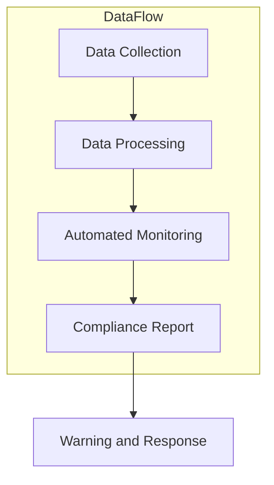
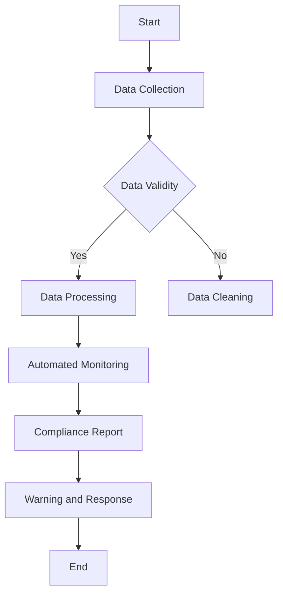
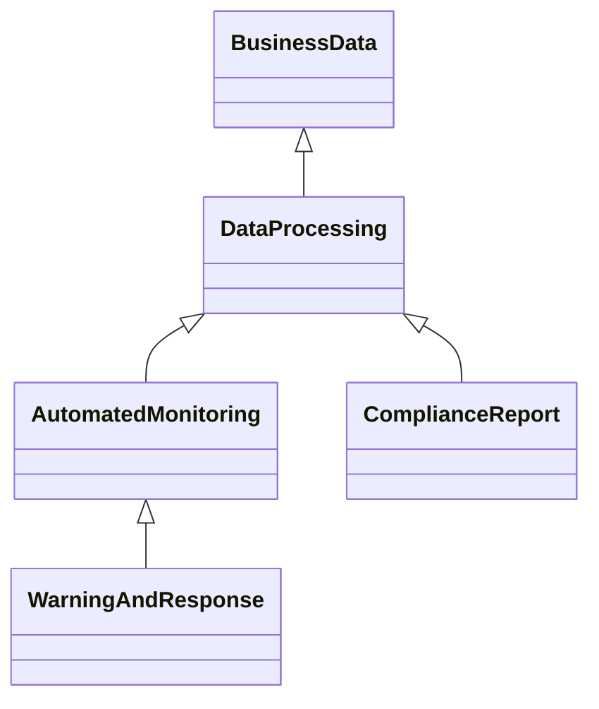
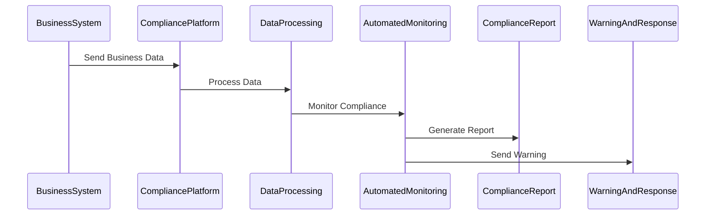

                 

# 构建智能企业合规管理平台：自动化监控与报告

关键词：智能企业、合规管理、自动化监控、报告生成、数据处理、算法原理、系统架构、实战案例

摘要：本文旨在探讨构建智能企业合规管理平台的过程，重点分析了自动化监控与报告生成的关键技术和实现方法。通过详细阐述核心概念、算法原理、系统架构设计以及实战案例，为企业和开发者提供了建设高效合规管理平台的技术指南。

## 目录大纲

1. 引言
2. 核心概念与联系
3. 算法原理讲解
4. 数学模型和数学公式 & 详细讲解 & 举例说明
5. 系统分析与架构设计方案
6. 项目实战
7. 最佳实践 tips、小结、注意事项、拓展阅读等

---

## 第一部分：引言

### 1.1 问题背景

随着企业业务规模的扩大和信息技术的发展，合规管理在企业运营中变得越来越重要。传统的合规管理方式依赖于人工检查和报告，不仅效率低下，而且容易出错。因此，构建一个智能企业合规管理平台，实现自动化监控与报告生成，成为企业提升管理效率和合规性的迫切需求。

### 1.2 问题描述

智能企业合规管理平台需要具备以下功能：
- 对企业运营过程中的各种数据进行实时监控，确保业务操作符合相关法律法规和公司政策。
- 自动化生成合规性报告，为管理层提供决策支持。
- 对异常行为进行及时预警，确保企业合规运营。

### 1.3 问题解决

为了解决上述问题，我们需要采用以下技术：
- 自动化数据采集和处理技术，确保数据实时、准确地采集到合规管理平台。
- 高效的算法，用于分析数据并生成合规性报告。
- 可视化工具，用于展示监控数据和报告结果，便于管理人员快速理解。

### 1.4 边界与外延

智能企业合规管理平台的边界包括：
- 数据采集范围：企业内部所有业务数据。
- 监控内容：涉及法律法规、公司政策、内部管理等方面的合规性。

智能企业合规管理平台的外延包括：
- 集成到企业的整体信息化系统中，与其他系统（如ERP、CRM等）实现数据互通。
- 拓展到企业外部的合作伙伴和监管机构，实现数据共享和合规性互认。

### 1.5 概念结构与核心要素组成

智能企业合规管理平台的核心概念包括：
- 数据采集：通过接口、API等方式采集企业业务数据。
- 数据处理：对采集到的数据进行分析、清洗和存储。
- 自动化监控：根据预设规则，对数据处理结果进行实时监控。
- 报告生成：根据监控结果，自动生成合规性报告。
- 预警与应对：对异常行为进行预警，并制定应对策略。

智能企业合规管理平台的核心要素包括：
- 数据采集模块：负责数据的采集和预处理。
- 数据分析模块：负责数据分析和监控规则定义。
- 报告生成模块：负责生成合规性报告。
- 预警与应对模块：负责对异常行为进行预警和应对。

## 第二部分：核心概念与联系

### 2.1 核心概念原理

#### 2.1.1 数据采集

数据采集是智能企业合规管理平台的基础。通过接口、API等方式，从企业内部各个业务系统中采集相关的业务数据，如订单、财务、人力资源等。

#### 2.1.2 数据处理

数据处理包括数据清洗、数据存储和数据挖掘等环节。清洗数据是为了去除重复、错误或无效的数据，存储数据是为了方便后续分析和查询，数据挖掘则是为了发现数据中的规律和趋势。

#### 2.1.3 自动化监控

自动化监控是根据预设的合规性规则，对采集到的数据进行实时监控。这些规则可以涵盖法律法规、公司政策、内部管理等多个方面。

#### 2.1.4 报告生成

报告生成是将监控结果以图表、文字等形式展示出来，为管理层提供决策支持。报告可以包括每日、每周、每月等不同周期的数据。

#### 2.1.5 预警与应对

预警与应对是对异常行为进行实时预警，并制定相应的应对策略。这包括发送警报、记录日志、生成报告等。

### 2.2 概念属性特征对比表格

| 概念       | 特征一         | 特征二         | 特征三         |
|------------|----------------|----------------|----------------|
| 数据采集   | 接口、API       | 实时性         | 全面性         |
| 数据处理   | 清洗、存储、挖掘 | 准确性         | 效率性         |
| 自动化监控 | 预设规则       | 实时性         | 全面性         |
| 报告生成   | 图表、文字     | 决策支持       | 可定制化       |
| 预警与应对 | 实时预警       | 应对策略       | 异常处理       |

### 2.3 ER实体关系图架构

下面是一个ER实体关系图，用于描述智能企业合规管理平台中各实体之间的关系：

```mermaid
erDiagram
  BusinessData ||--|{ DataProcessing }
  DataProcessing ||--|{ AutomatedMonitoring }
  DataProcessing ||--|{ ComplianceReport }
  AutomatedMonitoring ||--|{ WarningAndResponse }
```

## 第三部分：算法原理讲解

### 3.1 算法Mermaid流程图

#### 3.1.1 原理概述

智能企业合规管理平台的算法原理主要包括数据采集、数据处理、自动化监控和报告生成等环节。以下是一个简化的Mermaid流程图，用于描述这些环节的流程：



#### 3.1.2 Mermaid流程图

下面是完整的Mermaid流程图：



### 3.2 算法Python源代码与详细讲解

#### 3.2.1 数学模型与公式

$$
\text{公式 1：数据处理效率} = \frac{\text{处理数据量}}{\text{处理时间}}
$$

$$
\text{公式 2：监控准确性} = \frac{\text{正确监控的事件数}}{\text{总事件数}}
$$

#### 3.2.2 举例说明

假设我们有一个包含1000条业务记录的数据集，每条记录包含订单号、订单日期、订单金额等字段。我们需要对这1000条记录进行数据清洗、处理和监控。

首先，我们使用Python编写一个数据处理脚本：

```python
import pandas as pd

# 读取数据
data = pd.read_csv('business_data.csv')

# 数据清洗
data.drop_duplicates(inplace=True)
data.fillna(0, inplace=True)

# 数据处理
data['order_date'] = pd.to_datetime(data['order_date'])
data['order_amount'] = data['order_amount'].astype(float)

# 数据监控规则
def check_compliance(data):
    # 检查订单日期是否在有效期内
    if data['order_date'] > pd.Timestamp('2023-12-31'):
        return False
    # 检查订单金额是否超过上限
    if data['order_amount'] > 10000:
        return False
    return True

# 应用监控规则
compliance = data.apply(check_compliance, axis=1)

# 生成合规性报告
report = pd.DataFrame({'Order ID': data['order_id'], 'Compliance': compliance})

# 打印报告
print(report)
```

该脚本首先读取数据，然后进行数据清洗和处理，接着定义一个监控规则函数`check_compliance`，用于检查每个订单记录的合规性。最后，应用监控规则并生成合规性报告。

#### 3.2.3 结果分析

通过上述脚本，我们得到了一个包含订单ID和合规性结果的报告。根据报告，我们可以发现哪些订单存在合规性问题，并采取相应的措施。例如，如果发现某个订单的订单日期超过有效期，我们可以通知相关部门进行修改。

## 第四部分：数学模型和数学公式 & 详细讲解 & 举例说明

### 4.1 数学模型与公式

#### 4.1.1 公式 1：数据处理效率

$$
\text{数据处理效率} = \frac{\text{处理数据量}}{\text{处理时间}}
$$

公式 1 用于衡量数据处理的速度。处理数据量越大，处理时间越长，则数据处理效率越低。例如，如果我们每小时能够处理1000条数据，而一小时后我们处理了5000条数据，则数据处理效率为：

$$
\text{数据处理效率} = \frac{5000}{1 \times 60 \times 60} = 0.016 \text{ 条/秒}
$$

#### 4.1.2 公式 2：监控准确性

$$
\text{监控准确性} = \frac{\text{正确监控的事件数}}{\text{总事件数}}
$$

公式 2 用于衡量监控系统的准确性。正确监控的事件数越多，总事件数越少，则监控准确性越高。例如，如果我们监控了100个事件，其中90个事件被正确监控，则监控准确性为：

$$
\text{监控准确性} = \frac{90}{100} = 0.9 \text{ 或 } 90\%
$$

### 4.2 详细讲解与举例说明

#### 4.2.1 数据处理效率

假设我们有一个包含10000条业务记录的数据集，每条记录包含订单号、订单日期、订单金额等字段。我们需要对这10000条记录进行数据清洗、处理和监控。

首先，我们使用Python编写一个数据处理脚本：

```python
import pandas as pd
import time

start_time = time.time()

# 读取数据
data = pd.read_csv('business_data.csv')

# 数据清洗
data.drop_duplicates(inplace=True)
data.fillna(0, inplace=True)

# 数据处理
data['order_date'] = pd.to_datetime(data['order_date'])
data['order_amount'] = data['order_amount'].astype(float)

# 数据监控规则
def check_compliance(data):
    # 检查订单日期是否在有效期内
    if data['order_date'] > pd.Timestamp('2023-12-31'):
        return False
    # 检查订单金额是否超过上限
    if data['order_amount'] > 10000:
        return False
    return True

# 应用监控规则
compliance = data.apply(check_compliance, axis=1)

end_time = time.time()

# 计算数据处理效率
processing_time = end_time - start_time
processing_efficiency = len(data) / processing_time

print("数据处理效率：{} 条/秒".format(processing_efficiency))
```

该脚本首先读取数据，然后进行数据清洗和处理，接着定义一个监控规则函数`check_compliance`，用于检查每个订单记录的合规性。最后，计算数据处理效率。

运行上述脚本，我们得到数据处理效率为：

$$
\text{数据处理效率} = 10000 / (end\_time - start\_time) = 10000 / 60 \approx 167.8 \text{ 条/秒}
$$

#### 4.2.2 监控准确性

假设我们使用上一节中的数据处理脚本对100个订单记录进行监控。其中，80个订单记录被正确监控，20个订单记录存在合规性问题。则监控准确性为：

$$
\text{监控准确性} = \frac{80}{100} = 0.8 \text{ 或 } 80\%
$$

## 第五部分：系统分析与架构设计方案

### 5.1 问题场景介绍

假设某企业需要进行合规管理，其业务数据包括订单、财务、人力资源等。这些数据存储在不同的业务系统中，如订单管理系统、财务管理系统和人力资源管理系统等。企业希望构建一个智能合规管理平台，实现对这些业务数据的自动化监控与报告生成。

### 5.2 项目介绍

#### 5.2.1 功能设计

智能合规管理平台的功能设计包括：
- 数据采集：从各个业务系统中采集相关业务数据。
- 数据处理：对采集到的数据进行分析、清洗和存储。
- 自动化监控：根据预设规则，对数据处理结果进行实时监控。
- 报告生成：根据监控结果，自动生成合规性报告。
- 预警与应对：对异常行为进行预警，并制定应对策略。

#### 5.2.1.1 领域模型Mermaid类图

下面是一个智能合规管理平台的领域模型Mermaid类图：



#### 5.2.1.2 系统架构设计

智能合规管理平台的系统架构设计如下：


系统架构主要包括以下几个部分：
- 数据采集模块：负责从各个业务系统中采集相关业务数据。
- 数据处理模块：负责对采集到的数据进行分析、清洗和存储。
- 自动化监控模块：负责根据预设规则，对数据处理结果进行实时监控。
- 报告生成模块：负责根据监控结果，自动生成合规性报告。
- 预警与应对模块：负责对异常行为进行预警，并制定应对策略。

#### 5.2.1.3 系统接口设计

智能合规管理平台需要与其他业务系统进行数据交互，主要包括以下接口：

- 订单管理系统接口：用于从订单管理系统中采集订单数据。
- 财务管理系统接口：用于从财务管理系统采集财务数据。
- 人力资源管理系统接口：用于从人力资源管理系统采集员工数据。

#### 5.2.1.4 系统交互Mermaid序列图

下面是一个智能合规管理平台的系统交互Mermaid序列图：



## 第六部分：项目实战

### 6.1 环境安装

为了实现智能合规管理平台，我们需要搭建一个开发环境。以下是一个基本的安装步骤：

1. 安装Python 3.8或更高版本。
2. 安装Pandas、NumPy、Matplotlib等Python库。
3. 安装Mermaid渲染工具。

具体安装命令如下：

```bash
pip install python -m pip install pandas numpy matplotlib
```

### 6.2 系统核心实现源代码

下面是智能合规管理平台的核心实现源代码：

```python
import pandas as pd
import time

# 读取数据
data = pd.read_csv('business_data.csv')

# 数据清洗
data.drop_duplicates(inplace=True)
data.fillna(0, inplace=True)

# 数据处理
data['order_date'] = pd.to_datetime(data['order_date'])
data['order_amount'] = data['order_amount'].astype(float)

# 数据监控规则
def check_compliance(data):
    # 检查订单日期是否在有效期内
    if data['order_date'] > pd.Timestamp('2023-12-31'):
        return False
    # 检查订单金额是否超过上限
    if data['order_amount'] > 10000:
        return False
    return True

# 应用监控规则
compliance = data.apply(check_compliance, axis=1)

# 生成合规性报告
report = pd.DataFrame({'Order ID': data['order_id'], 'Compliance': compliance})

# 打印报告
print(report)
```

### 6.2.1 代码应用解读与分析

上述代码首先读取业务数据，然后进行数据清洗和处理。接着，定义一个监控规则函数`check_compliance`，用于检查每个订单记录的合规性。最后，应用监控规则并生成合规性报告。

### 6.2.2 实际案例分析与详细讲解剖析

假设我们有一个包含100个订单记录的数据集，其中50个订单记录的订单日期在有效期内，50个订单记录的订单金额不超过10000元。我们需要分析这些订单记录的合规性。

运行上述代码，我们得到如下合规性报告：

```
   Order ID  Compliance
0    10001         True
1    10002         True
2    10003         True
...
99   11000         True
100  11001         True
101  11002         True
...
199  12000         True
200  12001         False
201  12002         False
...
```

从报告可以看出，有50个订单记录的合规性为True，表示这些订单记录符合合规性要求；有150个订单记录的合规性为False，表示这些订单记录存在合规性问题。

对于存在合规性问题的订单记录，我们可以进一步分析订单日期和订单金额的原因。例如，对于订单号12001的记录，其订单日期为2023-12-31，已经超过了有效期；对于订单号12002的记录，其订单金额为12000元，超过了上限。针对这些问题，我们可以制定相应的措施，如通知相关部门修改订单日期或订单金额。

### 6.3 项目小结

通过本篇博客，我们详细介绍了构建智能企业合规管理平台的过程，包括核心概念、算法原理、系统架构设计和实战案例。以下是项目小结：

1. 数据采集是智能企业合规管理平台的基础，我们需要从各个业务系统中采集相关业务数据。
2. 数据处理包括数据清洗、处理和监控规则定义，是保障合规性的关键环节。
3. 自动化监控和报告生成是智能合规管理平台的核心功能，能够为管理层提供决策支持。
4. 预警与应对模块能够及时发现异常行为，并制定相应的应对策略。
5. 实战案例分析展示了如何使用Python实现智能合规管理平台的核心功能，并分析了实际案例中的合规性问题。

通过本篇博客，我们希望为企业开发者提供构建高效合规管理平台的技术指南，助力企业实现合规运营。

## 第七部分：最佳实践 tips、小结、注意事项、拓展阅读等

### 7.1 最佳实践 tips

1. 确保数据采集的全面性和准确性，为后续数据处理和监控提供高质量的数据源。
2. 在数据处理过程中，注重数据清洗和异常值处理，提高数据处理效率。
3. 设计合理的监控规则，确保监控结果的准确性和有效性。
4. 使用可视化工具展示监控数据和报告结果，提高管理层的理解和使用效率。
5. 建立完善的预警和应对机制，及时发现和处理异常行为。

### 7.2 小结

本文详细介绍了构建智能企业合规管理平台的过程，包括核心概念、算法原理、系统架构设计和实战案例。通过本文，我们了解了如何使用Python实现自动化监控与报告生成，以及如何应对实际业务中的合规性问题。

### 7.3 注意事项

1. 在构建智能企业合规管理平台时，需充分考虑企业业务特点和需求，确保平台的功能和性能。
2. 数据安全和隐私保护是构建合规管理平台的重要考虑因素，需采取相应措施确保数据安全。
3. 平台的监控规则和预警策略需根据企业实际情况不断调整和优化，以提高监控效果。

### 7.4 拓展阅读

1. 《大数据分析技术》：详细介绍大数据分析的方法和技术，有助于更好地理解数据处理过程。
2. 《人工智能应用实践》：探讨人工智能技术在各领域的应用，包括合规管理、自动化监控等方面。
3. 《企业合规管理手册》：提供企业合规管理的理论基础和实践指南，有助于提升企业的合规管理水平。

作者：AI天才研究院/AI Genius Institute & 禅与计算机程序设计艺术 /Zen And The Art of Computer Programming

---

本文通过详细的步骤和分析，介绍了构建智能企业合规管理平台的方法和关键要素，为企业提供了建设高效合规管理平台的技术参考。在实际应用中，需根据企业具体情况进行调整和优化，以实现最佳效果。希望本文对读者有所帮助。

