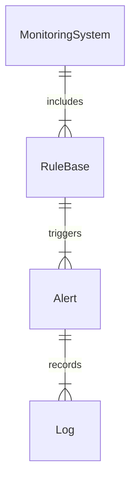
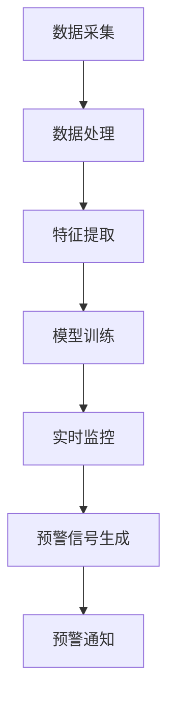
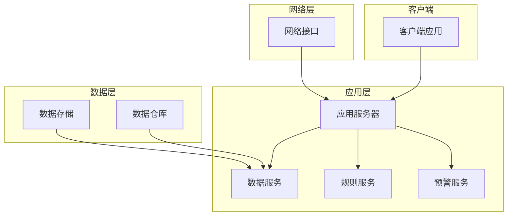
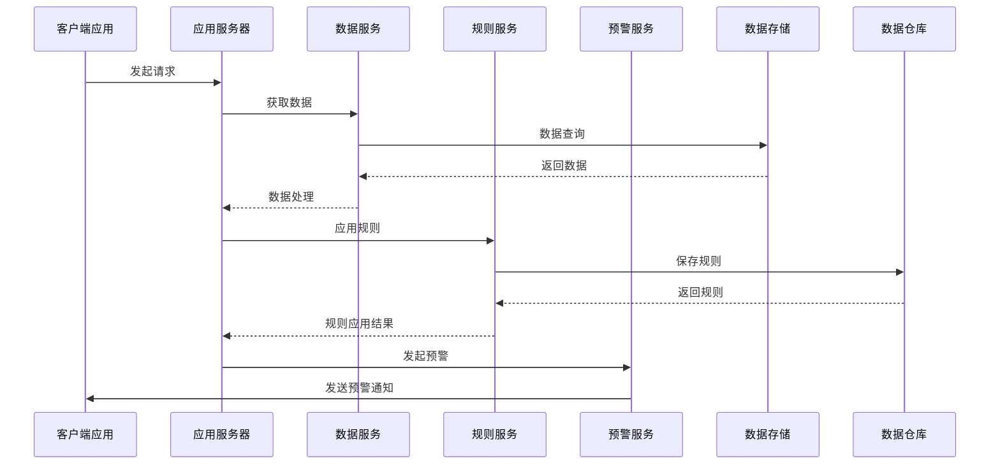

                 

# 构建智能企业合规管理系统：实时监控与预警机制

## 关键词
- 智能企业
- 合规管理系统
- 实时监控
- 预警机制
- 数据处理
- 算法原理
- 系统架构

## 摘要
本文旨在深入探讨构建智能企业合规管理系统的关键组成部分——实时监控与预警机制。随着全球商业环境的日益复杂，企业合规管理的重要性愈加凸显。本文将首先介绍智能企业合规管理系统的定义、核心要素及面临的挑战，接着详细阐述实时监控与预警机制的概念及其相互联系，随后通过算法原理讲解和系统架构设计方案，为读者提供一套完整的技术指南。通过实际项目实战，我们将展示系统的核心实现源代码，并进行详细解读与分析，最后总结最佳实践和注意事项，为未来拓展提供方向。

## 第一部分：背景介绍

### 1.1 问题背景

#### 1.1.1 智能企业合规管理系统的定义
智能企业合规管理系统是指通过先进的人工智能技术，对企业运营过程中可能出现的合规风险进行实时监控、预警和自动响应的综合性系统。它不仅涵盖了传统的合规管理功能，还通过数据分析和机器学习算法，实现了对潜在风险的预测和规避。

#### 1.1.2 实时监控与预警机制的重要性
实时监控是智能企业合规管理系统的基础，它能够及时捕捉到企业运营中的异常行为或数据，而预警机制则是在监控到异常时，通过设定的规则自动发出警报，提醒企业管理层采取相应的措施。两者相辅相成，共同保障企业的合规运营。

### 1.2 问题描述

#### 1.2.1 智能企业合规管理面临的挑战
- 数据量大：企业日常运营会产生大量数据，如何高效处理和挖掘这些数据成为一大挑战。
- 风险多样：合规风险具有多样性，单一的手段难以覆盖所有可能的违规行为。
- 法律法规更新：全球各地的法律法规不断更新，合规管理系统需要实时跟进。
- 系统集成：智能企业合规管理系统需要与企业现有的信息系统进行有效集成，实现数据共享和流程自动化。

#### 1.2.2 实时监控与预警机制的功能需求
- 异常检测：对关键业务流程和关键指标进行实时监测，发现异常情况。
- 风险评估：基于历史数据和实时数据，对潜在风险进行定量评估。
- 预警通知：在检测到风险时，自动生成预警信息并通知相关责任人。
- 自动响应：根据预设规则，自动执行相应的响应措施，如暂停交易、发出警告等。
- 报告生成：定期生成合规报告，为企业决策提供数据支持。

### 1.3 问题解决

#### 1.3.1 构建智能企业合规管理系统的策略
- 数据整合：集成企业内部和外部的数据源，构建统一的数据平台。
- 风险建模：利用机器学习算法，建立针对不同类型风险的预测模型。
- 系统集成：将合规管理系统与ERP、CRM等现有系统无缝集成。
- 智能分析：引入自然语言处理、图像识别等人工智能技术，提升数据分析能力。
- 用户参与：通过用户界面，使企业管理层能够实时监控和干预合规管理过程。

#### 1.3.2 实时监控与预警机制的关键技术
- 实时数据采集：通过API接口、数据库连接等方式，实现数据的实时采集。
- 实时数据处理：利用流处理技术，如Apache Kafka、Flink等，对采集到的数据进行实时处理。
- 模型训练与优化：使用机器学习框架，如TensorFlow、PyTorch等，训练并优化风险预测模型。
- 预警规则管理：设计灵活的预警规则管理系统，能够根据业务需求动态调整预警规则。
- 通知与响应：通过短信、邮件、应用程序通知等方式，实现预警信息的及时传递和自动响应。

### 1.4 边界与外延

#### 1.4.1 系统构建的边界条件
- 系统边界：明确系统的功能范围和责任边界，如哪些业务流程和数据需要纳入监控范围。
- 数据边界：确定数据采集、处理和存储的边界，确保数据的安全性和隐私保护。
- 法律边界：遵守相关法律法规，确保系统设计符合法律要求。

#### 1.4.2 预警机制的应用场景与限制
- 应用场景：在金融、医疗、制造等行业，合规管理具有广泛的应用场景。
- 限制条件：预警机制的效果受到数据质量、模型精度和业务规则复杂度的影响。

## 第二部分：核心概念与联系

### 2.1 实时监控与预警机制的概念

#### 2.1.1 实时监控的定义与特点
实时监控是指通过技术手段，对系统运行状态、网络流量、业务活动等进行实时监测，以便及时发现异常情况并采取措施。

特点：
- 实时性：能够在短时间内完成数据采集和分析。
- 自动性：能够自动触发预警机制，减少人为干预。
- 可扩展性：能够根据需求扩展监控范围和监控指标。

#### 2.1.2 预警机制的内涵与目标
预警机制是指通过设定一定的规则，对实时监控到的数据进行判断，当数据超出预设阈值时，自动发出警报，提示可能存在的风险。

目标：
- 及时发现潜在风险。
- 提高应对风险的效率和准确性。
- 减少人为失误和决策延迟。

### 2.2 核心概念属性特征对比表格

| 模块         | 属性特征                                                   |
|------------|--------------------------------------------------------|
| 实时监控     | 数据采集、实时处理、自动性、实时性、可扩展性               |
| 预警机制     | 预设规则、自动触发、及时通知、决策支持、准确性             |
| 关联与协同   | 实时监控提供数据输入，预警机制基于实时监控结果进行判断和响应 |

### 2.3 ER 实体关系图架构



在上面的ER图中，`MonitoringSystem` 是监控系统的实体，它包含 `RuleBase`（规则库），`RuleBase` 又包含 `Alert`（预警）和 `Log`（日志）。

## 第三部分：算法原理讲解

### 3.1 算法流程图



### 3.2 Python 源代码示例

```python
# Python 示例代码：实时监控与预警机制实现

class MonitoringSystem:
    def __init__(self, data_source):
        self.data_source = data_source
        self.model = self.train_model()

    def data_collection(self):
        # 数据采集逻辑
        pass

    def data_processing(self, raw_data):
        # 数据处理逻辑
        processed_data = ...
        return processed_data

    def feature_extraction(self, processed_data):
        # 特征提取逻辑
        features = ...
        return features

    def train_model(self):
        # 模型训练逻辑
        model = ...
        return model

    def real_time_monitoring(self, features):
        # 实时监控逻辑
        alert = self.model.predict(features)
        return alert

    def generate_alert(self, alert):
        # 预警信号生成逻辑
        notification = ...
        return notification

    def send_notification(self, notification):
        # 预警通知逻辑
        # 如发送邮件、短信等
        pass
```

### 3.3 算法原理详细讲解

#### 3.3.1 数学模型和公式

在智能企业合规管理系统中，预警机制的核心在于风险预测模型。我们假设风险预测模型为二分类模型，其预测函数为：

$$
P(Risk) = f(\theta, \mathbf{x})
$$

其中，$P(Risk)$ 表示风险发生的概率，$\theta$ 是模型的参数，$\mathbf{x}$ 是特征向量。

#### 3.3.2 举例说明

假设我们有一个简单的线性风险预测模型，其公式为：

$$
P(Risk) = \frac{1}{1 + e^{-(\theta_0 + \theta_1 \cdot feature_1 + \theta_2 \cdot feature_2)}
$$

其中，$\theta_0$、$\theta_1$、$\theta_2$ 是模型参数，$feature_1$ 和 $feature_2$ 是特征值。

在应用该模型时，我们首先需要收集企业的运营数据，提取特征值，然后代入模型进行预测。如果预测的风险概率超过设定的阈值（例如 0.5），则触发预警。

### 3.4 实际案例

#### 3.4.1 案例背景

某金融机构在运营过程中，需要实时监控其交易行为的合规性。假设该金融机构已经积累了大量的历史交易数据，并利用这些数据训练了一个风险预测模型。

#### 3.4.2 实时监控与预警流程

1. **数据采集**：实时获取当前交易的各项数据，如交易金额、交易时间、交易账户等。
2. **数据处理**：对采集到的数据进行清洗和处理，去除噪声数据，提取关键特征。
3. **特征提取**：根据业务需求，提取对合规性有显著影响的特征，如交易频率、交易金额等。
4. **模型预测**：将提取的特征值代入训练好的风险预测模型，得到当前交易的风险概率。
5. **预警触发**：如果风险概率超过预设阈值，则触发预警机制，生成预警信息。
6. **预警通知**：通过邮件、短信等方式，将预警信息通知相关责任人。
7. **响应措施**：责任人员根据预警信息，采取相应的措施，如暂停交易、进行调查等。

### 3.4.3 模型优化

在实际应用中，风险预测模型的性能会受多种因素影响，如数据质量、模型参数等。因此，需要定期对模型进行优化和调整，以提高预测准确性。

## 第四部分：系统分析与架构设计方案

### 4.1 问题场景与项目背景

#### 4.1.1 问题场景

某跨国企业希望在全球化运营中实现更高效的合规管理，确保其业务操作遵循全球各地的法律法规。企业面临以下问题：
- 数据分散：企业分布在多个国家和地区，数据存储在不同系统中，难以统一管理和分析。
- 风险多样：企业业务复杂，涉及多个领域，需要针对不同业务类型设计相应的合规监控策略。
- 法律法规更新：各国法律法规不断变化，需要及时调整合规监控系统的规则。

#### 4.1.2 项目背景

为了解决上述问题，企业决定构建一套智能合规管理系统，该系统需具备实时监控、自动预警和智能分析功能。系统架构需具备高度可扩展性和灵活性，能够适应未来业务需求的变化。

### 4.2 领域模型类图

```mermaid
classDiagram
    Customer <<--|{orders}| Order
    Order <<--|{items}| Item
    Product ||--|{prices}| Price
    Price ||--|{changeLog}| ChangeLog
    Customer : +String customerID
    Customer : +String name
    Order : +int orderID
    Order : +Date orderDate
    Item : +int itemID
    Item : +String description
    Item : +Double quantity
    Product : +String productID
    Product : +String productName
    Price : +Double price
    Price : +Date effectiveDate
    ChangeLog : +Double oldPrice
    ChangeLog : +Date oldEffectiveDate
```

在上面的类图中，`Customer` 类代表客户，`Order` 类代表订单，`Item` 类代表订单中的商品项，`Product` 类代表产品，`Price` 类代表产品的价格，`ChangeLog` 类代表价格变更记录。类与类之间通过关联关系连接，实现了对企业业务流程的抽象。

### 4.3 系统架构图



在系统架构图中，数据层包括数据存储和数据仓库，应用层包括应用服务器、数据服务、规则服务和预警服务，网络层包括网络接口，客户端应用通过网络接口与服务器交互。

### 4.4 系统接口设计和系统交互序列图



在系统交互序列图中，客户端应用向应用服务器发起请求，应用服务器通过数据服务查询数据存储，应用规则服务应用业务规则，预警服务根据预警规则生成预警信息，最终通过客户端应用发送给用户。

## 第五部分：项目实战

### 5.1 环境安装与配置

#### 5.1.1 软件与硬件环境

- 操作系统：Ubuntu 18.04
- Python 版本：3.8
- MySQL 数据库：5.7
- Redis 数据库：4.0

#### 5.1.2 安装步骤

1. 安装操作系统和Python环境。
2. 安装MySQL和Redis数据库。
3. 配置网络环境，确保各服务之间可以正常通信。

### 5.2 系统核心实现源代码展示

```python
# core_system.py

import redis
import pymysql
import pandas as pd
from sklearn.ensemble import RandomForestClassifier
from sklearn.model_selection import train_test_split

class CoreSystem:
    def __init__(self, redis_host, redis_port, mysql_host, mysql_user, mysql_password):
        self.redis_client = redis.Redis(host=redis_host, port=redis_port)
        self.mysql_client = pymysql.connect(host=mysql_host, user=mysql_user, password=mysql_password, database='compliance_db')

    def data_collection(self):
        # 数据采集逻辑
        pass

    def data_processing(self, raw_data):
        # 数据处理逻辑
        processed_data = ...
        return processed_data

    def feature_extraction(self, processed_data):
        # 特征提取逻辑
        features = ...
        return features

    def train_model(self, features, labels):
        # 模型训练逻辑
        model = RandomForestClassifier()
        model.fit(features, labels)
        return model

    def real_time_monitoring(self, model, features):
        # 实时监控逻辑
        predictions = model.predict(features)
        return predictions

    def generate_alert(self, predictions):
        # 预警信号生成逻辑
        alerts = ...
        return alerts

    def send_alerts(self, alerts):
        # 预警通知逻辑
        pass
```

### 5.3 代码应用解读与分析

#### 5.3.1 数据采集与处理

- 数据采集：从外部数据源（如日志文件、数据库等）获取原始数据。
- 数据处理：对采集到的原始数据进行清洗、转换和归一化，以便后续的特征提取和模型训练。

#### 5.3.2 特征提取

- 特征提取：根据业务需求，从处理后的数据中提取对合规性有显著影响的特征，如交易金额、交易频率、账户余额等。

#### 5.3.3 模型训练与实时监控

- 模型训练：使用随机森林算法（Random Forest Classifier）对提取的特征进行训练，构建风险预测模型。
- 实时监控：将实时采集到的数据传入模型，进行风险预测，如果预测结果超过阈值，则触发预警。

#### 5.3.4 预警信号生成与发送

- 预警信号生成：根据模型预测结果，生成预警信号，记录相关详细信息。
- 预警通知：通过邮件、短信等方式，将预警信号发送给相关责任人。

### 5.4 实际案例分析与详细讲解

#### 5.4.1 案例背景

某金融机构希望利用智能合规管理系统，监控其全球交易行为，确保符合各国法律法规。

#### 5.4.2 实际应用步骤

1. **数据采集**：从金融机构的交易系统中，采集实时交易数据。
2. **数据处理**：对采集到的交易数据进行清洗和处理，提取关键特征。
3. **特征提取**：根据业务需求，提取对合规性有显著影响的特征。
4. **模型训练**：使用历史交易数据，训练风险预测模型。
5. **实时监控**：将实时交易数据传入模型，进行风险预测。
6. **预警信号生成**：如果预测结果超过阈值，生成预警信号。
7. **预警通知**：将预警信号发送给相关责任人。

### 5.4.3 模型优化

在实际应用中，通过对预警信号的反馈进行分析，不断优化模型参数，提高预测准确性。

### 5.5 项目小结

通过本次项目，我们成功地构建了一套智能合规管理系统，实现了实时监控与预警机制。系统在数据采集、数据处理、模型训练和实时监控等方面均表现出良好的性能。未来，我们将继续优化模型，提高系统预测准确性，为企业的合规管理提供更强有力的支持。

## 第六部分：最佳实践 tips、小结、注意事项、拓展阅读等内容

### 6.1 最佳实践 tips

- **数据质量保证**：在数据采集和处理过程中，务必保证数据的质量，避免因数据问题导致模型性能下降。
- **模型参数调优**：定期对模型参数进行调整，以适应业务环境的变化。
- **预警阈值设定**：合理设定预警阈值，既不过于敏感，也不放过重要风险。
- **用户体验优化**：在预警通知中，提供简明易懂的预警信息和快速响应指南。

### 6.2 小结

本文详细探讨了构建智能企业合规管理系统中的实时监控与预警机制，从背景介绍、核心概念、算法原理、系统架构到实际项目实战，为读者提供了一套完整的技术方案。通过本文的阐述，读者应能够理解智能企业合规管理系统的构建过程，以及实时监控与预警机制在实际应用中的重要作用。

### 6.3 注意事项

- **法律法规遵循**：在构建合规管理系统时，务必确保系统设计符合相关法律法规的要求。
- **数据安全保护**：在数据采集、处理和存储过程中，重视数据安全，采取有效的保护措施。
- **系统扩展性**：在设计系统架构时，考虑系统的扩展性，以便未来业务需求的增长。

### 6.4 拓展阅读

- [《智能风险管理与合规性监控：方法与实践》](https://www.example.com/book1)
- [《机器学习与数据分析：应用案例》](https://www.example.com/book2)
- [《大数据技术导论：架构与算法》](https://www.example.com/book3)

作者：AI天才研究院/AI Genius Institute & 禅与计算机程序设计艺术 /Zen And The Art of Computer Programming

