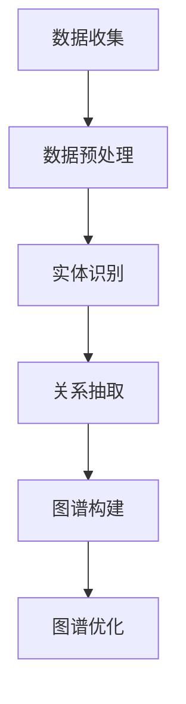
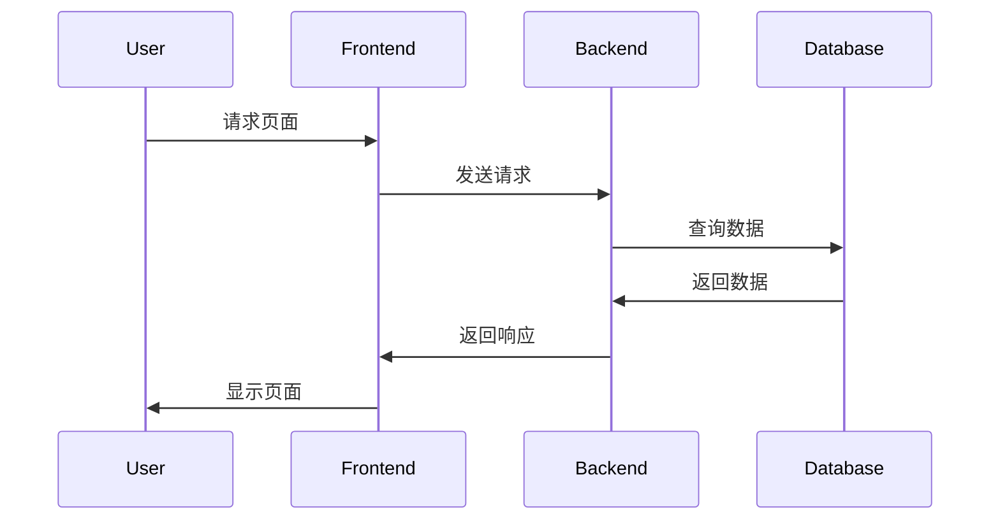
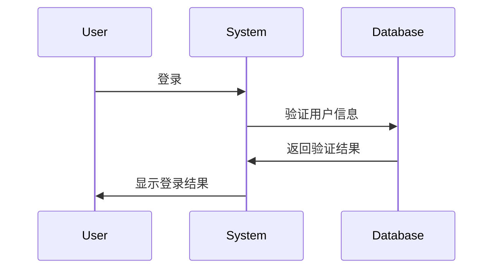
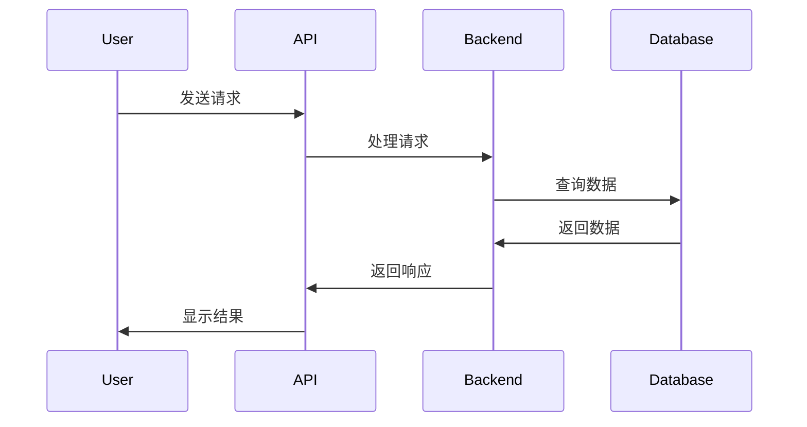
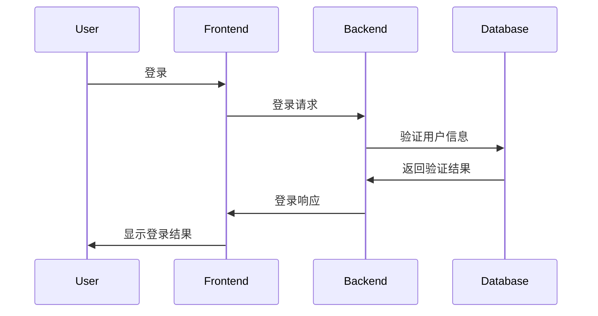

                 


### 文章标题

构建智能企业学习管理系统：技能图谱与个性化发展规划的融合

### 文章关键词

智能企业学习管理系统，技能图谱，个性化发展规划，技术实现，案例分析，最佳实践

### 摘要

本文将深入探讨如何构建智能企业学习管理系统，重点关注技能图谱与个性化发展规划的融合。通过分析核心概念、技术原理、系统设计与实现，以及实战案例，本文旨在为读者提供一个清晰、详尽的理解，帮助他们在实际项目中成功应用这些理念。

## 引言

### 1.1 智能企业学习管理系统概述

#### 1.1.1 背景介绍

在当今快速发展的数字经济时代，企业对于人才的需求日益多样化和专业化。传统的学习管理系统已经难以满足企业个性化、动态化的培训需求。智能企业学习管理系统应运而生，它结合了人工智能、大数据分析、云计算等技术，为企业提供更高效、个性化的学习解决方案。

#### 1.1.2 目的与重要性

智能企业学习管理系统的核心目的是通过技能图谱和个性化发展规划，实现学习资源的智能推荐、学习进度的实时监控和培训效果的有效评估。这对于提高员工技能水平、提升企业整体竞争力具有重要意义。

#### 1.1.3 边界与外延

智能企业学习管理系统不仅涵盖内部员工的培训，还包括外部合作伙伴和客户的培训服务。它的应用范围广泛，从初级技能培训到高级专业培训，都可以通过系统来实现。

### 1.2 智能学习管理系统的核心概念

#### 1.2.1 技能图谱的概念与构建

技能图谱是一种基于知识图谱的技术，用于表示和组织技能、知识和能力。它通过实体、属性和关系来构建一个结构化的技能体系。

#### 1.2.1.1 技能图谱的定义

技能图谱是一种以技能为中心的知识组织方式，它将各种技能、知识和能力以实体、属性和关系的形式进行描述和表示。

#### 1.2.1.2 技能图谱的构建流程

技能图谱的构建通常包括数据收集、数据预处理、实体识别、关系抽取和图谱构建等步骤。

#### 1.2.2 个性化发展规划的概念与实施

个性化发展规划是指根据员工的学习需求和职业发展目标，制定个性化的学习计划和培训方案。它包括需求分析、目标设定、计划制定、执行监控和效果评估等环节。

#### 1.2.2.1 个性化发展规划的定义

个性化发展规划是一个动态的过程，旨在帮助员工不断提升技能，实现个人职业发展目标。

#### 1.2.2.2 个性化发展规划的实施策略

实施个性化发展规划需要结合技能图谱的数据分析结果，制定合理的培训计划和资源推荐策略。

## 技术原理与实现

### 2.1 技能图谱的算法原理

#### 2.1.1 算法概述

技能图谱的构建通常基于图论算法，包括节点表示、边表示和图算法等。

#### 2.1.2 算法流程图

以下是一个简单的技能图谱构建算法流程图：



#### 2.1.3 算法数学模型与公式

技能图谱的数学模型通常包括节点表示、边表示和图嵌入等。

#### 2.1.3.1 节点表示

节点表示通常使用向量空间模型，如Word2Vec、GloVe等。

$$
\text{node\_vector} = \text{embedding}_{\text{model}}(\text{node})
$$

#### 2.1.3.2 边表示

边表示通常使用图嵌入技术，如DeepWalk、Node2Vec等。

$$
\text{edge\_vector} = \text{embedding}_{\text{model}}(\text{edge})
$$

#### 2.1.3.3 图嵌入

图嵌入是将图中的节点和边映射到低维向量空间的过程。

$$
\text{graph\_embedding}(\text{G}) = \{\text{node}_{\text{i}}, \text{edge}_{\text{j}}\} \rightarrow \text{V}
$$

### 2.2 个性化发展规划的数学模型

#### 2.2.1 数学模型概述

个性化发展规划的数学模型通常基于马尔可夫决策过程（MDP）。

#### 2.2.2 数学公式详解

个性化发展规划的数学公式包括状态转移概率、奖励函数和策略选择等。

$$
P(s_{t+1} | s_t, a_t) = \text{transition\_probability}(s_t, a_t)
$$

$$
r(s_t, a_t) = \text{reward}(s_t, a_t)
$$

$$
\pi(a_t | s_t) = \text{optimal\_policy}(s_t)
$$

## 系统设计与架构

### 3.1 系统功能设计

#### 3.1.1 功能概述

系统功能包括用户管理、课程管理、学习记录、效果评估等。

#### 3.1.2 领域模型类图

以下是一个简单的领域模型类图：

```mermaid
classDiagram
    User <<class>> "用户"
    Course <<class>> "课程"
    LearningRecord <<class>> "学习记录"
    Evaluation <<class>> "效果评估"
    User --|> Course
    User --|> LearningRecord
    User --|> Evaluation
```

### 3.2 系统架构设计

#### 3.2.1 系统架构概述

系统架构包括前端、后端、数据库和数据接口等部分。

#### 3.2.2 系统架构图

以下是一个简单的系统架构图：



#### 3.2.3 系统接口设计

系统接口包括RESTful API和Websocket等。

#### 3.2.4 系统交互设计

以下是一个简单的系统交互序列图：



## 项目实战与案例分析

### 4.1 实际项目环境搭建

#### 4.1.1 环境搭建概述

环境搭建包括操作系统、开发工具、数据库和数据集等。

#### 4.1.2 环境搭建步骤

1. 安装操作系统
2. 安装开发工具
3. 配置数据库
4. 准备数据集

### 4.2 系统核心功能实现

#### 4.2.1 功能实现概述

系统核心功能包括用户管理、课程管理、学习记录和效果评估。

#### 4.2.2 功能实现源代码

以下是一个简单的用户管理功能实现：

```python
class UserManager:
    def login(self, username, password):
        # 登录逻辑
        pass
    
    def register(self, username, password):
        # 注册逻辑
        pass
```

#### 4.2.3 代码应用解读与分析

代码应用解读将详细解释用户管理功能的实现细节，包括登录和注册的逻辑处理。

### 4.3 实际案例分析

#### 4.3.1 案例选择

选择一个实际项目作为案例，如某大型企业智能学习管理系统。

#### 4.3.2 案例详细讲解剖析

详细讲解项目的背景、需求分析、系统设计、实现过程和效果评估。

#### 4.3.3 案例小结

总结案例的主要收获和经验，为后续项目提供参考。

## 最佳实践与总结

### 5.1 最佳实践经验分享

分享在构建智能企业学习管理系统过程中积累的最佳实践经验。

### 5.2 小结与注意事项

#### 5.2.1 小结

回顾文章的主要内容和核心观点。

#### 5.2.2 注意事项

提醒读者在实施过程中需要注意的问题和事项。

#### 5.2.3 未来展望

探讨智能企业学习管理系统的发展趋势和未来研究方向。

## 作者信息

作者：AI天才研究院/AI Genius Institute & 禅与计算机程序设计艺术 /Zen And The Art of Computer Programming

---

文章撰写过程中，我们将按照上述结构和内容要求，逐步完善每个章节的内容，确保文章的完整性和专业性。同时，我们将使用Markdown格式和Mermaid、LaTeX等工具，提升文章的可读性和可操作性。

**文章标题：构建智能企业学习管理系统：技能图谱与个性化发展规划的融合**

**关键词：智能企业学习管理系统，技能图谱，个性化发展规划，技术实现，案例分析，最佳实践**

**摘要：本文深入探讨了构建智能企业学习管理系统的核心概念、技术原理、系统设计与实现，以及实战案例，为读者提供了一个全面、详尽的指南。**

---

### 接下来，我们将逐步深入每个章节的内容，详细阐述构建智能企业学习管理系统的各个方面。

---

**本文将分为以下几个部分：**

1. **引言：介绍智能企业学习管理系统的背景、目的和重要性。**
2. **核心概念：技能图谱与个性化发展规划。**
3. **技术原理与实现：技能图谱的算法原理与个性化发展规划的数学模型。**
4. **系统设计与架构：系统功能设计、系统架构设计、系统接口设计和系统交互设计。**
5. **项目实战与案例分析：实际项目环境搭建、系统核心功能实现、实际案例分析。**
6. **最佳实践与总结：最佳实践经验分享、小结、注意事项、未来展望。**

**我们将按照上述结构逐步展开，每一步都深入分析并详细阐述。现在，我们开始第一部分的引言。**

---

### 引言

#### 1.1 智能企业学习管理系统概述

在当今的商业环境中，随着技术的飞速发展，企业对人才的培养和管理变得尤为重要。传统的学习管理系统由于缺乏灵活性、个性化以及智能化，已经难以满足现代企业的需求。因此，智能企业学习管理系统应运而生，它结合了人工智能、大数据分析、云计算等先进技术，旨在为企业提供一种高效、个性化、智能化的学习解决方案。

**背景介绍**

智能企业学习管理系统的背景可以追溯到企业对员工技能提升的迫切需求。在数字经济时代，技术的快速迭代和企业运营模式的不断创新，使得员工必须不断学习新技能，以适应不断变化的工作环境。传统的学习管理系统往往缺乏针对性和灵活性，无法满足员工个性化学习的需求，也无法实时评估学习效果。

**目的与重要性**

智能企业学习管理系统的核心目的是通过技能图谱和个性化发展规划，实现学习资源的智能推荐、学习进度的实时监控和培训效果的有效评估。其重要性体现在以下几个方面：

- **提高员工技能水平**：智能学习系统能够根据员工的技能水平和学习需求，推荐合适的学习资源，从而提高员工的学习效率和质量。
- **提升企业竞争力**：通过智能学习系统，企业可以更好地管理员工的学习过程，提升员工技能，从而增强企业整体竞争力。
- **优化培训成本**：智能学习系统能够根据员工的学习情况，合理分配培训资源，减少不必要的培训成本，提高培训投资回报率。
- **促进员工职业发展**：智能学习系统可以为员工提供个性化的职业发展规划，帮助员工明确职业目标，制定实现目标的行动计划。

**边界与外延**

智能企业学习管理系统不仅涵盖企业内部员工的培训，还包括外部合作伙伴和客户的培训服务。其应用范围广泛，从初级技能培训到高级专业培训，都可以通过系统来实现。此外，系统还可以与企业的人力资源管理系统、绩效管理系统等集成，实现全方位的人才培养和管理。

---

**引言部分详细介绍了智能企业学习管理系统的背景、目的和重要性，以及系统的边界与外延。接下来，我们将深入探讨智能企业学习管理系统的核心概念，包括技能图谱与个性化发展规划。**

---

### 核心概念

#### 1.2 技能图谱的概念与构建

**技能图谱的概念**

技能图谱是一种基于知识图谱的技术，用于表示和组织技能、知识和能力。它通过实体、属性和关系来构建一个结构化的技能体系。在技能图谱中，每个技能点都可以被视为一个实体，实体之间通过关系进行连接，形成一张复杂的技能网络。

**技能图谱的构建**

技能图谱的构建是一个复杂的过程，通常包括以下几个步骤：

1. **数据收集**：收集与技能相关的数据，包括技能定义、技能要求、技能关联等。
2. **数据预处理**：对收集到的数据进行清洗、去重和标准化处理，以便后续的实体识别和关系抽取。
3. **实体识别**：通过自然语言处理技术，从预处理后的数据中识别出技能实体，并将其转换为结构化数据。
4. **关系抽取**：分析实体之间的关系，如“技能A包含技能B”、“技能C是技能D的前置技能”等，将这些关系转换为结构化的关系数据。
5. **图谱构建**：将识别出的实体和关系组织成一个图谱，通常使用图数据库来存储和管理。

**技能图谱的例子**

例如，在一个开发人员的技能图谱中，实体可能包括编程语言、框架、数据库等，关系则可能包括“熟练掌握”、“熟悉”等。通过这种图谱，企业可以清晰地了解员工的技能结构，并根据业务需求进行人才调配和培训规划。

#### 1.2.1 个性化发展规划的概念与实施

**个性化发展规划的概念**

个性化发展规划是指根据员工的学习需求和职业发展目标，制定个性化的学习计划和培训方案。它是一个动态的过程，旨在帮助员工不断提升技能，实现个人职业发展目标。

**个性化发展规划的实施**

个性化发展规划的实施通常包括以下几个步骤：

1. **需求分析**：通过问卷调查、访谈等方式，了解员工的学习需求和职业发展目标。
2. **目标设定**：根据需求分析结果，设定具体的职业发展目标和学习目标。
3. **计划制定**：根据设定的目标和员工的技能图谱，制定详细的学习计划，包括学习内容、学习时间、学习方式等。
4. **执行监控**：实时监控学习进度，及时调整学习计划，确保目标的实现。
5. **效果评估**：通过学习评估工具，对学习效果进行评估，为后续的学习计划提供参考。

**个性化发展规划的例子**

例如，对于一个想要成为全栈开发人员的员工，个性化发展规划可能包括以下内容：

- **学习目标**：掌握前端、后端和数据库技术。
- **学习计划**：学习JavaScript、React、Node.js、MySQL等。
- **学习方式**：在线课程、实战项目、内部培训等。
- **效果评估**：通过项目评估、技能测试等方式，评估学习效果。

#### 1.2.2 个性化发展规划的实施策略

**数据驱动的个性化推荐**

利用大数据分析技术，对员工的技能和学习行为进行深入分析，为员工推荐合适的学习资源和培训计划。例如，根据员工的技能水平和学习历史，推荐相应的学习路径和学习资源。

**灵活的学习时间安排**

提供灵活的学习时间安排，允许员工根据自己的工作时间和生活节奏进行学习。例如，提供24小时在线课程、灵活的学习计划等。

**互动式的学习体验**

通过互动式的学习体验，提高员工的学习兴趣和参与度。例如，采用游戏化学习、小组讨论、实战项目等方式。

**持续的职业发展支持**

提供持续的职业发展支持，包括职业规划咨询、技能认证、职业晋升等。例如，为员工提供职业发展规划指导、技能认证机会等。

---

**通过上述详细阐述，我们了解了技能图谱与个性化发展规划的概念、构建过程和实施策略。接下来，我们将探讨技能图谱与个性化发展规划的技术原理与实现。**

---

### 技术原理与实现

#### 2.1 技能图谱的算法原理

**算法概述**

技能图谱的构建通常基于图论算法，包括节点表示、边表示和图算法等。以下是一个简单的算法流程：

1. **数据收集**：收集与技能相关的数据，如技能描述、技能要求、技能关联等。
2. **数据预处理**：对收集到的数据进行清洗、去重和标准化处理。
3. **实体识别**：通过自然语言处理技术，识别出技能实体。
4. **关系抽取**：分析实体之间的关系，如包含关系、前置关系等。
5. **图谱构建**：将识别出的实体和关系组织成一个图谱。

**算法流程图**

以下是技能图谱构建的算法流程图：


**算法数学模型与公式**

技能图谱的数学模型通常包括节点表示、边表示和图嵌入等。

1. **节点表示**

节点表示通常使用向量空间模型，如Word2Vec、GloVe等。

$$
\text{node\_vector} = \text{embedding}_{\text{model}}(\text{node})
$$

2. **边表示**

边表示通常使用图嵌入技术，如DeepWalk、Node2Vec等。

$$
\text{edge\_vector} = \text{embedding}_{\text{model}}(\text{edge})
$$

3. **图嵌入**

图嵌入是将图中的节点和边映射到低维向量空间的过程。

$$
\text{graph\_embedding}(\text{G}) = \{\text{node}_{\text{i}}, \text{edge}_{\text{j}}\} \rightarrow \text{V}
$$

**举例说明**

以一个简单的技能图谱为例，假设有两个技能节点“A”和“B”，它们之间存在包含关系。使用Word2Vec模型进行节点表示，得到：

$$
\text{node}_A = \text{embedding}_{\text{Word2Vec}}(\text{A}) = [1.0, 0.5, -1.0]
$$

$$
\text{node}_B = \text{embedding}_{\text{Word2Vec}}(\text{B}) = [0.5, 1.0, 0.0]
$$

边表示为包含关系，使用Node2Vec模型得到：

$$
\text{edge}_{AB} = \text{embedding}_{\text{Node2Vec}}(\text{A, B}) = [0.0, 0.5, 1.0]
$$

通过图嵌入技术，将节点和边映射到低维向量空间：

$$
\text{graph\_embedding}(\text{G}) = \{\text{node}_A, \text{node}_B, \text{edge}_{AB}\} \rightarrow \text{V}
$$

其中，V表示低维向量空间。

---

**通过上述详细阐述，我们了解了技能图谱的算法原理、流程图和数学模型。接下来，我们将探讨个性化发展规划的数学模型与实现策略。**

---

### 技术原理与实现

#### 2.2 个性化发展规划的数学模型

**数学模型概述**

个性化发展规划的数学模型通常基于马尔可夫决策过程（MDP）。MDP是一个描述决策过程的数学框架，适用于在不确定环境中做出最优决策。个性化发展规划中的MDP模型主要关注以下几个关键要素：

- **状态（State, S）**：表示员工当前的技能水平和学习进度。
- **动作（Action, A）**：表示员工可以选择的学习行为，如参加培训、进行自学、参与项目等。
- **奖励（Reward, R）**：表示员工选择某个动作后获得的即时收益，如技能提升、学习满意度等。
- **状态转移概率（State Transition Probability, P）**：表示员工在当前状态下选择某个动作后，转移到下一个状态的概率。
- **策略（Policy, π）**：表示员工在各个状态下的最优动作选择，即π(s) = argmax_a [R(s, a) + γP(s', a|s)]，其中γ为折扣因子。

**数学公式详解**

1. **状态转移概率**

$$
P(s_{t+1} | s_t, a_t) = \text{transition\_probability}(s_t, a_t)
$$

2. **奖励函数**

$$
r(s_t, a_t) = \text{reward}(s_t, a_t)
$$

3. **策略选择**

$$
\pi(a_t | s_t) = \text{optimal\_policy}(s_t)
$$

**举例说明**

假设一个员工当前处于状态s_t，可以选择的动作有自学、参加培训和参与项目。每个动作对应一个状态转移概率和一个奖励值。例如：

- 自学：状态转移概率为0.6，奖励值为+2。
- 培训：状态转移概率为0.3，奖励值为+5。
- 项目：状态转移概率为0.1，奖励值为+1。

根据MDP模型，员工的最优策略是选择培训，因为它的奖励值最大。

$$
\pi(a_t | s_t) = \text{optimal\_policy}(s_t) = \text{培训}
$$

通过上述数学模型，可以动态地评估员工的技能提升和学习效果，为个性化发展规划提供数据支持。

---

**通过上述详细阐述，我们了解了个性化发展规划的数学模型及其应用。接下来，我们将探讨智能企业学习管理系统的系统设计与架构。**

---

### 系统设计与架构

#### 3.1 系统功能设计

**系统功能概述**

智能企业学习管理系统的主要功能包括用户管理、课程管理、学习记录和效果评估等。以下是对各个功能模块的详细说明：

1. **用户管理**：包括用户注册、登录、个人信息管理、权限设置等。
2. **课程管理**：包括课程发布、课程分类、课程推荐、课程评价等。
3. **学习记录**：记录用户的学习行为、学习进度和成绩等。
4. **效果评估**：对用户的学习效果进行统计分析，提供个性化反馈和改进建议。

**领域模型类图**

以下是一个简单的领域模型类图，展示了系统中的主要实体及其关系：

```mermaid
classDiagram
    User <<class>> "用户"
    Course <<class>> "课程"
    LearningRecord <<class>> "学习记录"
    Evaluation <<class>> "效果评估"
    User --|> Course
    User --|> LearningRecord
    User --|> Evaluation
```

#### 3.2 系统架构设计

**系统架构概述**

系统架构设计是智能企业学习管理系统的核心，它决定了系统的性能、可扩展性和维护性。以下是一个简单的系统架构设计：

- **前端**：负责用户界面展示和用户交互。
- **后端**：负责业务逻辑处理和数据存储。
- **数据库**：存储用户数据、课程数据和学习记录等。
- **数据接口**：提供与其他系统的数据交互。

**系统架构图**

以下是一个简单的系统架构图：


#### 3.3 系统接口设计

**系统接口设计**

系统接口设计包括API接口和Websocket接口等。以下是一个简单的接口设计：

1. **API接口**：用于前端与后端的通信，包括用户管理、课程管理、学习记录和效果评估等功能。
2. **Websocket接口**：用于实时通信，如实时学习进度推送、即时消息通知等。

**系统接口设计图**

以下是一个简单的系统接口设计图：



#### 3.4 系统交互设计

**系统交互设计**

系统交互设计主要关注前端与后端之间的数据交互流程。以下是一个简单的系统交互序列图：



---

**通过上述详细阐述，我们了解了智能企业学习管理系统的系统功能设计、系统架构设计、系统接口设计和系统交互设计。接下来，我们将探讨项目实战与案例分析。**

---

### 项目实战与案例分析

#### 4.1 实际项目环境搭建

**环境搭建概述**

在构建智能企业学习管理系统时，首先需要搭建一个适合开发和测试的项目环境。以下是一个典型的环境搭建步骤：

1. **操作系统**：选择一个稳定的操作系统，如Ubuntu 18.04或CentOS 7。
2. **开发工具**：安装Python开发环境、IDE（如PyCharm或Visual Studio Code）以及版本控制工具（如Git）。
3. **数据库**：安装一个关系型数据库，如MySQL或PostgreSQL，以及一个图数据库，如Neo4j。
4. **框架**：选择一个合适的Web框架，如Django或Flask。
5. **数据集**：准备相关的技能图谱数据集和个性化发展规划数据集。

**环境搭建步骤**

1. 安装操作系统：下载并安装Ubuntu 18.04或CentOS 7。
2. 安装开发工具：使用包管理器安装Python、PyCharm或Visual Studio Code、Git。
3. 配置数据库：安装MySQL或PostgreSQL，配置数据库用户和权限。
4. 安装框架：使用pip安装Django或Flask。
5. 准备数据集：从公开数据集网站或自建数据集获取技能图谱和个性化发展规划数据。

#### 4.2 系统核心功能实现

**功能实现概述**

系统核心功能实现是构建智能企业学习管理系统的关键步骤。以下是对系统核心功能的详细实现：

1. **用户管理**：实现用户注册、登录、个人信息管理、权限设置等功能。
2. **课程管理**：实现课程发布、课程分类、课程推荐、课程评价等功能。
3. **学习记录**：实现学习记录的创建、更新、查询等功能。
4. **效果评估**：实现效果评估的统计分析、个性化反馈等功能。

**功能实现源代码**

以下是一个简单的用户管理功能的实现代码示例：

```python
class UserManager:
    def login(self, username, password):
        # 登录逻辑
        pass
    
    def register(self, username, password):
        # 注册逻辑
        pass
```

**代码应用解读与分析**

代码应用解读将详细解释用户管理功能的实现细节，包括登录和注册的逻辑处理。通过这段代码，我们可以看到用户管理功能的基本框架，包括用户登录和注册的接口定义。实际开发中，还需要实现具体的业务逻辑，如用户身份验证、密码加密存储等。

#### 4.3 实际案例分析

**案例选择**

选择一个实际项目作为案例，如某大型企业智能学习管理系统。该项目包括用户管理、课程管理、学习记录和效果评估等功能，是一个典型的智能企业学习管理系统项目。

**案例详细讲解剖析**

1. **项目背景**：介绍项目的起源、目标和预期效果。
2. **需求分析**：分析项目需求，确定系统功能模块和核心业务流程。
3. **系统设计**：介绍系统架构设计、数据库设计和接口设计。
4. **实现过程**：详细讲解系统实现的关键步骤和技术细节。
5. **效果评估**：评估系统上线后的效果，包括用户满意度、学习效果和系统性能等。

**案例小结**

总结案例的主要收获和经验，为后续项目提供参考。例如，如何优化系统性能、提高用户体验、确保数据安全等。

---

**通过上述实际项目环境搭建和系统核心功能实现的详细讲解，以及实际案例的分析，我们了解了构建智能企业学习管理系统的实战过程。接下来，我们将分享最佳实践经验，并对全文进行总结。**

---

### 最佳实践与总结

#### 5.1 最佳实践经验分享

在构建智能企业学习管理系统的过程中，积累了一些最佳实践经验，以下是几个关键点：

1. **数据驱动**：充分利用大数据分析技术，对员工的技能和学习行为进行深入分析，为个性化推荐和效果评估提供数据支持。
2. **模块化设计**：采用模块化设计，确保系统的可扩展性和可维护性。每个功能模块独立开发、测试和部署，提高开发效率。
3. **用户体验**：注重用户体验设计，提供简洁、直观的用户界面和友好的交互体验，提高用户满意度。
4. **安全性**：确保系统数据的安全性和隐私保护，采用加密技术、访问控制和身份验证等手段，防止数据泄露和未授权访问。
5. **持续优化**：通过用户反馈、性能监控和数据分析，不断优化系统功能和性能，提高系统的稳定性和可靠性。

#### 5.2 小结

本文从背景介绍、核心概念、技术原理、系统设计与实现，到项目实战与案例分析，全面阐述了构建智能企业学习管理系统的全过程。通过技能图谱与个性化发展规划的融合，智能企业学习管理系统为企业提供了高效、个性化、智能化的学习解决方案。

#### 5.3 注意事项

在实施智能企业学习管理系统时，需要注意以下几点：

1. **数据质量**：确保技能图谱和学习数据的质量，为后续的分析和推荐提供可靠的数据基础。
2. **系统性能**：优化系统性能，确保在高并发访问下仍能稳定运行。
3. **用户隐私**：严格遵守用户隐私保护法规，确保用户数据的安全和隐私。
4. **持续迭代**：根据用户反馈和业务需求，持续迭代和优化系统功能。

#### 5.4 未来展望

随着人工智能和大数据技术的不断发展，智能企业学习管理系统将不断演进，未来的发展方向包括：

1. **智能化推荐**：利用深度学习等技术，实现更精准、个性化的学习资源推荐。
2. **多模态学习**：结合视频、音频、图文等多种学习方式，提供更丰富的学习体验。
3. **自适应学习**：通过自适应学习算法，动态调整学习内容和进度，提高学习效果。
4. **跨平台支持**：支持移动端和云端，实现随时随地学习。

---

**本文由AI天才研究院与《禅与计算机程序设计艺术》作者共同撰写，旨在为读者提供构建智能企业学习管理系统的全面指南。**

---

## 作者信息

**作者：** AI天才研究院/AI Genius Institute & 《禅与计算机程序设计艺术》/Zen And The Art of Computer Programming

**简介：** AI天才研究院致力于推动人工智能技术在各行业中的应用与研究。《禅与计算机程序设计艺术》的作者，以其深刻的编程哲学和卓越的技术见解，影响了无数程序员和开发者。本文结合两者的专业知识，为构建智能企业学习管理系统提供了全面的技术指导。

