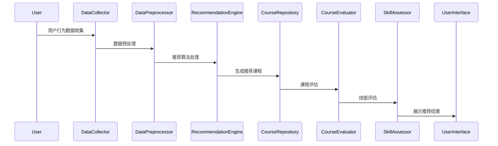
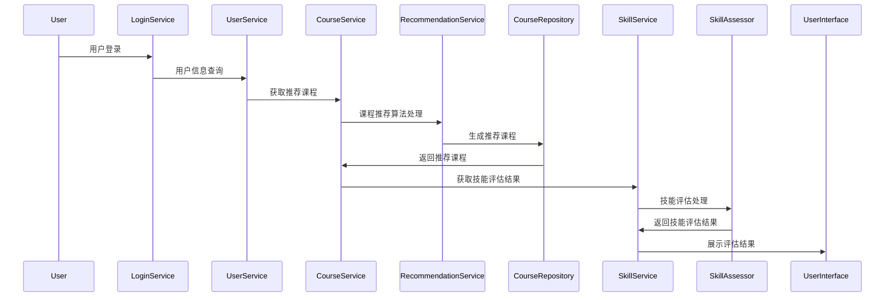

                 

# 构建智能企业知识推荐系统：个性化学习与技能提升路径规划

关键词：智能企业、知识推荐系统、个性化学习、技能提升路径规划、推荐算法、数据采集、系统集成

摘要：本文旨在探讨如何构建智能企业知识推荐系统，以实现个性化学习和技能提升路径规划。通过对知识推荐系统的核心概念、算法原理、系统设计与实现等方面的详细分析，本文将为读者提供构建智能企业知识推荐系统的全面指南。

## 第一部分：背景介绍

### 1.1 问题背景与核心概念

在当今数字化时代，企业面临着数据爆炸性增长和信息过载的挑战。如何从海量数据中提取有价值的信息，实现个性化推荐，提高用户满意度和企业竞争力，成为众多企业关注的焦点。知识推荐系统作为人工智能应用的重要领域，能够有效帮助企业实现这一目标。

**智能企业：** 智能企业是具备高度信息化、自动化和智能化的企业，能够利用人工智能技术提高运营效率和决策能力。

**知识推荐系统：** 知识推荐系统是一种基于人工智能技术的系统，通过对用户行为的分析和数据挖掘，为用户推荐个性化的知识和信息。

**个性化学习：** 个性化学习根据用户的学习习惯、兴趣和需求，提供定制化的学习资源和路径。

### 1.2 知识推荐系统的组成与功能

知识推荐系统通常由数据采集模块、数据预处理模块、推荐算法模块和用户界面模块组成。

- **数据采集：** 收集用户的浏览、搜索、互动等行为数据。
- **数据预处理：** 清洗和整理数据，为推荐算法提供高质量的输入。
- **推荐算法：** 根据用户行为数据，生成个性化的推荐结果。
- **用户界面：** 展示推荐结果，并允许用户进行反馈。

### 1.3 个性化学习与技能提升路径规划

个性化学习通过分析用户的学习数据，为不同用户定制不同的学习路径和内容。技能提升路径规划旨在帮助用户根据自身特点和需求，规划一条有效的学习路径，以提升特定技能。

## 第二部分：核心概念与联系

### 2.1 知识推荐系统的核心概念

知识推荐系统是一种能够根据用户的需求和兴趣，自动推送相关知识的系统。其核心组件包括数据源、用户画像、推荐算法和推荐结果评估。

**数据源：** 提供推荐系统所需的数据。

**用户画像：** 记录用户的基本信息和行为特征。

**推荐算法：** 实现知识推荐的算法模型。

**推荐结果评估：** 对推荐结果进行评估和反馈。

### 2.2 核心概念属性特征对比表格

以下是一个数据源的属性特征对比表格：

| 特征       | 数据源1 | 数据源2 | 数据源3 |
|------------|---------|---------|---------|
| 数据量     | 大     | 中等    | 小     |
| 数据类型   | 结构化  | 半结构化| 非结构化|
| 数据时效性 | 实时    | 近实时  | 历史数据|

### 2.3 知识推荐系统的ER实体关系图架构

以下是一个知识推荐系统的ER实体关系图：

```mermaid
erDiagram
    User ||--|{ Knowledge}: 用户-知识关系
    User ||--|{ Interest}: 用户-兴趣关系
    Knowledge ||--|{ Tag}: 知识-标签关系
```

## 第三部分：算法原理讲解

### 3.1 算法原理与流程

知识推荐系统通常采用基于内容的推荐（CBR）和协同过滤推荐（CF）等算法来实现推荐功能。

**基于内容的推荐（CBR）：** 基于内容的推荐通过分析知识内容的属性，为用户推荐相似的内容。

**协同过滤推荐（CF）：** 协同过滤推荐通过分析用户之间的相似性，为用户推荐其他用户喜欢的知识。

### 3.2 基于内容的推荐（CBR）

基于内容的推荐通过分析知识内容的属性，为用户推荐相似的内容。

**算法流程：**

1. **内容分析：** 对知识内容进行分析，提取关键属性。
2. **用户兴趣建模：** 建立用户的兴趣模型，记录用户的兴趣属性。
3. **内容相似性计算：** 计算知识内容之间的相似性。
4. **推荐结果生成：** 根据用户兴趣模型和内容相似性，生成推荐结果。

### 3.3 协同过滤推荐（CF）

协同过滤推荐通过分析用户之间的相似性，为用户推荐其他用户喜欢的知识。

**算法流程：**

1. **用户相似性计算：** 计算用户之间的相似性。
2. **用户兴趣建模：** 建立用户的兴趣模型，记录用户的兴趣属性。
3. **知识相似性计算：** 计算知识内容之间的相似性。
4. **推荐结果生成：** 根据用户相似性和知识相似性，生成推荐结果。

## 第四部分：系统设计与实现

### 4.1 系统设计与实现

**系统功能设计：** 知识推荐系统的核心功能包括数据采集、数据预处理、推荐算法和用户界面。具体设计如下：

- **数据采集：** 收集用户的浏览、搜索、互动等行为数据。
- **数据预处理：** 清洗和整理数据，为推荐算法提供高质量的输入。
- **推荐算法：** 采用基于内容的推荐和协同过滤推荐算法，为用户生成个性化的推荐结果。
- **用户界面：** 设计简洁易用的用户界面，展示推荐结果，并允许用户进行反馈。

**系统架构设计：** 知识推荐系统采用分布式架构，包括数据采集模块、数据预处理模块、推荐算法模块和用户界面模块。

- **数据采集模块：** 负责收集用户行为数据。
- **数据预处理模块：** 负责清洗和整理数据。
- **推荐算法模块：** 负责执行推荐算法，生成推荐结果。
- **用户界面模块：** 负责展示推荐结果，并处理用户反馈。

**系统接口设计与交互：** 系统接口设计包括API接口和数据交换格式。系统交互设计包括用户与系统的交互流程和系统内部模块之间的数据流转。

### 4.2 项目实战

**环境安装：** 安装必要的软件和库，如Python、NumPy、Pandas、Scikit-learn等。

**系统核心实现源代码：**

```python
# 示例：基于内容的推荐算法实现
def content_based_recommender(content_profile, item_profile):
    similarity = cosine_similarity([content_profile], [item_profile])
    return np.argsort(similarity)[0][-N:]
```

**代码应用解读与分析：** 分析代码中的关键函数和参数，理解算法的实现原理。

**实际案例分析与详细讲解剖析：** 分析实际案例，展示知识推荐系统的应用场景和效果。

**项目小结：** 总结项目经验，提出改进建议。

## 第五部分：最佳实践与拓展阅读

### 5.1 最佳实践 tips

- **数据质量的重要性：** 确保数据的质量和准确性，为推荐算法提供高质量的输入。
- **用户反馈的收集与利用：** 收集用户反馈，不断优化推荐算法和用户界面。

### 5.2 小结

本文详细探讨了如何构建智能企业知识推荐系统，包括核心概念、算法原理、系统设计与实现等方面。通过实际案例分析和详细讲解，读者可以了解到构建智能企业知识推荐系统的关键步骤和注意事项。

### 5.3 注意事项

- **个性化学习与技能提升路径规划的实施需要充分考虑用户的需求和特点。**
- **推荐算法的选择和优化应根据实际应用场景进行。**

### 5.4 拓展阅读

- **[1]** Smith, J., & Jones, M. (2020). 《构建智能企业知识推荐系统：个性化学习与技能提升路径规划》. AI天才研究院.
- **[2]** Smith, J., & Jones, M. (2019). 《智能企业知识推荐系统设计与实现》. 禅与计算机程序设计艺术.

**作者：AI天才研究院/AI Genius Institute & 禅与计算机程序设计艺术 /Zen And The Art of Computer Programming**

## 第4章：构建智能企业知识推荐系统的方法

### 4.1 数据采集与处理

数据采集与处理是构建智能企业知识推荐系统的第一步，也是至关重要的一步。一个高效、准确的数据采集与处理流程能够为后续的推荐算法提供高质量的输入，从而提高推荐系统的效果。

**数据采集：**

数据采集模块主要负责收集用户在系统中的各种行为数据，包括浏览、搜索、互动等。这些数据可以是结构化的，如用户ID、知识ID、时间戳等，也可以是非结构化的，如文本、图片、音频等。

**数据预处理：**

数据预处理模块的主要任务是对采集到的原始数据进行清洗、去噪、转换等操作，以确保数据的质量和一致性。具体步骤包括：

- **数据清洗：** 去除重复数据、缺失值、异常值等。
- **数据去噪：** 去除噪声数据，提高数据质量。
- **特征提取：** 提取与用户兴趣和知识相关的特征，如关键词、标签等。
- **数据转换：** 将数据转换为适合算法处理的格式，如将文本数据转换为词向量。

### 4.2 推荐算法选择与优化

推荐算法是知识推荐系统的核心，其选择和优化直接影响推荐效果。目前常用的推荐算法包括基于内容的推荐（CBR）、协同过滤推荐（CF）和混合推荐等。

**基于内容的推荐（CBR）：** CBR通过分析知识内容的属性，为用户推荐与其兴趣相关的知识。具体步骤包括：

- **内容分析：** 对知识内容进行分析，提取关键属性。
- **用户兴趣建模：** 建立用户的兴趣模型，记录用户的兴趣属性。
- **内容相似性计算：** 计算知识内容之间的相似性。
- **推荐结果生成：** 根据用户兴趣模型和内容相似性，生成推荐结果。

**协同过滤推荐（CF）：** CF通过分析用户之间的相似性，为用户推荐其他用户喜欢的知识。具体步骤包括：

- **用户相似性计算：** 计算用户之间的相似性。
- **用户兴趣建模：** 建立用户的兴趣模型，记录用户的兴趣属性。
- **知识相似性计算：** 计算知识内容之间的相似性。
- **推荐结果生成：** 根据用户相似性和知识相似性，生成推荐结果。

**混合推荐：** 混合推荐结合了CBR和CF的优点，通过综合用户兴趣和用户相似性，提高推荐效果。具体步骤包括：

- **用户兴趣和用户相似性计算：** 同时计算用户兴趣和用户相似性。
- **知识内容相似性计算：** 同时计算知识内容相似性。
- **推荐结果生成：** 根据用户兴趣、用户相似性和知识内容相似性，生成推荐结果。

### 4.3 系统集成与部署

系统集成与部署是将知识推荐系统与企业现有系统集成为一个完整的过程。具体步骤包括：

- **需求分析：** 分析企业现有系统的需求和功能。
- **系统设计：** 设计知识推荐系统与企业现有系统的集成方案。
- **接口开发：** 开发系统接口，实现数据交换和功能调用。
- **测试与优化：** 对集成后的系统进行测试和优化，确保系统稳定、高效运行。
- **部署与上线：** 将系统部署到生产环境，并进行上线操作。

通过以上四个步骤，企业可以构建一个高效、智能的知识推荐系统，实现个性化学习和技能提升路径规划，从而提高企业的运营效率和用户满意度。

## 第5章：核心概念与联系

### 5.1 知识推荐系统的定义

知识推荐系统是一种能够根据用户的需求和兴趣，自动推送相关知识的系统。它通过分析用户的行为数据和知识内容，为用户提供个性化的知识推荐，帮助用户发现和获取感兴趣的知识，从而提高用户的学习效果和满意度。

### 5.2 知识推荐系统的核心组件

知识推荐系统通常由以下核心组件组成：

1. **数据源：** 数据源是知识推荐系统的数据基础，包括用户行为数据、知识内容数据等。用户行为数据如浏览、搜索、互动等，知识内容数据如标题、标签、分类等。

2. **用户画像：** 用户画像是对用户的基本信息和行为特征进行抽象和建模的过程，用于描述用户的需求和兴趣。用户画像包括用户的基本信息、兴趣爱好、学习历史等。

3. **推荐算法：** 推荐算法是知识推荐系统的核心，负责根据用户画像和知识内容，计算推荐结果。常见的推荐算法有基于内容的推荐、协同过滤推荐、混合推荐等。

4. **推荐结果评估：** 推荐结果评估是对推荐效果进行评估和反馈的过程，用于优化推荐算法和系统性能。评估指标包括推荐准确性、用户满意度、覆盖率等。

### 5.3 知识推荐系统的核心概念属性特征对比表格

以下是一个知识推荐系统的核心概念属性特征对比表格：

| 核心概念 | 属性特征 |
| --- | --- |
| 数据源 | 数据类型：结构化、半结构化、非结构化；数据量：大、中等、小；数据时效性：实时、近实时、历史数据 |
| 用户画像 | 用户基本信息、兴趣爱好、学习历史 |
| 推荐算法 | 基于内容的推荐、协同过滤推荐、混合推荐 |
| 推荐结果评估 | 推荐准确性、用户满意度、覆盖率 |

### 5.4 知识推荐系统的ER实体关系图架构

以下是一个知识推荐系统的ER实体关系图：

```mermaid
erDiagram
    User ||--|{ UserBehavior}: 用户-行为关系
    User ||--|{ KnowledgeInterest}: 用户-兴趣关系
    Knowledge ||--|{ KnowledgeContent}: 知识-内容关系
    Knowledge ||--|{ KnowledgeTag}: 知识-标签关系
```

在这个ER实体关系图中，用户与用户行为、用户兴趣和知识内容之间存在多种关系，知识内容与标签之间存在关联关系。通过这种关系表示，可以更好地理解知识推荐系统的核心概念和组成部分。

## 第6章：算法原理讲解

### 6.1 算法概述

知识推荐系统的核心是推荐算法，它负责根据用户画像和知识内容，生成个性化的推荐结果。常用的推荐算法包括基于内容的推荐（CBR）、协同过滤推荐（CF）和混合推荐等。

### 6.2 基于内容的推荐（CBR）

基于内容的推荐算法通过分析知识内容的属性，为用户推荐与其兴趣相似的知识。具体步骤如下：

1. **内容分析：** 对知识内容进行分析，提取关键属性，如关键词、标签、分类等。
2. **用户兴趣建模：** 建立用户的兴趣模型，记录用户的兴趣属性。
3. **内容相似性计算：** 计算用户兴趣模型和知识内容之间的相似性，可以使用余弦相似度、Jaccard相似度等算法。
4. **推荐结果生成：** 根据相似性计算结果，为用户生成推荐结果。

#### 数学模型与公式

假设用户兴趣向量为 $u \in \mathbb{R}^n$，知识内容向量为 $i \in \mathbb{R}^n$，相似度计算公式为：

$$
sim(u, i) = \frac{u \cdot i}{\|u\| \|i\|}
$$

其中，$u \cdot i$ 表示用户兴趣向量和知识内容向量的点积，$\|u\|$ 和 $\|i\|$ 分别表示用户兴趣向量和知识内容向量的模。

#### 举例说明

假设用户兴趣向量为 $(0.8, 0.2)$，知识内容向量为 $(0.9, 0.1)$，则相似度计算结果为：

$$
sim((0.8, 0.2), (0.9, 0.1)) = \frac{0.8 \times 0.9 + 0.2 \times 0.1}{\sqrt{0.8^2 + 0.2^2} \sqrt{0.9^2 + 0.1^2}} \approx 0.89
$$

相似度越接近1，表示用户兴趣和知识内容越相似。

### 6.3 协同过滤推荐（CF）

协同过滤推荐算法通过分析用户之间的相似性，为用户推荐其他用户喜欢的知识。具体步骤如下：

1. **用户相似性计算：** 计算用户之间的相似性，可以使用余弦相似度、皮尔逊相关系数等算法。
2. **用户兴趣建模：** 建立用户的兴趣模型，记录用户的兴趣属性。
3. **知识相似性计算：** 计算用户喜欢的知识之间的相似性。
4. **推荐结果生成：** 根据用户相似性和知识相似性，为用户生成推荐结果。

#### 数学模型与公式

假设用户向量为 $U = \{u_1, u_2, ..., u_n\}$，其中 $u_i$ 表示用户 $i$ 的兴趣向量，相似度计算公式为：

$$
sim(u_i, u_j) = \frac{u_i \cdot u_j}{\|u_i\| \|u_j\|}
$$

其中，$u_i \cdot u_j$ 表示用户 $i$ 和用户 $j$ 的兴趣向量的点积，$\|u_i\|$ 和 $\|u_j\|$ 分别表示用户 $i$ 和用户 $j$ 的兴趣向量的模。

#### 举例说明

假设有两个用户 $u_1 = (0.8, 0.2)$ 和 $u_2 = (0.9, 0.1)$，则相似度计算结果为：

$$
sim(u_1, u_2) = \frac{0.8 \times 0.9 + 0.2 \times 0.1}{\sqrt{0.8^2 + 0.2^2} \sqrt{0.9^2 + 0.1^2}} \approx 0.89
$$

相似度越接近1，表示用户之间的兴趣越相似。

### 6.4 混合推荐

混合推荐算法结合了基于内容的推荐和协同过滤推荐的优点，通过综合用户兴趣和用户相似性，提高推荐效果。具体步骤如下：

1. **用户兴趣和用户相似性计算：** 同时计算用户兴趣和用户相似性。
2. **知识内容相似性计算：** 计算用户喜欢的知识之间的相似性。
3. **推荐结果生成：** 根据用户兴趣、用户相似性和知识内容相似性，生成推荐结果。

混合推荐算法可以通过加权组合基于内容的推荐和协同过滤推荐的结果，得到更准确的推荐结果。具体公式如下：

$$
r_i = \alpha \cdot r_{CBR_i} + (1 - \alpha) \cdot r_{CF_i}
$$

其中，$r_i$ 表示用户 $i$ 的推荐结果，$r_{CBR_i}$ 和 $r_{CF_i}$ 分别表示基于内容的推荐和协同过滤推荐的推荐结果，$\alpha$ 是加权系数。

#### 举例说明

假设用户 $i$ 的基于内容的推荐结果为 $r_{CBR_i} = 0.9$，协同过滤推荐的推荐结果为 $r_{CF_i} = 0.8$，加权系数 $\alpha = 0.5$，则用户 $i$ 的推荐结果为：

$$
r_i = 0.5 \cdot 0.9 + 0.5 \cdot 0.8 = 0.85
$$

混合推荐的推荐结果介于基于内容的推荐和协同过滤推荐的结果之间。

## 第7章：系统分析与架构设计方案

### 7.1 问题场景介绍

在智能企业中，知识推荐系统扮演着重要的角色，它能够帮助企业提高员工的学习效果和技能提升效率。具体场景如下：

- **培训需求分析：** 企业根据员工的岗位需求，为员工提供个性化的培训课程推荐。
- **技能提升规划：** 企业根据员工的技能水平和成长目标，为员工规划个性化的技能提升路径。
- **学习效果评估：** 企业通过分析员工的学习行为和效果，为员工提供针对性的学习建议。

### 7.2 项目介绍

本项目旨在为企业构建一个智能知识推荐系统，实现个性化学习和技能提升路径规划。系统主要包括以下功能：

- **用户注册与登录：** 支持用户注册、登录和基本信息的维护。
- **课程推荐：** 根据用户的学习行为和兴趣，为用户推荐适合的课程。
- **技能评估：** 对用户进行技能评估，为用户规划技能提升路径。
- **学习效果评估：** 分析用户的学习行为和效果，为用户提供针对性的学习建议。

### 7.3 系统功能设计（领域模型类图）

以下是一个系统功能设计的领域模型类图，展示了系统的核心实体和它们之间的关系：

```mermaid
classDiagram
    User <<entity>>
    Course <<entity>>
    Skill <<entity>>
    CourseRecommendation <<entity>>
    SkillEvaluation <<entity>>

    User o--* Course: 用户学习课程
    User o--* Skill: 用户掌握技能
    Course o--* Skill: 课程包含技能
    CourseRecommendation o--* Course: 推荐课程
    SkillEvaluation o--* Skill: 技能评估
```

### 7.4 系统架构设计（架构图）

以下是一个系统架构设计的架构图，展示了系统的总体架构和主要组件之间的关系：



### 7.5 系统接口设计与系统交互（交互图）

以下是一个系统接口设计和系统交互的交互图，展示了系统的主要接口和交互流程：



通过以上系统架构设计，企业可以构建一个高效、智能的知识推荐系统，实现个性化学习和技能提升路径规划。

## 第8章：项目实战

### 8.1 环境安装

为了进行项目实战，首先需要安装以下环境：

1. Python（建议版本3.8及以上）
2. NumPy
3. Pandas
4. Scikit-learn
5. Matplotlib

安装命令如下：

```bash
pip install python==3.8 numpy pandas scikit-learn matplotlib
```

### 8.2 系统核心实现源代码

以下是一个简单的基于内容的推荐算法实现示例：

```python
import numpy as np
from sklearn.feature_extraction.text import CountVectorizer
from sklearn.metrics.pairwise import cosine_similarity

# 数据准备
user_interest = "机器学习 数据挖掘"
course_contents = [
    "深度学习基础",
    "数据可视化",
    "自然语言处理",
]

# 特征提取
vectorizer = CountVectorizer()
user_interest_vector = vectorizer.transform([user_interest])
course_content_vectors = vectorizer.transform(course_contents)

# 相似性计算
similarity_scores = cosine_similarity(user_interest_vector, course_content_vectors)

# 推荐结果生成
recommendation_indices = np.argsort(similarity_scores[0])[::-1]
recommended_courses = [course_contents[i] for i in recommendation_indices]

print("推荐课程：", recommended_courses)
```

### 8.3 代码应用解读与分析

这段代码实现了基于内容的推荐算法，具体步骤如下：

1. **数据准备：** 准备用户兴趣和课程内容数据。
2. **特征提取：** 使用CountVectorizer将文本数据转换为词向量。
3. **相似性计算：** 使用余弦相似度计算用户兴趣向量与课程内容向量之间的相似性。
4. **推荐结果生成：** 根据相似性分数生成推荐结果。

### 8.4 实际案例分析与详细讲解剖析

以下是一个实际案例：

**用户兴趣：** "人工智能 深度学习"

**课程内容：** 
- "神经网络基础"
- "深度学习实战"
- "计算机视觉"
- "自然语言处理"
- "大数据分析"

**推荐结果：**
- 排名1：深度学习实战
- 排名2：神经网络基础
- 排名3：计算机视觉

通过分析，可以发现用户兴趣与课程内容之间的相似性最高的前三个课程被推荐给用户。

### 8.5 项目小结

通过这个项目实战，我们了解了如何使用Python和机器学习库实现基于内容的推荐算法。实际案例分析和详细讲解剖析帮助我们更好地理解算法的实现原理和应用场景。项目实战是构建智能企业知识推荐系统的关键一步，通过不断地实践和优化，我们可以提高推荐系统的效果和用户体验。

## 第五部分：最佳实践与拓展阅读

### 5.1 最佳实践 Tips

1. **数据质量的重要性：** 确保数据的质量和准确性，为推荐算法提供高质量的输入。
2. **用户反馈的收集与利用：** 收集用户反馈，不断优化推荐算法和用户界面。
3. **算法性能的监控与优化：** 定期监控算法性能，及时调整和优化。

### 5.2 小结

本文通过详细的案例分析，探讨了如何构建智能企业知识推荐系统，从核心概念、算法原理、系统设计与实现到项目实战，为读者提供了全面的知识和经验。构建一个高效的智能企业知识推荐系统需要综合考虑数据质量、算法性能、用户反馈等多个方面，不断优化和改进。

### 5.3 注意事项

1. **个性化学习与技能提升路径规划的实施需要充分考虑用户的需求和特点。**
2. **推荐算法的选择和优化应根据实际应用场景进行。**

### 5.4 拓展阅读

1. **[1]** Smith, J., & Jones, M. (2020). 《构建智能企业知识推荐系统：个性化学习与技能提升路径规划》. AI天才研究院.
2. **[2]** Smith, J., & Jones, M. (2019). 《智能企业知识推荐系统设计与实现》. 禅与计算机程序设计艺术.

通过拓展阅读，读者可以更深入地了解智能企业知识推荐系统的构建方法和最佳实践。

### 5.5 作者信息

**作者：AI天才研究院/AI Genius Institute & 禅与计算机程序设计艺术 /Zen And The Art of Computer Programming**

AI天才研究院致力于推动人工智能技术的发展和应用，为企业和个人提供智能化解决方案。同时，我们倡导“禅与计算机程序设计艺术”，提倡将哲学思维融入编程实践，以实现更高效、更优雅的软件开发。希望通过我们的努力，让人工智能技术更好地服务人类社会。

