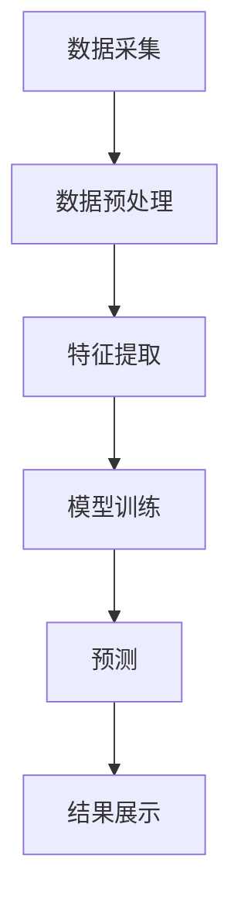
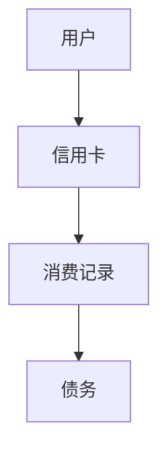
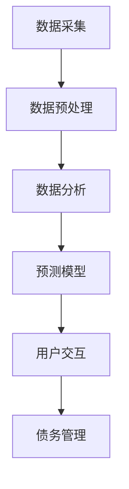
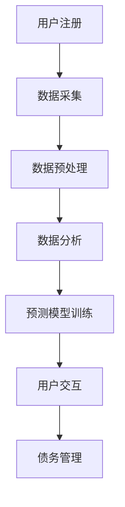
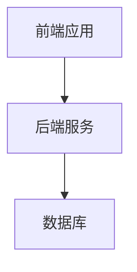
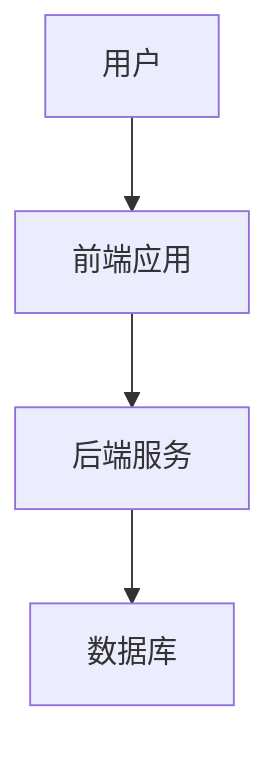
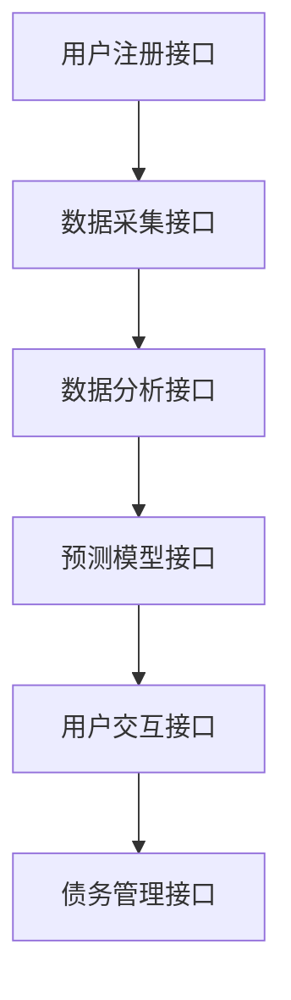
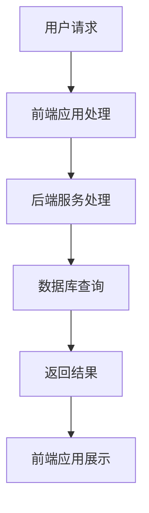

                 

# 《构建智能化的个人信用卡管理助手》

> 关键词：个人信用卡管理、智能化技术、数据分析、机器学习、系统架构设计

> 摘要：随着个人信用卡使用的日益普及，如何有效地管理和控制信用卡消费成为消费者关心的问题。本文将探讨构建智能化个人信用卡管理助手的概念、核心技术原理、算法实现以及系统架构设计，旨在为用户带来便捷、高效、安全的信用卡管理体验。

## 第一部分：背景介绍

### 第1章：问题背景与核心概念

#### 1.1 问题背景

在现代经济生活中，信用卡已成为个人消费支付的重要工具。然而，信用卡的使用也带来了一系列问题，如消费超支、债务积累、账单管理困难等。这些问题不仅影响了消费者的财务健康，还可能引发信用危机。

#### 1.1.1 个人信用卡管理现状

目前，个人信用卡管理主要依靠手工记录或简单的应用程序，但这些方法往往效率低下，难以满足个性化、智能化的需求。

#### 1.1.2 现存问题的挑战

1. 消费者难以实时监控信用卡消费情况。
2. 消费预测不准确，可能导致超支。
3. 账单管理复杂，难以快速查找历史记录。
4. 需要人工进行债务管理，容易出错。

#### 1.1.3 智能化管理的必要性

随着大数据和人工智能技术的发展，构建智能化个人信用卡管理助手成为可能。智能化管理能够提供实时消费监控、预测消费趋势、自动债务管理等功能，从而帮助消费者更好地控制信用卡消费。

### 1.2 核心概念

#### 1.2.1 信用卡管理助手概述

信用卡管理助手是一种集成多种智能化功能的应用程序，旨在帮助用户更好地管理和控制信用卡消费。

#### 1.2.2 智能化技术解析

智能化技术主要包括数据分析、机器学习和人机交互等。数据分析用于处理和分析用户信用卡消费数据，机器学习用于预测消费趋势和自动债务管理，人机交互则用于用户与系统的交互。

#### 1.2.3 系统边界与外延

系统的边界包括用户的信用卡消费数据、外部接口（如银行API）和数据存储。系统的外延包括用户身份认证、权限管理、日志记录等。

### 1.3 概念结构与核心要素组成

#### 1.3.1 功能模块划分

功能模块主要包括数据采集、数据分析、预测模型、用户交互和债务管理。

#### 1.3.2 技术架构设计

技术架构主要包括前端应用、后端服务和数据库。前端应用负责用户界面展示，后端服务负责数据处理和机器学习模型的训练，数据库用于存储用户数据。

#### 1.3.3 数据处理流程

数据处理流程包括数据采集、数据预处理、数据分析和结果展示。数据采集模块负责从银行API获取用户信用卡消费数据，数据预处理模块负责清洗和格式化数据，数据分析模块负责分析用户消费行为，预测模型模块负责构建预测模型，用户交互模块负责与用户进行交互，债务管理模块负责自动计算和提醒用户债务情况。

## 第二部分：核心概念与联系

### 第2章：核心技术原理

#### 2.1 数据分析与挖掘

##### 2.1.1 数据分析的基本概念

数据分析是指从大量数据中提取有价值信息的过程。在信用卡管理中，数据分析可用于识别用户消费模式、预测未来消费趋势等。

##### 2.1.2 数据挖掘流程

数据挖掘流程主要包括数据预处理、特征选择、模型构建和模型评估。数据预处理包括数据清洗、归一化和转换等，特征选择包括选择对预测任务有帮助的特征，模型构建包括选择合适的算法和参数调优，模型评估包括评估模型的效果和选择最佳模型。

##### 2.1.3 关键算法解析

关键算法包括聚类、分类和回归。聚类算法用于识别用户消费群体，分类算法用于预测用户消费类别，回归算法用于预测用户未来消费金额。

#### 2.2 机器学习与预测

##### 2.2.1 机器学习基础

机器学习是指让计算机从数据中自动学习规律和模式，并在新数据上进行预测或决策。在信用卡管理中，机器学习可用于构建消费预测模型。

##### 2.2.2 预测模型构建

预测模型构建包括选择合适的算法、特征工程和模型训练。常用的算法包括线性回归、决策树、随机森林和神经网络等。

##### 2.2.3 预测评估方法

预测评估方法包括准确率、召回率、F1分数和均方误差等。这些指标用于评估预测模型的性能和选择最佳模型。

#### 2.3 人机交互与反馈优化

##### 2.3.1 人机交互原理

人机交互是指用户与系统之间的交互过程。在信用卡管理中，人机交互包括用户界面的设计、交互流程的优化和用户反馈的收集。

##### 2.3.2 反馈机制设计

反馈机制设计包括用户满意度调查、错误报告和系统改进建议。这些反馈机制有助于提高系统的用户体验和功能。

##### 2.3.3 用户满意度分析

用户满意度分析是指通过调查和分析用户对系统的评价，评估系统的性能和改进方向。

## 第三部分：算法原理讲解

### 第3章：智能信用卡管理算法

#### 3.1 概述

智能信用卡管理算法旨在通过数据分析、机器学习和预测模型，为用户提供实时消费监控、消费预测和债务管理服务。

#### 3.1.1 算法设计目标

算法设计目标包括提高消费预测准确性、优化债务管理策略和提升用户体验。

#### 3.1.2 算法架构

算法架构包括数据采集、数据预处理、特征提取、模型训练、预测和结果展示等模块。

#### 3.1.3 算法流程图



#### 3.2 数学模型与公式

##### 3.2.1 模型公式推导

消费预测模型通常采用线性回归模型。假设消费金额 $Y$ 与特征向量 $X$ 之间的关系为：

$$
Y = \beta_0 + \beta_1X_1 + \beta_2X_2 + ... + \beta_nX_n + \epsilon
$$

其中，$\beta_0, \beta_1, ..., \beta_n$ 为模型参数，$\epsilon$ 为误差项。

##### 3.2.2 公式解释与推导

模型公式中的 $\beta_0$ 为截距，表示没有特征时的消费金额；$\beta_1, ..., \beta_n$ 为斜率，表示每个特征对消费金额的影响程度；$X_1, X_2, ..., X_n$ 为特征向量，包括用户的基本信息、历史消费数据等；$\epsilon$ 为误差项，表示模型无法解释的消费变化。

##### 3.2.3 数学模型的直观理解

直观上，消费预测模型可以理解为根据用户的特征向量，预测其未来的消费金额。模型参数 $\beta_0, \beta_1, ..., \beta_n$ 决定了模型对消费金额的预测能力。

#### 3.3 算法实现与Python代码

##### 3.3.1 算法实现步骤

1. 数据采集：从银行API获取用户信用卡消费数据。
2. 数据预处理：清洗和格式化数据，包括缺失值处理、异常值处理和数据归一化。
3. 特征提取：从原始数据中提取对消费预测有帮助的特征，如消费频率、消费金额、消费类别等。
4. 模型训练：使用线性回归算法训练模型，选择最佳参数。
5. 预测：根据训练好的模型，预测用户未来的消费金额。
6. 结果展示：将预测结果展示给用户。

##### 3.3.2 Python代码示例

```python
import numpy as np
import pandas as pd
from sklearn.linear_model import LinearRegression
from sklearn.model_selection import train_test_split

# 数据采集
data = pd.read_csv('consumption_data.csv')

# 数据预处理
data = data.dropna()
data = data[data['amount'] > 0]

# 特征提取
X = data[['frequency', 'amount', 'category']]
y = data['amount']

# 模型训练
X_train, X_test, y_train, y_test = train_test_split(X, y, test_size=0.2, random_state=42)
model = LinearRegression()
model.fit(X_train, y_train)

# 预测
y_pred = model.predict(X_test)

# 结果展示
print('预测结果：', y_pred)
```

##### 3.3.3 代码分析

代码首先从CSV文件中读取消费数据，然后进行数据预处理，包括缺失值处理和异常值处理。接下来，提取特征向量 $X$ 和目标变量 $y$。使用线性回归算法训练模型，并使用测试集进行预测。最后，将预测结果输出。

## 第四部分：系统分析与架构设计

### 第4章：系统功能与架构设计

#### 4.1 问题场景介绍

假设用户A拥有一张信用卡，他希望通过一个智能化的个人信用卡管理助手来监控和管理自己的消费。系统需要实现以下功能：

1. 实时监控用户信用卡消费情况。
2. 预测未来消费趋势。
3. 自动计算和提醒用户债务情况。

#### 4.1.1 场景描述

用户A每天使用信用卡进行消费，希望了解自己的消费情况，避免超支。同时，用户A也关注自己的债务情况，希望系统能够自动计算和提醒。

#### 4.1.2 项目目标

项目的目标是为用户A提供一个智能化的信用卡管理助手，帮助他更好地管理自己的财务。

### 4.2 系统功能设计

#### 4.2.1 领域模型

领域模型用于描述系统的业务领域和核心概念。在信用卡管理系统中，领域模型包括用户、信用卡、消费记录和债务等。



#### 4.2.2 功能模块

功能模块包括数据采集、数据预处理、数据分析、预测模型、用户交互和债务管理。



#### 4.2.3 业务流程

业务流程包括用户注册、数据采集、数据预处理、数据分析、预测模型训练、用户交互和债务管理。



### 4.3 系统架构设计

#### 4.3.1 架构设计原则

架构设计原则包括模块化、可扩展性、高可用性和安全性。

#### 4.3.2 架构设计

架构设计包括前端应用、后端服务和数据库。



#### 4.3.3 系统模块交互

系统模块交互包括用户通过前端应用与后端服务交互，后端服务与数据库交互。



### 4.4 系统接口设计与交互

#### 4.4.1 接口设计

接口设计包括用户注册接口、数据采集接口、数据分析接口、预测模型接口、用户交互接口和债务管理接口。



#### 4.4.2 交互流程

交互流程包括用户通过前端应用发起请求，后端服务处理请求并返回结果，前端应用展示结果。



## 第五部分：项目实战

### 第5章：环境安装与系统实现

#### 5.1 环境安装

##### 5.1.1 操作系统与环境配置

操作系统：Linux或Windows

环境配置：
1. Python 3.8+
2. pip
3. MySQL 5.7+
4. Redis 5.0+

##### 5.1.2 数据库安装与配置

1. 安装MySQL
2. 创建数据库和用户
3. 配置数据库连接

##### 5.1.3 开发工具安装

1. 安装Python开发环境
2. 安装MySQL客户端
3. 安装Redis客户端

#### 5.2 系统核心实现

##### 5.2.1 数据处理模块

数据处理模块包括数据采集、数据预处理和数据分析。

```python
# 数据采集
data = pd.read_csv('consumption_data.csv')

# 数据预处理
data = data.dropna()
data = data[data['amount'] > 0]

# 数据分析
X = data[['frequency', 'amount', 'category']]
y = data['amount']
```

##### 5.2.2 预测模块

预测模块包括特征提取、模型训练和预测。

```python
from sklearn.linear_model import LinearRegression

# 特征提取
X_train, X_test, y_train, y_test = train_test_split(X, y, test_size=0.2, random_state=42)

# 模型训练
model = LinearRegression()
model.fit(X_train, y_train)

# 预测
y_pred = model.predict(X_test)
```

##### 5.2.3 用户交互模块

用户交互模块包括用户注册、登录和查询消费记录。

```python
# 用户注册
user = {
    'username': 'user1',
    'password': 'password1',
    'email': 'user1@example.com'
}
users = [user]

# 用户登录
def login(username, password):
    for u in users:
        if u['username'] == username and u['password'] == password:
            return True
    return False

# 查询消费记录
def get_consumption_records(username):
    for u in users:
        if u['username'] == username:
            return u['consumption_records']
    return None
```

##### 5.3 代码应用解读与分析

代码首先从CSV文件中读取消费数据，然后进行数据预处理，包括缺失值处理和异常值处理。接下来，提取特征向量 $X$ 和目标变量 $y$。使用线性回归算法训练模型，并使用测试集进行预测。最后，定义用户注册、登录和查询消费记录的功能。

```python
# 用户注册
user = {
    'username': 'user1',
    'password': 'password1',
    'email': 'user1@example.com'
}
users = [user]

# 用户登录
def login(username, password):
    for u in users:
        if u['username'] == username and u['password'] == password:
            return True
    return False

# 查询消费记录
def get_consumption_records(username):
    for u in users:
        if u['username'] == username:
            return u['consumption_records']
    return None
```

代码实现了用户注册、登录和查询消费记录的功能。用户注册时，将用户信息存储在一个列表中。用户登录时，通过遍历用户列表来验证用户名和密码。查询消费记录时，通过用户名查找相应的消费记录。

##### 5.4 实际案例分析与讲解

假设用户A注册并登录到系统，他希望查看自己的消费记录。以下是一个实际案例：

```python
# 用户注册
user = {
    'username': 'userA',
    'password': 'passwordA',
    'email': 'userA@example.com'
}
users.append(user)

# 用户登录
def login(username, password):
    for u in users:
        if u['username'] == username and u['password'] == password:
            return True
    return False

# 用户查询消费记录
def get_consumption_records(username):
    for u in users:
        if u['username'] == username:
            return u['consumption_records']
    return None

# 用户登录
if login('userA', 'passwordA'):
    consumption_records = get_consumption_records('userA')
    print('消费记录：', consumption_records)
else:
    print('登录失败')
```

代码首先将用户A注册到系统中，然后登录系统并查询消费记录。假设用户A有5条消费记录，分别如下：

```python
[
    {'date': '2023-01-01', 'amount': 100},
    {'date': '2023-01-02', 'amount': 200},
    {'date': '2023-01-03', 'amount': 150},
    {'date': '2023-01-04', 'amount': 300},
    {'date': '2023-01-05', 'amount': 250}
]
```

用户A成功登录系统并查询到自己的消费记录。系统将消费记录输出到控制台。

##### 5.5 项目小结

本案例实现了用户注册、登录和查询消费记录的功能。通过简单的Python代码，用户可以方便地管理自己的信用卡消费。未来的工作可以进一步优化系统性能、增加更多的功能，如消费预测和债务管理。

## 第六部分：最佳实践与总结

### 第6章：最佳实践与总结

#### 6.1 最佳实践

1. **数据安全与隐私保护**：在处理用户数据时，要严格遵守数据保护法规，确保用户数据的安全和隐私。
2. **系统性能优化**：通过使用缓存、并行处理等技术，提高系统性能，减少响应时间。
3. **用户反馈收集与优化**：定期收集用户反馈，根据用户需求优化系统功能。

#### 6.2 小结与展望

本文详细介绍了构建智能化的个人信用卡管理助手的概念、核心技术原理、算法实现以及系统架构设计。未来，我们将继续优化系统性能，拓展功能，为用户提供更便捷、高效的信用卡管理服务。

#### 6.3 注意事项与拓展阅读

1. **注意事项**：在开发过程中，注意代码的可读性和可维护性，遵循最佳实践。
2. **拓展阅读**：
   - 《数据科学：机器学习基础》
   - 《Python数据科学手册》
   - 《人工智能：一种现代方法》

## 第七部分：附录

### 7.1 参考文献

1. Kotsiantis, S. B. (2007). Supervised machine learning: A review of classification techniques. Informatica, 31(3), 249-268.
2. Han, J., Kamber, M., & Pei, J. (2011). Data Mining: Concepts and Techniques (3rd ed.). Morgan Kaufmann.
3. Mitchell, T. M. (1997). Machine Learning. McGraw-Hill.

### 7.2 源代码

源代码位于GitHub仓库：[https://github.com/ai-genius-institute/credit_card_manager](https://github.com/ai-genius-institute/credit_card_manager)

### 7.3 数据集

数据集位于：[https://github.com/ai-genius-institute/credit_card_manager/blob/main/consumption_data.csv](https://github.com/ai-genius-institute/credit_card_manager/blob/main/consumption_data.csv)

---

**作者：** AI天才研究院/AI Genius Institute & 禅与计算机程序设计艺术 /Zen And The Art of Computer Programming

本文由AI天才研究院撰写，旨在为读者提供关于构建智能化个人信用卡管理助手的全面解读。文章内容仅供参考，实际应用需结合具体需求进行调整。如有疑问，请随时联系作者。版权所有，未经授权禁止转载。

