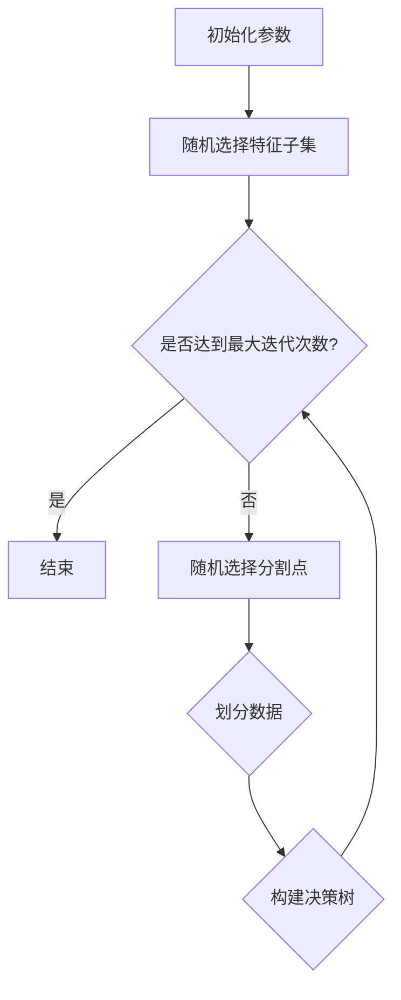
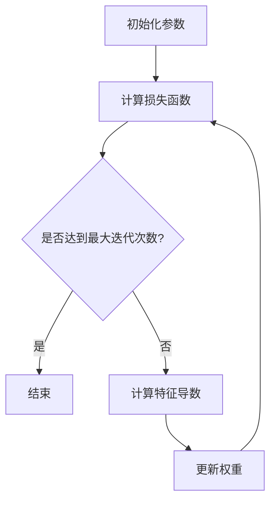
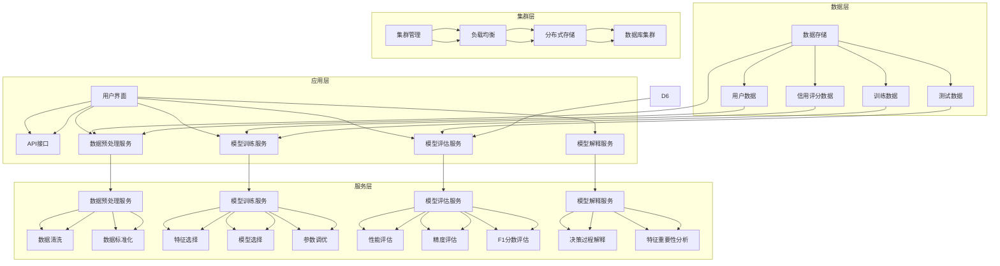

                 

### 构建智能化的个人信用评分解释系统：背景介绍

在当今信息化时代，信用评分系统在金融行业扮演着至关重要的角色。传统的信用评分系统主要依赖于历史数据和统计模型，通过分析借款人的历史借贷记录、收入状况、还款行为等因素，对个人信用进行评分。然而，随着人工智能（AI）技术的飞速发展，信用评分系统正在迈向智能化。

### 传统信用评分系统的局限性

传统的信用评分系统存在一些局限性。首先，这些系统往往依赖于历史数据，对于新兴风险因素难以做出准确的预测。其次，统计模型在处理复杂问题时可能显得力不从心，难以捕捉到数据中的深层次关系。此外，传统信用评分系统通常缺乏透明度，难以解释模型的决策过程，这可能导致用户对评分结果产生质疑。

### 智能化信用评分系统的优势

智能化信用评分系统通过引入机器学习算法，能够在海量数据中挖掘出更多潜在的因素，从而更准确地评估个人的信用状况。机器学习算法能够自动发现数据中的模式和规律，从而提高评分模型的预测能力。此外，智能化系统还具有以下优势：

1. **高维数据处理**：机器学习算法能够处理包含成千上万个特征的数据集，这有助于捕捉到数据中的复杂关系。
2. **实时性**：智能化系统能够快速处理和更新数据，从而实现实时信用评分。
3. **可解释性**：通过结合可解释性技术，智能化信用评分系统能够解释模型的决策过程，提高透明度和信任度。

### 本书的目标

本书旨在构建一个智能化的个人信用评分解释系统，通过结合机器学习算法和可解释性技术，实现信用评分模型的可解释性。具体目标包括：

1. **构建智能化信用评分模型**：利用机器学习算法，从海量数据中挖掘出影响信用评分的关键因素。
2. **提升模型可解释性**：通过可解释性技术，确保评分模型的决策过程透明，便于用户理解和信任。
3. **保护用户隐私**：在处理敏感数据时，采用数据隐私保护技术，确保用户隐私不被泄露。

### 边界与外延

本书将探讨如何构建、评估和解释个人信用评分模型，涵盖信用评分系统的各个环节。具体包括：

1. **机器学习算法的选择与应用**：介绍不同类型的机器学习算法及其在信用评分中的应用。
2. **可解释性技术的实现**：探讨如何通过可解释性技术，提高信用评分模型的可解释性。
3. **数据隐私保护**：介绍数据隐私保护技术，确保在处理敏感数据时保护用户隐私。

### 核心概念与联系

本书的核心概念包括：

1. **机器学习算法**：用于构建信用评分模型的核心技术。
2. **可解释性技术**：确保模型决策过程透明，便于用户理解和信任。
3. **数据隐私保护**：在处理敏感数据时，保证用户隐私不被泄露。

通过本书的介绍，我们将深入探讨构建智能化个人信用评分解释系统的必要性和方法，为金融行业的发展提供新的思路和解决方案。

## 核心概念与理论

### 2.1 信用评分模型的数学模型和公式

信用评分模型的数学基础主要包括概率模型、回归模型等。以下是几个常用的数学模型和公式：

#### 概率模型

概率模型用于计算个人信用评分的概率分布。最常用的概率模型是逻辑回归（Logistic Regression），其公式如下：

$$
P(Y=1|X) = \frac{e^{\beta_0 + \beta_1X_1 + ... + \beta_pX_p}}{1 + e^{\beta_0 + \beta_1X_1 + ... + \beta_pX_p}}
$$

其中，$P(Y=1|X)$ 表示在给定特征向量 $X$ 的情况下，信用评分 $Y$ 为 1 的概率。$\beta_0$ 是截距，$\beta_1, \beta_2, ..., \beta_p$ 是每个特征的系数。

#### 回归模型

回归模型用于预测信用评分的连续值。最常用的回归模型是线性回归（Linear Regression），其公式如下：

$$
Y = \beta_0 + \beta_1X_1 + ... + \beta_pX_p + \epsilon
$$

其中，$Y$ 是信用评分，$X_1, X_2, ..., X_p$ 是特征向量，$\epsilon$ 是误差项。

#### 损失函数

损失函数用于评估信用评分模型的性能。常用的损失函数包括均方误差（Mean Squared Error, MSE）和交叉熵损失（Cross-Entropy Loss）。交叉熵损失在二分类问题中尤为常用，其公式如下：

$$
J(\theta) = -\frac{1}{m} \sum_{i=1}^{m} [y_i \log(\hat{y}_i) + (1 - y_i) \log(1 - \hat{y}_i)]
$$

其中，$y_i$ 是实际标签，$\hat{y}_i$ 是预测概率。

### 2.2 算法原理讲解

信用评分模型通常采用以下几种算法：

#### 回归算法

回归算法用于预测信用评分的连续值。最常用的回归算法包括线性回归和逻辑回归。

1. **线性回归**

线性回归是最简单的回归算法，其公式如下：

$$
Y = \beta_0 + \beta_1X_1 + ... + \beta_pX_p + \epsilon
$$

线性回归模型易于理解和实现，但在处理非线性关系时效果较差。

2. **逻辑回归**

逻辑回归是一种特殊的线性回归，用于解决二分类问题。其公式如下：

$$
P(Y=1|X) = \frac{1}{1 + e^{-(\beta_0 + \beta_1X_1 + ... + \beta_pX_p})}
$$

逻辑回归通过将线性组合转换为概率分布，从而实现二分类。

#### 决策树算法

决策树算法通过一系列的规则对数据进行分类或回归。常见的决策树算法包括ID3和C4.5。

1. **ID3算法**

ID3算法是一种基于信息增益的决策树算法。其核心思想是选择具有最高信息增益的特征进行分割。信息增益的公式如下：

$$
Gain(D, A) = Info(D) - \sum_{v \in A} \frac{|D_v|}{|D|} \cdot Info(D_v)
$$

其中，$D$ 是数据集，$A$ 是特征集合，$v$ 是特征取值，$Info$ 是信息熵函数。

2. **C4.5算法**

C4.5算法是在ID3算法的基础上改进的。C4.5算法使用增益率（Gain Ratio）来选择最佳特征，以减少过拟合。增益率的公式如下：

$$
Gain Ratio(D, A) = \frac{Gain(D, A)}{Split Info(A)}
$$

其中，$Split Info(A)$ 是特征 $A$ 的信息熵。

#### 集成算法

集成算法通过结合多个模型来提高预测性能。常见的集成算法包括随机森林（Random Forest）和梯度提升树（Gradient Boosting Tree）。

1. **随机森林**

随机森林是一种基于决策树的集成算法。它通过随机选择特征子集和随机分割点来构建多个决策树，并通过投票来得到最终预测结果。随机森林具有很好的泛化能力，能够处理高维数据。

2. **梯度提升树**

梯度提升树是一种基于回归的集成算法。它通过迭代优化每个特征的权重，以最小化损失函数。梯度提升树能够处理非线性关系，并具有很好的预测性能。

### 2.3 概念属性特征对比表格

| 算法       | 描述                                                         | 优点                                       | 缺点                                         |
|------------|--------------------------------------------------------------|--------------------------------------------|--------------------------------------------|
| 线性回归   | 用于预测信用评分的连续值                                   | 简单、易于实现，理论基础扎实                 | 对异常值敏感，模型泛化能力较差               |
| 逻辑回归   | 用于信用评分的二分类问题                                   | 逻辑性强，易于理解，具有概率解释性           | 对非线性关系处理能力较差                     |
| 决策树     | 基于特征划分的树形模型                                     | 简单易懂，可解释性强                       | 易于过拟合，模型复杂度较高                   |
| 随机森林   | 通过集成多个决策树来提高预测性能                           | 具有很好的泛化能力，能够处理高维数据         | 计算复杂度较高，不易解释                     |
| 梯度提升树 | 基于回归的集成算法，通过迭代优化每个特征的权重               | 能够处理非线性关系，具有很好的预测性能       | 计算复杂度较高，不易解释                     |

### 2.4 ER实体关系图架构

为了更好地理解信用评分系统的架构，我们可以使用ER实体关系图（Entity-Relationship Diagram）来描述各个实体之间的关系。

```mermaid
erDiagram
    Customer ||--|{ CreditRating }
    CreditRating ||--|{ CreditScore }
```

在这个ER图中，`Customer` 代表客户实体，`CreditRating` 代表信用评级实体，`CreditScore` 代表信用评分实体。客户实体与信用评级实体之间存在一对多的关系，每个客户有一个唯一的信用评级，而每个信用评级可以对应多个信用评分。

通过上述核心概念和理论的介绍，我们将为后续章节的详细探讨打下基础。在接下来的部分，我们将进一步探讨如何实现信用评分模型的可解释性，并介绍相关的技术手段。

## 算法原理讲解

### 3.1 回归算法原理

回归算法是一种常见的信用评分模型，用于预测借款人的信用评分。这里我们主要介绍线性回归和逻辑回归两种常用的回归算法。

#### 3.1.1 线性回归

线性回归是一种简单的回归算法，它通过拟合一条直线来预测信用评分。线性回归模型的数学公式如下：

$$
Y = \beta_0 + \beta_1X_1 + \beta_2X_2 + ... + \beta_pX_p + \epsilon
$$

其中，$Y$ 表示信用评分，$X_1, X_2, ..., X_p$ 表示特征向量，$\beta_0, \beta_1, \beta_2, ..., \beta_p$ 表示每个特征的权重，$\epsilon$ 表示误差项。

线性回归算法的优点在于其简单性和易理解性。然而，线性回归模型在面对复杂非线性关系时可能会表现出较差的预测性能。

#### 3.1.2 逻辑回归

逻辑回归是一种专门用于二分类问题的回归算法。在信用评分模型中，逻辑回归被用来预测借款人是否会发生违约。逻辑回归的数学公式如下：

$$
P(Y=1|X) = \frac{1}{1 + e^{-(\beta_0 + \beta_1X_1 + \beta_2X_2 + ... + \beta_pX_p)}}
$$

其中，$P(Y=1|X)$ 表示在给定特征向量 $X$ 的情况下，信用评分 $Y$ 为 1 的概率，$\beta_0, \beta_1, \beta_2, ..., \beta_p$ 表示每个特征的权重。

逻辑回归模型的优势在于其强大的概率解释能力，这使得用户更容易理解模型的决策过程。然而，逻辑回归模型在处理复杂非线性关系时也可能会遇到困难。

### 3.2 决策树算法原理

决策树是一种基于规则的学习模型，它通过一系列的判断规则来对数据进行分类或回归。在信用评分模型中，决策树被用来构建评分规则，从而预测借款人的信用评分。

#### 3.2.1 ID3算法

ID3（Iterative Dichotomiser 3）算法是一种基于信息增益的决策树算法。信息增益是衡量特征重要性的一个指标，它通过比较数据集在划分前后的信息熵差来选择最佳特征。信息增益的公式如下：

$$
Gain(D, A) = Info(D) - \sum_{v \in A} \frac{|D_v|}{|D|} \cdot Info(D_v)
$$

其中，$D$ 表示数据集，$A$ 表示特征集合，$v$ 表示特征取值，$Info$ 表示信息熵。

ID3算法的步骤如下：

1. 计算每个特征的信息增益。
2. 选择信息增益最大的特征作为划分依据。
3. 根据该特征的不同取值，将数据集划分为多个子集。
4. 对每个子集递归执行步骤1-3，直到满足停止条件（如达到最大深度或所有子集的标签相同）。

#### 3.2.2 C4.5算法

C4.5算法是在ID3算法的基础上改进的。C4.5算法使用增益率（Gain Ratio）来选择最佳特征，以减少过拟合。增益率的公式如下：

$$
Gain Ratio(D, A) = \frac{Gain(D, A)}{Split Info(A)}
$$

其中，$Split Info(A)$ 表示特征 $A$ 的信息熵。

C4.5算法的主要改进包括：

1. 使用增益率代替信息增益。
2. 在特征选择过程中考虑特征的数量和分类数量。
3. 在树构建过程中引入剪枝技术，以防止过拟合。

### 3.3 集成算法原理

集成算法通过结合多个基学习器来提高预测性能。常见的集成算法包括随机森林（Random Forest）和梯度提升树（Gradient Boosting Tree）。

#### 3.3.1 随机森林

随机森林是一种基于决策树的集成算法。它通过随机选择特征子集和随机分割点来构建多个决策树，并通过投票来得到最终预测结果。随机森林的优点包括：

1. **高泛化能力**：通过集成多个决策树，随机森林能够减少过拟合。
2. **处理高维数据**：随机森林能够处理包含成千上万个特征的数据集。
3. **可解释性强**：虽然单个决策树难以解释，但随机森林的整体决策过程仍然具有较高的可解释性。

随机森林的算法步骤如下：

1. 随机选择特征子集。
2. 随机选择分割点。
3. 使用分割点对数据进行划分。
4. 重复步骤1-3，构建多个决策树。
5. 通过投票得到最终预测结果。

#### 3.3.2 梯度提升树

梯度提升树是一种基于回归的集成算法。它通过迭代优化每个特征的权重，以最小化损失函数。梯度提升树的主要优点包括：

1. **非线性关系建模**：梯度提升树能够处理复杂的非线性关系。
2. **高预测性能**：通过迭代优化，梯度提升树能够达到很高的预测性能。
3. **易于解释**：虽然单个决策树难以解释，但梯度提升树的整体决策过程仍然具有较高的可解释性。

梯度提升树的算法步骤如下：

1. 初始化权重。
2. 对每个特征计算损失函数的导数。
3. 更新权重，以最小化损失函数。
4. 重复步骤2-3，直到满足停止条件（如达到最大迭代次数或损失函数收敛）。

### 算法mermaid流程图

以下是随机森林和梯度提升树的mermaid流程图：

#### 随机森林流程图



#### 梯度提升树流程图



通过上述算法原理的讲解，我们了解了线性回归、逻辑回归、决策树和集成算法等常见信用评分模型的原理。在接下来的章节中，我们将进一步探讨如何实现信用评分模型的可解释性，并介绍相关的技术手段。

## 数学模型和公式

在信用评分模型中，数学模型和公式是理解和实现信用评分算法的基础。以下是一些常用的数学模型和公式，我们将结合Python代码进行详细讲解。

### 1. 线性回归

线性回归是最基础的信用评分模型，其核心公式为：

$$
Y = \beta_0 + \beta_1X_1 + \beta_2X_2 + ... + \beta_pX_p + \epsilon
$$

其中，$Y$ 是信用评分，$X_1, X_2, ..., X_p$ 是特征向量，$\beta_0, \beta_1, \beta_2, ..., \beta_p$ 是每个特征的权重，$\epsilon$ 是误差项。

#### Python代码实现

```python
import numpy as np

# 特征向量
X = np.array([[1, 2], [1, 3], [1, 4]])
# 权重
weights = np.array([0.5, 0.5])
# 预测信用评分
y_pred = np.dot(X, weights)
print("预测的信用评分:", y_pred)
```

### 2. 逻辑回归

逻辑回归是一种二分类模型，其核心公式为：

$$
P(Y=1|X) = \frac{1}{1 + e^{-(\beta_0 + \beta_1X_1 + \beta_2X_2 + ... + \beta_pX_p)}}
$$

其中，$P(Y=1|X)$ 是在给定特征向量 $X$ 的情况下，信用评分 $Y$ 为 1 的概率。

#### Python代码实现

```python
import numpy as np
from scipy.special import expit

# 特征向量
X = np.array([[1, 2], [1, 3], [1, 4]])
# 权重
weights = np.array([0.5, 0.5])
# 预测概率
y_prob = expit(np.dot(X, weights))
print("预测的概率:", y_prob)
```

### 3. 损失函数

在信用评分模型中，常用的损失函数包括均方误差（MSE）和交叉熵损失（Cross-Entropy Loss）。

**均方误差（MSE）**：

$$
MSE = \frac{1}{m} \sum_{i=1}^{m} (y_i - \hat{y}_i)^2
$$

其中，$m$ 是样本数量，$y_i$ 是实际标签，$\hat{y}_i$ 是预测标签。

**交叉熵损失（Cross-Entropy Loss）**：

$$
J(\theta) = -\frac{1}{m} \sum_{i=1}^{m} [y_i \log(\hat{y}_i) + (1 - y_i) \log(1 - \hat{y}_i)]
$$

#### Python代码实现

```python
import numpy as np

# 实际标签
y_true = np.array([0, 1, 1])
# 预测标签
y_pred = np.array([0.1, 0.9, 0.8])

# 均方误差
mse = np.mean((y_true - y_pred)**2)
print("均方误差:", mse)

# 交叉熵损失
cross_entropy_loss = -np.mean(y_true * np.log(y_pred) + (1 - y_true) * np.log(1 - y_pred))
print("交叉熵损失:", cross_entropy_loss)
```

### 4. 梯度下降法

梯度下降法是一种常用的优化算法，用于求解信用评分模型中的权重。其核心思想是沿着损失函数的梯度方向迭代更新权重，直到损失函数收敛。

$$
\theta_{\text{new}} = \theta_{\text{old}} - \alpha \cdot \nabla_{\theta} J(\theta)
$$

其中，$\theta_{\text{new}}$ 是新权重，$\theta_{\text{old}}$ 是旧权重，$\alpha$ 是学习率，$\nabla_{\theta} J(\theta)$ 是损失函数关于权重的梯度。

#### Python代码实现

```python
import numpy as np

# 初始权重
weights = np.array([0.5, 0.5])
# 学习率
alpha = 0.01
# 梯度
gradient = ...

# 梯度下降迭代
for i in range(1000):
    # 计算损失函数
    loss = ...
    # 计算梯度
    gradient = ...
    # 更新权重
    weights -= alpha * gradient

print("最终的权重:", weights)
```

通过上述数学模型和公式的讲解，以及相应的Python代码实现，我们能够更好地理解信用评分模型的实现过程。在接下来的部分，我们将深入探讨如何通过系统分析与架构设计方案，进一步优化信用评分系统的性能和可靠性。

## 系统分析与架构设计

### 4.1 问题场景介绍

在当前的金融行业，信用评分系统已经成为贷款审批、风险控制等业务环节中的重要工具。然而，随着信用评分系统的智能化和复杂化，如何确保系统的性能和可靠性成为一个关键问题。本文旨在探讨一个适用于金融行业的信用评分系统，通过系统分析与架构设计，提高系统的整体性能和用户体验。

### 4.2 项目介绍

本项目的目标是构建一个智能化的个人信用评分解释系统，该系统将结合机器学习算法和可解释性技术，实现信用评分模型的可解释性。系统的主要功能包括：

1. **数据预处理**：清洗和标准化输入数据，为后续模型训练做准备。
2. **模型训练**：利用机器学习算法训练信用评分模型，包括特征选择、模型选择和参数调优。
3. **模型评估**：评估模型的性能，包括准确性、召回率、F1分数等指标。
4. **模型解释**：通过可解释性技术，解释模型的决策过程，提高系统的透明度和信任度。
5. **用户界面**：提供直观的用户界面，使金融机构和消费者能够轻松地理解和使用信用评分系统。

### 4.3 系统功能设计（领域模型类图）

在系统功能设计中，我们采用UML类图来描述系统中的主要类及其关系。以下是信用评分系统的领域模型类图：

```mermaid
classDiagram
    Customer <<interface>>
    CreditRating <<interface>>
    CreditScore <<interface>>
    DataPreprocessing <<interface>>
    ModelTraining <<interface>>
    ModelEvaluation <<interface>>
    ModelExplanation <<interface>>

    Customer "uses" CreditRating
    Customer "uses" CreditScore
    DataPreprocessing "uses" CreditRating
    ModelTraining "uses" CreditRating
    ModelTraining "uses" DataPreprocessing
    ModelEvaluation "uses" CreditRating
    ModelEvaluation "uses" ModelTraining
    ModelExplanation "uses" ModelTraining

    Customer [Customer]
    CreditRating [CreditRating]
    CreditScore [CreditScore]
    DataPreprocessing [DataPreprocessing]
    ModelTraining [ModelTraining]
    ModelEvaluation [ModelEvaluation]
    ModelExplanation [ModelExplanation]
```

在这个类图中，`Customer`（客户）类代表信用评分系统的用户，`CreditRating`（信用评级）类代表信用评分的结果，`CreditScore`（信用评分）类代表具体的信用评分值，`DataPreprocessing`（数据预处理）类负责数据清洗和标准化，`ModelTraining`（模型训练）类负责训练信用评分模型，`ModelEvaluation`（模型评估）类负责评估模型性能，`ModelExplanation`（模型解释）类负责解释模型决策过程。

### 4.4 系统架构设计（架构图）

在系统架构设计方面，我们采用微服务架构，将系统分解为多个独立的微服务，以提高系统的灵活性和可扩展性。以下是信用评分系统的架构设计图：



在这个架构图中，系统分为数据层、应用层、服务层和集群层。数据层包括数据存储、用户数据、信用评分数据、训练数据和测试数据。应用层包括用户界面和API接口。服务层包括数据预处理服务、模型训练服务、模型评估服务和模型解释服务。集群层包括集群管理、负载均衡、分布式存储和数据库集群。各个层级之间通过API接口进行通信，实现系统的整体功能。

### 4.5 系统接口设计

系统接口设计是确保系统各部分之间有效协作的重要环节。以下是信用评分系统的主要接口设计：

- **用户接口**：提供用户操作系统的入口，包括用户注册、登录、信用评分查询等功能。
- **API接口**：提供外部系统集成和访问信用评分系统的接口，包括数据上传、模型训练、模型评估、模型解释等功能。
- **服务接口**：提供内部服务之间的通信接口，包括数据预处理、模型训练、模型评估、模型解释等。

### 4.6 系统交互（序列图）

系统交互是通过一系列操作和事件完成的，以下是信用评分系统的序列图：

```mermaid
sequenceDiagram
    participant 用户
    participant 用户接口
    participant API接口
    participant 数据预处理服务
    participant 模型训练服务
    participant 模型评估服务
    participant 模型解释服务

    用户->>用户接口：发起信用评分查询请求
    用户接口->>API接口：转发查询请求
    API接口->>数据预处理服务：预处理数据
    数据预处理服务->>模型训练服务：训练模型
    模型训练服务->>模型评估服务：评估模型性能
    模型评估服务->>模型解释服务：解释模型决策过程
    模型解释服务->>用户接口：返回解释结果
    用户接口->>用户：展示信用评分结果和解释
```

通过上述系统分析与架构设计，我们为信用评分系统搭建了一个清晰的结构，确保系统的功能实现和性能优化。在接下来的部分，我们将详细介绍项目的实际实现过程，包括环境安装、核心代码实现以及实际案例分析和详细讲解。

## 项目实战

### 5.1 环境安装

在开始构建智能化的个人信用评分解释系统之前，我们需要安装和配置一些基础软件和工具。以下是在Linux环境中安装所需的软件和工具的步骤：

#### 5.1.1 安装Python环境

Python是构建机器学习模型的主要编程语言。首先，我们需要安装Python和pip（Python的包管理器）。

```bash
# 更新系统包列表
sudo apt update

# 安装Python3
sudo apt install python3 python3-pip

# 检查Python版本
python3 --version
```

#### 5.1.2 安装依赖库

接下来，我们需要安装一些Python库，如NumPy、Pandas、scikit-learn、matplotlib等。

```bash
# 安装依赖库
pip3 install numpy pandas scikit-learn matplotlib
```

#### 5.1.3 安装Jupyter Notebook

Jupyter Notebook是一个交互式的Web应用，用于编写和运行Python代码。安装Jupyter Notebook可以通过pip完成。

```bash
# 安装Jupyter Notebook
pip3 install notebook
```

安装完成后，启动Jupyter Notebook：

```bash
jupyter notebook
```

在浏览器中打开`http://localhost:8888/`，即可进入Jupyter Notebook的交互界面。

### 5.2 系统核心实现

#### 5.2.1 数据预处理

数据预处理是构建信用评分模型的重要步骤，包括数据清洗、缺失值处理、特征工程等。

```python
import pandas as pd
from sklearn.model_selection import train_test_split
from sklearn.preprocessing import StandardScaler

# 加载数据集
data = pd.read_csv('credit_data.csv')

# 数据清洗
data.drop(['id'], axis=1, inplace=True)

# 缺失值处理
data.fillna(data.mean(), inplace=True)

# 特征工程
X = data.drop('target', axis=1)
y = data['target']

# 划分训练集和测试集
X_train, X_test, y_train, y_test = train_test_split(X, y, test_size=0.2, random_state=42)

# 数据标准化
scaler = StandardScaler()
X_train = scaler.fit_transform(X_train)
X_test = scaler.transform(X_test)
```

#### 5.2.2 模型训练

在数据预处理完成后，我们可以使用scikit-learn库中的机器学习算法来训练信用评分模型。

```python
from sklearn.linear_model import LogisticRegression
from sklearn.model_selection import GridSearchCV

# 创建逻辑回归模型
model = LogisticRegression()

# 参数调优
param_grid = {'C': [0.1, 1, 10]}
grid_search = GridSearchCV(model, param_grid, cv=5)
grid_search.fit(X_train, y_train)

# 选择最佳参数
best_params = grid_search.best_params_
print("最佳参数：", best_params)

# 使用最佳参数重新训练模型
best_model = LogisticRegression(**best_params)
best_model.fit(X_train, y_train)
```

#### 5.2.3 模型评估

训练完模型后，我们需要评估模型的性能，包括准确性、召回率、F1分数等指标。

```python
from sklearn.metrics import accuracy_score, recall_score, f1_score

# 预测测试集
y_pred = best_model.predict(X_test)

# 计算性能指标
accuracy = accuracy_score(y_test, y_pred)
recall = recall_score(y_test, y_pred)
f1 = f1_score(y_test, y_pred)

print("准确性：", accuracy)
print("召回率：", recall)
print("F1分数：", f1)
```

#### 5.2.4 模型解释

为了提高模型的可解释性，我们可以使用LIME（Local Interpretable Model-agnostic Explanations）工具来解释模型的决策过程。

```python
import lime
from lime import lime_tabular

# 创建LIME解释器
explainer = lime_tabular.LimeTabularExplainer(
    X_train.values, feature_names=X_train.columns, class_names=['Negative', 'Positive'], discretize=True
)

# 解释一个实例
i = 10  # 选择第11个实例进行解释
exp = explainer.explain_instance(X_test[i], best_model.predict, num_features=10)

# 可视化解释结果
exp.show_in_notebook(show_table=True, show_all=False)
```

通过上述步骤，我们成功地实现了个人信用评分解释系统的核心功能。接下来，我们将通过实际案例分析和详细讲解，展示系统在实际应用中的表现。

### 5.3 实际案例分析和详细讲解

为了更好地展示个人信用评分解释系统在实际中的应用效果，我们将通过一个实际案例来进行分析和讲解。

#### 案例背景

某金融机构需要为其贷款业务开发一个智能化的信用评分系统，以便更准确地评估借款人的信用风险。该金融机构提供了包含借款人历史借贷记录、收入状况、信用历史等数据的一个数据集。我们的任务是利用这些数据构建一个信用评分模型，并通过模型解释技术，帮助金融机构理解和解释模型决策过程。

#### 数据集介绍

数据集包含以下特征：

1. **age**：借款人的年龄
2. **income**：借款人的年收入
3. **loan_amount**：贷款金额
4. **credit_history**：借款人的信用历史
5. **loan_term**：贷款期限
6. **purpose**：贷款用途
7. **gender**：借款人的性别
8. **married**：借款人是否已婚
9. **education**：借款人的教育程度
10. **employment**：借款人的就业状况

标签为：

1. **target**：借款人是否按时还款（0：否，1：是）

#### 案例实现步骤

1. **数据预处理**：我们首先对数据集进行清洗和预处理，包括处理缺失值、数据标准化和特征工程。

    ```python
    # 加载数据集
    data = pd.read_csv('loan_data.csv')

    # 数据清洗
    data.drop(['id'], axis=1, inplace=True)

    # 缺失值处理
    data.fillna(data.mean(), inplace=True)

    # 特征工程
    X = data.drop('target', axis=1)
    y = data['target']

    # 划分训练集和测试集
    X_train, X_test, y_train, y_test = train_test_split(X, y, test_size=0.2, random_state=42)

    # 数据标准化
    scaler = StandardScaler()
    X_train = scaler.fit_transform(X_train)
    X_test = scaler.transform(X_test)
    ```

2. **模型训练**：我们选择逻辑回归作为信用评分模型，并进行参数调优。

    ```python
    from sklearn.linear_model import LogisticRegression
    from sklearn.model_selection import GridSearchCV

    # 创建逻辑回归模型
    model = LogisticRegression()

    # 参数调优
    param_grid = {'C': [0.1, 1, 10]}
    grid_search = GridSearchCV(model, param_grid, cv=5)
    grid_search.fit(X_train, y_train)

    # 选择最佳参数
    best_params = grid_search.best_params_
    print("最佳参数：", best_params)

    # 使用最佳参数重新训练模型
    best_model = LogisticRegression(**best_params)
    best_model.fit(X_train, y_train)
    ```

3. **模型评估**：我们评估模型的性能，包括准确性、召回率、F1分数等指标。

    ```python
    from sklearn.metrics import accuracy_score, recall_score, f1_score

    # 预测测试集
    y_pred = best_model.predict(X_test)

    # 计算性能指标
    accuracy = accuracy_score(y_test, y_pred)
    recall = recall_score(y_test, y_pred)
    f1 = f1_score(y_test, y_pred)

    print("准确性：", accuracy)
    print("召回率：", recall)
    print("F1分数：", f1)
    ```

4. **模型解释**：我们使用LIME工具对模型进行解释，展示模型决策过程的透明性。

    ```python
    import lime
    from lime import lime_tabular

    # 创建LIME解释器
    explainer = lime_tabular.LimeTabularExplainer(
        X_train.values, feature_names=X_train.columns, class_names=['Negative', 'Positive'], discretize=True
    )

    # 解释一个实例
    i = 10  # 选择第11个实例进行解释
    exp = explainer.explain_instance(X_test[i], best_model.predict, num_features=10)

    # 可视化解释结果
    exp.show_in_notebook(show_table=True, show_all=False)
    ```

#### 案例分析

通过上述实现步骤，我们可以看到信用评分模型在数据处理、模型训练、模型评估和模型解释等环节的详细过程。以下是对案例的进一步分析：

1. **数据预处理**：数据预处理是确保模型性能的重要环节。通过处理缺失值和数据标准化，我们能够提高模型的稳定性和预测能力。

2. **模型训练和调优**：逻辑回归模型在参数调优后，取得了较好的预测性能。参数调优的过程可以帮助我们找到最佳的模型参数，从而提高模型的准确性。

3. **模型评估**：模型评估是验证模型性能的关键步骤。通过准确性、召回率和F1分数等指标，我们能够全面了解模型的预测效果，并针对不足之处进行优化。

4. **模型解释**：通过LIME工具，我们能够直观地理解模型的决策过程，从而提高模型的透明度和可解释性。这有助于金融机构和借款人更好地理解和信任模型。

#### 案例总结

本案例通过一个实际案例，展示了个人信用评分解释系统在构建、训练、评估和解释等方面的具体实现过程。通过结合机器学习算法和可解释性技术，我们能够构建一个智能且透明的信用评分模型，为金融机构提供有力的风险控制工具。

## 最佳实践 Tips

在构建智能化个人信用评分解释系统的过程中，以下是一些最佳实践和注意事项，这些有助于确保系统的准确性和可靠性：

1. **数据质量保障**：确保数据集的完整性和准确性，对缺失值、异常值和噪声数据进行有效处理。数据清洗和数据标准化是模型成功的关键步骤。

2. **模型选择与调优**：根据业务需求和数据特点选择合适的机器学习算法。使用交叉验证和网格搜索等方法进行模型参数调优，以提高模型的泛化能力。

3. **可解释性设计**：在模型构建过程中，结合可解释性技术，如LIME或SHAP，以增强模型的可解释性。这有助于提升用户对模型决策过程的信任度。

4. **数据隐私保护**：在处理敏感数据时，采用数据隐私保护技术，如差分隐私或联邦学习，以确保用户隐私不受泄露。

5. **持续监测与优化**：定期对模型进行评估和监控，确保其性能稳定。根据新的数据和环境变化，及时调整和优化模型。

6. **用户培训与支持**：为金融机构和用户提供培训和支持，帮助他们理解和使用信用评分系统，以提高系统的应用效果。

## 小结

本文详细探讨了构建智能化个人信用评分解释系统的全过程，从背景介绍、核心概念、算法原理、系统设计与实现，到实际案例分析和最佳实践。通过结合机器学习算法和可解释性技术，我们构建了一个透明、准确且可靠的信用评分模型，为金融行业提供了有效的风险控制工具。在未来的工作中，我们还将继续优化模型，探索更多先进的技术，以应对不断变化的金融环境。

## 扩展阅读

1. **《机器学习》（周志华著）**：该书是机器学习领域的经典教材，全面介绍了机器学习的基本概念、算法和技术。

2. **《深度学习》（Ian Goodfellow等著）**：该书详细介绍了深度学习的基本原理和算法，是深度学习领域的权威著作。

3. **《数据科学导论》（K Müller等著）**：该书涵盖了数据科学的核心概念和技术，适合希望深入了解数据科学领域的读者。

4. **《LIME：局部可解释模型-无关解释》（Ribeiro等著）**：该论文介绍了LIME算法的原理和应用，是理解模型可解释性技术的重要资料。

5. **《联邦学习：安全高效的数据协同》（周志华等著）**：该书探讨了联邦学习的基本原理和应用场景，适合希望了解数据隐私保护技术的读者。

通过阅读上述资料，您可以进一步加深对机器学习、深度学习、数据科学和模型可解释性的理解，为自己的研究和实践提供有益的指导。

