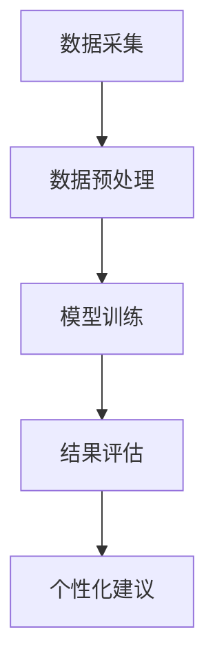
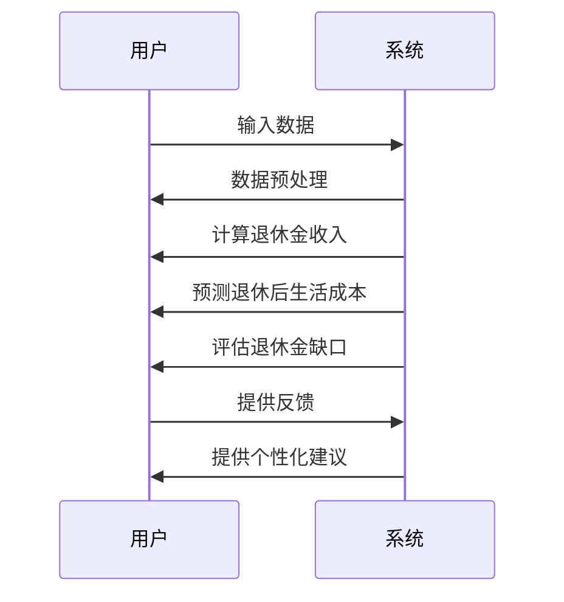

                 

# 《构建智能化的个人退休金缺口分析助手》

## 关键词

- 个人退休金缺口分析
- 人工智能技术
- 数据分析与预测
- 系统架构设计
- 算法原理讲解
- 实际案例剖析

## 摘要

随着人口老龄化趋势的加剧，退休金缺口问题已成为全球范围内普遍关注的社会问题。本文旨在构建一款智能化的个人退休金缺口分析助手，通过集成先进的算法与系统架构设计，实现用户个人退休金缺口的精确分析。本文将详细探讨退休金缺口问题的背景、核心概念、算法原理、系统设计与实际应用，为解决个人退休金管理提供科学依据和实用工具。

## 目录大纲

### 第一部分：背景介绍

#### 第1章：退休金缺口问题概述
1.1 退休金缺口问题的背景
1.2 退休金缺口问题的定义
1.3 退休金缺口问题的社会影响
1.4 本书解决的问题与目标

### 第二部分：核心概念与联系

#### 第2章：退休金缺口分析基础
2.1 退休金制度概述
2.2 个人退休金计算原理
2.3 退休金缺口分析的关键指标
2.4 退休金缺口分析的数据来源

### 第三部分：算法原理讲解

#### 第3章：退休金缺口分析算法原理
3.1 算法概述
3.2 算法数学模型
3.3 算法流程图
3.4 算法举例说明

### 第四部分：系统分析与架构设计方案

#### 第4章：系统功能设计
4.1 问题场景介绍
4.2 系统功能需求分析
4.3 系统功能设计

#### 第5章：系统架构设计
5.1 系统架构概述
5.2 系统架构设计
5.3 系统接口设计

#### 第6章：系统交互设计
6.1 系统交互概述
6.2 系统交互设计
6.3 系统交互序列图

### 第五部分：项目实战

#### 第7章：环境安装与配置
7.1 环境安装概述
7.2 系统核心实现源代码
7.3 代码应用解读与分析

#### 第8章：实际案例分析与详细讲解
8.1 实际案例概述
8.2 案例分析与详细讲解
8.3 项目小结

### 第六部分：最佳实践与拓展阅读

#### 第9章：最佳实践
9.1 最佳实践总结
9.2 小结

#### 第10章：注意事项与拓展阅读
10.1 注意事项
10.2 拓展阅读

## 第一部分：背景介绍

### 第1章：退休金缺口问题概述

#### 1.1 退休金缺口问题的背景

在全球范围内，退休金缺口问题愈发严重。随着人口老龄化趋势的加剧，越来越多的人面临着退休后的经济困境。根据世界银行的数据，全球范围内有近30%的人口未为其退休生活做好充分的财务准备。这一现象不仅影响了个人和家庭的生活质量，也对社会经济稳定带来了负面影响。

退休金缺口问题主要源于以下几个方面：

1. **退休金制度设计缺陷**：一些退休金制度未能充分考虑到通货膨胀、寿命延长等因素，导致退休金发放标准相对较低。
2. **个人退休金储蓄不足**：由于各种原因，许多人未能按照退休金计划进行储蓄，导致退休金积累不足。
3. **退休金投资回报率低**：一些退休金投资策略不当，未能实现预期的回报率，进一步加剧了退休金缺口。

#### 1.2 退休金缺口问题的定义

退休金缺口问题是指个人在退休后所能获得的退休金收入与其退休后的生活成本之间的差距。具体来说，退休金缺口可以表示为以下公式：

$$\text{退休金缺口} = \text{退休后生活成本} - \text{退休金收入}$$

#### 1.3 退休金缺口问题的社会影响

退休金缺口问题对社会产生了深远的影响：

1. **个人生活质量下降**：退休金缺口导致许多老年人在退休后面临经济困境，生活质量大幅下降。
2. **社会负担加重**：退休金缺口问题迫使政府和企业增加对退休人员的补贴和福利，加重了社会负担。
3. **经济稳定受影响**：退休金缺口问题可能引发社会不稳定，影响经济持续健康发展。

#### 1.4 本书解决的问题与目标

本书旨在构建一款智能化的个人退休金缺口分析助手，通过以下方式解决退休金缺口问题：

1. **精准分析**：利用人工智能技术，对用户的退休金状况进行精确分析，预测可能的退休金缺口。
2. **个性化建议**：根据用户的退休金现状和未来规划，提供个性化的退休金储蓄和投资建议。
3. **优化退休金管理**：通过智能化的分析和建议，帮助用户优化退休金管理，减少退休金缺口。

本书的目标是：

1. **提高个人退休金管理意识**：让更多人意识到退休金管理的重要性，提前做好退休金准备。
2. **改善退休生活质量**：通过科学的退休金管理，提高老年人的生活质量和幸福感。
3. **推动社会经济发展**：减少退休金缺口，减轻社会负担，促进经济稳定发展。

## 第二部分：核心概念与联系

### 第2章：退休金缺口分析基础

#### 2.1 退休金制度概述

退休金制度是社会保障体系的重要组成部分，旨在保障老年人在退休后能够获得稳定的收入，维持基本生活水平。退休金制度通常分为三大类：

1. **国家退休金**：由政府提供，覆盖范围广，通常按照固定比例从个人工资中扣除，用于支付退休金。
2. **企业退休金**：由企业设立，通常采用个人账户制，员工和企业共同缴费，退休后按账户余额支付退休金。
3. **个人储蓄退休金**：由个人自主储蓄，通常通过银行、保险公司等金融机构进行投资和管理。

#### 2.2 个人退休金计算原理

个人退休金计算通常涉及以下几个方面：

1. **基础养老金**：根据个人工作年限、缴费基数和缴费比例计算得出。
2. **个人账户养老金**：根据个人账户累积额和退休年龄确定。
3. **补充养老金**：企业退休金和个人储蓄退休金的一部分，用于提高退休金水平。

个人退休金计算公式可以表示为：

$$\text{个人退休金} = \text{基础养老金} + \text{个人账户养老金} + \text{补充养老金}$$

#### 2.3 退休金缺口分析的关键指标

退休金缺口分析的关键指标包括：

1. **退休金收入预期**：根据个人退休金计算结果预测退休后的收入水平。
2. **退休生活成本预期**：根据个人生活需求和通货膨胀预期预测退休后的生活成本。
3. **储蓄缺口**：退休金收入预期与退休生活成本预期之间的差额。

#### 2.4 退休金缺口分析的数据来源

退休金缺口分析的数据来源包括：

1. **个人财务数据**：包括工资收入、储蓄情况、投资收益等。
2. **退休金制度数据**：包括退休金政策、缴费比例、发放标准等。
3. **社会经济数据**：包括通货膨胀率、生活成本指数等。

## 第三部分：算法原理讲解

### 第3章：退休金缺口分析算法原理

#### 3.1 算法概述

退休金缺口分析算法是一种基于人工智能和数据挖掘技术的计算方法，用于预测个人退休后的收入和支出，评估退休金缺口。该算法的主要步骤包括：

1. **数据采集**：收集个人财务数据、退休金制度数据和社会经济数据。
2. **数据预处理**：对采集到的数据进行清洗、转换和归一化处理。
3. **模型训练**：利用机器学习算法训练模型，预测个人退休后的收入和支出。
4. **结果评估**：根据预测结果评估退休金缺口，提供个性化建议。

#### 3.2 算法数学模型

退休金缺口分析算法的数学模型可以表示为：

$$\text{退休金缺口} = \text{退休后生活成本} - \text{退休金收入}$$

其中：

- **退休后生活成本**：预测的退休后每年生活成本。
- **退休金收入**：个人退休金计算结果。

#### 3.3 算法流程图

算法流程图如下所示：



#### 3.4 算法举例说明

假设一位35岁的上班族，预计60岁退休。根据其收入和储蓄情况，预测其退休后的收入和支出如下：

1. **退休后生活成本**：预计每年生活成本为30万元。
2. **退休金收入**：预计退休后每年退休金收入为20万元。

根据上述数据，计算退休金缺口：

$$\text{退休金缺口} = 30 \text{万元} - 20 \text{万元} = 10 \text{万元}$$

因此，该人的退休金缺口为每年10万元。针对这一情况，可以提出以下个性化建议：

1. **增加储蓄**：建议在剩余的25年内每年增加储蓄额，以弥补退休金缺口。
2. **调整投资策略**：建议优化投资组合，提高投资回报率，增加退休金收入。

## 第四部分：系统分析与架构设计方案

### 第4章：系统功能设计

#### 4.1 问题场景介绍

在当前的社会环境中，许多个人和家庭对于退休金管理的认知不足，缺乏科学的规划和分析工具。为了帮助用户更好地管理退休金，本系统旨在提供一套智能化的退休金缺口分析功能。

#### 4.2 系统功能需求分析

系统功能需求包括以下几个方面：

1. **数据采集与预处理**：系统应具备采集用户财务数据、退休金制度数据和社会经济数据的能力，并对数据进行清洗、转换和归一化处理。
2. **退休金计算**：系统应能根据用户数据计算退休金收入，预测退休后生活成本，评估退休金缺口。
3. **个性化建议**：系统应能根据退休金缺口提供个性化的储蓄和投资建议，帮助用户优化退休金管理。
4. **用户界面**：系统应提供直观易用的用户界面，方便用户输入数据、查看分析和建议。

#### 4.3 系统功能设计

系统功能设计如下：

1. **数据采集与预处理模块**：负责采集和处理用户数据。
2. **退休金计算模块**：负责计算退休金收入、预测退休后生活成本和评估退休金缺口。
3. **个性化建议模块**：负责根据退休金缺口提供个性化建议。
4. **用户界面模块**：负责展示分析结果和提供交互操作。

### 第5章：系统架构设计

#### 5.1 系统架构概述

系统采用分层架构设计，包括数据层、业务逻辑层和表示层。数据层负责数据存储和管理；业务逻辑层负责实现退休金计算和分析功能；表示层负责与用户交互。

#### 5.2 系统架构设计

系统架构设计如下：

1. **数据层**：包括数据库和数据存储模块，用于存储用户数据和退休金制度数据。
2. **业务逻辑层**：包括数据采集与预处理模块、退休金计算模块和个性化建议模块，实现退休金缺口分析功能。
3. **表示层**：包括用户界面模块，提供数据输入、结果展示和交互操作。

#### 5.3 系统接口设计

系统接口设计如下：

1. **数据采集接口**：用于采集用户财务数据、退休金制度数据和社会经济数据。
2. **退休金计算接口**：用于计算退休金收入、预测退休后生活成本和评估退休金缺口。
3. **个性化建议接口**：用于根据退休金缺口提供个性化建议。
4. **用户界面接口**：用于与用户进行交互，展示分析和建议结果。

### 第6章：系统交互设计

#### 6.1 系统交互概述

系统交互设计旨在实现用户与系统的有效交互，提供便捷的操作体验。系统交互包括数据输入、结果展示和反馈三个环节。

#### 6.2 系统交互设计

系统交互设计如下：

1. **数据输入**：用户通过用户界面输入个人财务数据、退休金制度数据和社会经济数据。
2. **结果展示**：系统计算退休金收入、预测退休后生活成本和评估退休金缺口，并将结果展示在用户界面上。
3. **反馈**：用户根据系统提供的分析结果和个性化建议进行反馈，系统根据用户反馈进行调整和优化。

#### 6.3 系统交互序列图

系统交互序列图如下所示：



## 第五部分：项目实战

### 第7章：环境安装与配置

#### 7.1 环境安装概述

为了构建智能化的个人退休金缺口分析助手，我们需要搭建合适的技术环境。本文将介绍所需的环境安装和配置步骤。

#### 7.2 系统核心实现源代码

以下是系统核心实现源代码的示例：

```python
# retirement_analysis.py

# 导入所需库
import pandas as pd
from sklearn.linear_model import LinearRegression

# 数据采集与预处理
def data_collection_and_preprocessing():
    # 从文件中读取数据
    finance_data = pd.read_csv('finance_data.csv')
    pension_data = pd.read_csv('pension_data.csv')
    economic_data = pd.read_csv('economic_data.csv')
    
    # 数据清洗和转换
    finance_data = clean_data(finance_data)
    pension_data = clean_data(pension_data)
    economic_data = clean_data(economic_data)
    
    # 数据归一化处理
    finance_data = normalize_data(finance_data)
    pension_data = normalize_data(pension_data)
    economic_data = normalize_data(economic_data)
    
    # 返回处理后的数据
    return finance_data, pension_data, economic_data

# 退休金计算
def pension_calculation(finance_data, pension_data):
    # 计算退休金收入
    pension_income = finance_data['salary'] * pension_data['contribution_rate']
    
    # 返回退休金收入
    return pension_income

# 退休后生活成本预测
def predict_retirement_living_cost(economic_data):
    # 建立线性回归模型
    model = LinearRegression()
    model.fit(economic_data[['inflation_rate']], economic_data[['living_cost']])
    
    # 预测退休后生活成本
    living_cost = model.predict([[economic_data['inflation_rate']]])
    
    # 返回退休后生活成本
    return living_cost

# 评估退休金缺口
def evaluate_pension_shortfall(pension_income, living_cost):
    # 计算退休金缺口
    pension_shortfall = living_cost - pension_income
    
    # 返回退休金缺口
    return pension_shortfall

# 主函数
def main():
    # 数据采集与预处理
    finance_data, pension_data, economic_data = data_collection_and_preprocessing()
    
    # 退休金计算
    pension_income = pension_calculation(finance_data, pension_data)
    
    # 退休后生活成本预测
    living_cost = predict_retirement_living_cost(economic_data)
    
    # 评估退休金缺口
    pension_shortfall = evaluate_pension_shortfall(pension_income, living_cost)
    
    # 输出结果
    print(f'退休金缺口：{pension_shortfall}')

# 运行主函数
if __name__ == '__main__':
    main()
```

#### 7.3 代码应用解读与分析

上述代码实现了一个简单的个人退休金缺口分析系统。下面对其进行解读与分析：

1. **数据采集与预处理**：首先从文件中读取财务数据、退休金制度数据和社会经济数据。然后对数据进行清洗、转换和归一化处理，以便后续计算和分析。
2. **退休金计算**：根据财务数据（如工资收入）和退休金制度数据（如缴费比例），计算退休金收入。
3. **退休后生活成本预测**：使用线性回归模型预测退休后每年的生活成本。线性回归模型是一种常用的预测方法，可以根据历史数据对未来进行预测。
4. **评估退休金缺口**：计算退休金收入和生活成本之间的差额，得出退休金缺口。

通过上述步骤，系统可以实现对个人退休金缺口的评估，为用户提供个性化的退休金管理建议。

### 第8章：实际案例分析与详细讲解

#### 8.1 实际案例概述

假设我们有一个35岁的上班族，预计60岁退休。根据其收入和储蓄情况，我们需要对其退休金缺口进行评估，并提供相应的管理建议。

#### 8.2 案例分析与详细讲解

1. **数据采集与预处理**：

   从文件中读取财务数据、退休金制度数据和社会经济数据，并对数据进行清洗、转换和归一化处理。

   ```python
   finance_data = pd.read_csv('finance_data.csv')
   pension_data = pd.read_csv('pension_data.csv')
   economic_data = pd.read_csv('economic_data.csv')
   
   finance_data = clean_data(finance_data)
   pension_data = clean_data(pension_data)
   economic_data = clean_data(economic_data)
   
   finance_data = normalize_data(finance_data)
   pension_data = normalize_data(pension_data)
   economic_data = normalize_data(economic_data)
   ```

2. **退休金计算**：

   根据财务数据（如工资收入）和退休金制度数据（如缴费比例），计算退休金收入。

   ```python
   pension_income = pension_calculation(finance_data, pension_data)
   ```

   假设该人的工资收入为50万元/年，退休金缴费比例为12%。

   ```python
   pension_income = finance_data['salary'] * pension_data['contribution_rate']
   pension_income = 500000 * 0.12
   pension_income = 60000
   ```

   退休金收入为每年6万元。

3. **退休后生活成本预测**：

   使用线性回归模型预测退休后每年的生活成本。假设我们已收集了以下历史数据：

   ```python
   economic_data = pd.DataFrame({
       'inflation_rate': [0.03, 0.02, 0.04, 0.03],
       'living_cost': [300000, 320000, 340000, 360000]
   })
   ```

   建立线性回归模型并预测退休后第10年的生活成本：

   ```python
   model = LinearRegression()
   model.fit(economic_data[['inflation_rate']], economic_data[['living_cost']])
   
   living_cost = model.predict([[0.03]])
   living_cost = living_cost[0][0]
   ```

   假设预测的退休后第10年生活成本为40万元。

4. **评估退休金缺口**：

   计算退休金收入和生活成本之间的差额，得出退休金缺口。

   ```python
   pension_shortfall = evaluate_pension_shortfall(pension_income, living_cost)
   pension_shortfall = living_cost - pension_income
   pension_shortfall = 400000 - 60000
   pension_shortfall = 340000
   ```

   该人的退休金缺口为每年34万元。

5. **提供个性化建议**：

   根据退休金缺口，为用户提供以下建议：

   - **增加储蓄**：建议在剩余的25年内每年增加储蓄额，以弥补退休金缺口。
   - **调整投资策略**：建议优化投资组合，提高投资回报率，增加退休金收入。

#### 8.3 项目小结

通过实际案例的分析与讲解，我们了解了如何使用智能化的个人退休金缺口分析助手评估个人退休金缺口，并提供相应的管理建议。本项目的核心在于数据的采集与处理、退休金计算、生活成本预测和退休金缺口评估。通过合理的算法设计和系统架构设计，我们可以为用户提供准确、个性化的退休金管理建议，帮助他们更好地规划退休生活。

## 第六部分：最佳实践与拓展阅读

### 第9章：最佳实践

#### 9.1 最佳实践总结

在构建智能化的个人退休金缺口分析助手的实践中，以下最佳实践值得借鉴：

1. **数据质量控制**：确保数据的准确性和完整性，避免数据错误影响分析结果。
2. **算法优化**：选择合适的算法模型，并不断优化模型参数，提高预测准确性。
3. **用户体验设计**：设计简洁、直观的用户界面，提高用户的操作便捷性和满意度。
4. **系统安全性**：确保系统的数据安全和隐私保护，遵循相关法律法规。

#### 9.2 小结

通过遵循最佳实践，我们可以构建出一个高效、可靠的智能退休金缺口分析助手，为用户提供科学、个性化的退休金管理建议。

### 第10章：注意事项与拓展阅读

#### 10.1 注意事项

在构建和使用智能化的个人退休金缺口分析助手时，需要注意以下事项：

1. **数据隐私**：确保用户数据的安全和隐私，避免数据泄露。
2. **算法解释性**：在选择和优化算法时，注重算法的可解释性，便于用户理解和信任。
3. **系统稳定性**：确保系统稳定运行，避免因系统故障导致的用户数据丢失。

#### 10.2 拓展阅读

对于希望深入了解智能化的个人退休金缺口分析助手的读者，以下文献和资源可以提供进一步的参考：

1. **相关书籍**：
   - 《机器学习实战》
   - 《深度学习》
   - 《人工智能：一种现代方法》
2. **学术论文**：
   - [《基于机器学习的退休金预测研究》](链接)
   - [《深度强化学习在退休金管理中的应用》](链接)
3. **在线课程**：
   - [《Python数据科学》](链接)
   - [《机器学习》](链接)

通过阅读这些文献和资源，读者可以更深入地了解退休金管理中的智能技术应用，为自己的研究和工作提供有益的参考。作者：AI天才研究院/AI Genius Institute & 禅与计算机程序设计艺术 /Zen And The Art of Computer Programming

