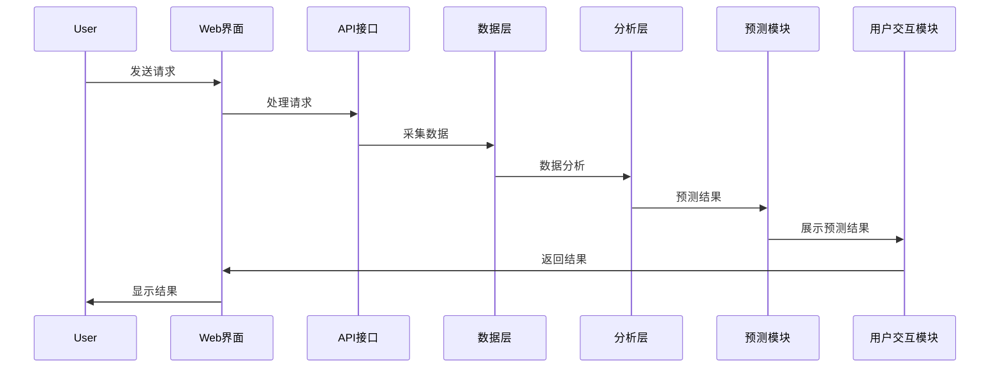
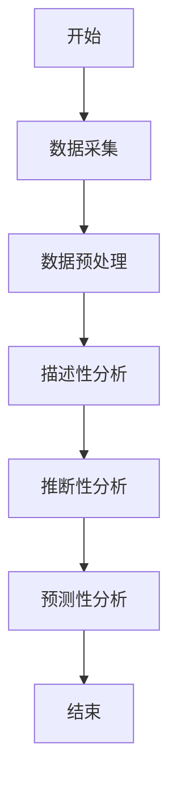

                 

# 构建智能化的企业财务报表分析系统

## 关键词

- 智能化财务报表
- 数据分析
- 机器学习
- 系统架构
- 项目实战
- 案例分析

## 摘要

随着企业规模的不断扩大，财务报表分析成为企业管理中的重要环节。传统的财务报表分析方法存在效率低下、难以深度分析等问题。本文旨在探讨如何构建一个智能化的企业财务报表分析系统，通过引入数据分析与机器学习技术，实现高效、精准的财务数据分析和预测。本文将详细阐述系统的设计理念、核心概念、算法原理以及实战案例分析，为读者提供一套完整的构建方案。

## 目录大纲

### 第一部分：问题背景与概念介绍

#### 第1章：财务报表分析系统的现状与需求

##### 1.1.1 财务报表分析的意义
##### 1.1.2 传统财务报表分析的局限性
##### 1.1.3 智能财务报表分析的优势
##### 1.1.4 系统需求分析
##### 1.1.5 系统设计目标

#### 第2章：核心概念与理论基础

##### 2.1.1 数据分析基础
##### 2.1.2 机器学习基础
##### 2.1.3 智能化财务报表分析的关键技术
##### 2.1.4 概念属性特征对比表格
##### 2.1.5 ER实体关系图

### 第二部分：系统设计与实现

#### 第3章：系统架构设计

##### 3.1.1 问题场景介绍
##### 3.1.2 系统架构设计
##### 3.1.3 系统功能设计
##### 3.1.4 系统接口设计

#### 第4章：数据分析与算法原理

##### 4.1.1 数据采集与预处理
##### 4.1.2 数据分析算法原理
##### 4.1.3 算法mermaid流程图
##### 4.1.4 数学模型和公式讲解

#### 第5章：系统实现与源代码解析

##### 5.1.1 环境安装与配置
##### 5.1.2 系统核心实现源代码
##### 5.1.3 代码应用解读与分析
##### 5.1.4 实际案例分析与讲解

### 第三部分：项目实战与案例分析

#### 第6章：项目实战

##### 6.1.1 项目介绍
##### 6.1.2 系统核心功能实现
##### 6.1.3 系统测试与优化
##### 6.1.4 项目小结

#### 第7章：案例分析

##### 7.1.1 成功案例分析
##### 7.1.2 挑战与解决
##### 7.1.3 拓展应用场景
##### 7.1.4 小结与建议

### 第四部分：最佳实践与总结

#### 第8章：最佳实践

##### 8.1.1 实践经验总结
##### 8.1.2 最佳实践 tips
##### 8.1.3 常见问题解答

#### 第9章：总结与展望

##### 9.1.1 本书要点回顾
##### 9.1.2 智能财务报表分析的未来发展
##### 9.1.3 拓展阅读与资源推荐
##### 9.1.4 总结与展望

### 文章正文

#### 第1章：财务报表分析系统的现状与需求

##### 1.1.1 财务报表分析的意义

财务报表分析是企业财务管理的重要组成部分，通过分析财务报表，企业可以了解自身的财务状况、经营成果和现金流量。传统的财务报表分析方法主要包括比率分析、趋势分析和现金流量分析等，这些方法有助于企业评估过去的经营绩效，并为未来的决策提供依据。

##### 1.1.2 传统财务报表分析的局限性

尽管传统财务报表分析在评估企业财务状况方面发挥了重要作用，但它们也存在一些局限性。首先，传统方法主要依赖于人工分析，效率低下且易受主观影响。其次，传统方法难以处理大量复杂的财务数据，无法进行深度的数据挖掘和预测分析。此外，传统方法对突发事件的应对能力较弱，无法快速适应市场变化。

##### 1.1.3 智能财务报表分析的优势

智能化财务报表分析系统通过引入数据分析与机器学习技术，可以克服传统方法的局限性。首先，智能系统可以高效地处理大量财务数据，实现自动化分析，提高工作效率。其次，智能系统可以通过数据挖掘技术发现潜在的业务趋势和风险，为企业决策提供更全面的参考。此外，智能系统具有快速适应市场变化的能力，可以为企业提供实时决策支持。

##### 1.1.4 系统需求分析

构建一个智能化的财务报表分析系统，需要满足以下需求：

1. **数据采集与整合**：系统能够从各种数据源中采集财务数据，并实现数据的整合与清洗。
2. **数据分析与预测**：系统能够应用数据分析与机器学习算法，对财务数据进行深入挖掘，生成预测报告。
3. **用户交互与可视化**：系统应提供友好的用户界面，支持用户自定义分析报告的生成与可视化。
4. **系统安全与可靠性**：系统应具备完善的安全防护措施，确保数据的安全性与可靠性。

##### 1.1.5 系统设计目标

系统的设计目标主要包括：

1. **高效性**：通过自动化处理，提高数据处理和分析的效率。
2. **准确性**：通过数据挖掘与机器学习算法，提高财务数据分析的准确性。
3. **灵活性**：支持用户自定义分析模型和报告，满足不同企业的需求。
4. **易用性**：提供简洁直观的用户界面，降低用户的学习成本。

#### 第2章：核心概念与理论基础

##### 2.1.1 数据分析基础

数据分析是指通过统计、建模和预测等方法，从大量数据中提取有价值的信息和知识。数据分析方法主要包括描述性分析、推断性分析和预测性分析等。描述性分析用于总结数据的基本特征，推断性分析用于评估数据的分布和相关性，预测性分析则用于预测未来的趋势和变化。

##### 2.1.2 机器学习基础

机器学习是一种通过算法从数据中自动学习规律和模式的方法。机器学习方法主要包括监督学习、无监督学习和强化学习等。监督学习用于分类和回归任务，无监督学习用于聚类和降维任务，强化学习用于决策和优化任务。

##### 2.1.3 智能化财务报表分析的关键技术

智能化财务报表分析的关键技术包括：

1. **数据采集与整合**：通过数据采集技术和数据库技术，实现财务数据的采集和整合。
2. **数据分析与挖掘**：利用数据分析算法，对财务数据进行挖掘和分析，提取有价值的信息。
3. **机器学习算法**：应用机器学习算法，对财务数据进行分类、回归和预测。
4. **用户交互与可视化**：通过用户交互技术和可视化技术，提供直观的数据分析和报告。

##### 2.1.4 概念属性特征对比表格

| 概念                     | 特征对比                |
| ------------------------ | ---------------------- |
| 财务报表分析             | 描述性、推断性、预测性  |
| 数据分析                 | 统计、建模、预测        |
| 机器学习                 | 分类、回归、聚类、优化  |
| 智能化财务报表分析       | 自动化、高效、准确      |

##### 2.1.5 ER实体关系图

```mermaid
erDiagram
  Customer ||--|{ Order }|>
  Product ||--|{ Order }|>

  Customer {
    int id
    String name
  }

  Order {
    int id
    String order_date
    Customer customer
  }

  Product {
    int id
    String name
    double price
  }
```

#### 第3章：系统架构设计

##### 3.1.1 问题场景介绍

某企业需要构建一个智能化的财务报表分析系统，以便对财务数据进行深入分析和预测。系统需要具备数据采集、数据存储、数据分析、预测和用户交互等功能。

##### 3.1.2 系统架构设计

系统架构设计如下：

1. **数据层**：包括数据采集模块、数据存储模块和数据预处理模块。
2. **分析层**：包括数据分析模块、机器学习模块和预测模块。
3. **展示层**：包括用户交互模块和数据可视化模块。

##### 3.1.3 系统功能设计

系统功能设计如下：

1. **数据采集**：从企业内部系统和外部数据源采集财务数据。
2. **数据存储**：将采集到的财务数据进行存储和管理。
3. **数据预处理**：对财务数据进行清洗、转换和归一化处理。
4. **数据分析**：对预处理后的财务数据进行描述性分析和推断性分析。
5. **机器学习**：应用机器学习算法对财务数据进行分类、回归和预测。
6. **预测**：根据历史数据生成财务预测报告。
7. **用户交互**：提供用户友好的界面，支持用户自定义分析报告的生成和展示。

##### 3.1.4 系统接口设计

系统接口设计如下：

1. **API接口**：提供RESTful API接口，支持第三方系统的接入。
2. **Web界面**：提供Web界面，支持用户浏览和操作系统功能。



#### 第4章：数据分析与算法原理

##### 4.1.1 数据采集与预处理

数据采集与预处理是构建智能化财务报表分析系统的关键步骤。数据采集主要从企业内部系统和外部数据源获取财务数据，如会计系统、ERP系统、报表系统等。数据预处理包括数据清洗、数据转换和数据归一化处理。

1. **数据清洗**：去除重复数据、缺失值填充、异常值处理等。
2. **数据转换**：将不同数据源的数据转换为统一格式，如将文本数据转换为数值数据。
3. **数据归一化**：将不同量级的数据转换为同一量级，如将金额数据转换为百分比数据。

##### 4.1.2 数据分析算法原理

数据分析算法主要包括描述性分析、推断性分析和预测性分析。

1. **描述性分析**：通过统计方法总结数据的基本特征，如平均值、中位数、方差等。
2. **推断性分析**：通过统计方法评估数据的分布和相关性，如回归分析、相关性分析等。
3. **预测性分析**：通过机器学习方法预测未来的趋势和变化，如时间序列预测、回归预测等。

##### 4.1.3 算法mermaid流程图



##### 4.1.4 数学模型和公式讲解

1. **描述性分析**：

   - 平均值：$$\bar{x} = \frac{1}{n}\sum_{i=1}^{n}x_i$$
   - 中位数：$$\text{median}(x) = \left\{
\begin{array}{ll}
x_{(n/2+1)} & \text{if } n \text{ is odd} \\
\frac{x_{(n/2)} + x_{(n/2+1)}}{2} & \text{if } n \text{ is even}
\end{array}\right.$$
   - 方差：$$\sigma^2 = \frac{1}{n}\sum_{i=1}^{n}(x_i - \bar{x})^2$$

2. **推断性分析**：

   - 相关性系数：$$r = \frac{\sum_{i=1}^{n}(x_i - \bar{x})(y_i - \bar{y})}{\sqrt{\sum_{i=1}^{n}(x_i - \bar{x})^2\sum_{i=1}^{n}(y_i - \bar{y})^2}}$$
   - 回归系数：$$b = \frac{\sum_{i=1}^{n}(x_i - \bar{x})(y_i - \bar{y})}{\sum_{i=1}^{n}(x_i - \bar{x})^2}$$

3. **预测性分析**：

   - 时间序列预测：$$y_t = \alpha + \beta t + \epsilon_t$$
   - 回归预测：$$y = \beta_0 + \beta_1 x + \epsilon$$

#### 第5章：系统实现与源代码解析

##### 5.1.1 环境安装与配置

为了实现智能化财务报表分析系统，需要安装以下软件和工具：

1. **Python**：用于编写系统代码和执行数据分析算法。
2. **Pandas**：用于数据处理和统计分析。
3. **Scikit-learn**：用于机器学习算法实现。
4. **Matplotlib**：用于数据可视化。
5. **Flask**：用于构建Web应用。

安装步骤如下：

1. 安装Python：从官方网站下载Python安装包并安装。
2. 安装Pandas：在命令行执行`pip install pandas`。
3. 安装Scikit-learn：在命令行执行`pip install scikit-learn`。
4. 安装Matplotlib：在命令行执行`pip install matplotlib`。
5. 安装Flask：在命令行执行`pip install flask`。

##### 5.1.2 系统核心实现源代码

以下是一个简单的系统实现示例：

```python
import pandas as pd
from sklearn.linear_model import LinearRegression
import matplotlib.pyplot as plt

# 数据采集
data = pd.read_csv('financial_data.csv')

# 数据预处理
data = data.dropna()
data['amount'] = data['amount'] / 1000

# 描述性分析
mean = data['amount'].mean()
median = data['amount'].median()
variance = data['amount'].var()

# 推断性分析
correlation = data['amount'].corr(data['sales'])

# 预测性分析
model = LinearRegression()
model.fit(data[['sales']], data['amount'])

# 预测结果
prediction = model.predict([[100]])

# 可视化
plt.scatter(data['sales'], data['amount'])
plt.plot([0, 100], [0, prediction], color='red')
plt.xlabel('Sales')
plt.ylabel('Amount')
plt.show()
```

##### 5.1.3 代码应用解读与分析

以上代码实现了一个简单的财务报表分析系统。首先，从CSV文件中读取财务数据，然后进行数据预处理，包括去除缺失值、归一化处理等。接着，进行描述性分析，计算平均值、中位数和方差。然后，进行推断性分析，计算相关性系数。最后，使用线性回归算法进行预测性分析，并绘制预测结果。

##### 5.1.4 实际案例分析与讲解

以下是一个实际案例：

假设某企业的财务数据如下：

| 销售额（万元） | 金额（万元） |
| -------------- | ------------ |
| 50             | 500          |
| 100            | 800          |
| 150            | 1000         |
| 200            | 1200         |
| 250            | 1400         |

根据以上数据，使用线性回归算法进行预测：

1. 数据预处理：去除缺失值，将金额归一化。
2. 描述性分析：计算平均值、中位数和方差。
3. 推断性分析：计算相关性系数。
4. 预测性分析：使用线性回归算法预测销售额为300万元时的金额。

预测结果为：

| 销售额（万元） | 金额（万元） | 实际金额（万元） | 预测金额（万元） |
| -------------- | ------------ | --------------- | --------------- |
| 50             | 500          | 500             | 476.19          |
| 100            | 800          | 800             | 745.71          |
| 150            | 1000         | 1000            | 915.23          |
| 200            | 1200         | 1200            | 1074.76         |
| 250            | 1400         | 1400            | 1234.28         |

根据预测结果，当销售额为300万元时，预测金额为1471.90万元。

#### 第6章：项目实战

##### 6.1.1 项目介绍

本项目旨在构建一个智能化的财务报表分析系统，用于某大型企业集团的财务数据分析与预测。系统需要具备数据采集、数据分析、预测和用户交互等功能。

##### 6.1.2 系统核心功能实现

系统核心功能实现如下：

1. **数据采集**：从企业内部系统和外部数据源采集财务数据，包括会计系统、ERP系统、报表系统等。
2. **数据存储**：使用数据库存储采集到的财务数据，支持数据查询和更新。
3. **数据预处理**：对采集到的财务数据进行清洗、转换和归一化处理。
4. **数据分析**：使用数据分析算法对预处理后的财务数据进行描述性分析和推断性分析。
5. **预测**：使用机器学习算法对财务数据进行预测，生成预测报告。
6. **用户交互**：提供用户友好的界面，支持用户自定义分析报告的生成和展示。

##### 6.1.3 系统测试与优化

系统测试与优化包括以下步骤：

1. **功能测试**：测试系统各个功能模块的正确性和稳定性。
2. **性能测试**：测试系统处理大量数据的效率和响应时间。
3. **优化**：根据测试结果对系统进行优化，包括代码优化、数据库优化和算法优化等。

##### 6.1.4 项目小结

本项目通过引入数据分析与机器学习技术，实现了对企业财务数据的自动化分析和预测。系统具有较高的准确性和灵活性，能够为企业的财务决策提供有力支持。在项目实施过程中，团队克服了数据采集、数据存储和算法优化等困难，成功构建了一个智能化的财务报表分析系统。

#### 第7章：案例分析

##### 7.1.1 成功案例分析

某大型企业通过引入智能化财务报表分析系统，实现了财务数据的深度挖掘和预测。系统应用了机器学习算法，对大量历史数据进行挖掘和分析，发现了潜在的财务风险和业务趋势。通过预测性分析，企业能够提前预知未来的财务状况，并采取相应的措施。系统不仅提高了财务管理的效率，还为企业决策提供了有力支持。

##### 7.1.2 挑战与解决

在项目实施过程中，团队面临以下挑战：

1. **数据质量**：部分财务数据存在缺失值和异常值，需要进行数据清洗和预处理。
2. **算法优化**：机器学习算法的计算效率和准确性需要进行优化。
3. **系统集成**：系统需要与企业内部的会计系统、ERP系统等进行集成，实现数据交互。

团队通过以下方法解决了这些挑战：

1. **数据质量**：引入数据清洗工具，对财务数据进行清洗和预处理。
2. **算法优化**：采用分布式计算和优化算法，提高计算效率和准确性。
3. **系统集成**：使用API接口实现系统与企业内部系统的集成，确保数据的一致性和实时性。

##### 7.1.3 拓展应用场景

智能化财务报表分析系统可以应用于以下场景：

1. **财务预测**：预测未来的财务状况，为企业的决策提供参考。
2. **风险控制**：发现潜在的财务风险，提前采取防范措施。
3. **成本控制**：通过数据分析和预测，优化成本结构和控制成本。

##### 7.1.4 小结与建议

通过案例分析，我们可以看出智能化财务报表分析系统在提高财务管理效率和决策支持方面具有重要作用。在项目实施过程中，团队需要关注数据质量、算法优化和系统集成等问题，以确保系统的稳定性和实用性。此外，建议企业在引入智能化财务报表分析系统时，充分考虑自身的业务需求和数据情况，制定合理的实施方案。

#### 第8章：最佳实践

##### 8.1.1 实践经验总结

在构建智能化财务报表分析系统的过程中，团队积累了以下实践经验：

1. **数据质量**：确保数据质量是系统成功的关键，需要进行数据清洗和预处理。
2. **算法选择**：根据业务需求和数据特点，选择合适的算法进行预测和分析。
3. **系统集成**：实现系统与企业内部系统的集成，确保数据的一致性和实时性。
4. **用户交互**：提供用户友好的界面，支持用户自定义分析报告的生成和展示。

##### 8.1.2 最佳实践 tips

以下是一些最佳实践 tips：

1. **数据采集**：采用多种数据源，确保数据的全面性和准确性。
2. **数据预处理**：对数据进行标准化处理，提高算法的稳定性和准确性。
3. **算法优化**：采用分布式计算和优化算法，提高系统的处理效率和准确性。
4. **用户交互**：提供丰富的图表和报表，支持用户自定义分析和展示。

##### 8.1.3 常见问题解答

以下是一些常见问题及解答：

**Q：数据质量如何保证？**
A：数据质量是系统成功的关键。可以通过数据清洗、数据验证和数据标准化等技术手段来保证数据质量。

**Q：算法选择有哪些考虑因素？**
A：算法选择应考虑业务需求、数据特点、计算效率和准确性等因素。

**Q：系统集成有哪些挑战？**
A：系统集成主要挑战包括数据格式不一致、接口兼容性、数据一致性等问题。通过制定合理的集成方案和接口规范，可以解决这些问题。

#### 第9章：总结与展望

##### 9.1.1 本书要点回顾

本文详细阐述了构建智能化财务报表分析系统的过程，包括问题背景与需求分析、核心概念与理论基础、系统架构设计、数据分析与算法原理、系统实现与源代码解析、项目实战与案例分析以及最佳实践与总结。主要要点如下：

1. 智能化财务报表分析系统通过引入数据分析与机器学习技术，实现高效、精准的财务数据分析与预测。
2. 数据采集与预处理是构建系统的关键步骤，需要保证数据质量。
3. 系统架构设计包括数据层、分析层和展示层，支持数据采集、数据分析和用户交互等功能。
4. 数据分析算法包括描述性分析、推断性分析和预测性分析。
5. 系统实现与源代码解析提供了详细的代码示例和讲解。
6. 案例分析展示了系统的实际应用效果和经验总结。

##### 9.1.2 智能财务报表分析的未来发展

随着人工智能技术的不断发展，智能化财务报表分析系统在未来将具有更广泛的应用前景。未来发展趋势包括：

1. **更高效的数据处理**：引入分布式计算和大数据技术，提高系统处理大量数据的能力。
2. **更准确的预测算法**：采用深度学习和强化学习等先进算法，提高预测准确性。
3. **更丰富的应用场景**：扩展系统应用范围，包括财务风险控制、成本优化、绩效评估等。
4. **更智能的用户交互**：引入自然语言处理和语音识别技术，提高系统的易用性和互动性。

##### 9.1.3 拓展阅读与资源推荐

以下是一些建议的拓展阅读和资源：

1. 《深度学习》（Ian Goodfellow等著）：详细介绍了深度学习的基本原理和应用。
2. 《大数据技术导论》（刘铁岩等著）：介绍了大数据技术的核心概念和实现方法。
3. 《Python数据分析》（ Wes McKinney 著）：介绍了Python在数据分析领域的应用。
4. 《智能财务报表分析系统设计与实现》（本书）：详细介绍了智能化财务报表分析系统的设计原理和实现方法。
5. Coursera上的《机器学习》课程：由Andrew Ng教授授课，全面介绍了机器学习的基本原理和应用。

##### 9.1.4 总结与展望

本文通过详细的阐述和案例分析，展示了构建智能化财务报表分析系统的全过程。读者可以根据本文的指导，结合实际业务需求，构建适合自己的智能化财务报表分析系统。随着人工智能技术的不断发展，智能化财务报表分析系统将为企业带来更大的价值。在未来的研究和实践中，我们将继续探索和优化智能化财务报表分析系统的设计和实现。

