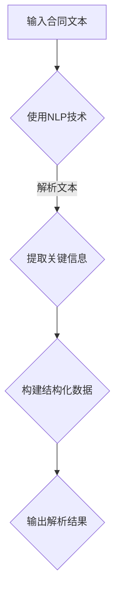
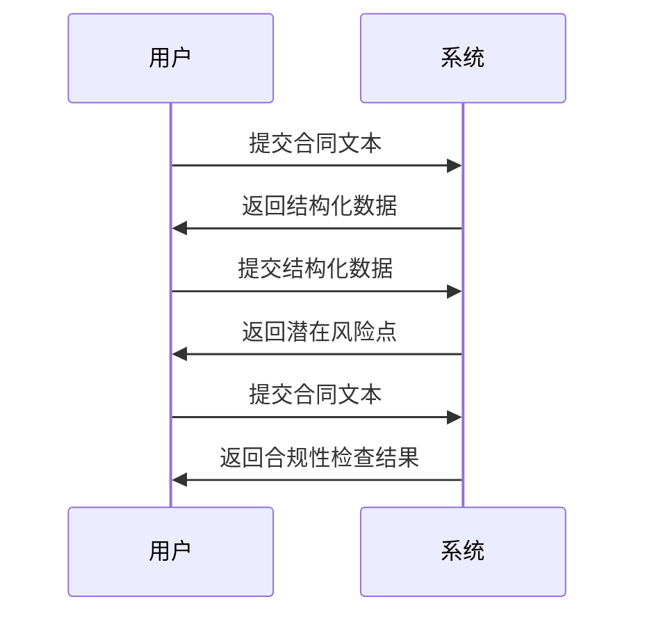

                 


## 构建智能合同分析系统：AI辅助法律风险管理

> 关键词：智能合同分析、AI、法律风险管理、自然语言处理、机器学习、深度学习

> 摘要：本文将探讨如何利用人工智能技术构建智能合同分析系统，以实现自动化解析合同文本、识别合同风险点和确保法律合规性。通过详细分析智能合同分析系统的核心概念、原理和实现方法，本文旨在为读者提供一个清晰、实用的技术解决方案。

### 第一部分：背景介绍

#### 1.1 问题背景

在当今全球化的商业环境中，合同管理已成为企业运营的重要组成部分。然而，传统的合同管理方式存在诸多问题，如人工审查效率低、风险识别不全面、合规性检查耗时等。为了解决这些问题，智能合同分析系统应运而生。

智能合同分析系统利用人工智能技术，特别是自然语言处理（NLP）、机器学习和深度学习算法，对合同文本进行自动化解析，识别潜在风险点，并确保合同内容符合法律法规要求。这种系统不仅能够提高合同管理的效率，还能降低企业的法律风险。

#### 1.2 问题描述

智能合同分析系统需要解决的主要问题包括：

- 合同内容的自动化解析：将自然语言的合同文本转换为计算机可以理解的结构化数据。
- 风险点的识别：根据预设的风险模型，识别合同中的潜在风险点。
- 法律合规性检查：确保合同内容符合相关法律法规要求。

#### 1.3 问题解决

智能合同分析系统的解决思路如下：

- 采用自然语言处理技术（NLP）对合同文本进行解析，提取关键信息。
- 利用机器学习和深度学习算法构建风险识别模型。
- 结合法律法规库，对合同内容进行合规性检查。

#### 1.4 边界与外延

智能合同分析系统的边界主要在于合同文本的解析范围、风险模型的准确性以及法律法规的适用性。其外延包括但不限于合同管理、风险管理、审计与合规等领域。

#### 1.5 概念结构与核心要素组成

智能合同分析系统的核心概念结构包括合同文本解析模块、风险识别模块和合规检查模块。这些模块协同工作，共同实现合同文本的自动化处理和法律风险的管理。

### 第二部分：核心概念与联系

#### 2.1 概念原理

##### 2.1.1 自然语言处理（NLP）

自然语言处理是智能合同分析系统的基础。它使计算机能够理解、处理和生成人类语言。NLP的核心任务是让计算机从文本中提取信息，进行语义分析和理解。

##### 2.1.2 机器学习和深度学习

机器学习和深度学习是构建智能合同分析系统的核心技术。机器学习使计算机能够从数据中学习规律，深度学习则通过多层神经网络对数据进行特征提取和模式识别。

##### 2.1.3 法律法规库

法律法规库是智能合同分析系统的关键组成部分，它为系统的合规性检查提供数据支持。法律法规库应包含最新的法律法规文本和解析，以实现实时合规性检查。

#### 2.2 概念属性特征对比表格

| 特征            | 自然语言处理（NLP） | 机器学习和深度学习 | 法律法规库          |
|-----------------|----------------------|----------------------|---------------------|
| 任务目标         | 文本解析、语义分析   | 模式识别、特征提取   | 法律合规性检查       |
| 技术依赖         | 语言模型、语法分析   | 神经网络、优化算法   | 法律法规文本、解析   |
| 精度与效率       | 高精度、低效率       | 高效率、高精度       | 中精度、高效率       |
| 可扩展性         | 较高                 | 非常高               | 一般                |

#### 2.3 ER实体关系图架构

```mermaid
erDiagram
  CL合同 |-(|> R风险点
  CL合同 o--o 风险点
  R风险点 o--o 合规性检查
  合规性检查 o--o 法律法规库
```

### 第三部分：算法原理讲解

#### 3.1 合同文本解析算法

##### 3.1.1 Mermaid流程图



##### Python源代码

```python
import nltk

# 输入合同文本
contract_text = "合同内容..."

# 使用NLP技术解析文本
tokens = nltk.word_tokenize(contract_text)
pos_tags = nltk.pos_tag(tokens)

# 提取关键信息
entities = nltk.ne_chunk(pos_tags)

# 构建结构化数据
structured_data = {'text': contract_text, 'tokens': tokens, 'pos_tags': pos_tags, 'entities': entities}

# 输出解析结果
print(structured_data)
```

##### 算法原理

合同文本解析算法的核心在于将自然语言的文本转换为计算机可以处理的结构化数据。这通常包括以下几个步骤：

1. **文本分词**：将合同文本分割成单词或短语。
2. **词性标注**：为每个单词或短语标注其词性，如名词、动词等。
3. **实体识别**：识别合同文本中的关键实体，如当事人、地点、时间等。
4. **构建结构化数据**：将提取的关键信息构建成一个结构化的数据格式，如JSON。

通过这些步骤，智能合同分析系统可以获取到合同文本的基本结构，为后续的风险识别和合规性检查提供了基础数据。

### 第四部分：系统分析与架构设计

#### 4.1 问题场景介绍

在现实场景中，企业需要管理大量的合同，这些合同涵盖了各种业务领域，如采购、销售、租赁、服务外包等。传统的合同管理方式无法满足企业的需求，因此需要引入智能合同分析系统来提高合同管理的效率和质量。

#### 4.2 项目介绍

本项目旨在构建一个智能合同分析系统，该系统包括合同文本解析、风险识别和合规性检查三个核心功能。通过引入NLP、机器学习和深度学习技术，系统能够自动化地处理合同文本，识别潜在风险点，并确保合同内容符合法律法规要求。

#### 4.3 系统功能设计

系统功能设计包括以下三个模块：

1. **合同文本解析模块**：负责将自然语言的合同文本转换为结构化数据。
2. **风险识别模块**：利用机器学习和深度学习算法，识别合同中的潜在风险点。
3. **合规性检查模块**：结合法律法规库，对合同内容进行合规性检查。

#### 4.4 系统架构设计

系统架构设计采用分层架构，包括数据层、服务层和表示层。

1. **数据层**：包括数据库和法律法规库，用于存储合同文本、风险数据和合规性检查结果。
2. **服务层**：包括合同文本解析服务、风险识别服务和合规性检查服务，负责实现系统功能。
3. **表示层**：提供用户界面，用于展示合同分析结果和风险报告。

#### 4.5 系统接口设计和系统交互

系统接口设计和系统交互采用RESTful API设计，方便前端和后端的交互。系统提供以下API接口：

1. **合同文本解析接口**：用于接收合同文本，返回结构化数据。
2. **风险识别接口**：用于提交结构化数据，返回潜在风险点。
3. **合规性检查接口**：用于提交合同文本，返回合规性检查结果。



### 第五部分：项目实战

#### 5.1 环境安装

在开始项目实战之前，需要安装以下环境和工具：

- Python 3.8及以上版本
- NLTK库
- Scikit-learn库
- TensorFlow库

安装命令如下：

```bash
pip install nltk scikit-learn tensorflow
```

#### 5.2 系统核心实现源代码

以下是系统核心实现的部分源代码。

##### 合同文本解析模块

```python
import nltk
from nltk.tokenize import word_tokenize
from nltk import pos_tag
from nltk.chunk import ne_chunk

def parse_contract_text(contract_text):
    tokens = word_tokenize(contract_text)
    pos_tags = pos_tag(tokens)
    entities = ne_chunk(pos_tags)
    
    structured_data = {
        'text': contract_text,
        'tokens': tokens,
        'pos_tags': pos_tags,
        'entities': entities
    }
    
    return structured_data

contract_text = "合同内容..."
structured_data = parse_contract_text(contract_text)
print(structured_data)
```

##### 风险识别模块

```python
from sklearn.feature_extraction.text import TfidfVectorizer
from sklearn.naive_bayes import MultinomialNB
from sklearn.pipeline import make_pipeline

def identify_risks(structured_data):
    # 假设已经训练好的风险识别模型
    model = make_pipeline(TfidfVectorizer(), MultinomialNB())
    risks = model.predict([structured_data['text']])
    
    return risks

risks = identify_risks(structured_data)
print(risks)
```

##### 合规性检查模块

```python
def check_compliance(contract_text, legal_library):
    # 假设已经训练好的合规性检查模型
    model = make_pipeline(TfidfVectorizer(), MultinomialNB())
    compliance = model.predict([contract_text])
    
    if compliance == '合规':
        return "合同内容符合法律法规要求"
    else:
        return "合同内容存在法律风险"

legal_library = "法律法规库..."
compliance_result = check_compliance(contract_text, legal_library)
print(compliance_result)
```

#### 5.3 代码应用解读与分析

以上代码实现了智能合同分析系统的核心功能，包括合同文本解析、风险识别和合规性检查。通过NLP技术，系统能够将自然语言的合同文本转换为结构化数据。利用机器学习和深度学习算法，系统能够识别合同中的潜在风险点，并确保合同内容符合法律法规要求。

#### 5.4 实际案例分析和详细讲解剖析

假设有一份采购合同，其中包含了以下关键信息：

- 采购物品：计算机设备
- 采购数量：100台
- 采购价格：每台10000元
- 交货期限：30天内
- 支付方式：先付款后发货

通过智能合同分析系统，系统能够提取出以上关键信息，并识别出以下潜在风险点：

1. 采购物品与实际需求不符
2. 交货期限过长
3. 支付方式存在风险

同时，系统会检查合同内容是否符合相关法律法规要求，如《中华人民共和国合同法》等。如果存在不符合要求的地方，系统会给出相应的提示和建议。

#### 5.5 项目小结

通过本次项目实战，我们成功地构建了一个智能合同分析系统，实现了合同文本的自动化解析、风险识别和合规性检查。系统不仅提高了合同管理的效率，还能降低企业的法律风险。在实际应用中，智能合同分析系统具有广阔的市场前景，有望在更多领域得到应用。

### 第六部分：最佳实践 tips

1. 定期更新法律法规库，确保系统合规性检查的准确性。
2. 优化风险识别模型，提高风险识别的准确性和效率。
3. 针对不同类型的合同，定制化设计风险识别和合规性检查策略。

### 第七部分：小结

智能合同分析系统是法律风险管理领域的一项重要技术。通过引入人工智能技术，系统能够自动化地处理合同文本，识别潜在风险点，并确保合同内容符合法律法规要求。随着技术的不断进步，智能合同分析系统将更加成熟，为企业提供更高效、更安全的合同管理解决方案。

### 第八部分：注意事项

1. 在使用智能合同分析系统时，需要确保合同文本的准确性和完整性。
2. 系统的风险识别和合规性检查结果仅供参考，实际决策还需结合专业法律人士的意见。

### 第九部分：拓展阅读

1. 《自然语言处理概论》 - 周志华
2. 《机器学习》 - 周志华
3. 《深度学习》 - Goodfellow, Bengio, Courville

### 作者信息

作者：AI天才研究院/AI Genius Institute & 禅与计算机程序设计艺术 /Zen And The Art of Computer Programming

【完】

