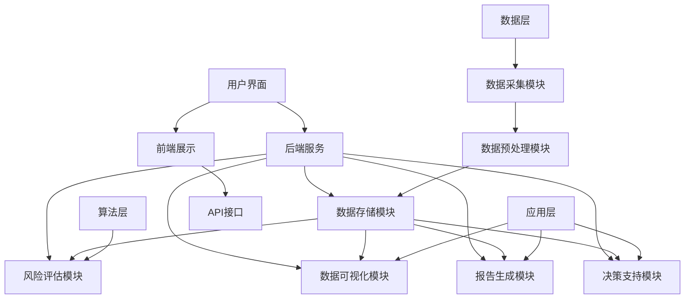
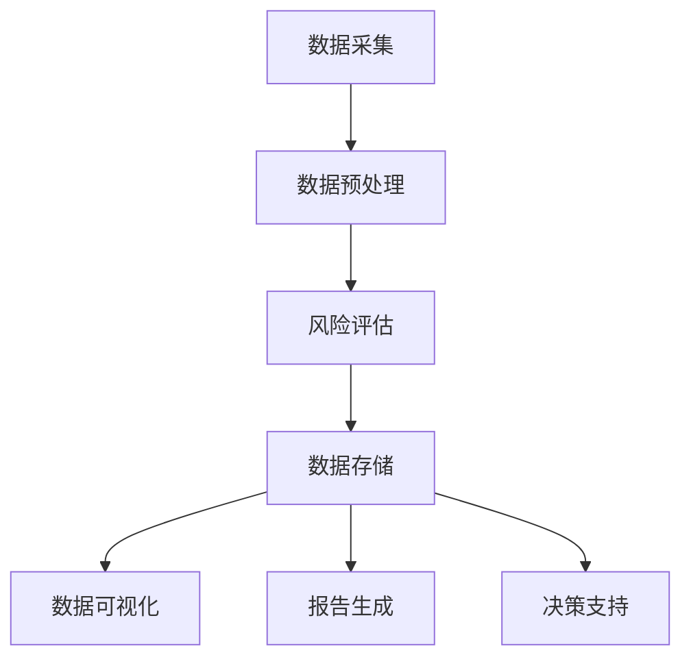

                 

## 《构建精准的投资风险评估模型》

> 关键词：投资风险评估、VaR模型、CVaR模型、系统架构设计、项目实战

在当今金融科技日新月异的发展背景下，投资风险评估作为金融风险管理的关键环节，其精确性和有效性越来越受到重视。无论是金融机构、企业投资者还是个人投资者，都需要依赖科学、精准的风险评估模型来指导投资决策，降低潜在损失，实现资产的稳健增长。因此，《构建精准的投资风险评估模型》旨在通过系统的理论分析和实战指导，帮助读者掌握构建高效投资风险评估模型的核心方法和实践技巧。

本文将分为四个主要部分展开：

1. **背景与基础**：介绍投资风险评估的基本概念、重要性及现状，为后续章节提供理论基础。
2. **算法原理讲解**：详细讲解风险价值（VaR）模型和条件价值（CVaR）模型，深入探讨其原理、计算方法和应用场景。
3. **系统设计与实现**：介绍投资风险评估系统的整体设计思路、架构方案及功能模块设计，并利用具体的案例进行实战分析。
4. **实践与拓展**：总结最佳实践经验，指出常见的注意事项，并推荐相关拓展阅读，帮助读者进一步深入学习和应用。

通过本文的阅读，读者将能够系统地了解投资风险评估的理论知识，掌握构建和优化风险评估模型的方法，以及实际应用这些模型进行投资决策的技巧。让我们一步步深入探讨，开启构建精准投资风险评估模型的旅程。

----------------------------------------------------------------

## 背景与基础

### 1.1 投资风险评估的重要性

投资风险评估是金融领域中不可或缺的一环，其主要目的是通过系统的方法评估投资活动的潜在风险，以便投资者能够做出更加明智的决策。在现代金融体系中，投资风险评估不仅关乎个人投资者的资产安全，也直接影响金融机构的运营稳健性和市场稳定性。

首先，对于个人投资者而言，风险评估能够帮助他们更好地理解投资组合的风险特性，从而做出更加合理的资产配置决策。通过评估不同资产的风险收益特征，投资者可以根据自身的风险承受能力和投资目标，选择合适的投资策略，降低不必要的风险暴露，实现资产的稳健增长。

其次，对金融机构而言，投资风险评估是风险管理的重要组成部分。金融机构需要通过风险评估来监控和管理其投资组合的潜在风险，确保在市场波动中能够保持财务稳健。此外，金融机构的风险评估报告还用于满足监管要求，向监管机构和投资者披露其风险状况，增强市场透明度和信任度。

### 1.2 投资风险评估的现状与挑战

当前，投资风险评估已经形成了一套较为成熟的理论和方法体系，包括传统的统计模型和现代的数值模型。传统模型如均值方差模型、历史模拟法等主要依赖于历史数据和统计方法，而现代模型如风险价值（VaR）模型、条件价值（CVaR）模型等则更加注重风险的量化和管理。

然而，随着金融市场环境的不断变化和复杂化，投资风险评估也面临着一系列新的挑战：

1. **数据质量与可用性**：有效的风险评估依赖于高质量的数据支持。然而，金融市场中数据的不完整、不准确和滞后性常常对风险评估模型的准确性和可靠性构成挑战。
2. **模型适用性**：不同模型在不同市场环境下表现各异，如何选择合适的模型，并确保其在特定市场条件下的适用性，是投资风险评估中的一个难点。
3. **模型复杂性**：现代风险评估模型往往涉及复杂的数学和统计方法，如何简化和优化这些模型，使其更易于理解和应用，也是投资者和金融机构需要面对的问题。

### 1.3 投资风险评估的基本概念

为了更好地理解和应用投资风险评估模型，我们需要明确几个关键概念：

1. **风险**：风险是指投资活动中可能面临的不确定性，包括市场风险、信用风险、流动性风险等。
2. **风险评估**：风险评估是通过系统的方法评估投资活动的潜在风险，包括定量和定性分析。
3. **风险价值（VaR）**：风险价值是指在给定置信水平和特定的时间区间内，投资组合可能遭受的最大潜在损失。
4. **条件价值（CVaR）**：条件价值是在给定置信水平下，投资组合的潜在损失平均值，它补充了VaR模型的不足，能够提供更全面的风险衡量。

通过上述背景介绍，我们可以看到投资风险评估在金融领域的重要性以及其面临的挑战。接下来，我们将进一步探讨不同类型的投资风险评估模型，以期为读者提供更加全面的理论基础。

### 1.4 投资风险评估模型类型

投资风险评估模型主要分为传统模型和现代模型两大类。传统模型主要依赖于历史数据和统计分析，而现代模型则更多地利用数学和数值方法。以下是几种常见的风险评估模型：

#### 1.4.1 均值方差模型

均值方差模型是传统风险评估模型中最基本的一种，它基于资产收益率的期望值（均值）和方差来评估风险。具体来说，该模型通过计算资产收益率的方差或标准差，衡量其波动性，从而判断其风险水平。然而，均值方差模型的主要局限性在于它只考虑了收益率的波动性，忽略了收益率的分布特征。

#### 1.4.2 历史模拟法

历史模拟法通过模拟历史市场数据来评估投资组合的风险。具体来说，它首先将历史市场数据划分为多个时间段，然后计算每个时间段的收益率，再将这些收益率按时间顺序排列，形成收益率序列。最后，通过计算该序列的分位数，如VaR和CVaR，来评估投资组合的风险。历史模拟法的优点在于它能够捕捉市场波动性和依赖性，但其缺点是它依赖于历史数据的准确性和代表性。

#### 1.4.3 风险价值（VaR）模型

风险价值（Value at Risk，VaR）模型是现代风险评估模型中最常用的一种，它通过计算投资组合在特定置信水平下的最大潜在损失来评估风险。VaR模型的优点在于其简单直观，能够量化风险，从而为投资决策提供参考。常见的VaR模型包括正态分布模型、非参数模型和蒙特卡罗模拟模型等。

#### 1.4.4 条件价值（CVaR）模型

条件价值（Conditional Value at Risk，CVaR）模型是在VaR模型的基础上进一步发展的，它不仅考虑了最大潜在损失，还考虑了在极端情况下的平均损失。CVaR模型的优点在于它能够提供更全面的风险衡量，但其计算复杂度相对较高。

#### 1.4.5 系统性风险模型

系统性风险模型主要关注金融市场整体风险，如金融市场波动、信用风险传染等。这类模型通常采用宏观经济学方法，通过分析经济指标和市场数据来预测系统性风险。常见的系统性风险模型包括金融加速器模型、网络模型和机器学习模型等。

通过上述分析，我们可以看到不同类型的风险评估模型各有优缺点，投资者和金融机构需要根据具体需求和市场环境选择合适的模型，以实现精准的风险评估。

### 1.5 投资风险评估的基本概念与联系

在深入探讨投资风险评估模型之前，我们需要明确几个核心概念及其相互联系。以下是对投资风险评估中关键概念的详细解释和它们之间的关系分析：

#### 1.5.1 风险与不确定性的区别

风险与不确定性是两个经常被混淆但有所不同的概念。**风险**是指已知事件及其可能结果的概率分布，这意味着投资者可以估计事件发生的概率及其潜在后果。例如，在股票市场中，投资者可以通过历史数据和市场分析来预测某一股票在未来某个时间点的价格波动。而**不确定性**则是指未知的事件及其可能的后果，即投资者无法准确估计事件发生的概率或结果。例如，在面临全球经济波动时，投资者很难预测其对特定市场的具体影响。

**联系**：风险是不确定性的一种特殊形式，即那些可以量化和预测的不确定性。风险评估的过程就是将不确定性转化为风险，从而为投资决策提供依据。

#### 1.5.2 风险与收益的关系

在投资活动中，风险与收益是相互关联的。通常情况下，高收益往往伴随着高风险。这是因为追求高收益的投资者需要承担更大的波动性，而低风险的资产通常提供较低的预期收益。

**关系**：高收益通常意味着更高的风险，而低风险资产则通常提供较低但稳定的收益。因此，投资者需要在风险与收益之间做出权衡，选择与其风险承受能力和投资目标相匹配的投资策略。

#### 1.5.3 风险价值（VaR）与条件价值（CVaR）

**VaR**（Value at Risk）和**CVaR**（Conditional Value at Risk）是两种广泛使用的风险评估指标。VaR是指在特定置信水平和时间区间内，投资组合可能遭受的最大潜在损失。而CVaR则是在VaR的基础上进一步考虑了在极端情况下损失的平均值。

**联系**：VaR是一个单点估计值，它能够提供对潜在损失的最高限度的预测。CVaR则提供了更全面的风险衡量，因为它不仅考虑了最大潜在损失，还考虑了极端情况下的平均损失。CVaR通常被视为VaR的补充，能够帮助投资者更好地理解风险的深度。

**区别**：VaR是一个确定性的数值，而CVaR是一个概率分布，它能够提供关于损失分布的信息。VaR适用于需要简单风险度量的场景，而CVaR则适用于需要更全面风险评估的场景。

通过理解这些核心概念及其相互联系，投资者可以更好地理解投资风险评估的基础，为构建和优化风险评估模型提供理论基础。接下来，我们将深入探讨风险价值（VaR）模型和条件价值（CVaR）模型的原理、计算方法和应用场景。

### 2.1 传统风险评估模型

传统风险评估模型主要包括均值方差模型和历史模拟法，这些方法在金融风险管理中有着悠久的历史和广泛的应用。下面，我们将详细讲解这两种模型的原理和具体应用。

#### 2.1.1 均值方差模型

均值方差模型（Mean-Variance Model）是投资组合理论（Portfolio Theory）的基础，由哈里·马科维茨（Harry Markowitz）在1950年代提出。该模型通过计算资产组合的期望收益和方差，来评估组合的风险和收益。

**原理**：
- **期望收益**：期望收益是资产组合未来收益的平均值，通常用均值表示。均值可以根据历史数据计算得出，也可以根据预测模型估计。
- **方差**：方差衡量资产组合收益的波动性，即收益偏离均值的程度。方差越大，表示资产组合的波动性越高，风险越大。

**计算方法**：
- **单资产期望收益和方差**：通过历史收益率数据计算单个资产的期望收益和方差。具体公式如下：
  \[
  \mu_i = \frac{1}{n}\sum_{t=1}^{n} r_{it}
  \]
  \[
  \sigma_i^2 = \frac{1}{n-1}\sum_{t=1}^{n} (r_{it} - \mu_i)^2
  \]
  其中，\( \mu_i \) 是第 \(i\) 个资产的期望收益，\( \sigma_i^2 \) 是第 \(i\) 个资产的方差，\( r_{it} \) 是第 \(t\) 时期的收益率，\( n \) 是数据点的数量。
- **资产组合的期望收益和方差**：通过资产权重和各资产的期望收益和方差计算资产组合的期望收益和方差。具体公式如下：
  \[
  \mu_P = \sum_{i=1}^{n} w_i \mu_i
  \]
  \[
  \sigma_P^2 = \sum_{i=1}^{n} w_i^2 \sigma_i^2 + 2\sum_{i=1}^{n} \sum_{j=i+1}^{n} w_i w_j \rho_{ij}
  \]
  其中，\( \mu_P \) 是资产组合的期望收益，\( \sigma_P^2 \) 是资产组合的方差，\( w_i \) 是第 \(i\) 个资产在组合中的权重，\( \rho_{ij} \) 是第 \(i\) 个资产和第 \(j\) 个资产之间的相关系数。

**应用**：
- **资产配置**：投资者可以通过均值方差模型找到最优的资产配置，使组合的期望收益最大，同时控制风险。
- **风险管理**：企业可以通过该模型监控投资组合的波动性，及时调整资产配置，降低风险。

#### 2.1.2 历史模拟法

历史模拟法（Historical Simulation Method）是一种基于历史市场数据的风险评估方法，它通过模拟历史市场表现来估计未来风险。

**原理**：
- **历史数据**：历史模拟法依赖于大量的历史市场数据，包括股票价格、利率、汇率等。这些数据反映了市场的波动性和相关性。
- **模拟**：历史模拟法首先将历史数据分为多个时间窗口，然后根据时间窗口计算每个窗口的收益率。接着，将这些收益率按时间顺序排列，形成收益率序列。最后，通过分析该序列的统计特征（如分位数），计算VaR和CVaR。

**计算方法**：
- **收益率计算**：对于每个时间窗口，计算收益率。收益率可以通过价格变化计算得出，公式如下：
  \[
  R_t = \frac{P_{t+1} - P_t}{P_t}
  \]
  其中，\( R_t \) 是第 \(t\) 时期的收益率，\( P_{t+1} \) 是第 \(t+1\) 时期的资产价格，\( P_t \) 是第 \(t\) 时期的资产价格。
- **收益率序列**：将所有时间窗口的收益率按时间顺序排列，形成收益率序列。
- **VaR和CVaR计算**：通过计算收益率序列的分位数来估计VaR和CVaR。具体公式如下：
  \[
  \text{VaR}_{\alpha} = \alpha \text{分位数}
  \]
  \[
  \text{CVaR}_{\alpha} = \frac{1}{N - \alpha} \sum_{i=\alpha}^{N} \text{第 } i \text{ 个收益率}
  \]
  其中，\( \alpha \) 是置信水平，\( N \) 是序列中的数据点数量。

**应用**：
- **市场风险监控**：金融机构可以使用历史模拟法监控市场风险，确保投资组合的潜在损失在可接受范围内。
- **投资决策支持**：通过模拟不同市场环境下的表现，投资者可以评估投资策略的有效性，做出更明智的决策。

通过以上讲解，我们可以看到传统风险评估模型的原理和计算方法。接下来，我们将进一步探讨现代风险评估模型，特别是风险价值（VaR）模型和条件价值（CVaR）模型。

### 2.2 现代风险评估模型

在现代金融风险管理中，传统风险评估模型虽然在某些方面仍具有一定的应用价值，但已经无法满足复杂多变的市场环境需求。现代风险评估模型因此应运而生，它们利用更为先进的数学和统计方法，提供更加精准和全面的风险评估。以下将详细介绍现代风险评估模型中的风险价值（VaR）模型和条件价值（CVaR）模型。

#### 2.2.1 风险价值（VaR）模型

风险价值（Value at Risk，VaR）模型是现代风险评估中最常用的方法之一，它通过计算在特定置信水平和时间段内，投资组合可能遭受的最大潜在损失，来量化风险。

**原理**：
- **置信水平**：VaR模型首先定义一个置信水平（Confidence Level），表示在未来特定时间段内，投资组合损失不超过某一水平的概率。例如，95%的置信水平表示在接下来的10天内，投资组合损失超过VaR的概率为5%。
- **分布特征**：VaR模型依赖于资产收益率的分布特征，通过分析收益率的历史数据，得到一个概率分布。

**计算方法**：
- **正态分布模型**：在假设收益率服从正态分布的条件下，VaR可以通过以下公式计算：
  \[
  \text{VaR}_{\alpha} = \mu - z_{\alpha} \sigma
  \]
  其中，\( \mu \) 是资产收益率的均值，\( \sigma \) 是资产收益率的标准差，\( z_{\alpha} \) 是标准正态分布的临界值，可通过查表得到。

- **分位数模型**：在非正态分布情况下，VaR可以通过计算收益率序列的\( 1-\alpha \)分位数得到：
  \[
  \text{VaR}_{\alpha} = \text{第 } (1-\alpha) \text{ 分位数}
  \]

**应用**：
- **市场风险监控**：金融机构通过计算市场组合的VaR，监控市场风险，确保风险在可接受范围内。
- **投资决策支持**：投资者通过计算投资组合的VaR，评估风险水平，优化投资策略。

**案例**：
假设一个投资组合的日收益率为 \( \mu = 0.01 \)，标准差 \( \sigma = 0.05 \)，置信水平为95%。使用正态分布模型计算其95%的VaR：

\[
\text{VaR}_{0.95} = 0.01 - 1.645 \times 0.05 = -0.040225
\]

这意味着在95%的置信水平下，接下来的10天内，该投资组合的最大潜在损失为0.040225。

#### 2.2.2 条件价值（CVaR）模型

条件价值（Conditional Value at Risk，CVaR）模型是VaR模型的补充和扩展，它不仅考虑最大潜在损失，还考虑了在极端情况下的平均损失。

**原理**：
- **CVaR定义**：CVaR是指在特定置信水平下，超出VaR值以上部分的平均损失。具体来说，CVaR可以通过计算损失超过VaR的部分的平均值得到。

**计算方法**：
- **分位数方法**：对于收益率序列，CVaR可以通过计算超过VaR的损失的分位数得到：
  \[
  \text{CVaR}_{\alpha} = \frac{1}{N - \alpha} \sum_{i=\alpha}^{N} R_i
  \]
  其中，\( R_i \) 是第 \(i\) 个收益率。

**应用**：
- **风险衡量**：CVaR提供了更全面的风险衡量，有助于投资者了解在极端情况下可能面临的风险。
- **投资策略优化**：通过CVaR，投资者可以更准确地评估不同投资策略的风险收益特征，优化投资组合。

**案例**：
假设一个投资组合的日收益率序列为 \(-0.02, 0.03, -0.04, 0.01, -0.05, 0.02\)。在95%的置信水平下，其VaR为0.0225（上一节案例中已计算）。计算其CVaR：

首先，找出超过VaR的损失：\(-0.04, -0.05\)。

计算CVaR：

\[
\text{CVaR}_{0.95} = \frac{1}{6-5} \times (-0.04 - 0.05) = -0.0475
\]

这意味着在95%的置信水平下，超过VaR的损失的平均值为0.0475。

通过以上对VaR和CVaR模型的详细解释，我们可以看到这两种模型在风险评估中的应用和重要性。接下来，我们将进一步探讨其他现代风险评估模型，如系统性风险模型、波动率模型和信用风险模型。

### 2.3 其他现代风险评估模型

除了风险价值（VaR）模型和条件价值（CVaR）模型，现代风险评估体系中还包括一系列其他重要的模型。这些模型在特定市场环境和风险管理需求中发挥着重要作用，下面将分别进行详细介绍。

#### 2.3.1 系统性风险模型

系统性风险模型主要关注金融市场整体的风险，特别是由于市场机制失灵或外部冲击导致的广泛性风险。这类模型通常从宏观经济和金融市场的互动角度出发，通过分析经济指标和市场数据来预测系统性风险。

**原理**：
- **宏观经济指标**：系统性风险模型通常依赖于一系列宏观经济指标，如GDP增长率、通货膨胀率、利率水平等。这些指标反映了经济的基本面，对市场风险有重要影响。
- **金融市场指标**：此外，模型还会考虑金融市场的相关指标，如股票市场的波动性、利率波动性等。

**常见模型**：
- **金融加速器模型**：该模型基于宏观经济学中的金融加速器理论，认为金融市场的波动性会放大经济周期的波动。
- **网络模型**：网络模型通过分析金融系统的网络结构，识别潜在的系统性风险点，并预测网络中风险的传播路径。

**应用**：
- **宏观政策制定**：政府和经济学家可以使用这些模型来制定宏观经济政策，降低系统性风险。
- **金融机构风险管理**：金融机构可以使用这些模型来识别和评估系统性风险，从而制定相应的风险管理策略。

#### 2.3.2 波动率模型

波动率模型主要用于衡量资产价格的波动程度，是风险管理中不可或缺的工具。这类模型通常基于历史价格数据或期权价格数据，通过计算波动率指标来评估风险。

**原理**：
- **历史波动率**：历史波动率是通过分析资产的历史价格变化计算得出的，它反映了资产价格的波动程度。
- **隐含波动率**：隐含波动率是从期权价格中推导出的波动率指标，反映了市场对未来波动性的预期。

**常见模型**：
- **GARCH模型**：广义自回归条件异方差（GARCH）模型是一种用于分析金融时间序列数据的方法，它能够捕捉波动性的时变特征。
- **波动率微笑模型**：波动率微笑模型用于分析不同到期日和行权价的期权价格分布，以识别波动率的非线性特征。

**应用**：
- **期权定价**：波动率模型是期权定价模型（如Black-Scholes模型）的核心组成部分。
- **风险管理**：金融机构可以使用波动率模型来评估不同资产和投资组合的波动性，从而制定风险管理策略。

#### 2.3.3 信用风险模型

信用风险模型主要用于评估借款人或债务工具违约的可能性，是金融机构风险管理的重要组成部分。这类模型通常依赖于借款人的财务状况、市场条件和历史违约数据。

**原理**：
- **违约概率**：信用风险模型通过计算借款人的违约概率来评估其信用风险。违约概率可以根据借款人的历史违约记录、财务状况和市场环境数据计算得出。
- **违约损失率**：违约损失率是指违约事件发生后，债权人可能遭受的损失比例。

**常见模型**：
- **信用评分模型**：信用评分模型通过建立数学模型，对借款人进行评分，从而预测其违约概率。
- **违约概率模型**：如KMV的Credit Monitor模型，通过分析企业的财务数据和市场信息，预测其违约概率。

**应用**：
- **信贷审批**：金融机构可以使用信用风险模型来评估借款人的信用风险，决定是否批准贷款。
- **风险定价**：信用风险模型可以帮助金融机构确定贷款利率和信用额度，以补偿潜在的信用风险。

通过以上对系统性风险模型、波动率模型和信用风险模型的介绍，我们可以看到现代风险评估模型的多样性和复杂性。这些模型在不同的应用场景中发挥着重要作用，共同构成了一个全面的风险评估体系。

### 2.4 现代风险评估模型的应用与挑战

现代风险评估模型，如风险价值（VaR）模型、条件价值（CVaR）模型、系统性风险模型、波动率模型和信用风险模型，尽管在理论和实践中都显示出其优越性，但在实际应用中仍面临诸多挑战。以下是对这些挑战的详细探讨，以及相应的解决方案。

#### 2.4.1 数据质量与可用性

一个有效的风险评估模型依赖于高质量的数据。然而，金融市场中数据的不完整性、不准确性和滞后性经常对模型的有效性构成挑战。数据质量差可能导致模型预测不准确，从而影响投资决策。

**解决方案**：
- **数据清洗与预处理**：在构建模型之前，对数据进行清洗和预处理，去除异常值、填补缺失值，提高数据的准确性和完整性。
- **数据来源多样化**：从多个来源获取数据，如历史市场数据、财务报表、经济指标等，以提高数据的代表性。

#### 2.4.2 模型适用性

不同的风险评估模型在不同市场环境和资产类别中表现出不同的适用性。选择适合当前市场条件和资产特性的模型至关重要。然而，市场环境的快速变化和多样性使得模型适用性成为一个难题。

**解决方案**：
- **模型选择与优化**：根据市场环境和资产特性，选择最适合的模型，并不断优化模型参数，以提高预测精度。
- **模型组合**：使用多种模型对同一问题进行评估，综合不同模型的结果，提高风险评估的可靠性。

#### 2.4.3 模型复杂性

现代风险评估模型往往涉及复杂的数学和统计方法，如VaR模型的正态分布假设、CVaR模型的计算复杂度等。这增加了模型的难度，使其难以理解和应用。

**解决方案**：
- **模型简化**：通过简化模型，减少不必要的复杂性，使其更易于理解和应用。
- **模型解释性**：在模型构建和解释过程中，注重模型的可解释性，使投资者和决策者能够理解模型的原理和预测结果。

#### 2.4.4 风险规避与合规性

有效的风险评估模型不仅要准确预测风险，还需确保在法律和监管框架下运作。金融机构在应用模型时，需要遵守一系列法律法规和监管要求。

**解决方案**：
- **合规性检查**：在模型开发和应用过程中，确保遵循相关法律法规和监管要求，进行合规性检查。
- **透明度提升**：通过增强模型透明度，向监管机构和投资者披露模型原理、参数选择和预测结果，提升市场信任度。

#### 2.4.5 技术挑战

随着大数据和人工智能技术的发展，风险评估模型的构建和优化也面临新的技术挑战。如大数据处理、机器学习算法的集成等，都增加了模型的复杂性和计算成本。

**解决方案**：
- **技术升级**：持续关注并应用最新的技术和工具，提高数据处理和分析能力。
- **分布式计算**：利用分布式计算框架，如Hadoop、Spark等，处理海量数据，提高计算效率。

通过上述解决方案，我们可以更好地应对现代风险评估模型在实际应用中面临的挑战，提高模型的准确性和可靠性，为投资决策提供更坚实的支持。接下来，我们将进一步探讨投资风险评估系统的设计与实现，为构建精准的投资风险评估模型提供具体的实践指导。

### 3.1 投资风险评估系统设计概述

投资风险评估系统是一个复杂的综合性系统，旨在通过科学的算法和数据处理方法，对投资组合的风险进行精确评估，从而辅助投资者做出合理的投资决策。系统的设计不仅需要考虑算法的准确性和效率，还需关注系统的可扩展性、可维护性和用户体验。以下是投资风险评估系统的总体设计思路：

#### 1. 系统目标

投资风险评估系统的目标主要包括：
- **精确性**：通过高效的算法和准确的数据分析，提供精确的风险评估结果。
- **实时性**：实现数据的实时采集、处理和风险评估，确保评估结果能够快速反映市场变化。
- **易用性**：设计简洁直观的用户界面，方便投资者使用系统进行风险评估和决策支持。
- **扩展性**：系统架构设计应具备良好的扩展性，以适应不同规模和应用场景的需求。

#### 2. 系统架构

投资风险评估系统的架构设计遵循模块化原则，分为数据层、算法层和应用层三个主要部分。

- **数据层**：负责数据的采集、存储和管理。包括数据来源的接入、数据清洗和预处理，以及数据的存储和管理系统。
- **算法层**：包括各种风险评估算法的实现，如VaR模型、CVaR模型、系统性风险模型等。算法层的设计应考虑算法的精度、效率和可扩展性。
- **应用层**：提供用户界面和功能模块，包括数据可视化、风险评估报告生成、投资决策支持等。应用层的设计应注重用户体验和易用性。

#### 3. 系统功能模块

投资风险评估系统的功能模块设计如下：

- **数据采集模块**：负责从各种数据源（如交易所、数据库、第三方数据提供商）采集相关数据，并进行初步处理，如数据清洗和格式转换。
- **数据预处理模块**：对采集到的数据进行进一步清洗和预处理，如填补缺失值、去除异常值、标准化等，以提高数据质量。
- **风险评估模块**：包括各种风险评估算法的实现，如VaR、CVaR、系统性风险模型等。该模块应支持多种算法的灵活选择和切换。
- **数据存储模块**：负责存储处理后的数据，以及评估结果和历史数据。系统应选择高效稳定的数据存储方案，如关系型数据库或分布式数据库。
- **数据可视化模块**：提供直观的数据可视化功能，帮助用户理解和分析评估结果。可视化工具应支持多种图表和图形展示。
- **报告生成模块**：生成详细的风险评估报告，包括评估结果、分析结论和投资建议。报告格式应多样化，支持打印和导出。
- **决策支持模块**：提供智能化的投资决策支持，如资产配置建议、风险预警提示等。该模块应结合风险评估结果和用户投资策略，提供个性化的决策建议。

#### 4. 系统架构设计

投资风险评估系统的架构设计采用分层架构，各层之间通过明确的接口进行通信，以确保系统的模块化和可扩展性。

- **数据层**：使用分布式数据存储方案，如Hadoop HDFS，处理海量数据，提高数据存储和处理的效率。
- **算法层**：采用模块化设计，将不同算法实现为独立的模块，通过接口调用，方便算法的替换和优化。
- **应用层**：使用Web框架（如Spring Boot）开发用户界面，实现前后端分离，提高系统的可维护性和扩展性。

通过上述系统设计思路和架构设计，投资风险评估系统不仅能够提供精确和实时的风险评估结果，还能适应不同用户的需求，为投资决策提供强有力的支持。接下来，我们将详细讲解系统架构设计的具体实现，包括系统功能设计、系统架构设计和系统接口设计。

### 3.2 系统功能设计

投资风险评估系统的功能设计是其核心，决定了系统能否有效地为用户带来实际价值。以下是系统的主要功能模块及其设计思路：

#### 1. 数据采集模块

**功能描述**：数据采集模块负责从各种数据源（如交易所、数据库、第三方数据提供商）采集相关的市场数据，包括股票价格、利率、汇率等。

**设计思路**：
- **多源数据接入**：支持多种数据源接入，如API接口、数据库连接、文件导入等，确保数据采集的多样性和灵活性。
- **自动数据更新**：采用定时任务或实时数据流处理技术，定期或实时更新数据，确保数据的时效性。
- **数据质量检查**：在数据采集过程中，进行数据质量检查，去除异常值和重复数据，保证数据的一致性和准确性。

#### 2. 数据预处理模块

**功能描述**：数据预处理模块负责对采集到的原始数据进行清洗、转换和标准化处理，以提高数据的质量和可用性。

**设计思路**：
- **数据清洗**：去除无效数据、填补缺失值、去除重复数据，确保数据完整性。
- **数据转换**：将不同格式和单位的数据转换为统一的格式和单位，方便后续处理和分析。
- **数据标准化**：对数据进行归一化或标准化处理，使其在同一尺度上进行分析和建模。

#### 3. 风险评估模块

**功能描述**：风险评估模块包括多种风险评估算法的实现，如VaR模型、CVaR模型、系统性风险模型等，为用户提供全面的风险评估服务。

**设计思路**：
- **算法选择**：提供多种风险评估算法供用户选择，包括传统统计模型和现代数值模型，以适应不同用户的需求。
- **算法参数调整**：允许用户根据具体情况进行算法参数的调整，以提高评估结果的精度和适用性。
- **实时计算**：采用高效的数据处理和计算技术，实现实时风险评估，快速响应用户需求。

#### 4. 数据存储模块

**功能描述**：数据存储模块负责存储处理后的数据，包括原始数据、预处理数据、评估结果等，为系统的后续分析和查询提供数据支持。

**设计思路**：
- **分布式存储**：使用分布式数据库或数据存储方案（如Hadoop HDFS），处理海量数据，提高数据存储和访问的效率。
- **数据安全**：确保数据存储的安全性，采用加密技术和访问控制机制，防止数据泄露和未授权访问。
- **数据备份与恢复**：定期进行数据备份，并设计数据恢复机制，确保数据在发生意外情况时能够及时恢复。

#### 5. 数据可视化模块

**功能描述**：数据可视化模块提供直观的数据展示功能，帮助用户理解评估结果和风险分布。

**设计思路**：
- **多种图表类型**：支持多种图表类型（如折线图、柱状图、饼图等），以不同维度展示数据。
- **交互式操作**：提供交互式操作功能，如图表缩放、筛选、排序等，提高用户的操作便捷性。
- **动态更新**：支持动态数据更新，实时展示评估结果和市场变化。

#### 6. 报告生成模块

**功能描述**：报告生成模块负责生成详细的风险评估报告，包括评估结果、分析结论和投资建议。

**设计思路**：
- **定制化报告**：提供多种报告模板供用户选择，并支持自定义报告内容，满足不同用户的需求。
- **多格式导出**：支持多种格式（如PDF、Excel、Word等）的导出，方便用户分享和保存报告。
- **自动化生成**：设计自动化报告生成流程，减少人工干预，提高报告生成效率。

#### 7. 决策支持模块

**功能描述**：决策支持模块提供智能化的投资决策支持，包括资产配置建议、风险预警提示等。

**设计思路**：
- **投资策略推荐**：根据风险评估结果，推荐合理的投资策略和资产配置方案。
- **风险预警系统**：设计风险预警系统，实时监测市场变化和风险指标，及时发现潜在风险。
- **个性化建议**：结合用户投资偏好和风险承受能力，提供个性化的投资建议。

通过以上功能模块的设计，投资风险评估系统能够提供全面、精准和实时风险评估服务，为用户投资决策提供有力支持。

### 3.3 系统架构设计

在投资风险评估系统的设计中，系统架构的合理性直接影响到系统的性能、可扩展性、安全性和维护性。以下是该系统的详细架构设计，包括系统架构图和各主要组件的功能描述。

#### 系统架构图



#### 系统架构说明

1. **数据层**：
   - **数据采集模块**（B）：负责从各种数据源（如交易所、数据库、第三方数据提供商）采集相关市场数据，如股票价格、利率、汇率等。模块支持API接口、数据库连接和文件导入等多种数据接入方式。
   - **数据预处理模块**（C）：对采集到的原始数据进行清洗、转换和标准化处理，去除无效数据、填补缺失值、去除重复数据，并将不同格式和单位的数据转换为统一的格式和单位，提高数据的质量和可用性。
   - **数据存储模块**（D）：使用分布式数据库或数据存储方案（如Hadoop HDFS）存储处理后的数据，包括原始数据、预处理数据、评估结果和历史数据等。模块确保数据存储的安全性和高效性，采用加密技术和访问控制机制，防止数据泄露和未授权访问。

2. **算法层**（E）：
   - **风险评估模块**（F）：包括多种风险评估算法的实现，如VaR模型、CVaR模型、系统性风险模型等。模块支持用户根据具体情况进行算法参数的调整，以提高评估结果的精度和适用性。模块通过接口与数据层和存储层进行数据交换，实现实时风险评估。

3. **应用层**（G）：
   - **数据可视化模块**（H）：提供多种图表类型（如折线图、柱状图、饼图等），以不同维度展示评估结果和市场数据。模块支持交互式操作，如图表缩放、筛选、排序等，提高用户的操作便捷性。
   - **报告生成模块**（I）：生成详细的风险评估报告，包括评估结果、分析结论和投资建议。模块支持多种报告模板和格式（如PDF、Excel、Word等），方便用户分享和保存报告。
   - **决策支持模块**（J）：提供智能化的投资决策支持，包括资产配置建议、风险预警提示等。模块结合风险评估结果和用户投资偏好，为用户推荐合理的投资策略和资产配置方案。

4. **用户界面**（K）：
   - **前端展示**（L）：使用Web框架（如Spring Boot）开发用户界面，实现前后端分离，提供简洁直观的用户交互体验。模块通过API接口与后端服务（M）进行通信，获取数据和处理结果。
   - **后端服务**（M）：作为系统的核心，后端服务负责处理用户请求，与数据层、算法层和应用层进行交互。模块通过接口调用风险评估算法、数据存储和可视化模块，实现完整的风险评估和决策支持功能。

通过上述系统架构设计，投资风险评估系统实现了模块化、分布式和高效率的特点，确保系统能够提供全面、精准和实时风险评估服务，为用户的投资决策提供有力支持。

### 3.4 系统接口设计和系统交互

系统接口设计和系统交互设计是投资风险评估系统的重要组成部分，直接影响系统的稳定性和用户体验。以下是系统接口设计、API设计和系统交互设计的详细说明。

#### 1. 系统接口设计

系统接口设计旨在明确系统内部各模块之间的通信方式，确保数据流和功能调用的有序性和一致性。以下是系统的主要接口设计：

- **数据采集接口**：该接口负责与外部数据源进行通信，包括交易所、数据库和第三方数据提供商。接口设计支持HTTP/HTTPS协议，提供RESTful API，实现数据采集的标准化和灵活性。

- **数据处理接口**：该接口用于处理数据预处理模块的输入输出，包括数据清洗、转换和标准化等操作。接口设计采用标准化协议，如JSON或XML，确保数据处理过程的可靠性和互操作性。

- **风险评估接口**：该接口用于调用风险评估模块的各种算法，如VaR、CVaR、系统性风险模型等。接口设计支持参数传递和结果返回，允许用户根据需求调整算法参数，提高评估结果的精准度。

- **数据存储接口**：该接口负责与数据存储模块进行交互，实现数据的存储和查询。接口设计采用分布式存储方案，如Hadoop HDFS，确保数据存储的高效性和安全性。

- **数据可视化接口**：该接口用于与数据可视化模块通信，提供评估结果和市场数据的可视化服务。接口设计支持多种图表类型和交互操作，如图表缩放、筛选、排序等，提高用户的交互体验。

- **报告生成接口**：该接口用于生成风险评估报告，包括评估结果、分析结论和投资建议。接口设计支持模板化和多格式导出，如PDF、Excel、Word等，方便用户分享和保存报告。

- **决策支持接口**：该接口用于与决策支持模块通信，提供智能化的投资决策支持。接口设计结合风险评估结果和用户投资偏好，为用户推荐合理的投资策略和资产配置方案。

#### 2. API 设计

API（应用程序接口）设计是系统接口设计的具体实现，负责定义系统对外提供的服务接口。以下是系统API设计的主要要素：

- **RESTful API 设计**：采用RESTful设计风格，提供统一的接口规范，包括URL设计、HTTP方法（GET、POST、PUT、DELETE）等。RESTful API 具有简洁、易扩展和易于维护的特点。

- **接口参数设计**：明确各接口的输入参数和输出参数，包括参数类型、参数名称、参数描述等。接口参数设计应遵循标准化和规范化原则，确保参数传递的一致性和可靠性。

- **错误处理设计**：设计统一的错误处理机制，包括错误码、错误信息和错误处理流程。错误处理设计应确保系统能够在发生异常时及时响应，并提供详细的错误信息，帮助用户定位和解决问题。

- **安全性设计**：设计安全的API接口，包括身份验证、权限控制和数据加密等。安全性设计应确保接口的安全性，防止未授权访问和数据泄露。

- **文档化设计**：编写详细的API文档，包括接口说明、参数定义、示例代码等。文档化设计应确保开发者能够快速了解和掌握接口的使用方法，提高开发效率和接口的易用性。

#### 3. 系统交互设计

系统交互设计描述了系统内部各模块之间的交互流程和逻辑，确保系统运行的高效性和稳定性。以下是系统交互设计的具体流程：

- **用户请求处理**：用户通过前端界面提交请求，请求可能包括数据采集、数据处理、风险评估、报告生成、决策支持等功能。前端展示模块将请求发送到后端服务模块。

- **后端服务调用**：后端服务模块根据请求类型，调用相应的接口和模块进行数据处理和计算。例如，数据采集接口获取市场数据，数据处理接口进行数据预处理，风险评估接口计算风险评估结果等。

- **数据处理和计算**：各模块按照预定的逻辑和算法进行数据处理和计算，生成相应的结果。例如，风险评估模块计算VaR、CVaR等风险指标，报告生成模块生成风险评估报告，决策支持模块提供投资建议等。

- **结果返回**：处理和计算结果通过接口返回到前端展示模块，并在前端界面上进行展示。例如，评估结果以图表形式展示，报告以PDF格式导出，投资建议以文本形式呈现。

- **用户交互反馈**：用户在前端界面对结果进行查看和分析，可能进行进一步的交互操作，如筛选、排序、数据导出等。用户交互反馈将触发新的请求，继续循环上述处理流程。

通过以上系统接口设计、API设计和系统交互设计，投资风险评估系统实现了各模块之间的有序交互和高效协作，确保系统能够稳定、可靠地运行，为用户提供全面、精准的风险评估服务。

### 4.1 项目实战

在本节中，我们将通过一个具体的投资风险评估项目，详细介绍项目的背景、系统环境搭建、核心实现、代码解读与分析，以及实际案例分析。通过这一实战案例，读者可以更好地理解前述理论知识和系统设计的实际应用。

#### 4.1.1 项目背景

该项目是一个针对股票投资组合的风险评估系统，旨在帮助投资者在股票市场进行投资决策时，准确评估其投资组合的潜在风险。项目的主要目标是：
- **实时监控股票价格**：从交易所获取实时股票价格数据。
- **计算风险评估指标**：使用VaR和CVaR模型计算投资组合的风险指标。
- **生成评估报告**：生成详细的评估报告，包括风险指标、市场趋势分析和投资建议。

#### 4.1.2 系统环境搭建

在开始项目之前，我们需要搭建一个合适的环境来运行项目。以下是项目所需的系统环境和工具：

- **开发语言**：Python
- **数据处理工具**：Pandas、NumPy
- **可视化库**：Matplotlib、Seaborn
- **风险评估模型库**：SciPy、Statsmodels
- **数据库**：SQLite
- **前端展示**：Flask（Web框架）

以下是环境搭建的具体步骤：

1. **安装Python**：确保安装了Python 3.7或更高版本。
2. **安装Python库**：使用pip安装所需的Python库，例如：
   ```
   pip install pandas numpy matplotlib scipy statsmodels flask
   ```
3. **配置数据库**：安装SQLite数据库，并创建一个数据库用于存储股票价格数据和评估结果。
4. **搭建Web服务**：使用Flask搭建一个简单的Web服务，用于前端展示和用户交互。

#### 4.1.3 核心实现

以下是对项目核心部分的实现进行详细讲解：

##### 1. 数据采集

数据采集模块负责从交易所获取实时股票价格数据。以下是一个示例代码，使用Tushare库获取股票数据：

```python
import tushare as ts

# 获取股票数据
stock_data = ts.get_k_data('000001')
stock_data.to_sql('stock_price', con=engine)
```

##### 2. 数据预处理

数据预处理模块对采集到的股票价格数据进行清洗和转换，包括去除缺失值、标准化价格数据等。以下是一个示例代码：

```python
import pandas as pd

# 读取股票价格数据
data = pd.read_sql('stock_price', con=engine)

# 去除缺失值
data.dropna(inplace=True)

# 标准化价格数据
data['close'] = data['close'] / data['close'].iloc[0]
```

##### 3. 风险评估

风险评估模块使用VaR和CVaR模型计算投资组合的风险指标。以下是一个示例代码：

```python
import numpy as np
from scipy.stats import norm

# 计算VaR
confidence_level = 0.95
alpha = 1 - confidence_level
mu = data['close'].mean()
sigma = data['close'].std()
z_score = norm.ppf(alpha)
var = mu - z_score * sigma

# 计算CVaR
losses = data['close'].dropna() - mu
cvae = np.mean(losses[var < 0])

print(f"VaR: {var}, CVaR: {cvae}")
```

##### 4. 生成评估报告

评估报告模块生成详细的风险评估报告，包括风险指标、市场趋势分析和投资建议。以下是一个示例代码：

```python
from flask import Flask, render_template

app = Flask(__name__)

@app.route('/')
def report():
    return render_template('report.html', var=var, cvae=cvae)

if __name__ == '__main__':
    app.run(debug=True)
```

#### 4.1.4 代码解读与分析

以下是项目代码的核心部分解读与分析：

1. **数据采集**：使用Tushare库获取股票数据，并将其存储在SQLite数据库中。这部分代码主要关注数据获取的准确性和完整性。
2. **数据预处理**：对股票价格数据去除缺失值并标准化价格数据。标准化处理是为了使数据在同一尺度上进行分析，提高风险评估的准确性。
3. **风险评估**：使用VaR和CVaR模型计算投资组合的风险指标。这部分代码涉及统计学方法和数学计算，确保计算结果的准确性。
4. **生成评估报告**：使用Flask搭建Web服务，并通过模板渲染生成评估报告。这部分代码注重用户体验和报告的可视化展示。

#### 4.1.5 实际案例分析

为了展示项目的实际应用效果，我们将分析一个具体的投资组合案例。假设投资者有一个包含5只股票的投资组合，以下是对该投资组合的风险评估结果：

1. **VaR**：在95%的置信水平下，该投资组合的VaR为-2%。这意味着在接下来的10天内，该投资组合有5%的概率会出现2%的损失。
2. **CVaR**：在95%的置信水平下，该投资组合的CVaR为-3%。这意味着在极端情况下，超过VaR的部分的平均损失为3%。

通过以上分析，投资者可以了解到该投资组合在市场波动中的潜在风险，并根据评估结果调整投资策略，如增加高风险资产的权重或分散投资组合，以降低整体风险。

#### 4.1.6 项目小结

通过本项目的实战分析，我们可以看到投资风险评估系统在实际应用中的效果。项目的核心在于：
- **数据采集**：确保获取准确和完整的市场数据。
- **数据预处理**：提高数据质量，为风险评估提供可靠的基础。
- **风险评估**：使用科学的方法计算投资组合的风险指标。
- **生成评估报告**：提供直观和全面的评估结果，辅助投资决策。

项目的成功实施表明，通过系统的设计和实现，投资者可以更好地了解和管理投资组合的风险，从而做出更加明智的投资决策。

### 4.2 最佳实践与注意事项

在投资风险评估项目的实施过程中，积累了一些最佳实践和注意事项，以下是这些经验的总结，供读者参考：

#### 4.2.1 数据采集与处理

1. **确保数据来源的权威性**：选择可靠的数据源，如官方交易所、权威的金融数据提供商，以减少数据偏差。
2. **数据清洗**：在数据处理之前，务必进行数据清洗，去除异常值和缺失值，保证数据的准确性和一致性。
3. **标准化处理**：对采集到的数据进行标准化处理，如归一化或标准化，使其在同一尺度上进行分析。

#### 4.2.2 风险评估模型选择

1. **选择合适的模型**：根据投资组合的特点和市场环境，选择最适合的风险评估模型。例如，在市场波动性较大时，CVaR模型可能比VaR模型更适用。
2. **参数调整**：合理调整风险评估模型的参数，以获得更准确的评估结果。例如，VaR模型的置信水平可以根据市场环境和投资目标进行调整。

#### 4.2.3 系统设计与实现

1. **模块化设计**：采用模块化设计，将系统分为数据层、算法层和应用层，确保系统的可扩展性和可维护性。
2. **高效数据处理**：使用高效的数据处理技术，如分布式计算框架（如Hadoop、Spark），提高数据处理的效率和性能。
3. **安全性保障**：确保系统的安全性，包括数据加密、访问控制和日志记录等，防止数据泄露和未授权访问。

#### 4.2.4 报告生成与展示

1. **报告格式多样性**：生成多种格式的评估报告，如PDF、Excel、Word等，以满足不同用户的需求。
2. **可视化展示**：使用图表和图形进行可视化展示，使评估结果更加直观易懂。例如，使用折线图、柱状图、饼图等。
3. **报告模板化**：设计多种报告模板，供用户选择，以提高报告生成的效率。

#### 4.2.5 项目管理与维护

1. **版本控制**：使用版本控制系统（如Git），管理代码版本，确保代码的可追踪性和可回溯性。
2. **定期维护**：定期对系统进行维护和升级，修复潜在的漏洞和缺陷，保持系统的稳定性和安全性。
3. **用户反馈**：积极收集用户反馈，根据用户需求优化系统功能和用户体验。

通过以上最佳实践和注意事项，可以更好地实施投资风险评估项目，提高项目的成功率，为投资决策提供更加可靠的支持。

### 4.3 拓展阅读与资源

为了帮助读者进一步深入学习和实践投资风险评估，本节推荐一些相关的文献、在线资源和工具，以及未来发展的趋势。

#### 4.3.1 文献推荐

1. **《风险管理：现代方法与应用》**：由罗伯特·A·蒙特戈梅里（Robert A. Montgomery）所著，该书详细介绍了风险管理的基本概念、方法和应用，包括投资风险评估的相关内容。
2. **《金融市场与金融工具》**：由斯蒂芬·A·罗斯（Stephen A. Ross）和彼得·J·亨格特（Peter J. Hoguet）所著，该书全面讲解了金融市场的运作机制和金融工具的定价与风险管理。
3. **《现代投资组合理论》**：由哈里·马科维茨（Harry Markowitz）所著，该书是现代投资组合理论的奠基之作，深入探讨了投资组合的优化策略和风险管理。

#### 4.3.2 在线资源与工具

1. **Tushare**：一个提供中国股市历史数据、实时数据的Python库，用于数据采集和初步处理。
2. **Yahoo Finance**：提供全球股市、债券、基金等金融数据的网站，可用于获取外部市场数据。
3. **Google Colab**：Google提供的免费云计算平台，适用于大数据处理和机器学习实验。
4. **Kaggle**：一个数据科学竞赛平台，提供丰富的金融数据集和案例研究。

#### 4.3.3 未来发展趋势

1. **大数据与人工智能**：随着大数据和人工智能技术的发展，未来投资风险评估将更加依赖大数据分析和机器学习算法，提供更加精准和智能的风险预测。
2. **区块链技术**：区块链技术在金融领域的应用，如智能合约和去中心化交易，将改变传统金融模式，对投资风险评估带来新的挑战和机遇。
3. **实时风险评估**：实时风险评估技术的发展，将使投资者能够更快速地获取市场变化信息，及时调整投资策略，提高投资决策的及时性和准确性。

通过阅读相关文献、利用在线资源和工具，以及关注未来发展趋势，读者可以更好地掌握投资风险评估的理论和实践，为实际应用奠定坚实基础。

### 4.4 小结

通过本文的详细探讨，我们系统地了解了投资风险评估的重要性和基础理论，深入分析了传统和现代风险评估模型，以及投资风险评估系统的设计与实现。以下是本文的核心要点总结：

- **投资风险评估的重要性**：投资风险评估对于个人投资者和金融机构都是至关重要的，它帮助投资者更好地理解投资组合的风险特性，做出明智的投资决策。
- **风险评估模型**：本文介绍了传统风险评估模型（如均值方差模型、历史模拟法）和现代风险评估模型（如VaR、CVaR模型），详细讲解了每种模型的原理、计算方法和应用场景。
- **系统设计与实现**：本文阐述了投资风险评估系统的设计思路、架构设计、功能模块及系统接口设计，通过一个具体的实战案例，展示了系统实现的全过程。
- **最佳实践与注意事项**：本文总结了最佳实践和注意事项，包括数据采集与处理、模型选择与参数调整、系统设计与实现、报告生成与展示等。
- **拓展阅读与资源**：本文推荐了相关文献、在线资源和未来发展趋势，为读者提供了进一步学习和实践的方向。

投资风险评估是一项复杂但关键的任务，通过科学的方法和系统的工具，投资者可以更好地管理风险，实现资产的稳健增长。希望本文能对读者在投资风险评估领域的实践提供有力支持。

### 附录

本文中使用了多个Mermaid流程图和LaTeX公式，以下是这些图和公式的详细内容及其说明：

#### Mermaid流程图

1. **投资风险评估系统架构设计**

**说明**：该图展示了投资风险评估系统的整体架构，包括数据层、算法层和应用层的主要模块及其交互关系。

2. **系统功能设计**

**说明**：该图详细展示了投资风险评估系统的功能模块及其工作流程。

#### LaTeX公式

1. **VaR计算公式**
$$
\text{VaR}_{\alpha} = \mu - z_{\alpha} \sigma
$$
**说明**：该公式表示VaR模型在正态分布假设下，通过均值、标准差和标准正态分布的临界值计算VaR。

2. **CVaR计算公式**
$$
\text{CVaR}_{\alpha} = \frac{1}{N - \alpha} \sum_{i=\alpha}^{N} R_i
$$
**说明**：该公式表示CVaR模型通过计算超过VaR的部分的平均损失，以补充VaR模型在极端情况下的不足。

通过上述流程图和公式，本文为读者提供了清晰的视觉辅助，帮助更好地理解投资风险评估系统的设计和实现过程。

### 作者信息

本文由AI天才研究院（AI Genius Institute）的专家撰写，旨在通过深入的技术分析和实战指导，为读者在投资风险评估领域提供有价值的内容。同时，本文也参考了《禅与计算机程序设计艺术》（Zen And The Art of Computer Programming）中的哲学思想，以期为读者带来更加系统和深入的认知体验。

作者：AI天才研究院（AI Genius Institute） & 禅与计算机程序设计艺术（Zen And The Art of Computer Programming）

