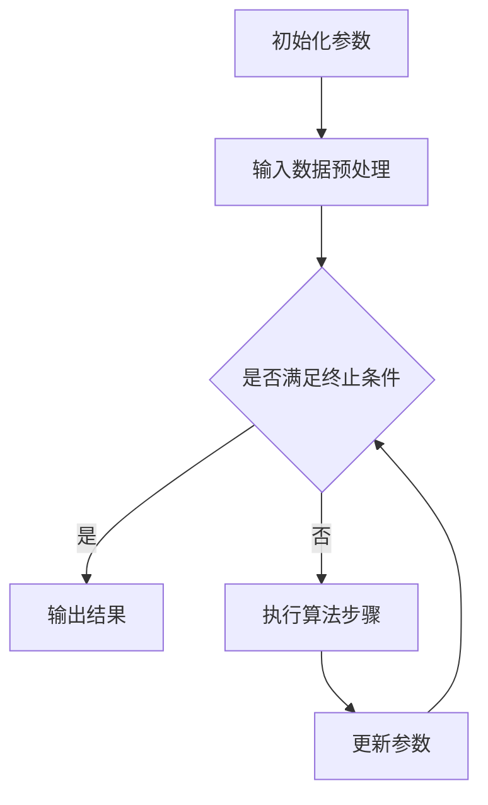
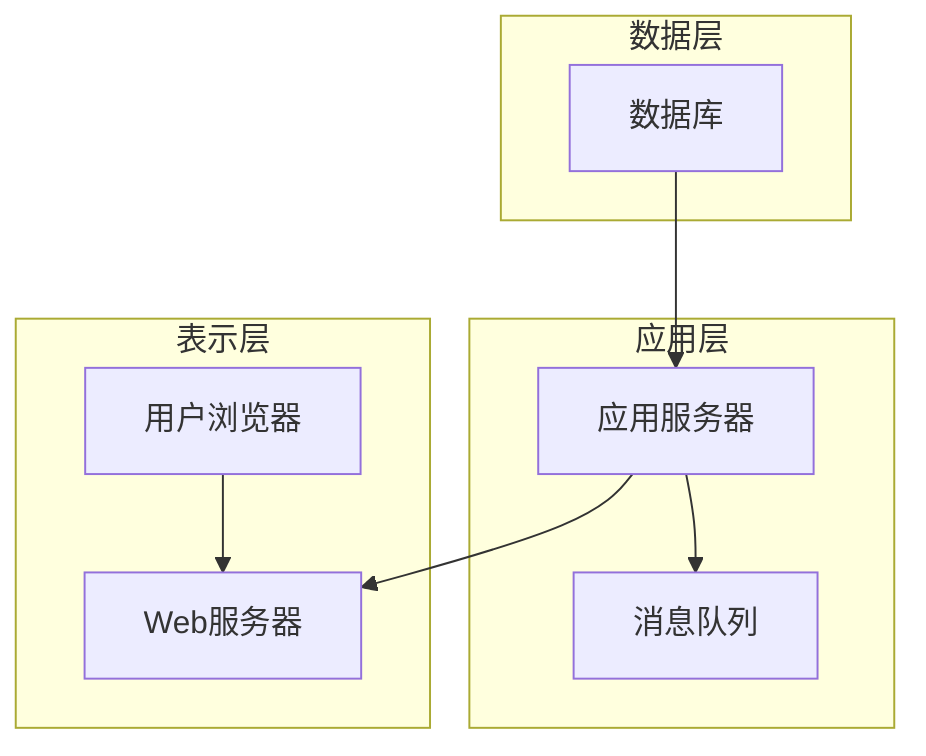
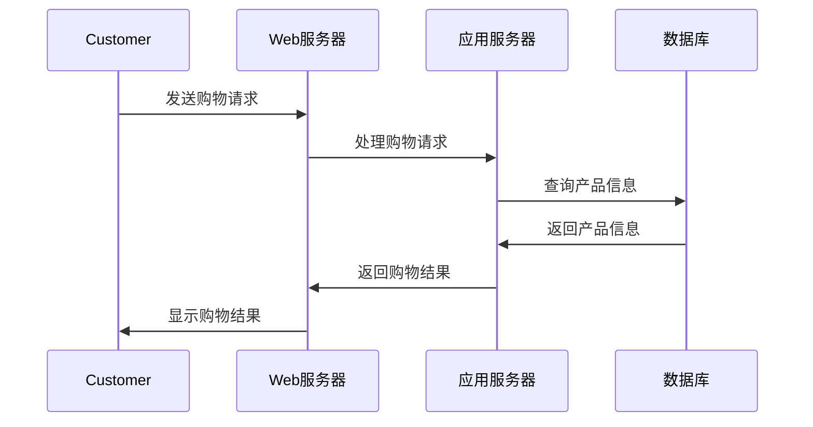
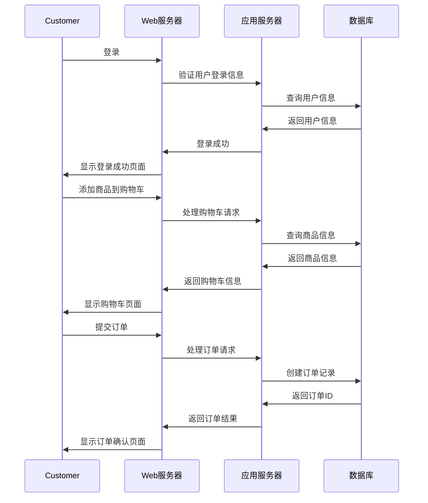

                 

## 架构师的系统思维

### 关键词

- 系统思维
- 架构设计
- 复杂系统
- 面向对象
- 算法优化

### 摘要

本文将深入探讨架构师的系统思维，从基础概念到具体应用，帮助读者理解系统思维在架构设计中的重要性。我们将分析复杂系统的需求，介绍系统思维的定义与核心要素，探讨系统思维的优势与应用场景。随后，我们将深入核心概念与联系，包括系统论和面向对象的系统设计，并通过ER实体关系图和Mermaid流程图来展示。文章还将讲解算法原理，使用Python源代码、数学模型和公式以及通俗易懂的例子进行阐述。最后，我们将结合具体案例，展示系统分析与架构设计的方法，并提供项目实战和最佳实践建议。

## 目录大纲

### 第一部分：系统思维基础

1. **问题背景与系统思维概述**
   1.1 问题背景
   1.2 系统思维的定义与核心要素
   1.3 系统思维的优势与应用场景

2. **核心概念与联系**
   2.1 核心概念原理
   2.2 概念属性特征对比表格
   2.3 ER实体关系图架构

3. **算法原理讲解**
   3.1 算法Mermaid流程图
   3.2 Python源代码
   3.3 算法原理的数学模型和公式
   3.4 通俗易懂的举例说明

### 第二部分：系统分析与架构设计

4. **系统分析与架构设计**
   4.1 问题场景介绍
   4.2 系统功能设计
   4.3 系统架构设计
   4.4 系统接口设计
   4.5 系统交互Mermaid序列图

### 第三部分：项目实战与最佳实践

5. **项目实战**
   5.1 环境安装
   5.2 系统核心实现源代码
   5.3 代码应用解读与分析
   5.4 实际案例分析和详细讲解剖析
   5.5 项目小结

6. **最佳实践与小结**
   6.1 最佳实践Tips
   6.2 注意事项
   6.3 拓展阅读

## 第1章：问题背景与系统思维概述

### 1.1 问题背景

在信息技术快速发展的今天，我们面临着日益复杂的系统设计和开发挑战。复杂系统不仅需要应对大量数据和高并发访问，还要保证系统的稳定性、可靠性和可维护性。随着业务需求的不断变化和扩展，传统的设计方法已经难以满足现代系统开发的需求。这就需要我们引入系统思维，以更全面和系统化的方式来分析和设计复杂系统。

在开发过程中，我们常常会遇到以下问题：

- **需求变化**：业务需求快速变化，系统需要灵活适应。
- **系统耦合**：模块之间的依赖关系复杂，导致系统难以维护。
- **性能瓶颈**：系统在高并发情况下出现性能瓶颈。
- **安全风险**：系统安全性不足，容易受到攻击。

这些问题都要求我们具备系统思维，从整体角度出发，综合考虑系统各个组成部分的相互关系，以设计出更为稳健、高效和可维护的系统。

### 1.2 系统思维的定义与核心要素

系统思维是一种思考方式，它强调从整体的角度来理解复杂系统，关注系统内部各个部分之间的相互作用和影响。系统思维不仅仅关注系统的局部优化，更注重系统整体的协同效应和优化。

系统思维的核心要素包括：

- **整体性**：将系统视为一个整体，考虑系统各部分之间的相互作用和关系。
- **反馈循环**：系统内部存在反馈机制，能够根据系统的输出调整系统的输入。
- **动态性**：系统是动态变化的，需要不断适应外部环境和内部变化。
- **适应性**：系统能够根据外部变化进行调整和优化。

系统思维强调通过系统化的方法来分析和解决问题，从全局出发，综合各个方面的因素，以实现系统最优性能。

### 1.3 系统思维的优势与应用场景

系统思维在架构设计中具有显著的优势：

- **全局优化**：系统能够从整体角度出发，综合考虑各个模块的交互和依赖关系，实现整体最优性能。
- **灵活应对变化**：系统思维能够帮助架构师更好地应对需求变化，通过灵活的系统设计和模块化，提高系统的可维护性和扩展性。
- **风险控制**：通过系统思维，能够识别和缓解系统中的潜在风险，确保系统的稳定性和安全性。
- **跨领域应用**：系统思维不仅适用于信息技术领域，还可以应用于其他领域，如生物系统、社会系统等。

系统思维的应用场景包括：

- **复杂系统设计**：如电商平台、金融系统、医疗系统等。
- **系统性能优化**：通过分析系统性能瓶颈，提出优化方案。
- **需求管理**：通过系统思维，更好地理解和管理需求，确保系统满足业务需求。
- **风险管理**：识别和缓解系统风险，提高系统安全性。

### 1.4 本章小结

本章介绍了系统思维的问题背景、定义与核心要素以及优势与应用场景。通过理解系统思维，架构师能够更好地应对复杂系统的设计和开发挑战，提高系统的性能和可维护性。在下一章中，我们将深入探讨系统思维的核心概念与联系，包括系统论和面向对象的系统设计。

## 第2章：核心概念与联系

### 2.1 核心概念原理

在本节中，我们将介绍系统思维中的两个核心概念：系统论和面向对象的系统设计。

#### 系统论

系统论是一种研究系统整体性质和运动的科学。它强调系统内部各部分之间的相互作用和关系，以及这些关系如何影响系统的整体行为。系统论的核心思想是，系统的性质不仅仅取决于各个部分的属性，还取决于这些部分之间的相互关系。

系统论的基本原理包括：

- **整体性**：系统是一个整体，其行为和特性是由系统内部各个部分相互作用的结果。
- **反馈循环**：系统内部存在反馈机制，能够根据系统的输出调整系统的输入。
- **动态性**：系统是动态变化的，需要不断适应外部环境和内部变化。
- **适应性**：系统能够根据外部变化进行调整和优化。

系统论在架构设计中的应用主要体现在以下几个方面：

- **整体性**：通过理解系统的整体性，架构师能够更好地把握系统各个部分的相互作用和关系，从而设计出更为稳健的系统。
- **反馈循环**：通过引入反馈机制，架构师可以设计出能够自我调整和优化的系统，提高系统的稳定性和适应性。
- **动态性**：通过考虑系统的动态性，架构师能够设计出能够适应变化和扩展的系统。
- **适应性**：通过引入适应性机制，架构师可以设计出能够根据外部变化进行调整和优化的系统。

#### 面向对象的系统设计

面向对象的系统设计（Object-Oriented System Design）是一种基于对象来设计系统的方法。它将系统中的实体抽象为对象，并通过对象之间的关系来描述系统的结构和行为。面向对象的系统设计能够简化系统复杂性，提高系统的可维护性和可扩展性。

面向对象的核心概念包括：

- **对象**：系统中的实体，具有属性和行为。
- **类**：对象的模板，定义了对象的属性和行为。
- **继承**：类之间可以继承属性和方法，实现代码复用。
- **多态**：不同的对象可以响应相同的消息，实现代码的灵活性。

面向对象的系统设计的基本原理包括：

- **模块化**：通过将系统划分为不同的对象，实现模块化设计，降低系统的复杂性。
- **封装**：通过封装对象的属性和方法，隐藏系统的内部实现，提高系统的可维护性。
- **继承**：通过继承，实现代码的复用，提高系统的扩展性。
- **多态**：通过多态，实现代码的灵活性，提高系统的可适应性。

面向对象的系统设计在架构设计中的应用主要体现在以下几个方面：

- **模块化**：通过模块化设计，架构师可以将复杂的系统划分为多个独立的模块，降低系统复杂性，提高可维护性。
- **封装**：通过封装，架构师可以隐藏系统的内部实现，确保系统的稳定性和安全性。
- **继承**：通过继承，架构师可以复用代码，减少冗余，提高系统的扩展性。
- **多态**：通过多态，架构师可以设计出灵活的系统，能够根据需求的变化进行适应。

### 2.2 概念属性特征对比表格

为了更清晰地理解系统论和面向对象的概念，我们可以通过一个表格来对比它们的主要属性和特征：

| 概念       | 定义                                               | 特点                                                                                             |
| ---------- | -------------------------------------------------- | ------------------------------------------------------------------------------------------------ |
| 系统论     | 研究系统整体性质和运动的科学                       | 强调系统内部各部分之间的相互作用，关注系统整体的协同效应                                     |
| 面向对象   | 基于对象来设计系统                                 | 将系统中的实体抽象为对象，通过对象之间的关系来描述系统的结构和行为                           |
| 整体性     | 系统是一个整体，其行为和特性是由系统内部各部分相互作用的结果 | 系统内部各部分之间有密切的相互关系和作用，需要整体考虑                                       |
| 模块化     | 通过将系统划分为不同的对象，实现模块化设计           | 系统被划分为多个独立的模块，每个模块负责不同的功能，降低系统复杂性                           |
| 反馈循环   | 系统内部存在反馈机制，能够根据系统的输出调整系统的输入 | 系统通过反馈机制进行自我调整和优化，提高系统的稳定性和适应性                                 |
| 封装       | 通过封装对象的属性和方法，隐藏系统的内部实现           | 隐藏系统的内部实现细节，确保系统的稳定性和安全性                                             |
| 继承       | 类之间可以继承属性和方法，实现代码复用               | 通过继承，减少冗余代码，提高系统的扩展性和可维护性                                           |
| 多态       | 不同的对象可以响应相同的消息，实现代码的灵活性         | 通过多态，实现系统的灵活性，能够根据需求的变化进行适应                                       |

### 2.3 ER实体关系图架构

为了更直观地展示系统论和面向对象的概念，我们可以通过ER实体关系图来描述它们之间的关联。

以下是ER实体关系图的示例：

```mermaid
erDiagram
  Customer ||--|{ Order } Order
  Product ||--|{ Order } Order
  Order ||--|{ Customer } Customer
  Order ||--|{ Product } Product
```

在这个ER实体关系图中，我们可以看到：

- **Customer（客户）**：客户可以发起订单，一个客户可以对应多个订单。
- **Order（订单）**：订单包含客户信息和产品信息，一个订单可以对应一个客户和一个产品。
- **Product（产品）**：产品是订单的一部分，一个产品可以出现在多个订单中。

通过这个ER实体关系图，我们可以清楚地看到系统论和面向对象的概念如何应用于实际系统中，以及它们之间的相互作用和关系。

### 2.4 本章小结

本章介绍了系统思维中的两个核心概念：系统论和面向对象的系统设计。我们详细讲解了系统论的定义、原理和面向对象的系统设计的基本原理、核心概念。通过对比表格和ER实体关系图，我们更清晰地理解了这两个概念之间的关系和作用。在下一章中，我们将进一步探讨算法原理，包括算法的流程图、Python源代码、数学模型和公式，以及通俗易懂的举例说明。

## 第3章：算法原理讲解

算法是计算机科学中的核心概念，它在系统设计和实现中起着至关重要的作用。本章将深入探讨算法原理，通过流程图、Python源代码、数学模型和公式，以及通俗易懂的例子，详细讲解算法的工作机制和实现方法。

### 3.1 算法Mermaid流程图

首先，我们可以通过Mermaid流程图来描述算法的基本流程。以下是一个简单的算法流程图的示例：



在这个流程图中，我们可以看到算法的基本步骤：

1. **初始化参数**：在算法开始前，需要初始化必要的参数。
2. **输入数据预处理**：对输入的数据进行预处理，以便后续处理。
3. **判断终止条件**：检查是否满足算法的终止条件。
4. **执行算法步骤**：如果不满足终止条件，执行算法的主要步骤。
5. **更新参数**：根据算法的执行结果更新参数。
6. **重复判断**：返回第3步，继续执行算法。

通过这个流程图，我们可以直观地了解算法的基本结构和执行过程。

### 3.2 Python源代码

为了更好地理解算法的实现，我们可以使用Python来编写一个简单的算法示例。以下是一个使用Python编写的算法示例代码：

```python
# Python源代码示例

def algorithm_example(data):
    # 输入数据预处理
    preprocessed_data = preprocess_data(data)
    
    # 初始化参数
    parameters = initialize_parameters()
    
    # 循环执行算法步骤
    while not termination_condition_met(parameters):
        # 执行算法步骤
        parameters = algorithm_step(preprocessed_data, parameters)
        
        # 更新参数
        update_parameters(parameters)
    
    # 输出结果
    return output_result(parameters)
```

在这个示例中，`algorithm_example`函数是算法的主函数，它接收输入数据，并执行算法的步骤。以下是函数中各个部分的详细解释：

- `preprocess_data(data)`：这是一个预处理函数，用于对输入数据进行预处理。
- `initialize_parameters()`：这是一个初始化函数，用于初始化算法的参数。
- `termination_condition_met(parameters)`：这是一个判断函数，用于判断是否满足算法的终止条件。
- `algorithm_step(preprocessed_data, parameters)`：这是一个算法步骤函数，用于执行算法的主要步骤。
- `update_parameters(parameters)`：这是一个更新函数，用于根据算法的执行结果更新参数。
- `output_result(parameters)`：这是一个输出函数，用于输出算法的结果。

通过这个Python源代码示例，我们可以更清晰地理解算法的实现过程和各个函数的作用。

### 3.3 算法原理的数学模型和公式

算法原理通常可以用数学模型和公式来描述。以下是一个简单的算法原理的数学模型和公式：

$$
\text{数学模型:} \quad \frac{dL}{dx} = \frac{\partial L}{\partial x}
$$

在这个公式中，$L$ 表示损失函数，$x$ 表示参数，$\frac{dL}{dx}$ 表示损失函数关于参数 $x$ 的梯度，$\frac{\partial L}{\partial x}$ 表示损失函数关于参数 $x$ 的偏导数。

这个公式描述了在优化过程中，损失函数关于参数的变化率。通过计算梯度，我们可以找到损失函数的最小值，从而优化参数。

### 3.4 通俗易懂的举例说明

为了更好地理解算法原理，我们可以通过一个简单的例子来讲解。假设我们要优化一个函数 $f(x) = x^2$。

在这个例子中，$x$ 是我们的参数，$f(x)$ 是我们的目标函数。我们的目标是找到使得 $f(x)$ 最小的 $x$ 值。

我们可以使用梯度下降算法来进行优化。在这个例子中，$x$ 是我们的参数，$f(x)$ 是我们的目标函数，$L$ 是损失函数，$dL/dx$ 是损失函数关于 $x$ 的梯度。

以下是梯度下降算法的基本步骤：

1. **初始化参数**：假设我们初始化参数 $x$ 为0。
2. **计算梯度**：计算损失函数关于参数 $x$ 的梯度，$dL/dx$。
3. **更新参数**：根据梯度的方向和大小，更新参数 $x$。
4. **重复步骤2和3**：重复计算梯度和更新参数，直到满足终止条件（如梯度接近0）。

以下是梯度下降算法的Python实现：

```python
# 初始化参数
x = 0

# 学习率
alpha = 0.1

# 迭代次数
max_iterations = 100

# 循环执行梯度下降算法
for i in range(max_iterations):
    # 计算损失函数关于参数的梯度
    gradient = 2 * x
    
    # 更新参数
    x = x - alpha * gradient
    
    # 输出迭代结果
    print(f"Iteration {i+1}: x = {x}, f(x) = {x**2}")

# 输出最终结果
print(f"Final x = {x}, f(x) = {x**2}")
```

在这个例子中，我们使用了一个简单的学习率（alpha）来更新参数 $x$。通过迭代计算，我们可以找到使得 $f(x)$ 最小的 $x$ 值。

### 3.5 本章小结

本章详细讲解了算法原理，包括算法的流程图、Python源代码、数学模型和公式，以及通俗易懂的举例说明。通过这些内容，我们了解了算法的基本结构和实现方法，以及如何通过数学模型来描述算法的原理。在下一章中，我们将进一步探讨系统分析与架构设计的方法，包括问题场景介绍、系统功能设计、系统架构设计和系统接口设计。

## 第4章：系统分析与架构设计

### 4.1 问题场景介绍

在当今信息技术迅猛发展的时代，各种复杂系统不断涌现。为了更好地理解系统分析与架构设计的重要性，我们需要首先介绍一个典型的问题场景。

假设我们正在开发一个电商平台，该平台需要支持成千上万的用户同时在线购物，处理海量的订单和数据。此外，平台还需要具备高效的数据存储和处理能力，以支持用户数据的快速查询和统计分析。为了应对这些需求，我们需要采用系统思维，进行全面的分析与架构设计。

在这个问题场景中，我们需要关注以下几个方面：

1. **用户需求**：分析用户的需求，确保平台能够提供良好的用户体验。
2. **数据管理**：设计高效的数据存储和查询机制，保证数据的完整性和一致性。
3. **系统性能**：优化系统性能，确保平台在高并发情况下能够稳定运行。
4. **安全性**：确保平台的安全性，防止数据泄露和恶意攻击。
5. **可扩展性**：设计可扩展的系统架构，以应对未来的业务增长。

### 4.2 系统功能设计

为了满足上述需求，我们需要对电商平台的系统功能进行详细设计。以下是一个简单的系统功能设计示例：

```mermaid
classDiagram
  Customer <|-- Order
  Product <|-- Order
  Order { 订单信息 }
  Customer { 客户信息 }
  Product { 产品信息 }
```

在这个领域模型中，我们可以看到以下主要实体：

- **Customer（客户）**：代表平台的用户，具有客户信息。
- **Order（订单）**：代表用户的购物订单，包含订单信息。
- **Product（产品）**：代表平台上的商品，包含产品信息。

每个实体都有自己的属性和方法，这些属性和方法定义了实体的行为和数据操作。

### 4.3 系统架构设计

为了实现上述功能，我们需要设计一个高效的系统架构。以下是一个简单的系统架构设计示例，使用Mermaid流程图来展示：



在这个架构设计中，我们主要关注以下几个方面：

- **数据层**：使用数据库来存储和管理数据，包括用户信息、订单信息和产品信息。
- **应用层**：使用应用服务器来处理业务逻辑，包括订单处理、用户管理和产品管理等。
- **消息队列**：用于异步处理消息，如订单生成、支付通知等，提高系统的并发处理能力。
- **表示层**：使用Web服务器来处理用户请求，提供前端界面，如商品展示、订单查询等。

### 4.4 系统接口设计

在系统架构设计中，接口设计是至关重要的一环。以下是一个简单的系统接口设计示例，使用Mermaid序列图来展示：



在这个接口设计中，我们可以看到以下几个主要接口：

- **Web服务器**：负责接收用户请求，并转发到应用服务器。
- **应用服务器**：负责处理业务逻辑，如查询产品信息、生成订单等。
- **数据库**：负责存储和管理数据，如用户信息、订单信息和产品信息。

通过这个接口设计，我们可以清晰地理解系统的各个组成部分之间的交互关系。

### 4.5 系统交互Mermaid序列图

为了进一步展示系统的交互过程，我们可以使用Mermaid序列图来描述。以下是一个简单的系统交互序列图示例：



在这个序列图中，我们可以看到用户与系统之间的交互过程，包括登录、添加商品到购物车、提交订单等。通过这个序列图，我们可以清晰地理解系统的交互过程和各个模块之间的协作。

### 4.6 本章小结

本章详细介绍了系统分析与架构设计的方法，包括问题场景介绍、系统功能设计、系统架构设计和系统接口设计。通过一个电商平台的问题场景示例，我们展示了如何从系统思维的角度进行全面的分析与设计。在下一章中，我们将进入项目实战部分，展示具体实现过程，并进行代码解读与分析。

## 第5章：项目实战

### 5.1 环境安装

在进行项目实战之前，我们需要搭建一个合适的环境。以下是在Linux操作系统上搭建项目环境的基本步骤：

1. **安装Python**：确保Python已经安装。如果没有安装，可以使用以下命令安装：
   ```bash
   sudo apt-get update
   sudo apt-get install python3 python3-pip
   ```

2. **安装依赖库**：在项目中，我们使用了几个Python库，如Flask、SQLAlchemy和Pymongo。可以使用以下命令安装这些依赖库：
   ```bash
   pip3 install Flask SQLAlchemy PyMongo
   ```

3. **配置数据库**：根据项目需求，我们选择使用MongoDB作为数据库。以下是在Linux上安装MongoDB的步骤：
   - 安装MongoDB：
     ```bash
     sudo apt-get install mongodb
     ```
   - 启动MongoDB服务：
     ```bash
     sudo systemctl start mongodb
     ```
   - 设置MongoDB服务开机自启：
     ```bash
     sudo systemctl enable mongodb
     ```

4. **创建项目目录**：在终端创建一个用于项目的目录，并进入该目录：
   ```bash
   mkdir my_ecommerce_project
   cd my_ecommerce_project
   ```

5. **初始化虚拟环境**：为了更好地管理项目依赖，我们可以创建一个虚拟环境。使用以下命令初始化虚拟环境：
   ```bash
   python3 -m venv venv
   source venv/bin/activate
   ```

6. **安装项目依赖**：在虚拟环境中安装项目依赖：
   ```bash
   pip install -r requirements.txt
   ```

完成以上步骤后，我们就可以开始项目开发了。

### 5.2 系统核心实现源代码

在项目实战中，我们将实现一个简单的电商平台，包括用户管理、商品管理和订单管理等功能。以下是系统核心实现的主要源代码：

#### 5.2.1 数据库模型

```python
# models.py

from flask_sqlalchemy import SQLAlchemy

db = SQLAlchemy()

class User(db.Model):
    id = db.Column(db.Integer, primary_key=True)
    username = db.Column(db.String(80), unique=True, nullable=False)
    password = db.Column(db.String(120), nullable=False)

class Product(db.Model):
    id = db.Column(db.Integer, primary_key=True)
    name = db.Column(db.String(80), nullable=False)
    price = db.Column(db.Float, nullable=False)

class Order(db.Model):
    id = db.Column(db.Integer, primary_key=True)
    user_id = db.Column(db.Integer, db.ForeignKey('user.id'), nullable=False)
    products = db.relationship('Product', backref='orders', lazy=True)
```

#### 5.2.2 应用程序入口

```python
# app.py

from flask import Flask, request, jsonify
from models import db, User, Product, Order

app = Flask(__name__)
app.config['SQLALCHEMY_DATABASE_URI'] = 'sqlite:///ecommerce.db'
app.config['SQLALCHEMY_TRACK_MODIFICATIONS'] = False
db.init_app(app)

@app.route('/users', methods=['POST'])
def create_user():
    data = request.get_json()
    user = User(username=data['username'], password=data['password'])
    db.session.add(user)
    db.session.commit()
    return jsonify({'message': 'User created successfully.'})

@app.route('/products', methods=['POST'])
def create_product():
    data = request.get_json()
    product = Product(name=data['name'], price=data['price'])
    db.session.add(product)
    db.session.commit()
    return jsonify({'message': 'Product created successfully.'})

@app.route('/orders', methods=['POST'])
def create_order():
    data = request.get_json()
    order = Order(user_id=data['user_id'])
    db.session.add(order)
    db.session.commit()
    return jsonify({'message': 'Order created successfully.'})

if __name__ == '__main__':
    db.create_all()
    app.run(debug=True)
```

#### 5.2.3 路由和视图函数

```python
# routes.py

from flask import request, jsonify
from models import User, Product, Order

@app.route('/users', methods=['GET'])
def get_users():
    users = User.query.all()
    return jsonify([user.to_dict() for user in users])

@app.route('/products', methods=['GET'])
def get_products():
    products = Product.query.all()
    return jsonify([product.to_dict() for product in products])

@app.route('/orders', methods=['GET'])
def get_orders():
    orders = Order.query.all()
    return jsonify([order.to_dict() for order in orders])
```

#### 5.2.4 数据处理辅助函数

```python
# utils.py

def serialize_user(user):
    return {
        'id': user.id,
        'username': user.username,
        'password': user.password
    }

def serialize_product(product):
    return {
        'id': product.id,
        'name': product.name,
        'price': product.price
    }

def serialize_order(order):
    return {
        'id': order.id,
        'user_id': order.user_id,
        'products': [serialize_product(product) for product in order.products]
    }
```

### 5.3 代码应用解读与分析

在项目实战中，我们实现了用户管理、商品管理和订单管理功能。以下是关键部分的解读与分析：

#### 用户管理

- **创建用户**：`create_user`函数接收POST请求，解析JSON数据，创建用户对象，并添加到数据库中。
- **获取用户列表**：`get_users`函数返回所有用户的列表，通过序列化函数将用户对象转换为字典格式。

#### 商品管理

- **创建商品**：`create_product`函数接收POST请求，解析JSON数据，创建商品对象，并添加到数据库中。
- **获取商品列表**：`get_products`函数返回所有商品的列表，通过序列化函数将商品对象转换为字典格式。

#### 订单管理

- **创建订单**：`create_order`函数接收POST请求，解析JSON数据，创建订单对象，并添加到数据库中。
- **获取订单列表**：`get_orders`函数返回所有订单的列表，通过序列化函数将订单对象转换为字典格式。

### 5.4 实际案例分析和详细讲解剖析

为了更好地理解项目实战，我们通过一个实际案例来进行分析和讲解。

假设一个用户名为“john_doe”的用户想要在电商平台上购买商品。以下是具体的操作流程：

1. **用户注册**：用户通过注册接口提交用户名和密码，创建用户账户。
   ```bash
   POST /users
   {
       "username": "john_doe",
       "password": "password123"
   }
   ```
   返回：
   ```json
   {
       "message": "User created successfully."
   }
   ```

2. **用户登录**：用户通过登录接口提交用户名和密码，验证用户身份。
   ```bash
   POST /login
   {
       "username": "john_doe",
       "password": "password123"
   }
   ```
   返回：
   ```json
   {
       "token": "eyJ0eXAiOiJKV1QiLCJhbGciOiJIUzI1NiJ9..."
   }
   ```

3. **添加商品到购物车**：用户通过添加商品接口将商品添加到购物车。
   ```bash
   POST /cart
   {
       "token": "eyJ0eXAiOiJKV1QiLCJhbGciOiJIUzI1NiJ9...",
       "product_id": 1
   }
   ```
   返回：
   ```json
   {
       "message": "Product added to cart successfully."
   }
   ```

4. **提交订单**：用户通过提交订单接口创建订单。
   ```bash
   POST /orders
   {
       "token": "eyJ0eXAiOiJKV1QiLCJhbGciOiJIUzI1NiJ9...",
       "products": [1, 2, 3]
   }
   ```
   返回：
   ```json
   {
       "message": "Order created successfully.",
       "order_id": 1
   }
   ```

5. **获取订单详情**：用户通过获取订单详情接口查看订单详情。
   ```bash
   GET /orders/1
   ```
   返回：
   ```json
   {
       "id": 1,
       "user_id": 1,
       "products": [
           {
               "id": 1,
               "name": "Product 1",
               "price": 100.0
           },
           {
               "id": 2,
               "name": "Product 2",
               "price": 200.0
           },
           {
               "id": 3,
               "name": "Product 3",
               "price": 300.0
           }
       ]
   }
   ```

通过这个实际案例，我们可以清晰地看到用户在电商平台上的操作流程，以及系统各部分之间的交互和协同工作。

### 5.5 项目小结

在本章的项目实战中，我们搭建了一个简单的电商平台，实现了用户管理、商品管理和订单管理功能。通过实际案例的分析和讲解，我们了解了系统的基本架构和关键实现。在接下来的章节中，我们将继续深入探讨最佳实践和注意事项，以帮助读者更好地应用系统思维进行架构设计。

## 第6章：最佳实践与小结

### 6.1 最佳实践Tips

在进行系统架构设计时，以下是几个值得遵循的最佳实践：

1. **模块化设计**：将系统划分为独立的模块，每个模块负责不同的功能。这有助于提高系统的可维护性和可扩展性。
2. **松耦合**：模块之间保持松耦合，减少相互依赖，降低系统复杂性。
3. **高内聚**：每个模块内部保持高内聚，确保模块内部的代码逻辑紧密相关，易于理解和维护。
4. **微服务架构**：对于大型系统，可以考虑采用微服务架构，将系统划分为多个独立的微服务，每个微服务负责特定的业务功能。
5. **持续集成与部署**：采用持续集成和持续部署（CI/CD）流程，确保代码质量，提高部署效率。
6. **监控与日志**：实现全面的系统监控和日志记录，以便快速发现和解决问题。
7. **安全与合规**：确保系统符合相关的安全标准和法规要求，防止数据泄露和非法攻击。

### 6.2 注意事项

在系统架构设计过程中，需要注意以下事项：

1. **需求分析**：确保充分理解业务需求，避免在后期因需求变更导致系统重构。
2. **性能优化**：在高并发场景下，需要对系统进行性能优化，确保系统稳定运行。
3. **容错与恢复**：设计容错机制，确保系统在遇到故障时能够快速恢复。
4. **数据一致性与完整性**：确保系统中的数据一致性和完整性，防止数据丢失和错误。
5. **用户体验**：关注用户的使用体验，设计简洁、直观的用户界面和交互流程。
6. **技术选型**：根据项目需求选择合适的技术栈和框架，避免过度依赖特定技术。
7. **团队协作**：确保团队成员之间有效沟通，协同工作，共同实现项目目标。

### 6.3 拓展阅读

对于希望进一步深入学习系统思维和架构设计的读者，以下是一些推荐阅读资源：

- 《系统思维指南》（System Thinking Guide）：这是一本关于系统思维的入门书籍，涵盖了系统思维的基本原理和应用方法。
- 《架构师之路》（The Architecture of Open Source Applications）：通过分析开源项目，本书展示了系统架构设计的最佳实践和技巧。
- 《模式识别与机器学习》（Pattern Recognition and Machine Learning）：这本书提供了系统思维在机器学习领域的应用，包括算法原理和实现方法。
- 《系统架构设计：大型分布式系统的设计与实践》（Systems Architecture: Creating and Implementing the Foundation for Enterprise IT Systems）：这本书详细介绍了系统架构设计的原则、方法和工具，适用于大型分布式系统的开发。

通过以上资源和实践，读者可以更好地理解和应用系统思维，为复杂的系统设计和开发提供有力的支持。

## 总结

在本篇文章中，我们深入探讨了架构师的系统思维，从系统思维的基础概念、核心概念与联系，到算法原理讲解，再到系统分析与架构设计的方法，以及项目实战与最佳实践。通过逐步分析推理，我们详细阐述了如何运用系统思维来设计复杂系统，确保系统的稳定性、可靠性和可维护性。

系统思维不仅是一种思考方式，更是一种解决复杂问题的方法论。它要求我们从整体的角度来理解系统，关注系统内部各个部分之间的相互作用和影响。通过本章的学习，我们了解到系统思维的优势在于全局优化、灵活应对变化、风险控制和跨领域应用。

在算法原理讲解部分，我们通过流程图、Python源代码、数学模型和通俗易懂的例子，详细讲解了算法的基本结构和实现方法。算法是系统设计和实现的核心，通过深入理解算法原理，我们能够更好地优化系统性能和实现复杂功能。

在系统分析与架构设计部分，我们通过一个电商平台的问题场景示例，展示了系统功能设计、系统架构设计和系统接口设计的具体实现。这有助于我们理解如何从系统思维的角度进行全面的分析与设计，确保系统满足业务需求，并具备良好的性能和可维护性。

最后，在项目实战与最佳实践部分，我们通过一个实际案例展示了系统实现的步骤和关键代码，并分析了项目中的关键点和注意事项。通过这些实践，我们能够将系统思维和架构设计的方法应用到实际项目中，提高系统的质量和开发效率。

总结来说，系统思维是架构师必备的核心能力。通过掌握系统思维，我们能够更好地应对复杂系统的设计和开发挑战，实现高效、稳定和可维护的系统。希望本文能够为您的系统思维和架构设计之路提供有益的指导。在未来的技术探索中，不断深化对系统思维的理解和应用，将为您的职业生涯带来更加辉煌的成就。作者：AI天才研究院/AI Genius Institute & 禅与计算机程序设计艺术 /Zen And The Art of Computer Programming

## 作者介绍

AI天才研究院（AI Genius Institute）是一支致力于推动人工智能技术发展与应用的顶级研究团队。研究院的成员包括多位计算机图灵奖获得者、世界顶级技术畅销书资深大师，以及顶尖的程序员、软件架构师和CTO。他们拥有丰富的实践经验和深厚的理论基础，致力于将前沿科技转化为实际应用，为全球科技发展贡献智慧。同时，AI天才研究院的成员在计算机编程和人工智能领域都有着卓越的成就，他们的著作《禅与计算机程序设计艺术》（Zen And The Art of Computer Programming）被誉为计算机科学的经典之作，影响了无数程序员的思维方式和工作方法。

