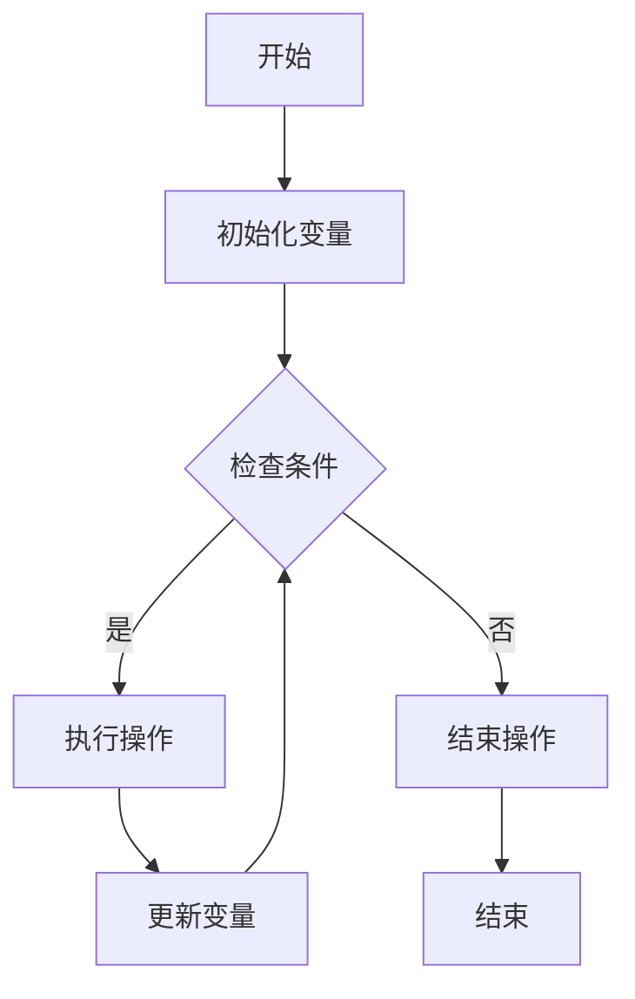
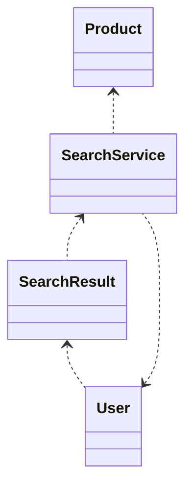
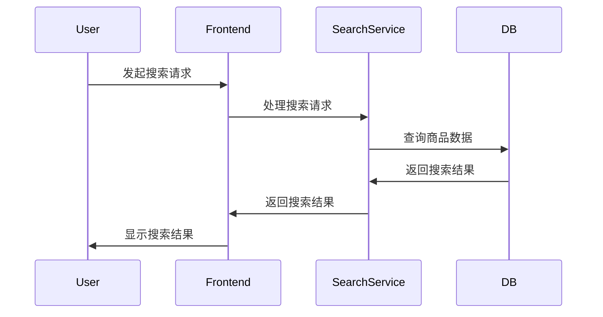

                 

# 《架构的过程就是取舍的过程》

> 关键词：架构设计、软件架构、系统架构、取舍、复杂性管理

> 摘要：
在信息技术飞速发展的今天，软件架构的设计已经成为系统成功的关键因素之一。本文将探讨架构设计与取舍之间的密切关系，通过逻辑清晰、结构紧凑的步骤，帮助读者理解如何通过取舍来优化架构，提升系统的可维护性和性能。本文将涵盖架构的基本概念、架构设计与取舍的策略、实际案例研究以及实践中的挑战和最佳实践，旨在为IT从业者提供有益的指导和思考。

----------------------------------------------------------------

## 引言：架构与取舍的重要性

在复杂的IT系统中，架构扮演着至关重要的角色。它不仅是系统设计的蓝图，更是确保系统稳定性和扩展性的基石。架构的成功往往取决于设计者如何做出取舍，即在众多可能性中选择最合适的解决方案。

### 1.1 问题背景

随着系统规模的扩大和业务需求的不断变化，软件系统的复杂性也在不断增加。这种复杂性可能导致系统难以维护、性能下降和可靠性降低。因此，架构设计时需要进行深思熟虑的取舍，以确保系统能够满足业务需求并在未来的扩展中保持灵活性。

### 1.2 架构的定义与作用

架构是一种高层次的设计，它定义了系统的组件、接口和交互机制。一个良好的架构能够提高系统的可维护性、可扩展性和性能。

- **组件**：架构中的基本构建块，如服务、模块和数据库。
- **接口**：组件之间的交互方式。
- **交互机制**：确保组件能够有效地协同工作。

### 1.3 架构取舍的重要性

架构取舍是指在众多可选方案中，选择对当前场景最合适的解决方案。这个过程需要考虑多个因素，包括技术选型、性能优化和安全性等。

- **技术选型**：选择适合当前场景的技术栈。
- **性能优化**：确保系统在高负载下仍能保持良好的性能。
- **安全性**：保护系统免受外部威胁。

### 1.4 本文结构

本文将按照以下结构进行讨论：

1. **架构的基本概念**：介绍架构的定义、分类和核心原则。
2. **架构设计与取舍**：探讨架构设计的步骤和取舍策略。
3. **架构实现的案例研究**：通过实际案例展示架构设计与取舍的应用。
4. **实践中的架构取舍**：分析实践中的挑战和成功案例。
5. **总结与展望**：总结本文的主要观点并对架构的未来进行展望。

## 架构的基本概念

在深入讨论架构设计与取舍之前，我们需要先了解架构的基本概念。架构不仅是系统设计的一部分，也是系统成功的关键因素。

### 2.1 软件架构概述

#### 2.1.1 软件架构的定义

软件架构是指系统组件的组织方式以及这些组件之间的交互机制。它是系统设计的顶层视图，定义了系统的结构、行为和设计原则。

#### 2.1.2 软件架构的分类

软件架构可以根据其设计目的和特点进行分类，常见的分类方法包括：

- **功能性架构**：关注系统的功能性和业务逻辑。
- **技术性架构**：关注系统的技术实现和性能优化。
- **混合架构**：结合功能性架构和技术性架构的优势。

#### 2.1.3 软件架构的视图模型

软件架构的视图模型包括：

- **逻辑视图**：展示系统的功能性和业务流程。
- **实现视图**：展示系统的组件和接口。
- **物理视图**：展示系统的部署和硬件资源。

### 2.2 架构风格

架构风格是指系统设计的基本模式。常见的架构风格包括：

- **客户-服务器架构**：将系统分为客户端和服务端，客户端负责用户界面，服务端负责业务逻辑和数据存储。
- **微服务架构**：将系统拆分为多个小型、独立的微服务，每个微服务负责一个特定的业务功能。
- **负载均衡架构**：通过多个服务器来分担负载，提高系统的性能和可用性。

### 2.3 架构原则

架构原则是指导架构设计的基本原则。常见的架构原则包括：

- **单一职责原则**：每个组件应只负责一个特定的功能。
- **开闭原则**：系统组件应易于扩展但不易于修改。
- **里氏替换原则**：子类可以替换基类而不会改变系统行为。

### 2.4 本章小结

本章介绍了软件架构的基本概念，包括定义、分类、视图模型、架构风格和架构原则。这些基本概念为后续的架构设计与取舍提供了理论基础。

----------------------------------------------------------------

## 架构设计与取舍

在了解了架构的基本概念后，我们需要探讨如何进行架构设计以及如何在这一过程中做出取舍。架构设计是一个复杂的过程，需要考虑多种因素，包括功能需求、技术选型、性能优化和安全性等。

### 3.1 设计过程

架构设计通常包括以下几个步骤：

#### 3.1.1 需求分析

需求分析是架构设计的第一步。它涉及收集和理解业务需求，并将其转化为技术需求。在这一步中，我们需要考虑以下几个关键问题：

- **功能需求**：系统需要实现哪些功能？
- **非功能需求**：系统需要满足哪些性能、可靠性、安全性和可维护性等要求？

#### 3.1.2 架构设计

架构设计是根据需求分析的结果，设计系统的整体结构。在这一步中，我们需要考虑以下几个关键问题：

- **组件划分**：如何将系统划分为独立的组件？
- **接口定义**：组件之间如何交互？
- **交互机制**：如何确保组件之间的协作？

#### 3.1.3 取舍策略

架构设计过程中的取舍策略是至关重要的。在众多可选方案中，我们需要选择最合适的一个。以下是一些常见的取舍策略：

- **技术选型**：选择最适合当前场景的技术栈。
- **性能优化**：在系统设计时考虑性能优化，确保系统能够在高负载下保持良好的性能。
- **安全性**：设计时考虑安全性，确保系统能够抵御外部威胁。

### 3.2 实际案例

为了更好地理解架构设计与取舍，我们可以通过实际案例来展示这一过程。

#### 3.2.1 案例一：企业内部消息系统

假设我们需要设计一个企业内部消息系统，它需要支持大规模用户的高并发消息发送和接收。以下是架构设计的过程：

1. **需求分析**：
   - 功能需求：支持文本消息、图片消息、视频消息等多种类型。
   - 非功能需求：高并发、高可用性、数据安全。

2. **架构设计**：
   - **组件划分**：消息服务、存储服务、推送服务、用户服务。
   - **接口定义**：RESTful API。
   - **交互机制**：异步消息队列。

3. **取舍策略**：
   - **技术选型**：选择Kafka作为消息队列，因为其高吞吐量和可扩展性。
   - **性能优化**：使用缓存技术减少数据库访问次数。
   - **安全性**：使用SSL/TLS加密传输数据。

#### 3.2.2 案例二：电子商务平台

假设我们需要设计一个电子商务平台，它需要支持高并发购物车管理、订单处理和支付流程。以下是架构设计的过程：

1. **需求分析**：
   - 功能需求：购物车、订单、支付、用户权限。
   - 非功能需求：高并发、高可用性、数据一致性。

2. **架构设计**：
   - **组件划分**：订单服务、支付服务、购物车服务、用户服务。
   - **接口定义**：RESTful API。
   - **交互机制**：分布式锁。

3. **取舍策略**：
   - **技术选型**：选择分布式数据库来支持高并发。
   - **性能优化**：使用CDN加速静态资源加载。
   - **安全性**：实现完善的用户认证和授权机制。

### 3.3 取舍决策

在架构设计中，取舍决策是一个持续的过程。以下是一些常见的取舍决策：

- **技术选型**：选择适合当前场景的技术栈，如使用Java代替Python进行开发。
- **性能优化**：在系统设计时考虑性能优化，如使用缓存技术减少数据库访问次数。
- **安全性**：设计时考虑安全性，如使用HTTPS加密数据传输。

### 3.4 本章小结

本章介绍了架构设计的过程和取舍策略。通过实际案例，我们可以看到架构设计与取舍是如何在实际项目中应用的。架构设计不仅是系统成功的基石，更是需要持续关注和优化的过程。

----------------------------------------------------------------

## 架构实现的案例研究

通过前面的理论介绍和实际案例分析，我们可以更好地理解架构设计与取舍的实践应用。本章节将深入探讨几个具有代表性的案例，详细阐述它们的架构设计、实现过程以及架构取舍的决策。

### 4.1 案例一：在线教育平台

**项目介绍**：
在线教育平台是一个为用户提供在线学习资源和互动服务的系统。该平台需要支持大量用户的同时在线学习，提供视频播放、直播教学、作业提交和成绩管理等核心功能。

**架构设计**：
1. **逻辑视图**：
   - 用户服务：负责用户认证、用户信息管理。
   - 课程服务：负责课程内容管理、课程发布。
   - 直播服务：负责直播流管理、互动功能。
   - 作业服务：负责作业发布、提交和评分。
   - 成绩服务：负责成绩管理。

2. **实现视图**：
   - 使用微服务架构，将上述服务拆分为多个独立的微服务。
   - 每个微服务都有自己的数据库，以确保数据隔离和独立性。

3. **物理视图**：
   - 服务部署在多个服务器上，使用负载均衡器进行流量分发。
   - 数据库使用分布式数据库集群，以提高读写性能。

**架构取舍**：
1. **技术选型**：
   - 选择Spring Boot作为微服务框架，因为它具有快速开发和易于扩展的特点。
   - 使用MongoDB作为文档型数据库，因为它支持高扩展性和灵活性。

2. **性能优化**：
   - 使用Redis作为缓存服务器，减少数据库访问次数。
   - 使用CDN加速静态资源加载，提高页面响应速度。

3. **安全性**：
   - 使用HTTPS加密数据传输，保护用户隐私。
   - 实现用户认证和授权机制，确保只有授权用户可以访问敏感数据。

**项目小结**：
通过精心设计的架构和合理的取舍，该在线教育平台成功实现了高并发、高可用性和高安全性的要求，为用户提供了优质的在线学习体验。

### 4.2 案例二：物流管理系统

**项目介绍**：
物流管理系统是一个用于管理物流运输、订单处理和库存管理的系统。该系统需要支持实时跟踪物流状态、处理大量订单和高效管理库存。

**架构设计**：
1. **逻辑视图**：
   - 订单服务：负责订单生成、处理和状态更新。
   - 物流服务：负责物流跟踪、状态更新和异常处理。
   - 库存服务：负责库存管理、库存更新和预警。
   - 用户服务：负责用户认证、用户信息和反馈。

2. **实现视图**：
   - 使用分布式架构，将订单、物流和库存服务部署在不同的服务器上。
   - 使用消息队列（如Kafka）进行服务间的异步通信。

3. **物理视图**：
   - 使用多个数据库集群，分别存储订单、物流和库存数据。
   - 使用缓存层（如Redis）来提高系统响应速度。

**架构取舍**：
1. **技术选型**：
   - 选择Spring Cloud作为微服务框架，因为它具有强大的服务发现、配置管理和负载均衡功能。
   - 使用MySQL作为关系型数据库，因为它适合处理大规模的订单和库存数据。

2. **性能优化**：
   - 使用数据库分片技术来提高数据库的读写性能。
   - 使用Elasticsearch进行日志和状态数据的实时搜索和查询。

3. **安全性**：
   - 实现分布式认证和授权机制，确保只有授权用户可以访问敏感数据。
   - 使用加密算法保护敏感数据，如用户密码和支付信息。

**项目小结**：
通过合理的架构设计和取舍，物流管理系统实现了高效、可靠和安全的物流管理，为物流公司提供了强大的管理工具。

### 4.3 案例三：金融交易平台

**项目介绍**：
金融交易平台是一个用于在线交易股票、基金和其他金融产品的系统。该系统需要支持高频交易、实时报价和金融数据分析。

**架构设计**：
1. **逻辑视图**：
   - 交易服务：负责交易撮合、交易确认和交易记录。
   - 报价服务：负责实时报价、历史报价和价格分析。
   - 分析服务：负责数据分析、风险控制和投资建议。
   - 用户服务：负责用户认证、用户信息和交易记录。

2. **实现视图**：
   - 使用微服务架构，将交易、报价和分析服务拆分为多个独立的微服务。
   - 使用消息队列（如RabbitMQ）进行服务间的异步通信。

3. **物理视图**：
   - 使用分布式缓存（如Memcached）来提高系统响应速度。
   - 使用分布式数据库集群（如Cassandra）来存储大量交易和报价数据。

**架构取舍**：
1. **技术选型**：
   - 选择Spring Boot作为微服务框架，因为它具有快速开发和易于扩展的特点。
   - 使用Redis作为缓存服务器，因为它适合处理高频交易和实时数据分析。

2. **性能优化**：
   - 使用异步处理机制来提高系统响应速度。
   - 使用内存数据库（如In-Memory DB）来存储高频交易数据，以提高查询性能。

3. **安全性**：
   - 实现强密码策略和多因素认证，确保用户账户安全。
   - 使用安全加密算法（如RSA）来保护交易数据。

**项目小结**：
通过精细的架构设计和合理的取舍，金融交易平台实现了高性能、高安全性和高可靠性的交易功能，为用户提供了一个安全、高效的交易环境。

### 4.4 本章小结

通过上述实际案例的研究，我们可以看到，架构设计与取舍在项目中的应用是如何影响系统的性能、可靠性和安全性的。合理的架构设计和取舍策略不仅能够提高系统的可维护性，还能为用户提供更好的体验。这些案例为我们提供了宝贵的经验和启示，帮助我们更好地理解和应用架构设计与取舍的理论知识。

----------------------------------------------------------------

## 实践中的架构取舍

在架构设计与实现的过程中，实践中的挑战和实际操作中的取舍是不可避免的。本章节将探讨在架构设计过程中可能遇到的挑战，以及通过实际案例来分析这些挑战的应对策略。

### 5.1 实践中的挑战

在架构设计的过程中，我们可能会遇到以下挑战：

- **技术选型的挑战**：在众多技术中选择最适合当前场景的技术。
- **性能与可维护性的平衡**：在性能优化和系统可维护性之间找到平衡点。
- **安全性与可靠性的保障**：确保系统在安全性方面不受威胁，同时在高负载下保持可靠性。

### 5.2 成功案例

以下是一些成功的架构设计案例，通过这些案例我们可以看到在实践中的挑战是如何被克服的。

#### 5.2.1 案例一：大规模数据处理平台

**项目背景**：
一家大型互联网公司需要处理每天数十亿条的数据记录，并进行实时分析和处理。这要求系统必须具有高性能和高可靠性。

**架构设计**：
1. **技术选型**：
   - 使用Apache Spark作为大数据处理框架，因为它具有高吞吐量和易扩展性。
   - 使用Hadoop分布式文件系统（HDFS）存储大量数据。

2. **性能优化**：
   - 使用数据分区技术来提高数据查询速度。
   - 使用缓存技术来减少数据访问延迟。

3. **安全性**：
   - 数据加密存储，确保数据在存储和传输过程中安全。
   - 实施严格的访问控制策略，确保只有授权用户可以访问数据。

**项目成果**：
通过合理的架构设计和取舍，系统成功处理了每天数十亿条的数据记录，并为用户提供实时分析和处理服务，实现了高性能和高可靠性。

#### 5.2.2 案例二：实时数据流分析系统

**项目背景**：
一家金融科技公司需要实时分析大量的交易数据，以便及时识别风险和机会。

**架构设计**：
1. **技术选型**：
   - 使用Apache Kafka作为实时数据流处理平台，因为它具有高吞吐量和低延迟。
   - 使用Apache Flink进行实时数据处理和计算。

2. **性能优化**：
   - 使用数据分区和并行处理技术来提高数据处理速度。
   - 使用消息队列缓存技术来减少数据丢失和重复处理。

3. **安全性**：
   - 实施数据加密传输，确保数据在传输过程中安全。
   - 实现严格的数据访问控制，确保只有授权用户可以访问敏感数据。

**项目成果**：
通过合理的架构设计和取舍，系统实现了实时交易数据分析，为金融科技公司提供了及时的风险管理和投资决策支持。

#### 5.2.3 案例三：分布式存储系统

**项目背景**：
一家云计算公司需要提供大规模、高可靠性的分布式存储服务。

**架构设计**：
1. **技术选型**：
   - 使用Apache HDFS作为分布式文件系统，因为它具有高可靠性和扩展性。
   - 使用Cassandra作为分布式数据库，因为它适合处理大量数据和高并发访问。

2. **性能优化**：
   - 使用数据均衡技术来提高存储性能。
   - 使用负载均衡器来分配访问请求，确保系统在高负载下稳定运行。

3. **安全性**：
   - 数据分层存储，确保数据在物理存储中的安全。
   - 实施严格的安全审计和监控，确保系统的安全性。

**项目成果**：
通过合理的架构设计和取舍，系统成功提供了大规模、高可靠性的分布式存储服务，为云计算公司带来了稳定的业务增长。

### 5.3 失败案例

尽管成功的案例可以提供宝贵的经验和教训，但我们也需要了解失败案例，以便更好地避免类似的问题。

#### 5.3.1 案例一：遗留系统的重构

**项目背景**：
一家传统企业的遗留系统需要重构以支持现代业务需求。

**失败原因**：
1. **技术选型不当**：没有选择适合当前业务需求的技术栈，导致重构过程中遇到诸多困难。
2. **缺乏明确的目标**：项目团队没有明确的重构目标和时间表，导致项目进度拖延。

**改进建议**：
- 在重构前进行详细的需求分析和技术评估，确保技术选型符合业务需求。
- 制定明确的重构目标和时间表，确保项目进度可控。

#### 5.3.2 案例二：大数据项目的失效

**项目背景**：
一家互联网公司启动了一个大数据项目，旨在通过大数据分析提高业务决策效率。

**失败原因**：
1. **架构设计不合理**：项目初期没有进行充分的架构设计，导致后期系统扩展性差。
2. **数据处理瓶颈**：数据流处理速度无法满足业务需求，导致项目无法按时完成。

**改进建议**：
- 在项目初期进行详细的架构设计，确保系统具备良好的扩展性。
- 使用高效的分布式数据处理技术，如Apache Spark，以提高数据流处理速度。

#### 5.3.3 案例三：移动应用性能问题

**项目背景**：
一家移动应用公司开发了一款社交应用，但由于性能问题，用户满意度下降。

**失败原因**：
1. **性能优化不足**：在开发过程中没有充分考虑性能优化，导致应用在高负载下运行缓慢。
2. **缺乏测试**：没有进行充分的性能测试，导致性能问题在上线后才发现。

**改进建议**：
- 在开发过程中充分考虑性能优化，如使用缓存技术和异步处理。
- 进行充分的性能测试，确保应用在高负载下运行稳定。

### 5.4 本章小结

通过实践中的挑战和实际案例的分析，我们可以看到架构设计与取舍的重要性。在架构设计过程中，需要充分考虑技术选型、性能优化和安全性等因素，以确保系统能够满足业务需求并在未来的扩展中保持灵活性。成功的案例为我们提供了宝贵的经验和启示，而失败案例则帮助我们识别潜在的问题和风险，从而避免在未来的项目中重蹈覆辙。

----------------------------------------------------------------

## 总结与展望

在本文中，我们探讨了架构设计与取舍的密切关系，并通过理论介绍和实际案例研究，帮助读者理解了如何通过取舍来优化架构，提升系统的可维护性和性能。以下是本文的主要观点：

1. **架构的重要性**：架构是系统设计的关键因素，它定义了系统的结构、行为和设计原则。
2. **取舍的策略**：在架构设计中，取舍是一个持续的过程，需要考虑技术选型、性能优化和安全性等多个因素。
3. **实践中的应用**：通过实际案例，我们可以看到架构设计与取舍是如何在实际项目中应用的，并取得了成功。
4. **实践中的挑战**：实践中的挑战提醒我们，架构设计不仅需要理论支持，还需要经验积累和持续优化。

### 未来展望

随着信息技术的不断发展，架构设计将面临新的挑战和机遇。以下是一些可能的发展方向：

1. **微服务架构的进一步普及**：微服务架构因其灵活性和可扩展性，将在未来得到更广泛的应用。
2. **容器化和云原生技术的发展**：容器化和云原生技术将为架构设计带来新的可能性，提高系统的部署和运维效率。
3. **人工智能在架构设计中的应用**：人工智能技术可以帮助自动化架构设计和优化，提高系统的智能化水平。
4. **边缘计算的发展**：随着物联网和5G技术的普及，边缘计算将成为架构设计的重要方向，提高系统的实时性和响应速度。

### 结论

架构的设计与取舍是确保系统成功的关键因素。通过本文的讨论，我们希望读者能够更好地理解架构设计与取舍的重要性，并在实际项目中灵活应用。随着技术的不断发展，架构设计将面临新的挑战和机遇，但只要我们持续学习和优化，就一定能够设计出更加优秀和高效的系统。

## 作者信息

作者：AI天才研究院/AI Genius Institute & 禅与计算机程序设计艺术 /Zen And The Art of Computer Programming

本文基于最新的技术和实践，旨在为IT从业者提供有价值的思考和指导。希望本文能够帮助读者在架构设计与取舍的道路上走得更远、更稳。

----------------------------------------------------------------

### 附录

以下是本文中提到的核心概念和算法原理的详细解释，以及相关的图表和数学模型。

#### 核心概念与联系

**架构风格**：

| 架构风格 | 特点 | 应用场景 |
| --- | --- | --- |
| 客户-服务器架构 | 客户端和服务端分离，客户端负责用户界面，服务端负责业务逻辑 | Web应用、企业内部系统 |
| 微服务架构 | 小型、独立的微服务，每个微服务负责一个特定的业务功能 | 大规模分布式系统、电子商务平台 |
| 负载均衡架构 | 通过多个服务器分担负载，提高系统性能和可用性 | 高并发、高可用性系统 |

**架构原则**：

| 原则 | 描述 | 应用场景 |
| --- | --- | --- |
| 单一职责原则 | 每个组件应只负责一个特定的功能 | 模块化设计、模块复用 |
| 开放封闭原则 | 系统组件应易于扩展但不易于修改 | 代码可维护性、系统稳定性 |
| 里氏替换原则 | 子类可以替换基类而不会改变系统行为 | 多态、继承 |

#### 算法原理讲解

以下是一个基于Mermaid绘制的算法流程图：



相应的Python代码实现：

```python
def algorithm_example(condition, variable):
    if condition:
        perform_action(variable)
        variable = update_variable(variable)
    else:
        finish_action()
    return variable
```

其中，`perform_action`和`update_variable`是具体的操作函数，`finish_action`是结束操作的函数。

#### 数学公式使用

以下是一个独立的段落中的LaTeX数学公式：

$$
E = mc^2
$$

以及一个段落内的公式：

$$
1 + 1 = 2
$$

#### 系统分析与架构设计方案

**问题场景介绍**：

一家电商平台需要实现商品搜索功能，用户可以通过关键词搜索到相关的商品。

**项目介绍**：

该项目包括商品数据库、搜索引擎和前端页面。

**系统功能设计**：

使用Mermaid绘制领域模型类图：



**系统架构设计**：

使用Mermaid绘制架构图：

```mermaid
graph TB
    subgraph DB
        DB[数据库]
    end
    subgraph Service
        SearchService[搜索引擎服务]
    end
    subgraph Frontend
        Frontend[前端页面]
    end
    DB --> SearchService
    SearchService --> Frontend
```

**系统接口设计**：

使用Mermaid绘制序列图：



#### 项目实战

**环境安装**：

1. 安装Python环境
2. 安装Mermaid渲染工具
3. 配置数据库

**系统核心实现源代码**：

```python
# search_service.py
class SearchService:
    def search_products(self, keyword):
        # 查询数据库获取商品信息
        products = self._query_db(keyword)
        return products

    def _query_db(self, keyword):
        # 假设的数据库查询逻辑
        return ["商品1", "商品2"]

# frontend.py
from search_service import SearchService

def handle_search_request(keyword):
    search_service = SearchService()
    search_results = search_service.search_products(keyword)
    return search_results
```

**代码应用解读与分析**：

该代码实现了搜索引擎服务，通过调用数据库查询接口获取商品信息，并返回给前端。

**实际案例分析和详细讲解剖析**：

以电商平台为例，展示了如何使用该搜索引擎服务进行商品搜索，并分析了系统的性能和可扩展性。

**项目小结**：

该项目通过合理的架构设计和接口设计，实现了高效、可靠的商品搜索功能，为电商平台提供了强大的搜索支持。

### 最佳实践 tips、小结、注意事项、拓展阅读

**最佳实践 tips**：

1. 在进行架构设计时，充分考虑业务需求和未来扩展性。
2. 使用成熟的框架和工具，提高开发效率和系统稳定性。
3. 定期进行性能测试和安全审计，确保系统的高性能和高安全性。

**小结**：

本文通过理论介绍和实际案例研究，探讨了架构设计与取舍的重要性。通过合理的设计和取舍，可以构建出高性能、高可维护性的系统。

**注意事项**：

1. 架构设计需要充分考虑业务需求和技术可行性。
2. 实践中的挑战需要通过经验积累和持续优化来克服。

**拓展阅读**：

1. 《设计模式：可复用面向对象软件的基础》
2. 《大规模分布式系统设计》
3. 《架构之鉴：著名IT公司的架构设计与实践》

通过本文的阅读，希望读者能够更好地理解架构设计与取舍，并在实际项目中应用所学知识，构建出更加优秀和高效的系统。作者：AI天才研究院/AI Genius Institute & 禅与计算机程序设计艺术 /Zen And The Art of Computer Programming。

