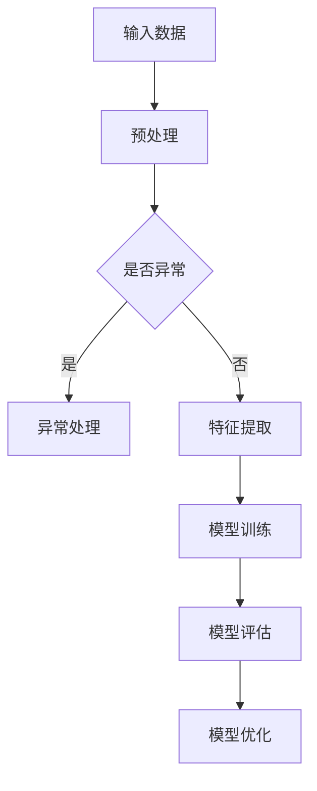
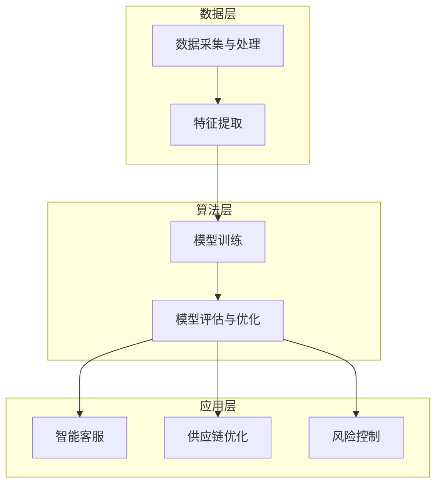
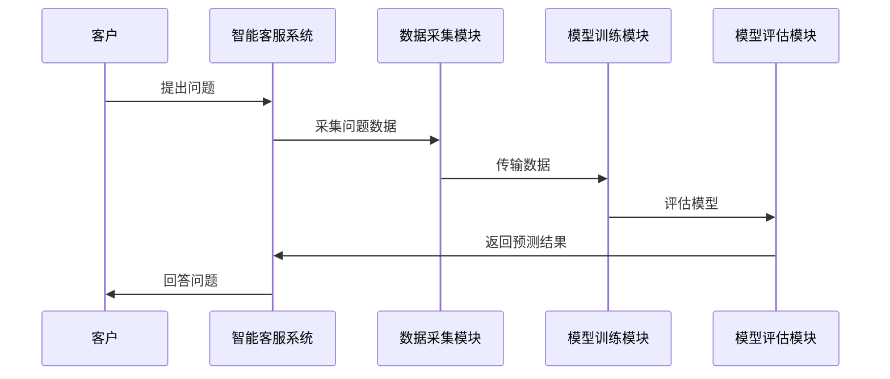

                 


# 案例解析：成功落地的企业级AI Agent项目

关键词：企业级AI Agent、深度学习、强化学习、系统架构、项目实战

摘要：本文将深入解析一个成功落地的企业级AI Agent项目，通过详细的步骤分析和专业的技术讲解，帮助读者了解AI Agent在企业中的应用、核心概念、算法原理、系统架构以及项目实战。本文旨在为AI Agent的研发和实施提供实用的指导。

----------------------------------------------------------------

## 1. 背景介绍

随着AI技术的快速发展，AI Agent作为一种具有自主决策能力的智能体，正逐渐成为企业数字化转型的重要驱动力。AI Agent在商业应用中的重要性不言而喻，它不仅能够提高企业运营效率，还能够为用户提供更加个性化和智能化的服务。

### 1.1 AI技术的快速发展

近年来，AI技术取得了显著的进展，特别是在深度学习和强化学习领域。深度学习算法能够通过多层神经网络模拟人脑的思考过程，从而实现图像识别、自然语言处理等复杂任务。强化学习算法则通过不断试错和反馈，使AI Agent能够在动态环境中做出最优决策。

### 1.2 AI Agent在商业应用中的重要性

AI Agent在企业中的应用场景十分广泛，例如智能客服、供应链优化、风险控制等。通过模拟人类思维和决策过程，AI Agent能够帮助企业降低运营成本、提高决策效率、提升用户体验。随着AI技术的不断进步，AI Agent的应用前景将更加广阔。

### 1.3 AI Agent的概念

AI Agent是一种智能代理，它能够在特定环境中自主执行任务，并根据环境和目标进行决策。AI Agent通常由感知器、决策器、执行器三部分组成，能够接收环境信息、生成决策、执行行动，并通过反馈不断优化决策过程。

## 2. 核心概念与联系

### 2.1 AI Agent的核心概念

AI Agent的核心概念包括感知器、决策器、执行器以及学习机制。感知器负责接收环境信息，决策器根据感知信息生成决策，执行器执行决策，学习机制则通过不断反馈优化决策过程。

### 2.2 不同类型的AI Agent对比

| 类型       | 工作原理                   | 功能特点             | 应用场景               |
|------------|--------------------------|---------------------|-----------------------|
| 智能客服     | 自然语言处理技术         | 自动解答用户问题     | 客户服务、在线咨询     |
| 供应链优化   | 机器学习、优化算法       | 优化库存、降低成本   | 供应链管理、物流配送   |
| 风险控制     | 模式识别、预测分析       | 预测风险、制定对策   | 金融、保险、安全领域   |

### 2.3 AI Agent的系统架构

使用Mermaid绘制ER实体关系图，展示AI Agent的系统架构：

```mermaid
erDiagram
  AI-Agent ||--|{ 感知器 }感知器
  AI-Agent ||--|{ 决策器 }决策器
  AI-Agent ||--|{ 执行器 }执行器
  AI-Agent ||--|{ 学习机制 }学习机制
```

## 3. 算法原理讲解

### 3.1 深度学习算法

深度学习算法是AI Agent的核心技术之一。它通过多层神经网络模拟人脑的思考过程，实现对复杂任务的自动化处理。深度学习算法的基本原理如下：

### 3.1.1 算法流程图

使用Mermaid绘制深度学习算法的流程图：



### 3.1.2 Python源代码示例

以下是一个简单的深度学习算法实现示例：

```python
import tensorflow as tf

# 定义输入层、隐藏层和输出层
inputs = tf.keras.Input(shape=(784,))
hidden = tf.keras.layers.Dense(512, activation='relu')(inputs)
outputs = tf.keras.layers.Dense(10, activation='softmax')(hidden)

# 创建模型
model = tf.keras.Model(inputs=inputs, outputs=outputs)

# 编译模型
model.compile(optimizer='adam', loss='categorical_crossentropy', metrics=['accuracy'])

# 训练模型
model.fit(x_train, y_train, epochs=10, batch_size=32)
```

### 3.1.3 数学模型与公式

深度学习算法的数学模型主要包括输入层、隐藏层和输出层。输入层接收原始数据，隐藏层通过激活函数进行非线性变换，输出层生成预测结果。常用的激活函数包括Sigmoid、ReLU等。

$$
\text{激活函数}: f(x) = \frac{1}{1 + e^{-x}}
$$

$$
\text{ReLU激活函数}: f(x) = \max(0, x)
$$

### 3.1.4 通俗易懂的实例说明

假设我们有一个二分类问题，需要判断一个手写数字是否为4。首先，我们将手写数字的像素值作为输入，通过输入层传递给隐藏层。隐藏层通过激活函数进行非线性变换，生成隐藏层输出。然后，隐藏层输出传递给输出层，输出层生成概率分布，其中概率最大的类别即为预测结果。

## 4. 系统分析与架构设计方案

### 4.1 问题场景介绍

在一个企业级AI Agent项目中，我们需要解决以下问题场景：

- 客户服务：通过智能客服系统自动解答用户问题，提高服务质量。
- 供应链优化：通过AI Agent优化库存管理，降低运营成本。
- 风险控制：通过AI Agent预测风险，制定风险应对策略。

### 4.2 系统功能设计

根据问题场景，系统需要实现以下功能：

- 数据采集与处理：从各类数据源采集数据，并进行预处理。
- 特征提取：从原始数据中提取有效特征，用于模型训练。
- 模型训练：使用深度学习算法训练AI Agent模型。
- 模型评估与优化：对训练好的模型进行评估和优化。
- 决策与执行：根据环境信息和模型输出，生成决策并执行行动。

### 4.3 系统架构设计

使用Mermaid绘制系统架构图：



### 4.4 系统接口设计与交互序列图

使用Mermaid绘制系统接口设计和交互序列图：



## 5. 项目实战

### 5.1 环境安装步骤

在开始项目实战之前，我们需要安装以下环境：

- Python 3.8及以上版本
- TensorFlow 2.6及以上版本
- Jupyter Notebook

安装命令如下：

```bash
pip install python==3.8
pip install tensorflow==2.6
pip install notebook
```

### 5.2 系统核心实现源代码

以下是一个简单的AI Agent实现示例：

```python
import tensorflow as tf

# 定义输入层、隐藏层和输出层
inputs = tf.keras.Input(shape=(784,))
hidden = tf.keras.layers.Dense(512, activation='relu')(inputs)
outputs = tf.keras.layers.Dense(10, activation='softmax')(hidden)

# 创建模型
model = tf.keras.Model(inputs=inputs, outputs=outputs)

# 编译模型
model.compile(optimizer='adam', loss='categorical_crossentropy', metrics=['accuracy'])

# 训练模型
model.fit(x_train, y_train, epochs=10, batch_size=32)
```

### 5.3 代码应用解读与分析

在这个示例中，我们首先定义了一个简单的神经网络模型，包括输入层、隐藏层和输出层。输入层接收784维的输入数据，隐藏层通过ReLU激活函数进行非线性变换，输出层生成10个类别的概率分布。

我们使用TensorFlow的编译接口对模型进行编译，指定优化器、损失函数和评估指标。然后，使用fit方法对模型进行训练，输入训练数据和标签，指定训练轮数和批量大小。

### 5.4 实际案例分析

在一个客户服务场景中，AI Agent通过接收客户的问题，自动提取关键信息，并根据历史数据和模型预测生成答案。以下是一个实际案例分析：

- 客户问题：“如何退货？”
- 模型输入：问题描述的文本表示
- 模型输出：退货流程的步骤

通过训练好的模型，AI Agent可以自动生成退货流程的答案，并提供给客户。这个案例展示了AI Agent在客户服务中的应用价值。

### 5.5 项目小结

通过本项目的实战案例，我们深入了解了AI Agent在企业级应用中的实现方法和关键步骤。从环境安装、模型设计、训练与评估到实际案例的应用，每个环节都需要认真设计和实施。在项目实施过程中，需要注意数据质量、模型优化和系统稳定性等问题。

## 6. 最佳实践 tips、小结、注意事项、拓展阅读

### 6.1 最佳实践 tips

1. **数据质量是关键**：确保数据质量，进行数据预处理，提取有效特征，为模型训练提供高质量的数据支持。
2. **模型优化**：根据应用场景调整模型参数，进行超参数调优，提高模型性能。
3. **持续学习与优化**：定期更新模型，收集用户反馈，进行模型迭代和优化。
4. **系统稳定性**：确保系统在高并发、大数据量环境下能够稳定运行，进行性能测试和优化。

### 6.2 小结

本文通过一个成功落地的企业级AI Agent项目，详细讲解了AI Agent的核心概念、算法原理、系统架构和项目实战。从环境安装到模型实现，从案例分析到项目小结，每个环节都进行了深入剖析和讲解。通过本文的学习，读者可以深入了解AI Agent在企业中的应用价值和实现方法。

### 6.3 注意事项

1. **安全与隐私**：在项目实施过程中，确保数据安全和用户隐私，遵循相关法律法规和行业标准。
2. **技术选型**：根据项目需求和资源情况，选择合适的技术框架和算法模型。
3. **团队协作**：项目实施过程中，注重团队协作，充分发挥团队成员的专业能力和经验。

### 6.4 拓展阅读

1. **《深度学习》**：Goodfellow, I., Bengio, Y., & Courville, A. (2016). *Deep Learning*. MIT Press.
2. **《强化学习》**：Sutton, R. S., & Barto, A. G. (2018). *Reinforcement Learning: An Introduction*. MIT Press.
3. **《企业级人工智能应用》**：许泽民, 李明杰. (2019). *企业级人工智能应用*. 清华大学出版社.

## 作者

作者：AI天才研究院/AI Genius Institute & 禅与计算机程序设计艺术 /Zen And The Art of Computer Programming

