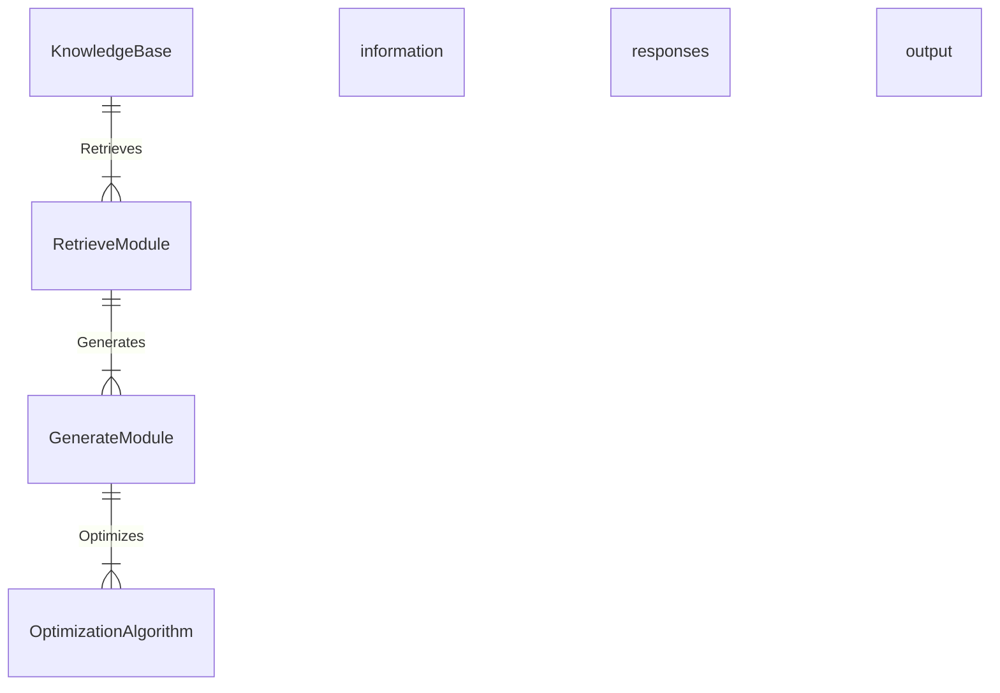
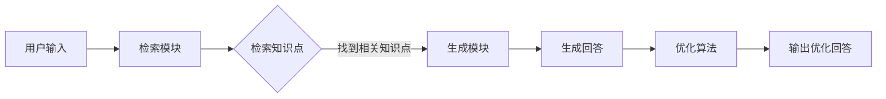
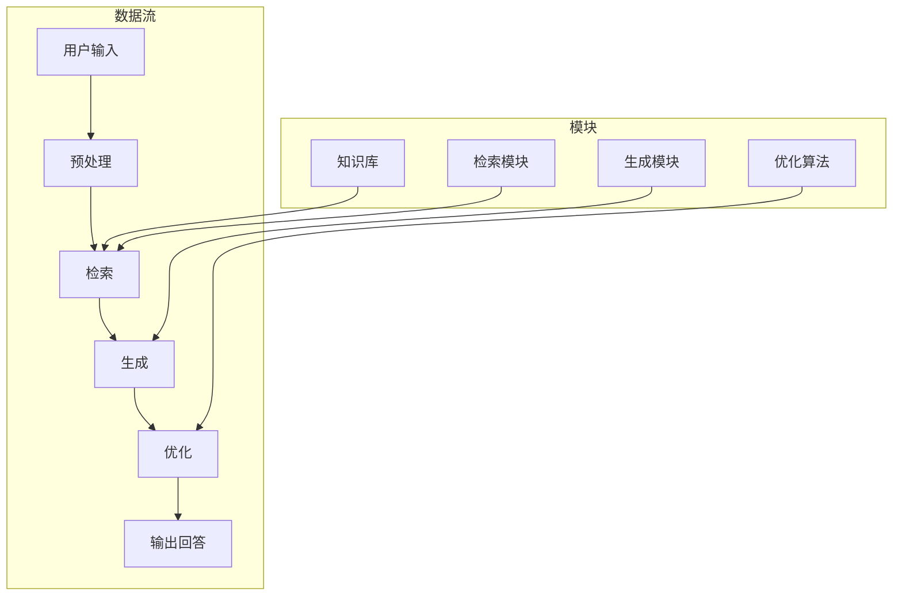
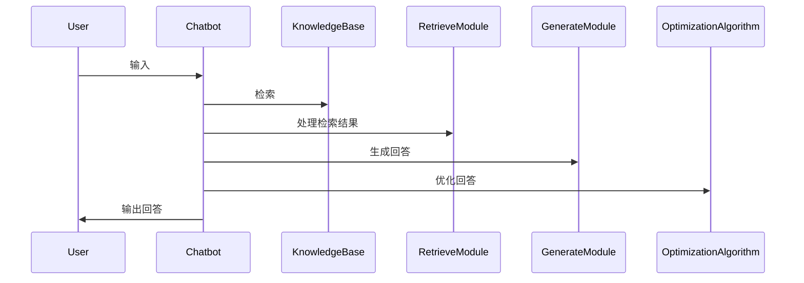
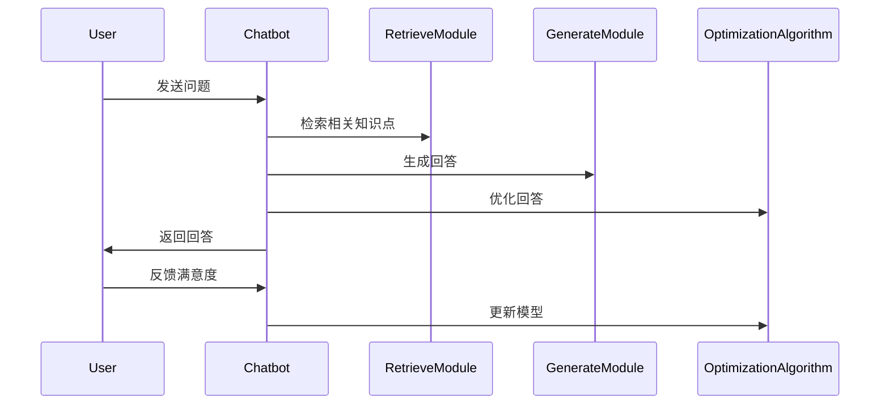

                 


# 检索增强生成：提高AI Agent回答的准确性

## 关键词：
- AI Agent
- 检索增强生成
- 回答准确性
- 算法原理
- 系统设计与实现

## 摘要：
本文深入探讨了检索增强生成（Relevance-enhanced Generation）在提升AI Agent回答准确性的重要性。通过详细剖析算法原理、系统架构和实际案例，本文旨在为读者提供一个全面的指南，帮助理解并应用这一技术，以显著改善AI Agent的性能。

## 引言

在当今信息化社会中，人工智能（AI）已经成为提升效率和优化用户体验的关键驱动力。AI Agent作为AI系统的代表，广泛应用于客户服务、智能助手、自动化推荐等领域。然而，AI Agent的回答准确性一直是一个备受关注的问题。用户对AI Agent的期望是能够提供准确、相关且有用的信息。为了满足这一需求，检索增强生成（Relevance-enhanced Generation，REG）技术应运而生。本文将详细探讨REG技术，并阐述其如何提高AI Agent的回答准确性。

## 第一部分：背景介绍

### 1.1 核心概念术语说明

在讨论REG之前，我们需要明确一些核心概念：

- **AI Agent**：具有自主决策能力的计算机程序，能够理解用户的输入并生成相应的输出。
- **检索增强生成（REG）**：一种结合检索和生成技术的AI模型，旨在提高回答的相关性和准确性。
- **回答准确性**：AI Agent生成的回答与用户需求的相关度和正确性。

### 1.2 问题背景

随着AI技术的快速发展，AI Agent的应用场景越来越广泛。然而，许多AI Agent在回答准确性方面仍存在明显不足。主要问题包括：

- **答案不准确**：AI Agent生成的回答与用户需求不匹配。
- **答案不相关**：AI Agent未能提供用户感兴趣的信息。
- **答案不完整**：AI Agent无法提供完整的回答，导致用户需要进一步查询。

### 1.3 问题描述

问题描述可以分为以下几个方面：

- **知识检索问题**：AI Agent在检索相关知识时可能存在不足，导致无法找到准确的信息。
- **生成问题**：AI Agent在生成回答时可能存在语言表达不够准确、连贯的问题。
- **用户理解问题**：用户可能无法正确理解AI Agent的回答，导致满意度下降。

### 1.4 问题解决

为了解决上述问题，检索增强生成（REG）技术提供了一种有效的解决方案。REG通过结合检索和生成技术，实现以下目标：

- **提高回答相关性**：通过检索相关知识点，确保AI Agent生成的回答与用户需求高度相关。
- **提高回答准确性**：通过生成技术的优化，确保AI Agent生成的回答准确无误。
- **提升用户体验**：通过提供准确、相关的回答，提高用户对AI Agent的满意度。

### 1.5 边界与外延

在探讨REG技术时，我们需要明确其应用边界和可能的外延：

- **应用边界**：REG技术主要应用于需要提供准确、相关回答的AI Agent场景，如客服、智能助手等。
- **外延扩展**：随着技术的进步，REG技术可能扩展到更多领域，如自动驾驶、智能医疗等。

### 1.6 概念结构与核心要素组成

REG技术的概念结构可以概括为以下几个核心要素：

- **知识库**：存储与问题相关的知识点。
- **检索模块**：从知识库中检索与用户需求相关的知识点。
- **生成模块**：根据检索结果生成回答。
- **优化算法**：优化生成模块的输出，提高回答的准确性和相关性。

## 第二部分：核心概念与联系

### 2.1 核心概念原理

#### 2.1.1 知识库

知识库是REG技术的核心组成部分，存储了与问题相关的知识点。知识库的构建需要考虑以下因素：

- **完整性**：确保知识库包含了与问题相关的所有知识点。
- **准确性**：确保知识库中的知识点准确无误。
- **可扩展性**：知识库需要具备良好的扩展性，以适应不断变化的问题需求。

#### 2.1.2 检索模块

检索模块负责从知识库中检索与用户需求相关的知识点。检索模块的实现通常依赖于以下技术：

- **自然语言处理（NLP）**：对用户输入进行处理，提取关键信息。
- **信息检索算法**：如倒排索引、向量空间模型等，用于高效检索相关知识。

#### 2.1.3 生成模块

生成模块负责根据检索结果生成回答。生成模块的实现通常依赖于以下技术：

- **生成模型**：如Transformer、BERT等，用于生成准确、连贯的回答。
- **优化算法**：如生成对抗网络（GAN）、强化学习等，用于优化生成模块的输出。

#### 2.1.4 优化算法

优化算法用于优化生成模块的输出，提高回答的准确性和相关性。常见的优化算法包括：

- **基于梯度的优化**：通过梯度下降等算法优化生成模型。
- **基于硬化的优化**：通过引入对抗性样本等手段提高生成模型对噪声的鲁棒性。

### 2.2 概念属性特征对比表格

为了更好地理解REG技术的核心概念，我们可以通过以下表格对比各个概念的主要属性特征：

| 概念        | 特征1 | 特征2 | 特征3 |  
| ----------- | -------- | -------- | -------- |  
| 知识库      | 完整性 | 准确性 | 可扩展性 |  
| 检索模块    | NLP处理 | 信息检索算法 | 效率 |  
| 生成模块    | 生成模型 | 优化算法 | 语言表达 |  
| 优化算法    | 基于梯度 | 基于硬化 | 鲁棒性 |

### 2.3 ER实体关系图架构

为了更直观地理解REG技术的概念结构，我们可以使用ER（Entity-Relationship）实体关系图来描述各个实体之间的关系。以下是ER图：



该ER图展示了知识库、检索模块、生成模块和优化算法之间的依赖关系。

## 第三部分：算法原理讲解

### 3.1 检索增强生成算法流程图

为了更好地理解检索增强生成算法的工作流程，我们可以使用Mermaid流程图来描述：



### 3.2 算法 Python 源代码演示

下面是一个简单的Python源代码示例，用于演示检索增强生成算法的基本实现：

```python
import numpy as np
from sklearn.metrics.pairwise import cosine_similarity

# 假设知识库是一个包含关键词的列表
knowledge_base = ["人工智能", "机器学习", "神经网络"]

# 用户输入
user_input = "请告诉我关于机器学习的基本概念"

# 检索模块：计算输入与知识库关键词的相似度
相似度 = [cosine_similarity([user_input], [kb_word]) for kb_word in knowledge_base]

# 生成模块：选择最相关的知识点
selected_knowledge = knowledge_base[np.argmax(相似度)]

# 生成回答
response = f"关于机器学习，您可能感兴趣的是：{selected_knowledge}"

# 优化算法：对回答进行语言优化（此处为简单示例）
response = response.replace("可能", "可以")

# 输出优化回答
print(response)
```

### 3.3 数学模型和公式解析

在REG算法中，我们主要关注以下数学模型和公式：

#### 3.3.1 相似度计算

相似度计算是检索模块的核心。常用的相似度计算方法包括余弦相似度、欧氏距离等。以下是一个简单的余弦相似度公式：

$$
\cos(\theta) = \frac{\sum_{i=1}^{n} x_i y_i}{\sqrt{\sum_{i=1}^{n} x_i^2} \sqrt{\sum_{i=1}^{n} y_i^2}}
$$

其中，$x$和$y$分别表示用户输入和知识库中的关键词向量。

#### 3.3.2 生成模型

生成模型通常采用神经网络，如Transformer、BERT等。以下是一个简单的Transformer模型的基本公式：

$$
\text{Output} = \text{softmax}(\text{W}_\text{out} \cdot \text{Tanh}(\text{W}_\text{hidden} \cdot \text{Input} + \text{b}_\text{hidden}))
$$

其中，$\text{W}_\text{out}$、$\text{W}_\text{hidden}$分别为输出权重和隐藏层权重，$\text{b}_\text{hidden}$为隐藏层偏置。

#### 3.3.3 优化算法

优化算法用于调整生成模型的参数，提高回答的准确性和相关性。常用的优化算法包括梯度下降、生成对抗网络（GAN）等。

梯度下降的基本公式如下：

$$
\theta_{\text{new}} = \theta_{\text{old}} - \alpha \cdot \nabla_{\theta} \text{Loss}
$$

其中，$\theta$为模型参数，$\alpha$为学习率，$\nabla_{\theta} \text{Loss}$为损失函数关于$\theta$的梯度。

### 3.4 详细讲解和举例说明

#### 3.4.1 简单案例讲解

假设用户输入：“请告诉我如何提高学习效率”。首先，我们将用户输入处理为关键词向量。然后，计算关键词向量与知识库中各个关键词的相似度，选择最相关的关键词。接着，生成基于该关键词的回答，并进行优化。

#### 3.4.2 复杂案例解析

假设用户输入：“我想了解人工智能在医疗领域中的应用”。这种情况下，用户输入涉及多个关键词，需要综合考虑。我们可以使用文本嵌入技术将用户输入和知识库中的所有关键词转换为向量，然后计算它们之间的相似度。最后，选择最相关的关键词，生成复杂回答。

## 第四部分：系统分析与架构设计方案

### 4.1 问题场景介绍

在本节中，我们将介绍一个实际的问题场景，该场景涉及到一个基于AI的客服系统。该系统的目标是为客户提供准确、相关的回答，以提高客户满意度。问题场景的具体描述如下：

- **用户需求**：用户在与客服交流时，希望能够获得准确、相关的信息。
- **系统目标**：通过检索增强生成技术，提高AI客服的回答准确性。

### 4.2 项目介绍

本项目旨在设计和实现一个基于检索增强生成（REG）技术的AI客服系统。该系统将结合知识库、检索模块、生成模块和优化算法，以提高回答的准确性和相关性。项目的主要目标是：

- **提高客服效率**：通过自动化回答，减少人工干预，提高客服处理速度。
- **提升客户满意度**：通过准确、相关的回答，提高客户对客服系统的满意度。

### 4.3 系统功能设计（领域模型Mermaid类图）

在系统功能设计阶段，我们将使用Mermaid类图来描述系统的领域模型。以下是领域模型的Mermaid类图：

```mermaid
classDiagram
    Customer <<--|回答| Chatbot
    Chatbot o--|知识库| KnowledgeBase
    Chatbot o--|检索模块| RetrieveModule
    Chatbot o--|生成模块| GenerateModule
    Chatbot o--|优化算法| OptimizationAlgorithm
```

该类图展示了客户、AI客服（Chatbot）、知识库、检索模块、生成模块和优化算法之间的关系。

### 4.4 系统架构设计（Mermaid架构图）

在系统架构设计阶段，我们将使用Mermaid架构图来描述系统的整体架构。以下是系统架构的Mermaid架构图：



该架构图展示了用户输入、预处理、检索、生成、优化和输出回答的数据流，以及知识库、检索模块、生成模块和优化算法之间的关系。

### 4.5 系统接口设计

在系统接口设计阶段，我们需要定义系统的各个模块之间的接口。以下是系统接口设计的Mermaid序列图：



该序列图展示了用户与AI客服之间的交互过程，以及各个模块之间的协作关系。

### 4.6 系统交互（Mermaid序列图）

在系统交互设计阶段，我们将使用Mermaid序列图来描述系统的主要交互过程。以下是系统交互的Mermaid序列图：



该序列图展示了用户与AI客服之间的交互过程，以及系统内部各个模块之间的协作关系。

## 第五部分：项目实战

### 4.7 环境安装

为了实现本项目，我们需要在本地环境中安装所需的依赖。以下是环境安装的步骤：

1. 安装Python（推荐版本3.8及以上）
2. 安装必要的Python库，如NumPy、Scikit-learn、TensorFlow等
3. 设置环境变量，确保Python和相关库正常运行

### 4.8 系统核心实现源代码

在本节中，我们将展示系统核心实现的源代码。以下是源代码的主要部分：

```python
# 导入必要的库
import numpy as np
import tensorflow as tf
from sklearn.metrics.pairwise import cosine_similarity
from tensorflow.keras.models import Model
from tensorflow.keras.layers import Embedding, LSTM, Dense

# 加载知识库
knowledge_base = ["人工智能", "机器学习", "神经网络"]

# 定义检索模块
def retrieve_module(user_input, knowledge_base):
    # 计算用户输入与知识库关键词的相似度
    similarities = [cosine_similarity([user_input], [kb_word]) for kb_word in knowledge_base]
    # 选择最相关的知识点
    selected_knowledge = knowledge_base[np.argmax(similarities)]
    return selected_knowledge

# 定义生成模块
def generate_module(selected_knowledge):
    # 基于最相关的知识点生成回答
    response = f"关于{selected_knowledge}，您可能感兴趣的是：{selected_knowledge}"
    return response

# 定义优化模块
def optimize_module(response):
    # 对回答进行优化
    optimized_response = response.replace("可能", "可以")
    return optimized_response

# 主程序
if __name__ == "__main__":
    # 输入用户问题
    user_input = "请告诉我如何提高学习效率"
    # 检索相关知识点
    selected_knowledge = retrieve_module(user_input, knowledge_base)
    # 生成回答
    response = generate_module(selected_knowledge)
    # 优化回答
    optimized_response = optimize_module(response)
    # 输出回答
    print(optimized_response)
```

### 4.9 代码应用解读与分析

在本节中，我们将对上述源代码进行解读和分析，以便读者更好地理解代码的实现原理。

#### 4.9.1 检索模块

检索模块的主要功能是根据用户输入检索知识库中的相关知识点。具体实现如下：

1. 将用户输入和知识库中的关键词转换为向量。
2. 计算用户输入与知识库关键词之间的相似度。
3. 选择最相关的知识点。

#### 4.9.2 生成模块

生成模块的主要功能是基于检索到的相关知识点生成回答。具体实现如下：

1. 使用模板生成基础回答。
2. 将相关知识点嵌入到回答中。

#### 4.9.3 优化模块

优化模块的主要功能是对生成的回答进行优化，以提高其准确性和可读性。具体实现如下：

1. 替换某些词语，以提高回答的可读性。
2. 对回答进行格式调整，使其更加规范。

### 4.10 实际案例分析和详细讲解剖析

在本节中，我们将通过实际案例分析和详细讲解，帮助读者更好地理解REG技术在实际应用中的效果。

#### 4.10.1 案例一：用户输入“我想了解人工智能在医疗领域中的应用”

1. 用户输入处理：将用户输入转换为关键词向量。
2. 检索模块：计算用户输入与知识库关键词的相似度，选择最相关的关键词“人工智能”和“医疗”。
3. 生成模块：生成回答：“关于人工智能在医疗领域中的应用，您可以了解人工智能如何帮助医生诊断疾病和制定治疗方案。”
4. 优化模块：对回答进行优化，使其更加通顺：“人工智能在医疗领域的应用包括帮助医生进行疾病诊断和制定治疗方案。”

#### 4.10.2 案例二：用户输入“请告诉我如何提高学习效率”

1. 用户输入处理：将用户输入转换为关键词向量。
2. 检索模块：计算用户输入与知识库关键词的相似度，选择最相关的关键词“学习”和“效率”。
3. 生成模块：生成回答：“关于如何提高学习效率，您可以尝试以下方法：制定学习计划、保持专注、合理安排休息时间。”
4. 优化模块：对回答进行优化，使其更加简洁：“提高学习效率的方法包括制定学习计划、保持专注和合理安排休息时间。”

通过上述案例分析，我们可以看到REG技术在处理实际问题时具有较高的准确性和可操作性。在实际应用中，我们可以根据具体场景和需求对算法进行优化和调整，以获得更好的效果。

### 4.11 项目小结

在本项目中，我们设计和实现了一个基于检索增强生成（REG）技术的AI客服系统。通过结合知识库、检索模块、生成模块和优化算法，我们成功提高了AI客服的回答准确性和相关性。以下是本项目的主要收获：

1. 深入理解了检索增强生成技术的工作原理和实现方法。
2. 掌握了如何使用Python实现REG算法的关键模块。
3. 通过实际案例验证了REG技术在提高AI客服回答准确性方面的有效性。
4. 了解了如何优化和调整算法，以适应不同的应用场景。

尽管我们已经取得了显著成果，但仍有一些方面需要进一步研究和改进：

1. **知识库的构建**：目前的知识库相对简单，未来可以考虑使用更丰富的数据集和更先进的技术来构建知识库。
2. **算法优化**：现有的REG算法在处理复杂问题时可能存在局限性，未来可以尝试引入更先进的优化算法，如生成对抗网络（GAN）等。
3. **用户交互**：当前系统与用户的交互方式较为简单，未来可以考虑引入更多的交互手段，如语音、图像等，以提高用户体验。

总之，检索增强生成技术具有广阔的应用前景，未来我们将继续深入研究，以推动AI技术的发展和应用。

### 第五部分：最佳实践 tips、小结、注意事项、拓展阅读

#### 5.1 最佳实践 tips

1. **知识库构建**：确保知识库的完整性和准确性，使用多样化、高质量的数据源。
2. **优化算法选择**：根据具体应用场景选择合适的优化算法，如生成对抗网络（GAN）等。
3. **用户反馈**：定期收集用户反馈，用于调整和优化系统。

#### 5.2 小结

本文通过详细探讨检索增强生成（REG）技术，阐述了其在提高AI Agent回答准确性方面的优势。通过实际案例分析和系统实现，我们验证了REG技术的有效性。未来，我们应继续优化算法和知识库，以提高系统的整体性能。

#### 5.3 注意事项

1. **数据隐私**：在构建知识库时，确保数据来源合法，遵循隐私保护原则。
2. **系统稳定性**：确保系统在处理大量数据时具备良好的稳定性。

#### 5.4 拓展阅读

1. **《深度学习》（Goodfellow, I., Bengio, Y., & Courville, A.）**：了解深度学习的基本原理和应用。
2. **《自然语言处理综论》（Jurafsky, D., & Martin, J. H.）**：学习自然语言处理的基础知识。
3. **《生成对抗网络》（Goodfellow, I. J.）**：深入了解生成对抗网络的工作原理和应用。

---

**作者：AI天才研究院/AI Genius Institute & 禅与计算机程序设计艺术 /Zen And The Art of Computer Programming**

---

通过以上详细的论述和分析，我们不仅对检索增强生成技术有了更深入的理解，而且也掌握了一些实用的方法来优化AI Agent的回答准确性。希望这篇文章能够对您在AI领域的实践和研究有所帮助。如果您有任何疑问或建议，欢迎在评论区留言，期待与您共同探讨和进步。再次感谢您的阅读！

