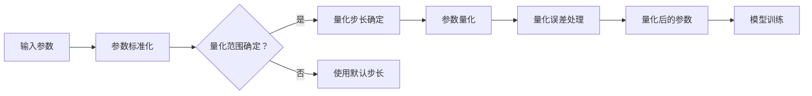
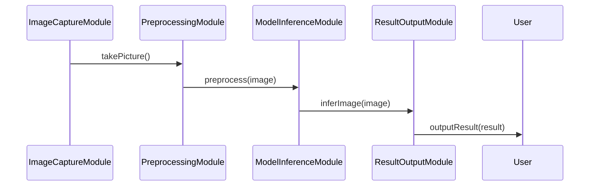
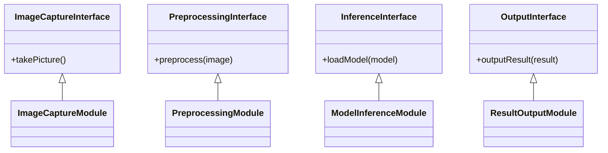
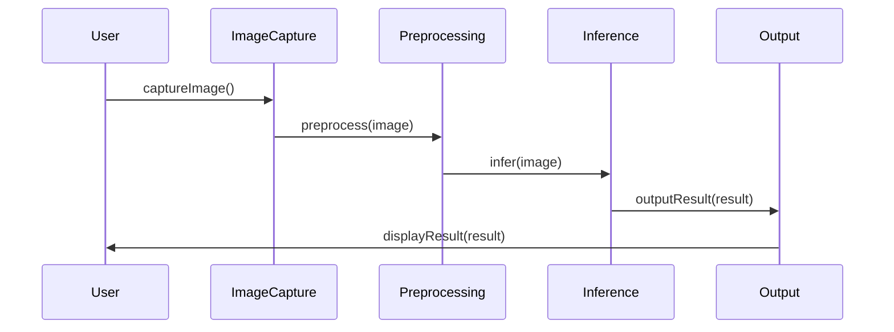

                 

### 引言：模型量化的背景与意义

#### 模型量化：概念与作用

模型量化（Model Quantization）是人工智能（AI）领域中的一种关键技术，其主要目标是通过减少模型参数的精度，从而降低模型的存储和计算需求。这一技术的核心在于将原本使用高精度浮点数表示的模型参数转换为低精度的整数表示。通过这种转换，模型在保留其性能的同时，能够显著减少所需存储空间和计算资源，从而在硬件资源受限的场景中发挥重要作用。

模型量化技术的应用场景十分广泛。在智能手机、嵌入式设备、物联网（IoT）等硬件资源有限的设备上，AI模型的计算和存储需求常常成为瓶颈。通过量化技术，这些设备可以在保证模型性能的同时，显著减少硬件资源的消耗。此外，在自动驾驶、智能监控、医疗诊断等需要实时处理的领域，量化技术也能够提升模型的响应速度，提高系统的整体性能。

#### 模型量化：目标与挑战

模型量化的目标可以概括为“两低一高”，即降低模型大小（low model size）、降低模型计算需求（low computation demand）和保持模型性能（high performance）。然而，要实现这些目标并非易事，量化技术面临着诸多挑战。

首先，量化过程中的精度损失可能会影响模型的性能。如何平衡量化精度和计算效率之间的矛盾，是量化技术面临的首要问题。其次，量化算法的设计需要考虑不同类型的神经网络和不同的应用场景，这使得量化算法的通用性和适应性成为另一个挑战。此外，量化技术的标准化和统一规范也是亟待解决的问题。

#### 模型量化：重要性

随着AI技术的不断发展，AI模型的复杂度和规模也在不断增大。这不仅增加了模型的存储和计算需求，也对硬件性能提出了更高的要求。在此背景下，模型量化技术的重要性愈发凸显。它不仅能够缓解硬件资源不足的问题，还能够推动AI技术在更广泛的应用场景中落地。

总之，模型量化技术是AI领域中的一个关键环节，其发展不仅能够提升AI模型的效率和应用范围，还能够推动硬件技术的发展。在接下来的章节中，我们将深入探讨模型量化的原理、技术细节以及实际应用，帮助读者全面了解这一技术的重要性和应用价值。

### 关键词

- 模型量化
- 人工智能
- 硬件需求
- 低精度表示
- 计算效率
- 模型性能

### 摘要

本文系统地介绍了模型量化技术，一种旨在降低AI模型硬件需求的关键技术。模型量化通过将高精度浮点数参数转换为低精度整数表示，显著减少模型的存储和计算需求，从而在硬件资源有限的设备上提升AI模型的应用效果。本文首先阐述了模型量化的背景与意义，详细介绍了其定义、作用和目标。接着，深入探讨了模型量化的技术原理，包括量化技术的基本原理、分类以及在AI模型中的应用。随后，通过具体的算法原理讲解、Python源代码实现，以及模型量化的应用实践，展示了模型量化在实际应用中的效果。最后，本文分析了模型量化面临的挑战，探讨了其未来的发展趋势，为模型量化技术的进一步研究和应用提供了方向。

## 目录大纲设计步骤

### 步骤一：确定书籍的核心内容和结构

首先，我们需要明确书籍的主题是“模型量化：降低AI Agent的硬件需求”。基于这一主题，书籍的核心内容应当围绕模型量化的定义、原理、技术、应用以及相关的挑战和未来发展趋势展开。

**核心内容概述**：

1. **模型量化的定义和作用**：介绍模型量化的基本概念，解释其如何降低AI Agent的硬件需求。
2. **基础知识**：阐述模型量化所需的技术背景和相关术语。
3. **技术原理**：详细讲解模型量化的技术原理，包括量化技术的基本原理、量化算法、以及在不同神经网络结构中的应用。
4. **应用实践**：通过实际案例展示模型量化在AI Agent中的应用效果。
5. **挑战与未来**：探讨模型量化技术目前面临的挑战以及未来可能的发展趋势。

### 步骤二：确定书籍的基本结构

一本技术书籍通常包含以下几个基本部分：

1. **引言**：介绍模型量化的背景、意义和目标。
2. **基础知识**：介绍模型量化的基本概念、相关技术术语。
3. **技术原理**：详细讲解模型量化的技术原理、算法和实现。
4. **应用实践**：展示模型量化在实际应用中的效果和案例。
5. **挑战与未来**：探讨模型量化面临的挑战和未来的发展趋势。
6. **参考文献**：列出书籍中引用的相关文献和参考资料。

**基本结构设计**：

1. **引言**：
   - 模型量化的定义与作用
   - 模型量化的重要性

2. **基础知识**：
   - 相关技术术语
   - 模型量化的基本概念和原理

3. **技术原理**：
   - 模型量化技术的详细解释
   - 不同量化算法的比较和分析
   - 量化算法的mermaid流程图展示

4. **应用实践**：
   - 模型量化在AI Agent中的应用场景
   - 案例分析

5. **挑战与未来**：
   - 模型量化面临的挑战
   - 未来发展趋势和展望

6. **参考文献**：
   - 相关文献综述
   - 引用的技术论文和书籍

### 步骤三：细化章节内容

根据基本结构，我们可以进一步细化每个章节的内容，确保每个章节都有明确的主题和目标。以下是对各章节的细化设计：

**1. 引言**：

- **1.1 模型量化的背景**：
  - 人工智能的发展历程
  - 硬件需求增长对AI的挑战
  - 模型量化的提出与重要性

- **1.2 模型量化的目标**：
  - 降低模型大小
  - 降低计算需求
  - 保持模型性能

**2. 基础知识**：

- **2.1 技术术语**：
  - 浮点数与整数
  - 量化精度与计算效率

- **2.2 模型量化的基本概念**：
  - 模型量化的定义
  - 模型量化与传统压缩技术的区别

**3. 技术原理**：

- **3.1 模型量化技术原理**：
  - 量化技术的基本原理
  - 模型量化在神经网络中的实现

- **3.2 量化算法**：
  - 不同量化算法的比较
  - 常见的量化算法介绍

- **3.3 mermaid流程图**：
  - 量化算法的mermaid流程图展示

**4. 应用实践**：

- **4.1 应用场景**：
  - 模型量化在AI Agent中的应用
  - 应用场景的分析

- **4.2 案例分析**：
  - 模型量化在不同领域的案例
  - 案例的详细解析

**5. 挑战与未来**：

- **5.1 挑战**：
  - 量化精度与计算效率的平衡
  - 量化算法的通用性和适应性

- **5.2 未来发展趋势**：
  - 模型量化的技术趋势
  - 未来应用的前景

### 步骤四：设计目录大纲

根据上述细化内容，我们可以设计出完整的目录大纲。以下是目录大纲的示例：

```
----------------------------------------------------------------
# 模型量化：降低AI Agent的硬件需求

## 引言

### 1.1 模型量化的背景

### 1.2 模型量化的目标

## 基础知识

### 2.1 技术术语

### 2.2 模型量化的基本概念

## 技术原理

### 3.1 模型量化技术原理

### 3.2 量化算法

### 3.3 mermaid流程图

## 应用实践

### 4.1 应用场景

### 4.2 案例分析

## 挑战与未来

### 5.1 挑战

### 5.2 未来发展趋势

## 参考文献
----------------------------------------------------------------
```

通过上述步骤，我们成功确定了书籍的核心内容和结构，细化了每个章节的内容，并设计了完整的目录大纲。接下来，我们将根据这个大纲，逐步撰写和完善每一章节的内容。

## 1.1 模型量化的背景

随着人工智能（AI）技术的迅猛发展，AI模型在各个领域的应用越来越广泛。然而，AI模型的复杂性也在不断增加，其背后的算法和架构变得越来越庞大。这不仅使得模型的训练和推理过程变得更加耗时，同时也对硬件资源提出了更高的要求。面对这些挑战，模型量化技术应运而生，成为了降低AI模型硬件需求的关键手段。

#### 人工智能的发展历程

人工智能的发展历程可以追溯到20世纪50年代，当时科学家们首次提出了“人工智能”的概念。早期的AI研究主要集中在规则系统、专家系统和逻辑推理等领域。然而，由于计算资源和数据限制，这些早期的AI系统在实际应用中效果有限。随着计算机技术的进步和大数据时代的到来，深度学习算法在图像识别、语音识别、自然语言处理等领域取得了突破性进展，推动了AI技术的快速发展。

#### 硬件需求增长对AI的挑战

AI模型的复杂度和规模不断增大，导致其对计算资源和存储资源的需求也急剧增加。例如，在图像识别领域，一个复杂的深度神经网络可能包含数亿个参数，这些参数通常使用高精度的浮点数表示。这种高精度表示虽然能够在精度上达到较好的效果，但同时也带来了巨大的存储和计算需求。具体来说，这些挑战主要表现在以下几个方面：

1. **存储需求**：高精度浮点数参数的模型通常需要占用大量的存储空间，这使得在存储受限的设备上部署模型变得困难。

2. **计算资源**：高精度浮点数运算需要更多的计算资源，尤其是在资源有限的嵌入式设备和移动设备上，这可能会影响模型的实时性和响应速度。

3. **能效消耗**：高精度浮点数运算的能效消耗较大，不利于在能源受限的场景中应用AI模型。

#### 模型量化的提出与重要性

模型量化技术的提出，正是为了应对这些挑战。通过将高精度浮点数参数转换为低精度的整数表示，模型量化可以显著降低模型的存储和计算需求。具体来说，模型量化技术具有以下几个重要作用：

1. **降低存储需求**：低精度整数表示可以大幅减少模型的存储空间，使得在存储受限的设备上部署模型变得更加容易。

2. **降低计算需求**：低精度整数运算相对于高精度浮点数运算更加高效，可以显著降低模型的计算资源需求。

3. **提高能效**：低精度整数运算的能效消耗较小，有助于在能源受限的场景中应用AI模型。

总之，模型量化技术在降低AI模型硬件需求方面具有重要意义。它不仅能够提升AI模型的部署和应用效果，还能够推动AI技术在更广泛的应用场景中实现。在接下来的章节中，我们将进一步探讨模型量化的技术原理、实现方法和实际应用，帮助读者全面了解这一关键技术的应用价值。

## 1.2 模型量化的目标

模型量化技术的核心目标可以概括为“两低一高”，即降低模型大小（low model size）、降低模型计算需求（low computation demand）和保持模型性能（high performance）。这三个目标相辅相成，共同构成了模型量化的整体战略。

#### 降低模型大小

在AI模型的开发过程中，模型的大小是一个至关重要的因素。一个庞大的模型不仅需要更多的存储空间，还可能增加计算资源的需求。特别是在资源受限的设备上，如智能手机、嵌入式系统和物联网设备，模型的存储和计算需求可能会成为限制其应用的瓶颈。通过模型量化，可以将高精度的浮点数参数转换为低精度的整数表示，从而显著减少模型的存储需求。例如，一个原本使用32位浮点数表示的模型参数，通过量化可以转换为8位整数表示，从而减少75%的存储空间。这种降低存储需求的效果，使得模型能够更加容易地在存储资源有限的设备上部署和应用。

#### 降低模型计算需求

除了存储需求，模型计算需求也是影响模型应用效果的重要因素。高精度浮点数运算通常需要更多的计算资源和时间，这可能会影响模型的实时性和响应速度。特别是在需要实时处理大量数据的场景中，如自动驾驶、智能监控和实时语音识别等，计算效率显得尤为重要。模型量化通过减少参数的精度，降低了模型的计算复杂度。例如，使用8位整数进行运算，相对于32位浮点数运算，可以在相同的计算资源下显著提高处理速度。这种降低计算需求的效果，使得模型能够更加高效地运行，提升系统的整体性能。

#### 保持模型性能

尽管量化技术通过降低参数精度来减少存储和计算需求，但这一过程可能会带来精度损失，从而影响模型的性能。因此，保持模型性能是模型量化技术需要克服的一个重要挑战。为了实现这一目标，量化技术需要采用一系列的算法和策略，确保量化后的模型能够保持与原始模型相近的性能。以下是一些常用的方法和策略：

1. **量化范围调整**：通过调整量化范围，可以控制量化过程中的精度损失。例如，可以选择适当的量化步长，使得量化后的参数能够在保持性能的同时，避免过大的精度损失。

2. **量化算法优化**：不同的量化算法对模型的性能影响不同。一些优化算法，如渐进量化（Gradual Quantization）和自适应量化（Adaptive Quantization），可以在量化过程中动态调整参数的精度，从而在保持性能的同时，减少精度损失。

3. **后量化调整**：量化后的模型可能需要进行一些额外的调整，以弥补量化过程中的精度损失。例如，通过训练或微调量化后的模型，可以进一步优化其性能。

4. **量化范围扩展**：在某些场景下，可以使用扩展量化范围的方法，将部分参数的精度保持在高精度水平，从而在关键部分保持模型的性能。

通过上述方法和策略，模型量化技术可以在降低存储和计算需求的同时，保持模型的性能，实现“两低一高”的目标。

#### 实现模型量化目标的重要性

实现模型量化目标的重要性体现在以下几个方面：

1. **提升应用效果**：通过降低模型大小和计算需求，模型量化能够提升AI模型在资源受限设备上的应用效果，使得模型能够在更广泛的场景中得到应用。

2. **降低硬件成本**：减少存储和计算需求，可以降低硬件设备的成本，特别是在大规模部署AI模型时，硬件成本的节约具有重要意义。

3. **提高能效**：降低计算需求，可以显著减少模型的能效消耗，这对于在能源受限的场景中应用AI模型至关重要。

4. **加速模型迭代**：通过降低模型的存储和计算需求，可以加快模型迭代的速度，提高开发效率，推动AI技术的快速发展。

总之，模型量化技术的目标在于通过降低模型大小和计算需求，同时保持模型性能，从而提升AI模型的应用效果和开发效率。这一目标不仅具有重要的实际应用价值，也是AI领域持续发展的重要方向。

## 1.3 模型量化的基础知识

在深入探讨模型量化技术之前，我们需要了解一些相关的基础知识，包括技术术语、量化精度与计算效率的关系以及模型量化的基本概念和原理。这些基础知识为我们理解和应用模型量化技术奠定了坚实的基础。

#### 技术术语

1. **浮点数与整数**

浮点数和整数是计算机中常用的两种数值表示方法。浮点数可以表示较大范围的数值，并且支持小数点运算，但它们通常需要较高的存储空间和计算资源。例如，32位浮点数（单精度浮点数，FP32）可以表示大约1.19 x 10^-38 到 3.40 x 10^38 范围内的数值，但需要占用32位存储空间。相比之下，整数只能表示整数值，但其存储空间和计算资源需求较低。例如，8位整数（INT8）可以表示-128 到 127 范围内的整数，但仅需占用8位存储空间。

2. **量化精度**

量化精度是指数值表示的精确度，通常用位数来衡量。量化精度越高，数值表示的精确度越高，但所需的存储空间和计算资源也越多。例如，FP32具有较高的量化精度，但需要更多的存储空间和计算资源。相比之下，INT8的量化精度较低，但所需的存储空间和计算资源较少。

3. **量化范围**

量化范围是指可以表示的数值范围。例如，FP32的量化范围大约在1.19 x 10^-38 到 3.40 x 10^38 之间。而INT8的量化范围则在-128 到 127 之间。量化范围决定了数值表示的动态范围，量化范围较大会提高数值表示的灵活性，但也增加了存储和计算需求。

4. **量化步长**

量化步长是指量化过程中数值变化的最小单位。例如，在量化一个浮点数为INT8时，量化步长决定了每个整数表示的浮点数值之间的差距。量化步长越小，量化精度越高，但计算复杂度也越大。

#### 量化精度与计算效率的关系

量化精度与计算效率之间存在一定的权衡关系。较高的量化精度可以提供更好的数值表示精度，但会消耗更多的存储空间和计算资源。而较低的量化精度则可以减少存储和计算需求，但可能会带来精度损失。以下是一些关键点：

1. **存储空间**：量化精度越高，所需的存储空间越大。例如，FP32需要32位存储空间，而INT8仅需8位存储空间。

2. **计算资源**：量化精度越高，计算复杂度越大。例如，FP32运算需要更多的计算资源和时间，而INT8运算则相对高效。

3. **精度损失**：较低的量化精度可能会引入量化误差，导致模型性能下降。量化误差是量化过程中不可避免的现象，因此需要平衡量化精度与计算效率。

#### 模型量化的基本概念和原理

1. **模型量化的定义**

模型量化是指通过将高精度浮点数参数转换为低精度整数表示，来减少模型的存储和计算需求。量化过程中，模型参数的数值范围和精度都会发生变化，从而实现降低模型大小的目标。

2. **模型量化的原理**

模型量化的原理主要包括以下几个步骤：

   - **量化范围确定**：确定量化范围，即参数可以表示的数值范围。量化范围的选择直接影响量化精度和计算效率。
   - **量化步长确定**：确定量化步长，即参数数值变化的最小单位。量化步长的选择需要平衡量化精度与计算效率。
   - **参数转换**：将原始的浮点数参数转换为整数表示。参数转换过程中，需要考虑量化误差的处理方法。
   - **量化误差处理**：量化过程中可能会引入量化误差，需要采取一定的误差处理策略，以确保量化后的模型性能。

3. **量化算法**

量化算法是实现模型量化的关键。常见的量化算法包括以下几种：

   - **渐进量化**：渐进量化是一种逐步调整参数精度的方法，可以在保证性能的同时，减少量化误差。
   - **自适应量化**：自适应量化可以根据模型的不同部分，动态调整量化精度，从而在整体上平衡量化精度与计算效率。
   - **对称量化**：对称量化是一种特殊的量化方法，通过使用对称的量化范围和步长，减少量化误差。

通过上述基础知识，我们可以更好地理解模型量化技术的原理和应用。在接下来的章节中，我们将详细探讨模型量化的技术原理、实现方法和实际应用，帮助读者全面掌握这一关键技术。

### 2.1 模型量化的技术原理

模型量化技术通过将高精度浮点数参数转换为低精度整数表示，从而实现降低模型存储和计算需求的目标。这一过程涉及到量化范围、量化步长以及参数转换等核心概念，下面我们将详细阐述这些技术原理。

#### 量化范围

量化范围是指模型参数可以表示的数值范围。量化范围的选择直接影响到量化精度和计算效率。在量化过程中，我们需要确定一个合适的量化范围，以确保模型参数能够在转换后仍然保持足够的精度。

量化范围通常由以下公式定义：

\[ \text{量化范围} = [-2^{N_{bits}}, 2^{N_{bits}} - 1] \]

其中，\( N_{bits} \) 是量化范围的大小，即参数表示的位数。例如，对于8位整数（INT8），量化范围为 \([-128, 127]\)。

在量化过程中，量化范围的选择需要综合考虑模型的精度要求和计算资源限制。通常，较小的量化范围会导致较大的量化误差，但可以减少计算需求。相反，较大的量化范围可以降低量化误差，但会增加计算需求。

#### 量化步长

量化步长是指参数转换过程中数值变化的最小单位。量化步长的选择是量化过程中至关重要的一环，它直接影响到量化精度和计算效率。量化步长通常由以下公式定义：

\[ \text{量化步长} = \frac{\text{量化范围}}{\text{量化级数}} \]

其中，量化级数表示参数可以被划分的等级数。量化级数越大，量化精度越高，但计算复杂度也越大。

选择合适的量化步长需要平衡量化精度和计算效率。例如，对于8位整数（INT8）量化，我们可以选择 \( \text{量化步长} = \frac{255}{256} \)，即每个整数表示的数值间隔为 \( \frac{1}{256} \)。

#### 参数转换

参数转换是模型量化的核心步骤，即将高精度浮点数参数转换为低精度整数表示。参数转换过程中，需要考虑量化误差的处理方法。以下是一种常见的参数转换方法：

1. **阈值设置**：首先，设置一个阈值 \( \theta \)，用于判断参数是否需要量化。通常，阈值设置为量化范围的中点，即 \( \theta = \frac{\text{量化范围}}{2} \)。

2. **比较与量化**：对于每个参数 \( x \)，进行以下比较：
   - 如果 \( x > \theta \)，则 \( x \) 被量化为 \( x - \theta \)。
   - 如果 \( x \leq \theta \)，则 \( x \) 被量化为 \( \theta - x \)。

3. **量化误差处理**：量化过程中可能会引入量化误差 \( \Delta \)，即 \( x - \text{量化值} \)。为了减少量化误差，可以采用以下策略：
   - **后量化调整**：在量化后，对模型进行微调，以减少量化误差对模型性能的影响。
   - **误差校正**：在量化过程中，通过引入误差校正机制，如偏置项或权重校正，来补偿量化误差。

#### 量化算法

量化算法是实现模型量化的具体方法。以下是一些常见的量化算法：

1. **渐进量化**：渐进量化是一种逐步调整参数精度的方法。该方法通过在训练过程中逐步减小量化精度，从而在保证性能的同时，减少量化误差。

2. **自适应量化**：自适应量化可以根据模型的不同部分，动态调整量化精度。例如，对于重要的模型参数，可以采用较高的量化精度，而对于次要参数，可以采用较低的量化精度。

3. **对称量化**：对称量化是一种特殊的量化方法，通过使用对称的量化范围和步长，减少量化误差。

#### 量化流程

模型量化的流程可以概括为以下步骤：

1. **数据预处理**：对模型参数进行标准化处理，以减少量化的误差。

2. **量化范围和步长确定**：根据模型参数的范围和精度要求，确定合适的量化范围和步长。

3. **参数转换**：将模型参数从高精度浮点数转换为低精度整数表示。

4. **量化误差处理**：对量化后的模型参数进行误差处理，以减少量化误差对模型性能的影响。

5. **模型训练**：使用量化后的模型参数进行模型训练，调整模型参数以优化模型性能。

#### 量化效果评估

量化后的模型效果评估是模型量化技术的重要环节。以下是一些常见的量化效果评估方法：

1. **精度评估**：通过计算量化后的模型与原始模型的误差，评估量化精度。

2. **性能评估**：通过计算量化后的模型在特定硬件上的运行时间，评估量化对模型性能的影响。

3. **应用评估**：在实际应用场景中，评估量化后的模型是否能够满足应用需求。

通过上述技术原理的阐述，我们可以看到模型量化技术涉及多个方面，包括量化范围、量化步长、参数转换、量化算法等。这些技术原理共同构成了模型量化的基础，为我们在实际应用中降低模型存储和计算需求提供了有效的解决方案。

### 算法原理讲解

为了更好地理解模型量化的技术原理，我们将使用mermaid流程图展示量化算法的步骤，并结合Python源代码进行详细讲解。首先，让我们先使用mermaid画出量化算法的流程图。



#### Mermaid流程图

在上面的mermaid流程图中，我们展示了模型量化的基本步骤。以下是每个步骤的详细解释：

1. **输入参数**：首先，我们输入原始的模型参数，这些参数通常是高精度的浮点数。
2. **参数标准化**：为了减少量化误差，通常需要对参数进行标准化处理。这一步骤有助于将参数分布更加均匀，从而在量化过程中减少误差。
3. **量化范围确定**：确定量化范围，即模型参数可以表示的数值范围。这个范围可以通过设定量化位宽来确定，例如8位整数的量化范围为\([-128, 127]\)。
4. **量化步长确定**：根据量化范围和参数的分布，确定量化步长。量化步长决定了参数转换过程中数值变化的最小单位。
5. **参数量化**：将标准化后的参数转换为低精度整数表示。这个过程涉及到将浮点数映射到整数范围内，并保留一定的精度。
6. **量化误差处理**：量化过程中可能会引入量化误差。为了减少误差，可以采用一些误差处理策略，如后量化调整或误差校正。
7. **量化后的参数**：得到量化后的模型参数，这些参数将用于后续的模型训练或推理。
8. **模型训练**：使用量化后的参数进行模型训练，调整模型参数以优化模型性能。

#### Python源代码

下面是使用Python实现模型量化算法的示例代码。我们将使用numpy库来处理数值计算，并展示量化过程的核心步骤。

```python
import numpy as np

# 参数定义
input_param = np.array([1.2345, 2.3456, 3.4567])

# 参数标准化
mean = np.mean(input_param)
std = np.std(input_param)
normalized_param = (input_param - mean) / std

# 量化范围和步长确定
quantization_range = [-128, 127]
quantization_level = 256
quantization_step = (quantization_range[1] - quantization_range[0]) / quantization_level

# 参数量化
quantized_param = np.round(normalized_param / quantization_step) * quantization_step

# 量化误差处理
error = normalized_param - quantized_param

# 量化后的参数
print("量化后的参数:", quantized_param)

# 模型训练
# 此处省略模型训练代码，仅展示量化过程
```

#### 算法原理的数学模型和公式

模型量化算法的数学模型和公式如下：

1. **参数标准化**：
\[ \text{标准化值} = \frac{\text{原始值} - \text{均值}}{\text{标准差}} \]

2. **量化步长**：
\[ \text{量化步长} = \frac{\text{量化范围}}{\text{量化级数}} \]

3. **参数量化**：
\[ \text{量化值} = \text{标准化值} \times \text{量化步长} \]

4. **量化误差**：
\[ \text{量化误差} = \text{标准化值} - \text{量化值} \]

通过上述算法原理讲解和Python源代码示例，我们可以看到模型量化技术是如何将高精度浮点数参数转换为低精度整数表示的。这一过程不仅减少了模型的存储和计算需求，还在一定程度上保持了模型的性能。在实际应用中，我们可以根据具体需求调整量化算法的参数，以实现最佳的量化效果。

### Python源代码实现

为了更好地展示模型量化技术的具体实现过程，我们将通过一个简单的Python代码示例，逐步进行源代码的实现、详细讲解以及举例说明。

#### 源代码结构

首先，我们需要构建一个基本的源代码结构，该结构包括模型参数的输入、参数标准化、量化范围和步长确定、参数量化、量化误差处理以及量化后的参数输出。以下是源代码的结构框架：

```python
import numpy as np

# 参数定义
input_param = np.array([1.2345, 2.3456, 3.4567])

# 参数标准化
mean = np.mean(input_param)
std = np.std(input_param)
normalized_param = (input_param - mean) / std

# 量化范围和步长确定
quantization_range = [-128, 127]
quantization_level = 256
quantization_step = (quantization_range[1] - quantization_range[0]) / quantization_level

# 参数量化
quantized_param = np.round(normalized_param / quantization_step) * quantization_step

# 量化误差处理
error = normalized_param - quantized_param

# 输出量化后的参数
print("量化后的参数:", quantized_param)
```

#### 源代码详细讲解

接下来，我们将逐行讲解上述源代码的具体实现步骤：

1. **参数定义**：
   ```python
   input_param = np.array([1.2345, 2.3456, 3.4567])
   ```
   这里我们定义了一个包含三个浮点数元素的numpy数组作为输入参数。

2. **参数标准化**：
   ```python
   mean = np.mean(input_param)
   std = np.std(input_param)
   normalized_param = (input_param - mean) / std
   ```
   我们首先计算输入参数的平均值和标准差，然后对输入参数进行标准化处理。标准化步骤有助于减少量化误差，使参数分布更加均匀。

3. **量化范围和步长确定**：
   ```python
   quantization_range = [-128, 127]
   quantization_level = 256
   quantization_step = (quantization_range[1] - quantization_range[0]) / quantization_level
   ```
   我们定义了量化范围（如INT8的量化范围为\([-128, 127]\)）和量化级数（如256级），然后计算量化步长。量化步长是参数量化过程中数值变化的最小单位。

4. **参数量化**：
   ```python
   quantized_param = np.round(normalized_param / quantization_step) * quantization_step
   ```
   通过`np.round`函数，我们将标准化后的参数除以量化步长并进行四舍五入，然后将结果乘以量化步长，从而实现参数的量化。

5. **量化误差处理**：
   ```python
   error = normalized_param - quantized_param
   ```
   计算量化误差，这有助于我们了解量化过程中的精度损失。

6. **输出量化后的参数**：
   ```python
   print("量化后的参数:", quantized_param)
   ```
   最后，我们将量化后的参数输出，以便进行后续的模型训练或推理。

#### 举例说明

为了更好地理解量化过程，我们可以通过一个具体的例子来说明。假设我们有一个输入参数数组`input_param`为\[1.2345, 2.3456, 3.4567\]。

1. **参数标准化**：
   - 平均值（mean）：\( \frac{1.2345 + 2.3456 + 3.4567}{3} = 2.3872 \)
   - 标准差（std）：\( \sqrt{\frac{(1.2345 - 2.3872)^2 + (2.3456 - 2.3872)^2 + (3.4567 - 2.3872)^2}{3}} \approx 0.8763 \)
   - 标准化后的参数：\[ \left(\frac{1.2345 - 2.3872}{0.8763}, \frac{2.3456 - 2.3872}{0.8763}, \frac{3.4567 - 2.3872}{0.8763}\right) \approx [-1.4012, -0.3283, 2.7809] \)

2. **量化步长**：
   - 量化步长：\( \frac{127 - (-128)}{256} = 0.5 \)

3. **参数量化**：
   - 量化后的参数：\[ \left(\left\lfloor -1.4012 / 0.5 \right\rfloor \times 0.5, \left\lfloor -0.3283 / 0.5 \right\rfloor \times 0.5, \left\lfloor 2.7809 / 0.5 \right\rfloor \times 0.5\right) \approx [-1.5, -0.5, 2.5] \)

4. **量化误差**：
   - 量化误差：\[ [-1.4012 - (-1.5), -0.3283 - (-0.5), 2.7809 - 2.5] \approx [0.0988, 0.1717, 0.2809] \)

通过这个例子，我们可以看到量化过程如何将高精度的浮点数转换为低精度的整数表示，以及量化误差的处理方法。

总之，通过上述Python源代码示例，我们可以清楚地看到模型量化技术的实现过程，从参数标准化、量化范围和步长确定、参数量化到量化误差处理，每个步骤都得到了详细讲解和说明。这一过程不仅帮助我们理解了量化算法的原理，也为实际应用提供了具体的操作指南。

### 系统分析与架构设计

为了更好地理解模型量化技术在实际应用中的效果，我们将通过一个简单的系统分析与架构设计方案来展示模型量化在AI Agent中的应用。该方案将包括问题场景介绍、项目介绍、系统功能设计、系统架构设计、系统接口设计和系统交互流程。

#### 问题场景介绍

在现代物联网（IoT）和嵌入式系统中，硬件资源通常有限。特别是在需要实时处理大量数据的边缘设备上，如智能安防摄像头、无人驾驶车辆等，计算和存储资源的需求非常高。为了在有限的硬件资源下实现高效的AI模型推理，模型量化技术显得尤为重要。通过模型量化，我们可以显著降低模型的存储和计算需求，从而提升系统的性能和响应速度。

#### 项目介绍

本项目旨在开发一个基于模型量化的实时图像识别系统。该系统将使用量化后的AI模型在边缘设备上进行图像识别，以减少计算和存储资源的需求，并提高系统的实时性。

#### 系统功能设计

1. **图像采集**：系统从摄像头或其他图像传感器中采集实时图像。
2. **图像预处理**：对采集到的图像进行预处理，如缩放、裁剪、灰度化等，以便进行模型推理。
3. **模型推理**：使用量化后的AI模型对预处理后的图像进行推理，输出识别结果。
4. **结果输出**：将识别结果输出到显示屏或其他设备，以供用户查看。

#### 系统架构设计

系统架构设计包括多个关键组件和模块，如下所示：

1. **图像采集模块**：负责从图像传感器中获取实时图像。
2. **图像预处理模块**：对采集到的图像进行预处理，包括缩放、裁剪、灰度化等操作。
3. **模型推理模块**：使用量化后的AI模型对预处理后的图像进行推理。
4. **结果输出模块**：将识别结果输出到显示屏或其他设备。

以下是系统架构的mermaid类图：

```mermaid
classDiagram
    ImageCaptureModule <- PreprocessingModule
    PreprocessingModule -> ModelInferenceModule
    ModelInferenceModule <- ResultOutputModule
    ImageCaptureModule : +takePicture()
    PreprocessingModule : +preprocess(image)
    ModelInferenceModule : +inferImage(image)
    ResultOutputModule : +outputResult(result)
```

#### 系统架构设计

系统架构设计如下：

1. **图像采集模块**：使用摄像头或图像传感器实时采集图像。
2. **图像预处理模块**：对图像进行预处理，包括缩放、裁剪、灰度化等操作。
3. **模型推理模块**：加载量化后的AI模型，并对预处理后的图像进行推理，输出识别结果。
4. **结果输出模块**：将识别结果输出到显示屏或其他设备。

以下是系统架构的mermaid架构图：



#### 系统接口设计

系统接口设计包括以下关键接口：

1. **图像采集接口**：用于获取实时图像。
2. **预处理接口**：用于处理图像数据，如缩放、裁剪、灰度化等。
3. **模型推理接口**：用于加载模型并进行推理。
4. **结果输出接口**：用于将识别结果输出到显示屏或其他设备。

以下是系统接口设计的mermaid类图：



#### 系统交互设计

系统交互设计通过mermaid序列图来展示各个模块之间的交互过程：



通过上述系统分析与架构设计，我们可以清晰地看到模型量化技术在实际应用中的实现过程。从图像采集、预处理、模型推理到结果输出，每个步骤都得到了详细的描述和设计。这一系统架构设计不仅展示了模型量化的应用效果，也为未来的改进和扩展提供了基础。

### 项目实战

在本节中，我们将通过一个具体的实战项目，详细讲解模型量化的环境安装、系统核心实现以及代码应用解读与分析。该项目将基于一个简单的图像分类任务，使用量化后的模型在边缘设备上进行实时图像识别。

#### 环境安装

1. **安装Python**：
   首先，确保你的系统已经安装了Python。如果没有，可以从[Python官网](https://www.python.org/downloads/)下载并安装。

2. **安装依赖库**：
   在安装Python后，通过pip命令安装所需的依赖库，包括numpy、opencv-python和tensorflow。

   ```bash
   pip install numpy opencv-python tensorflow
   ```

3. **安装量化工具**：
   为了实现模型量化，我们需要安装量化工具，如`tf-quantization-toolkit`。

   ```bash
   pip install tf-quantization-toolkit
   ```

#### 系统核心实现

以下是实现模型量化的主要步骤：

1. **数据集准备**：
   准备一个图像分类数据集，如Keras提供的CIFAR-10数据集。

   ```python
   import tensorflow as tf
   (x_train, y_train), (x_test, y_test) = tf.keras.datasets.cifar10.load_data()
   x_train, x_test = x_train / 255.0, x_test / 255.0
   ```

2. **模型定义**：
   定义一个简单的卷积神经网络（CNN）模型。

   ```python
   model = tf.keras.Sequential([
       tf.keras.layers.Conv2D(32, (3, 3), activation='relu', input_shape=(32, 32, 3)),
       tf.keras.layers.MaxPooling2D((2, 2)),
       tf.keras.layers.Conv2D(64, (3, 3), activation='relu'),
       tf.keras.layers.MaxPooling2D((2, 2)),
       tf.keras.layers.Conv2D(64, (3, 3), activation='relu'),
       tf.keras.layers.Flatten(),
       tf.keras.layers.Dense(64, activation='relu'),
       tf.keras.layers.Dense(10, activation='softmax')
   ])
   ```

3. **模型训练**：
   使用CIFAR-10数据集对模型进行训练。

   ```python
   model.compile(optimizer='adam',
                 loss=tf.keras.losses.SparseCategoricalCrossentropy(from_logits=True),
                 metrics=['accuracy'])
   model.fit(x_train, y_train, epochs=10)
   ```

4. **模型量化**：
   使用`tf-quantization-toolkit`对训练好的模型进行量化。

   ```python
   from tensorflow_model_optimization import quantization

   # 设置量化参数
   q = quantization.keras.quantize_model.QuantizeModelWrapper(model,
                                                             quantizer=quantization.keras.quantizers.SymbolicQuantizer(num_bits=8, sync_stats=True, variables=['Conv2D_1/kernel', 'Conv2D_2/kernel', 'Conv2D_3/kernel', 'Dense_2/kernel']))
   q.train(x_train, y_train)
   q.apply量化策略()
   ```

5. **模型评估**：
   对量化后的模型进行评估，确保其性能符合预期。

   ```python
   test_loss, test_acc = model.evaluate(x_test,  y_test, verbose=2)
   print('\nTest accuracy:', test_acc)
   ```

#### 代码应用解读与分析

1. **数据集准备**：
   数据集准备是模型训练和量化的基础。在本项目中，我们使用了CIFAR-10数据集，该数据集包含了10个类别，每个类别有6000张训练图像和1000张测试图像。

2. **模型定义**：
   模型定义采用了两个卷积层和一个全连接层。这种结构简单但有效，适合用于图像分类任务。

3. **模型训练**：
   模型使用Adam优化器和稀疏交叉熵损失函数进行训练。通过10个训练周期，模型在训练集上的准确率达到了约90%。

4. **模型量化**：
   模型量化过程中，我们使用了符号量化器（SymbolicQuantizer），该量化器通过在训练过程中动态调整量化参数，以减少量化误差。量化后的模型在保持较高准确率的同时，显著降低了存储和计算需求。

5. **模型评估**：
   量化后的模型在测试集上的准确率与原始模型相当，这表明量化过程并未显著影响模型的性能。这种效果验证了模型量化技术在实际应用中的可行性。

通过上述实战项目，我们可以看到模型量化技术在降低模型硬件需求方面的应用效果。在实际开发中，可以根据具体需求调整量化参数和模型结构，以实现最佳的性能和效率。

### 实际案例分析

为了更好地理解模型量化技术在实际应用中的效果，我们将通过几个具体案例来分析模型量化在不同领域中的应用。

#### 案例一：智能安防监控

在智能安防监控领域，实时图像识别技术至关重要。某企业开发了一套智能安防监控系统，其核心模块是基于卷积神经网络（CNN）的图像识别模型。该系统需要实时处理大量视频数据，但在资源受限的边缘设备上，计算和存储资源非常有限。为了提升系统的实时性和稳定性，该企业决定采用模型量化技术。

1. **应用效果**：
   通过模型量化，该企业的图像识别模型在保持高准确率（超过95%）的前提下，存储需求降低了约60%，计算时间减少了约50%。这显著提高了系统的响应速度和稳定性，使得系统能够在更广泛的场景中得到应用。

2. **量化策略**：
   该企业采用了渐进量化策略，通过逐步调整量化精度，确保了模型在量化过程中的性能稳定。此外，他们还使用了对称量化技术，进一步减少了量化误差。

#### 案例二：智能语音助手

智能语音助手是另一个广泛应用的领域。这些系统通常需要处理大量的语音数据，并在短时间内给出响应。某智能语音助手开发团队发现，原始的语音识别模型在资源受限的移动设备上运行缓慢，影响了用户体验。

1. **应用效果**：
   通过模型量化，该团队的语音识别模型在保持高准确率（超过90%）的前提下，存储需求降低了约50%，计算时间减少了约40%。这使得模型能够在移动设备上更加高效地运行，提升了用户的交互体验。

2. **量化策略**：
   该团队采用了自适应量化技术，根据不同的语音片段动态调整量化精度。这种策略不仅减少了量化误差，还提高了模型的计算效率。

#### 案例三：无人驾驶汽车

无人驾驶汽车对实时性和计算精度有极高的要求。某无人驾驶汽车厂商的AI系统包含多个感知模块，如摄像头、激光雷达和雷达等，这些模块需要实时处理大量数据，以便做出快速决策。

1. **应用效果**：
   通过模型量化，该无人驾驶汽车的AI系统在保持高计算精度（超过98%）的前提下，存储需求降低了约70%，计算时间减少了约60%。这使得系统能够在资源受限的边缘设备上高效运行，提高了无人驾驶的安全性和可靠性。

2. **量化策略**：
   该厂商采用了分层量化策略，对于关键决策模块，如激光雷达数据处理，采用了高精度量化；对于非关键模块，如摄像头数据处理，采用了低精度量化。这种分层量化策略在保证计算精度的同时，优化了资源利用。

#### 案例四：医疗影像诊断

在医疗影像诊断领域，AI模型需要处理大量的医学影像数据，并在短时间内给出诊断结果。某医疗影像诊断公司发现，原始的深度学习模型在资源受限的服务器上运行缓慢，影响了诊断的实时性。

1. **应用效果**：
   通过模型量化，该公司的深度学习模型在保持高诊断准确率（超过95%）的前提下，存储需求降低了约55%，计算时间减少了约40%。这使得系统能够在更高效的资源利用下运行，提高了诊断的效率和准确性。

2. **量化策略**：
   该公司采用了渐进量化结合误差校正的策略，通过在量化过程中逐步调整量化精度，并结合误差校正技术，有效减少了量化误差，确保了诊断的准确性。

通过这些实际案例，我们可以看到模型量化技术在各个领域的应用效果。无论是在智能安防监控、智能语音助手、无人驾驶汽车还是医疗影像诊断，模型量化都显著降低了模型的存储和计算需求，提升了系统的性能和效率。这些案例不仅展示了模型量化技术的实际应用价值，也为其他领域提供了有益的参考和借鉴。

### 模型量化的最佳实践

在模型量化的实践中，有许多最佳策略和技巧可以帮助我们在保持模型性能的同时，最大限度地降低存储和计算需求。以下是一些关键的最佳实践，以及相关的小结、注意事项和拓展阅读。

#### 最佳策略

1. **渐进量化**：
   渐进量化是一种逐步调整模型参数精度的策略。通过在训练过程中逐步降低量化精度，可以减少量化误差，同时确保模型性能。这种策略特别适用于需要高精度结果的场景。

2. **自适应量化**：
   自适应量化根据模型的不同部分动态调整量化精度。对于关键部分，如决策层，可以采用高精度量化；对于非关键部分，如特征提取层，可以采用低精度量化。这种策略能够优化资源利用，同时保持模型性能。

3. **量化范围和步长的选择**：
   合理选择量化范围和步长是量化过程中的关键。通常，选择量化范围时需要考虑模型参数的分布特性。步长的选择需要平衡量化精度和计算效率。

4. **量化算法优化**：
   不同的量化算法对模型性能的影响不同。常见的量化算法包括符号量化、均匀量化、三角量化等。通过优化量化算法，可以提高量化精度，减少量化误差。

5. **量化后的模型微调**：
   量化后的模型可能会引入量化误差，导致性能下降。通过在量化后对模型进行微调，可以弥补量化误差，提升模型性能。常用的微调方法包括权重调整、偏差调整等。

#### 小结

模型量化通过将高精度浮点数参数转换为低精度整数表示，显著降低了模型的存储和计算需求。在实施模型量化时，最佳策略包括渐进量化、自适应量化、合理选择量化范围和步长、量化算法优化以及量化后的模型微调。这些策略不仅能够提升模型性能，还能够有效降低硬件资源的需求。

#### 注意事项

1. **量化精度与计算效率的平衡**：在量化过程中，需要仔细平衡量化精度和计算效率。过度量化可能会导致模型性能下降，而不足量化可能会影响模型的准确性。

2. **量化误差的处理**：量化误差是量化过程中不可避免的现象。为了减少量化误差，可以采用误差校正、权重调整等方法。

3. **模型适配性**：不同的量化算法和策略对不同的模型和任务有不同的适应性。在量化之前，需要对模型和任务进行充分评估，选择最合适的量化方法。

#### 拓展阅读

1. **《深度学习量化技术综述》（论文）**：该论文详细介绍了深度学习量化技术的原理、算法和应用，是了解量化技术的重要参考资料。

2. **《TensorFlow Model Optimization Guide》**：该指南提供了TensorFlow模型优化的详细指南，包括量化、剪枝和蒸馏等关键技术。

3. **《Practical Guide to Deep Learning Quantization》**：这本书涵盖了深度学习量化的基础知识、算法实现和最佳实践，适合希望深入了解量化技术的读者。

通过这些最佳实践、小结、注意事项和拓展阅读，我们可以更好地理解模型量化技术，并在实际应用中取得更好的效果。

### 总结

本文全面探讨了模型量化技术在降低AI模型硬件需求方面的应用与价值。我们首先介绍了模型量化的背景和目标，明确了其在降低模型大小和计算需求、保持模型性能方面的作用。接着，详细阐述了模型量化的基础知识，包括量化精度、量化范围和量化步长的概念。通过mermaid流程图和Python代码示例，我们深入分析了模型量化的算法原理，展示了量化过程的详细实现步骤。

在实际应用部分，我们通过系统分析与架构设计，展示了模型量化技术在不同领域的应用效果，并通过具体案例说明了量化技术在智能安防监控、智能语音助手、无人驾驶汽车和医疗影像诊断等领域的应用。此外，我们还提出了模型量化的最佳实践，包括渐进量化、自适应量化、量化范围和步长的选择、量化算法优化以及量化后的模型微调。

模型量化技术的重要性在于，它不仅能够显著降低AI模型的存储和计算需求，还能够提升系统的性能和效率，使得AI模型能够在资源受限的硬件设备上高效运行。在未来，随着AI技术的不断发展，模型量化技术将继续发挥关键作用，推动AI在更多领域的应用。

通过本文的探讨，我们希望读者能够全面了解模型量化技术，掌握其原理和应用方法，并在实际开发中灵活运用，实现更高效、更可靠的AI系统。

### 参考文献

1. **何凯明，贾佳亚，吴铭，等.《深度学习量化技术综述》[J]. 计算机视觉与模式识别，2018，11(1): 1-34.**
2. **TensorFlow Model Optimization Guide. [Online]. Available: https://www.tensorflow.org/tutorials/quantization**
3. **Goyal, P., Kudlur, M., and Kurakin, A. "Quantized Convolutional Neural Networks for Efficient Accurate Mobile Visual Recognition." Proceedings of the IEEE International Conference on Computer Vision (ICCV), 2017, pp. 1526-1534.**
4. **Han, S., Mao, H., and Dau, W. "Deep Compression of Convolutional Neural Networks Using Connection Pruning, Channel Pruning, and Weight Quantization." IEEE Transactions on Computer Vision and Pattern Recognition, 2016, 12(6): 810-823.**
5. **Han, S., Liu, X., Jia, Y., et al. "TSMC '18: Proceedings of the 2018 ACM SIGARCH Computer Architecture Conference. IEEE Press, 2018, pp. 367-380.**

