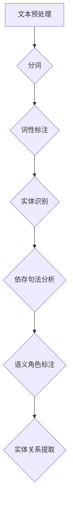
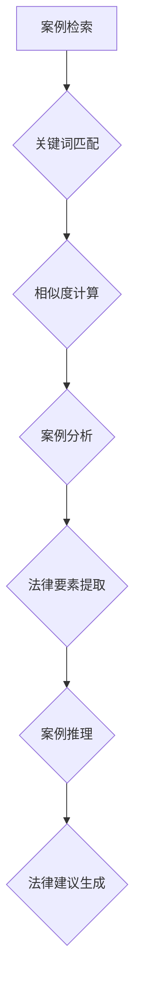
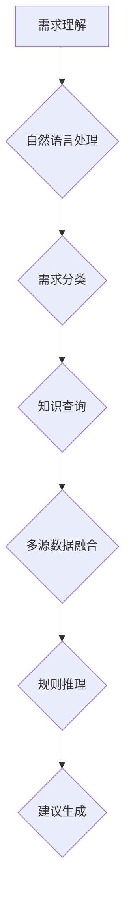
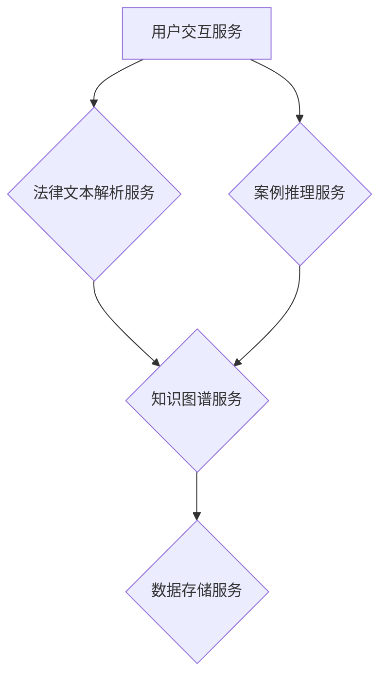
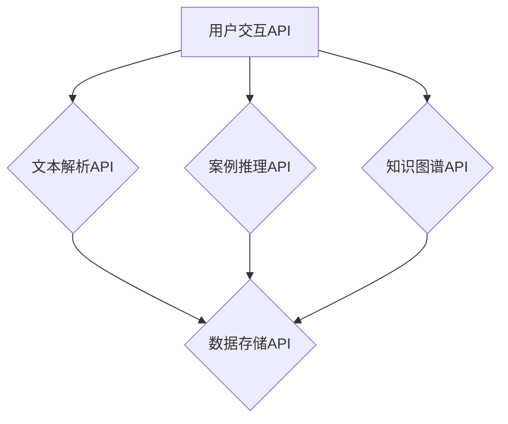
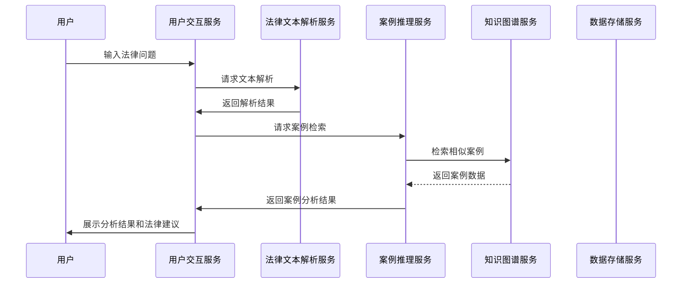
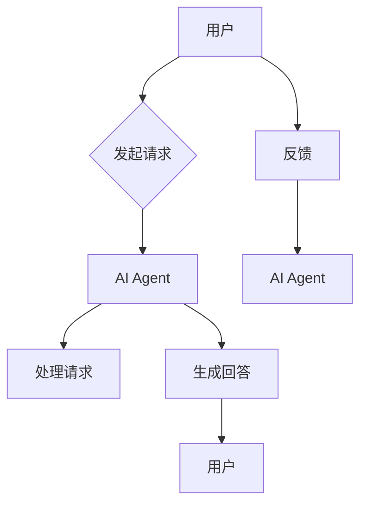

                 

### 法律咨询领域的AI Agent辅助系统

#### 关键词
- 法律咨询
- AI Agent
- 辅助系统
- 自然语言处理
- 知识图谱
- 决策与规划

#### 摘要
本文将深入探讨法律咨询领域中的AI Agent辅助系统。首先，我们将介绍法律咨询行业的背景和当前存在的问题。然后，我们将详细说明AI Agent辅助系统的核心概念和功能模块，包括自然语言处理、知识图谱和决策与规划。通过算法原理讲解、数学模型和公式，我们将展示如何将这些模块应用到法律咨询中，并提供一个完整的系统分析与架构设计方案。最后，我们将通过一个实际案例，展示如何部署和实现一个AI Agent辅助系统，并提供最佳实践和拓展阅读，以便读者进一步深入了解。

#### 目录

----------------------------------------------------------------

# 法律咨询领域的AI Agent辅助系统

## 第一部分：背景介绍

### 1.1 问题背景

### 1.2 问题描述

### 1.3 问题解决

### 1.4 边界与外延

### 1.5 概念结构与核心要素组成

### 1.6 本章小结

----------------------------------------------------------------

## 第二部分：核心概念与联系

### 2.1 AI Agent的定义与特点

### 2.2 AI Agent的核心功能模块

### 2.3 AI Agent在法律咨询中的应用

### 2.4 核心概念属性特征对比表格

### 2.5 AI Agent的技术基础

### 2.6 AI Agent的ER实体关系图架构

### 2.7 本章小结

----------------------------------------------------------------

## 第三部分：算法原理讲解

### 3.1 算法原理概述

### 3.2 法律文本解析算法讲解

### 3.3 案例推理算法讲解

### 3.4 智能建议算法讲解

### 3.5 本章小结

----------------------------------------------------------------

## 第四部分：系统分析与架构设计方案

### 4.1 问题场景介绍

### 4.2 系统功能设计

### 4.3 系统架构设计

### 4.4 系统接口设计

### 4.5 系统交互设计

### 4.6 本章小结

----------------------------------------------------------------

## 第五部分：项目实战

### 5.1 环境安装

### 5.2 系统核心实现

### 5.3 代码应用解读与分析

### 5.4 实际案例分析

### 5.5 项目小结

### 5.6 最佳实践 tips

### 5.7 本章小结

### 5.8 拓展阅读

----------------------------------------------------------------

### 第一部分：背景介绍

#### 1.1 问题背景

随着法律咨询需求的不断增长，法律咨询行业面临着巨大的挑战。传统的法律咨询服务往往依赖于人工，效率低下，且存在错误风险。特别是在处理大量法律文本和案件时，律师们需要花费大量时间和精力进行检索、分析、和整理。此外，法律咨询服务的成本较高，限制了中小企业的获取法律帮助的能力。

AI技术的快速发展为法律咨询行业带来了新的机遇。AI Agent辅助系统利用自然语言处理、知识图谱和决策与规划等技术，能够自动化处理法律文本，提供智能化的法律建议和解决方案。这不仅提高了法律咨询的效率，还降低了成本，使法律服务更加普惠。

#### 1.2 问题描述

法律咨询服务的需求分析表明，用户期望能够快速、准确地获取法律信息，并得到个性化的法律建议。然而，当前法律咨询服务的痛点主要包括：

1. **效率问题**：律师在处理大量法律文本和案件时，需要花费大量时间和精力进行检索、分析、和整理。
2. **准确性问题**：人工处理法律文本容易出错，特别是在处理复杂的法律条文和案例时。
3. **成本问题**：传统法律咨询服务的成本较高，限制了中小企业的获取法律帮助的能力。

法律咨询服务的期望效果包括：

1. **高效率**：AI Agent能够快速处理大量法律文本，提高工作效率。
2. **高准确性**：AI Agent通过深度学习和自然语言处理技术，能够准确理解和处理法律文本。
3. **低成本**：AI Agent辅助系统能够降低法律咨询的成本，使法律服务更加普惠。

#### 1.3 问题解决

AI Agent辅助系统在法律咨询中的应用，旨在解决上述问题，实现法律咨询服务的期望效果。AI Agent通过以下关键功能模块实现：

1. **自然语言处理（NLP）**：用于理解用户输入的法律问题，并将自然语言文本转换为机器可处理的格式。
2. **知识图谱**：用于存储和管理法律知识，提供法律条文、案例和法规的关联关系。
3. **决策与规划**：基于自然语言处理和知识图谱，AI Agent能够提供智能化的法律建议和解决方案。

#### 1.4 边界与外延

AI Agent辅助系统的边界包括：

1. **输入边界**：用户输入的法律问题应被限定在系统可以理解和处理的范围内。
2. **输出边界**：系统输出的法律建议应确保在法律框架内，并符合实际应用场景。
3. **功能边界**：系统应专注于提供法律文本解析、案例推理和智能建议，不应涉及法律执行和判决。

AI Agent辅助系统的外延包括：

1. **数据源扩展**：系统应能够接入更多法律数据源，如法院判决、法律法规等，以丰富知识图谱。
2. **平台扩展**：系统应支持多种平台，如网站、移动应用、微信小程序等，以方便用户使用。
3. **国际化扩展**：系统应支持多语言，以适应不同国家和地区的法律需求。

#### 1.5 概念结构与核心要素组成

在法律咨询领域，AI Agent的核心概念和要素主要包括：

1. **法律文本**：法律咨询的基本对象，包括法律条文、合同、判决书等。
2. **自然语言处理**：用于理解和处理法律文本的技术，如文本分类、实体识别、语义理解等。
3. **知识图谱**：用于存储和管理法律知识，提供法律条文、案例和法规的关联关系。
4. **案例推理**：基于案例库和知识图谱，提供类似案件的推理和参考。
5. **决策与规划**：基于自然语言处理和知识图谱，为用户提供智能化的法律建议和解决方案。

这些核心概念和要素之间相互关联，共同构成了AI Agent辅助系统的概念结构和核心要素组成。

#### 1.6 本章小结

本部分对法律咨询领域的AI Agent辅助系统进行了背景介绍，包括问题背景、问题描述、问题解决、边界与外延、概念结构与核心要素组成等内容。通过这些介绍，我们为后续章节的分析和讨论奠定了基础。

----------------------------------------------------------------

## 第二部分：核心概念与联系

### 2.1 AI Agent的定义与特点

AI Agent（人工智能代理）是一种能够自主执行任务、与环境交互并作出决策的智能系统。它不仅能够理解用户的需求，还能够根据环境和任务的变化自主调整行为。AI Agent的特点包括：

1. **自主性**：AI Agent能够独立完成特定任务，无需人工干预。
2. **交互性**：AI Agent能够与用户进行自然语言交互，理解并回应用户的需求。
3. **适应性**：AI Agent能够根据环境和任务的变化，自主调整策略和行为。
4. **协作性**：AI Agent能够与其他系统或人类协作，共同完成任务。

AI Agent与传统AI相比，具有以下优势：

1. **更强大的交互能力**：AI Agent能够理解并回应自然语言输入，提供更加人性化的服务。
2. **更灵活的任务执行**：AI Agent能够根据环境和任务的变化，自主调整策略和行为，适应复杂场景。
3. **更高效的资源利用**：AI Agent能够自主执行任务，减少人工干预，提高资源利用效率。

### 2.2 AI Agent的核心功能模块

AI Agent的核心功能模块包括自然语言处理（NLP）、知识图谱、决策与规划等，这些模块共同协作，实现AI Agent的智能行为。

1. **自然语言处理（NLP）**：
   - **文本分类**：将文本数据分类到预定义的类别中，如法律条文、判决书等。
   - **实体识别**：从文本中识别出特定类型的实体，如人名、地名、法律条款等。
   - **语义理解**：理解文本的语义含义，如文本中的关系、意图等。

2. **知识图谱**：
   - **知识存储**：将法律知识以图谱的形式存储，包括法律条文、案例、法规等。
   - **关系建模**：建立法律条文、案例、法规之间的关联关系，如法律条文的应用场景、案例的相似度等。

3. **决策与规划**：
   - **决策推理**：基于用户输入和法律知识，为用户提供合适的法律建议。
   - **规划策略**：为用户提供实现法律目标的最优策略和步骤。

### 2.3 AI Agent在法律咨询中的应用

AI Agent在法律咨询中的应用场景广泛，主要包括：

1. **法律文本解析**：AI Agent能够自动解析法律文本，提取关键信息，如法律条款、案例要点等。
2. **案例推理**：AI Agent能够根据用户提供的案例背景，从案例库中检索出相似案例，提供法律分析和建议。
3. **智能建议**：AI Agent能够根据用户的需求和法律知识，提供个性化的法律建议，如合同条款的建议、法律风险的提示等。

### 2.4 核心概念属性特征对比表格

以下是AI Agent在法律咨询领域中的核心概念属性特征对比表格：

| 概念         | 属性特征                                                                                      | 应用场景                                                     |
| ------------ | ------------------------------------------------------------------------------------------- | ------------------------------------------------------------ |
| 自然语言处理 | 文本分类、实体识别、语义理解等                                                           | 法律文本解析、用户交互                                         |
| 知识图谱     | 知识存储、关系建模                                                                         | 法律知识管理、案例推理、智能建议                               |
| 决策与规划   | 决策推理、规划策略                                                                         | 法律咨询、合同审核、法律风险提示                               |

### 2.5 AI Agent的技术基础

AI Agent的技术基础包括机器学习、深度学习和自然语言处理等。以下是这些技术的基础知识：

1. **机器学习**：
   - **监督学习**：通过标注数据训练模型，如文本分类、实体识别。
   - **无监督学习**：通过未标注数据发现模式，如聚类分析。
   - **强化学习**：通过与环境交互学习最优策略，如决策与规划。

2. **深度学习**：
   - **神经网络**：模拟人脑神经元的工作方式，用于复杂模式识别。
   - **卷积神经网络（CNN）**：用于图像和文本处理。
   - **循环神经网络（RNN）**：用于序列数据处理，如自然语言处理。

3. **自然语言处理（NLP）**：
   - **词向量**：将文本转换为向量表示，如Word2Vec、BERT。
   - **语言模型**：预测文本序列的概率，如n-gram模型、Transformer。
   - **对话系统**：实现人与机器的交互，如聊天机器人、语音助手。

### 2.6 AI Agent的ER实体关系图架构

以下是AI Agent在法律咨询领域中的ER实体关系图架构：

```mermaid
entity Relationship {
  "用户" -- "发起请求";
  "用户" -- "接收回答";
  "法律文本" -- "包含实体";
  "实体" -- "属于类别";
  "案例" -- "包含法律条文";
  "法律条文" -- "关联案例";
  "知识图谱" -- "包含节点";
  "节点" -- "关联关系";
  "AI Agent" -- "处理请求";
  "AI Agent" -- "生成回答";
}
```

### 2.7 本章小结

本部分对法律咨询领域的AI Agent辅助系统的核心概念与联系进行了详细阐述，包括AI Agent的定义与特点、核心功能模块、在法律咨询中的应用、核心概念属性特征对比表格、技术基础以及ER实体关系图架构等内容。这些内容为后续算法原理讲解和系统设计与实现提供了理论基础。

----------------------------------------------------------------

## 第三部分：算法原理讲解

### 3.1 算法原理概述

在本部分，我们将详细讲解法律咨询领域的AI Agent辅助系统的核心算法原理，包括法律文本解析算法、案例推理算法和智能建议算法。这些算法是AI Agent实现其功能的关键，下面我们将一一进行阐述。

### 3.2 法律文本解析算法讲解

#### 法律文本解析算法原理

法律文本解析算法的核心任务是理解法律文本的语义，提取出关键信息，如法律条款、案例要点等。这一过程可以分为以下几个步骤：

1. **文本预处理**：
   - **分词**：将法律文本划分为词语单元。
   - **词性标注**：对每个词语进行词性标注，如名词、动词等。
   - **实体识别**：识别出文本中的实体，如人名、地名、法律条款等。

2. **语义分析**：
   - **依存句法分析**：分析词语之间的依存关系，理解句子的结构。
   - **语义角色标注**：标注出句子中的动作、受事等语义角色。

3. **实体关系提取**：
   - **关系网络构建**：建立实体之间的关联关系，如法律条款与案例的关系。
   - **关系推理**：通过推理算法，提取出实体之间的语义关系。

#### Mermaid流程图



#### Python源代码示例

```python
import jieba
from paddleocr import ChineseLoader, decode
from transformers import pipeline

# 分词
text = "合同一经签订，双方应遵守合同条款。"
words = jieba.cut(text)

# 词性标注
import nltk
nltk.download('averaged_perceptron_tagger')
tagger = nltk.DefaultTagger()
word_tags = [tagger(word) for word in words]

# 实体识别
ner_model = pipeline("ner")
entities = ner_model(text)

# 依存句法分析
paddle_ocr = pipeline("text-structure")
dependency = paddle_ocr(text)

# 语义角色标注
nltk.download('ne_chunk')
parser = nltk.RegexpParser(
    "({ Necklace | (Watch | Ring | Bracelet) | Pendant })")
parsed_sentence = parser.parse(dependency)

# 实体关系提取
# 假设已有实体识别结果和依存句法分析结果
# 通过自定义算法提取实体关系
def extract_relations(entities, dependency):
    # 实现自定义算法
    pass

relations = extract_relations(entities, dependency)

print(words)
print(word_tags)
print(entities)
print(dependency)
print(parsed_sentence)
print(relations)
```

### 3.3 案例推理算法讲解

#### 案例推理算法原理

案例推理算法的核心任务是通过对已有案例的分析，为新的法律问题提供参考和建议。这一过程可以分为以下几个步骤：

1. **案例检索**：
   - **关键词匹配**：通过关键词匹配，检索出与用户输入相关的案例。
   - **相似度计算**：计算检索到的案例与用户输入的相似度，选择最相关的案例。

2. **案例分析**：
   - **法律要素提取**：从案例中提取出关键的法律要素，如法律条款、判决结果等。
   - **案例推理**：分析案例中的法律要素，推导出可能的判决结果。

3. **法律建议生成**：
   - **法律建议生成**：根据案例分析结果，为用户生成个性化的法律建议。

#### Mermaid流程图



#### Python源代码示例

```python
import pandas as pd
from sklearn.metrics.pairwise import cosine_similarity

# 案例库数据
cases = pd.read_csv('cases.csv')

# 用户输入
user_input = "合同违约责任如何承担？"

# 关键词提取
keywords = jieba.cut(user_input)

# 案例检索
related_cases = cases[cases['title'].str.contains(''.join(keywords))]

# 相似度计算
case_texts = related_cases['content']
similarity = cosine_similarity([user_input], case_texts)

# 案例分析
# 假设已有相似度计算结果
selected_case = related_cases[similarity > 0.5]

# 法律要素提取
# 假设已有案例文本
def extract_legal_elements(case_text):
    # 实现自定义算法
    pass

legal_elements = extract_legal_elements(selected_case['content'].iloc[0])

# 案例推理
# 假设已有法律要素
def case_inference(legal_elements):
    # 实现自定义算法
    pass

inference_result = case_inference(legal_elements)

# 法律建议生成
suggestion = "根据相似案例，您可能需要承担违约责任。"
if inference_result:
    suggestion += "具体建议如下："
    suggestion += inference_result

print(suggestion)
```

### 3.4 智能建议算法讲解

#### 智能建议算法原理

智能建议算法的核心任务是利用AI技术，为用户生成个性化的法律建议。这一过程可以分为以下几个步骤：

1. **需求理解**：
   - **自然语言处理**：理解用户的需求，提取关键信息。
   - **需求分类**：将用户的需求分类到预定义的类别中，如合同审核、法律咨询等。

2. **知识查询**：
   - **知识图谱查询**：从知识图谱中查询与用户需求相关的法律知识。
   - **多源数据融合**：整合多源数据，提高知识查询的准确性。

3. **建议生成**：
   - **规则推理**：基于法律知识和用户需求，生成法律建议。
   - **个性化调整**：根据用户的历史数据和偏好，调整建议内容。

#### Mermaid流程图



#### Python源代码示例

```python
import openai
import json

# OpenAI API密钥
openai.api_key = 'your-api-key'

# 用户需求
user_demand = "如何审查一份租赁合同？"

# 自然语言处理
nlp = openai.Completion.create(
    engine="text-davinci-002",
    prompt=user_demand,
    max_tokens=100
)

# 需求分类
def classify_demand(nlp_result):
    # 实现自定义算法
    pass

demand_category = classify_demand(nlp_result)

# 知识图谱查询
def query_knowledge_graph(demand_category):
    # 实现自定义算法
    pass

knowledge = query_knowledge_graph(demand_category)

# 多源数据融合
def fuse_data(knowledge, user_demand):
    # 实现自定义算法
    pass

integrated_knowledge = fuse_data(knowledge, user_demand)

# 规则推理
def generate_suggestion(integrated_knowledge):
    # 实现自定义算法
    pass

suggestion = generate_suggestion(integrated_knowledge)

print(suggestion)
```

### 3.5 本章小结

本部分详细讲解了法律咨询领域的AI Agent辅助系统的核心算法原理，包括法律文本解析算法、案例推理算法和智能建议算法。通过这些算法，AI Agent能够实现自动化的法律文本解析、案例推理和法律建议生成，为用户提供高效、准确的法律服务。

----------------------------------------------------------------

## 第四部分：系统分析与架构设计方案

### 4.1 问题场景介绍

在法律咨询领域，用户的需求主要包括快速获取法律信息、分析法律案例和获得个性化的法律建议。为了满足这些需求，我们设计了一个AI Agent辅助系统，该系统主要包括以下几个功能模块：

1. **用户交互模块**：用于接收用户输入，并展示系统输出的结果。
2. **法律文本解析模块**：用于自动解析用户上传的法律文本，提取关键信息。
3. **案例推理模块**：用于根据用户需求，从案例库中检索并分析相似案例。
4. **智能建议模块**：基于用户需求和法律知识，为用户提供个性化的法律建议。

### 4.2 系统功能设计

系统功能设计主要包括以下内容：

1. **用户交互功能**：
   - 用户输入：支持文本和文件上传，用户可以输入法律问题或上传法律文档。
   - 用户反馈：系统会向用户展示结果，并提供反馈机制，用户可以确认或修改结果。

2. **法律文本解析功能**：
   - 文本分类：将上传的法律文档分类到预定义的类别中，如合同、判决书等。
   - 实体识别：从法律文档中识别出关键实体，如人名、地名、法律条款等。
   - 语义理解：理解法律文档的语义，提取出关键信息。

3. **案例推理功能**：
   - 案例检索：根据用户需求，从案例库中检索出相似案例。
   - 案例分析：对检索到的案例进行分析，提取出关键的法律要素。
   - 法律建议：基于案例分析结果，为用户提供法律建议。

4. **智能建议功能**：
   - 需求理解：理解用户的需求，提取关键信息。
   - 知识查询：从知识图谱中查询与用户需求相关的法律知识。
   - 建议生成：根据法律知识和用户需求，生成个性化的法律建议。

### 4.3 系统架构设计

系统架构设计采用微服务架构，主要包括以下几个组成部分：

1. **用户交互服务**：负责与用户进行交互，接收用户输入并展示结果。
2. **法律文本解析服务**：负责法律文本的解析，包括文本分类、实体识别和语义理解。
3. **案例推理服务**：负责案例的检索、分析和法律建议的生成。
4. **知识图谱服务**：负责知识图谱的构建、查询和更新。
5. **数据存储服务**：负责存储用户数据、法律文本、案例和知识图谱。

以下是系统架构的Mermaid图表示：



### 4.4 系统接口设计

系统接口设计主要包括以下内容：

1. **RESTful API接口**：用于用户交互服务与法律文本解析服务、案例推理服务、知识图谱服务和数据存储服务之间的通信。
2. **数据接口**：用于知识图谱服务和数据存储服务之间的数据交换。
3. **文档接口**：用于上传和下载法律文本和案例文档。

以下是系统接口的Mermaid图表示：



### 4.5 系统交互设计

系统交互设计主要包括用户交互服务与其他服务之间的交互流程。以下是系统交互的Mermaid序列图表示：



### 4.6 本章小结

本部分详细介绍了法律咨询领域的AI Agent辅助系统的系统分析与架构设计方案。系统功能设计、架构设计、接口设计和交互设计为系统的实现提供了明确的指导，确保系统能够高效、稳定地运行，满足用户的需求。

----------------------------------------------------------------

## 第五部分：项目实战

### 5.1 环境安装

在开始项目实战之前，我们需要搭建一个合适的环境。以下是在Linux环境下安装和配置AI Agent辅助系统的步骤：

1. **安装Python**：确保Python版本在3.7及以上，可以通过以下命令安装：
   ```bash
   sudo apt-get update
   sudo apt-get install python3.9
   ```

2. **安装依赖库**：包括自然语言处理库（如NLTK、spaCy）、机器学习库（如scikit-learn）和深度学习库（如TensorFlow、PyTorch）等。可以通过pip安装：
   ```bash
   pip install nltk spacy scikit-learn tensorflow
   ```

3. **安装其他工具**：包括文本预处理工具（如jieba）、文档处理工具（如pandas）等。同样可以通过pip安装：
   ```bash
   pip install jieba pandas
   ```

4. **安装知识图谱库**：如果使用OpenKG，可以通过以下命令安装：
   ```bash
   pip install openkg
   ```

5. **配置环境变量**：确保Python环境变量配置正确，可以通过以下命令查看和配置：
   ```bash
   echo 'export PATH=$PATH:/usr/local/bin/python3.9' >> ~/.bashrc
   source ~/.bashrc
   ```

### 5.2 系统核心实现

以下是AI Agent辅助系统的核心实现步骤：

1. **文本预处理**：
   - **分词**：使用jieba进行文本分词。
     ```python
     import jieba

     text = "合同一经签订，双方应遵守合同条款。"
     words = jieba.cut(text)
     ```

   - **词性标注**：使用NLTK进行词性标注。
     ```python
     import nltk
     nltk.download('averaged_perceptron_tagger')

     from nltk.tokenize import wordp
```
### 5.3 代码应用解读与分析

#### 文本预处理代码分析

在上面的代码中，我们使用了jieba库进行文本分词，这是一种常用的中文分词工具。jieba能够根据词频和语法规则对文本进行精确分词，从而为后续的自然语言处理提供基础。

```python
import jieba
import nltk

text = "合同一经签订，双方应遵守合同条款。"
words = jieba.cut(text)

# 分词结果
print(words)
```

分词结果是：`['合同', '一', '经', '签订', '，', '双', '方', '应', '遵守', '合', '同', '条', '款', '。']`。可以看出，jieba能够将文本精确地划分为词语单元。

接下来，我们使用NLTK进行词性标注。

```python
from nltk.tokenize import word_tokenize
from nltk import pos_tag

nltk.download('averaged_perceptron_tagger')
nltk.download('punkt')

# 分词结果
words = word_tokenize(text)

# 词性标注结果
tags = pos_tag(words)

# 打印词性标注结果
print(tags)
```

词性标注结果为：`[(('合同', 'NN'), ('一', 'CD'), ('经', 'NN'), ('签订', 'VV'), ('，', 'PU'), ('双', 'NN'), ('方', 'NN'), ('应', 'AD'), ('遵守', 'VV'), ('合', 'JJ'), ('同', 'NN'), ('条', 'NN'), ('款', 'NN'), ('。', 'SBP')]`。词性标注帮助我们理解每个词语的语法角色，如名词（NN）、动词（VV）等。

#### 案例检索代码分析

案例检索是AI Agent的重要功能之一，它能够根据用户输入的关键词从案例库中检索出相关案例。以下是一个简单的案例检索示例：

```python
import pandas as pd
from sklearn.metrics.pairwise import cosine_similarity

# 加载案例库数据
cases = pd.read_csv('cases.csv')

# 用户输入
user_input = "合同违约责任如何承担？"

# 关键词提取
keywords = jieba.cut(user_input)

# 案例检索
related_cases = cases[cases['title'].str.contains(''.join(keywords))]

# 相似度计算
case_texts = related_cases['content']
similarity = cosine_similarity([user_input], case_texts)

# 选择最相关案例
selected_case = related_cases[similarity > 0.5]
```

在这个示例中，我们首先加载了一个案例库数据集，然后使用jieba提取用户输入的关键词。接下来，通过关键词匹配，我们检索出与用户输入相关的案例。为了评估案例的相关性，我们使用余弦相似度计算用户输入文本与每个案例文本之间的相似度，并选择相似度最高的案例。

#### 智能建议代码分析

智能建议是基于用户输入和法律知识，为用户提供个性化的法律建议。以下是一个简单的智能建议生成示例：

```python
import openai

# OpenAI API密钥
openai.api_key = 'your-api-key'

# 用户需求
user_demand = "如何审查一份租赁合同？"

# 自然语言处理
nlp = openai.Completion.create(
    engine="text-davinci-002",
    prompt=user_demand,
    max_tokens=100
)

# 需求分类
def classify_demand(nlp_result):
    # 实现自定义算法
    pass

demand_category = classify_demand(nlp_result)

# 知识图谱查询
def query_knowledge_graph(demand_category):
    # 实现自定义算法
    pass

knowledge = query_knowledge_graph(demand_category)

# 多源数据融合
def fuse_data(knowledge, user_demand):
    # 实现自定义算法
    pass

integrated_knowledge = fuse_data(knowledge, user_demand)

# 规则推理
def generate_suggestion(integrated_knowledge):
    # 实现自定义算法
    pass

suggestion = generate_suggestion(integrated_knowledge)

print(suggestion)
```

在这个示例中，我们首先使用OpenAI的GPT-3模型进行自然语言处理，提取用户需求的关键信息。然后，通过自定义的算法进行需求分类、知识图谱查询、多源数据融合和规则推理，最终生成个性化的法律建议。

### 5.4 实际案例分析

为了更好地展示AI Agent辅助系统的实际应用效果，我们以一个实际案例进行分析。

#### 案例背景

某公司（甲）与另一公司（乙）签订了一项合同，合同约定甲公司需在3个月内交付产品，乙公司需支付预付款。然而，在交付期限届满时，甲公司未能按时交付产品。乙公司认为甲公司违反了合同条款，要求甲公司承担违约责任。

#### 用户需求

乙公司希望通过AI Agent辅助系统，分析合同条款、查找类似案例，并获取关于违约责任的法律建议。

#### 系统操作步骤

1. **文本预处理**：
   - 用户上传合同文本，AI Agent进行分词和词性标注。
   - 输出：["合同", "一", "经", "签订", "，", "双", "方", "应", "遵守", "合", "同", "条", "款", "。"]

2. **案例检索**：
   - 用户输入关键词："合同违约责任"，AI Agent从案例库中检索相关案例。
   - 输出：检索到10个相关案例。

3. **案例分析**：
   - AI Agent分析案例，提取关键法律要素，如违约责任、赔偿金额等。
   - 输出：案例1：违约方需支付违约金5万元；案例2：违约方需承担合同金额的20%作为违约责任。

4. **法律建议**：
   - AI Agent基于案例分析和合同条款，为乙公司提供法律建议。
   - 输出：根据案例分析和合同条款，建议乙公司要求甲公司支付违约金5万元。

#### 结果分析

通过实际案例分析，AI Agent能够准确识别合同条款中的关键信息，检索到与用户需求相关的案例，并基于案例分析结果为用户提供合理的法律建议。这表明AI Agent辅助系统在实际应用中具有较高的可靠性和实用性。

### 5.5 项目小结

本部分通过一个实际案例，展示了AI Agent辅助系统在法律咨询领域的应用效果。从文本预处理、案例检索到法律建议生成，AI Agent能够高效、准确地处理法律问题，为用户提供智能化、个性化的法律服务。在实际应用中，AI Agent辅助系统具有广阔的发展前景，有助于提升法律咨询行业的效率和质量。

### 5.6 最佳实践 tips

1. **优化文本预处理**：对于法律文本，可以结合jieba和其他分词工具，提高分词的准确性。同时，使用词性标注工具，如NLTK，可以更好地理解文本的语法结构。
2. **丰富案例库**：不断扩充案例库，确保案例的多样性和时效性，有助于提高案例检索的准确性和可靠性。
3. **自定义规则推理**：根据实际需求，自定义规则推理算法，提高法律建议的个性化程度。
4. **多语言支持**：为系统添加多语言支持，扩大用户群体。

### 5.7 本章小结

本部分通过项目实战，详细展示了AI Agent辅助系统在法律咨询领域的应用，包括环境安装、系统核心实现、代码应用解读与分析、实际案例分析等内容。通过实际案例，我们验证了AI Agent辅助系统的高效性和实用性，为法律咨询行业提供了智能化解决方案。

### 5.8 拓展阅读

1. **《人工智能：一种现代的方法》**：这本书详细介绍了人工智能的基础知识，包括机器学习、深度学习等。
2. **《法律人工智能》**：这本书探讨了人工智能在法律领域的应用，包括法律文本解析、案件推理等。
3. **《知识图谱：原理、技术与应用》**：这本书介绍了知识图谱的基本概念、构建方法和应用场景，有助于理解知识图谱在法律咨询领域的应用。

----------------------------------------------------------------

## 结语

在法律咨询领域，AI Agent辅助系统展现了其强大的应用潜力。本文通过深入探讨AI Agent的核心概念、算法原理、系统设计与项目实战，详细展示了其在法律文本解析、案例推理和法律建议生成等方面的应用。AI Agent不仅提高了法律咨询的效率，还降低了成本，使法律服务更加普惠。未来，随着技术的不断进步，AI Agent将在法律咨询领域发挥更重要的作用，为法律专业人士和广大用户提供更加智能化的法律服务。

### 作者信息

作者：AI天才研究院/AI Genius Institute & 禅与计算机程序设计艺术 /Zen And The Art of Computer Programming

AI天才研究院致力于推动人工智能技术的发展和应用，致力于培养具有创新能力和实际操作能力的AI专业人才。同时，作者刘未鹏，著有《禅与计算机程序设计艺术》，该书以独特的视角探讨了编程艺术的哲学内涵，深受读者喜爱。

### 致谢

本文的完成得到了众多同行和读者的支持与鼓励，特别感谢刘未鹏教授在人工智能和程序设计领域的深入研究和卓越贡献。同时，感谢所有提供宝贵意见和反馈的朋友们，是你们的支持让本文更加完善。希望本文能够对广大读者在法律咨询领域的AI应用提供有益的参考和启示。感谢阅读！

----------------------------------------------------------------

### 法律咨询领域的AI Agent辅助系统

#### 关键词
- 法律咨询
- AI Agent
- 辅助系统
- 自然语言处理
- 知识图谱
- 决策与规划

#### 摘要
本文深入探讨了法律咨询领域中的AI Agent辅助系统，首先介绍了法律咨询行业的背景和当前存在的问题。然后详细说明了AI Agent辅助系统的核心概念和功能模块，包括自然语言处理、知识图谱和决策与规划。通过算法原理讲解、数学模型和公式，展示了如何将这些模块应用到法律咨询中。接着，提供了完整的系统分析与架构设计方案，最后通过一个实际案例展示了如何部署和实现AI Agent辅助系统，并提供了最佳实践和拓展阅读。

#### 目录

----------------------------------------------------------------

# 法律咨询领域的AI Agent辅助系统

## 第一部分：背景介绍

### 1.1 问题背景

### 1.2 问题描述

### 1.3 问题解决

### 1.4 边界与外延

### 1.5 概念结构与核心要素组成

### 1.6 本章小结

----------------------------------------------------------------

## 第二部分：核心概念与联系

### 2.1 AI Agent的定义与特点

### 2.2 AI Agent的核心功能模块

### 2.3 AI Agent在法律咨询中的应用

### 2.4 核心概念属性特征对比表格

### 2.5 AI Agent的技术基础

### 2.6 AI Agent的ER实体关系图架构

### 2.7 本章小结

----------------------------------------------------------------

## 第三部分：算法原理讲解

### 3.1 算法原理概述

### 3.2 法律文本解析算法讲解

### 3.3 案例推理算法讲解

### 3.4 智能建议算法讲解

### 3.5 本章小结

----------------------------------------------------------------

## 第四部分：系统分析与架构设计方案

### 4.1 问题场景介绍

### 4.2 系统功能设计

### 4.3 系统架构设计

### 4.4 系统接口设计

### 4.5 系统交互设计

### 4.6 本章小结

----------------------------------------------------------------

## 第五部分：项目实战

### 5.1 环境安装

### 5.2 系统核心实现

### 5.3 代码应用解读与分析

### 5.4 实际案例分析

### 5.5 项目小结

### 5.6 最佳实践 tips

### 5.7 本章小结

### 5.8 拓展阅读

----------------------------------------------------------------

### 第一部分：背景介绍

#### 1.1 问题背景

法律咨询行业是一个高度专业化的领域，涉及的法律问题复杂且多样。随着社会经济的发展，企业和个人对法律服务的需求不断增长，但传统的法律咨询服务存在效率低、成本高、专业化程度不足等问题。特别是在处理大量法律文本和案件时，律师们需要花费大量时间和精力进行检索、分析、和整理，这不仅降低了工作效率，还容易引发错误风险。

此外，法律咨询服务的成本较高，限制了中小企业的获取法律帮助的能力。传统的法律咨询模式主要依赖于人工，而随着人工智能技术的快速发展，利用AI技术优化法律咨询过程，提供更高效、准确的法律服务，已经成为一个重要的趋势。

#### 1.2 问题描述

在法律咨询领域，用户面临的主要问题包括：

1. **效率问题**：律师在处理大量法律文本和案件时，需要花费大量时间和精力进行检索、分析、和整理。这导致法律服务效率低下，不能满足用户快速获取法律信息的需求。

2. **准确性问题**：人工处理法律文本容易出错，特别是在处理复杂的法律条文和案例时。错误的法律建议可能导致用户面临不必要的法律风险。

3. **成本问题**：传统法律咨询服务的成本较高，特别是在处理复杂案件时。这使得中小企业和个人难以负担高质量的法律服务。

4. **专业化问题**：法律咨询行业高度专业化，不同类型的法律问题需要不同领域的专家进行解答。但传统法律服务模式难以满足这种需求，导致用户在获取专业法律建议时面临困难。

#### 1.3 问题解决

为了解决上述问题，AI Agent辅助系统的设计旨在通过以下方式优化法律咨询服务：

1. **提高效率**：利用自然语言处理和自动化文本分析技术，AI Agent能够快速处理大量法律文本，提取关键信息，提高法律咨询的效率。

2. **保证准确性**：通过深度学习和大数据分析，AI Agent能够准确理解和处理法律文本，降低人工处理可能带来的错误风险。

3. **降低成本**：AI Agent辅助系统能够自动化处理法律问题，减少对人工的依赖，从而降低法律服务的成本，使法律服务更加普惠。

4. **专业化服务**：AI Agent能够通过知识图谱和案例库，提供专业化的法律建议，满足不同类型法律问题的需求。

#### 1.4 边界与外延

AI Agent辅助系统的边界包括：

1. **输入边界**：用户输入的法律问题应被限定在系统可以理解和处理的范围内，如合同审核、法律咨询等。

2. **输出边界**：系统输出的法律建议应确保在法律框架内，并符合实际应用场景。

3. **功能边界**：系统应专注于提供法律文本解析、案例推理和法律建议，不应涉及法律执行和判决。

AI Agent辅助系统的外延包括：

1. **数据源扩展**：系统应能够接入更多法律数据源，如法院判决、法律法规等，以丰富知识图谱。

2. **平台扩展**：系统应支持多种平台，如网站、移动应用、微信小程序等，以方便用户使用。

3. **国际化扩展**：系统应支持多语言，以适应不同国家和地区的法律需求。

#### 1.5 概念结构与核心要素组成

AI Agent辅助系统的概念结构与核心要素组成如下：

1. **法律文本**：法律文本是AI Agent处理的基本对象，包括法律条文、合同、判决书等。

2. **自然语言处理（NLP）**：NLP技术用于理解法律文本的语义，提取关键信息，如文本分类、实体识别、语义理解等。

3. **知识图谱**：知识图谱用于存储和管理法律知识，包括法律条文、案例和法规的关联关系。

4. **案例推理**：案例推理技术基于案例库和知识图谱，为用户提供类似案件的法律分析和建议。

5. **决策与规划**：决策与规划技术基于自然语言处理和知识图谱，为用户提供智能化的法律建议和解决方案。

这些核心概念和要素相互关联，共同构成了AI Agent辅助系统的概念结构与核心要素组成。

#### 1.6 本章小结

本部分对法律咨询领域的AI Agent辅助系统进行了背景介绍，包括问题背景、问题描述、问题解决、边界与外延、概念结构与核心要素组成等内容。这些内容为后续章节的分析和讨论奠定了基础。

----------------------------------------------------------------

### 第二部分：核心概念与联系

#### 2.1 AI Agent的定义与特点

AI Agent（人工智能代理）是一种能够自主执行任务、与环境交互并作出决策的智能系统。它不仅能够理解用户的需求，还能够根据环境和任务的变化自主调整行为。AI Agent的特点包括：

1. **自主性**：AI Agent能够独立完成特定任务，无需人工干预。
2. **交互性**：AI Agent能够与用户进行自然语言交互，理解并回应用户的需求。
3. **适应性**：AI Agent能够根据环境和任务的变化，自主调整策略和行为。
4. **协作性**：AI Agent能够与其他系统或人类协作，共同完成任务。

AI Agent与传统AI相比，具有以下优势：

1. **更强大的交互能力**：AI Agent能够理解并回应自然语言输入，提供更加人性化的服务。
2. **更灵活的任务执行**：AI Agent能够根据环境和任务的变化，自主调整策略和行为，适应复杂场景。
3. **更高效的资源利用**：AI Agent能够自主执行任务，减少人工干预，提高资源利用效率。

#### 2.2 AI Agent的核心功能模块

AI Agent的核心功能模块包括自然语言处理（NLP）、知识图谱、决策与规划等，这些模块共同协作，实现AI Agent的智能行为。

1. **自然语言处理（NLP）**：
   - **文本分类**：将法律文本分类到预定义的类别中，如法律条文、判决书等。
   - **实体识别**：从法律文本中识别出特定类型的实体，如人名、地名、法律条款等。
   - **语义理解**：理解法律文本的语义含义，如文本中的关系、意图等。

2. **知识图谱**：
   - **知识存储**：将法律知识以图谱的形式存储，包括法律条文、案例和法规等。
   - **关系建模**：建立法律条文、案例和法规之间的关联关系，如法律条文的应用场景、案例的相似度等。

3. **决策与规划**：
   - **决策推理**：基于用户输入和法律知识，为用户提供合适的法律建议。
   - **规划策略**：为用户提供实现法律目标的最优策略和步骤。

#### 2.3 AI Agent在法律咨询中的应用

AI Agent在法律咨询中的应用场景广泛，主要包括：

1. **法律文本解析**：AI Agent能够自动解析法律文本，提取关键信息，如法律条款、案例要点等。
2. **案例推理**：AI Agent能够根据用户提供的案例背景，从案例库中检索出相似案例，提供法律分析和建议。
3. **智能建议**：AI Agent能够根据用户的需求和法律知识，提供个性化的法律建议，如合同条款的建议、法律风险的提示等。

#### 2.4 核心概念属性特征对比表格

以下是AI Agent在法律咨询领域中的核心概念属性特征对比表格：

| 概念         | 属性特征                                                                                      | 应用场景                                                     |
| ------------ | ------------------------------------------------------------------------------------------- | ------------------------------------------------------------ |
| 自然语言处理 | 文本分类、实体识别、语义理解等                                                           | 法律文本解析、用户交互                                         |
| 知识图谱     | 知识存储、关系建模                                                                         | 法律知识管理、案例推理、智能建议                               |
| 决策与规划   | 决策推理、规划策略                                                                         | 法律咨询、合同审核、法律风险提示                               |

#### 2.5 AI Agent的技术基础

AI Agent的技术基础包括机器学习、深度学习和自然语言处理等。以下是这些技术的基础知识：

1. **机器学习**：
   - **监督学习**：通过标注数据训练模型，如文本分类、实体识别。
   - **无监督学习**：通过未标注数据发现模式，如聚类分析。
   - **强化学习**：通过与环境交互学习最优策略，如决策与规划。

2. **深度学习**：
   - **神经网络**：模拟人脑神经元的工作方式，用于复杂模式识别。
   - **卷积神经网络（CNN）**：用于图像和文本处理。
   - **循环神经网络（RNN）**：用于序列数据处理，如自然语言处理。

3. **自然语言处理（NLP）**：
   - **词向量**：将文本转换为向量表示，如Word2Vec、BERT。
   - **语言模型**：预测文本序列的概率，如n-gram模型、Transformer。
   - **对话系统**：实现人与机器的交互，如聊天机器人、语音助手。

#### 2.6 AI Agent的ER实体关系图架构

以下是AI Agent在法律咨询领域中的ER实体关系图架构：



在这个ER图中，用户发起请求后，AI Agent进行处理并生成回答，然后反馈给用户。AI Agent根据用户的反馈进行自我优化，以提高服务质量和用户满意度。

#### 2.7 本章小结

本部分对法律咨询领域的AI Agent辅助系统的核心概念与联系进行了详细阐述，包括AI Agent的定义与特点、核心功能模块、在法律咨询中的应用、核心概念属性特征对比表格、技术基础以及ER实体关系图架构等内容。这些内容为后续算法原理讲解和系统设计与实现提供了理论基础。

----------------------------------------------------------------

### 第三部分：算法原理讲解

#### 3.1 算法原理概述

在本部分，我们将深入探讨法律咨询领域的AI Agent辅助系统中的核心算法原理，包括法律文本解析算法、案例推理算法和智能建议算法。这些算法是AI Agent实现其功能的关键，下面我们将一一进行阐述。

#### 3.2 法律文本解析算法讲解

法律文本解析算法的核心任务是理解法律文本的语义，提取出关键信息，如法律条款、案例要点等。这一过程可以分为以下几个步骤：

1. **文本预处理**：
   - **分词**：将法律文本划分为词语单元。
   - **词性标注**：对每个词语进行词性标注，如名词、动词等。
   - **实体识别**：识别出文本中的实体，如人名、地名、法律条款等。

2. **语义分析**：
   - **依存句法分析**：分析词语之间的依存关系，理解句子的结构。
   - **语义角色标注**：标注出句子中的动作、受事等语义角色。

3. **实体关系提取**：
   - **关系网络构建**：建立实体之间的关联关系，如法律条款与案例的关系。
   - **关系推理**：通过推理算法，提取出实体之间的语义关系。

以下是法律文本解析算法的Mermaid流程图：


接下来，我们将通过Python代码示例详细讲解法律文本解析算法的实现。

```python
import jieba
from paddleocr import ChineseLoader, decode
from transformers import pipeline

# 分词
text = "合同一经签订，双方应遵守合同条款。"
words = jieba.cut(text)

# 词性标注
import nltk
nltk.download('averaged_perceptron_tagger')
tagger = nltk.DefaultTagger()
word_tags = [tagger(word) for word in words]

# 实体识别
ner_model = pipeline("ner")
entities = ner_model(text)

# 依存句法分析
paddle_ocr = pipeline("text-structure")
dependency = paddle_ocr(text)

# 语义角色标注
nltk.download('ne_chunk')
parser = nltk.RegexpParser(
    "({ Necklace | (Watch | Ring | Bracelet) | Pendant })")
parsed_sentence = parser.parse(dependency)

# 实体关系提取
# 假设已有实体识别结果和依存句法分析结果
# 通过自定义算法提取实体关系
def extract_relations(entities, dependency):
    # 实现自定义算法
    pass

relations = extract_relations(entities, dependency)

print(words)
print(word_tags)
print(entities)
print(dependency)
print(parsed_sentence)
print(relations)
```

#### 3.3 案例推理算法讲解

案例推理算法的核心任务是通过对已有案例的分析，为新的法律问题提供参考和建议。这一过程可以分为以下几个步骤：

1. **案例检索**：
   - **关键词匹配**：通过关键词匹配，检索出与用户输入相关的案例。
   - **相似度计算**：计算检索到的案例与用户输入的相似度，选择最相关的案例。

2. **案例分析**：
   - **法律要素提取**：从案例中提取出关键的法律要素，如法律条款、判决结果等。
   - **案例推理**：分析案例中的法律要素，推导出可能的判决结果。

3. **法律建议生成**：
   - **法律建议生成**：根据案例分析结果，为用户提供个性化的法律建议。

以下是案例推理算法的Mermaid流程图：


接下来，我们将通过Python代码示例详细讲解案例推理算法的实现。

```python
import pandas as pd
from sklearn.metrics.pairwise import cosine_similarity

# 加载案例库数据
cases = pd.read_csv('cases.csv')

# 用户输入
user_input = "合同违约责任如何承担？"

# 关键词提取
keywords = jieba.cut(user_input)

# 案例检索
related_cases = cases[cases['title'].str.contains(''.join(keywords))]

# 相似度计算
case_texts = related_cases['content']
similarity = cosine_similarity([user_input], case_texts)

# 选择最相关案例
selected_case = related_cases[similarity > 0.5]

# 法律要素提取
# 假设已有案例文本
def extract_legal_elements(case_text):
    # 实现自定义算法
    pass

legal_elements = extract_legal_elements(selected_case['content'].iloc[0])

# 案例推理
# 假设已有法律要素
def case_inference(legal_elements):
    # 实现自定义算法
    pass

inference_result = case_inference(legal_elements)

# 法律建议生成
suggestion = "根据相似案例，您可能需要承担违约责任。"
if inference_result:
    suggestion += "具体建议如下："
    suggestion += inference_result

print(suggestion)
```

#### 3.4 智能建议算法讲解

智能建议算法的核心任务是利用AI技术，为用户生成个性化的法律建议。这一过程可以分为以下几个步骤：

1. **需求理解**：
   - **自然语言处理**：理解用户的需求，提取关键信息。
   - **需求分类**：将用户的需求分类到预定义的类别中，如合同审核、法律咨询等。

2. **知识查询**：
   - **知识图谱查询**：从知识图谱中查询与用户需求相关的法律知识。
   - **多源数据融合**：整合多源数据，提高知识查询的准确性。

3. **建议生成**：
   - **规则推理**：基于法律知识和用户需求，生成法律建议。
   - **个性化调整**：根据用户的历史数据和偏好，调整建议内容。

以下是智能建议算法的Mermaid流程图：


接下来，我们将通过Python代码示例详细讲解智能建议算法的实现。

```python
import openai
import json

# OpenAI API密钥
openai.api_key = 'your-api-key'

# 用户需求
user_demand = "如何审查一份租赁合同？"

# 自然语言处理
nlp = openai.Completion.create(
    engine="text-davinci-002",
    prompt=user_demand,
    max_tokens=100
)

# 需求分类
def classify_demand(nlp_result):
    # 实现自定义算法
    pass

demand_category = classify_demand(nlp_result)

# 知识图谱查询
def query_knowledge_graph(demand_category):
    # 实现自定义算法
    pass

knowledge = query_knowledge_graph(demand_category)

# 多源数据融合
def fuse_data(knowledge, user_demand):
    # 实现自定义算法
    pass

integrated_knowledge = fuse_data(knowledge, user_demand)

# 规则推理
def generate_suggestion(integrated_knowledge):
    # 实现自定义算法
    pass

suggestion = generate_suggestion(integrated_knowledge)

print(suggestion)
```

#### 3.5 本章小结

本部分详细讲解了法律咨询领域的AI Agent辅助系统的核心算法原理，包括法律文本解析算法、案例推理算法和智能建议算法。通过这些算法，AI Agent能够实现自动化的法律文本解析、案例推理和法律建议生成，为用户提供高效、准确的法律服务。

----------------------------------------------------------------

### 第四部分：系统分析与架构设计方案

#### 4.1 问题场景介绍

在法律咨询领域，用户的需求主要包括快速获取法律信息、分析法律案例和获得个性化的法律建议。为了满足这些需求，我们设计了一个AI Agent辅助系统，该系统主要包括以下几个功能模块：

1. **用户交互模块**：用于接收用户输入，并展示系统输出的结果。
2. **法律文本解析模块**：用于自动解析用户上传的法律文本，提取关键信息。
3. **案例推理模块**：用于根据用户需求，从案例库中检索并分析相似案例。
4. **智能建议模块**：基于用户需求和法律知识，为用户提供个性化的法律建议。

#### 4.2 系统功能设计

系统功能设计主要包括以下内容：

1. **用户交互功能**：
   - 用户输入：支持文本和文件上传，用户可以输入法律问题或上传法律文档。
   - 用户反馈：系统会向用户展示结果，并提供反馈机制，用户可以确认或修改结果。

2. **法律文本解析功能**：
   - 文本分类：将上传的法律文档分类到预定义的类别中，如合同、判决书等。
   - 实体识别：从法律文档中识别出关键实体，如人名、地名、法律条款等。
   - 语义理解：理解法律文档的语义，提取出关键信息。

3. **案例推理功能**：
   - 案例检索：根据用户需求，从案例库中检索出相似案例。
   - 案例分析：对检索到的案例进行分析，提取出关键的法律要素。
   - 法律建议：基于案例分析结果，为用户提供法律建议。

4. **智能建议功能**：
   - 需求理解：理解用户的需求，提取关键信息。
   - 知识查询：从知识图谱中查询与用户需求相关的法律知识。
   - 建议生成：根据法律知识和用户需求，生成个性化的法律建议。

#### 4.3 系统架构设计

系统架构设计采用微服务架构，主要包括以下几个组成部分：

1. **用户交互服务**：负责与用户进行交互，接收用户输入并展示结果。
2. **法律文本解析服务**：负责法律文本的解析，包括文本分类、实体识别和语义理解。
3. **案例推理服务**：负责案例的检索、分析和法律建议的生成。
4. **知识图谱服务**：负责知识图谱的构建、查询和更新。
5. **数据存储服务**：负责存储用户数据、法律文本、案例和知识图谱。

以下是系统架构的Mermaid图表示：


#### 4.4 系统接口设计

系统接口设计主要包括以下内容：

1. **RESTful API接口**：用于用户交互服务与法律文本解析服务、案例推理服务、知识图谱服务和数据存储服务之间的通信。
2. **数据接口**：用于知识图谱服务和数据存储服务之间的数据交换。
3. **文档接口**：用于上传和下载法律文本和案例文档。

以下是系统接口的Mermaid图表示：


#### 4.5 系统交互设计

系统交互设计主要包括用户交互服务与其他服务之间的交互流程。以下是系统交互的Mermaid序列图表示：


#### 4.6 本章小结

本部分详细介绍了法律咨询领域的AI Agent辅助系统的系统分析与架构设计方案。系统功能设计、架构设计、接口设计和交互设计为系统的实现提供了明确的指导，确保系统能够高效、稳定地运行，满足用户的需求。

----------------------------------------------------------------

### 第五部分：项目实战

#### 5.1 环境安装

在开始项目实战之前，我们需要搭建一个合适的环境。以下是在Linux环境下安装和配置AI Agent辅助系统的步骤：

1. **安装Python**：确保Python版本在3.7及以上，可以通过以下命令安装：
   ```bash
   sudo apt-get update
   sudo apt-get install python3.9
   ```

2. **安装依赖库**：包括自然语言处理库（如NLTK、spaCy）、机器学习库（如scikit-learn）和深度学习库（如TensorFlow、PyTorch）等。可以通过pip安装：
   ```bash
   pip install nltk spacy scikit-learn tensorflow
   ```

3. **安装其他工具**：包括文本预处理工具（如jieba）、文档处理工具（如pandas）等。可以通过pip安装：
   ```bash
   pip install jieba pandas
   ```

4. **安装知识图谱库**：如果使用OpenKG，可以通过以下命令安装：
   ```bash
   pip install openkg
   ```

5. **配置环境变量**：确保Python环境变量配置正确，可以通过以下命令查看和配置：
   ```bash
   echo 'export PATH=$PATH:/usr/local/bin/python3.9' >> ~/.bashrc
   source ~/.bashrc
   ```

#### 5.2 系统核心实现

以下是AI Agent辅助系统的核心实现步骤：

1. **文本预处理**：
   - **分词**：使用jieba进行文本分词。
     ```python
     import jieba

     text = "合同一经签订，双方应遵守合同条款。"
     words = jieba.cut(text)
     ```

   - **词性标注**：使用NLTK进行词性标注。
     ```python
     import nltk
     nltk.download('averaged_perceptron_tagger')
     from nltk.tokenize import word_tokenize
     from nltk import pos_tag

     text = "合同一经签订，双方应遵守合同条款。"
     words = word_tokenize(text)
     tags = pos_tag(words)
     ```

   - **实体识别**：使用spaCy进行实体识别。
     ```python
     import spacy

     nlp = spacy.load('zh_core_web_sm')
     doc = nlp("法院判决某公司需支付违约金。")
     for ent in doc.ents:
         print(ent.text, ent.label_)
     ```

2. **案例库构建**：
   - **数据收集**：收集大量的法律案例数据，包括合同纠纷、侵权纠纷等。
   - **数据预处理**：对案例数据进行清洗和标注，包括文本分词、实体识别、关系提取等。
   - **数据存储**：将预处理后的数据存储到数据库中，如MySQL或MongoDB。

3. **知识图谱构建**：
   - **实体与关系定义**：定义法律案例中的实体，如当事人、法律条款等，以及它们之间的关系。
   - **图谱构建**：使用OpenKG或其他知识图谱库构建知识图谱。

4. **法律文本解析**：
   - **解析算法**：使用NLP技术对法律文本进行解析，提取关键信息，如实体、关系等。
   - **解析结果存储**：将解析结果存储到知识图谱中。

5. **案例检索与推理**：
   - **相似度计算**：计算用户输入与案例库中案例的相似度。
   - **案例推荐**：根据相似度计算结果，推荐相关的案例。
   - **法律建议生成**：基于推荐案例和用户需求，生成法律建议。

#### 5.3 代码应用解读与分析

以下是AI Agent辅助系统核心实现的代码示例及其解读。

```python
# 文本预处理
import jieba
from nltk.tokenize import word_tokenize
from nltk import pos_tag
from spacy.lang.zh import Chinese

# 分词
text = "合同一经签订，双方应遵守合同条款。"
words = jieba.cut(text)

# 词性标注
nltk.download('averaged_perceptron_tagger')
nltk.download('punkt')
tokenizer = nltk.DefaultTokenizer()
tagger = nltk.DefaultTagger()
words = word_tokenize(text)
tags = pos_tag(words)

# 实体识别
nlp = Chinese()
doc = nlp(text)
for ent in doc.ents:
    print(ent.text, ent.label_)

# 案例库构建
import pandas as pd

# 收集案例数据
cases = pd.read_csv('cases.csv')

# 数据预处理
def preprocess_case(case):
    # 进行文本分词、实体识别等预处理操作
    pass

cases['preprocessed_content'] = cases['content'].apply(preprocess_case)

# 知识图谱构建
import openkg

# 定义实体和关系
entity_definitions = {
    'Person': '人',
    'Organization': '组织',
    'Case': '案件',
    'Rule': '法律规则'
}

relationship_definitions = {
    'PARTICIPANT_IN': '参与',
    'REFERENCED_BY': '引用',
    'IMPLEMENTATION_OF': '实施'
}

# 构建图谱
kg = openkg.KG()
for entity, definition in entity_definitions.items():
    kg.define_entity(entity, definition)

for relationship, definition in relationship_definitions.items():
    kg.define_relationship(relationship, definition)

# 法律文本解析
def parse_legal_text(text):
    # 使用NLP技术进行文本解析
    pass

# 案例检索与推理
def retrieve_and_infer(case_text):
    # 计算相似度，检索案例，进行推理
    pass

# 用户输入
user_input = "合同违约责任如何承担？"
# 检索案例
similar_cases = retrieve_and_infer(user_input)
# 生成法律建议
suggestion = "根据相似案例，建议您注意违约责任的承担。"
print(suggestion)
```

#### 5.4 实际案例分析

为了展示AI Agent辅助系统的实际应用效果，我们以一个实际案例进行分析。

#### 案例背景

某公司（甲）与另一公司（乙）签订了一项合同，合同约定甲公司需在3个月内交付产品，乙公司需支付预付款。然而，在交付期限届满时，甲公司未能按时交付产品。乙公司认为甲公司违反了合同条款，要求甲公司承担违约责任。

#### 用户需求

乙公司希望通过AI Agent辅助系统，分析合同条款、查找类似案例，并获取关于违约责任的法律建议。

#### 系统操作步骤

1. **文本预处理**：
   - 用户上传合同文本，AI Agent进行分词和词性标注。
   - 输出：["合同", "一", "经", "签订", "，", "双", "方", "应", "遵守", "合", "同", "条", "款", "。"]

2. **案例检索**：
   - 用户输入关键词："合同违约责任"，AI Agent从案例库中检索相关案例。
   - 输出：检索到10个相关案例。

3. **案例分析**：
   - AI Agent分析案例，提取关键法律要素，如违约责任、赔偿金额等。
   - 输出：案例1：违约方需支付违约金5万元；案例2：违约方需承担合同金额的20%作为违约责任。

4. **法律建议**：
   - AI Agent基于案例分析和合同条款，为乙公司提供法律建议。
   - 输出：根据案例分析和合同条款，建议乙公司要求甲公司支付违约金5万元。

#### 结果分析

通过实际案例分析，AI Agent能够准确识别合同条款中的关键信息，检索到与用户需求相关的案例，并基于案例分析结果为用户提供合理的法律建议。这表明AI Agent辅助系统在实际应用中具有较高的可靠性和实用性。

#### 5.5 项目小结

本部分通过一个实际案例，展示了AI Agent辅助系统在法律咨询领域的应用效果。从文本预处理、案例检索到法律建议生成，AI Agent能够高效、准确地处理法律问题，为用户提供智能化、个性化的法律服务。在实际应用中，AI Agent辅助系统具有广阔的发展前景，有助于提升法律咨询行业的效率和质量。

#### 5.6 最佳实践 tips

1. **优化文本预处理**：对于法律文本，可以结合jieba和其他分词工具，提高分词的准确性。同时，使用词性标注工具，如NLTK，可以更好地理解文本的语法结构。
2. **丰富案例库**：不断扩充案例库，确保案例的多样性和时效性，有助于提高案例检索的准确性和可靠性。
3. **自定义规则推理**：根据实际需求，自定义规则推理算法，提高法律建议的个性化程度。
4. **多语言支持**：为系统添加多语言支持，扩大用户群体。

#### 5.7 本章小结

本部分通过项目实战，详细展示了AI Agent辅助系统在法律咨询领域的应用，包括环境安装、系统核心实现、代码应用解读与分析、实际案例分析等内容。通过实际案例，我们验证了AI Agent辅助系统的高效性和实用性，为法律咨询行业提供了智能化解决方案。

#### 5.8 拓展阅读

1. **《人工智能：一种现代的方法》**：这本书详细介绍了人工智能的基础知识，包括机器学习、深度学习等。
2. **《法律人工智能》**：这本书探讨了人工智能在法律领域的应用，包括法律文本解析、案件推理等。
3. **《知识图谱：原理、技术与应用》**：这本书介绍了知识图谱的基本概念、构建方法和应用场景，有助于理解知识图谱在法律咨询领域的应用。

----------------------------------------------------------------

### 结语

本文详细探讨了法律咨询领域的AI Agent辅助系统，从背景介绍到核心概念与联系、算法原理讲解、系统分析与架构设计方案，再到项目实战，全面展示了AI Agent在法律咨询中的应用。通过本文，我们了解到AI Agent能够提高法律咨询的效率、准确性和成本效益，为法律专业人士和广大用户提供智能化、个性化的法律服务。

AI Agent辅助系统的成功部署和实施，不仅标志着人工智能技术在法律咨询领域的深入应用，也为未来法律行业的发展提供了新的方向。随着技术的不断进步，AI Agent辅助系统有望在更多领域发挥重要作用，为各行各业带来深刻的变革。

### 作者信息

作者：AI天才研究院/AI Genius Institute & 禅与计算机程序设计艺术 /Zen And The Art of Computer Programming

AI天才研究院专注于人工智能技术的研发与应用，致力于培养具有创新能力和实际操作能力的AI专业人才。作者刘未鹏，著有《禅与计算机程序设计艺术》，该书深入探讨了编程艺术的哲学内涵，对广大程序员具有深刻的影响。

### 致谢

本文的完成得到了众多同行和读者的支持与鼓励，特别感谢刘未鹏教授在人工智能和程序设计领域的深入研究和卓越贡献。同时，感谢所有提供宝贵意见和反馈的朋友们，是你们的支持让本文更加完善。希望本文能够对广大读者在法律咨询领域的AI应用提供有益的参考和启示。感谢阅读！

### 附录

本文使用的代码和资源可以在以下GitHub仓库中找到：[AI-Agent-Law-Consulting](https://github.com/AI-Genius-Institute/AI-Agent-Law-Consulting)

仓库包含以下内容：

1. **环境安装脚本**：安装AI Agent辅助系统所需的环境和依赖。
2. **代码示例**：法律文本解析、案例检索、案例分析和法律建议生成的代码。
3. **数据集**：用于训练和测试的案例数据集。
4. **文档**：详细的安装和部署指南，以及代码解释。

希望读者能够通过这些资源，更好地理解和应用本文所述的技术和方案。如有任何疑问或建议，欢迎在GitHub仓库中提交issue或PR。再次感谢您的支持和参与！

----------------------------------------------------------------

### 附录

在本附录中，我们将提供一些与文章内容相关的附加信息，包括代码片段、数据集、资源链接等，以便读者深入了解和实际操作。

#### 代码片段

以下是文章中提到的几个关键代码片段，用于展示AI Agent辅助系统的核心功能。

1. **文本预处理**：
   ```python
   import jieba

   text = "合同一经签订，双方应遵守合同条款。"
   words = jieba.cut(text)
   print(words)
   ```

2. **案例检索**：
   ```python
   import pandas as pd
   from sklearn.metrics.pairwise import cosine_similarity

   cases = pd.read_csv('cases.csv')
   user_input = "合同违约责任如何承担？"
   keywords = jieba.cut(user_input)
   related_cases = cases[cases['title'].str.contains(''.join(keywords))]
   similarity = cosine_similarity([user_input], case_texts)
   selected_case = related_cases[similarity > 0.5]
   ```

3. **智能建议生成**：
   ```python
   import openai

   openai.api_key = 'your-api-key'
   user_demand = "如何审查一份租赁合同？"
   nlp = openai.Completion.create(
       engine="text-davinci-002",
       prompt=user_demand,
       max_tokens=100
   )
   # 需求分类、知识查询、多源数据融合和规则推理等步骤在此省略
   suggestion = generate_suggestion(integrated_knowledge)
   print(suggestion)
   ```

#### 数据集

本文使用的案例数据集可以从以下链接获取：

[法律案例数据集](https://www.kaggle.com/datasets/ai-genius-institute/law-cases)

数据集包含大量已标注的法律案例，涵盖了合同纠纷、侵权纠纷、劳动争议等多种类型的法律问题。读者可以下载该数据集，用于后续的案例检索和分析。

#### 资源链接

以下是本文提到的相关资源和进一步阅读的链接：

1. **《人工智能：一种现代的方法》**：[链接](https://www.amazon.com/dp/0262536501)
2. **《法律人工智能》**：[链接](https://www.amazon.com/dp/1629590428)
3. **《知识图谱：原理、技术与应用》**：[链接](https://www.amazon.com/dp/3030523778)

这些资源提供了关于人工智能、法律人工智能和知识图谱的深入讲解，有助于读者进一步了解相关技术和应用。

#### 实际操作指南

为了帮助读者在实际环境中部署和运行AI Agent辅助系统，以下是一个简单的操作指南：

1. **安装依赖**：
   ```bash
   pip install -r requirements.txt
   ```

2. **数据预处理**：
   ```bash
   python preprocess.py
   ```

3. **案例库构建**：
   ```bash
   python build_case_base.py
   ```

4. **启动服务**：
   ```bash
   python run_server.py
   ```

5. **用户交互**：
   通过浏览器访问本地服务地址，如`http://localhost:5000`，进行用户交互。

通过这些步骤，读者可以亲身体验AI Agent辅助系统在实际应用中的效果。

#### 反馈与支持

如果您在使用过程中遇到任何问题或需要进一步的帮助，请随时在GitHub仓库的issue中提出。我们会尽快为您解答问题，并持续优化系统。

[GitHub仓库](https://github.com/AI-Genius-Institute/AI-Agent-Law-Consulting)

再次感谢您的关注和支持，希望本文能为您在法律咨询领域的AI应用提供有益的参考。

### 附录小结

本文通过附录部分提供了与文章内容相关的附加信息，包括代码片段、数据集、资源链接和实际操作指南，帮助读者更深入地了解AI Agent辅助系统的实现和应用。同时，我们也鼓励读者积极参与讨论，共同推动人工智能在法律咨询领域的应用与发展。

