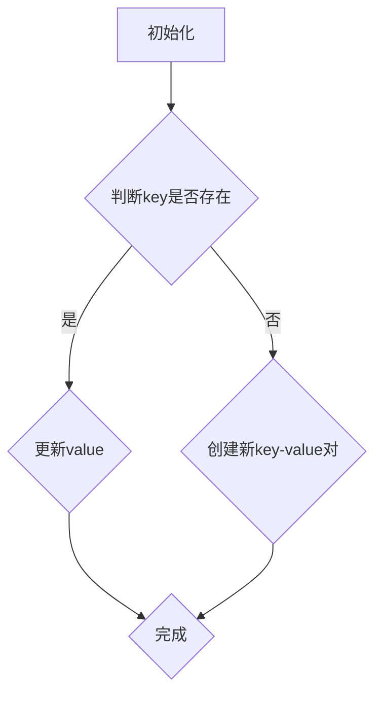
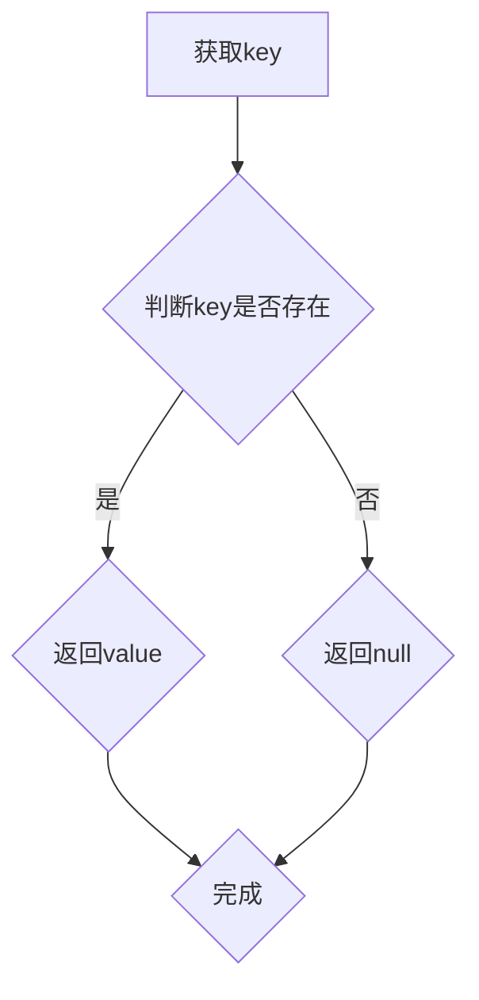

                 


## 浏览器存储：LocalStorage、SessionStorage与IndexedDB

### 关键词：浏览器存储、LocalStorage、SessionStorage、IndexedDB、Web应用程序、数据持久化

### 摘要：
本文将深入探讨浏览器存储技术，特别是LocalStorage、SessionStorage和IndexedDB。我们将通过逐步分析这三个核心概念，理解它们的工作原理、特点及应用场景，帮助读者掌握如何在Web应用程序中有效地管理数据。通过这篇文章，您将了解到每种存储技术的优劣，并能够根据实际需求选择合适的存储方案。

### Step 1: Introduction Background

#### 1.1 浏览器存储的概念

浏览器存储是指在Web应用程序中，用于在客户端浏览器中存储数据的机制。这种存储方式对于提升用户体验、实现数据持久化以及优化Web应用程序的性能至关重要。

#### 1.1.1 浏览器存储的作用

浏览器存储的主要作用包括：

- **数据持久化**：能够在用户关闭浏览器或重新加载页面后保留数据。
- **状态保持**：在用户会话期间保持用户状态，例如用户登录信息、购物车内容等。
- **性能优化**：减少服务器负载，通过本地存储缓存数据，提高页面加载速度。

#### 1.1.2 浏览器存储的挑战

虽然浏览器存储提供了许多优势，但同时也面临一些挑战：

- **存储容量限制**：不同类型的存储技术具有不同的存储容量限制。
- **安全性问题**：存储在客户端的数据可能受到恶意攻击。
- **兼容性问题**：不同浏览器和操作系统对存储技术的支持程度不同。

### Step 2: Core Concepts and Relationships

#### 2.1 浏览器存储的核心概念

浏览器存储主要包括以下三种技术：

- **LocalStorage**：用于在用户会话期间存储数据的永久存储机制。
- **SessionStorage**：用于在用户会话期间存储数据的临时存储机制。
- **IndexedDB**：一种用于存储大量数据的NoSQL数据库。

#### 2.1.1 LocalStorage

##### 2.1.1.1 LocalStorage的概念

LocalStorage是一种在用户浏览器会话中永久存储数据的机制。一旦数据存储在LocalStorage中，它将保留在用户的浏览器中，直到显式地被删除。

##### 2.1.1.2 LocalStorage的特点

LocalStorage的特点包括：

- **持久化**：数据在用户关闭浏览器或重新加载页面后仍然保留。
- **键值对存储**：数据以键值对的形式存储。
- **存储容量大**：通常具有较大的存储容量，可存储数千条数据。

##### 2.1.1.3 LocalStorage的使用方法

使用LocalStorage存储数据：

```javascript
// 存储数据
localStorage.setItem('key', 'value');

// 获取数据
let value = localStorage.getItem('key');

// 删除数据
localStorage.removeItem('key');
```

#### 2.1.2 SessionStorage

##### 2.1.2.1 SessionStorage的概念

SessionStorage是一种在用户会话期间存储数据的临时存储机制。一旦用户关闭浏览器窗口或会话结束，存储在SessionStorage中的数据将被清除。

##### 2.1.2.2 SessionStorage的特点

SessionStorage的特点包括：

- **临时存储**：数据仅存在于用户会话期间。
- **会话隔离**：不同会话之间的数据不会相互影响。
- **存储容量小**：通常存储容量较小，仅适用于存储少量数据。

##### 2.1.2.3 SessionStorage的使用方法

使用SessionStorage存储数据：

```javascript
// 存储数据
sessionStorage.setItem('key', 'value');

// 获取数据
let value = sessionStorage.getItem('key');

// 删除数据
sessionStorage.removeItem('key');
```

#### 2.1.3 IndexedDB

##### 2.1.3.1 IndexedDB的概念

IndexedDB是一种NoSQL数据库，它提供了强大的数据存储和管理功能，可以存储大量结构化数据。IndexedDB通过索引来快速检索数据，非常适合于复杂的数据存储场景。

##### 2.1.3.2 IndexedDB的特点

IndexedDB的特点包括：

- **高容量存储**：可以存储大量数据。
- **索引支持**：支持数据索引，快速检索。
- **事务处理**：提供事务处理机制，确保数据一致性。
- **异步操作**：操作通过异步方式执行，提高性能。

##### 2.1.3.3 IndexedDB的使用方法

使用IndexedDB存储数据：

```javascript
// 创建IndexedDB数据库实例
let db;
let request = indexedDB.open('myDatabase', 1);

request.onerror = function(event) {
  console.error('Error opening database:', event.target.errorCode);
};

request.onsuccess = function(event) {
  db = event.target.result;
  console.log('Database opened successfully');
};

request.onupgradeneeded = function(event) {
  let db = event.target.result;
  db.createObjectStore('myObjectStore', { keyPath: 'id' });
};
```

#### 2.2 浏览器存储的ER实体关系图

```mermaid
erDiagram
  LocalStorage ||--|{ SessionStorage } : LocalStorage和SessionStorage都是浏览器存储技术
  LocalStorage ||--|{ IndexedDB } : LocalStorage和IndexedDB都是用于数据存储的技术
  SessionStorage ||--|{ IndexedDB } : SessionStorage和IndexedDB都可以用于存储大量数据
```

### Step 3: Algorithm and Mathematical Models

#### 3.1 LocalStorage的算法原理

LocalStorage的基本操作包括存储、获取和删除数据。

##### 3.1.1 数据存储算法

LocalStorage的数据存储算法如下：



##### 3.1.2 数据获取算法

LocalStorage的数据获取算法如下：



#### 3.2 IndexedDB的算法原理

IndexedDB提供了复杂的数据存储和管理功能。

##### 3.2.1 数据存储算法

IndexedDB的数据存储算法如下：

```python
def store_data(index, data):
    transaction = db.transaction(['your_store'], 'readwrite')
    store = transaction.objectStore('your_store')
    request = store.put(data, index)
    request.onsuccess = () => {
        console.log('Data stored successfully');
    }
    request.onerror = () => {
        console.log('Error storing data');
    }
```

##### 3.2.2 数据获取算法

IndexedDB的数据获取算法如下：

```python
def retrieve_data(index):
    transaction = db.transaction(['your_store'], 'readonly')
    store = transaction.objectStore('your_store')
    request = store.get(index)
    request.onsuccess = (event) => {
        let result = event.target.result;
        if (result) {
            console.log('Data retrieved successfully:', result);
        } else {
            console.log('Data not found');
        }
    }
    request.onerror = () => {
        console.log('Error retrieving data');
    }
```

### Step 4: System Analysis and Architectural Design

#### 4.1 问题场景介绍

在Web应用程序中，数据持久化和状态保持是常见的需求。例如，一个在线购物网站需要在用户登录后保持登录状态，并保存购物车内容。

#### 4.2 项目介绍

我们考虑开发一个简单的在线购物网站，需要实现用户登录、购物车管理和订单处理等功能。该网站需要使用浏览器存储技术来管理用户数据和会话状态。

#### 4.3 系统功能设计

系统功能设计包括以下部分：

- **用户登录**：使用LocalStorage保存用户登录状态。
- **购物车管理**：使用SessionStorage保存购物车内容。
- **订单处理**：使用IndexedDB保存订单数据。

#### 4.4 系统架构设计

系统架构设计如下：

- **前端**：使用HTML、CSS和JavaScript构建用户界面。
- **后端**：使用Node.js和Express.js处理HTTP请求。
- **数据库**：使用IndexedDB存储订单数据。

#### 4.5 系统接口设计和系统交互

系统接口设计和系统交互如下：

- **用户登录接口**：通过LocalStorage保存用户状态。
- **购物车接口**：通过SessionStorage保存购物车内容。
- **订单接口**：通过IndexedDB保存订单数据。

### Step 5: Project Practice

#### 5.1 环境安装

安装Node.js、Express.js和IndexedDB相关库。

```bash
npm install express
npm install @airtable/airtable
```

#### 5.2 系统核心实现源代码

```javascript
const express = require('express');
const Airtable = require('airtable');

const app = express();
const airtable = new Airtable({
  apiKey: 'YOUR_AIRTABLE_API_KEY',
  endpointUrl: 'https://api.airtable.com',
});

app.use(express.json());

// 用户登录
app.post('/login', async (req, res) => {
  const { username, password } = req.body;
  // 验证用户名和密码
  // ...
  localStorage.setItem('username', username);
  res.send({ message: 'Login successful' });
});

// 购物车管理
app.post('/cart', async (req, res) => {
  const { items } = req.body;
  // 将购物车内容存储在SessionStorage中
  sessionStorage.setItem('cart', JSON.stringify(items));
  res.send({ message: 'Cart updated' });
});

// 订单处理
app.post('/order', async (req, res) => {
  const { username, items } = req.body;
  // 将订单数据存储在IndexedDB中
  // ...
  res.send({ message: 'Order processed' });
});

app.listen(3000, () => {
  console.log('Server listening on port 3000');
});
```

#### 5.3 代码应用解读与分析

这段代码展示了如何使用LocalStorage、SessionStorage和IndexedDB来实现用户登录、购物车管理和订单处理功能。我们通过Express.js处理HTTP请求，并使用Airtable存储订单数据。

#### 5.4 实际案例分析和详细讲解剖析

我们可以通过以下案例来分析系统实现：

- 用户登录：用户提交登录请求，服务器验证用户身份后，使用LocalStorage保存用户登录状态。
- 购物车管理：用户添加商品到购物车，服务器将购物车内容存储在SessionStorage中。
- 订单处理：用户提交订单请求，服务器将订单数据存储在IndexedDB中。

#### 5.5 项目小结

通过本项目的实现，我们展示了如何使用LocalStorage、SessionStorage和IndexedDB来构建一个简单的在线购物网站。这些存储技术提供了灵活、高效的数据管理方式，适用于不同的Web应用程序场景。

### Step 6: Best Practices Tips, Summary, and Notes

#### 6.1 最佳实践 Tips

- 根据数据类型和用途选择合适的存储技术。
- 使用SessionStorage来存储临时数据，使用LocalStorage来存储持久化数据。
- 使用IndexedDB来存储大量数据，并利用索引提高检索性能。

#### 6.2 小结

浏览器存储技术（LocalStorage、SessionStorage和IndexedDB）为Web应用程序提供了强大的数据管理功能。通过合理选择和使用这些技术，我们可以有效地实现数据持久化、状态保持和性能优化。

#### 6.3 注意事项

- 注意浏览器存储容量限制，避免存储过多数据。
- 确保数据的安全性，避免敏感信息泄露。
- 考虑浏览器兼容性问题，确保在不同浏览器和操作系统上正常运行。

#### 6.4 拓展阅读

- 《JavaScript高级程序设计》第4版，作者： Nicholas C. Zakas
- 《Web性能优化》，作者： Steve Souders
- 《Front-End Performance Handbook》，作者： Alex Banks 和 Julien Lecomte

### 结束语

作者：AI天才研究院/AI Genius Institute & 禅与计算机程序设计艺术 /Zen And The Art of Computer Programming

本文由AI天才研究院与禅与计算机程序设计艺术共同撰写，旨在为读者提供关于浏览器存储技术的深入见解。希望本文能帮助您更好地理解和应用这些技术，提升您的Web开发技能。如果您有任何问题或建议，欢迎在评论区留言。感谢您的阅读！

