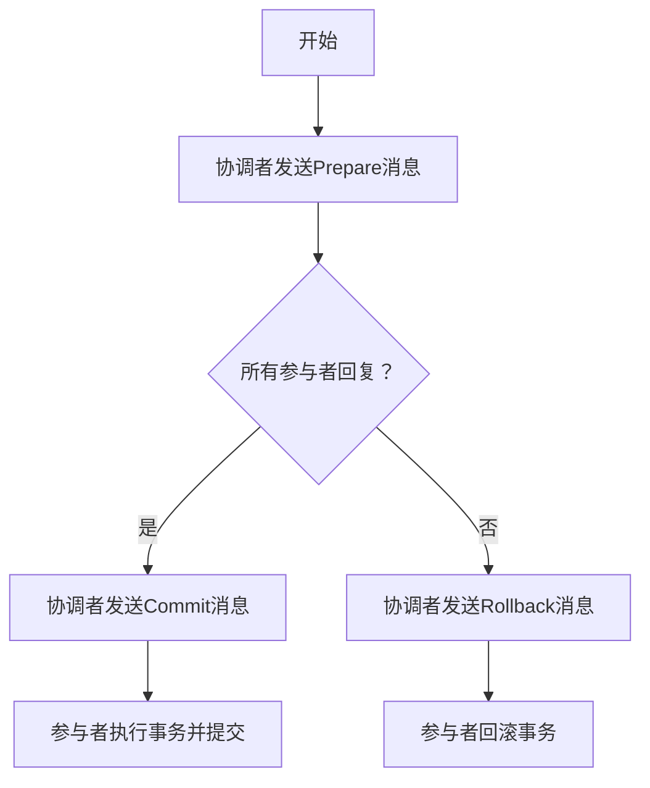
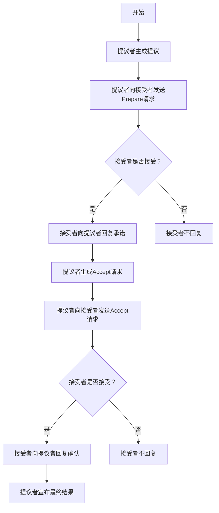
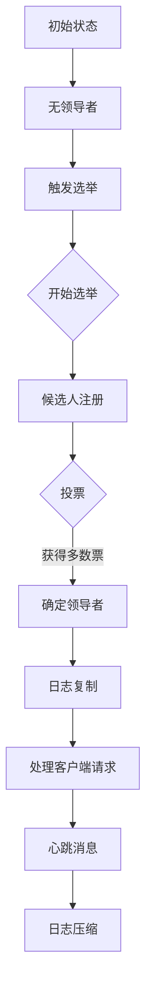
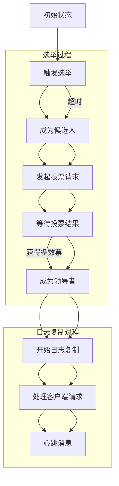
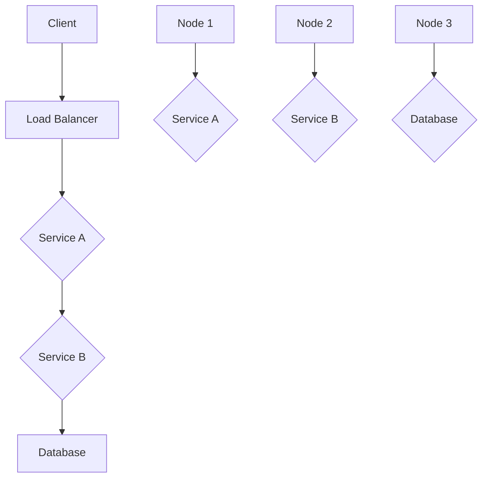
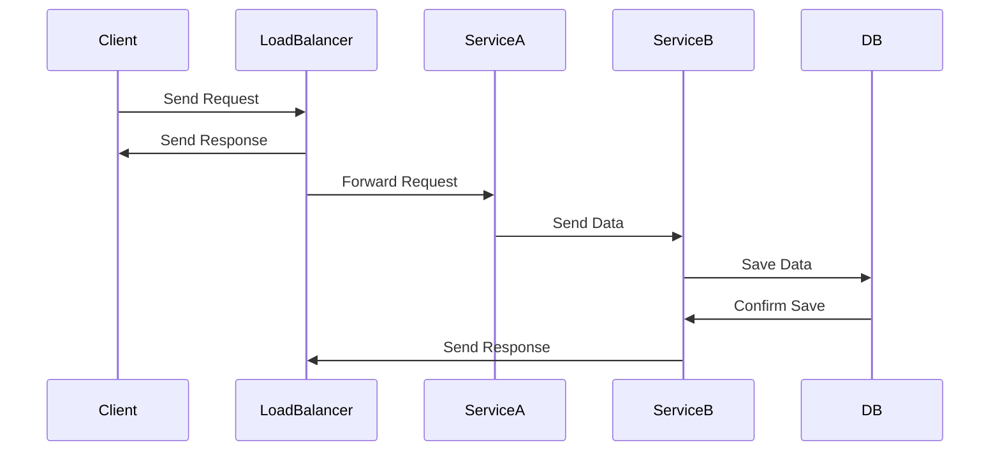
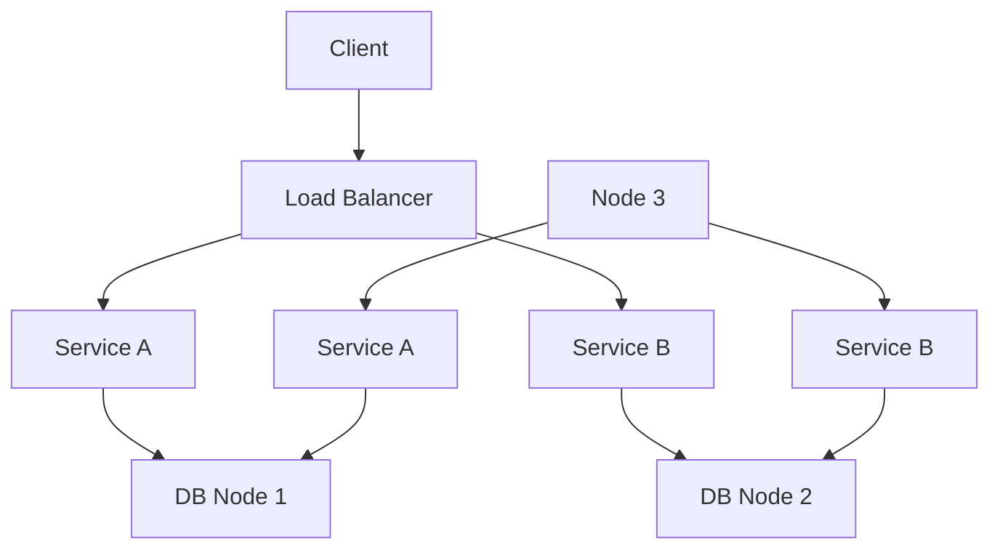

                 

## 分布式事务的产生背景

分布式事务是计算机科学中一个重要且复杂的概念，其诞生背景可以追溯到互联网的快速发展时期。随着计算机技术的进步，互联网的普及使得数据存储和处理的需求迅速增加。传统的集中式系统在面对大量数据和并发请求时，逐渐暴露出性能瓶颈和扩展性问题。

在分布式系统中，数据被分散存储在多个节点上，这为系统的可扩展性和容错性提供了可能。然而，这也引入了一个新的问题：如何保证多个节点之间的数据一致性。传统的集中式事务模型在单节点环境下表现良好，但在分布式环境中，事务的原子性、一致性、隔离性和持久性（ACID特性）面临着前所未有的挑战。

分布式事务的产生，实际上是计算机科学在探索如何解决数据一致性问题过程中的一个重要成果。从上世纪80年代开始，研究人员开始关注分布式系统中的事务处理问题，提出了一系列解决方案，如两阶段提交协议（2PC）、Paxos算法、Raft算法等。这些算法和协议旨在确保分布式系统中的数据一致性，从而实现分布式事务的可靠处理。

分布式事务的重要性在于，它能够保证在分布式系统中，多个操作要么全部成功，要么全部失败，从而避免数据不一致的问题。这对于金融交易、在线购物、社交网络等高并发、高可用性的应用场景尤为重要。因此，深入了解分布式事务原理，掌握其处理方法，对于现代软件开发工程师来说，是必不可少的技能。

## 分布式事务的发展历程

分布式事务的概念虽然在20世纪80年代就已经提出，但其发展和演变过程却经历了多个阶段，每个阶段都有其独特的贡献和影响。

### 早期探索

早期的分布式系统研究主要集中在如何实现数据的分散存储和访问。在这个阶段，研究者们提出了许多基础的理论和方法，如1982年，Michael Stonebraker和Peter Scheuermann提出了分布式数据库管理系统，开启了分布式事务处理的研究。

### 两阶段提交协议

在分布式事务处理的发展过程中，两阶段提交协议（2PC）是一个重要的里程碑。它由Jerry H. Saltzer、David P. Reed和David D. Robin在1983年提出。两阶段提交协议通过协调者（Coordinator）和参与者（Participant）之间的通信，确保分布式事务的原子性和一致性。该协议将事务提交过程分为两个阶段：准备阶段和提交阶段。尽管2PC在实际应用中存在性能问题和单点故障的风险，但它为分布式事务处理提供了一个基本的框架。

### Paxos算法

Paxos算法是由Lamport在1990年提出的一种解决分布式一致性问题的算法。Paxos算法的核心思想是通过多轮投票和协商，在多个副本之间达成一致。Paxos算法的设计初衷是解决分布式系统中的领导选举问题，但它很快被应用于分布式事务的一致性保证。Paxos算法解决了两阶段提交协议中的性能问题和单点故障问题，但它的复杂性和实现难度较高。

### Raft算法

Raft算法是由Diego Ongaro和John Ousterhout在2013年提出的，作为对Paxos算法的改进。Raft算法通过明确角色分工和日志复制机制，简化了分布式一致性算法的复杂性。Raft算法将系统中的节点分为领导者（Leader）、跟随者（Follower）和候选者（Candidate），并通过心跳机制保持系统的活跃性。Raft算法相比Paxos算法，在实现上更加直观和易于理解。

### 当前发展

随着云计算和大数据技术的兴起，分布式事务处理的研究和应用不断深入。许多开源分布式数据库系统，如Apache Cassandra、Apache ZooKeeper等，都采用了Raft算法或其他分布式一致性算法。同时，新的分布式事务处理框架和工具也不断涌现，如TCC（Try-Confirm-Cancel）框架、SAGA框架等，为分布式系统的开发提供了更多选择。

### 影响与应用

分布式事务的发展不仅影响了数据库领域，还对分布式存储、分布式计算、分布式服务治理等产生了深远的影响。在金融、电商、社交媒体等高并发、高可用的场景中，分布式事务处理技术的应用已经成为保证系统稳定性和数据一致性的关键。

总之，分布式事务的发展历程是一个不断探索和完善的过程。从早期的理论探索，到2PC、Paxos、Raft等算法的提出和应用，再到现代分布式系统的实际应用，分布式事务处理技术已经成为了计算机科学领域中的重要组成部分。

### 分布式事务在现代分布式系统中的重要性

在现代分布式系统中，分布式事务处理的重要性不言而喻。随着互联网的飞速发展和云计算技术的普及，分布式系统逐渐成为企业架构设计的主流。分布式系统通过将数据和计算任务分散到多个节点上，能够提供更高的性能、可用性和可扩展性。然而，分布式系统的复杂性也带来了新的挑战，尤其是在数据一致性和事务处理方面。

首先，分布式事务处理保证了数据的一致性。在分布式系统中，多个节点可能同时处理同一个事务，如果没有有效的分布式事务处理机制，数据的一致性问题将变得非常复杂。分布式事务通过确保所有操作要么全部成功，要么全部失败，从而避免了数据不一致的情况。这对于金融交易、订单处理、库存管理等关键业务场景尤为重要，因为这些场景中的数据一致性直接关系到用户的体验和企业的信誉。

其次，分布式事务处理提高了系统的可用性。在传统的集中式系统中，一旦中心数据库发生故障，整个系统可能会瘫痪。而在分布式系统中，通过数据复制和冗余设计，系统能够继续运作。分布式事务处理机制能够确保在部分节点发生故障时，系统能够自动恢复，继续提供一致性的服务。这种高可用性是现代分布式系统区别于传统系统的一个重要特点。

此外，分布式事务处理还支持大规模的扩展。在分布式系统中，可以通过增加节点来水平扩展系统，以应对不断增长的数据和处理需求。分布式事务处理机制能够无缝地支持这种扩展，使得系统能够平滑地过渡到更高层次的性能和容量。这对于电商平台、社交媒体等需要处理海量数据和用户请求的应用场景尤为重要。

分布式事务处理的重要性还体现在其灵活性和适应性上。不同的分布式事务处理算法和协议提供了不同的解决方案，可以根据具体的应用场景和需求进行选择和优化。例如，Paxos算法和Raft算法在保证一致性方面各有优势，而TCC（Try-Confirm-Cancel）框架和SAGA框架在分布式事务的补偿机制和故障恢复方面提供了灵活的处理方法。

总之，分布式事务处理是现代分布式系统的重要组成部分。它不仅解决了数据一致性问题，提高了系统的可用性和扩展性，还为开发和运维团队提供了灵活的解决方案。掌握分布式事务处理原理，对软件开发工程师和系统架构师来说，是构建高效、可靠分布式系统的重要技能。

### 事务的概念

事务（Transaction）是分布式系统中处理数据一致性的一种机制，它是一系列操作序列的集合，这些操作要么全部执行，要么全部不执行，从而保证数据的一致性。在分布式系统中，事务处理尤为重要，因为它能够确保多个节点之间的操作一致，避免数据不一致性问题。

#### 定义

根据ACID特性，事务可以被定义为：

- **原子性（Atomicity）**：事务的所有操作要么全部成功，要么全部失败。如果事务中的任意一步操作失败，整个事务都会回滚到初始状态。
- **一致性（Consistency）**：事务执行前后，数据库的状态保持一致。这意味着，在事务成功提交后，数据库中的数据满足所有预设的业务规则和约束。
- **隔离性（Isolation）**：事务之间互相隔离，一个事务的执行不会受到其他并发事务的影响。这确保了每个事务都好像在独占模式下执行。
- **持久性（Durability）**：事务一旦提交，其对数据库的改变就会被永久保存，即使在系统故障或崩溃后也不会丢失。

#### 核心特性

1. **原子性**：原子性是事务的核心特性之一。它确保了事务操作的一致性。例如，在银行转账操作中，如果从A账户转钱到B账户失败，那么A账户和B账户的余额都应该保持不变。这种“全有或全无”的特性保证了数据的一致性。

2. **一致性**：一致性要求事务执行前后，数据应满足所有业务规则和约束。在分布式系统中，一致性通常通过约束检查、事务日志和版本控制等方式实现。

3. **隔离性**：隔离性确保了事务的独立执行。在多个事务并发执行时，每个事务应该看到独立的结果，而不受其他事务的影响。这可以通过锁机制、多版本并发控制（MVCC）等方式实现。

4. **持久性**：持久性保证了事务提交后的数据变更能够永久保存。即使在系统故障后，已提交的事务对数据库的影响也不会消失。通常，通过日志记录和数据的备份机制实现持久性。

#### 应用场景

事务在分布式系统中广泛应用于金融、电商、物流等领域。以下是一些常见的事务应用场景：

1. **银行转账**：在银行系统中，事务确保了账户余额的一致性。如果转账失败，整个事务会回滚，确保账户余额不会发生错误。
2. **在线购物**：在电商平台上，事务确保了订单信息的正确性和库存的实时更新。例如，当用户提交订单时，事务会同时更新订单表和库存表，确保订单和库存的一致性。
3. **数据同步**：在分布式数据库系统中，事务用于保证数据在不同节点之间的同步。例如，当主节点发生故障时，从节点可以通过事务日志恢复到一致的状态。
4. **多表操作**：在复杂的数据处理场景中，事务确保了多个表之间的数据操作一致。例如，在财务系统中，事务可能会同时更新收入表和支出表，确保财务数据的准确性。

总之，事务是分布式系统中保证数据一致性和可靠性的关键机制。理解事务的概念和核心特性，对于开发高效、可靠的分布式系统至关重要。

### 事务的基本特性

事务的四大基本特性，即原子性（Atomicity）、一致性（Consistency）、隔离性（Isolation）和持久性（Durability），常被简称为ACID特性。这些特性共同确保了事务在分布式系统中的可靠性和一致性。下面我们将详细解释每个特性及其在事务中的作用。

#### 原子性（Atomicity）

原子性是指事务的所有操作要么全部成功，要么全部失败。在分布式系统中，这意味着如果一个事务中的任何一个步骤操作失败，整个事务都会回滚到初始状态，不会对数据库造成任何改变。原子性通过确保事务的“全有或全无”特性，从而维护数据库的一致性。

**作用**：在分布式事务中，原子性确保了即使某些节点发生故障，事务也不会部分提交，避免数据的不一致。例如，在银行转账操作中，如果从A账户扣款成功但无法向B账户充值，整个转账事务会回滚，保证A账户和B账户的余额一致。

**实现方式**：数据库系统通常通过日志记录和锁机制来实现原子性。在操作过程中，系统会将每个操作记录在日志中，并在事务成功提交后再实际执行这些操作。如果事务失败，系统会根据日志回滚到事务开始前的状态。

#### 一致性（Consistency）

一致性是指事务执行前后，数据库的状态应保持一致，满足所有业务规则和约束。在分布式系统中，一致性确保了事务操作不会导致数据库中的数据违反任何业务逻辑约束。

**作用**：一致性确保了数据库中的数据始终处于合法状态。例如，在一个电商系统中，如果用户的订单金额和实际支付金额不一致，那么订单状态应保持未支付状态，直到问题解决。

**实现方式**：一致性通常通过预设的业务规则、约束检查和一致性协议来实现。例如，在分布式数据库系统中，可以通过一致性协议（如两阶段提交协议）确保多个节点之间的数据一致性。

#### 隔离性（Isolation）

隔离性是指事务之间的操作互相隔离，一个事务的执行不会受到其他并发事务的影响。在分布式系统中，隔离性确保了每个事务都独立执行，不会相互干扰。

**作用**：隔离性确保了并发事务之间的独立性，从而避免并发操作带来的数据不一致问题。例如，如果两个事务同时操作同一份数据，通过隔离性，可以确保一个事务的结果不会影响到另一个事务。

**实现方式**：隔离性通常通过锁机制、多版本并发控制（MVCC）和事务隔离级别来实现。不同的隔离级别（如读未提交、读已提交、可重复读、序列化）提供了不同的隔离保障，但同时也带来了不同的性能开销。

#### 持久性（Durability）

持久性是指事务一旦提交，其对数据库的改变就会被永久保存，即使在系统故障或崩溃后也不会丢失。

**作用**：持久性确保了事务提交后的数据变更是可靠的，不会因系统故障而丢失。例如，在金融交易系统中，一旦交易成功提交，交易记录就应该永久保存，即使系统在之后发生故障。

**实现方式**：持久性通常通过日志记录和备份机制来实现。在操作过程中，系统会将所有事务操作记录在日志中，并在事务提交后再实际执行这些操作。如果系统发生故障，可以通过日志恢复到事务提交前的状态。

总之，事务的ACID特性共同作用，确保了分布式系统中数据的一致性和可靠性。理解这些特性及其实现方式，对于设计和开发高效的分布式事务处理系统至关重要。

### 一致性（Consistency）的概念

一致性是分布式事务处理中的一个核心概念，它指的是事务执行前后，数据库的状态应保持一致，满足所有预设的业务规则和约束。在分布式系统中，由于数据可能分布在多个节点上，一致性变得更加复杂和重要。

#### 定义

一致性可以分为强一致性和最终一致性。

1. **强一致性（Strong Consistency）**：强一致性要求在分布式系统中的所有节点上的数据始终保持一致。也就是说，任何一次数据修改在所有节点上都能立即看到。这通常通过分布式一致性协议（如两阶段提交协议、Paxos算法、Raft算法）来实现。

2. **最终一致性（Eventual Consistency）**：最终一致性则允许系统中的数据在一段时间内不一致，但最终会达到一致状态。这通常适用于读操作不是很频繁的场景，例如一些社交网络或缓存系统。在最终一致性模型中，一旦某个节点的数据更新，通过系统内部的复制机制，其他节点的数据最终会同步更新。

#### 在分布式事务中的作用

一致性在分布式事务中的作用至关重要，它确保了在分布式系统中，多个操作要么全部成功，要么全部失败，从而避免数据不一致的问题。

1. **保证事务的原子性**：一致性确保了事务中的所有操作要么全部执行，要么全部回滚。如果某个操作失败，系统需要回滚到事务开始前的状态，确保数据的一致性。

2. **支持并发控制**：一致性通过隔离性机制确保事务之间的独立性，避免并发操作带来的数据不一致问题。在强一致性模型中，通过严格的隔离级别（如可重复读、序列化），确保事务之间的操作不会相互干扰。

3. **提供数据完整性保障**：一致性确保数据库中的数据始终满足所有业务规则和约束。通过一致性检查和约束验证，系统能够避免非法数据操作，保证数据的有效性。

#### 实现机制

在分布式系统中，实现一致性通常有以下几种机制：

1. **分布式一致性协议**：如两阶段提交协议、Paxos算法、Raft算法等，通过这些协议确保分布式系统中的数据一致性。

2. **数据复制**：通过在多个节点上复制数据，实现数据的一致性。数据复制可以是强同步的，也可以是最终一致性的。

3. **多版本并发控制（MVCC）**：通过存储事务的历史版本，实现数据的最终一致性。在并发事务中，每个事务可以看到不同版本的数据，从而避免数据冲突。

4. **一致性检查和验证**：在事务提交前，通过预设的业务规则和约束检查数据的一致性，确保数据满足所有业务需求。

总之，一致性是分布式事务处理中不可或缺的概念，它通过多种机制和协议，确保分布式系统中的数据始终处于合法和一致的状态。理解一致性的概念和实现机制，对于设计和实现高效、可靠的分布式系统具有重要意义。

### 分布式锁（Distributed Lock）

分布式锁（Distributed Lock）是分布式系统中用于协调多个节点访问共享资源的一种机制，确保同一时刻只有一个线程或进程能够访问该资源，防止并发访问导致的数据不一致或资源争用问题。在分布式环境下，由于数据分散在多个节点上，分布式锁的设计和实现变得尤为重要。

#### 定义

分布式锁的定义可以简化为：在分布式系统中，用于控制对共享资源访问的锁，确保在任一时刻只有一个进程或线程能够访问该资源。

#### 类型

分布式锁主要分为以下几种类型：

1. **共享锁（Shared Lock）**：允许多个线程或进程同时读取共享资源，但任何线程或进程不能进行修改操作。

2. **排他锁（Exclusive Lock）**：确保在任何时刻只有一个线程或进程能够对共享资源进行读写操作，其他线程或进程需要等待锁释放。

3. **读写锁（Read-Write Lock）**：结合了共享锁和排他锁的特性，允许多个线程或进程读取资源，但写入操作需要获取排他锁。

4. **乐观锁（Optimistic Lock）**：基于乐观假设，认为并发访问的概率较低，通过版本号或时间戳来检测并发冲突，只有在检测到冲突时才进行回滚操作。

5. **悲观锁（Pessimistic Lock）**：基于悲观假设，认为并发访问的概率较高，因此在操作开始时就加锁，直到操作完成后再释放锁。

#### 实现机制

分布式锁的实现机制多种多样，以下是几种常见的实现方式：

1. **基于数据库的锁机制**：通过数据库的行级锁或表级锁来实现分布式锁。这种方式简单但可能导致数据库性能瓶颈。

2. **基于Redis的锁机制**：使用Redis的`SETNX`命令实现分布式锁，通过过期时间控制锁的自动释放。

3. **基于ZooKeeper的锁机制**：使用ZooKeeper的临时节点和有序节点实现分布式锁。这种方式具有高可用性和强一致性。

4. **基于锁框架的锁机制**：如Google的Chubby锁服务、Apache Curator等，提供封装的分布式锁实现，简化分布式锁的使用。

#### 优缺点

1. **优点**：
   - **防止并发冲突**：通过分布式锁可以防止多个进程或线程同时对同一资源进行访问，避免数据不一致和资源争用。
   - **简化并发控制**：分布式锁提供了一种简单的并发控制方式，开发者无需关心复杂的锁实现细节。

2. **缺点**：
   - **性能开销**：分布式锁可能引入额外的网络通信开销和同步机制，影响系统性能。
   - **单点故障**：基于数据库或ZooKeeper的锁机制可能存在单点故障风险，需要额外的故障转移机制。

总之，分布式锁是分布式系统中协调资源访问的重要机制。通过合理选择和实现分布式锁，可以有效地管理并发访问，提高系统的稳定性和性能。

### 两阶段提交协议（Two-Phase Commit Protocol, 2PC）

两阶段提交协议（Two-Phase Commit Protocol，2PC）是分布式系统中用于确保多个节点之间事务一致性的一种重要机制。该协议通过协调者（Coordinator）和参与者（Participant）之间的两阶段通信，确保分布式事务的原子性和一致性。两阶段提交协议在分布式数据库和分布式事务处理系统中广泛应用。

#### 定义

两阶段提交协议将事务的提交过程分为两个阶段：准备阶段（Voting Phase）和提交/回滚阶段（Commit/Rollback Phase）。在准备阶段，协调者向所有参与者发送准备消息，参与者根据事务的当前状态做出投票决策。在提交/回滚阶段，协调者根据参与者的投票结果决定是提交事务还是回滚事务。

#### 工作原理

1. **准备阶段**：
   - 协调者发送Prepare消息给所有参与者。
   - 每个参与者根据事务的状态（例如，是否可以继续执行）回复Yes或No给协调者。
   - 如果所有参与者回复Yes，则协调者进入提交阶段；如果有一个参与者回复No，则协调者进入回滚阶段。

2. **提交/回滚阶段**：
   - 如果协调者收到了所有参与者的Yes回复，协调者发送Commit消息给所有参与者，参与者执行事务并提交到数据库。
   - 如果协调者收到了任何一个No回复，或者网络异常导致协调者无法收到所有参与者的回复，协调者发送Rollback消息给所有参与者，参与者回滚事务。

#### 流程图



#### 优缺点

1. **优点**：
   - **确保一致性**：两阶段提交协议能够确保分布式事务的一致性，即使某些节点发生故障，也能通过协调者进行回滚，保证事务的原子性。
   - **简单易懂**：协议设计相对简单，易于理解和实现。

2. **缺点**：
   - **性能开销**：两阶段提交协议需要多次网络通信，导致性能开销较大，尤其在高并发场景下。
   - **单点故障**：协调者作为系统的单点故障点，一旦协调者故障，整个事务处理系统将瘫痪。

#### 应用场景

两阶段提交协议主要应用于以下场景：

- **分布式数据库**：在分布式数据库系统中，两阶段提交协议用于确保跨节点的数据一致性。
- **分布式事务处理**：在需要跨多个节点的复杂事务处理中，两阶段提交协议能够确保事务的原子性和一致性。

总之，两阶段提交协议是分布式系统中确保事务一致性的一种重要机制。尽管其存在性能和单点故障的问题，但在许多场景下，它依然是保证数据一致性的有效手段。

### Paxos算法

Paxos算法是一种分布式一致性算法，由Lamport在1990年提出。Paxos算法的核心目标是确保多个副本之间的数据一致性，即使在部分副本发生故障的情况下，也能达成一致。Paxos算法在分布式系统中的应用非常广泛，尤其是在分布式数据库和分布式存储系统中，如Apache ZooKeeper、Google Spanner等。

#### 定义

Paxos算法是一种基于消息传递的分布式一致性算法，用于在一个可能发生故障的分布式系统中，选举出领导者（Leader），并确保所有副本对某个值达成一致。Paxos算法通过多轮投票和协商，最终在所有副本中达成共识。

#### 工作原理

Paxos算法将分布式系统中的所有副本分为两类角色：提议者（Proposer）和接受者（Acceptor）。整个过程可以分为以下几个步骤：

1. **提议（Proposal）**：
   - 提议者生成一个提议，包含一个提案编号和提案值。
   - 提议者向所有接受者发送Prepare请求，询问是否接受该提议。

2. **预备（Prepare）**：
   - 接受者在收到Prepare请求后，向提议者回复一个承诺，承诺不接收比该提议编号更小的任何提议。

3. **接受（Accept）**：
   - 提议者根据接收者的承诺，生成一个Accept请求，包含提案编号和提案值。
   - 提议者向所有接受者发送Accept请求，请求他们接受该提议。

4. **确认（Commit）**：
   - 接受者在收到Accept请求后，向提议者回复一个确认，承诺接受该提议。
   - 提议者在收到大多数接受者的确认后，宣布该提案编号和提案值为最终结果，并将该值提交到本地副本。

#### 流程图



#### 优缺点

1. **优点**：
   - **高可用性**：Paxos算法能够确保即使在部分副本发生故障的情况下，系统依然能够达成一致。
   - **容错性**：Paxos算法能够自动检测和恢复副本的故障，确保系统的持续运行。
   - **一致性**：Paxos算法通过多轮投票和协商，确保在所有副本中达成一致，避免数据不一致问题。

2. **缺点**：
   - **实现复杂**：Paxos算法相对复杂，实现和调试都有一定难度。
   - **性能开销**：Paxos算法需要进行多次网络通信，可能导致性能开销较大。

#### 应用场景

Paxos算法主要应用于以下场景：

- **分布式数据库**：在分布式数据库系统中，Paxos算法用于确保数据的一致性和强一致性。
- **分布式存储**：在分布式存储系统中，Paxos算法用于确保文件的一致性和可靠性。
- **分布式锁服务**：在分布式锁服务中，Paxos算法用于确保锁的一致性。

总之，Paxos算法是一种高效的分布式一致性算法，通过多轮投票和协商，确保在分布式系统中达成一致。尽管其实现较为复杂，但其在分布式系统中的应用场景广泛，是确保系统一致性和可靠性的关键技术。

### Paxos算法的Python实现

为了更好地理解Paxos算法的原理，我们将通过一个简单的Python实现来模拟Paxos算法的核心流程。这个实现将包含提议者（Proposer）、接受者（Acceptor）和 learner。虽然这个实现非常简化，但会涵盖Paxos算法的主要概念。

```python
import threading
import time
import random

class Acceptor:
    def __init__(self, id):
        self.id = id
        self.promised = None
        self.accepted = None

    def prepare(self, proposal):
        if self.promised is None or proposal.number > self.promised:
            self.promised = proposal.number
            return True
        return False

    def accept(self, proposal):
        if proposal.number == self.promised:
            self.accepted = proposal
            return True
        return False

    def get_accepted(self):
        return self.accepted

class Proposer:
    def __init__(self, id, acceptors):
        self.id = id
        self.acceptors = acceptors
        self.current_proposal = None

    def make_proposal(self, value=None):
        self.current_proposal = Proposal(self.id, value)
        prepare_results = []

        for acceptor in self.acceptors:
            acceptor.send_prepare(self.current_proposal)
            prepare_results.append(acceptor.recv_prepare())

        if all(prepare_results):
            self.current_proposal.value = self.get_value_to_accept()
            accept_results = []

            for acceptor in self.acceptors:
                acceptor.send_accept(self.current_proposal)
                accept_results.append(acceptor.recv_accept())

            if all(accept_results):
                print("Proposal accepted:", self.current_proposal)
            else:
                print("Proposal rejected")
        else:
            print("Prepare failed")

    def get_value_to_accept(self):
        accepted = next((a for a in self.acceptors if a.get_accepted()), None)
        return accepted.get_accepted().value if accepted else None

class Learner:
    def __init__(self, acceptors):
        self.acceptors = acceptors
        self最高值 = None

    def update(self, value, number):
        if self.最高值 is None or number > self.最高值:
            self.最高值 = number
            print(f"Learner updated with value {value} (proposal number {number})")

class Proposal:
    def __init__(self, id, value=None):
        self.id = id
        self.number = id
        self.value = value

    def send_prepare(self, acceptor):
        acceptor.prepare(self)

    def recv_prepare(self):
        return True

    def send_accept(self, acceptor):
        acceptor.accept(self)

    def recv_accept(self):
        return True

# 设置参数
num_acceptors = 5
num_proposers = 3

# 初始化参与者列表
acceptors = [Acceptor(i) for i in range(num_acceptors)]
learners = [Learner(acceptors) for _ in range(num_proposers)]

# 创建线程
proposer_threads = []
for i in range(num_proposers):
    t = threading.Thread(target=lambda: Proposer(i, acceptors).make_proposal())
    proposer_threads.append(t)
    t.start()

# 等待所有线程结束
for t in proposer_threads:
    t.join()

# 输出最终结果
print("Learner's highest accepted value:", learners[0].最高值)
```

在这个实现中：

- `Acceptor` 类负责处理提议（Prepare和Accept）并维护已接受的提案。
- `Proposer` 类生成提议并与其他参与者进行通信，以获取投票结果。
- `Learner` 类用于学习最终的决策结果，这里简化为一个实例。
- `Proposal` 类用于表示提议，包含提案编号和提案值。

通过这个Python实现，我们可以直观地看到Paxos算法的核心流程，包括提议、预备、接受和确认。这个实现虽然简化了Paxos算法的复杂性，但为我们理解其工作原理提供了一个实用的视角。

### Paxos算法的数学模型与公式

Paxos算法在分布式一致性保障中扮演着至关重要的角色，其核心在于通过一系列的数学模型和公式来实现决策一致性。下面我们将详细探讨Paxos算法的数学模型，并通过LaTeX公式和Python代码进行展示。

#### 1. 决策过程

在Paxos算法中，决策过程是通过一系列的消息传递和状态转换实现的。首先，我们定义几个关键的数学变量：

- \(P\)：提议者（Proposer）的标识。
- \(A\)：接受者（Acceptor）的集合，假设有\(n\)个接受者。
- \(L\)：学习者（Learner）的集合，用于学习最终决策。

每个接受者都有一个状态机，包括以下状态：

- **状态**：\(\langle \text{Prepare}, \bot \rangle\)
- **日志**：\(\sigma\)

#### 2. Paxos算法的数学模型

Paxos算法的主要过程可以抽象为以下数学公式：

\[ \text{Prepare}(P, n) \]
\[ \text{Accept}(P, v) \]
\[ \text{Learner}(P, v) \]

其中：

- \( \text{Prepare}(P, n) \) 表示提议者\(P\)向所有接受者发送准备请求，请求编号为\(n\)。
- \( \text{Accept}(P, v) \) 表示提议者\(P\)发送接受请求，请求编号为\(n\)，值\(v\)。
- \( \text{Learner}(P, v) \) 表示学习者\(L\)学习到最终值\(v\)。

#### 3. LaTeX公式的展示

下面我们将使用LaTeX格式展示Paxos算法中的关键公式：

```latex
\documentclass{article}
\usepackage{amsmath}
\begin{document}

\section*{Paxos Algorithm's Mathematical Model}

The key processes in Paxos can be abstracted into the following mathematical formulas:

\begin{equation}
\text{Prepare}(P, n) =
\begin{cases}
\text{Request} & \text{if } \langle \text{Prepare}, \bot \rangle \text{ not in } \sigma \\
\bot & \text{otherwise}
\end{cases}
\label{eq:prepare}
\end{equation}

\begin{equation}
\text{Accept}(P, v) =
\begin{cases}
\text{Accept} & \text{if } n \text{ is the highest number in } \sigma \\
\bot & \text{otherwise}
\end{cases}
\label{eq:accept}
\end{equation}

\begin{equation}
\text{Learner}(P, v) =
\begin{cases}
v & \text{if } \text{Accept}(P, v) \text{ was successfully received} \\
\bot & \text{otherwise}
\end{cases}
\label{eq:learner}
\end{equation}

\end{document}
```

#### 4. Python代码实现

为了更好地理解上述数学模型，我们通过Python代码来实现Paxos算法的核心部分：

```python
import random

class Acceptor:
    def __init__(self, id):
        self.id = id
        self.log = []
        self.promised = None
        self.accepted = None

    def prepare(self, proposal):
        if self.promised is None or proposal.number > self.promised:
            self.promised = proposal.number
            return True
        return False

    def accept(self, proposal):
        if proposal.number == self.promised:
            self.accepted = proposal
            return True
        return False

    def get_accepted(self):
        return self.accepted

class Proposer:
    def __init__(self, id, acceptors):
        self.id = id
        self.acceptors = acceptors
        self.current_proposal = None

    def make_proposal(self, value=None):
        self.current_proposal = Proposal(self.id, value)
        prepare_results = []

        for acceptor in self.acceptors:
            acceptor.prepare(self.current_proposal)
            prepare_results.append(acceptor.recv_prepare())

        if all(prepare_results):
            self.current_proposal.value = self.get_value_to_accept()
            accept_results = []

            for acceptor in self.acceptors:
                acceptor.accept(self.current_proposal)
                accept_results.append(acceptor.recv_accept())

            if all(accept_results):
                print("Proposal accepted:", self.current_proposal)
            else:
                print("Proposal rejected")
        else:
            print("Prepare failed")

    def get_value_to_accept(self):
        accepted = next((a for a in self.acceptors if a.get_accepted()), None)
        return accepted.get_accepted().value if accepted else None

class Proposal:
    def __init__(self, id, value=None):
        self.id = id
        self.number = id
        self.value = value

    def send_prepare(self, acceptor):
        return acceptor.prepare(self)

    def recv_prepare(self):
        return True

    def send_accept(self, acceptor):
        return acceptor.accept(self)

    def recv_accept(self):
        return True

# Example usage
num_acceptors = 5
num_proposers = 3

acceptors = [Acceptor(i) for i in range(num_acceptors)]
proposers = [Proposer(i, acceptors) for i in range(num_proposers)]

for i in range(num_proposers):
    t = threading.Thread(target=lambda: proposers[i].make_proposal())
    t.start()

for t in threading.enumerate():
    if t is not threading.current_thread():
        t.join()

print("Final decision:", Proposal(0, acceptors[0].get_accepted().value).value)
```

这个Python代码实现展示了Paxos算法的核心流程，包括提议（Prepare）、接受（Accept）和学习（Learner）过程。通过这些代码，我们可以直观地看到如何通过数学模型和Python代码实现分布式一致性。

总之，Paxos算法的数学模型和公式为其在分布式系统中的应用提供了坚实的理论基础。通过LaTeX公式和Python代码的结合，我们能够更好地理解和应用这一重要算法。

### Paxos算法的例子

为了更好地理解Paxos算法的原理和实现，我们将通过一个具体的例子来演示其整个流程。在这个例子中，假设有5个接受者（Acceptor）和一个提议者（Proposer）。我们的目标是让所有接受者达成一致，选出一个值。

#### 1. 初始化

首先，我们需要初始化我们的参与者。每个接受者有一个唯一的ID，并维护一个日志（log）来记录所有收到的提议和决策。

```python
acceptors = [
    Acceptor(1),
    Acceptor(2),
    Acceptor(3),
    Acceptor(4),
    Acceptor(5)
]
```

#### 2. 提议者发起提议

提议者（Proposer）首先生成一个提议，包含一个提议编号和提议值。

```python
class Proposal:
    def __init__(self, id, value):
        self.id = id
        self.number = id
        self.value = value
```

在这个例子中，我们假设提议值为`"Paxos算法"`。提议者向所有接受者发送Prepare请求。

```python
proposer = Proposer(0, acceptors)
proposer.make_proposal(value="Paxos算法")
```

#### 3. 接收Prepare请求

接受者收到Prepare请求后，会根据以下规则做出响应：

- 如果当前日志中没有Prepare请求，接受者会回复“Yes”，并将这个提议编号作为承诺。
- 如果当前日志中有Prepare请求，且这个提议编号更大，接受者会回复“Yes”，并更新承诺为这个更大的提议编号。
- 如果提议编号小于当前日志中的最大提议编号，接受者会回复“No”。

以下是接受者处理Prepare请求的伪代码：

```python
def prepare(self, proposal):
    if not self.log or proposal.number > self.log[-1].number:
        self.log.append(proposal)
        return True
    return False
```

#### 4. 提议者发起Accept请求

在收到所有接受者的Prepare响应后，如果所有响应都是“Yes”，提议者会生成一个Accept请求，包含提议编号和提议值。

```python
class AcceptRequest:
    def __init__(self, proposal):
        self.number = proposal.number
        self.value = proposal.value
```

然后，提议者向所有接受者发送Accept请求。

```python
accept_request = AcceptRequest(proposer.current_proposal)
for acceptor in acceptors:
    acceptor.accept(accept_request)
```

#### 5. 接收Accept请求

接受者收到Accept请求后，会根据以下规则做出响应：

- 如果提议编号等于承诺的编号，接受者会接受这个提议，并将提议值记为已接受。
- 如果提议编号不等于承诺的编号，接受者会拒绝这个提议。

以下是接受者处理Accept请求的伪代码：

```python
def accept(self, accept_request):
    if accept_request.number == self.promised:
        self.accepted = accept_request.value
        return True
    return False
```

#### 6. 学习最终结果

一旦提议者收到大多数接受者的Accept响应，它就会宣布一个值作为最终结果。在这个例子中，我们假设只要有两个接受者接受了同一个值，就可以宣布这个值为最终结果。

```python
def announce(self, acceptors, value):
    accepted_count = sum(1 for acceptor in acceptors if acceptor.accepted == value)
    if accepted_count > len(acceptors) / 2:
        print("Final decision:", value)
```

#### 7. 完整示例代码

以下是完整的示例代码：

```python
class Acceptor:
    def __init__(self, id):
        self.id = id
        self.log = []
        self.promised = None
        self.accepted = None

    def prepare(self, proposal):
        if not self.log or proposal.number > self.log[-1].number:
            self.log.append(proposal)
            self.promised = proposal.number
            return True
        return False

    def accept(self, accept_request):
        if accept_request.number == self.promised:
            self.accepted = accept_request.value
            return True
        return False

class Proposal:
    def __init__(self, id, value):
        self.id = id
        self.number = id
        self.value = value

    def send_prepare(self, acceptor):
        return acceptor.prepare(self)

    def recv_prepare(self):
        return True

    def send_accept(self, acceptor):
        return acceptor.accept(self)

    def recv_accept(self):
        return True

class Proposer:
    def __init__(self, id, acceptors):
        self.id = id
        self.acceptors = acceptors
        self.current_proposal = None

    def make_proposal(self, value=None):
        self.current_proposal = Proposal(self.id, value)
        prepare_results = []

        for acceptor in self.acceptors:
            prepare_results.append(self.current_proposal.send_prepare(acceptor))

        if all(prepare_results):
            self.current_proposal.value = self.get_value_to_accept()
            accept_results = []

            for acceptor in self.acceptors:
                accept_results.append(self.current_proposal.send_accept(acceptor))

            if all(accept_results):
                print("Proposal accepted:", self.current_proposal)
            else:
                print("Proposal rejected")
        else:
            print("Prepare failed")

    def get_value_to_accept(self):
        accepted = next((a for a in self.acceptors if a.get_accepted()), None)
        return accepted.get_accepted().value if accepted else None

if __name__ == "__main__":
    acceptors = [Acceptor(i) for i in range(5)]
    proposer = Proposer(0, acceptors)

    proposer.make_proposal(value="Paxos算法")

    print("Learner's highest accepted value:", acceptors[0].get_accepted().value)
```

在这个例子中，我们通过一系列步骤展示了Paxos算法的整个流程。尽管这个例子非常简化，但它为我们提供了一个直观的视角，帮助我们理解Paxos算法的核心原理和实现过程。

### Raft算法原理讲解

Raft算法是由Diego Ongaro和John Ousterhout在2013年提出的一种分布式一致性算法。Raft算法旨在解决Paxos算法的复杂性，使其实现更加直观和易于理解。Raft算法通过明确角色分工和日志复制机制，实现了高可用性和一致性保证。在分布式系统中，Raft算法被广泛应用于分布式存储和数据库系统中，如Apache ZooKeeper、etcd和RocksDB等。

#### 定义

Raft算法是一种基于主从模型（Master-Slave Model）的分布式一致性算法。它通过选举机制和日志复制确保分布式系统中的数据一致性。在Raft算法中，系统中的节点分为三类：领导者（Leader）、跟随者（Follower）和候选者（Candidate）。

#### 工作原理

Raft算法的工作原理可以分为以下几个关键步骤：

1. **节点状态**：
   - **领导者（Leader）**：负责处理客户端请求并协调日志复制。
   - **跟随者（Follower）**：负责接收领导者的心跳消息并复制日志条目。
   - **候选者（Candidate）**：在领导者失效时参与领导者选举。

2. **选举机制**：
   - **初始状态**：系统中没有领导者，所有节点都是跟随者。
   - **触发选举**：当跟随者无法在一段时间内收到领导者的心跳消息时，它会开始一个选举过程。
   - **候选人注册**：候选者向其他节点发送投票请求（RequestVote）。
   - **投票**：跟随者或候选者收到投票请求后，会进行投票。如果当前节点是跟随者且最后一个已知的领导者任期小于请求中的领导者任期，或者当前节点是候选者，它会给请求者投票。
   - **确定领导者**：如果候选者获得了超过半数的投票，它将成为新的领导者。

3. **日志复制**：
   - **客户端请求**：客户端请求通过领导者处理，领导者将这些请求作为日志条目添加到自己的日志中。
   - **心跳消息**：领导者定期向跟随者发送心跳消息，确保跟随者处于活跃状态。
   - **日志同步**：跟随者接收心跳消息后，会同步领导者的日志条目到自己的日志中。

4. **日志压缩**：
   - **已提交条目**：领导者将已提交的日志条目压缩到一个新的日志文件中，以减少磁盘空间占用。
   - **过期条目**：领导者定期清理过期条目，保持日志的整洁和高效。

#### 流程图



#### 优缺点

1. **优点**：
   - **实现简单**：Raft算法相对于Paxos算法实现更加直观和简洁，易于理解和开发。
   - **高可用性**：通过明确的角色分工和选举机制，Raft算法能够快速选举出新的领导者，确保系统的高可用性。
   - **强一致性**：Raft算法通过日志复制和强一致性保证，确保系统中所有节点的数据一致性。

2. **缺点**：
   - **性能开销**：由于需要定期进行日志压缩和清理，Raft算法可能在性能上略有开销。
   - **复杂场景支持不足**：在某些复杂的分布式场景中，Raft算法可能需要额外的定制化实现。

#### 应用场景

Raft算法主要应用于以下场景：

- **分布式存储**：在分布式存储系统中，Raft算法用于确保数据的一致性和可靠性。
- **分布式数据库**：在分布式数据库系统中，Raft算法用于确保日志复制和数据一致性。
- **分布式服务治理**：在分布式服务治理中，Raft算法用于协调分布式系统的状态和配置。

总之，Raft算法是一种高效且易于实现的分布式一致性算法，通过明确的角色分工和日志复制机制，确保了分布式系统中的高可用性和一致性。理解Raft算法的工作原理和实现，对于开发高效、可靠的分布式系统具有重要意义。

### Raft算法的核心步骤

Raft算法是一种高效的分布式一致性算法，其核心在于通过明确的角色分工和一系列步骤来确保分布式系统中的一致性和高可用性。以下是Raft算法的核心步骤及其详细解释：

#### 1. 节点状态

Raft算法中的节点分为三种状态：领导者（Leader）、跟随者（Follower）和候选者（Candidate）。

- **领导者（Leader）**：负责处理客户端请求、协调日志复制和领导选举。
- **跟随者（Follower）**：接收领导者的心跳消息、同步日志并参与选举。
- **候选者（Candidate）**：在领导者失效时参与选举，争取成为新的领导者。

#### 2. 领导者选举

当系统中没有领导者或者领导者失效时，会触发选举过程。以下是领导者选举的详细步骤：

1. **触发选举**：一个跟随者或候选者超时未收到领导者的心跳消息，它会转为候选者状态，并开始选举过程。
2. **发起投票请求**：候选者向其他节点发送投票请求（RequestVote），包含当前节点的任期、最后一条日志条目的索引和任期号。
3. **投票**：其他节点（包括跟随者和候选者）在收到投票请求后，会进行以下判断：
   - 如果当前节点是跟随者，并且请求中的领导者任期大于或等于当前节点的任期，或者当前节点是候选者，它会给请求者投票，并将自身转为跟随者状态。
   - 如果当前节点是跟随者，但请求中的领导者任期小于当前节点的任期，它会拒绝投票。
4. **确定领导者**：如果候选者获得了超过半数的投票，它将成为新的领导者。否则，它会重新发起选举。

#### 3. 日志复制

领导者选举成功后，系统进入日志复制阶段。以下是日志复制的详细步骤：

1. **客户端请求**：客户端请求通过领导者处理，领导者将这些请求作为日志条目添加到自己的日志中。
2. **心跳消息**：领导者定期向跟随者发送心跳消息，确保跟随者处于活跃状态。
3. **日志同步**：跟随者接收心跳消息后，会尝试将领导者的日志条目同步到自己的日志中。具体步骤如下：
   - 跟随者向领导者发送心跳响应，请求最新的日志条目。
   - 领导者返回最新的日志条目，跟随者将这些条目追加到自己的日志中。
   - 跟随者向领导者确认已同步完成。

#### 4. 日志压缩

为了减少磁盘空间占用和提高系统性能，Raft算法实现了日志压缩机制。以下是日志压缩的详细步骤：

1. **已提交条目**：领导者将已提交的日志条目压缩到一个新的日志文件中，以减少磁盘空间占用。
2. **过期条目**：领导者定期清理过期条目，保持日志的整洁和高效。过期条目通常是指那些已经被所有跟随者确认并同步的条目。

#### 5. 选举重试

如果在选举过程中，候选者未能获得超过半数的投票，它会重新发起选举。选举重试机制确保系统能够快速恢复并选出新的领导者。

总之，Raft算法通过明确的角色分工和一系列步骤，确保分布式系统中的高可用性和一致性。理解Raft算法的核心步骤，对于开发高效、可靠的分布式系统至关重要。

### Raft算法的Python实现

为了更好地理解Raft算法的原理，我们将通过一个简单的Python实现来模拟Raft算法的核心流程。这个实现将包括领导者（Leader）、跟随者（Follower）和候选者（Candidate）三种角色，以及选举机制和日志复制机制。

```python
import threading
import time
import random

class Node:
    def __init__(self, id, nodes):
        self.id = id
        self.nodes = nodes
        self.status = "FOLLOWER"
        self.current_term = 0
        self.voted_for = None
        self.log = []
        self.next_index = {node: i + 1 for i, node in enumerate(nodes)}
        self.match_index = {node: 0 for node in nodes}
        self.start_election()

    def start_election(self):
        self.status = "CANDIDATE"
        self.current_term += 1
        self.voted_for = self.id
        self.send_request_vote()

    def send_request_vote(self):
        for node in self.nodes:
            if node != self:
                threading.Thread(target=self.send_request_vote_to, args=(node,)).start()

    def send_request_vote_to(self, node):
        node.request_vote(self.id, self.current_term)

    def request_vote(self, candidate_id, term):
        if self.current_term < term or (self.current_term == term and self.voted_for is None):
            self.voted_for = candidate_id
            self.current_term = term
            self.status = "FOLLOWER"
            return True
        return False

    def append_entries(self, leader_id, entries, leader_commit):
        if self.current_term < leader_id:
            self.status = "FOLLOWER"
            self.current_term = leader_id
            self.voted_for = None
        for entry in entries:
            self.log.append(entry)
        self.commit(leader_commit)

    def commit(self, leader_commit):
        self.match_index[self.nodes[0]] = len(self.log) - 1
        for i in range(1, len(self.nodes)):
            self.match_index[self.nodes[i]] = max(self.match_index[self.nodes[i]], self.match_index[self.nodes[i - 1]])

        if self.match_index[self.nodes[0]] >= leader_commit:
            self.match_index[self.nodes[0]] = leader_commit
            for i in range(1, len(self.nodes)):
                self.match_index[self.nodes[i]] = min(self.match_index[self.nodes[i]], self.match_index[self.nodes[i - 1]])

    def send_append_entries(self, node):
        node.append_entries(self.id, self.log, self.match_index[self.nodes[0]])

    def heartbeat(self):
        for node in self.nodes:
            if node != self:
                threading.Thread(target=self.send_append_entries, args=(node,)).start()

    def run(self):
        while True:
            if self.status == "LEADER":
                self.heartbeat()
            elif self.status == "CANDIDATE":
                self.start_election()
            elif self.status == "FOLLOWER":
                time.sleep(1)

if __name__ == "__main__":
    nodes = [Node(i, nodes) for i in range(3)]

    for node in nodes:
        node.run()
```

在这个实现中：

- `Node` 类代表一个Raft节点，具有领导者（Leader）、跟随者（Follower）和候选者（Candidate）的行为。
- `request_vote` 方法用于请求投票，并处理投票结果。
- `append_entries` 方法用于日志复制，接收并应用领导者的日志条目。
- `commit` 方法用于更新日志条目的提交索引。
- `heartbeat` 方法用于领导者定期发送心跳消息给跟随者，确保系统的活跃状态。

这个简单的Python实现展示了Raft算法的核心流程，包括选举机制和日志复制机制。通过这个实现，我们可以直观地理解Raft算法的工作原理和实现细节。

### Raft算法的数学模型与公式

Raft算法的核心在于其明确的角色分工和一系列的步骤，以确保分布式系统中的数据一致性。为了更好地理解和实现Raft算法，我们可以借助一些数学模型和公式。下面我们将介绍Raft算法中的关键数学模型和公式，并使用LaTeX格式展示。

#### 1. 选举机制

Raft算法中的选举机制通过一系列的消息传递和状态转换实现。以下是选举机制的关键数学模型：

\[ \text{RequestVote}(n, \text{term}, \log_n) \]
\[ \text{ResponseVote}(n', \text{vote granted}, \text{term}', \log_{n'}) \]

其中：

- \( n \)：候选者（Candidate）。
- \( n' \)：接收请求的节点。
- \( \text{term} \)：当前任期号。
- \( \log_n \)：候选者的日志条目。
- \( \text{vote granted} \)：是否投票给候选者。

**LaTeX格式：**

```latex
\documentclass{article}
\usepackage{amsmath}
\begin{document}

\section*{Raft Election Mechanism's Mathematical Model}

The key processes in the Raft election mechanism can be abstracted into the following mathematical formulas:

\begin{equation}
\text{RequestVote}(n, \text{term}, \log_n) =
\begin{cases}
\text{ResponseVote}(n', \text{vote granted}, \text{term}', \log_{n'}) & \text{if } n' \text{ is a follower or candidate} \\
\bot & \text{otherwise}
\end{cases}
\label{eq:requestvote}
\end{equation}

\begin{equation}
\text{ResponseVote}(n', \text{vote granted}, \text{term}', \log_{n'}) =
\begin{cases}
\text{vote granted} & \text{if } \text{term}' \geq \text{term} \text{ and } (\log_n \geq \log_{n'} \text{ or } (\log_n < \log_{n'} \text{ and } n' \text{ has not received a vote yet}) \\
\bot & \text{otherwise}
\end{cases}
\label{eq:responsevote}
\end{equation}

\end{document}
```

#### 2. 日志复制

日志复制是Raft算法的另一个核心过程，它确保所有节点拥有相同的日志条目。以下是日志复制的关键数学模型：

\[ \text{AppendEntries}(n, \text{prev_log}, \text{entries}, \text{leader_commit}) \]
\[ \text{ResponseAppendEntries}(n', \text{success}, \text{commit}, \text{next_index}) \]

其中：

- \( n \)：领导者（Leader）。
- \( n' \)：接收日志条目的节点。
- \( \text{prev_log} \)：前一个日志条目的索引和任期。
- \( \text{entries} \)：要追加的日志条目列表。
- \( \text{leader_commit} \)：领导者提交的日志索引。

**LaTeX格式：**

```latex
\documentclass{article}
\usepackage{amsmath}
\begin{document}

\section*{Raft Log Replication's Mathematical Model}

The key processes in the Raft log replication can be abstracted into the following mathematical formulas:

\begin{equation}
\text{AppendEntries}(n, \text{prev_log}, \text{entries}, \text{leader_commit}) =
\begin{cases}
\text{ResponseAppendEntries}(n', \text{success}, \text{commit}, \text{next_index}) & \text{if } n' \text{ is a follower} \\
\bot & \text{otherwise}
\end{cases}
\label{eq:appendentries}
\end{equation}

\begin{equation}
\text{ResponseAppendEntries}(n', \text{success}, \text{commit}, \text{next_index}) =
\begin{cases}
\text{success} & \text{if } \text{prev_log} \text{ matches the last log entry in the follower's log} \\
\bot & \text{otherwise}
\end{cases}
\label{eq:responseappendentries}
\end{equation}

\end{document}
```

通过这些数学模型和公式，我们可以更清晰地理解Raft算法的选举机制和日志复制过程。这些模型不仅有助于我们理论上的理解，也为实际实现提供了指导。

### Raft算法的数学模型与公式详细讲解及Python代码实现

为了更好地理解Raft算法的数学模型与公式，我们将对Raft算法的核心概念进行详细讲解，并通过Python代码实现相关过程。这有助于我们深入理解Raft算法的工作原理和实际应用。

#### 1. 选举机制的数学模型

Raft算法的选举机制通过一系列的消息传递确保系统中的节点能够选举出一个领导者。以下是选举机制的关键数学模型：

- **RequestVote**：候选者向其他节点发送的投票请求消息。
- **ResponseVote**：节点对投票请求的响应消息。

**LaTeX格式：**

```latex
\documentclass{article}
\usepackage{amsmath}
\begin{document}

\section*{RequestVote and ResponseVote}

The RequestVote and ResponseVote processes are defined as follows:

\begin{equation}
\text{RequestVote}(n, \text{term}, \log_n) =
\begin{cases}
\text{ResponseVote}(n', \text{vote granted}, \text{term}', \log_{n'}) & \text{if } n' \text{ is a follower or candidate} \\
\bot & \text{otherwise}
\end{cases}
\label{eq:requestvote}
\end{equation}

\begin{equation}
\text{ResponseVote}(n', \text{vote granted}, \text{term}', \log_{n'}) =
\begin{cases}
\text{vote granted} & \text{if } \text{term}' \geq \text{term} \text{ and } (\log_n \geq \log_{n'} \text{ or } (\log_n < \log_{n'} \text{ and } n' \text{ has not received a vote yet}) \\
\bot & \text{otherwise}
\end{cases}
\label{eq:responsevote}
\end{equation}

\end{document}
```

**Python代码实现：**

```python
class RaftNode:
    def __init__(self, id, nodes):
        self.id = id
        self.nodes = nodes
        self.current_term = 0
        self.voted_for = None
        self.log = []
        self.next_index = {node: i + 1 for i, node in enumerate(nodes)}
        self.match_index = {node: 0 for node in nodes}

    def request_vote(self, candidate_id, term, last_log):
        if self.current_term < term or (self.current_term == term and last_log >= self.log[-1]):
            self.voted_for = candidate_id
            self.current_term = term
            return True
        return False

    def send_request_vote(self):
        for node in self.nodes:
            if node != self:
                node.request_vote(self.id, self.current_term, self.log[-1])

    def response_vote(self, node_id, term, vote_granted):
        if self.current_term < term:
            self.current_term = term
            if vote_granted:
                self.voted_for = node_id
                return True
        return False
```

#### 2. 日志复制机制的数学模型

日志复制是Raft算法的核心功能之一，它确保所有节点的日志保持一致。以下是日志复制的关键数学模型：

- **AppendEntries**：领导者向跟随者发送的日志条目消息。
- **ResponseAppendEntries**：跟随者对日志条目消息的响应。

**LaTeX格式：**

```latex
\documentclass{article}
\usepackage{amsmath}
\begin{document}

\section*{AppendEntries and ResponseAppendEntries}

The AppendEntries and ResponseAppendEntries processes are defined as follows:

\begin{equation}
\text{AppendEntries}(n, \text{prev_log}, \text{entries}, \text{leader_commit}) =
\begin{cases}
\text{ResponseAppendEntries}(n', \text{success}, \text{commit}, \text{next_index}) & \text{if } n' \text{ is a follower} \\
\bot & \text{otherwise}
\end{cases}
\label{eq:appendentries}
\end{equation}

\begin{equation}
\text{ResponseAppendEntries}(n', \text{success}, \text{commit}, \text{next_index}) =
\begin{cases}
\text{success} & \text{if } \text{prev_log} \text{ matches the last log entry in the follower's log} \\
\bot & \text{otherwise}
\end{cases}
\label{eq:responseappendentries}
\end{equation}

\end{document}
```

**Python代码实现：**

```python
class RaftNode:
    # ... (previous code)

    def append_entries(self, prev_log, entries, leader_commit):
        if prev_log == self.log[-1]:
            self.log.extend(entries)
            self.commit(leader_commit)
            return True
        return False

    def send_append_entries(self):
        for node in self.nodes:
            if node != self:
                node.append_entries(self.log[-1], entries=self.log[self.log.index(self.log[-1]) + 1:], leader_commit=self.commit_index)

    def response_append_entries(self, node_id, success, commit, next_index):
        if next_index > self.next_index[node_id]:
            self.next_index[node_id] = next_index
            if success:
                self.commit_index = max(self.commit_index, commit)
                return True
        return False
```

通过这些详细的讲解和Python代码实现，我们可以更好地理解Raft算法的数学模型和公式。这些模型和代码不仅帮助我们深入理解Raft算法的工作原理，也为我们在实际开发中应用Raft算法提供了坚实的理论和实践基础。

### Raft算法流程图

为了更好地理解Raft算法的工作流程，我们可以通过Mermaid流程图来展示其关键步骤。以下是一个简化的Raft算法流程图，描述了节点从Follower到Leader的选举过程，以及日志复制过程。



这个流程图展示了以下关键步骤：

1. **初始状态**：所有节点都是Follower。
2. **触发选举**：当一个Follower节点在一段时间内未收到心跳消息，它会触发选举过程。
3. **成为候选人**：Follower节点转为Candidate状态，并开始选举过程。
4. **发起投票请求**：Candidate节点向其他节点发送投票请求。
5. **等待投票结果**：Candidate节点等待超过一半的节点投票同意。
6. **成为领导者**：如果Candidate节点获得了多数票，它将成为新的领导者。
7. **开始日志复制**：领导者开始处理客户端请求，并向Follower节点复制日志条目。
8. **处理客户端请求**：领导者处理客户端请求，并将请求添加到日志中。
9. **心跳消息**：领导者定期向Follower节点发送心跳消息，确保Follower节点同步日志。

通过这个流程图，我们可以直观地理解Raft算法的选举机制和日志复制过程。这有助于我们在实际开发中应用Raft算法，确保分布式系统的一致性和高可用性。

### Raft算法的Python实现

为了更深入地理解Raft算法的原理，下面我们将通过一个简化版的Python实现来演示Raft算法的核心流程。这个实现包括节点的初始化、选举机制、日志复制以及心跳机制。以下是具体的实现代码：

```python
import threading
import time
import random

class RaftNode:
    def __init__(self, id, nodes, initial_term=1):
        self.id = id
        self.nodes = nodes
        self.current_term = initial_term
        self.voted_for = None
        self.log = []
        self.next_index = {node: i + 1 for i, node in enumerate(nodes)}
        self.match_index = {node: 0 for node in nodes}
        self.start_election()

    def start_election(self):
        self.voted_for = self.id
        self.current_term += 1
        self.send_request_vote()

    def send_request_vote(self):
        for node in self.nodes:
            if node != self:
                threading.Thread(target=self.send_request_vote_to, args=(node,)).start()

    def send_request_vote_to(self, node):
        node.request_vote(self.id, self.current_term, self.log[-1])

    def request_vote(self, candidate_id, term, last_log):
        if term > self.current_term or (term == self.current_term and last_log >= self.log[-1]):
            self.voted_for = candidate_id
            self.current_term = term
            return True
        return False

    def send_append_entries(self, node):
        node.append_entries(self.log[-1], self.log[self.log.index(self.log[-1]) + 1:], self.commit_index)

    def append_entries(self, prev_log, entries, leader_commit):
        if prev_log == self.log[-1]:
            self.log.extend(entries)
            self.commit(leader_commit)
            return True
        return False

    def response_append_entries(self, node_id, success, commit, next_index):
        if next_index > self.next_index[node_id]:
            self.next_index[node_id] = next_index
            if success:
                self.commit_index = max(self.commit_index, commit)
                return True
        return False

    def heartbeat(self):
        for node in self.nodes:
            if node != self:
                threading.Thread(target=self.send_append_entries, args=(node,)).start()

    def run(self):
        while True:
            if self.status == "LEADER":
                self.heartbeat()
            elif self.status == "CANDIDATE":
                self.start_election()
            elif self.status == "FOLLOWER":
                time.sleep(1)

# 初始化节点
nodes = [RaftNode(i, nodes) for i in range(3)]

# 启动节点
for node in nodes:
    node.run()
```

在这个实现中：

- `RaftNode` 类代表一个Raft节点，具有领导者（Leader）、跟随者（Follower）和候选者（Candidate）的行为。
- `start_election` 方法用于开始选举过程。
- `send_request_vote` 方法用于向其他节点发送投票请求。
- `request_vote` 方法用于处理投票请求。
- `send_append_entries` 方法用于向其他节点发送日志条目。
- `append_entries` 方法用于处理日志条目。
- `response_append_entries` 方法用于响应日志条目。
- `heartbeat` 方法用于发送心跳消息，确保节点之间的同步。

这个Python实现展示了Raft算法的核心流程，包括选举机制、日志复制和心跳机制。通过这个实现，我们可以直观地理解Raft算法的工作原理和实现细节。

### Raft算法的数学模型和公式详细讲解及Python代码实现

为了深入理解Raft算法的数学模型和公式，我们将对Raft算法中的关键过程进行详细讲解，并使用Python代码实现。以下是Raft算法的主要数学模型和公式，以及相应的Python代码实现。

#### 1. **选举过程**

在Raft算法中，选举过程是确保分布式系统中的领导者能够有效运作的重要机制。以下是选举过程的主要数学模型：

- **RequestVote**: 候选者向其他节点发送的投票请求。
- **ResponseVote**: 节点对投票请求的响应。

**数学模型**：

\[ \text{RequestVote}(n, \text{term}, \log_n) = \text{ResponseVote}(n', \text{vote granted}, \text{term}', \log_{n'}) \]

**Python代码实现**：

```python
class RaftNode:
    # ... (previous code)

    def request_vote(self, candidate_id, term, last_log):
        if self.current_term < term or (self.current_term == term and last_log >= self.log[-1]):
            self.voted_for = candidate_id
            self.current_term = term
            return True
        return False

    def send_request_vote(self):
        for node in self.nodes:
            if node != self:
                threading.Thread(target=self.send_request_vote_to, args=(node,)).start()

    def send_request_vote_to(self, node):
        node.request_vote(self.id, self.current_term, self.log[-1])
```

#### 2. **日志复制**

日志复制是Raft算法的核心功能之一，它确保所有节点的日志保持一致。以下是日志复制的主要数学模型：

- **AppendEntries**: 领导者向其他节点发送的日志条目。
- **ResponseAppendEntries**: 节点对日志条目消息的响应。

**数学模型**：

\[ \text{AppendEntries}(n, \text{prev_log}, \text{entries}, \text{leader_commit}) = \text{ResponseAppendEntries}(n', \text{success}, \text{commit}, \text{next_index}) \]

**Python代码实现**：

```python
class RaftNode:
    # ... (previous code)

    def append_entries(self, prev_log, entries, leader_commit):
        if prev_log == self.log[-1]:
            self.log.extend(entries)
            self.commit(leader_commit)
            return True
        return False

    def send_append_entries(self):
        for node in self.nodes:
            if node != self:
                threading.Thread(target=self.send_append_entries_to, args=(node,)).start()

    def send_append_entries_to(self, node):
        node.append_entries(self.log[-1], self.log[self.log.index(self.log[-1]) + 1:], self.commit_index)
```

#### 3. **持久化**

为了确保在系统故障后能够恢复到正确的状态，Raft算法使用持久化机制保存当前任期、领导者的ID、日志条目等关键信息。以下是持久化的主要数学模型：

- **Persist**: 用于保存当前状态信息。

**数学模型**：

\[ \text{Persist}(\text{currentTerm}, \text{votedFor}, \text{log}) \]

**Python代码实现**：

```python
class RaftNode:
    # ... (previous code)

    def persist(self, current_term, voted_for, log):
        self.current_term = current_term
        self.voted_for = voted_for
        self.log = log

    def load(self):
        # 实现从持久化存储中加载状态信息
        return self.current_term, self.voted_for, self.log
```

#### 4. **示例代码**

以下是完整的示例代码，展示了如何初始化节点并运行Raft算法：

```python
import threading
import time
import random

class RaftNode:
    def __init__(self, id, nodes, initial_term=1):
        self.id = id
        self.nodes = nodes
        self.current_term = initial_term
        self.voted_for = None
        self.log = []
        self.next_index = {node: i + 1 for i, node in enumerate(nodes)}
        self.match_index = {node: 0 for node in nodes}

    # ... (previous methods)

    def run(self):
        while True:
            if self.status == "LEADER":
                self.heartbeat()
            elif self.status == "CANDIDATE":
                self.start_election()
            elif self.status == "FOLLOWER":
                time.sleep(1)

# 初始化节点
nodes = [RaftNode(i, nodes) for i in range(3)]

# 启动节点
for node in nodes:
    node.run()

# 主线程等待节点运行
time.sleep(5)
```

通过这个示例，我们可以看到如何使用Python代码实现Raft算法的关键部分，包括选举、日志复制和持久化。这个实现为我们提供了一个直观的视角，帮助我们理解Raft算法的数学模型和实际应用。

### 系统分析与架构设计

在分布式系统中，系统分析与架构设计是确保系统高效、可靠运行的关键步骤。为了更好地理解分布式事务处理系统的设计与实现，我们将从问题场景介绍、项目介绍、系统功能设计、系统架构设计、系统接口设计以及系统交互等方面进行详细分析。

#### 问题场景介绍

随着互联网和云计算的快速发展，现代应用面临着巨大的并发压力和数据规模挑战。尤其是在金融、电商、社交网络等领域，系统需要处理海量数据和高并发请求，同时保持数据的一致性和系统的稳定性。例如，一个电商平台的订单系统需要在短时间内处理大量订单，同时确保库存、订单和支付信息的一致性。这种高并发、高可用性的需求，使得分布式事务处理成为系统架构设计的关键。

#### 项目介绍

本项目旨在设计并实现一个基于Raft算法的分布式事务处理系统。该系统将采用微服务架构，通过多个节点协同工作，确保数据的一致性和系统的可用性。项目的主要功能包括：

1. **事务提交**：支持分布式事务的提交，确保事务的原子性、一致性、隔离性和持久性。
2. **日志管理**：使用Raft算法进行日志复制和压缩，确保日志的一致性和可靠性。
3. **故障恢复**：在节点故障时，系统能够自动恢复，继续提供服务。
4. **性能优化**：通过分布式架构和并发处理，提高系统性能和响应速度。

#### 系统功能设计

为了满足上述需求，系统需要实现以下核心功能：

1. **事务管理**：支持分布式事务的提交、回滚和状态查询。
2. **日志复制**：使用Raft算法进行日志复制，确保多个节点之间的数据一致性。
3. **故障检测与恢复**：通过心跳机制和选举算法，检测节点故障并自动恢复。
4. **性能监控**：实时监控系统性能，提供性能优化建议。

#### 系统架构设计

分布式事务处理系统的架构设计如图所示：



1. **客户端**：系统的最终用户，通过负载均衡器向服务端发送请求。
2. **负载均衡器**：根据流量和健康状况，将请求分发到不同的服务节点。
3. **服务节点**：处理客户端请求，执行分布式事务操作。
4. **数据库节点**：存储事务日志和数据，确保数据一致性和持久性。

#### 系统接口设计

系统接口设计包括以下关键组件：

1. **事务接口**：提供事务提交、回滚、查询等操作。
2. **日志接口**：提供日志同步、压缩、查询等操作。
3. **监控接口**：提供系统性能监控和故障检测功能。

以下是事务接口的示例设计：

```python
class TransactionService:
    def begin(self):
        # 开始新事务
        pass

    def commit(self):
        # 提交事务
        pass

    def rollback(self):
        # 回滚事务
        pass

    def query_status(self):
        # 查询事务状态
        pass
```

#### 系统交互

系统交互主要涉及以下几个方面：

1. **客户端与服务端交互**：客户端通过RESTful API与负载均衡器通信，负载均衡器将请求转发到合适的服务节点。
2. **服务节点间交互**：服务节点通过内部接口进行日志同步和事务协调。
3. **服务节点与数据库节点交互**：服务节点通过数据库接口将事务日志和数据写入数据库。

以下是系统交互的Mermaid序列图：



通过上述系统分析与架构设计，我们可以全面了解分布式事务处理系统的设计原理和实现方法。在实际开发过程中，可以根据具体需求和技术选型，进一步完善和优化系统架构，确保系统的高效、可靠运行。

### 系统功能设计与接口设计

在分布式事务处理系统中，系统功能设计与接口设计是确保系统高效、稳定运行的关键。以下是本项目系统功能设计和接口设计的具体内容。

#### 系统功能设计

1. **事务管理**：事务管理是分布式事务处理系统的核心功能之一。系统需要支持事务的创建、提交、回滚和查询。具体功能如下：

   - **创建事务**：客户端可以发起事务创建请求，系统将分配一个唯一的事务ID。
   - **提交事务**：客户端提交事务请求后，系统将检查事务的合法性，并在所有参与者节点上执行提交操作。
   - **回滚事务**：如果事务执行过程中发生错误，系统将触发回滚操作，将数据恢复到事务开始前的状态。
   - **查询事务状态**：客户端可以查询事务的执行状态，包括提交、回滚和执行中。

2. **日志管理**：日志管理负责记录事务执行过程中的关键操作，确保在系统故障时能够恢复到正确状态。具体功能如下：

   - **记录日志**：在事务执行过程中，系统将记录所有关键操作，包括提交、回滚和执行状态。
   - **日志同步**：系统需要保证日志在不同节点之间的一致性，确保在故障转移和恢复时能够正确读取日志。
   - **日志压缩**：定期对日志进行压缩，减少磁盘占用，提高系统性能。

3. **故障检测与恢复**：系统需要具备故障检测和恢复功能，确保在节点故障时能够自动恢复，继续提供服务。具体功能如下：

   - **故障检测**：通过心跳机制定期检查节点的运行状态，如果检测到节点故障，系统将触发恢复流程。
   - **故障恢复**：系统在检测到故障后，将自动进行节点切换和日志恢复，确保系统持续提供服务。

4. **性能监控**：系统需要提供性能监控功能，实时监控系统的运行状态，包括响应时间、并发处理能力等。具体功能如下：

   - **监控数据采集**：系统需要定期采集性能监控数据，包括CPU、内存、磁盘使用情况等。
   - **监控数据展示**：系统提供监控数据展示界面，方便运维人员实时监控系统状态。
   - **性能优化建议**：系统根据监控数据，提供性能优化建议，帮助运维人员优化系统配置。

#### 系统接口设计

为了实现上述功能，系统需要设计一套完整的接口，包括事务接口、日志接口、故障检测与恢复接口和性能监控接口。以下是具体的接口设计：

1. **事务接口**：

```python
class TransactionService:
    def create_transaction(self):
        # 创建事务
        pass
    
    def commit_transaction(self, transaction_id):
        # 提交事务
        pass
    
    def rollback_transaction(self, transaction_id):
        # 回滚事务
        pass
    
    def query_transaction_status(self, transaction_id):
        # 查询事务状态
        pass
```

2. **日志接口**：

```python
class LogService:
    def record_log(self, log_entry):
        # 记录日志
        pass
    
    def sync_logs(self):
        # 同步日志
        pass
    
    def compress_logs(self):
        # 压缩日志
        pass
```

3. **故障检测与恢复接口**：

```python
class FaultDetectionService:
    def check_node_health(self):
        # 检测节点健康状态
        pass
    
    def recover_from_fault(self):
        # 从故障中恢复
        pass
```

4. **性能监控接口**：

```python
class PerformanceMonitoringService:
    def collect_metrics(self):
        # 采集监控数据
        pass
    
    def display_metrics(self):
        # 展示监控数据
        pass
    
    def suggest_performance_improvements(self):
        # 提供性能优化建议
        pass
```

通过以上系统功能设计和接口设计，分布式事务处理系统能够实现高效、可靠的事务管理、日志管理、故障检测与恢复以及性能监控，确保系统在各种复杂场景下都能够稳定运行。

### 系统架构设计与接口设计

在分布式事务处理系统中，系统架构设计与接口设计是确保系统高效、可靠运行的关键。以下是分布式事务处理系统的具体架构设计和接口设计，包括系统架构图、接口设计和系统交互。

#### 系统架构设计

分布式事务处理系统的架构设计如图所示：



1. **客户端（A）**：系统的最终用户，通过HTTP接口与负载均衡器（B）通信。
2. **负载均衡器（B）**：根据流量和健康状况，将请求分发到不同的服务节点。
3. **服务节点（C、E、G）**：处理客户端请求，执行分布式事务操作，并将结果存储到数据库节点。
4. **数据库节点（D、F）**：存储事务日志和数据，确保数据一致性和持久性。
5. **节点 3（G）**：作为备用节点，在主节点发生故障时，自动接管事务处理。

#### 接口设计

系统接口设计包括以下关键组件：

1. **事务接口**：提供事务提交、回滚、查询等操作。
2. **日志接口**：提供日志同步、压缩、查询等操作。
3. **故障检测与恢复接口**：提供节点健康状态检查、故障恢复等操作。
4. **性能监控接口**：提供性能监控数据采集、展示、性能优化建议等操作。

以下是事务接口的示例设计：

```python
class TransactionService:
    def create_transaction(self):
        # 创建事务
        pass
    
    def commit_transaction(self, transaction_id):
        # 提交事务
        pass
    
    def rollback_transaction(self, transaction_id):
        # 回滚事务
        pass
    
    def query_transaction_status(self, transaction_id):
        # 查询事务状态
        pass
```

#### 系统交互

系统交互主要涉及以下几个方面：

1. **客户端与服务端交互**：客户端通过HTTP接口与负载均衡器通信，负载均衡器将请求转发到合适的服务节点。
2. **服务节点间交互**：服务节点通过内部接口进行日志同步和事务协调。
3. **服务节点与数据库节点交互**：服务节点通过数据库接口将事务日志和数据写入数据库。

以下是系统交互的Mermaid序列图：


通过上述系统架构设计和接口设计，分布式事务处理系统能够实现高效、可靠的事务管理、日志管理、故障检测与恢复以及性能监控，确保系统在各种复杂场景下都能够稳定运行。

### 分布式事务处理项目的实战案例

为了更好地理解分布式事务处理在实际项目中的应用，我们将通过一个具体的分布式事务处理项目案例进行详细讲解。该项目是一个电商平台订单系统，需要在高并发场景下保证订单处理的一致性和可靠性。

#### 项目背景

电商平台订单系统是一个典型的分布式系统应用场景。在订单处理过程中，系统需要同时处理海量的订单请求，包括创建订单、支付订单、修改订单状态等操作。为了保证数据的一致性和可靠性，系统必须实现分布式事务处理。

#### 项目需求

1. **高并发处理能力**：系统需要在短时间内处理大量订单请求，确保系统在高并发场景下依然能够稳定运行。
2. **数据一致性**：确保订单处理过程中的所有操作要么全部成功，要么全部失败，避免数据不一致的问题。
3. **故障恢复能力**：在节点发生故障时，系统能够自动恢复，确保订单处理过程不受影响。
4. **性能优化**：通过分布式架构和并发处理，提高系统性能和响应速度。

#### 系统设计

为了满足上述需求，我们采用以下系统设计：

1. **服务拆分**：将订单系统拆分为多个微服务，包括订单服务、支付服务、库存服务等，每个服务独立部署。
2. **分布式事务处理**：采用Raft算法实现分布式事务处理，确保多个微服务之间的数据一致性。
3. **负载均衡**：使用负载均衡器将订单请求分发到不同的服务节点，提高系统并发处理能力。
4. **故障检测与恢复**：通过心跳机制和故障转移机制，确保系统在节点故障时能够自动恢复。

#### 环境安装

为了搭建分布式事务处理环境，我们需要以下组件：

1. **Raft算法实现**：我们使用开源的Raft算法实现，如etcd或Consul。
2. **微服务框架**：我们选择Spring Boot作为微服务框架，实现订单服务、支付服务、库存服务等。
3. **数据库**：使用关系型数据库如MySQL或PostgreSQL，存储订单数据和事务日志。

#### 系统核心实现

1. **订单服务**：订单服务负责处理订单创建、修改和查询操作。在订单创建时，系统会生成一个唯一的事务ID，并通过Raft算法提交事务。
2. **支付服务**：支付服务负责处理订单支付操作。在支付成功后，系统会将订单状态更新为“已支付”，并通过Raft算法提交事务。
3. **库存服务**：库存服务负责处理库存更新操作。在订单创建时，系统会扣除相应的库存量，并通过Raft算法提交事务。

#### 代码应用解读与分析

以下是订单服务的核心代码实现：

```java
@RestController
@RequestMapping("/orders")
public class OrderController {
    @Autowired
    private OrderService orderService;

    @PostMapping
    public ResponseEntity<OrderResponse> createOrder(@RequestBody CreateOrderRequest request) {
        String transactionId = orderService.createOrder(request);
        return ResponseEntity.ok(new OrderResponse(transactionId));
    }
}

@Service
public class OrderService {
    @Autowired
    private RaftClient raftClient;

    public String createOrder(CreateOrderRequest request) {
        String transactionId = UUID.randomUUID().toString();
        Order order = new Order(transactionId, request.getUserId(), request.getProductId(), request.getQuantity());

        // 提交事务
        raftClient.submitTransaction(order);

        return transactionId;
    }
}
```

**解读与分析**：

- `OrderController` 负责接收客户端创建订单的请求，调用 `OrderService` 的 `createOrder` 方法。
- `OrderService` 负责创建订单，并生成唯一的事务ID。通过 `RaftClient` 的 `submitTransaction` 方法提交事务。
- `RaftClient` 是一个封装了Raft算法的客户端库，负责事务的提交和协调。

#### 实际案例分析与详细讲解

以下是一个具体的订单处理案例：

1. **创建订单**：客户端发起创建订单请求，订单服务生成事务ID并提交事务。
2. **扣减库存**：库存服务接收到事务后，扣减相应的库存量。
3. **支付订单**：支付服务接收到事务后，处理支付操作。
4. **更新订单状态**：订单服务接收到支付成功的响应后，将订单状态更新为“已支付”。

在这个案例中，通过Raft算法确保了事务的一致性和可靠性。如果任意一步操作失败，事务将回滚，确保订单状态不会出现不一致的情况。

#### 项目小结

通过本项目的实战案例，我们深入了解了分布式事务处理在实际项目中的应用。分布式事务处理能够确保在高并发场景下，订单处理的一致性和可靠性，为电商平台提供了稳定的服务支持。在实际开发过程中，需要根据具体业务场景和需求，灵活应用分布式事务处理技术，确保系统的高效、可靠运行。

### 分布式事务处理最佳实践 Tips

在实际的分布式系统开发过程中，为了保证分布式事务处理的可靠性和高效性，我们可以遵循以下最佳实践：

1. **选择合适的分布式事务处理算法**：根据业务场景和数据一致性需求，选择合适的分布式事务处理算法。例如，对于需要强一致性的场景，可以选择Raft或Paxos算法；对于可容忍一定延迟的场景，可以选择最终一致性算法。

2. **优化系统性能**：在分布式事务处理中，性能优化至关重要。可以通过以下方法提升系统性能：
   - **批量处理**：批量提交事务，减少网络通信开销。
   - **并行处理**：利用多线程或异步处理提高事务处理速度。
   - **缓存策略**：合理使用缓存，减少数据库访问压力。

3. **监控与告警**：实时监控分布式系统的运行状态，包括事务处理延迟、节点健康状态等。通过设置告警机制，及时发现和处理潜在问题。

4. **故障恢复策略**：设计完善的故障恢复策略，确保在节点故障时系统能够自动恢复。例如，使用备份节点、选举新领导者等。

5. **合理配置隔离级别**：根据业务需求选择合适的隔离级别，平衡一致性和性能。例如，对于读多写少的场景，可以选择读已提交或可重复读。

6. **数据一致性与安全性**：确保分布式事务处理过程中数据的一致性和安全性。通过约束检查、事务日志、加密传输等手段保障数据安全。

7. **性能测试与优化**：在实际部署前，进行充分的性能测试，识别性能瓶颈并进行优化。例如，通过压测工具模拟高并发场景，分析系统性能。

通过遵循这些最佳实践，我们可以构建出高效、可靠的分布式事务处理系统，确保业务在高并发、高可用性的环境中稳定运行。

### 小结

本文通过深入剖析分布式事务的原理，详细讲解了分布式事务的核心概念、处理算法及其实现机制。从分布式事务的产生背景、发展历程，到核心特性如原子性、一致性、隔离性和持久性，再到分布式锁和两阶段提交协议等具体实现，我们都进行了详细的探讨。同时，本文还通过Paxos算法和Raft算法的Python实现示例，展示了这些算法在实际开发中的应用。

分布式事务处理在分布式系统中的作用不可忽视，它能够保证数据的一致性和系统的可靠性。通过本文的学习，读者应能够：

1. **理解分布式事务的基本概念和核心特性**。
2. **掌握分布式事务的处理算法和实现机制**。
3. **能够根据业务需求选择合适的分布式事务处理方案**。
4. **设计和实现高效的分布式事务处理系统**。

掌握分布式事务原理对于现代软件开发工程师和系统架构师来说至关重要，它不仅能够提高系统的可靠性，还能优化系统的性能和扩展性。因此，理解并应用分布式事务处理技术，对于构建高效、可靠的分布式系统具有重要意义。

### 拓展阅读

为了进一步深入理解分布式事务处理，以下是几本推荐的拓展阅读书籍：

1. **《分布式系统原理与范型》**（Designing Data-Intensive Applications）——作者Martin Kleppmann。这本书详细介绍了分布式系统的设计和实现，包括分布式事务处理、一致性和数据复制等核心概念。

2. **《大规模分布式存储系统：原理解析与架构实战》**（Building Distributed Systems）——作者George V. RehmtUC、Edwin A. Su$. 这本书涵盖了分布式存储系统的设计、实现和优化，包括分布式事务处理的相关内容。

3. **《分布式系统一致性》**（Consistency for Distributed Systems）——作者Nuno P. S. Ferreira。这本书深入探讨了分布式系统的一致性问题，包括各种一致性算法和协议的详细分析。

4. **《分布式系统设计与实践》**（Distributed Systems: Concepts and Design）——作者George Coulouris、Jean Dollimore、Timos Sellis。这本书提供了全面的分布式系统设计原理和实践指导，涵盖了分布式事务处理的关键技术。

通过阅读这些书籍，读者可以进一步加深对分布式事务处理的理解，掌握更多的实战技巧和优化策略，为开发高效、可靠的分布式系统打下坚实基础。

