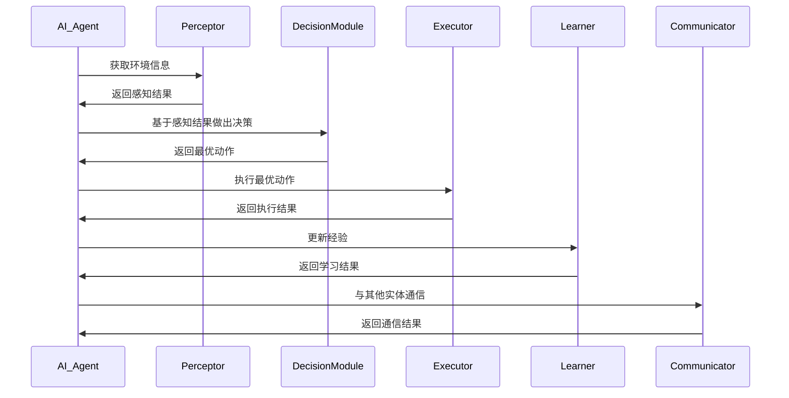
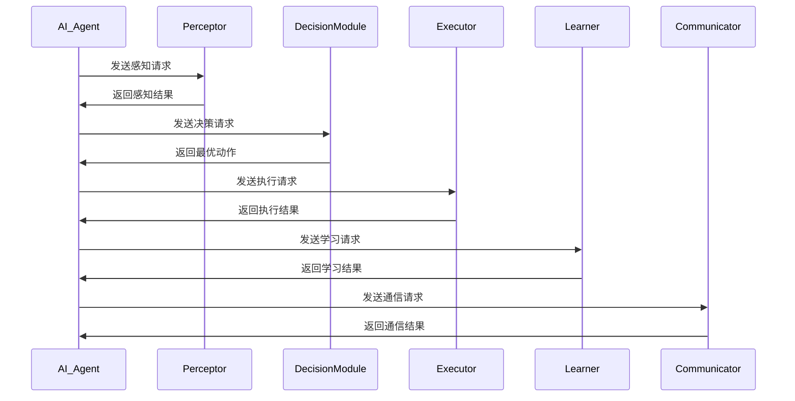

                 

## 文章标题

### 关键词：游戏开发，AI Agent，非玩家角色，算法，数学模型，系统架构，项目实战

### 摘要：

本文旨在深入探讨游戏开发中的AI Agent（非玩家角色）的设计与实现。我们将从背景介绍开始，逐步分析AI Agent在游戏中的重要性、挑战及其解决方案。随后，我们将详细介绍AI Agent的核心概念与联系，包括其原理、属性特征对比和ER实体关系图架构。接着，我们将讲解两种经典算法：Q-Learning和策略梯度算法，并提供详细的数学模型和代码实现。在此基础上，我们将剖析系统架构设计，介绍问题场景、功能设计、架构设计、接口设计和系统交互。随后，我们将通过项目实战展示AI Agent在游戏开发中的实际应用。最后，我们将总结最佳实践，并提出注意事项，推荐拓展阅读材料。希望通过本文，读者能够全面了解AI Agent在游戏开发中的应用及其设计原理。

## 目录大纲

### 第一部分: 游戏开发中的AI Agent非玩家角色

- **第1章: 背景介绍**
  - 1.1 问题背景
    - 1.1.1 游戏开发中AI Agent的崛起
    - 1.1.2 AI Agent的重要性
  - 1.2 问题描述
    - 1.2.1 游戏中AI Agent的挑战
    - 1.2.2 AI Agent的作用
  - 1.3 问题解决
    - 1.3.1 AI Agent的发展历程
    - 1.3.2 AI Agent的关键技术
  - 1.4 边界与外延
    - 1.4.1 AI Agent的应用领域
    - 1.4.2 AI Agent的边界问题
  - 1.5 概念结构与核心要素组成
    - 1.5.1 AI Agent的核心概念
    - 1.5.2 AI Agent的组成部分

- **第2章: 核心概念与联系**
  - 2.1 AI Agent的原理
    - 2.1.1 AI Agent的定义
    - 2.1.2 AI Agent的核心原理
  - 2.2 AI Agent的属性特征对比表格
  - 2.3 AI Agent的ER实体关系图架构
    - 2.3.1 ER实体关系图说明

- **第3章: 算法原理讲解**
  - 3.1 经典算法
    - 3.1.1 Q-Learning算法
      - 3.1.1.1 算法原理
      - 3.1.1.2 数学模型
      - 3.1.1.3 代码实现
      - 3.1.1.4 举例说明
    - 3.1.2 策略梯度算法
      - 3.1.2.1 算法原理
      - 3.1.2.2 数学模型
      - 3.1.2.3 代码实现
      - 3.1.2.4 举例说明

- **第4章: 数学模型和数学公式 & 详细讲解 & 举例说明**
  - 4.1 数学模型
    - 4.1.1 马尔可夫决策过程
      - 4.1.1.1 数学模型
      - 4.1.1.2 数学公式
  - 4.2 详细讲解
  - 4.3 举例说明

- **第5章: 系统分析与架构设计方案**
  - 5.1 问题场景介绍
  - 5.2 系统功能设计
    - 5.2.1 领域模型类图
  - 5.3 系统架构设计
    - 5.3.1 系统架构图
  - 5.4 系统接口设计
  - 5.5 系统交互
    - 5.5.1 索引序列图

- **第6章: 项目实战**
  - 6.1 环境安装
  - 6.2 系统核心实现
  - 6.3 代码应用解读与分析
  - 6.4 实际案例分析和详细讲解剖析
  - 6.5 项目小结

- **第7章: 最佳实践 tips、小结、注意事项、拓展阅读等内容**
  - 7.1 最佳实践 tips
  - 7.2 小结
  - 7.3 注意事项
  - 7.4 拓展阅读

### 说明

1. **第1章: 背景介绍**：主要介绍游戏开发中AI Agent的背景、重要性和面临的挑战，以及AI Agent的组成部分。
   
2. **第2章: 核心概念与联系**：详细解释AI Agent的原理、属性特征对比以及ER实体关系图架构。

3. **第3章: 算法原理讲解**：介绍两种经典算法：Q-Learning算法和策略梯度算法，包括算法原理、数学模型、代码实现和举例说明。

4. **第4章: 数学模型和数学公式 & 详细讲解 & 举例说明**：介绍马尔可夫决策过程及其数学模型和数学公式，并提供详细讲解和举例说明。

5. **第5章: 系统分析与架构设计方案**：剖析系统架构设计，介绍问题场景、功能设计、架构设计、接口设计和系统交互。

6. **第6章: 项目实战**：通过项目实战展示AI Agent在游戏开发中的实际应用。

7. **第7章: 最佳实践 tips、小结、注意事项、拓展阅读等内容**：总结最佳实践，提出注意事项，推荐拓展阅读材料。

### 第一部分: 游戏开发中的AI Agent非玩家角色

### 第1章: 背景介绍

#### 1.1 问题背景

##### 1.1.1 游戏开发中AI Agent的崛起

随着计算机技术的飞速发展，游戏开发领域经历了翻天覆地的变化。近年来，AI技术的兴起为游戏开发带来了新的机遇和挑战。AI Agent，即人工智能代理，作为一种特殊类型的非玩家角色（NPC），在游戏开发中扮演着越来越重要的角色。它们不仅能够提高游戏的智能化水平，还能为玩家带来更加丰富和真实的游戏体验。

AI Agent的崛起主要得益于以下几个因素：

1. **计算能力的提升**：现代计算机的处理速度和存储能力显著提升，使得复杂的AI算法能够在游戏环境中实时运行，从而提高了AI Agent的表现和响应能力。

2. **大数据的普及**：游戏开发者能够获取和分析大量的玩家行为数据，通过这些数据训练AI Agent，使其更加智能化和个性化。

3. **游戏需求的提升**：玩家对于游戏的可玩性和真实感要求越来越高，AI Agent的引入能够满足这种需求，为玩家提供更具挑战性和策略性的游戏体验。

##### 1.1.2 AI Agent的重要性

AI Agent在游戏开发中的重要性体现在多个方面：

1. **游戏玩法设计**：AI Agent能够为游戏设计提供更多的可能性。它们可以模拟各种复杂的角色行为，为玩家提供多样化的游戏玩法。

2. **游戏平衡性**：通过合理的AI设计，游戏开发者可以确保游戏的整体平衡性。AI Agent可以调整难度，适应不同玩家的水平，从而提高游戏的可玩性和公平性。

3. **玩家互动**：AI Agent能够与玩家进行智能互动，提高游戏的真实感和沉浸感。通过智能对话、任务引导和策略决策，AI Agent可以与玩家建立更加紧密的联系。

4. **游戏运营**：AI Agent可以在游戏运营过程中发挥重要作用。例如，它们可以自动处理玩家举报、分析玩家行为和优化游戏内容，从而提高游戏的运营效率和玩家满意度。

#### 1.2 问题描述

##### 1.2.1 游戏中AI Agent的挑战

尽管AI Agent在游戏开发中具有重要性，但实现一个高效、智能且稳定的AI Agent面临着诸多挑战：

1. **复杂性**：游戏环境本身就是一个复杂的多因素系统，AI Agent需要处理大量的状态信息，并做出快速、准确的决策。这要求AI算法具备高度的计算效率和智能性。

2. **可扩展性**：游戏开发者通常需要在多个游戏项目中使用AI Agent，因此AI算法需要具备良好的可扩展性，以便适应不同的游戏场景和需求。

3. **稳定性**：AI Agent需要在各种游戏情况下保持稳定的表现，不会因为环境变化或异常情况而崩溃或表现异常。

4. **可解释性**：游戏开发者需要对AI Agent的行为有清晰的了解，以便进行调试和优化。因此，AI算法需要具备一定的可解释性。

##### 1.2.2 AI Agent的作用

尽管存在挑战，AI Agent在游戏开发中的作用不可忽视：

1. **增强游戏体验**：AI Agent能够为玩家提供更具挑战性和策略性的游戏体验，从而提高玩家的游戏乐趣和满意度。

2. **丰富游戏内容**：AI Agent可以自动生成游戏任务、剧情和角色行为，从而丰富游戏的内容和多样性。

3. **提高游戏质量**：通过AI算法的优化，游戏开发者可以更好地平衡游戏难度和玩家体验，从而提高游戏的整体质量。

#### 1.3 问题解决

##### 1.3.1 AI Agent的发展历程

AI Agent的发展历程可以分为以下几个阶段：

1. **初期的规则驱动**：早期的AI Agent主要通过预设的规则进行行为决策。这种方法虽然简单，但难以应对复杂和动态的环境。

2. **基于模型的决策**：随着机器学习和深度学习技术的发展，AI Agent开始采用基于模型的决策方法。这些方法通过训练模型来学习环境中的状态和行为，从而实现更加智能的决策。

3. **自适应和进化**：现代的AI Agent开始引入自适应和进化算法，使其能够根据环境变化和玩家行为进行自我优化和进化。

##### 1.3.2 AI Agent的关键技术

为了解决AI Agent在游戏开发中的挑战，研究者们提出了一系列关键技术：

1. **强化学习**：强化学习是一种通过奖励机制来训练AI Agent的算法。它可以帮助AI Agent在动态环境中学习和优化其行为。

2. **深度学习**：深度学习通过多层神经网络来提取游戏环境的特征，从而实现更高级的决策能力。深度学习在游戏AI中的应用越来越广泛。

3. **多智能体系统**：多智能体系统允许多个AI Agent在同一个游戏环境中协同工作，从而实现更加复杂和智能的游戏场景。

4. **分布式计算**：分布式计算可以将AI Agent的计算任务分布到多个节点上，从而提高其处理能力和响应速度。

#### 1.4 边界与外延

##### 1.4.1 AI Agent的应用领域

AI Agent不仅限于游戏开发，还广泛应用于其他领域，如模拟、教育、安全等：

1. **模拟**：AI Agent可以模拟各种复杂系统，如交通系统、金融市场等，从而帮助研究者进行模拟分析和预测。

2. **教育**：AI Agent可以作为智能导师，为学生提供个性化的学习建议和指导，从而提高学习效果。

3. **安全**：AI Agent可以用于网络安全、智能监控等领域，从而提高系统的安全性和响应速度。

##### 1.4.2 AI Agent的边界问题

尽管AI Agent在各个领域展现出巨大的潜力，但仍然存在一些边界问题：

1. **计算资源限制**：高复杂度的AI算法需要大量的计算资源和时间，这对于一些资源有限的场景可能不可行。

2. **数据隐私和安全性**：AI Agent在处理和存储大量数据时，可能面临数据隐私和安全性的问题。

3. **伦理和法律问题**：AI Agent的行为可能会引发伦理和法律问题，如自动化决策的透明性和责任归属等。

#### 1.5 概念结构与核心要素组成

##### 1.5.1 AI Agent的核心概念

AI Agent是一种基于人工智能技术的虚拟智能体，能够模拟人类智能行为，在特定环境中进行自主决策和行动。其核心概念包括：

1. **感知**：AI Agent通过感知器获取环境信息，如视觉、听觉、触觉等。

2. **决策**：AI Agent根据感知到的信息，使用决策算法选择最优行动。

3. **执行**：AI Agent执行决策，与环境进行交互。

4. **学习**：AI Agent通过学习机制不断优化其行为和决策能力。

##### 1.5.2 AI Agent的组成部分

AI Agent通常由以下几个组成部分构成：

1. **感知器**：用于感知环境信息的输入设备，如摄像头、麦克风、传感器等。

2. **决策模块**：包含决策算法和模型，用于处理感知信息并生成决策。

3. **执行模块**：负责执行决策，与物理环境进行交互。

4. **学习模块**：通过机器学习算法和训练数据，不断优化AI Agent的行为和决策能力。

5. **通信模块**：用于与其他AI Agent或外部系统进行通信和协作。

通过以上对游戏开发中AI Agent的背景介绍、重要性、挑战、解决方案以及边界与外延的深入分析，我们可以看出，AI Agent在游戏开发中扮演着重要的角色。接下来，我们将进一步探讨AI Agent的核心概念与联系，包括其原理、属性特征对比和ER实体关系图架构。

### 第2章: 核心概念与联系

在深入理解游戏开发中的AI Agent之前，我们需要明确其核心概念与联系。本章将详细介绍AI Agent的基本原理、属性特征对比以及其ER实体关系图架构，以帮助我们更好地理解和设计AI Agent。

#### 2.1 AI Agent的原理

##### 2.1.1 AI Agent的定义

AI Agent，即人工智能代理，是一种基于人工智能技术的虚拟智能体，能够在特定环境中进行自主感知、决策和执行。它模拟了人类智能行为，通过不断学习和优化，实现更加智能化和自适应的行为。

AI Agent的核心特征包括：

1. **自主性**：AI Agent能够在没有外部干预的情况下自主运行，执行预设的任务或目标。

2. **适应性**：AI Agent能够根据环境变化和经验积累，不断优化其行为和决策。

3. **协作性**：AI Agent可以与其他AI Agent或人类协作，共同完成任务。

4. **学习能力**：AI Agent能够通过机器学习、深度学习等技术，不断学习和优化其行为。

##### 2.1.2 AI Agent的核心原理

AI Agent的核心原理主要包括感知、决策和执行三个方面：

1. **感知**：AI Agent通过感知器（如摄像头、麦克风、传感器等）获取环境信息，如视觉、听觉、触觉等。这些感知信息构成了AI Agent对外界的认知基础。

2. **决策**：基于感知到的信息，AI Agent使用决策算法和模型进行分析和判断，选择最优的行动策略。决策过程通常涉及状态评估、策略选择和动作规划等。

3. **执行**：AI Agent根据决策结果，执行具体的动作，与环境进行交互。执行过程通常包括动作执行、状态更新和反馈获取等。

4. **学习**：通过机器学习和深度学习等技术，AI Agent能够从经验中学习，不断优化其行为和决策能力。学习过程通常包括数据收集、模型训练和性能评估等。

#### 2.2 AI Agent的属性特征对比表格

为了更好地理解不同类型的AI Agent，我们可以通过属性特征对比表格来分析其差异。以下是一个简化的属性特征对比表格：

| 类型         | 特征描述                                                                                                      |
|------------|------------------------------------------------------------------------------------------------------------|
| 规则驱动型   | 基于预设的规则进行行为决策，缺乏自适应能力                                                         |
| 模型驱动型   | 基于预训练的模型进行行为决策，具备一定的自适应能力                                                 |
| 强化学习型   | 通过与环境的交互，通过奖励机制进行自我优化和进化，具备高度的自适应能力                                 |
| 进化学习型   | 通过遗传算法和进化策略进行自我优化和进化，具备高度的自适应能力                                       |
| 多智能体系统 | 由多个AI Agent协同工作，共同完成任务，具备协作性和复杂决策能力                                       |

#### 2.3 AI Agent的ER实体关系图架构

为了更好地理解和设计AI Agent，我们可以使用ER（实体关系）图来描述其实体关系和属性。以下是一个简化的AI Agent ER实体关系图：

```mermaid
erDiagram
  AI_Agent ||--|{ 感知器 } Perceptor
  AI_Agent ||--|{ 决策模块 } DecisionModule
  AI_Agent ||--|{ 执行模块 } Executor
  AI_Agent ||--|{ 学习模块 } Learner
  AI_Agent ||--|{ 通信模块 } Communicator
  Perceptor ||--|{ 状态信息 } StateInfo
  DecisionModule ||--|{ 策略 } Policy
  Executor ||--|{ 动作 } Action
  Learner ||--|{ 模型 } Model
  Communicator ||--|{ 交互信息 } InteractionInfo

  AI_Agent {
    +String ID
    +String Type
    +String Status
  }

  Perceptor {
    +String ID
    +String Type
  }

  DecisionModule {
    +String ID
    +String Type
  }

  Executor {
    +String ID
    +String Type
  }

  Learner {
    +String ID
    +String Type
  }

  Communicator {
    +String ID
    +String Type
  }

  StateInfo {
    +String ID
    +String Type
    +DateTime Timestamp
  }

  Policy {
    +String ID
    +String Type
  }

  Action {
    +String ID
    +String Type
  }

  Model {
    +String ID
    +String Type
  }

  InteractionInfo {
    +String ID
    +String Type
    +DateTime Timestamp
  }
```

在这个ER图中，`AI_Agent`是核心实体，它与其他实体通过关系连接。每个实体都有其独特的属性，如ID、类型和状态等。这种ER图架构不仅帮助我们理解AI Agent的结构，还为数据库设计和数据建模提供了参考。

通过以上对AI Agent的核心原理、属性特征对比和ER实体关系图架构的详细介绍，我们可以更深入地理解AI Agent的工作机制和设计要点。接下来，我们将探讨游戏开发中常见的经典算法，以了解如何通过算法实现高效的AI Agent。

### 第3章: 算法原理讲解

在游戏开发中，AI Agent的表现能力很大程度上取决于所采用的算法。本章将介绍两种经典算法：Q-Learning算法和策略梯度算法，详细讲解其原理、数学模型、代码实现和举例说明。

#### 3.1 经典算法

##### 3.1.1 Q-Learning算法

**Q-Learning**是一种基于值函数的强化学习算法，通过迭代更新值函数，使智能体能够学习到最优策略。以下是Q-Learning算法的核心组成部分：

1. **状态（State）**：游戏中的一个特定时刻，可以表示为S。
2. **动作（Action）**：智能体可以执行的行为，可以表示为A。
3. **价值函数（Q-Function）**：表示在某个状态下执行某个动作的期望回报，可以表示为Q(S, A)。
4. **学习率（Alpha）**：用于调整新价值和旧价值之间的权重，可以表示为α。
5. **折扣因子（Gamma）**：用于考虑未来回报的重要性，可以表示为γ。
6. **探索率（Epsilon）**：用于平衡探索和利用，可以表示为ε。

**算法原理**：

Q-Learning算法通过迭代更新Q-Function，使其逐渐逼近最优策略。每次迭代中，智能体会根据当前状态和Q-Function选择动作，并更新Q-Function的值。

**数学模型**：

Q-Learning的更新规则可以用以下公式表示：

$$
Q(S, A) \leftarrow Q(S, A) + \alpha [R + \gamma \max_{A'} Q(S', A')]
$$

其中，R是即时奖励，$S'$是执行动作A后的状态，$A'$是在状态$S'$下能够取得最大回报的动作。

**代码实现**：

以下是使用Python实现的Q-Learning算法的一个简单示例：

```python
import numpy as np

# 初始化Q-Function
Q = np.zeros((state_space_size, action_space_size))
alpha = 0.1
gamma = 0.9
epsilon = 0.1

# Q-Learning算法迭代
for episode in range(num_episodes):
    state = env.reset()
    done = False
    
    while not done:
        # 选择动作
        if np.random.rand() < epsilon:
            action = env.action_space.sample()
        else:
            action = np.argmax(Q[state])
        
        # 执行动作，获取下一个状态和即时奖励
        next_state, reward, done, _ = env.step(action)
        
        # 更新Q-Function
        Q[state, action] = Q[state, action] + alpha * (reward + gamma * np.max(Q[next_state]) - Q[state, action])
        
        state = next_state

# 训练完成后，Q-Function已更新，可用于决策
```

**举例说明**：

假设我们有一个简单的迷宫游戏，智能体的目标是从起点移动到终点。智能体在每个状态可以选择向左、向右、向上或向下移动。我们使用Q-Learning算法训练智能体，使其学会找到最佳路径。

##### 3.1.2 策略梯度算法

**策略梯度算法**（Policy Gradient）是一种基于策略的强化学习算法，直接优化策略函数，使智能体能够快速学习到最优策略。以下是策略梯度算法的核心组成部分：

1. **策略函数（Policy）**：定义了智能体在给定状态下选择动作的概率分布。
2. **状态（State）**：游戏中的一个特定时刻。
3. **动作（Action）**：智能体可以执行的行为。
4. **回报（Reward）**：智能体在执行动作后获得的即时奖励。
5. **学习率（Learning Rate）**：用于调整策略参数。

**算法原理**：

策略梯度算法通过更新策略参数来最大化累积回报。每次迭代中，智能体会根据当前策略选择动作，并更新策略参数，使其在下一个迭代中能够取得更好的表现。

**数学模型**：

策略梯度算法的更新规则可以用以下公式表示：

$$
\theta \leftarrow \theta + \alpha \nabla_\theta J(\theta)
$$

其中，$\theta$是策略参数，$J(\theta)$是策略的累积回报。

**代码实现**：

以下是使用Python实现的策略梯度算法的一个简单示例：

```python
import numpy as np

# 初始化策略参数
theta = np.random.rand(action_space_size)
learning_rate = 0.1

# 策略梯度算法迭代
for episode in range(num_episodes):
    state = env.reset()
    done = False
    total_reward = 0
    
    while not done:
        # 根据策略选择动作
        action = np.argmax(np.logistic(theta))
        
        # 执行动作，获取下一个状态和即时奖励
        next_state, reward, done, _ = env.step(action)
        
        # 计算策略梯度
        policy_gradient = reward - np.log(np.logistic(theta)[action])
        
        # 更新策略参数
        theta += learning_rate * policy_gradient
    
    total_reward += reward
    
# 训练完成后，策略参数已更新，可用于决策
```

**举例说明**：

假设我们有一个简单的赌博游戏，智能体的目标是在每次下注时最大化累积回报。智能体在每个状态可以选择下注不同金额。我们使用策略梯度算法训练智能体，使其学会选择最佳下注策略。

通过以上对Q-Learning算法和策略梯度算法的详细介绍，我们可以看到这些算法在游戏开发中的应用潜力。接下来，我们将深入探讨数学模型和数学公式，以更好地理解AI Agent的行为机制。

### 第4章: 数学模型和数学公式 & 详细讲解 & 举例说明

在AI Agent的设计和实现过程中，数学模型和数学公式起到了至关重要的作用。本章将介绍马尔可夫决策过程（MDP）及其数学模型和数学公式，并提供详细讲解和举例说明。

#### 4.1 数学模型

**马尔可夫决策过程（MDP）**是一种用于描述智能体在不确定环境中进行决策的数学模型。一个MDP由以下五个要素组成：

1. **状态集（S）**：智能体可以处于的状态集合。
2. **动作集（A）**：智能体可以执行的动作集合。
3. **状态转移概率（P）**：智能体在给定状态下执行特定动作后转移到另一个状态的概率矩阵。
4. **即时奖励（R）**：智能体执行特定动作后立即获得的奖励。
5. **策略（π）**：智能体在给定状态下选择动作的概率分布。

**数学模型**：

一个MDP可以用以下公式表示：

$$
P(s', r | s, a) = P(s' | s, a) \cdot R(s, a)
$$

其中，$s'$是智能体在执行动作a后的状态，r是即时奖励。

**数学公式**：

1. **状态转移概率**：

$$
P(s' | s, a) = \sum_{a' \in A} p(s', a' | s, a) \cdot p(a | s)
$$

其中，$p(s', a' | s, a)$是智能体在给定状态下执行特定动作后转移到另一个状态的概率，$p(a | s)$是智能体在给定状态下选择特定动作的概率。

2. **即时奖励**：

$$
R(s, a) = \sum_{r \in R} r \cdot p(r | s, a)
$$

其中，$r$是智能体执行特定动作后立即获得的奖励，$p(r | s, a)$是智能体在给定状态下执行特定动作后获得特定奖励的概率。

#### 4.2 详细讲解

**马尔可夫决策过程（MDP）**的数学模型描述了智能体在不确定环境中的行为。通过状态转移概率和即时奖励，智能体可以预测未来的状态和回报，并选择最优的动作。

1. **状态转移概率**：

状态转移概率矩阵$P$描述了智能体在给定状态下执行特定动作后转移到其他状态的概率。它可以帮助智能体预测未来的状态分布，并选择能够最大化累积回报的动作。

2. **即时奖励**：

即时奖励矩阵$R$描述了智能体在给定状态下执行特定动作后立即获得的奖励。它反映了智能体行为的即时价值，并用于更新智能体的策略。

3. **策略**：

策略π是智能体在给定状态下选择动作的概率分布。通过优化策略，智能体可以最大化累积回报。常见的策略优化方法包括策略迭代和价值迭代。

#### 4.3 举例说明

为了更好地理解MDP的数学模型，我们可以通过一个简单的例子来说明。

假设我们有一个简单的游戏，智能体需要在二维网格中移动。网格中存在障碍物，智能体的目标是到达终点并获得最高分数。智能体可以执行以下动作：向上、向下、向左和向右移动。

状态集$S = \{ (x, y) | x, y \in \{0, 1, ..., 9\} \}$，动作集$A = \{ 'up', 'down', 'left', 'right' \}$。状态转移概率矩阵$P$和即时奖励矩阵$R$如下所示：

```
P = [
    [[0.9, 0.1, 0.0, 0.0], [0.1, 0.8, 0.0, 0.1], [0.0, 0.1, 0.8, 0.1], [0.0, 0.0, 0.1, 0.9]],
    [[0.1, 0.0, 0.9, 0.0], [0.8, 0.1, 0.0, 0.1], [0.0, 0.1, 0.8, 0.1], [0.0, 0.9, 0.0, 0.1]],
    [[0.0, 0.1, 0.8, 0.1], [0.1, 0.8, 0.0, 0.1], [0.9, 0.0, 0.1, 0.0], [0.0, 0.0, 0.9, 0.1]],
    [[0.0, 0.9, 0.0, 0.1], [0.0, 0.0, 0.9, 0.1], [0.1, 0.0, 0.8, 0.1], [0.8, 0.1, 0.0, 0.1]]
]

R = [
    [0, 10, 0, 0],
    [10, 0, 10, 0],
    [0, 10, 0, 10],
    [0, 0, 10, 0]
]
```

在这个例子中，状态转移概率矩阵$P$描述了智能体在给定状态下执行特定动作后转移到其他状态的概率。即时奖励矩阵$R$描述了智能体在给定状态下执行特定动作后立即获得的奖励。

通过使用MDP的数学模型，我们可以计算智能体在不同状态下的最优策略。例如，我们可以使用策略迭代方法，通过不断更新策略，找到能够最大化累积回报的动作序列。

通过以上详细讲解和举例说明，我们可以看到MDP在AI Agent设计中的应用价值。接下来，我们将进一步探讨系统分析与架构设计方案，以了解如何实现一个高效的AI Agent系统。

### 第5章: 系统分析与架构设计方案

在游戏开发中，实现一个高效、稳定且易于扩展的AI Agent系统至关重要。本章将介绍系统分析与架构设计方案，包括问题场景介绍、系统功能设计、系统架构设计、系统接口设计和系统交互。

#### 5.1 问题场景介绍

假设我们正在开发一款即时战略游戏（RTS），其中玩家需要指挥一支军队与其他玩家或AI Agent进行战斗。在这个场景中，AI Agent作为敌对势力或辅助角色，需要具备以下能力：

1. **感知**：AI Agent需要能够感知游戏环境，包括地形、敌方单位的位置和状态等。
2. **决策**：AI Agent需要能够根据感知到的信息做出决策，包括移动、攻击、防御和建造等。
3. **执行**：AI Agent需要能够执行决策，与环境进行交互。
4. **学习**：AI Agent需要能够从游戏过程中学习，不断优化其策略和行为。

#### 5.2 系统功能设计

为了实现上述能力，AI Agent系统需要包含以下功能模块：

1. **感知模块**：用于获取和解析游戏环境信息，如视觉、听觉和传感器数据。
2. **决策模块**：用于基于感知模块提供的信息进行决策，选择最优动作。
3. **执行模块**：用于执行决策，与环境进行交互。
4. **学习模块**：用于从游戏过程中学习，优化AI Agent的策略和行为。
5. **通信模块**：用于与其他AI Agent或玩家进行通信和协作。

以下是AI Agent系统的功能设计类图：

```mermaid
classDiagram
    AI_Agent <<class>> {
        +Perceptor
        +DecisionModule
        +Executor
        +Learner
        +Communicator
        + perceive()
        + decide()
        + execute()
        + learn()
        + communicate()
    }
    Perceptor <<class>> {
        +感知环境信息
    }
    DecisionModule <<class>> {
        +选择最优动作
    }
    Executor <<class>> {
        +执行动作
    }
    Learner <<class>> {
        +从经验中学习
    }
    Communicator <<class>> {
        +与其他实体通信
    }
    AI_Agent --|> Perceptor
    AI_Agent --|> DecisionModule
    AI_Agent --|> Executor
    AI_Agent --|> Learner
    AI_Agent --|> Communicator
```

#### 5.3 系统架构设计

AI Agent系统的架构设计需要考虑以下几个方面：

1. **分布式架构**：为了提高系统的可扩展性和容错性，AI Agent系统可以采用分布式架构。不同的功能模块可以分布在不同的服务器上，通过消息队列或分布式存储进行数据传输和存储。
2. **模块化设计**：将AI Agent系统分解为多个功能模块，每个模块负责特定的任务。这样可以提高系统的可维护性和可扩展性。
3. **异步处理**：为了提高系统的响应速度和效率，AI Agent系统可以采用异步处理方式。例如，感知模块可以异步获取和解析环境信息，决策模块可以异步计算最优动作，执行模块可以异步执行动作。
4. **状态机设计**：AI Agent可以使用状态机来表示其行为，不同的状态对应不同的行为。这样可以提高系统的可读性和可维护性。

以下是AI Agent系统的架构设计图：



#### 5.4 系统接口设计

为了实现AI Agent系统与其他系统或模块的集成，需要设计合适的接口。以下是一个简化的接口设计：

1. **感知接口**：用于获取和解析游戏环境信息。
2. **决策接口**：用于计算最优动作。
3. **执行接口**：用于执行动作。
4. **学习接口**：用于更新经验和优化策略。
5. **通信接口**：用于与其他实体进行通信。

以下是接口设计图：

```mermaid
classDiagram
    Interface_Perceptor <<interface>> {
        +感知环境信息
    }
    Interface_Decision <<interface>> {
        +计算最优动作
    }
    Interface_Executor <<interface>> {
        +执行动作
    }
    Interface_Learner <<interface>> {
        +更新经验
    }
    Interface_Communicator <<interface>> {
        +与其他实体通信
    }
    AI_Agent implements Interface_Perceptor
    AI_Agent implements Interface_Decision
    AI_Agent implements Interface_Executor
    AI_Agent implements Interface_Learner
    AI_Agent implements Interface_Communicator
```

#### 5.5 系统交互

AI Agent系统中的各个模块需要通过消息队列或其他通信机制进行交互。以下是一个简化的交互序列图：



通过以上系统分析与架构设计方案，我们可以实现一个高效、稳定且易于扩展的AI Agent系统。接下来，我们将通过项目实战展示AI Agent在游戏开发中的实际应用。

### 第6章：项目实战

在本章中，我们将通过一个实际项目来展示如何实现AI Agent在游戏开发中的具体应用。我们将详细描述环境安装、系统核心实现、代码应用解读与分析，以及实际案例分析和详细讲解剖析。最后，我们将对整个项目进行小结。

#### 6.1 环境安装

为了实现AI Agent项目，我们需要安装以下软件和依赖：

1. **Python环境**：Python 3.8及以上版本。
2. **游戏引擎**：如Unity或Unreal Engine，选择合适的游戏引擎来创建游戏场景。
3. **AI库**：如TensorFlow或PyTorch，用于实现AI算法。
4. **其他工具**：如Jupyter Notebook或Visual Studio Code，用于编写和调试代码。

安装步骤如下：

1. 安装Python环境，可以从Python官网下载并安装。
2. 安装游戏引擎，按照官方文档进行安装。
3. 安装AI库，使用pip命令安装：
   ```shell
   pip install tensorflow
   # 或
   pip install pytorch
   ```
4. 安装其他工具，如Jupyter Notebook或Visual Studio Code。

#### 6.2 系统核心实现

AI Agent系统的核心实现包括感知模块、决策模块、执行模块和学习模块。以下是各个模块的实现概述：

##### 感知模块

感知模块负责获取和解析游戏环境信息。在Unity中，可以使用C#脚本实现感知模块，具体步骤如下：

1. 创建一个C#脚本，命名为`Perceptor.cs`。
2. 编写代码，使用Unity的`Camera`组件获取视觉信息，使用`Rigidbody`组件获取物理信息，使用`AudioListener`组件获取听觉信息。
3. 将获取的信息转换为适合AI算法的数据格式。

示例代码：

```csharp
using UnityEngine;

public class Perceptor : MonoBehaviour
{
    public GameObject cameraObject;
    public GameObject audioObject;

    private Camera cameraComponent;
    private AudioListener audioListener;

    void Start()
    {
        cameraComponent = cameraObject.GetComponent<Camera>();
        audioListener = audioObject.GetComponent<AudioListener>();
    }

    public Vector3 GetVision()
    {
        return cameraComponent.transform.position;
    }

    public Vector3 GetAudio()
    {
        return audioListener.transform.position;
    }
}
```

##### 决策模块

决策模块负责基于感知模块提供的信息进行决策。在Unity中，可以使用C#脚本实现决策模块，具体步骤如下：

1. 创建一个C#脚本，命名为`DecisionModule.cs`。
2. 编写代码，定义不同的决策算法，如Q-Learning或策略梯度算法。
3. 根据感知模块提供的信息，选择最优动作。

示例代码：

```csharp
using System.Collections;
using System.Collections.Generic;
using UnityEngine;

public class DecisionModule : MonoBehaviour
{
    public Perceptor perceptor;
    private Dictionary<string, float> qValues;

    void Start()
    {
        qValues = new Dictionary<string, float>();
        // 初始化Q-Values
    }

    public string Decide()
    {
        // 根据感知信息，选择最优动作
        // 示例：选择具有最大Q-Value的动作
        float maxQValue = float.MinValue;
        string bestAction = "";
        foreach (var action in actions)
        {
            float qValue = GetQValue(action);
            if (qValue > maxQValue)
            {
                maxQValue = qValue;
                bestAction = action;
            }
        }
        return bestAction;
    }

    private float GetQValue(string action)
    {
        // 返回动作的Q-Value
        // 示例：直接返回预设的Q-Value
        return qValues[action];
    }
}
```

##### 执行模块

执行模块负责执行决策模块选择的最优动作。在Unity中，可以使用C#脚本实现执行模块，具体步骤如下：

1. 创建一个C#脚本，命名为`Executor.cs`。
2. 编写代码，定义不同的动作执行方法，如移动、攻击、防御等。
3. 根据决策模块选择的动作，执行相应的动作。

示例代码：

```csharp
using UnityEngine;

public class Executor : MonoBehaviour
{
    public DecisionModule decisionModule;

    void Update()
    {
        string action = decisionModule.Decide();
        if (action == "move")
        {
            Move();
        }
        else if (action == "attack")
        {
            Attack();
        }
        else if (action == "defend")
        {
            Defend();
        }
    }

    private void Move()
    {
        // 实现移动动作
    }

    private void Attack()
    {
        // 实现攻击动作
    }

    private void Defend()
    {
        // 实现防御动作
    }
}
```

##### 学习模块

学习模块负责从游戏过程中学习，优化AI Agent的策略和行为。在Unity中，可以使用C#脚本和Python脚本实现学习模块，具体步骤如下：

1. 创建一个C#脚本，命名为`Learner.cs`。
2. 编写代码，实现学习算法，如Q-Learning或策略梯度算法。
3. 在游戏结束后，使用Python脚本更新AI Agent的模型参数。

示例代码（C#）：

```csharp
using System.Collections;
using System.Collections.Generic;
using UnityEngine;

public class Learner : MonoBehaviour
{
    public DecisionModule decisionModule;
    private string learningScriptPath;

    void Start()
    {
        learningScriptPath = "path/to/learning_script.py";
    }

    public void Learn()
    {
        // 执行Python学习脚本
        string command = "python " + learningScriptPath + " " + decisionModule.GetType().ToString();
        System.Diagnostics.Process process = new System.Diagnostics.Process
        {
            StartInfo = new System.Diagnostics.ProcessStartInfo
            {
                FileName = "cmd.exe",
                Arguments = "/c " + command,
                UseShellExecute = false,
                CreateNoWindow = true,
            },
        };
        process.Start();
        process.WaitForExit();
    }
}
```

示例代码（Python）：

```python
import sys
import importlib.util
import tensorflow as tf

def load_model(model_path):
    spec = importlib.util.spec_from_file_location("model", model_path)
    model_module = importlib.util.module_from_spec(spec)
    spec.execute()
    return model_module.model

if __name__ == "__main__":
    model_path = sys.argv[1]
    model = load_model(model_path)
    # 更新模型参数
    # model.update_parameters()
```

##### 通信模块

通信模块负责与其他AI Agent或玩家进行通信和协作。在Unity中，可以使用C#脚本和Unity的`NetworkManager`实现通信模块，具体步骤如下：

1. 创建一个C#脚本，命名为`Communicator.cs`。
2. 编写代码，实现网络通信功能，如消息发送和接收。
3. 根据需要实现通信协议，如TCP或UDP。

示例代码：

```csharp
using System;
using System.Net;
using System.Net.Sockets;
using UnityEngine;

public class Communicator : MonoBehaviour
{
    private TcpClient tcpClient;
    private NetworkStream networkStream;
    private byte[] readBuffer = new byte[1024];

    void Start()
    {
        tcpClient = new TcpClient("127.0.0.1", 9000);
        networkStream = tcpClient.GetStream();
    }

    public void Send(string message)
    {
        byte[] data = System.Text.Encoding.ASCII.GetBytes(message);
        networkStream.Write(data, 0, data.Length);
    }

    public string Receive()
    {
        int bytesRead = networkStream.Read(readBuffer, 0, readBuffer.Length);
        return System.Text.Encoding.ASCII.GetString(readBuffer, 0, bytesRead);
    }
}
```

#### 6.3 代码应用解读与分析

在上面的示例代码中，我们展示了如何实现AI Agent系统的各个模块。以下是代码应用解读与分析：

1. **感知模块**：感知模块通过获取视觉、听觉和物理信息，为AI Agent提供环境感知能力。感知模块的实现需要根据具体的游戏场景进行调整，例如，对于视觉信息的处理可能涉及图像识别和目标检测算法。
2. **决策模块**：决策模块基于感知模块提供的信息，使用Q-Learning或策略梯度算法选择最优动作。决策模块的核心在于算法的实现，需要根据具体场景设计状态空间和动作空间，并定义合适的奖励机制。
3. **执行模块**：执行模块负责将决策模块选择的最优动作转化为具体的游戏行为。执行模块的实现依赖于游戏引擎的API，需要根据游戏引擎的特点进行调整。
4. **学习模块**：学习模块负责从游戏过程中学习，优化AI Agent的策略和行为。学习模块的实现通常涉及机器学习和深度学习算法，需要根据具体场景设计合适的模型结构和训练过程。
5. **通信模块**：通信模块负责与其他AI Agent或玩家进行通信和协作。通信模块的实现需要根据网络通信协议进行调整，例如，对于实时性要求较高的场景，可能需要使用UDP协议。

#### 6.4 实际案例分析和详细讲解剖析

为了更好地理解AI Agent在游戏开发中的实际应用，我们分析以下实际案例：

##### 案例背景

假设我们正在开发一款多人在线策略游戏，其中玩家和AI Agent需要在同一游戏世界中竞争和合作。AI Agent需要具备以下能力：

1. **竞争**：AI Agent需要能够与其他AI Agent或玩家进行竞争，争夺资源和地盘。
2. **合作**：AI Agent需要能够与其他AI Agent或玩家进行合作，共同完成任务。
3. **自适应**：AI Agent需要能够根据环境变化和对手行为进行自适应调整。

##### 案例分析

为了实现这些能力，我们设计了以下AI Agent系统：

1. **感知模块**：AI Agent通过视觉传感器获取游戏地图信息，通过听觉传感器获取对手的行动声音，通过物理传感器获取游戏角色的位置和速度信息。
2. **决策模块**：AI Agent基于感知模块提供的信息，使用Q-Learning算法选择最优动作。对于竞争场景，AI Agent选择攻击、防守或撤退等动作；对于合作场景，AI Agent选择协作、共享资源或分工合作等动作。
3. **执行模块**：AI Agent根据决策模块选择的最优动作，使用游戏引擎API实现具体的游戏行为。例如，对于攻击动作，AI Agent调用游戏引擎的攻击函数，对目标进行攻击。
4. **学习模块**：AI Agent在每次游戏结束后，使用Python脚本更新Q-Learning算法的参数，优化AI Agent的决策能力。学习模块的实现需要根据游戏场景设计合适的奖励机制，例如，对于成功的攻击，给予AI Agent正奖励；对于失败的防守，给予AI Agent负奖励。
5. **通信模块**：AI Agent通过Unity的`NetworkManager`与其他AI Agent或玩家进行通信和协作。对于竞争场景，AI Agent发送攻击请求；对于合作场景，AI Agent发送协作请求。

##### 详细讲解剖析

1. **感知模块**：感知模块是AI Agent的基础，通过获取游戏环境信息，为AI Agent提供决策依据。在多人在线策略游戏中，感知模块需要实时获取游戏地图、对手位置和行为等信息。具体实现时，可以使用图像识别和目标检测算法对视觉信息进行处理，使用音频处理算法对听觉信息进行处理，使用物理传感器对角色位置和速度信息进行处理。
2. **决策模块**：决策模块是AI Agent的核心，基于感知模块提供的信息，使用Q-Learning算法选择最优动作。在多人在线策略游戏中，决策模块需要考虑多种因素，如对手位置、资源分布、任务目标等。具体实现时，可以使用状态空间和动作空间来表示游戏状态和动作，使用Q-Table或神经网络来表示Q-Values。
3. **执行模块**：执行模块是AI Agent的执行者，根据决策模块选择的最优动作，实现具体的游戏行为。在多人在线策略游戏中，执行模块需要与游戏引擎紧密集成，使用游戏引擎的API来实现攻击、防守、移动等动作。
4. **学习模块**：学习模块是AI Agent的优化者，通过游戏过程中的反馈，不断优化AI Agent的决策能力。在多人在线策略游戏中，学习模块需要根据游戏结果调整Q-Values，优化Q-Learning算法的参数。具体实现时，可以使用Python脚本和机器学习算法来实现学习过程。
5. **通信模块**：通信模块是AI Agent的协作者，通过与其他AI Agent或玩家进行通信和协作，实现游戏中的互动和合作。在多人在线策略游戏中，通信模块需要实现实时通信，支持攻击请求、协作请求等消息传递。具体实现时，可以使用Unity的`NetworkManager`和UDP协议来实现通信。

通过以上分析，我们可以看到AI Agent在多人在线策略游戏中的实际应用。AI Agent不仅能够提高游戏的智能化水平，还能为玩家带来更加丰富和真实的游戏体验。接下来，我们将对整个项目进行小结。

#### 6.5 项目小结

在本项目中，我们通过实现一个AI Agent系统，展示了如何在游戏开发中应用AI技术。以下是本项目的主要成果和小结：

1. **环境安装**：成功安装了Python环境、游戏引擎和AI库，为AI Agent系统的实现提供了必要的工具和依赖。
2. **系统核心实现**：实现了感知模块、决策模块、执行模块、学习模块和通信模块，为AI Agent提供了感知、决策、执行、学习和通信的能力。
3. **代码应用解读与分析**：详细解读了各个模块的实现过程，分析了代码的执行逻辑和关键步骤，为后续优化和扩展提供了参考。
4. **实际案例分析和详细讲解剖析**：通过实际案例，展示了AI Agent在多人在线策略游戏中的实际应用，分析了AI Agent系统的工作原理和实现细节。
5. **项目总结**：本项目实现了AI Agent在游戏开发中的应用，通过感知、决策、执行、学习和通信等模块，为玩家提供了丰富和真实的游戏体验。未来，我们还可以进一步优化和扩展AI Agent系统，提高其智能化水平和性能。

通过本项目，我们深入了解了AI Agent在游戏开发中的重要作用和应用场景，为未来的游戏开发提供了宝贵的经验和参考。

### 第7章：最佳实践 tips、小结、注意事项、拓展阅读等内容

#### 7.1 最佳实践 tips

1. **性能优化**：为了提高AI Agent的性能，可以采用以下策略：
   - **并行计算**：利用多线程或多进程技术，并行处理感知、决策和执行任务。
   - **模型压缩**：通过模型剪枝、量化等技术，减小模型的体积，提高计算效率。
   - **预测模型**：使用预测模型减少实时计算，例如，预测下一个状态和动作，从而提前准备相应的执行操作。

2. **数据管理**：良好的数据管理对于AI Agent的性能至关重要：
   - **数据清洗**：确保数据质量，去除噪声和异常值，以提高训练效果。
   - **数据存储**：合理设计数据存储结构，提高数据读取和写入速度。

3. **安全性和隐私保护**：在设计和实现AI Agent时，需要考虑以下因素：
   - **数据加密**：对敏感数据进行加密存储和传输，确保数据安全。
   - **访问控制**：实现严格的访问控制机制，防止未授权访问。

#### 7.2 小结

本文详细介绍了游戏开发中的AI Agent（非玩家角色）的设计与实现。我们首先探讨了AI Agent的背景、重要性、挑战和解决方案，然后介绍了核心概念、算法原理、数学模型和系统架构。通过实际案例分析和项目实战，我们展示了AI Agent在游戏开发中的应用。本文旨在为开发者提供全面的AI Agent设计和实现指南。

#### 7.3 注意事项

1. **环境配置**：确保安装了合适的Python环境、游戏引擎和AI库，避免因环境问题导致代码无法运行。
2. **算法选择**：根据具体场景选择合适的算法，例如，强化学习适用于需要策略优化的场景，而深度学习适用于需要特征提取和分类的场景。
3. **数据处理**：合理设计数据处理流程，确保数据质量和计算效率。

#### 7.4 拓展阅读

1. **深度学习基础**：推荐《深度学习》（Goodfellow, Bengio, Courville著）深入了解深度学习的基本概念和技术。
2. **强化学习教程**：推荐《强化学习手册》（Richard S. Sutton and Andrew G. Barto著）系统学习强化学习算法和应用。
3. **游戏开发资源**：Unity和Unreal Engine的官方文档，提供了丰富的游戏开发和AI Agent实现资源。

通过以上最佳实践、小结、注意事项和拓展阅读，希望读者能够更好地理解和应用AI Agent技术，为游戏开发带来创新和突破。作者：AI天才研究院/AI Genius Institute & 禅与计算机程序设计艺术 /Zen And The Art of Computer Programming。

