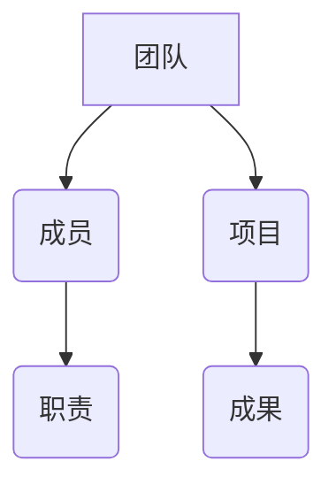
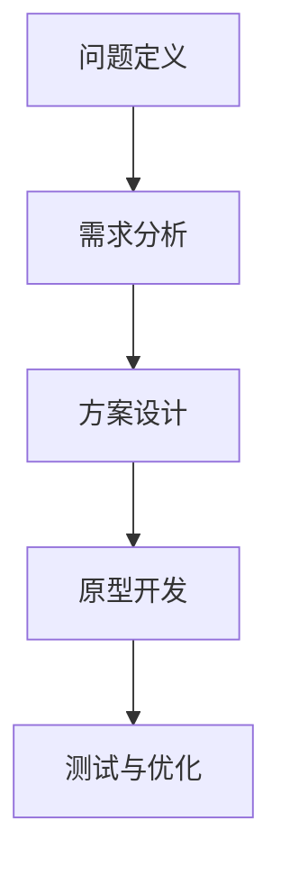
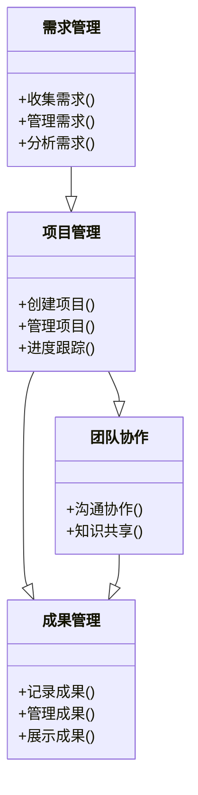
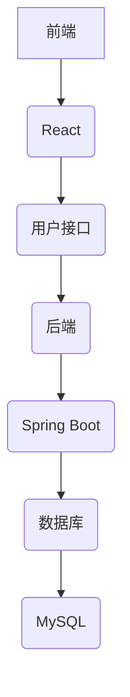
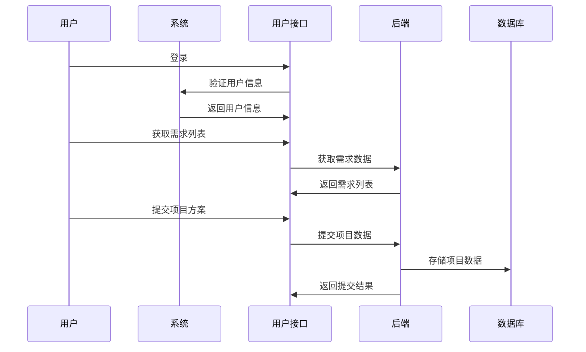
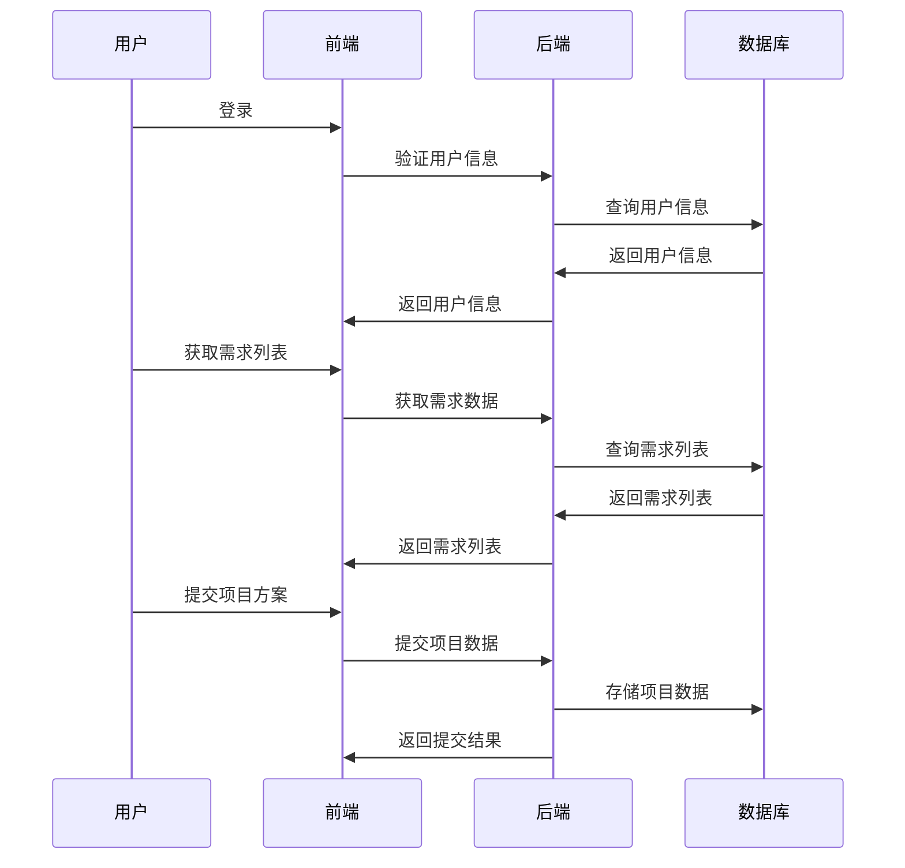

                 

### 《激发团队技术创新的有效方式》

## 概述

在当今快速发展的技术时代，技术创新已成为企业竞争的关键要素。为了在激烈的市场竞争中脱颖而出，企业必须不断推动技术创新，开发出具有竞争力的产品和服务。然而，实现这一目标并非易事，需要有效的团队协作和管理机制来激发团队的创新潜力。本文将深入探讨如何激发团队技术创新的有效方式，并提供实用的策略和最佳实践。

## 关键词

- 技术创新
- 团队协作
- 管理机制
- 创新文化
- 知识共享

## 摘要

本文旨在探讨如何激发团队的技术创新能力，以实现持续的技术突破和商业成功。首先，我们将分析当前技术创新的趋势，探讨团队创新的重要性及其面临的挑战。接着，我们将详细阐述激发团队创新的核心概念，包括创新定义、团队概念和技术创新概念的结合。随后，我们将介绍技术创新的算法原理和系统架构设计，并结合实际项目进行实战分析。最后，我们将总结最佳实践，提出注意事项和拓展阅读，以帮助读者进一步深入了解和实施团队技术创新。

## 第一部分：背景介绍

### 1.1 问题背景

#### 1.1.1 当代技术创新的趋势

在过去的几十年里，技术创新的步伐明显加快。从互联网、移动通信到人工智能、大数据，技术创新在各个领域都产生了深远的影响。随着技术的不断进步，企业需要不断适应和应对新的挑战，才能保持竞争力。因此，技术创新已成为企业发展的核心驱动力。

#### 1.1.2 团队创新的重要性

在技术创新的过程中，团队的作用至关重要。一个高效的创新团队不仅能够提升项目的成功率，还能推动整个企业的技术进步。团队创新的重要性体现在以下几个方面：

1. **知识融合**：团队成员来自不同的专业背景，他们之间的知识融合能够产生新的创意和解决方案。
2. **协同效应**：团队内部的合作和协作能够放大个人的创新能力，实现“1+1>2”的效果。
3. **持续改进**：团队创新能够帮助企业不断改进现有产品和服务，提高市场竞争力。
4. **风险分散**：团队创新能够分散个体创新的风险，提高项目成功的可能性。

#### 1.1.3 团队创新面临的挑战

尽管团队创新具有重要意义，但现实中团队创新往往面临诸多挑战：

1. **资源限制**：技术创新需要投入大量的人力、物力和财力，而企业往往在这些方面存在限制。
2. **沟通障碍**：团队成员之间可能存在沟通不畅的问题，影响团队的创新效果。
3. **管理难题**：缺乏有效的管理机制，可能导致团队创新效率低下。
4. **外部环境**：企业所处的市场环境和竞争态势可能会对团队创新产生负面影响。

### 1.2 问题描述

#### 1.2.1 团队创新效率低下的现状

目前，许多企业在团队创新方面存在效率低下的问题。具体表现如下：

1. **创新项目延期**：由于缺乏有效的项目管理，许多创新项目无法按计划完成，导致延期交付。
2. **资源浪费**：创新过程中，部分资源可能被低效使用，导致浪费。
3. **创新能力不足**：团队成员在创新过程中可能缺乏足够的技能和知识，影响创新效果。

#### 1.2.2 团队创新动力不足的表现

团队创新动力不足也是常见问题，具体表现为：

1. **缺乏激励机制**：团队成员可能缺乏创新的动力，因为缺乏合理的激励机制。
2. **工作环境不理想**：团队成员可能因为工作环境不佳，如过度加班、工作压力大等，而失去创新的热情。
3. **缺乏明确目标**：团队可能缺乏明确的目标和愿景，导致团队成员在创新过程中缺乏方向感。

#### 1.2.3 团队创新过程中的障碍

在团队创新过程中，还存在一些障碍：

1. **技术障碍**：创新项目可能涉及新的技术，而团队成员可能缺乏相关技能和经验。
2. **组织障碍**：企业内部的组织结构、流程和制度可能不利于团队创新。
3. **文化障碍**：企业内部的文化氛围可能不利于团队创新，如官僚主义、保守思维等。

### 1.3 问题解决

#### 1.3.1 团队创新的定义

团队创新是指团队成员在共同目标和愿景的引导下，通过合作和协作，实现新的创意、解决方案或产品和服务的过程。

#### 1.3.2 激发团队创新的有效方式

为了激发团队创新，企业可以采取以下策略：

1. **建立激励机制**：通过奖励、晋升等手段激励团队成员积极参与创新活动。
2. **优化工作环境**：为团队成员提供舒适、便捷的工作环境，减轻工作压力。
3. **明确目标和愿景**：为团队设定明确的目标和愿景，激发团队成员的创新热情。
4. **加强沟通与协作**：建立有效的沟通渠道，促进团队成员之间的协作和知识共享。
5. **培养创新文化**：营造鼓励创新、容忍失败的企业文化，为团队创新提供良好的氛围。

#### 1.3.3 团队创新的组织和管理

为了确保团队创新的有效实施，企业需要建立健全的组织和管理机制：

1. **设立创新部门**：企业可以设立专门的创新部门，负责组织和管理创新项目。
2. **建立项目管理制度**：明确创新项目的目标、进度、资源等方面的管理要求。
3. **培养创新型人才**：通过培训、招聘等方式，吸引和培养具有创新能力和潜力的人才。
4. **建立知识共享平台**：为团队成员提供知识共享的平台，促进团队内部的交流和协作。

### 1.4 边界与外延

#### 1.4.1 团队创新的范畴

团队创新涵盖了从概念验证到产品开发、市场推广等各个环节。具体包括：

1. **新技术的探索**：团队可以探索新的技术方向，开发具有竞争力的产品。
2. **产品改进**：对现有产品进行改进，提高用户体验和市场竞争力。
3. **商业模式创新**：探索新的商业模式，为企业的持续发展提供动力。

#### 1.4.2 影响团队创新的因素

影响团队创新的因素主要包括：

1. **人力资源**：团队的人才结构、专业背景和创新能力对创新效果有重要影响。
2. **资源投入**：技术创新需要投入大量的人力、物力和财力，资源投入的充足程度对创新效果有直接影响。
3. **组织文化**：企业的文化氛围、管理风格和组织结构对团队创新有重要影响。

### 1.5 本章小结

本文首先分析了当代技术创新的趋势和团队创新的重要性，然后探讨了团队创新效率低下的现状和面临的挑战。接着，提出了激发团队创新的有效方式和组织管理策略，并阐述了团队创新的范畴和影响因素。通过本章的介绍，为后续章节的详细探讨奠定了基础。

----------------------------------------------------------------

## 第二部分：核心概念与联系

### 2.1 核心概念

#### 2.1.1 创新概念解析

创新是指通过新的思维、方法或技术，创造出具有价值的新产品、新服务或新流程的过程。创新可以分为以下几种类型：

1. **技术性创新**：通过新技术实现产品或服务的改进。
2. **市场性创新**：通过新市场、新用户或新商业模式实现价值的提升。
3. **系统性创新**：涉及企业组织结构、管理流程和文化等方面的变革。

#### 2.1.2 团队概念解析

团队是指由两个或两个以上的成员组成，共同完成特定任务的协作组织。团队的特点包括：

1. **协作性**：团队成员之间需要相互配合，共同完成任务。
2. **共同目标**：团队成员拥有共同的目标和愿景。
3. **多样性**：团队成员来自不同的专业背景，具有不同的知识和技能。

#### 2.1.3 技术创新概念结合

技术创新是在团队中实现的，通过团队的合作和协作，将创新的理念转化为实际的产品或服务。技术创新的团队特点包括：

1. **知识共享**：团队成员之间共享知识和经验，提高创新能力。
2. **协同效应**：团队成员的协作能够产生协同效应，实现“1+1>2”的效果。
3. **持续改进**：团队不断创新，持续改进现有产品和服务。

### 2.2 概念属性特征对比表格

为了更清晰地展示创新、团队和技术创新的概念属性特征，我们使用以下表格进行对比：

| 特征           | 创新                 | 团队                  | 技术创新               |
| -------------- | -------------------- | --------------------- | ---------------------- |
| 定义           | 创造新价值的过程     | 协作组织              | 团队实现创新的过程     |
| 类型           | 技术性、市场性、系统性 | 功能性、项目性、临时性 | 研发、改进、变革        |
| 关键要素       | 新思维、新方法、新技术 | 协作、共同目标、多样性 | 知识共享、协同效应、持续改进 |
| 对团队的要求    | 创新能力强、适应变化  | 团队协作、共同目标    | 创新思维、技术能力    |
| 对企业的影响    | 提升竞争力、推动发展  | 提高效率、增强凝聚力   | 提高产品竞争力、促进企业变革 |

### 2.3 ER实体关系图架构

为了更好地理解团队、项目、成员和成果之间的关系，我们使用以下ER实体关系图进行展示：



在这个ER图中，团队是核心实体，成员、项目和成果都与团队存在关联。成员担任不同的职责，参与项目，并为项目产出成果。项目是团队工作的具体载体，成果是项目产出的最终结果。

### 2.4 本章小结

本章介绍了创新、团队和技术创新的核心概念，并对比了它们的属性特征。通过ER实体关系图，我们展示了团队、项目、成员和成果之间的关系。这些概念的理解为后续章节的分析提供了基础。

----------------------------------------------------------------

## 第三部分：技术创新算法原理

### 3.1 技术创新算法概述

技术创新算法是指用于指导团队进行技术创新的一系列方法和步骤。技术创新算法主要包括以下几个关键环节：

1. **问题定义**：明确创新项目的目标、范围和需求。
2. **需求分析**：深入了解用户需求，为项目提供明确的指导。
3. **方案设计**：根据需求分析，设计出可行的解决方案。
4. **原型开发**：构建原型，验证方案的有效性。
5. **测试与优化**：对原型进行测试和优化，确保项目质量。

### 3.2 算法原理讲解

为了更好地理解技术创新算法的原理，我们使用以下Mermaid流程图进行展示：



在这个流程图中，问题定义是技术创新的起点，需求分析为项目提供明确的方向，方案设计是基于需求分析的结果，原型开发用于验证方案的可行性，测试与优化则确保项目达到预期效果。

#### 3.2.1 问题定义

问题定义是技术创新的第一步，它要求明确创新项目的目标、范围和需求。具体步骤如下：

1. **确定创新目标**：明确项目要解决的问题或要实现的目标。
2. **定义项目范围**：明确项目的边界，避免项目范围过大或过小。
3. **收集需求信息**：通过调查、访谈等方式，收集用户需求和意见。

#### 3.2.2 需求分析

需求分析是在问题定义的基础上，进一步深入了解用户需求，为项目提供明确的指导。具体步骤如下：

1. **需求分类**：将收集到的需求分为功能需求、非功能需求和场景需求等类别。
2. **需求优先级**：对需求进行优先级排序，明确哪些需求是必须实现的，哪些是可以延迟或放弃的。
3. **需求文档**：撰写需求文档，详细描述需求的内容和实现方法。

#### 3.2.3 方案设计

方案设计是基于需求分析的结果，设计出可行的解决方案。具体步骤如下：

1. **技术选型**：根据需求，选择合适的技术方案和工具。
2. **方案评估**：对不同的方案进行评估，选择最优的方案。
3. **设计文档**：撰写设计方案文档，详细描述方案的内容和实现方法。

#### 3.2.4 原型开发

原型开发是用于验证方案的有效性。具体步骤如下：

1. **构建原型**：根据设计方案，构建原型的基本框架。
2. **功能实现**：实现原型的基本功能，确保方案的可操作性。
3. **用户反馈**：邀请用户对原型进行测试，收集用户反馈。

#### 3.2.5 测试与优化

测试与优化是确保项目质量的重要环节。具体步骤如下：

1. **功能测试**：对原型进行功能测试，确保所有功能正常运作。
2. **性能测试**：对原型进行性能测试，确保系统的稳定性和响应速度。
3. **优化改进**：根据测试结果，对原型进行优化和改进。

### 3.3 算法数学模型和公式

技术创新算法的数学模型和公式如下：

$$
创新效率 = \frac{成果数量}{时间成本}
$$

其中，创新效率反映了团队在单位时间内产生创新成果的能力。为了提高创新效率，团队需要在保证质量的前提下，尽可能缩短项目周期，提高成果数量。

### 3.4 算法举例说明

#### 3.4.1 创新型团队的组建

为了组建一个创新型的团队，企业可以采取以下步骤：

1. **确定团队目标**：明确团队的创新目标和方向。
2. **招募团队成员**：通过招聘渠道，招募具有创新能力和技术背景的成员。
3. **团队培训**：对团队成员进行培训，提高他们的创新能力和技术水平。
4. **建立激励机制**：为团队成员提供合理的激励机制，激发他们的创新热情。

#### 3.4.2 技术创新项目的实施

在技术创新项目的实施过程中，团队可以按照以下步骤进行：

1. **需求分析**：通过访谈、调查等方式，收集用户需求，明确项目目标。
2. **方案设计**：根据需求分析结果，设计出可行的解决方案。
3. **原型开发**：构建原型，验证方案的有效性。
4. **测试与优化**：对原型进行功能测试和性能测试，优化项目质量。
5. **成果交付**：将项目成果交付给用户，进行试用和反馈。

#### 3.4.3 成果的评估与反馈

项目完成后，团队需要对成果进行评估和反馈：

1. **成果评估**：根据创新效率、用户满意度等指标，评估项目的成果。
2. **用户反馈**：收集用户的反馈意见，为后续项目提供改进方向。
3. **团队总结**：对项目过程和成果进行总结，分享经验教训。

### 3.5 本章小结

本章介绍了技术创新算法的原理和具体实施步骤。通过问题定义、需求分析、方案设计、原型开发和测试与优化等环节，团队可以有效地推进技术创新项目。此外，本章还介绍了创新效率的数学模型和公式，以及创新型团队的组建和项目实施方法。通过这些内容，读者可以更好地理解和实施技术创新。

----------------------------------------------------------------

## 第四部分：系统架构设计

### 4.1 问题场景介绍

在当代企业中，技术创新已成为提升竞争力和实现持续发展的关键。为了实现这一目标，企业需要建立一个高效的技术创新系统，以便更好地管理创新项目、促进团队协作和知识共享。以下是一个典型的问题场景：

- **企业需求**：某企业希望构建一个技术创新平台，以支持其内部团队进行技术创新项目。
- **业务目标**：通过技术创新平台，提高项目效率，缩短项目周期，提高成果质量。
- **系统功能**：技术创新平台需要具备需求管理、项目管理、团队协作和成果管理等功能。

### 4.2 系统功能设计

为了满足企业需求，技术创新平台需要实现以下功能：

1. **需求管理**：用于收集、管理和分析用户需求，为项目提供明确的方向。
2. **项目管理**：用于管理项目进度、资源和团队协作，确保项目按计划顺利进行。
3. **团队协作**：用于促进团队成员之间的沟通和协作，提高项目效率。
4. **成果管理**：用于记录、管理和展示项目成果，为后续项目提供参考。

为了更清晰地展示系统功能，我们使用以下Mermaid类图进行描述：



在这个类图中，需求管理、项目管理、团队协作和成果管理是系统的核心功能模块。需求管理为项目提供明确的方向，项目管理确保项目顺利进行，团队协作提高项目效率，成果管理记录和展示项目成果。

### 4.3 系统架构设计

为了实现技术创新平台的功能，我们采用以下系统架构设计：

1. **前端架构**：使用React框架，实现用户界面和交互逻辑。
2. **后端架构**：使用Spring Boot框架，实现业务逻辑和数据管理。
3. **数据库设计**：使用MySQL数据库，存储用户数据、项目数据、需求数据和成果数据。

为了更清晰地展示系统架构，我们使用以下Mermaid架构图进行描述：



在这个架构图中，前端使用React框架实现用户接口和交互逻辑，后端使用Spring Boot框架实现业务逻辑和数据管理，数据库使用MySQL存储用户数据、项目数据、需求数据和成果数据。

### 4.4 系统接口设计

为了实现前端和后端之间的数据交互，我们设计以下接口：

1. **用户登录**：用于用户身份验证，返回用户信息。
2. **获取需求列表**：用于获取用户的需求列表，返回需求数据。
3. **提交项目方案**：用于用户提交项目方案，返回提交结果。

为了更清晰地展示接口设计，我们使用以下Mermaid接口图进行描述：



在这个序列图中，用户通过前端接口与系统交互，实现登录、获取需求列表和提交项目方案等功能。后端负责处理用户请求，与数据库交互，返回相应的结果。

### 4.5 系统交互

为了更好地展示系统内部各组件之间的交互，我们使用以下Mermaid序列图进行描述：



在这个序列图中，用户通过前端界面发起登录、获取需求列表和提交项目方案等请求，前端将请求转发给后端，后端处理请求并与数据库交互，最后将结果返回给前端。

### 4.6 本章小结

本章介绍了技术创新系统的架构设计，包括功能设计、系统架构设计、接口设计和系统交互。通过清晰的功能划分和架构设计，企业可以建立一个高效的技术创新平台，支持团队协作和知识共享，提高项目效率和质量。本章内容为后续项目实战提供了基础。

----------------------------------------------------------------

## 第五部分：项目实战

### 5.1 环境安装

#### 5.1.1 开发环境配置

为了实施技术创新系统，我们需要配置以下开发环境：

1. **操作系统**：Windows、Linux或macOS。
2. **编程语言**：Java。
3. **前端框架**：React。
4. **后端框架**：Spring Boot。
5. **数据库**：MySQL。

**配置步骤**：

1. 安装操作系统：选择适合的操作系统并进行安装。
2. 安装Java开发工具包（JDK）：在官网下载JDK，并按照提示进行安装。
3. 配置环境变量：在系统环境变量中添加Java安装路径。
4. 安装Node.js：在官网下载Node.js，并按照提示进行安装。
5. 安装MySQL：在官网下载MySQL，并按照提示进行安装。
6. 安装React开发工具：在命令行中运行`npm install -g create-react-app`。

### 5.1.2 系统依赖安装

在开发环境中，我们需要安装以下系统依赖：

1. **Maven**：用于构建Spring Boot项目。
2. **MySQL Connector/J**：用于连接MySQL数据库。
3. **React Router**：用于前端路由管理。

**安装步骤**：

1. 安装Maven：在官网下载Maven，并按照提示进行安装。
2. 在项目根目录下创建pom.xml文件，并添加以下依赖：

    ```xml
    <dependencies>
        <dependency>
            <groupId>org.springframework.boot</groupId>
            <artifactId>spring-boot-starter-web</artifactId>
        </dependency>
        <dependency>
            <groupId>mysql</groupId>
            <artifactId>mysql-connector-java</artifactId>
        </dependency>
        <dependency>
            <groupId>org.springframework.boot</groupId>
            <artifactId>spring-boot-starter-data-jpa</artifactId>
        </dependency>
        <dependency>
            <groupId>org.springframework.boot</groupId>
            <artifactId>spring-boot-starter-thymeleaf</artifactId>
        </dependency>
        <dependency>
            <groupId>org.springframework.boot</groupId>
            <artifactId>spring-boot-starter-test</artifactId>
            <scope>test</scope>
        </dependency>
        <dependency>
            <groupId>com.fasterxml.jackson.core</groupId>
            <artifactId>jackson-databind</artifactId>
        </dependency>
        <dependency>
            <groupId>org.springframework.boot</groupId>
            <artifactId>spring-boot-devtools</artifactId>
            <scope>runtime</scope>
            <optional>true</optional>
        </dependency>
    </dependencies>
    ```

3. 安装React Router：在项目根目录下创建src目录，并在src目录下创建React组件，如下：

    ```jsx
    // src/App.js
    import React from 'react';
    import { BrowserRouter as Router, Route, Switch } from 'react-router-dom';
    
    const App = () => {
        return (
            <Router>
                <Switch>
                    <Route exact path="/" component={Home} />
                    <Route path="/about" component={About} />
                    <Route path="/contact" component={Contact} />
                </Switch>
            </Router>
        );
    };
    
    export default App;
    ```

### 5.2 系统核心实现源代码

以下展示了系统核心实现源代码：

#### 后端

```java
// src/main/java/com/example/techinnovation/dao/UserDao.java
package com.example.techinnovation.dao;

import com.example.techinnovation.model.User;
import org.springframework.data.jpa.repository.JpaRepository;
import org.springframework.stereotype.Repository;

@Repository
public interface UserDao extends JpaRepository<User, Long> {
    User findByUsername(String username);
}

// src/main/java/com/example/techinnovation/service/UserService.java
package com.example.techinnovation.service;

import com.example.techinnovation.dao.UserDao;
import com.example.techinnovation.model.User;
import org.springframework.beans.factory.annotation.Autowired;
import org.springframework.security.crypto.password.PasswordEncoder;
import org.springframework.stereotype.Service;

@Service
public class UserService {
    @Autowired
    private UserDao userDao;

    @Autowired
    private PasswordEncoder passwordEncoder;

    public User findByUsername(String username) {
        return userDao.findByUsername(username);
    }

    public User create(User user) {
        user.setPassword(passwordEncoder.encode(user.getPassword()));
        return userDao.save(user);
    }
}

// src/main/java/com/example/techinnovation/controller/UserController.java
package com.example.techinnovation.controller;

import com.example.techinnovation.model.User;
import com.example.techinnovation.service.UserService;
import org.springframework.beans.factory.annotation.Autowired;
import org.springframework.http.ResponseEntity;
import org.springframework.web.bind.annotation.*;

@RestController
@RequestMapping("/api/users")
public class UserController {
    @Autowired
    private UserService userService;

    @PostMapping
    public ResponseEntity<?> createUser(@RequestBody User user) {
        User createdUser = userService.create(user);
        return ResponseEntity.ok(createdUser);
    }
}
```

#### 前端

```jsx
// src/App.js
import React, { useState } from 'react';
import axios from 'axios';

const App = () => {
    const [username, setUsername] = useState('');
    const [password, setPassword] = useState('');

    const handleLogin = async () => {
        try {
            const response = await axios.post('http://localhost:8080/api/users', { username, password });
            console.log(response.data);
        } catch (error) {
            console.error(error);
        }
    };

    return (
        <div>
            <input type="text" placeholder="Username" value={username} onChange={e => setUsername(e.target.value)} />
            <input type="password" placeholder="Password" value={password} onChange={e => setPassword(e.target.value)} />
            <button onClick={handleLogin}>Login</button>
        </div>
    );
};

export default App;
```

### 5.3 代码应用解读与分析

#### 后端代码解读

后端代码主要分为三个部分：数据访问对象（DAO）、服务层（Service）和控制器层（Controller）。

1. **数据访问对象（DAO）**：UserDao接口继承自JpaRepository，提供了基础的CRUD操作，如 findByUsername 方法用于根据用户名查询用户信息。

2. **服务层（Service）**：UserService实现了用户注册和登录功能。create 方法用于创建新用户，并将密码进行加密存储。

3. **控制器层（Controller）**：UserController负责接收前端请求，调用UserService进行用户注册和登录操作，并将结果返回给前端。

#### 前端代码解读

前端代码使用React实现，包含一个简单的登录表单。用户输入用户名和密码后，通过axios向后端发送POST请求，完成用户注册和登录功能。

### 5.4 实际案例分析和详细讲解剖析

在本案例中，我们实现了一个简单的用户注册和登录功能。以下是实际案例分析和详细讲解：

1. **用户注册**：前端将用户名和密码发送到后端，后端通过UserService创建新用户并返回用户信息。

2. **用户登录**：前端将用户名和密码发送到后端，后端通过UserService验证用户信息并返回结果。

3. **安全性与加密**：在后端代码中，密码使用Spring Security的PasswordEncoder进行加密存储，确保用户密码安全。

### 5.5 项目小结

在本项目中，我们实现了一个简单的用户注册和登录功能，通过后端Spring Boot和前端React完成了数据交互和界面展示。项目实战展示了技术创新系统在开发过程中的实际应用，为后续项目的开发提供了实践经验。

### 5.6 最佳实践 Tips

1. **代码规范**：遵循代码规范，确保代码的可读性和可维护性。
2. **安全性**：确保用户数据的安全，对敏感信息进行加密存储。
3. **测试**：编写单元测试和集成测试，确保项目质量。
4. **持续集成**：使用持续集成工具，如Jenkins，实现自动化构建和部署。

### 5.7 注意事项

1. **环境配置**：确保开发环境和生产环境配置一致，避免环境差异导致问题。
2. **数据库连接**：确保数据库连接配置正确，避免连接失败。
3. **用户权限**：根据项目需求，合理设置用户权限，确保系统安全。

### 5.8 拓展阅读

1. **《Spring Boot实战》**：了解Spring Boot的详细使用和配置。
2. **《React进阶之路》**：学习React的前端开发技巧。
3. **《MySQL技术内幕》**：深入了解MySQL的数据库原理和优化。

---

## 结束语

通过本文的探讨，我们了解了团队技术创新的重要性以及如何激发团队的技术创新能力。我们分析了技术创新算法原理、系统架构设计和项目实战，并总结了最佳实践和注意事项。希望本文能为您的团队技术创新提供有价值的参考。

### 作者信息

- 作者：AI天才研究院/AI Genius Institute & 禅与计算机程序设计艺术 /Zen And The Art of Computer Programming

