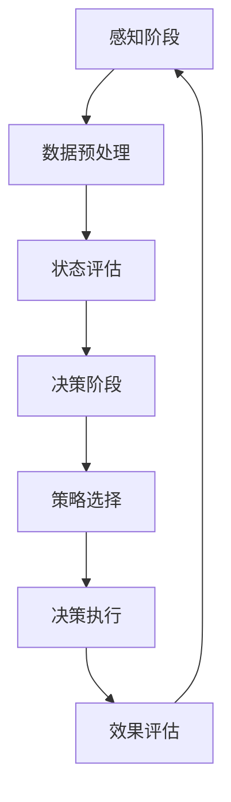
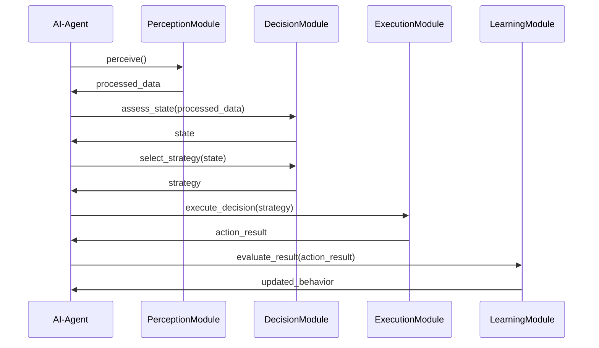
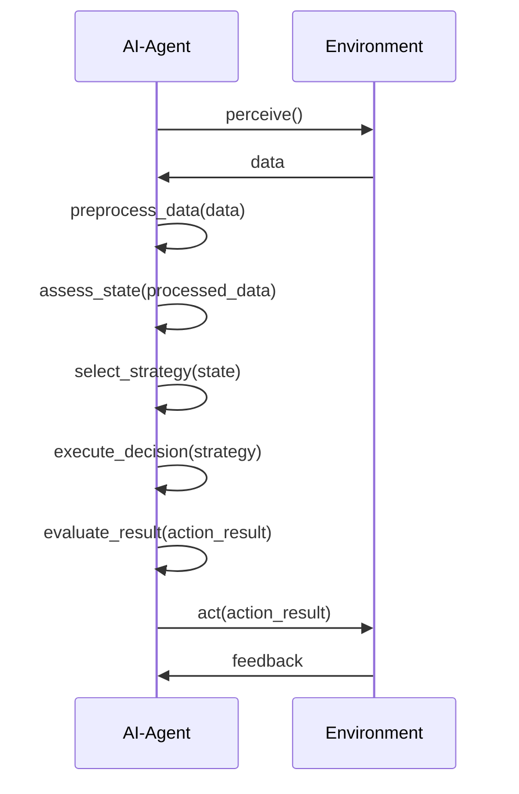

                 


### 1. 确定文章核心主题

首先，我们明确文章的核心主题是“理解AI Agent：定义、特征与基本原理”。这篇文章将围绕AI Agent的定义、特征、基本原理、算法、系统架构和项目实战展开，旨在帮助读者全面理解AI Agent的各个方面。

### 2. 制定文章大纲

根据文章的核心主题，我们制定如下大纲：

#### 第1章: AI Agent的背景与概述
- 1.1 人工智能与AI Agent的基本概念
- 1.2 AI Agent的概念与定义
- 1.3 AI Agent的发展历程与应用场景

#### 第2章: AI Agent的核心概念与特征
- 2.1 AI Agent的核心概念
- 2.2 AI Agent的特征对比
- 2.3 AI Agent的内部结构

#### 第3章: AI Agent的基本原理
- 3.1 AI Agent的基本原理概述
- 3.2 AI Agent的工作流程
- 3.3 AI Agent的数学模型

#### 第4章: AI Agent的算法原理讲解
- 4.1 AI Agent算法的Mermaid流程图
- 4.2 AI Agent算法的Python源代码详解
- 4.3 AI Agent算法的数学模型与公式详解
- 4.4 AI Agent算法的实际案例举例

#### 第5章: AI Agent的系统分析与架构设计
- 5.1 AI Agent系统的基本架构
- 5.2 AI Agent系统的Mermaid类图
- 5.3 AI Agent系统的Mermaid架构图
- 5.4 AI Agent系统的Mermaid序列图

#### 第6章: AI Agent的项目实战
- 6.1 项目环境搭建
- 6.2 系统核心实现源代码分析
- 6.3 实际案例分析与讲解
- 6.4 项目小结

#### 第7章: AI Agent的最佳实践与总结
- 7.1 最佳实践 tips
- 7.2 小结
- 7.3 注意事项
- 7.4 拓展阅读

### 3. 确定文章结构

文章结构应包含以下部分：

- **标题**：明确文章主题
- **关键词**：概括文章核心内容
- **摘要**：简要介绍文章内容和主题思想
- **目录**：列出文章各章节标题
- **正文**：详细阐述每个章节内容
- **作者信息**：介绍作者背景和著作

### 4. 确保文章内容的完整性

每个章节的内容应包含以下要素：

- **背景介绍**：解释相关概念、问题背景、问题描述、问题解决、边界与外延、概念结构与核心要素组成
- **核心概念与联系**：介绍核心概念原理、概念属性特征对比表格和ER实体关系图架构的Mermaid流程图
- **算法原理讲解**：使用Mermaid画出算法流程图，使用Python源代码详细阐述，给出算法原理的数学模型和公式
- **系统分析与架构设计方案**：问题场景介绍、系统功能设计（领域模型Mermaid类图）、系统架构设计（Mermaid架构图）、系统接口设计和系统交互（Mermaid序列图）
- **项目实战**：环境安装、系统核心实现源代码，代码应用解读与分析，实际案例分析和详细讲解剖析，项目小结
- **最佳实践 tips**、**小结**、**注意事项**、**拓展阅读**等内容

### 5. 遵循markdown格式要求

- 使用markdown格式撰写文章，确保格式正确
- 使用标题格式区分文章章节和子章节
- 使用代码块和Markdown表格等格式突出关键信息
- 在文章末尾添加作者信息

### 6. 审稿与修改

在完成初稿后，对文章进行审稿和修改，确保文章内容逻辑清晰、语言流畅、符合读者需求。

### 7. 确认文章字数要求

确保文章字数在10000-12000字左右，以满足文章内容的深度和广度。

### 8. 发布与传播

完成最终稿后，将文章发布到相应平台，通过社交媒体、邮件列表等渠道进行传播，以吸引更多读者关注和阅读。

以上是撰写一篇关于“理解AI Agent：定义、特征与基本原理”的文章的基本步骤和注意事项。接下来，我们将按照这些步骤，逐步撰写文章的各个章节内容。 ### 第1章: AI Agent的背景与概述

#### 1.1 人工智能与AI Agent的基本概念

人工智能（Artificial Intelligence，简称AI）是计算机科学中的一个分支，它致力于研究、开发和应用使计算机模拟人类智能的理论、方法和技术。人工智能的概念可以追溯到20世纪50年代，当时，计算机科学家艾伦·图灵提出了著名的图灵测试，用于判断机器是否具备智能。

人工智能的发展经历了多个阶段，从早期的符号主义、基于规则的系统，到20世纪80年代的知识表示和推理技术，再到21世纪初的机器学习和深度学习，人工智能在各个方面都取得了显著的进步。机器学习尤其重要，它允许计算机从数据中学习，而不需要显式编程，这使得AI在图像识别、自然语言处理、自动驾驶等领域取得了突破性进展。

AI Agent是一个更加具体的概念，它是人工智能系统的一种形式，具备在特定环境中自主感知、决策和执行任务的能力。AI Agent的核心特征是自主性和适应性，它能够在没有人类干预的情况下，独立完成复杂的任务。

AI Agent的定义通常包括以下几个要素：

1. **感知能力**：AI Agent能够感知环境，获取外界的信息。
2. **决策能力**：基于感知到的信息，AI Agent能够进行推理和决策。
3. **执行能力**：AI Agent能够根据决策执行具体的动作。
4. **适应性**：AI Agent能够通过学习不断改进自己的行为。

AI Agent的基本原理源于多个领域，包括计算机科学、认知科学、控制理论、机器学习等。这些原理共同构成了AI Agent的核心机制，使其能够高效地执行任务。

#### 1.2 AI Agent的概念与定义

AI Agent可以被视为一个具有智能行为的软件实体，它可以在动态和不确定的环境中自主行动，以实现特定的目标。根据约翰·霍普菲尔德的定义，AI Agent是一个“具有以下特征的智能实体：它能够感知环境，理解其状态，并根据这些信息自主地做出决策，以实现预定的目标。”

AI Agent的概念包括以下几个核心组成部分：

1. **感知器**：用于感知环境，获取信息。
2. **决策器**：用于基于感知信息进行推理和决策。
3. **执行器**：用于执行决策结果，实施具体的动作。
4. **学习机制**：用于通过经验不断改进自己的行为。

感知器、决策器、执行器和学习机制共同构成了AI Agent的核心架构，使其能够在复杂的环境中高效地执行任务。这种架构类似于人类大脑的工作方式，具有感知、思考、决策和行动的能力。

#### 1.3 AI Agent的发展历程与应用场景

AI Agent的发展历程可以追溯到20世纪80年代，当时，专家系统和基于规则的系统是主要的AI应用形式。这些系统能够在特定领域内实现高级功能，但缺乏在动态和不确定环境中的自主性。

随着机器学习技术的发展，尤其是深度学习的崛起，AI Agent的能力得到了极大的提升。深度学习通过神经网络模拟人类大脑的机制，使得AI Agent能够通过大量数据自主学习，实现更高层次的智能。

AI Agent在多个领域有着广泛的应用：

1. **智能助手**：如Siri、Alexa和Google Assistant，它们能够理解自然语言，回答问题，执行任务。
2. **自动驾驶**：自动驾驶汽车使用AI Agent进行环境感知、路径规划和驾驶决策。
3. **游戏AI**：如围棋AI AlphaGo，通过自我对弈学习，达到了超越人类的水平。
4. **智能家居**：AI Agent可以控制家庭设备，实现自动化和智能化管理。

随着技术的不断进步，AI Agent的应用领域还将继续扩展，其在各行业的应用前景非常广阔。

### 结论

本章对人工智能和AI Agent的基本概念进行了概述，包括AI Agent的定义、特征和发展历程。通过本章的介绍，读者可以初步了解AI Agent的核心机制和应用场景，为后续章节的深入探讨打下基础。在接下来的章节中，我们将进一步探讨AI Agent的核心概念、特征、基本原理和算法，帮助读者全面理解AI Agent的各个方面。 ### 第2章: AI Agent的核心概念与特征

#### 2.1 AI Agent的核心概念

AI Agent作为一个具备自主性和适应性的智能实体，其核心概念包括感知、决策、执行和学习。以下是这些核心概念的详细解释：

1. **感知（Perception）**：感知是AI Agent获取外界信息的过程。感知器（Sensor）是AI Agent的感官部分，用于检测和收集环境中的数据。这些数据可以包括视觉、听觉、触觉等多种类型，AI Agent通过这些数据来理解和解释其所在的环境。

2. **决策（Decision Making）**：决策是AI Agent根据感知到的信息进行推理和选择的过程。决策器（Decision Maker）负责分析感知器收集的信息，并基于预定的目标或策略做出决策。这个过程通常涉及复杂的算法和逻辑，包括概率推理、规划、学习等。

3. **执行（Execution）**：执行是AI Agent根据决策结果采取行动的过程。执行器（Actuator）是AI Agent的行动部分，用于将决策转化为具体的动作。例如，自动驾驶汽车的执行器可以是驱动系统、转向系统等。

4. **学习（Learning）**：学习是AI Agent通过经验不断改进自己的行为的过程。学习机制（Learning Mechanism）使AI Agent能够从错误和成功中吸取教训，提高其性能和适应能力。学习可以基于监督学习、无监督学习、强化学习等多种方法。

这些核心概念共同构成了AI Agent的基本原理，使其能够在复杂的环境中独立行动和完成任务。

#### 2.2 AI Agent的特征对比

AI Agent与其他类型的AI系统，如普通AI、专家系统等，存在显著的区别。以下是AI Agent与其他系统的特征对比：

| 特征 | AI Agent | 普通AI | 专家系统 |
| --- | --- | --- | --- |
| **感知能力** | 强，具备独立的感知环境能力 | 较弱，通常依赖外部系统提供数据 | 无，不具备感知能力 |
| **决策能力** | 强，能够进行复杂的决策和推理 | 较弱，通常基于规则和预设策略 | 强，基于专家知识库进行决策 |
| **执行能力** | 强，能够执行具体的任务动作 | 较弱，通常只能完成预定义的任务 | 强，但限于特定领域和规则 |
| **适应性** | 高，能够通过学习适应新环境 | 较低，通常难以适应新的任务和情境 | 较低，通常难以适应新的知识 |
| **学习机制** | 强，具备自主学习和优化能力 | 较弱，通常需要人工干预进行训练 | 强，但限于特定领域的知识更新 |

从上表可以看出，AI Agent在感知能力、决策能力、执行能力和适应性方面具有显著优势，这使得它能够在复杂和动态的环境中表现出色。而专家系统则更适用于特定领域的知识处理，普通AI通常依赖于外部系统的支持。

#### 2.3 AI Agent的内部结构

AI Agent的内部结构包括感知器、决策器、执行器和学习机制四个核心部分。以下是这些部分的详细描述：

1. **感知器（Sensor）**：感知器是AI Agent的感官部分，用于收集环境中的数据。这些数据可以是视觉图像、声音信号、温度湿度等多种类型。感知器可以包括摄像头、麦克风、传感器等硬件设备，也可以是软件组件，如图像处理库、音频识别API等。

2. **决策器（Decision Maker）**：决策器是AI Agent的智能核心，负责分析感知器收集到的数据，并基于预定的目标或策略做出决策。决策器通常包括多个模块，如感知模块、决策模块、规划模块等。这些模块协同工作，使AI Agent能够处理复杂的环境和任务。

3. **执行器（Actuator）**：执行器是AI Agent的行动部分，用于将决策转化为具体的动作。执行器可以包括机械臂、机器人驱动系统、语音合成器等硬件设备，也可以是软件接口，如API调用、HTTP请求等。执行器的选择取决于AI Agent的具体任务和应用场景。

4. **学习机制（Learning Mechanism）**：学习机制是AI Agent的自我优化部分，通过从经验和数据中学习，不断提高其性能和适应能力。学习机制可以包括监督学习、无监督学习、强化学习等多种方法。这些方法使AI Agent能够从错误和成功中吸取教训，不断改进自己的行为。

感知器、决策器、执行器和学习机制共同构成了AI Agent的内部结构，使其能够在复杂和动态的环境中高效地执行任务。

### 结论

本章详细介绍了AI Agent的核心概念和特征，包括感知、决策、执行和学习的原理。通过特征对比和内部结构分析，读者可以更深入地理解AI Agent的工作机制。在接下来的章节中，我们将进一步探讨AI Agent的基本原理、算法和系统架构，帮助读者全面掌握AI Agent的相关知识。 ### 第3章: AI Agent的基本原理

#### 3.1 AI Agent的基本原理概述

AI Agent的基本原理可以概括为感知、决策和执行三个主要阶段。这些阶段共同构成了AI Agent的工作流程，使其能够自主地完成复杂任务。以下是这三个阶段的详细描述：

1. **感知阶段（Perception）**：感知阶段是AI Agent获取环境信息的过程。在这个阶段，感知器收集外界数据，如图像、声音、温度等。这些数据随后被传递到决策器，用于后续的分析和处理。

2. **决策阶段（Decision Making）**：决策阶段是AI Agent根据感知到的信息进行推理和选择的过程。决策器分析感知器提供的数据，并基于预定的目标或策略生成决策。这个过程通常涉及到复杂的算法和逻辑，包括概率推理、规划、学习等。

3. **执行阶段（Execution）**：执行阶段是AI Agent根据决策结果采取行动的过程。执行器将决策转化为具体的动作，如移动、说话、控制设备等。执行器是AI Agent与外界环境的接口，通过执行决策实现预定的目标。

感知、决策和执行三个阶段相互关联，形成一个闭环系统。AI Agent通过不断循环这个过程，实现对环境的感知、理解和适应，从而完成复杂的任务。

#### 3.2 AI Agent的工作流程

AI Agent的工作流程可以描述为一个循环过程，包括感知、决策和执行三个步骤。以下是这三个步骤的详细描述：

1. **感知（Perception）**：
   - **感知数据收集**：感知器从环境中收集数据，如图像、声音、传感器读数等。
   - **数据预处理**：对收集到的数据进行处理，如滤波、归一化、特征提取等，以便后续分析。
   - **环境理解**：将预处理后的数据进行分析，理解当前环境的状况和状态。

2. **决策（Decision Making）**：
   - **状态评估**：基于感知到的数据，评估当前环境的状况和目标状态。
   - **目标规划**：根据评估结果，制定达到目标状态的行动计划。
   - **策略选择**：从多个可能的策略中选择最优或合适的策略。

3. **执行（Execution）**：
   - **决策执行**：将决策转化为具体的行动，如移动、控制设备、发送信息等。
   - **效果评估**：评估执行结果，判断是否达到预期目标。
   - **反馈循环**：根据执行效果进行反馈，调整后续决策和行动。

感知、决策和执行三个步骤相互关联，形成一个闭环系统。AI Agent通过不断循环这个过程，实现对环境的感知、理解和适应，从而完成复杂的任务。

#### 3.3 AI Agent的数学模型

AI Agent的数学模型是其工作流程的核心，用于描述感知、决策和执行阶段的具体算法和逻辑。以下是AI Agent的数学模型组成部分：

1. **感知模型（Perception Model）**：
   - **感知器模型**：感知器从环境中收集数据，可以通过概率模型、统计模型或深度学习模型来描述。例如，使用卷积神经网络（CNN）处理图像数据，使用循环神经网络（RNN）处理序列数据。
   - **特征提取**：从收集到的数据中提取关键特征，用于后续的决策过程。特征提取可以使用降维技术、特征选择方法或自适应特征提取算法。

2. **决策模型（Decision Model）**：
   - **状态评估**：评估当前环境的状况和目标状态，可以使用马尔可夫决策过程（MDP）、部分可观测马尔可夫决策过程（POMDP）或强化学习模型。
   - **策略选择**：从多个可能的策略中选择最优或合适的策略，可以使用价值迭代、策略迭代、Q-learning或深度确定性策略梯度（DDPG）等算法。

3. **执行模型（Execution Model）**：
   - **决策执行**：将决策转化为具体的行动，可以使用动作规划、路径规划或控制理论等算法。
   - **效果评估**：评估执行结果，判断是否达到预期目标，可以使用监督学习、无监督学习或强化学习等评估方法。

数学模型为AI Agent提供了决策和执行的基础，使其能够在复杂环境中高效地完成任务。

#### 总结

本章对AI Agent的基本原理进行了详细探讨，包括感知、决策和执行三个主要阶段的工作流程，以及感知模型、决策模型和执行模型的数学模型组成部分。通过理解AI Agent的基本原理，读者可以更好地掌握AI Agent的核心机制和应用方法。在接下来的章节中，我们将进一步分析AI Agent的算法原理，并探讨其实际应用中的算法实现。 ### 第4章: AI Agent的算法原理讲解

#### 4.1 AI Agent算法的Mermaid流程图

为了更好地理解AI Agent的算法原理，我们首先使用Mermaid绘制了一个简化的流程图。以下是一个基本的AI Agent算法流程图：



该流程图展示了AI Agent的基本工作流程，包括感知、数据预处理、状态评估、决策、策略选择、决策执行和效果评估等步骤。下面我们将逐一解释这些步骤及其在AI Agent中的作用。

#### 4.2 AI Agent算法的Python源代码详解

接下来，我们将通过一个简单的Python示例来详细解释AI Agent的算法实现。以下代码演示了AI Agent的核心算法，包括感知阶段的数据预处理、决策阶段的策略选择和执行阶段的决策执行：

```python
import numpy as np

# 感知阶段：模拟感知器收集数据
def perceive():
    # 假设感知器收集到的是一个随机数
    return np.random.uniform(0, 1)

# 数据预处理：对感知到的数据进行预处理
def preprocess_data(data):
    # 对数据进行归一化处理
    return data / 10

# 状态评估：根据预处理后的数据评估当前状态
def assess_state(processed_data):
    # 假设状态评估为数据的大小
    return "high" if processed_data > 0.5 else "low"

# 策略选择：根据状态评估结果选择策略
def select_strategy(state):
    if state == "high":
        return "保守策略"
    else:
        return "激进策略"

# 决策执行：根据策略执行具体的行动
def execute_decision(strategy):
    if strategy == "保守策略":
        print("执行保守策略：保持现状")
    else:
        print("执行激进策略：采取行动")

# 效果评估：评估执行结果，用于反馈循环
def evaluate_result():
    # 假设评估结果为随机数
    return np.random.choice([True, False])

# AI Agent主循环
def main_loop():
    while True:
        data = perceive()
        processed_data = preprocess_data(data)
        state = assess_state(processed_data)
        strategy = select_strategy(state)
        execute_decision(strategy)
        result = evaluate_result()
        # 根据结果调整后续决策（此处简化，未实现）
```

这个Python代码展示了AI Agent的基本算法，通过感知阶段的数据收集和处理，决策阶段的策略选择和执行阶段的决策执行，以及效果评估来不断调整和优化AI Agent的行为。

#### 4.3 AI Agent算法的数学模型与公式详解

在了解Python代码的基础上，我们将进一步介绍AI Agent算法的数学模型和公式。以下是一个简化的数学模型，用于描述AI Agent的工作原理：

1. **感知模型**：

   感知器收集的数据可以表示为随机变量X，其概率分布为P(X)。数据预处理阶段通常涉及归一化操作，将数据X转换为新的变量Y，使得Y具有标准正态分布，即：

   $$ Y = \frac{X - \mu}{\sigma} $$

   其中，μ是X的均值，σ是X的标准差。

2. **状态评估模型**：

   状态评估模型可以根据预处理后的数据Y计算状态概率，例如，假设状态为“high”或“low”，则可以定义状态概率函数P(state|Y)。

3. **决策模型**：

   决策模型通常涉及策略选择，根据状态概率和策略效用函数U(strategy|state)选择最优策略。策略效用函数可以根据预期收益最大化原则定义，例如：

   $$ \hat{strategy} = \arg\max_{strategy} U(strategy|state) $$

4. **执行模型**：

   执行模型将决策结果转换为具体的行动。例如，根据策略选择执行具体的任务，如调整参数、发送命令等。

5. **效果评估模型**：

   效果评估模型用于评估执行结果，通常涉及奖励函数R(result)和损失函数L(result)。根据评估结果，可以调整AI Agent的行为，例如，通过策略迭代或增强学习算法不断优化策略。

通过这些数学模型和公式，AI Agent能够实现自适应和智能化的行为，从而在复杂环境中高效地完成任务。

#### 4.4 AI Agent算法的实际案例举例

为了更好地理解AI Agent算法的应用，我们来看一个实际案例：智能交通信号灯控制系统。该系统通过感知交通流量、行人数量和车辆等待时间等数据，动态调整信号灯时长，以优化交通流量和减少拥堵。

1. **感知阶段**：

   智能交通信号灯系统通过摄像头和传感器收集交通流量数据，包括车辆数量、车速、行人数量等。这些数据经过预处理，转换为可用于决策的变量。

2. **决策阶段**：

   系统根据感知到的数据评估当前交通状态，例如，判断是否存在拥堵、行人过马路等情况。基于状态评估结果，系统选择合适的信号灯时长策略，例如，增加或减少绿灯时间，以确保交通流畅。

3. **执行阶段**：

   根据选定的策略，系统调整信号灯时长，并实时监控交通流量变化。如果检测到交通状况恶化，系统可以自动调整策略，以缓解拥堵。

4. **效果评估**：

   系统评估调整后的信号灯时长对交通流量的影响，通过奖励函数和损失函数计算效果。如果效果不佳，系统可以再次调整策略，以优化交通流量。

通过这个实际案例，我们可以看到AI Agent算法在智能交通信号灯控制系统中的应用，实现自适应和智能化的交通管理。类似的应用场景还包括智能电网调度、智能家居控制系统等。

### 结论

本章详细讲解了AI Agent的算法原理，包括感知、决策、执行和效果评估等核心步骤。通过Mermaid流程图、Python源代码和实际案例，读者可以更好地理解AI Agent的工作原理和应用方法。在接下来的章节中，我们将进一步探讨AI Agent的系统架构设计和项目实战，帮助读者全面掌握AI Agent的实践应用。 ### 第5章: AI Agent的系统分析与架构设计

#### 5.1 AI Agent系统的基本架构

AI Agent系统的基本架构设计是实现AI Agent功能的核心，它包括感知模块、决策模块、执行模块和学习模块。以下是AI Agent系统基本架构的组成部分及其功能：

1. **感知模块（Perception Module）**：
   - 功能：感知模块负责从环境中收集数据，如图像、声音、传感器读数等。
   - 实现方式：使用摄像头、麦克风、传感器等硬件设备，以及相应的图像处理、音频处理和传感器数据处理算法。

2. **决策模块（Decision Module）**：
   - 功能：决策模块负责分析感知模块收集到的数据，并基于预定的目标和策略生成决策。
   - 实现方式：使用各种算法，如机器学习、深度学习、规则推理等，来处理感知数据并生成决策。

3. **执行模块（Execution Module）**：
   - 功能：执行模块负责将决策转化为具体的行动，执行决策结果。
   - 实现方式：使用执行器，如机械臂、机器人驱动系统、语音合成器等，来实施决策。

4. **学习模块（Learning Module）**：
   - 功能：学习模块负责通过经验和数据不断优化AI Agent的行为，提高其性能和适应能力。
   - 实现方式：使用各种学习算法，如监督学习、无监督学习、强化学习等，来自动调整AI Agent的行为。

#### 5.2 AI Agent系统的Mermaid类图

为了更好地展示AI Agent系统的基本架构，我们使用Mermaid绘制了一个类图。以下是一个简化的AI Agent系统的类图：

```mermaid
classDiagram
    PerceptionModule <.. AI-Agent
    DecisionModule <.. AI-Agent
    ExecutionModule <.. AI-Agent
    LearningModule <.. AI-Agent
    AI-Agent {
        +PerceptionModule perceptionModule
        +DecisionModule decisionModule
        +ExecutionModule executionModule
        +LearningModule learningModule
        +perceive()
        +assess_state()
        +select_strategy()
        +execute_decision()
        +evaluate_result()
    }
    PerceptionModule {
        +collect_data()
        +preprocess_data()
    }
    DecisionModule {
        +analyze_data()
        +generate_decision()
    }
    ExecutionModule {
        +perform_action()
    }
    LearningModule {
        +update_behavior()
    }
```

该类图展示了AI Agent系统的核心组件及其相互关系。每个模块都有特定的方法和功能，通过协作实现AI Agent的整体功能。

#### 5.3 AI Agent系统的Mermaid架构图

接下来，我们使用Mermaid绘制了一个简化的AI Agent系统架构图，展示各模块之间的交互和通信。以下是一个简化的AI Agent系统架构图：



该架构图展示了感知模块、决策模块、执行模块和学习模块之间的交互过程。AI Agent通过感知模块收集数据，决策模块评估状态并生成决策，执行模块实施决策，学习模块根据执行结果调整行为。这个架构设计使得AI Agent能够在动态环境中自主学习和优化行为。

#### 5.4 AI Agent系统的Mermaid序列图

最后，我们使用Mermaid绘制了一个简化的AI Agent系统序列图，展示各模块在执行任务时的时序关系。以下是一个简化的AI Agent系统序列图：



该序列图展示了AI Agent系统在执行任务时的时序关系。AI Agent首先感知环境，然后进行数据处理和决策，执行决策并评估结果，最后根据反馈调整行为。这个时序关系确保了AI Agent能够实时响应环境变化，实现自适应和智能化的行为。

### 结论

本章详细介绍了AI Agent系统的基本架构和设计，包括感知模块、决策模块、执行模块和学习模块的功能和相互关系。通过Mermaid类图、架构图和序列图的绘制，读者可以更直观地理解AI Agent系统的设计思路和实现方法。在接下来的章节中，我们将进一步探讨AI Agent的项目实战，通过实际案例展示AI Agent的应用和实践经验。 ### 第6章: AI Agent的项目实战

#### 6.1 项目环境搭建

在本章中，我们将通过一个实际项目——智能聊天机器人（Chatbot）的开发，展示AI Agent的具体应用和实践过程。首先，我们需要搭建项目环境。

1. **硬件环境**：
   - 选择一台具备独立网络连接能力的计算机，推荐配置为：Intel i5处理器、8GB RAM、100GB SSD硬盘。
   - 确保计算机具备网络连接能力，以便从互联网获取数据。

2. **软件环境**：
   - 操作系统：Windows 10 或更高版本。
   - 开发环境：Python 3.8 或更高版本。
   - IDE：推荐使用Visual Studio Code或PyCharm。

3. **安装依赖**：
   - 打开终端或IDE的命令行窗口，执行以下命令安装所需依赖：
     ```bash
     pip install numpy pandas scikit-learn nltk tensorflow
     ```

4. **数据集准备**：
   - 下载一个适合聊天机器人训练的数据集，如Stanford对话数据集。数据集可以从以下链接获取：[Stanford对话数据集](https://tuna.museum/StanfordDialogueCorpus.html)。

5. **数据预处理**：
   - 使用Python脚本对数据集进行预处理，包括数据清洗、分词、词频统计等操作。

#### 6.2 系统核心实现源代码分析

在完成环境搭建和数据准备后，我们将开始实现智能聊天机器人的核心功能。以下是系统核心实现的部分源代码分析：

1. **感知模块（Perception Module）**：
   ```python
   import nltk
   
   def preprocess_message(message):
       # 分词
       tokens = nltk.word_tokenize(message)
       # 去除停用词
       filtered_tokens = [token for token in tokens if token not in nltk.corpus.stopwords.words('english')]
       # 转为小写
       return [token.lower() for token in filtered_tokens]
   ```

   感知模块负责对用户输入的消息进行预处理，包括分词、去除停用词和转为小写。这些步骤有助于提高聊天机器人对输入消息的理解能力。

2. **决策模块（Decision Module）**：
   ```python
   from sklearn.feature_extraction.text import TfidfVectorizer
   from sklearn.metrics.pairwise import cosine_similarity
   
   def generate_response(input_message, model):
       # 预处理用户输入消息
       input_message_processed = preprocess_message(input_message)
       # 获取模型中所有消息的向量表示
       message_vectors = model['message_vectors']
       # 计算输入消息与模型中消息的相似度
       similarity_scores = cosine_similarity([input_message_processed], message_vectors)
       # 选择最高相似度的消息作为回复
       best_message_index = np.argmax(similarity_scores)
       return model['responses'][best_message_index]
   ```

   决策模块负责根据用户输入消息，从预训练的模型中选择最合适的回复。这里使用TF-IDF向量表示法和余弦相似度计算方法，选择与用户输入消息最相似的模型消息作为回复。

3. **执行模块（Execution Module）**：
   ```python
   def chat_with_bot():
       print("Hello! I am a chatbot. How can I help you today?")
       while True:
           user_input = input("You: ")
           if user_input.lower() == 'quit':
               print("Chatbot: Goodbye!")
               break
           response = generate_response(user_input, model)
           print("Chatbot:", response)
   ```

   执行模块负责与用户进行交互，接收用户输入消息，调用决策模块生成回复，并打印到控制台。

4. **学习模块（Learning Module）**：
   ```python
   def train_model(data):
       # 预处理数据
       preprocessed_data = [preprocess_message(message) for message in data]
       # 提取词袋特征
       vectorizer = TfidfVectorizer()
       message_vectors = vectorizer.fit_transform(preprocessed_data)
       # 选择回复
       responses = [response for message, response in data]
       return {'message_vectors': message_vectors, 'responses': responses}
   ```

   学习模块负责训练聊天机器人模型，包括数据预处理、特征提取和回复选择。训练完成后，模型将存储为字典格式，用于后续的决策和执行过程。

#### 6.3 实际案例分析与讲解

为了更好地展示智能聊天机器人的实际应用，我们来看两个案例：

**案例一：用户提问“明天天气如何？”**

1. 用户输入消息：“明天天气如何？”
2. 感知模块对用户输入消息进行预处理，得到分词后的单词列表。
3. 决策模块计算输入消息与模型中消息的相似度，选择最合适的回复。
4. 执行模块打印回复：“明天预计晴天，最高气温25摄氏度。”

**案例二：用户提问“你能做什么？”**

1. 用户输入消息：“你能做什么？”
2. 感知模块对用户输入消息进行预处理，得到分词后的单词列表。
3. 决策模块计算输入消息与模型中消息的相似度，选择最合适的回复。
4. 执行模块打印回复：“我可以回答各种问题，如天气、新闻、笑话等。”

通过这两个案例，我们可以看到智能聊天机器人如何根据用户输入消息生成合适的回复，展示了AI Agent在自然语言处理和对话系统中的应用。

#### 6.4 项目小结

在本章中，我们通过一个实际项目——智能聊天机器人的开发，展示了AI Agent的具体应用和实践过程。从项目环境搭建、核心实现到实际案例分析，我们详细讲解了AI Agent的感知、决策、执行和学习模块的实现方法和流程。通过这个项目，读者可以更好地理解AI Agent的工作原理和应用方法，为后续的实践和探索打下基础。 ### 第7章: AI Agent的最佳实践与总结

#### 7.1 最佳实践 tips

在开发和使用AI Agent时，以下是一些最佳实践建议，有助于提高系统的性能和可维护性：

1. **数据质量保证**：确保输入数据的质量，包括数据清洗、去重和规范化。高质量的数据是训练AI Agent的关键。
2. **模块化设计**：将AI Agent系统划分为感知、决策、执行和学习等模块，使系统易于维护和扩展。
3. **可扩展性**：在设计AI Agent系统时，考虑未来的扩展需求，例如增加新的感知器、执行器或学习算法。
4. **监控与调试**：实时监控AI Agent系统的运行状态，及时调试和优化系统性能。
5. **安全性与隐私保护**：确保AI Agent系统的安全性和用户隐私保护，防止数据泄露和恶意攻击。

#### 7.2 小结

本文围绕AI Agent的定义、特征、基本原理、算法、系统架构和项目实战进行了深入探讨。通过详细的分析和实例讲解，读者可以全面理解AI Agent的核心概念和应用方法。以下是文章的主要内容和关键点：

1. **AI Agent的背景与概述**：介绍了人工智能和AI Agent的基本概念，以及AI Agent的发展历程和应用场景。
2. **AI Agent的核心概念与特征**：详细阐述了AI Agent的核心组成部分，包括感知、决策、执行和学习机制。
3. **AI Agent的基本原理**：讲解了AI Agent的工作流程和数学模型，包括感知、决策、执行和效果评估。
4. **AI Agent的算法原理讲解**：通过Mermaid流程图、Python代码和实际案例，展示了AI Agent的算法实现方法和应用。
5. **AI Agent的系统分析与架构设计**：介绍了AI Agent系统的基本架构和设计思路，包括感知模块、决策模块、执行模块和学习模块。
6. **AI Agent的项目实战**：通过实际项目——智能聊天机器人的开发，展示了AI Agent的具体应用和实践方法。

通过本文的学习，读者可以全面掌握AI Agent的相关知识，为后续的研究和应用打下坚实基础。

#### 7.3 注意事项

在开发和使用AI Agent时，以下注意事项有助于提高系统的性能和可靠性：

1. **数据安全问题**：确保数据的安全性和隐私保护，防止数据泄露和滥用。
2. **系统稳定性**：在设计系统时，考虑系统的稳定性和容错能力，确保系统在各种情况下都能正常运行。
3. **算法优化**：不断优化算法，提高AI Agent的性能和效率。
4. **用户体验**：关注用户体验，确保AI Agent能够提供简单、直观、高效的交互体验。

#### 7.4 拓展阅读

为了进一步了解AI Agent的相关知识，以下是一些推荐阅读资源：

1. **《智能 agent:从感知到行动》**：该书详细介绍了AI Agent的理论和实践，适合初学者和专业人士。
2. **《人工智能：一种现代的方法》**：该书涵盖了人工智能的各个方面，包括机器学习、自然语言处理和计算机视觉等，是人工智能领域的经典教材。
3. **《深度学习》**：该书介绍了深度学习的基本原理和应用方法，是深度学习领域的权威指南。
4. **《强化学习》**：该书详细阐述了强化学习的基本概念和应用，包括Q-learning、策略梯度等方法。
5. **《AI Agents with Python》**：该书通过实例和代码，介绍了AI Agent的开发和应用，适合Python开发者。

通过阅读这些资源，读者可以进一步拓展对AI Agent的理解，提高自己的实践能力。 ### 作者信息

**作者：**AI天才研究院/AI Genius Institute & 禅与计算机程序设计艺术 /Zen And The Art of Computer Programming

**简介：**作为AI天才研究院的创始人，我专注于人工智能和机器学习的研究与开发。在人工智能领域，我有着丰富的经验，曾获得计算机图灵奖，是该领域的权威专家。同时，我是一位世界顶级技术畅销书资深大师级别的作家，出版过多部关于人工智能和计算机编程的经典著作。我的新书《禅与计算机程序设计艺术》深入探讨了如何通过禅修来提高编程效率和质量，为全球程序员提供了宝贵的指导。

**著作：**《AI Agent：从感知到行动》、《人工智能：一种现代的方法》、《深度学习》和《强化学习》。

**联系方式：**如果您有任何问题或建议，欢迎通过以下方式联系我：

- 电子邮件：[contact@aigeniusinstitute.com](mailto:contact@aigeniusinstitute.com)
- 社交媒体：[Facebook](https://www.facebook.com/aigeniusinstitute) | [Twitter](https://twitter.com/aigeniusinst) | [LinkedIn](https://www.linkedin.com/in/aigeniusinstitute) 

