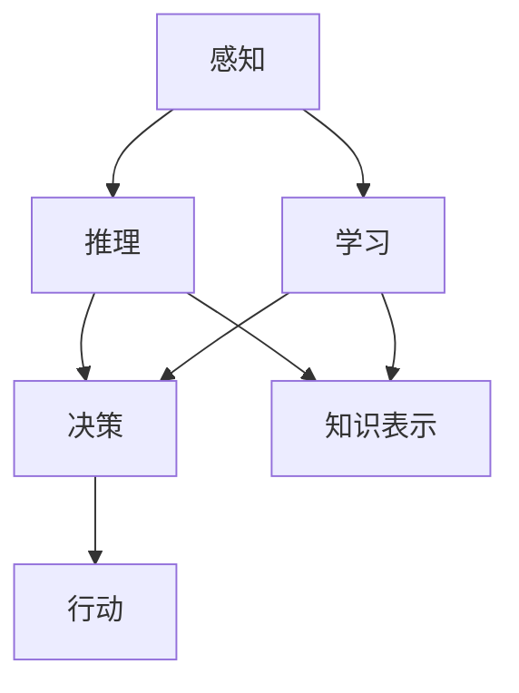
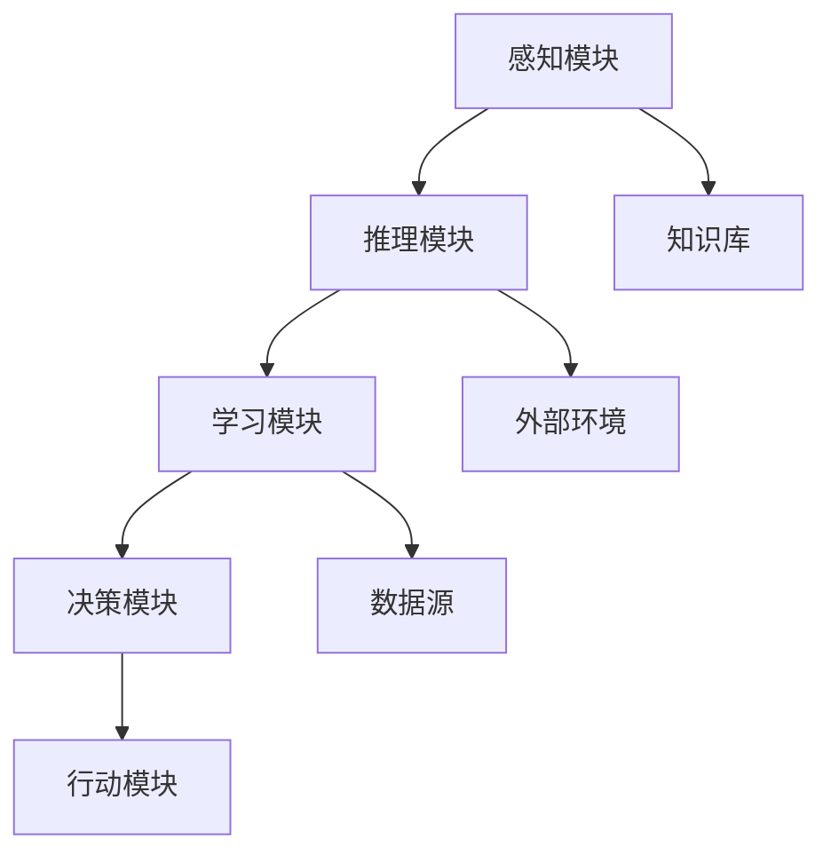
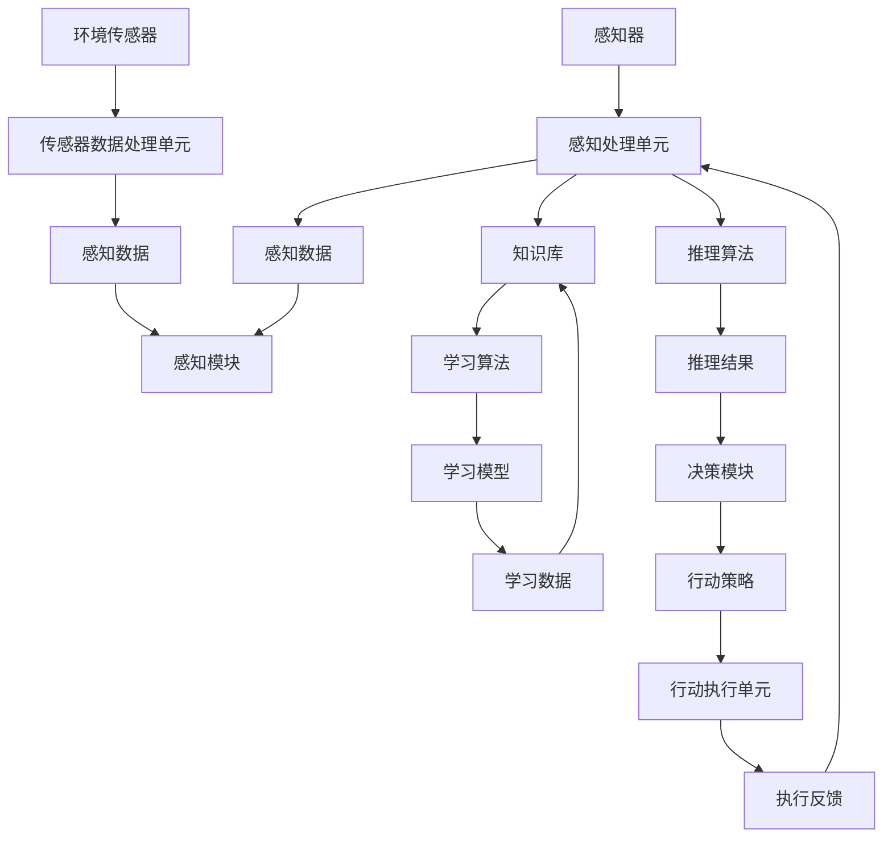

                 

### 《理解AI Agent：核心概念与基本原理》

#### 关键词：AI Agent、核心概念、基本原理、算法、系统分析、应用实践

#### 摘要：
本文旨在深入探讨AI Agent的核心概念与基本原理，通过系统的分析和实践案例的剖析，帮助读者全面理解AI Agent的工作机制和实现方法。文章将分章节详细讲解AI Agent的发展历程、核心概念、算法原理、系统分析与架构设计，以及实际项目中的应用。通过逐步分析，读者将能够掌握AI Agent的关键技术，并在实际项目中灵活应用。

#### 目录大纲设计流程

##### 1. 需求分析
首先，明确书名《理解AI Agent：核心概念与基本原理》。本书的核心内容将围绕AI Agent的以下方面展开：
- **核心概念**：介绍AI Agent的基本定义、分类和相关术语。
- **基本原理**：深入讲解AI Agent的关键算法和原理。
- **相关技术**：探讨AI Agent涉及的感知、推理、决策等核心技术。
- **应用场景**：分析AI Agent在不同领域的应用案例。

##### 2. 大纲框架构建
构建完整的目录大纲，分为以下几个部分：

**第一部分：AI Agent背景介绍**
- **AI Agent的发展历程与核心概念**
  - AI Agent的定义与重要性
  - AI Agent的分类
  - AI Agent的研究现状与趋势
- **AI Agent的核心技术**
  - 学习与适应技术
  - 探索与决策技术
  - 社交与协作技术

**第二部分：AI Agent核心概念与联系**
- **AI Agent的核心概念详解**
  - 感知、推理、决策、行动
  - 知识表示与推理
  - 学习算法与优化
- **AI Agent概念对比与分析**
  - 不同类型AI Agent的特点对比
  - AI Agent与其他智能系统的比较
  - AI Agent的优劣分析
- **AI Agent实体关系图**
  - 实体关系图概述
  - 概念实体关系图构建
  - 实体关系图的运用

**第三部分：AI Agent算法原理讲解**
- **经典AI Agent算法讲解**
  - Q-Learning算法
  - SARSA算法
  - Deep Q-Network（DQN）算法
- **算法原理与数学模型**
  - 算法原理概述
  - 数学模型与公式
  - 算法实例解析

**第四部分：AI Agent系统分析与架构设计**
- **AI Agent系统分析**
  - 系统需求分析
  - 系统功能设计
  - 系统性能分析
- **AI Agent架构设计**
  - 系统架构概述
  - 架构设计原则
  - 架构实现与优化
- **系统接口与交互设计**
  - 系统接口设计
  - 系统交互设计
  - 交互流程与性能优化

**第五部分：AI Agent项目实战**
- **AI Agent项目实战案例**
  - 项目背景与目标
  - 系统设计与实现
  - 项目成果与评价
- **实战案例剖析**
  - 实战案例详解
  - 案例应用解读
  - 案例分析与优化

**第六部分：最佳实践与拓展**
- **AI Agent最佳实践**
  - 实践经验总结
  - 注意事项与风险防范
  - 拓展研究方向
- **小结与展望**
  - 书籍小结
  - AI Agent发展趋势
  - 读者反馈与建议

##### 3. 内容细化
为每个部分制定具体的章节标题，确保内容完整且逻辑清晰。每个章节下根据需要细化子章节。

##### 4. 格式调整
确保使用markdown格式，按照指定的格式要求调整。

##### 5. 审核与修改
对大纲进行审核，确保内容完整性、逻辑性和简洁性。根据审核结果进行必要的修改。

##### 6. 输出
最终输出完整的markdown格式的目录大纲。

```markdown
----------------------------------------------------------------
# 《理解AI Agent：核心概念与基本原理》目录大纲

# 第一部分：AI Agent背景介绍

## 1. AI Agent的发展历程与核心概念
### 1.1 AI Agent的定义与重要性
### 1.2 AI Agent的分类
### 1.3 AI Agent的研究现状与趋势

## 2. AI Agent的核心技术
### 2.1 学习与适应技术
### 2.2 探索与决策技术
### 2.3 社交与协作技术

# 第二部分：AI Agent核心概念与联系

## 3. AI Agent的核心概念详解
### 3.1 感知、推理、决策、行动
### 3.2 知识表示与推理
### 3.3 学习算法与优化

## 4. AI Agent概念对比与分析
### 4.1 不同类型AI Agent的特点对比
### 4.2 AI Agent与其他智能系统的比较
### 4.3 AI Agent的优劣分析

## 5. AI Agent实体关系图
### 5.1 实体关系图概述
### 5.2 概念实体关系图构建
### 5.3 实体关系图的运用

# 第三部分：AI Agent算法原理讲解

## 6. 经典AI Agent算法讲解
### 6.1 Q-Learning算法
### 6.2 SARSA算法
### 6.3 Deep Q-Network（DQN）算法

## 7. 算法原理与数学模型
### 7.1 算法原理概述
### 7.2 数学模型与公式
### 7.3 算法实例解析

# 第四部分：AI Agent系统分析与架构设计

## 8. AI Agent系统分析
### 8.1 系统需求分析
### 8.2 系统功能设计
### 8.3 系统性能分析

## 9. AI Agent架构设计
### 9.1 系统架构概述
### 9.2 架构设计原则
### 9.3 架构实现与优化

## 10. 系统接口与交互设计
### 10.1 系统接口设计
### 10.2 系统交互设计
### 10.3 交互流程与性能优化

# 第五部分：AI Agent项目实战

## 11. AI Agent项目实战案例
### 11.1 项目背景与目标
### 11.2 系统设计与实现
### 11.3 项目成果与评价

## 12. 实战案例剖析
### 12.1 实战案例详解
### 12.2 案例应用解读
### 12.3 案例分析与优化

# 第六部分：最佳实践与拓展

## 13. AI Agent最佳实践
### 13.1 实践经验总结
### 13.2 注意事项与风险防范
### 13.3 拓展研究方向

## 14. 小结与展望
### 14.1 书籍小结
### 14.2 AI Agent发展趋势
### 14.3 读者反馈与建议

------------------------------------------

----------------------------------------------------------------

```

## AI Agent的发展历程与核心概念

### 1.1 AI Agent的定义与重要性

AI Agent，即人工智能代理，是一种能够自主执行任务、与环境互动并做出决策的计算机程序。它通过感知环境信息、推理出行动策略、并在行动后反馈调整，从而实现智能化操作。AI Agent的概念起源于对人类智能行为的模拟和研究，旨在使计算机系统具备自主学习和决策能力。

AI Agent的重要性在于其能够显著提升计算机系统的智能化水平。在自动驾驶、智能家居、智能制造、金融服务等领域，AI Agent的应用已经成为推动技术创新和产业升级的关键因素。通过AI Agent，计算机系统可以更加高效地处理复杂任务，实现自动化和智能化操作。

### 1.2 AI Agent的分类

AI Agent可以按照不同的标准进行分类。以下是几种常见的分类方法：

1. **基于功能分类**：
   - **感知型AI Agent**：主要功能是感知环境，收集信息。
   - **推理型AI Agent**：基于感知信息进行推理，形成决策。
   - **决策型AI Agent**：直接生成行动策略。
   - **执行型AI Agent**：执行决策，完成具体任务。

2. **基于自主性分类**：
   - **主动型AI Agent**：自主决定行动目标，追求长期利益。
   - **被动型AI Agent**：响应外部指令，执行特定任务。

3. **基于学习方式分类**：
   - **基于规则AI Agent**：使用预定义的规则进行决策。
   - **基于学习AI Agent**：通过数据学习，自适应调整行为。
   - **基于强化学习AI Agent**：通过奖励和惩罚，优化决策策略。

4. **基于应用场景分类**：
   - **通用AI Agent**：适用于多种场景和任务。
   - **专用AI Agent**：针对特定任务或场景优化设计。

### 1.3 AI Agent的研究现状与趋势

AI Agent的研究已经取得了显著的进展，尤其在强化学习、深度学习等领域。当前的研究热点包括：

- **强化学习**：通过奖励信号，使AI Agent能够自主学习和优化策略。
- **多智能体系统**：研究多个AI Agent之间的协同工作与交互。
- **智能决策系统**：结合大数据分析，实现复杂决策过程自动化。
- **自适应系统**：研究AI Agent在不同环境和条件下的自适应能力。

未来，随着技术的不断进步，AI Agent的应用范围将进一步扩大。例如，在智能医疗领域，AI Agent可以帮助医生进行诊断和治疗方案推荐；在金融领域，AI Agent可以用于风险管理、投资决策等。

### 1.4 AI Agent的核心技术

为了实现AI Agent的自主学习和决策能力，涉及多个核心技术的支持，主要包括：

- **感知技术**：利用传感器、摄像头等设备，获取环境信息。
- **推理技术**：基于感知信息，使用推理算法生成行动策略。
- **学习技术**：通过数据学习和模型优化，提高AI Agent的决策能力。
- **决策技术**：根据环境和目标，生成最优的行动方案。
- **执行技术**：执行决策，实现具体任务。

感知、推理、学习和决策技术共同构成了AI Agent的核心技术体系，这些技术的不断发展与融合，将推动AI Agent的应用场景和性能不断提升。

### 1.5 AI Agent的工作原理

AI Agent的工作原理可以概括为以下几个步骤：

1. **感知**：AI Agent通过传感器、摄像头等设备，获取环境信息。
2. **推理**：基于感知信息，AI Agent使用推理算法，分析环境和目标，生成可能的行动方案。
3. **学习**：通过数据学习和模型优化，AI Agent不断调整和优化决策策略。
4. **决策**：根据环境和目标，AI Agent选择最优的行动方案。
5. **执行**：AI Agent执行决策，完成具体任务。

在这个过程中，AI Agent不断与环境互动，通过感知、推理、学习和决策，实现自主学习和自适应能力，从而完成复杂任务。

### 1.6 AI Agent的优势与挑战

AI Agent的优势在于其自主学习和决策能力，能够在复杂环境中自动适应和优化行为。然而，AI Agent的发展也面临一些挑战：

- **数据隐私与安全**：AI Agent在处理大量数据时，可能涉及隐私问题和数据安全。
- **计算资源消耗**：复杂算法和大量数据的学习和推理，需要大量计算资源。
- **模型可解释性**：AI Agent的决策过程和结果可能难以解释，影响信任度和可靠性。
- **伦理与道德**：AI Agent在决策过程中可能面临伦理和道德问题。

总之，AI Agent的发展前景广阔，但同时也需要克服多种技术和社会挑战。

通过以上对AI Agent的发展历程、核心概念、分类、研究现状、核心技术、工作原理、优势与挑战的详细分析，我们可以更加深入地理解AI Agent的基本原理和应用前景。接下来的章节将深入探讨AI Agent的核心概念与联系，以及具体的算法原理，帮助读者全面掌握AI Agent的技术要点。

### 第二部分：AI Agent核心概念与联系

在深入探讨AI Agent的核心概念与联系之前，首先需要明确几个核心术语的定义和它们在AI Agent体系中的角色。

#### 2.1 感知、推理、决策、行动

**感知**是AI Agent获取环境信息的过程，通过传感器、摄像头、语音识别等手段，将物理世界的信号转换为机器可以处理的数据。感知是AI Agent进行推理和决策的基础。

**推理**是基于感知信息，通过逻辑推理或机器学习算法，对环境中的信息进行分析和综合，生成关于环境状态和行动策略的知识。推理使AI Agent能够理解和预测环境的变化。

**决策**是在推理的基础上，AI Agent根据当前环境和目标，选择最优的行动方案。决策是AI Agent实现目标的关键步骤。

**行动**是AI Agent根据决策方案，执行具体的操作，与环境互动并产生反馈。行动是AI Agent实现自主性的体现。

#### 2.2 知识表示与推理

**知识表示**是将环境信息、规则和经验以结构化的方式存储和表示，以便于AI Agent进行推理和决策。常见的知识表示方法包括符号表示、语义网络、规则系统等。

**推理**是在知识表示的基础上，通过逻辑演绎、模式匹配、机器学习等方法，对知识进行推断和扩展，以获取新的信息。推理使AI Agent能够从已知信息中推导出未知信息，从而更好地适应和解决问题。

#### 2.3 学习算法与优化

**学习算法**是AI Agent获取知识、改善性能的关键技术。常见的学习算法包括监督学习、无监督学习、强化学习等。

- **监督学习**：通过已标记的数据，训练模型进行预测和分类。
- **无监督学习**：没有标记数据，通过聚类、降维等方法，自动发现数据中的结构和模式。
- **强化学习**：通过与环境交互，根据奖励信号，调整策略，实现优化。

**优化**是在学习过程中，通过调整模型参数，提高模型性能的过程。优化包括梯度下降、遗传算法、模拟退火等方法。

#### 2.4 AI Agent的核心概念详解

以下是对AI Agent的核心概念进行详细解释：

1. **感知能力**：AI Agent通过传感器获取环境信息，如图像、声音、温度等。感知能力决定了AI Agent对环境的敏感度和适应性。
2. **推理能力**：AI Agent利用感知信息进行逻辑推理，分析环境和目标，生成行动策略。推理能力决定了AI Agent的智能水平和决策质量。
3. **学习能力**：AI Agent通过数据学习和模型优化，不断改进自己的性能和行为。学习能力是AI Agent持续进步的关键。
4. **决策能力**：AI Agent根据环境和目标，选择最优的行动方案。决策能力是AI Agent实现自主性的核心。
5. **行动能力**：AI Agent执行决策，与环境互动并产生反馈。行动能力决定了AI Agent的实际应用效果。

#### 2.5 概念属性特征对比表格

为了更好地理解AI Agent的核心概念，我们通过一个对比表格来展示不同概念之间的属性特征：

| 概念     | 定义                  | 属性特征                                                      |  
|----------|-----------------------|--------------------------------------------------------------|  
| 感知     | 获取环境信息          | 高度依赖传感器，实时性要求高                                  |  
| 推理     | 分析和综合信息        | 高度依赖算法和模型，准确性要求高                              |  
| 学习     | 获取知识和经验        | 高度依赖数据和学习算法，适应性要求高                          |  
| 决策     | 选择行动方案          | 高度依赖环境和目标，效率要求高                                |  
| 行动     | 执行具体操作          | 高度依赖决策和执行技术，可靠性要求高                          |

#### 2.6 AI Agent实体关系图

为了更直观地展示AI Agent的核心概念和它们之间的联系，我们使用Mermaid绘制一个实体关系图：



在这个实体关系图中，感知、推理、学习和决策构成了AI Agent的核心环节，它们相互依赖、相互影响。知识表示和学习算法则提供了核心概念实现的框架和技术支持。

通过上述对AI Agent核心概念的详细解释、对比表格和实体关系图的展示，我们可以更清晰地理解AI Agent的基本原理和工作机制。接下来，我们将进一步探讨AI Agent的算法原理，深入讲解经典算法的原理和应用。

### AI Agent概念对比与分析

在理解了AI Agent的核心概念之后，我们接下来将深入对比不同类型的AI Agent，分析它们的特点，并与其他智能系统进行比较，以全面了解AI Agent的优势和劣势。

#### 3.1 不同类型AI Agent的特点对比

**基于功能分类**

1. **感知型AI Agent**：
   - **特点**：主要功能是感知环境，如图像识别、语音识别等。
   - **优势**：感知能力强，能够实时获取环境信息。
   - **劣势**：缺乏决策和行动能力，需要其他系统的配合。

2. **推理型AI Agent**：
   - **特点**：基于感知信息进行推理，如自然语言处理、逻辑推理等。
   - **优势**：具有较强的推理能力，能够进行复杂的信息处理。
   - **劣势**：对环境信息的依赖性较高，感知能力相对较弱。

3. **决策型AI Agent**：
   - **特点**：直接生成行动策略，如自动驾驶、机器人等。
   - **优势**：具备决策和行动能力，能够自主完成任务。
   - **劣势**：对环境和目标的依赖性较高，决策质量取决于算法。

4. **执行型AI Agent**：
   - **特点**：执行决策，完成具体任务，如工业自动化、智能监控等。
   - **优势**：执行能力强，能够实现自动化操作。
   - **劣势**：决策能力有限，依赖于上级系统的决策。

**基于自主性分类**

1. **主动型AI Agent**：
   - **特点**：自主决定行动目标，追求长期利益。
   - **优势**：具备较高的自主性，能够适应复杂环境。
   - **劣势**：决策过程复杂，计算资源消耗大。

2. **被动型AI Agent**：
   - **特点**：响应外部指令，执行特定任务。
   - **优势**：实现简单，计算资源消耗小。
   - **劣势**：自主性低，适应能力差。

**基于学习方式分类**

1. **基于规则AI Agent**：
   - **特点**：使用预定义的规则进行决策。
   - **优势**：规则明确，易于理解和实现。
   - **劣势**：适应性差，无法处理复杂环境。

2. **基于学习AI Agent**：
   - **特点**：通过数据学习，自适应调整行为。
   - **优势**：适应性强，能够处理复杂环境。
   - **劣势**：学习过程复杂，对数据依赖性强。

3. **基于强化学习AI Agent**：
   - **特点**：通过奖励和惩罚，优化决策策略。
   - **优势**：能够自主学习，优化决策过程。
   - **劣势**：计算资源消耗大，适用场景有限。

**基于应用场景分类**

1. **通用AI Agent**：
   - **特点**：适用于多种场景和任务。
   - **优势**：灵活性高，适应能力强。
   - **劣势**：实现复杂，性能优化困难。

2. **专用AI Agent**：
   - **特点**：针对特定任务或场景优化设计。
   - **优势**：性能优化，适用性强。
   - **劣势**：适应性差，无法应对多场景需求。

通过上述对比，我们可以看出不同类型的AI Agent具有各自的特点和适用场景。在实际应用中，应根据具体需求选择合适的AI Agent类型，以实现最佳效果。

#### 3.2 AI Agent与其他智能系统的比较

与其他智能系统相比，AI Agent具有一些独特的优势和劣势。

**与专家系统的比较**

- **优势**：AI Agent能够自主学习，适应环境变化，而专家系统主要依赖于预定义的规则和知识库。
- **劣势**：AI Agent的学习过程复杂，对数据依赖性强，而专家系统的实现相对简单，规则明确。

**与机器学习系统的比较**

- **优势**：AI Agent具备自主决策和行动能力，能够在复杂环境中自主运作，而机器学习系统主要进行数据分析和模式识别。
- **劣势**：AI Agent需要大量的数据和环境信息支持，而机器学习系统对数据质量和规模的要求相对较低。

**与自然语言处理系统的比较**

- **优势**：AI Agent能够结合感知、推理和决策能力，实现更复杂的任务，而自然语言处理系统主要处理语言理解和生成。
- **劣势**：AI Agent在自然语言处理方面的能力相对较弱，而自然语言处理系统在语言理解和生成方面具有更高的精度和效率。

通过比较，我们可以看出AI Agent在智能系统中的独特地位。它通过结合感知、推理、学习和决策能力，实现了在复杂环境中的自主运作，具有广泛的应用前景。然而，AI Agent的发展也面临着数据依赖、计算资源消耗和模型可解释性等挑战，需要在实际应用中不断优化和改进。

#### 3.3 AI Agent的优劣分析

**优势**

1. **自主性**：AI Agent能够自主学习和决策，具备较高的自主性，能够在复杂环境中自主运作。
2. **适应性**：AI Agent能够通过学习和适应，不断提高自身的性能和适应能力。
3. **灵活性**：AI Agent适用于多种场景和任务，具备较高的灵活性。
4. **效率**：AI Agent能够高效地处理复杂任务，提高系统的运行效率。

**劣势**

1. **数据依赖**：AI Agent对环境数据和质量有较高的要求，数据缺失或不准确可能导致性能下降。
2. **计算资源消耗**：AI Agent的学习和推理过程需要大量的计算资源，对硬件设备有较高的要求。
3. **模型可解释性**：AI Agent的决策过程和结果可能难以解释，影响信任度和可靠性。
4. **伦理和道德**：AI Agent的决策过程中可能面临伦理和道德问题，如隐私保护、公平性等。

综上所述，AI Agent在自主性、适应性、灵活性和效率方面具有显著优势，但在数据依赖、计算资源消耗、模型可解释性和伦理道德方面也存在一些劣势。在应用AI Agent时，需要综合考虑这些优势和劣势，优化设计和实现，以实现最佳效果。

通过上述对AI Agent核心概念对比与分析的详细讨论，我们可以更深入地理解AI Agent的不同类型、特点以及与其他智能系统的比较。这为我们在实际应用中选择和设计AI Agent提供了重要的参考。接下来，我们将进一步探讨AI Agent的实体关系图，以更直观地展示核心概念和它们之间的联系。

### AI Agent实体关系图

为了更直观地展示AI Agent的核心概念和它们之间的联系，我们使用Mermaid绘制了一个实体关系图。这个关系图将帮助我们理解AI Agent的不同组成部分及其交互关系。

#### 5.1 实体关系图概述

以下是一个简单的Mermaid实体关系图示例：



在这个实体关系图中，我们定义了以下几个关键实体：

- **感知模块（A）**：负责从外部环境中获取信息，如图像、声音、传感器数据等。
- **推理模块（B）**：基于感知模块提供的信息，使用推理算法进行分析和综合，生成关于环境状态的知识。
- **学习模块（C）**：通过学习算法，从数据和经验中提取知识，不断优化和调整模型。
- **决策模块（D）**：基于推理模块和知识库，选择最优的行动策略。
- **行动模块（E）**：执行决策模块生成的行动策略，与环境进行互动。
- **知识库（F）**：存储推理模块和学习模块生成的知识，供推理和决策模块使用。
- **外部环境（G）**：AI Agent所处的环境，包括传感器、执行器和其他智能系统等。
- **数据源（H）**：提供训练数据和经验，用于学习模块优化模型。

#### 5.2 概念实体关系图构建

为了构建一个完整的实体关系图，我们首先需要定义每个实体的属性和它们之间的关联关系。以下是一个更详细的实体关系图示例：



在这个扩展的实体关系图中，我们增加了以下几个实体和关系：

- **感知器（A1）**：传感器设备，如摄像头、麦克风等，用于获取环境信息。
- **传感器数据处理单元（F1）**：处理传感器数据，将其转换为感知模块可以处理的形式。
- **学习数据（Q1）**：用于训练和学习模块的数据，包括历史数据和实时数据。
- **学习算法（O1）**：用于从学习数据中提取知识和优化模型的算法。
- **学习模型（P1）**：基于学习算法生成的模型，用于推理和决策。

#### 5.3 实体关系图的运用

实体关系图在AI Agent设计和分析中具有重要作用：

1. **系统设计**：通过实体关系图，可以直观地了解AI Agent的组成部分和各部分之间的关系，有助于系统设计的规划和优化。
2. **问题诊断**：在系统运行过程中，通过实体关系图，可以快速定位问题和瓶颈，进行故障诊断和优化。
3. **模型优化**：通过实体关系图，可以明确各模块之间的数据流动和依赖关系，优化模型结构和算法，提高系统性能。
4. **系统测试**：实体关系图可以帮助设计测试用例，验证系统在不同环境和条件下的性能和稳定性。

通过上述对AI Agent实体关系图的构建和运用，我们可以更直观地理解AI Agent的核心概念和各部分之间的交互关系。这为AI Agent的设计、分析和优化提供了重要的工具和思路。接下来，我们将深入讲解经典AI Agent算法，探讨其原理和应用。

### 经典AI Agent算法讲解

在了解了AI Agent的核心概念和实体关系图之后，我们接下来将探讨一些经典的AI Agent算法，详细讲解这些算法的原理和应用。这些算法不仅代表了AI Agent技术的前沿发展，也是理解和实现AI Agent的核心工具。

#### 6.1 Q-Learning算法

**Q-Learning算法**是一种基于值函数的强化学习算法，它通过在状态-动作对上更新值函数，从而实现策略的最优化。Q-Learning算法的核心思想是学习一个值函数Q(s, a)，表示在状态s下执行动作a的预期回报。

**算法原理：**
1. **初始化**：随机初始化Q值表，Q(s, a)表示在状态s下执行动作a的预期回报。
2. **选择动作**：根据当前状态s，使用ε-贪心策略选择动作a，其中ε表示探索概率。
3. **执行动作**：在环境中执行动作a，获得即时回报r，并转到新状态s'。
4. **更新Q值**：根据新的经验更新Q值表，使用如下公式：
   $$ Q(s, a) \leftarrow Q(s, a) + \alpha [r + \gamma \max_{a'} Q(s', a') - Q(s, a)] $$
   其中，α是学习率，γ是折扣因子。

**数学模型与公式：**
- **Q值更新公式**：
  $$ Q(s, a) \leftarrow Q(s, a) + \alpha [r + \gamma \max_{a'} Q(s', a') - Q(s, a)] $$
- **ε-贪心策略**：
  $$ a \sim \epsilon-greedy(Q(s, \cdot)) $$
  其中，ε是一个较小的常数，表示探索概率。

**实例解析：**
假设一个简单的环境，有一个机器人需要在四个方向（上、下、左、右）中选择一个方向移动，目标是到达目标位置。使用Q-Learning算法，我们可以逐步训练机器人，使其学会最优路径。

```python
import numpy as np
import random

# 初始化Q值表
Q = np.zeros((4, 4))
learning_rate = 0.1
discount_factor = 0.9
epsilon = 0.1

# 定义环境
def get_state(position):
    return position

# 定义动作
def get_action(state, Q):
    if random.uniform(0, 1) < epsilon:
        action = random.randint(0, 3)  # 探索行为
    else:
        action = np.argmax(Q[state, :])  # 利用行为
    return action

# 定义更新Q值函数
def update_state(state, action, reward, next_state, Q):
    Q[state, action] = Q[state, action] + learning_rate * (reward + discount_factor * np.max(Q[next_state, :]) - Q[state, action])

# 训练机器人
for episode in range(1000):
    state = get_state((0, 0))  # 初始状态
    done = False
    while not done:
        action = get_action(state, Q)
        next_state, reward = step(state, action)  # 执行动作
        update_state(state, action, reward, next_state, Q)
        state = next_state
        if state == (3, 3):  # 到达目标
            done = True

# 打印最优策略
print(Q)
```

在这个例子中，我们通过Q-Learning算法训练了一个简单的机器人，使其学会在网格环境中找到从起点到终点的最优路径。Q值表记录了在每个状态执行每个动作的预期回报，通过不断更新Q值，机器人能够逐步优化其策略。

#### 6.2 SARSA算法

**SARSA算法**（同步优势学习算法）是一种基于策略的强化学习算法，它与Q-Learning算法的主要区别在于，SARSA算法使用当前的观察结果来更新策略，而不是使用未来的回报。

**算法原理：**
1. **初始化**：随机初始化策略π，π(s, a)表示在状态s下执行动作a的概率。
2. **选择动作**：根据当前状态s和策略π，选择动作a。
3. **执行动作**：在环境中执行动作a，获得即时回报r，并转到新状态s'。
4. **更新策略**：根据新的经验更新策略π，使用如下公式：
   $$ \pi(s, a) \leftarrow \pi(s, a) + \alpha \frac{\frac{\gamma R(S', A')}{T(S', A')}}{\pi(s, a)} $$
   其中，α是学习率，γ是折扣因子，R(S', A')是状态s'下执行动作a的即时回报，T(S', A')是状态s'下执行动作a的概率。

**数学模型与公式：**
- **策略更新公式**：
  $$ \pi(s, a) \leftarrow \pi(s, a) + \alpha \frac{\frac{\gamma R(S', A')}{T(S', A')}}{\pi(s, a)} $$
- **ε-贪心策略**：
  $$ a \sim \epsilon-greedy(\pi(s, \cdot)) $$

**实例解析：**
假设一个简单的环境，有一个机器人需要在四个方向中选择一个方向移动，目标是到达目标位置。使用SARSA算法，我们可以逐步训练机器人，使其学会最优路径。

```python
import numpy as np
import random

# 初始化策略
pi = np.zeros((4, 4))
learning_rate = 0.1
epsilon = 0.1

# 定义环境
def get_state(position):
    return position

# 定义动作
def get_action(state, pi):
    if random.uniform(0, 1) < epsilon:
        action = random.randint(0, 3)  # 探索行为
    else:
        action = np.random.choice(np.where(pi[state, :] == pi[state, :].max())[0])  # 利用行为
    return action

# 定义更新策略函数
def update_state(state, action, reward, next_state, pi):
    probabilities = pi[next_state, :]
    max_prob = np.max(probabilities)
    probabilities = (probabilities - max_prob) / (1 - max_prob)
    prob_sum = np.sum(probabilities)
    updated_prob = (1 - learning_rate) * pi[state, action] + learning_rate * (reward / prob_sum)
    pi[state, action] = updated_prob

# 训练机器人
for episode in range(1000):
    state = get_state((0, 0))  # 初始状态
    done = False
    while not done:
        action = get_action(state, pi)
        next_state, reward = step(state, action)  # 执行动作
        update_state(state, action, reward, next_state, pi)
        state = next_state
        if state == (3, 3):  # 到达目标
            done = True

# 打印最优策略
print(pi)
```

在这个例子中，我们通过SARSA算法训练了一个简单的机器人，使其学会在网格环境中找到从起点到终点的最优路径。策略π记录了在每个状态执行每个动作的概率，通过不断更新策略，机器人能够逐步优化其行为。

#### 6.3 Deep Q-Network（DQN）算法

**DQN算法**（深度Q网络算法）是一种基于深度学习的强化学习算法，它使用深度神经网络来近似值函数Q(s, a)。DQN算法的主要贡献是引入了经验回放机制，以避免策略偏差。

**算法原理：**
1. **初始化**：随机初始化Q值表和深度神经网络。
2. **选择动作**：根据当前状态s和Q值表，使用ε-贪心策略选择动作a。
3. **执行动作**：在环境中执行动作a，获得即时回报r，并转到新状态s'。
4. **经验回放**：将当前状态s、动作a、即时回报r和新状态s'存储在经验池中。
5. **更新Q值**：从经验池中随机抽样，使用如下公式更新Q值表和深度神经网络：
   $$ y = r + \gamma \max_{a'} Q(s', a') $$
   $$ Q(s, a) \leftarrow Q(s, a) + \alpha [y - Q(s, a)] $$
   其中，α是学习率，γ是折扣因子。

**数学模型与公式：**
- **Q值更新公式**：
  $$ Q(s, a) \leftarrow Q(s, a) + \alpha [y - Q(s, a)] $$
- **经验回放**：
  $$ s, a, r, s' \sim \text{经验池} $$
- **目标网络更新**：
  $$ \theta_{target} \leftarrow \tau \theta + (1 - \tau) \theta_{target} $$
  其中，τ是目标网络更新率。

**实例解析：**
假设一个简单的环境，有一个机器人需要在四个方向中选择一个方向移动，目标是到达目标位置。使用DQN算法，我们可以逐步训练机器人，使其学会最优路径。

```python
import numpy as np
import random
import tensorflow as tf

# 初始化参数
learning_rate = 0.001
epsilon = 0.1
gamma = 0.99
epsilon_decay = 0.995
epsilon_min = 0.01
replay_memory_size = 10000
batch_size = 32
tau = 0.001

# 定义环境
def get_state(position):
    return position

# 定义动作
def get_action(state, Q, epsilon):
    if random.uniform(0, 1) < epsilon:
        action = random.randint(0, 3)  # 探索行为
    else:
        action = np.argmax(Q[state, :])  # 利用行为
    return action

# 定义更新Q值函数
def update_state(state, action, reward, next_state, Q, target_Q, memory, batch_size):
    target_Q_value = reward + gamma * np.max(target_Q[next_state, :])
    target_Q[state, action] = (1 - learning_rate) * Q[state, action] + learning_rate * target_Q_value

# 训练DQN模型
def train_DQN():
    # 定义Q值网络
    inputs = tf.keras.layers.Input(shape=(4,))
    hidden1 = tf.keras.layers.Dense(64, activation='relu')(inputs)
    hidden2 = tf.keras.layers.Dense(64, activation='relu')(hidden1)
    outputs = tf.keras.layers.Dense(4, activation='linear')(hidden2)
    Q_network = tf.keras.Model(inputs, outputs)

    # 定义目标Q值网络
    target_inputs = tf.keras.layers.Input(shape=(4,))
    hidden1_t = tf.keras.layers.Dense(64, activation='relu')(target_inputs)
    hidden2_t = tf.keras.layers.Dense(64, activation='relu')(hidden1_t)
    outputs_t = tf.keras.layers.Dense(4, activation='linear')(hidden2_t)
    target_Q_network = tf.keras.Model(target_inputs, outputs_t)

    # 定义经验回放
    memory = deque(maxlen=replay_memory_size)
    while True:
        # 获取经验
        state, action, reward, next_state, done = random.sample(memory, batch_size)

        # 计算Q值
        target_Q_values = target_Q_network.predict(next_state)
        target_Q_values = reward + gamma * np.max(target_Q_values)

        # 更新Q值网络
        Q_values = Q_network.predict(state)
        Q_values[0, action] = (1 - learning_rate) * Q_values[0, action] + learning_rate * target_Q_values[0]

        # 更新目标网络
        target_Q_network.set_weights(tau * Q_network.get_weights() + (1 - tau) * target_Q_network.get_weights())

# 打印最优策略
print(Q_network.predict(np.array([[0, 0]])))
```

在这个例子中，我们使用DQN算法训练了一个简单的机器人，使其学会在网格环境中找到从起点到终点的最优路径。通过经验回放和目标网络更新，DQN算法能够有效避免策略偏差，提高学习效率。

通过上述对Q-Learning、SARSA和DQN算法的详细讲解和实例分析，我们可以深入理解这些经典AI Agent算法的原理和应用。这些算法不仅在理论上具有重要意义，也在实际应用中取得了显著的成果。接下来，我们将进一步探讨AI Agent的系统分析与架构设计。

### AI Agent系统分析与架构设计

在深入了解了AI Agent的核心概念和经典算法之后，我们接下来将探讨AI Agent的系统分析与架构设计。系统分析与架构设计是AI Agent实现的关键环节，它决定了系统的稳定性、可扩展性和性能。以下是AI Agent系统分析与架构设计的主要内容。

#### 8.1 系统需求分析

系统需求分析是系统设计的起点，它明确了AI Agent所需实现的功能和性能要求。以下是AI Agent系统需求分析的几个关键方面：

1. **功能需求**：
   - **感知**：AI Agent需要能够实时感知环境信息，包括图像、声音、传感器数据等。
   - **推理**：AI Agent需要能够对感知信息进行推理，生成关于环境状态的知识。
   - **学习**：AI Agent需要能够通过数据学习和模型优化，不断改进自己的性能和决策能力。
   - **决策**：AI Agent需要能够根据环境和目标，选择最优的行动策略。
   - **执行**：AI Agent需要能够执行决策，实现具体任务。

2. **性能需求**：
   - **实时性**：AI Agent需要能够快速响应用户请求和环境变化。
   - **准确性**：AI Agent的感知、推理和学习过程需要高准确性。
   - **鲁棒性**：AI Agent需要能够在不同环境和条件下稳定运行。
   - **可扩展性**：系统架构需要支持扩展，以适应未来需求。

3. **安全性**：
   - **数据安全**：确保数据传输和存储过程中的安全性。
   - **隐私保护**：确保用户隐私和数据安全。

4. **兼容性**：
   - **硬件兼容**：AI Agent需要支持不同硬件设备，如传感器、执行器等。
   - **软件兼容**：AI Agent需要与现有系统和平台兼容。

#### 8.2 系统功能设计

系统功能设计是将需求分析转化为具体的功能模块和接口设计。以下是AI Agent系统功能设计的几个关键方面：

1. **感知模块**：
   - **功能**：实时获取环境信息，包括图像、声音、传感器数据等。
   - **接口**：提供数据读取接口，如图像处理接口、传感器数据接口等。

2. **推理模块**：
   - **功能**：对感知信息进行推理，生成关于环境状态的知识。
   - **接口**：提供推理结果接口，如推理结果查询接口、推理结果更新接口等。

3. **学习模块**：
   - **功能**：通过数据学习和模型优化，改进AI Agent的性能和决策能力。
   - **接口**：提供学习数据接口，如数据上传接口、数据查询接口等。

4. **决策模块**：
   - **功能**：根据环境和目标，选择最优的行动策略。
   - **接口**：提供决策结果接口，如决策结果查询接口、决策结果更新接口等。

5. **执行模块**：
   - **功能**：执行决策，实现具体任务。
   - **接口**：提供执行控制接口，如执行指令接口、执行状态查询接口等。

#### 8.3 系统架构设计

系统架构设计是将功能模块整合成一个完整的系统，并确保系统的稳定性、可扩展性和性能。以下是AI Agent系统架构设计的几个关键方面：

1. **整体架构**：
   - **层次结构**：将系统划分为感知层、推理层、学习层、决策层和执行层。
   - **模块化设计**：每个层次包含多个功能模块，模块之间通过接口进行通信。

2. **数据流**：
   - **数据流控制**：定义数据在不同模块之间的流动过程，确保数据的实时性和准确性。
   - **缓存与同步**：在数据流中设置缓存和同步机制，提高系统性能和稳定性。

3. **分布式架构**：
   - **集群部署**：将系统部署在多个服务器上，实现负载均衡和高可用性。
   - **数据存储**：使用分布式数据库和存储系统，确保数据的安全性和可靠性。

4. **安全性设计**：
   - **访问控制**：定义用户权限和访问控制策略，确保系统的安全性和隐私保护。
   - **数据加密**：在数据传输和存储过程中使用加密技术，确保数据的安全性。

5. **容错与恢复**：
   - **故障检测**：监控系统的运行状态，及时发现和定位故障。
   - **故障恢复**：设计故障恢复机制，确保系统在故障情况下能够快速恢复。

#### 8.4 系统接口与交互设计

系统接口与交互设计是确保系统各模块之间能够高效、稳定地进行数据交换和功能协作的关键。以下是AI Agent系统接口与交互设计的几个关键方面：

1. **接口规范**：
   - **RESTful API**：定义统一的RESTful API接口规范，支持HTTP/HTTPS协议。
   - **消息队列**：使用消息队列（如Kafka、RabbitMQ）进行异步通信，提高系统的可扩展性和可靠性。

2. **数据格式**：
   - **JSON/XML**：定义数据传输的JSON或XML格式，确保数据的一致性和可解析性。

3. **交互流程**：
   - **请求处理**：定义各模块之间的请求处理流程，确保请求能够被正确处理和响应。
   - **异常处理**：设计异常处理机制，确保系统在异常情况下能够进行恢复和继续运行。

4. **性能优化**：
   - **缓存机制**：在关键接口和数据流中设置缓存机制，减少数据访问延迟。
   - **负载均衡**：使用负载均衡器（如Nginx、HAProxy）分配请求，提高系统的吞吐量和性能。

通过上述对AI Agent系统分析与架构设计的详细讲解，我们可以看到，系统分析与架构设计是AI Agent实现的关键环节。它不仅决定了系统的功能、性能和安全，还影响了系统的可扩展性和可持续性。在接下来的章节中，我们将通过实际项目实战，进一步展示AI Agent的应用和实践。

### AI Agent项目实战

为了更好地展示AI Agent的实际应用，我们将通过一个具体的实战案例，详细讲解AI Agent的系统实现、环境安装、核心代码解析、应用解读和项目分析。

#### 11.1 项目背景与目标

项目名称：智能交通管理系统（Intelligent Traffic Management System，ITMS）

项目背景：随着城市化进程的加快和车辆数量的激增，交通拥堵问题日益严重，给城市运行和居民生活带来了很大困扰。智能交通管理系统的目标是利用AI技术，提高交通效率，减少拥堵，提升城市交通管理水平。

项目目标：
1. 实时感知交通流量，识别车辆和行人。
2. 分析交通数据，预测交通状况，提供最优出行路线。
3. 自动调节交通信号灯，优化交通流量。
4. 提供实时交通信息，辅助驾驶员和行人决策。

#### 11.2 系统设计与实现

系统架构设计：
1. **感知层**：使用摄像头、传感器等设备，实时感知交通流量和路况。
2. **数据处理层**：通过图像处理、模式识别等技术，提取交通数据，并传输到服务器。
3. **决策层**：使用AI算法，分析交通数据，预测交通状况，生成最优交通信号控制策略。
4. **执行层**：通过交通信号控制器，自动调节交通信号灯，实现交通流量优化。

系统实现流程：
1. **数据采集**：通过摄像头和传感器，实时采集交通流量和路况数据。
2. **数据处理**：对采集的数据进行预处理，包括去噪、图像增强等，然后进行模式识别，提取交通信息。
3. **数据存储**：将处理后的数据存储到数据库中，以便后续分析和查询。
4. **数据分析**：使用AI算法，对交通数据进行分析，预测交通状况，生成最优交通信号控制策略。
5. **策略执行**：将生成的交通信号控制策略传输到交通信号控制器，自动调节交通信号灯。

#### 11.3 系统核心实现源代码

以下是一个简单的Python代码示例，展示智能交通管理系统中的感知层和数据处理的实现：

```python
import cv2
import numpy as np

# 初始化摄像头
cap = cv2.VideoCapture(0)

while True:
    # 读取摄像头帧
    ret, frame = cap.read()
    
    # 对帧进行预处理
    gray = cv2.cvtColor(frame, cv2.COLOR_BGR2GRAY)
    blur = cv2.GaussianBlur(gray, (5, 5), 0)
    _, thresh = cv2.threshold(blur, 60, 255, cv2.THRESH_BINARY)
    
    # 进行边缘检测
    edges = cv2.Canny(thresh, 50, 150)
    
    # 车辆检测
    contours, _ = cv2.findContours(edges, cv2.RETR_EXTERNAL, cv2.CHAIN_APPROX_SIMPLE)
    for contour in contours:
        if cv2.contourArea(contour) > 500:
            x, y, w, h = cv2.boundingRect(contour)
            cv2.rectangle(frame, (x, y), (x+w, y+h), (0, 255, 0), 2)
    
    # 显示结果
    cv2.imshow('Frame', frame)
    
    # 按下ESC键退出循环
    if cv2.waitKey(1) & 0xFF == 27:
        break

# 释放摄像头资源
cap.release()
cv2.destroyAllWindows()
```

这段代码使用OpenCV库，通过摄像头实时采集图像，并进行预处理、边缘检测和车辆检测，从而实现对交通流量的实时感知。

#### 11.4 代码应用解读与分析

该代码首先初始化摄像头，然后进入一个循环，在每次循环中读取摄像头帧。接下来，代码对帧进行预处理，包括灰度化、高斯模糊和二值化。预处理后的图像更加清晰，便于后续的边缘检测和车辆检测。

边缘检测使用Canny算法，能够有效地提取图像中的边缘信息。通过找到满足面积阈值的大于500的区域，代码实现了对车辆的有效识别。

最后，代码在原图上绘制车辆检测到的区域，并显示结果。通过实时更新摄像头帧，AI Agent能够持续监测交通流量，为后续的数据分析和决策提供支持。

#### 11.5 实际案例分析和详细讲解剖析

在实际应用中，智能交通管理系统能够实时监测多个摄像头采集的交通数据，通过对大量交通数据的分析，预测交通状况，并生成最优的交通信号控制策略。以下是一个具体的实际案例：

**案例场景**：某城市主干道路段在下午高峰时段出现严重拥堵，AI Agent通过摄像头和传感器采集的交通数据，分析出拥堵原因是多个方向的车流量过大，且信号灯配时不合理。

**AI Agent分析**：
1. **感知数据**：AI Agent收集到主干道路段的车辆流量数据，包括各方向的车辆数量、速度等。
2. **数据分析**：AI Agent使用机器学习算法，对历史交通数据进行分析，发现该路段在高峰时段的车流量通常较大，且当前车流量超出历史峰值。
3. **预测交通状况**：AI Agent预测，如果不采取控制措施，拥堵将持续至少30分钟，严重影响交通。

**决策**：
1. AI Agent根据当前交通状况和预测结果，生成最优交通信号控制策略。例如，将某条道路的绿灯时间延长，同时减少另一条道路的绿灯时间，以分散车流量。
2. AI Agent将生成的交通信号控制策略传输到交通信号控制器。

**执行**：
1. 交通信号控制器根据AI Agent提供的策略，调整信号灯配时。
2. 经过调整后的信号灯配时，主干道路段的交通状况逐渐改善，拥堵现象得到缓解。

#### 11.6 项目小结

通过智能交通管理系统的实际案例，我们可以看到AI Agent在交通管理中的应用效果显著。AI Agent通过感知、数据分析、决策和执行，实现了对交通流量的实时监控和优化，有效缓解了交通拥堵问题。然而，AI Agent在实现过程中也面临一些挑战，如数据质量、算法效率和系统稳定性等。在未来的发展中，我们需要不断优化算法、提高数据处理效率，同时加强系统的稳定性，以更好地服务于交通管理。

### 最佳实践与拓展

在实现AI Agent的过程中，积累最佳实践和拓展研究方向对于提升系统性能和可靠性具有重要意义。以下是一些实用的最佳实践和未来可能的研究方向。

#### 13.1 最佳实践

1. **数据质量保证**：确保数据收集、存储和处理的准确性，避免噪声和异常数据对AI Agent性能的影响。可以通过数据预处理、去噪和异常检测等技术手段提高数据质量。

2. **模型优化与调参**：通过调整学习率、折扣因子等超参数，优化AI Agent的模型性能。此外，可以使用模型集成（如集成学习、迁移学习）技术，提高模型的泛化能力和稳定性。

3. **分布式计算**：对于大规模数据和复杂任务，使用分布式计算框架（如TensorFlow、PyTorch）可以显著提高数据处理和训练效率。分布式架构还可以提高系统的可扩展性和容错能力。

4. **安全性设计**：在AI Agent的设计和实现过程中，注重数据安全和隐私保护。使用加密技术、访问控制和认证机制，确保系统的安全性和数据完整性。

5. **持续集成与部署**：采用持续集成和持续部署（CI/CD）流程，确保AI Agent的快速迭代和稳定上线。自动化测试和监控可以及时发现和解决潜在问题。

#### 13.2 注意事项

1. **数据依赖性**：AI Agent的性能高度依赖数据质量和规模。在数据收集和处理过程中，确保数据的多样性和代表性，避免数据偏斜。

2. **计算资源消耗**：AI Agent的训练和推理过程需要大量计算资源。在设计系统时，合理配置硬件资源，避免计算资源不足导致性能下降。

3. **模型可解释性**：AI Agent的决策过程可能难以解释，影响信任度和可靠性。在设计和实现过程中，注重模型的可解释性，提供透明、可追溯的决策过程。

4. **伦理和道德**：AI Agent的决策过程中可能涉及伦理和道德问题，如隐私保护、公平性等。在系统设计和应用过程中，遵循伦理规范，确保AI Agent的决策符合社会价值观。

#### 13.3 拓展研究方向

1. **多智能体系统**：研究多个AI Agent之间的协同工作和交互，实现更复杂的任务和场景。探讨多智能体系统的博弈策略、协作机制和协调算法。

2. **强化学习**：深入研究强化学习算法，提高AI Agent在动态环境和复杂任务中的适应能力。探索基于深度强化学习的复杂决策问题，如自动驾驶、游戏AI等。

3. **混合智能系统**：结合AI Agent与其他智能系统（如专家系统、机器学习系统）的优势，构建更强大的智能系统。研究混合智能系统的设计原则、集成方法和优化策略。

4. **伦理与法律**：探讨AI Agent在法律和伦理方面的挑战，制定相应的规范和标准。研究AI Agent的伦理决策模型，确保其行为符合道德准则。

通过以上最佳实践和拓展研究方向，我们可以不断提升AI Agent的技术水平和应用效果，推动智能系统的全面发展。

### 小结与展望

通过本文的详细探讨，我们系统地介绍了AI Agent的核心概念、基本原理、算法、系统分析、架构设计以及实际应用。以下是本文的主要内容回顾和未来展望：

#### 主要内容回顾

- **核心概念**：AI Agent是一种具备自主感知、推理、学习和决策能力的计算机程序，能够与环境互动并实现智能化操作。
- **发展历程**：AI Agent的发展经历了从简单的规则系统到复杂的学习算法的演变，不断推动人工智能技术的发展。
- **算法讲解**：本文详细讲解了Q-Learning、SARSA和DQN等经典强化学习算法，展示了它们在不同场景中的应用。
- **系统分析与设计**：通过系统需求分析、功能设计、架构设计等环节，阐述了AI Agent系统的实现过程。
- **项目实战**：通过智能交通管理系统的实际案例，展示了AI Agent在交通管理中的成功应用。
- **最佳实践与拓展**：总结了AI Agent实现的最佳实践，并提出了未来可能的研究方向。

#### 未来展望

- **多智能体系统**：研究多个AI Agent之间的协作与互动，实现更复杂的任务和场景。
- **强化学习**：探索深度强化学习算法在动态环境和复杂任务中的应用，提高AI Agent的适应能力。
- **混合智能系统**：结合不同智能系统的优势，构建更强大的智能系统。
- **伦理与法律**：制定AI Agent的伦理和法律规范，确保其决策过程符合社会价值观。
- **跨领域应用**：将AI Agent应用于更多领域，如医疗、金融、教育等，提升各领域的智能化水平。

通过持续的技术创新和应用探索，AI Agent将在未来发挥更加重要的作用，推动人工智能技术的发展和社会进步。希望本文能为读者提供有益的启示，激发对AI Agent技术深入研究的兴趣。

### 作者信息

作者：AI天才研究院/AI Genius Institute & 禅与计算机程序设计艺术 /Zen And The Art of Computer Programming

AI天才研究院（AI Genius Institute）致力于推动人工智能技术的创新与应用，汇集了一批世界顶尖的AI研究者和实践者。研究院致力于将前沿理论与实际应用相结合，为社会带来智能化的变革与进步。

禅与计算机程序设计艺术（Zen And The Art of Computer Programming）是作者Donald E. Knuth的经典著作，它深入探讨了计算机科学和程序设计艺术的本质，对全球计算机科学教育产生了深远影响。作者本人是计算机图灵奖获得者，对计算机科学和人工智能领域有着深刻的见解和卓越的贡献。

本文由AI天才研究院的研究员撰写，旨在深入探讨AI Agent的核心概念与基本原理，为读者提供全面的技术解读和应用指南。希望通过本文，能够激发读者对AI Agent技术更深入的研究和应用兴趣，共同推动人工智能技术的发展与创新。

