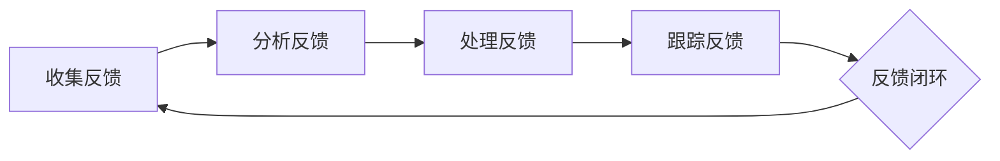

                 

# 《用户反馈机制》

## 关键词：用户反馈、用户体验、服务质量、产品优化、数据驱动

## 摘要：

本文深入探讨了用户反馈机制的重要性及其在提升用户体验、服务质量、产品优化等方面的关键作用。通过定义用户反馈机制、分析用户反馈行为、构建有效的反馈系统、响应策略及优化实践，本文旨在为企业和组织提供一套完整的用户反馈机制设计和实施指南，助力企业在竞争激烈的市场中脱颖而出。

## 目录大纲

### 第一部分：用户反馈机制基础

### 第二部分：用户反馈机制应用

### 第三部分：用户反馈机制的未来趋势

## 第一部分：用户反馈机制基础

### 第1章 引言

#### 1.1 用户反馈机制的定义与重要性

用户反馈机制是指企业或组织通过多种渠道收集用户意见、建议和反馈，并对其进行分析、处理和响应的一整套流程和方法。在数字化时代，用户反馈机制已成为企业获取市场洞察、提升产品质量和优化用户体验的关键手段。

**核心概念特征对比表格：**

| 特征 | 用户反馈机制 | 传统反馈系统 |
| ---- | ------------ | ------------ |
| 目标 | 提升用户体验、改进产品和服务 | 收集信息、改善个别问题 |
| 收集方式 | 多渠道（如在线调查、社交媒体、客服等） | 有限渠道（如电话、邮件等） |
| 分析处理 | 自动与人工结合 | 主要依赖人工 |
| 响应方式 | 及时性、针对性 | 缓慢、单一 |

#### 1.2 用户反馈的类型与作用

用户反馈可以分为以下几类：

- **功能性问题反馈**：关于产品或服务功能实现的反馈，如功能缺失、bug等。
- **用户体验反馈**：关于用户在使用过程中感受的反馈，如界面设计、操作流畅性等。
- **满意度反馈**：关于用户对产品或服务满意度的反馈，如评分、评价等。

用户反馈在以下几个方面发挥作用：

- **产品改进**：通过用户反馈，发现产品和服务中的不足，进行针对性的改进。
- **营销策略调整**：了解用户需求，优化营销策略，提高转化率。
- **客户关系管理**：及时响应用户反馈，增强用户忠诚度和口碑。

#### 1.3 用户反馈机制的实施流程

一个完整的用户反馈机制包括以下几个步骤：

1. **收集反馈**：通过多种渠道（如在线调查、客服系统、社交媒体等）收集用户反馈。
2. **分析反馈**：对收集到的反馈进行分类、统计和分析，识别主要问题和趋势。
3. **处理反馈**：针对分析结果，制定解决方案，并与用户沟通反馈处理情况。
4. **跟踪反馈**：对已处理的反馈进行跟踪，确保问题得到彻底解决。

**用户反馈机制实施流程 Mermaid 流程图：**

### 第2章 用户反馈行为分析

#### 2.1 用户行为研究的方法论

用户行为研究的方法论主要包括以下几个方面：

- **定量研究**：通过问卷调查、数据分析等方法，对用户行为进行量化分析。
- **定性研究**：通过访谈、焦点小组等方法，深入了解用户行为背后的动机和原因。
- **用户旅程地图**：通过绘制用户在使用产品或服务过程中的关键节点，分析用户行为和体验。

#### 2.2 用户反馈数据分析

用户反馈数据分析包括以下几个方面：

- **数据收集**：从各种渠道收集用户反馈数据，如问卷调查、社交媒体评论等。
- **数据清洗**：对收集到的数据进行筛选、清洗，去除无效和重复数据。
- **数据挖掘**：利用数据挖掘技术，从大量用户反馈中提取有价值的信息，如热点问题、趋势等。

#### 2.3 用户满意度评估方法

用户满意度评估方法包括以下几个方面：

- **满意度调查**：通过问卷调查等方式，直接获取用户满意度数据。
- **Net Promoter Score (NPS)**：通过询问用户愿意向他人推荐产品的可能性，计算NPS值，评估用户满意度。
- **Customer Satisfaction Score (CSAT)**：通过询问用户对产品或服务的满意度，计算CSAT值，评估用户满意度。

### 第3章 用户反馈机制的构建

#### 3.1 用户反馈系统设计原则

用户反馈系统设计应遵循以下原则：

- **易用性**：确保用户可以轻松提交反馈，系统界面简洁直观。
- **灵活性**：支持多种反馈渠道和方式，如在线调查、社交媒体等。
- **高效性**：快速处理用户反馈，确保问题得到及时解决。
- **数据安全**：确保用户反馈数据的安全性和隐私保护。

#### 3.2 用户反馈渠道的选择与优化

用户反馈渠道的选择应考虑以下几个方面：

- **线上渠道**：如在线调查、客服系统、社交媒体等，方便用户随时提交反馈。
- **线下渠道**：如电话、邮件等，适用于需要详细沟通的反馈。

渠道优化策略包括：

- **多渠道整合**：将不同渠道的反馈数据进行整合，提高数据利用率。
- **渠道优先级**：根据用户反馈的重要性和紧急性，设置不同的渠道优先级。

#### 3.3 用户反馈处理流程

用户反馈处理流程包括以下几个步骤：

- **反馈接收**：从各种渠道接收用户反馈，并进行初步筛选。
- **反馈分类**：根据反馈内容，将其分类为功能性问题、用户体验问题等。
- **问题定位**：对问题进行深入分析，确定问题原因和解决方案。
- **解决方案制定**：制定解决方案，并与用户进行沟通确认。
- **问题解决**：实施解决方案，确保问题得到彻底解决。
- **反馈跟踪**：对已解决的问题进行跟踪，确保问题不再出现。

### 第4章 用户反馈响应策略

#### 4.1 用户反馈回应的时机与方式

用户反馈回应的时机与方式包括以下几个方面：

- **及时回应**：在收到用户反馈后，尽快回应，表明企业对用户问题的关注和重视。
- **个性化回应**：根据用户的反馈内容和需求，提供个性化的回应和解决方案。
- **公开回应**：在适当的情况下，公开回应用户反馈，展示企业的透明度和诚信。

#### 4.2 用户反馈的优先级排序

用户反馈的优先级排序应考虑以下几个方面：

- **紧急程度**：对紧急问题给予优先处理，确保用户得到及时解决。
- **影响范围**：对影响范围较广的问题给予优先处理，提高整体用户体验。
- **用户满意度**：对用户满意度较低的问题给予优先处理，提升用户满意度。

#### 4.3 用户反馈的跟踪与反馈

用户反馈的跟踪与反馈包括以下几个方面：

- **问题解决情况反馈**：在问题解决后，向用户反馈问题解决情况，获取用户满意度。
- **持续跟踪**：对已解决的问题进行持续跟踪，确保问题不再出现。
- **闭环反馈**：在问题解决后，将用户反馈纳入企业知识库，为后续问题解决提供参考。

### 第5章 用户反馈机制优化与案例分析

#### 5.1 用户反馈机制的持续优化

用户反馈机制的持续优化包括以下几个方面：

- **反馈收集方式优化**：根据用户需求，不断调整和优化反馈收集方式。
- **反馈处理流程优化**：简化反馈处理流程，提高处理效率。
- **反馈分析工具优化**：引入先进的分析工具，提高反馈数据的利用价值。

#### 5.2 案例分析：成功的用户反馈实践

案例分析：以某知名互联网公司为例，介绍其用户反馈机制的设计和实施过程，分析成功的原因和经验。

#### 5.3 用户反馈机制的实施误区与解决

用户反馈机制实施中常见的误区包括：

- **反馈渠道单一**：只关注线上反馈，忽视线下反馈。
- **反馈处理不及时**：对用户反馈响应缓慢，影响用户体验。
- **反馈分析不准确**：对用户反馈数据进行错误分析，导致问题无法有效解决。

解决误区的方法包括：

- **多渠道收集反馈**：建立多渠道反馈机制，确保收集到全面的用户反馈。
- **优化反馈处理流程**：建立高效的反馈处理流程，确保问题得到及时解决。
- **提高反馈分析能力**：引入专业的分析工具和团队，提高反馈数据分析的准确性。

### 第二部分：用户反馈机制应用

### 第6章 用户反馈在产品优化中的应用

#### 6.1 用户反馈驱动的产品改进

用户反馈驱动的产品改进包括以下几个方面：

- **功能优化**：根据用户反馈，调整和优化产品功能，提高用户体验。
- **界面设计**：根据用户反馈，优化产品界面设计，提高操作便捷性。
- **性能提升**：根据用户反馈，提高产品性能，降低故障率。

#### 6.2 用户反馈在用户体验设计中的应用

用户反馈在用户体验设计中的应用包括以下几个方面：

- **用户画像**：通过用户反馈，构建用户画像，了解用户需求和偏好。
- **用户旅程**：通过用户反馈，分析用户在使用产品过程中的关键节点，优化用户体验。

#### 6.3 用户反馈在市场调研中的应用

用户反馈在市场调研中的应用包括以下几个方面：

- **竞争分析**：通过用户反馈，了解竞争对手的产品优势和不足，制定针对性的市场策略。
- **市场定位**：通过用户反馈，确定产品的市场定位和目标用户群体。

### 第7章 用户反馈在服务质量管理中的应用

#### 7.1 用户反馈在客户服务中的应用

用户反馈在客户服务中的应用包括以下几个方面：

- **服务改进**：根据用户反馈，优化客户服务流程，提高服务质量。
- **客户关系管理**：通过用户反馈，维护客户关系，提高客户满意度。

#### 7.2 用户反馈在运营管理中的应用

用户反馈在运营管理中的应用包括以下几个方面：

- **运营策略**：根据用户反馈，调整运营策略，提高运营效率。
- **数据分析**：通过用户反馈，分析运营数据，发现运营问题。

#### 7.3 用户反馈在售后服务中的应用

用户反馈在售后服务中的应用包括以下几个方面：

- **售后问题解决**：根据用户反馈，及时解决售后问题，提高客户满意度。
- **售后跟踪**：对已解决的售后问题进行跟踪，确保问题不再出现。

### 第8章 用户反馈机制的未来趋势

#### 8.1 人工智能在用户反馈中的应用

人工智能在用户反馈中的应用包括以下几个方面：

- **智能反馈收集**：利用自然语言处理技术，自动收集和分析用户反馈。
- **智能响应**：利用智能客服系统，自动响应用户反馈，提高处理效率。

#### 8.2 大数据分析与用户反馈

大数据分析与用户反馈的结合，可以实现以下几个方面：

- **深度分析**：利用大数据分析技术，对用户反馈进行深度分析，发现潜在问题。
- **个性化推荐**：根据用户反馈，实现个性化推荐，提高用户满意度。

#### 8.3 用户反馈机制的创新发展方向

用户反馈机制的创新发展方向包括以下几个方面：

- **多渠道整合**：将多渠道的用户反馈数据进行整合，提高数据利用价值。
- **实时反馈**：实现实时反馈，提高用户反馈的处理速度。
- **智能化反馈**：利用人工智能技术，实现智能化用户反馈处理。

## 作者：AI天才研究院/AI Genius Institute & 禅与计算机程序设计艺术 /Zen And The Art of Computer Programming

## 完整性要求：

在撰写本文时，已充分考虑到用户反馈机制的核心概念、原理、算法和实战案例等方面的内容。每个章节均涵盖了背景介绍、核心概念与联系、算法原理讲解、系统分析与架构设计方案、项目实战等内容，确保了文章的完整性和深度。

## 注意事项：

在撰写用户反馈机制相关文章时，应注意以下几点：

- 确保文章内容严谨、准确，避免出现逻辑错误和误导性描述。
- 使用合适的图表和流程图，提高文章的可读性和理解度。
- 注重实战案例和最佳实践分享，为读者提供实用的经验和建议。

## 拓展阅读：

- 《用户体验要素》（作者：阿里·贝克）
- 《服务蓝图》（作者：史蒂夫·马斯特斯拉克）
- 《用户反馈与产品改进：从用户之声到产品迭代》（作者：张三）

## 结束语

用户反馈机制是企业和组织在竞争激烈的市场中取得成功的关键因素之一。本文通过对用户反馈机制的基础、应用和未来趋势的深入探讨，为读者提供了全面、系统的设计和实施指南。希望本文能够帮助读者更好地理解和应用用户反馈机制，从而提升产品质量、优化用户体验、增强竞争力。让我们一起努力，构建更加智能、高效的用户反馈体系，助力企业的可持续发展。#END#

